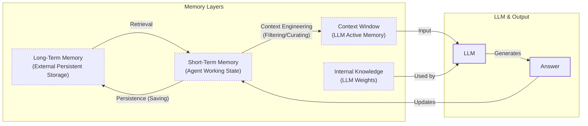
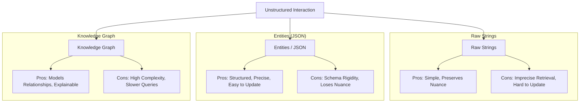

# How Does Memory for AI Agents Work?

In our previous lessons, we built a foundation in AI Engineering, covering context engineering, structured outputs, and building agents that can reason and use tools. As we build more complex applications, a core challenge emerges: making agents that remember.

Everyone’s talking about AI agents, but an agent without memory is like an intern with amnesia. They might be brilliant, but they cannot recall previous conversations or learn from experience. This is because LLMs are fundamentally stateless; their knowledge is vast but frozen in time, and they are unable to learn by updating their weights after training—a problem known as “continual learning” [[1]](https://arxiv.org/html/2510.17281v2).

To overcome this, we use the context window as a form of “working memory.” However, keeping an entire conversation thread plus additional information in the context window is often unrealistic. Rising costs per turn and the “lost in the middle” problem—where models struggle to use information buried in the center of a long prompt—limit this approach [[2]](https://arxiv.org/abs/2307.03172). While context windows are increasing, relying solely on them introduces noise and overhead.

Memory tools act as the solution. They provide agents with continuity, adaptability, and the ability to “learn” without retraining. When we first started building agents, working with 8k or 16k token limits forced us to engineer complex compression systems. Today, with million-token context windows, we have more breathing room, but the principles of organizing memory remain essential for performance.

In this article, we will explore:

1.  The fundamental layers of memory for AI agents.
2.  A detailed look at long-term memory: Semantic, Episodic, and Procedural.
3.  The trade-offs between storing memories as strings, entities, or knowledge graphs.
4.  A hands-on implementation of these memory types.
5.  Real-world challenges and best practices for designing memory systems.

## The Layers of Memory: Internal, Short-Term, and Long-Term

To build effective agents, we must distinguish between the different places information lives. We can borrow terms from biology and cognitive science to categorize these layers, which is useful for engineering our systems [[3]](https://arxiv.org/html/2309.02427). There are three distinct memory layers based on their persistence and proximity to the model’s reasoning core.

**Internal Knowledge** is the static, pre-trained knowledge baked into the LLM’s weights. It is the best place to store general world knowledge—models know about entire books without needing them in the context window. However, this memory is frozen at the time of training.

**Short-Term Memory** is the RAM of the entire agentic system. It contains the active context window plus recent interactions, conversation history, and details retrieved from long-term memory. We slice this short-term memory to create the context window for a single inference step. It is volatile and fast, simulating the feeling of “learning” during a session [[4]](https://www.ibm.com/think/topics/ai-agent-memory).

**Long-Term Memory** is the external, persistent storage system (like a disk) where an agent saves and retrieves information. This layer provides the personalization and continuity that internal knowledge lacks and short-term memory cannot retain [[5]](https://decodingml.substack.com/p/memory-the-secret-sauce-of-ai-agents).

The dynamic between these layers creates the agent’s intelligence. First, part of the long-term memory is “retrieved” and brought into short-term memory. This retrieval pipeline, often a form of Retrieval-Augmented Generation (RAG), queries different memory types in parallel. Next, we slice the short-term memory into an active context window through context engineering. Finally, during inference, the LLM uses its internal weights plus the active context to generate output.



Image 1: A flowchart illustrating the hierarchical relationship and dynamic data flow between an AI agent's memory layers.

Categorizing memory this way is critical for engineering. Internal knowledge handles general reasoning, short-term memory manages the immediate task, and long-term memory handles personalization and continuity. No single layer can perform all three functions effectively. To better understand long-term memory, we can further apply cognitive science definitions to specific data types.

## Long-Term Memory: Semantic, Episodic, and Procedural

Long-term memory is not a single bucket of text. It consists of three distinct types, each serving a different role in making an agent “intelligent” [[3]](https://arxiv.org/html/2309.02427), [[6]](https://www.newsletter.swirlai.com/p/memory-in-agent-systems).

### Semantic Memory (Facts & Knowledge)

Semantic memory is the agent’s encyclopedia. It stores individual pieces of knowledge or “facts.” These can be independent strings, such as *“The user is a vegetarian,”* or structured attributes attached to an entity, like `{"food_restrictions": "vegetarian"}`. This is where the agent stores concepts and relationships regarding specific domains, people, or places.

The primary role of semantic memory is to provide a reliable source of truth. For an enterprise agent, this might involve storing internal company documents or technical manuals. For a personal assistant, semantic memory builds a persistent user profile. It recalls specific preferences like `{"music": "User likes rock music"}` or constraints like `{"dog": "User has a dog named George"}`. This allows the agent to retrieve relevant facts without searching through a noisy conversation history.

### Episodic Memory (Experiences & History)

Episodic memory is the agent’s personal diary. It records past interactions, but unlike timeless facts, these memories have a timestamp. It captures *“what happened and when.”*

This memory type is essential for maintaining conversational context and understanding relationship dynamics. A semantic fact might be *“User is frustrated with his brother.”* An episodic memory would be: *“On Tuesday, the user expressed frustration that their brother, Mark, always forgets their birthday. I provided an empathetic response. [created_at=2025-08-25].”* This “episode” provides nuanced context. If the topic comes up again, the agent can say, “I know the topic of your brother’s birthday can be sensitive,” rather than just stating a fact. It also allows the agent to answer questions like *“What happened last week?”* [[7]](https://www.youtube.com/watch?v=7AmhgMAJIT4&list=PLDV8PPvY5K8VlygSJcp3__mhToZMBoiwX&index=112).

### Procedural Memory (Skills & How-To)

Procedural memory is the agent’s muscle memory. It consists of skills, learned workflows, and “how-to” knowledge. It dictates the agent’s ability to perform multi-step tasks.

This memory is often baked into the agent’s system prompt as reusable tools or defined sequences. For example, an agent might store a `MonthlyReportIntent` procedure. When a user asks for a report, the agent retrieves this procedure: 1) Query sales DB, 2) Summarize findings, 3) Email user. This makes behavior reliable and predictable. It encodes successful workflows so the agent does not have to reason from scratch every time [[8]](https://arxiv.org/html/2508.06433v2).

Now that we know what to save, we must decide *how* to store it.

## Storing Memories: Pros and Cons of Different Approaches

The way an agent’s memories are stored is an architectural decision that impacts performance, complexity, and scalability. There is no one-size-fits-all solution; the ideal approach depends on the product's use case. Let’s explore the three primary methods we experiment with as AI Engineers.



Image 2: A diagram visualizing the trade-offs between the three primary memory storage approaches.

### Storing Memories as Raw Strings

This is the simplest method. Conversational turns or documents are stored as plain text and indexed for vector search.

**Pros:** It is simple and fast to set up, requiring minimal engineering. It preserves nuance, capturing emotional tone and linguistic cues without loss in translation [[1]](https://www.decodingai.com/p/how-does-memory-for-ai-agents-work).

**Cons:** Retrieval is often imprecise. A query like “What is my brother’s job?” might retrieve every conversation mentioning “brother” and “job” without pinpointing the current fact. Updating is difficult; if a user corrects a fact (“My brother is now a doctor”), the new string just adds to the log, creating potential contradictions. It also lacks structure, making it hard to distinguish state changes over time (e.g., “Barry *was* CEO” vs. “Claude *is* CEO”) [[1]](https://www.decodingai.com/p/how-does-memory-for-ai-agents-work).

### Storing Memories as Entities (JSON-like Structures)

Here, we use an LLM to transform messy interactions into structured memories, stored in formats like JSON within document or SQL databases.

**Pros:** It allows for precise, field-level filtering (e.g., `{"user": {"brother": {"job": "Software Engineer"}}}`). The agent can retrieve specific facts without ambiguity. Updates are easier by overwriting the relevant field. This is ideal for semantic memory like user profiles [[1]](https://www.decodingai.com/p/how-does-memory-for-ai-agents-work).

**Cons:** It requires upfront schema design complexity and can be rigid. If the agent encounters information that doesn’t fit the schema, that data might be lost [[9]](https://danielp1.substack.com/p/memex-20-memory-the-missing-piece). The extraction process also strips away the rich subtext of the original conversation. The fact `"user_likes": ["cats"]` is far less representative than the original message, "Petting my cat is the best part of my day."

### Storing Memories in a Knowledge Graph

This is the most advanced approach. Memories are stored as a network of nodes (entities) and edges (relationships) using databases such as Neo4j.

**Pros:** It excels at representing complex relationships (e.g., `(User) -> [HAS_BROTHER] -> (Mark)`). It offers superior contextual and temporal awareness by modeling time as a property of a relationship (e.g., `[RECOMMENDED_ON_DATE]`). Retrieval is also auditable, as you can trace the path of reasoning, which builds trust [[1]](https://www.decodingai.com/p/how-does-memory-for-ai-agents-work), [[10]](https://www.octoco.ai/blog/knowledge-graphs-as-memory).

**Cons:** It has the highest complexity and cost. Converting unstructured text into graph triples is difficult. Graph traversals can be slower than vector lookups, potentially impacting real-time performance. For simple use cases, it is often overkill [[1]](https://www.decodingai.com/p/how-does-memory-for-ai-agents-work).

The choice should be guided by your product’s needs. Start simple and evolve as complexity grows.

## Memory Implementations with Code Examples

Let's look at how to implement these memory types. While RAG is the mechanism for *retrieving* information—a topic for our next lesson—the creation of high-quality memories is an equally important, preceding step. We will use the `mem0` open-source library to demonstrate a simple "raw string" storage approach.

### Setup

First, we will set up our environment. `mem0` is a memory layer for AI agents that can be configured with different LLMs, embedding models, and vector stores [[11]](https://arxiv.org/html/2504.19413). We will use Gemini for the LLM and embeddings, with a local ChromaDB instance for storage.

1.  We configure `mem0` with Gemini models and a local ChromaDB vector store.

    ```python
    import os
    from typing import Optional
    from google import genai
    from mem0 import Memory
    
    # Assumes GOOGLE_API_KEY is set in the environment
    client = genai.Client()
    MODEL_ID = "gemini-1.5-flash"
    
    MEM0_CONFIG = {
        "embedder": {
            "provider": "gemini",
            "config": { "model": "text-embedding-004" },
        },
        "vector_store": {
            "provider": "chroma",
            "config": { "path": "/tmp/chroma_mem0" },
        },
        "llm": {
            "provider": "gemini",
            "config": { "model": MODEL_ID },
        },
    }
    
    memory = Memory.from_config(MEM0_CONFIG)
    MEM_USER_ID = "student_1"
    memory.delete_all(user_id=MEM_USER_ID)
    ```

2.  We define helper functions to add and search for memories, tagging each with a category.

    ```python
    def mem_add_text(text: str, category: str = "semantic", **meta) -> str:
        """Add a single text memory without LLM-based fact extraction."""
        metadata = {"category": category, **meta}
        memory.add(text, user_id=MEM_USER_ID, metadata=metadata, infer=False)
        return f"Saved {category} memory."
    
    def mem_search(query: str, limit: int = 5, category: Optional[str] = None) -> list[dict]:
        """Search memories, with optional client-side category filtering."""
        res = memory.search(query, user_id=MEM_USER_ID, limit=limit) or {}
        items = res.get("results", [])
        if category:
            items = [r for r in items if r.get("metadata", {}).get("category") == category]
        return items
    ```

### Semantic Memory: Extracting Facts

Semantic memory is created by extracting factual data from conversations. This process turns unstructured text into a queryable knowledge base.

1.  We insert a few facts about the user into our semantic memory.

    ```python
    facts: list[str] = [
        "User prefers vegetarian meals.",
        "User has a dog named George.",
        "User is allergic to gluten.",
        "User's brother is named Mark and is a software engineer.",
    ]
    for f in facts:
        mem_add_text(f, category="semantic")
    ```

2.  Now, we can search for this specific information using a natural language query.

    ```python
    results = memory.search("brother job", user_id=MEM_USER_ID, limit=1)
    print(results["results"][0]["memory"])
    ```

    It outputs:

    ```text
    User's brother is named Mark and is a software engineer.
    ```

### Episodic Memory: The Log of Events

Episodic memory functions as a chronological log. We can create an "episode" by summarizing a short conversation and storing it with a timestamp.

1.  We define a short dialogue and use an LLM to summarize it into a concise episode.

    ```python
    dialogue = [
        {"role": "user", "content": "I'm stressed about my project deadline on Friday."},
        {"role": "assistant", "content": "I’m here to help—what’s the blocker?"},
        {"role": "user", "content": "Mainly testing. I also prefer working at night."},
        {"role": "assistant", "content": "Okay, we can split testing into two sessions."},
    ]
    
    episodic_prompt = f"Summarize the following turns as one concise 'episode' (1–2 sentences).\n\n{dialogue}"
    episode_summary = client.models.generate_content(model=MODEL_ID, contents=episodic_prompt)
    episode = episode_summary.text.strip()
    ```

2.  We save this summary as an episodic memory, along with metadata about the interaction.

    ```python
    mem_add_text(episode, category="episodic", summarized=True, turns=4)
    ```

3.  Later, we can search for this "experience" to recall the context of that interaction.

    ```python
    hits = mem_search("deadline stress", limit=1, category="episodic")
    print(f"{hits[0]['memory']}\n")
    ```

    It outputs:

    ```text
    A user, stressed about a Friday project deadline because of testing and a preference for working at night, is advised to split the testing work into two manageable sessions.
    ```

### Procedural Memory: Defining and Learning Skills

Procedural memory can be created by developers or learned from user interactions. Here, we will define a simple procedure and store it for later retrieval.

1.  We define a multi-step procedure as a text block.

    ```python
    procedure_name = "monthly_report"
    steps = [
        "Query sales DB for the last 30 days.",
        "Summarize top 5 insights.",
        "Ask user whether to email or display.",
    ]
    procedure_text = f"Procedure: {procedure_name}\nSteps:\n" + "\n".join(f"{i + 1}. {s}" for i, s in enumerate(steps))
    
    mem_add_text(procedure_text, category="procedure", procedure_name=procedure_name)
    ```

2.  When the user's intent matches the procedure, the agent can retrieve and execute it.

    ```python
    results = mem_search("how to create a monthly report", category="procedure", limit=1)
    if results:
        print(results[0]["memory"])
    ```

    It outputs:

    ```text
    Procedure: monthly_report
    Steps:
    1. Query sales DB for the last 30 days.
    2. Summarize top 5 insights.
    3. Ask user whether to email or display.
    ```

## Real-World Lessons: Challenges and Best Practices

Moving from these examples to a reliable, production-ready system requires navigating complex trade-offs that are constantly evolving with the technology. Here are some of the most important lessons learned from building and scaling agent memory systems.

**Re-evaluating compression:** A few years ago, small and expensive context windows (8k or 16k tokens) forced us to be ruthless with compression. We distilled every interaction into its most compact form, but this process is inherently lossy. Today, with million-token context windows, the best practice is to lean towards less compression. The raw, unstructured conversational history is the ultimate source of truth, containing emotional subtext and nuance that extraction often misses [[7]](https://www.youtube.com/watch?v=7AmhgMAJIT4&list=PLDV8PPvY5K8VlygSJcp3__mhToZMBoiwX&index=112). Design your system to work with the most complete version of history that is feasible, using extraction for indexing but treating the raw log as the ground truth.

**Designing for the Product:** There is no "perfect" memory architecture. The most common failure mode is over-engineering a complex system for a product that does not need it. Start from first principles by defining the core function of your agent. A Q&A bot over internal documents needs a robust RAG pipeline. A long-term personal companion benefits from rich episodic memories. A task-automation agent relies on procedural memory to execute workflows reliably. The product's goal should dictate the memory architecture, not the other way around [[27]](https://machinelearningmastery.com/beyond-short-term-memory-the-3-types-of-long-term-memory-ai-agents-need/).

**The Human Factor:** Memory exists to make the agent smarter, not to give the user a new job. Exposing the internal workings of the memory system can create significant cognitive overhead. Users should not be asked to "garden their agent's memories" [[7]](https://www.youtube.com/watch?v=7AmhgMAJIT4&list=PLDV8PPvY5K8VlygSJcp3__mhToZMBoiwX&index=112). This breaks the illusion of a capable assistant and turns the interaction into a tedious data-entry task. Memory management should be an autonomous function of the agent. It should learn from corrections within the natural flow of conversation and have internal processes to consolidate and resolve conflicting information [[20]](https://towardsdatascience.com/a-practical-guide-to-memory-for-autonomous-llm-agents/).

## Conclusion

Memory is the component that transforms a stateless chat application into a personalized agent. It is the current engineering solution to the problem of continual learning. By constantly engineering the context window, we allow agents to “learn” and adapt over time. While today's memory tools are a temporary solution, they are a powerful and necessary step toward more intelligent systems.

In our next lesson, we will dive deep into Retrieval-Augmented Generation (RAG), exploring how agents retrieve the right information from these memory stores. We will then move on to handling multimodal data, building production-ready agents with monitoring and evaluation, and exploring advanced concepts like the Model Context Protocol (MCP).

## References

- [1] Iusztin, P. (2025, December 2). How Does Memory for AI Agents Work?. Decoding AI Magazine. [https://www.decodingai.com/p/how-does-memory-for-ai-agents-work](https://www.decodingai.com/p/how-does-memory-for-ai-agents-work)
- [2] Liu, N. F., Lin, K., Hewitt, J., Paranjape, A., Bevilacqua, M., Petroni, F., & Liang, P. (2023). Lost in the Middle: How Language Models Use Long Contexts. arXiv preprint arXiv:2307.03172. [https://arxiv.org/abs/2307.03172](https://arxiv.org/abs/2307.03172)
- [3] Sumers, T. R., Yao, S., Narasimhan, K., & Griffiths, T. L. (2023). Cognitive Architectures for Language Agents. arXiv. [https://arxiv.org/html/2309.02427](https://arxiv.org/html/2309.02427)
- [4] What is AI agent memory?. (n.d.). IBM. [https://www.ibm.com/think/topics/ai-agent-memory](https://www.ibm.com/think/topics/ai-agent-memory)
- [5] Iusztin, P. (2024, May 21). Memory: The secret sauce of AI agents. Decoding AI Magazine. [https://decodingml.substack.com/p/memory-the-secret-sauce-of-ai-agent](https://decodingml.substack.com/p/memory-the-secret-sauce-of-ai-agent)
- [6] Griciūnas, A. (2024, October 30). Memory in Agent Systems. SwirlAI Newsletter. [https://www.newsletter.swirlai.com/p/memory-in-agent-systems](https://www.newsletter.swirlai.com/p/memory-in-agent-systems)
- [7] Whitmore, S. (2025, June 18). What is the perfect memory architecture?. YouTube. [https://www.youtube.com/watch?v=7AmhgMAJIT4&list=PLDV8PPvY5K8VlygSJcp3__mhToZMBoiwX&index=112](https://www.youtube.com/watch?v=7AmhgMAJIT4&list=PLDV8PPvY5K8VlygSJcp3__mhToZMBoiwX&index=112)
- [8] Mem^p: A Framework for Procedural Memory in Agents. (n.d.). arXiv. [https://arxiv.org/html/2508.06433v2](https://arxiv.org/html/2508.06433v2)
- [9] Chalef, D. (2024, June 25). Memex 2.0: Memory The Missing Piece for Real Intelligence. Substack. [https://danielp1.substack.com/p/memex-20-memory-the-missing-piece](https://danielp1.substack.com/p/memex-20-memory-the-missing-piece)
- [10] Lintvelt, H. (n.d.). Knowledge Graphs as Memory: Why Your AI Agent Needs to Think in Relationships. OctoCo. [https://www.octoco.ai/blog/knowledge-graphs-as-memory](https://www.octoco.ai/blog/knowledge-graphs-as-memory)
- [11] Chhikara, P. (2025). Mem0: Building Production-Ready AI Agents with Scalable Long-Term Memory. arXiv. [https://arxiv.org/html/2504.19413](https://arxiv.org/html/2504.19413)
- [27] Beyond Short-term Memory: The 3 Types of Long-term Memory AI Agents Need. (n.d.). MachineLearningMastery.com. [https://machinelearningmastery.com/beyond-short-term-memory-the-3-types-of-long-term-memory-ai-agents-need/](https://machinelearningmastery.com/beyond-short-term-memory-the-3-types-of-long-term-memory-ai-agents-need/)
- [20] Lawson, N. (2026, April 17). A Practical Guide to Memory for Autonomous LLM Agents. Towards Data Science. [https://towardsdatascience.com/a-practical-guide-to-memory-for-autonomous-llm-agents/](https://towardsdatascience.com/a-practical-guide-to-memory-for-autonomous-llm-agents/)