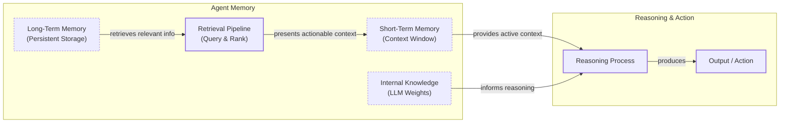

# How Does Memory for AI Agents Work?

In the previous lessons, we covered the agent landscape, the difference between workflows and agents, context engineering, structured outputs, and the mechanics of agentic reasoning with ReAct. We have built a solid foundation for understanding how agents think and act.

Now, we will tackle one of the most important components of building intelligent systems: memory. An LLM without memory is like an intern with amnesia. They might be brilliant, but they cannot recall previous conversations or learn from experience. The core problem is that LLMs are stateless; their knowledge is vast but frozen in time, and they are fundamentally unable to update their weights after training, a problem known as “continual learning” [[1]](https://arxiv.org/html/2510.17281v2).

To overcome this, we use the context window as a form of “working memory.” However, keeping an entire conversation thread plus additional information in the context window is often unrealistic. Rising costs per turn and the “lost in the middle” problem—where models struggle to use information buried in the center of a long prompt—limit this approach [[2]](https://arxiv.org/abs/2307.03172). While context windows are increasing, relying solely on them introduces noise and overhead.

Memory tools provide a temporary solution. They give agents continuity, adaptability, and the ability to “learn” without retraining. When we first started building agents, working with 8k or 16k token limits forced us to engineer complex compression systems. Today, with million-token context windows, we have more room, but the principles of organizing memory remain essential for performance [[3]](https://www.youtube.com/watch?v=7AmhgMAJIT4&list=PLDV8PPvY5K8VlygSJcp3__mhToZMBoiwX&index=112).

In this lesson, we will explore the fundamental layers of agent memory, the different types of long-term storage, implementation trade-offs, and real-world best practices. To start, we can borrow terms from biology and cognitive science to categorize the different places information lives.

## The Layers of Memory: Internal, Short-Term, and Long-Term

To build effective agents, we can borrow terms from biology and cognitive science to categorize memory layers in a way that is useful for engineering [[4]](https://arxiv.org/html/2309.02427). There are three distinct layers based on their persistence and proximity to the model’s reasoning core.

**Internal Knowledge** is the static, pre-trained information baked into the LLM’s weights. It is the best place to store general world knowledge—models know about entire books without needing them in the context window. However, this memory is read-only and frozen at the time of training.

**Short-Term Memory** is the active context window passed to the LLM during a specific call. It acts as the RAM of the agent. It is volatile and fast, but it is also the only “reality” the model sees during inference. This is how we simulate “learning” during a session [[5]](https://www.ibm.com/think/topics/ai-agent-memory).

**Long-Term Memory** is the external, persistent storage system (the disk) where an agent saves and retrieves information. This layer provides the personalization and context that internal knowledge lacks and short-term memory cannot retain [[6]](https://decodingml.substack.com/p/memory-the-secret-sauce-of-ai-agents).

The dynamic between these layers creates the agent’s intelligence. First, part of the long-term memory is “retrieved” and brought into short-term memory. This retrieval pipeline queries different memory types in parallel. Next, we slice the short-term memory into an active context window through context engineering. Finally, during inference, the LLM uses its internal weights plus the active context window to generate output.


Image 1: A hierarchy and flow diagram illustrating the three fundamental layers of an agent's memory system: Internal Knowledge, Short-Term Memory (Context Window), and Long-Term Memory, including a retrieval pipeline and the reasoning and action phases.

Categorizing memory this way is critical for engineering. Internal knowledge handles general reasoning. Short-term memory manages the immediate task. Long-term memory handles personalization and continuity. No single layer can perform all three functions effectively. To better understand long-term memory, we can further apply cognitive science definitions to specific data types.

## Long-Term Memory: Semantic, Episodic, and Procedural

Long-term memory is not a single bucket of text. It consists of three distinct types, each serving a different role in making an agent “intelligent” [[4]](https://arxiv.org/html/2309.02427), [[7]](https://www.newsletter.swirlai.com/p/memory-in-agent-systems).

### Semantic Memory (Facts & Knowledge)

Semantic memory is the agent’s encyclopedia. It stores individual pieces of knowledge or “facts.” These can be independent strings, such as *“The user is a vegetarian,”* or structured attributes attached to an entity, like `{"food restrictions": "User is a vegetarian"}`. This is where the agent stores concepts and relationships regarding specific domains, people, or places.

The primary role of semantic memory is to provide a reliable source of truth. For an enterprise agent, this might involve storing internal company documents or technical manuals. For a personal assistant, semantic memory builds a persistent user profile. It recalls specific preferences like `{"music": "User likes rock music"}` or constraints like `{"dog": "User has a dog named George"}`. This allows the agent to retrieve relevant facts without searching through a noisy conversation history [[8]](https://machinelearningmastery.com/beyond-short-term-memory-the-3-types-of-long-term-memory-ai-agents-need/).

### Episodic Memory (Experiences & History)

Episodic memory is the agent’s personal diary. It records past interactions, but unlike timeless facts, these memories have a timestamp. It captures *“what happened and when.”*

This memory type is essential for maintaining conversational context and understanding relationship dynamics. A semantic fact might be *“User is frustrated with his brother.”* An episodic memory would be: *“On Tuesday, the user expressed frustration that their brother, Mark, always forgets their birthday. I provided an empathetic response. [created_at=2025-08-25].”*

This “episode” provides nuanced context. If the topic comes up again, the agent can say, “I know the topic of your brother’s birthday can be sensitive,” rather than just stating a fact. It also allows the agent to answer questions like *“What happened last week?”* [[3]](https://www.youtube.com/watch?v=7AmhgMAJIT4&list=PLDV8PPvY5K8VlygSJcp3__mhToZMBoiwX&index=112).

### Procedural Memory (Skills & How-To)

Procedural memory is the agent’s muscle memory. It consists of skills, learned workflows, and “how-to” knowledge. It dictates the agent’s ability to perform multi-step tasks.

This memory is often baked into the agent’s system prompt as reusable tools or defined sequences. For example, an agent might store a `MonthlyReportIntent` procedure. When a user asks for a report, the agent retrieves this procedure: 1) Query sales DB, 2) Summarize findings, 3) Email user. This makes behavior reliable and predictable. It encodes successful workflows so the agent does not have to reason from scratch every time [[9]](https://arxiv.org/html/2508.06433v2).

Now that we know what to save, we must decide *how* to store it.

## Storing Memories: Pros and Cons of Different Approaches

The way an agent’s memories are stored is an architectural decision that impacts performance, complexity, and scalability. There is no one-size-fits-all solution. Let’s explore the three primary methods we experiment with as AI Engineers [[10]](https://danielp1.substack.com/p/memex-20-memory-the-missing-piece).

| Approach | Pros | Cons |
| :--- | :--- | :--- |
| **Raw Strings** | Simple to set up, preserves nuance and emotional tone. | Imprecise retrieval, difficult to update, lacks structure for state changes. |
| **Entities (JSON)** | Precise filtering, easy updates, ideal for semantic memory. | Upfront schema design, can be rigid, loss of original nuance. |
| **Knowledge Graph** | Represents complex relationships, superior temporal awareness, auditable. | Highest complexity and cost, slower queries, often overkill for simple cases. |

Table 1: A comparison of the three primary methods for storing agent memories.

### Storing Memories as Raw Strings

This is the simplest method. Conversational turns or documents are stored as plain text and indexed for vector search.

**Pros:** It is simple and fast to set up, requiring minimal engineering. It preserves nuance, capturing emotional tone and linguistic cues without loss in translation.

**Cons:** Retrieval is often imprecise. A query like “What is my brother’s job?” might retrieve every conversation mentioning “brother” and “job” without pinpointing the current fact. Updating is difficult; if a user corrects a fact (“My brother is now a doctor”), the new string just adds to the log, creating potential contradictions. It also lacks structure, making it hard to distinguish state changes over time (e.g., “Barry *was* CEO” vs. “Claude *is* CEO”) [[11]](https://towardsdatascience.com/a-practical-guide-to-memory-for-autonomous-llm-agents/).

### Storing Memories as Entities (JSON-like Structures)

Here, we use an LLM to transform messy interactions into structured memories, stored in formats like JSON within document databases.

**Pros:** It allows for precise, field-level filtering (e.g., `“user”: {”brother”: {”job”: “Software Engineer”}}`). The agent can retrieve specific facts without ambiguity. Updates are easier; you simply overwrite the relevant field. This is ideal for semantic memory like user profiles or preferences.

**Cons:** It requires upfront schema design complexity. It can be rigid; if the agent encounters information that does not fit the schema, that data might be lost unless the schema is updated [[10]](https://danielp1.substack.com/p/memex-20-memory-the-missing-piece). Also, the extraction process strips away the rich subtext of the original conversation. The factual memory `"user_likes": ["cats"]` is far less representative than the original message, "Petting my cat is the best part of my day."

### Storing Memories in a Knowledge Graph

This is the most advanced approach. Memories are stored as a network of nodes (entities) and edges (relationships) using databases such as Neo4j.

**Pros:** It excels at representing complex relationships, enabling multi-hop reasoning that is difficult for standard RAG. For example, answering “Which employees on Project Alpha also worked on the audit Bob mentioned?” requires traversing multiple connections that a graph can handle directly. It also offers superior temporal awareness by modeling time as an explicit property of a relationship, such as `(Alice)-[:WORKS_AT {valid_from: "2025-06"}]->(BigTech)`, which provides more accurate retrieval than vector search alone. Finally, retrieval is auditable; you can trace the path of reasoning, which builds trust [[15]](https://www.octoco.ai/blog/knowledge-graphs-as-memory).

**Cons:** It has the highest complexity and cost. Designing an effective graph schema requires deep domain knowledge, and the process of extracting entities from unstructured text adds latency to ingestion [[15]](https://www.octoco.ai/blog/knowledge-graphs-as-memory). Graph traversals for complex queries can be slower than vector lookups, adding 200-500ms of latency per turn and impacting real-time performance [[16]](https://genta.dev/resources/ai-agent-memory-types-architecture-guide). For many simple use cases, this approach is overkill [[12]](https://arxiv.org/html/2504.19413).

The choice should be guided by your product’s needs. Start simple and evolve as complexity grows. Now that we know what to save and how to store it, let's look at some code examples.

## Memory implementations with code examples

While Retrieval-Augmented Generation (RAG) is the mechanism for retrieving information, the creation of high-quality memories is an equally important, preceding step. We will cover RAG in the next lesson. To focus on the benefits of each memory category, we will use the simple "raw strings" storage approach with `mem0`, an open-source memory library.

### Setup

`mem0` is a library that provides a simple API for adding, searching, and managing memory for AI agents. We will configure it to use Gemini for both embeddings and LLM-based operations, with a local ChromaDB vector store.

1.  First, we configure `mem0` to use Gemini models and a local ChromaDB instance for storage.
    ```python
    import os
    from typing import Optional
    
    from google import genai
    from mem0 import Memory
    
    # Assumes GOOGLE_API_KEY is set in the environment
    client = genai.Client()
    MODEL_ID = "gemini-1.5-pro"
    
    MEM0_CONFIG = {
        "embedder": {
            "provider": "gemini",
            "config": {
                "model": "text-embedding-004",
                "api_key": os.getenv("GOOGLE_API_KEY"),
            },
        },
        "vector_store": {
            "provider": "chroma",
            "config": {
                "collection_name": "lesson9_memories",
                "path": "/tmp/chroma_mem0",
            },
        },
        "llm": {
            "provider": "gemini",
            "config": {
                "model": MODEL_ID,
                "api_key": os.getenv("GOOGLE_API_KEY"),
            },
        },
    }
    
    memory = Memory.from_config(MEM0_CONFIG)
    MEM_USER_ID = "lesson9_notebook_student"
    memory.delete_all(user_id=MEM_USER_ID)
    ```
    It outputs:
    ```text
    ✅ Mem0 ready (Gemini embeddings + local Chroma).
    ```
2.  Next, we define helper functions to add and search for memories, tagging them by category.
    ```python
    def mem_add_text(text: str, category: str = "semantic", **meta) -> str:
        """Add a single text memory. No LLM is used for extraction or summarization."""
        metadata = {"category": category}
        for k, v in meta.items():
            if isinstance(v, (str, int, float, bool)) or v is None:
                metadata[k] = v
            else:
                metadata[k] = str(v)
        memory.add(text, user_id=MEM_USER_ID, metadata=metadata, infer=False)
        return f"Saved {category} memory."
    
    
    def mem_search(query: str, limit: int = 5, category: Optional[str] = None) -> list[dict]:
        """
        Category-aware search wrapper.
        Returns the full result dicts so we can inspect metadata.
        """
        res = memory.search(query, user_id=MEM_USER_ID, limit=limit) or {}
    
        items = res.get("results", [])
        if category is not None:
            items = [r for r in items if (r.get("metadata") or {}).get("category") == category]
        return items
    ```

### Semantic Memory: Extracting Facts

Semantic memory is created through an extraction pipeline. After a conversation, an LLM with a specific prompt extracts factual data, turning messy conversation threads into a queryable knowledge base [[13]](https://blog.lqhl.me/mem0-how-three-prompts-created-a-viral-ai-memory-layer).

1.  We insert a few facts as atomic strings.
    ```python
    facts: list[str] = [
        "User prefers vegetarian meals.",
        "User has a dog named George.",
        "User is allergic to gluten.",
        "User's brother is named Mark and is a software engineer.",
    ]
    for f in facts:
        print(mem_add_text(f, category="semantic"))
    ```
    It outputs:
    ```text
    Saved semantic memory.
    Saved semantic memory.
    Saved semantic memory.
    Saved semantic memory.
    ```
2.  We can now search for this specific semantic information.
    ```python
    results = memory.search("brother job", user_id=MEM_USER_ID, limit=1)
    print(results["results"][0]["memory"])
    ```
    It outputs:
    ```text
    User's brother is named Mark and is a software engineer.
    ```

### Episodic Memory: The Log of Events

Episodic memory functions as a chronological log of events. An LLM can read conversation messages from a session and summarize the key insights, facts, or events, attaching a timestamp to each memory [[14]](https://docs.mem0.ai/platform/features/timestamp).

1.  We define a short dialogue and ask the LLM to summarize it into a single "episode."
    ```python
    dialogue = [
        {"role": "user", "content": "I'm stressed about my project deadline on Friday."},
        {"role": "assistant", "content": "I’m here to help—what’s the blocker?"},
        {"role": "user", "content": "Mainly testing. I also prefer working at night."},
        {"role": "assistant", "content": "Okay, we can split testing into two sessions."},
    ]
    
    episodic_prompt = f"""Summarize the following 3–4 turns as one concise 'episode' (1–2 sentences).
    Keep salient details and tone.
    
    {dialogue}
    """
    episode_summary = client.models.generate_content(model=MODEL_ID, contents=episodic_prompt)
    episode = episode_summary.text.strip()
    ```
2.  We save this summary as an episodic memory with additional metadata.
    ```python
    print(
        mem_add_text(
            episode,
            category="episodic",
            summarized=True,
            turns=4,
        )
    )
    ```
    It outputs:
    ```text
    Saved episodic memory.
    ```
3.  We can search for this "experience" later.
    ```python
    hits = mem_search("deadline stress", limit=1, category="episodic")
    for h in hits:
        print(f"{h['memory']}\n")
    ```
    It outputs:
    ```text
    A user, stressed about a Friday project deadline because of testing and a preference for working at night, is advised to split the testing work into two manageable sessions.
    ```

### Procedural Memory: Defining and Learning Skills

Procedural memory can be defined by a developer or learned from user interactions. An agent can save a sequence of steps as a new, callable procedure for future use.

1.  We define a procedure as a text block containing ordered steps.
    ```python
    procedure_name = "monthly_report"
    steps = [
        "Query sales DB for the last 30 days.",
        "Summarize top 5 insights.",
        "Ask user whether to email or display.",
    ]
    procedure_text = f"Procedure: {procedure_name}\nSteps:\n" + "\n".join(f"{i + 1}. {s}" for i, s in enumerate(steps))
    
    mem_add_text(procedure_text, category="procedure", procedure_name=procedure_name)
    ```
2.  We can then retrieve the procedure by intent.
    ```python
    results = mem_search("how to create a monthly report", category="procedure", limit=1)
    if results:
        print(results[0]["memory"])
    ```
    It outputs:
    ```text
    Procedure: monthly_report
    Steps:
    1. Query sales DB for the last 30 days.
    2. Summarize top 5 insights.
    3. Ask user whether to email or display.
    ```

Now that we have seen how to implement these memory types, let's discuss some of the challenges and best practices for building memory systems in production.

## Real-World Lessons: Challenges and Best Practices

Moving from theory to a reliable, production-ready system requires navigating complex trade-offs that are constantly evolving. Here are some important lessons learned from building and scaling agent memory systems.

### Re-evaluating compression

Just a few years ago, LLMs operated with small and expensive context windows of 8k or 16k tokens. This forced us to be ruthless with compression, distilling interactions into compact summaries or facts. While necessary, this process is inherently lossy. Today, with models offering million-token context windows at a fraction of the cost, the best practice is to lean towards less compression. The raw, unstructured conversational history is the ultimate source of truth. A fact might state, "User has a dog named George," but the episodic log reveals, "User mentioned that walking their dog named George is the best part of their day," a far more valuable piece of information for a personalized agent [[3]](https://www.youtube.com/watch?v=7AmhgMAJIT4&list=PLDV8PPvY5K8VlygSJcp3__mhToZMBoiwX&index=112).

The best practice is to design your system to work with the most complete version of history that is economically and technically feasible. Use summarization and fact extraction as tools for creating queryable indexes, but always treat the raw log as the ground truth.

### Designing for the Product

There is no "perfect" memory architecture. The most common failure mode is over-engineering a complex, multi-part memory system for a product that does not need it. The product's goal should dictate the memory architecture, not the other way around.

You should start from first principles by defining the core function of your agent [[8]](https://machinelearningmastery.com/beyond-short-term-memory-the-3-types-of-long-term-memory-ai-agents-need/). For a Q&A bot over internal documents, a simple RAG pipeline is the best starting point. For a long-term personal AI companion, rich episodic memories are beneficial. For a task-automation agent, procedural memory is likely the most useful. For compliance-critical domains like healthcare, the architecture must prioritize auditability. This often leads to hybrid systems where rule-based symbolic components handle predictable tasks, ensuring that agent behavior remains within safe, deterministic bounds [[17]](https://arxiv.org/html/2510.25445v1).

### The Human Factor

Memory exists to make the agent smarter, not to give the user a new job. A common pitfall is exposing the internal workings of the memory system to the user. While well-intentioned, this can create significant cognitive overhead [[3]](https://www.youtube.com/watch?v=7AmhgMAJIT4&list=PLDV8PPvY5K8VlygSJcp3__mhToZMBoiwX&index=112).

Users should not be asked to "garden their agent's memories." This breaks the illusion of a capable assistant and turns the interaction into a tedious data-entry task. Memory management should be an autonomous function of the agent. It should learn from corrections within the natural flow of conversation and periodically review, consolidate, and resolve conflicting information in its memory stores [[11]](https://towardsdatascience.com/a-practical-guide-to-memory-for-autonomous-llm-agents/). This is inspired by neuroscience, where the brain consolidates memories during sleep, strengthening important connections and filtering out noise without conscious effort. Future agents might adopt similar background processes for memory curation [[18]](https://www.linkedin.com/pulse/brain-inspired-ai-memory-systems-lessons-from-anand-ramachandran-ku6ee).

## Conclusion

Memory is the component that transforms a stateless chat application into a personalized agent. It is the current engineering solution to the problem of continual learning. By constantly engineering the context window—the LLM’s reality—we allow agents to “learn” and adapt over time.

While today’s memory tools are a temporary solution, they are a practical and powerful way to build more intelligent systems right now. In our next lesson, we will dive deep into Retrieval-Augmented Generation (RAG) to understand how agents retrieve information from these memory stores. We will also explore multimodal processing in Lesson 11 and how to productionize these systems with monitoring and evaluation in future parts of the course.

## References

- [1] Wang, L., Zhang, X., Su, H., & Zhu, J. (2025). A Comprehensive Survey of Continual Learning. arXiv. [https://arxiv.org/html/2510.17281v2](https://arxiv.org/html/2510.17281v2)
- [2] Liu, N. F., Lin, K., Hewitt, J., Paranjape, A., Bevilacqua, M., Petroni, F., & Liang, P. (2023). Lost in the Middle: How Language Models Use Long Contexts. arXiv. [https://arxiv.org/abs/2307.03172](https://arxiv.org/abs/2307.03172)
- [3] Whitmore, S. (2025, June 18). What is the perfect memory architecture?. YouTube. [https://www.youtube.com/watch?v=7AmhgMAJIT4&list=PLDV8PPvY5K8VlygSJcp3__mhToZMBoiwX&index=112](https://www.youtube.com/watch?v=7AmhgMAJIT4&list=PLDV8PPvY5K8VlygSJcp3__mhToZMBoiwX&index=112)
- [4] Sumers, T. R., Yao, S., Narasimhan, K., & Griffiths, T. L. (2023). Cognitive Architectures for Language Agents. arXiv. [https://arxiv.org/html/2309.02427](https://arxiv.org/html/2309.02427)
- [5] What is AI agent memory?. (n.d.). IBM. [https://www.ibm.com/think/topics/ai-agent-memory](https://www.ibm.com/think/topics/ai-agent-memory)
- [6] Iusztin, P. (2024, May 21). Memory: The secret sauce of AI agents. Decoding AI Magazine. [https://decodingml.substack.com/p/memory-the-secret-sauce-of-ai-agents](https://decodingml.substack.com/p/memory-the-secret-sauce-of-ai-agents)
- [7] Griciūnas, A. (2024, October 30). Memory in Agent Systems. SwirlAI Newsletter. [https://www.newsletter.swirlai.com/p/memory-in-agent-systems](https://www.newsletter.swirlai.com/p/memory-in-agent-systems)
- [8] Beyond Short-term Memory: The 3 Types of Long-term Memory AI Agents Need. (n.d.). MachineLearningMastery.com. [https://machinelearningmastery.com/beyond-short-term-memory-the-3-types-of-long-term-memory-ai-agents-need/](https://machinelearningmastery.com/beyond-short-term-memory-the-3-types-of-long-term-memory-ai-agents-need/)
- [9] Mem^p: A Framework for Procedural Memory in Agents. (n.d.). arXiv. [https://arxiv.org/html/2508.06433v2](https://arxiv.org/html/2508.06433v2)
- [10] Chalef, D. (2024, June 25). Memex 2.0: Memory The Missing Piece for Real Intelligence. Substack. [https://danielp1.substack.com/p/memex-20-memory-the-missing-piece](https://danielp1.substack.com/p/memex-20-memory-the-missing-piece)
- [11] A Practical Guide to Memory for Autonomous LLM Agents. (2026, April 17). Towards Data Science. [https://towardsdatascience.com/a-practical-guide-to-memory-for-autonomous-llm-agents/](https://towardsdatascience.com/a-practical-guide-to-memory-for-autonomous-llm-agents/)
- [12] Chhikara, P. (2025). Mem0: Building Production-Ready AI Agents with Scalable Long-Term Memory. arXiv. [https://arxiv.org/html/2504.19413](https://arxiv.org/html/2504.19413)
- [13] How Mem0 Works Under the Hood. (2025, July 15). lqhl.me. [https://blog.lqhl.me/mem0-how-three-prompts-created-a-viral-ai-memory-layer](https://blog.lqhl.me/mem0-how-three-prompts-created-a-viral-ai-memory-layer)
- [14] Timestamp. (n.d.). Mem0 Docs. [https://docs.mem0.ai/platform/features/timestamp](https://docs.mem0.ai/platform/features/timestamp)
- [15] Lintvelt, H. (n.d.). Knowledge Graphs as Memory: Why Your AI Agent Needs to Think in Relationships. OctoCo. [https://www.octoco.ai/blog/knowledge-graphs-as-memory](https://www.octoco.ai/blog/knowledge-graphs-as-memory)
- [16] AI Agent Memory Types & Architecture Guide. (n.d.). Genta. [https://genta.dev/resources/ai-agent-memory-types-architecture-guide](https://genta.dev/resources/ai-agent-memory-types-architecture-guide)
- [17] Lifelong Learning Machines and Agents. (2025). arXiv. [https://arxiv.org/html/2510.25445v1](https://arxiv.org/html/2510.25445v1)
- [18] Ramachandran, A. (n.d.). Brain-Inspired AI Memory Systems. LinkedIn. [https://www.linkedin.com/pulse/brain-inspired-ai-memory-systems-lessons-from-anand-ramachandran-ku6ee](https://www.linkedin.com/pulse/brain-inspired-ai-memory-systems-lessons-from-anand-ramachandran-ku6ee)