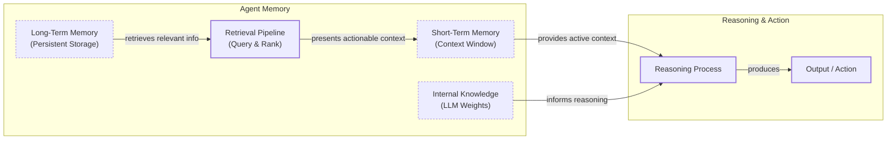

# How Does Memory for AI Agents Work?

In our previous lessons, we built a solid foundation for understanding how agents think and act, covering everything from context engineering to agentic reasoning with ReAct. Now, we will tackle one of the most important components of building intelligent systems: memory. An LLM without memory is like an intern with amnesia. They might be brilliant, but they cannot recall previous conversations or learn from experience. The core problem is that LLMs are stateless; their knowledge is vast but frozen in time, a problem known as “continual learning” [[1]](https://arxiv.org/html/2510.17281v2).

To overcome this, we use the context window as a form of “working memory.” However, this is a limited solution due to rising costs and the “lost in the middle” problem, where models struggle to use information buried in a long prompt [[2]](https://arxiv.org/abs/2307.03172). Memory tools provide a temporary solution, giving agents the continuity and adaptability to “learn” without retraining. When we first built agents with 8k or 16k token limits, we had to engineer complex compression systems. Today, with million-token context windows, the principles of organizing memory remain essential for performance [[3]](https://www.youtube.com/watch?v=7AmhgMAJIT4&list=PLDV8PPvY5K8VlygSJcp3__mhToZMBoiwX&index=112).

In this lesson, we will explore the fundamental layers of agent memory, the different types of long-term storage, implementation trade-offs, and real-world best practices.

## The Layers of Memory: Internal, Short-Term, and Long-Term

To build effective agents, we can borrow terms from biology and cognitive science to categorize memory layers in a way that is useful for engineering [[4]](https://arxiv.org/html/2309.02427). There are three distinct layers based on their persistence and proximity to the model’s reasoning core.

**Internal Knowledge** is the static, pre-trained information baked into the LLM’s weights. This memory is read-only and frozen at the time of training.

**Short-Term Memory** is the active context window passed to the LLM during a specific call. It acts as the agent's RAM. It is volatile and fast, but it is also the only “reality” the model sees during inference [[5]](https://www.ibm.com/think/topics/ai-agent-memory).

**Long-Term Memory** is the external, persistent storage system where an agent saves and retrieves information, providing personalization and context [[6]](https://decodingml.substack.com/p/memory-the-secret-sauce-of-ai-agents).

The dynamic between these layers creates the agent’s intelligence. Information from long-term memory is pulled into short-term memory through a retrieval pipeline, often implemented using Retrieval-Augmented Generation (RAG). This curated context, combined with the LLM's internal knowledge, informs the agent's reasoning and actions.


Image 1: A hierarchy and flow diagram illustrating the three fundamental layers of an agent's memory system: Internal Knowledge, Short-Term Memory (Context Window), and Long-Term Memory, including a retrieval pipeline and the reasoning and action phases.

No single layer can perform all functions effectively. To better understand long-term memory, we can further apply cognitive science definitions.

## Long-Term Memory: Semantic, Episodic, and Procedural

Long-term memory is not a single bucket of text. It consists of three distinct types, each serving a different role in making an agent “intelligent” [[4]](https://arxiv.org/html/2309.02427), [[7]](https://www.newsletter.swirlai.com/p/memory-in-agent-systems).

**Semantic Memory (Facts & Knowledge)** is the agent’s encyclopedia. It stores individual pieces of knowledge or “facts,” such as *“The user is a vegetarian”* or structured attributes like `{"dog": "User has a dog named George"}`. For an enterprise agent, this might be internal documents, while for a personal assistant, it builds a persistent user profile with preferences and constraints. This provides a reliable source of truth without searching a noisy conversation history [[8]](https://machinelearningmastery.com/beyond-short-term-memory-the-3-types-of-long-term-memory-ai-agents-need/).

**Episodic Memory (Experiences & History)** is the agent’s personal diary. It records past interactions with a timestamp, capturing *“what happened and when.”* A semantic fact might be *“User is frustrated with his brother.”* An episodic memory would be: *“On Tuesday, the user expressed frustration that their brother, Mark, always forgets their birthday. [created_at=2025-08-25].”* This nuanced context allows for more empathetic interactions and enables the agent to answer questions like *“What happened last week?”* [[3]](https://www.youtube.com/watch?v=7AmhgMAJIT4&list=PLDV8PPvY5K8VlygSJcp3__mhToZMBoiwX&index=112).

**Procedural Memory (Skills & How-To)** is the agent’s muscle memory. It consists of learned workflows and “how-to” knowledge. This is often encoded as a reusable tool or a defined sequence of actions. For example, a `MonthlyReportIntent` procedure might define the steps: 1) Query sales DB, 2) Summarize findings, 3) Email user. This makes behavior on common tasks reliable and predictable, as the agent does not have to reason from scratch every time [[9]](https://arxiv.org/html/2508.06433v2).

Now that we know what to save, we must decide *how* to store it.

## Storing Memories: Pros and Cons of Different Approaches

The way an agent’s memories are stored is an architectural decision that impacts performance, complexity, and scalability. There is no one-size-fits-all solution; the ideal approach depends on the product's use case. Let's explore the three primary methods [[10]](https://danielp1.substack.com/p/memex-20-memory-the-missing-piece).

**Storing memories as raw strings** is the simplest method, where conversational turns are stored as plain text and indexed for vector search. It is fast to set up and preserves the full nuance of the original interaction. However, retrieval can be imprecise. A query like “What is my brother’s job?” might retrieve every conversation mentioning “brother” and “job” without pinpointing the current fact. It is also difficult to update facts or distinguish state changes over time, such as “Barry *was* the CEO” versus “Claude *is* the CEO” [[11]](https://towardsdatascience.com/a-practical-guide-to-memory-for-autonomous-llm-agents/).

**Storing memories as entities (JSON-like structures)** involves using an LLM to transform interactions into structured formats. This allows for precise, field-level filtering (e.g., `“user”: {”brother”: {”job”: “Software Engineer”}}`) and easy updates. It is ideal for semantic memory like user profiles. The downsides are the upfront complexity of schema design and potential rigidity. Information that does not fit the schema might be lost, and the extraction process can strip away the emotional subtext of the original conversation.

**Storing memories in a knowledge graph** is the most advanced approach, representing memories as a network of nodes (entities) and edges (relationships). This excels at representing complex connections and enables multi-hop reasoning. It also offers superior temporal awareness by modeling time as a property of a relationship (e.g., `User -[RECOMMENDED_ON_DATE: "2025-10-25"]-> Restaurant`). However, it has the highest complexity and cost, and graph traversals can be slower than vector lookups, making it overkill for simple use cases [[12]](https://arxiv.org/html/2504.19413).

**The Human Factor** in memory management is a critical consideration. Memory exists to make the agent smarter, not to give the user a new job. Exposing the internal workings of the memory system can create significant cognitive overhead. Users should not be asked to "garden their agent's memories," as this breaks the illusion of a capable assistant. Memory management should be an autonomous function of the agent, learning from corrections within the natural flow of conversation [[3]](https://www.youtube.com/watch?v=7AmhgMAJIT4&list=PLDV8PPvY5K8VlygSJcp3__mhToZMBoiwX&index=112).

## Memory implementations with code examples

While RAG is the mechanism for retrieving information, creating high-quality memories is an equally important preceding step. We will cover RAG in the next lesson. To demonstrate memory creation, we will use `mem0`, an open-source library that provides a simple API for managing memory. We will use the "raw strings" storage approach to focus on the benefits of each memory category.

### Setup

`mem0` allows us to add, search, and manage memory for AI agents. We will configure it to use Gemini for both embeddings and LLM operations, with a local ChromaDB vector store.

1.  First, we configure `mem0` to use Gemini models and a local ChromaDB instance for storage.
    ```python
    import os
    from typing import Optional
    
    from google import genai
    from mem0 import Memory
    
    # Assumes GOOGLE_API_KEY is set in the environment
    client = genai.Client()
    MODEL_ID = "gemini-1.5-pro"
    
    MEM0_CONFIG = {
        "embedder": {
            "provider": "gemini",
            "config": {
                "model": "text-embedding-004",
                "api_key": os.getenv("GOOGLE_API_KEY"),
            },
        },
        "vector_store": {
            "provider": "chroma",
            "config": {
                "collection_name": "lesson9_memories",
                "path": "/tmp/chroma_mem0",
            },
        },
        "llm": {
            "provider": "gemini",
            "config": {
                "model": MODEL_ID,
                "api_key": os.getenv("GOOGLE_API_KEY"),
            },
        },
    }
    
    memory = Memory.from_config(MEM0_CONFIG)
    MEM_USER_ID = "lesson9_notebook_student"
    memory.delete_all(user_id=MEM_USER_ID)
    ```
    It outputs:
    ```text
    ✅ Mem0 ready (Gemini embeddings + local Chroma).
    ```
2.  Next, we define helper functions to add and search for memories, tagging them by category.
    ```python
    def mem_add_text(text: str, category: str = "semantic", **meta) -> str:
        """Add a single text memory. No LLM is used for extraction or summarization."""
        metadata = {"category": category}
        for k, v in meta.items():
            if isinstance(v, (str, int, float, bool)) or v is None:
                metadata[k] = v
            else:
                metadata[k] = str(v)
        memory.add(text, user_id=MEM_USER_ID, metadata=metadata, infer=False)
        return f"Saved {category} memory."
    
    
    def mem_search(query: str, limit: int = 5, category: Optional[str] = None) -> list[dict]:
        """
        Category-aware search wrapper.
        Returns the full result dicts so we can inspect metadata.
        """
        res = memory.search(query, user_id=MEM_USER_ID, limit=limit) or {}
    
        items = res.get("results", [])
        if category is not None:
            items = [r for r in items if (r.get("metadata") or {}).get("category") == category]
        return items
    ```

### Semantic Memory: Extracting Facts

Semantic memory is created through an extraction pipeline. An LLM with a specific prompt extracts factual data from a conversation, turning it into a queryable knowledge base [[13]](https://blog.lqhl.me/mem0-how-three-prompts-created-a-viral-ai-memory-layer). The prompt instructs the model to identify persistent facts and preferences. For example:
```
Extract persistent facts and strong preferences as short bullet points.
- Keep each fact atomic and context-independent.
- 3–6 bullets max.

Text:
{My brother Mark is a software engineer, but his real passion is painting.}
```
The system would then store facts like: `Mark is the user's brother. Mark is a software engineer. Mark's real passion is painting.`.

1.  We insert a few facts as atomic strings.
    ```python
    facts: list[str] = [
        "User prefers vegetarian meals.",
        "User has a dog named George.",
        "User is allergic to gluten.",
        "User's brother is named Mark and is a software engineer.",
    ]
    for f in facts:
        print(mem_add_text(f, category="semantic"))
    ```
    It outputs:
    ```text
    Saved semantic memory.
    Saved semantic memory.
    Saved semantic memory.
    Saved semantic memory.
    ```
2.  We can now search for this specific semantic information.
    ```python
    results = memory.search("brother job", user_id=MEM_USER_ID, limit=1)
    print(results["results"][0]["memory"])
    ```
    It outputs:
    ```text
    User's brother is named Mark and is a software engineer.
    ```

### Episodic Memory: The Log of Events

Episodic memory functions as a chronological log. An LLM can read conversation messages and summarize the key events, attaching a timestamp to each memory [[14]](https://docs.mem0.ai/platform/features/timestamp). The prompt might ask the LLM to act as a personal tutor and extract insights that will help the user improve their skills.

1.  We define a short dialogue and ask the LLM to summarize it into a single "episode."
    ```python
    dialogue = [
        {"role": "user", "content": "I'm stressed about my project deadline on Friday."},
        {"role": "assistant", "content": "I’m here to help—what’s the blocker?"},
        {"role": "user", "content": "Mainly testing. I also prefer working at night."},
        {"role": "assistant", "content": "Okay, we can split testing into two sessions."},
    ]
    
    episodic_prompt = f"""Summarize the following 3–4 turns as one concise 'episode' (1–2 sentences).
    Keep salient details and tone.
    
    {dialogue}
    """
    episode_summary = client.models.generate_content(model=MODEL_ID, contents=episodic_prompt)
    episode = episode_summary.text.strip()
    ```
2.  We save this summary as an episodic memory.
    ```python
    print(
        mem_add_text(
            episode,
            category="episodic",
            summarized=True,
            turns=4,
        )
    )
    ```
    It outputs:
    ```text
    Saved episodic memory.
    ```
3.  We can search for this "experience" later.
    ```python
    hits = mem_search("deadline stress", limit=1, category="episodic")
    for h in hits:
        print(f"{h['memory']}\n")
    ```
    It outputs:
    ```text
    A user, stressed about a Friday project deadline because of testing and a preference for working at night, is advised to split the testing work into two manageable sessions.
    ```

### Procedural Memory: Defining and Learning Skills

Procedural memory can be defined by a developer or learned from user interactions. An agent can save a sequence of steps as a new, callable procedure.

1.  We define a procedure as a text block containing ordered steps.
    ```python
    procedure_name = "monthly_report"
    steps = [
        "Query sales DB for the last 30 days.",
        "Summarize top 5 insights.",
        "Ask user whether to email or display.",
    ]
    procedure_text = f"Procedure: {procedure_name}\nSteps:\n" + "\n".join(f"{i + 1}. {s}" for i, s in enumerate(steps))
    
    mem_add_text(procedure_text, category="procedure", procedure_name=procedure_name)
    ```
2.  We can then retrieve the procedure by intent.
    ```python
    results = mem_search("how to create a monthly report", category="procedure", limit=1)
    if results:
        print(results[0]["memory"])
    ```
    It outputs:
    ```text
    Procedure: monthly_report
    Steps:
    1. Query sales DB for the last 30 days.
    2. Summarize top 5 insights.
    3. Ask user whether to email or display.
    ```

Now that we have seen how to implement these memory types, let's discuss some best practices for building memory systems in production.

## Real-World Lessons: Challenges and Best Practices

Moving from theory to a reliable, production-ready system requires navigating complex trade-offs that are constantly evolving with the underlying technology. Here are some of the most important lessons learned from building and scaling agent memory systems.

### Re-evaluating compression

Just a few years ago, LLMs operated with small and expensive context windows of 8k or 16k tokens. This forced us to be ruthless with compression, distilling interactions into compact summaries or facts. While necessary, this process is inherently lossy. Today, with models offering million-token context windows at a fraction of the cost, the best practice is to lean towards less compression. The raw, unstructured conversational history is the ultimate source of truth. A fact might state, "User has a dog named George," but the episodic log reveals, "User mentioned that walking their dog named George is the best part of their day," a far more valuable piece of information for a personalized agent [[3]](https://www.youtube.com/watch?v=7AmhgMAJIT4&list=PLDV8PPvY5K8VlygSJcp3__mhToZMBoiwX&index=112). The best practice is to design your system to work with the most complete version of history that is economically and technically feasible. Use summarization and fact extraction as tools for creating queryable indexes, but always treat the raw log as the ground truth.

### Designing for the Product

There is no "perfect" memory architecture. The most common failure mode is over-engineering a complex, multi-part memory system for a product that does not need it. The product's goal should dictate the memory architecture, not the other way around. You should start from first principles by defining the core function of your agent [[8]](https://machinelearningmastery.com/beyond-short-term-memory-the-3-types-of-long-term-memory-ai-agents-need/). For a Q&A bot over internal documents, a simple RAG pipeline is the best starting point. For a long-term personal AI companion, rich episodic memories are beneficial. For a task-automation agent, procedural memory is likely the most useful. For compliance-critical domains like healthcare, the architecture must prioritize auditability, often leading to hybrid systems where rule-based components handle predictable tasks to ensure safety [[17]](https://arxiv.org/html/2510.25445v1).

## Conclusion

Memory is the component that transforms a stateless chat application into a personalized agent. It is the current engineering solution to the problem of continual learning. By engineering the context window, we allow agents to “learn” and adapt over time. While today’s memory tools are a temporary solution for true continual learning, they are a practical and powerful way to build more intelligent systems right now.

This understanding of memory architecture is foundational for the topics ahead. In our next lesson, we will explore Retrieval-Augmented Generation (RAG) in detail to understand how agents retrieve information from these memory stores. Following that, we will cover multimodal processing in Lesson 11, which adds another layer of complexity to what an agent can remember. Later in the course, we will tackle production topics like monitoring and evaluation, ensuring the memory systems we build are not just powerful but also reliable and efficient.

## References

- [1] A Comprehensive Survey of Continual Learning (https://arxiv.org/html/2510.17281v2)
- [2] Lost in the Middle: How Language Models Use Long Contexts (https://arxiv.org/abs/2307.03172)
- [3] What is the perfect memory architecture? (https://www.youtube.com/watch?v=7AmhgMAJIT4&list=PLDV8PPvY5K8VlygSJcp3__mhToZMBoiwX&index=112)
- [4] Cognitive Architectures for Language Agents (https://arxiv.org/html/2309.02427)
- [5] What is AI agent memory? (https://www.ibm.com/think/topics/ai-agent-memory)
- [6] Memory: The secret sauce of AI agents (https://decodingml.substack.com/p/memory-the-secret-sauce-of-ai-agents)
- [7] Memory in Agent Systems (https://www.newsletter.swirlai.com/p/memory-in-agent-systems)
- [8] Beyond Short-term Memory: The 3 Types of Long-term Memory AI Agents Need (https://machinelearningmastery.com/beyond-short-term-memory-the-3-types-of-long-term-memory-ai-agents-need/)
- [9] Mem^p: A Framework for Procedural Memory in Agents (https://arxiv.org/html/2508.06433v2)
- [10] Memex 2.0: Memory The Missing Piece for Real Intelligence (https://danielp1.substack.com/p/memex-20-memory-the-missing-piece)
- [11] A Practical Guide to Memory for Autonomous LLM Agents (https://towardsdatascience.com/a-practical-guide-to-memory-for-autonomous-llm-agents/)
- [12] Mem0: Building Production-Ready AI Agents with Scalable Long-Term Memory (https://arxiv.org/html/2504.19413)
- [13] How Mem0 Works Under the Hood (https://blog.lqhl.me/mem0-how-three-prompts-created-a-viral-ai-memory-layer)
- [14] Timestamp - Mem0 Docs (https://docs.mem0.ai/platform/features/timestamp)
- [15] Knowledge Graphs as Memory: Why Your AI Agent Needs to Think in Relationships (https://www.octoco.ai/blog/knowledge-graphs-as-memory)
- [16] AI Agent Memory Types & Architecture Guide (https://genta.dev/resources/ai-agent-memory-types-architecture-guide)
- [17] Lifelong Learning Machines and Agents (https://arxiv.org/html/2510.25445v1)
- [18] Brain-Inspired AI Memory Systems (https://www.linkedin.com/pulse/brain-inspired-ai-memory-systems-lessons-from-anand-ramachandran-ku6ee)