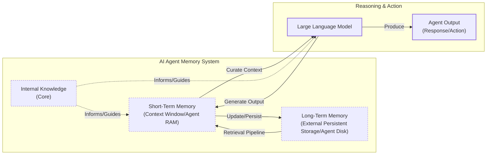

# How Does Memory for AI Agents Work?

In previous lessons, we built agents that can plan and use tools. Now, we will explore memory, the component that transforms a stateless chatbot into a personalized system. The core problem is that LLMs cannot learn by updating their weights after training, a challenge known as “continual learning” [[1]](https://arxiv.org/html/2510.17281v2). An LLM without memory is like an intern with amnesia, unable to recall past conversations.

We use the context window as a "working memory," but this is a limited solution. Rising costs and the "lost in the middle" problem are significant issues. This is where models struggle to use information buried in a long prompt [[2]](https://arxiv.org/abs/2307.03172). Early agent-building efforts with 8k or 16k token limits forced engineers to build complex compression systems [[8]](https://www.decodingai.com/p/how-does-memory-for-ai-agents-work). Today, even with larger contexts, memory tools remain essential for providing continuity and the ability to "learn."

In this article, we will explore memory layers, long-term memory types, storage methods, and best practices. To build agents effectively, we need a useful way to think about memory. We can borrow from biology and cognitive science to understand how memory works across different time horizons.

## The Layers of Memory: Internal, Short-Term, and Long-Term

To build effective agents, we can borrow terms from cognitive science to categorize memory layers [[3]](https://www.ibm.com/think/topics/ai-agent-memory), [[4]](https://arxiv.org/html/2309.02427).

**Internal Knowledge** is the static knowledge baked into the LLM’s weights. It is powerful but frozen at training time.

**Short-Term Memory** is the active context window, acting as the agent's RAM. It is volatile, fast, and simulates "learning" during a session.

**Long-Term Memory** is the external, persistent storage (the disk) where an agent saves information.

The dynamic between these layers creates the agent’s intelligence. Information from long-term memory is pulled into short-term memory using a retrieval pipeline, a process often implemented with Retrieval-Augmented Generation (RAG). This retrieved context then becomes actionable for the LLM.


Image 1: A hierarchy and flow diagram illustrating the three fundamental layers of an AI agent's memory system: Internal Knowledge, Short-Term Memory, and Long-Term Memory, showing their dynamic interplay and filtering hierarchy.

## Long-Term Memory: Semantic, Episodic, and Procedural

Long-term memory is not a single bucket of text. It consists of three distinct types, each serving a different role in making an agent “intelligent” [[4]](https://arxiv.org/html/2309.02427), [[5]](https://www.newsletter.swirlai.com/p/memory-in-agent-systems).

**Semantic Memory (Facts & Knowledge)** is the agent’s encyclopedia. It stores atomic facts or structured attributes. For a personal assistant, it builds a user profile, recalling preferences like `{"music": "rock"}`. For an enterprise agent, it might store technical manuals or product catalogs, allowing it to answer questions on proprietary topics. This provides a reliable source of truth without searching a noisy conversation history.

**Episodic Memory (Experiences & History)** is the agent’s personal diary. It records interactions with a timestamp, capturing *“what happened and when.”* A semantic fact might be *“User is frustrated with his brother.”* An episodic memory would be: *“On Tuesday, the user expressed frustration that their brother, Mark, always forgets their birthday.”* This nuance allows for more empathetic interactions and answers to temporal questions like *“What happened last week?”* [[6]](https://www.youtube.com/watch?v=7AmhgMAJIT4&list=PLDV8PPvY5K8VlygSJcp3__mhToZMBoiwX&index=112).

**Procedural Memory (Skills & How-To)** is the agent’s muscle memory for multi-step tasks. It is often encoded as reusable tools. For example, a `MonthlyReportIntent` procedure would define the steps: 1) Query sales DB, 2) Summarize findings, 3) Email user. This makes the agent’s behavior reliable and predictable [[7]](https://arxiv.org/html/2508.06433v2).

## Storing Memories: Pros and Cons of Different Approaches

The way an agent’s memories are stored is an architectural decision that impacts performance, complexity, and scalability. There is no one-size-fits-all solution. Let’s explore three primary methods.

**Storing memories as raw strings** is the simplest approach. Conversational turns are stored as plain text and indexed for vector search. This method is fast to set up and preserves the full nuance of interactions. However, retrieval can be imprecise, as a query for "my brother's job" might return every mention of "brother" and "job" [[8]](https://www.decodingai.com/p/how-does-memory-for-ai-agents-work). Updates are also difficult, as new information creates potential contradictions rather than overwriting old facts.

**Storing memories as entities** uses an LLM to transform interactions into structured formats like JSON. This allows for precise, field-level filtering and easier updates. The main drawbacks are the upfront complexity of schema design and the potential for rigidity, as information that does not fit the schema may be lost [[9]](https://danielp1.substack.com/p/memex-20-memory-the-missing-piece).

**Storing memories in a knowledge graph** is the most advanced approach, representing information as a network of nodes and relationships. This excels at modeling complex connections and temporal awareness, for example, `(User) -> [HAS_BROTHER] -> (Mark)` [[10]](https://www.octoco.ai/blog/knowledge-graphs-as-memory). However, it carries the highest complexity and cost, making it overkill for many simple use cases [[11]](https://arxiv.org/html/2504.19413).

```mermaid
graph TD
    subgraph "Storing Memories"
        direction LR
        A[Unstructured Text: "My brother Mark is now a doctor."]

        subgraph "1. Raw Strings"
            A --> B[Vector DB<br/>'My brother Mark is now a doctor.']
        end

        subgraph "2. Entities (JSON)"
            A -- "LLM Extract" --> C[Document DB<br/>{ "brother": { "name": "Mark", "job": "doctor" } }]
        end

        subgraph "3. Knowledge Graph"
            A -- "LLM Extract" --> D[Graph DB<br/>(Mark) -[:IS_A]-> (Doctor)<br/>(User) -[:HAS_BROTHER]-> (Mark)]
        end
    end
```
Image 2: A diagram visualizing the three primary approaches to storing memories, from unstructured text to structured formats in different database types.

## Memory Implementations with Code Examples

Let's look at code examples using `mem0`, an open-source memory library, to implement a "raw string" storage approach for each memory type. `mem0` automates the pipeline from text input to retrievable memories.

### Setup

First, we configure `mem0` to use Gemini for embeddings and a local ChromaDB vector store.

1.  The configuration specifies the providers and models for the embedder, vector store, and LLM.

    ```python
    import os
    from mem0 import Memory
    
    MEM0_CONFIG = {
        "embedder": {
            "provider": "gemini",
            "config": {
                "model": "gemini-embedding-001",
                "embedding_dims": 768,
                "api_key": os.getenv("GOOGLE_API_KEY"),
            },
        },
        "vector_store": {
            "provider": "chroma",
            "config": {
                "collection_name": "lesson9_memories",
                "path": "/tmp/chroma_mem0",
            },
        },
        "llm": {
            "provider": "gemini",
            "config": {
                "model": "gemini-2.5-pro",
                "api_key": os.getenv("GOOGLE_API_KEY"),
            },
        },
    }
    
    memory = Memory.from_config(MEM0_CONFIG)
    MEM_USER_ID = "lesson9_notebook_student"
    memory.delete_all(user_id=MEM_USER_ID)
    ```

2.  Next, we define helper functions to add and search for memories with category tags.

    ```python
    from typing import Optional

    def mem_add_text(text: str, category: str = "semantic", **meta) -> str:
        """Add a single text memory. No LLM is used for extraction or summarization."""
        metadata = {"category": category}
        for k, v in meta.items():
            if isinstance(v, (str, int, float, bool)) or v is None:
                metadata[k] = v
            else:
                metadata[k] = str(v)
        memory.add(text, user_id=MEM_USER_ID, metadata=metadata, infer=False)
        return f"Saved {category} memory."
    
    
    def mem_search(query: str, limit: int = 5, category: Optional[str] = None) -> list[dict]:
        """Category-aware search wrapper."""
        res = memory.search(query, user_id=MEM_USER_ID, limit=limit) or {}
    
        items = res.get("results", [])
        if category is not None:
            items = [r for r in items if (r.get("metadata") or {}).get("category") == category]
        return items
    ```

### Semantic Memory: Extracting Facts

Semantic memory is created by extracting atomic facts from conversations.

1.  We insert a few facts into our semantic memory.

    ```python
    facts: list[str] = [
        "User prefers vegetarian meals.",
        "User has a dog named George.",
        "User is allergic to gluten.",
        "User's brother is named Mark and is a software engineer.",
    ]
    for f in facts:
        print(mem_add_text(f, category="semantic"))
    ```

2.  We can then search for a specific fact.

    ```python
    results = memory.search("brother job", user_id=MEM_USER_ID, limit=1)
    print(results["results"][0]["memory"])
    ```

    It outputs:

    ```text
    User's brother is named Mark and is a software engineer.
    ```

### Episodic Memory: The Log of Events

Episodic memories are chronological logs, often created by summarizing conversations.

1.  We define a dialogue and use an LLM to create a concise summary.

    ```python
    from google import genai
    
    client = genai.Client()
    MODEL_ID = "gemini-2.5-pro"
    
    dialogue = [
        {"role": "user", "content": "I'm stressed about my project deadline on Friday."},
        {"role": "assistant", "content": "I’m here to help—what’s the blocker?"},
        {"role": "user", "content": "Mainly testing. I also prefer working at night."},
        {"role": "assistant", "content": "Okay, we can split testing into two sessions."},
    ]
    
    episodic_prompt = f"""Summarize the following 3–4 turns as one concise 'episode' (1–2 sentences).
    Keep salient details and tone.
    
    {dialogue}
    """
    episode_summary = client.models.generate_content(model=MODEL_ID, contents=episodic_prompt)
    episode = episode_summary.text.strip()
    ```

2.  We save this summary as an episodic memory and then search for it.

    ```python
    print(
        mem_add_text(
            episode,
            category="episodic",
            summarized=True,
            turns=4,
        )
    )
    hits = mem_search("deadline stress", limit=1, category="episodic")
    for h in hits:
        print(f"{h['memory']}\n")
    ```

    It outputs:

    ```text
    A user, stressed about a Friday project deadline because of testing and a preference for working at night, is advised to split the testing work into two manageable sessions.
    ```

### Procedural Memory: Defining and Learning Skills

Procedural memory stores reusable skills or workflows.

1.  We define a procedure as a text block and save it.

    ```python
    procedure_name = "monthly_report"
    steps = [
        "Query sales DB for the last 30 days.",
        "Summarize top 5 insights.",
        "Ask user whether to email or display.",
    ]
    procedure_text = f"Procedure: {procedure_name}\nSteps:\n" + "\n".join(f"{i + 1}. {s}" for i, s in enumerate(steps))
    
    mem_add_text(procedure_text, category="procedure", procedure_name=procedure_name)
    ```

2.  We can then retrieve this procedure by its intent.

    ```python
    results = mem_search("how to create a monthly report", category="procedure", limit=1)
    if results:
        print(results[0]["memory"])
    ```

    It outputs:

    ```text
    Procedure: monthly_report
    Steps:
    1. Query sales DB for the last 30 days.
    2. Summarize top 5 insights.
    3. Ask user whether to email or display.
    ```

## Real-World Lessons: Challenges and Best Practices

Moving from theory to a production-ready system requires navigating complex trade-offs. Here are some important lessons learned from building agent memory systems.

### Re-evaluating Compression

The trade-off between compressing information and preserving raw detail has shifted dramatically. Just a few years ago, models with small 8k or 16k token context windows forced us to be ruthless with compression. This process, often called **summarization drift** or **context compaction**, is inherently lossy; each compression discards details, and eventually, the agent’s memory no longer matches what happened [[13]](https://towardsdatascience.com/a-practical-guide-to-memory-for-autonomous-llm-agents/), [[17]](https://dev.to/bobrenze/why-ai-agent-memory-systems-fail-in-production-and-how-i-fixed-mine-141d). Today, with million-token context windows, the best practice is to lean towards less compression. The raw conversational history is the ultimate source of truth, containing nuance that extraction often discards.

### Designing for the Product

There is no "perfect" memory architecture. The concepts of semantic, episodic, and procedural memory are a toolkit, not a mandatory blueprint. The product's goal should dictate the memory architecture. For a Q&A bot over internal documents, a simple retrieval system is a great start. For a long-term personal AI companion, rich episodic memories are valuable. For a task-automation agent, procedural memory is likely key. Start from first principles by defining the core function of your agent.

### The Human Factor

Memory exists to make the agent smarter, not to give the user a new job. A common pitfall is exposing the internal workings of the memory system, which creates significant cognitive overhead. Users should not be asked to "garden their agent's memories" [[6]](https://www.youtube.com/watch?v=7AmhgMAJIT4&list=PLDV8PPvY5K8VlygSJcp3__mhToZMBoiwX&index=112). This breaks the illusion of a capable assistant and turns the interaction into a tedious data-entry task. Memory management should be an autonomous function. The agent should learn from corrections within the natural flow of conversation and be responsible for maintaining the integrity of its own knowledge.

## Conclusion

Memory is the component that transforms a stateless chat application into a personalized agent. It is the current engineering solution to the problem of continual learning. By engineering the context window, we allow agents to “learn” and adapt over time. While today's memory tools are a temporary solution, they are a powerful and necessary part of building effective AI systems.

This lesson provided a conceptual overview of agent memory. In our next lesson, we will explore Retrieval-Augmented Generation in detail, the core mechanism for pulling information from long-term memory. We will also cover more advanced topics in the future, including multimodal data processing for images and audio, as well as the Model Context Protocol (MCP) for standardized tool use. Later, we will apply these concepts to build our research and writing agents, and finally, cover how to monitor and evaluate them in production.

## References

- [1] Wang, L., Zhang, X., Su, H., & Zhu, J. (2025). A Comprehensive Survey of Continual Learning. arXiv preprint arXiv:2302.00487. [https://arxiv.org/html/2510.17281v2](https://arxiv.org/html/2510.17281v2)
- [2] Liu, N. F., Lin, K., Hewitt, J., Paranjape, A., Bevilacqua, M., Petroni, F., & Liang, P. (2023). Lost in the Middle: How Language Models Use Long Contexts. arXiv preprint arXiv:2307.03172. [https://arxiv.org/abs/2307.03172](https://arxiv.org/abs/2307.03172)
- [3] What is AI agent memory?. (n.d.). IBM. [https://www.ibm.com/think/topics/ai-agent-memory](https://www.ibm.com/think/topics/ai-agent-memory)
- [4] Sumers, T. R., Yao, S., Narasimhan, K., & Griffiths, T. L. (2023). Cognitive Architectures for Language Agents. arXiv. [https://arxiv.org/html/2309.02427](https://arxiv.org/html/2309.02427)
- [5] Griciūnas, A. (2024, October 30). Memory in Agent Systems. SwirlAI Newsletter. [https://www.newsletter.swirlai.com/p/memory-in-agent-systems](https://www.newsletter.swirlai.com/p/memory-in-agent-systems)
- [6] Whitmore, S. (2025, June 18). What is the perfect memory architecture?. YouTube. [https://www.youtube.com/watch?v=7AmhgMAJIT4&list=PLDV8PPvY5K8VlygSJcp3__mhToZMBoiwX&index=112](https://www.youtube.com/watch?v=7AmhgMAJIT4&list=PLDV8PPvY5K8VlygSJcp3__mhToZMBoiwX&index=112)
- [7] Mem^p: A Framework for Procedural Memory in Agents. (n.d.). arXiv. [https://arxiv.org/html/2508.06433v2](https://arxiv.org/html/2508.06433v2)
- [8] Iusztin, P. (2025, Dec 02). How Does Memory for AI Agents Work?. Decoding AI Magazine. [https://www.decodingai.com/p/how-does-memory-for-ai-agents-work](https://www.decodingai.com/p/how-does-memory-for-ai-agents-work)
- [9] Chalef, D. (2024, June 25). Memex 2.0: Memory The Missing Piece for Real Intelligence. Substack. [https://danielp1.substack.com/p/memex-20-memory-the-missing-piece](https://danielp1.substack.com/p/memex-20-memory-the-missing-piece)
- [10] Lintvelt, H. (n.d.). Knowledge Graphs as Memory: Why Your AI Agent Needs to Think in Relationships. Octo AI. [https://www.octoco.ai/blog/knowledge-graphs-as-memory](https://www.octoco.ai/blog/knowledge-graphs-as-memory)
- [11] Chhikara, P. (2025). Mem0: Building Production-Ready AI Agents with Scalable Long-Term Memory. arXiv. [https://arxiv.org/html/2504.19413](https://arxiv.org/html/2504.19413)
- [13] Lawson, N. (2026, April 17). A Practical Guide to Memory for Autonomous LLM Agents. Towards Data Science. [https://towardsdatascience.com/a-practical-guide-to-memory-for-autonomous-llm-agents/](https://towardsdatascience.com/a-practical-guide-to-memory-for-autonomous-llm-agents/)
- [17] Bob R. (2026, May 22). Why AI Agent Memory Systems Fail in Production (And How I Fixed Mine). DEV Community. [https://dev.to/bobrenze/why-ai-agent-memory-systems-fail-in-production-and-how-i-fixed-mine-141d](https://dev.to/bobrenze/why-ai-agent-memory-systems-fail-in-production-and-how-i-fixed-mine-141d)