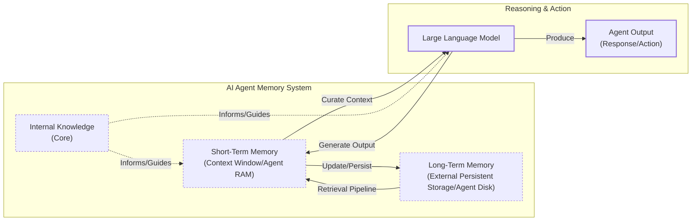

# How Does Memory for AI Agents Work?

In the previous lessons, we covered the agentic landscape, context engineering, structured outputs, and the reasoning mechanisms that power AI agents like ReAct. We have the building blocks to create agents that can plan and use tools. Now, we will explore one of the most important components that transforms a simple, stateless chatbot into an adaptive and personalized system: memory.

One year ago, we faced a challenge that many AI builders encounter: how do we give our agent access to the right information at the right time? Like most teams, we jumped straight into building a complex Retrieval-Augmented Generation (RAG) system. Our ingestion pipeline became incredibly heavy, and at query time, our agent would zigzag through multiple retrieval steps. The latency was terrible, costs were high, and debugging was a nightmare. We realized the fundamental challenge is not just retrieval, but understanding how to architect memory systems that match your use case.

The core problem we are solving is the limitation of LLMs: their knowledge is vast but frozen in time. They are unable to learn by updating their weights after training, a problem known as “continual learning” [[1]](https://arxiv.org/html/2510.17281v2). An LLM without memory is like an intern with amnesia. They might be brilliant, but they cannot recall previous conversations or learn from experience.

To overcome this, we use the context window as a form of “working memory.” However, keeping an entire conversation in the context window is often unrealistic. Rising costs per turn and the “lost in themiddle” problem—where models struggle to use information buried in a long prompt—limit this approach [[2]](https://arxiv.org/abs/2307.03172). While context windows are increasing, relying solely on them introduces noise and overhead. Memory tools act as the solution, providing agents with continuity and the ability to “learn” without retraining.

In this article, we will explore:

1.  The three fundamental layers of memory for AI agents.
2.  A detailed look at long-term memory: Semantic, Episodic, and Procedural.
3.  The trade-offs between storing memories as strings, entities, or knowledge graphs.
4.  How to implement these memory types with code examples.
5.  Real-world challenges and best practices for designing memory systems.

## The Layers of Memory: Internal, Short-Term, and Long-Term

To build effective agents, we must distinguish between the different places information lives. This layered approach has roots in classical AI architectures like Belief-Desire-Intention (BDI), which separated beliefs about the world (memory) from goals and plans [[12]](https://arxiv.org/html/2602.10479v1). We can also borrow terms from biology and cognitive science to categorize these layers, which is useful for engineering [[3]](https://www.ibm.com/think/topics/ai-agent-memory), [[4]](https://arxiv.org/html/2309.02427).

**Internal Knowledge** is the static, pre-trained knowledge baked into the LLM’s weights. It is the best place to store general world knowledge but is frozen at the time of training.

**Short-Term Memory** is the active context window, acting as the RAM of the agentic system. It is volatile and fast, simulating “learning” during a session.

**Long-Term Memory** is the external, persistent storage (the disk) where an agent saves and retrieves information, providing personalization and context.


Image 1: A hierarchy and flow diagram illustrating the three fundamental layers of an AI agent's memory system: Internal Knowledge, Short-Term Memory, and Long-Term Memory, showing their dynamic interplay and filtering hierarchy.

The dynamic between these layers creates the agent’s intelligence. Information from long-term memory is retrieved into short-term memory, which is then curated to create the final context for the LLM. This entire process can be framed as a **write-manage-read loop**: new information is written to memory, the system actively manages it by pruning or consolidating, and relevant parts are read back into context when needed [[13]](https://towardsdatascience.com/a-practical-guide-to-memory-for-autonomous-llm-agents/). This categorization is critical for engineering: internal knowledge handles general reasoning, short-term memory manages the immediate task, and long-term memory provides personalization.

## Long-Term Memory: Semantic, Episodic, and Procedural

Long-term memory is not a single bucket of text. It consists of three distinct types, each serving a different role in making an agent “intelligent” [[4]](https://arxiv.org/html/2309.02427), [[5]](https://www.newsletter.swirlai.com/p/memory-in-agent-systems).

### Semantic Memory (Facts & Knowledge)

Semantic memory is the agent’s encyclopedia. It stores atomic facts, like *“The user is a vegetarian,”* or structured attributes on an entity, such as `{"food_restrictions": "vegetarian"}`. This is where the agent stores concepts and relationships regarding specific domains, people, or places. For an enterprise agent, this might be internal documents. For a personal assistant, semantic memory builds a persistent user profile, recalling preferences like `{"music": "rock"}`. This allows the agent to retrieve relevant facts without searching through a noisy conversation history.

### Episodic Memory (Experiences & History)

Episodic memory is the agent’s personal diary. It records past interactions with a timestamp, capturing *“what happened and when.”* This is essential for maintaining conversational context. A semantic fact might be *“User is frustrated with his brother.”* An episodic memory would be: *“On Tuesday, the user expressed frustration that their brother, Mark, always forgets their birthday. [created_at=2025-08-25].”* This nuanced episode allows the agent to interact with more empathy in the future and answer questions like *“What happened last week?”* [[6]](https://www.youtube.com/watch?v=7AmhgMAJIT4&list=PLDV8PPvY5K8VlygSJcp3__mhToZMBoiwX&index=112). This is also essential in robotics, where an agent must recall past actions from its episodic log to navigate efficiently [[14]](https://www.ibm.com/think/topics/ai-agent-memory).

### Procedural Memory (Skills & How-To)

Procedural memory is the agent’s muscle memory of skills and learned workflows. This memory is often baked into the agent’s system prompt as reusable tools. For example, an agent might store a `MonthlyReportIntent` procedure. When a user asks for a report, the agent retrieves this procedure: 1) Query sales DB, 2) Summarize findings, 3) Email user. This makes behavior reliable and predictable, as the agent does not have to reason from scratch every time [[7]](https://arxiv.org/html/2508.06433v2). More advanced systems distill these procedures from raw interaction logs, learning to abstract reusable skills from successful trajectories rather than storing entire raw histories [[15]](https://arxiv.org/html/2512.10696).

Now that we know what to save, we must decide *how* to store it.

## Storing Memories: Pros and Cons of Different Approaches

The way an agent’s memories are stored is an architectural decision that impacts performance, complexity, and scalability. There is no one-size-fits-all solution. Let’s explore the three primary methods we experiment with as AI Engineers.

### Storing Memories as Raw Strings

This is the simplest method. Conversational turns are stored as plain text and indexed for vector search.

**Pros:** It is simple and fast to set up. It also preserves nuance, capturing emotional tone without loss in translation.

**Cons:** Retrieval is often imprecise. A query like “What is my brother’s job?” might retrieve every conversation mentioning “brother” and “job” without pinpointing the current fact [[8]](https://www.decodingai.com/p/how-does-memory-for-ai-agents-work). Updating is difficult; a correction just adds another string to the log, creating potential contradictions. It also lacks the structure to distinguish state changes over time.

### Storing Memories as Entities (JSON-like Structures)

Here, we use an LLM to transform messy interactions into structured memories, stored in formats like JSON.

**Pros:** It allows for precise, field-level filtering (e.g., `{"user": {"brother": {"job": "Software Engineer"}}}`). Updates are easier, as you simply overwrite the relevant field. This is ideal for semantic memory.

**Cons:** It requires upfront schema design. A rigid schema might cause data loss if new information doesn't fit [[9]](https://danielp1.substack.com/p/memex-20-memory-the-missing-piece). The extraction process can also strip away the nuance of the original conversation. The memory `"user_likes": ["cats"]` is far less representative than, "Petting my cat is the best part of my day."

### Storing Memories in a Knowledge Graph

This is the most advanced approach. Memories are stored as a network of nodes (entities) and edges (relationships).

**Pros:** It excels at representing complex relationships (e.g., `(User) -> [HAS_BROTHER] -> (Mark)`). It offers superior contextual awareness by modeling time as a property of a relationship [[10]](https://www.octoco.ai/blog/knowledge-graphs-as-memory). Retrieval is also auditable, which builds trust.

**Cons:** It has the highest complexity. Generating graph structures with LLMs can be 10–20x more resource-intensive than simple vector indexing, and dynamic maintenance of the graph is a significant engineering barrier [[16]](https://arxiv.org/html/2605.02452v1). For simple use cases, it is often overkill [[11]](https://arxiv.org/html/2504.19413).

```mermaid
graph TD
    subgraph "Storing Memories"
        direction LR
        A[Unstructured Text: "My brother Mark is now a doctor."]

        subgraph "1. Raw Strings"
            A --> B[Vector DB<br/>'My brother Mark is now a doctor.']
        end

        subgraph "2. Entities (JSON)"
            A -- "LLM Extract" --> C[Document DB<br/>{ "brother": { "name": "Mark", "job": "doctor" } }]
        end

        subgraph "3. Knowledge Graph"
            A -- "LLM Extract" --> D[Graph DB<br/>(Mark) -[:IS_A]-> (Doctor)<br/>(User) -[:HAS_BROTHER]-> (Mark)]
        end
    end
```
Image 2: A diagram visualizing the three primary approaches to storing memories, from unstructured text to structured formats in different database types.

The choice of memory storage should be guided by your product’s needs. Start simple and evolve as complexity grows.

## Memory Implementations with Code Examples

Now that we know what to save and how to store it, let's look at some code examples. While RAG is the mechanism for retrieving information, which we will cover in the next lesson, creating high-quality memories is an equally important preceding step. We will use the `mem0` open-source library to demonstrate a simple "raw string" storage approach for each memory type.

### Setup

First, we need to set up our environment. We will use `mem0` with Google's Gemini for embeddings and a local ChromaDB vector store.

1.  We configure `mem0` to use Gemini for both the LLM and embeddings, and ChromaDB for local vector storage.

    ```python
    import os
    from mem0 import Memory
    
    MEM0_CONFIG = {
        "embedder": {
            "provider": "gemini",
            "config": {
                "model": "gemini-embedding-001",
                "embedding_dims": 768,
                "api_key": os.getenv("GOOGLE_API_KEY"),
            },
        },
        "vector_store": {
            "provider": "chroma",
            "config": {
                "collection_name": "lesson9_memories",
                "path": "/tmp/chroma_mem0",
            },
        },
        "llm": {
            "provider": "gemini",
            "config": {
                "model": "gemini-2.5-pro",
                "api_key": os.getenv("GOOGLE_API_KEY"),
            },
        },
    }
    
    memory = Memory.from_config(MEM0_CONFIG)
    MEM_USER_ID = "lesson9_notebook_student"
    memory.delete_all(user_id=MEM_USER_ID)
    ```

2.  Next, we define helper functions to add and search for memories. `mem_add_text` stores a string verbatim with a category tag, and `mem_search` is a wrapper for querying memories.

    ```python
    from typing import Optional

    def mem_add_text(text: str, category: str = "semantic", **meta) -> str:
        """Add a single text memory. No LLM is used for extraction or summarization."""
        metadata = {"category": category}
        for k, v in meta.items():
            if isinstance(v, (str, int, float, bool)) or v is None:
                metadata[k] = v
            else:
                metadata[k] = str(v)
        memory.add(text, user_id=MEM_USER_ID, metadata=metadata, infer=False)
        return f"Saved {category} memory."
    
    
    def mem_search(query: str, limit: int = 5, category: Optional[str] = None) -> list[dict]:
        """Category-aware search wrapper."""
        res = memory.search(query, user_id=MEM_USER_ID, limit=limit) or {}
    
        items = res.get("results", [])
        if category is not None:
            items = [r for r in items if (r.get("metadata") or {}).get("category") == category]
        return items
    ```

### Semantic Memory: Extracting Facts

Semantic memories are created through an extraction pipeline. An LLM processes a conversation with a prompt designed to pull out atomic facts.

1.  We insert a few facts about a user into our semantic memory.

    ```python
    facts: list[str] = [
        "User prefers vegetarian meals.",
        "User has a dog named George.",
        "User is allergic to gluten.",
        "User's brother is named Mark and is a software engineer.",
    ]
    for f in facts:
        print(mem_add_text(f, category="semantic"))
    ```

2.  We can now search for this specific information using a natural language query.

    ```python
    results = memory.search("brother job", user_id=MEM_USER_ID, limit=1)
    print(results["results"][0]["memory"])
    ```

    It outputs:

    ```text
    User's brother is named Mark and is a software engineer.
    ```

### Episodic Memory: The Log of Events

Episodic memories function as a chronological log. An LLM can read a conversation and summarize the key events, which are then stored with a timestamp.

1.  We define a short dialogue and ask the LLM to summarize it into a single "episode."

    ```python
    from google import genai
    
    client = genai.Client()
    MODEL_ID = "gemini-2.5-pro"
    
    dialogue = [
        {"role": "user", "content": "I'm stressed about my project deadline on Friday."},
        {"role": "assistant", "content": "I’m here to help—what’s the blocker?"},
        {"role": "user", "content": "Mainly testing. I also prefer working at night."},
        {"role": "assistant", "content": "Okay, we can split testing into two sessions."},
    ]
    
    episodic_prompt = f"""Summarize the following 3–4 turns as one concise 'episode' (1–2 sentences).
    Keep salient details and tone.
    
    {dialogue}
    """
    episode_summary = client.models.generate_content(model=MODEL_ID, contents=episodic_prompt)
    episode = episode_summary.text.strip()
    ```

2.  We save this summary as an episodic memory.

    ```python
    print(
        mem_add_text(
            episode,
            category="episodic",
            summarized=True,
            turns=4,
        )
    )
    ```

3.  We can search for this "experience" later.

    ```python
    hits = mem_search("deadline stress", limit=1, category="episodic")
    for h in hits:
        print(f"{h['memory']}\n")
    ```

    It outputs:

    ```text
    A user, stressed about a Friday project deadline because of testing and a preference for working at night, is advised to split the testing work into two manageable sessions.
    ```

### Procedural Memory: Defining and Learning Skills

Procedural memory can be defined by a developer or learned from user instructions. Research suggests that selectively learning from successful task trajectories often creates a higher-quality skill library than learning from all attempts, including failures, which can introduce noise [[15]](https://arxiv.org/html/2512.10696). Here, we will define a simple procedure for creating a monthly report.

1.  We define the procedure as a text block containing steps and save it.

    ```python
    procedure_name = "monthly_report"
    steps = [
        "Query sales DB for the last 30 days.",
        "Summarize top 5 insights.",
        "Ask user whether to email or display.",
    ]
    procedure_text = f"Procedure: {procedure_name}\nSteps:\n" + "\n".join(f"{i + 1}. {s}" for i, s in enumerate(steps))
    
    mem_add_text(procedure_text, category="procedure", procedure_name=procedure_name)
    ```

2.  We can then retrieve this procedure by searching for its intent.

    ```python
    results = mem_search("how to create a monthly report", category="procedure", limit=1)
    if results:
        print(results[0]["memory"])
    ```

    It outputs:

    ```text
    Procedure: monthly_report
    Steps:
    1. Query sales DB for the last 30 days.
    2. Summarize top 5 insights.
    3. Ask user whether to email or display.
    ```

## Real-World Lessons: Challenges and Best Practices

Moving from theory to a reliable, production-ready system requires navigating complex trade-offs that are constantly evolving. Here are some important lessons learned from building and scaling agent memory systems.

### Re-evaluating Compression

The trade-off between compressing information and preserving its raw detail has shifted dramatically. Just a few years ago, models with small 8k or 16k token context windows forced us to be ruthless with compression. This process is inherently lossy. This is often called **summarization drift** or **context compaction**; each compression discards details, and eventually, the agent’s memory no longer matches what actually happened, eroding user trust as they are forced to repeat themselves [[13]](https://towardsdatascience.com/a-practical-guide-to-memory-for-autonomous-llm-agents/), [[17]](https://dev.to/bobrenze/why-ai-agent-memory-systems-fail-in-production-and-how-i-fixed-mine-141d). Today, with million-token context windows, the best practice is to lean towards less compression. The raw conversational history is the ultimate source of truth, containing nuance that extraction often discards.

### Designing for the Product

There is no "perfect" memory architecture. The concepts of semantic, episodic, and procedural memory are a toolkit, not a mandatory blueprint. A common failure is over-engineering a complex system for a product that does not need it. The product's goal should dictate the memory architecture. For a Q&A bot over internal documents, a simple RAG pipeline is a great start. For a long-term personal AI companion, rich episodic memories are valuable. For a task-automation agent, procedural memory is likely key. Start from first principles by defining the core function of your agent.

### The Human Factor

Memory exists to make the agent smarter, not to give the user a new job. A common pitfall is asking users to view, edit, or delete the facts the agent has stored. This creates cognitive overhead and breaks the illusion of a capable assistant [[6]](https://www.youtube.com/watch?v=7AmhgMAJIT4&list=PLDV8PPvY5K8VlygSJcp3__mhToZMBoiwX&index=112). An agent that forgets past conversations feels disrespectful, and the technical distinction between “context compaction” and “forgetting” does not matter to the user who has to repeat themselves [[17]](https://dev.to/bobrenze/why-ai-agent-memory-systems-fail-in-production-and-how-i-fixed-mine-141d). Memory management should be autonomous. The agent should learn from corrections within the natural flow of conversation and have internal processes to resolve conflicting information.

Beyond these, other knowledge integrity failures are common. **Staleness** occurs when the agent’s memory does not reflect changes in the real world. **Self-reinforcing errors** happen when an incorrect memory is treated as ground truth, poisoning future decisions. And **contradiction handling** is often poor; if new information conflicts with old, an agent may oscillate between two beliefs instead of resolving the conflict [[13]](https://towardsdatascience.com/a-practical-guide-to-memory-for-autonomous-llm-agents/).

## Conclusion

Memory is the component that transforms a stateless chat application into a personalized agent. It is the current engineering solution to the problem of continual learning. By constantly engineering the context window, we allow agents to “learn” and adapt over time. While today's memory tools are a temporary solution, they are a powerful and necessary part of building effective AI systems.

This lesson provided a conceptual overview of agent memory. In our next lesson, we will do a deep dive into Retrieval-Augmented Generation (RAG), the core mechanism for pulling information from long-term memory. We will also explore more advanced topics in the future, including multimodal data processing, as agents will increasingly need to remember and reason over not just text, but also images, audio, and video [[18]](https://arxiv.org/html/2601.06037v1). This will give you all the tools needed to ship production-ready agents.

## References

- [1] Wang, L., Zhang, X., Su, H., & Zhu, J. (2025). A Comprehensive Survey of Continual Learning. arXiv preprint arXiv:2302.00487. [https://arxiv.org/html/2510.17281v2](https://arxiv.org/html/2510.17281v2)
- [2] Liu, N. F., Lin, K., Hewitt, J., Paranjape, A., Bevilacqua, M., Petroni, F., & Liang, P. (2023). Lost in the Middle: How Language Models Use Long Contexts. arXiv preprint arXiv:2307.03172. [https://arxiv.org/abs/2307.03172](https://arxiv.org/abs/2307.03172)
- [3] What is AI agent memory?. (n.d.). IBM. [https://www.ibm.com/think/topics/ai-agent-memory](https://www.ibm.com/think/topics/ai-agent-memory)
- [4] Sumers, T. R., Yao, S., Narasimhan, K., & Griffiths, T. L. (2023). Cognitive Architectures for Language Agents. arXiv. [https://arxiv.org/html/2309.02427](https://arxiv.org/html/2309.02427)
- [5] Griciūnas, A. (2024, October 30). Memory in Agent Systems. SwirlAI Newsletter. [https://www.newsletter.swirlai.com/p/memory-in-agent-systems](https://www.newsletter.swirlai.com/p/memory-in-agent-systems)
- [6] Whitmore, S. (2025, June 18). What is the perfect memory architecture?. YouTube. [https://www.youtube.com/watch?v=7AmhgMAJIT4&list=PLDV8PPvY5K8VlygSJcp3__mhToZMBoiwX&index=112](https://www.youtube.com/watch?v=7AmhgMAJIT4&list=PLDV8PPvY5K8VlygSJcp3__mhToZMBoiwX&index=112)
- [7] Mem^p: A Framework for Procedural Memory in Agents. (n.d.). arXiv. [https://arxiv.org/html/2508.06433v2](https://arxiv.org/html/2508.06433v2)
- [8] Iusztin, P. (2025, Dec 02). How Does Memory for AI Agents Work?. Decoding AI Magazine. [https://www.decodingai.com/p/how-does-memory-for-ai-agents-work](https://www.decodingai.com/p/how-does-memory-for-ai-agents-work)
- [9] Chalef, D. (2024, June 25). Memex 2.0: Memory The Missing Piece for Real Intelligence. Substack. [https://danielp1.substack.com/p/memex-20-memory-the-missing-piece](https://danielp1.substack.com/p/memex-20-memory-the-missing-piece)
- [10] Lintvelt, H. (n.d.). Knowledge Graphs as Memory: Why Your AI Agent Needs to Think in Relationships. Octo AI. [https://www.octoco.ai/blog/knowledge-graphs-as-memory](https://www.octoco.ai/blog/knowledge-graphs-as-memory)
- [11] Chhikara, P. (2025). Mem0: Building Production-Ready AI Agents with Scalable Long-Term Memory. arXiv. [https://arxiv.org/html/2504.19413](https://arxiv.org/html/2504.19413)
- [12] Kosoy, D., et al. (2026). The Foundation of Autonomous Agents. arXiv. [https://arxiv.org/html/2602.10479v1](https://arxiv.org/html/2602.10479v1)
- [13] Lawson, N. (2026, April 17). A Practical Guide to Memory for Autonomous LLM Agents. Towards Data Science. [https://towardsdatascience.com/a-practical-guide-to-memory-for-autonomous-llm-agents/](https://towardsdatascience.com/a-practical-guide-to-memory-for-autonomous-llm-agents/)
- [14] What is AI agent memory?. (n.d.). IBM. [https://www.ibm.com/think/topics/ai-agent-memory](https://www.ibm.com/think/topics/ai-agent-memory)
- [15] Chen, S., et al. (2025). ReMe: From Blind Trial-and-error to Strategic Experience Reuse. arXiv. [https://arxiv.org/html/2512.10696](https://arxiv.org/html/2512.10696)
- [16] Pan, Z., et al. (2026). Unifying Long-term Context for Large Language Models with Graph-based Memory. arXiv. [https://arxiv.org/html/2605.02452v1](https://arxiv.org/html/2605.02452v1)
- [17] Bob R. (2026, May 22). Why AI Agent Memory Systems Fail in Production (And How I Fixed Mine). DEV Community. [https://dev.to/bobrenze/why-ai-agent-memory-systems-fail-in-production-and-how-i-fixed-mine-141d](https://dev.to/bobrenze/why-ai-agent-memory-systems-fail-in-production-and-how-i-fixed-mine-141d)
- [18] Chen, Z., et al. (2026). TeleMem: A Unified Long-Term Memory for Text-based and Multimodal Telescopic Agents. arXiv. [https://arxiv.org/html/2601.06037v1](https://arxiv.org/html/2601.06037v1)