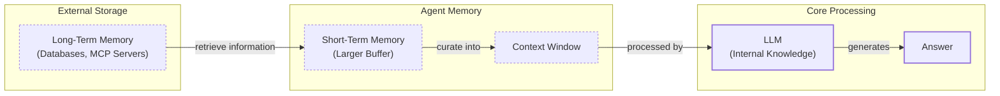

# How Does Memory for AI Agents Work?

Everyone’s talking about AI agents. But what actually is an agent? When do we need them? How do they plan and use tools? How do we pick the correct AI tools and agentic architecture? …and most importantly, where do we even start?

To answer all these questions (and more!), we’ve started a 9-article straight-to-the-point series to build the skills and mental models to ship real AI agents in production.

We will write everything from scratch, jumping directly into the building blocks that will teach you _“how to fish”_.

**What’s ahead**:

1.  AI Workflows vs. Agents
2.  Context Engineering
3.  Structured Outputs
4.  Basic Workflow Ingredients
5.  Tool Calling
6.  LLM Planning & Reasoning
7.  Building ReAct Agents
8.  **AI Agent’s Memory** ← You are here
9.  RAG Deep Dive

By the end, you’ll have a deep understanding of how to design agents that think, plan, and execute—and most importantly, how to integrate them in your AI apps without being overly reliant on any AI framework.

**Let’s get started.**

***

## Why Agents Need a Memory in the First Place

One year ago, we faced a common challenge: giving our agent the right information at the right time. Like most teams, we built a complex Retrieval-Augmented Generation (RAG) system. The ingestion pipeline became incredibly heavy, adding unnecessary complexity around scaling, monitoring, and maintenance.

We realized that for our specific use case, the data wasn't that big. We dropped the entire RAG layer, and everything became faster, cheaper, and more reliable. This taught me that the fundamental challenge isn't just about retrieval; it is about understanding how to architect memory systems that match your use case.

The core problem we are solving is a fundamental limitation of LLMs: their knowledge is vast but frozen in time. They are unable to learn by updating their weights after training, a problem known as “continual learning” [[1]](https://arxiv.org/html/2510.17281v2). An LLM without memory is like an intern with amnesia; they might be brilliant, but they cannot recall previous conversations or learn from experience.

To overcome this, we use the context window as a form of “working memory.” However, keeping an entire conversation thread in context is often unrealistic due to rising costs and the “lost in the middle” problem, where models struggle to use information buried in the center of a long prompt [[2]](https://arxiv.org/abs/2307.03172). Even frontier models can effectively lose 40% of relevant facts when context is saturated [[11]](https://medium.com/enterprise-rag/why-gemini-1-5-and-other-large-context-models-are-bullish-for-rag-ce3218930bb4).

Memory tools act as the solution. They provide agents with continuity, adaptability, and the ability to “learn” without retraining. When we first started building agents, working with 8k or 16k token limits forced us to engineer complex compression systems. Today, we have more breathing room, but the principles of organizing memory remain essential for performance.

In this article, we will explore the four fundamental types of memory for AI agents, take a detailed look at the components of long-term memory, examine the trade-offs between different storage methods, and cover the complete memory cycle.

To build effective agents, we can borrow terms from biology and cognitive science to categorize memory layers, which is useful for engineering.

## The Layers of Memory: Internal, Short-Term, and Long-Term

To build effective agents, we must distinguish between the different places information lives. We can borrow terms from biology and cognitive science to categorize these layers, which is useful for engineering. There are four distinct memory types based on their persistence and proximity to the model’s reasoning core [[3]](https://www.ibm.com/think/topics/ai-agent-memory), [[4]](https://decodingml.substack.com/p/memory-the-secret-sauce-of-ai-agents).

**Internal Knowledge** is the static, pre-trained knowledge baked into the LLM’s weights. It is the best place to store general world knowledge—models know about whole books without needing them in the context window. However, this memory is frozen at the time of training.

**The Context Window** is the slice of information we pass to the LLM during a specific call. It acts as the RAM of the LLM and is the only “reality” the model sees during inference.

**Short-Term Memory** is the RAM of the entire agentic system. It contains the active context window plus recent interactions, conversation history, and details retrieved from long-term memory. We slice this short-term memory to create the context window for a single inference step. It is volatile and fast, simulating the feeling of “learning” during a session [[3]](https://www.ibm.com/think/topics/ai-agent-memory).

**Long-Term Memory** is the external, persistent storage system (disk) where an agent saves and retrieves information. This layer provides the personalization and context that internal knowledge lacks and short-term memory cannot retain [[4]](https://decodingml.substack.com/p/memory-the-secret-sauce-of-ai-agents).

The dynamic between these layers creates the agent’s intelligence. First, part of the long-term memory is “retrieved” and brought into short-term memory. Next, we slice the short-term memory into an active context window through context engineering. Finally, during inference, the LLM uses its internal weights plus the active context window to generate output.


Image 1: A hierarchical diagram illustrating the four distinct memory types for AI agents and their dynamic data flow, from external storage to LLM processing and answer generation.

Categorizing memory this way is critical for engineering. Internal knowledge handles general reasoning, short-term memory manages the immediate task, and long-term memory provides personalization and continuity. No single layer can perform all these functions effectively. To better understand long-term memory, we can further apply cognitive science definitions to specific data types.

## Long-Term Memory: Semantic, Episodic, and Procedural

Long-term memory is not a single bucket of text. It consists of three distinct types, each serving a different role in making an agent “intelligent” [[5]](https://arxiv.org/html/2309.02427), [[6]](https://www.newsletter.swirlai.com/p/memory-in-agent-systems).

### Semantic Memory (Facts & Knowledge)

**Semantic memory** is the agent’s encyclopedia of facts. It stores knowledge like *“User is vegetarian”* or structured data like `{"food": "vegetarian"}`. For an enterprise agent, this could be internal documents. For a personal assistant, it’s a user profile with preferences (`{"music": "rock"}`) and constraints (`{"dog": "George"}`), allowing direct fact retrieval.

### Episodic Memory (Experiences & History)

**Episodic memory** is the agent’s personal diary, recording interactions with a timestamp to capture *“what happened and when.”* This maintains conversational context. Instead of just the fact *“User is frustrated with his brother,”* an episode adds nuance: *“On Tuesday, user expressed frustration about his brother, Mark, forgetting his birthday.”* This allows for more sensitive follow-ups and lets the agent answer, *“What happened last week?”* [[7]](https://www.youtube.com/watch?v=7AmhgMAJIT4&list=PLDV8PPvY5K8VlygSJcp3__mhToZMBoiwX&index=112).

### Procedural Memory (Skills & How-To)

**Procedural memory** is the agent’s muscle memory of skills and workflows. This “how-to” knowledge is often a reusable tool in its system prompt. For example, a `MonthlyReportIntent` procedure dictates the steps: 1) Query sales DB, 2) Summarize, 3) Email user. This makes behavior on common tasks reliable and predictable without reasoning from scratch every time [[8]](https://arxiv.org/html/2508.06433v2).

These types often work together. A support agent logs each return as an **episodic** record. These consolidate into a **semantic** rule (e.g., “damaged items get express replacement”). When a new case arrives, a **procedural** script uses both the rule and the current case details to act [[12]](https://arxiv.org/html/2603.07670v1).

Now that we know what to save, we must decide *how* to store it.

## Storing Memories: Pros and Cons of Different Approaches

The way an agent’s memories are stored is an architectural decision that impacts performance, complexity, and scalability. There is no one-size-fits-all solution; the choice should be guided by your product’s needs. Let’s explore the three primary methods.

### Storing Memories as Raw Strings

This simplest method indexes raw text for vector search. It’s fast to set up and preserves nuance. However, retrieval is often imprecise for specific facts [[14]](https://www.digitalapplied.com/blog/agent-memory-architectures-vector-graph-episodic). Updates are also difficult, as new information simply adds to a growing log, creating potential contradictions.

### Storing Memories as Entities (JSON-like Structures)

Here, an LLM extracts structured data like JSON. This allows precise, field-level filtering and easy updates, ideal for user profiles. The cons are upfront schema design and potential rigidity. The extraction process can also strip away the rich subtext of the original conversation.

### Storing Memories in a Knowledge Graph

This advanced approach stores memories as a network of nodes and edges. It excels at representing complex relationships and answering multi-hop queries (e.g., “Show me every task using library X”) [[14]](https://www.digitalapplied.com/blog/agent-memory-architectures-vector-graph-episodic). However, it has the highest complexity. Updates can also introduce latency, often requiring background processing to avoid blocking user interaction [[15]](https://atlan.com/know/episodic-memory-ai-agents/).

<aside>
💡

Vector databases are typically document databases with vector indexes. They are excellent for retrieval but, in terms of storage structure, they usually fall into the “raw strings” or “entities” bucket.

</aside>

The choice should be guided by your product’s needs. Start simple and evolve as complexity grows.

## Memory Implementations with Code Examples

This section details how to implement different memory types using code. While RAG is the mechanism for retrieving information, which we will cover in the next lesson, creating high-quality memories is an equally important preceding step. We will use the simplistic "storing memories as raw strings" approach to focus on the benefits of each memory category.

### Setup

`mem0` is an open-source memory library that we will use to implement the different types of memories.

1.  We will configure `mem0` to use Gemini for both the LLM and embeddings, with ChromaDB as a local vector store.
    ```python
    MEM0_CONFIG = {
        # Use Google's gemini-embedding-001 for embeddings (output reduced to 768-dim)
        "embedder": {
            "provider": "gemini",
            "config": {
                "model": "gemini-embedding-001",
                "embedding_dims": 768,
                "api_key": os.getenv("GOOGLE_API_KEY"),
            },
        },
        # Use ChromaDB as a local, in-notebook vector store
        "vector_store": {
            "provider": "chroma",
            "config": {
                "collection_name": "lesson9_memories",
                "path": "/tmp/chroma_mem0",
            },
        },
        "llm": {
            "provider": "gemini",
            "config": {
                "model": MODEL_ID,
                "api_key": os.getenv("GOOGLE_API_KEY"),
            },
        },
    }
    
    memory = Memory.from_config(MEM0_CONFIG)
    MEM_USER_ID = "lesson9_notebook_student"
    memory.delete_all(user_id=MEM_USER_ID)
    print("✅ Mem0 ready (Gemini embeddings + local Chroma).")
    ```
    It outputs:
    ```text
    ✅ Mem0 ready (Gemini embeddings + local Chroma).
    ```

2.  Next, we define helper functions to add and search for memories, tagging each with a category.
    ```python
    def mem_add_text(text: str, category: str = "semantic", **meta) -> str:
        """Add a single text memory. No LLM is used for extraction or summarization."""
        metadata = {"category": category}
        for k, v in meta.items():
            if isinstance(v, (str, int, float, bool)) or v is None:
                metadata[k] = v
            else:
                metadata[k] = str(v)
        memory.add(text, user_id=MEM_USER_ID, metadata=metadata, infer=False)
        return f"Saved {category} memory."
    
    
    def mem_search(query: str, limit: int = 5, category: Optional[str] = None) -> list[dict]:
        """
        Category-aware search wrapper.
        Returns the full result dicts so we can inspect metadata.
        """
        res = memory.search(query, user_id=MEM_USER_ID, limit=limit) or {}
    
        items = res.get("results", [])
        if category is not None:
            items = [r for r in items if (r.get("metadata") or {}).get("category") == category]
        return items
    ```

### Semantic Memory Example

Here, we store facts as individual strings.

1.  We insert a few example facts about a user.
    ```python
    facts: list[str] = [
        "User prefers vegetarian meals.",
        "User has a dog named George.",
        "User is allergic to gluten.",
        "User's brother is named Mark and is a software engineer.",
    ]
    for f in facts:
        print(mem_add_text(f, category="semantic"))
    
    print(f"Added {len(facts)} semantic memories.")
    ```
    It outputs:
    ```text
    Saved semantic memory.
    Saved semantic memory.
    Saved semantic memory.
    Saved semantic memory.
    Added 4 semantic memories.
    ```

2.  We can now search with a natural language query to retrieve a specific fact.
    ```python
    results = memory.search("brother job", user_id=MEM_USER_ID, limit=1)
    print(results["results"][0]["memory"])
    ```
    It outputs:
    ```text
    User's brother is named Mark and is a software engineer.
    ```

### Episodic Memory Example

This demonstrates how to compress a short conversation into a single "episode."

1.  We define a short dialogue and ask the LLM to summarize it into a concise episode.
    ```python
    dialogue = [
        {"role": "user", "content": "I'm stressed about my project deadline on Friday."},
        {"role": "assistant", "content": "I’m here to help—what’s the blocker?"},
        {"role": "user", "content": "Mainly testing. I also prefer working at night."},
        {"role": "assistant", "content": "Okay, we can split testing into two sessions."},
    ]
    
    episodic_prompt = f"""Summarize the following 3–4 turns as one concise 'episode' (1–2 sentences).
    Keep salient details and tone.
    
    {dialogue}
    """
    episode_summary = client.models.generate_content(model=MODEL_ID, contents=episodic_prompt)
    episode = episode_summary.text.strip()
    ```

2.  We save this summary as an episodic memory with additional metadata. `mem0` automatically adds a timestamp, enabling time-based queries.
    ```python
    print(
        mem_add_text(
            episode,
            category="episodic",
            summarized=True,
            turns=4,
        )
    )
    ```
    It outputs:
    ```text
    Saved episodic memory.
    ```

3.  Later, we can search for this experience using a semantic query.
    ```python
    hits = mem_search("deadline stress", limit=1, category="episodic")
    for h in hits:
        print(f"{h['memory']}\n")
    ```
    It outputs:
    ```text
    A user, stressed about a Friday project deadline because of testing and a preference for working at night, is advised to split the testing work into two manageable sessions.
    ```

### Procedural Memory Example

This shows how an agent can learn and execute a reusable workflow.

1.  We define a procedure as a text block containing ordered steps and save it.
    ```python
    procedure_name = "monthly_report"
    steps = [
        "Query sales DB for the last 30 days.",
        "Summarize top 5 insights.",
        "Ask user whether to email or display.",
    ]
    procedure_text = f"Procedure: {procedure_name}\nSteps:\n" + "\n".join(f"{i + 1}. {s}" for i, s in enumerate(steps))
    
    mem_add_text(procedure_text, category="procedure", procedure_name=procedure_name)
    
    print(f"Learned procedure: {procedure_name}")
    ```
    It outputs:
    ```text
    Learned procedure: monthly_report
    ```

2.  We can then retrieve the procedure by intent to simulate "running" it.
    ```python
    results = mem_search("how to create a monthly report", category="procedure", limit=1)
    if results:
        print(results[0]["memory"])
    ```
    It outputs:
    ```text
    Procedure: monthly_report
    Steps:
    1. Query sales DB for the last 30 days.
    2. Summarize top 5 insights.
    3. Ask user whether to email or display.
    ```

We've seen how to implement the different types of memories. Now, let's discuss some additional considerations when building a memory system.

## Real-World Lessons: Challenges and Best Practices

Moving from theory to a reliable, production-ready system requires navigating complex trade-offs that are constantly evolving. Here are some important lessons learned from building and scaling agent memory systems.

### Re-evaluating Compression

The trade-off between compressing information and preserving detail has shifted. Just two years ago, small 8k or 16k token windows forced lossy compression. Repeatedly summarizing history introduces “summarization drift,” where nuance is lost [[16]](https://dev.to/bobrenze/why-ai-agent-memory-systems-fail-in-production-and-how-i-fixed-mine-141d). Today, million-token windows allow for less compression, but they are expensive due to attention complexity and KV cache growth [[17]](https://introl.com/blog/long-context-llm-infrastructure-million-token-windows-guide). The raw conversational history is the ultimate source of truth. Design your system to use the most complete history feasible. Use summaries as queryable indexes, but treat the raw log as ground truth.

### Designing for the Product

There is no "perfect" memory architecture. The concepts of semantic, episodic, and procedural memory are a toolkit, not a blueprint. The most common failure is over-engineering. Start by defining the agent's core function. For a **Q&A bot**, a simple RAG pipeline is best. For a **personal AI companion**, rich episodic memories are valuable. For a **task-automation agent**, procedural memory is likely most useful for recalling multi-step workflows. The product's goal should dictate the architecture.

### The Human Factor and Memory Integrity

Memory should make the agent smarter, not give the user a new job. Users should not be asked to "garden their agent's memories" [[7]](https://www.youtube.com/watch?v=7AmhgMAJIT4&list=PLDV8PPvY5K8VlygSJcp3__mhToZMBoiwX&index=112). Memory management should be autonomous, but this creates risks like **staleness**, where agents act on outdated information [[12]](https://arxiv.org/html/2603.07670v1). They can also fall into **self-reinforcing error loops** from a single faulty memory [[18]](https://towardsdatascience.com/a-practical-guide-to-memory-for-autonomous-llm-agents/). The agent, not the user, is responsible for maintaining its own knowledge integrity.

## Conclusion

Memory is the component that transforms a stateless chat application into a personalized agent. It is the current engineering solution to the problem of continual learning. By constantly engineering the context window, we allow agents to “learn” and adapt over time.

_Remember that this article is part of a longer series on AI Agents Foundations that will give you the tools to morph from a Python developer to an AI Engineer._

**Here’s our roadmap:**

1.  AI Workflows vs. Agents
2.  Context Engineering
3.  Structured Outputs
4.  Basic Workflow Ingredients
5.  Tool Calling
6.  LLM Planning & Reasoning
7.  Building ReAct Agents
8.  **AI Agent’s Memory** ← You just finished this one.
9.  **RAG Deep Dive** ← Move to this one

In our next lesson, we will explore RAG in depth. We will also cover multimodal processing, MCP for agent-to-agent communication, and how to productionize, monitor, and evaluate your agents in future lessons.

## References

- [1] Wang, L., Zhang, X., Su, H., & Zhu, J. (2025). A Comprehensive Survey of Continual Learning. arXiv preprint arXiv:2302.00487. [https://arxiv.org/html/2510.17281v2](https://arxiv.org/html/2510.17281v2)
- [2] Liu, N. F., Lin, K., Hewitt, J., Paranjape, A., Bevilacqua, M., Petroni, F., & Liang, P. (2023). Lost in the Middle: How Language Models Use Long Contexts. arXiv preprint arXiv:2307.03172. [https://arxiv.org/abs/2307.03172](https://arxiv.org/abs/2307.03172)
- [3] What is AI agent memory?. (n.d.). IBM. [https://www.ibm.com/think/topics/ai-agent-memory](https://www.ibm.com/think/topics/ai-agent-memory)
- [4] Iusztin, P. (2024, May 21). Memory: The secret sauce of AI agents. Decoding AI Magazine. [https://decodingml.substack.com/p/memory-the-secret-sauce-of-ai-agent](https://decodingml.substack.com/p/memory-the-secret-sauce-of-ai-agent)
- [5] Sumers, T. R., Yao, S., Narasimhan, K., & Griffiths, T. L. (2023). Cognitive Architectures for Language Agents. arXiv. [https://arxiv.org/html/2309.02427](https://arxiv.org/html/2309.02427)
- [6] Griciūnas, A. (2024, October 30). Memory in Agent Systems. SwirlAI Newsletter. [https://www.newsletter.swirlai.com/p/memory-in-agent-systems](https://www.newsletter.swirlai.com/p/memory-in-agent-systems)
- [7] Whitmore, S. (2025, June 18). What is the perfect memory architecture?. YouTube. [https://www.youtube.com/watch?v=7AmhgMAJIT4&list=PLDV8PPvY5K8VlygSJcp3__mhToZMBoiwX&index=112](https://www.youtube.com/watch?v=7AmhgMAJIT4&list=PLDV8PPvY5K8VlygSJcp3__mhToZMBoiwX&index=112)
- [8] Mem^p: A Framework for Procedural Memory in Agents. (n.d.). arXiv. [https://arxiv.org/html/2508.06433v2](https://arxiv.org/html/2508.06433v2)
- [9] Chalef, D. (2024, June 25). Memex 2.0: Memory The Missing Piece for Real Intelligence. Substack. [https://danielp1.substack.com/p/memex-20-memory-the-missing-piece](https://danielp1.substack.com/p/memex-20-memory-the-missing-piece)
- [10] Chhikara, P. (2025). Mem0: Building Production-Ready AI Agents with Scalable Long-Term Memory. arXiv. [https://arxiv.org/html/2504.19413](https://arxiv.org/html/2504.19413)
- [11] Why Gemini 1.5 (and other large context models) are bullish for RAG. (2024). Medium. [https://medium.com/enterprise-rag/why-gemini-1-5-and-other-large-context-models-are-bullish-for-rag-ce3218930bb4](https://medium.com/enterprise-rag/why-gemini-1-5-and-other-large-context-models-are-bullish-for-rag-ce3218930bb4)
- [12] A Survey of Memory in Large Language Model-based Agents. (2026). arXiv. [https://arxiv.org/html/2603.07670v1](https://arxiv.org/html/2603.07670v1)
- [13] Conversational Memory. (2026). arXiv. [https://arxiv.org/html/2601.08160v1](https://arxiv.org/html/2601.08160v1)
- [14] Agent Memory Architectures: Vector, Graph, and Episodic. (2025). Digital Applied. [https://www.digitalapplied.com/blog/agent-memory-architectures-vector-graph-episodic](https://www.digitalapplied.com/blog/agent-memory-architectures-vector-graph-episodic)
- [15] Episodic Memory for AI Agents. (n.d.). Atlan. [https://atlan.com/know/episodic-memory-ai-agents/](https://atlan.com/know/episodic-memory-ai-agents/)
- [16] Renze, B. (2025). Why AI Agent Memory Systems Fail in Production (And How I Fixed Mine). DEV Community. [https://dev.to/bobrenze/why-ai-agent-memory-systems-fail-in-production-and-how-i-fixed-mine-141d](https://dev.to/bobrenze/why-ai-agent-memory-systems-fail-in-production-and-how-i-fixed-mine-141d)
- [17] Long-Context LLM Infrastructure. (2025). Introl Blog. [https://introl.com/blog/long-context-llm-infrastructure-million-token-windows-guide](https://introl.com/blog/long-context-llm-infrastructure-million-token-windows-guide)
- [18] Lawson, N. (2026). A Practical Guide to Memory for Autonomous LLM Agents. Towards Data Science. [https://towardsdatascience.com/a-practical-guide-to-memory-for-autonomous-llm-agents/](https://towardsdatascience.com/a-practical-guide-to-memory-for-autonomous-llm-agents/)