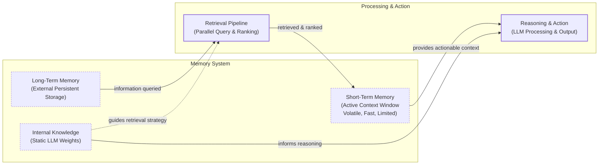

# How Memory for AI Agents Works

In the previous lessons, we built a solid foundation in AI Engineering. We explored the agent landscape, learned how to engineer context, and built a basic ReAct agent that can reason and use tools. Now, we will tackle one of the most important components for building advanced agents: memory.

LLMs have a fundamental limitation: their knowledge is vast but frozen in time. They are unable to learn or update their understanding from new interactions after they are deployed, a problem known as "continual learning." We can inject new knowledge through the context window, but this is a temporary fix. An LLM without a persistent memory system is like a brilliant intern with amnesia; it can solve complex problems but forgets everything the moment you start a new conversation.

The context window acts as the agent's working memory or RAM, but its finite size, cost, and tendency to "lose" information in the middle make it impractical to store an entire interaction history. Many early efforts to build personal AI companions hit these limits hard. With context windows of only 8,000 or 16,000 tokens, engineers were forced to build complex memory systems with aggressive compression and retrieval just to maintain a coherent conversation [[3]](https://www.youtube.com/watch?v=7AmhgMAJIT4&list=PLDV8PPvY5K8VlygSJcp3__mhToZMBoiwX&index=112).

While context windows are expanding, with models like Gemini 2.5 offering over a million tokens, the engineering trade-offs are constantly shifting. Relying solely on a massive context window is often inefficient and expensive. Less compression and retrieval might be needed, but the core challenge remains: how do we give agents the ability to remember?

Memory tools and architectures are the current engineering workaround for the model's inability to learn. They provide agents with continuity and adaptability, enabling them to build on past interactions. In this lesson, we will explore the different layers and types of agent memory, drawing parallels to cognitive science to understand how to design systems that can remember facts, experiences, and skills. We will cover how memories are stored, from simple text logs to complex knowledge graphs, and walk through a hands-on implementation using the `mem0` library.

## The Layers of Memory: Internal, Short-Term, and Long-Term

To build effective memory systems, it helps to borrow terminology from biology and cognitive science. This gives us a clear framework for thinking about how an agent should store and access different kinds of information. An agent’s memory can be organized into three distinct layers: internal knowledge, short-term memory, and long-term memory [[9]](https://www.linkedin.com/posts/pauliusztin_every-ai-agent-has-4-distinct-memory-layers-activity-7436765234800807936-QyLR).

**Internal Knowledge** is the static, pre-trained information embedded in the LLM's weights. This includes general world knowledge, language patterns, and reasoning abilities. It is the most efficient way to store information, as the model can access vast datasets like entire books with an empty context window. However, this knowledge is read-only and cannot be updated with new experiences without fine-tuning, which is a core limitation.

**Short-Term Memory (STM)**, or working memory, is the agent's active context window. It is volatile, fast, and limited in size. This is the only reality the model sees during a single interaction and the primary way we can simulate learning over time. If information is not in the context window, it does not exist for the model in that moment. This is where context engineering, which we discussed in Lesson 3, becomes critical.

**Long-Term Memory (LTM)** is an external, persistent storage system like a database or vector store. This is where an agent saves information it needs to retain across sessions, such as user preferences, past conversations, or learned facts. It gives the agent continuity.

These layers work together in a dynamic flow. Information from long-term memory is queried and pulled into short-term memory through a retrieval pipeline, providing the LLM with the necessary context to reason and act. Internal knowledge informs the entire process, from guiding the retrieval strategy to applying general reasoning to the context provided.


Image 1: A hierarchy and flow diagram illustrating an AI agent's memory system, showing the interaction between Internal Knowledge, Short-Term Memory, Long-Term Memory, and a Retrieval Pipeline leading to Reasoning and Action.

Categorizing memory this way is useful because each layer serves a distinct function. Internal knowledge provides general intelligence, short-term memory handles the immediate task, and long-term memory adds the specific context and personalization that the other layers lack. To build truly capable agents, we need to go deeper into the structure of long-term memory.

## Long-Term Memory: Semantic, Episodic, and Procedural

Just as human long-term memory is not a single, monolithic entity, an agent's LTM can be broken down into different types. This modular approach allows us to use different storage and retrieval strategies for different kinds of information [[1]](https://arxiv.org/html/2309.02427), [[2]](https://www.ibm.com/think/topics/ai-agent-memory). The three primary types are semantic, episodic, and procedural memory.

### Semantic Memory (Facts & Knowledge)

**Semantic memory** is the agent's encyclopedia, a repository of factual and conceptual knowledge. These "facts" can be stored as individual, independent strings like "The user is a vegetarian," or attached to an "entity" in a more structured format, such as a JSON object: `{"food_restrictions": "User is a vegetarian"}`. The structure you choose depends on your agent's use case. For example, you could even structure this memory as a graph database to capture complex relationships between facts.

The primary role of semantic memory is to provide the agent with a reliable source of truth. For an enterprise agent, this might be internal company documents, technical manuals, or a product catalog, allowing it to answer questions on proprietary topics. For a personal assistant, semantic memory is used to build a persistent user profile, storing key information like preferences (`{"music": "User likes rock music"}`), relationships (`{"dog": "User has a dog named George"}`), or constraints (`{"food_restrictions": "User is allergic to gluten"}`). When the agent needs specific information, it can query this structured knowledge base instead of searching through a noisy and lengthy conversation history, retrieving only what is relevant.

### Episodic Memory (Experiences & History)

**Episodic memory** is the agent's personal diary, a chronological record of its past interactions and experiences. Think of these as facts with a timestamp attached. While semantic memory stores timeless knowledge, episodic memory is about "what happened and when."

This memory type is essential for maintaining conversational context and understanding complex dynamics over time. For example, a semantic memory might store two separate facts: "User's brother is named Mark" and "User is frustrated with his brother." An episodic memory captures the nuanced event: "On Tuesday, the user expressed frustration that their brother, Mark, always forgets their birthday. I provided an empathetic response. [created_at=2025-08-25T17:20:04Z]".

This "episode" provides deeper context, allowing the agent to interact with more intelligence and empathy in the future. If the topic of the brother comes up again, the agent can recall this specific event and respond with greater awareness, perhaps saying, "As you expressed last week, I know the topic of your brother's birthday can be sensitive." With the time element, the agent can also answer questions like "What happened on June 8th?" Depending on the product, episodes can be grouped by conversation, day, or week. There is no one-size-fits-all solution; the right time-scale depends on the agent's purpose.

### Procedural Memory (Skills & How-To)

**Procedural memory** is the agent's muscle memory, its collection of learned skills and workflows. It is the "how-to" knowledge that enables it to perform multi-step tasks reliably and efficiently. It is a set of pre-defined playbooks for common requests.

This memory is often encoded as a reusable tool, function, or a defined sequence of actions within the agent's system prompt. For example, an agent might have a stored procedure called `MonthlyReportIntent`. When a user asks for a monthly update, the agent does not need to reason from scratch. It retrieves this procedure, which outlines a clear series of steps: 1. Query the sales database for the last 30 days, 2. Summarize the key findings, and 3. Ask the user if they want the summary emailed or displayed. This makes the agent's behavior on common tasks highly predictable and fast. By encoding successful workflows, procedural memory allows an agent to improve its task-completion efficiency over time, reducing errors and ensuring complex jobs are executed consistently.

Now that we have an idea of what to save and the benefits of each memory type, a new question arises: how should we store this information?

## Storing Memories: Pros and Cons of Different Approaches

How an agent's memories are stored is a critical architectural decision that impacts performance, complexity, and scalability. While the goal is always to provide the right context at the right time, the method of storage involves trade-offs. The ideal approach depends entirely on the product's use case. Let's explore the three primary methods: storing memories as raw strings, as structured entities, and within a knowledge graph.

### Storing memories as raw strings

This is the simplest method, where conversational turns or documents are stored as plain text and indexed for vector search. This approach is fast to set up, requiring minimal engineering overhead to get started. By storing the raw text, it also preserves the full nuance of the interaction, including emotional tone and subtle linguistic cues, ensuring nothing is lost in translation [[6]](https://towardsdatascience.com/a-practical-guide-to-memory-for-autonomous-llm-agents/).

However, this simplicity comes at a cost. Retrieval is often imprecise, as relying solely on semantic similarity is not always enough. A query might retrieve text that is semantically related but contextually wrong. For example, asking "What is my brother’s job?" could retrieve every past conversation where "brother" and "job" were mentioned, without pinpointing the correct fact [[7]](https://www.decodingai.com/p/how-does-memory-for-ai-agents-work). Updating information is also difficult; if a user corrects a fact, the new information is just another string in a growing log, creating potential contradictions. This lack of structure makes it hard to handle temporal reasoning or state changes, like distinguishing between "Barry *was* the CEO" and "Claude *is* the CEO" [[7]](https://www.decodingai.com/p/how-does-memory-for-ai-agents-work).

### Storing Memories as Entities (JSON-like Structures)

In this approach, unstructured interactions are converted into structured memories using an LLM and stored in a format like JSON. This makes the information highly organized and precise. Data is stored in key-value pairs (e.g., `"user": {"brother": {"job": "Software Engineer"}}`), which allows for exact, field-level filtering. This structure also makes updates straightforward; if a user's preference changes, only the relevant field in the JSON object needs to be modified. This method is ideal for semantic memory, where user profiles and preferences are stored as facts.

The main drawback is the increased upfront complexity. Designing a schema or data model requires careful thought and adds an initial engineering hurdle [[3]](https://www.youtube.com/watch?v=7AmhgMAJIT4&list=PLDV8PPvY5K8VlygSJcp3__mhToZMBoiwX&index=112). A predefined schema can also be rigid; if the agent encounters information that does not fit the structure, that data may be lost. While an LLM can dynamically alter the schema, this adds another layer of complexity and increases the risk of creating duplicate information. Furthermore, the extraction process can strip away the rich subtext of the original conversation. The factual memory `"user_likes": ["cats"]` is far less representative than the original message, "Petting my cat is the best part of my day" [[3]](https://www.youtube.com/watch?v=7AmhgMAJIT4&list=PLDV8PPvY5K8VlygSJcp3__mhToZMBoiwX&index=112).

### Storing Memories in a Graph Database

This is the most advanced approach, where memories are stored as a network of nodes (entities) and edges (relationships), forming a knowledge graph. The core strength of a graph is its ability to explicitly represent complex relationships, such as `(User) -> [HAS_BROTHER] -> (Mark) -> [WORKS_AS] -> (Software Engineer)`. This enables sophisticated queries that trace connections between different pieces of information [[8]](https://www.octoco.ai/blog/knowledge-graphs-as-memory), [[5]](https://danielp1.substack.com/p/memex-20-memory-the-missing-piece). Knowledge graphs also provide superior contextual and temporal awareness by modeling time as an explicit property of a relationship (e.g., `User -[RECOMMENDED_ON_DATE: "2025-10-25"]-> Restaurant`) [[8]](https://www.octoco.ai/blog/knowledge-graphs-as-memory). Finally, retrieval is transparent and auditable, as you can trace the exact path of nodes and edges that led to an answer [[8]](https://www.octoco.ai/blog/knowledge-graphs-as-memory), [[5]](https://danielp1.substack.com/p/memex-20-memory-the-missing-piece).

However, this power comes with the highest complexity and cost. This method requires a significant upfront investment in schema design, data modeling, and ongoing maintenance [[8]](https://www.octoco.ai/blog/knowledge-graphs-as-memory). Complex graph traversals can also be slower than simple vector lookups, potentially impacting real-time performance [[8]](https://www.octoco.ai/blog/knowledge-graphs-as-memory). For many applications, the complexity of a graph database is overkill, and a simpler approach may be more than sufficient [[8]](https://www.octoco.ai/blog/knowledge-graphs-as-memory).

To help you decide, here is a table summarizing the trade-offs.

| Approach | Pros | Cons |
| :--- | :--- | :--- |
| **Raw Strings** | Simple, fast to set up, preserves full nuance. | Imprecise retrieval, hard to update, lacks structure. |
| **Entities (JSON)** | Structured, precise, easy to update, great for facts. | Upfront complexity, potential schema rigidity, loss of nuance. |
| **Knowledge Graph** | Represents complex relationships, superior temporal awareness, auditable. | Highest complexity and cost, potentially slower queries, overkill for simple cases. |
Table 1: A comparison of memory storage approaches and their key trade-offs.

The right choice should be guided by your product's core needs. It is often best to start with the simplest architecture that delivers value and evolve it as the demands on your agent grow. Now that we know what to save and how to store it, let's look at some code examples using available memory tools.

## Memory implementations with code examples

While Retrieval-Augmented Generation (RAG) is the mechanism for retrieving information, the creation of high-quality memories is an equally important, preceding step. We will cover RAG in detail in the next lesson. Before retrieval, an agent must first form the memory. To demonstrate the benefits of each memory category without getting bogged down by storage architecture, we will use the simple "raw strings" approach with the `mem0` library.

### What is mem0?

Mem0 is an open-source memory layer designed for AI agents. It provides a simple API for adding, searching, and managing different types of memories, abstracting away the complexities of the underlying storage. It supports various vector databases and can be configured to work with different LLMs and embedding models [[4]](https://arxiv.org/html/2504.19413).

### Setup

First, let's set up our environment. We will configure `mem0` to use Gemini for both the LLM and embeddings, and ChromaDB as a local vector store. This setup runs entirely within our notebook.

1.  We start by configuring `mem0` with our Gemini API key, specifying the models for embeddings and the LLM, and setting up a local ChromaDB vector store.
    ```python
    import os
    import re
    from typing import Optional
    
    from google import genai
    from mem0 import Memory
    
    from utils import env
    
    env.load(required_env_vars=["GOOGLE_API_KEY"])
    
    client = genai.Client()
    MODEL_ID = "gemini-2.5-pro"
    
    MEM0_CONFIG = {
        "embedder": {
            "provider": "gemini",
            "config": {
                "model": "gemini-embedding-001",
                "embedding_dims": 768,
                "api_key": os.getenv("GOOGLE_API_KEY"),
            },
        },
        "vector_store": {
            "provider": "chroma",
            "config": {
                "collection_name": "lesson9_memories",
                "path": "/tmp/chroma_mem0",
            },
        },
        "llm": {
            "provider": "gemini",
            "config": {
                "model": MODEL_ID,
                "api_key": os.getenv("GOOGLE_API_KEY"),
            },
        },
    }
    
    memory = Memory.from_config(MEM0_CONFIG)
    MEM_USER_ID = "lesson9_notebook_student"
    memory.delete_all(user_id=MEM_USER_ID)
    print("✅ Mem0 ready (Gemini embeddings + local Chroma).")
    ```
    It outputs:
    ```text
    ✅ Mem0 ready (Gemini embeddings + local Chroma).
    ```

2.  Next, we define two helper functions. `mem_add_text` saves a string to memory with a specified category, and `mem_search` retrieves memories, with an option to filter by category.
    ```python
    def mem_add_text(text: str, category: str = "semantic", **meta) -> str:
        """Add a single text memory. No LLM is used for extraction or summarization."""
        metadata = {"category": category}
        for k, v in meta.items():
            if isinstance(v, (str, int, float, bool)) or v is None:
                metadata[k] = v
            else:
                metadata[k] = str(v)
        memory.add(text, user_id=MEM_USER_ID, metadata=metadata, infer=False)
        return f"Saved {category} memory."
    
    
    def mem_search(query: str, limit: int = 5, category: Optional[str] = None) -> list[dict]:
        """
        Category-aware search wrapper.
        Returns the full result dicts so we can inspect metadata.
        """
        res = memory.search(query, user_id=MEM_USER_ID, limit=limit) or {}
    
        items = res.get("results", [])
        if category is not None:
            items = [r for r in items if (r.get("metadata") or {}).get("category") == category]
        return items
    ```

### Semantic Memory: Extracting Facts

Semantic memory is created through a deliberate extraction pipeline. An LLM processes unstructured text with a specific prompt to extract atomic, queryable facts. This turns messy conversation threads into a structured knowledge base.

An example extraction prompt for a general personal assistant might be:
```
Extract persistent facts and strong preferences as short bullet points.
- Keep each fact atomic and context-independent. While reading the messages, make sure to notice the nuance or subtle details that might be important when saving these facts.
- 3–6 bullets max.

Text:
{My brother Mark is a software engineer, but his real passion is painting, he gifted me a painting a few years ago. Its really beautiful.}
```
This would create memories like: `Mark is the user's brother.`, `Mark is a software engineer.`, `Mark's real passion is painting.`, and `The user has a painting from Mark and finds it beautiful.`.

Retrieval often uses hybrid search, which combines keyword filtering with semantic search. For a query like "What's my brother's job?", the system would first filter for memories containing "brother" and then perform a vector search for "job" to find the most relevant fact.

Let's see this in action with our notebook code.

1.  We add a few facts to our semantic memory.
    ```python
    facts: list[str] = [
        "User prefers vegetarian meals.",
        "User has a dog named George.",
        "User is allergic to gluten.",
        "User's brother is named Mark and is a software engineer.",
    ]
    for f in facts:
        print(mem_add_text(f, category="semantic"))
    
    print(f"Added {len(facts)} semantic memories.")
    ```
    It outputs:
    ```text
    Saved semantic memory.
    Saved semantic memory.
    Saved semantic memory.
    Saved semantic memory.
    Added 4 semantic memories.
    ```

2.  Now, we can search for a specific fact with a natural language query.
    ```python
    results = memory.search("brother job", user_id=MEM_USER_ID, limit=1)
    print(results["results"][0]["memory"])
    ```
    It outputs:
    ```text
    User's brother is named Mark and is a software engineer.
    ```

### Episodic Memory: The Log of Events

Episodic memory functions as a chronological log. It can be created by having an LLM read conversation messages and extract or summarize the key insights, facts, and events that occurred, along with a timestamp.

A prompt to create an episodic memory for a coding tutor might be:
```
You are a personal coding tutor for a user, you will extract events, likes, dislikes, or any other insights from the conversation text, that will serve to better teach the user, and help them improve their skills in coding. Make sure to capture the nuance and details of the conversation, and not just the facts.
```
Given the input `User: "I'm feeling stressed about my project deadline on Friday."`, a raw memory would be `October 26th, 2025. 2:30PM EST: User: "I'm feeling stressed about my project deadline on Friday."`, while a summarized one would be `October 26th, 2025. 2:30PM EST: "The user is stressed about their project deadline on Friday and the assistant offers to help."`.

Retrieval from episodic memory often blends temporal and semantic queries, for example, filtering by a date range and then using semantic search to find contextually similar conversations.

Let's implement this by summarizing a short dialogue into a single episode.

1.  We define a short conversation and use the LLM to create a concise summary.
    ```python
    dialogue = [
        {"role": "user", "content": "I'm stressed about my project deadline on Friday."},
        {"role": "assistant", "content": "I’m here to help. What’s the blocker?"},
        {"role": "user", "content": "Mainly testing. I also prefer working at night."},
        {"role": "assistant", "content": "Okay, we can split testing into two sessions."},
    ]
    
    episodic_prompt = f"""Summarize the following 3–4 turns as one concise 'episode' (1–2 sentences).
    Keep salient details and tone.
    
    {dialogue}
    """
    episode_summary = client.models.generate_content(model=MODEL_ID, contents=episodic_prompt)
    episode = episode_summary.text.strip()
    print(episode)
    ```
    It outputs:
    ```text
    A user, stressed about a Friday project deadline because of testing and a preference for working at night, is advised to split the testing work into two manageable sessions.
    ```

2.  We add this summary to our episodic memory, including some metadata.
    ```python
    print(
        mem_add_text(
            episode,
            category="episodic",
            summarized=True,
            turns=4,
        )
    )
    ```
    It outputs:
    ```text
    Saved episodic memory.
    ```

3.  We can now retrieve this episode using a semantic query. The result includes the memory and its creation timestamp, which is automatically added by `mem0`.
    ```python
    print("\nSearch --> 'deadline stress'\n")
    hits = mem_search("deadline stress", limit=1, category="episodic")
    for h in hits:
        print(f"{h['memory']}\n")
        print(h)
    ```
    It outputs:
    ```text
    Search --> 'deadline stress'
    
    A user, stressed about a Friday project deadline because of testing and a preference for working at night, is advised to split the testing work into two manageable sessions.
    
    {'id': '...', 'memory': '...', 'metadata': {'turns': 4, 'summarized': True, 'category': 'episodic'}, 'score': 0.91..., 'created_at': '2025-09-12T02:30:01.358468-07:00', ...}
    ```

### Procedural Memory: Defining and Learning Skills

Procedural memory can be created in two ways: defined by a developer as a tool or function, or learned dynamically from user instructions. An example prompt for learning a new skill could be:
```
You are an agent that can learn new skills. When a user provides a numbered list of steps to accomplish a goal, your task is to run the "learn_procedure" tool, and convert these numbered list of steps into a reusable procedure. Identify the core actions and any variable parameters (e.g., dates, locations, names).

Examples:
User Input: "I want you to book a cabin for this summer. To do that, please remember to: 1. Search for cabins on CabinRentals.com my favorite website. 2. Filter for locations in the mountains, the closer to them, the better. 3. Make sure it's available around July. 4 to 8th. 5. Send me the top 3 options."

learn_procedure(name="find_summer_cabin", steps="first search for cabins on CabinRentals.com, then filter for locations in the mountains, check for distance to the mountains, then check availability around what the user wants, if the user hasn't specified a date, ask the user for a date, once you have a list of options, send the top 3 options")
```
Retrieval is an intent-matching process where the agent's LLM compares a user's request against the descriptions of all available procedures and selects the appropriate one to execute.

Let's teach our agent a simple procedure for creating a monthly report.

1.  We define the procedure as a block of text and save it to our procedural memory.
    ```python
    procedure_name = "monthly_report"
    steps = [
        "Query sales DB for the last 30 days.",
        "Summarize top 5 insights.",
        "Ask user whether to email or display.",
    ]
    procedure_text = f"Procedure: {procedure_name}\nSteps:\n" + "\n".join(f"{i + 1}. {s}" for i, s in enumerate(steps))
    
    mem_add_text(procedure_text, category="procedure", procedure_name=procedure_name)
    
    print(f"Learned procedure: {procedure_name}")
    ```
    It outputs:
    ```text
    Learned procedure: monthly_report
    ```

2.  Now, we can retrieve this procedure by asking the agent how to perform the task.
    ```python
    results = mem_search("how to create a monthly report", category="procedure", limit=1)
    if results:
        print(results[0]["memory"])
    ```
    It outputs:
    ```text
    Procedure: monthly_report
    Steps:
    1. Query sales DB for the last 30 days.
    2. Summarize top 5 insights.
    3. Ask user whether to email or display.
    ```

We have seen how to implement different memory types. Now, let's discuss some of the challenges and best practices you will encounter when building these systems in the real world.

## Real-World Lessons: Challenges and Best Practices

The architectural patterns we have discussed provide a useful toolkit, but moving from theory to a reliable, production-ready system requires navigating complex trade-offs. Here are some important lessons learned from building and scaling agent memory systems.

### Re-evaluating compression

One of the biggest shifts in memory design has been the trade-off between compressing information and preserving its raw detail.

Just a couple of years ago, LLMs operated with small and expensive context windows of 8,000 or 16,000 tokens. This forced AI engineers to be ruthless with compression, distilling every interaction into its most compact form. While necessary, this process is inherently lossy; summaries keep the general idea but lose the fine details and nuance that are often crucial for a personalized agent [[3]](https://www.youtube.com/watch?v=7AmhgMAJIT4&list=PLDV8PPvY5K8VlygSJcp3__mhToZMBoiwX&index=112).

Today, with models offering million-token context windows at a fraction of the cost, the best practice is to lean towards less compression. The raw, unstructured conversational history is the ultimate source of truth. It contains the emotional subtext and relational dynamics that are often lost during extraction. While a fact might state, "User has a dog named George," the episodic log reveals, "User mentioned that walking their dog George is the best part of their day," a far more valuable piece of information [[3]](https://www.youtube.com/watch?v=7AmhgMAJIT4&list=PLDV8PPvY5K8VlygSJcp3__mhToZMBoiwX&index=112).

The best practice is to design your system to work with the most complete version of history that is technically and economically feasible. Use summarization and fact extraction to create queryable indexes, but always treat the raw log as the ground truth. As context windows grow, your retrieval pipeline may need to do less *retrieving* and more intelligent *filtering* of a larger, in-context history [[3]](https://www.youtube.com/watch?v=7AmhgMAJIT4&list=PLDV8PPvY5K8VlygSJcp3__mhToZMBoiwX&index=112).

### Designing for the Product

There is no "perfect" memory architecture. The concepts of semantic, episodic, and procedural memory are a powerful mental model, but they are a toolkit, not a mandatory blueprint. A common failure mode is over-engineering a complex memory system for a product that does not need it.

It can be tempting to build a system that handles all memory types from day one, but this often leads to unnecessary complexity and higher maintenance costs. Instead, start from first principles by defining the core function of your agent. The product's goal should dictate the memory architecture, not the other way around [[3]](https://www.youtube.com/watch?v=7AmhgMAJIT4&list=PLDV8PPvY5K8VlygSJcp3__mhToZMBoiwX&index=112).
-   For a Q&A bot over internal documents, a simple RAG pipeline is the best starting point.
-   For a long-term personal AI companion, rich episodic memories are beneficial. The agent's value comes from its ability to remember the narrative of your relationship.
-   For a task-automation agent, procedural memory is likely key, allowing the agent to recall and execute multi-step workflows.

### The Human Factor

Memory exists to make the agent smarter, not to give the user a new job. A common pitfall is exposing the internal workings of the memory system to the user. While well-intentioned, this can create significant cognitive overhead and break the illusion of a capable assistant [[3]](https://www.youtube.com/watch?v=7AmhgMAJIT4&list=PLDV8PPvY5K8VlygSJcp3__mhToZMBoiwX&index=112).

Users should not be asked to "garden their agent's memories." This turns the interaction into a tedious data-entry task. A user's mental model is that they are talking to a single entity; they do not want to become a database administrator. Memory management should be an autonomous function of the agent. It should learn from corrections within the natural flow of conversation (e.g., "Actually, my brother's name is Mark, not Mike"). The agent, not the user, is responsible for maintaining the integrity of its own knowledge.

## Conclusion

Memory is what transforms a simple, stateless chatbot into a truly adaptive and personalized agent. By understanding the different layers and types of memory, you can design systems that maintain conversational continuity, learn from past interactions, and provide more capable and reliable assistance. While today's memory tools are a temporary solution for the lack of true "continual learning" in LLMs, they are a powerful and practical approach that works right now. This ability to store, manage, and retrieve information is a cornerstone of building intelligent systems that feel less like tools and more like collaborators.

In this lesson, we have laid the groundwork for building memory-enabled agents, exploring both the theory and hands-on implementation. In our next lesson, we will dive deeper into Retrieval-Augmented Generation (RAG), the core mechanism for pulling information from long-term memory. As we move forward in the course, we will continue to build on these concepts, exploring more advanced topics like multi-agent systems, production deployment, and the evaluation pipelines necessary to ensure our agents are not just smart, but also reliable and effective in the real world.

## References

- [1] [https://arxiv.org/html/2309.02427](https://arxiv.org/html/2309.02427)
- [2] [https://www.ibm.com/think/topics/ai-agent-memory](https://www.ibm.com/think/topics/ai-agent-memory)
- [3] [https://www.youtube.com/watch?v=7AmhgMAJIT4&list=PLDV8PPvY5K8VlygSJcp3__mhToZMBoiwX&index=112](https://www.youtube.com/watch?v=7AmhgMAJIT4&list=PLDV8PPvY5K8VlygSJcp3__mhToZMBoiwX&index=112)
- [4] [https://arxiv.org/html/2504.19413](https://arxiv.org/html/2504.19413)
- [5] [https://danielp1.substack.com/p/memex-20-memory-the-missing-piece](https://danielp1.substack.com/p/memex-20-memory-the-missing-piece)
- [6] [https://towardsdatascience.com/a-practical-guide-to-memory-for-autonomous-llm-agents/](https://towardsdatascience.com/a-practical-guide-to-memory-for-autonomous-llm-agents/)
- [7] [https://www.decodingai.com/p/how-does-memory-for-ai-agents-work](https://www.decodingai.com/p/how-does-memory-for-ai-agents-work)
- [8] [https://www.octoco.ai/blog/knowledge-graphs-as-memory](https://www.octoco.ai/blog/knowledge-graphs-as-memory)
- [9] [https://www.linkedin.com/posts/pauliusztin_every-ai-agent-has-4-distinct-memory-layers-activity-7436765234800807936-QyLR](https://www.linkedin.com/posts/pauliusztin_every-ai-agent-has-4-distinct-memory-layers-activity-7436765234800807936-QyLR)