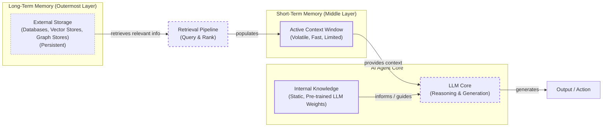

# How Does Memory for AI Agents Work?

In our previous lessons, we built a foundation in AI Engineering. We explored the agent landscape, distinguished between LLM workflows and autonomous agents, mastered context engineering, and learned to get reliable structured outputs. We even built a ReAct agent from scratch, giving it the ability to reason and use tools. Now, we will tackle the component that transforms a stateless tool into an intelligent collaborator: memory.

The core problem we are solving is a fundamental limitation of today's LLMs: their knowledge is vast but frozen in time. They are unable to learn by updating their weights after training, a problem known as “continual learning.” An LLM without memory is like an intern with amnesia. They might be brilliant, but they cannot recall previous conversations or learn from experience. To overcome this, we use the context window as a form of “working memory.” However, keeping an entire conversation thread plus additional information in the context window is often unrealistic. Rising costs per turn and the “lost in the middle” problem limit this approach. The model struggles to use information buried in the center of a long prompt.

However, this is a moving target. With models like Gemini offering million-token context windows at a fraction of the cost, the engineering trade-offs are constantly shifting. The best practice is now to lean towards less compression, as the raw conversational history is the ultimate source of truth. While a fact might state, "User has a dog," the raw log reveals, "User mentioned that walking their dog is the best part of their day," a far more valuable piece of information for a personalized agent. Still, even massive context windows are not a silver bullet. Memory tools are the current engineering solution. They provide agents with continuity, adaptability, and the ability to “learn” without retraining.

In this article, we will explore the fundamental types of agent memory, take a detailed look at long-term semantic, episodic, and procedural memory, analyze the trade-offs between different storage methods, and walk through practical implementations and real-world best practices. Let's begin by examining the different layers of memory.

## The Layers of Memory: Internal, Short-Term, and Long-Term

To build effective agents, we must distinguish between the different places information lives. We can borrow terms from biology and cognitive science to categorize these layers, which is useful for engineering our systems. There are three distinct memory layers based on their persistence and proximity to the model’s reasoning core.

**Internal Knowledge** is the static, pre-trained knowledge baked into the LLM’s weights. This is the best place to store general world knowledge—models know about whole books without needing them in the context window. However, this memory is frozen at the time of training and cannot be updated with new experiences.

**Short-Term Memory** is the active context window, the slice of information we pass to the LLM during a specific call. It acts as the RAM of the agent, holding the current conversation, retrieved facts, and tool outputs. It is volatile and fast, simulating the feeling of “learning” during a session, but it is also limited in size [[1]](https://www.ibm.com/think/topics/ai-agent-memory).

**Long-Term Memory** is the external, persistent storage system where an agent saves and retrieves information across sessions. This layer provides the personalization and context that internal knowledge lacks and short-term memory cannot retain [[2]](https://decodingml.substack.com/p/memory-the-secret-sauce-of-ai-agents).

The dynamic between these layers creates the agent’s intelligence. A retrieval pipeline queries long-term memory, pulling relevant information into the short-term memory. This curated context, combined with the LLM's internal knowledge, is then used for reasoning and generating a response. This process is better understood as a continuous **write-manage-read loop**. New information is written to memory, existing memories are managed through processes like pruning or consolidation, and relevant memories are read into the context for action. Many systems focus only on writing and reading, but neglecting the management step is a common cause of failure, leading to noisy, bloated, and contradictory memory stores [[3]](https://towardsdatascience.com/a-practical-guide-to-memory-for-autonomous-llm-agents/).


Image 1: A layered architecture diagram of an AI agent's memory system, showing the flow from Long-Term Memory through a Retrieval Pipeline to Short-Term Memory, interacting with Internal Knowledge and the LLM Core to produce an output.

Categorizing memory this way is critical for engineering. Internal knowledge handles general reasoning, short-term memory manages the immediate task, and long-term memory handles personalization and continuity. No single layer can perform all three functions effectively. To better understand long-term memory, we can further apply cognitive science definitions to specific data types.

## Long-Term Memory: Semantic, Episodic, and Procedural

Long-term memory is not a single bucket of text. It consists of three distinct types, each serving a different role in making an agent “intelligent” [[4]](https://arxiv.org/html/2309.02427), [[5]](https://www.newsletter.swirlai.com/p/memory-in-agent-systems).

### Semantic Memory (Facts & Knowledge)

Semantic memory is the agent’s encyclopedia. It stores individual pieces of knowledge or “facts.” These can be independent strings, such as _“The user is a vegetarian,”_ or structured attributes attached to an entity, like `{"food_restrictions": "vegetarian"}`. This is where the agent stores concepts and relationships regarding specific domains, people, or places. The structure you choose depends heavily on the agent's use case; it could be a simple collection of text or a complex graph database. We will explore the pros and cons of these approaches later.

The primary role of semantic memory is to provide a reliable source of truth. For an enterprise agent, this might involve storing internal company documents or technical manuals, allowing it to answer questions on proprietary topics. For a personal assistant, semantic memory builds a persistent user profile. It recalls specific preferences like `{"music": "User likes rock music"}` or constraints like `{"dog": "User has a dog named George"}`. This allows the agent to retrieve relevant facts without searching through a noisy conversation history. In practice, this can be implemented as a curated file, such as a `MEMORY.md` in an agent's workspace, where the agent or a developer periodically decides which facts are worth preserving as lasting truths [[3]](https://towardsdatascience.com/a-practical-guide-to-memory-for-autonomous-llm-agents/).

### Episodic Memory (Experiences & History)

Episodic memory is the agent’s personal diary. It records past interactions, but unlike timeless facts, these memories have a timestamp. It captures _“what happened and when.”_ This memory type is essential for maintaining conversational context and understanding relationship dynamics [[6]](https://www.youtube.com/watch?v=7AmhgMAJIT4&list=PLDV8PPvY5K8VlygSJcp3__mhToZMBoiwX&index=112).

A semantic fact might be _“User is frustrated with his brother.”_ An episodic memory would be: _“On Tuesday, the user expressed frustration that their brother, Mark, always forgets their birthday. I provided an empathetic response. [created_at=2025-08-25].”_ This “episode” provides nuanced context. If the topic comes up again, the agent can say, “I know the topic of your brother’s birthday can be sensitive,” rather than just stating a fact. It also allows the agent to answer questions like _“What happened last week?”_ Depending on the use case, these memories can group events over a day, a week, or a single conversation. A practical implementation could be daily logs where each agent summarizes its activities, findings, and escalations. This creates a searchable timeline that allows agents to review past work, identify patterns, and avoid repeating failures [[3]](https://towardsdatascience.com/a-practical-guide-to-memory-for-autonomous-llm-agents/).

### Procedural Memory (Skills & How-To)

Procedural memory is the agent’s muscle memory. It consists of skills, learned workflows, and “how-to” knowledge. It dictates the agent’s ability to perform multi-step tasks.

This memory is often baked into the agent’s system prompt as reusable tools or defined sequences. For example, an agent might store a `MonthlyReportIntent` procedure. When a user asks for a report, the agent retrieves this procedure: 1) Query sales DB, 2) Summarize findings, 3) Email user. This makes behavior reliable and predictable. It encodes successful workflows so the agent does not have to reason from scratch every time [[7]](https://arxiv.org/html/2508.06433v2). This can be managed through configuration files that define an agent's persona, behavioral constraints, and escalation rules. These files act as a form of long-term learned behavior that shapes every action, and they should be updated based on feedback to allow the agent to improve over time [[3]](https://towardsdatascience.com/a-practical-guide-to-memory-for-autonomous-llm-agents/).

Now that we have an idea of what to save and the benefits of specific types of memories, we must decide how to store it.

## Storing Memories: Pros and Cons of Different Approaches

The way an agent’s memories are stored is an architectural decision that impacts performance, complexity, and scalability. There is no one-size-fits-all solution. Let’s explore the three primary methods we experiment with as AI Engineers.

### Storing Memories as Raw Strings

This is the simplest method. Conversational turns or documents are stored as plain text and indexed for vector search. This method's main advantage is its simplicity. It is fast to set up, requiring minimal engineering, and it preserves the full nuance of the original text without any loss in translation [[8]](https://www.decodingai.com/p/how-does-memory-for-ai-agents-work).

However, it has significant drawbacks. Retrieval is often imprecise. A query like “What is my brother’s job?” might retrieve every conversation mentioning “brother” and “job” without pinpointing the current fact. Updating is difficult; if a user corrects a fact (“My brother is now a doctor”), the new string just adds to the log, creating potential contradictions. It also lacks structure, making it hard to distinguish state changes over time (e.g., “Barry _was_ CEO” vs. “Claude _is_ CEO”) [[8]](https://www.decodingai.com/p/how-does-memory-for-ai-agents-work).

### Storing Memories as Entities (JSON-like Structures)

Here, we use an LLM to transform messy interactions into structured memories, stored in formats like JSON within document or SQL databases. A key benefit is that it allows for precise, field-level filtering (e.g., `“user”: {”brother”: {”job”: “Software Engineer”}}`). The agent can retrieve specific facts without ambiguity. Updates are also easier, as you simply overwrite the relevant field. This is ideal for semantic memory like user profiles or preferences [[8]](https://www.decodingai.com/p/how-does-memory-for-ai-agents-work).

The downsides include upfront schema design complexity. It can also be rigid; if the agent encounters information that does not fit the schema, that data might be lost unless the schema is updated [[9]](https://danielp1.substack.com/p/memex-20-memory-the-missing-piece). The extraction process can also strip away the rich subtext of the original conversation. The factual memory `"user_likes": ["cats"]` is far less representative than the original message, "Petting my cat is the best part of my day."

### Storing Memories in a Knowledge Graph

This is the most advanced approach. Memories are stored as a network of nodes (entities) and edges (relationships) using databases such as Neo4j. It excels at representing complex relationships (e.g., `(User) -> [HAS_BROTHER] -> (Mark)`). It offers superior contextual and temporal awareness by modeling time as a property of a relationship (e.g., `[RECOMMENDED_ON_DATE]`). Retrieval is also auditable, as you can trace the path of reasoning, which builds trust [[8]](https://www.decodingai.com/p/how-does-memory-for-ai-agents-work), [[10]](https://www.octoco.ai/blog/knowledge-graphs-as-memory).

This approach brings the highest complexity and cost. Converting unstructured text into graph triples is difficult. Graph traversals can be slower than vector lookups, potentially impacting real-time performance. For simple use cases, it is often overkill [[8]](https://www.decodingai.com/p/how-does-memory-for-ai-agents-work), [[11]](https://arxiv.org/html/2504.19413).

The challenge of updating memories, especially when new information contradicts old facts, is a significant engineering hurdle. Neuroscience offers a powerful analogy in **memory reconsolidation**. This theory suggests that when an existing memory is recalled, it becomes temporarily unstable and can be modified before being stored again. This allows new information to be incorporated, strengthening or altering the original memory. Applying this concept to AI agents could lead to more adaptive systems that don't just add new facts but intelligently update their existing knowledge based on new experiences [[12]](https://pmc.ncbi.nlm.nih.gov/articles/PMC5605913/).

| Approach | Pros | Cons |
| :--- | :--- | :--- |
| **Raw Strings** | Simple setup, preserves nuance. | Imprecise retrieval, hard to update, lacks structure. |
| **Entities (JSON)** | Precise filtering, easy updates, good for facts. | Schema complexity, can be rigid, loses nuance. |
| **Knowledge Graph** | Models complex relationships, temporal awareness, auditable. | High complexity and cost, potentially slower queries, overkill for simple cases. |

Table 1: A comparison of the three primary approaches for storing agent memories.

The choice should be guided by your product’s needs. Start simple and evolve as complexity grows. Now that we know what to save and how to store it, let's look at some code examples.

## Memory Implementations with Code Examples

This section details how to implement the different memory types. While Retrieval-Augmented Generation (RAG) is the mechanism for retrieving information, creating high-quality memories is an equally important preceding step. We will cover RAG in the next lesson. To focus on the benefits of each memory category, we will use the "raw strings" storage approach.

### What is mem0?

We will use `mem0`, an open-source memory library, to demonstrate these concepts. It provides a simple API for adding and searching memories, handling the underlying storage and retrieval logic. It automates the pipeline from raw text to indexed memories, using an LLM for extraction and consolidation, and supports various storage backends like vector databases and knowledge graphs [[11]](https://arxiv.org/html/2504.19413).

### Setup

1.  First, we configure `mem0` with our Gemini model, embeddings, and a local ChromaDB vector store.
    ```python
    import os
    import re
    from typing import Optional

    from google import genai
    from mem0 import Memory
    from utils import env

    env.load(required_env_vars=["GOOGLE_API_KEY"])

    client = genai.Client()
    MODEL_ID = "gemini-2.5-pro"

    MEM0_CONFIG = {
        "embedder": {
            "provider": "gemini",
            "config": {
                "model": "gemini-embedding-001",
                "embedding_dims": 768,
                "api_key": os.getenv("GOOGLE_API_KEY"),
            },
        },
        "vector_store": {
            "provider": "chroma",
            "config": {
                "collection_name": "lesson9_memories",
                "path": "/tmp/chroma_mem0",
            },
        },
        "llm": {
            "provider": "gemini",
            "config": {
                "model": MODEL_ID,
                "api_key": os.getenv("GOOGLE_API_KEY"),
            },
        },
    }

    memory = Memory.from_config(MEM0_CONFIG)
    MEM_USER_ID = "lesson9_notebook_student"
    memory.delete_all(user_id=MEM_USER_ID)
    ```
    It outputs:
    ```text
    ✅ Mem0 ready (Gemini embeddings + local Chroma).
    ```

2.  Next, we define helper functions to add and search for memories, tagging them with a category.
    ```python
    def mem_add_text(text: str, category: str = "semantic", **meta) -> str:
        """Add a single text memory. No LLM is used for extraction or summarization."""
        metadata = {"category": category}
        for k, v in meta.items():
            if isinstance(v, (str, int, float, bool)) or v is None:
                metadata[k] = v
            else:
                metadata[k] = str(v)
        memory.add(text, user_id=MEM_USER_ID, metadata=metadata, infer=False)
        return f"Saved {category} memory."


    def mem_search(query: str, limit: int = 5, category: Optional[str] = None) -> list[dict]:
        """
        Category-aware search wrapper.
        Returns the full result dicts so we can inspect metadata.
        """
        res = memory.search(query, user_id=MEM_USER_ID, limit=limit) or {}

        items = res.get("results", [])
        if category is not None:
            items = [r for r in items if (r.get("metadata") or {}).get("category") == category]
        return items
    ```

### Semantic Memory: Extracting Facts

**How it's created:** Semantic memory is created through a deliberate extraction pipeline. An LLM processes unstructured text with a specific prompt designed to extract factual data, turning messy conversation threads into a queryable knowledge base. For example, a prompt might instruct the model to identify persistent facts and strong preferences, keeping each fact atomic and context-independent [[13]](https://blog.lqhl.me/mem0-how-three-prompts-created-a-viral-ai-memory-layer).

Example Extraction Prompt (For a general personal assistant):
```
Extract persistent facts and strong preferences as short bullet points.
- Keep each fact atomic and context-independent. While reading the messages, make sure to notice the nuance or sublte details that might be important when saving these facts.
- 3–6 bullets max.

Text:
{My brother Mark is a software engineer, but his real passion is painting, he gifted me a painting a few years ago. Its really beautiful.}
```
Memory Created: The system would store: `Mark is the user's brother. Mark is a software engineer. Mark's real passion is painting. The user has a painting from Mark and finds it beautiful.`.

**How it's retrieved:** Retrieval often uses hybrid search, which combines keyword filtering and semantic relevance. The system first narrows the search based on exact matches for known entities (e.g., "brother") and then performs a vector search within that set to find the most contextually relevant fact (e.g., "job" is similar to "software engineer").

1.  We insert a few example facts as atomic strings.
    ```python
    facts: list[str] = [
        "User prefers vegetarian meals.",
        "User has a dog named George.",
        "User is allergic to gluten.",
        "User's brother is named Mark and is a software engineer.",
    ]
    for f in facts:
        print(mem_add_text(f, category="semantic"))
    ```
    It outputs:
    ```text
    Saved semantic memory.
    Saved semantic memory.
    Saved semantic memory.
    Saved semantic memory.
    ```

2.  We can now search for a specific fact using a natural language query.
    ```python
    results = memory.search("brother job", user_id=MEM_USER_ID, limit=1)
    print(results["results"][0]["memory"])
    ```
    It outputs:
    ```text
    User's brother is named Mark and is a software engineer.
    ```

### Episodic Memory: The Log of Events

**How it's created:** Episodic memory functions as a chronological log. An LLM can read conversation messages over a period and summarize the key events, which are then stored with a timestamp. This can be a raw log of the conversation or a summarized version.

Example Input: `User: "I'm feeling stressed about my project deadline on Friday.", Assistant: "I'm sorry to hear that. I'm here to help you with that."`
Memory Created (raw): `October 26th, 2025. 2:30PM EST: User: "I'm feeling stressed about my project deadline on Friday." Assistant: "I'm sorry to hear that. I'm here to help you with that."`
Memory Created (summarized): `October 26th, 2025. 2:30PM EST User: "The user is stressed about their project deadline on Friday and the assistant offers to help."`

**How it's retrieved:** Retrieval is a blend of temporal and semantic queries. A simple retrieval might filter by a date range ("What did we talk about yesterday?"). A more robust approach uses semantic search to find contextually similar conversations and then re-ranks the results by recency.

1.  We define a short dialogue and ask the LLM to summarize it into a concise "episode."
    ```python
    dialogue = [
        {"role": "user", "content": "I'm stressed about my project deadline on Friday."},
        {"role": "assistant", "content": "I’m here to help—what’s the blocker?"},
        {"role": "user", "content": "Mainly testing. I also prefer working at night."},
        {"role": "assistant", "content": "Okay, we can split testing into two sessions."},
    ]

    episodic_prompt = f"""Summarize the following 3–4 turns as one concise 'episode' (1–2 sentences).
    Keep salient details and tone.

    {dialogue}
    """
    episode_summary = client.models.generate_content(model=MODEL_ID, contents=episodic_prompt)
    episode = episode_summary.text.strip()
    ```

2.  We save this summary as an episodic memory with additional metadata.
    ```python
    print(
        mem_add_text(
            episode,
            category="episodic",
            summarized=True,
            turns=4,
        )
    )
    ```
    It outputs:
    ```text
    Saved episodic memory.
    ```

3.  Later, we can search for this "experience" using a semantic query.
    ```python
    hits = mem_search("deadline stress", limit=1, category="episodic")
    for h in hits:
        print(f"{h['memory']}\n")
    ```
    It outputs:
    ```text
    A user, stressed about a Friday project deadline because of testing and a preference for working at night, is advised to split the testing work into two manageable sessions.
    ```

### Procedural Memory: Defining and Learning Skills

**How it's created:** Procedural memory can be created in two ways. A developer can explicitly code a tool or function, or a more advanced agent can learn a new procedure from a user's instructions. When a user provides a numbered list of steps, the agent can convert this into a reusable procedure.

Example Prompt:
```
You are an agent that can learn new skills. When a user provides a numbered list of steps to accomplish a goal, your task is to run the "learn_procedure" tool, and convert these numbered list of steps into a reusable procedure. Identify the core actions and any variable parameters (e.g., dates, locations, names).

Examples:
User Input: "I want you to book a cabin for this summer. To do that, please remember to: 1. Search for cabins on CabinRentals.com my favorite website. 2. Filter for locations in the mountains, the closer to them, the better. 3. Make sure it's available around July. 4 to 8th. 5. Send me the top 3 options."

learn_procedure(name="find_summer_cabin", steps=first search for cabins on CabinRentals.com, then filter for locations in the mountains, check for distance to the mountains, then check availability around what the user wants, if the user hasn't specified a date, ask the user for a date, once you have a list of options, send the top 3 options)
```
Memory Created: The LLM would generate a new structured procedure and save it to its tool/procedures library: `procedure_name: find_summer_cabin`, `steps=first search for cabins on CabinRentals.com, then filter for locations in the mountains, check for distance to the mountains, then check availability around what the user wants, if the user hasn't specified a date, ask the user for a date, once you have a list of options, send the top 3 options`.

**How it's retrieved:** Retrieval is an intent-matching and function-calling process. The agent's LLM receives the descriptions of all available procedures in its context. It then compares the user's request against these descriptions to find the best semantic match and execute the corresponding function.

1.  We define a procedure as a text block containing a name and a series of steps.
    ```python
    procedure_name = "monthly_report"
    steps = [
        "Query sales DB for the last 30 days.",
        "Summarize top 5 insights.",
        "Ask user whether to email or display.",
    ]
    procedure_text = f"Procedure: {procedure_name}\nSteps:\n" + "\n".join(f"{i + 1}. {s}" for i, s in enumerate(steps))

    mem_add_text(procedure_text, category="procedure", procedure_name=procedure_name)
    ```

2.  The agent can then retrieve this procedure by searching for a related intent.
    ```python
    results = mem_search("how to create a monthly report", category="procedure", limit=1)
    if results:
        print(results[0]["memory"])
    ```
    It outputs:
    ```text
    Procedure: monthly_report
    Steps:
    1. Query sales DB for the last 30 days.
    2. Summarize top 5 insights.
    3. Ask user whether to email or display.
    ```

Now that we have seen how to implement these memory types, let's discuss some additional considerations for building a production-ready memory system.

## Real-World Lessons: Challenges and Best Practices

Moving from theory to a reliable production system requires navigating complex trade-offs. Here are some important lessons learned from building and scaling agent memory systems.

### Re-evaluating Compression

One of the biggest shifts in memory design has been the trade-off between compressing information and preserving its raw detail. Just a few years ago, LLMs operated with small and expensive context windows. This constraint forced us, as AI Engineers, to be ruthless with compression. We had to distill every interaction into its most compact form, such as summaries or facts, to fit relevant information into the context window. While necessary, this process is inherently lossy. By summarizing, you keep the general idea but lose the fine details and nuance, which might be important for a personalized agent.

Today, with models offering million-token context windows at a fraction of the cost, the considerations have changed. The best practice is now to lean towards less compression. The raw, unstructured conversational history is the ultimate source of truth. It contains the emotional subtext, subtle hesitations, and relational dynamics that are often dismissed during extraction. While a fact might state, "User has a dog named George," the episodic log reveals, "User mentioned that walking their dog named George is the best part of their day," a far more valuable piece of information for a personalized agent [[6]](https://www.youtube.com/watch?v=7AmhgMAJIT4&list=PLDV8PPvY5K8VlygSJcp3__mhToZMBoiwX&index=112). Design your system to work with the most complete version of history that is economically and technically feasible. Use summarization and fact extraction as tools for creating queryable indexes, but always treat the raw log as the ground truth.

### Designing for the Product

There is no "perfect" memory architecture. The concepts of semantic, episodic, and procedural memory are a powerful mental model, but they are a toolkit, not a mandatory blueprint. The most common failure mode is over-engineering a complex, multi-part memory system for a product that doesn't need it. It can be tempting to build a system that handles all these memory types from day one. However, this often leads to unnecessary complexity, higher maintenance costs, and slower performance.

The product's goal should dictate the memory architecture, not the other way around [[6]](https://www.youtube.com/watch?v=7AmhgMAJIT4&list=PLDV8PPvY5K8VlygSJcp3__mhToZMBoiwX&index=112). For a Q&A bot over internal documents, a simple RAG pipeline is the best starting point. For a long-term personal AI companion, rich episodic memories are beneficial, as the agent's value comes from its ability to remember the narrative of your relationship. For a task-automation agent, procedural memory is likely useful, allowing the agent to recall and execute multi-step workflows.

### The Human Factor

Memory exists to make the agent smarter, not to give the user a new job. A common pitfall is exposing the internal workings of the memory system to the user, thinking it will improve transparency. In practice, it often creates significant cognitive overhead. Users should not be asked to "garden their agent's memories." This breaks the illusion of a capable assistant and turns the interaction into a tedious data-entry task. A user's mental model is that they are talking to a single entity; they do not want to switch to being a database administrator.

Memory management should be an autonomous function of the agent. It should learn from corrections within the natural flow of conversation (e.g., "Actually, my brother's name is Mark, not Mike"). The agent, not the user, is responsible for maintaining the integrity of its own knowledge through internal processes for reviewing, consolidating, and resolving conflicting information [[6]](https://www.youtube.com/watch?v=7AmhgMAJIT4&list=PLDV8PPvY5K8VlygSJcp3__mhToZMBoiwX&index=112).

## Conclusion

Memory is the component that transforms a stateless chat application into a personalized agent. It is the current engineering solution to the problem of continual learning, allowing agents to "learn" and adapt over time by constantly engineering the context window. While these memory tools are a temporary solution for true continual learning, they are a powerful and practical approach that we can use today. By understanding the different layers and types of memory, you can design agents that maintain conversational continuity, learn from past interactions, and provide more capable and reliable assistance.

In our next lesson, we will explore Retrieval-Augmented Generation (RAG) in detail, the core mechanism for pulling information from these memory stores. We will also examine more advanced topics like multimodal processing and productionizing agents in future parts of the course. Looking even further ahead, the principles of agent memory may form the foundation for future human-AI cognitive systems, where technologies like brain-computer interfaces could one day merge our own minds with an AI's memory, creating a seamless extension of our cognitive processes [[14]](https://www.forbes.com/sites/robtoews/2025/10/05/these-are-the-startups-merging-your-brain-with-ai/).

## References

- [1] What is AI agent memory?. (n.d.). IBM. https://www.ibm.com/think/topics/ai-agent-memory
- [2] Iusztin, P. (2024, May 21). Memory: The secret sauce of AI agents. Decoding AI Magazine. https://decodingml.substack.com/p/memory-the-secret-sauce-of-ai-agents
- [3] Lawson, N. (2026, April 17). A Practical Guide to Memory for Autonomous LLM Agents. Towards Data Science. https://towardsdatascience.com/a-practical-guide-to-memory-for-autonomous-llm-agents/
- [4] Sumers, T. R., Yao, S., Narasimhan, K., & Griffiths, T. L. (2023). Cognitive Architectures for Language Agents. arXiv. https://arxiv.org/html/2309.02427
- [5] Griciūnas, A. (2024, October 30). Memory in Agent Systems. SwirlAI Newsletter. https://www.newsletter.swirlai.com/p/memory-in-agent-systems
- [6] Whitmore, S. (2025, June 18). What is the perfect memory architecture?. YouTube. https://www.youtube.com/watch?v=7AmhgMAJIT4&list=PLDV8PPvY5K8VlygSJcp3__mhToZMBoiwX&index=112
- [7] Mem^p: A Framework for Procedural Memory in Agents. (n.d.). arXiv. https://arxiv.org/html/2508.06433v2
- [8] Iusztin, P. (2025, Dec 02). How Does Memory for AI Agents Work?. Decoding AI Magazine. https://www.decodingai.com/p/how-does-memory-for-ai-agents-work
- [9] Chalef, D. (2024, June 25). Memex 2.0: Memory The Missing Piece for Real Intelligence. Substack. https://danielp1.substack.com/p/memex-20-memory-the-missing-piece
- [10] Lintvelt, H. (n.d.). Knowledge Graphs as Memory: Why Your AI Agent Needs to Think in Relationships. OctoAI. https://www.octoco.ai/blog/knowledge-graphs-as-memory
- [11] Chhikara, P. (2025). Mem0: Building Production-Ready AI Agents with Scalable Long-Term Memory. arXiv. https://arxiv.org/html/2504.19413
- [12] Lee, J. L. C. (2017). An adaptive view of memory reconsolidation. National Center for Biotechnology Information. https://pmc.ncbi.nlm.nih.gov/articles/PMC5605913/
- [13] LQHL. (2024). Mem0: How three prompts created a viral AI memory layer. https://blog.lqhl.me/mem0-how-three-prompts-created-a-viral-ai-memory-layer
- [14] Toews, R. (2025, October 5). These Are The Startups Merging Your Brain With AI. Forbes. https://www.forbes.com/sites/robtoews/2025/10/05/these-are-the-startups-merging-your-brain-with-ai/