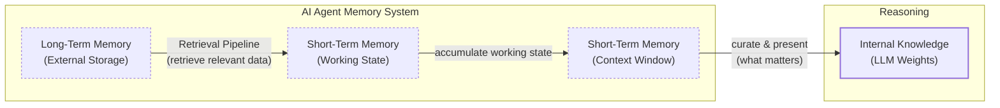

# Lesson 9: Memory for AI Agents

In the last eight lessons, we have built a solid foundation in AI Engineering. We have explored the agent landscape, learned to distinguish between rule-based workflows and autonomous agents, and mastered context engineering to manage the flow of information to an LLM. We have also built agents that can use tools and reason with patterns like ReAct. Now, we will tackle one of the most important components of context engineering: memory.

LLMs have a fundamental limitation: their knowledge is vast but frozen in time. They are unable to learn from new interactions by updating their internal weights after they have been trained. This is often called the "continual learning" problem. We can inject new knowledge through the context window, but this is a limited solution. An LLM without a persistent memory is like a brilliant intern with amnesia; it can solve complex problems but cannot recall past conversations or learn from experience.

The context window acts as the agent's "working memory" or RAM, but it has its constraints. Simply stuffing the entire conversation history into the context is not a scalable strategy. As the conversation grows, you run into the physical limits of the context window, and costs per interaction increase. More importantly, performance degrades due to the "lost-in-the-middle" problem, where models struggle to use information buried deep in a long prompt [[3]](https://openreview.net/forum?id=5sB6cSblDR). Benchmarks confirm this is not just a theoretical concern. The LOCOMO benchmark for conversational memory found that a full-context approach, while accurate, has a p95 latency of over 17 seconds, making it unusable for real-time applications [[51]](https://mem0.ai/blog/state-of-ai-agent-memory-2026).

However, the technology is constantly evolving. A few years ago, we were building agents with 8,000-token context windows, which forced us to be aggressive with memory compression. Today, models like Gemini 2.5 offer million-token contexts, shifting our engineering focus from compression to more intelligent filtering of a much larger history [[9]](https://www.youtube.com/watch?v=7AmhgMAJIT4&list=PLDV8PPvY5K8VlygSJcp3__mhToZMBoiwX&index=112). While this doesn't solve the core continual learning problem, it changes the trade-offs we make.

Dedicated memory systems provide a practical, engineered workaround to the LLM's inability to learn, giving agents the continuity and adaptability they need. In this lesson, we will explore how to design and implement memory for AI agents. We will borrow concepts from cognitive science to structure our thinking and provide a clear framework for building agents that remember, learn, and personalize interactions over time.

## The Layers of Memory: Internal, Short-Term, and Long-Term

To build effective memory systems, it helps to adopt terminology from biology and cognitive science. This gives us a structured way to think about how information flows through an agent [[1]](https://www.ibm.com/think/topics/ai-agent-memory), [[17]](https://arxiv.org/html/2309.02427). An agent's memory can be organized into three distinct layers, each with a specific role.

**Internal Knowledge** is the static, pre-trained information stored within the LLM's weights. This includes world knowledge, language patterns, and reasoning abilities. It is powerful but read-only; you cannot inject new user-specific information into it without fine-tuning. This is the ideal place to store knowledge, as the model can access it with an empty context window, but its static nature is a core limitation.

**Short-Term Memory** is the agent's active working memory, which corresponds to the LLM's context window. It is volatile and holds the information for the current task, such as recent messages, retrieved documents, and tool outputs. If it is not in the context window, it does not exist for the model in that specific turn.

**Long-Term Memory** is an external, persistent storage system, like a database or file system. This is where the agent stores user preferences, past interactions, and learned facts, giving it continuity across sessions.

These layers form a filtering hierarchy. The process can be framed as a **write-manage-read loop**: the agent writes new information, manages it through consolidation, and reads relevant context back into the prompt. The management step is where sophisticated memory systems are built, but it is often neglected [[52]](https://towardsdatascience.com/a-practical-guide-to-memory-for-autonomous-llm-agents/). The agent retrieves relevant data from long-term memory, accumulates it in its short-term working state, and then curates what matters most into the context window for the LLM to apply its internal knowledge. This flow mirrors memory consolidation in the brain, where experiences are staged in the hippocampus (short-term) before being transferred to the neocortex (long-term) for permanent storage [[53]](https://dev.to/joojodontoh/teaching-alfred-to-remember-with-a-neuroscience-inspired-memory-system-for-ai-agents-2o5l).


Image 1: A flowchart illustrating the hierarchy and dynamic flow of an AI agent's memory system.

This separation is useful because each layer serves a different function. Internal knowledge provides general intelligence, short-term memory handles the immediate task, and long-term memory provides the specific context and personalization that the other layers lack. To build more sophisticated agents, we need to look closer at the different types of long-term memory.

## Long-Term Memory: Semantic, Episodic, and Procedural

Just as human long-term memory is not a single entity, an agent's long-term memory can be broken down into different types. This categorization helps us design systems that store and retrieve different kinds of information in the most effective way [[12]](https://langchain-ai.github.io/langgraph/concepts/memory/), [[16]](https://decodingml.substack.com/p/memory-the-secret-sauce-of-ai-agents), [[17]](https://arxiv.org/html/2309.02427). Let's explore the three key types: semantic, episodic, and procedural memory.

### Semantic Memory (Facts & Knowledge)

**What it is:** Semantic memory is the agent's encyclopedia, a repository of factual knowledge. This is where the agent stores extracted concepts, relationships, and facts about specific domains, people, places, and things. The structure of this memory is highly dependent on the agent's use case. "Facts" can be individual, independent strings like "The user is a vegetarian," or they can be attached to an "entity," which can be a person, place, or object, in a more structured format like `{"food_restrictions": "User is a vegetarian"}`.

**How it's used:** The primary role of semantic memory is to provide the agent with a reliable source of truth. For an enterprise agent, this might involve storing internal company documents, technical manuals, or an entire product catalog, allowing it to answer questions on proprietary topics. For personal assistants, semantic memory is used to build a persistent profile of each user. It can recall specific, important information like preferences (`{"music": "User likes rock music"}`), relationships (`{"dog": "User has a dog named George"}`), or hard constraints (`{"food_restrictions": "User is allergic to gluten"}`). This allows the agent to retrieve relevant and important information directly, rather than depending on a noisy and very long conversation history.

### Episodic Memory (Experiences & History)

**What it is:** Episodic memory is the agent's personal diary, a record of its past interactions with the user and the context in which they occurred. Think of these memories as facts with a timestamp attached, adding an important element of time. Unlike the timeless facts in semantic memory, episodic memories are about "what happened and when." Depending on the use case, these memories can group important events that happened over a whole day, a single conversation, or a week. There is no one-size-fits-all solution; a different time scale might be needed for different products.

**How it's used:** This memory type is useful for maintaining conversational context and understanding complex dynamics, like a relationship. For instance, a simple system of facts might extract "User's brother is named Mark" and "User is frustrated with his brother" and save them to semantic memory. A system that captures the element of time might save: "On Tuesday, the user expressed frustration that their brother, Mark, always forgets their birthday. I then provided an empathetic response. [created_at=2025-08-25T17:20:04.648191-07:00]". This "episode" provides a deeper, more nuanced context, allowing the agent to interact with more empathy and intelligence in the future (e.g., "As you expressed last week, I know the topic of your brother's birthday can be sensitive..."). With the time element, the agent can now also answer questions such as "What happened on June 8th?".

### Procedural Memory (Skills & How-To)

**What it is:** Procedural memory is the agent's collection of skills and learned workflows. It is the "how-to" knowledge that dictates its ability to perform multi-step tasks. This is the agent's muscle memory, a set of pre-defined playbooks for common requests.

**How it's used:** This memory is often encoded directly into the agent's system prompt as a "reusable tool," function, or defined sequence of actions. For example, an agent might have a stored procedure called `MonthlyReportIntent`. When a user asks for a monthly update, the agent does not need to reason from scratch about how to create a report. Instead, by retrieving from its procedural memory, the procedure can be used, defining a clear series of steps: 1) Query the sales database for the last 30 days, 2) Summarize the key findings, and 3) Ask the user if they want the summary emailed or displayed directly. This makes the agent's behavior on common tasks highly reliable, fast, and predictable. By encoding successful (and even unsuccessful) workflows, procedural memory allows an agent to improve its task completion efficiency over time, reducing errors and ensuring that complex jobs are executed consistently every time.

Now that we have an idea of what to save and the benefits of each memory type, how should we store this information? The storage architecture we choose has a significant impact on our agent's performance.

## Storing Memories: Pros and Cons of Different Approaches

How an agent's memories are stored is an important architectural decision that directly impacts its performance, complexity, and scalability. While the goal is always to provide the right context at the right time, the method of storage involves trade-offs. There is no one-size-fits-all solution; the ideal approach depends entirely on the product's use case. Let's explore the pros and cons of three primary methods: storing memories as raw strings, as structured entities, and within a knowledge graph.

### Storing Memories as Raw Strings

This is the simplest method, where conversational turns or documents are stored as plain text and typically indexed for vector search [[6]](https://www.decodingai.com/p/how-does-memory-for-ai-agents-work).

-   **Pros:** This method is the easiest to set up, requiring minimal engineering overhead to get started. By storing the raw text, the full context, including emotional tone and subtle linguistic cues, is preserved. Nothing is lost in translation to a structured format, allowing you to return to the original record of what happened [[7]](https://towardsdatascience.com/a-practical-guide-to-memory-for-autonomous-llm-agents/755491854613).
-   **Cons:** Retrieval can be imprecise. Relying solely on semantic similarity is often not enough. A query like "What is my brother's job?" might retrieve every past conversation where "brother" and "job" were mentioned, without pinpointing the single correct fact [[6]](https://www.decodingai.com/p/how-does-memory-for-ai-agents-work). As interaction logs grow, they fill with irrelevant content, making retrieval slower and less reliable [[8]](https://www.microsoft.com/en-us/research/blog/from-raw-interaction-to-reusable-knowledge-rethinking-memory-for-ai-agents/). Updating memory is also difficult. If a user corrects information ("My brother is no longer a lawyer, he's a doctor now"), the new information is just another string in a growing log, creating potential contradictions. This approach also struggles with temporal reasoning and state changes, as it cannot easily distinguish between "Barry *was* the CEO" and "Claude *is* the CEO" because the relationship is not explicitly defined [[6]](https://www.decodingai.com/p/how-does-memory-for-ai-agents-work).

### Storing Memories as Entities (JSON-like Structures)

In this approach, we use an LLM to transform unstructured, messy interactions into structured memories, storing them in a format like JSON [[9]](https://www.youtube.com/watch?v=7AmhgMAJIT4&list=PLDV8PPvY5K8VlygSJcp3__mhToZMBoiwX&index=112).

-   **Pros:** Information is organized into key-value pairs (`"user": {"brother": {"job": "Software Engineer"}}`), which allows for precise, field-level filtering. This structure makes it easy to retrieve specific facts without ambiguity and to update information when it changes. This method is perfectly suited for semantic memory, where user profiles and preferences are stored.
-   **Cons:** This approach requires designing a schema, which adds an initial layer of engineering complexity. A predefined schema can also be inflexible; if the agent encounters information that does not fit the existing structure, that data may be lost. While an LLM can dynamically add new entities or fields, this increases the complexity of updating memories and the risk of saving duplicate information. The extraction process also strips away the rich subtext of the original conversation. The factual memory `"user_likes": ["cats"]` is far less representative than the original message, "Petting my cat is the best part of my day" [[9]](https://www.youtube.com/watch?v=7AmhgMAJIT4&list=PLDV8PPvY5K8VlygSJcp3__mhToZMBoiwX&index=112). Furthermore, exposing these structured memories to users can create cognitive overhead, as they may feel pressured to "garden" their own data, which detracts from a seamless user experience [[9]](https://www.youtube.com/watch?v=7AmhgMAJIT4&list=PLDV8PPvY5K8VlygSJcp3__mhToZMBoiwX&index=112).

### Storing Memories in a Graph Database

This is the most advanced approach, where memories are stored as a network of nodes (entities) and edges (relationships), forming a knowledge graph [[10]](https://www.octoco.ai/blog/knowledge-graphs-as-memory), [[18]](https://danielp1.substack.com/p/memex-20-memory-the-missing-piece).

-   **Pros:** A graph's core strength is representing complex relationships explicitly, such as `(User) -> [HAS_BROTHER] -> (Mark) -> [WORKS_AS] -> (Software Engineer)`. This enables sophisticated, multi-hop queries that trace these connections. Knowledge graphs can model context and time as explicit properties of a relationship (e.g., `User -[RECOMMENDED_ON_DATE: "2025-10-25"]-> Restaurant`), providing more accurate and grounded retrieval than vector search alone. This temporal awareness allows the graph to evolve without expensive re-computation [[10]](https://www.octoco.ai/blog/knowledge-graphs-as-memory). Retrieval is also transparent and auditable, as you can trace the exact path that led to an answer, making it easier to debug the agent's reasoning [[10]](https://www.octoco.ai/blog/knowledge-graphs-as-memory).
-   **Cons:** This method requires a higher upfront investment in schema design, data modeling, and ongoing maintenance. The process of converting unstructured interactions into structured graph triples is more complex than just storing strings. Complex graph traversals can also be slower than a simple vector lookup, which might impact real-time performance if not carefully optimized. For many applications, the complexity of implementing and maintaining a graph database is overkill [[10]](https://www.octoco.ai/blog/knowledge-graphs-as-memory).

| Approach | Pros | Cons |
| :--- | :--- | :--- |
| **Raw Strings** | Simple and fast to set up; preserves full conversational nuance. | Imprecise retrieval; difficult to update; lacks structure for temporal reasoning. |
| **Entities (JSON)** | Structured and precise; easy to update; ideal for factual data. | Higher upfront complexity; potential for schema rigidity; loss of original nuance. |
| **Knowledge Graph** | Represents complex relationships; superior temporal awareness; auditable and explainable. | Highest complexity and cost; potentially slower queries; overkill for simple use cases. |
Table 1: A comparison of three primary approaches for storing agent memories.

The choice of memory storage should be guided by your product's core needs. It is often best to start with the simplest architecture that delivers value and evolve it as the demands on your agent grow more complex. Now that we know what to save and how to store it, let's look at some code examples using an open-source memory tool.

## Memory implementations with code examples

This section provides a practical look at how to implement the different types of long-term memory. While Retrieval-Augmented Generation (RAG) is the mechanism for retrieving information, the creation of high-quality memories is an equally important, preceding step. In production systems, retrieval is rarely a single vector search. A common pattern is to first fetch a larger set of candidate memories and then use a more sophisticated, and often more expensive, reranking model to re-order the candidates for final selection. This second pass improves the precision of what goes into the context window [[51]](https://mem0.ai/blog/state-of-ai-agent-memory-2026). This two-stage process computationally mirrors the cognitive science concept of pattern separation, where the brain distinguishes between similar experiences to avoid blurring them together. The reranker's job is to ensure the final context is not just relevant, but also diverse [[53]](https://dev.to/joojodontoh/teaching-alfred-to-remember-with-a-neuroscience-inspired-memory-system-for-ai-agents-2o5l). We will cover RAG in detail in our next lesson. Here, we will focus on the memory creation process for each memory type, using the simple "storing memories as raw strings" approach to highlight the unique benefits of each category.

To do this, we will use `mem0`, an open-source library designed to add long-term memory to AI agents [[4]](https://arxiv.org/html/2504.19413). It provides a simple interface for storing, searching, and managing different types of memories.

### Setup

First, let's set up our environment. We will configure `mem0` to use Gemini for both embeddings and the underlying LLM for fact extraction, with ChromaDB as a local vector store. This allows us to run everything in our notebook.

1.  We start by loading our environment variables and importing the necessary packages.
    ```python
    from utils import env
    
    env.load(required_env_vars=["GOOGLE_API_KEY"])
    
    import os
    import re
    from typing import Optional
    
    from google import genai
    from mem0 import Memory
    ```
    It outputs:
    ```text
    Environment variables loaded from /Users/fabio/Desktop/course-ai-agents/.env
    Environment variables loaded successfully.
    ```

2.  Next, we initialize the Gemini client and define our model ID.
    ```python
    client = genai.Client()
    MODEL_ID = "gemini-2.5-pro"
    ```

3.  We then configure `mem0` with our Gemini models and a local ChromaDB instance for storage.
    ```python
    MEM0_CONFIG = {
        "embedder": {
            "provider": "gemini",
            "config": {
                "model": "gemini-embedding-001",
                "embedding_dims": 768,
                "api_key": os.getenv("GOOGLE_API_KEY"),
            },
        },
        "vector_store": {
            "provider": "chroma",
            "config": {
                "collection_name": "lesson9_memories",
                "path": "/tmp/chroma_mem0",
            },
        },
        "llm": {
            "provider": "gemini",
            "config": {
                "model": MODEL_ID,
                "api_key": os.getenv("GOOGLE_API_KEY"),
            },
        },
    }
    
    memory = Memory.from_config(MEM0_CONFIG)
    MEM_USER_ID = "lesson9_notebook_student"
    memory.delete_all(user_id=MEM_USER_ID)
    print("✅ Mem0 ready (Gemini embeddings + local Chroma).")
    ```
    It outputs:
    ```text
    ✅ Mem0 ready (Gemini embeddings + local Chroma).
    ```

4.  Finally, we create a few helper functions to simplify adding and searching for memories. `mem_add_text` will store raw text with a category tag, and `mem_search` will allow us to search and filter by that category.
    ```python
    def mem_add_text(text: str, category: str = "semantic", **meta) -> str:
        """Add a single text memory. No LLM is used for extraction or summarization."""
        metadata = {"category": category}
        for k, v in meta.items():
            if isinstance(v, (str, int, float, bool)) or v is None:
                metadata[k] = v
            else:
                metadata[k] = str(v)
        memory.add(text, user_id=MEM_USER_ID, metadata=metadata, infer=False)
        return f"Saved {category} memory."
    
    
    def mem_search(query: str, limit: int = 5, category: Optional[str] = None) -> list[dict]:
        """
        Category-aware search wrapper.
        Returns a list of results.
        """
        res = memory.search(query, user_id=MEM_USER_ID, limit=limit) or {}
    
        items = res.get("results", [])
        if category is not None:
            items = [r for r in items if (r.get("metadata") or {}).get("category") == category]
        return items
    ```

### Semantic Memory: Extracting Facts

**How it's created:** While semantic memory is often created through a deliberate extraction pipeline where an LLM processes unstructured text, for our example, we will take a simpler approach. We will directly add pre-defined, atomic facts as raw strings. This aligns with our goal of demonstrating the core mechanics of storing and retrieving different memory types without adding the complexity of an extraction layer. The `infer=False` parameter in our `mem_add_text` function ensures that `mem0` does not trigger its own LLM-based fact extraction, giving us direct control.

**Prompt Used to Create:** In a more advanced implementation, you would use a prompt to guide the LLM's extraction process. For a personal assistant, such a prompt might look like this:
```
Extract persistent facts and strong preferences as short bullet points.
- Keep each fact atomic and context-independent. While reading the messages, make sure to notice the nuance or subtle details that might be important when saving these facts.
- 3–6 bullets max.

Text:
{My brother Mark is a software engineer, but his real passion is painting, he gifted me a painting a few years ago. Its really beautiful.}
```

**Memory Created:** From the prompt above, the system would ideally store individual facts like: `Mark is the user's brother.`, `Mark is a software engineer.`, `Mark's real passion is painting.`, and `The user has a beautiful painting from Mark.`.

**How it's Retrieved:** Retrieval of semantic memory often uses hybrid search. The system first filters the memory store based on keyword matches for known entities (e.g., "brother"). Then, within that filtered set, a vector search is performed to find the most contextually relevant fact (e.g., the one most similar to "job").

Let's implement this by adding a few facts to our semantic memory.

1.  We define a list of facts and use our helper function to add them to `mem0` with the category "semantic".
    ```python
    facts: list[str] = [
        "User prefers vegetarian meals.",
        "User has a dog named George.",
        "User is allergic to gluten.",
        "User's brother is named Mark and is a software engineer.",
    ]
    for f in facts:
        print(mem_add_text(f, category="semantic"))
    
    print(f"Added {len(facts)} semantic memories.")
    ```
    It outputs:
    ```text
    Saved semantic memory.
    Saved semantic memory.
    Saved semantic memory.
    Saved semantic memory.
    Added 4 semantic memories.
    ```

2.  Now, we can search for a specific fact. When we query for "brother job", the system retrieves the most relevant fact.
    ```python
    results = memory.search("brother job", user_id=MEM_USER_ID, limit=1)
    print(results["results"][0]["memory"])
    ```
    It outputs:
    ```text
    User's brother is named Mark and is a software engineer.
    ```

### Episodic Memory: The Log of Events

**How it's Created:** Episodic memory functions as a chronological log of events. Memories can be created by having an LLM read a conversation and summarize the key insights, or by simply logging the raw text of the interaction with a timestamp.

**Prompt Used to Create:** If summarizing, the prompt might be: "You are a personal coding tutor. Extract events, likes, dislikes, or any other insights from the conversation that will help you better teach the user." For raw storage, no extraction prompt is needed.

**Memory Created (raw):** `October 26th, 2025. 2:30PM EST: User: "I'm feeling stressed about my project deadline on Friday." Assistant: "I'm sorry to hear that. I'm here to help you with that."`

**Memory Created (summarized):** `October 26th, 2025. 2:30PM EST: The user is stressed about their project deadline on Friday and the assistant offers to help.`

**How it's Retrieved:** Retrieval from episodic memory is often a blend of temporal and semantic queries. A user might ask, "What did we talk about yesterday?" (a temporal query). A more robust approach uses semantic search to find contextually similar conversations and then re-ranks the results by recency.

Let's create a summarized episodic memory.

1.  We start with a short dialogue and use an LLM to create a concise summary.
    ```python
    dialogue = [
        {"role": "user", "content": "I'm stressed about my project deadline on Friday."},
        {"role": "assistant", "content": "I’m here to help—what’s the blocker?"},
        {"role": "user", "content": "Mainly testing. I also prefer working at night."},
        {"role": "assistant", "content": "Okay, we can split testing into two sessions."},
    ]
    
    episodic_prompt = f"""Summarize the following 3–4 turns as one concise 'episode' (1–2 sentences).
    Keep salient details and tone.
    
    {dialogue}
    """
    episode_summary = client.models.generate_content(model=MODEL_ID, contents=episodic_prompt)
    episode = episode_summary.text.strip()
    print(episode)
    ```
    It outputs:
    ```text
    A user, stressed about a Friday project deadline because of testing and a preference for working at night, is advised to split the testing work into two manageable sessions.
    ```

2.  We add this summary to our memory with the category "episodic".
    ```python
    print(
        mem_add_text(
            episode,
            category="episodic",
            summarized=True,
            turns=4,
        )
    )
    ```
    It outputs:
    ```text
    Saved episodic memory.
    ```

3.  When we search for "deadline stress", the system retrieves our summarized episode, complete with its creation timestamp.
    ```python
    hits = mem_search("deadline stress", limit=1, category="episodic")
    for h in hits:
        print(f"{h['memory']}\n")
        print(h)
    ```
    It outputs:
    ```text
    A user, stressed about a Friday project deadline because of testing and a preference for working at night, is advised to split the testing work into two manageable sessions.
    
    {'id': '93ebb9eb-65b0-4975-9c0d-105497b43e5c', 'memory': 'A user, stressed about a Friday project deadline because of testing and a preference for working at night, is advised to split the testing work into two manageable sessions.', 'hash': '44f0bcd0965a1fb557c1d3b5a9f8ae6c', 'metadata': {'turns': 4, 'summarized': True, 'category': 'episodic'}, 'score': 0.9109697937965393, 'created_at': '2025-09-12T02:30:01.358468-07:00', 'updated_at': None, 'user_id': 'lesson9_notebook_student', 'role': 'user'}
    ```

### Procedural Memory: Defining and Learning Skills

**How it's Created:** Procedural memory can be created in two ways: either defined by a developer as a tool or function (e.g., `book_flight()`), or learned dynamically from user interactions. More advanced agents can save a sequence of steps provided by a user as a new, callable procedure.

**Example Prompt:**
```
You are an agent that can learn new skills. When a user provides a numbered list of steps to accomplish a goal, your task is to run the "learn_procedure" tool, and convert these numbered list of steps into a reusable procedure. Identify the core actions and any variable parameters (e.g., dates, locations, names).

Examples:
User Input: "I want you to book a cabin for this summer. To do that, please remember to: 1. Search for cabins on CabinRentals.com my favorite website. 2. Filter for locations in the mountains, the closer to them, the better. 3. Make sure it's available around July. 4 to 8th. 5. Send me the top 3 options."

learn_procedure(name="find_summer_cabin", steps=first search for cabins on CabinRentals.com, then filter for locations in the mountains, check for distance to the mountains, then check availability around what the user wants, if the user hasn't specified a date, ask the user for a date, once you have a list of options, send the top 3 options)
```

**Memory Created:** The LLM would generate a new structured procedure and save it to its tool/procedures library: `procedure_name: find_summer_cabin`, `steps=first search for cabins on CabinRentals.com, then filter for locations in the mountains, check for distance to the mountains, then check availability around what the user wants, if the user hasn't specified a date, ask the user for a date, once you have a list of options, send the top 3 options`.

**How it's Retrieved:** Retrieval is an intent-matching and function-calling process. The agent is given access to its entire library of procedures—both built-in and user-taught. The LLM receives the descriptions of all available tools in its context and compares the user's current request against them. If the user later says, "Let's find a summer cabin again," the agent will recognize the semantic similarity to its newly learned `find_summer_cabin` procedure and execute it.

Let's teach our agent a simple procedure.

1.  We define the steps for a "monthly_report" procedure and store it as a single text block.
    ```python
    procedure_name = "monthly_report"
    steps = [
        "Query sales DB for the last 30 days.",
        "Summarize top 5 insights.",
        "Ask user whether to email or display.",
    ]
    procedure_text = f"Procedure: {procedure_name}\nSteps:\n" + "\n".join(f"{i + 1}. {s}" for i, s in enumerate(steps))
    
    mem_add_text(procedure_text, category="procedure", procedure_name=procedure_name)
    
    print(f"Learned procedure: {procedure_name}")
    ```
    It outputs:
    ```text
    Learned procedure: monthly_report
    ```

2.  When we search for "how to create a monthly report", the system retrieves our newly learned procedure.
    ```python
    results = mem_search("how to create a monthly report", category="procedure", limit=1)
    if results:
        print(results[0]["memory"])
    ```
    It outputs:
    ```text
    Procedure: monthly_report
    Steps:
    1. Query sales DB for the last 30 days.
    2. Summarize top 5 insights.
    3. Ask user whether to email or display.
    ```

We have now seen how to implement the three main types of long-term memory. While these examples are simple, they illustrate the core mechanics of memory creation and retrieval. Now, let's discuss some of the real-world challenges and best practices for building memory systems.

## Real-World Lessons: Challenges and Best Practices

The architectural patterns we have discussed provide a useful toolkit, but moving from theory to a reliable, production-ready system requires navigating complex trade-offs. Here are some of the most important lessons learned from building and scaling agent memory systems in the real world.

### Re-evaluating compression

One of the biggest shifts in memory design has been the trade-off between compressing information and preserving its raw detail. Just two years ago, with small and expensive context windows, the primary goal was to distill every interaction into its most compact form. This process, however, causes **summarization drift**: with each compression, details are lost, and the memory can diverge from what actually happened [[52]](https://towardsdatascience.com/a-practical-guide-to-memory-for-autonomous-llm-agents/).

Today, with million-token context windows, the best practice is to lean towards less compression. While full context provides the highest theoretical accuracy, benchmarks show it comes at a cost that is unusable in production: a p95 latency over 17 seconds and 14 times the token cost of selective memory systems [[51]](https://mem0.ai/blog/state-of-ai-agent-memory-2026). The raw, unstructured conversational history is the ultimate source of truth. It contains the emotional subtext and relational dynamics that are often lost during extraction. A fact might state, "User has a dog named George," but the episodic log reveals, "User mentioned that walking their dog... is the best part of their day," a far more valuable piece of information. Design your system to work with the most complete version of history that is feasible. Use summarization and fact extraction to create queryable indexes, but always treat the raw log as the ground truth.

### Designing for the Product

There is no "perfect" memory architecture. The concepts of semantic, episodic, and procedural memory are a powerful mental model, but they are a toolkit, not a mandatory blueprint. A common failure mode is over-engineering a complex, multi-part memory system for a product that does not need it [[9]](https://www.youtube.com/watch?v=7AmhgMAJIT4&list=PLDV8PPvY5K8VlygSJcp3__mhToZMBoiwX&index=112).

Start from first principles by defining the core function of your agent. The product's goal should dictate the memory architecture. For a Q&A bot over internal documents, a simple RAG pipeline is the best starting point. For a long-term personal AI companion, rich episodic memories are beneficial, as the agent's value comes from its ability to remember the narrative of your relationship. For a task-automation agent, procedural memory is key, allowing it to recall and execute multi-step workflows reliably.

### Autonomous Memory Management

A key practice is autonomous consolidation. A background process can run during idle time to review, extract, and merge learnings from recent conversations. This "sleep-cycle" refinement improves performance and memory organization [[56]](https://www.indium.tech/blog/7-state-persistence-strategies-ai-agents-2026/).

### The Human Factor: The additional user cognitive overhead

Memory exists to make the agent smarter, not to give the user a new job. A common pitfall is exposing the internal workings of the memory system to the user, thinking it will improve transparency. In practice, this often creates a large amount of cognitive overhead [[9]](https://www.youtube.com/watch?v=7AmhgMAJIT4&list=PLDV8PPvY5K8VlygSJcp3__mhToZMBoiwX&index=112).

Users should not be asked to "garden their agent's memories." This breaks the illusion of a capable assistant and turns the interaction into a tedious data-entry task. Memory management should be an autonomous function of the agent. It should learn from corrections within the natural flow of conversation (e.g., "Actually, my brother's name is Mark, not Mike"). The agent, not the user, is responsible for periodically reviewing, consolidating, and resolving conflicting information in its memory stores. The agent should also be designed to handle contradictions and avoid **self-reinforcing errors**, where a single incorrect memory is treated as ground truth and corrupts future reasoning [[52]](https://towardsdatascience.com/a-practical-guide-to-memory-for-autonomous-llm-agents/).

## Conclusion

Memory is a core component that transforms a simple, stateless chatbot into a truly adaptive and personalized agent. By understanding and implementing different memory layers and types, you can build systems that maintain conversational continuity, learn from past interactions, and provide more capable and reliable assistance. These principles are not limited to conversational agents; they are also essential in robotics and autonomous systems. An embodied agent must recall past actions to navigate a physical space efficiently or use episodic memory for case-based reasoning to handle novel situations, demonstrating how memory is a foundational component for any AI that interacts with a dynamic world [[1]](https://www.ibm.com/think/topics/ai-agent-memory). The tools and techniques we have discussed, from cognitive science concepts to practical libraries like `mem0`, provide a starting point.

While these engineered memory systems are a practical solution for today's technology, they are a workaround for the fundamental inability of current LLMs to achieve true "continual learning." As the underlying models evolve, so will our approaches to memory. In our next lesson, we will cover in detail Retrieval-Augmented Generation (RAG), the primary mechanism for retrieving information from the long-term memory stores we have discussed. We will also explore more advanced topics in the future, such as the Model Context Protocol (MCP) for standardized tool use, and how to monitor and evaluate these complex agentic systems.

## References

- [1] [What is AI agent memory?](https://www.ibm.com/think/topics/ai-agent-memory)
- [2] [every-ai-agent-has-4-distinct-memory-layers-activity](https://www.linkedin.com/posts/pauliusztin_every-ai-agent-has-4-distinct-memory-layers-activity-7436765234800807936-QyLR)
- [3] [Lost in the middle, and In-Between: Enhancing language models' ability to reason over long contexts in Multi-Hop QA](https://openreview.net/forum?id=5sB6cSblDR)
- [4] [Mem0: Building Production-Ready AI Agents with Scalable Long-Term Memory](https://arxiv.org/html/2504.19413)
- [5] [From Human Memory to AI Memory: A survey on Memory Mechanisms in the Era of LLMS](https://arxiv.org/html/2504.15965v1)
- [6] [How Does Memory for AI Agents Work?](https://www.decodingai.com/p/how-does-memory-for-ai-agents-work)
- [7] [A Practical Guide to Memory for Autonomous LLM Agents](https://towardsdatascience.com/a-practical-guide-to-memory-for-autonomous-llm-agents/755491854613)
- [8] [From raw interaction to reusable knowledge: Rethinking memory for AI agents](https://www.microsoft.com/en-us/research/blog/from-raw-interaction-to-reusable-knowledge-rethinking-memory-for-ai-agents/)
- [9] [What is the perfect memory architecture?](https://www.youtube.com/watch?v=7AmhgMAJIT4&list=PLDV8PPvY5K8VlygSJcp3__mhToZMBoiwX&index=112)
- [10] [Knowledge Graphs as Memory: Why Your AI Agent Needs to Think in Relationships](https://www.octoco.ai/blog/knowledge-graphs-as-memory)
- [11] [Temporal Knowledge Graphs as Long-Term Memory for AI Agents](https://medium.com/@bijit211987/agents-that-remember-temporal-knowledge-graphs-as-long-term-memory-2405377f4d51)
- [12] [Memory overview](https://langchain-ai.github.io/langgraph/concepts/memory/)
- [13] [MEMORY_DEDUCTION_PROMPT](https://blog.lqhl.me/mem0-how-three-prompts-created-a-viral-ai-memory-layer)
- [14] [Agent Memory Systems](https://stevekinney.com/writing/agent-memory-systems)
- [15] [Agent Workflow Memory](https://openreview.net/forum?id=NTAhi2JEEE)
- [16] [Memory: The secret sauce of AI agents](https://decodingml.substack.com/p/memory-the-secret-sauce-of-ai-agents)
- [17] [Cognitive Architectures for Language Agents](https://arxiv.org/html/2309.02427)
- [18] [Memex 2.0: Memory The Missing Piece for Real Intelligence](https://danielp1.substack.com/p/memex-20-memory-the-missing-piece)
- [19] [Memory in Agent Systems](https://www.newsletter.swirlai.com/p/memory-in-agent-systems)
- [20] [Introduction to Stateful Agents](https://docs.letta.com/guides/agents/memory)
- [21] [Giving Your AI a Mind: Exploring Memory Frameworks for Agentic Language Models](https://medium.com/@honeyricky1m3/giving-your-ai-a-mind-exploring-memory-frameworks-for-agentic-language-models-c92af355df06)
- [22] [How do internal short-term and long-term memory layers interact in agents?](https://www.linkedin.com/posts/pauliusztin_every-ai-agent-has-4-distinct-memory-layers-activity-7436765234800807936-QyLR)
- [23] [Why memory matters in LLM agents: Short-term vs. long-term memory architectures](https://skymod.tech/why-memory-matters-in-llm-agents-short-term-vs-long-term-memory-architectures/)
- [24] [Agentic AI and Memory](https://www.moxo.com/blog/agentic-ai-memory)
- [25] [Agent Memory](https://www.dataiku.com/stories/blog/agent-memory)
- [26] [Long-Term vs. Short-Term Memory for AI Agents: A Practical Guide Without the Hype](https://towardsai.net/p/machine-learning/long-term-vs-short-term-memory-for-ai-agents-a-practical-guide-without-the-hype)
- [27] [Knowledge Graphs as Memory](https://www.octoco.ai/blog/knowledge-graphs-as-memory)
- [28] [Temporal Reasoning in AI Agent Memory: Allen’s Interval Algebra and Event Graphs](https://ai.plainenglish.io/temporal-reasoning-in-ai-agent-memory-allens-interval-algebra-and-event-graphs-bd5fe9d3d1ef)
- [29] [Building Evolving AI Agents via Dynamic Memory Representations Using Temporal Knowledge Graphs](https://neo4j.com/nodes-2025/agenda/building-evolving-ai-agents-via-dynamic-memory-representations-using-temporal-knowledge-graphs/)
- [30] [Temporal Agents with Knowledge Graphs](https://developers.openai.com/cookbook/examples/partners/temporal_agents_with_knowledge_graphs/temporal_agents)
- [31] [mem0 prompts.py on GitHub](https://github.com/mem0ai/mem0/blob/main/mem0/configs/prompts.py)
- [32] [Mem0 Custom Instructions Documentation](https://docs.mem0.ai/open-source/features/custom-instructions)
- [33] [Mem0 LinkedIn Post on Pipeline](https://www.linkedin.com/posts/mem0_how-mem0-works-under-the-hood-1-message-activity-7376713317391896576-ALQP)
- [34] [Long-Term Memory in AI Agents - Mem0 Blog](https://mem0.ai/blog/long-term-memory-ai-agents)
- [35] [Memory Optimization Strategies in AI Agents](https://medium.com/@nirdiamant21/memory-optimization-strategies-in-ai-agents-1f75f8180d54)
- [36] [AI Agents Crash Course Part 15](https://www.dailydoseofds.com/ai-agents-crash-course-part-15-with-implementation/)
- [37] [Memory Governance in AI Agents](https://arxiv.org/html/2601.11653v1)
- [38] [Types of AI Agent Memory](https://atlan.com/know/types-of-ai-agent-memory/)
- [39] [AI Agent Memory - GeeksforGeeks](https://www.geeksforgeeks.org/artificial-intelligence/ai-agent-memory/)
- [40] [The 3 Types of Long-Term Memory AI Agents Need](https://machinelearningmastery.com/beyond-short-term-memory-the-3-types-of-long-term-memory-ai-agents-need/)
- [41] [Agent Memory on MongoDB](https://www.mongodb.com/resources/basics/artificial-intelligence/agent-memory)
- [42] [Memory Systems in AI Agents: Episodic and Semantic](https://ctoi.substack.com/p/memory-systems-in-ai-agents-episodic)
- [43] [Mem0 Timestamp Documentation](https://docs.mem0.ai/platform/features/timestamp)
- [44] [Episodic Memory in AI Agents](https://atlan.com/know/episodic-memory-ai-agents/)
- [45] [Procedural Memory Research (arXiv:2508.06433v2)](https://arxiv.org/html/2508.06433v2)
- [46] [Procedural Memory Research (arXiv:2508.06433v4)](https://arxiv.org/html/2508.06433v4)
- [47] [Turning Agent History into Procedural Memory](https://dev.to/blackgirlbytes/turning-agent-history-into-procedural-memory-37f8)
- [48] [A Primer on Re-ranking for Retrieval](https://vizuara.substack.com/p/a-primer-on-re-ranking-for-retrieval)
- [49] [Retrieval-Augmented Generation - Comet Blog](https://www.comet.com/site/blog/retrieval-augmented-generation/)
- [50] [Generating Parallel Queries with Cohere](https://docs.cohere.com/docs/generating-parallel-queries)
- [51] [State of AI Agent Memory 2026](https://mem0.ai/blog/state-of-ai-agent-memory-2026)
- [52] [A Practical Guide to Memory for Autonomous LLM Agents](https://towardsdatascience.com/a-practical-guide-to-memory-for-autonomous-llm-agents/)
- [53] [Teaching Alfred to Remember with a Neuroscience-Inspired Memory System for AI Agents](https://dev.to/joojodontoh/teaching-alfred-to-remember-with-a-neuroscience-inspired-memory-system-for-ai-agents-2o5l)
- [54] [Mem^p: A Plug-and-Play Method for Procedural Memory Update of Large Language Model-based Agents](https://arxiv.org/html/2508.06433v2)
- [55] [Graphiti: A Bi-temporal Graph Neural Network for Dynamic Link Prediction](https://arxiv.org/html/2602.05665v1)
- [56] [7 State Persistence Strategies for AI Agents in 2026](https://www.indium.tech/blog/7-state-persistence-strategies-ai-agents-2026/)