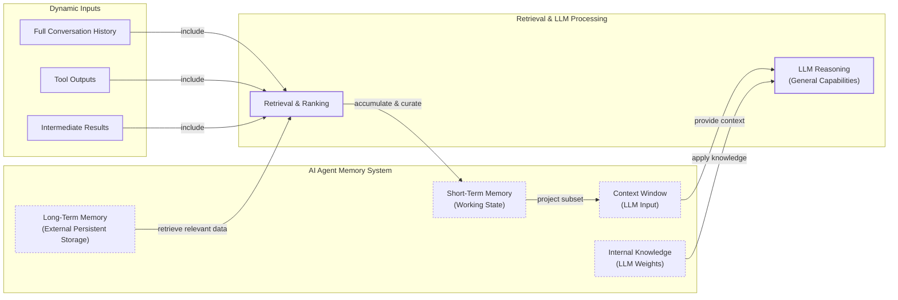

# How Memory for AI Agents Works

In our previous lessons, we built our first reasoning agents using ReAct and explored the fundamentals of context engineering. We have established that an LLM's knowledge is vast but frozen in time; it is fundamentally unable to learn by updating its parameters after deployment. This is a core limitation known as the "continual learning" problem. To work around this, we can inject new knowledge through the context window. However, this is a limited solution due to finite context sizes and the "lost-in-the-middle" problem, where models struggle to use information buried in long prompts.

An LLM without a persistent memory is like an intern with amnesia. It can perform tasks based on the instructions you give it right now, but it cannot recall previous conversations or learn from experience. This is where memory systems come in. They are an engineering workaround for the model's inability to learn, providing agents with continuity, adaptability, and a semblance of memory.

The context window acts as the agent's "working memory" or RAM, but it has its limits. Keeping an entire conversation history, plus other retrieved documents and tool outputs, is not realistic. It is expensive, slow, and introduces noise that can degrade performance. This challenge is also a moving target. Just two years ago, when building personal AI companions, we quickly hit the limits of 8,000 or 16,000-token context windows. This forced us to engineer complex memory systems with aggressive compression and summarization. Today, with models offering million-token contexts, the engineering trade-offs are shifting. We can afford to be less aggressive with compression, which is good because summarization can lose important nuance and detail [[1]](https://www.youtube.com/watch?v=7AmhgMAJIT4&list=PLDV8PPvY5K8VlygSJcp3__mhToZMBoiwX&index=112).

In this lesson, we will explore how to design and implement memory systems for AI agents. We will borrow concepts from cognitive science to categorize different types of memory and understand their roles. To build agents that feel intelligent and personalized, we first need to understand how to give them a mind that remembers.

## The Layers of Memory: Internal, Short-Term, and Long-Term

To build effective memory systems, it helps to adopt terminology from biology and cognitive science. This gives us a structured way to think about how information flows through an agent. This inspiration runs deep, with research exploring how mechanisms like synaptic tagging, long-term potentiation (LTP), and distributed memory encoding in the brain can inform AI architectures [[2]](https://www.linkedin.com/pulse/brain-inspired-ai-memory-systems-lessons-from-anand-ramachandran-ku6ee). We can categorize an agent's memory into three distinct layers: internal knowledge, short-term memory, and long-term memory [[3]](https://www.linkedin.com/posts/pauliusztin_every-ai-agent-has-4-distinct-memory-layers-activity-7436765234800807936-QyLR), [[4]](https://www.newsletter.swirlai.com/p/memory-in-agent-systems).

**Internal Knowledge** is the static, pre-trained information stored in the LLM's weights. This includes world knowledge, language patterns, and reasoning abilities. It is powerful but read-only; you cannot update it without fine-tuning. This is the ideal place to store knowledge, as the model can access vast amounts of information with an empty context window. The inability to update these weights from experience is the core problem memory systems aim to solve.

**Short-Term Memory** is the agent's working memory, which corresponds to the LLM's context window. It is volatile, fast, and limited. This is the only reality the model sees during a single inference call. It holds the user's input, retrieved facts, tool schemas, and recent conversation history. If information is not in the context window, it does not exist for the model at that moment [[5]](https://www.ibm.com/think/topics/ai-agent-memory), [[6]](https://langchain-ai.github.io/langgraph/concepts/memory/).

**Long-Term Memory** is an external, persistent storage system. This is where an agent saves information across sessions, such as user preferences, past interactions, and learned facts. It gives the agent continuity and a sense of history. This memory is "retrieved" and projected into the short-term memory (the context window) to become actionable [[7]](https://skymod.tech/why-memory-matters-in-llm-agents-short-term-vs-long-term-memory-architectures/).

These layers form a filtering hierarchy. The agent retrieves relevant data from long-term memory, which is then curated and combined with the immediate conversational state in short-term memory. Finally, a subset of this is projected into the context window for the LLM to process. This dynamic interplay, sometimes conceptualized as a retrieval pipeline where different memories are queried and ranked, is what makes an agent feel coherent and intelligent [[3]](https://www.linkedin.com/posts/pauliusztin_every-ai-agent-has-4-distinct-memory-layers-activity-7436765234800807936-QyLR).


Image 1: A hierarchical memory system showing data flow from long-term storage to the LLM's context window.

No single layer can do it all. Internal knowledge provides general intelligence, short-term memory handles the immediate task, and long-term memory provides the personalization that the other layers lack. To better understand how to design the long-term memory, we can again borrow from cognitive science to further break it down.

## Long-Term Memory: Semantic, Episodic, and Procedural

Long-term memory is not a monolith. Just as our own minds store different kinds of information in different ways, an agent's long-term memory can be divided into three key types: semantic, episodic, and procedural [[8]](https://decodingml.substack.com/p/memory-the-secret-sauce-of-ai-agents), [[9]](https://arxiv.org/html/2309.02427).

**Semantic Memory** is the agent's encyclopedia of facts and knowledge. It stores individual pieces of information, such as "The user is a vegetarian," or more structured data attached to an entity, like a user profile: `{"food_restrictions": "vegetarian"}`. The structure you choose depends on your agent's use case. The primary role of semantic memory is to provide the agent with a reliable source of truth. For an enterprise agent, this might involve storing internal company documents, technical manuals, or an entire product catalog, allowing it to answer questions on proprietary topics. For a personal assistant, it could be a persistent profile of the user, storing preferences (`{"music": "User likes rock music"}`), relationships (`{"dog": "User has a dog named George"}`), or constraints (`{"allergies": "gluten"}`). This allows the agent to retrieve specific, important information without having to sift through a long, noisy conversation history [[10]](https://mem0.ai/blog/long-term-memory-ai-agents).

**Episodic Memory** is the agent's personal diary, a record of its past interactions and experiences. Think of it as facts with a timestamp attached. Unlike the timeless knowledge in semantic memory, episodic memories are about "what happened and when" [[11]](https://www.mongodb.com/resources/basics/artificial-intelligence/agent-memory). This memory type is crucial for maintaining conversational context and understanding complex dynamics over time. For example, a semantic memory might store "User's brother is named Mark" and "User is frustrated with his brother." An episodic memory captures the nuance: `"On Tuesday, the user expressed frustration that their brother, Mark, always forgets their birthday. I provided an empathetic response. [created_at=2025-08-25T17:20:04]"`. This richer context allows the agent to interact with more intelligence and empathy in the future (e.g., "I know the topic of your brother's birthday can be sensitive..."). The time element also allows the agent to answer questions like, "What did we talk about last week?" Depending on the product, these episodes might cover a single conversation, a full day, or even a week [[12]](https://atlan.com/know/types-of-ai-agent-memory/).

**Procedural Memory** is the agent's collection of skills and learned workflows. It is the "how-to" knowledge that enables it to perform multi-step tasks reliably. Think of it as the agent's muscle memory or a set of playbooks for common requests [[13]](https://machinelearningmastery.com/beyond-short-term-memory-the-3-types-of-long-term-memory-ai-agents-need/). This is also sometimes called experiential memory, as it captures how an agent can improve from experience. This can be abstracted into different levels: from storing raw, case-based trajectories ("I tried X, it failed, so I tried Y, which worked") to distilling higher-level strategies ("When encountering timeout errors, check the database connection pool first") and even compiling successful workflows into new, reusable tools the agent can call directly in the future [[14]](https://stevekinney.com/writing/agent-memory-systems). This memory is often encoded as a reusable tool, function, or a defined sequence of actions within the agent's system. For example, an agent might have a stored procedure for generating a monthly report. When a user requests an update, the agent retrieves this procedure, which dictates a clear series of steps: 1) Query the sales database, 2) Summarize key findings, and 3) Ask the user for their preferred output format. This makes the agent's behavior on common tasks fast, predictable, and reliable. By encoding successful workflows, procedural memory allows an agent to improve its efficiency over time, reducing errors and ensuring complex jobs are executed consistently [[15]](https://www.geeksforgeeks.org/artificial-intelligence/ai-agent-memory/).

Now that we have an idea of what to save and the benefits of each memory type, how should this information be stored? There are several architectural approaches, each with its own trade-offs.

## Storing Memories: Pros and Cons of Different Approaches

How an agent's memories are stored is an important architectural decision that directly impacts its performance, complexity, and scalability. While the goal is always to provide the right context at the right time, the method of storage involves trade-offs. Standardized benchmarks like LOCOMO now allow us to quantify these trade-offs. For example, passing the full conversation history into the context window yields the highest accuracy (around 73%) but is unusable in production, with response times often exceeding 17 seconds. Selective retrieval systems trade a small amount of accuracy (achieving 67-68%) for a massive 90% reduction in latency and cost [[16]](https://mem0.ai/blog/state-of-ai-agent-memory-2026), [[17]](https://atlan.com/know/agent-memory-architectures/).

There is no one-size-fits-all solution; the ideal approach depends entirely on the product's use case. Let's explore the pros and cons of three primary methods: storing memories as raw strings, as structured entities, and within a knowledge graph [[1]](https://www.youtube.com/watch?v=7AmhgMAJIT4&list=PLDV8PPvY5K8VlygSJcp3__mhToZMBoiwX&index=112), [[18]](https://danielp1.substack.com/p/memex-20-memory-the-missing-piece).

### Storing Memories as Raw Strings

This is the simplest method, where conversational turns or documents are stored as plain text and indexed for vector search. Even this "simple" approach has a spectrum of complexity, from a flat bag of text entries to planar graphs of linked notes or even hierarchical layers of summaries [[14]](https://stevekinney.com/writing/agent-memory-systems). This method is simple and fast to set up, requiring minimal engineering overhead. It also preserves the full nuance of the original text, including emotional tone and subtle linguistic cues, as nothing is lost in translation to a structured format [[19]](https://www.decodingai.com/p/how-does-memory-for-ai-agents-work), [[20]](https://towardsdatascience.com/a-practical-guide-to-memory-for-autonomous-llm-agents/).

However, retrieval is often imprecise. A query might return text that is semantically related but contextually wrong. For example, asking "What is my brother’s job?" could retrieve every past conversation where "brother" and "job" were mentioned, without pinpointing the current fact. Updating information is also difficult; a correction just adds another string to the log, creating potential contradictions. This approach also struggles with temporal reasoning, as it cannot easily distinguish between past and present states (e.g., "Barry *was* CEO" vs. "Claude *is* CEO") [[19]](https://www.decodingai.com/p/how-does-memory-for-ai-agents-work), [[21]](https://www.microsoft.com/en-us/research/blog/from-raw-interaction-to-reusable-knowledge-rethinking-memory-for-ai-agents/).

### Storing Memories as Entities (JSON-like Structures)

In this approach, unstructured interactions are converted into structured data, like JSON objects, using an LLM. Information is organized into key-value pairs (`"user": {"brother": {"job": "Software Engineer"}}`), allowing for precise, field-level filtering and retrieval. If a user's preference changes, you can update the relevant field directly, keeping the memory current. This method is ideal for semantic memory, where user profiles and preferences are stored as facts [[1]](https://www.youtube.com/watch?v=7AmhgMAJIT4&list=PLDV8PPvY5K8VlygSJcp3__mhToZMBoiwX&index=112).

The main drawback is the upfront engineering complexity of designing a schema. A predefined schema can also be rigid; if the agent encounters information that does not fit the structure, that data may be lost. While you can let an LLM dynamically modify the schema, this increases the risk of saving duplicated or inconsistent information. Furthermore, the extraction process strips away the rich subtext of the original conversation. The factual memory `"user_likes": ["cats"]` is far less descriptive than the original message, "Petting my cat is the best part of my day" [[1]](https://www.youtube.com/watch?v=7AmhgMAJIT4&list=PLDV8PPvY5K8VlygSJcp3__mhToZMBoiwX&index=112).

### Storing Memories in a Graph Database

This is the most advanced approach, where memories are stored as a network of nodes (entities) and edges (relationships), forming a knowledge graph. A graph's core strength is representing complex relationships explicitly. It can map out connections like `(User) -> [HAS_BROTHER] -> (Mark) -> [WORKS_AS] -> (Software Engineer)`. This enables sophisticated queries that trace these connections. Knowledge graphs also excel at contextual and temporal awareness by modeling time as an explicit property of a relationship (e.g., `User -[RECOMMENDED_ON: "2025-10-25"]-> Restaurant`). Finally, retrieval is transparent and auditable, as you can trace the exact path of nodes and edges that led to an answer, making it easier to debug the agent's reasoning [[22]](https://www.octoco.ai/blog/knowledge-graphs-as-memory), [[23]](https://neo4j.com/nodes-2025/agenda/building-evolving-ai-agents-via-dynamic-memory-representations-using-temporal-knowledge-graphs/).

This method requires the highest upfront investment in schema design, data modeling, and maintenance. Converting unstructured text into structured graph triples is a complex task. Complex graph traversals can also be slower than simple vector lookups, potentially impacting real-time performance [[24]](https://www.digitalapplied.com/blog/agent-memory-architectures-vector-graph-episodic). For many simpler use cases, the overhead of a graph database is not justified [[22]](https://www.octoco.ai/blog/knowledge-graphs-as-memory).

| Feature | Raw Strings | Entities (JSON) | Knowledge Graphs |
| :--- | :--- | :--- | :--- |
| **Complexity** | Low | Medium | High |
| **Precision** | Low | High | Very High |
| **Nuance** | High | Low | Medium |
| **Updatability** | Low | High | High |
| **Best For** | Simple logging, preserving raw interactions | Semantic memory, user profiles, facts | Complex relationships, temporal reasoning, explainability |

Table 1: A comparison of memory storage approaches.

The right choice of memory storage should be guided by your product's core needs. It is often best to start with the simplest architecture that delivers value and evolve it as your agent's requirements become more complex. Now that we know what to save and how to store it, let's look at some code examples.

## Memory Implementations with Code Examples

This section provides practical examples of how to implement different memory types. We will use the `mem0` library, an open-source tool designed to simplify memory management for AI agents. While Retrieval-Augmented Generation (RAG) is the mechanism for retrieving information, which we will cover in the next lesson, the creation of high-quality memories is an equally important preceding step. To focus on the benefits of each memory category without getting bogged down in storage architecture, we will use the simple "storing memories as raw strings" approach.

<aside>
💡

You can find the code for this lesson in the Lesson 10 notebook in our course's GitHub repository.

</aside>

### Setup

First, let's introduce `mem0`. It is a memory layer that helps agents store, consolidate, and retrieve information across sessions. It abstracts away the complexities of different storage backends, like vector or graph databases, providing a unified API for memory operations. We will use it to implement semantic, episodic, and procedural memories.

1.  We start by configuring `mem0` to use Gemini for both embeddings and LLM-based fact extraction, with ChromaDB as a local vector store. This setup runs entirely within our notebook.

    ```python
    import os
    from mem0 import Memory

    MEM0_CONFIG = {
        # Use Google's gemini-embedding-001 for embeddings
        "embedder": {
            "provider": "gemini",
            "config": {
                "model": "gemini-embedding-001",
                "embedding_dims": 768,
                "api_key": os.getenv("GOOGLE_API_KEY"),
            },
        },
        # Use ChromaDB as a local, in-notebook vector store
        "vector_store": {
            "provider": "chroma",
            "config": {
                "collection_name": "lesson9_memories",
                "path": "/tmp/chroma_mem0",
            },
        },
        "llm": {
            "provider": "gemini",
            "config": {
                "model": "gemini-2.5-pro",
                "api_key": os.getenv("GOOGLE_API_KEY"),
            },
        },
    }

    memory = Memory.from_config(MEM0_CONFIG)
    MEM_USER_ID = "lesson9_notebook_student"
    memory.delete_all(user_id=MEM_USER_ID)
    print("✅ Mem0 ready (Gemini embeddings + local Chroma).")
    ```

    It outputs:

    ```text
    ✅ Mem0 ready (Gemini embeddings + local Chroma).
    ```

2.  We also define a few helper functions to simplify adding and searching for memories. `mem_add_text` stores a string with a specified category, and `mem_search` retrieves memories, optionally filtering by category.

    ```python
    from typing import Optional

    def mem_add_text(text: str, category: str = "semantic", **meta) -> str:
        """Add a single text memory. No LLM is used for extraction or summarization."""
        metadata = {"category": category}
        for k, v in meta.items():
            if isinstance(v, (str, int, float, bool)) or v is None:
                metadata[k] = v
            else:
                metadata[k] = str(v)
        memory.add(text, user_id=MEM_USER_ID, metadata=metadata, infer=False)
        return f"Saved {category} memory."


    def mem_search(query: str, limit: int = 5, category: Optional[str] = None) -> list[dict]:
        """Category-aware search wrapper."""
        res = memory.search(query, user_id=MEM_USER_ID, limit=limit) or {}

        items = res.get("results", [])
        if category is not None:
            items = [r for r in items if (r.get("metadata") or {}).get("category") == category]
        return items
    ```

### Semantic Memory: Extracting Facts

Semantic memory is created through a deliberate extraction pipeline. An LLM analyzes unstructured text with a prompt designed to pull out atomic, context-independent facts. This turns messy conversation threads into a queryable knowledge base. The prompt guides the model to act as a knowledge extractor, identifying facts, preferences, and relationships relevant to the agent's purpose. For a personal assistant, the focus might be on personal details, while a tutoring agent would extract information related to learning progress.

An example extraction prompt for a personal assistant might be:

```
Extract persistent facts and strong preferences as short bullet points.
- Keep each fact atomic and context-independent.
- Notice subtle details that might be important.
- 3–6 bullets max.

Text:
{My brother Mark is a software engineer, but his real passion is painting. He gifted me a painting a few years ago. It's really beautiful.}
```

The system would then store facts like: `Mark is the user's brother.`, `Mark is a software engineer.`, `Mark's real passion is painting.`, and `The user has a beautiful painting from Mark and finds it beautiful.`. Retrieval then uses a hybrid search approach, combining keyword filtering for known entities (e.g., "brother") with a semantic search to find the most contextually relevant fact within that filtered set (e.g., matching "job" to "is a software engineer").

Let's implement this.

1.  We add a few facts to our semantic memory.

    ```python
    facts: list[str] = [
        "User prefers vegetarian meals.",
        "User has a dog named George.",
        "User is allergic to gluten.",
        "User's brother is named Mark and is a software engineer.",
    ]
    for f in facts:
        print(mem_add_text(f, category="semantic"))

    print(f"Added {len(facts)} semantic memories.")
    ```

    It outputs:

    ```text
    Saved semantic memory.
    Saved semantic memory.
    Saved semantic memory.
    Saved semantic memory.
    Added 4 semantic memories.
    ```

2.  Now, we can search for a specific fact using a natural language query.

    ```python
    results = memory.search("brother job", user_id=MEM_USER_ID, limit=1)
    print(results["results"][0]["memory"])
    ```

    It outputs:

    ```text
    User's brother is named Mark and is a software engineer.
    ```

### Episodic Memory: The Log of Events

Episodic memory functions as a chronological log of events. It can be created by having an LLM summarize interactions over a period, like a day or a single conversation, and storing these summaries with a timestamp. This log can be stored raw or summarized. If stored raw, the memory is the event itself. If summarized, a prompt can guide an LLM to extract key events and insights, capturing the nuance of the interaction.

For example, given the input `User: "I'm feeling stressed about my project deadline on Friday."`, the system could create a summarized memory: `October 26th, 2025: The user is stressed about their project deadline on Friday and the assistant offers to help.`. Retrieval is a blend of temporal and semantic queries. A user might filter by a date range ("What did we talk about yesterday?") or use semantic search to find contextually similar past conversations, with results re-ranked by recency.

Let's implement an example where we summarize a short dialogue into a single episode.

1.  First, we define a short dialogue and use an LLM to create a concise summary.

    ```python
    from google import genai
    client = genai.Client()
    MODEL_ID = "gemini-2.5-pro"

    dialogue = [
        {"role": "user", "content": "I'm stressed about my project deadline on Friday."},
        {"role": "assistant", "content": "I’m here to help—what’s the blocker?"},
        {"role": "user", "content": "Mainly testing. I also prefer working at night."},
        {"role": "assistant", "content": "Okay, we can split testing into two sessions."},
    ]

    episodic_prompt = f"""Summarize the following 3–4 turns as one concise 'episode' (1–2 sentences).
    Keep salient details and tone.

    {dialogue}
    """
    episode_summary = client.models.generate_content(model=MODEL_ID, contents=episodic_prompt)
    episode = episode_summary.text.strip()
    print(episode)
    ```

    It outputs:

    ```text
    A user, stressed about a Friday project deadline because of testing and a preference for working at night, is advised to split the testing work into two manageable sessions.
    ```

2.  Next, we add this summary to our episodic memory.

    ```python
    print(
        mem_add_text(
            episode,
            category="episodic",
            summarized=True,
            turns=4,
        )
    )
    ```

    It outputs:

    ```text
    Saved episodic memory.
    ```

3.  Finally, we can retrieve this episode by searching for related concepts. The `created_at` timestamp provided by `mem0` allows for temporal queries like "What did we talk about last week?" [[25]](https://docs.mem0.ai/platform/features/timestamp).

    ```python
    print("\nSearch --> 'deadline stress'\n")
    hits = mem_search("deadline stress", limit=1, category="episodic")
    for h in hits:
        print(f"{h['memory']}\n")
        print(h)
    ```

    It outputs:

    ```text
    Search --> 'deadline stress'

    A user, stressed about a Friday project deadline because of testing and a preference for working at night, is advised to split the testing work into two manageable sessions.

    {'id': '...', 'memory': '...', 'metadata': {'turns': 4, 'summarized': True, 'category': 'episodic'}, 'score': 0.91..., 'created_at': '2025-09-12T02:30:01.358468-07:00', ...}
    ```

### Procedural Memory: Defining and Learning Skills

Procedural memory is unique because it can be created in two ways: either defined by a developer as a tool or learned dynamically from user instructions. Advanced agents can parse a user's step-by-step instructions and save them as a new, callable procedure. For example, a user might teach an agent how to book a cabin with a series of steps, which the agent then converts into a reusable `find_summer_cabin` procedure. A prompt can guide the LLM to identify the core actions and parameters from the user's input.

The created memory would be a structured procedure, like `procedure_name: find_summer_cabin, steps: [...]`. Retrieval is an intent-matching and function-calling process. The agent receives descriptions of all available procedures in its context and uses semantic matching to select the most appropriate one for the user's current request. This demonstrates a form of learning and adaptation.

Let's implement a simple example where we teach the agent a procedure for creating a monthly report.

1.  We define the procedure as a block of text and add it to our procedural memory.

    ```python
    procedure_name = "monthly_report"
    steps = [
        "Query sales DB for the last 30 days.",
        "Summarize top 5 insights.",
        "Ask user whether to email or display.",
    ]
    procedure_text = f"Procedure: {procedure_name}\nSteps:\n" + "\n".join(f"{i + 1}. {s}" for i, s in enumerate(steps))

    mem_add_text(procedure_text, category="procedure", procedure_name=procedure_name)

    print(f"Learned procedure: {procedure_name}")
    ```

    It outputs:

    ```text
    Learned procedure: monthly_report
    ```

2.  Now, the agent can retrieve this procedure by name or semantic similarity and "execute" the steps.

    ```python
    results = mem_search("how to create a monthly report", category="procedure", limit=1)
    if results:
        print(results[0]["memory"])
    ```

    It outputs:

    ```text
    Procedure: monthly_report
    Steps:
    1. Query sales DB for the last 30 days.
    2. Summarize top 5 insights.
    3. Ask user whether to email or display.
    ```

We have seen how to implement different memory types. However, moving from these examples to a production-ready system requires navigating a series of complex, real-world challenges.

## Real-World Lessons: Challenges and Best Practices

The architectural patterns we've discussed provide a useful toolkit, but building a reliable, production-ready memory system involves navigating complex trade-offs. These challenges are constantly evolving as the underlying technology improves. Here are some important lessons learned from building and scaling agent memory systems in the real world [[1]](https://www.youtube.com/watch?v=7AmhgMAJIT4&list=PLDV8PPvY5K8VlygSJcp3__mhToZMBoiwX&index=112), [[20]](https://towardsdatascience.com/a-practical-guide-to-memory-for-autonomous-llm-agents/).

### Re-evaluating Compression

The trade-off between compressing information and preserving raw detail has shifted dramatically. Just two years ago, small and expensive context windows forced us to be ruthless with compression, distilling interactions into compact summaries or facts. This process is inherently lossy, losing fine details and nuance.

Today, with million-token context windows available at a fraction of the cost, the best practice is to lean towards less compression. The raw, unstructured conversational history is the ultimate source of truth, containing emotional subtext and relational dynamics that extraction often dismisses. A fact might state, "User has a dog named George," but the log reveals, "User mentioned that walking their dog... is the best part of their day," a far more valuable insight for a personalized agent [[1]](https://www.youtube.com/watch?v=7AmhgMAJIT4&list=PLDV8PPvY5K8VlygSJcp3__mhToZMBoiwX&index=112). The best practice is to design your system to work with the most complete version of history that is economically and technically feasible. Use summarization and fact extraction to create queryable indexes, but always treat the raw log as the ground truth.

### Designing for the Product

There is no "perfect" memory architecture. The concepts of semantic, episodic, and procedural memory are a powerful mental model, but they are a toolkit, not a mandatory blueprint. In fact, some argue that human-inspired taxonomies may not be optimal for artificial agents, which have different constraints like perfect recall and no emotional salience [[14]](https://stevekinney.com/writing/agent-memory-systems). A common failure is over-engineering a complex, multi-part memory system for a product that does not need it. Start from first principles by defining the core function of your agent. The product's goal should dictate the memory architecture, not the other way around [[1]](https://www.youtube.com/watch?v=7AmhgMAJIT4&list=PLDV8PPvY5K8VlygSJcp3__mhToZMBoiwX&index=112).

-   For a Q&A bot over internal documents, a simple RAG pipeline is the best starting point.
-   For a long-term personal AI companion, rich episodic memories are beneficial. The agent's value comes from its ability to remember the narrative of your relationship.
-   For a task-automation agent, procedural memory is likely key, allowing the agent to recall and execute multi-step workflows.

### The Human Factor

Memory exists to make the agent smarter, not to give the user a new job. A common pitfall is exposing the internal workings of the memory system to the user. While well-intentioned, asking users to "garden their agent's memories" by viewing, editing, or deleting facts creates significant cognitive overhead and breaks the illusion of a capable assistant. It turns the interaction into a tedious data-entry task [[1]](https://www.youtube.com/watch?v=7AmhgMAJIT4&list=PLDV8PPvY5K8VlygSJcp3__mhToZMBoiwX&index=112).

Memory management should be an autonomous function. The agent should learn from corrections within the natural flow of conversation (e.g., "Actually, my brother's name is Mark, not Mike"). The evolution of these autonomous functions is moving from simple rules to LLM-assisted logic ("should I merge or forget this memory?") and even toward policies trained with reinforcement learning [[26]](https://stevekinney.com/writing/agent-memory-systems). It is the agent's responsibility, not the user's, to periodically review, consolidate, and resolve conflicting information in its memory stores to maintain the integrity of its own knowledge [[20]](https://towardsdatascience.com/a-practical-guide-to-memory-for-autonomous-llm-agents/).

### Trustworthy Memory and Privacy

As agents store persistent, user-specific, and potentially sensitive information, ensuring that memory is trustworthy is a foundational requirement for real-world deployment. In a multi-tenant system, one user's memories must not be accessible to another. This requires strict tenant isolation at both the storage and retrieval levels, as application-level filters can be buggy. Similarly, if a user requests data deletion, the system must be able to guarantee it is gone from all caches, indexes, and consolidated summaries, not just the primary store. These are not just engineering concerns but potential legal requirements under regulations like the General Data Protection Regulation (GDPR) [[14]](https://stevekinney.com/writing/agent-memory-systems).

## Conclusion

In this lesson, we explored the critical role of memory in transforming simple chatbots into intelligent, stateful agents. We have seen that memory is a temporary but effective solution to the "continual learning" problem, allowing agents to personalize interactions and "learn" over time. By borrowing concepts from cognitive science, we categorized memory into distinct layers and types—semantic, episodic, and procedural—each serving a unique purpose. These tools are not a permanent fix for true continual learning, but they are what works today.

Memory sits at the core of any advanced AI agent. As we move forward in this course, these concepts will be fundamental. In our next lesson, we will dive deep into Retrieval-Augmented Generation (RAG), the primary mechanism agents use to access their long-term memory. Beyond just retrieval, open research problems remain, such as building a "belief extraction" layer that allows agents to learn causal lessons from outcomes, turning memory from a record of what happened into a source of genuine expertise [[27]](https://medium.com/data-unlocked/the-memory-problem-in-ai-agents-is-half-solved-heres-the-other-half-ebbf218ae4d5). We will also explore how to build and evaluate these systems in future lessons, moving from theory to production-ready applications.

## References

- [1] [What is the perfect memory architecture?](https://www.youtube.com/watch?v=7AmhgMAJIT4&list=PLDV8PPvY5K8VlygSJcp3__mhToZMBoiwX&index=112)
- [2] [Brain-inspired AI Memory Systems: Lessons from Neuroscience](https://www.linkedin.com/pulse/brain-inspired-ai-memory-systems-lessons-from-anand-ramachandran-ku6ee)
- [3] [Every AI agent has 4 distinct memory layers](https://www.linkedin.com/posts/pauliusztin_every-ai-agent-has-4-distinct-memory-layers-activity-7436765234800807936-QyLR)
- [4] [Memory in Agent Systems](https://www.newsletter.swirlai.com/p/memory-in-agent-systems)
- [5] [What is AI agent memory?](https://www.ibm.com/think/topics/ai-agent-memory)
- [6] [Memory overview](https://langchain-ai.github.io/langgraph/concepts/memory/)
- [7] [Why Memory Matters in LLM Agents: Short-Term vs Long-Term Memory Architectures](https://skymod.tech/why-memory-matters-in-llm-agents-short-term-vs-long-term-memory-architectures/)
- [8] [Memory: The secret sauce of AI agents](https://decodingml.substack.com/p/memory-the-secret-sauce-of-ai-agents)
- [9] [Cognitive Architectures for Language Agents](https://arxiv.org/html/2309.02427)
- [10] [Long-Term Memory for AI Agents: The What, Why and How](https://mem0.ai/blog/long-term-memory-ai-agents)
- [11] [Agent Memory](https://www.mongodb.com/resources/basics/artificial-intelligence/agent-memory)
- [12] [Types of AI Agent Memory](https://atlan.com/know/types-of-ai-agent-memory/)
- [13] [Beyond Short-Term Memory: The 3 Types of Long-Term Memory AI Agents Need](https://machinelearningmastery.com/beyond-short-term-memory-the-3-types-of-long-term-memory-ai-agents-need/)
- [14] [Memory Systems for AI Agents: What the Research Says and What You Can Actually Build](https://stevekinney.com/writing/agent-memory-systems)
- [15] [AI Agent Memory](https://www.geeksforgeeks.org/artificial-intelligence/ai-agent-memory/)
- [16] [State of AI Agent Memory 2026](https://mem0.ai/blog/state-of-ai-agent-memory-2026)
- [17] [Agent Memory Architectures: 5 Patterns for Production in 2026](https://atlan.com/know/agent-memory-architectures/)
- [18] [Memex 2.0: Memory The Missing Piece for Real Intelligence](https://danielp1.substack.com/p/memex-20-memory-the-missing-piece)
- [19] [How Does Memory for AI Agents Work?](https://www.decodingai.com/p/how-does-memory-for-ai-agents-work)
- [20] [A Practical Guide to Memory for Autonomous LLM Agents](https://towardsdatascience.com/a-practical-guide-to-memory-for-autonomous-llm-agents/)
- [21] [PlugMem: Transforming raw agent interactions into reusable knowledge](https://www.microsoft.com/en-us/research/blog/from-raw-interaction-to-reusable-knowledge-rethinking-memory-for-ai-agents/)
- [22] [Knowledge Graphs as Memory: Why Your AI Agent Needs to Think in Relationships](https://www.octoco.ai/blog/knowledge-graphs-as-memory)
- [23] [Building Evolving AI Agents via Dynamic Memory Representations using Temporal Knowledge Graphs](https://neo4j.com/nodes-2025/agenda/building-evolving-ai-agents-via-dynamic-memory-representations-using-temporal-knowledge-graphs/)
- [24] [Agent Memory Architectures: Vector vs. Graph vs. Episodic](https://www.digitalapplied.com/blog/agent-memory-architectures-vector-graph-episodic)
- [25] [Timestamp](https://docs.mem0.ai/platform/features/timestamp)
- [26] [From Symbolic AI to Reasoning LLMs (1950–2025)](https://djimit.nl/from-symbolic-ai-to-reasoning-llms-1950-2025/)
- [27] [The Memory Problem in AI Agents is Half Solved. Here's the Other Half](https://medium.com/data-unlocked/the-memory-problem-in-ai-agents-is-half-solved-heres-the-other-half-ebbf218ae4d5)