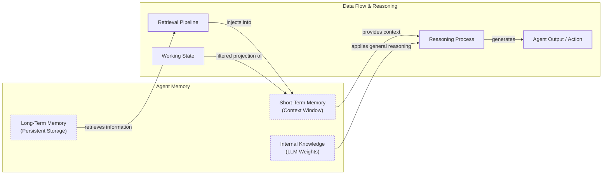

# Lesson 9: Memory for AI Agents

In the previous lessons, you built a solid foundation in AI Engineering. You explored the agent landscape, distinguished between rule-based workflows and autonomous agents, mastered context engineering, and even built a ReAct agent from scratch. You learned that an agent’s power comes from its ability to reason and act. But what happens when the conversation ends? The agent forgets.

LLMs today have a fundamental limitation: their knowledge is vast but frozen in time. They are unable to learn and update their internal knowledge after deployment, a challenge known as "continual learning." We can inject new information through the context window, but this is a temporary fix. An LLM without a persistent memory is like a brilliant intern with amnesia; it can solve complex problems but cannot recall past conversations or learn from experience.

The context window acts as the agent's working memory, or RAM. It is fast but volatile and, until recently, severely limited. Keeping an entire conversation history in context is often impractical due to finite size, rising costs, and performance degradation from noise—a problem known as "lost in the middle," where models struggle to use information buried in a long prompt [[1]](https://stevekinney.com/writing/agent-memory-systems), [[2]](https://towardsdatascience.com/a-practical-guide-to-memory-for-autonomous-llm-agents/). Early efforts to build personal AI companions quickly hit these limits, forcing engineers to develop complex memory systems with aggressive compression and retrieval components just to function within 8k or 16k token windows [[3]](https://www.youtube.com/watch?v=7AmhgMAJIT4&list=PLDV8PPvY5K8VlygSJcp3__mhToZMBoiwX&index=112).

While context windows are now expanding to over a million tokens, this trend simply shifts the engineering challenge. Instead of aggressive compression, we now need more intelligent filtering [[3]](https://www.youtube.com/watch?v=7AmhgMAJIT4&list=PLDV8PPvY5K8VlygSJcp3__mhToZMBoiwX&index=112). Memory systems are the engineering workaround for this limitation. They provide agents with continuity, adaptability, and a mechanism to "learn" over time. In this lesson, we will explore the different layers of agent memory, from the model's internal knowledge to short-term and long-term storage. You will learn about the three key types of long-term memory—semantic, episodic, and procedural—and the pros and cons of different architectures for storing them. We will then walk through practical code examples to implement these concepts and conclude with real-world best practices for building reliable memory systems.

To build effective memory systems, we first need a clear mental model. We can borrow concepts from biology and cognitive science to understand how memory works in humans and apply those principles to our agents.

## The Layers of Memory: Internal, Short-Term, and Long-Term

Adopting terminology from cognitive science helps us create a structured mental model for agent memory [[4]](https://arxiv.org/html/2309.02427). We can categorize an agent's memory into three distinct layers, each serving a different function.

**Internal Knowledge** is the static, pre-trained information embedded in the LLM's weights. It contains general world knowledge, language patterns, and reasoning abilities. It is powerful but read-only; you cannot update it without fine-tuning. This is the ideal place for general knowledge, as the model can access it without any context [[5]](https://www.linkedin.com/posts/pauliusztin_every-ai-agent-has-4-distinct-memory-layers-activity-7436765234800807936-QyLR).

**Short-Term Memory** is the agent's working memory, which exists within the LLM's active context window. It is volatile, fast, and limited in size. It holds the current conversation, retrieved documents, and tool outputs. If information is not in the context window, it does not exist for the model in that moment. This is the only layer where we can simulate learning within a single interaction [[5]](https://www.linkedin.com/posts/pauliusztin_every-ai-agent-has-4-distinct-memory-layers-activity-7436765234800807936-QyLR), [[6]](https://www.dataiku.com/stories/blog/agent-memory).

**Long-Term Memory** is an external, persistent storage system, like the agent's hard drive. It stores user preferences, past interactions, and learned facts across sessions. It gives the agent continuity, allowing it to build on previous knowledge [[5]](https://www.linkedin.com/posts/pauliusztin_every-ai-agent-has-4-distinct-memory-layers-activity-7436765234800807936-QyLR), [[6]](https://www.dataiku.com/stories/blog/agent-memory).

These layers form a filtering hierarchy. Information from long-term memory is retrieved and projected into the short-term memory to become actionable. This dynamic interplay is what makes an agent feel coherent. This can be conceptualized as a retrieval pipeline where different types of memories are queried in parallel, and the results are fused and ranked before being presented to the model [[7]](https://vizuara.substack.com/p/a-primer-on-re-ranking-for-retrieval).


Image 1: A flowchart representing the hierarchy and dynamic flow of an AI agent's memory system, differentiating between Internal Knowledge, Short-Term Memory, and Long-Term Memory, and showing their interactions with a Retrieval Pipeline, Working State, Reasoning Process, and Agent Output.

No single layer can do it all. Internal knowledge provides general intelligence, short-term memory handles the immediate task, and long-term memory provides the specific context and personalization that the other layers lack. Long-term memory is where most of the complex engineering work lies, so let's break it down further into its different types.

## Long-Term Memory: Semantic, Episodic, and Procedural

Long-term memory is not a monolith. Just as in human cognition, it can be divided into distinct types, each serving a unique purpose. Understanding these categories helps you design more sophisticated and capable agents [[2]](https://towardsdatascience.com/a-practical-guide-to-memory-for-autonomous-llm-agents/), [[8]](https://machinelearningmastery.com/beyond-short-term-memory-the-3-types-of-long-term-memory-ai-agents-need/).

**Semantic Memory (Facts & Knowledge)** is the agent's external encyclopedia or fact book. It is a repository of discrete, timeless pieces of knowledge about the world, specific domains, or individual users [[9]](https://www.mongodb.com/resources/basics/artificial-intelligence/agent-memory), [[10]](https://www.geeksforgeeks.org/artificial-intelligence/ai-agent-memory/). These facts can be stored as simple, independent strings like "The user is a vegetarian," or as structured data attached to an entity, such as a JSON object: `{"user": {"dietary_preference": "vegetarian"}}`. The structure you choose depends entirely on your agent's use case. The primary role of semantic memory is to provide a reliable source of truth. For a personal assistant, this memory builds a persistent user profile, storing key details like preferences ("User likes rock music"), relationships ("User has a dog named George"), or constraints ("User is allergic to gluten") [[11]](https://mem0.ai/blog/long-term-memory-ai-agents). This allows the agent to retrieve precise information when needed, rather than sifting through a noisy and extensive conversation history. For an enterprise agent, semantic memory might contain internal company documents, technical manuals, or a product catalog, enabling it to answer questions on proprietary topics with accuracy [[8]](https://machinelearningmastery.com/beyond-short-term-memory-the-3-types-of-long-term-memory-ai-agents-need/). This curated knowledge base allows the agent to function as a domain expert, providing consistent and reliable information that was not part of its original training data.

**Episodic Memory (Experiences & History)** is the agent's personal diary. It is a chronological log of specific events and interactions—the "what happened and when" [[9]](https://www.mongodb.com/resources/basics/artificial-intelligence/agent-memory). The key differentiator from semantic memory is the element of time. Each memory is tied to a specific point in the past, often with a timestamp [[12]](https://ctoi.substack.com/p/memory-systems-in-ai-agents-episodic). This memory type is crucial for maintaining conversational context and understanding the evolution of a user's state or a relationship's dynamics. For example, a semantic memory might store two conflicting facts: "User's brother is named Mark" and "User is frustrated with his brother." An episodic memory provides richer, time-bound context: *"On Tuesday, the user expressed frustration that their brother, Mark, always forgets their birthday. I provided an empathetic response."* This "episode" allows the agent to interact with more intelligence and empathy in the future, perhaps recalling the sensitivity of the topic if the brother is mentioned again. With a temporal component, an agent can also answer questions like, "What did we talk about last week?" The time scale for these episodes can vary depending on the product—grouping events by day, conversation, or week. There is no one-size-fits-all solution. This ability to recall specific past events transforms the agent from a reactive tool into one that learns from its own history, adapting its approach based on what has worked or failed before.

**Procedural Memory (Skills & How-To)** is the agent's muscle memory—its collection of learned skills, workflows, and "how-to" knowledge for performing multi-step tasks [[9]](https://www.mongodb.com/resources/basics/artificial-intelligence/agent-memory), [[10]](https://www.geeksforgeeks.org/artificial-intelligence/ai-agent-memory/). It is a set of pre-defined playbooks for common requests, making the agent's behavior on repetitive tasks reliable, fast, and predictable. This type of memory is often encoded as a "tool" or function that the agent can call. For example, an agent might have a procedure named `monthly_report`. When a user asks for a monthly update, the agent does not need to reason from scratch. It retrieves and executes the procedure, which defines a clear series of steps: 1) Query the sales database for the last 30 days, 2) Summarize the top five insights, and 3) Ask the user if they want the report emailed or displayed directly [[10]](https://www.geeksforgeeks.org/artificial-intelligence/ai-agent-memory/). By encoding successful workflows, procedural memory allows an agent to improve its efficiency over time, reducing errors and ensuring complex jobs are executed consistently [[8]](https://machinelearningmastery.com/beyond-short-term-memory-the-3-types-of-long-term-memory-ai-agents-need/). This is essential for workflow automation agents that handle repetitive processes, as it reduces repetitive deliberation and allows reasoning to focus on novel situations.

We now have a clear model for *what* to store. The next logical question is *how* to store it. This architectural choice has major implications for your agent's performance.

## Storing Memories: Pros and Cons of Different Approaches

How an agent's memories are stored is a critical architectural decision that impacts performance, complexity, and scalability. While the goal is always to provide the right context at the right time, the method of storage involves significant trade-offs. There is no perfect solution; the ideal approach depends entirely on your product's use case. Let's explore the three primary methods we are experimenting with as AI engineers: raw strings, structured entities, and knowledge graphs [[3]](https://www.youtube.com/watch?v=7AmhgMAJIT4&list=PLDV8PPvY5K8VlygSJcp3__mhToZMBoiwX&index=112).

**Storing Memories as Raw Strings** is the simplest method, where conversational turns or documents are stored as plain text and indexed for vector search [[13]](https://www.decodingai.com/p/how-does-memory-for-ai-agents-work). This approach is fast to set up and preserves the full nuance of an interaction, including emotional tone and subtle linguistic cues, since nothing is lost in translation [[13]](https://www.decodingai.com/p/how-does-memory-for-ai-agents-work), [[2]](https://towardsdatascience.com/a-practical-guide-to-memory-for-autonomous-llm-agents/). However, retrieval is often imprecise. Relying solely on semantic similarity can return text that is related but contextually wrong. A query like "What is my brother's job?" might retrieve every past conversation mentioning "brother" and "job" without pinpointing the current fact [[13]](https://www.decodingai.com/p/how-does-memory-for-ai-agents-work). Updating facts is also difficult; a correction ("My brother is now a doctor") simply adds a new, potentially contradictory string to the log. This method also lacks the structure needed for temporal reasoning, making it hard to distinguish between past and present states like "Barry *was* the CEO" versus "Claude *is* the CEO" [[13]](https://www.decodingai.com/p/how-does-memory-for-ai-agents-work), [[14]](https://www.microsoft.com/en-us/research/blog/from-raw-interaction-to-reusable-knowledge-rethinking-memory-for-ai-agents/).

**Storing Memories as Entities (JSON-like Structures)** involves using an LLM to transform unstructured interactions into structured memories, often stored in a format like JSON [[3]](https://www.youtube.com/watch?v=7AmhgMAJIT4&list=PLDV8PPvY5K8VlygSJcp3__mhToZMBoiwX&index=112). Information is organized into key-value pairs, which allows for precise, field-level filtering that retrieves specific facts without ambiguity. It is also much easier to update; if a user's preference changes, only the relevant field in the JSON object needs to be modified. This method is ideal for semantic memory, where user profiles and preferences are stored as facts [[3]](https://www.youtube.com/watch?v=7AmhgMAJIT4&list=PLDV8PPvY5K8VlygSJcp3__mhToZMBoiwX&index=112). The downside is the increased upfront engineering complexity required to design a schema. A predefined schema can be rigid, and if the agent encounters information that does not fit, that data may be lost. While an LLM can dynamically alter the schema, this adds complexity and increases the risk of duplicate information. Furthermore, the extraction process can strip away the rich subtext of the original conversation, losing valuable nuance [[3]](https://www.youtube.com/watch?v=7AmhgMAJIT4&list=PLDV8PPvY5K8VlygSJcp3__mhToZMBoiwX&index=112).

**Storing Memories in a Graph Database** is the most advanced approach, where memories are stored as a network of nodes (entities) and edges (relationships) to form a knowledge graph [[15]](https://www.octoco.ai/blog/knowledge-graphs-as-memory). The core strength of a graph is its ability to explicitly define complex relationships, such as `(User) -> [HAS_BROTHER] -> (Mark) -> [WORKS_AS] -> (Software Engineer)`. This enables sophisticated, multi-hop queries that trace these connections. Knowledge graphs also excel at modeling time and context as explicit properties of a relationship (e.g., `User -[RECOMMENDED_ON_DATE: "2025-10-25"]-> Restaurant`), providing more accurate retrieval than vector search alone. Finally, the reasoning path is transparent and auditable, making it easier to debug the agent's logic [[15]](https://www.octoco.ai/blog/knowledge-graphs-as-memory), [[16]](https://neo4j.com/nodes-2025/agenda/building-evolving-ai-agents-via-dynamic-memory-representations-using-temporal-knowledge-graphs/). However, this method carries the highest complexity and cost, requiring significant investment in schema design and maintenance. Complex graph traversals can also be slower than simple vector lookups, and for many simpler use cases, the overhead of a graph database is not justified [[15]](https://www.octoco.ai/blog/knowledge-graphs-as-memory).

| Approach | Pros | Cons |
| --- | --- | --- |
| **Raw Strings** | Simple to set up, preserves nuance. | Imprecise retrieval, hard to update, lacks structure. |
| **Entities (JSON)** | Structured and precise, easy to update. | Upfront complexity, schema rigidity, loss of nuance. |
| **Knowledge Graph** | Models complex relationships, superior temporal awareness, auditable. | Highest complexity and cost, potentially slower queries, overkill for simple cases. |
Table 1: A comparison of memory storage approaches.

The right choice of memory storage should be guided by your product's core needs. It is often best to start with the simplest architecture that delivers value and evolve it as the demands on your agent grow more complex. Now that we know what to save and how to store memories, let's look at some code examples using a memory tool.

## Memory implementations with code examples

This section provides practical code examples for implementing the different memory types. While Retrieval-Augmented Generation (RAG) is the mechanism for *retrieving* information—a topic we will cover in detail in the next lesson—the creation of high-quality memories is an equally important preceding step. We will use the `mem0` library to demonstrate how to create and store memories as raw strings, focusing on the distinct formation process for each memory type.

### What is mem0?

`mem0` is an open-source library designed to provide a scalable memory layer for AI agents. It handles the extraction, consolidation, and retrieval of information from conversations, allowing agents to maintain long-term memory. It supports various backends, including vector databases and graph databases, to manage different memory structures [[17]](https://arxiv.org/html/2504.19413). For our examples, we will use it with a local vector store to keep things simple.

### Setup

First, we need to set up our environment. This involves configuring `mem0` to use Gemini for both embeddings and LLM-based fact extraction, with ChromaDB as a local vector store. We also define two helper functions: `mem_add_text` to save a memory string with a specific category and `mem_search` to query memories.

1.  We begin by defining the configuration for `mem0`. This tells the library to use Gemini for its LLM and embedding models and to use a local ChromaDB instance for storage.
    ```python
    import os
    import re
    from typing import Optional
    
    from google import genai
    from mem0 import Memory
    
    # Assumes GOOGLE_API_KEY is set in the environment
    
    MODEL_ID = "gemini-2.5-pro"
    
    MEM0_CONFIG = {
        "embedder": {
            "provider": "gemini",
            "config": {
                "model": "gemini-embedding-001",
                "embedding_dims": 768,
                "api_key": os.getenv("GOOGLE_API_KEY"),
            },
        },
        "vector_store": {
            "provider": "chroma",
            "config": {
                "collection_name": "lesson9_memories",
                "path": "/tmp/chroma_mem0",
            },
        },
        "llm": {
            "provider": "gemini",
            "config": {
                "model": MODEL_ID,
                "api_key": os.getenv("GOOGLE_API_KEY"),
            },
        },
    }
    
    memory = Memory.from_config(MEM0_CONFIG)
    MEM_USER_ID = "lesson9_notebook_student"
    memory.delete_all(user_id=MEM_USER_ID)
    print("✅ Mem0 ready (Gemini embeddings + local Chroma).")
    ```
    It outputs:
    ```text
    ✅ Mem0 ready (Gemini embeddings + local Chroma).
    ```

2.  Next, we define helper functions to simplify adding and searching for memories. `mem_add_text` stores a raw string with a category tag, and `mem_search` allows us to retrieve memories, optionally filtering by that category.
    ```python
    def mem_add_text(text: str, category: str = "semantic", **meta) -> str:
        """Add a single text memory. No LLM is used for extraction or summarization."""
        metadata = {"category": category}
        for k, v in meta.items():
            if isinstance(v, (str, int, float, bool)) or v is None:
                metadata[k] = v
            else:
                metadata[k] = str(v)
        memory.add(text, user_id=MEM_USER_ID, metadata=metadata, infer=False)
        return f"Saved {category} memory."
    
    
    def mem_search(query: str, limit: int = 5, category: Optional[str] = None) -> list[dict]:
        """
        Category-aware search wrapper.
        Returns the full result dicts so we can inspect metadata.
        """
        res = memory.search(query, user_id=MEM_USER_ID, limit=limit) or {}
    
        items = res.get("results", [])
        if category is not None:
            items = [r for r in items if (r.get("metadata") or {}).get("category") == category]
        return items
    ```

### Semantic Memory: Extracting Facts

**How it's created:** Semantic memory is formed through a deliberate extraction pipeline. After an interaction, the unstructured text is passed to an LLM with a prompt designed to pull out atomic, factual data. This process transforms messy conversational threads into a clean, queryable knowledge base [[18]](https://blog.lqhl.me/mem0-how-three-prompts-created-a-viral-ai-memory-layer).

**Prompt Used to Create:** The prompt instructs the model to act as a knowledge extractor, identifying facts, preferences, and attributes relevant to the agent's purpose. For a personal assistant, the focus is on user-specific details.
Example Extraction Prompt (For a general personal assistant):
```
Extract persistent facts and strong preferences as short bullet points.
- Keep each fact atomic and context-independent. While reading the messages, make sure to notice the nuance or sublte details that might be important when saving these facts.
- 3–6 bullets max.

Text:
{My brother Mark is a software engineer, but his real passion is painting, he gifted me a painting a few years ago. Its really beautiful.}
```

**Memory Created:** The system would store discrete facts such as: `Mark is the user's brother.`, `Mark is a software engineer.`, `Mark's real passion is painting.`, and `The user has a painting from Mark and finds it beautiful.`.

**How it's Retrieved:** Retrieval typically uses a hybrid search approach, which we will explore further in the next lesson. This combines keyword filtering to narrow down the search space (e.g., finding all memories containing "brother") with a semantic search to find the most contextually relevant fact within that subset (e.g., matching "job" to "software engineer").

1.  We store a few sample facts as semantic memories.
    ```python
    facts: list[str] = [
        "User prefers vegetarian meals.",
        "User has a dog named George.",
        "User is allergic to gluten.",
        "User's brother is named Mark and is a software engineer.",
    ]
    for f in facts:
        print(mem_add_text(f, category="semantic"))
    
    print(f"Added {len(facts)} semantic memories.")
    ```
    It outputs:
    ```text
    Saved semantic memory.
    Saved semantic memory.
    Saved semantic memory.
    Saved semantic memory.
    Added 4 semantic memories.
    ```

2.  Now, we can search for a specific fact using a natural language query.
    ```python
    results = memory.search("brother job", user_id=MEM_USER_ID, limit=1)
    print(results["results"][0]["memory"])
    ```
    It outputs:
    ```text
    User's brother is named Mark and is a software engineer.
    ```

### Episodic Memory: The Log of Events

**How it's Created:** Episodic memory functions as a chronological log. Memories can be created by having an LLM summarize an interaction or by simply logging the raw text with a timestamp [[19]](https://docs.mem0.ai/platform/features/timestamp). This creates a timeline of events that the agent can reference.

**Prompt Used to Create:** If memories are summarized, the prompt guides the LLM to capture the essence of an event. For a tutoring agent, it might be: "You are a personal coding tutor. Extract events, likes, dislikes, or any other insights from the conversation that will help you better teach the user and improve their skills. Capture the nuance, not just the facts." If stored raw, no extraction prompt is needed.
Example Input: `User: "I'm feeling stressed about my project deadline on Friday.", Assistant: "I'm sorry to hear that. I'm here to help you with that."`

**Memory Created (raw):** `October 26th, 2025. 2:30PM EST: User: "I'm feeling stressed about my project deadline on Friday." Assistant: "I'm sorry to hear that. I'm here to help you with that."`

**Memory Created (summarized):** `October 26th, 2025. 2:30PM EST User: "The user is stressed about their project deadline on Friday and the assistant offers to help."`

**How it's Retrieved:** Retrieval from episodic memory often blends temporal and semantic queries. A simple retrieval might filter by a date range ("What did we talk about yesterday?"). A more robust approach uses semantic search to find contextually similar conversations and then re-ranks the results by recency.

1.  We simulate a short conversation and use an LLM to generate a concise summary.
    ```python
    client = genai.Client()
    dialogue = [
        {"role": "user", "content": "I'm stressed about my project deadline on Friday."},
        {"role": "assistant", "content": "I’m here to help—what’s the blocker?"},
        {"role": "user", "content": "Mainly testing. I also prefer working at night."},
        {"role": "assistant", "content": "Okay, we can split testing into two sessions."},
    ]
    
    episodic_prompt = f"""Summarize the following 3–4 turns as one concise 'episode' (1–2 sentences).
    Keep salient details and tone.
    
    {dialogue}
    """
    episode_summary = client.models.generate_content(model=MODEL_ID, contents=episodic_prompt)
    episode = episode_summary.text.strip()
    print(episode)
    ```
    It outputs:
    ```text
    A user, stressed about a Friday project deadline because of testing and a preference for working at night, is advised to split the testing work into two manageable sessions.
    ```

2.  We store this summary as an episodic memory, including metadata about the interaction.
    ```python
    print(
        mem_add_text(
            episode,
            category="episodic",
            summarized=True,
            turns=4,
        )
    )
    ```
    It outputs:
    ```text
    Saved episodic memory.
    ```

3.  We can now retrieve this episode by searching for related concepts. The result includes the memory and its creation timestamp, which is automatically added by `mem0`.
    ```python
    print("\nSearch --> 'deadline stress'\n")
    hits = mem_search("deadline stress", limit=1, category="episodic")
    for h in hits:
        print(f"{h['memory']}\n")
        print(h)
    ```
    It outputs:
    ```text
    Search --> 'deadline stress'
    
    A user, stressed about a Friday project deadline because of testing and a preference for working at night, is advised to split the testing work into two manageable sessions.
    
    {'id': '...', 'memory': '...', 'hash': '...', 'metadata': {'turns': 4, 'summarized': True, 'category': 'episodic'}, 'score': 0.91..., 'created_at': '2025-09-12T02:30:01.358468-07:00', 'updated_at': None, 'user_id': 'lesson9_notebook_student', 'role': 'user'}
    ```

### Procedural Memory: Defining and Learning Skills

**How it's Created:** Procedural memory is unique because it can be created in two ways. A developer can explicitly code a tool or function, or a more advanced agent can learn a new procedure dynamically from user instructions [[20]](https://arxiv.org/html/2508.06433v2).

**Example Prompt:**
```
You are an agent that can learn new skills. When a user provides a numbered list of steps to accomplish a goal, your task is to run the "learn_procedure" tool, and convert these numbered list of steps into a reusable procedure. Identify the core actions and any variable parameters (e.g., dates, locations, names).

Examples:
User Input: "I want you to book a cabin for this summer. To do that, please remember to: 1. Search for cabins on CabinRentals.com my favorite website. 2. Filter for locations in the mountains, the closer to them, the better. 3. Make sure it's available around July. 4 to 8th. 5. Send me the top 3 options."

learn_procedure(name="find_summer_cabin", steps=first search for cabins on CabinRentals.com, then filter for locations in the mountains, check for distance to the mountains, then check availability around what the user wants, if the user hasn't specified a date, ask the user for a date, once you have a list of options, send the top 3 options)
```

**Memory Created:** The LLM would generate a new structured procedure and save it to its tool library: `procedure_name: find_summer_cabin`, `steps=...`.

**How it's Retrieved:** Retrieval is an intent-matching and function-calling process. The agent receives descriptions of all available procedures in its context. It then compares the user's current request against these descriptions to find the best semantic match and execute the corresponding procedure.

1.  We define a multi-step procedure and store it as a single text block.
    ```python
    procedure_name = "monthly_report"
    steps = [
        "Query sales DB for the last 30 days.",
        "Summarize top 5 insights.",
        "Ask user whether to email or display.",
    ]
    procedure_text = f"Procedure: {procedure_name}\nSteps:\n" + "\n".join(f"{i + 1}. {s}" for i, s in enumerate(steps))
    
    mem_add_text(procedure_text, category="procedure", procedure_name=procedure_name)
    
    print(f"Learned procedure: {procedure_name}")
    ```
    It outputs:
    ```text
    Learned procedure: monthly_report
    ```

2.  The agent can later retrieve and "execute" this procedure by searching for its name or a related task.
    ```python
    results = mem_search("how to create a monthly report", category="procedure", limit=1)
    if results:
        print(results[0]["memory"])
    ```
    It outputs:
    ```text
    Procedure: monthly_report
    Steps:
    1. Query sales DB for the last 30 days.
    2. Summarize top 5 insights.
    3. Ask user whether to email or display.
    ```

Implementing memory is one thing; making it work reliably in production is another. Let's discuss some key considerations from building these systems at scale.

## Real-World Lessons: Challenges and Best Practices

The architectural patterns we have discussed provide a useful toolkit, but moving from theory to a reliable production system requires navigating complex trade-offs. These challenges are constantly evolving as the underlying technology improves so fast.

Here are some of the most important lessons learned from building and scaling agent memory systems in the real world.

**Re-evaluating Compression** is one of the biggest changes in memory design. The old challenge, just two years ago, was that LLMs operated with small and expensive context windows of 8,000 or 16,000 tokens. This forced AI engineers to be ruthless with compression, distilling every interaction into its most compact form, like summaries or facts. This process is inherently lossy; summarizing preserves the general idea but loses the fine details and nuance that are often critical for a personalized agent [[3]](https://www.youtube.com/watch?v=7AmhgMAJIT4&list=PLDV8PPvY5K8VlygSJcp3__mhToZMBoiwX&index=112). The new reality is that today, with models offering million-token context windows at a fraction of the cost, the trade-offs have shifted. The best practice is now to lean towards less compression. The raw, unstructured conversational history is the ultimate source of truth, containing the emotional subtext and relational dynamics often lost during extraction [[3]](https://www.youtube.com/watch?v=7AmhgMAJIT4&list=PLDV8PPvY5K8VlygSJcp3__mhToZMBoiwX&index=112). While a semantic fact might state, "User has a dog named George," the episodic log reveals, "User mentioned that walking their dog George is the best part of their day"—a far more valuable insight. You should design your system to work with the most complete version of history that is economically and technically feasible. Use summaries and facts as queryable indexes, but always treat the raw log as ground truth.

**Designing for the Product** is another key lesson. There is no "perfect" memory architecture. The concepts of semantic, episodic, and procedural memory are a powerful mental model, but they are a toolkit, not a mandatory blueprint. A common failure is over-engineering a complex memory system for a product that does not need it [[3]](https://www.youtube.com/watch?v=7AmhgMAJIT4&list=PLDV8PPvY5K8VlygSJcp3__mhToZMBoiwX&index=112). The best practice is to start from first principles by defining the core function of your agent. The product's goal should dictate the memory architecture. For a Q&A bot over internal documents, a simple RAG pipeline is the best starting point. For a long-term personal companion, rich episodic memories that include a temporal element are essential. For a task-automation agent, procedural memory is key, allowing the agent to recall and execute multi-step workflows reliably [[8]](https://machinelearningmastery.com/beyond-short-term-memory-the-3-types-of-long-term-memory-ai-agents-need/).

**The Human Factor** introduces additional cognitive overhead. Memory exists to make the agent smarter, not to give the user a new job. A common pitfall is exposing the internal workings of the memory system to the user, thinking it improves transparency. In practice, it often creates significant cognitive overhead [[3]](https://www.youtube.com/watch?v=7AmhgMAJIT4&list=PLDV8PPvY5K8VlygSJcp3__mhToZMBoiwX&index=112). The best practice is to avoid asking users to "garden their agent's memories." This breaks the illusion of a capable assistant and turns the interaction into a tedious data-entry task. Memory management should be an autonomous function of the agent. It should learn from corrections within the natural flow of conversation, such as "Actually, my brother's name is Mark, not Mike." The agent, not the user, is responsible for periodically reviewing, consolidating, and resolving conflicting information in its memory stores [[2]](https://towardsdatascience.com/a-practical-guide-to-memory-for-autonomous-llm-agents/).

## Conclusion

Memory is a core component that transforms a stateless LLM into a truly personalized and adaptive agent. It is the current engineering solution to the "continual learning" problem, allowing our systems to remember, adapt, and build on past interactions. While today's memory tools are a workaround for the fundamental inability of models to update their weights, they are a powerful and necessary component for building stateful AI applications that can learn over time. By mastering the different layers and types of memory, you can design agents that maintain conversational continuity, access specialized knowledge, and provide more capable and reliable assistance.

In this lesson, you have explored the layers and types of agent memory, different storage architectures, and practical implementation patterns. As you continue your journey as an AI engineer, this understanding will be critical. In our next lesson, we will do a deep dive into Retrieval-Augmented Generation (RAG), the primary mechanism for retrieving information from the memory systems you have designed. Looking further ahead, we will apply these concepts to build complex research and writing agents, taking another step toward creating truly intelligent systems.

## References

- [1] https://stevekinney.com/writing/agent-memory-systems
- [2] https://towardsdatascience.com/a-practical-guide-to-memory-for-autonomous-llm-agents/
- [3] https://www.youtube.com/watch?v=7AmhgMAJIT4&list=PLDV8PPvY5K8VlygSJcp3__mhToZMBoiwX&index=112
- [4] https://arxiv.org/html/2309.02427
- [5] https://www.linkedin.com/posts/pauliusztin_every-ai-agent-has-4-distinct-memory-layers-activity-7436765234800807936-QyLR
- [6] https://www.dataiku.com/stories/blog/agent-memory
- [7] https://vizuara.substack.com/p/a-primer-on-re-ranking-for-retrieval
- [8] https://machinelearningmastery.com/beyond-short-term-memory-the-3-types-of-long-term-memory-ai-agents-need/
- [9] https://www.mongodb.com/resources/basics/artificial-intelligence/agent-memory
- [10] https://www.geeksforgeeks.org/artificial-intelligence/ai-agent-memory/
- [11] https://mem0.ai/blog/long-term-memory-ai-agents
- [12] https://ctoi.substack.com/p/memory-systems-in-ai-agents-episodic
- [13] https://www.decodingai.com/p/how-does-memory-for-ai-agents-work
- [14] https://www.microsoft.com/en-us/research/blog/from-raw-interaction-to-reusable-knowledge-rethinking-memory-for-ai-agents/
- [15] https://www.octoco.ai/blog/knowledge-graphs-as-memory
- [16] https://neo4j.com/nodes-2025/agenda/building-evolving-ai-agents-via-dynamic-memory-representations-using-temporal-knowledge-graphs/
- [17] https://arxiv.org/html/2504.19413
- [18] https://blog.lqhl.me/mem0-how-three-prompts-created-a-viral-ai-memory-layer
- [19] https://docs.mem0.ai/platform/features/timestamp
- [20] https://arxiv.org/html/2508.06433v2
</article>