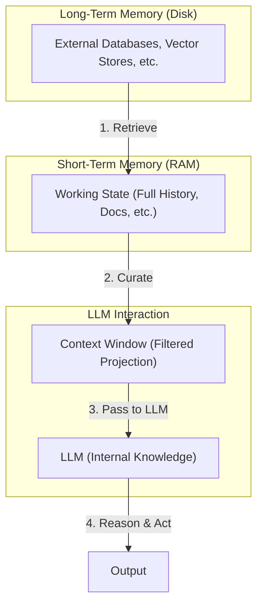

# How AI Agents Remember: The 4 Memory Types

In our previous lessons, we built a solid foundation in AI Engineering. We explored the agent landscape, learned to choose between rule-based workflows and autonomous agents, mastered context engineering, built agents that use tools, and even implemented a reasoning agent from scratch. Now, we will tackle one of the most important components of building intelligent systems: memory.

The core limitation of today's LLMs is that their knowledge is vast but frozen in time. They are fundamentally unable to learn by updating their weights after training, a problem known as “continual learning” [[1]](https://arxiv.org/html/2309.02427). An LLM without memory is like an intern with amnesia. They might be brilliant, but they cannot recall previous conversations or learn from experience. To overcome this, we use the context window as a form of “working memory.” However, keeping an entire conversation thread plus additional information in the context window is often unrealistic. Rising costs per turn and the “lost in the middle” problem—where models struggle to use information buried in the center of a long prompt—limit this approach [[2]](https://arxiv.org/abs/2307.03172).

While context windows are increasing, relying solely on them introduces noise and overhead. Even with massive 1-million-token windows, performance degrades as the prompt grows, a phenomenon known as "attention dilution" where the model struggles to focus on the right information at the right time [[3]](https://towardsdatascience.com/a-practical-guide-to-memory-for-autonomous-llm-agents/). On the other hand, constant compression and retrieval can lead to a loss of nuance and important details. The engineering reality is that we must continuously adapt our systems as the underlying technology evolves. Memory tools are the current solution. They provide agents with continuity, adaptability, and the ability to “learn” without retraining. When we first started building agents, working with 8k or 16k token limits forced us to engineer complex compression systems. Today, we have more breathing room, but the principles of organizing memory remain essential for performance.

In this article, we will explore the four fundamental types of memory for AI agents, take a detailed look at long-term memory types like semantic, episodic, and procedural, and discuss the trade-offs between different storage approaches. We will also provide practical code examples for implementing these memory types and share real-world challenges and best practices for designing robust memory systems. To build agents that are truly useful, we need a structured way to think about memory. We can borrow terms from biology and cognitive science to categorize the different layers and types of information, which provides a useful framework for engineering these systems.

## The Layers of Memory: Internal, Short-Term, and Long-Term

To build effective agents, we must distinguish between the different places information lives. We can borrow terms from biology and cognitive science to categorize these layers, which is useful for engineering. There are four distinct memory types based on their persistence and proximity to the model’s reasoning core [[4]](https://www.decodingai.com/p/how-does-memory-for-ai-agents-work), [[5]](https://www.linkedin.com/posts/pauliusztin_every-ai-agent-has-4-distinct-memory-layers-activity-7436765234800807936-QyLR).

**Internal Knowledge:** This is the static, pre-trained knowledge baked into the LLM’s weights. It is the best place to store general world knowledge—models know about whole books without needing them in the context window. However, this memory is frozen at the time of training and cannot be updated with user-specific information during inference.

**Context Window:** This is the slice of information we pass to the LLM during a specific call. It is the only “reality” the model sees during inference. If information is not in the context window, it does not exist for the model at that moment.

**Short-Term Memory:** This is the working state of the entire agentic system across multiple calls. It contains the full conversation history, retrieved documents, and tool outputs. For each inference step, only a subset of this short-term memory is projected into the context window. Short-term memory is the reservoir; the context window is the filtered projection [[5]](https://www.linkedin.com/posts/pauliusztin_every-ai-agent-has-4-distinct-memory-layers-activity-7436765234800807936-QyLR). It is volatile and fast, simulating the feeling of “learning” during a session [[6]](https://www.ibm.com/think/topics/ai-agent-memory).

**Long-Term Memory:** This is the external, persistent storage system (the disk) where an agent saves and retrieves information. This layer provides the personalization and context that internal knowledge lacks and short-term memory cannot retain [[7]](https://decodingml.substack.com/p/memory-the-secret-sauce-of-ai-agents).

The dynamic between these layers creates the agent’s intelligence. This process is more than just storage; it’s a continuous **write-manage-read loop**. New information is written, the memory is actively managed (pruned, compressed, consolidated), and relevant information is read into the context window for reasoning. Neglecting the “manage” step is a common failure, leading to noise and contradiction [[3]](https://towardsdatascience.com/a-practical-guide-to-memory-for-autonomous-llm-agents/). First, part of the long-term memory is “retrieved” and brought into short-term memory. Next, we slice the short-term memory into an active context window through context engineering. Finally, during inference, the LLM uses its internal weights plus the active context window to generate output.


Image 1: A diagram illustrating the hierarchical flow of information between the different memory layers in an AI agent.

Categorizing memory this way is critical for engineering. Internal knowledge handles general reasoning. Short-term memory manages the immediate task. Long-term memory handles personalization and continuity. No single layer can perform all three functions effectively. To better understand long-term memory, we can further apply cognitive science definitions to specific data types.

## Long-Term Memory: Semantic, Episodic, and Procedural

Long-term memory is not a single bucket of text. It consists of three distinct types, each serving a different role in making an agent “intelligent” [[1]](https://arxiv.org/html/2309.02427), [[8]](https://www.newsletter.swirlai.com/p/memory-in-agent-systems).

### Semantic Memory (Facts & Knowledge)

Semantic memory is the agent’s encyclopedia [[9]](https://machinelearningmastery.com/beyond-short-term-memory-the-3-types-of-long-term-memory-ai-agents-need/). It stores individual pieces of knowledge or “facts.” These can be independent strings, such as _“The user is a vegetarian,”_ or structured attributes attached to an entity, like `{"food_restrictions": "vegetarian"}`. This is where the agent stores concepts and relationships regarding specific domains, people, or places. The primary role of semantic memory is to provide a reliable source of truth. For an enterprise agent, this might involve storing internal company documents, technical manuals, or an entire product catalog, allowing it to answer questions on proprietary topics. For a personal assistant, semantic memory builds a persistent user profile. It recalls specific preferences like `{"music": "User likes rock music"}` or constraints like `{"dog": "User has a dog named George"}`. This allows the agent to retrieve relevant facts without searching through a noisy conversation history.

The distinction between memory types is important for choosing the right architecture. For domain expert agents in fields like law or finance, semantic memory is the most critical component, often integrated with RAG systems to pull in specialized knowledge. However, this memory requires careful curation. Without it, semantic memory can become a "junk drawer" of outdated or irrelevant information, degrading the agent's performance [[3]](https://towardsdatascience.com/a-practical-guide-to-memory-for-autonomous-llm-agents/).

### Episodic Memory (Experiences & History)

Episodic memory is the agent’s personal diary. It records past interactions, but unlike timeless facts, these memories have a timestamp. It captures _“what happened and when.”_ [[9]](https://machinelearningmastery.com/beyond-short-term-memory-the-3-types-of-long-term-memory-ai-agents-need/) This memory type is essential for maintaining conversational context and understanding relationship dynamics. A semantic fact might be _“User is frustrated with his brother.”_ An episodic memory would be: _“On Tuesday, the user expressed frustration that their brother, Mark, always forgets their birthday. I provided an empathetic response. [created_at=2025-08-25].”_ [[10]](https://www.youtube.com/watch?v=7AmhgMAJIT4&list=PLDV8PPvY5K8VlygSJcp3__mhToZMBoiwX&index=112)

This “episode” provides nuanced context. If the topic comes up again, the agent can say, “I know the topic of your brother’s birthday can be sensitive,” rather than just stating a fact. It also allows the agent to answer questions like _“What happened last week?”_ This enables a form of case-based reasoning, where an agent learns from its own history. For example, an AI financial advisor with episodic memory can recall that a previous stock recommendation underperformed, and use that experience to inform future advice. For personal AI assistants, episodic memory is often the most important type, as it drives personalization [[9]](https://machinelearningmastery.com/beyond-short-term-memory-the-3-types-of-long-term-memory-ai-agents-need/). Depending on the use case, these memories can group important events that happened over a day, a single conversation, or a week. There is no one-size-fits-all solution; the product dictates the required time scale.

### Procedural Memory (Skills & How-To)

Procedural memory is the agent’s muscle memory. It consists of skills, learned workflows, and “how-to” knowledge. It dictates the agent’s ability to perform multi-step tasks [[9]](https://machinelearningmastery.com/beyond-short-term-memory-the-3-types-of-long-term-memory-ai-agents-need/). This memory is often baked into the agent’s system prompt as reusable tools or defined sequences. For example, an agent might store a `MonthlyReportIntent` procedure. When a user asks for a report, the agent retrieves this procedure: 1) Query sales DB, 2) Summarize findings, 3) Email user. This makes behavior reliable and predictable. It encodes successful workflows so the agent doesn’t have to reason from scratch every time [[11]](https://arxiv.org/html/2508.06433v2).

This type of memory is key for workflow automation agents. It reduces repetitive deliberation, allowing the agent's reasoning to focus on novel situations. For complex tasks, procedural memory enables smooth orchestration. An agent booking travel doesn't just know facts about airlines (semantic) or remember past trips (episodic); it knows *how* to execute the multi-step process of searching, comparing, and booking [[9]](https://machinelearningmastery.com/beyond-short-term-memory-the-3-types-of-long-term-memory-ai-agents-need/). This memory can be treated as code, versioned, and updated based on user feedback or automated analysis of interactions [[3]](https://towardsdatascience.com/a-practical-guide-to-memory-for-autonomous-llm-agents/).

Now that we know what to save, we must decide _how_ to store it.

## Storing Memories: Pros and Cons of Different Approaches

The way an agent’s memories are stored is an architectural decision that impacts performance, complexity, and scalability. There is no one-size-fits-all solution. Let’s explore the three primary methods we experiment with as AI Engineers [[4]](https://www.decodingai.com/p/how-does-memory-for-ai-agents-work).

### Storing Memories as Raw Strings

This is the simplest method. Conversational turns or documents are stored as plain text and indexed for vector search.

**Pros:** It is simple and fast to set up, requiring minimal engineering. It preserves nuance, capturing emotional tone and linguistic cues without loss in translation.

**Cons:** Retrieval is often imprecise. A query like “What is my brother’s job?” might retrieve every conversation mentioning “brother” and “job” without pinpointing the current fact [[4]](https://www.decodingai.com/p/how-does-memory-for-ai-agents-work). This approach also suffers from **summarization drift**, where repeated compression of history to fit a context window causes details to be lost over time. Even with large context windows, **attention dilution** can occur, where the model ignores information buried in the middle of a long prompt [[3]](https://towardsdatascience.com/a-practical-guide-to-memory-for-autonomous-llm-agents/). Updating is difficult; if a user corrects a fact (“My brother is now a doctor”), the new string just adds to the log, creating potential contradictions. This challenge mirrors findings in neuroscience, where memories must become temporarily unstable or "labile" to be updated—a process known as reconsolidation. Without a structured way to reactivate and modify specific memories, the agent’s knowledge base can become a collection of conflicting statements [[12]](https://pmc.ncbi.nlm.nih.gov/articles/PMC5605913/). It also lacks structure, making it hard to distinguish state changes over time (e.g., “Barry _was_ CEO” vs. “Claude _is_ CEO”) [[4]](https://www.decodingai.com/p/how-does-memory-for-ai-agents-work).

### Storing Memories as Entities (JSON-like Structures)

Here, we use an LLM to transform messy interactions into structured memories, stored in formats like JSON within document or SQL databases.

**Pros:** It allows for precise, field-level filtering (e.g., `“user”: {”brother”: {”job”: “Software Engineer”}}`). The agent can retrieve specific facts without ambiguity. Updates are easier; you simply overwrite the relevant field. This is ideal for semantic memory like user profiles or preferences.

**Cons:** It requires upfront schema design complexity. It can also be rigid. If the agent encounters information that does not fit the schema, that data might be lost unless the schema is updated [[13]](https://danielp1.substack.com/p/memex-20-memory-the-missing-piece). Allowing an LLM to dynamically add new entities or fields can increase flexibility, but it also introduces risks. The schema can become inconsistent, making updates more complex and increasing the chance of saving duplicated or conflicting information. Furthermore, the extraction process can strip away the rich subtext of the original conversation. The factual memory `"user_likes": ["cats"]` is far less representative than the original message, "Petting my cat is the best part of my day."

### Storing Memories in a Knowledge Graph

This is the most advanced approach. Memories are stored as a network of nodes (entities) and edges (relationships) using graph databases.

**Pros:** It excels at representing complex relationships (e.g., `(User) -> [HAS_BROTHER] -> (Mark)`). This structure enables multi-hop reasoning, allowing the agent to answer questions that require connecting multiple pieces of information. It offers superior contextual and temporal awareness by modeling time as a property of a relationship (e.g., `[RECOMMENDED_ON_DATE]`) [[14]](https://www.octoco.ai/blog/knowledge-graphs-as-memory). Retrieval is also auditable. You can trace the path of reasoning, which builds trust.

**Cons:** It has the highest complexity and cost. Converting unstructured text into graph triples is difficult. Graph traversals can be slower than vector lookups, potentially impacting real-time performance. For simple use cases, it is often overkill [[15]](https://arxiv.org/html/2504.19413).

Beyond these storage formats, more advanced architectural patterns are emerging. **Reflective self-improvement** allows an agent to analyze its own interactions, write post-mortems on its failures, and store those conclusions to improve future performance. Another approach is **hierarchical virtual context**, where memory is tiered like a computer’s OS—with RAM for active context, a disk for recent recall, and cold storage for archives—and the agent learns to manage its own paging between them [[3]](https://towardsdatascience.com/a-practical-guide-to-memory-for-autonomous-llm-agents/).

| Approach | Pros | Cons |
| :--- | :--- | :--- |
| **Raw Strings** | Simple setup, preserves nuance. | Imprecise retrieval, hard to update, lacks structure, prone to drift. |
| **Entities (JSON)** | Precise filtering, easy updates, good for facts. | Schema design complexity, can be rigid, loses nuance. |
| **Knowledge Graph** | Models complex relationships, time-aware, auditable. | High complexity and cost, potentially slower queries. |
Table 1: A comparison of the three primary approaches for storing agent memories.

<aside>
💡 The choice should be guided by your product’s needs. Start simple and evolve as complexity grows.
</aside>

Now that we know what to save and how to store it, let's look at some code examples.

## Memory Implementations with Code Examples

This section provides code examples for implementing the different memory types using the `mem0` library. While Retrieval-Augmented Generation (RAG) is the mechanism for retrieving information, a topic we will cover in the next lesson, the creation of high-quality memories is an equally important preceding step. To focus on the benefits of each memory category, we will use the simple "storing memories as raw strings" approach.

### What is mem0?

`mem0` is an open-source memory layer for AI agents that automates the pipeline from input text to injected memories [[15]](https://arxiv.org/html/2504.19413). It can extract facts, consolidate information, and store it for later retrieval. It supports various backends, including vector and graph databases, making it a flexible tool for experimenting with different memory architectures. We will use it to demonstrate how to create and retrieve semantic, episodic, and procedural memories.

### Setup

First, we set up our environment by installing the necessary packages and configuring the Gemini client and `mem0`. We will use Gemini for both the LLM and embeddings, with ChromaDB as a local vector store.

1.  We define our configuration for `mem0`, specifying Gemini as the provider for both the LLM and embeddings, and ChromaDB as our local vector store.

    ```python
    import os
    from mem0 import Memory
    
    MEM0_CONFIG = {
        "embedder": {
            "provider": "gemini",
            "config": {
                "model": "gemini-embedding-001",
                "embedding_dims": 768,
                "api_key": os.getenv("GOOGLE_API_KEY"),
            },
        },
        "vector_store": {
            "provider": "chroma",
            "config": {
                "collection_name": "lesson9_memories",
                "path": "/tmp/chroma_mem0",
            },
        },
        "llm": {
            "provider": "gemini",
            "config": {
                "model": MODEL_ID,
                "api_key": os.getenv("GOOGLE_API_KEY"),
            },
        },
    }
    
    memory = Memory.from_config(MEM0_CONFIG)
    MEM_USER_ID = "lesson9_notebook_student"
    memory.delete_all(user_id=MEM_USER_ID)
    ```

2.  Next, we create a few helper functions to add and search for memories. `mem_add_text` saves a string with a category tag, and `mem_search` wraps the search functionality to allow filtering by category.

    ```python
    from typing import Optional

    def mem_add_text(text: str, category: str = "semantic", **meta) -> str:
        """Add a single text memory. No LLM is used for extraction or summarization."""
        metadata = {"category": category}
        for k, v in meta.items():
            if isinstance(v, (str, int, float, bool)) or v is None:
                metadata[k] = v
            else:
                metadata[k] = str(v)
        memory.add(text, user_id=MEM_USER_ID, metadata=metadata, infer=False)
        return f"Saved {category} memory."
    
    
    def mem_search(query: str, limit: int = 5, category: Optional[str] = None) -> list[dict]:
        """
        Category-aware search wrapper.
        Returns the full result dicts so we can inspect metadata.
        """
        res = memory.search(query, user_id=MEM_USER_ID, limit=limit) or {}
    
        items = res.get("results", [])
        if category is not None:
            items = [r for r in items if (r.get("metadata") or {}).get("category") == category]
        return items
    ```

### Semantic Memory: Extracting Facts

Semantic memory is created through an extraction pipeline. An LLM analyzes unstructured text and extracts factual data, turning messy conversation threads into a queryable knowledge base. The prompt for this task typically instructs the model to identify persistent facts, user preferences, and key attributes.

For example, a prompt might be:
```
Extract persistent facts and strong preferences as short bullet points.
- Keep each fact atomic and context-independent. While reading the messages, make sure to notice the nuance or subtle details that might be important when saving these facts.
- 3–6 bullets max.

Text:
{My brother Mark is a software engineer, but his real passion is painting, he gifted me a painting a few years ago. Its really beautiful.}
```
The system would then store facts like: `Mark is the user's brother`, `Mark is a software engineer`, and `Mark's real passion is painting`. Retrieval often uses a hybrid search, which combines keyword search with semantic relevance. First, the system filters the memory store for exact matches of known entities (e.g., all memories containing "brother"). Then, a vector search is performed on this subset to find the most contextually relevant fact, matching "job" with "software engineer."

1.  We add several facts to our semantic memory.

    ```python
    facts: list[str] = [
        "User prefers vegetarian meals.",
        "User has a dog named George.",
        "User is allergic to gluten.",
        "User's brother is named Mark and is a software engineer.",
    ]
    for f in facts:
        print(mem_add_text(f, category="semantic"))
    ```
    It outputs:
    ```text
    Saved semantic memory.
    Saved semantic memory.
    Saved semantic memory.
    Saved semantic memory.
    ```

2.  Now, we can search for a specific fact using a natural language query.

    ```python
    results = memory.search("brother job", user_id=MEM_USER_ID, limit=1)
    print(results["results"][0]["memory"])
    ```
    It outputs:
    ```text
    User's brother is named Mark and is a software engineer.
    ```

### Episodic Memory: The Log of Events

Episodic memory functions as a chronological log. Memories can be created by having an LLM summarize a conversation or by simply logging the raw text with a timestamp. If we want to create a summary, the prompt might instruct the model to distill a short exchange into a concise "episode."

For example, given the input `User: "I'm feeling stressed about my project deadline on Friday."`, a raw episodic memory would be `October 26th, 2025, 2:30PM EST: User: "I'm feeling stressed about my project deadline on Friday."`. A summarized version might be `October 26th, 2025, 2:30PM EST: The user is stressed about their project deadline and the assistant offers to help.` Retrieval combines temporal filtering (e.g., "yesterday") with semantic search to find contextually similar past events, often re-ranking results by recency.

1.  We define a short dialogue and use the LLM to create a concise summary.

    ```python
    dialogue = [
        {"role": "user", "content": "I'm stressed about my project deadline on Friday."},
        {"role": "assistant", "content": "I’m here to help—what’s the blocker?"},
        {"role": "user", "content": "Mainly testing. I also prefer working at night."},
        {"role": "assistant", "content": "Okay, we can split testing into two sessions."},
    ]
    
    episodic_prompt = f"""Summarize the following 3–4 turns as one concise 'episode' (1–2 sentences).
    Keep salient details and tone.
    
    {dialogue}
    """
    episode_summary = client.models.generate_content(model=MODEL_ID, contents=episodic_prompt)
    episode = episode_summary.text.strip()
    ```

2.  We save this summary as an episodic memory with additional metadata.

    ```python
    print(
        mem_add_text(
            episode,
            category="episodic",
            summarized=True,
            turns=4,
        )
    )
    ```
    It outputs:
    ```text
    Saved episodic memory.
    ```

3.  Later, we can retrieve this "experience" using a semantic query.

    ```python
    hits = mem_search("deadline stress", limit=1, category="episodic")
    for h in hits:
        print(f"{h['memory']}\n")
    ```
    It outputs:
    ```text
    A user, stressed about a Friday project deadline because of testing and a preference for working at night, is advised to split the testing work into two manageable sessions.
    ```

### Procedural Memory: Defining and Learning Skills

Procedural memory can be created by a developer who explicitly codes a tool or function, or it can be learned dynamically from user interactions. For example, an agent can be prompted to convert a user's step-by-step instructions into a reusable procedure. Retrieval is an intent-matching process where the LLM compares a user's request against the descriptions of all available procedures and executes the best match.

1.  We define a simple procedure as a text block containing a name and a list of steps.

    ```python
    procedure_name = "monthly_report"
    steps = [
        "Query sales DB for the last 30 days.",
        "Summarize top 5 insights.",
        "Ask user whether to email or display.",
    ]
    procedure_text = f"Procedure: {procedure_name}\nSteps:\n" + "\n".join(f"{i + 1}. {s}" for i, s in enumerate(steps))
    
    mem_add_text(procedure_text, category="procedure", procedure_name=procedure_name)
    ```

2.  When the user expresses an intent that matches this procedure, the agent can retrieve and "run" it.

    ```python
    results = mem_search("how to create a monthly report", category="procedure", limit=1)
    if results:
        print(results[0]["memory"])
    ```
    It outputs:
    ```text
    Procedure: monthly_report
    Steps:
    1. Query sales DB for the last 30 days.
    2. Summarize top 5 insights.
    3. Ask user whether to email or display.
    ```

Now that we have seen how to implement these memory types, let's discuss some additional considerations for building a production-ready memory system.

## Real-World Lessons: Challenges and Best Practices

Moving from theory to a reliable production system requires navigating a series of complex trade-offs. Here are some of the most important lessons learned from building and scaling agent memory systems.

### Re-evaluating Compression

The trade-off between compressing information and preserving its raw detail has shifted dramatically. Just two years ago, small and expensive context windows (8k or 16k tokens) forced us to be ruthless with compression. We had to distill every interaction into its most compact form—summaries, facts, or entities. This process is inherently lossy, sacrificing fine details for brevity. This has also led to strategies for active forgetting. In robotics, agents use frequency- and similarity-based mechanisms to automatically discard redundant data, reducing memory size without significant performance loss [[16]](https://h2t.iar.kit.edu/pdf/Plewnia2025.pdf).

Today, with models offering million-token context windows at a fraction of the cost, the best practice is to lean towards less compression [[10]](https://www.youtube.com/watch?v=7AmhgMAJIT4&list=PLDV8PPvY5K8VlygSJcp3__mhToZMBoiwX&index=112). The raw, unstructured conversational history is the ultimate source of truth. It contains the emotional subtext and relational dynamics that are often lost during extraction. While a fact might state, "User has a dog named George," the episodic log reveals, "User mentioned that walking their dog...is the best part of their day," a far more valuable piece of information for a personalized agent. Design your system to work with the most complete version of history that is economically and technically feasible.

### Designing for the Product

There is no "perfect" memory architecture. The concepts of semantic, episodic, and procedural memory are a powerful toolkit, not a mandatory blueprint. The most common failure mode is over-engineering a complex memory system for a product that does not need it [[10]](https://www.youtube.com/watch?v=7AmhgMAJIT4&list=PLDV8PPvY5K8VlygSJcp3__mhToZMBoiwX&index=112).

Start from first principles by defining the core function of your agent. The product's goal should dictate the memory architecture. For a Q&A bot over internal documents, a simple RAG pipeline is the best starting point. For a long-term personal AI companion, rich episodic memories are essential. For a task-automation agent, procedural memory is likely the most useful.

### The Human Factor

Memory exists to make the agent smarter, not to give the user a new job. A common pitfall is exposing the internal workings of the memory system, thinking it improves transparency. In practice, it often creates significant cognitive overhead.

Users should not be asked to "garden their agent's memories." This breaks the illusion of a capable assistant and turns the interaction into a tedious data-entry task [[10]](https://www.youtube.com/watch?v=7AmhgMAJIT4&list=PLDV8PPvY5K8VlygSJcp3__mhToZMBoiwX&index=112). Memory management should be an autonomous function. The agent should learn from corrections within the natural flow of conversation (e.g., "Actually, my brother's name is Mark, not Mike"). The agent, not the user, is responsible for maintaining the integrity of its own knowledge. This includes resolving contradictions. When new information conflicts with existing memories, the system needs a strategy, such as temporal versioning (preferring the newest data) or source attribution (trusting user input over agent inference), to maintain a coherent state [[17]](https://arxiv.org/html/2603.07670v1).

## Conclusion

Memory is the component that transforms a stateless chat application into a personalized agent. It is the current engineering solution to the problem of continual learning. By constantly engineering the context window, we allow agents to “learn” and adapt over time. Understanding the different layers and types of memory—from the LLM's internal knowledge to persistent long-term storage—is essential for building systems that are not just intelligent, but also reliable and useful.

While memory tools offer a powerful workaround for the static nature of today's models, they are a temporary solution. The ultimate goal is for models to achieve true continual learning. Until then, mastering memory architecture is a key skill for any AI Engineer. This is the required infrastructure for building reliable, efficient, and personalized AI that can accumulate knowledge across sessions and function as a persistent collaborator rather than a session-scoped tool.

In our next lesson, we will dive deep into Retrieval-Augmented Generation (RAG), the core mechanism for pulling information from long-term memory. As we move forward in the course, we will also explore how memory connects to other advanced topics like multimodal processing for documents and images, as well as the critical practices of system monitoring and evaluations. This will give you a complete picture of how to build and maintain production-ready AI agents that truly learn and improve over time.

## References

- [1] [Cognitive Architectures for Language Agents](https://arxiv.org/html/2309.02427)
- [2] [Lost in the Middle: How Language Models Use Long Contexts](https://arxiv.org/abs/2307.03172)
- [3] [A Practical Guide to Memory for Autonomous LLM Agents](https://towardsdatascience.com/a-practical-guide-to-memory-for-autonomous-llm-agents/)
- [4] [How Does Memory for AI Agents Work?](https://www.decodingai.com/p/how-does-memory-for-ai-agents-work)
- [5] [Every AI agent has 4 distinct memory layers](https://www.linkedin.com/posts/pauliusztin_every-ai-agent-has-4-distinct-memory-layers-activity-7436765234800807936-QyLR)
- [6] [What is AI agent memory?](https://www.ibm.com/think/topics/ai-agent-memory)
- [7] [Memory: The secret sauce of AI agents](https://decodingml.substack.com/p/memory-the-secret-sauce-of-ai-agents)
- [8] [Memory in Agent Systems](https://www.newsletter.swirlai.com/p/memory-in-agent-systems)
- [9] [Beyond Short-term Memory: The 3 Types of Long-term Memory AI Agents Need](https://machinelearningmastery.com/beyond-short-term-memory-the-3-types-of-long-term-memory-ai-agents-need/)
- [10] [What is the perfect memory architecture?](https://www.youtube.com/watch?v=7AmhgMAJIT4&list=PLDV8PPvY5K8VlygSJcp3__mhToZMBoiwX&index=112)
- [11] [Mem^p: A Framework for Procedural Memory in Agents](https://arxiv.org/html/2508.06433v2)
- [12] [Memory Reconsolidation and Its Main Explanatory Models](https://pmc.ncbi.nlm.nih.gov/articles/PMC5605913/)
- [13] [Memex 2.0: Memory The Missing Piece for Real Intelligence](https://danielp1.substack.com/p/memex-20-memory-the-missing-piece)
- [14] [Knowledge Graphs as Memory: Why Your AI Agent Needs to Think in Relationships](https://www.octoco.ai/blog/knowledge-graphs-as-memory)
- [15] [Mem0: Building Production-Ready AI Agents with Scalable Long-Term Memory](https://arxiv.org/html/2504.19413)
- [16] [Online Forgetting for Deep Episodic Memory](https://h2t.iar.kit.edu/pdf/Plewnia2025.pdf)
- [17] [Memory Systems for Language Agents](https://arxiv.org/html/2603.07670v1)