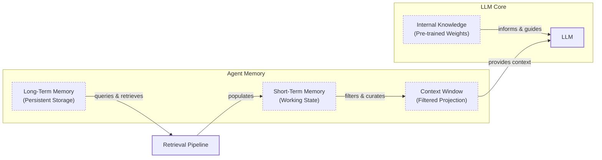

# How Does Memory for AI Agents Work?

In the previous lessons, we built our first reasoning agent using the ReAct framework. We saw how agents could use tools to interact with the world and break down problems into smaller steps. However, these agents have a fundamental flaw: they are forgetful. Their knowledge is vast but frozen in time, and they are fundamentally unable to learn from experience by updating their internal parameters after deployment. This is a well-known challenge called "continual learning." To overcome this, we can give agents access to an external memory system.

An LLM without memory is like an intern with amnesia. It can perform a task, but it cannot recall previous conversations or learn from feedback. This limitation becomes a major bottleneck when building agents designed for long-term interaction. As some researchers have observed, the performance gap between an agent that "has memory" and one that "does not have memory" is often larger than the gap between different underlying LLM backbones [[12]](https://towardsdatascience.com/a-practical-guide-to-memory-for-autonomous-llm-agents/). We can use the context window as a temporary "working memory," but this is not a scalable solution. Keeping an entire conversation history in the prompt is unrealistic due to finite context sizes, rising costs, and performance degradation from noise. Even with million-token context windows, models struggle to find the relevant "needle in the haystack" when the context is too large.

This is where memory tools come in. They provide a temporary solution, an engineering workaround that gives agents continuity and the ability to "learn." In the early days of building personal AI companions, we quickly hit the limits of what was possible with an 8k or 16k context window. This forced us to engineer complex memory systems with heavy compression and retrieval components. Today, with larger contexts, the engineering trade-offs have shifted, but the core need for memory remains. While current approaches are distinct from the explicit, structured knowledge bases used by older symbolic AI systems like SOAR [[13]](https://huggingface.co/blog/Kseniase/memory), they address the same fundamental need for persistence.

In this lesson, we will explore the concept of agent memory. We will borrow terminology from biology and cognitive science to understand how different types of data can be stored and retrieved to solve different kinds of problems. We will differentiate between the model's static internal knowledge, the short-term context window, and persistent long-term memory. By the end, you will understand how to design and implement memory systems that transform simple, stateless bots into adaptive, personalized agents.

## The Layers of Memory: Internal, Short-Term, and Long-Term

To build effective memory systems, it helps to adopt terminology from cognitive science. This gives us a structured way to think about how information flows through an agent. We can categorize an agent's memory into three distinct layers: internal knowledge, short-term memory, and long-term memory.

**Internal Knowledge** is the static, pre-trained information baked into the LLM's weights. This is where the model’s general intelligence and world knowledge reside. It knows countless facts, from historical dates to programming concepts, all without needing a single token of context. This layer is powerful but read-only; we cannot update it with new experiences during inference.

**Short-Term Memory** is the agent's active working memory. In practice, this is the context window of the LLM. It is volatile, fast, and limited. This is the only reality the model sees during a single call, and it is the only way we can simulate "learning" over time by feeding it information. If it is not in the context window, it does not exist for the model.

**Long-Term Memory** is an external, persistent storage system where an agent can save and retrieve information across sessions. This is the agent’s library, its diary, and its playbook all in one. Information is retrieved from long-term memory and loaded into short-term memory (the context window) to become actionable.

These layers work together in a retrieval pipeline. Long-term memory is queried for relevant data, which is then used to populate the short-term working state. This state is then filtered and curated before being projected into the context window, which the LLM uses along with its internal knowledge to reason and generate a response. This flow is analogous to memory consolidation in the human brain, where new experiences are captured by the hippocampus (a fast, temporary store) and gradually transferred to the neocortex for permanent storage, often during sleep [[14]](https://dev.to/joojodontoh/teaching-alfred-to-remember-with-a-neuroscience-inspired-memory-system-for-ai-agents-2o5l).


Image 1: Hierarchy and flow of an AI agent's memory system

This layered model is useful because no single component can perform all functions effectively. Internal knowledge provides general intelligence, short-term memory handles the immediate task, and long-term memory provides the personalization and continuity that the other layers lack. To build more sophisticated agents, we need to look closer at the different types of long-term memory.

## Long-Term Memory: Semantic, Episodic, and Procedural

Long-term memory is not a monolith. Just as our own minds organize information differently, an agent's long-term memory can be broken down into specialized components. Borrowing again from cognitive science, we can categorize it into three key types: semantic, episodic, and procedural [[1]](https://arxiv.org/html/2309.02427).

### Semantic Memory (Facts & Knowledge)

**Semantic memory** is the agent's encyclopedia. It is a repository of discrete, timeless facts and knowledge. This information can be stored as simple, independent strings ("User is a vegetarian") or attached to entities in a more structured format (`{"user": {"food_restrictions": "allergic_to_gluten"}}`). The structure you choose depends entirely on your agent's use case [[2]](https://langchain-ai.github.io/langgraph/concepts/memory/).

This memory type provides the agent with a reliable source of truth. For an enterprise agent, this might be a knowledge base of internal company documents or technical manuals. For a personal assistant, semantic memory is used to build a persistent profile of the user, storing key details like preferences ("User likes rock music"), relationships ("User has a dog named George"), or important constraints ("User's brother is named Mark"). When the agent needs to act, it can retrieve these specific facts instead of parsing a long, noisy conversation history.

### Episodic Memory (Experiences & History)

**Episodic memory** is the agent's personal diary, a chronological record of its past interactions. The key differentiator from semantic memory is the element of time. While semantic facts are timeless, episodic memories are about "what happened and when." Each memory is an "episode" with a timestamp attached.

This memory type is crucial for maintaining conversational context and understanding the evolution of a relationship. For example, a semantic memory might just store two facts: "User's brother is named Mark" and "User is frustrated with his brother." An episodic memory captures the full, nuanced event: `"On Tuesday, the user expressed frustration that their brother, Mark, always forgets their birthday. I then provided an empathetic response. [created_at=2025-08-25T17:20:04]"`. This provides much deeper context, allowing the agent to interact with more intelligence and empathy in the future (e.g., "I know the topic of your brother's birthday can be sensitive..."). It also enables time-based queries like "What did we discuss on June 8th?"

### Procedural Memory (Skills & How-To)

**Procedural memory** is the agent's muscle memory—its collection of learned skills and workflows. This is the "how-to" knowledge that enables it to perform multi-step tasks reliably and efficiently. Think of it as a set of pre-defined playbooks for common requests [[2]](https://langchain-ai.github.io/langgraph/concepts/memory/).

This type of memory is often encoded as a reusable tool or function within the agent's system prompt. For instance, an agent might have a stored procedure for generating a monthly report. When a user requests it, the agent does not need to reason from scratch. It retrieves the `monthly_report` procedure, which defines a clear series of steps: 1) Query the sales database for the last 30 days, 2) Summarize the key insights, and 3) Ask the user if they want the summary emailed or displayed. Some modern memory systems now explicitly support procedural memory, allowing an agent to learn a team's specific workflow, such as how they structure pull requests, which is a process, not just a fact [[15]](https://mem0.ai/blog/state-of-ai-agent-memory-2026). This makes the agent's behavior on common tasks predictable and fast.

Now that we understand what to save and the benefits of each memory type, we need to decide how to store this information.

## Storing Memories: Pros and Cons of Different Approaches

How an agent's memories are stored is an important architectural decision that directly impacts performance, complexity, and scalability. While the goal is always to provide the right context at the right time, the method of storage involves trade-offs. There is no one-size-fits-all solution; the ideal approach depends entirely on the product's use case. Let's explore the pros and cons of three primary methods: storing memories as raw strings, as structured entities, and within a knowledge graph.

### Storing Memories as Raw Strings

This is the simplest method, where conversational turns or documents are stored as plain text and indexed for vector search [[3]](https://stevekinney.com/writing/agent-memory-systems), [[4]](https://www.decodingai.com/p/how-does-memory-for-ai-agents-work).

**Pros:**
-   **Simple and fast to set up:** It involves logging text and creating embeddings, requiring minimal engineering overhead.
-   **Preserves nuance:** By storing the raw text, the full context, including emotional tone and subtle linguistic cues, is preserved. Nothing is lost in translation to a structured format [[5]](https://towardsdatascience.com/a-practical-guide-to-memory-for-autonomous-llm-agents/).

**Cons:**
-   **Imprecise retrieval:** A query can retrieve text that is semantically related but contextually wrong. For example, asking "What is my brother’s job?" might retrieve every past conversation where "brother" and "job" were mentioned, without pinpointing the single correct fact [[4]](https://www.decodingai.com/p/how-does-memory-for-ai-agents-work). To mitigate this, some systems use re-ranking techniques like Maximal Marginal Relevance (MMR) to promote diversity and avoid returning redundant results, a computational parallel to the "pattern separation" performed by the brain's hippocampus [[14]](https://dev.to/joojodontoh/teaching-alfred-to-remember-with-a-neuroscience-inspired-memory-system-for-ai-agents-2o5l).
-   **Difficult to update:** If a user corrects information ("My brother is a doctor now"), the new information is just another string in a growing log, creating potential contradictions [[4]](https://www.decodingai.com/p/how-does-memory-for-ai-agents-work).
-   **Lacks structure:** This approach struggles with temporal reasoning and state changes. It cannot easily distinguish between "Barry *was* the CEO" and "Claude *is* the CEO" because the relationships are not explicitly defined [[3]](https://stevekinney.com/writing/agent-memory-systems), [[4]](https://www.decodingai.com/p/how-does-memory-for-ai-agents-work).

### Storing Memories as Entities (JSON)

In this approach, we move from unstructured interactions to structured memories, often using an LLM to perform the extraction and storing them in a format like JSON.

**Pros:**
-   **Structured and precise:** Information is organized into key-value pairs (e.g., `"user": {"brother": {"job": "Software Engineer"}}`), allowing for precise, field-level filtering and retrieval.
-   **Easier to update:** If a user's preference changes, only the relevant field in the JSON object needs to be updated, ensuring the memory remains current.
-   **Ideal for factual data:** This method is well-suited for semantic memory, where user profiles and preferences are stored.

**Cons:**
-   **Increased upfront complexity:** This approach requires designing a data schema, which adds an initial layer of engineering complexity.
-   **Potential for schema rigidity:** A predefined schema can be inflexible. If the agent encounters information that does not fit the structure, that data may be lost.
-   **Loss of original nuance:** The extraction process strips away the rich subtext of the original conversation. The fact `"user_likes": ["cats"]` is far less representative than the original message, "Petting my cat is the best part of my day."

### Storing Memories in a Knowledge Graph

This is the most advanced approach, where memories are stored as a network of nodes (entities) and edges (relationships).

**Pros:**
-   **Represents complex relationships:** A graph's core strength is explicitly defining how different pieces of information connect, such as `(User) -> [HAS_BROTHER] -> (Mark) -> [WORKS_AS] -> (Software Engineer)`. This enables sophisticated queries that trace these connections [[6]](https://www.octoco.ai/blog/knowledge-graphs-as-memory), [[7]](https://danielp1.substack.com/p/memex-20-memory-the-missing-piece).
-   **Superior temporal awareness:** Knowledge graphs can model time as an explicit property of a relationship (e.g., `User -[RECOMMENDED_ON_DATE: "2025-10-25"]-> Restaurant`), enabling more accurate retrieval than vector search alone [[8]](https://neo4j.com/nodes-2025/agenda/building-evolving-ai-agents-via-dynamic-memory-representations-using-temporal-knowledge-graphs/), [[6]](https://www.octoco.ai/blog/knowledge-graphs-as-memory). They can also resolve conflicts by using timestamps to invalidate outdated facts rather than overwriting them, thus preserving a faithful history of state changes [[16]](https://developers.openai.com/cookbook/examples/partners/temporal_agents_with_knowledge_graphs/temporal_agents).
-   **Auditability and explainability:** Retrieval is transparent. You can trace the exact path of nodes and edges that led to an answer, making it easier to debug the agent's reasoning [[6]](https://www.octoco.ai/blog/knowledge-graphs-as-memory).

**Cons:**
-   **Highest complexity and cost:** This method requires a significant investment in schema design, data modeling, and maintenance.
-   **Potential for slower queries:** Complex graph traversals can be slower than a simple vector lookup, which might impact real-time performance [[6]](https://www.octoco.ai/blog/knowledge-graphs-as-memory).
-   **Overhead for simple use cases:** For many applications, the complexity of a graph database is overkill. A simpler approach may be sufficient [[6]](https://www.octoco.ai/blog/knowledge-graphs-as-memory).

| Approach | Pros | Cons |
| :--- | :--- | :--- |
| **Raw Strings** | Simple setup, preserves nuance | Imprecise retrieval, hard to update, lacks structure |
| **Entities (JSON)** | Structured, precise, easy to update | Upfront complexity, schema rigidity, loss of nuance |
| **Knowledge Graph** | Represents complex relationships, temporal awareness, explainable | Highest complexity, slower queries, overkill for simple cases |

Table 1: A comparison of memory storage approaches.

The choice of memory storage should be guided by your product's core needs. It is often best to start with the simplest architecture that delivers value and evolve it as your agent's requirements grow more complex.

## Memory Implementations with Code Examples

Now that we know what to save and how to store memories, let's look at some code examples. While Retrieval-Augmented Generation (RAG) is the mechanism for retrieving information, a topic we will cover in the next lesson, the creation of high-quality memories is an equally important preceding step. We will use the open-source `mem0` library to demonstrate how to implement each memory type, focusing on the simple "raw strings" storage approach to highlight the benefits of each category [[9]](https://arxiv.org/html/2504.19413).

`mem0` is a memory layer for AI agents that handles the extraction, storage, and retrieval of information. It can be configured with different LLMs, embedding models, and vector stores, providing a flexible foundation for building stateful agents.

### Setup

First, we will set up our environment. This involves configuring `mem0` to use Google's Gemini models for both fact extraction and embeddings, and ChromaDB as a local vector store. We also define a few helper functions to simplify adding and searching for memories.

1.  We start by configuring `mem0`. We will use the `gemini-2.5-pro` model for LLM operations and `gemini-embedding-001` for creating embeddings. The vector store will be a local ChromaDB instance.
    ```python
    import os
    from typing import Optional
    from mem0 import Memory

    MEM0_CONFIG = {
        "embedder": {
            "provider": "gemini",
            "config": {
                "model": "gemini-embedding-001",
                "embedding_dims": 768,
                "api_key": os.getenv("GOOGLE_API_KEY"),
            },
        },
        "vector_store": {
            "provider": "chroma",
            "config": {
                "collection_name": "lesson9_memories",
                "path": "/tmp/chroma_mem0",
            },
        },
        "llm": {
            "provider": "gemini",
            "config": {
                "model": "gemini-2.5-pro",
                "api_key": os.getenv("GOOGLE_API_KEY"),
            },
        },
    }

    memory = Memory.from_config(MEM0_CONFIG)
    MEM_USER_ID = "lesson9_notebook_student"
    memory.delete_all(user_id=MEM_USER_ID)
    print("✅ Mem0 ready (Gemini embeddings + local Chroma).")
    ```
    It outputs:
    ```text
    ✅ Mem0 ready (Gemini embeddings + local Chroma).
    ```

2.  Next, we define two helper functions. `mem_add_text` saves a string to memory with a specified category, and `mem_search` retrieves memories, with an option to filter by category.
    ```python
    def mem_add_text(text: str, category: str = "semantic", **meta) -> str:
        """Add a single text memory. No LLM is used for extraction or summarization."""
        metadata = {"category": category}
        for k, v in meta.items():
            if isinstance(v, (str, int, float, bool)) or v is None:
                metadata[k] = v
            else:
                metadata[k] = str(v)
        memory.add(text, user_id=MEM_USER_ID, metadata=metadata, infer=False)
        return f"Saved {category} memory."


    def mem_search(query: str, limit: int = 5, category: Optional[str] = None) -> list[dict]:
        """Category-aware search wrapper."""
        res = memory.search(query, user_id=MEM_USER_ID, limit=limit) or {}
        items = res.get("results", [])
        if category is not None:
            items = [r for r in items if (r.get("metadata") or {}).get("category") == category]
        return items
    ```

### Semantic Memory: Extracting Facts

Semantic memory is created through an extraction pipeline. An LLM analyzes unstructured text and extracts discrete facts. This turns messy conversations into a queryable knowledge base. The extraction prompt is key; for a personal assistant, it might focus on persistent facts and strong preferences [[10]](https://blog.lqhl.me/mem0-how-three-prompts-created-a-viral-ai-memory-layer).

1.  Let's add a few facts to our semantic memory. These are short, atomic pieces of information about the user.
    ```python
    facts: list[str] = [
        "User prefers vegetarian meals.",
        "User has a dog named George.",
        "User is allergic to gluten.",
        "User's brother is named Mark and is a software engineer.",
    ]
    for f in facts:
        mem_add_text(f, category="semantic")

    print(f"Added {len(facts)} semantic memories.")
    ```
    It outputs:
    ```text
    Added 4 semantic memories.
    ```

2.  Now, we can search for a specific fact using a natural language query. Retrieval often uses a hybrid search, combining keyword filtering with semantic similarity to find the most relevant information.
    ```python
    results = memory.search("brother job", user_id=MEM_USER_ID, limit=1)
    print(results["results"][0]["memory"])
    ```
    It outputs:
    ```text
    User's brother is named Mark and is a software engineer.
    ```

### Episodic Memory: The Log of Events

Episodic memories function as a chronological log. They can be created by summarizing interactions over a period, like a day or a single conversation, and attaching a timestamp.

1.  We will simulate a short dialogue and use an LLM to create a concise summary, which we will store as an "episode".
    ```python
    from google import genai
    client = genai.Client()
    MODEL_ID = "gemini-2.5-pro"

    dialogue = [
        {"role": "user", "content": "I'm stressed about my project deadline on Friday."},
        {"role": "assistant", "content": "I’m here to help—what’s the blocker?"},
        {"role": "user", "content": "Mainly testing. I also prefer working at night."},
        {"role": "assistant", "content": "Okay, we can split testing into two sessions."},
    ]

    episodic_prompt = f"""Summarize the following 3–4 turns as one concise 'episode' (1–2 sentences).
    Keep salient details and tone.

    {dialogue}
    """
    episode_summary = client.models.generate_content(model=MODEL_ID, contents=episodic_prompt)
    episode = episode_summary.text.strip()
    print(episode)
    ```
    It outputs:
    ```text
    A user, stressed about a Friday project deadline because of testing and a preference for working at night, is advised to split the testing work into two manageable sessions.
    ```

2.  We add this summary to our episodic memory, including metadata about the interaction.
    ```python
    mem_add_text(
        episode,
        category="episodic",
        summarized=True,
        turns=4,
    )
    ```

3.  Retrieval from episodic memory often blends temporal and semantic queries. Here, we will search for the episode using a semantic query. The `created_at` timestamp provided by `mem0` allows for temporal filtering.
    ```python
    hits = mem_search("deadline stress", limit=1, category="episodic")
    if hits:
        print(f"{hits[0]['memory']}\n")
        print(f"Created at: {hits[0]['created_at']}")
    ```
    It outputs:
    ```text
    A user, stressed about a Friday project deadline because of testing and a preference for working at night, is advised to split the testing work into two manageable sessions.

    Created at: 2025-09-12T02:30:01.358468-07:00
    ```

### Procedural Memory: Defining and Learning Skills

Procedural memory can be either developer-defined or learned from user interactions. Here, we will demonstrate how to define a procedure and store it for later retrieval.

1.  We define a multi-step procedure for creating a monthly report and store it as a single text block.
    ```python
    procedure_name = "monthly_report"
    steps = [
        "Query sales DB for the last 30 days.",
        "Summarize top 5 insights.",
        "Ask user whether to email or display.",
    ]
    procedure_text = f"Procedure: {procedure_name}\nSteps:\n" + "\n".join(f"{i + 1}. {s}" for i, s in enumerate(steps))

    mem_add_text(procedure_text, category="procedure", procedure_name=procedure_name)
    print(f"Learned procedure: {procedure_name}")
    ```
    It outputs:
    ```text
    Learned procedure: monthly_report
    ```

2.  Retrieval for procedural memory is an intent-matching process. The agent compares the user's request against the descriptions of available procedures to find the right one to execute.
    ```python
    results = mem_search("how to create a monthly report", category="procedure", limit=1)
    if results:
        print(results[0]["memory"])
    ```
    It outputs:
    ```text
    Procedure: monthly_report
    Steps:
    1. Query sales DB for the last 30 days.
    2. Summarize top 5 insights.
    3. Ask user whether to email or display.
    ```

These examples show how different types of memories are created and retrieved. While we used a simple string-based storage method, these principles apply across more complex architectures.

## Real-World Lessons: Challenges and Best Practices

The architectural patterns we have discussed provide a useful toolkit, but moving from theory to a reliable, production-ready system requires navigating complex trade-offs that are constantly evolving. Here are some important lessons learned from building and scaling agent memory systems.

### Re-evaluating Compression

One of the biggest shifts in memory design has been the trade-off between compressing information and preserving its raw detail.

Just a couple of years ago, LLMs operated with small and expensive context windows. This forced us to be ruthless with compression, distilling every interaction into its most compact form. While necessary, this process is inherently lossy, leading to "summarization drift" where repeated compression gradually distorts the original meaning [[12]](https://towardsdatascience.com/a-practical-guide-to-memory-for-autonomous-llm-agents/). You keep the general idea but lose the fine details and nuance [[11]](https://www.youtube.com/watch?v=7AmhgMAJIT4&list=PLDV8PPvY5K8VlygSJcp3__mhToZMBoiwX&index=112).

Today, with models offering million-token context windows at a fraction of the cost, the considerations have changed. Standardized benchmarks like LOCOMO quantify this trade-off: while a full-context approach may be the most accurate, it can have a p95 latency of over 17 seconds, making it unusable in real-time applications. In contrast, selective memory systems can cut latency by over 90% with only a minor drop in accuracy [[17]](https://mem0.ai/blog/state-of-ai-agent-memory-2026). The best practice now leans toward less compression. The raw history is the ultimate source of truth, containing emotional subtext lost during extraction. Your retrieval pipeline may need to do less *retrieving* and more intelligent *filtering* of a larger, in-context history.

### Designing for the Product

There is no "perfect" memory architecture. The concepts of semantic, episodic, and procedural memory are a powerful mental model, but they are a toolkit, not a mandatory blueprint. A common failure mode is over-engineering a complex, multi-part memory system for a product that does not need it. The product's goal should dictate the memory architecture, not the other way around [[11]](https://www.youtube.com/watch?v=7AmhgMAJIT4&list=PLDV8PPvY5K8VlygSJcp3__mhToZMBoiwX&index=112).

For a Q&A bot over internal documents, a simple RAG pipeline is often the best starting point. For a long-term personal companion, rich episodic memories are beneficial. For a task-automation agent, procedural memory is likely key. Start from first principles by defining the core function of your agent.

### The Human Factor

Memory exists to make the agent smarter, not to give the user a new job. A common pitfall is exposing the internal workings of the memory system to the user. While well-intentioned, asking users to "garden their agent's memories" by manually editing or deleting facts creates significant cognitive overhead and breaks the illusion of a capable assistant [[11]](https://www.youtube.com/watch?v=7AmhgMAJIT4&list=PLDV8PPvY5K8VlygSJcp3__mhToZMBoiwX&index=112).

Memory management should be an autonomous function. The agent should learn from corrections within the natural flow of conversation (e.g., "Actually, my brother's name is Mark, not Mike"). The agent, not the user, is responsible for maintaining its own knowledge. This can be implemented via a background "consolidation pipeline" or "dreaming" process that periodically reviews, merges, and prunes memories, inspired by how the human brain solidifies knowledge during sleep [[14]](https://dev.to/joojodontoh/teaching-alfred-to-remember-with-a-neuroscience-inspired-memory-system-for-ai-agents-2o5l). This also helps prevent "memory corruption," where a single poisoned entry can silently corrupt future decisions [[18]](https://galileo.ai/blog/agent-failure-modes-guide).

## Conclusion

In this lesson, we have explored the critical role of memory in transforming stateless LLMs into intelligent, adaptive agents. We have seen how a layered approach, inspired by human cognition, allows us to build systems that can maintain context, learn from experience, and perform complex tasks. Memory is the core component that enables personalization and allows agents to "learn" over time. While today's memory tools are an engineering workaround for the lack of true continual learning in models, they are a powerful and practical solution that we can use right now.

We have covered the different layers of memory, from the static internal knowledge of the LLM to the dynamic short-term context window and the persistent long-term storage. We delved into the three types of long-term memory—semantic, episodic, and procedural—and discussed the trade-offs of different storage architectures. By grounding these concepts in practical code examples, you now have a foundational understanding of how to design and implement memory in your own AI agents.

In our next lesson, we will take a deep dive into Retrieval-Augmented Generation (RAG), the primary mechanism for retrieving information from long-term memory. We will also look ahead to future lessons where we will cover more advanced topics like multimodal processing and building production-ready agentic systems.

## References

- [1] [Cognitive Architectures for Language Agents](https://arxiv.org/html/2309.02427)
- [2] [Memory overview](https://langchain-ai.github.io/langgraph/concepts/memory/)
- [3] [Memory Systems for AI Agents: What the Research Says and What You Can Actually Build](https://stevekinney.com/writing/agent-memory-systems)
- [4] [How Does Memory for AI Agents Work?](https://www.decodingai.com/p/how-does-memory-for-ai-agents-work)
- [5] [A practical guide to memory for autonomous LLM agents](https://towardsdatascience.com/a-practical-guide-to-memory-for-autonomous-llm-agents/)
- [6] [Knowledge Graphs as Memory: Why Your AI Agent Needs to Think in Relationships](https://www.octoco.ai/blog/knowledge-graphs-as-memory)
- [7] [Memex 2.0: Memory The Missing Piece for Real Intelligence](https://danielp1.substack.com/p/memex-20-memory-the-missing-piece)
- [8] [Building Evolving AI Agents via Dynamic Memory Representations using Temporal Knowledge Graphs](https://neo4j.com/nodes-2025/agenda/building-evolving-ai-agents-via-dynamic-memory-representations-using-temporal-knowledge-graphs/)
- [9] [Mem0: Building Production-Ready AI Agents with Scalable Long-Term Memory](https://arxiv.org/html/2504.19413)
- [10] [Mem0: How three prompts created a viral AI memory layer](https://blog.lqhl.me/mem0-how-three-prompts-created-a-viral-ai-memory-layer)
- [11] [What is the perfect memory architecture?](https://www.youtube.com/watch?v=7AmhgMAJIT4&list=PLDV8PPvY5K8VlygSJcp3__mhToZMBoiwX&index=112)
- [12] [A Practical Guide to Memory for Autonomous LLM Agents](https://towardsdatascience.com/a-practical-guide-to-memory-for-autonomous-llm-agents/)
- [13] [Memory in Symbolic and Connectionist AI](https://huggingface.co/blog/Kseniase/memory)
- [14] [Teaching Alfred to Remember with a Neuroscience-Inspired Memory System for AI Agents](https://dev.to/joojodontoh/teaching-alfred-to-remember-with-a-neuroscience-inspired-memory-system-for-ai-agents-2o5l)
- [15] [State of AI Agent Memory 2026](https://mem0.ai/blog/state-of-ai-agent-memory-2026)
- [16] [Temporal Agents with Knowledge Graphs](https://developers.openai.com/cookbook/examples/partners/temporal_agents_with_knowledge_graphs/temporal_agents)
- [17] [State of AI Agent Memory 2026](https://mem0.ai/blog/state-of-ai-agent-memory-2026)
- [18] [7 AI Agent Failure Modes and How To Prevent Them in Production](https://galileo.ai/blog/agent-failure-modes-guide)