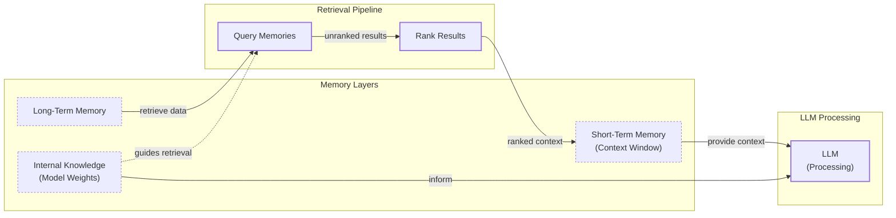

# Introduction: Why Agents Need a Memory in the First Place

In our previous lessons, we covered the agent landscape, the difference between workflows and agents, context engineering, structured outputs, and the core reasoning patterns like ReAct. We have built a solid foundation for understanding how to construct AI systems that can reason and take action. Now, we will tackle one of the most important components for building truly adaptive and personalized agents: memory.

LLMs have a core limitation: their knowledge is vast but frozen in time. They are fundamentally unable to learn by updating their weights after deployment, a problem known as "continual learning." We can inject new knowledge through the context window, but this is a constrained solution. An LLM without a persistent memory is like an expert with amnesia; it can solve a problem brilliantly but will have no recollection of it moments later. This inability to learn from experience is a major hurdle in creating truly intelligent systems.

The context window acts as the agent's working memory or RAM, but it has its limits. Keeping an entire conversation history, along with other necessary information, is often not feasible. This is due to the finite size of the context window, the rising costs associated with processing more tokens per interaction, and the introduction of noise that can confuse the model. Furthermore, LLMs suffer from the "lost-in-the-middle" problem, where they struggle to effectively use relevant information when it is buried deep within a large context.

Interestingly, the technology is constantly evolving. A few years ago, we worked with 8k-token context windows, which forced us to be aggressive with compressing information. Today, models with million-token contexts are available, shifting the engineering challenge from pure retrieval to intelligent filtering. Still, the core problem remains: we need a way for agents to persist information beyond a single interaction. Benchmarks show that relying on full context is not a viable solution for real-time applications, with tail latencies exceeding 17 seconds at a token cost 14 times higher than selective memory approaches [[1]](https://mem0.ai/blog/state-of-ai-agent-memory-2026). Memory management systems are the current, practical solution that provides agents with continuity, adaptability, and the ability to "learn" from experience.

To build effective memory systems, we can borrow concepts from biology and cognitive science to understand how different types of data can be stored and retrieved for different kinds of problems. In this lesson, we will explore the layers of agent memory, the different types of long-term memory, and how to implement them.

## The Layers of Memory: Internal, Short-Term, and Long-Term

Adopting terminology from cognitive science helps us create a clear mental model for how an agent should handle information. This approach is supported by a growing body of research that systematically connects insights from cognitive neuroscience with the design of LLM-driven agents [[2]](https://arxiv.org/abs/2512.23343). We can categorize an agent's memory into three distinct layers, each serving a unique function.

**Internal Knowledge** is the static, pre-trained information embedded in the LLM's weights. This is the model's vast understanding of the world, language, and reasoning patterns. It is read-only and cannot be updated without fine-tuning. This is the most efficient way to store general knowledge; the model knows entire books with an empty context window.

**Short-Term Memory** is the active context window. It is volatile, fast, and limited in size. This is the only reality the model sees during a single inference step, and it is the only way we can simulate "learning" over time by providing the model with new information.

**Long-Term Memory** is an external, persistent storage system. This is where an agent saves information it needs to retain across sessions, such as user preferences, past conversations, or learned skills.

These layers work together in a dynamic hierarchy. Information is retrieved from long-term memory and loaded into short-term memory to become actionable context for the LLM. This flow can be conceptualized as a retrieval pipeline where different memories are queried and ranked before being passed to the model [[3]](https://www.linkedin.com/posts/pauliusztin_every-ai-agent-has-4-distinct-memory-layers-activity-7436765234800807936-QyLR).


Image 1: A Mermaid diagram illustrating the hierarchy and flow of an AI agent's memory system, including Internal Knowledge, Short-Term Memory, Long-Term Memory, a Retrieval Pipeline, and LLM processing.

Categorizing memory this way is useful because no single layer can do it all. Internal knowledge provides general intelligence, short-term memory handles the immediate task, and long-term memory offers the personalization and continuity that the other layers lack. To better understand how to design this persistent layer, we can again borrow from cognitive science to break down the different types of long-term memory.

## Long-Term Memory: Semantic, Episodic, and Procedural

Long-term memory is not a monolith. Just as humans store different kinds of information in different ways, we can design our agents with specialized long-term memory modules. This breakdown, inspired by cognitive architectures, helps us build more sophisticated and capable systems [[4]](https://arxiv.org/html/2309.02427).

### Semantic Memory (Facts & Knowledge)

**Semantic memory** is the agent's encyclopedia. It is a repository of factual knowledge, concepts, and relationships about specific domains, people, and things. This information is stored as discrete, timeless "facts." These facts can be simple, independent strings like `"The user is a vegetarian"`, or they can be attached to a structured "entity" like a person or place, such as `{"user": {"food_restrictions": "vegetarian"}}`. The structure you choose depends heavily on your agent's use case [[5]](https://www.ibm.com/think/topics/ai-agent-memory).

The primary role of semantic memory is to give the agent a reliable source of truth. For an enterprise agent, this could be a knowledge base of internal company documents or a product catalog. For a personal assistant, semantic memory is used to build a persistent profile of the user, storing key information like preferences (`"User likes rock music"`), relationships (`"User has a dog named George"`), or constraints (`"User is allergic to gluten"`). By retrieving these facts, the agent can provide personalized and contextually aware responses without needing to sift through a long, noisy conversation history.

### Episodic Memory (Experiences & History)

**Episodic memory** is the agent's personal diary. It is a chronological record of its past interactions and the context in which they occurred. Think of it as facts with a timestamp attached. While semantic memory stores timeless knowledge, episodic memory is about "what happened and when" [[4]](https://arxiv.org/html/2309.02427).

This memory type is crucial for maintaining conversational continuity and understanding complex dynamics over time. For example, a semantic memory might store two separate facts: `"User's brother is named Mark"` and `"User is frustrated with his brother."` An episodic memory provides richer, more nuanced context: `"On Tuesday, the user expressed frustration that their brother, Mark, always forgets their birthday. I provided an empathetic response. [created_at=2025-08-25T17:20:04.648191-07:00]"`.

This "episode" allows the agent to interact with more intelligence and empathy in the future. If the topic of the brother comes up again, it can recall the past event and respond appropriately. With the time element, the agent can also answer questions like, "What did we talk about last week?" Depending on the product, these episodes can group events from a single conversation, a full day, or even a week. There is no one-size-fits-all solution; the right time scale depends on the application's needs. This memory type is also essential in robotics, where an agent must recall past actions and their outcomes to navigate efficiently and learn from experience [[5]](https://www.ibm.com/think/topics/ai-agent-memory).

### Procedural Memory (Skills & How-To)

**Procedural memory** is the agent's muscle memory. It is a collection of learned skills and workflows that define its ability to perform multi-step tasks. It is the "how-to" knowledge, often encoded as a set of predefined playbooks for common requests [[4]](https://arxiv.org/html/2309.02427).

This memory is often implemented as a "reusable tool," function, or a defined sequence of actions within the agent's system prompt. For example, an agent might have a stored procedure for generating a monthly report. When a user requests an update, the agent does not need to reason from scratch. It retrieves the procedure, which outlines a clear series of steps: 1) Query the sales database for the last 30 days, 2) Summarize the key findings, and 3) Ask the user if they want the summary emailed or displayed directly. Some memory frameworks provide explicit support for this, allowing developers to store workflows by passing a specific `memory_type` during writes [[1]](https://mem0.ai/blog/state-of-ai-agent-memory-2026).

This makes the agent's behavior on common tasks reliable, fast, and predictable. By encoding successful workflows, procedural memory allows an agent to improve its efficiency over time, ensuring complex jobs are executed consistently [[6]](https://towardsdatascience.com/a-practical-guide-to-memory-for-autonomous-llm-agents/).

Now that we have an idea of what to save and the benefits of each memory type, how should we store this information? This architectural decision comes with its own set of trade-offs.

## Storing Memories: Pros and Cons of Different Approaches

How an agent's memories are stored is an important architectural decision that directly impacts its performance, complexity, and ability to scale. While the goal is always to provide the right context at the right time, the method of storage involves trade-offs. There is no one-size-fits-all solution; the ideal approach depends entirely on the product's use case. Let's explore the pros and cons of three primary methods: storing memories as raw strings, as structured entities, and within a knowledge graph.

**Storing memories as raw strings** is the simplest method, where conversational turns or documents are stored as plain text and indexed for vector search. This approach is simple and fast to set up, requiring minimal engineering overhead. It also preserves the full nuance of the original interaction, including emotional tone and subtle linguistic cues, as nothing is lost in translation to a structured format [[7]](https://www.decodingai.com/p/how-does-memory-for-ai-agents-work).

However, this method has significant drawbacks. Retrieval is often imprecise, as semantic similarity alone is not always sufficient. A query like "What is my brother's job?" might retrieve every conversation mentioning "brother" and "job" without pinpointing the current fact. Updating information is also difficult; a correction simply adds another string to the log, creating potential contradictions. This lack of structure makes it hard to handle temporal reasoning or state changes, such as distinguishing between a former CEO and the current one [[7]](https://www.decodingai.com/p/how-does-memory-for-ai-agents-work).

**Storing Memories as Entities (JSON-like Structures)** involves using an LLM to transform unstructured interactions into structured formats like JSON. This approach makes information structured and precise, organized into key-value pairs that allow for exact, field-level filtering. This makes it easy to retrieve specific facts without ambiguity. It also simplifies updates, as changing a user's preference only requires modifying the relevant field in a JSON object. This method is ideal for semantic memory, where user profiles and preferences are stored as facts.

The downsides include increased upfront complexity, as it requires designing a data schema. This schema can be rigid; if the agent encounters information that does not fit the existing structure, that data may be lost. While an LLM can dynamically alter the schema, this adds another layer of complexity and increases the risk of creating duplicate information. Finally, the extraction process can lead to a loss of original nuance. The factual memory `"user_likes": ["cats"]` is far less representative than the original message, "Petting my cat is the best part of my day" [[8]](https://www.youtube.com/watch?v=7AmhgMAJIT4&list=PLDV8PPvY5K8VlygSJcp3__mhToZMBoiwX&index=112).

**Storing Memories in a Graph Database** is the most advanced approach, where memories are stored as a network of nodes (entities) and edges (relationships). This method excels at representing complex relationships, explicitly defining how different pieces of information are connected. This enables sophisticated queries that can trace these connections, a core principle of neuro-symbolic AI architectures where knowledge is treated as structured relationships rather than just text [[9]](https://medium.com/@boomerdev/the-case-for-neuro-symbolic-ai-in-the-age-of-large-language-models-revised-2026-ecafb566f1ca), [[10]](https://www.octoco.ai/blog/knowledge-graphs-as-memory). Knowledge graphs also provide superior contextual and temporal awareness by modeling time as an explicit property of a relationship [[10]](https://www.octoco.ai/blog/knowledge-graphs-as-memory), [[11]](https://neo4j.com/nodes-2025/agenda/building-evolving-ai-agents-via-dynamic-memory-representations-using-temporal-knowledge-graphs/). Furthermore, retrieval is transparent and auditable, as you can trace the exact path of nodes and edges that led to an answer [[10]](https://www.octoco.ai/blog/knowledge-graphs-as-memory).

This power comes at a cost. This approach has the highest complexity, requiring significant investment in schema design, data modeling, and maintenance. Complex graph traversals can also be slower than simple vector lookups, potentially impacting real-time performance. For many simpler use cases, the overhead of implementing and maintaining a graph database may be unnecessary [[10]](https://www.octoco.ai/blog/knowledge-graphs-as-memory).

| Feature | Raw Strings | Entities (JSON) | Knowledge Graph |
| :--- | :--- | :--- | :--- |
| **Complexity** | Low | Medium | High |
| **Precision** | Low | High | Very High |
| **Nuance** | High | Low | Medium |
| **Updatability**| Difficult | Easy | Moderate |
| **Best For** | Simple logging, preserving raw context | Factual data, user profiles | Complex relationships, temporal reasoning |

Table 1: A comparison of the three primary memory storage approaches.

The choice of memory storage should be guided by your product's core needs. It is often best to start with the simplest architecture that delivers value and evolve it as your agent's requirements grow more complex. Now that we know what to save and how to store it, let's look at some code examples using an open-source memory library.

## Memory Implementations with Code Examples

While Retrieval-Augmented Generation (RAG) is the mechanism for retrieving information, the creation of high-quality memories is an equally important, preceding step. We will cover RAG in detail in the next lesson. For now, we will focus on the memory creation process for each memory type.

To ground these concepts in code, we will use `mem0`, an open-source library designed to be a universal memory layer for AI agents [[12]](https://arxiv.org/html/2504.19413). It provides a simple API for adding and searching memories, abstracting away the underlying storage complexity. For these examples, we will use the "storing memories as raw strings" approach to focus on the distinct benefits of each memory category.

<aside>
💡

You can find all the code for this lesson in the accompanying Jupyter Notebook in our course repository.

</aside>

### Setup

First, we will set up our environment. We instantiate `mem0` to use Gemini for both embeddings and LLM-based fact extraction, with ChromaDB as a local vector store. We also define two helper functions, `mem_add_text` and `mem_search`, to simplify adding and retrieving memories.

1.  We begin by configuring `mem0` to use Gemini for its LLM and embedding models, and ChromaDB as a local vector store.

    ```python
    import os
    import re
    from typing import Optional
    
    from google import genai
    from mem0 import Memory
    
    # Assumes GOOGLE_API_KEY is set in the environment
    
    MODEL_ID = "gemini-2.5-pro"
    
    MEM0_CONFIG = {
        "embedder": {
            "provider": "gemini",
            "config": {
                "model": "gemini-embedding-001",
                "embedding_dims": 768,
                "api_key": os.getenv("GOOGLE_API_KEY"),
            },
        },
        "vector_store": {
            "provider": "chroma",
            "config": {
                "collection_name": "lesson9_memories",
                "path": "/tmp/chroma_mem0",
            },
        },
        "llm": {
            "provider": "gemini",
            "config": {
                "model": MODEL_ID,
                "api_key": os.getenv("GOOGLE_API_KEY"),
            },
        },
    }
    
    memory = Memory.from_config(MEM0_CONFIG)
    MEM_USER_ID = "lesson9_notebook_student"
    memory.delete_all(user_id=MEM_USER_ID)
    print("✅ Mem0 ready (Gemini embeddings + local Chroma).")
    ```

    It outputs:

    ```text
    ✅ Mem0 ready (Gemini embeddings + local Chroma).
    ```

2.  Next, we define helper functions to wrap the `mem0` API, allowing us to add text with a specific category and search for memories, optionally filtering by that category.

    ```python
    def mem_add_text(text: str, category: str = "semantic", **meta) -> str:
        """Add a single text memory. No LLM is used for extraction or summarization."""
        metadata = {"category": category}
        for k, v in meta.items():
            if isinstance(v, (str, int, float, bool)) or v is None:
                metadata[k] = v
            else:
                metadata[k] = str(v)
        memory.add(text, user_id=MEM_USER_ID, metadata=metadata, infer=False)
        return f"Saved {category} memory."
    
    
    def mem_search(query: str, limit: int = 5, category: Optional[str] = None) -> list[dict]:
        """
        Category-aware search wrapper.
        Returns the full result dicts so we can inspect metadata.
        """
        res = memory.search(query, user_id=MEM_USER_ID, limit=limit) or {}
    
        items = res.get("results", [])
        if category is not None:
            items = [r for r in items if (r.get("metadata") or {}).get("category") == category]
        return items
    ```

### Semantic Memory: Extracting Facts

Semantic memory is created through a deliberate extraction pipeline. After a conversation, the unstructured text is passed to an LLM with a prompt designed to extract atomic facts. This process turns messy conversation threads into a queryable knowledge base. The prompt instructs the model to act as a knowledge extractor, identifying facts, preferences, and attributes relevant to the agent's use case.

For example, a prompt for a general personal assistant might be:

```
Extract persistent facts and strong preferences as short bullet points.
- Keep each fact atomic and context-independent. While reading the messages, make sure to notice the nuance or subtle details that might be important when saving these facts.
- 3–6 bullets max.

Text:
{My brother Mark is a software engineer, but his real passion is painting, he gifted me a painting a few years ago. Its really beautiful.}
```

The system would then store memories like: `Mark is the user's brother. Mark is a software engineer. Mark's real passion is painting. The user has a painting from Mark and finds it beautiful.`. Retrieval of this memory often uses hybrid search, which combines keyword filtering with semantic search to find the most relevant fact.

1.  We store a few sample facts as individual strings, tagging them with the "semantic" category.

    ```python
    facts: list[str] = [
        "User prefers vegetarian meals.",
        "User has a dog named George.",
        "User is allergic to gluten.",
        "User's brother is named Mark and is a software engineer.",
    ]
    for f in facts:
        print(mem_add_text(f, category="semantic"))
    
    print(f"Added {len(facts)} semantic memories.")
    ```

    It outputs:

    ```text
    Saved semantic memory.
    Saved semantic memory.
    Saved semantic memory.
    Saved semantic memory.
    Added 4 semantic memories.
    ```

2.  When we search with a natural language query like "brother job," the system retrieves the most relevant fact.

    ```python
    # Search for a specific fact
    results = memory.search("brother job", user_id=MEM_USER_ID, limit=1)
    # We print the memory string
    print(results["results"][0]["memory"])
    # We print the whole dict that contains the memory
    print(results["results"][0])
    ```

    It outputs:

    ```text
    User's brother is named Mark and is a software engineer.
    {'id': '68fa87b4-5cad-41c0-b06d-143e92ba7c66', 'memory': "User's brother is named Mark and is a software engineer.", 'hash': '9a01dbd8ea8b96f8ed9c84e9dcdb55a1', 'metadata': {'category': 'semantic'}, 'score': 0.9269160032272339, 'created_at': '2025-09-12T02:29:53.515480-07:00', 'updated_at': None, 'user_id': 'lesson9_notebook_student', 'role': 'user'}
    ```

### Episodic Memory: The Log of Events

Episodic memory functions as a chronological log of extracted events. An LLM can read conversation messages from a specific period, like a day, and then summarize the key insights, facts, or events that occurred, attaching a timestamp to each memory. These memories can be stored raw or summarized. For example, a prompt for a coding tutor might be: "You are a personal coding tutor... extract events, likes, dislikes, or any other insights from the conversation text that will serve to better teach the user...".

Given an input like `User: "I'm feeling stressed about my project deadline on Friday."`, a raw memory would be `October 26th, 2025. 2:30PM EST: User: "I'm feeling stressed about my project deadline on Friday."`. A summarized version might be `October 26th, 2025. 2:30PM EST: "The user is stressed about their project deadline on Friday and the assistant offers to help."`. Retrieval from this memory is often a blend of temporal and semantic queries, filtering by date and then using semantic search to find contextually similar conversations.

1.  We simulate a short conversation and use an LLM to generate a concise, one-sentence summary, which we then store as an "episodic" memory.

    ```python
    # A short 4-turn exchange we want to compress into one "episode"
    dialogue = [
        {"role": "user", "content": "I'm stressed about my project deadline on Friday."},
        {"role": "assistant", "content": "I’m here to help—what’s the blocker?"},
        {"role": "user", "content": "Mainly testing. I also prefer working at night."},
        {"role": "assistant", "content": "Okay, we can split testing into two sessions."},
    ]
    
    # Ask the LLM to write a clear episodic summary.
    episodic_prompt = f"""Summarize the following 3–4 turns as one concise 'episode' (1–2 sentences).
    Keep salient details and tone.
    
    {dialogue}
    """
    client = genai.Client()
    episode_summary = client.generate_content(model=MODEL_ID, contents=episodic_prompt)
    episode = episode_summary.text.strip()
    print(episode)
    ```

    It outputs:

    ```text
    A user, stressed about a Friday project deadline because of testing and a preference for working at night, is advised to split the testing work into two manageable sessions.
    ```

2.  We add the summary to our memory store with the appropriate category and metadata.

    ```python
    print(
        mem_add_text(
            episode,
            category="episodic",
            summarized=True,
            turns=4,
        )
    )
    ```

    It outputs:

    ```text
    Saved episodic memory.
    ```

3.  A semantic query like "deadline stress" retrieves the relevant episode and its timestamp.

    ```python
    print("\nSearch --> 'deadline stress'\n")
    hits = mem_search("deadline stress", limit=1, category="episodic")
    for h in hits:
        print(f"{h['memory']}\n")
        print(h)
    ```

    It outputs:

    ```text
    
    Search --> 'deadline stress'
    
    A user, stressed about a Friday project deadline because of testing and a preference for working at night, is advised to split the testing work into two manageable sessions.
    
    {'id': '93ebb9eb-65b0-4975-9c0d-105497b43e5c', 'memory': 'A user, stressed about a Friday project deadline because of testing and a preference for working at night, is advised to split the testing work into two manageable sessions.', 'hash': '44f0bcd0965a1fb557c1d3b5a9f8ae6c', 'metadata': {'turns': 4, 'summarized': True, 'category': 'episodic'}, 'score': 0.9109697937965393, 'created_at': '2025-09-12T02:30:01.358468-07:00', 'updated_at': None, 'user_id': 'lesson9_notebook_student', 'role': 'user'}
    ```

### Procedural Memory: Defining and Learning Skills

Procedural memory is unique because it can be created in two ways: either defined by a developer as an explicit tool or learned dynamically from user instructions. An advanced agent can be prompted to recognize when a user provides a sequence of steps for a task and then convert that sequence into a reusable procedure.

For example, a prompt might be:

```
You are an agent that can learn new skills. When a user provides a numbered list of steps to accomplish a goal, your task is to run the "learn_procedure" tool, and convert these numbered list of steps into a reusable procedure.
```

If a user provides steps to find a summer cabin, the agent would call a `learn_procedure` tool to save a new skill named `find_summer_cabin` with the corresponding steps. Retrieval is then an intent-matching and function-calling process. The LLM receives the descriptions of all available procedures and matches the user's current request to the most relevant one.

1.  We define a simple, multi-step procedure for creating a monthly report and store it as a single text block with the "procedure" category.

    ```python
    procedure_name = "monthly_report"
    steps = [
        "Query sales DB for the last 30 days.",
        "Summarize top 5 insights.",
        "Ask user whether to email or display.",
    ]
    procedure_text = f"Procedure: {procedure_name}\nSteps:\n" + "\n".join(f"{i + 1}. {s}" for i, s in enumerate(steps))
    
    mem_add_text(procedure_text, category="procedure", procedure_name=procedure_name)
    
    print(f"Learned procedure: {procedure_name}")
    ```

    It outputs:

    ```text
    Learned procedure: monthly_report
    ```

2.  When the user asks a question like, "how to create a monthly report," the agent recognizes the semantic similarity and retrieves the stored procedure.

    ```python
    # Retrieve the procedure by name
    results = mem_search("how to create a monthly report", category="procedure", limit=1)
    if results:
        print(results[0]["memory"])
    ```

    It outputs:

    ```text
    Procedure: monthly_report
    Steps:
    1. Query sales DB for the last 30 days.
    2. Summarize top 5 insights.
    3. Ask user whether to email or display.
    ```

Now that we have seen how to implement these different memory types, let's discuss some of the practical challenges and best practices that emerge when building these systems in the real world.

## Real-World Lessons: Challenges and Best Practices

The architectural patterns we have discussed provide a useful toolkit, but moving from theory to a reliable, production-ready system requires navigating complex trade-offs. The underlying technology is improving so fast that best practices are constantly evolving.

Here are some of the most important lessons learned from building and scaling agent memory systems.

### Re-evaluating compression

One of the biggest shifts in memory design has been the trade-off between compressing information and preserving raw detail. Just a couple of years ago, small and expensive context windows forced engineers to be ruthless with compression, distilling interactions into compact summaries. This process, while necessary then, is inherently lossy, stripping away important nuance [[8]](https://www.youtube.com/watch?v=7AmhgMAJIT4&list=PLDV8PPvY5K8VlygSJcp3__mhToZMBoiwX&index=112).

Today, with models offering million-token context windows at a fraction of the cost, the calculus has changed. The best practice is now to lean towards less compression. The raw conversation history is the ultimate source of truth, containing the emotional subtext and relational dynamics that extraction often discards. While a fact might state, "User has a dog," the raw log reveals, "User mentioned walking their dog is the best part of their day," a far more valuable insight [[8]](https://www.youtube.com/watch?v=7AmhgMAJIT4&list=PLDV8PPvY5K8VlygSJcp3__mhToZMBoiwX&index=112).

The best practice is to design your system to work with the most complete version of history that is economically and technically feasible. Use summaries and fact extraction to create queryable indexes, but always treat the raw log as the ground truth. With less compression, active memory management strategies like time-based decay or relevance-based retention become more important to prevent the memory store from becoming noisy [[13]](https://www.centron.de/en/tutorial/episodic-memory-in-ai-agents-long-term-context-learning/).

### Designing for the Product

There is no "perfect" memory architecture. The concepts of semantic, episodic, and procedural memory are a powerful mental model, but they are a toolkit, not a mandatory blueprint. A common failure mode is over-engineering a complex system for a product that does not need it [[8]](https://www.youtube.com/watch?v=7AmhgMAJIT4&list=PLDV8PPvY5K8VlygSJcp3__mhToZMBoiwX&index=112).

You should start from first principles by defining the core function of your agent. The product's goal should dictate the memory architecture. For a Q&A bot over internal documents, a simple RAG pipeline is the best starting point. For a long-term personal companion, rich episodic memories are essential. For a task-automation agent, procedural memory is likely the most valuable component.

### The Human Factor

Memory exists to make the agent smarter, not to give the user a new job. A common pitfall is exposing the internal workings of the memory system, thinking it will improve transparency. In practice, it often creates cognitive overhead and shatters the illusion of a capable assistant [[8]](https://www.youtube.com/watch?v=7AmhgMAJIT4&list=PLDV8PPvY5K8VlygSJcp3__mhToZMBoiwX&index=112).

Users should not be asked to "garden their agent's memories." Memory management should be an autonomous function. The agent should learn from corrections within the natural flow of conversation and have internal processes to consolidate and resolve conflicting information. The agent, not the user, is responsible for maintaining the integrity of its own knowledge [[6]](https://towardsdatascience.com/a-practical-guide-to-memory-for-autonomous-llm-agents/).

## Conclusion

Memory is a core component that transforms a simple, stateless chatbot into a personalized agent that can "learn" over time. By understanding the different layers and types of memory—from the model's internal knowledge to persistent long-term storage—you can design systems that maintain continuity, adapt to user needs, and become more capable with every interaction. While we are still waiting for true "continual learning" in models, the memory tools and architectural patterns we have explored are practical solutions that work today.

A key research frontier is moving beyond simply remembering what happened to actively *learning* from it, a process sometimes called belief extraction [[14]](https://medium.com/data-unlocked/the-memory-problem-in-ai-agents-is-half-solved-heres-the-other-half-ebbf218ae4d5). This involves teaching agents to draw causal lessons from outcomes, track their confidence in what they know, and update their beliefs as new evidence emerges. This is the gap between an agent that knows your preferences and one that builds genuine expertise over time.

In our next lesson, we will explore in detail Retrieval-Augmented Generation (RAG), the mechanism that allows agents to pull relevant information from their memory stores. We will also cover more advanced topics in the future, such as multimodal processing, monitoring, and evaluations, to round out your skills as an AI Engineer.

## References

- [1] [State of AI Agent Memory 2026](https://mem0.ai/blog/state-of-ai-agent-memory-2026)
- [2] [Memory in the Age of AI Agents](https://arxiv.org/abs/2512.23343)
- [3] [Every AI agent has 4 distinct memory layers](https://www.linkedin.com/posts/pauliusztin_every-ai-agent-has-4-distinct-memory-layers-activity-7436765234800807936-QyLR)
- [4] [Cognitive Architectures for Language Agents](https://arxiv.org/html/2309.02427)
- [5] [What is AI agent memory?](https://www.ibm.com/think/topics/ai-agent-memory)
- [6] [A Practical Guide to Memory for Autonomous LLM Agents](https://towardsdatascience.com/a-practical-guide-to-memory-for-autonomous-llm-agents/)
- [7] [How Does Memory for AI Agents Work?](https://www.decodingai.com/p/how-does-memory-for-ai-agents-work)
- [8] [What is the perfect memory architecture?](https://www.youtube.com/watch?v=7AmhgMAJIT4&list=PLDV8PPvY5K8VlygSJcp3__mhToZMBoiwX&index=112)
- [9] [The Case for Neuro-Symbolic AI in the Age of Large Language Models (Revised 2026)](https://medium.com/@boomerdev/the-case-for-neuro-symbolic-ai-in-the-age-of-large-language-models-revised-2026-ecafb566f1ca)
- [10] [Knowledge Graphs as Memory: Why Your AI Agent Needs to Think in Relationships](https://www.octoco.ai/blog/knowledge-graphs-as-memory)
- [11] [Building Evolving AI Agents via Dynamic Memory Representations using Temporal Knowledge Graphs](https://neo4j.com/nodes-2025/agenda/building-evolving-ai-agents-via-dynamic-memory-representations-using-temporal-knowledge-graphs/)
- [12] [Mem0: Building Production-Ready AI Agents with Scalable Long-Term Memory](https://arxiv.org/html/2504.19413)
- [13] [Episodic Memory in AI Agents: Long-Term Context and Learning](https://www.centron.de/en/tutorial/episodic-memory-in-ai-agents-long-term-context-learning/)
- [14] [The Memory Problem in AI Agents is Half-Solved. Here’s the Other Half](https://medium.com/data-unlocked/the-memory-problem-in-ai-agents-is-half-solved-heres-the-other-half-ebbf218ae4d5)