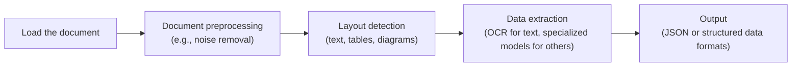
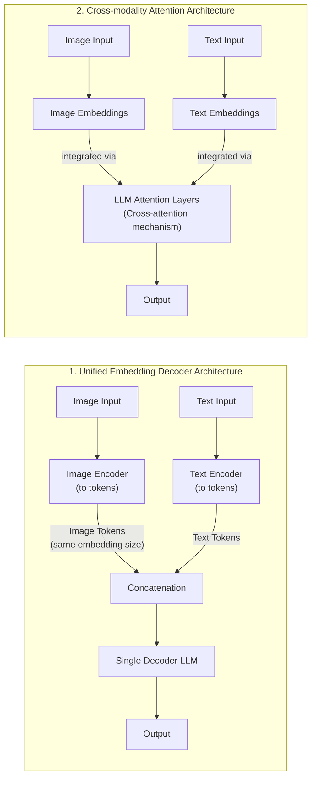
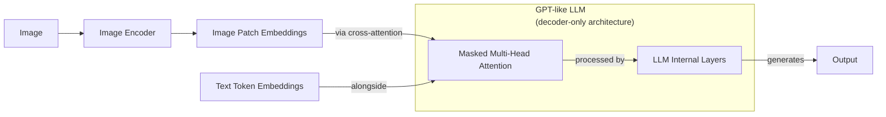
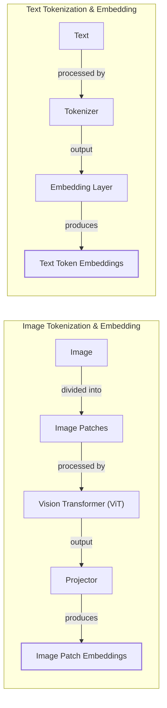
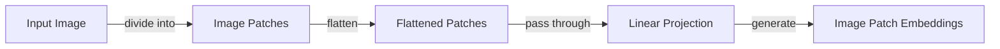
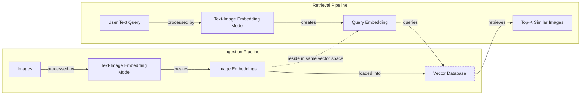
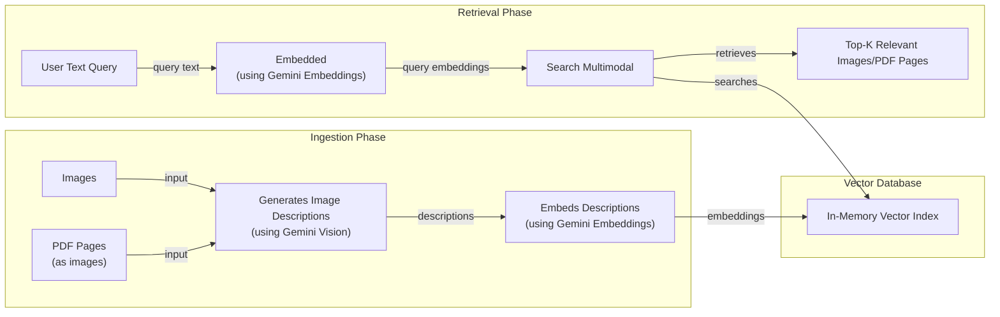
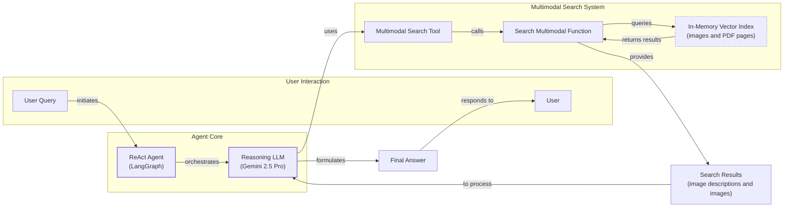

# Lesson 11: Multimodal AI

In the previous lessons, we built a solid foundation in AI engineering. We explored the agent landscape, learned to distinguish between LLM workflows and AI agents, and mastered context engineering, memory, RAG, and the ReAct reasoning pattern. We have covered almost all the fundamentals for building production-ready AI systems. The last piece of the puzzle is multimodality.

In the real world, we rarely work only with text. Our daily interactions involve a rich mix of images, documents, and audio. Enterprise data is no different, spanning databases, data warehouses, and data lakes filled with this variety. To build truly useful AI applications, we must enable them to process data in its native format. Early AI systems tried to normalize everything to text, often using Optical Character Recognition (OCR) to parse documents. This lesson's core idea is that this approach is fundamentally flawed. Instead of translating complex visual data into text and losing critical information, modern AI systems process images and documents directly.

This is particularly true for enterprise use cases. Text-only approaches fail when faced with financial reports full of charts, medical diagnostics that rely on images, or technical documents filled with diagrams [[6]](https://konfuzio.com/en/chatgpt-financial-analysis/), [[7]](https://techtoday.lenovo.com/sites/default/files/2025-05/Medical%20Imaging%20White%20Paper%20NVIDIA%20and%20Lenovo.pdf). Multimodal AI excels in these areas, enabling applications like object detection, image captioning, and the analysis of complex visuals in fields from healthcare to autonomous systems [[41]](https://github.com/cognitivetech/llm-research-summaries/blob/main/models-review/A-Comprehensive-Survey-and-Guide-to-Multimodal-Large-Language-Models-in-Vision-Language-Tasks.md).

This shift is made possible by multimodal LLMs that can "see" and interpret visual information. We will cover the theory behind how these models work, then move to hands-on examples using Gemini to process images and PDFs. We will build a multimodal RAG system and, finally, an agentic RAG application. By the end, you will have the knowledge to build enterprise AI agents that can understand and reason about your private multimodal data.

## Limitations of traditional document processing

To understand why native multimodal processing is a leap forward, we first need to look at the limitations of traditional document processing. For years, the standard approach for digitizing documents like invoices, reports, or technical manuals has been a multi-step pipeline centered around OCR. This process typically involves loading a document, preprocessing it to remove noise, detecting the layout to identify text, tables, and images, and then using OCR to extract the text [[68]](https://blog.roboflow.com/what-is-optical-character-recognition-ocr/).


Image 1: A flowchart illustrating the traditional document processing workflow using Layout Detection and OCR.

This workflow has many moving parts, making it rigid, slow, and fragile. If a document contains a new data structure like a chart, and you do not have a specialized model for it, the pipeline fails. Calling multiple models for layout detection, OCR, and table extraction is also slow and costly. Most importantly, the system is brittle because errors at one stage cascade through the rest of the pipeline. A small error in layout detection can lead to completely garbled output.

The performance challenges are significant. Even advanced OCR engines like Tesseract and PaddleOCR, which achieve 88–94% accuracy on simple layouts, struggle with real-world complexity. Their accuracy drops significantly when faced with handwritten text, poor-quality scans, or complex layouts like nested tables and multi-column formats [[1]](https://www.llamaindex.ai/blog/ocr-accuracy). For example, a 5-degree tilt in a scanned document can increase the Word Error Rate (WER) by over 15% [[1]](https://www.llamaindex.ai/blog/ocr-accuracy). These systems treat pages as flat grids of text, losing the structural and visual context that is obvious to a human reader [[49]](https://www.llamaindex.ai/blog/ocr-for-tables).

This fragility is a major bottleneck in production. Traditional OCR pipelines are template-based, meaning they rely on predefined rules and coordinates to find data. If a vendor changes their invoice layout, the system breaks and requires manual updates [[5]](https://netfira.com/why-ocr-technology-fails-on-real-world-documents-and-how-intelligent-document-processing-can-help/). This constant maintenance becomes a hidden operational cost that undermines the promise of automation. The process is not just slow; it is fundamentally unreliable for the diverse and unstructured documents common in enterprise settings. For complex documents, accuracy can fall to as low as 60%, requiring more manual correction than the time saved by automation [[3]](https://jiffy.ai/overcoming-ocr-errors-and-limitations-with-intelligent-document-processing/).

Consider a technical drawing or a medical X-ray. The spatial relationships, symbols, and visual nuances contain most of the critical information. An OCR system trying to convert this to text will either fail completely or produce a meaningless jumble of characters. It cannot understand that a line in a blueprint represents a wall or that a shadow on an X-ray might indicate a medical condition. This is a fundamental limitation: OCR reads characters, but it does not understand context or meaning [[47]](https://learn.microsoft.com/en-us/answers/questions/5668164/why-traditional-ocr-fails-for-complex-business-doc?page=1).

<https://hackernoon.imgix.net/images/2DFAaGGO5cfymtBKn4bFFAoT6sg2-v993xj8.jpeg>
Image 2: An example of rotated text on a technical drawing, a common challenge for traditional OCR systems. (Source [https://hackernoon.com/complex-document-recognition-ocr-doesnt-work-and-heres-how-you-fix-it](https://hackernoon.com/complex-document-recognition-ocr-doesnt-work-and-heres-how-you-fix-it))

This approach might work for highly specialized, predictable tasks, but it does not scale in a world where AI agents need to be flexible and fast. This is why modern AI solutions are moving towards multimodal LLMs like Gemini, which can directly interpret images and PDFs as native inputs, bypassing the fragile OCR pipeline entirely. Let's understand how these models work.

## Foundations of multimodal LLMs

As an AI engineer, you do not need to know every detail of how multimodal LLMs are built, but having a strong intuition is key to using, deploying, and optimizing them effectively. At a high level, there are two common architectural approaches for building these models, which we will illustrate using text and images as an example.


Image 3: Diagram illustrating two architectural approaches for building multimodal LLMs: Unified Embedding Decoder Architecture and Cross-modality Attention Architecture. (Source [https://magazine.sebastianraschka.com/p/understanding-multimodal-llms](https://magazine.sebastianraschka.com/p/understanding-multimodal-llms))

The **Unified Embedding Decoder Architecture** is the simpler of the two. It processes an image by converting it into a sequence of "image tokens" that have the same embedding size as the text tokens. These image and text tokens are then concatenated and fed into a standard decoder-only LLM, like a GPT model [[21]](https://magazine.sebastianraschka.com/p/understanding-multimodal-llms).

```mermaid
flowchart LR
  %% External Inputs
  subgraph "Inputs"
    Image["Image"]
    TTE["Text Token Embeddings<br/>(from text tokenization and embedding layer)"]
  end

  %% Multimodal Embedding Generation
  subgraph "Multimodal Embedding Generation"
    IE["Image Encoder<br/>(e.g., pretrained Vision Transformer)"]
    IPE["Image Patch Embeddings"]
    P["Projector<br/>(linear layer)"]
    P_IPE["Projected Image Embeddings<br/>(dimension-matched)"]
  end

  %% LLM Processing
  subgraph "LLM Processing"
    Concat["Concatenation"]
    LLM["GPT-like LLM<br/>(decoder-only architecture)"]
  end

  %% Output
  Output["Generated Output"]

  %% Data Flow
  Image -- "processed by" --> IE
  IE -- "generates" --> IPE
  IPE -- "passed through" --> P
  P -- "produces" --> P_IPE

  P_IPE -- "concatenated with" --> Concat
  TTE -- "concatenated with" --> Concat

  Concat -- "forms input for" --> LLM
  LLM -- "generates" --> Output

  %% Visual Grouping
  classDef data_artifact stroke-dasharray:3,3
  classDef processing_step stroke-width:2px

  class IPE,P_IPE data_artifact
  class IE,P,Concat,LLM processing_step
```


Image 4: Unified Embedding Decoder Architecture for multimodal LLMs (Source [https://magazine.sebastianraschka.com/p/understanding-multimodal-llms](https://magazine.sebastianraschka.com/p/understanding-multimodal-llms))

The **Cross-Modality Attention Architecture** takes a different approach. Instead of prepending image tokens to the input, it injects the image embeddings directly into the LLM’s attention layers using a cross-attention mechanism. This allows the model to correlate image features with text tokens at a deeper level within its architecture [[21]](https://magazine.sebastianraschka.com/p/understanding-multimodal-llms).


Image 5: Cross-modality Attention Architecture for multimodal LLMs (Source [https://magazine.sebastianraschka.com/p/understanding-multimodal-llms](https://magazine.sebastianraschka.com/p/understanding-multimodal-llms))

Both approaches rely on an **image encoder**, which functions similarly to an image embedding model. This process mirrors text tokenization. Just as text is broken down into tokens, an image is divided into smaller patches. These patches are then processed by a vision model, like a Vision Transformer (ViT), to generate embeddings [[21]](https://magazine.sebastianraschka.com/p/understanding-multimodal-llms).


Image 6: A side-by-side diagram illustrating the parallel between image tokenization and embedding (left) and text tokenization and embedding (right). (Source [https://magazine.sebastianraschka.com/p/understanding-multimodal-llms](https://magazine.sebastianraschka.com/p/understanding-multimodal-llms))


Image 7: A diagram illustrating the Vision Transformer (ViT) setup for creating image embeddings through patching. (Source [https://magazine.sebastianraschka.com/p/understanding-multimodal-llms](https://magazine.sebastianraschka.com/p/understanding-multimodal-llms))

An important step is aligning these image and text embeddings in the same vector space. This is achieved using a **projector**, typically a simple linear layer, which maps the image embeddings to the same dimension as the text embeddings. Models like CLIP (Contrastive Language-Image Pre-training) use a technique called contrastive learning to train the image and text encoders together. This process teaches the model to place semantically similar concepts, like a picture of a dog and the text "a photo of a dog," close together in the shared embedding space [[63]](https://www.pinecone.io/learn/series/image-search/clip/).

```mermaid
graph LR
    %% Overall Shared Embedding Space
    subgraph "Shared Vector Space"
        %% Text Embeddings Cluster
        subgraph "Text Embeddings"
            TE1["'A cute puppy'"]
            TE2["'A good boy'"]
            TE3["'A cute cat'"]
        end

        %% Image Embeddings Cluster
        subgraph "Image Embeddings"
            IE1["Image of a dog"]
            IE2["Image of a cat"]
            IE3["Image of a goat"]
        end

        %% Highlight semantic similarity between modalities
        TE1 --- "similar concept" --- IE1
        TE2 --- "similar concept" --- IE1
        TE3 --- "similar concept" --- IE2
    end

    %% Visual differentiation for clarity
    classDef textNode stroke-dasharray: 5 5
    classDef imageNode stroke-width: 2px

    class TE1,TE2,TE3 textNode
    class IE1,IE2,IE3 imageNode
```
Image 8: A diagram illustrating text and image embeddings within the same vector space, showing distinct clusters for each modality and connections between semantically similar concepts.

Each architecture has its trade-offs. The Unified Embedding approach is simpler to implement and often performs better on OCR-related tasks, while the Cross-Attention method is more computationally efficient for high-resolution images [[36]](https://magazine.sebastianraschka.com/p/understanding-multimodal-llms). Hybrid models, like NVIDIA's NVLM-H, aim to combine the strengths of both [[37]](https://arxiv.org/abs/2409.11402).

By 2025, most flagship LLMs are multimodal, including open-source models like Llama 4, Qwen3, and DeepSeek V3, and closed-source ones like GPT-5, Gemini 2.5, and Claude 4.x [[22]](https://medium.com/data-science-in-your-pocket/2025-the-year-ai-reasoning-models-took-over-a-month-by-month-review-of-frontier-breakthroughs-6ea2163f854f). This architecture can be extended to other modalities like audio and video by incorporating specialized encoders for each data type, such as Whisper for audio or Video Transformers for video, and using cross-attention layers to fuse the information [[27]](https://sparkco.ai/blog/exploring-multimodal-llms-text-image-and-video-integration), [[28]](https://www.emergentmind.com/topics/multimodal-llms).

It is also important to distinguish these multimodal LLMs from diffusion-based generative models like Midjourney or Stable Diffusion. While both can work with images, diffusion models are specialized for image generation and are architecturally different from the transformer-based decoders used in LLMs [[19]](https://arxiv.org/html/2409.14993v3). In an agentic system, a diffusion model can be used as a tool for creating images, but the core reasoning and understanding comes from the multimodal LLM.

Now that we have an intuition for how these models work, let's see them in action.

## Applying multimodal LLMs to images and PDFs

Let's write some code to see how to use multimodal LLMs with images and PDFs. There are three primary ways to pass this data to a model: as raw bytes, as Base64-encoded strings, or as URLs.

-   **Raw bytes:** This is the most direct method and works well for one-off API calls. However, storing raw bytes in a database can be problematic, as some systems may misinterpret binary data as text, leading to potential corruption if not handled carefully.
-   **Base64:** This method encodes binary data as a string, making it safe to store in any database that handles text. It is a reliable way to manage multimodal data within a traditional database architecture. The main downside is that Base64 encoding increases the data size by about 33%, which can impact storage costs and performance.
-   **URLs:** This is often the most efficient method for production systems. Instead of passing large files over the network with each API call, the LLM can fetch the data directly from a public URL or a private data lake like AWS S3 or Google Cloud Storage. This reduces I/O bottlenecks and is ideal for scalable, enterprise applications that require privacy and efficient data handling. Access to private data lakes typically requires secure access mechanisms like signed URLs or IAM roles to ensure data privacy.

When building AI applications, your choice will depend on your specific needs. For quick tests, raw bytes are fine. For applications that store data in a database, Base64 is a robust choice. For large-scale systems with data lakes, URLs are the most efficient and scalable option.

Now, let's explore these methods with code examples using the Gemini API.

### Setup

First, we will set up our environment by initializing the Gemini client and defining the model we will use. We will use `gemini-2.5-flash`, which is fast and cost-effective for these examples.

1.  First, we define some standard Magic Python commands to autoreload Python packages whenever they change.
    ```python
    %load_ext autoreload
    %autoreload 2
    ```
2.  Next, we configure the Gemini API.
    ```python
    from lessons.utils import env

    env.load(required_env_vars=["GOOGLE_API_KEY"])
    ```
    It outputs:
    ```text
    Trying to load environment variables from `/Users/pauliusztin/Documents/01_projects/TAI/course-ai-agents/.env`
    Environment variables loaded successfully.
    ```
3.  Then, we import the key packages.
    ```python
    import base64
    import io
    from pathlib import Path
    from typing import Literal

    from google import genai
    from google.genai import types
    from IPython.display import Image as IPythonImage
    from PIL import Image as PILImage

    from lessons.utils import pretty_print
    ```
4.  Ultimately, we initialize the Gemini Client and define our constants.
    ```python
    client = genai.Client()
    MODEL_ID = "gemini-2.5-flash"
    ```

### Working with Images

Let's start by working with an image. We will use a helper function to display it in our notebook.

1.  First, let's define a helper function to display an image.
    ```python
    def display_image(image_path: Path) -> None:
        """
        Display an image from a file path in the notebook.

        Args:
            image_path: Path to the image file to display

        Returns:
            None
        """

        image = IPythonImage(filename=image_path, width=400)
        display(image)
    ```
2.  Now, let's look at our test image.
    ```python
    display_image(Path("images") / "image_1.jpeg")
    ```
    It outputs:

    <https://github.com/towardsai/course-ai-agents/raw/dev/lessons/11_multimodal/images/image_1.jpeg>

#### As raw bytes

1.  We will define a function to load an image and convert it to bytes. We will use the `WEBP` format because it is highly efficient.
    ```python
    def load_image_as_bytes(
        image_path: Path, format: Literal["WEBP", "JPEG", "PNG"] = "WEBP", max_width: int = 600, return_size: bool = False
    ) -> bytes | tuple[bytes, tuple[int, int]]:
        """
        Load an image from file path and convert it to bytes with optional resizing.

        Args:
            image_path: Path to the image file to load
            format: Output image format (WEBP, JPEG, or PNG). Defaults to "WEBP"
            max_width: Maximum width for resizing. If image width exceeds this, it will be resized proportionally. Defaults to 600
            return_size: If True, returns both bytes and image size tuple. Defaults to False

        Returns:
            bytes: Image data as bytes, or tuple of (bytes, (width, height)) if return_size is True
        """

        image = PILImage.open(image_path)
        if image.width > max_width:
            ratio = max_width / image.width
            new_size = (max_width, int(image.height * ratio))
            image = image.resize(new_size)

        byte_stream = io.BytesIO()
        image.save(byte_stream, format=format)

        if return_size:
            return byte_stream.getvalue(), image.size

        return byte_stream.getvalue()
    ```
2.  Next, we load the image as bytes and inspect the output.
    ```python
    image_bytes = load_image_as_bytes(image_path=Path("images") / "image_1.jpeg", format="WEBP")
    pretty_print.wrapped([f"Bytes `{image_bytes[:30]}...`", f"Size: {len(image_bytes)} bytes"], title="Image as Bytes")
    ```
    It outputs:
    ```text
    ------------------------------------------ Image as Bytes ------------------------------------------
    Bytes `b'RIFF\xad\x00\x00WEBPVP8 T\xad\x00\x00P\xec\x02\x9d\x01*X\x02X\x02'...`
    ----------------------------------------------------------------------------------------------------
    Size: 44392 bytes
    ----------------------------------------------------------------------------------------------------
    ```
3.  We can now pass these bytes to the Gemini model to generate a caption.
    ```python
    response = client.models.generate_content(
        model=MODEL_ID,
        contents=[
            types.Part.from_bytes(
                data=image_bytes,
                mime_type="image/webp",
            ),
            "Tell me what is in this image in one paragraph.",
        ],
    )
    pretty_print.wrapped(response.text, title="Image 1 Caption")
    ```
    It outputs:
    ```text
    ----------------------------------------- Image 1 Caption -----------------------------------------
    This striking image features a massive, dark metallic robot, its powerful form detailed with intricate circuit patterns on its head and piercing red glowing eyes. Perched playfully on its right arm is a small, fluffy grey tabby kitten, its front paw raised as if exploring or batting at the robot's armored limb, while its gaze is directed slightly off-frame. The robot's large, segmented hand is visible beneath the kitten. The background suggests an industrial or workshop environment, with hints of metal structures and natural light filtering in from an unseen window, creating a dramatic contrast between the soft, vulnerable kitten and the formidable, mechanical sentinel.
    ----------------------------------------------------------------------------------------------------
    ```
4.  We can also pass multiple images to compare them.
    ```python
    display_image(Path("images") / "image_2.jpeg")
    ```
    It outputs:

    <https://github.com/towardsai/course-ai-agents/raw/dev/lessons/11_multimodal/images/image_2.jpeg>
    ```python
    response = client.models.generate_content(
        model=MODEL_ID,
        contents=[
            types.Part.from_bytes(
                data=load_image_as_bytes(image_path=Path("images") / "image_1.jpeg", format="WEBP"),
                mime_type="image/webp",
            ),
            types.Part.from_bytes(
                data=load_image_as_bytes(image_path=Path("images") / "image_2.jpeg", format="WEBP"),
                mime_type="image/webp",
            ),
            "What's the difference between these two images? Describe it in one paragraph.",
        ],
    )
    pretty_print.wrapped(response.text, title="Differences between images")
    ```
    It outputs:
    ```text
    ------------------------------------ Differences between images ------------------------------------
    The primary difference between the two images lies in the nature of the interaction depicted and their respective settings. In the first image, a small, grey kitten is shown curiously interacting with a large, metallic robot, gently perched on its arm within what appears to be a clean, well-lit workshop or industrial space. Conversely, the second image portrays a tense and aggressive confrontation between a fluffy white dog and a sleek black robot, both in combative stances, amidst a cluttered and grimy urban alleyway filled with trash and graffiti.
    ----------------------------------------------------------------------------------------------------
    ```

#### As base64 encoded strings

1.  Now, let's convert the image to a Base64 string.
    ```python
    from typing import cast


    def load_image_as_base64(
        image_path: Path, format: Literal["WEBP", "JPEG", "PNG"] = "WEBP", max_width: int = 600, return_size: bool = False
    ) -> str:
        """
        Load an image and convert it to base64 encoded string.

        Args:
            image_path: Path to the image file to load
            format: Output image format (WEBP, JPEG, or PNG). Defaults to "WEBP"
            max_width: Maximum width for resizing. If image width exceeds this, it will be resized proportionally. Defaults to 600
            return_size: Parameter passed to load_image_as_bytes function. Defaults to False

        Returns:
            str: Base64 encoded string representation of the image
        """

        image_bytes = load_image_as_bytes(image_path=image_path, format=format, max_width=max_width, return_size=False)

        return base64.b64encode(cast(bytes, image_bytes)).decode("utf-8")
    ```
2.  Notice that the Base64 string is about 33% larger than the raw bytes.
    ```python
    image_base64 = load_image_as_base64(image_path=Path("images") / "image_1.jpeg", format="WEBP")
    pretty_print.wrapped(
        [f"Base64: {image_base64[:100]}...`", f"Size: {len(image_base64)} characters"], title="Image as Base64"
    )
    ```
    It outputs:
    ```text
    ----------------------------------------- Image as Base64 -----------------------------------------
    Base64: UklGRmCtAABXRUJQVlA4IFStAABQ7AKdASpYAlgCPm0ylEekIqInJnQ7gOANiWdtk7FnEo2gDknjPixW9SNSb5P7IbBNhLn87Vtp...`
    ----------------------------------------------------------------------------------------------------
    Size: 59192 characters
    ----------------------------------------------------------------------------------------------------
    ```
    ```python
    print(f"Image as Base64 is {(len(image_base64) - len(image_bytes)) / len(image_bytes) * 100:.2f}% larger than as bytes")
    ```
    It outputs:
    ```text
    Image as Base64 is 33.34% larger than as bytes
    ```
3.  The process for calling the model is the same.
    ```python
    response = client.models.generate_content(
        model=MODEL_ID,
        contents=[
            types.Part.from_bytes(data=image_base64, mime_type="image/webp"),
            "Tell me what is in this image in one paragraph.",
        ],
    )
    ```

#### As public URLs

Gemini has a built-in `url_context` tool that can automatically parse content from public URLs, including webpages, PDFs, and images.

1.  We just need to provide the URL in the prompt and enable the tool.
    ```python
    response = client.models.generate_content(
        model=MODEL_ID,
        contents="Based on the provided paper as a PDF, tell me how ReAct works: https://arxiv.org/pdf/2210.03629",
        config=types.GenerateContentConfig(tools=[{"url_context": {}}]),
    )
    pretty_print.wrapped(response.text, title="How ReAct works")
    ```
    It outputs:
    ```text
    ----------------------------------------- How ReAct works -----------------------------------------
    ReAct is a novel paradigm for large language models (LLMs) that combines reasoning (Thought) and acting (Action) in an interleaved manner to solve diverse language and decision-making tasks. This approach allows the model to:

    *   **Reason to Act:** Generate verbal reasoning traces to induce, track, and update action plans, and handle exceptions.
    *   **Act to Reason:** Interface with and gather additional information from external sources (like knowledge bases or environments) to incorporate into its reasoning.

    **How it works:**

    Instead of just generating a direct answer (Standard prompting) or a chain of thought without external interaction (CoT), or only actions (Act-only), ReAct augments the LLM's action space to include a "language space" for generating "thoughts" or reasoning traces.

    1.  **Thought:** The model explicitly generates a thought, which is a verbal reasoning trace. This thought helps the model to:
        *   Decompose task goals and create action plans.
        *   Inject commonsense knowledge.
        *   Extract important information from observations.
        *   Track progress and adjust action plans.
        *   Handle exceptions.
    2.  **Action:** Based on the current thought and context, the model performs a task-specific action. This could involve:
        *   Searching external databases (e.g., Wikipedia API using `search[entity]` or `lookup[string]`).
        *   Interacting with an environment (e.g., `go to cabinet 1`, `take pepper shaker 1`).
        *   Finishing the task with an answer (`finish[answer]`).
    3.  **Observation:** The environment provides an observation feedback based on the executed action.

    This cycle of Thought, Action, and Observation continues until the task is completed.
    ----------------------------------------------------------------------------------------------------
    ```

#### As URLs from private data lakes

At the time of writing, the Gemini API works best with Google Cloud Storage links. For simplicity, we will show a mocked example of how you would pass a private GCS URL. You would need to ensure the LLM has the correct permissions to access your bucket.

```python
response = client.models.generate_content(
    model=MODEL_ID,
    contents=[
        types.Part.from_uri(uri="gs://gemini-images/image_1.jpeg", mime_type="image/webp"),
        "Tell me what is in this image in one paragraph.",
    ],
)
```

#### Object detection with LLMs

A more advanced use case is object detection. We can combine the multimodal capabilities of LLMs with the structured output techniques we learned in Lesson 4.

1.  First, we define our Pydantic models for the bounding box and detections.
    ```python
    from pydantic import BaseModel, Field


    class BoundingBox(BaseModel):
        ymin: float
        xmin: float
        ymax: float
        xmax: float
        label: str = Field(
            default="The category of the object found within the bounding box. For example: cat, dog, diagram, robot."
        )


    class Detections(BaseModel):
        bounding_boxes: list[BoundingBox]
    ```
2.  Next, we create the prompt and load the image.
    ```python
    prompt = """
    Detect all of the prominent items in the image. 
    The box_2d should be [ymin, xmin, ymax, xmax] normalized to 0-1000.
    Also, output the label of the object found within the bounding box.
    """

    image_bytes, image_size = load_image_as_bytes(
        image_path=Path("images") / "image_1.jpeg", format="WEBP", return_size=True
    )
    ```
3.  We configure the API to return a JSON response matching our Pydantic schema and call the model.
    ```python
    from typing import cast
    config = types.GenerateContentConfig(
        response_mime_type="application/json",
        response_schema=Detections,
    )

    response = client.models.generate_content(
        model=MODEL_ID,
        contents=[
            types.Part.from_bytes(
                data=image_bytes,
                mime_type="image/webp",
            ),
            prompt,
        ],
        config=config,
    )

    detections = cast(Detections, response.parsed)
    pretty_print.wrapped([f"Image size: {image_size}", *detections.bounding_boxes], title="Detections")
    ```
    It outputs:
    ```text
    -------------------------------------------- Detections --------------------------------------------
    Image size: (600, 600)
    ----------------------------------------------------------------------------------------------------
    ymin=1.0 xmin=450.0 ymax=997.0 xmax=1000.0 label='robot'
    ----------------------------------------------------------------------------------------------------
    ymin=269.0 xmin=39.0 ymax=782.0 xmax=530.0 label='kitten'
    ----------------------------------------------------------------------------------------------------
    ```
4.  Finally, we can visualize the detected bounding boxes on the original image.
    ```python
    import matplotlib.pyplot as plt
    import matplotlib.patches as patches
    import numpy as np


    def visualize_detections(detections: Detections, image_path: Path) -> None:
        """
        Visualize detected bounding boxes on an image with red rectangles and labels.

        Args:
            detections: Detections object containing bounding boxes in [ymin, xmin, ymax, xmax] format normalized to 0-1000
            image_path: Path to the image file to visualize

        Returns:
            None: Displays the image with bounding boxes in the notebook
        """

        # Clear any existing plots to prevent overlapping
        plt.clf()

        image = PILImage.open(image_path)
        image_array = np.array(image)
        img_height, img_width = image_array.shape[:2]

        fig, ax = plt.subplots(1, 1, figsize=(8, 6))
        ax.imshow(image_array)

        for bbox in detections.bounding_boxes:
            # Convert normalized coordinates (0-1000) to pixel coordinates
            xmin = (bbox.xmin / 1000) * img_width
            ymin = (bbox.ymin / 1000) * img_height
            xmax = (bbox.xmax / 1000) * img_width
            ymax = (bbox.ymax / 1000) * img_height

            # Calculate box dimensions (matplotlib uses bottom-left corner + width/height)
            width = xmax - xmin
            height = ymax - ymin

            # Create rectangle patch (x, y is bottom-left corner)
            rect = patches.Rectangle((xmin, ymin), width, height, linewidth=3, edgecolor="red", facecolor="none")

            # Add rectangle to the plot
            ax.add_patch(rect)

            # Add label text (positioned at top-left of bounding box)
            ax.text(
                xmin,
                ymin + 5,  # Slightly above the box
                bbox.label[:15],
                fontsize=12,
                color="red",
                fontweight="bold",
                bbox=dict(boxstyle="round,pad=0.3", facecolor="white", alpha=0.8),
            )

        # Remove axis ticks and labels for cleaner display
        ax.set_xticks([])
        ax.set_yticks([])
        ax.set_title(f"Object Detection Results: {image_path.name}", fontsize=14, fontweight="bold")

        plt.tight_layout()
        plt.show()
    ```
    ```python
    visualize_detections(detections, Path("images") / "image_1.jpeg")
    ```
    It outputs:

    <https://github.com/towardsai/course-ai-agents/raw/dev/lessons/11_multimodal/images/object_detection_1.png>

### Working with PDFs

Working with PDFs is very similar to working with images. We will use the famous "Attention Is All You Need" paper as our example.

1.  First, let's display a page from the PDF, which we have saved as an image.
    ```python
    display_image(Path("images") / "attention_is_all_you_need_0.jpeg")
    ```
    It outputs:

    <https://github.com/towardsai/course-ai-agents/raw/dev/lessons/11_multimodal/images/attention_is_all_you_need_0.jpeg>
2.  We can pass the entire PDF as bytes to get a summary.
    ```python
    pdf_bytes = (Path("pdfs") / "attention_is_all_you_need_paper.pdf").read_bytes()
    pretty_print.wrapped(f"Bytes: {pdf_bytes[:40]}...", title="PDF bytes")
    ```
    It outputs:
    ```text
    -------------------------------------------- PDF bytes --------------------------------------------
    Bytes: b'%PDF-1.7\n%\xe2\xe3\xcf\xd3\n24 0 obj\n<<\n/Filter /Flat'...
    ----------------------------------------------------------------------------------------------------
    ```
    ```python
    response = client.models.generate_content(
        model=MODEL_ID,
        contents=[
            types.Part.from_bytes(data=pdf_bytes, mime_type="application/pdf"),
            "What is this document about? Provide a brief summary of the main topics.",
        ],
    )
    pretty_print.wrapped(response.text, title="PDF Summary (as bytes)")
    ```
    It outputs:
    ```text
    -------------------------------------- PDF Summary (as bytes) --------------------------------------
    This document introduces the **Transformer**, a novel neural network architecture designed for **sequence transduction tasks** (like machine translation).

    Its main topics include:

    1.  **Dispensing with Recurrence and Convolutions**: Unlike previous dominant models (RNNs and CNNs), the Transformer relies *solely* on **attention mechanisms**, eliminating the need for sequential computation.
    2.  **Attention Mechanisms**: It details the **Scaled Dot-Product Attention** and **Multi-Head Attention** as its core building blocks, explaining how they allow the model to weigh different parts of the input sequence.
    3.  **Parallelization and Efficiency**: The paper highlights that the Transformer's architecture allows for significantly more parallelization during training, leading to **faster training times** compared to prior models.
    4.  **Superior Performance**: It demonstrates that the Transformer achieves **state-of-the-art results** on machine translation tasks (English-to-German and English-to-French) and generalizes well to other tasks like English constituency parsing.
    5.  **Positional Encoding**: Since the model lacks recurrence or convolution, it introduces positional encodings to inject information about the relative or absolute position of tokens in the sequence.

    In essence, the document proposes and validates that **attention alone is sufficient** for building high-quality, efficient, and parallelizable sequence transduction models.
    ----------------------------------------------------------------------------------------------------
    ```
3.  Or we can pass it as a Base64 string.
    ```python
    def load_pdf_as_base64(pdf_path: Path) -> str:
        """
        Load a PDF file and convert it to base64 encoded string.

        Args:
            pdf_path: Path to the PDF file to load

        Returns:
            str: Base64 encoded string representation of the PDF
        """

        with open(pdf_path, "rb") as f:
            return base64.b64encode(f.read()).decode("utf-8")
    ```
    ```python
    pdf_base64 = load_pdf_as_base64(pdf_path=Path("pdfs") / "attention_is_all_you_need_paper.pdf")
    pretty_print.wrapped(f"Base64: {pdf_base64[:40]}...", title="PDF as Base64")
    ```
    It outputs:
    ```text
    ------------------------------------------ PDF as Base64 ------------------------------------------
    Base64: JVBERi0xLjcKJeLjz9MKMjQgMCBvYmoKPDwKL0Zp...
    ----------------------------------------------------------------------------------------------------
    ```
    ```python
    response = client.models.generate_content(
        model=MODEL_ID,
        contents=[
            "What is this document about? Provide a brief summary of the main topics.",
            types.Part.from_bytes(data=pdf_base64, mime_type="application/pdf"),
        ],
    )
    pretty_print.wrapped(response.text, title="PDF Summary (as base64)")
    ```
    It outputs:
    ```text
    ------------------------------------- PDF Summary (as base64) -------------------------------------
    This document introduces the **Transformer**, a novel neural network architecture for **sequence transduction models**, primarily applied to **machine translation**.

    Here's a brief summary of the main topics:

    *   **Core Innovation:** The Transformer proposes to completely abandon recurrent neural networks (RNNs) and convolutional neural networks (CNNs), relying *solely on attention mechanisms* (specifically "multi-head self-attention") for learning dependencies between input and output sequences.
    *   **Problem Addressed:** Traditional RNNs/CNNs suffer from inherent sequential computation, which limits parallelization and makes it difficult to efficiently learn long-range dependencies. The Transformer addresses this by allowing constant-time operations for relating any two positions in a sequence.
    *   **Architecture:** It maintains an encoder-decoder structure, where both the encoder and decoder are composed of stacks of self-attention and point-wise fully connected layers. Positional encodings are added to input embeddings to inject information about the order of the sequence.
    *   **Key Advantages:** The Transformer is significantly more parallelizable and requires substantially less training time compared to previous state-of-the-art models.
    *   **Performance:** It achieves new state-of-the-art results on major machine translation benchmarks (WMT 2014 English-to-German and English-to-French) and demonstrates strong generalization to other tasks, such as English constituency parsing.
    ----------------------------------------------------------------------------------------------------
    ```
4.  To emphasize that PDFs can be treated as images, especially those with complex layouts, let's perform object detection on a page of the paper to find the main architecture diagram.
    ```python
    display_image(Path("images") / "attention_is_all_you_need_1.jpeg")
    ```
    It outputs:

    <https://github.com/towardsai/course-ai-agents/raw/dev/lessons/11_multimodal/images/attention_is_all_you_need_1.jpeg>
    ```python
    prompt = """
    Detect all the diagrams from the provided image as 2d bounding boxes. 
    The box_2d should be [ymin, xmin, ymax, xmax] normalized to 0-1000.
    Also, output the label of the object found within the bounding box.
    """

    image_bytes, image_size = load_image_as_bytes(
        image_path=Path("images") / "attention_is_all_you_need_1.jpeg", format="WEBP", return_size=True
    )
    config = types.GenerateContentConfig(
        response_mime_type="application/json",
        response_schema=Detections,
    )
    response = client.models.generate_content(
        model=MODEL_ID,
        contents=[
            types.Part.from_bytes(
                data=image_bytes,
                mime_type="image/webp",
            ),
            prompt,
        ],
        config=config,
    )
    detections = cast(Detections, response.parsed)
    pretty_print.wrapped([f"Image size: {image_size}", *detections.bounding_boxes], title="Detections")
    ```
    It outputs:
    ```text
    -------------------------------------------- Detections --------------------------------------------
    Image size: (600, 776)
    ----------------------------------------------------------------------------------------------------
    ymin=88.0 xmin=309.0 ymax=515.0 xmax=681.0 label='diagram'
    ----------------------------------------------------------------------------------------------------
    ```
    ```python
    visualize_detections(detections, Path("images") / "attention_is_all_you_need_1.jpeg")
    ```
    It outputs:

    <https://github.com/towardsai/course-ai-agents/raw/dev/lessons/11_multimodal/images/object_detection_2.png>

This example clearly shows how well modern LLMs understand visual content, making the old method of translating everything to text completely redundant.

## Foundations of multimodal RAG

One of the most common applications for multimodal data is RAG, a concept we covered in Lesson 10. When working with large documents or image collections, it is impractical to fit everything into the context window. RAG becomes essential for retrieving only the most relevant information.

A generic multimodal RAG architecture for images and text involves an ingestion pipeline and a retrieval pipeline.

-   **Ingestion:** Images are processed by a text-image embedding model, and the resulting image embeddings are stored in a vector database.
-   **Retrieval:** A user's text query is embedded using the same model. The system then searches the vector database to find the `top-k` images with embeddings most similar to the query embedding. Because the text and image embeddings exist in the same vector space, you can perform similarity searches between them. This is the core principle behind image search engines like Google Photos.


Image 9: A Mermaid diagram illustrating a generic multimodal RAG architecture for images and text.

For enterprise use cases involving complex documents, one of the most effective architectures as of 2025 is ColPali. It bypasses the entire OCR pipeline by processing document pages directly as images. This is particularly powerful for documents containing tables, figures, and other visual layouts, as it preserves all the rich visual information that OCR-based methods lose [[61]](https://arxiv.org/pdf/2407.01449v6).

ColPali introduces a "bag-of-embeddings" or multi-vector representation. Instead of creating a single vector for an entire document page, it divides the page image into patches and generates an embedding for each patch. At query time, it uses a late interaction mechanism to compute fine-grained similarity scores between the query tokens and all document patches. This approach is 2-10x faster than traditional OCR pipelines and more accurate, achieving state-of-the-art results on benchmarks like ViDoRe [[61]](https://arxiv.org/pdf/2407.01449v6). It can also function as a powerful reranker, refining the results from an initial retrieval step to improve precision.

Let's move to a concrete example and implement a simplified multimodal RAG system from scratch.

## Implementing multimodal RAG for images, PDFs and text

To connect the theory with practice, let's build a simple multimodal RAG system that combines what we have learned in this lesson and in Lesson 10. We will create an in-memory vector index of images and pages from the "Attention Is All You Need" paper, and then query it using text.

For simplicity, our example will omit some of the advanced features of ColPali, like image patching and the ColBERT reranker. We are making these simplifications to focus on the core logic of a multimodal RAG pipeline. This will help you build a strong intuition for how these systems work without getting bogged down in implementation details. The goal is to understand the flow: from processing images and creating embeddings to retrieving relevant visual data based on a text query.


Image 10: A Mermaid diagram illustrating the simplified multimodal RAG example, showing ingestion of images and PDF pages, description generation, embedding, storage in a vector index, and retrieval based on a user text query.

Let's dig into the code.

1.  First, we will display the images and PDF pages that we will be indexing.
    ```python
    def display_image_grid(image_paths: list[Path], rows: int = 2, cols: int = 2, figsize: tuple = (8, 6)) -> None:
        """
        Display a grid of images.

        Args:
            image_paths: List of paths to images to display
            rows: Number of rows in the grid
            cols: Number of columns in the grid
            figsize: Figure size as (width, height)
        """

        fig, axes = plt.subplots(rows, cols, figsize=figsize)
        axes = axes.ravel()

        for idx, img_path in enumerate(image_paths[: rows * cols]):
            img = PILImage.open(img_path)
            axes[idx].imshow(img)
            axes[idx].axis("off")

        plt.tight_layout()
        plt.show()


    display_image_grid(
        image_paths=[
            Path("images") / "image_1.jpeg",
            Path("images") / "image_2.jpeg",
            Path("images") / "image_3.jpeg",
            Path("images") / "image_4.jpeg",
            Path("images") / "attention_is_all_you_need_1.jpeg",
            Path("images") / "attention_is_all_you_need_2.jpeg",
        ],
        rows=2,
        cols=3,
    )
    ```
    It outputs:

    <https://github.com/towardsai/course-ai-agents/raw/dev/lessons/11_multimodal/images/image_grid.png>
2.  Next, we define functions to generate image descriptions and create text embeddings.

    <aside>
    💡
    
    A quick note on our approach: the free Gemini API does not support direct image embeddings. To keep this example simple, we will work around this by generating a text description for each image and then embedding that description. In a production system, you would use a multimodal embedding model (like Voyage AI, Cohere, or Google's models on Vertex AI) to embed the image bytes directly. The rest of the RAG pipeline would remain the same.
    
    Here is how that would look in pseudocode:
    
    ```python
    image_bytes = ...
    # SKIPPED! We don't generate a text description.
    # image_description = generate_image_description(image_bytes) 
    image_embeddings = embed_with_multimodal_model(image_bytes)
    ```
    
    </aside>
    ```python
    from io import BytesIO
    from typing import Any

    import numpy as np


    def generate_image_description(image_bytes: bytes) -> str:
        """
        Generate a detailed description of an image using Gemini Vision model.

        Args:
            image_bytes: Image data as bytes

        Returns:
            str: Generated description of the image
        """

        try:
            # Convert bytes back to PIL Image for vision model
            img = PILImage.open(BytesIO(image_bytes))

            # Use Gemini Vision model to describe the image
            prompt = """
            Describe this image in detail for semantic search purposes. 
            Include objects, scenery, colors, composition, text, and any other visual elements that would help someone find 
            this image through text queries.
            """

            response = client.models.generate_content(
                model=MODEL_ID,
                contents=[prompt, img],
            )

            if response and response.text:
                description = response.text.strip()

                return description
            else:
                print("❌ No description generated from vision model")

                return ""

        except Exception as e:
            print(f"❌ Failed to generate image description: {e}")

            return ""


    def embed_text_with_gemini(content: str) -> np.ndarray | None:
        """
        Embed text content using Gemini's text embedding model.

        Args:
            content: Text string to embed

        Returns:
            np.ndarray | None: Embedding vector as numpy array or None if failed
        """

        try:
            result = client.models.embed_content(
                model="gemini-embedding-001",  # Gemini's text embedding model
                contents=[content],
            )
            if not result or not result.embeddings:
                print("❌ No embedding data found in response")
                return None

            return np.array(result.embeddings[0].values)

        except Exception as e:
            print(f"❌ Failed to embed text: {e}")
            return None
    ```
3.  Now we create our vector index. Since we only have a few images, we will use a simple Python list as our in-memory "vector database".
    ```python
    from typing import cast


    def create_vector_index(image_paths: list[Path]) -> list[dict]:
        """
        Create embeddings for images by generating descriptions and embedding them.

        This function processes a list of image paths by:
        1. Loading each image as bytes
        2. Generating a text description using Gemini Vision
        3. Creating an embedding of that description using Gemini Embeddings

        Args:
            image_paths (list[Path]): List of paths to image files to process

        Returns:
            list[dict]: List of dictionaries with the following keys:
                - content (bytes): Raw image bytes
                - type (str): Always "image"
                - filename (Path): Original image path
                - description (str): Generated image description
                - embedding (np.ndarray): Vector embedding of the description
        """

        vector_index = []
        for image_path in image_paths:
            image_bytes = cast(bytes, load_image_as_bytes(image_path, format="WEBP", return_size=False))

            image_description = generate_image_description(image_bytes)
            pretty_print.wrapped(f"`{image_description[:500]}...`", title="Generated image description:")

            # IMPORTANT NOTE: When working with multimodal embedding models, we can directly embed the
            # `image_bytes` instead of generating and embedding the description. Otherwise, everything
            # else remains the same within the whole RAG system.
            image_embedding = embed_text_with_gemini(image_description)

            vector_index.append(
                {
                    "content": image_bytes,
                    "type": "image",
                    "filename": image_path,
                    "description": image_description,
                    "embedding": image_embedding,
                }
            )

        return vector_index
    ```
    ```python
    image_paths = list(Path("images").glob("*.jpeg"))
    vector_index = create_vector_index(image_paths)
    ```
4.  Each item in our `vector_index` contains the image content, description, and embedding.
    ```python
    vector_index[0].keys()
    ```
    It outputs:
    ```text
    dict_keys(['content', 'type', 'filename', 'description', 'embedding'])
    ```
5.  We define a search function that takes a text query, embeds it, and finds the most similar images in our index using cosine similarity.
    ```python
    from sklearn.metrics.pairwise import cosine_similarity


    def search_multimodal(query_text: str, vector_index: list[dict], top_k: int = 3) -> list[Any]:
        """
        Search for most similar documents to query using direct Gemini client.

        This function embeds the query text and compares it against pre-computed embeddings
        of document descriptions to find the most semantically similar matches.

        Args:
            query_text: Text query to search for
            docs: List of document dictionaries containing embeddings and metadata
            top_k: Number of top results to return. Defaults to 3

        Returns:
            list[Any]: List of document dictionaries with similarity scores, sorted by relevance
        """

        print(f"\n🔍 Embedding query: '{query_text}'")

        query_embedding = embed_text_with_gemini(query_text)

        if query_embedding is None:
            print("❌ Failed to embed query")
            return []
        else:
            print("✅ Query embedded successfully")

        # Calculate similarities using our custom function
        embeddings = [doc["embedding"] for doc in vector_index]
        similarities = cosine_similarity([query_embedding], embeddings).flatten()

        # Get top results
        top_indices = np.argsort(similarities)[::-1][:top_k]  # type: ignore

        results = []
        for idx in top_indices.tolist():
            results.append({**vector_index[idx], "similarity": similarities[idx]})

        return results
    ```
6.  Let's test it with a query about the Transformer architecture.
    ```python
    query = "what is the architecture of the transformer neural network?"
    results = search_multimodal(query, vector_index, top_k=1)

    if not results:
        pretty_print.wrapped("❌ No results found", title="❌")
    else:
        result = results[0]

        pretty_print.wrapped(
            [
                f"Similarity {result['similarity']:.3f}",
                f"Filename {result['filename']}",
                f"Description `{result['description'][:1000]}...`",
            ],
            title=f"Results for query = {query}",
        )
        display_image(Path(result["filename"]))
    ```
    It outputs:
    ```text
    🔍 Embedding query: 'what is the architecture of the transformer neural network?'
    ✅ Query embedded successfully
    --------- Results for query = what is the architecture of the transformer neural network? ---------
    Similarity 0.744
    ----------------------------------------------------------------------------------------------------
    Filename images/attention_is_all_you_need_1.jpeg
    ----------------------------------------------------------------------------------------------------
    Description `This image is a detailed technical document, likely from a research paper or academic publication, featuring a prominent diagram of the Transformer model architecture alongside explanatory text.

    **Overall Composition & Scenery:**
    The image is set against a clean white background. The top half is dominated by a multi-colored block diagram, while the bottom half contains black text organized into sections and paragraphs. A page number "3" is centered at the very bottom.

    **Objects & Diagram Elements:**

    *   **Main Diagram:** Titled "Figure 1: The Transformer - model architecture," it is a flowchart or block diagram illustrating a neural network architecture. It's broadly divided into two main vertical stacks: an **Encoder** on the left and a **Decoder** on the right.
    *   **Encoder (Left Stack):**
        *   Starts with "Inputs" at the bottom, receiving combined data from a pink "Input Embedding" rectangular block and a circular "Positional Encoding" icon.
        *   Above the input, a vertica...`
    ----------------------------------------------------------------------------------------------------
    ```
    <https://github.com/towardsai/course-ai-agents/raw/dev/lessons/11_multimodal/images/attention_is_all_you_need_1.jpeg>
7.  And here is another example.
    ```python
    query = "a kitten with a robot"
    results = search_multimodal(query, vector_index, top_k=1)

    if not results:
        pretty_print.wrapped("❌ No results found", title="❌")
    else:
        result = results[0]

        pretty_print.wrapped(
            [
                f"Similarity {result['similarity']:.3f}",
                f"Filename {result['filename']}",
                f"Description `{result['description'][:1000]}...`",
            ],
            title=f"Results for query = {query}",
        )
        display_image(Path(result["filename"]))
    ```
    It outputs:
    ```text
    🔍 Embedding query: 'a kitten with a robot'
    ✅ Query embedded successfully
    ---------------------------- Results for query = a kitten with a robot ----------------------------
    Similarity 0.811
    ----------------------------------------------------------------------------------------------------
    Filename images/image_1.jpeg
    ----------------------------------------------------------------------------------------------------
    Description `This image is a detailed, photorealistic digital rendering or illustration depicting an unlikely interaction between a large, imposing robot and a small, delicate kitten in an industrial setting.

    **Objects:**
    *   **Robot:** The dominant figure is a large, humanoid robot, occupying the right side of the frame. Its body is constructed from dark, metallic armored plates in shades of charcoal, gunmetal, and dark grey, with visible bolts, rivets, and segmented joints suggesting a heavy, industrial design.
        *   **Head/Face:** The robot's head is highly detailed, featuring intricate circuit board patterns or etched lines across its dark surface, implying advanced technology or artificial intelligence. Its most striking feature is its eyes, which are large, glowing red lights, casting a subtle red ambient glow. The face design is angular and segmented, reminiscent of a protective helmet or mask, with no visible mouth.
        *   **Body:** Parts of its robust shoulder, upper arm, and a large, ...`
    ----------------------------------------------------------------------------------------------------
    ```
    <https://github.com/towardsai/course-ai-agents/raw/dev/lessons/11_multimodal/images/image_1.jpeg>

This example shows how we can use the same vector index to search for both regular images and PDF pages, simply by treating the pages as images. This concept can be extended to other modalities, like video frames or audio spectrograms.

## Building multimodal AI agents

To complete our journey, let's integrate our multimodal RAG system into a ReAct agent, creating an agentic RAG system that consolidates many of the skills we have learned in this part of the course.

Multimodal capabilities can be added to AI agents in several ways: by enabling the reasoning LLM to accept multimodal inputs, by giving it multimodal retrieval tools like the one we just built, or by providing tools that interact with external multimodal resources like PDFs, screenshots, or videos. In this example, we will focus on the first two. By providing the retrieved image directly to the agent's reasoning model, we allow it to perform visual analysis that would be impossible with only a text description. This direct access to visual data enhances the agent's ability to answer questions that require understanding spatial relationships, colors, and other visual details.

We will build a ReAct agent using LangGraph that uses our `search_multimodal` function as a tool. The agent will take a user's question, use the tool to find a relevant image, and then use its own multimodal understanding to answer the question based on the retrieved image. LangGraph's `create_react_agent` function simplifies this process by handling the state management and the thought-action-observation loop, allowing us to focus on the agent's logic.


Image 11: Mermaid diagram illustrating the multimodal ReAct + RAG agent example.

Let's see the code.

1.  First, we define the `multimodal_search_tool` that our agent will use. This function wraps our `search_multimodal` RAG logic.
    ```python
    from langchain_core.tools import tool
    from langchain_google_genai import ChatGoogleGenerativeAI
    from langgraph.prebuilt import create_react_agent


    @tool
    def multimodal_search_tool(query: str) -> dict[str, Any]:
        """
        Search through a collection of images and their text descriptions to find relevant content.

        This tool searches through a pre-indexed collection of image-text pairs using the query
        and returns the most relevant match. The search uses multimodal embeddings to find
        semantic matches between the query and the content.

        Args:
            query: Text query describing what to search for (e.g., "cat", "kitten with robot")

        Returns:
            A formatted string containing the search result with description and similarity score
        """

        pretty_print.wrapped(query, title="🔍 Tool executing search for:")

        results = search_multimodal(query, vector_index, top_k=1)

        if not results:
            return {"role": "tool_result", "content": "No relevant content found for your query."}
        else:
            pretty_print.wrapped(str(results[0]["filename"]), title="🔍 Found results:")
        result = results[0]

        content = [
            {
                "type": "text",
                "text": f"Image description: {result['description']}",
            },
            types.Part.from_bytes(
                data=result["content"],
                mime_type="image/jpeg",
            ),
        ]

        return {
            "role": "tool_result",
            "content": content,
        }
    ```
2.  Next, we build our ReAct agent using LangGraph's `create_react_agent` helper function. We will dive deeper into LangGraph in Part 2 of the course, but for now, you can think of it as a drop-in replacement for the ReAct agent we built from scratch in Lesson 8. We provide it with a system prompt that guides its behavior.
    ```python
    def build_react_agent() -> Any:
        """
        Build a ReAct agent with multimodal search capabilities.

        This function creates a LangGraph ReAct agent that can search through images
        and text using the multimodal_search_tool. The agent uses Gemini 2.5 Pro
        for reasoning and tool execution.

        Returns:
            Any: A LangGraph ReAct agent instance configured with multimodal search tools
        """

        tools = [multimodal_search_tool]

        system_prompt = """You are a helpful AI assistant that can search through images and text to answer questions.
        
        When asked about visual content like animals, objects, or scenes:
        1. Use the multimodal_search_tool to find relevant images and descriptions
        2. Carefully analyze the image or image descriptions from the search results
        3. Look for specific details like colors, features, objects, or characteristics
        4. Provide a clear, direct answer based on the search results
        5. If you can't find the specific information requested, be honest about limitations
        
        Pay special attention to:
        - Colors and visual characteristics
        - Animal features and breeds
        - Objects and their properties
        - Scene descriptions and context
        
        Always search first using your tools before attempting to answer questions about specific images or visual content.
        """

        agent = create_react_agent(
            model=ChatGoogleGenerativeAI(model="gemini-2.5-pro", temperature=0.1),
            tools=tools,
            prompt=system_prompt,
        )

        return agent
    ```
3.  Now, let's create the agent and ask it a question about the kitten in our dataset.
    ```python
    react_agent = build_react_agent()
    try:
        test_question = "what color is my kitten?"
        pretty_print.wrapped(test_question, title="🧪 Asking question:")

        response = react_agent.invoke(input={"messages": test_question})
        messages = response.get("messages", [])
        if messages:
            final_message = messages[-1].content
        else:
            final_message = "No response from the agent"
        pretty_print.wrapped(final_message, title="🤖 Agent response")
    except Exception as e:
        print(f"❌ Error in ReAct agent: {e}")
    ```
    The agent correctly reasons that it needs to search for "my kitten", calls the tool, retrieves the correct image, and then uses its vision capabilities to answer the question. It outputs:
    ```text
    ---------------------------------------- 🧪 Asking question: ----------------------------------------
    what color is my kitten?
    ----------------------------------- 🔍 Tool executing search for: -----------------------------------
    my kitten
    ----------------------------------------------------------------------------------------------------

    🔍 Embedding query: 'my kitten'
    ✅ Query embedded successfully
    ----------------------------------------- 🔍 Found results: -----------------------------------------
    images/image_1.jpeg
    ----------------------------------------------------------------------------------------------------
    ----------------------------------------- 🤖 Agent response -----------------------------------------
    Based on the image, your kitten is a gray tabby. It has soft, short gray fur with darker tabby stripe patterns.
    ----------------------------------------------------------------------------------------------------
    ```
    <https://github.com/towardsai/course-ai-agents/raw/dev/lessons/11_multimodal/images/image_1.jpeg>

This example brings together everything we have learned: structured outputs, tools, ReAct, RAG, and now, multimodality, to create a functional agentic RAG system.

## Conclusion

This lesson marks the end of Part 1 of our course on the fundamentals of AI Engineering. We have demonstrated that the future of AI is multimodal. By processing images and documents in their native format, we can build systems that are more accurate, efficient, and flexible than the text-only approaches of the past. You have learned the theory behind multimodal LLMs and RAG, and you have built a working agent that can see and reason about visual information.

In the next part of the course, we will move from fundamentals to a full-scale project. We will dive into advanced agentic design patterns, explore frameworks like LangGraph in more detail, and begin building the interconnected research and writing agent system that will be our capstone project. You will apply the multimodal techniques learned here to pass visual research from the research agent to the writing workflow, creating a truly powerful AI system.

## References

- [1] OCR Accuracy Explained: How to Improve It (https://www.llamaindex.ai/blog/ocr-accuracy)
- [2] The 6 Biggest OCR Problems and How to Overcome Them (https://conexiom.com/blog/the-6-biggest-ocr-problems-and-how-to-overcome-them)
- [3] Overcoming OCR Errors and Limitations with Intelligent Document Processing (https://jiffy.ai/overcoming-ocr-errors-and-limitations-with-intelligent-document-processing/)
- [4] Unstructured Leads in Document Parsing Quality: Benchmarks Tell the Full Story (https://unstructured.io/blog/unstructured-leads-in-document-parsing-quality-benchmarks-tell-the-full-story)
- [5] Why OCR Fails on Real-World Documents - and How Intelligent Document Processing Can Help (https://netfira.com/why-ocr-technology-fails-on-real-world-documents-and-how-intelligent-document-processing-can-help/)
- [6] Financial analysis with ChatGPT: possibilities and limitations (https://konfuzio.com/en/chatgpt-financial-analysis/)
- [7] Top 5 uses of AI in medical imaging (https://techtoday.lenovo.com/sites/default/files/2025-05/Medical%20Imaging%20White%20Paper%20NVIDIA%20and%20Lenovo.pdf)
- [8] USTT: A Model for Summarizing Text with Tables (https://www.ijcai.org/proceedings/2023/0581.pdf)
- [9] The Human Element in the Loop: The EPOCH of Generative AI in Financial Services (https://arxiv.org/html/2503.22035v1)
- [10] 10 real-world examples of AI in healthcare (https://www.philips.com/a-w/about/news/archive/features/2022/20221124-10-real-world-examples-of-ai-in-healthcare.html)
- [11] How to use an LLM to create data schemas in BigQuery (https://cloud.google.com/blog/products/data-analytics/how-to-use-an-llm-to-create-data-schemas-in-bigquery)
- [12] Integrating Multimodal Data into a Large Language Model (https://towardsdatascience.com/integrating-multimodal-data-into-a-large-language-model-d1965b8ab00c)
- [13] Data × LLM: From Principles to Practices (https://arxiv.org/html/2505.18458v1)
- [14] Multimodal RAG architecture for complex PDFs (https://www.linkedin.com/posts/sayandey01_generativeai-llm-rag-activity-7412381316106760192-nFx3)
- [15] Evaluating Multimodal vs. Text-Based Retrieval for RAG with Snowflake Cortex (https://www.snowflake.com/en/engineering-blog/arctic-agentic-rag-multimodal-pdf-retrieval/)
- [16] Multimodal RAG (https://pathway.com/developers/templates/rag/multimodal-rag)
- [17] MMCTAgent for multimodal reasoning (https://www.linkedin.com/posts/gauravagg_mmctagent-enables-multimodal-reasoning-over-activity-7413983881181339648--PyD)
- [18] Multimodal RAG Explained: From Text to Images and Beyond (https://www.usaii.org/ai-insights/multimodal-rag-explained-from-text-to-images-and-beyond)
- [19] Connecting Large Language and Diffusion Models (https://arxiv.org/html/2409.14993v3)
- [20] Anyscale LLM Developer Docs (https://docs.anyscale.com/llm)
- [21] Understanding Multimodal LLMs (https://magazine.sebastianraschka.com/p/understanding-multimodal-llms)
- [22] 2025: The Year AI Reasoning Models Took Over (https://medium.com/data-science-in-your-pocket/2025-the-year-ai-reasoning-models-took-over-a-month-by-month-review-of-frontier-breakthroughs-6ea2163f854f)
- [23] The Ultimate Guide to the Top Large Language Models in 2025 (https://codedesign.ai/blog/the-ultimate-guide-to-the-top-large-language-models-in-2025/)
- [24] Breakdown of 2025 Flagship LLM Architectures (https://www.linkedin.com/posts/progressivethinker_this-is-the-most-essential-breakdown-of-2025-activity-7376654335319117825-a5aD)
- [25] A Survey of Large Language Models for Code (https://www.preprints.org/manuscript/202508.1904)
- [26] Ultimate 2025 AI Language Models Comparison (https://www.promptitude.io/post/ultimate-2025-ai-language-models-comparison-gpt5-gpt-4-claude-gemini-sonar-more)
- [27] Exploring Multimodal LLMs: Text, Image, and Video Integration (https://sparkco.ai/blog/exploring-multimodal-llms-text-image-and-video-integration)
- [28] Multimodal LLMs (https://www.emergentmind.com/topics/multimodal-llms)
- [29] Enhancing LLM Capabilities: The Power of Multimodal LLMs and RAG (https://towardsai.net/p/l/enhancing-llm-capabilities-the-power-of-multimodal-llms-and-rag)
- [30] A Survey on Multimodal Large Language Models (https://arxiv.org/html/2411.06284v3)
- [31] How to Choose the Best Embedding Model for Your RAG Application in 2026 (https://milvus.io/blog/choose-embedding-model-rag-2026.md)
- [32] What's the best embedding model for RAG in 2026? (https://www.reddit.com/r/Rag/comments/1rcba6y/whats_the_best_embedding_model_for_rag_in_2026_my/)
- [33] The Best Embedding Models for RAG in 2025 (https://greennode.ai/blog/best-embedding-models-for-rag)
- [34] eager-embed-v1: The Best Open-Source Multimodal Embedding Model for RAG (https://eagerworks.com/blog/best-embedding-model-for-rag)
- [35] Top Embedding Models in 2025 (https://artsmart.ai/blog/top-embedding-models-in-2025/)
- [36] Understanding Multimodal LLMs (https://magazine.sebastianraschka.com/p/understanding-multimodal-llms)
- [37] NVLM: Open Frontier-Class Multimodal LLMs (https://arxiv.org/abs/2409.11402)
- [38] Multimodal AI Agents: The Future of Enterprise AI (https://kanerika.com/blogs/multimodal-ai-agents/)
- [39] Multimodal Enterprise AI: Beyond the Chatbot (https://invisibletech.ai/blog/multimodal-enterprise-ai)
- [40] Multimodal AI Use Cases (https://rasa.com/blog/multimodal-ai-use-cases)
- [41] A Comprehensive Survey and Guide to Multimodal Large Language Models in Vision-Language Tasks (https://github.com/cognitivetech/llm-research-summaries/blob/main/models-review/A-Comprehensive-Survey-and-Guide-to-Multimodal-Large-Language-Models-in-Vision-Language-Tasks.md)
- [42] Multimodal AI Examples: How It Works, Real-World Applications, and Future Trends (https://smartdev.com/multimodal-ai-examples-how-it-works-real-world-applications-and-future-trends/)
- [43] What is a multimodal LLM? (https://www.ibm.com/think/topics/multimodal-llm)
- [44] Multimodal large language models for radiology: a primer (https://pmc.ncbi.nlm.nih.gov/articles/PMC12479233/)
- [45] Multimodal large language models for medical applications (https://www.nature.com/articles/s41598-025-98483-1)
- [46] End-to-End Distributed PDF Processing Pipeline (https://www.daft.ai/blog/end-to-end-distributed-pdf-processing-pipeline)
- [47] Why Traditional OCR Fails for Complex Business Documents (https://learn.microsoft.com/en-us/answers/questions/5668164/why-traditional-ocr-fails-for-complex-business-doc?page=1)
- [48] Document Processing Automation Guide (https://parseur.com/blog/document-processing-automation-guide)
- [49] OCR for Tables (https://www.llamaindex.ai/blog/ocr-for-tables)
- [50] AI PDF Data Extraction in Clinical Research (https://intuitionlabs.ai/articles/ai-pdf-data-extraction-clinical-research)
- [51] Gemini consistently producing valid Pydantic responses (https://discuss.ai.google.dev/t/gemini-consistently-producing-valid-pydantic-responses/98992)
- [52] Stop Converting Documents to Text (https://www.decodingai.com/p/stop-converting-documents-to-text)
- [53] LLM Output Parsing and Structured Generation (https://tetrate.io/learn/ai/llm-output-parsing-structured-generation)
- [54] Structured Outputs with Multimodal Gemini (https://python.useinstructor.com/blog/2024/10/23/structured-outputs-with-multimodal-gemini/)
- [55] Steering Large Language Models with Pydantic (https://pydantic.dev/articles/llm-intro)
- [56] Multimodal Semantic Search (https://opensearch.org/blog/multimodal-semantic-search/)
- [57] Multimodal AI Search for Business Applications (https://towardsdatascience.com/multimodal-ai-search-for-business-applications-65356d011009)
- [58] Joint Visual-Textual Embedding for Multimodal Style Search (https://assets.amazon.science/89/bf/661d950d4059930c8f1d2e449ac6/joint-visual-textual-embedding-for-multimodal-style-search.pdf)
- [59] Combine Image and Text: How Multimodal Retrieval Transforms Search (https://zilliz.com/blog/combine-image-and-text-how-multimodal-retrieval-transforms-search)
- [60] Multimodal Sentence Transformers (https://huggingface.co/blog/multimodal-sentence-transformers)
- [61] ColPali: Efficient Document Retrieval with Vision Language Models (https://arxiv.org/pdf/2407.01449v6)
- [62] Multimodal Embeddings: An Introduction (https://towardsdatascience.com/multimodal-embeddings-an-introduction-5dc36975966f)
- [63] Multi-modal ML with OpenAI's CLIP (https://www.pinecone.io/learn/series/image-search/clip/)
- [64] Multimodal Embeddings: An Introduction (https://www.youtube.com/watch?v=YOvxh_ma5qE)
- [65] Understanding Multimodal LLMs (https://magazine.sebastianraschka.com/p/understanding-multimodal-llms)
- [66] Vision Language Models (https://www.nvidia.com/en-us/glossary/vision-language-models/)
- [67] Notebook for Lesson 11 (https://github.com/towardsai/course-ai-agents/blob/dev/lessons/11_multimodal/notebook.ipynb)
- [68] What Is Optical Character Recognition (OCR)? (https://blog.roboflow.com/what-is-optical-character-recognition-ocr/)
- [69] The 8 best AI image generators in 2025 (https://zapier.com/blog/best-ai-image-generator/)
- [70] Complex Document Recognition: OCR Doesn’t Work and Here’s How You Fix It (https://hackernoon.com/complex-document-recognition-ocr-doesnt-work-and-heres-how-you-fix-it)
- [71] What are some real-world applications of multimodal AI? (https://milvus.io/ai-quick-reference/what-are-some-realworld-applications-of-multimodal-ai)
- [72] Image understanding with Gemini (https://ai.google.dev/gemini-api/docs/image-understanding)
- [73] Multimodal RAG with Colpali, Milvus and VLMs (https://huggingface.co/blog/saumitras/colpali-milvus-multimodal-rag)
- [74] Google Generative AI Embeddings (AI Studio & Gemini API) (https://python.langchain.com/docs/integrations/text_embedding/google_generative_ai/)
- [75] LangGraph quickstart (https://langchain-ai.github.io/langgraph/agents/agents/)