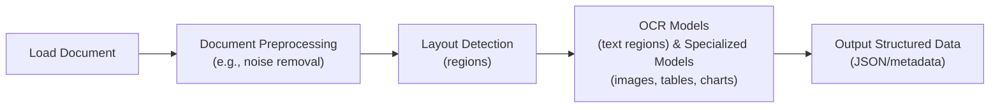
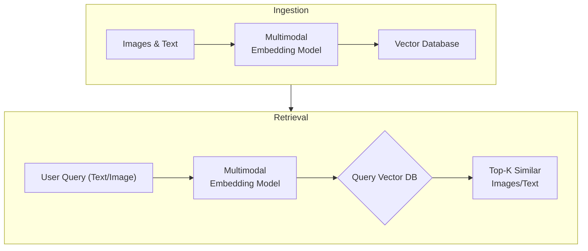

# Stop Converting Documents to Text. You're Doing It Wrong.

When I first started building AI agents, I hit a frustrating wall. I was comfortable manipulating text, but the moment I had to integrate multimodal data, such as images, audio, and especially documents like PDFs, my elegant architectures turned into messy hacks. I spent weeks building complex pipelines that tried to force everything into text. I chained OCR engines to scrape PDFs, layout detection models to identify tables, and separate classifiers to handle images. It was a brittle, slow, and expensive solution that broke every time a document layout changed.

The breakthrough came when I realized I was solving the wrong problem. I didn’t need to convert documents to text. I needed to treat them as images. Once I understood that every PDF page is effectively an image and that modern LLMs can “see” just as well as they can read, the complexity vanished. I could completely skip the OCR purgatory and focus on the three core inputs of an LLM: text, images, and audio.

This shift is essential because real-world AI applications rarely exist in a text-only vacuum. As human beings, we process information visually and audibly. Enterprise applications mirror this reality. They need to manipulate private data from warehouses and lakes that is inherently multimodal: financial reports with complex charts, technical diagrams, building sketches, and audio logs.

The old approach of normalizing everything to text is lossy. When you translate a complex diagram or a chart into text, you lose the spatial relationships, the colors, and the context. You lose the information that matters most. By processing data in its native format, we preserve this rich visual information, resulting in systems that are faster, cheaper, and significantly more performant.

Ultimately, as data is made for humans, you want the LLM to process the data as close as a human would, which often is visually. In this lesson, we will cover the foundations of multimodal LLMs, how to implement them with images and PDFs, how to structure agent memory for mixed modalities, and finally, how to build a complete multimodal ReAct agent.

## The Need for Multimodal AI

We want to process multimodal data to access our surroundings. However, the rise of multimodal LLMs is driven by a more subtle force: enterprise requirements. Enterprise applications work heavily with documents. The most critical example illustrating the need for multimodal data is processing PDF documents. Once we walk through this example, you will see how this core problem maps to other modalities like image, audio, or video.

Previously, we tried to normalize everything to text before passing it into an AI model. This approach has many flaws because we lose a substantial amount of information during translation. For example, when encountering diagrams, charts, or sketches in a document, it is impossible to fully reproduce them in text.

The traditional document processing workflow, often used for invoices, documentation, or reports, relies on the following four essential steps [[46]](https://www.daft.ai/blog/end-to-end-distributed-pdf-processing-pipeline), [[49]](https://www.llamaindex.ai/blog/ocr-for-tables), [[50]](https://intuitionlabs.ai/articles/ai-pdf-data-extraction-clinical-research):

1.  **Document Preprocessing:** Cleaning the document by removing noise, correcting orientation, and enhancing contrast.
2.  **Layout Detection:** Identifying distinct regions like text blocks, tables, and diagrams.
3.  **Data Extraction:** Using OCR models for text and specialized models for tables or charts.
4.  **Output Structuring:** Assembling the extracted data into a structured format like JSON.



Image 1: A flowchart illustrating the traditional document processing workflow.

This workflow has too many moving pieces. We need layout detection models, OCR models for text, and specialized models for each expected data structure, such as tables or charts. This makes the system rigid. If a document contains a chart type we don’t have a model for, the pipeline fails [[47]](https://learn.microsoft.com/en-us/answers/questions/5668164/why-traditional-ocr-fails-for-complex-business-doc?page=1). It is also slow and costly because we have to chain multiple model calls.

Most importantly, we face performance challenges. The multi-step nature creates a cascade effect where errors compound at each stage. Advanced OCR engines struggle with handwritten text, poor scans, stylized fonts, or complex layouts like nested tables and building sketches. For instance, scan quality below 300 DPI can cause accuracy to drop by over 20%, and a simple 5-degree tilt can increase the Word Error Rate (WER) by 15% or more [[1]](https://www.llamaindex.ai/blog/ocr-accuracy).

https://substackcdn.com/image/fetch/f_auto,q_auto:good,fl_progressive:steep/https%3A%2F%2Fsubstack-post-media.s3.amazonaws.com%2Fpublic%2Fimages%2Fa2dc40f3-dc13-486e-853d-8404368f4d8d_1616x1000.png
Image 2: A building sketch showing a crawl space vent diagram, illustrating the complexity of layouts that classic OCR systems struggle to interpret. (Source [Vectorize.io](https://vectorize.io/blog/multimodal-rag-patterns) [[12]](https://vectorize.io/blog/multimodal-rag-patterns))

If we try to translate other data formats to text, we lose information. This is true for any modality:

*   **Audio to Text:** We lose tone, pitch, and emotion.
*   **Image to Text:** We lose spatial information, color, and context.
*   **Video to Text:** We lose temporal dynamics and visual context.

Modern AI solutions use multimodal LLMs, such as Gemini, GPT-4o, or Claude. These models can directly interpret text, images, or PDFs as native input. This completely bypasses the unstable OCR workflow.

Thus, let’s understand how multimodal LLMs work.

## Foundations of Multimodal LLMs

To use LLMs with images and documents, you need an intuition of how multimodality works. You do not need to understand every research detail. But knowing the architecture helps you deploy, optimize, and monitor them.

There are two common approaches to building multimodal LLMs: the Unified Embedding Decoder Architecture and the Cross-modality Attention Architecture [[21]](https://magazine.sebastianraschka.com/p/understanding-multimodal-llms), [[37]](https://arxiv.org/abs/2409.11402).

https://substackcdn.com/image/fetch/f_auto,q_auto:good,fl_progressive:steep/https%3A%2F%2Fsubstack-post-media.s3.amazonaws.com%2Fpublic%2Fimages%2F76f50b57-2585-4cb8-8dda-eea5b5f81c03_1456x854.jpeg
Image 3: The two main approaches to developing multimodal LLM architectures. (Source [Understanding Multimodal LLMs](https://magazine.sebastianraschka.com/p/understanding-multimodal-llms) [[21]](https://magazine.sebastianraschka.com/p/understanding-multimodal-llms))

### Unified Embedding Decoder Architecture

In this approach, we encode the text and image separately, concatenate their embeddings into a single sequence, and pass the resulting tokens to the LLM.

On top of a standard LLM architecture, you need a vision encoder that maps the image to an embedding that’s within the same vector space as the text. So, when the text and image embeddings are merged, the LLM can make sense of both [[21]](https://magazine.sebastianraschka.com/p/understanding-multimodal-llms).

https://substackcdn.com/image/fetch/f_auto,q_auto:good,fl_progressive:steep/https%3A%2F%2Fsubstack-post-media.s3.amazonaws.com%2Fpublic%2Fimages%2Fa0979e82-2fb0-4f78-80c8-1395511e057f_1166x1400.jpeg
Image 4: Illustration of the unified embedding decoder architecture. (Source [Understanding Multimodal LLMs](https://magazine.sebastianraschka.com/p/understanding-multimodal-llms) [[21]](https://magazine.sebastianraschka.com/p/understanding-multimodal-llms))

### Cross-modality Attention Architecture

In the second approach, instead of passing the image embeddings along with the text embeddings at the input, we inject them directly into the attention module. We still need an image encoder that projects the image into the same vector space as the text, but we inject it deeper within the architecture [[21]](https://magazine.sebastianraschka.com/p/understanding-multimodal-llms).

https://substackcdn.com/image/fetch/f_auto,q_auto:good,fl_progressive:steep/https%3A%2F%2Fsubstack-post-media.s3.amazonaws.com%2Fpublic%2Fimages%2Fea1b9ee4-0d19-4c3c-89db-06e779653da2_1296x1338.jpeg
Image 5: An illustration of the Cross-Modality Attention Architecture approach. (Source [Understanding Multimodal LLMs](https://magazine.sebastianraschka.com/p/understanding-multimodal-llms) [[21]](https://magazine.sebastianraschka.com/p/understanding-multimodal-llms))

### Image Encoders

Both architectures rely on image encoders. To understand them, we can draw a parallel between text tokenization and image patching. Just as we split text into sub-word tokens, we split images into patches [[21]](https://magazine.sebastianraschka.com/p/understanding-multimodal-llms).

https://substackcdn.com/image/fetch/f_auto,q_auto:good,fl_progressive:steep/https%3A%2F%2Fsubstack-post-media.s3.amazonaws.com%2Fpublic%2Fimages%2F4a7104c0-3986-4aae-b918-06c393ff824c_1456x1154.jpeg
Image 6: Image tokenization and embedding (left) and text tokenization and embedding (right) side by side. (Source [Understanding Multimodal LLMs](https://magazine.sebastianraschka.com/p/understanding-multimodal-llms) [[21]](https://magazine.sebastianraschka.com/p/understanding-multimodal-llms))

The output has the same structure and dimensions as text embeddings. However, they need to be aligned in the vector space. We do this through a linear projection module. Popular image encoder models include CLIP, OpenCLIP, and SigLIP [[56]](https://opensearch.org/blog/multimodal-semantic-search/), [[35]](https://artsmart.ai/blog/top-embedding-models-in-2025/).

Importantly, these encoders are also used in Multimodal RAG. They allow us to find semantic similarities between images and text. This is achieved by training the encoders to map similar concepts from different modalities close to each other in a shared embedding space [[56]](https://opensearch.org/blog/multimodal-semantic-search/), [[57]](https://towardsdatascience.com/multimodal-ai-search-for-business-applications-65356d011009/).

https://substackcdn.com/image/fetch/f_auto,q_auto:good,fl_progressive:steep/https%3A%2F%2Fsubstack-post-media.s3.amazonaws.com%2Fpublic%2Fimages%2F3d4c837a-a3e5-4d60-97ce-c4d4faf4cf57_841x616.png
Image 7: Toy representation of multimodal embedding space. (Source [Multimodal Embeddings: An Introduction](https://towardsdatascience.com/multimodal-embeddings-an-introduction-5dc36975966f/) [[3]](https://towardsdatascience.com/multimodal-embeddings-an-introduction-5dc36975966f/))

You can replicate the same strategy between different modalities, such as text, image, document, and audio vectors, as long as you have an encoder that maps the data in the same vector space.

### Trade-offs and Modern Landscape

The **Unified Embedding Decoder** approach is simpler to implement and generally yields higher accuracy in OCR-related tasks. The **Cross-modality Attention** approach is more computationally efficient for high-resolution images because we don’t have to pass all tokens as an input sequence. Instead, we inject them directly into the attention mechanism. Hybrid approaches, like NVIDIA's NVLM-H, exist to combine these benefits, using a thumbnail for global context via unified embedding and high-resolution patches via cross-attention for finer details [[36]](https://magazine.sebastianraschka.com/p/understanding-multimodal-llms), [[37]](https://arxiv.org/abs/2409.11402).

In 2025, most leading LLMs are multimodal. Open-source examples include Llama 4, Gemma, and Qwen3. Closed-source examples include GPT-5, Gemini 2.5, and Claude [[22]](https://medium.com/data-science-in-your-pocket/2025-the-year-ai-reasoning-models-took-over-a-month-by-month-review-of-frontier-breakthroughs-6ea2163f854f), [[23]](https://codedesign.ai/blog/the-ultimate-guide-to-the-top-large-language-models-in-2025/). These models can natively process and reason across text, images, audio, and video streams.

A quick note on **Multimodal LLMs vs. Diffusion Models**: Diffusion models (like Midjourney or Stable Diffusion) generate images from noise. Multimodal LLMs (like GPT-4V) understand images and can sometimes generate them, but they are architecturally different. Multimodal LLMs are typically autoregressive transformer decoders focused on understanding, while diffusion models are iterative denoising networks built for generation [[19]](https://arxiv.org/html/2409.14993v3). In an agent workflow, diffusion models are typically used as tools, not as the reasoning model.

Now that we understand how LLMs can directly process images or documents, let’s see how this works in practice.

## Applying Multimodal LLMs to Images and Documents

To better understand how multimodal LLMs work, let’s write a few examples using Gemini to show you some best practices when working with images and documents, such as PDFs.

There are three core ways to process multimodal data with LLMs:

1.  **Raw bytes:** The easiest way to work with LLMs. However, when storing the item in a database, it can easily get corrupted as most databases interpret the input as text/strings instead of bytes.
2.  **Base64:** A way to encode raw bytes as strings. This is useful for storing images or documents directly in a database (e.g., PostgreSQL, MongoDB) without corruption. The downside is that the file size increases by approximately 33%.
3.  **URLs:** The standard for enterprise scenarios. You store data in a data lake like AWS S3 or GCP Buckets. The LLM downloads the media directly from the bucket. As the file never sees your server, this reduces network latency for your application. This is the most efficient option for scale [[11]](https://cloud.google.com/blog/products/data-analytics/how-to-use-an-llm-to-create-data-schemas-in-bigquery).

Now, let’s dig into the code.

1.  First, we display our sample image.

    <https://substackcdn.com/image/fetch/w_1456,c_limit,f_webp,q_auto:good,fl_progressive:steep/https%3A%2F%2Fsubstack-post-media.s3.amazonaws.com%2Fpublic%2Fimages%2F5780cbd6-133b-44fe-9352-38250d6fc611_640x640.jpeg>

2.  Next, we load the image as **raw bytes**. We use `WEBP` format because it is efficient. We can then call the LLM to generate a caption or compare multiple images.

    ```python
    from google import genai
    from google.genai import types
    from PIL import Image
    import io
    
    def load_image_as_bytes(
        image_path: str, format: str = "WEBP", max_width: int = 600
    ) -> bytes:
        image = Image.open(image_path)
        if image.width > max_width:
            ratio = max_width / image.width
            new_size = (max_width, int(image.height * ratio))
            image = image.resize(new_size)
    
        byte_stream = io.BytesIO()
        image.save(byte_stream, format=format)
        return byte_stream.getvalue()
    
    client = genai.Client()
    MODEL_ID = "gemini-2.5-flash"
    
    image_bytes_1 = load_image_as_bytes("images/image_1.jpeg", format="WEBP")
    image_bytes_2 = load_image_as_bytes("images/image_2.jpeg", format="WEBP")
    
    # Single image captioning
    response = client.models.generate_content(
        model=MODEL_ID,
        contents=[
            types.Part.from_bytes(data=image_bytes_1, mime_type="image/webp"),
            "Tell me what is in this image in one paragraph.",
        ],
    )
    print(f"Caption: {response.text}")
    
    # Comparing multiple images
    response = client.models.generate_content(
        model=MODEL_ID,
        contents=[
            types.Part.from_bytes(data=image_bytes_1, mime_type="image/webp"),
            types.Part.from_bytes(data=image_bytes_2, mime_type="image/webp"),
            "What’s the difference between these two images?",
        ],
    )
    print(f"Difference: {response.text}")
    ```

    It outputs:

    ```text
    Caption: This striking image features a massive, dark metallic robot, its powerful form detailed with intricate circuit patterns on its head and piercing red glowing eyes. Perched playfully on its right arm is a small, fluffy grey tabby kitten...
    
    Difference: The primary difference between the two images lies in the nature of the interaction depicted and their respective settings...
    ```

3.  We can also process the image as a **Base64 encoded string**. Notice that the logic is similar, but we encode the bytes first. The base64 version will be about 33% larger.

    ```python
    import base64
    
    image_base64 = base64.b64encode(image_bytes_1).decode("utf-8")
    
    response = client.models.generate_content(
        model=MODEL_ID,
        contents=[
            types.Part.from_bytes(data=image_base64, mime_type="image/webp"),
            "Tell me what is in this image.",
        ],
    )
    
    print(f"Size increase: {(len(image_base64) - len(image_bytes_1)) / len(image_bytes_1) * 100:.2f}%")
    ```

4.  For **URLs**, Gemini works well with GCS Buckets for private data. For public data, we can use the `url_context` tool.

    ```python
    # Private GCS URL
    response = client.models.generate_content(
        model=MODEL_ID,
        contents=[
            types.Part.from_uri(uri="gs://gemini-images/image_1.jpeg", mime_type="image/webp"),
            "Tell me what is in this image.",
        ],
    )
    
    # Public URL
    response = client.models.generate_content(
        model=MODEL_ID,
        contents="Based on the provided paper as a PDF, tell me how ReAct works: https://arxiv.org/pdf/2210.03629",
        config=types.GenerateContentConfig(tools=[{"url_context": {}}]),
    )
    print(response.text)
    ```

    It outputs:

    ```text
    The ReAct (Reasoning and Acting) paradigm is a method that combines verbal reasoning traces with task-specific actions...
    ```

5.  Let’s try a more complex task: **Object Detection**. We use Pydantic to define the output structure, a technique we covered in Lesson 4.

    ```python
    from pydantic import BaseModel
    
    class BoundingBox(BaseModel):
        ymin: float
        xmin: float
        ymax: float
        xmax: float
        label: str
    
    class Detections(BaseModel):
        bounding_boxes: list[BoundingBox]
    
    prompt = "Detect all prominent items. Return 2d boxes normalized to 0-1000."
    
    response = client.models.generate_content(
        model=MODEL_ID,
        contents=[types.Part.from_bytes(data=image_bytes_1, mime_type="image/webp"), prompt],
        config=types.GenerateContentConfig(
            response_mime_type="application/json",
            response_schema=Detections
        ),
    )
    print(response.parsed)
    ```

    It outputs:

    ```text
    bounding_boxes=[BoundingBox(ymin=272.0, xmin=28.0, ymax=801.0, xmax=535.0, label='kitten'), BoundingBox(ymin=1.0, xmin=450.0, ymax=997.0, xmax=1000.0, label='robot')]
    ```

    https://substackcdn.com/image/fetch/f_auto,q_auto:good,fl_progressive:steep/https%3A%2F%2Fsubstack-post-media.s3.amazonaws.com%2Fpublic%2Fimages%2Fa2eaed1f-bedb-4c33-98b3-96fa7424f0ad_566x590.png

6.  Now, let’s process **PDFs**. Because we use a multimodal model, the process is identical to images. We load the PDF as bytes and pass it to the model.

    https://substackcdn.com/image/fetch/f_auto,q_auto:good,fl_progressive:steep/https%3A%2F%2Fsubstack-post-media.s3.amazonaws.com%2Fpublic%2Fimages%2F6c03a7fa-24aa-4542-b09f-19647a6a06c5_2550x3300.jpeg

    ```python
    pdf_bytes = open("pdfs/attention_is_all_you_need_paper.pdf", "rb").read()
    
    response = client.models.generate_content(
        model=MODEL_ID,
        contents=[
            types.Part.from_bytes(data=pdf_bytes, mime_type="application/pdf"),
            "What is this document about? Provide a brief summary.",
        ],
    )
    print(response.text)
    ```

    It outputs:

    ```text
    This document introduces the Transformer, a novel neural network architecture for sequence transduction...
    ```

7.  Finally, we can perform **Object Detection on PDF pages**. This is powerful for extracting diagrams or tables. We treat the PDF page as an image.

    ```python
    page_image_bytes = load_image_as_bytes("images/attention_is_all_you_need_1.jpeg")
    
    prompt = "Detect all the diagrams from the provided image as 2d bounding boxes."
    
    response = client.models.generate_content(
        model=MODEL_ID,
        contents=[types.Part.from_bytes(data=page_image_bytes, mime_type="image/webp"), prompt],
        config=types.GenerateContentConfig(
            response_mime_type="application/json",
            response_schema=Detections
        ),
    )
    ```

    https://substackcdn.com/image/fetch/f_auto,q_auto:good,fl_progressive:steep/https%3A%2F%2Fsubstack-post-media.s3.amazonaws.com%2Fpublic%2Fimages%2Fe7cb5566-8dea-4468-b307-b79b7610c7fa_667x590.png

Processing PDFs as images is a concept popularized by the ColPali paper, which demonstrated that modern Vision Language Models (VLMs) can retrieve documents more effectively by “looking” at them rather than extracting text [[5]](https://arxiv.org/pdf/2407.01449v6).

## Foundations of Multimodal AI Agents

What if we want to use these methods within an Agent?

Agents manage their internal state, the short-term memory, as a list of messages. This usually translates to a list of dictionaries or JSON objects. When transitioning from text-only to multimodal, the structure changes slightly. We need a way to flag the data type and model the data using the formats we just discussed (URL, Base64, Binary).

We move from a list of text-only JSONs to a list of JSONs containing a mix of modalities. Each item can be text, an image, or audio. As long as the LLM can process these modalities, our job is to properly manage them in short-term memory, retrieve them from long-term memory, and pass them in the right encoding.

One of the most powerful ways to implement multimodal long-term memory is through RAG. When building custom AI agents, you will almost always need to retrieve private company data, and this data is often visual. The general architecture for a multimodal RAG system involves two pipelines: ingestion and retrieval.


Image 8: A flowchart illustrating the ingestion and retrieval pipelines of a multimodal RAG system.

For our enterprise use case of RAG on documents, the state-of-the-art architecture as of 2025 is ColPali. Its core innovation is bypassing the entire fragile OCR pipeline. Instead of extracting text, it processes document pages as images, using a vision-language model to understand both text and visual layout simultaneously. It represents each document page not as a single vector, but as a "bag-of-embeddings" from image patches. This multi-vector approach allows for fine-grained matching between a query and specific parts of a document.

However, this expressive power comes with engineering trade-offs. ColPali's multi-vector representations demand massive storage—up to 256 KB per page, which can be 30 times larger than traditional sparse-vector methods [[62]](https://www.activeloop.ai/resources/col-palis-vision-rag-and-max-sim-for-multi-modal-ai-search-on-documents/). This also increases computational overhead, leading to query latencies of 120-150ms on standard benchmarks [[61]](https://arxiv.org/html/2506.21601v2). To mitigate this, production systems use optimization techniques. For example, HPC-ColPali applies K-Means quantization to compress patch embeddings by up to 32x and uses attention-guided pruning to reduce late-interaction computation by 60%, halving latency with a minimal drop in accuracy [[61]](https://arxiv.org/html/2506.21601v2).

ColPali is typically initialized from pre-trained models like PaliGemma and fine-tuned using a contrastive loss on tens of thousands of (query, document image) pairs [[64]](https://huggingface.co/blog/manu/colpali). While highly effective, its performance can degrade on unstructured formats, non-English languages, or in specialized fields without further fine-tuning [[63]](https://blog.vespa.ai/Transforming-the-Future-of-Information-Retrieval-with-ColPali/).

The core lesson from ColPali is that treating visual data natively is a powerful pattern. This idea extends beyond documents. The same principles can be applied to real-time video frame retrieval in surveillance or for analyzing complex medical images, where preserving visual context is critical [[65]](https://learnopencv.com/multimodal-rag-with-colpali/), [[66]](https://www.nexastack.ai/blog/colpali-enterprise-applications).

Let’s see how we can build a simplified version of this system.

## Building Multimodal AI Agents

Let’s take this further and design an agentic RAG system. We assume we have a vector database filled with images, audio data, and PDFs (converted to images), and a multimodal embedding model that supports text-to-image, image-to-audio, and text-to-audio embeddings.

Our main focus is on managing the short-term memory as a list of mixed-modality JSONs. We want the agent to retrieve context from its current multimodal state, leveraging its multimodal retrieval tools, provide an answer, and repeat until the task is complete.

1.  First, we define our multimodal tools. In a real application, these would query a vector DB like Qdrant or Pinecone using a multimodal embedding model. For simplicity, we will mock them.

    ```python
    def text_image_search_tool(query: str):
        """Search for images using text description."""
        pass
    
    def image_to_image_search_tool(image_data: str):
        """Find images visually similar to the input image."""
        pass
    
    def image_audio_search_tool(image_data: str):
        """Find audio clips relevant to the image content."""
        pass
    
    def image_document_search_tool(image_data: str):
        """Find documents visually similar to the image."""
        pass
    
    def google_drive_document_search_tool(image_data: str):
        """Search Google Drive for documents related to the image."""
        pass
    
    def computer_screen_shoot_tool():
        """Take a screenshot of the user’s screen."""
        return "<base64_image_string>"
    ```

2.  We define the `build_react_agent` function that creates ReAct agents using LangGraph. We use a system prompt that explicitly instructs the agent to handle multimodal inputs.

    ```python
    from langgraph.prebuilt import create_react_agent
    from langchain_google_genai import ChatGoogleGenerativeAI
    
    def build_react_agent():
        system_prompt = """You are a multimodal AI assistant.
        You can see images, read documents, and listen to audio.
        When asked about visual content, use your tools to retrieve relevant context.
        Always analyze the visual features (colors, objects) or audio features (pitch, tone) in your search results."""
    
        model = ChatGoogleGenerativeAI(model="gemini-2.5-pro")
        tools = [
            text_image_search_tool,
            image_to_image_search_tool,
            image_audio_search_tool,
            image_document_search_tool,
            google_drive_document_search_tool,
            computer_screen_shoot_tool,
        ]
    
        agent = create_react_agent(model, tools, system_prompt)
        return agent
    ```

3.  We build the `react_agent` and run it with a query that requires multimodal reasoning: *“Based on what I am looking at, retrieve all relevant images, audio, and documents.”*

4.  Let’s look at a potential reasoning trace.
    *   **Turn 1 (Reasoning):** The agent analyzes the user request and decides to call `computer_screen_shoot_tool`.
    *   **Turn 1 (Observation):** The tool executes and returns a Base64 image. This is appended to the message history.

    ```json
    {
      "role": "tool",
      "name": "computer_screen_shoot_tool",
      "parts": [
        {
          "inline_data": {
            "mime_type": "image/jpeg",
            "data": "/9j/4AAQSkZJRg..."
          }
        }
      ]
    }
    ```

5.  **Turn 2 (Reasoning):** The agent now has the image in its context. It analyzes the visual content (a gray kitten) and decides to call the following retrieval tools in parallel:

    ```json
    "function_calls": [
      {
        "tool_name": "image_to_image_search_tool",
        "tool_args": { "image_data": "<base64_image_from_previous_turn>" }
      },
      {
        "tool_name": "image_audio_search_tool",
        "tool_args": { "image_data": "<base64_image_from_previous_turn>" }
      },
      ...
    ]
    ```

6.  **Turn 2 (Observation):** The tools execute and return mixed modalities. The state is updated with these new observations, adding audio, images, and document pages to the context.

    ```json
    [
      {
        "role": "tool",
        "name": "image_to_image_search_tool",
        "parts": [
          { "text": "Found 3 similar images:" },
          { "inline_data": { "mime_type": "image/jpeg", "data": "..." } }
        ]
      },
      {
        "role": "tool",
        "name": "image_audio_search_tool",
        "parts": [
          { "text": "Found similar audio clip (as binary data):" },
          { "inline_data": { "mime_type": "audio/mp3", "data": "<binary_audio_bytes>" } }
        ]
      },
      {
        "role": "tool",
        "name": "google_drive_document_search_tool",
        "parts": [
          { "text": "Found document from Google Drive (stored in GCS bucket):" },
          { "file_data": { "mime_type": "application/pdf", "file_uri": "gs://my-bucket/doc.pdf" } }
        ]
      }
    ]
    ```

7.  The agent compiles this into a final answer. If we then ask a follow-up question like, *“What is the color of my kitten?”*, the agent can answer directly from its short-term memory without needing to use tools again, because it already has the screenshot image in its state.

Nothing fundamental has changed in how we structure our data when switching from text-only to multimodal agents. We simply reflect the data types within the JSONs. The key is that our LLM knows how to process that data. The hard part is retrieving the correct multimodal data from our databases and indexing it properly.

## Conclusion

Working with multimodal data is a fundamental skill for AI engineers. Modern AI applications rarely exist in a text-only vacuum. They interact with the complex, visual, and auditory reality of the world.

In this lesson, we moved away from the unstable, multi-step OCR pipelines of the past. We learned that modern LLMs can natively process images and documents, preserving rich context that was previously lost. We explored how to handle data as bytes, Base64, and URLs, and how to build agents that can reason across these modalities.

This concludes our *AI Agents Foundations* series. We started by understanding the difference between workflows and agents, mastered context engineering and structured outputs, built robust planning capabilities with ReAct, and finally gave our agents eyes and ears. You now have the foundational blocks to build production-ready AI systems.

## References

- [1] Liu, J. (2025, February 24). OlmOCR-bench review: Insights and pitfalls on an OCR benchmark. LlamaIndex. https://www.llamaindex.ai/blog/olmocr-bench-review-insights-and-pitfalls-on-an-ocr-benchmark
- [2] Vision language models. (n.d.). NVIDIA. https://www.nvidia.com/en-us/glossary/vision-language-models/
- [3] Talebi, S. (2024, November 13). Multimodal embeddings: An introduction. Medium. https://towardsdatascience.com/multimodal-embeddings-an-introduction-5dc36975966f/
- [4] Multi-modal ML with OpenAI’s CLIP. (n.d.). Pinecone. https://www.pinecone.io/learn/series/image-search/clip/
- [5] Fostiropoulos, I., et al. (2024). ColPali: Efficient Document Retrieval with Vision Language Models. arXiv. https://arxiv.org/pdf/2407.01449v6
- [6] Image understanding. (n.d.). Google AI for Developers. https://ai.google.dev/gemini-api/docs/image-understanding
- [7] Google generative AI embeddings. (n.d.). LangChain. https://python.langchain.com/docs/integrations/text_embedding/google_generative_ai/
- [8] Agents. (n.d.). LangChain. https://langchain-ai.github.io/langgraph/agents/agents/
- [9] Complex Document Recognition: OCR Doesn’t Work and Here’s How You Fix It. (n.d.). HackerNoon. https://hackernoon.com/complex-document-recognition-ocr-doesnt-work-and-heres-how-you-fix-it
- [10] What are some real-world applications of multimodal AI? (n.d.). Milvus. https://milvus.io/ai-quick-reference/what-are-some-realworld-applications-of-multimodal-ai
- [11] Image understanding with Gemini. (n.d.). Google AI for Developers. https://ai.google.dev/gemini-api/docs/image-understanding
- [12] Vectorize.io. (2024, October 26). Multimodal RAG Patterns. Vectorize.io Blog. https://vectorize.io/blog/multimodal-rag-patterns
- [13] Wang, X., Zhou, Y., Huang, B., Chen, H., & Zhu, W. (2025). Multi-modal Generative AI: Multi-modal LLMs, Diffusions, and the Unification. arXiv. https://arxiv.org/html/2409.14993v3
- [14] Evaluating Multimodal vs. Text-Based Retrieval for RAG with Snowflake Cortex. (2025, April 21). Snowflake. https://www.snowflake.com/en/engineering-blog/arctic-agentic-rag-multimodal-pdf-retrieval/
- [15] Multimodal RAG with Colpali, Milvus and VLMs. (2024, December 10). Hugging Face. https://huggingface.co/blog/saumitras/colpali-milvus-multimodal-rag
- [16] The 8 best AI image generators in 2025. (2026, April 1). Zapier. https://zapier.com/blog/best-ai-image-generator/
- [17] What Is Optical Character Recognition (OCR)?. (2023, November 21). Roboflow. https://blog.roboflow.com/what-is-optical-character-recognition-ocr/
- [18] OCR Accuracy Explained: How to Improve It. (n.d.). LlamaIndex. https://www.llamaindex.ai/blog/ocr-accuracy
- [19] NVLM: Open Frontier-Class Multimodal LLMs. (2024). arXiv. https://arxiv.org/abs/2409.11402
- [20] The Ultimate Guide to the Top Large Language Models in 2025. (n.d.). CodeDesign.ai. https://codedesign.ai/blog/the-ultimate-guide-to-the-top-large-language-models-in-2025/
- [21] Raschka, S. (2024, October 21). Understanding multimodal LLMS. Sebastian Raschka. https://magazine.sebastianraschka.com/p/understanding-multimodal-llms
- [22] 2025: The Year AI Reasoning Models Took Over. (2025). Medium. https://medium.com/data-science-in-your-pocket/2025-the-year-ai-reasoning-models-took-over-a-month-by-month-review-of-frontier-breakthroughs-6ea2163f854f
- [23] The Ultimate Guide to the Top Large Language Models in 2025. (n.d.). CodeDesign.ai. https://codedesign.ai/blog/the-ultimate-guide-to-the-top-large-language-models-in-2025/
- [24] What are prominent real-world enterprise use cases and limitations of text-only AI approaches in fields like financial report analysis with charts, medical imaging diagnostics, and technical documentation with sketches? (n.d.).
- [25] A Comparative Study of Leading Code Generation LLMs. (2025). Preprints.org. https://www.preprints.org/manuscript/202508.1904
- [26] Ultimate 2025 AI Language Models Comparison. (n.d.). Promptitude. https://www.promptitude.io/post/ultimate-2025-ai-language-models-comparison-gpt5-gpt-4-claude-gemini-sonar-more
- [27] Exploring Multimodal LLMs: Text, Image, and Video Integration. (n.d.). SparkCognition. https://sparkco.ai/blog/exploring-multimodal-llms-text-image-and-video-integration
- [28] Multimodal LLMs. (n.d.). Emergent Mind. https://www.emergentmind.com/topics/multimodal-llms
- [29] Enhancing LLM Capabilities: The Power of Multimodal LLMs and RAG. (n.d.). Towards AI. https://towardsai.net/p/l/enhancing-llm-capabilities-the-power-of-multimodal-llms-and-rag
- [30] A Comprehensive Survey of Multimodal Large Language Models. (2024). arXiv. https://arxiv.org/html/2411.06284v3
- [31] How to Choose an Embedding Model for RAG in 2026. (n.d.). Milvus. https://milvus.io/blog/choose-embedding-model-rag-2026.md
- [32] How can multimodal RAG retrieval tools be integrated as actions within ReAct-style reasoning agents to enable processing of images, PDFs, and visual documents in enterprise workflows? (n.d.).
- [33] Best Embedding Models for RAG in 2025. (n.d.). GreenNode. https://greennode.ai/blog/best-embedding-models-for-rag
- [34] eager-embed-v1: The Best Open-Source Embedding Model for RAG. (n.d.). EagerWorks. https://eagerworks.com/blog/best-embedding-model-for-rag
- [35] Top Embedding Models in 2025. (n.d.). ArtSmart.ai. https://artsmart.ai/blog/top-embedding-models-in-2025/
- [36] Raschka, S. (2024, October 21). Understanding multimodal LLMS. Sebastian Raschka. https://magazine.sebastianraschka.com/p/understanding-multimodal-llms
- [37] NVLM: Open Frontier-Class Multimodal LLMs. (2024). arXiv. https://arxiv.org/abs/2409.11402
- [38] How do hybrid approaches combining unified embedding and cross-modality attention in multimodal LLMs balance implementation simplicity, accuracy for OCR tasks, and efficiency with high-resolution images? (n.d.).
- [39] What are common real-world applications of multimodal LLMs for object detection, image captioning, and processing medical or technical visuals in enterprise settings? (n.d.).
- [40] How can structured output models like Pydantic be combined with multimodal LLMs such as Gemini for tasks like object detection on images or PDF pages, including prompt design, response parsing, and bounding box visualization techniques? (n.d.).
- [41] A Comprehensive Survey and Guide to Multimodal Large Language Models in Vision-Language Tasks. (n.d.). GitHub. https://github.com/cognitivetech/llm-research-summaries/blob/main/models-review/A-Comprehensive-Survey-and-Guide-to-Multimodal-Large-Language-Models-in-Vision-Language-Tasks.md
- [42] Multimodal AI Examples: How It Works, Real-World Applications, and Future Trends. (n.d.). SmartDev. https://smartdev.com/multimodal-ai-examples-how-it-works-real-world-applications-and-future-trends/
- [43] What is a multimodal LLM?. (n.d.). IBM. https://www.ibm.com/think/topics/multimodal-llm
- [44] Multimodal Large Language Models in Medical Imaging. (2025). PMC. https://pmc.ncbi.nlm.nih.gov/articles/PMC12479233/
- [45] Multimodal large language models in healthcare. (2025). Nature. https://www.nature.com/articles/s41598-025-98483-1
- [46] End-to-End Distributed PDF Processing Pipeline. (n.d.). Daft. https://www.daft.ai/blog/end-to-end-distributed-pdf-processing-pipeline
- [47] Why Traditional OCR Fails for Complex Business Documents. (n.d.). Microsoft Learn. https://learn.microsoft.com/en-us/answers/questions/5668164/why-traditional-ocr-fails-for-complex-business-doc?page=1
- [48] What are the standard pipeline steps for traditional OCR-based document processing of PDFs containing mixed text, tables, diagrams, and charts, including preprocessing, layout analysis, and output structuring, and why does this lead to rigid and fragile systems? (n.d.).
- [49] OCR for Tables. (n.d.). LlamaIndex. https://www.llamaindex.ai/blog/ocr-for-tables
- [50] AI PDF Data Extraction in Clinical Research. (n.d.). Intuition Labs. https://intuitionlabs.ai/articles/ai-pdf-data-extraction-clinical-research
- [51] Gemini consistently producing valid Pydantic responses. (n.d.). Google AI. https://discuss.ai.google.dev/t/gemini-consistently-producing-valid-pydantic-responses/98992
- [52] Stop Converting Documents to Text. You're Doing It Wrong. (n.d.). Decoding AI. https://www.decodingai.com/p/stop-converting-documents-to-text
- [53] LLM Output Parsing & Structured Generation. (n.d.). Tetrate. https://tetrate.io/learn/ai/llm-output-parsing-structured-generation
- [54] Structured Outputs with Multimodal Gemini. (2024, October 23). Instructor. https://python.useinstructor.com/blog/2024/10/23/structured-outputs-with-multimodal-gemini/
- [55] Steering Large Language Models with Pydantic. (n.d.). Pydantic. https://pydantic.dev/articles/llm-intro
- [56] Multimodal Semantic Search. (n.d.). OpenSearch. https://opensearch.org/blog/multimodal-semantic-search/
- [57] Multimodal AI Search for Business Applications. (n.d.). Towards Data Science. https://towardsdatascience.com/multimodal-ai-search-for-business-applications-65356d011009/
- [58] Joint Visual-Textual Embedding for Multimodal Style Search. (n.d.). Amazon Science. https://assets.amazon.science/89/bf/661d950d4059930c8f1d2e449ac6/joint-visual-textual-embedding-for-multimodal-style-search.pdf
- [59] Combine Image and Text: How Multimodal Retrieval Transforms Search. (n.d.). Zilliz. https://zilliz.com/blog/combine-image-and-text-how-multimodal-retrieval-transforms-search
- [60] Multimodal Sentence Transformers. (n.d.). Hugging Face. https://huggingface.co/blog/multimodal-sentence-transformers
- [61] Duong, B. (2025). Hierarchical Patch Compression for ColPali: Efficient Multi-Vector Document Retrieval with Dynamic Pruning and Quantization. arXiv. https://arxiv.org/html/2506.21601v2
- [62] ColPali’s Vision RAG and MaxSim for Multi-Modal AI Search on Documents. (n.d.). Activeloop. https://www.activeloop.ai/resources/col-palis-vision-rag-and-max-sim-for-multi-modal-ai-search-on-documents/
- [63] Transforming the Future of Information Retrieval with ColPali. (n.d.). Vespa.ai. https://blog.vespa.ai/Transforming-the-Future-of-Information-Retrieval-with-ColPali/
- [64] ColPali: A Vision Language Model for Multimodal Document Retrieval. (n.d.). Hugging Face. https://huggingface.co/blog/manu/colpali
- [65] Multimodal RAG with ColPali. (n.d.). LearnOpenCV. https://learnopencv.com/multimodal-rag-with-colpali/
- [66] ColPali: The Next-Gen Enterprise Document Intelligence Solution. (n.d.). NexaStack. https://www.nexastack.ai/blog/colpali-enterprise-applications