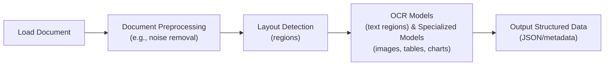
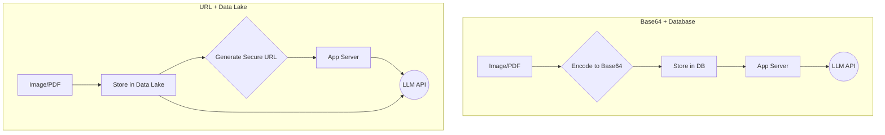
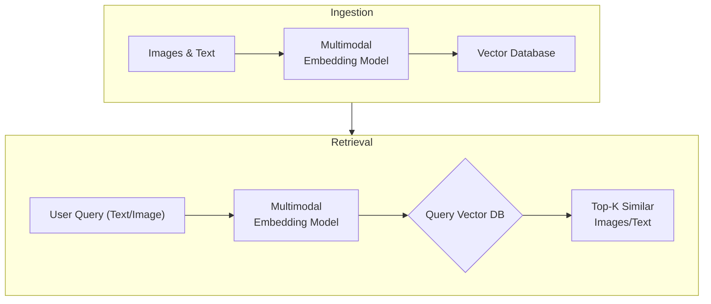
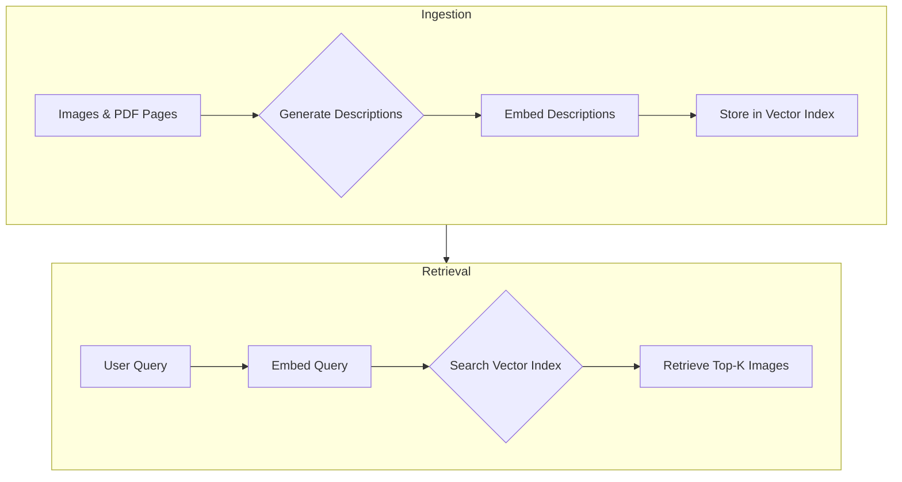
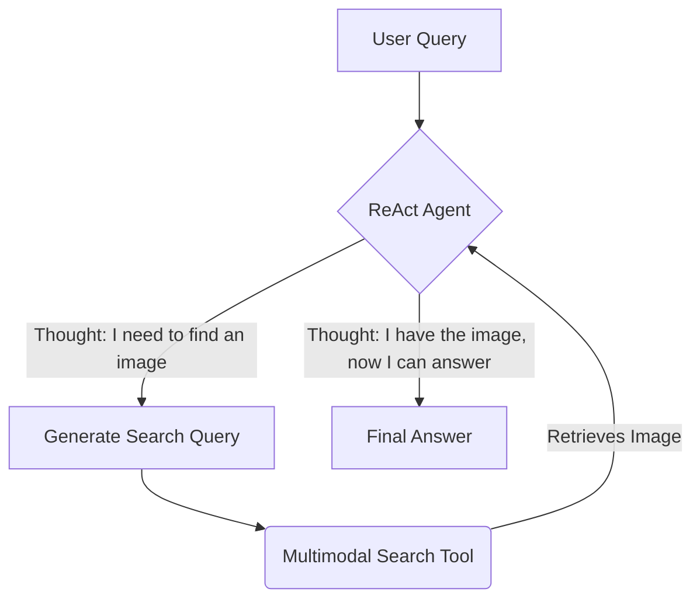

# Stop Converting Documents to Text. You're Doing It Wrong.

When we first started building AI agents, we hit a frustrating wall. We were comfortable manipulating text, but the moment we had to integrate multimodal data, such as images, audio, and especially documents like PDFs, our elegant architectures turned into messy hacks. We spent weeks building complex pipelines that tried to force everything into text. We chained OCR engines to scrape PDFs, layout detection models to identify tables, and separate classifiers to handle images. It was an unreliable, slow, and expensive solution that broke every time a document layout changed.

The breakthrough came when we realized we were solving the wrong problem. We didn’t need to convert documents to text. We needed to treat them as images. Once we understood that every PDF page is effectively an image and that modern LLMs can “see” just as well as they can read, the complexity vanished. We could completely skip the OCR purgatory and focus on the three core inputs of an LLM: text, images, and audio.

This shift is essential because real-world AI applications rarely exist in a text-only vacuum. As human beings, we process information visually and audibly. Enterprise applications mirror this reality. They need to manipulate private data from warehouses and lakes that is inherently multimodal: financial reports with complex charts, technical diagrams, building sketches, and audio logs. For example, text-only AI struggles to summarize financial reports because it cannot interpret the charts and tables that contain the most critical data [[8]](https://www.ijcai.org/proceedings/2023/0581.pdf). Similarly, in medical diagnostics, AI relies on computer vision to analyze images like CT scans and X-rays; a text-only approach is simply not viable [[7]](https://techtoday.lenovo.com/sites/default/files/2025-05/Medical%20Imaging%20White%20Paper%20NVIDIA%20and%20Lenovo.pdf), [[10]](https://www.philips.com/a-w/about/news/archive/features/2022/20221124-10-real-world-examples-of-ai-in-healthcare.html).

The old approach of normalizing everything to text is lossy. When you translate a complex diagram or a chart into text, you lose the spatial relationships, the colors, and the context. You lose the information that matters most. By processing data in its native format, we preserve this rich visual information, resulting in systems that are faster, cheaper, and more performant.

Ultimately, as data is made for humans, you want the LLM to process the data as close as a human would, which often is visually. In this lesson, we will cover the foundations of multimodal LLMs, how to implement them with images and PDFs, how to structure agent memory for mixed modalities, and finally, how to build a complete multimodal ReAct agent.

## Limitations of traditional document processing

To cement the problem, we will dig deeper into the limitations of traditional document processing, such as processing invoices, documentation, or reports using AI systems. The problem can be translated to other data types such as images or audio. The core idea is that previous approaches tried to normalize everything to text before passing it into an AI model, which has many flaws, as during the translation we lose a ton of information. For example, when encountering diagrams, charts, or sketches in a document, it's impossible to fully reproduce them in text.

The traditional document processing workflow relies on a sequence of specialized models to deconstruct a document page. This pipeline typically involves these steps [[46]](https://www.daft.ai/blog/end-to-end-distributed-pdf-processing-pipeline), [[49]](https://www.llamaindex.ai/blog/ocr-for-tables), [[50]](https://intuitionlabs.ai/articles/ai-pdf-data-extraction-clinical-research):

1.  **Document Preprocessing:** The image is cleaned to improve quality. This includes binarization (converting to black and white), deskewing (correcting orientation), and noise reduction.
2.  **Layout Analysis:** A model detects the document's structure, identifying distinct regions like text blocks, tables, images, and form fields.
3.  **Data Extraction:** Optical Character Recognition (OCR) models are applied to text regions to convert pixels into machine-readable characters. Other specialized models are used for non-text elements like tables or charts.
4.  **Output Structuring:** The extracted information is assembled into a structured format, like JSON, which often loses the original spatial context.


Image 1: A flowchart illustrating the traditional document processing workflow.

This workflow has too many moving pieces. It requires a layout detection model, an OCR model, and separate models for each data structure you expect to encounter. This makes the system rigid, slow, and fragile [[47]](https://learn.microsoft.com/en-us/answers/questions/5668164/why-traditional-ocr-fails-for-complex-business-doc?page=1). If a document contains a new type of chart, the pipeline fails. Chaining multiple model calls increases latency and cost. Most importantly, it creates a system prone to compounding errors.

The multi-step nature of this pipeline creates a cascade effect where an error at any stage corrupts the final output. For example, traditional OCR engines achieve 88-94% accuracy on simple layouts but struggle with anything more complex. They treat pages as flat grids of text, failing to understand structure. This leads to misaligned data when dealing with multi-column formats, nested tables, or overlapping text [[1]](https://www.llamaindex.ai/blog/ocr-accuracy).

Performance degrades sharply with real-world documents. Scan quality below 300 DPI can cause accuracy to drop by over 20%, and a simple 5-degree tilt can increase the Word Error Rate (WER) by 15% or more [[1]](https://www.llamaindex.ai/blog/ocr-accuracy). Handwritten text is even more challenging, with a Character Error Rate (CER) of 3-5% considered good, which is often not enough for high-stakes applications. For complex documents in fields like healthcare or finance, error rates can be so high that they require extensive manual intervention, defeating the purpose of automation [[50]](https://intuitionlabs.ai/articles/ai-pdf-data-extraction-clinical-research).

https://substackcdn.com/image/fetch/f_auto,q_auto:good,fl_progressive:steep/https%3A%2F%2Fsubstack-post-media.s3.amazonaws.com%2Fpublic%2Fimages%2Fa2dc40f3-dc13-486e-853d-8404368f4d8d_1616x1000.png
Image 2: A building sketch showing a crawl space vent diagram, illustrating the complexity of layouts that classic OCR systems struggle to interpret. (Source [Vectorize.io](https://vectorize.io/blog/multimodal-rag-patterns) [[12]](https://vectorize.io/blog/multimodal-rag-patterns))

This approach might work for highly specialized, predictable documents, but it doesn't scale in a world where AI agents need to be flexible and fast. That's why modern AI solutions use multimodal LLMs, such as Gemini, that can directly interpret text, images, or even PDFs as native input, completely bypassing this fragile OCR workflow. Thus, let's understand how multimodal LLMs work.

## Foundations of Multimodal LLMs

To use LLMs with images and documents, you need an intuition of how multimodality works. You do not need to understand every research detail. But knowing the architecture helps you deploy, optimize, and monitor them.

There are two common approaches to building multimodal LLMs: the Unified Embedding Decoder Architecture and the Cross-modality Attention Architecture [[21]](https://magazine.sebastianraschka.com/p/understanding-multimodal-llms), [[37]](https://arxiv.org/abs/2409.11402).

https://substackcdn.com/image/fetch/f_auto,q_auto:good,fl_progressive:steep/https%3A%2F%2Fsubstack-post-media.s3.amazonaws.com%2Fpublic%2Fimages%2F76f50b57-2585-4cb8-8dda-eea5b5f81c03_1456x854.jpeg
Image 3: The two main approaches to developing multimodal LLM architectures. (Source [Understanding Multimodal LLMs](https://magazine.sebastianraschka.com/p/understanding-multimodal-llms) [[21]](https://magazine.sebastianraschka.com/p/understanding-multimodal-llms))

### Unified Embedding Decoder Architecture

In this approach, we encode the text and image separately, concatenate their embeddings into a single sequence, and pass the resulting tokens to the LLM.

On top of a standard LLM architecture, you need a vision encoder that maps the image to an embedding that’s within the same vector space as the text. So, when the text and image embeddings are merged, the LLM can make sense of both [[21]](https://magazine.sebastianraschka.com/p/understanding-multimodal-llms).

https://substackcdn.com/image/fetch/f_auto,q_auto:good,fl_progressive:steep/https%3A%2F%2Fsubstack-post-media.s3.amazonaws.com%2Fpublic%2Fimages%2Fa0979e82-2fb0-4f78-80c8-1395511e057f_1166x1400.jpeg
Image 4: An illustration of the unified embedding decoder architecture. (Source [Understanding Multimodal LLMs](https://magazine.sebastianraschka.com/p/understanding-multimodal-llms) [[21]](https://magazine.sebastianraschka.com/p/understanding-multimodal-llms))

### Cross-modality Attention Architecture

In the second approach, instead of passing the image embeddings along with the text embeddings at the input, we inject them directly into the attention module. We still need an image encoder that projects the image into the same vector space as the text, but we inject it deeper within the architecture [[21]](https://magazine.sebastianraschka.com/p/understanding-multimodal-llms).

https://substackcdn.com/image/fetch/f_auto,q_auto:good,fl_progressive:steep/https%3A%2F%2Fsubstack-post-media.s3.amazonaws.com%2Fpublic%2Fimages%2Fea1b9ee4-0d19-4c3c-89db-06e779653da2_1296x1338.jpeg
Image 5: An illustration of the Cross-Modality Attention Architecture approach. (Source [Understanding Multimodal LLMs](https://magazine.sebastianraschka.com/p/understanding-multimodal-llms) [[21]](https://magazine.sebastianraschka.com/p/understanding-multimodal-llms))

### Image Encoders

Both architectures rely on image encoders. To understand them, we can draw a parallel between text tokenization and image patching. Just as we split text into sub-word tokens, we split images into patches [[21]](https://magazine.sebastianraschka.com/p/understanding-multimodal-llms).

https://substackcdn.com/image/fetch/f_auto,q_auto:good,fl_progressive:steep/https%3A%2F%2Fsubstack-post-media.s3.amazonaws.com%2Fpublic%2Fimages%2F4a7104c0-3986-4aae-b918-06c393ff824c_1456x1154.jpeg
Image 6: A side-by-side comparison of image tokenization and text tokenization. (Source [Understanding Multimodal LLMs](https://magazine.sebastianraschka.com/p/understanding-multimodal-llms) [[21]](https://magazine.sebastianraschka.com/p/understanding-multimodal-llms))

The output has the same structure and dimensions as text embeddings. However, they need to be aligned in the vector space. We do this through a linear projection module. Popular image encoder models include CLIP, OpenCLIP, and SigLIP [[56]](https://opensearch.org/blog/multimodal-semantic-search/), [[35]](https://artsmart.ai/blog/top-embedding-models-in-2025/).

Importantly, these encoders are also used in Multimodal RAG. They allow us to find semantic similarities between images and text. This is achieved by training the encoders to map similar concepts from different modalities close to each other in a shared embedding space [[56]](https://opensearch.org/blog/multimodal-semantic-search/), [[57]](https://towardsdatascience.com/multimodal-ai-search-for-business-applications-65356d011009/).

https://substackcdn.com/image/fetch/f_auto,q_auto:good,fl_progressive:steep/https%3A%2F%2Fsubstack-post-media.s3.amazonaws.com%2Fpublic%2Fimages%2F3d4c837a-a3e5-4d60-97ce-c4d4faf4cf57_841x616.png
Image 7: A toy representation of a multimodal embedding space where similar concepts are clustered. (Source [Multimodal Embeddings: An Introduction](https://towardsdatascience.com/multimodal-embeddings-an-introduction-5dc36975966f/) [[3]](https://towardsdatascience.com/multimodal-embeddings-an-introduction-5dc36975966f/))

You can replicate the same strategy between different modalities, such as text, image, document, and audio vectors, as long as you have an encoder that maps the data in the same vector space.

### Integrating Other Modalities

This architectural flexibility allows for the integration of other modalities beyond images. To support audio or video, specialized encoders are introduced for each data type. For example, an audio encoder like Whisper or a Video Transformer can be used to convert audio waveforms or video frames into embeddings [[27]](https://sparkco.ai/blog/exploring-multimodal-llms-text-image-and-video-integration), [[28]](https://www.emergentmind.com/topics/multimodal-llms). These embeddings are then aligned with the LLM's token space using a projection module, similar to how image embeddings are handled. Cross-attention mechanisms can then fuse these different modal representations, allowing the LLM to reason across text, images, audio, and video within a unified framework [[29]](https://towardsai.net/p/l/enhancing-llm-capabilities-the-power-of-multimodal-llms-and-rag).

### Trade-offs and Modern Landscape

The **Unified Embedding Decoder** approach is simpler to implement and generally yields higher accuracy in OCR-related tasks. The **Cross-modality Attention** approach is more computationally efficient for high-resolution images because we don’t have to pass all tokens as an input sequence. Instead, we inject them directly into the attention mechanism. Hybrid approaches, like NVIDIA's NVLM-H, exist to combine these benefits, using a thumbnail for global context via unified embedding and high-resolution patches via cross-attention for finer details [[36]](https://magazine.sebastianraschka.com/p/understanding-multimodal-llms), [[37]](https://arxiv.org/abs/2409.11402).

In 2025, most leading LLMs are multimodal. Open-source models like Llama 4, Qwen3, and DeepSeek V3.1 are competing directly with closed-source counterparts such as GPT-5, Gemini 2.5 Pro, and Claude 4. These models feature massive context windows (up to 10 million tokens in Llama 4 Scout), deep multimodal understanding across text, image, audio, and video, and advanced reasoning capabilities [[22]](https://medium.com/data-science-in-your-pocket/2025-the-year-ai-reasoning-models-took-over-a-month-by-month-review-of-frontier-breakthroughs-6ea2163f854f), [[23]](https://codedesign.ai/blog/the-ultimate-guide-to-the-top-large-language-models-in-2025/). For instance, Gemini 2.5 Pro supports a 2 million token context window and excels at analyzing large-scale document and video datasets.

A quick note on **Multimodal LLMs vs. Diffusion Models**: Diffusion models (like Midjourney or Stable Diffusion) generate images from noise. Multimodal LLMs (like GPT-4V) understand images and can sometimes generate them, but they are architecturally different. Multimodal LLMs are typically autoregressive transformer decoders focused on understanding, while diffusion models are iterative denoising networks built for generation [[19]](https://arxiv.org/html/2409.14993v3). In an agent workflow, diffusion models are typically used as tools, not as the reasoning model.

Now that we understand how LLMs can directly process images or documents, let’s see how this works in practice.

## Applying Multimodal LLMs to Images and Documents

To better understand how multimodal LLMs work, let’s write a few examples using Gemini to show you some best practices when working with images and PDFs.

There are three core ways to process multimodal data with LLMs: as raw bytes, Base64, and URLs.

*   **Raw bytes:** The easiest way to work with LLMs for one-off API calls. However, storing raw bytes in a database can lead to data corruption, as many databases are not configured to handle binary data correctly.
*   **Base64:** This method encodes raw bytes as strings, allowing you to store images or documents in standard databases (e.g., PostgreSQL, MongoDB) without corruption. The main downside is a file size increase of approximately 33%.
*   **URLs:** This is the standard for enterprise scenarios. Data is stored in a data lake like AWS S3 or GCP Buckets. The LLM downloads the media directly from a secure URL, reducing network latency for your application and simplifying access control. This is the most efficient and scalable option [[11]](https://cloud.google.com/blog/products/data-analytics/how-to-use-an-llm-to-create-data-schemas-in-bigquery).


Image 8: A diagram comparing the data flow for Base64 storage in a database versus URL-based access from a data lake.

Choosing the right method depends on your application's needs. Here is a simple decision framework:

| Method | Best For | Latency | Storage | Security | Scale |
| :--- | :--- | :--- | :--- | :--- | :--- |
| **Raw Bytes** | Quick tests, one-off calls | Low | N/A | Low | Low |
| **Base64** | Small-scale apps, DB storage | Medium | High (33% overhead) | Medium | Medium |
| **URLs** | Enterprise apps, large files | Low (for app server) | Low (efficient) | High (IAM, signed URLs) | High |

Now, let’s dig into the code.

1.  First, we set up our client and display a sample image.

    ```python
    from google import genai
    from google.genai import types
    from PIL import Image
    import io
    
    client = genai.Client()
    MODEL_ID = "gemini-2.5-flash"
    ```

    https://substackcdn.com/image/fetch/w_1456,c_limit,f_webp,q_auto:good,fl_progressive:steep/https%3A%2F%2Fsubstack-post-media.s3.amazonaws.com%2Fpublic%2Fimages%2F5780cbd6-133b-44fe-9352-38250d6fc611_640x640.jpeg>

2.  Next, we load the image as **raw bytes**. We use `WEBP` format because it is efficient. We can then call the LLM to generate a caption or compare multiple images.

    ```python
    def load_image_as_bytes(image_path, format="WEBP", max_width=600):
        # ... function definition ...
        image = Image.open(image_path)
        # ... resizing logic ...
        byte_stream = io.BytesIO()
        image.save(byte_stream, format=format)
        return byte_stream.getvalue()
    
    image_bytes_1 = load_image_as_bytes("images/image_1.jpeg", format="WEBP")
    
    # Single image captioning
    response = client.models.generate_content(
        model=MODEL_ID,
        contents=[
            types.Part.from_bytes(data=image_bytes_1, mime_type="image/webp"),
            "Tell me what is in this image in one paragraph.",
        ],
    )
    print(f"Caption: {response.text}")
    ```

    It outputs:

    ```text
    Caption: This striking image features a massive, dark metallic robot...
    ```

3.  We can also process the image as a **Base64 encoded string**. The base64 version will be about 33% larger.

    ```python
    import base64
    
    image_base64 = base64.b64encode(image_bytes_1).decode("utf-8")
    
    response = client.models.generate_content(
        model=MODEL_ID,
        contents=[
            types.Part.from_bytes(data=image_base64, mime_type="image/webp"),
            "Tell me what is in this image.",
        ],
    )
    ```

4.  For **URLs**, Gemini works well with GCS Buckets for private data. For public data, we can use the `url_context` tool.

    ```python
    # Public URL
    response = client.models.generate_content(
        model=MODEL_ID,
        contents="Based on the provided paper as a PDF, tell me how ReAct works: https://arxiv.org/pdf/2210.03629",
        config=types.GenerateContentConfig(tools=[{"url_context": {}}]),
    )
    print(response.text)
    ```

    It outputs:

    ```text
    The ReAct (Reasoning and Acting) paradigm is a method that combines verbal reasoning traces with task-specific actions...
    ```

5.  Let’s try a more complex task: **Object Detection**. We use Pydantic to define the output structure, a technique we covered in Lesson 4.

    ```python
    from pydantic import BaseModel
    
    class BoundingBox(BaseModel):
        ymin: float
        xmin: float
        ymax: float
        xmax: float
        label: str
    
    class Detections(BaseModel):
        bounding_boxes: list[BoundingBox]
    
    prompt = "Detect all prominent items. Return 2d boxes normalized to 0-1000."
    
    response = client.models.generate_content(
        model=MODEL_ID,
        contents=[types.Part.from_bytes(data=image_bytes_1, mime_type="image/webp"), prompt],
        config=types.GenerateContentConfig(
            response_mime_type="application/json",
            response_schema=Detections
        ),
    )
    ```

    It outputs:

    ```text
    bounding_boxes=[BoundingBox(ymin=272.0, xmin=28.0, ymax=801.0, xmax=535.0, label='kitten'), ...]
    ```

    https://substackcdn.com/image/fetch/f_auto,q_auto:good,fl_progressive:steep/https%3A%2F%2Fsubstack-post-media.s3.amazonaws.com%2Fpublic%2Fimages%2Fa2eaed1f-bedb-4c33-98b3-96fa7424f0ad_566x590.png

6.  Now, let’s process **PDFs**. Because we use a multimodal model, the process is identical to images.

    https://substackcdn.com/image/fetch/f_auto,q_auto:good,fl_progressive:steep/https%3A%2F%2Fsubstack-post-media.s3.amazonaws.com%2Fpublic%2Fimages%2F6c03a7fa-24aa-4542-b09f-19647a6a06c5_2550x3300.jpeg

    ```python
    pdf_bytes = open("pdfs/attention_is_all_you_need_paper.pdf", "rb").read()
    
    response = client.models.generate_content(
        model=MODEL_ID,
        contents=[
            types.Part.from_bytes(data=pdf_bytes, mime_type="application/pdf"),
            "What is this document about? Provide a brief summary.",
        ],
    )
    print(response.text)
    ```

    It outputs:

    ```text
    This document introduces the Transformer, a novel neural network architecture for sequence transduction...
    ```

7.  Finally, we can perform **Object Detection on PDF pages**. This is powerful for extracting diagrams or tables. We treat the PDF page as an image.

    ```python
    page_image_bytes = load_image_as_bytes("images/attention_is_all_you_need_1.jpeg")
    
    prompt = "Detect all the diagrams from the provided image as 2d bounding boxes."
    
    response = client.models.generate_content(
        model=MODEL_ID,
        contents=[types.Part.from_bytes(data=page_image_bytes, mime_type="image/webp"), prompt],
        config=types.GenerateContentConfig(
            response_mime_type="application/json",
            response_schema=Detections
        ),
    )
    ```

    https://substackcdn.com/image/fetch/f_auto,q_auto:good,fl_progressive:steep/https%3A%2F%2Fsubstack-post-media.s3.amazonaws.com%2Fpublic%2Fimages%2Fe7cb5566-8dea-4468-b307-b79b7610c7fa_667x590.png

Processing PDFs as images is a concept popularized by the ColPali paper, which demonstrated that modern Vision Language Models (VLMs) can retrieve documents more effectively by “looking” at them rather than extracting text [[5]](https://arxiv.org/pdf/2407.01449v6).

## Foundations of Multimodal RAG

One of the most common use cases when working with multimodal data is a concept we already explored in Lesson 10: RAG. When building custom AI apps, you will always have to retrieve private company data to feed into your LLM. When working with larger data formats, such as images or PDFs, RAG becomes even more important. Imagine stuffing 1000+ PDF pages into your LLM to get a simple answer on your company's last quarter revenue. Even with huge context windows, that quickly becomes unfeasible as there is a direct correlation between the size of the context window and increased latency, costs, and decreased performance.

A generic multimodal RAG architecture involves two pipelines: ingestion and retrieval. During ingestion, images and text are embedded using a multimodal embedding model and stored in a vector database. During retrieval, a user's query (which can be text or an image) is embedded, and the vector database is searched for the most similar items [[59]](https://zilliz.com/blog/combine-image-and-text-how-multimodal-retrieval-transforms-search), [[60]](https://huggingface.co/blog/multimodal-sentence-transformers). This technique is heavily used in image search engines, such as Google or Apple Photos. Advanced techniques like hybrid search, which combines vector similarity with keyword filtering on metadata, can further improve retrieval accuracy [[15]](https://www.snowflake.com/en/engineering-blog/arctic-agentic-rag-multimodal-pdf-retrieval/).


Image 9: A flowchart illustrating the ingestion and retrieval pipelines of a multimodal RAG system.

For our enterprise use case, where we want to do RAG on top of documents, as of 2025, the most popular architecture is called ColPali. Its core innovation lies in bypassing the entire OCR pipeline. Instead, ColPali processes document images directly using vision-language models to understand both textual and visual content simultaneously. It represents each document page not as a single vector, but as a "bag-of-embeddings" from image patches. This multi-vector approach allows for fine-grained matching between a query and specific parts of a document [[5]](https://arxiv.org/pdf/2407.01449v6).

However, this expressive power comes with engineering trade-offs. ColPali's multi-vector representations demand massive storage—up to 256 KB per page, which can be 30 times larger than traditional sparse-vector methods [[62]](https://www.activeloop.ai/resources/col-palis-vision-rag-and-max-sim-for-multi-modal-ai-search-on-documents/). This also increases computational overhead, leading to query latencies of 120-150ms on standard benchmarks [[61]](https://arxiv.org/html/2506.21601v2). To mitigate this, production systems use optimization techniques. For example, HPC-ColPali applies K-Means quantization to compress patch embeddings by up to 32x and uses attention-guided pruning to reduce late-interaction computation by 60%, halving latency with a minimal drop in accuracy [[61]](https://arxiv.org/html/2506.21601v2).

ColPali is typically initialized from pre-trained models like PaliGemma and fine-tuned using a contrastive loss on tens of thousands of (query, document image) pairs [[64]](https://huggingface.co/blog/manu/colpali). While highly effective, its performance can degrade on unstructured formats, non-English languages, or in specialized fields without further fine-tuning [[63]](https://blog.vespa.ai/Transforming-the-Future-of-Information-Retrieval-with-ColPali/). The core lesson from ColPali is that treating visual data natively is a powerful pattern. This idea extends beyond documents to real-time video frame retrieval in surveillance or for analyzing complex medical images [[65]](https://learnopencv.com/multimodal-rag-with-colpali/), [[66]](https://www.nexastack.ai/blog/colpali-enterprise-applications).

Enough theory, let's move to a concrete example, where we will implement a multi-modal RAG system from scratch.

## Implementing multimodal RAG for images, PDFs and text

Let's connect all the dots with a more complex coding example where we combine what we have learned in this lesson and Lesson 10 on RAG into a multimodal RAG exercise. We will build a simple multimodal RAG system where we populate an in-memory vector database with multiple images and PDF pages, and then query it with text questions.

To replicate the ColPali design as much as possible, we will load pages of the `Attention Is All You Need` paper as images and shuffle them together with standard images. However, to keep it simple, we will not implement image patching or the ColBERT reranker.


Image 10: A flowchart of our simplified multimodal RAG example.

1.  First, we display the images that we will embed and load into our mocked vector index.

    <https://huggingface.co/datasets/huggingface/documentation-images/resolve/main/blog/saumitras/colpali-milvus-multimodal-rag/image_grid.png>

2.  Next, we define a function to create our vector index. Since the Gemini API we are using does not directly support image embeddings, we will generate a text description for each image and embed that instead. This is a workaround; in a production system, you would use a multimodal embedding model like Voyage AI or Cohere to embed the image bytes directly [[31]](https://milvus.io/blog/choose-embedding-model-rag-2026.md), [[33]](https://greennode.ai/blog/best-embedding-models-for-rag). The rest of the RAG pipeline would remain the same.

    ```python
    from typing import cast
    
    def create_vector_index(image_paths: list) -> list[dict]:
        vector_index = []
        for image_path in image_paths:
            image_bytes = cast(bytes, load_image_as_bytes(image_path, format="WEBP"))
            image_description = generate_image_description(image_bytes)
            
            # In production, you would embed image_bytes directly with a multimodal model
            image_embedding = embed_text_with_gemini(image_description)
    
            vector_index.append({
                "content": image_bytes,
                "type": "image",
                "filename": image_path,
                "description": image_description,
                "embedding": image_embedding,
            })
        return vector_index
    
    def generate_image_description(image_bytes: bytes) -> str:
        # ... function to generate description using Gemini ...
        prompt = "Describe this image in detail for semantic search purposes..."
        response = client.models.generate_content(model=MODEL_ID, contents=[prompt, Image.open(io.BytesIO(image_bytes))])
        return response.text.strip()
    
    def embed_text_with_gemini(content: str):
        # ... function to embed text using gemini-embedding-001 ...
        result = client.models.embed_content(model="gemini-embedding-001", contents=[content])
        return np.array(result.embeddings[0].values)
    
    image_paths = list(Path("images").glob("*.jpeg"))
    vector_index = create_vector_index(image_paths)
    ```

3.  Now, we define a function that finds the `top_k` most similar items from the `vector_index` based on a user query using cosine similarity.

    ```python
    from sklearn.metrics.pairwise import cosine_similarity
    import numpy as np
    
    def search_multimodal(query_text: str, vector_index: list[dict], top_k: int = 3):
        query_embedding = embed_text_with_gemini(query_text)
        if query_embedding is None:
            return []
    
        embeddings = [doc["embedding"] for doc in vector_index]
        similarities = cosine_similarity([query_embedding], embeddings).flatten()
    
        top_indices = np.argsort(similarities)[::-1][:top_k]
        
        results = []
        for idx in top_indices.tolist():
            results.append({**vector_index[idx], "similarity": similarities[idx]})
        return results
    ```

4.  Let's test this with a query about the Transformer architecture. The system correctly retrieves the relevant page from the "Attention Is All You Need" paper.

    ```python
    query = "what is the architecture of the transformer neural network?"
    results = search_multimodal(query, vector_index, top_k=1)
    ```

    It retrieves the image `images/attention_is_all_you_need_1.jpeg` with a similarity of 0.744.

    <https://huggingface.co/datasets/huggingface/documentation-images/resolve/main/blog/saumitras/colpali-milvus-multimodal-rag/attention_page.png>

5.  Here is another example searching for "a kitten with a robot".

    ```python
    query = "a kitten with a robot"
    results = search_multimodal(query, vector_index, top_k=1)
    ```

    It retrieves the image `images/image_1.jpeg` with a similarity of 0.811.

    <https://substackcdn.com/image/fetch/w_1456,c_limit,f_webp,q_auto:good,fl_progressive:steep/https%3A%2F%2Fsubstack-post-media.s3.amazonaws.com%2Fpublic%2Fimages%2F5780cbd6-133b-44fe-9352-38250d6fc611_640x640.jpeg>

## Building Multimodal AI Agents

Now, let's integrate our `search_multimodal` RAG function into a ReAct agent as a tool, consolidating most of the skills learned in Part 1.

Multimodal capabilities can be added to AI agents by enabling the reasoning LLM to process multimodal inputs, or by providing the agent with multimodal tools. These tools can perform actions like our RAG search, or interact with external resources like company PDFs, screenshots, or even audio and video files.

In this example, we will create a ReAct agent using LangGraph's `create_react_agent()` and connect our RAG function as a tool. The agent will use this tool to find relevant images based on a text query generated during its reasoning process.


Image 11: A flowchart of our multimodal agent using a RAG tool.

1.  First, we define the `multimodal_search_tool` using LangGraph's `@tool` decorator. This tool will call our `search_multimodal` function and return the retrieved image and its description.

    ```python
    from langchain_core.tools import tool
    
    @tool
    def multimodal_search_tool(query: str) -> dict:
        """
        Search through a collection of images and their text descriptions to find relevant content.
        """
        results = search_multimodal(query, vector_index, top_k=1)
        if not results:
            return {"role": "tool_result", "content": "No relevant content found."}
        
        result = results[0]
        content = [
            {"type": "text", "text": f"Image description: {result['description']}"},
            types.Part.from_bytes(data=result["content"], mime_type="image/jpeg"),
        ]
        return {"role": "tool_result", "content": content}
    ```

2.  Next, we create a ReAct agent using LangGraph's `create_react_agent` function. We will explore LangGraph in more detail in Part 2 of the course.

    ```python
    from langgraph.prebuilt import create_react_agent
    from langchain_google_genai import ChatGoogleGenerativeAI
    
    def build_react_agent():
        tools = [multimodal_search_tool]
        system_prompt = """You are a helpful AI assistant that can search through images and text to answer questions..."""
        agent = create_react_agent(
            model=ChatGoogleGenerativeAI(model="gemini-2.5-pro", temperature=0.1),
            tools=tools,
            prompt=system_prompt,
        )
        return agent
    
    react_agent = build_react_agent()
    ```

3.  Now, let's test the agent by asking it to find the color of our kitten from the indexed dataset.

    ```python
    test_question = "what color is my kitten?"
    response = react_agent.invoke(input={"messages": test_question})
    ```

    The agent's reasoning trace shows it first decides to use the `multimodal_search_tool` with the query "my kitten". After the tool returns the image of the kitten and robot, the agent analyzes the image and provides the final answer.

    It outputs:

    ```text
    Based on the image, your kitten is a gray tabby. It has soft, short gray fur with darker tabby stripe patterns.
    ```

In this lesson, we combined structured outputs, tools, ReAct, RAG, and multimodal data to create a proof-of-concept for a multimodal agentic RAG system.

## Conclusion

Working with multimodal data is a fundamental skill for AI engineers. Modern AI applications rarely exist in a text-only vacuum. They interact with the complex, visual, and auditory reality of the world.

In this lesson, we moved away from the unstable, multi-step OCR pipelines of the past. We learned that modern LLMs can natively process images and documents, preserving rich context that was previously lost. We explored how to handle data as bytes, Base64, and URLs, and how to build agents that can reason across these modalities.

This concludes our *AI Agents Foundations* series. We started by understanding the difference between workflows and agents, mastered context engineering and structured outputs, built robust planning capabilities with ReAct, and finally gave our agents eyes and ears. You now have the foundational blocks to build production-ready AI systems. In Part 2 of the course, we will move from theory to practice, building a complete, interconnected research and writing agent system using LangGraph and applying advanced agentic design patterns.

## References

- [1] OCR Accuracy Explained: How to Improve It. (n.d.). https://www.llamaindex.ai/blog/ocr-accuracy
- [2] Vision language models. (n.d.). https://www.nvidia.com/en-us/glossary/vision-language-models/
- [3] Talebi, S. (2024, November 13). Multimodal Embeddings: An Introduction. https://towardsdatascience.com/multimodal-embeddings-an-introduction-5dc36975966f/
- [4] Multi-modal ML with OpenAI's CLIP. (n.d.). https://www.pinecone.io/learn/series/image-search/clip/
- [5] Fostiropoulos, I., et al. (2024). ColPali: Efficient Document Retrieval with Vision Language Models. https://arxiv.org/pdf/2407.01449v6
- [6] ChatGPT-like AI for financial analysis. (n.d.). https://konfuzio.com/en/chatgpt-financial-analysis/
- [7] Medical Imaging White Paper NVIDIA and Lenovo. (n.d.). https://techtoday.lenovo.com/sites/default/files/2025-05/Medical%20Imaging%20White%20Paper%20NVIDIA%20and%20Lenovo.pdf
- [8] Financial Report Summarization. (2023). https://www.ijcai.org/proceedings/2023/0581.pdf
- [9] Complex Document Recognition: OCR Doesn’t Work and Here’s How You Fix It. (n.d.). https://hackernoon.com/complex-document-recognition-ocr-doesnt-work-and-heres-how-you-fix-it
- [10] 10 real-world examples of AI in healthcare. (2022, November 24). https://www.philips.com/a-w/about/news/archive/features/2022/20221124-10-real-world-examples-of-ai-in-healthcare.html
- [11] How to use an LLM to create data schemas in BigQuery. (n.d.). https://cloud.google.com/blog/products/data-analytics/how-to-use-an-llm-to-create-data-schemas-in-bigquery
- [12] Vectorize.io. (2024, October 26). Multimodal RAG Patterns. https://vectorize.io/blog/multimodal-rag-patterns
- [13] Wang, X., Zhou, Y., Huang, B., Chen, H., & Zhu, W. (2025). Multi-modal Generative AI: Multi-modal LLMs, Diffusions, and the Unification. https://arxiv.org/html/2409.14993v3
- [14] Evaluating Multimodal vs. Text-Based Retrieval for RAG with Snowflake Cortex. (2025, April 21). https://www.snowflake.com/en/engineering-blog/arctic-agentic-rag-multimodal-pdf-retrieval/
- [15] Multimodal RAG with Colpali, Milvus and VLMs. (2024, December 10). https://huggingface.co/blog/saumitras/colpali-milvus-multimodal-rag
- [16] The 8 best AI image generators in 2025. (2026, April 1). https://zapier.com/blog/best-ai-image-generator/
- [17] What Is Optical Character Recognition (OCR)?. (2023, November 21). https://blog.roboflow.com/what-is-optical-character-recognition-ocr/
- [18] Multimodal RAG Explained: From Text to Images and Beyond. (n.d.). https://www.usaii.org/ai-insights/multimodal-rag-explained-from-text-to-images-and-beyond
- [19] Wang, X., Zhou, Y., Huang, B., Chen, H., & Zhu, W. (2025). Multi-modal Generative AI: Multi-modal LLMs, Diffusions, and the Unification. https://arxiv.org/html/2409.14993v3
- [20] The Ultimate Guide to the Top Large Language Models in 2025. (n.d.). https://codedesign.ai/blog/the-ultimate-guide-to-the-top-large-language-models-in-2025/
- [21] Raschka, S. (2024, October 21). Understanding multimodal LLMS. https://magazine.sebastianraschka.com/p/understanding-multimodal-llms
- [22] 2025: The Year AI Reasoning Models Took Over. (2025). https://medium.com/data-science-in-your-pocket/2025-the-year-ai-reasoning-models-took-over-a-month-by-month-review-of-frontier-breakthroughs-6ea2163f854f
- [23] The Ultimate Guide to the Top Large Language Models in 2025. (n.d.). https://codedesign.ai/blog/the-ultimate-guide-to-the-top-large-language-models-in-2025/
- [24] Unstructured Leads in Document Parsing Quality. (n.d.). https://unstructured.io/blog/unstructured-leads-in-document-parsing-quality-benchmarks-tell-the-full-story
- [25] A Comparative Study of Leading Code Generation LLMs. (2025). https://www.preprints.org/manuscript/202508.1904
- [26] Ultimate 2025 AI Language Models Comparison. (n.d.). https://www.promptitude.io/post/ultimate-2025-ai-language-models-comparison-gpt5-gpt-4-claude-gemini-sonar-more
- [27] Exploring Multimodal LLMs: Text, Image, and Video Integration. (n.d.). https://sparkco.ai/blog/exploring-multimodal-llms-text-image-and-video-integration
- [28] Multimodal LLMs. (n.d.). https://www.emergentmind.com/topics/multimodal-llms
- [29] Enhancing LLM Capabilities: The Power of Multimodal LLMs and RAG. (n.d.). https://towardsai.net/p/l/enhancing-llm-capabilities-the-power-of-multimodal-llms-and-rag
- [30] A Comprehensive Survey of Multimodal Large Language Models. (2024). https://arxiv.org/html/2411.06284v3
- [31] How to Choose an Embedding Model for RAG in 2026. (n.d.). https://milvus.io/blog/choose-embedding-model-rag-2026.md
- [32] Pathway Multimodal RAG Template. (n.d.). https://pathway.com/developers/templates/rag/multimodal-rag
- [33] Best Embedding Models for RAG in 2025. (n.d.). https://greennode.ai/blog/best-embedding-models-for-rag
- [34] eager-embed-v1: The Best Open-Source Embedding Model for RAG. (n.d.). https://eagerworks.com/blog/best-embedding-model-for-rag
- [35] Top Embedding Models in 2025. (n.d.). https://artsmart.ai/blog/top-embedding-models-in-2025/
- [36] Raschka, S. (2024, October 21). Understanding multimodal LLMS. https://magazine.sebastianraschka.com/p/understanding-multimodal-llms
- [37] NVLM: Open Frontier-Class Multimodal LLMs. (2024). https://arxiv.org/abs/2409.11402
- [38] How do hybrid approaches combining unified embedding and cross-modality attention in multimodal LLMs balance implementation simplicity, accuracy for OCR tasks, and efficiency with high-resolution images? (n.d.).
- [39] What are common real-world applications of multimodal LLMs for object detection, image captioning, and processing medical or technical visuals in enterprise settings? (n.d.).
- [40] How can structured output models like Pydantic be combined with multimodal LLMs such as Gemini for tasks like object detection on images or PDF pages, including prompt design, response parsing, and bounding box visualization techniques? (n.d.).
- [41] A Comprehensive Survey and Guide to Multimodal Large Language Models in Vision-Language Tasks. (n.d.). https://github.com/cognitivetech/llm-research-summaries/blob/main/models-review/A-Comprehensive-Survey-and-Guide-to-Multimodal-Large-Language-Models-in-Vision-Language-Tasks.md
- [42] Multimodal AI Examples: How It Works, Real-World Applications, and Future Trends. (n.d.). https://smartdev.com/multimodal-ai-examples-how-it-works-real-world-applications-and-future-trends/
- [43] What is a multimodal LLM?. (n.d.). https://www.ibm.com/think/topics/multimodal-llm
- [44] Multimodal Large Language Models in Medical Imaging. (2025). https://pmc.ncbi.nlm.nih.gov/articles/PMC12479233/
- [45] Multimodal large language models in healthcare. (2025). https://www.nature.com/articles/s41598-025-98483-1
- [46] End-to-End Distributed PDF Processing Pipeline. (n.d.). https://www.daft.ai/blog/end-to-end-distributed-pdf-processing-pipeline
- [47] Why Traditional OCR Fails for Complex Business Documents. (n.d.). https://learn.microsoft.com/en-us/answers/questions/5668164/why-traditional-ocr-fails-for-complex-business-doc?page=1
- [48] What are the standard pipeline steps for traditional OCR-based document processing of PDFs containing mixed text, tables, diagrams, and charts, including preprocessing, layout analysis, and output structuring, and why does this lead to rigid and fragile systems? (n.d.).
- [49] OCR for Tables. (n.d.). https://www.llamaindex.ai/blog/ocr-for-tables
- [50] AI PDF Data Extraction in Clinical Research. (n.d.). https://intuitionlabs.ai/articles/ai-pdf-data-extraction-clinical-research
- [51] Gemini consistently producing valid Pydantic responses. (n.d.). https://discuss.ai.google.dev/t/gemini-consistently-producing-valid-pydantic-responses/98992
- [52] Stop Converting Documents to Text. You're Doing It Wrong. (n.d.). https://www.decodingai.com/p/stop-converting-documents-to-text
- [53] LLM Output Parsing & Structured Generation. (n.d.). https://tetrate.io/learn/ai/llm-output-parsing-structured-generation
- [54] Structured Outputs with Multimodal Gemini. (2024, October 23). https://python.useinstructor.com/blog/2024/10/23/structured-outputs-with-multimodal-gemini/
- [55] Steering Large Language Models with Pydantic. (n.d.). https://pydantic.dev/articles/llm-intro
- [56] Multimodal Semantic Search. (n.d.). https://opensearch.org/blog/multimodal-semantic-search/
- [57] Multimodal AI Search for Business Applications. (n.d.). https://towardsdatascience.com/multimodal-ai-search-for-business-applications-65356d011009/
- [58] Joint Visual-Textual Embedding for Multimodal Style Search. (n.d.). https://assets.amazon.science/89/bf/661d950d4059930c8f1d2e449ac6/joint-visual-textual-embedding-for-multimodal-style-search.pdf
- [59] Combine Image and Text: How Multimodal Retrieval Transforms Search. (n.d.). https://zilliz.com/blog/combine-image-and-text-how-multimodal-retrieval-transforms-search
- [60] Multimodal Sentence Transformers. (n.d.). https://huggingface.co/blog/multimodal-sentence-transformers
- [61] Duong, B. (2025). Hierarchical Patch Compression for ColPali: Efficient Multi-Vector Document Retrieval with Dynamic Pruning and Quantization. https://arxiv.org/html/2506.21601v2
- [62] ColPali’s Vision RAG and MaxSim for Multi-Modal AI Search on Documents. (n.d.). https://www.activeloop.ai/resources/col-palis-vision-rag-and-max-sim-for-multi-modal-ai-search-on-documents/
- [63] Transforming the Future of Information Retrieval with ColPali. (n.d.). https://blog.vespa.ai/Transforming-the-Future-of-Information-Retrieval-with-ColPali/
- [64] ColPali: A Vision Language Model for Multimodal Document Retrieval. (n.d.). https://huggingface.co/blog/manu/colpali
- [65] Multimodal RAG with ColPali. (n.d.). https://learnopencv.com/multimodal-rag-with-colpali/
- [66] ColPali: The Next-Gen Enterprise Document Intelligence Solution. (n.d.). https://www.nexastack.ai/blog/colpali-enterprise-applications
- [67] Integrating Multimodal Data Into a Large Language Model. (n.d.). https://towardsdatascience.com/integrating-multimodal-data-into-a-large-language-model-d1965b8ab00c/
- [68] Data Management for Multimodal LLMs. (2025). https://arxiv.org/html/2505.18458v1
- [69] Anyscale Documentation. (n.d.). https://docs.anyscale.com/llm