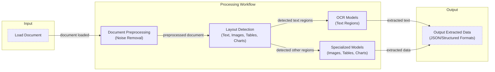
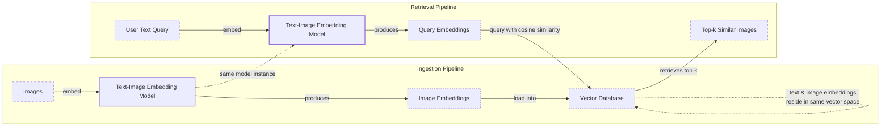
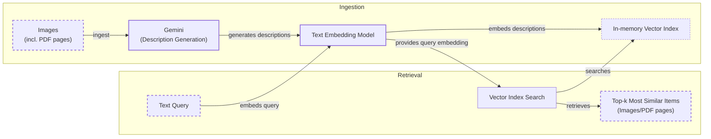
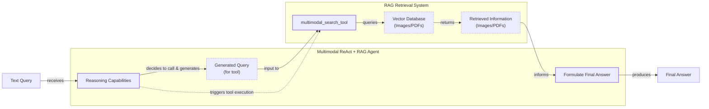

# Stop Converting Documents to Text. You're Doing It Wrong.

When I first started building AI agents, I hit a frustrating wall. I was comfortable manipulating text, but the moment I had to integrate multimodal data, such as images, audio, and especially documents like PDFs, my elegant architectures turned into messy hacks. I spent weeks building complex pipelines that tried to force everything into text. I chained Optical Character Recognition (OCR) engines to scrape PDFs, layout detection models to identify tables, and separate classifiers to handle images. It was a brittle, slow, and expensive solution that broke every time a document layout changed.

The breakthrough came when I realized I was solving the wrong problem. I did not need to convert documents to text. I needed to treat them as images. In our previous lessons, we covered context engineering, structured outputs, RAG, and the ReAct framework, building a solid foundation for agentic systems. Now, we will add the final piece: multimodality.

Real-world AI applications rarely exist in a text-only vacuum. Enterprise systems need to process private data from warehouses and data lakes that is inherently multimodal: financial reports with complex charts, technical diagrams with specific layouts, medical documents with X-rays, and building sketches with precise measurements. When you translate a complex diagram into text, you lose the spatial relationships, the colors, and the context that matters most. Modern LLMs can “see” just as well as they can read, and by processing data in its native format, we can build systems that are faster, cheaper, and more performant.

Here is what we will cover:

*   **Limitations of Traditional Document Processing:** Why OCR-based systems are fragile and inefficient for complex documents.
*   **Foundations of Multimodal LLMs:** An intuition on how models process visual and textual tokens together.
*   **Applying Multimodal LLMs:** How to work with images and PDFs using the Gemini API.
*   **Foundations of Multimodal RAG:** An introduction to modern architectures like ColPali that bypass OCR.
*   **Practical Implementation:** Step-by-step guides to building a multimodal RAG system and a ReAct agent.

## Limitations of traditional document processing

To understand why a multimodal-native approach is better, we first need to look at the limitations of traditional document processing. For years, the standard approach for handling documents like invoices, reports, or technical manuals was to normalize everything to text. This was a necessary evil because our AI models could only read. However, this process is riddled with flaws, especially when dealing with visually rich documents.

A typical workflow using layout detection and OCR involves multiple complex steps. First, the document is loaded and preprocessed to remove noise. Then, a layout detection model identifies different regions like text, tables, and charts. An OCR model processes the text regions, while other specialized models handle each non-text data structure. Finally, all the extracted data is structured into a format like JSON.



Image 1: A flowchart illustrating the traditional document processing workflow using Layout Detection and OCR.

This pipeline has too many moving pieces. It requires a layout detection model, an OCR model, and specialized models for every possible data structure. This makes the system rigid and fragile. If a document contains a chart type you do not have a model for, the pipeline fails. It is also slow and costly, as chaining multiple model calls increases latency and operational overhead.

The most significant issue is performance. The multi-step nature creates a cascade effect where errors compound at each stage. Even advanced OCR engines like Tesseract and PaddleOCR, which achieve 88–94% accuracy on simple layouts, struggle with complex documents [[51]](https://www.llamaindex.ai/blog/ocr-accuracy), [[2]](https://blog.roboflow.com/what-is-optical-character-recognition-ocr/). Accuracy drops by over 20% with poor scan quality (below 300 DPI), and a simple 5-degree tilt can increase word error rates by 15% [[51]](https://www.llamaindex.ai/blog/ocr-accuracy). For handwritten text, a character error rate of 3–5% is considered good, which is unacceptable for many applications [[51]](https://www.llamaindex.ai/blog/ocr-accuracy).

These systems fail spectacularly when faced with nested tables, complex multi-column layouts, building sketches, or medical images like X-rays [[4]](https://hackernoon.com/complex-document-recognition-ocr-doesnt-work-and-heres-how-you-fix-it), [[47]](https://learn.microsoft.com/en-us/answers/questions/5668164/why-traditional-ocr-fails-for-complex-business-doc?page=1). The spatial relationships and visual context are lost, leading to misinterpretations that make the extracted text useless.

https://substackcdn.com/image/fetch/f_auto,q_auto:good,fl_progressive:steep/https%3A%2F%2Fsubstack-post-media.s3.amazonaws.com%2Fpublic%2Fimages%2Fa2dc40f3-dc13-486e-853d-8404368f4d8d_1616x1000.png 
Image 2: A building sketch showing a crawl space vent diagram, illustrating the complexity of layouts that classic OCR systems struggle to interpret. (Source [Vectorize.io](https://vectorize.io/blog/multimodal-rag-patterns))

This approach might work for highly specialized, template-driven applications, but it does not scale in a world where AI agents need to be flexible and fast. Modern AI solutions bypass this entire fragile workflow by using multimodal LLMs that can directly interpret text, images, and PDFs as native inputs. Let's understand how they work.

## Foundations of multimodal LLMs

Before we write any code, you need an intuition for how multimodal LLMs work. You do not need to be an AI researcher, but understanding the architecture will help you use, deploy, and monitor these models effectively. This challenge is analogous to sensor fusion in robotics, where data from heterogeneous sensors like cameras, LiDAR, and inertial units are integrated into a unified representation to help the robot perceive and navigate its environment [[65]](https://www.emergentmind.com/topics/multimodal-sensor-fusion-strategy). Multimodal LLMs solve a similar problem for data, fusing different information streams into a coherent understanding. There are two common approaches to building them: the Unified Embedding Decoder Architecture and the Cross-modality Attention Architecture [[1]](https://magazine.sebastianraschka.com/p/understanding-multimodal-llms).

https://substackcdn.com/image/fetch/f_auto,q_auto:good,fl_progressive:steep/https%3A%2F%2Fsubstack-post-media.s3.amazonaws.com%2Fpublic%2Fimages%2F76f50b57-2585-4cb8-8dda-eea5b5f81c03_1456x854.jpeg 
Image 3: The two main approaches to developing multimodal LLM architectures. (Source [Understanding Multimodal LLMs [1]](https://magazine.sebastianraschka.com/p/understanding-multimodal-llms))

### Unified Embedding Decoder Architecture

In this approach, we encode text and images separately, concatenate their embeddings into a single sequence, and pass the result to the LLM [[1]](https://magazine.sebastianraschka.com/p/understanding-multimodal-llms). The core idea is to use a vision encoder to map the image into an embedding space that is shared with the text embeddings. When these are merged, the LLM can process both modalities seamlessly as if they were a single stream of information.

https://substackcdn.com/image/fetch/f_auto,q_auto:good,fl_progressive:steep/https%3A%2F%2Fsubstack-post-media.s3.amazonaws.com%2Fpublic%2Fimages%2Fa0979e82-2fb0-4f78-80c8-1395511e057f_1166x1400.jpeg 
Image 4: Illustration of the unified embedding decoder architecture. (Source [Understanding Multimodal LLMs [1]](https://magazine.sebastianraschka.com/p/understanding-multimodal-llms))

### Cross-modality Attention Architecture

The second approach injects image embeddings directly into the LLM's attention layers instead of at the input stage [[1]](https://magazine.sebastianraschka.com/p/understanding-multimodal-llms). An image encoder still projects the image into the same vector space as the text, but this information is introduced deeper within the model's architecture. This method is inspired by the original Transformer paper, where an encoder-decoder structure used cross-attention to translate between languages [[36]](https://magazine.sebastianraschka.com/p/understanding-multimodal-llms). Here, the image acts as the "foreign language" that the text decoder attends to.

https://substackcdn.com/image/fetch/f_auto,q_auto:good,fl_progressive:steep/https%3A%2F%2Fsubstack-post-media.s3.amazonaws.com%2Fpublic%2Fimages%2Fea1b9ee4-0d19-4c3c-89db-06e779653da2_1296x1338.jpeg 
Image 5: An illustration of the Cross-Modality Attention Architecture approach. (Source [Understanding Multimodal LLMs [1]](https://magazine.sebastianraschka.com/p/understanding-multimodal-llms))

### Image Encoders

Both architectures rely on image encoders, which function similarly to text tokenizers. Just as we split text into sub-word tokens, we split images into smaller patches [[1]](https://magazine.sebastianraschka.com/p/understanding-multimodal-llms). These patches are then processed to generate embeddings.

https://substackcdn.com/image/fetch/f_auto,q_auto:good,fl_progressive:steep/https%3A%2F%2Fsubstack-post-media.s3.amazonaws.com%2Fpublic%2Fimages%2F4a7104c0-3986-4aae-b918-06c393ff824c_1456x1154.jpeg 
Image 6: Image tokenization and embedding (left) and text tokenization and embedding (right) side by side. (Source [Understanding Multimodal LLMs [1]](https://magazine.sebastianraschka.com/p/understanding-multimodal-llms))

The output embeddings have the same dimensions as text embeddings, but they must be aligned in the same vector space. This is achieved through a linear projection module, which ensures that an image of a cat and the text "a cute cat" are located close to each other in the embedding space [[3]](https://towardsdatascience.com/multimodal-embeddings-an-introduction-5dc36975966f/). This "linear projection module" is typically a simple Multi-Layer Perceptron (MLP) that maps the vision encoder's outputs into the LLM's embedding space, a technique used in models like LLaVA [[61]](https://towardsai.net/p/l/enhancing-llm-capabilities-the-power-of-multimodal-llms-and-rag). This alignment is theoretically grounded in the idea that all modalities are different projections of the same underlying reality; they capture overlapping semantic information about the same world state [[62]](https://aclanthology.org/2025.findings-emnlp.90.pdf). This alignment is learned using a technique called contrastive learning, where the model is trained to maximize the similarity of correct image-text pairs and minimize the similarity of incorrect pairs [[56]](https://opensearch.org/blog/multimodal-semantic-search/), [[19]](https://www.pinecone.io/learn/series/image-search/clip/).

Popular image encoders like CLIP, OpenCLIP, and SigLIP are built on this principle [[3]](https://towardsdatascience.com/multimodal-embeddings-an-introduction-5dc36975966f/). These same encoders are also fundamental to multimodal RAG, as they allow us to perform semantic similarity searches across different data types. You can use a text query to find a relevant image, or an image to find a relevant document, because they all exist in the same shared vector space.

https://substackcdn.com/image/fetch/f_auto,q_auto:good,fl_progressive:steep/https%3A%2F%2Fsubstack-post-media.s3.amazonaws.com%2Fpublic%2Fimages%2F3d4c837a-a3e5-4d60-97ce-c4d4faf4cf57_841x616.png 
Image 7: Toy representation of multimodal embedding space. (Source [Multimodal Embeddings: An Introduction [3]](https://towardsdatascience.com/multimodal-embeddings-an-introduction-5dc36975966f/))

### Trade-offs and Modern Landscape

Each architecture has its trade-offs. The **Unified Embedding Decoder** is simpler to implement and often yields higher accuracy on OCR-related tasks [[37]](https://arxiv.org/abs/2409.11402). The **Cross-modality Attention** approach is more computationally efficient for high-resolution images because it avoids lengthening the input sequence with image tokens [[37]](https://arxiv.org/abs/2409.11402). Hybrid approaches, like NVIDIA's NVLM-H, exist to combine these benefits, using a low-resolution thumbnail as an input token and high-resolution patches via cross-attention [[36]](https://magazine.sebastianraschka.com/p/understanding-multimodal-llms), [[37]](https://arxiv.org/abs/2409.11402).

By 2025, most leading LLMs are multimodal. Open-source models like Llama 4, Gemma 2, Qwen3, and DeepSeek R1/V3 have demonstrated strong multimodal reasoning capabilities, with some even featuring multi-million token context windows [[22]](https://medium.com/data-science-in-your-pocket/2025-the-year-ai-reasoning-models-took-over-a-month-by-month-review-of-frontier-breakthroughs-6ea2163f854f). In the closed-source world, models like GPT-5, Gemini 2.5, and Claude 4 continue to push the boundaries of native image, audio, and video understanding [[23]](https://codedesign.ai/blog/the-ultimate-guide-to-the-top-large-language-models-in-2025/). This architecture can be extended to other modalities like audio or video by integrating specialized encoders for each data type, such as Video Transformers or models like Whisper for audio [[27]](https://sparkco.ai/blog/exploring-multimodal-llms-text-image-and-video-integration), [[29]](https://towardsai.net/p/l/enhancing-llm-capabilities-the-power-of-multimodal-llms-and-rag). This is already being applied in real-time video surveillance, where lightweight models like CLIP are used to analyze video frames, enabling efficient natural language querying of events and objects within the video feed [[64]](https://cs231n.stanford.edu/2024/papers/leveraging-lightweight-ai-for-video-querying-in-a-rag-framework.pdf).

It is also important to distinguish multimodal LLMs from diffusion models like Midjourney or Stable Diffusion. While both can work with images, they are architecturally different. Diffusion models are specialized for generating images from noise based on a text prompt [[21]](https://magazine.sebastianraschka.com/p/understanding-multimodal-llms). Multimodal LLMs are designed for understanding and reasoning about various inputs. In an agentic workflow, a diffusion model would typically be used as a tool invoked by the agent, not as the core reasoning engine [[19]](https://arxiv.org/html/2409.14993v3). Similarly, multimodal AI is transforming creative industries like film production by automating labor-intensive VFX tasks such as rotoscoping (isolating objects from their background) and generating lifelike CGI characters, freeing artists to focus on more creative work [[68]](https://mshiqi.myblog.arts.ac.uk/files/2023/11/Shiqi-Ma_Thesis-.pdf).

Now that we have an intuition for how LLMs can directly process images and documents, let’s see how this works in practice.

## Applying multimodal LLMs to images and PDFs

To see how multimodal LLMs work in practice, let's walk through some examples using the Gemini API. There are three main ways to provide multimodal data to an LLM: as raw bytes, as a Base64-encoded string, or via a URL.

*   **Raw bytes:** This is the simplest method and works well for one-off API calls. However, storing raw bytes directly in most databases is risky, as they are often misinterpreted as text strings, leading to data corruption.
*   **Base64:** This method encodes binary data as a string, making it safe to store in databases like PostgreSQL or MongoDB. The main downside is a size increase of about 33%, which can impact storage costs and performance [[52]](https://www.decodingai.com/p/stop-converting-documents-to-text).
*   **URLs:** This is the standard for enterprise applications. Data is stored in a data lake like AWS S3 or Google Cloud Storage, and the LLM accesses it directly via a URL. This approach reduces network latency for your application and is the most efficient option for scalable systems, especially when dealing with private data where security mechanisms like signed URLs are necessary.

Now, let's explore these methods with code.

### Setup

First, we set up our environment by installing the necessary packages and initializing the Gemini client. We will use the `gemini-2.5-flash` model, which is fast and cost-effective for these examples.

1.  We begin by importing the required packages and loading our `GOOGLE_API_KEY` from the environment.
    ```python
    import base64
    import io
    from pathlib import Path
    from typing import Literal
    
    from google import genai
    from google.genai import types
    from IPython.display import Image as IPythonImage
    from PIL import Image as PILImage
    
    from lessons.utils import env, pretty_print
    
    env.load(required_env_vars=["GOOGLE_API_KEY"])
    ```
    It outputs:
    ```text
       Trying to load environment variables from /Users/pauliusztin/Documents/01_projects/TAI/course-ai-agents/.env
    
       Environment variables loaded successfully.
    ```

2.  Next, we initialize the Gemini client and define our model ID.
    ```python
    client = genai.Client()
    MODEL_ID = "gemini-2.5-flash"
    ```

3.  Let's look at our test image.
    ```python
    def display_image(image_path: Path) -> None:
        """
        Display an image from a file path in the notebook.
    
        Args:
            image_path: Path to the image file to display
    
        Returns:
            None
        """
    
        image = IPythonImage(filename=image_path, width=400)
        display(image)
    
    
    display_image(Path("images") / "image_1.jpeg")
    ```
    It outputs:
    
    https://github.com/user-attachments/assets/1039867c-17b5-4b35-8664-538d35677b1e
    

### Processing Images

1.  We start by processing an image as **raw bytes**. We define a helper function to load the image, resize it, and convert it to bytes in an efficient format like `WEBP`.
    ```python
    def load_image_as_bytes(
        image_path: Path, format: Literal["WEBP", "JPEG", "PNG"] = "WEBP", max_width: int = 600, return_size: bool = False
    ) -> bytes | tuple[bytes, tuple[int, int]]:
        """
        Load an image from file path and convert it to bytes with optional resizing.
    
        Args:
            image_path: Path to the image file to load
            format: Output image format (WEBP, JPEG, or PNG). Defaults to "WEBP"
            max_width: Maximum width for resizing. If image width exceeds this, it will be resized proportionally. Defaults to 600
            return_size: If True, returns both bytes and image size tuple. Defaults to False
    
        Returns:
            bytes: Image data as bytes, or tuple of (bytes, (width, height)) if return_size is True
        """
    
        image = PILImage.open(image_path)
        if image.width > max_width:
            ratio = max_width / image.width
            new_size = (max_width, int(image.height * ratio))
            image = image.resize(new_size)
    
        byte_stream = io.BytesIO()
        image.save(byte_stream, format=format)
    
        if return_size:
            return byte_stream.getvalue(), image.size
    
        return byte_stream.getvalue()
    ```

2.  We load the image as bytes and generate a caption.
    ```python
    image_bytes = load_image_as_bytes(image_path=Path("images") / "image_1.jpeg", format="WEBP")
    
    response = client.models.generate_content(
        model=MODEL_ID,
        contents=[
            types.Part.from_bytes(
                data=image_bytes,
                mime_type="image/webp",
            ),
            "Tell me what is in this image in one paragraph.",
        ],
    )
    pretty_print.wrapped(response.text, title="Image 1 Caption")
    ```
    It outputs:
    ```text
       [93m----------------------------------------- Image 1 Caption ----------------------------------------- [0m
    
         This striking image features a massive, dark metallic robot, its powerful form detailed with intricate circuit patterns on its head and piercing red glowing eyes. Perched playfully on its right arm is a small, fluffy grey tabby kitten, its front paw raised as if exploring or batting at the robot's armored limb, while its gaze is directed slightly off-frame. The robot's large, segmented hand is visible beneath the kitten. The background suggests an industrial or workshop environment, with hints of metal structures and natural light filtering in from an unseen window, creating a dramatic contrast between the soft, vulnerable kitten and the formidable, mechanical sentinel.
    
       [93m---------------------------------------------------------------------------------------------------- [0m
    ```

3.  Next, we process the image as a **Base64 encoded string**. The logic is similar, but we encode the bytes first.
    ```python
    from typing import cast
    
    def load_image_as_base64(
        image_path: Path, format: Literal["WEBP", "JPEG", "PNG"] = "WEBP", max_width: int = 600, return_size: bool = False
    ) -> str:
        image_bytes = load_image_as_bytes(image_path=image_path, format=format, max_width=max_width, return_size=False)
        return base64.b64encode(cast(bytes, image_bytes)).decode("utf-8")
    
    image_base64 = load_image_as_base64(image_path=Path("images") / "image_1.jpeg", format="WEBP")
    print(f"Image as Base64 is {(len(image_base64) - len(image_bytes)) / len(image_bytes) * 100:.2f}% larger than as bytes")
    ```
    It outputs:
    ```text
    Image as Base64 is 33.34% larger than as bytes
    ```

4.  For **public URLs**, Gemini's `url_context` tool can parse web pages, PDFs, and images directly. You provide the URL in the prompt and configure the tool.
    ```python
    response = client.models.generate_content(
        model=MODEL_ID,
        contents="Based on the provided paper as a PDF, tell me how ReAct works: https://arxiv.org/pdf/2210.03629",
        config=types.GenerateContentConfig(tools=[{"url_context": {}}]),
    )
    pretty_print.wrapped(response.text, title="How ReAct works")
    ```
    It outputs:
    ```text
       [93m----------------------------------------- How ReAct works ----------------------------------------- [0m
    
         ReAct is a novel paradigm for large language models (LLMs) that combines reasoning (Thought) and acting (Action) in an interleaved manner to solve diverse language and decision-making tasks. This approach allows the model to:
    
         *   **Reason to Act:** Generate verbal reasoning traces to induce, track, and update action plans, and handle exceptions.
         *   **Act to Reason:** Interface with and gather additional information from external sources (like knowledge bases or environments) to incorporate into its reasoning.
    
       [93m---------------------------------------------------------------------------------------------------- [0m
    ```

5.  For **private data lakes**, we can pass a URL from a provider like Google Cloud Storage. The LLM must have the necessary permissions to access the bucket.
    ```python
    # Mocked example
    response = client.models.generate_content(
        model=MODEL_ID,
        contents=[
            types.Part.from_uri(uri="gs://gemini-images/image_1.jpeg", mime_type="image/webp"),
            "Tell me what is in this image in one paragraph.",
        ],
    )
    ```

### Object Detection

A more advanced task is object detection. We can use Pydantic, which we covered in Lesson 4, to define the structured output we expect from the model.

1.  First, we define our Pydantic models for the bounding box and detections.
    ```python
    from pydantic import BaseModel, Field
    
    class BoundingBox(BaseModel):
        ymin: float
        xmin: float
        ymax: float
        xmax: float
        label: str = Field(
            default="The category of the object found within the bounding box. For example: cat, dog, diagram, robot."
        )
    
    class Detections(BaseModel):
        bounding_boxes: list[BoundingBox]
    ```

2.  We create a prompt and load the image.
    ```python
    prompt = """
    Detect all of the prominent items in the image. 
    The box_2d should be [ymin, xmin, ymax, xmax] normalized to 0-1000.
    Also, output the label of the object found within the bounding box.
    """
    
    image_bytes, image_size = load_image_as_bytes(
        image_path=Path("images") / "image_1.jpeg", format="WEBP", return_size=True
    )
    ```

3.  We call the model with a configuration that specifies the JSON response format and schema.
    ```python
    config = types.GenerateContentConfig(
        response_mime_type="application/json",
        response_schema=Detections,
    )
    
    response = client.models.generate_content(
        model=MODEL_ID,
        contents=[
            types.Part.from_bytes(
                data=image_bytes,
                mime_type="image/webp",
            ),
            prompt,
        ],
        config=config,
    )
    
    detections = cast(Detections, response.parsed)
    pretty_print.wrapped([f"Image size: {image_size}", *detections.bounding_boxes], title="Detections")
    ```
    It outputs:
    ```text
       [93m-------------------------------------------- Detections -------------------------------------------- [0m
    
         Image size: (600, 600)
    
       [93m---------------------------------------------------------------------------------------------------- [0m
    
         ymin=1.0 xmin=450.0 ymax=997.0 xmax=1000.0 label='robot'
    
       [93m---------------------------------------------------------------------------------------------------- [0m
    
         ymin=269.0 xmin=39.0 ymax=782.0 xmax=530.0 label='kitten'
    
       [93m---------------------------------------------------------------------------------------------------- [0m
    ```

4.  Finally, we can visualize the detected bounding boxes on the image.
    
    https://github.com/user-attachments/assets/186a877e-07a9-4673-bc59-7105ca2372e9
    

### Working with PDFs

Since we are using a multimodal model, processing PDFs is nearly identical to processing images. We can load the PDF as bytes and pass it directly to the model.

1.  Let's use the famous "Attention Is All You Need" paper as an example.
    ```python
    pdf_bytes = (Path("pdfs") / "attention_is_all_you_need_paper.pdf").read_bytes()
    
    response = client.models.generate_content(
        model=MODEL_ID,
        contents=[
            types.Part.from_bytes(data=pdf_bytes, mime_type="application/pdf"),
            "What is this document about? Provide a brief summary of the main topics.",
        ],
    )
    pretty_print.wrapped(response.text, title="PDF Summary (as bytes)")
    ```
    It outputs:
    ```text
       [93m-------------------------------------- PDF Summary (as bytes) -------------------------------------- [0m
    
         This document introduces the **Transformer**, a novel neural network architecture designed for **sequence transduction tasks** (like machine translation).
    
         Its main topics include:
    
         1.  **Dispensing with Recurrence and Convolutions**: Unlike previous dominant models (RNNs and CNNs), the Transformer relies *solely* on **attention mechanisms**, eliminating the need for sequential computation.
         2.  **Attention Mechanisms**: It details the **Scaled Dot-Product Attention** and **Multi-Head Attention** as its core building blocks, explaining how they allow the model to weigh different parts of the input sequence.
    
       [93m---------------------------------------------------------------------------------------------------- [0m
    ```

2.  To handle complex layouts like diagrams or tables, we can treat each PDF page as an image. This allows us to perform tasks like object detection to extract specific visual elements.
    ```python
    prompt = """
    Detect all the diagrams from the provided image as 2d bounding boxes. 
    The box_2d should be [ymin, xmin, ymax, xmax] normalized to 0-1000.
    Also, output the label of the object found within the bounding box.
    """
    
    image_bytes, image_size = load_image_as_bytes(
        image_path=Path("images") / "attention_is_all_you_need_1.jpeg", format="WEBP", return_size=True
    )
    
    #... call the LLM as before ...
    ```
    
    https://github.com/user-attachments/assets/7b322a36-3914-4c81-831d-b65f7c35272a
    
    This approach, popularized by the ColPali paper, has shown that Vision Language Models (VLMs) can retrieve and understand documents more effectively by "looking" at them rather than just parsing extracted text [[5]](https://arxiv.org/pdf/2407.01449v6).

## Foundations of multimodal RAG

One of the most common use cases for multimodal data is RAG, a topic we explored in Lesson 10. Instead of stuffing entire documents into an LLM's context window, which is inefficient and degrades performance, RAG allows us to retrieve only the most relevant information.

A generic multimodal RAG architecture for text and images works in two phases. During ingestion, images are embedded using a text-image embedding model and stored in a vector database. During retrieval, a user's text query is embedded using the same model, and a similarity search is performed against the image embeddings in the database to find the top-k most relevant images. Because the text and image embeddings reside in the same vector space, you can search across modalities, for example, using text to find images [[56]](https://opensearch.org/blog/multimodal-semantic-search/).



Image 8: A Mermaid diagram illustrating a generic multimodal RAG architecture with ingestion and retrieval pipelines.

For enterprise document RAG, the state-of-the-art architecture is ColPali [[5]](https://arxiv.org/pdf/2407.01449v6). It bypasses the entire OCR pipeline by processing document pages directly as images. Instead of creating a single embedding vector for a whole document, ColPali divides the document image into patches and generates a "bag-of-embeddings," a multi-vector representation that captures fine-grained details [[5]](https://arxiv.org/pdf/2407.01449v6). During retrieval, it uses a late interaction mechanism where every token in the query interacts with all document patch embeddings. This preserves granular semantic details and significantly improves retrieval accuracy for visually complex documents [[67]](https://learnopencv.com/multimodal-rag-with-colpali/).

This approach is also fast; offline indexing with ColPali takes around 0.37 seconds per page, compared to over 7 seconds for a typical OCR-based pipeline [[67]](https://learnopencv.com/multimodal-rag-with-colpali/). On the ViDoRe benchmark, ColPali achieves an average nDCG@5 score of 81.3%, outperforming traditional OCR-based systems while being up to 10 times faster [[5]](https://arxiv.org/pdf/2407.01449v6). It excels at handling financial reports and technical documentation where charts, tables, and diagrams are critical.

However, the approach has limitations. It retrieves entire pages rather than specific chunks, which can be inefficient if the relevant information is small. Furthermore, native support for ColBERT-style multi-vector embeddings is not yet common in all vector databases, which can add complexity to a production deployment [[67]](https://learnopencv.com/multimodal-rag-with-colpali/).

Enough theory. Let's build a simple multimodal RAG system from scratch.

## Implementing multimodal RAG for images, PDFs and text

Let's build a mini-project to combine what we have learned. We will create a simple multimodal RAG system that indexes images and PDF pages into an in-memory vector index and allows us to search them using text queries. To keep it simple, we will not implement image patching or a ColBERT reranker. Our goal is to build an intuition for how these systems work.



Image 9: A Mermaid diagram illustrating the simplified multimodal RAG example.

Since the Gemini API we are using does not support generating image embeddings directly, we will use a workaround. We will generate a text description for each image and then embed that description using a text embedding model. This is not ideal, but it allows us to demonstrate the RAG workflow. With a true multimodal embedding model like Voyage AI or Jina CLIP v2, you would simply embed the image bytes directly [[31]](https://milvus.io/blog/choose-embedding-model-rag-2026.md).

1.  First, let's look at the images we will index.
    
    https://github.com/user-attachments/assets/10756782-b36e-44c1-8408-c81216d25227
    

2.  We define a function to create our vector index. It generates a description for each image, embeds the description, and stores everything in a list.
    ```python
    def create_vector_index(image_paths: list[Path]) -> list[dict]:
        """
        Create embeddings for images by generating descriptions and embedding them.
        """
        vector_index = []
        for image_path in image_paths:
            image_bytes = cast(bytes, load_image_as_bytes(image_path, format="WEBP", return_size=False))
            image_description = generate_image_description(image_bytes)
            image_embedding = embed_text_with_gemini(image_description)
    
            vector_index.append(
                {
                    "content": image_bytes,
                    "type": "image",
                    "filename": image_path,
                    "description": image_description,
                    "embedding": image_embedding,
                }
            )
        return vector_index
    ```

3.  We also need functions to generate image descriptions and text embeddings.
    ```python
    def generate_image_description(image_bytes: bytes) -> str:
        # ... implementation using Gemini ...
        prompt = """
        Describe this image in detail for semantic search purposes. 
        Include objects, scenery, colors, composition, text, and any other visual elements that would help someone find 
        this image through text queries.
        """
        response = client.models.generate_content(model=MODEL_ID, contents=[prompt, PILImage.open(io.BytesIO(image_bytes))])
        return response.text.strip()
    
    def embed_text_with_gemini(content: str) -> np.ndarray | None:
        # ... implementation using gemini-embedding-001 ...
        result = client.models.embed_content(model="gemini-embedding-001", contents=[content])
        return np.array(result.embeddings[0].values)
    ```

4.  Now, we create the vector index.
    ```python
    image_paths = list(Path("images").glob("*.jpeg"))
    vector_index = create_vector_index(image_paths)
    ```

5.  Finally, we define a search function that embeds a text query and finds the most similar items in our index using cosine similarity.
    ```python
    from sklearn.metrics.pairwise import cosine_similarity
    
    def search_multimodal(query_text: str, vector_index: list[dict], top_k: int = 3) -> list[Any]:
        # ... implementation ...
        query_embedding = embed_text_with_gemini(query_text)
        embeddings = [doc["embedding"] for doc in vector_index]
        similarities = cosine_similarity([query_embedding], embeddings).flatten()
        top_indices = np.argsort(similarities)[::-1][:top_k]
        # ... return results ...
    ```

6.  Let's test it with a query about the Transformer architecture.
    ```python
    query = "what is the architecture of the transformer neural network?"
    results = search_multimodal(query, vector_index, top_k=1)
    ```
    The system correctly retrieves the page from the "Attention Is All You Need" paper showing the model architecture, with a similarity score of 0.744.
    
    https://github.com/user-attachments/assets/69829aa7-bf24-4f24-9b2f-2d18442a8a81
    

7.  Let's try another query: "a kitten with a robot".
    ```python
    query = "a kitten with a robot"
    results = search_multimodal(query, vector_index, top_k=1)
    ```
    It successfully finds the image of the kitten and the robot with a similarity of 0.811.
    
    https://github.com/user-attachments/assets/e1672322-a9b0-4628-98e6-e3d81b95b871
    

## Building multimodal AI agents

To take this a step further, we can integrate our multimodal RAG function into a ReAct agent, consolidating many of the skills we have learned so far. An agent can leverage multimodal capabilities by processing multimodal inputs, using multimodal retrieval tools, or interacting with external resources like screenshots or company documents.

We will build a simple ReAct agent using LangGraph that uses our `search_multimodal` function as a tool. The agent will be able to answer questions by searching our image index.



Image 10: A Mermaid diagram illustrating the multimodal ReAct + RAG agent example.

1.  First, we define a tool that wraps our `search_multimodal` function.
    ```python
    from langchain_core.tools import tool
    
    @tool
    def multimodal_search_tool(query: str) -> dict[str, Any]:
        """
        Search through a collection of images and their text descriptions to find relevant content.
        """
        results = search_multimodal(query, vector_index, top_k=1)
        if not results:
            return {"role": "tool_result", "content": "No relevant content found."}
        
        result = results[0]
        content = [
            {"type": "text", "text": f"Image description: {result['description']}"},
            types.Part.from_bytes(data=result["content"], mime_type="image/jpeg"),
        ]
        return {"role": "tool_result", "content": content}
    ```

2.  Next, we create the ReAct agent using LangGraph's `create_react_agent` helper. We provide it with a system prompt instructing it on how to use the search tool.
    ```python
    from langchain_google_genai import ChatGoogleGenerativeAI
    from langgraph.prebuilt import create_react_agent
    
    def build_react_agent() -> Any:
        tools = [multimodal_search_tool]
        system_prompt = """You are a helpful AI assistant that can search through images and text to answer questions..."""
        agent = create_react_agent(
            model=ChatGoogleGenerativeAI(model="gemini-2.5-pro", temperature=0.1),
            tools=tools,
            prompt=system_prompt,
        )
        return agent
    
    react_agent = build_react_agent()
    ```

3.  Now, let's ask the agent a question: "what color is my kitten?"
    ```python
    test_question = "what color is my kitten?"
    response = react_agent.invoke(input={"messages": test_question})
    ```
    The agent correctly reasons that it needs to search for "my kitten," calls the `multimodal_search_tool`, retrieves the image of the kitten and robot, and then answers the question based on the visual information.
    
    It outputs:
    ```text
    Based on the image, your kitten is a gray tabby. It has soft, short gray fur with darker tabby stripe patterns.
    ```

While this example ran smoothly, production agents face numerous failure modes. A common issue with the ReAct framework is tool hallucination. The agent might generate a call to a non-existent tool, and each of these failed attempts can consume a slot from a fixed retry budget. If several hallucinations occur, the agent may exhaust its retries, causing it to fail on a subsequent, genuine transient error like a network timeout [[63]](https://towardsdatascience.com/your-react-agent-is-wasting-90-of-its-retries-heres-how-to-stop-it/). Building robust agents requires handling these edge cases.

## Conclusion

Working with multimodal data is a fundamental skill for AI engineers. Modern AI applications rarely exist in a text-only vacuum; they must interact with the complex, visual, and auditory reality of the world. In this lesson, we moved away from unstable, multi-step OCR pipelines and learned that modern LLMs can natively process images and documents, preserving rich context that was previously lost. These skills are foundational for emerging applications like context-aware assistants in augmented reality [[66]](https://arxiv.org/html/2504.13209v1). We explored how to handle data as bytes, Base64, and URLs, and how to build agents that can reason across these modalities.

This concludes the first part of our course, *AI Agents Foundations*. We started by understanding the difference between workflows and agents, mastered context engineering and structured outputs, built robust planning capabilities with ReAct, and finally, gave our agents eyes and ears. In Part 2, we will move from theory to practice and begin building our central course project: an interconnected research and writing agent system using LangGraph.

## References

- [1] Raschka, S. (2024, October 21). Understanding multimodal LLMS. *Sebastian Raschka*. https://magazine.sebastianraschka.com/p/understanding-multimodal-llms
- [2] What Is Optical Character Recognition (OCR)?. (2023, November 21). *Roboflow Blog*. https://blog.roboflow.com/what-is-optical-character-recognition-ocr/
- [3] Talebi, S. (2024, November 13). Multimodal embeddings: An introduction. *Medium*. https://towardsdatascience.com/multimodal-embeddings-an-introduction-5dc36975966f/
- [4] Kokorin, O. (2023, October 12). Complex Document Recognition: OCR Doesn’t Work and Here’s How You Fix It. *HackerNoon*. https://hackernoon.com/complex-document-recognition-ocr-doesnt-work-and-heres-how-you-fix-it
- [5] Fostiropoulos, I., et al. (2024). ColPali: Efficient Document Retrieval with Vision Language Models. *arXiv*. https://arxiv.org/pdf/2407.01449v6
- [6] Chatgpt for financial analysis. (n.d.). *Konfuzio*. https://konfuzio.com/en/chatgpt-financial-analysis/
- [7] Medical Imaging White Paper NVIDIA and Lenovo. (n.d.). *Lenovo*. https://techtoday.lenovo.com/sites/default/files/2025-05/Medical%20Imaging%20White%20Paper%20NVIDIA%20and%20Lenovo.pdf
- [8] Summarizing and Understanding Tabular Data in Financial Reports. (n.d.). *International Joint Conferences on Artificial Intelligence*. https://www.ijcai.org/proceedings/2023/0581.pdf
- [9] The Irreplaceable Human Element in Financial Services AI. (n.d.). *arXiv*. https://arxiv.org/html/2503.22035v1
- [10] 10 real-world examples of AI in healthcare that will make you feel better about the future. (2022, November 24). *Philips*. https://www.philips.com/a-w/about/news/archive/features/2022/20221124-10-real-world-examples-of-ai-in-healthcare.html
- [11] How to use an LLM to create data schemas in BigQuery. (n.d.). *Google Cloud Blog*. https://cloud.google.com/blog/products/data-analytics/how-to-use-an-llm-to-create-data-schemas-in-bigquery
- [12] Integrating Multimodal Data into a Large Language Model. (n.d.). *Medium*. https://towardsdatascience.com/integrating-multimodal-data-into-a-large-language-model-d1965b8ab00c/
- [13] A Survey of Data Management in Multimodal Large Language Models. (n.d.). *arXiv*. https://arxiv.org/html/2505.18458v1
- [15] Arctic Agentic RAG Series: Multimodal PDF Retrieval with Snowflake Cortex. (n.d.). *Snowflake*. https://www.snowflake.com/en/engineering-blog/arctic-agentic-rag-multimodal-pdf-retrieval/
- [16] Multimodal RAG. (n.d.). *Pathway*. https://pathway.com/developers/templates/rag/multimodal-rag
- [18] Multimodal RAG Explained: From Text to Images and Beyond. (n.d.). *USAII*. https://www.usaii.org/ai-insights/multimodal-rag-explained-from-text-to-images-and-beyond
- [19] Multi-modal Understanding and Generation: A Survey on Connector-based Joint Models. (n.d.). *arXiv*. https://arxiv.org/html/2409.14993v3
- [20] LLMs. (n.d.). *Anyscale*. https://docs.anyscale.com/llm
- [21] Understanding Multimodal LLMs. (n.d.). *Sebastian Raschka's Magazine*. https://magazine.sebastianraschka.com/p/understanding-multimodal-llms
- [22] 2025: The Year AI Reasoning Models Took Over — A Month-by-Month Review of Frontier Breakthroughs. (2025, December 31). *Medium*. https://medium.com/data-science-in-your-pocket/2025-the-year-ai-reasoning-models-took-over-a-month-by-month-review-of-frontier-breakthroughs-6ea2163f854f
- [23] The Ultimate Guide to the Top Large Language Models in 2025. (n.d.). *CodeDesign.ai*. https://codedesign.ai/blog/the-ultimate-guide-to-the-top-large-language-models-in-2025/
- [25] A Comparative Analysis of Advanced Coding Language Models. (n.d.). *Preprints.org*. https://www.preprints.org/manuscript/202508.1904
- [26] Ultimate 2025 AI Language Models Comparison: GPT5, GPT-4, Claude, Gemini, Sonar & more. (n.d.). *Promptitude*. https://www.promptitude.io/post/ultimate-2025-ai-language-models-comparison-gpt5-gpt-4-claude-gemini-sonar-more
- [27] Exploring Multimodal LLMs: Text, Image, and Video Integration. (n.d.). *SparkCognition*. https://sparkco.ai/blog/exploring-multimodal-llms-text-image-and-video-integration
- [29] Enhancing LLM Capabilities: The Power of Multimodal LLMs and RAG. (n.d.). *Towards AI*. https://towardsai.net/p/l/enhancing-llm-capabilities-the-power-of-multimodal-llms-and-rag
- [30] A Comprehensive Review of Multimodal Large Language Models: Architectures, Applications, and Challenges. (n.d.). *arXiv*. https://arxiv.org/html/2411.06284v3
- [31] How to Choose the Best Embedding Model for RAG in 2026: 10 Models Benchmarked. (2026, March 25). *Milvus*. https://milvus.io/blog/choose-embedding-model-rag-2026.md
- [34] The best multimodal embedding model for RAG on visually-rich documents. (n.d.). *EagerWorks*. https://eagerworks.com/blog/best-embedding-model-for-rag
- [35] Top Embedding Models in 2025. (n.d.). *ArtSmart.ai*. https://artsmart.ai/blog/top-embedding-models-in-2025/
- [36] Understanding Multimodal LLMs. (n.d.). *Sebastian Raschka's Magazine*. https://magazine.sebastianraschka.com/p/understanding-multimodal-llms
- [37] NVLM: Open Frontier-Class Multimodal LLMs. (n.d.). *arXiv*. https://arxiv.org/abs/2409.11402
- [40] Real-World Multimodal AI Use Cases. (2026, March 3). *Rasa*. https://rasa.com/blog/multimodal-ai-use-cases
- [41] A Comprehensive Survey and Guide to Multimodal Large Language Models in Vision-Language Tasks. (n.d.). *GitHub*. https://github.com/cognitivetech/llm-research-summaries/blob/main/models-review/A-Comprehensive-Survey-and-Guide-to-Multimodal-Large-Language-Models-in-Vision-Language-Tasks.md
- [43] What is a multimodal LLM?. (n.d.). *IBM*. https://www.ibm.com/think/topics/multimodal-llm
- [44] Multimodal large language models in radiology: a review. (n.d.). *PMC*. https://pmc.ncbi.nlm.nih.gov/articles/PMC12479233/
- [45] The rise of vision language models in healthcare. (n.d.). *Nature*. https://www.nature.com/articles/s41598-025-98483-1
- [47] Why Traditional OCR fails for Complex Business Documents. (n.d.). *Microsoft Learn*. https://learn.microsoft.com/en-us/answers/questions/5668164/why-traditional-ocr-fails-for-complex-business-doc?page=1
- [49] OCR for Tables. (n.d.). *LlamaIndex*. https://www.llamaindex.ai/blog/ocr-for-tables
- [51] OCR Accuracy Explained: How to Improve It. (n.d.). *LlamaIndex*. https://www.llamaindex.ai/blog/ocr-accuracy
- [52] Stop Converting Documents to Text. You're Doing It Wrong. (2025, December 9). *decodingai.com*. https://www.decodingai.com/p/stop-converting-documents-to-text
- [53] LLM Output Parsing and Structured Generation. (n.d.). *Tetrate*. https://tetrate.io/learn/ai/llm-output-parsing-structured-generation
- [54] Structured Outputs with Multimodal Gemini. (2024, October 23). *Instructor*. https://python.useinstructor.com/blog/2024/10/23/structured-outputs-with-multimodal-gemini/
- [55] Steering Large Language Models with Pydantic. (n.d.). *Pydantic*. https://pydantic.dev/articles/llm-intro
- [56] Multimodal semantic search in OpenSearch. (n.d.). *OpenSearch*. https://opensearch.org/blog/multimodal-semantic-search/
- [57] Multimodal AI Search for Business Applications. (n.d.). *Medium*. https://towardsdatascience.com/multimodal-ai-search-for-business-applications-65356d011009/
- [58] Joint Visual-Textual Embedding for Multimodal Style Search. (n.d.). *Amazon Science*. https://assets.amazon.science/89/bf/661d950d4059930c8f1d2e449ac6/joint-visual-textual-embedding-for-multimodal-style-search.pdf
- [59] Combine Image and Text: How Multimodal Retrieval Transforms Search. (n.d.). *Zilliz*. https://zilliz.com/blog/combine-image-and-text-how-multimodal-retrieval-transforms-search
- [60] Multimodal Sentence-Transformers. (n.d.). *Hugging Face*. https://huggingface.co/blog/multimodal-sentence-transformers
- [61] Enhancing LLM Capabilities: The Power of Multimodal LLMs and RAG. (n.d.). *Towards AI*. https://towardsai.net/p/l/enhancing-llm-capabilities-the-power-of-multimodal-llms-and-rag
- [62] A Theoretical Perspective on Alignment in Vision-Language Models. (n.d.). *ACL Anthology*. https://aclanthology.org/2025.findings-emnlp.90.pdf
- [63] Your ReAct Agent is Wasting 90% of its Retries. Here's How to Stop It. (n.d.). *Towards Data Science*. https://towardsdatascience.com/your-react-agent-is-wasting-90-of-its-retries-heres-how-to-stop-it/
- [64] Leveraging Lightweight AI for Video Querying in a RAG Framework. (n.d.). *Stanford University*. https://cs231n.stanford.edu/2024/papers/leveraging-lightweight-ai-for-video-querying-in-a-rag-framework.pdf
- [65] Multimodal Sensor Fusion Strategy. (n.d.). *EmergentMind*. https://www.emergentmind.com/topics/multimodal-sensor-fusion-strategy
- [66] Socially-Aware Egocentric Interaction. (n.d.). *arXiv*. https://arxiv.org/html/2504.13209v1
- [67] ColPali: Enhancing Financial Report Analysis with Multimodal RAG and Gemini. (n.d.). *LearnOpenCV*. https://learnopencv.com/multimodal-rag-with-colpali/
- [68] The impact of artificial intelligence technology on visual effects. (n.d.). *UAL*. https://mshiqi.myblog.arts.ac.uk/files/2023/11/Shiqi-Ma_Thesis-.pdf