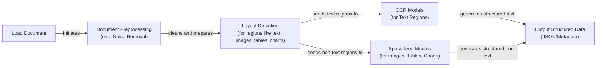
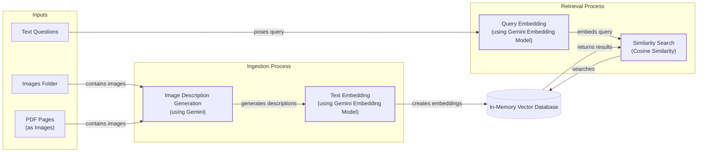
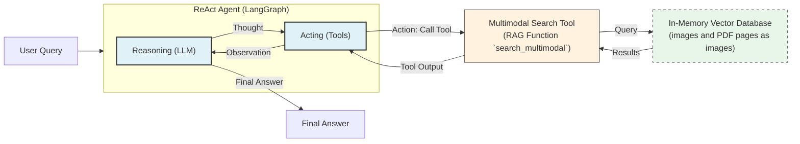

# Stop Converting Documents to Text. You're Doing It Wrong.

When we first started building AI agents, we hit a frustrating wall. We were comfortable manipulating text, but the moment we had to integrate multimodal data, such as images, audio, and especially documents like PDFs, our elegant architectures turned into messy hacks. We spent weeks building complex pipelines that tried to force everything into text. We chained OCR engines to scrape PDFs, layout detection models to identify tables, and separate classifiers to handle images. It was a brittle, slow, and expensive solution that broke every time a document layout changed.

The breakthrough came when we realized we were solving the wrong problem. We did not need to convert documents to text. We needed to treat them as images. Once we understood that every PDF page is effectively an image and that modern LLMs can “see” just as well as they can read, the complexity vanished. We could completely skip the OCR purgatory and focus on the three core inputs of an LLM: text, images, and audio.

This shift is essential because real-world AI applications rarely exist in a text-only vacuum. Enterprise applications mirror this reality. They need to manipulate private data from warehouses and lakes that is inherently multimodal: financial reports with complex charts, technical diagrams, building sketches, and audio logs [[38]]. A text-only approach fails to capture the full picture, as seen in financial analysis where charts are ignored [[8]], or in medical diagnostics where image processing is fundamental [[7], [10]]. For example, a text-only model attempting to analyze a financial report would miss the trends shown in a bar chart, and a medical AI would be useless without the ability to interpret an X-ray.

The old approach of normalizing everything to text is lossy. When you translate a complex diagram or a chart into text, you lose the spatial relationships, the colors, and the context. You lose the information that matters most. By processing data in its native format, we preserve this rich visual information, resulting in systems that are faster, cheaper, and significantly more performant.

Here is what we will cover:
- **Limitations of Traditional Document Processing:** Why OCR-based pipelines are fragile and inefficient.
- **Foundations of Multimodal LLMs:** An intuition on how models process visual and textual tokens together.
- **Applying Multimodal LLMs:** How to work with images and PDFs using the Gemini API.
- **Foundations of Multimodal RAG:** How modern retrieval systems like ColPali "look" at documents.
- **Implementing Multimodal RAG:** Building a simple text-image RAG system.
- **Building Multimodal AI Agents:** Constructing a ReAct agent that can reason across mixed modalities.

## Limitations of Traditional Document Processing

To understand why a multimodal approach is superior, we first need to dissect the old way of doing things. Previously, processing documents like invoices or reports required a multi-step pipeline that tried to convert all visual information into text. This workflow, while logical on the surface, is a house of cards in production.

A traditional document processing workflow relies on a sequence of specialized models:

1.  **Document Preprocessing:** The system starts by cleaning the input document, removing noise, and correcting for low-quality scans.
2.  **Layout Detection:** A model then analyzes the document's structure to identify different regions, such as text paragraphs, tables, charts, and images.
3.  **OCR and Specialized Models:** Text regions are sent to an Optical Character Recognition (OCR) engine, while other regions are passed to specialized models designed to interpret tables, charts, or other specific data structures.
4.  **Structured Output:** Finally, the outputs from all models are combined into a structured format like JSON, containing the extracted text and metadata.


Image 1: A flowchart illustrating the traditional document processing workflow for PDFs containing mixed text, diagrams, and tables.

This pipeline has too many moving parts. It requires a layout detection model, an OCR model for text, and specialized models for each expected data structure. This dependency chain makes the system incredibly rigid. If a document contains a chart type you do not have a model for, the pipeline fails [[47]]. It is also slow and costly because chaining multiple model calls adds significant latency and computational overhead. For example, a full pipeline involving layout detection, OCR, and captioning can take over seven seconds per page, whereas a direct visual encoding approach takes less than half a second [[62]].

Most importantly, this approach is fragile. The multi-step nature creates a cascade effect where errors from one stage propagate and compound in the next [[46]]. An error in layout detection can cause the OCR engine to misread entire sections of text, leading to garbage output. This fragility is a major reason why traditional systems require extensive manual validation and rule-based systems that break with minor layout changes [[47]].

Even the best OCR engines struggle with complex inputs. Traditional OCR accuracy, which can be 88-94% for simple layouts, drops significantly with poor scan quality, handwritten text, or complex formats [[1]]. A scan below 300 DPI can cause a 20% drop in accuracy, and a 5-degree tilt can increase word error rates by 15% [[1]]. For handwritten text, a character error rate (CER) of 3-5% is considered good, which is often not enough for high-stakes applications like processing legal or medical documents [[1]].

These systems fail spectacularly on documents with complex layouts, such as nested tables, multi-column formats, or technical diagrams like building sketches [[47]]. Template-driven systems that rely on predefined positional rules are particularly brittle; they break as soon as a document format changes, requiring constant maintenance [[49]].
Image 2: A building sketch showing a crawl space vent diagram, illustrating the complexity of layouts that classic OCR systems struggle to interpret. (Source [Vectorize.io](https://vectorize.io/blog/multimodal-rag-patterns))

This might work for highly specialized, predictable tasks, but it is not a scalable solution for building flexible AI agents that need to operate in the real world. Modern AI solutions bypass this entire brittle workflow by using multimodal LLMs that can interpret images and documents natively.

## Foundations of Multimodal LLMs

To use LLMs with images and documents, you need an intuition of how multimodality works. You do not need to understand every research detail. But knowing the architecture helps you deploy, optimize, and monitor them. There are two common approaches to building multimodal LLMs: the Unified Embedding Decoder Architecture and the Cross-modality Attention Architecture [[21]].
Image 3: The two main approaches to developing multimodal LLM architectures. (Source [Understanding Multimodal LLMs [[21]](https://magazine.sebastianraschka.com/p/understanding-multimodal-llms)])

### Unified Embedding Decoder Architecture

In this approach, we encode the text and image separately, concatenate their embeddings into a single sequence, and pass the result to the LLM [[21]]. On top of a standard LLM, you need a vision encoder that maps the image into the same vector space as the text. This alignment allows the LLM to process both modalities in a unified manner. This is the simpler of the two methods to implement, as it treats the LLM as a black box and only requires concatenating the input tokens [[36]].
Image 4: Illustration of the unified embedding decoder architecture. (Source [Understanding Multimodal LLMs [[21]](https://magazine.sebastianraschka.com/p/understanding-multimodal-llms)])

### Cross-modality Attention Architecture

In the second approach, instead of passing image embeddings with the text at the input layer, we inject them directly into the attention mechanism of the LLM [[21]]. We still need an image encoder to project the image into the text's vector space, but the fusion happens deeper within the model's architecture. This method is more computationally efficient, especially for high-resolution images, because it avoids lengthening the input sequence with a large number of image tokens [[36]].
Image 5: An illustration of the Cross-Modality Attention Architecture approach. (Source [Understanding Multimodal LLMs [[21]](https://magazine.sebastianraschka.com/p/understanding-multimodal-llms)])

### Image Encoders

Both architectures rely on image encoders, which function similarly to text tokenizers. Just as we split text into sub-word tokens, we split images into patches [[21]].
Image 6: Image tokenization and embedding (left) and text tokenization and embedding (right) side by side. (Source [Understanding Multimodal LLMs [[21]](https://magazine.sebastianraschka.com/p/understanding-multimodal-llms)])

Each patch is then passed through a vision transformer (ViT) to create an embedding [[21]]. The output has the same structure and dimensions as text embeddings.
Image 7: Illustration of a classic vision transformer (ViT) setup, similar to the model proposed in the original ViT paper. (Source [Understanding Multimodal LLMs [[21]](https://magazine.sebastianraschka.com/p/understanding-multimodal-llms)])

Although the embeddings have the same dimensions, they must be aligned in the same vector space. This is achieved through a linear projection module, which ensures that an image of a cat and the text "a cat" are represented by similar vectors [[57]]. Popular image encoder models that achieve this include CLIP, OpenCLIP, and SigLIP [[35]]. These models are trained using contrastive learning, which teaches them to map similar concepts from different modalities to nearby points in the embedding space [[57]].

This shared embedding space is also what powers multimodal RAG. It allows us to find semantic similarities between images and text, enabling a text query like "a cute puppy" to retrieve images of puppies [[56]].
Image 8: Toy representation of multimodal embedding space. (Source [Multimodal Embeddings: An Introduction [[57]](https://towardsdatascience.com/multimodal-embeddings-an-introduction-5dc36975966f/)])

### Trade-offs and Modern Landscape

The **Unified Embedding Decoder** approach is simpler to implement and generally yields higher accuracy in OCR-related tasks [[36]]. The **Cross-modality Attention** approach is more computationally efficient for high-resolution images because it avoids overloading the input sequence with image tokens [[36]]. Hybrid approaches, like NVIDIA's NVLM-H, exist to combine these benefits, using a low-resolution thumbnail as a unified embedding and high-resolution patches via cross-attention for finer details [[37]].

In 2025, most leading LLMs are multimodal. Open-source examples include Llama 4, Gemma 2, Qwen3, and DeepSeek R1/V3, which deliver near-frontier performance with Mixture-of-Experts (MoE) architectures for efficiency [[22], [23]]. For instance, Llama 4 supports multi-modal reasoning and multi-million token contexts, making it viable for tasks previously requiring closed models [[22]]. Qwen3 also excels in multi-modal reasoning with strong multilingual performance [[22]]. Closed-source models like GPT-5, Gemini 2.5, and Claude 4.x offer advanced reasoning and massive context windows, with some supporting native video and audio inputs [[22], [26]]. Gemini 2.5 Pro, for example, features a 1-million-token context window and a "deep thinking" mode for robust multimodal reasoning, achieving 88% on the AIME math benchmark [[22]].

These architectures can be extended to other modalities like audio or video by integrating specialized encoders for each data type. For example, a Whisper-based encoder can process audio, while a Video Transformer can handle video, with cross-attention mechanisms fusing the information [[27], [28]]. This modular approach allows models to ingest and reason over a wide range of data formats.

It is also important to distinguish multimodal LLMs from diffusion-based generative models like Midjourney or Stable Diffusion. While multimodal LLMs are designed for understanding and reasoning about visual input, diffusion models are specialized for generating images from noise based on a text prompt [[19]]. They have fundamentally different architectures: LLMs are typically autoregressive transformers, while diffusion models use denoising networks like U-Nets or Diffusion Transformers (DiT) [[19], [21]]. In an agentic workflow, a diffusion model would typically be used as a tool invoked by the reasoning LLM, not as the agent's core reasoning engine [[20]].

Future architectural improvements may come from adjacent fields. For instance, research in video understanding has developed methods like Spatiotemporal Token Reduction (STORM) that use temporal modeling to better understand spatial relationships between objects across frames. These concepts could inspire novel ways for document LLMs to analyze the fixed spatial layouts of text, tables, and figures on a page [[66]].

Now that we have an intuition for how these models work, let’s see them in action.

## Applying Multimodal LLMs to Images and PDFs

To better understand how multimodal LLMs work, let’s write a few examples using Gemini to show some best practices when working with images and PDFs.

There are three core ways to process multimodal data with LLMs:

*   **Raw bytes:** This is the easiest method for one-off API calls. However, storing raw bytes in a database can lead to data corruption, as many databases are configured to handle text and may misinterpret or alter binary data during operations like character encoding conversion or sanitization.
*   **Base64:** This method encodes raw bytes as strings, allowing you to store images or documents in databases like PostgreSQL or MongoDB without corruption. The main downside is a file size increase of approximately 33%, which impacts storage costs and database performance due to larger data transfer sizes.
*   **URLs:** This is the standard for enterprise scenarios. Data is stored in a data lake like AWS S3 or Google Cloud Storage, and the LLM downloads the media directly. This approach is highly efficient for large-scale applications as it reduces network latency by preventing data from being passed through your server. When dealing with private data, security is managed through mechanisms like pre-signed URLs or by granting the LLM service account appropriate IAM roles for bucket access.

Choosing the right method involves a trade-off between simplicity, storage efficiency, and scalability. For quick tests, raw bytes are fine. For applications requiring database storage without a separate data lake, Base64 is a reliable choice. For production systems at scale, URLs pointing to a data lake are the most robust and performant option.

Let's dig into the code. We will show you how to manipulate images and PDFs with these three methods using the Google GenAI SDK.

1. First, we display a sample image we will use in our examples.
    
     
    Image 9: A kitten interacting with a robot. (Source [GitHub [[61]](https://github.com/towardsai/course-ai-agents/blob/dev/lessons/11_multimodal/notebook.ipynb)])
    
2. We can process the image as **raw bytes**. We will use the `WEBP` format for efficiency. Here, we load the image and ask the LLM to generate a caption.
    
    ```python
    def load_image_as_bytes(
        image_path: Path, format: Literal["WEBP", "JPEG", "PNG"] = "WEBP", max_width: int = 600, return_size: bool = False
    ) -> bytes | tuple[bytes, tuple[int, int]]:
        """
        Load an image from file path and convert it to bytes with optional resizing.
        """
        image = PILImage.open(image_path)
        if image.width > max_width:
            ratio = max_width / image.width
            new_size = (max_width, int(image.height * ratio))
            image = image.resize(new_size)
    
        byte_stream = io.BytesIO()
        image.save(byte_stream, format=format)
    
        if return_size:
            return byte_stream.getvalue(), image.size
    
        return byte_stream.getvalue()
    
    image_bytes = load_image_as_bytes(image_path=Path("images") / "image_1.jpeg", format="WEBP")
    
    response = client.models.generate_content(
        model=MODEL_ID,
        contents=[
            types.Part.from_bytes(
                data=image_bytes,
                mime_type="image/webp",
            ),
            "Tell me what is in this image in one paragraph.",
        ],
    )
    ```
    
    It outputs:
    
    ```text
    This striking image features a massive, dark metallic robot, its powerful form detailed with intricate circuit patterns on its head and piercing red glowing eyes. Perched playfully on its right arm is a small, fluffy grey tabby kitten...
    ```
    
    We can also pass multiple images to compare them.
    
    ```python
    response = client.models.generate_content(
        model=MODEL_ID,
        contents=[
            types.Part.from_bytes(
                data=load_image_as_bytes(image_path=Path("images") / "image_1.jpeg", format="WEBP"),
                mime_type="image/webp",
            ),
            types.Part.from_bytes(
                data=load_image_as_bytes(image_path=Path("images") / "image_2.jpeg", format="WEBP"),
                mime_type="image/webp",
            ),
            "What's the difference between these two images? Describe it in one paragraph.",
        ],
    )
    ```
    
    It outputs:
    
    ```text
    The primary difference between the two images lies in the nature of the interaction depicted and their respective settings. In the first image, a small, grey kitten is shown curiously interacting with a large, metallic robot...
    ```
    
3. We can also process the image as a **Base64 encoded string**. The logic is similar, but we encode the bytes first.
    
    ```python
    from typing import cast
    
    def load_image_as_base64(
        image_path: Path, format: Literal["WEBP", "JPEG", "PNG"] = "WEBP", max_width: int = 600, return_size: bool = False
    ) -> str:
        """
        Load an image and convert it to base64 encoded string.
        """
        image_bytes = load_image_as_bytes(image_path=image_path, format=format, max_width=max_width, return_size=False)
        return base64.b64encode(cast(bytes, image_bytes)).decode("utf-8")
    
    image_base64 = load_image_as_base64(image_path=Path("images") / "image_1.jpeg", format="WEBP")
    
    response = client.models.generate_content(
        model=MODEL_ID,
        contents=[
            types.Part.from_bytes(data=image_base64, mime_type="image/webp"),
            "Tell me what is in this image in one paragraph.",
        ],
    )
    ```
    
    The Base64 string is about 33% larger than the raw bytes, which is an important trade-off to consider for storage.
    
4. For **public URLs**, Gemini's `url_context` tool can parse webpages, PDFs, and images directly from the internet.
    
    ```python
    response = client.models.generate_content(
        model=MODEL_ID,
        contents="Based on the provided paper as a PDF, tell me how ReAct works: https://arxiv.org/pdf/2210.03629",
        config=types.GenerateContentConfig(tools=[{"url_context": {}}]),
    )
    ```
    
    It outputs:
    
    ```text
    ReAct is a novel paradigm for large language models (LLMs) that combines reasoning (Thought) and acting (Action) in an interleaved manner to solve diverse language and decision-making tasks...
    ```
    
5. For **private data lakes**, you can provide a URL from a service like Google Cloud Storage. The LLM needs the correct permissions to access the bucket.
    
    ```python
    response = client.models.generate_content(
        model=MODEL_ID,
        contents=[
            types.Part.from_uri(uri="gs://gemini-images/image_1.jpeg", mime_type="image/webp"),
            "Tell me what is in this image in one paragraph.",
        ],
    )
    ```
    
6. Let's try a more complex task: **Object Detection**. We can use Pydantic, which we covered in Lesson 4, to define the output structure.
    
    ```python
    from pydantic import BaseModel, Field
    
    class BoundingBox(BaseModel):
        ymin: float
        xmin: float
        ymax: float
        xmax: float
        label: str = Field(
            default="The category of the object found within the bounding box. For example: cat, dog, diagram, robot."
        )
    
    class Detections(BaseModel):
        bounding_boxes: list[BoundingBox]
    
    prompt = """
    Detect all of the prominent items in the image. 
    The box_2d should be [ymin, xmin, ymax, xmax] normalized to 0-1000.
    Also, output the label of the object found within the bounding box.
    """
    
    image_bytes, image_size = load_image_as_bytes(
        image_path=Path("images") / "image_1.jpeg", format="WEBP", return_size=True
    )
    
    config = types.GenerateContentConfig(
        response_mime_type="application/json",
        response_schema=Detections,
    )
    
    response = client.models.generate_content(
        model=MODEL_ID,
        contents=[
            types.Part.from_bytes(
                data=image_bytes,
                mime_type="image/webp",
            ),
            prompt,
        ],
        config=config,
    )
    detections = cast(Detections, response.parsed)
    ```
    
    The model returns structured JSON, which Pydantic validates and parses into Python objects [[52]].
    
    
    Image 10: Visualization of the bounding boxes returned by the LLM for object detection. (Source [GitHub [[61]](https://github.com/towardsai/course-ai-agents/blob/dev/lessons/11_multimodal/notebook.ipynb)])
    
7. Finally, let's process **PDFs**. Because we are using a multimodal model, the process is identical to working with images. We can load the PDF as bytes and ask the model for a summary.
    
     
    Image 11: The first page of the "Attention Is All You Need" paper, which we will process as a PDF. (Source [GitHub [[61]](https://github.com/towardsai/course-ai-agents/blob/dev/lessons/11_multimodal/notebook.ipynb)])
    
    ```python
    pdf_bytes = (Path("pdfs") / "attention_is_all_you_need_paper.pdf").read_bytes()
    response = client.models.generate_content(
        model=MODEL_ID,
        contents=[
            types.Part.from_bytes(data=pdf_bytes, mime_type="application/pdf"),
            "What is this document about? Provide a brief summary of the main topics.",
        ],
    )
    ```
    
    It outputs:
    
    ```text
    This document introduces the **Transformer**, a novel neural network architecture designed for **sequence transduction tasks** (like machine translation)...
    ```
    
8. We can also perform **Object Detection on PDF pages** by treating each page as an image. This is a powerful technique for extracting diagrams, tables, or other visual elements without relying on OCR.
    
    ```python
    prompt = """
    Detect all the diagrams from the provided image as 2d bounding boxes. 
    The box_2d should be [ymin, xmin, ymax, xmax] normalized to 0-1000.
    Also, output the label of the object found within the bounding box.
    """
    
    image_bytes, image_size = load_image_as_bytes(
        image_path=Path("images") / "attention_is_all_you_need_1.jpeg", format="WEBP", return_size=True
    )
    
    config = types.GenerateContentConfig(
        response_mime_type="application/json",
        response_schema=Detections,
    )
    response = client.models.generate_content(
        model=MODEL_ID,
        contents=[
            types.Part.from_bytes(
                data=image_bytes,
                mime_type="image/webp",
            ),
            prompt,
        ],
        config=config,
    )
    ```
    
    
    Image 12: The LLM successfully detects the Transformer architecture diagram on a page of the PDF. (Source [GitHub [[61]](https://github.com/towardsai/course-ai-agents/blob/dev/lessons/11_multimodal/notebook.ipynb)])
    
    While these examples show impressive capabilities, it is important to remember that frontier models are not infallible. In production, models like Gemini 2.5 can exhibit failure modes such as silent failures, where the API returns a success status but an empty response, or getting stuck in loops that exhaust token limits [[67]]. A production-grade system must include robust error handling and monitoring that goes beyond simple status code checks, a topic we will cover in detail in Part 3 of the course.
    
    This concept of processing PDFs as images was popularized by the ColPali paper, which demonstrated that modern Vision Language Models (VLMs) can retrieve documents more effectively by “looking” at them rather than by extracting and reading their text [[62]].

## Foundations of Multimodal RAG

One of the most common use cases for multimodal data is RAG, a concept we explored in Lesson 10. When building custom AI applications, you will almost always need to retrieve private company data. For large formats like images or PDFs, RAG is not just useful, it is essential. Stuffing thousands of PDF pages into an LLM’s context window is unfeasible due to latency, cost, and performance degradation.

Let's explore a generic multimodal RAG architecture using images and text as an example. The workflow is split into two pipelines:

*   **Ingestion:** Images are embedded using a text-image embedding model, and these embeddings are loaded into a vector database.
*   **Retrieval:** A user's text query is embedded using the same model. The system then queries the vector database to find the `top-k` most similar images based on vector similarity. Because the text and image embeddings exist in the same vector space, this works seamlessly. You can even take this further with hybrid search, combining vector similarity with metadata filters for more precise retrieval.

```mermaid
flowchart LR
  %% Ingestion Pipeline
  subgraph Ingestion["Ingestion Pipeline"]
    Images["Images"] --> EmbedImages["Embed Images<br/>(Text-Image Embedding Model)"]
  end

  %% Shared Vector Space
  VectorDB[(Vector Database<br/>(Vector Index for Images))]

  EmbedImages -- "Load Embeddings" --> VectorDB

  %% Retrieval Pipeline
  subgraph Retrieval["Retrieval Pipeline"]
    UserQuery["User Text Query"] --> EmbedQuery["Embed Query<br/>(Text-Image Embedding Model)"]
    EmbedQuery -- "Embeds Query" --> QueryDB["Query Vector Database<br/>(using Query Embedding)"]
    QueryDB --> RetrieveImages["Retrieve Top-K Similar Images<br/>(based on Cosine Distance)"]
  end

  VectorDB -- "Provides Image Embeddings" --> QueryDB
```
Image 13: A flowchart illustrating a generic multimodal RAG system for images and text, showing ingestion and retrieval pipelines and a shared vector database.

For our enterprise use case of performing RAG on documents, the state-of-the-art architecture as of 2025 is ColPali [[62]]. Its key innovation is bypassing the entire OCR pipeline. Instead of extracting text, it processes document pages as images, using a VLM to understand both textual and visual content simultaneously. This is particularly effective for documents with complex tables, figures, and layouts [[62]].

ColPali uses a multi-vector representation, or "bag-of-embeddings," where each document image is broken into patches, and each patch gets its own embedding. This contrasts with traditional methods that generate a single vector for a chunk of text. This fine-grained approach enables a "late interaction" mechanism called MaxSim, where for each word in the query, the system finds the most similar image patch in the document and sums these maximum similarity scores [[68]]. This allows for more precise retrieval by matching fine-grained concepts [[62]]. ColPali can also function as a powerful reranking step in a larger retrieval pipeline, taking an initial set of candidate documents and re-ordering them with high precision.

The results are significant. On financial benchmarks, robust versions of ColPali have shown a 25-30% nDCG@5 improvement over base models [[69]]. On the DocVQA benchmark, an optimized implementation retained an nDCG@5 score of 51.6, a negligible drop from the 52.4 achieved by the far more computationally expensive float-based version [[70]].

However, scaling this approach presents challenges. The multi-vector representation is memory-intensive (a ColPali page can be 256 KB vs. 8.6 KB for a text model like BGE-M3) and the late-interaction scoring is computationally expensive [[71]]. Production systems use optimizations like binary quantization to reduce vector storage by up to 32x and replace dot-product calculations with hamming distance, which is ~3.5x faster. These trade-offs are critical for scaling to millions of documents [[70]].

This retrieval paradigm is not limited to documents. In the creative industry, for example, multimodal embeddings power unified search systems that allow designers to discover visual assets like specific video segments using natural language queries [[72]]. This makes it ideal for real-world applications like financial analysis and technical documentation retrieval.

## Implementing Multimodal RAG for Images, PDFs and Text

Let's build a simple multimodal RAG system to see these concepts in action. We will populate an in-memory vector database with images and PDF pages (treated as images) and then query it with text questions. To keep it simple, we will not implement image patching or the ColBERT reranker from the full ColPali architecture. Our goal is to build an intuition for how multimodal RAG works.


Image 14: Flowchart illustrating a simplified multimodal RAG mini-project.

1. First, we define a function to create our vector index. Since the Gemini API used in this notebook does not support direct image embedding, we will generate a text description for each image and embed that instead. This is a simplification for pedagogical purposes. In a production system, you would use a multimodal embedding model (like Voyage AI, Cohere, or Google's models on Vertex AI) to embed the image bytes directly [[31], [63]]. The rest of the RAG pipeline would remain the same.
    
    ```python
    from typing import cast
    
    def create_vector_index(image_paths: list[Path]) -> list[dict]:
        """
        Create embeddings for images by generating descriptions and embedding them.
        """
        vector_index = []
        for image_path in image_paths:
            image_bytes = cast(bytes, load_image_as_bytes(image_path, format="WEBP", return_size=False))
            image_description = generate_image_description(image_bytes)
    
            # IMPORTANT NOTE: In a production system with a multimodal embedding model,
            # you would embed `image_bytes` directly instead of the description.
            image_embedding = embed_text_with_gemini(image_description)
    
            vector_index.append(
                {
                    "content": image_bytes,
                    "type": "image",
                    "filename": image_path,
                    "description": image_description,
                    "embedding": image_embedding,
                }
            )
        return vector_index
    ```
    
2. The `generate_image_description` and `embed_text_with_gemini` functions use the Gemini client to describe the image and then create a text embedding. In a real-world scenario, you would use a vector database with dedicated vector indexes that scale using algorithms like HNSW.
    
    ```python
    def generate_image_description(image_bytes: bytes) -> str:
        """
        Generate a detailed description of an image using Gemini Vision model.
        """
        prompt = """
        Describe this image in detail for semantic search purposes. 
        Include objects, scenery, colors, composition, text, and any other visual elements that would help someone find 
        this image through text queries.
        """
        response = client.models.generate_content(model=MODEL_ID, contents=[prompt, PILImage.open(io.BytesIO(image_bytes))])
        return response.text.strip() if response and response.text else ""
    
    def embed_text_with_gemini(content: str) -> np.ndarray | None:
        """
        Embed text content using Gemini's text embedding model.
        """
        result = client.models.embed_content(model="gemini-embedding-001", contents=[content])
        return np.array(result.embeddings[0].values) if result and result.embeddings else None
    ```
    
3. We create the `vector_index` from a directory of images, which includes our sample images and pages from the "Attention Is All You Need" paper.
    
    ```python
    image_paths = list(Path("images").glob("*.jpeg"))
    vector_index = create_vector_index(image_paths)
    ```
    
4. Next, we define a search function that embeds a text query and uses cosine similarity to find the most relevant images in our index.
    
    ```python
    from sklearn.metrics.pairwise import cosine_similarity
    
    def search_multimodal(query_text: str, vector_index: list[dict], top_k: int = 3) -> list[Any]:
        """
        Search for most similar documents to query using direct Gemini client.
        """
        query_embedding = embed_text_with_gemini(query_text)
        if query_embedding is None:
            return []
    
        embeddings = [doc["embedding"] for doc in vector_index]
        similarities = cosine_similarity([query_embedding], embeddings).flatten()
    
        top_indices = np.argsort(similarities)[::-1][:top_k]
    
        results = []
        for idx in top_indices.tolist():
            results.append({**vector_index[idx], "similarity": similarities[idx]})
    
        return results
    ```
    
5. Let's test it with a query about the Transformer architecture.
    
    ```python
    query = "what is the architecture of the transformer neural network?"
    results = search_multimodal(query, vector_index, top_k=1)
    ```
    
    The system correctly retrieves the page from the paper containing the Transformer model diagram, with a similarity score of 0.744.
    
     
    Image 15: The retrieved PDF page showing the Transformer architecture. (Source [GitHub [[61]](https://github.com/towardsai/course-ai-agents/blob/dev/lessons/11_multimodal/notebook.ipynb)])
    
6. Now, let's try a query for an image.
    
    ```python
    query = "a kitten with a robot"
    results = search_multimodal(query, vector_index, top_k=1)
    ```
    
    It successfully finds the image of the kitten and the robot with a similarity of 0.811.
    
     
    Image 16: The retrieved image of a kitten and a robot. (Source [GitHub [[61]](https://github.com/towardsai/course-ai-agents/blob/dev/lessons/11_multimodal/notebook.ipynb)])
    
    By treating all documents as images, we have created a unified retrieval system that can handle mixed content seamlessly. This same principle could be extended to video by sampling frames or to audio by converting sound into spectrogram images.

## Building Multimodal AI Agents

To take this a step further, we can integrate our multimodal RAG function into a ReAct agent as a tool. This combines many of the skills we have learned so far in this course.

Multimodal capabilities can be added to agents by enabling multimodal inputs for the reasoning LLM, and by providing them with multimodal tools. These tools could be for retrieval, like our RAG example, or for interacting with external systems like taking a screenshot, accessing a PDF from Google Drive, or analyzing a video stream [[14]]. These principles extend beyond digital documents into the physical world. In autonomous robotics, multimodal RAG is used for real-time scene understanding, where systems like Logic-RAG augment an LMM’s reasoning with visual-spatial knowledge from sensor data to navigate complex driving scenarios [[73]].

In this example, we will use LangGraph's `create_react_agent` to build a ReAct agent and connect our `search_multimodal` function as a tool. The agent will use this tool to find relevant images from our vector index to answer user questions.


Image 17: A flowchart illustrating the multimodal ReAct + RAG agent example, emphasizing the iterative Thought-Action-Observation cycle.

1. First, we define the `multimodal_search_tool` using LangChain's `@tool` decorator, which wraps our `search_multimodal` function.
    
    ```python
    from langchain_core.tools import tool
    
    @tool
    def multimodal_search_tool(query: str) -> dict[str, Any]:
        """
        Search through a collection of images and their text descriptions to find relevant content.
        """
        results = search_multimodal(query, vector_index, top_k=1)
    
        if not results:
            return {"role": "tool_result", "content": "No relevant content found for your query."}
        
        result = results[0]
        content = [
            {"type": "text", "text": f"Image description: {result['description']}"},
            types.Part.from_bytes(data=result["content"], mime_type="image/jpeg"),
        ]
    
        return {"role": "tool_result", "content": content}
    ```
    
2. Next, we create the ReAct agent using `create_react_agent` from LangGraph. We provide a system prompt that guides the agent on how to use the tool to answer questions about visual content. We will explore LangGraph in more detail in Part 2 of the course.
    
    ```python
    from langchain_google_genai import ChatGoogleGenerativeAI
    from langgraph.prebuilt import create_react_agent
    
    def build_react_agent() -> Any:
        """
        Build a ReAct agent with multimodal search capabilities.
        """
        tools = [multimodal_search_tool]
    
        system_prompt = """You are a helpful AI assistant that can search through images and text to answer questions.
        
        When asked about visual content like animals, objects, or scenes:
        1. Use the multimodal_search_tool to find relevant images and descriptions
        2. Carefully analyze the image or image descriptions from the search results
        3. Provide a clear, direct answer based on the search results
        """
    
        agent = create_react_agent(
            model=ChatGoogleGenerativeAI(model="gemini-2.5-pro", temperature=0.1),
            tools=tools,
            prompt=system_prompt,
        )
    
        return agent
    
    react_agent = build_react_agent()
    ```
    
3. Now, let's ask the agent about the color of our kitten.
    
    ```python
    test_question = "what color is my kitten?"
    response = react_agent.invoke(input={"messages": test_question})
    ```
    
    The agent correctly reasons that it needs to search for "my kitten," calls the `multimodal_search_tool`, retrieves the relevant image, and analyzes it to provide the final answer.
    
    It outputs:
    
    ```text
    Based on the image, your kitten is a gray tabby. It has soft, short gray fur with darker tabby stripe patterns.
    ```
    
    Further, as specialized Edge AI hardware becomes more prevalent, the on-device inference for these agents will accelerate, enabling low-latency, privacy-preserving applications on mobile devices [[74]].
    
    This example brings together structured outputs, tools, ReAct, RAG, and multimodal data, demonstrating how to build a sophisticated agentic RAG system.

## Conclusion

Working with multimodal data is a fundamental skill for AI engineers. Modern AI applications rarely exist in a text-only vacuum; they must interact with the complex, visual, and auditory reality of the world. In this lesson, we moved away from the unstable, multi-step OCR pipelines of the past. We learned that modern LLMs can natively process images and documents, preserving rich context that was previously lost. We explored how to handle data as bytes, Base64, and URLs, and how to build agents that can reason across these modalities.

This concludes the first part of our course, *AI Agents Foundations*. We started by understanding the difference between workflows and agents, mastered context engineering and structured outputs, built robust planning capabilities with ReAct, and finally gave our agents eyes and ears. You now have the foundational blocks to build production-ready AI systems. In Part 2, we will apply these skills to build a complete, multi-agent research and writing pipeline from start to finish.

## References

- [1] OCR Accuracy Explained: How to Improve It. (2026, February 24). LlamaIndex. https://www.llamaindex.ai/blog/ocr-accuracy
- [2] What Is Optical Character Recognition (OCR)?. (2023, November 21). Roboflow Blog. https://blog.roboflow.com/what-is-optical-character-recognition-ocr/
- [3] Multi-modal ML with OpenAI's CLIP. (n.d.). Pinecone. https://www.pinecone.io/learn/series/image-search/clip/
- [4] unstructured.io/blog/unstructured-leads-in-document-parsing-quality-benchmarks-tell-the-full-story
- [5] What are some real-world applications of multimodal AI?. (n.d.). Milvus. https://milvus.io/ai-quick-reference/what-are-some-realworld-applications-of-multimodal-ai
- [6] ChatGPT for Financial Analysis. (n.d.). Konfuzio. https://konfuzio.com/en/chatgpt-financial-analysis/
- [7] Medical Imaging White Paper NVIDIA and Lenovo. (n.d.). Lenovo. https://techtoday.lenovo.com/sites/default/files/2025-05/Medical%20Imaging%20White%20Paper%20NVIDIA%20and%20Lenovo.pdf
- [8] You Only Read Once: A Unified Framework for Text and Table Summarization. (2023). IJCAI. https://www.ijcai.org/proceedings/2023/0581.pdf
- [9] The Irreplaceable Human Element in Financial Services. (2025). arXiv. https://arxiv.org/html/2503.22035v1
- [10] 10 real-world examples of AI in healthcare. (2022, November 24). Philips. https://www.philips.com/a-w/about/news/archive/features/2022/20221124-10-real-world-examples-of-ai-in-healthcare.html
- [11] How to use an LLM to create data schemas in BigQuery. (n.d.). Google Cloud Blog. https://cloud.google.com/blog/products/data-analytics/how-to-use-an-llm-to-create-data-schemas-in-bigquery
- [12] Integrating Multimodal Data into a Large Language Model. (n.d.). Towards Data Science. https://towardsdatascience.com/integrating-multimodal-data-into-a-large-language-model-d1965b8ab00c/
- [13] A Survey on Data Management for Multimodal LLMs. (2025). arXiv. https://arxiv.org/html/2505.18458v1
- [14] Dey, S. (2025). Multimodal RAG architecture. LinkedIn. https://www.linkedin.com/posts/sayandey01_generativeai-llm-rag-activity-7412381316106760192-nFx3
- [15] Arctic Agentic RAG for Multimodal PDF Retrieval. (n.d.). Snowflake Engineering Blog. https://www.snowflake.com/en/engineering-blog/arctic-agentic-rag-multimodal-pdf-retrieval/
- [16] Multimodal RAG with Pathway and GPT-4o. (n.d.). Pathway. https://pathway.com/developers/templates/rag/multimodal-rag
- [17] Agg, G. (2025). MMCTAgent for multimodal reasoning. LinkedIn. https://www.linkedin.com/posts/gauravagg_mmctagent-enables-multimodal-reasoning-over-activity-7413983881181339648--PyD
- [18] VTimeLLM: A VLM for Finer-Grained Video Understanding. (n.d.).
- [19] Multi-modal Generative AI: Multi-modal LLMs, Diffusions, and the Unification. (2025). arXiv. https://arxiv.org/html/2409.14993v3
- [20] Large Language Models (LLMs) on Anyscale. (n.d.). Anyscale. https://docs.anyscale.com/llm
- [21] Raschka, S. (2024, November 3). Understanding Multimodal LLMs. Ahead of AI. https://magazine.sebastianraschka.com/p/understanding-multimodal-llms
- [22] 2025: The Year AI Reasoning Models Took Over — A Month-by-Month Review of Frontier Breakthroughs. (2025, December 31). Data Science in Your Pocket. https://medium.com/data-science-in-your-pocket/2025-the-year-ai-reasoning-models-took-over-a-month-by-month-review-of-frontier-breakthroughs-6ea2163f854f
- [23] The Ultimate Guide to the Top Large Language Models in 2025. (n.d.). CodeDesign.ai. https://codedesign.ai/blog/the-ultimate-guide-to-the-top-large-language-models-in-2025/
- [24] Vision Language Models. (n.d.). NVIDIA. https://www.nvidia.com/en-us/glossary/vision-language-models/
- [25] A Comprehensive Comparison of Coding LLMs. (2025). Preprints.org. https://www.preprints.org/manuscript/202508.1904
- [26] Ultimate 2025 AI Language Models Comparison. (n.d.). Promptitude. https://www.promptitude.io/post/ultimate-2025-ai-language-models-comparison-gpt5-gpt-4-claude-gemini-sonar-more
- [27] Exploring Multimodal LLMs: Text, Image, and Video Integration. (n.d.). Spark.ai. https://sparkco.ai/blog/exploring-multimodal-llms-text-image-and-video-integration
- [28] Multimodal LLMs. (n.d.). Emergent Mind. https://www.emergentmind.com/topics/multimodal-llms
- [29] Enhancing LLM Capabilities: The Power of Multimodal LLMs and RAG. (n.d.). Towards AI. https://towardsai.net/p/l/enhancing-llm-capabilities-the-power-of-multimodal-llms-and-rag
- [30] From LLMs to MLLMs: A Survey of Advancements in Multimodal Large Language Models. (2024). arXiv. https://arxiv.org/html/2411.06284v3
- [31] How to Choose the Best Embedding Model for RAG in 2026: 10 Models Benchmarked. (2026, March 25). Milvus. https://milvus.io/blog/choose-embedding-model-rag-2026.md
- [32] Flamingo: a Visual Language Model for Few-Shot Learning. (n.d.).
- [33] MiniGPT-4: Enhancing Vision-Language Understanding with Advanced Large Language Models. (n.d.).
- [34] Honeybee: A Multi-modal Language Model for Grounded Language Understanding. (n.d.).
- [35] Top Embedding Models in 2025. (n.d.). ArtSmart.ai. https://artsmart.ai/blog/top-embedding-models-in-2025/
- [36] NVLM: Open Frontier-Class Multimodal LLMs. (2024). magazine.sebastianraschka.com. https://magazine.sebastianraschka.com/p/understanding-multimodal-llms
- [37] NVLM: Open Frontier-Class Multimodal LLMs. (2024). arXiv. https://arxiv.org/abs/2409.11402
- [38] Multimodal AI Agents: The Future of Enterprise AI. (n.d.). Kanerika. https://kanerika.com/blogs/multimodal-ai-agents/
- [39] The 8 best AI image generators in 2025. (2026, April 1). Zapier. https://zapier.com/blog/best-ai-image-generator/
- [40] Multimodal AI Use Cases. (n.d.). Rasa. https://rasa.com/blog/multimodal-ai-use-cases
- [41] A Comprehensive Survey and Guide to Multimodal Large Language Models in Vision-Language Tasks. (n.d.). GitHub. https://github.com/cognitivetech/llm-research-summaries/blob/main/models-review/A-Comprehensive-Survey-and-Guide-to-Multimodal-Large-Language-Models-in-Vision-Language-Tasks.md
- [42] Hallucination in Multimodal Large Language Models. (n.d.).
- [43] What is a multimodal LLM?. (n.d.). IBM. https://www.ibm.com/think/topics/multimodal-llm
- [44] Multimodal large language models in radiology: A narrative review. (2025). PMC. https://pmc.ncbi.nlm.nih.gov/articles/PMC12479233/
- [45] Vision large language models for medical imaging analysis. (2025). Nature. https://www.nature.com/articles/s41598-025-98483-1
- [46] End-to-End Distributed PDF Processing Pipeline. (n.d.). Daft.ai. https://www.daft.ai/blog/end-to-end-distributed-pdf-processing-pipeline
- [47] Why Traditional OCR Fails for Complex Business Documents. (n.d.). Microsoft Learn. https://learn.microsoft.com/en-us/answers/questions/5668164/why-traditional-ocr-fails-for-complex-business-doc?page=1
- [48] VQAv2: Visual Question Answering. (n.d.).
- [49] OCR for Tables: A Deep Dive. (n.d.). LlamaIndex. https://www.llamaindex.ai/blog/ocr-for-tables
- [50] Video LLMs: A Survey. (n.d.).
- [51] Gemini consistently producing valid Pydantic responses. (n.d.). Google AI. https://discuss.ai.google.dev/t/gemini-consistently-producing-valid-pydantic-responses/98992
- [52] Stop Converting Documents to Text. You're Doing It Wrong.. (2025, December 9). Decoding AI. https://www.decodingai.com/p/stop-converting-documents-to-text
- [53] LLM Output Parsing & Structured Generation. (n.d.). Tetrate. https://tetrate.io/learn/ai/llm-output-parsing-structured-generation
- [54] Structured Outputs with Multimodal Gemini. (2024, October 23). Instructor. https://python.useinstructor.com/blog/2024/10/23/structured-outputs-with-multimodal-gemini/
- [55] Steering Large Language Models with Pydantic. (n.d.). Pydantic. https://pydantic.dev/articles/llm-intro
- [56] Multimodal semantic search with OpenSearch. (n.d.). OpenSearch. https://opensearch.org/blog/multimodal-semantic-search/
- [57] Multimodal AI Search for Business Applications. (2024, November 29). Towards Data Science. https://towardsdatascience.com/multimodal-ai-search-for-business-applications-65356d011009/
- [58] Joint Visual-Textual Embedding for Multimodal Style Search. (n.d.). Amazon Science. https://assets.amazon.science/89/bf/661d950d4059930c8f1d2e449ac6/joint-visual-textual-embedding-for-multimodal-style-search.pdf
- [59] Combine Image and Text: How Multimodal Retrieval Transforms Search. (n.d.). Zilliz. https://zilliz.com/blog/combine-image-and-text-how-multimodal-retrieval-transforms-search
- [60] Multimodal Sentence Transformers. (n.d.). Hugging Face. https://huggingface.co/blog/multimodal-sentence-transformers
- [61] course-ai-agents/notebook.ipynb at dev · towardsai/course-ai-agents. (n.d.). GitHub. https://github.com/towardsai/course-ai-agents/blob/dev/lessons/11_multimodal/notebook.ipynb
- [62] Fostiropoulos, I., et al. (2024). ColPali: Efficient Document Retrieval with Vision Language Models. arXiv. https://arxiv.org/pdf/2407.01449v6
- [63] Google Generative AI Embeddings (AI Studio & Gemini API). (n.d.). LangChain. https://python.langchain.com/docs/integrations/text_embedding/google_generative_ai/
- [64] LangGraph quickstart. (n.d.). LangChain. https://langchain-ai.github.io/langgraph/agents/agents/
- [65] Complex Document Recognition: OCR Doesn’t Work and Here’s How You Fix It. (2023, October 12). HackerNoon. https://hackernoon.com/complex-document-recognition-ocr-doesnt-work-and-heres-how-you-fix-it
- [66] STORM: Spatiotemporal Token Reduction for Multimodal LLMs. (n.d.). NVIDIA Research. https://research.nvidia.com/labs/lpr/storm/
- [67] Grosch, G. (2025). "Our LLM didn't hallucinate...". LinkedIn. https://www.linkedin.com/posts/gaelgrosch_our-llm-didnt-hallucinate-it-didnt-give-activity-7402288628691005440-NvfO
- [68] Use ColPali with Milvus. (n.d.). Milvus. https://milvus.io/docs/use_colpali_with_milvus.md
- [69] Robust Visual Document Retrieval for Financial Benchmarks. (2025). arXiv. https://arxiv.org/html/2502.12342v1
- [70] Scaling ColPali to billions of PDFs with Vespa. (2024). Vespa Blog. https://blog.vespa.ai/scaling-colpali-to-billions/
- [71] Fostiropoulos, I., et al. (2024). ColPali: Efficient Document Retrieval with Vision Language Models. arXiv. https://arxiv.org/html/2407.01449v2
- [72] Scale creative asset discovery with Amazon Nova multimodal embeddings unified vector search. (2024). AWS Machine Learning Blog. https://aws.amazon.com/blogs/machine-learning/scale-creative-asset-discovery-with-amazon-nova-multimodal-embeddings-unified-vector-search/
- [73] Logic-RAG: A Logic-based RAG Framework for Visual-Spatial Knowledge in Autonomous Driving. (2025). arXiv. https://analytics.drake.edu/~reza/alimoor_reza_files/logic_rag_icra25.pdf
- [74] AI Disruption Is Driving Innovation in On-Device Inference. (2025). Edge AI and Vision Alliance. https://www.edge-ai-vision.com/2025/02/ai-disruption-is-driving-innovation-in-on-device-inference/