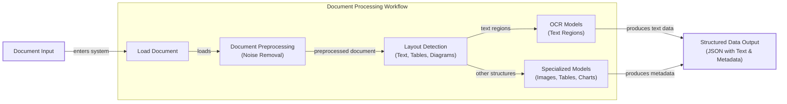
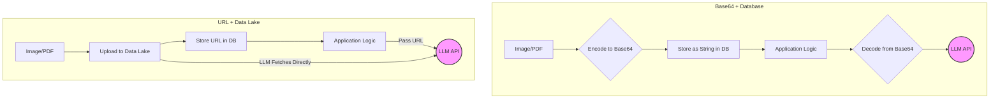
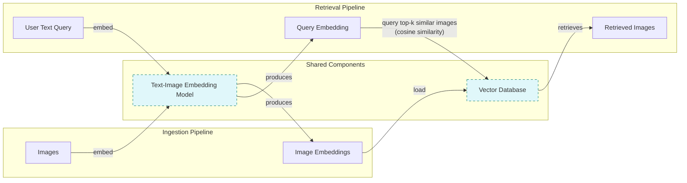
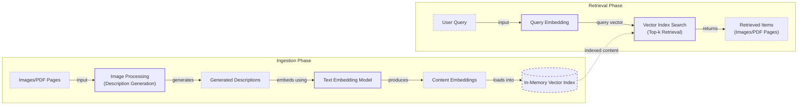
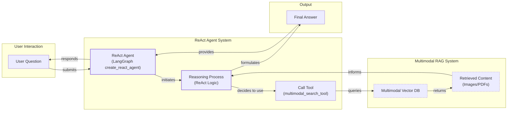

# Lesson 11: Multimodal AI

In the previous lessons, we built a solid foundation in AI engineering. We learned to distinguish between rule-based LLM workflows and autonomous AI agents, mastered the art of context engineering, and implemented core agentic patterns like structured outputs, tool use, ReAct reasoning, and memory. We even took a deep dive into Retrieval-Augmented Generation (RAG) to connect our agents to external knowledge. Now, we will tackle the final piece of the puzzle for building enterprise-grade AI systems: multimodality.

Real-world data is not just text. As humans, we interact with a rich mix of images, documents, audio, and video every day. To build truly useful AI applications, our systems must be able to process this data in its native format. This is not just a technical challenge; it is a business necessity. Enterprise AI applications must work with the data as it exists in databases, warehouses, and data lakes—a messy, multimodal reality.

Early AI systems tried to solve this by normalizing everything to text, often using Optical Character Recognition (OCR) to parse documents. However, this approach is flawed. When you convert a complex chart, a medical X-ray, or an architectural sketch into text, you lose a vast amount of visual information. For example, text-only AI struggles with financial reports containing charts, as it cannot interpret the visual data, leading to incomplete analysis [[6]](https://konfuzio.com/en/chatgpt-financial-analysis/). Similarly, in medical diagnostics, AI relies on computer vision to analyze images like CT scans; a text-only approach would be useless [[7]](https://techtoday.lenovo.com/sites/default/files/2025-05/Medical%20Imaging%20White%20Paper%20NVIDIA%20and%20Lenovo.pdf).

Modern AI systems take a different approach. Instead of translating, they interpret. Multimodal LLMs process images, PDFs, and other data formats natively, preserving the rich context that vision provides. This lesson will show you how to build AI agents and workflows that can see and understand the world as we do.

We will explore the limitations of text-only approaches in real-world scenarios, such as:
*   Analyzing financial reports with complex charts.
*   Assisting researchers by processing diagrams and tables.
*   Interpreting medical documents with diagnostic images.
*   Understanding technical manuals with detailed diagrams.
*   Parsing architectural sketches and building plans.

By the end of this lesson, you will have the skills to build AI systems that can handle the full spectrum of data you will encounter in any enterprise environment.

## Limitations of traditional document processing

To understand why native multimodal processing is a significant leap forward, we first need to look at the limitations of traditional, text-based document processing. For years, the standard approach for digitizing and analyzing documents like invoices, reports, or technical manuals has been a multi-step pipeline centered around OCR.

This workflow typically involves loading a document, preprocessing it to remove noise, detecting the layout to identify different regions like text blocks, tables, and diagrams, and then running specialized models on each region. An OCR model processes the text, while other models might be used to extract data from tables or charts. The final output is usually a structured format like JSON, containing the extracted text and metadata.

Image 1: A flowchart illustrating the traditional document processing workflow.



While this pipeline can work for simple, standardized documents, it has too many moving parts, making it rigid, slow, and fragile. The entire system is often built on templates or fixed coordinates, which means even a small layout change—a shifted header or an extra column—can cause the extraction logic to fail completely [[5]](https://netfira.com/why-ocr-technology-fails-on-real-world-documents-and-how-intelligent-document-processing-can-help/). This rigidity makes scaling a nightmare, as each new document format requires manual updates and maintenance. The need to run multiple models in sequence also makes it slow and expensive to operate at scale.

Furthermore, the multi-step nature of this process creates a cascade effect where errors compound. An error in layout detection can lead to the OCR model receiving incorrect input, producing garbled text that makes the final output useless. Even the best OCR engines struggle with real-world complexity. While they might achieve high accuracy on clean, printed text, their performance drops significantly when faced with handwritten notes, poor-quality scans, or complex layouts. For example, open-source engines like Tesseract can see their accuracy top out at 88–94% on complex documents, and even a 5-degree tilt in a scanned document can increase the word error rate by 15% or more [[2]](https://www.llamaindex.ai/blog/ocr-accuracy). For many enterprise use cases, OCR-based solutions deliver a maximum accuracy of only 60%, requiring more manual correction than the time they save [[3]](https://jiffy.ai/overcoming-ocr-errors-and-limitations-with-intelligent-document-processing/).

These systems fail spectacularly when dealing with visually rich content like nested tables, building sketches, or medical X-rays, where spatial relationships and visual cues are critical for understanding. Traditional OCR treats a page as a flat grid of text, losing the structural and semantic context embedded in the layout. This is why trying to extract meaningful data from a financial report's chart or an engineering diagram using OCR alone is a losing battle.

https://hackernoon.imgix.net/images/2DFAaGGO5cfymtBKn4bFFAoT6sg2-mjc3x1z.jpeg
Image 2: Deep learning can be used to remove false positive results (Source [https://hackernoon.com/complex-document-recognition-ocr-doesnt-work-and-heres-how-you-fix-it](https://hackernoon.com/complex-document-recognition-ocr-doesnt-work-and-heres-how-you-fix-it))

This approach might be sufficient for highly specialized, narrow applications, but it does not scale in a world where AI agents need to be flexible and fast. That is why modern AI solutions use multimodal LLMs, which can directly interpret text, images, and PDFs as native inputs, completely bypassing the fragile OCR workflow.

## Foundations of multimodal LLMs

Before we dive into the code, it is important to have an intuition for how multimodal LLMs work. As an AI engineer, you do not need to know every low-level detail, but understanding the core concepts will help you use, deploy, and monitor these models effectively.

### Common Approaches to Building Multimodal LLMs

There are two main architectural patterns for building multimodal LLMs that combine text and image data.

https://substackcdn.com/image/fetch/f_auto,q_auto:good,fl_progressive:steep/https%3A%2F%2Fsubstack-post-media.s3.amazonaws.com%2Fpublic%2Fimages%2F53956ae8-9cd8-474e-8c10-ef6bddb88164_1600x938.png
Image 3: The two main approaches to developing multimodal LLM architectures. (Source [https://magazine.sebastianraschka.com/p/understanding-multimodal-llms](https://magazine.sebastianraschka.com/p/understanding-multimodal-llms))

The first is the **Unified Embedding Decoder Architecture**. In this approach, an image is converted into a sequence of embedding vectors, which are then concatenated with the text token embeddings. The combined sequence is fed into a standard, text-based LLM decoder. This method is straightforward because it treats image data as just another type of "token" in the input sequence.

https://substackcdn.com/image/fetch/f_auto,q_auto:good,fl_progressive:steep/https%3A%2F%2Fsubstack-post-media.s3.amazonaws.com%2Fpublic%2Fimages%2F91955021-7da5-4bc4-840e-87d080152b18_1166x1400.png
Image 4: An illustration of the unified embedding decoder architecture. (Source [https://magazine.sebastianraschka.com/p/understanding-multimodal-llms](https://magazine.sebastianraschka.com/p/understanding-multimodal-llms))

The second is the **Cross-Modality Attention Architecture**. Here, the image embeddings are not prepended to the input sequence but are instead injected directly into the LLM's attention layers. A cross-attention mechanism allows the model to look at the image features at each processing step, enabling a more dynamic integration of visual and textual information.

https://substackcdn.com/image/fetch/f_auto,q_auto:good,fl_progressive:steep/https%3A%2F%2Fsubstack-post-media.s3.amazonaws.com%2Fpublic%2Fimages%2Fd9c06055-b959-45d1-87b2-1f4e90ceaf2d_1296x1338.png
Image 5: An illustration of the Cross-Modality Attention Architecture. (Source [https://magazine.sebastianraschka.com/p/understanding-multimodal-llms](https://magazine.sebastianraschka.com/p/understanding-multimodal-llms))

### How Image Encoders Work

Both architectures rely on an **image encoder** to transform an image into a set of embeddings. This process is analogous to how a text tokenizer and embedding layer convert text into vectors.

https://substackcdn.com/image/fetch/f_auto,q_auto:good,fl_progressive:steep/https%3A%2F%2Fsubstack-post-media.s3.amazonaws.com%2Fpublic%2Fimages%2F0d56ea06-d202-4eb7-9e01-9aac492ee309_1522x1206.png
Image 6: A side-by-side comparison of image and text tokenization and embedding. (Source [https://magazine.sebastianraschka.com/p/understanding-multimodal-llms](https://magazine.sebastianraschka.com/p/understanding-multimodal-llms))

The image encoder, often a Vision Transformer (ViT), first divides the image into a grid of smaller patches. Each patch is then flattened and passed through a linear projection layer to convert it into an embedding vector. This is similar to how a text tokenizer breaks a sentence into subwords and an embedding layer converts them into vectors.

https://substackcdn.com/image/fetch/f_auto,q_auto:good,fl_progressive:steep/https%3A%2F%2Fsubstack-post-media.s3.amazonaws.com%2Fpublic%2Fimages%2Ffef5f8cb-c76c-4c97-9771-7fdb87d7d8cd_1600x1135.png
Image 7: An illustration of a classic Vision Transformer (ViT) setup. (Source [https://magazine.sebastianraschka.com/p/understanding-multimodal-llms](https://magazine.sebastianraschka.com/p/understanding-multimodal-llms))

For the LLM to process both text and image embeddings, they must exist in the same vector space. This is achieved through a process called contrastive learning, which trains the text and image encoders together. The goal is to align their embedding spaces so that similar concepts, regardless of modality, are located close to each other. For example, the text "a cute puppy" and an image of a puppy will have similar embedding vectors. This shared space is what enables cross-modal understanding and tasks like text-to-image search.

https://towardsdatascience.com/wp-content/uploads/2024/11/15d3HBNjNIXLy0oMIvJjxWw.png
Image 8: A toy representation of a multimodal embedding space where text and images are aligned. (Source [https://towardsdatascience.com/multimodal-embeddings-an-introduction-5dc36975966f/](https://towardsdatascience.com/multimodal-embeddings-an-introduction-5dc36975966f/))

Popular pretrained image encoders like CLIP, OpenCLIP, and SigLIP are all based on this principle and are commonly used in multimodal RAG systems to find semantic similarities between text queries and images.

### Architectural Trade-offs and Modern Models

Each architecture has its trade-offs. The Unified Embedding approach is simpler to implement, as it requires no changes to the base LLM, and tends to achieve higher accuracy on OCR-related tasks. In contrast, the Cross-Attention method is more computationally efficient for high-resolution images because it avoids lengthening the input sequence with image tokens [[21]](https://magazine.sebastianraschka.com/p/understanding-multimodal-llms). Some models, like NVIDIA's NVLM-H, even use hybrid approaches to get the best of both worlds [[37]](https://arxiv.org/abs/2409.11402).

Today, most leading LLMs are multimodal. In the open-source community, models like Meta's Llama 4, Google's Gemma 3, Alibaba's Qwen3, and DeepSeek's R1/V3 all have strong vision capabilities. They often employ Mixture-of-Experts (MoE) architectures for efficiency and support massive context windows, with Llama 4 Scout reaching up to 10 million tokens [[22]](https://medium.com/data-science-in-your-pocket/2025-the-year-ai-reasoning-models-took-over-a-month-by-month-review-of-frontier-breakthroughs-6ea2163f854f), [[23]](https://codedesign.ai/blog/the-ultimate-guide-to-the-top-large-language-models-in-2025/). In the closed-source world, OpenAI's GPT-5, Google's Gemini 2.5 Pro (with a 2M token context), and Anthropic's Claude 4 series are also natively multimodal, featuring "deep thinking" modes for complex reasoning [[22]](https://medium.com/data-science-in-your-pocket/2025-the-year-ai-reasoning-models-took-over-a-month-by-month-review-of-frontier-breakthroughs-6ea2163f854f), [[26]](https://www.promptitude.io/post/ultimate-2025-ai-language-models-comparison-gpt5-gpt-4-claude-gemini-sonar-more). This same architectural pattern can be extended to other modalities like audio and video by integrating specialized encoders for each data type, such as Whisper for audio or Video Transformers [[28]](https://www.emergentmind.com/topics/multimodal-llms).

It is also important to distinguish these multimodal LLMs from generative diffusion models like Midjourney or Stable Diffusion. While both work with images, diffusion models are specialized for image *generation*, typically using a different architecture based on iterative denoising. Multimodal LLMs, on the other hand, are designed for image *understanding* and reasoning using an autoregressive approach. In an agentic system, a multimodal LLM might act as the "brain," deciding to use a diffusion model as a "tool" to create an image [[19]](https://arxiv.org/html/2409.14993v3).

Innovations in this space are constant, but the core principles remain. With this intuition, you are now ready to see how these models work in practice.

## Applying multimodal LLMs to images and PDFs

To understand how to work with multimodal LLMs, let's explore a few examples using Gemini. There are three primary ways to provide image or PDF data to a model: as raw bytes, as Base64-encoded strings, or via URLs.

**1. Raw Bytes:** This is the most direct method and works well for one-off API calls where you are processing a local file. However, storing raw bytes in a database can be problematic. Many databases interpret the data as strings, which can lead to corruption if the byte sequence contains characters that are not valid in the database's character set.

**2. Base64 Encoding:** This method converts binary data into a string format, making it safe to store in any database that handles text. It is a common technique for embedding images directly into web pages, and it serves a similar purpose here: ensuring data integrity. The main downside is that Base64 encoding increases the data size by about 33%, which can impact storage costs and latency.

**3. URLs:** This is often the most efficient method for production systems. Data can be accessed from public URLs or, more commonly in enterprise settings, from a private data lake like Amazon S3 or Google Cloud Storage. Instead of passing large files over the network with each API call, the LLM can fetch the data directly from the storage bucket. This reduces I/O bottlenecks and simplifies data management. For private data, access control mechanisms like signed URLs or IAM roles are essential to ensure security.

Image 1: A diagram comparing database-centric vs. data lake-centric multimodal data handling.



Choosing the right method depends on your application's requirements. For quick, local tasks, raw bytes are fine. For applications requiring database storage without a dedicated data lake, Base64 is a reliable choice. For scalable, high-performance enterprise systems, URLs pointing to a data lake are the best practice.

Now, let's see these methods in action with some code.

<aside>
💡

You can find all the code for this lesson in the accompanying [Jupyter Notebook](https://github.com/towardsai/course-ai-agents/blob/dev/lessons/11_multimodal/notebook.ipynb) on GitHub.

</aside>

First, let's look at our test image.

https://github.com/towardsai/course-ai-agents/raw/dev/lessons/11_multimodal/images/image_1.jpeg
Image 9: The sample image we will use for our examples. (Source [https://github.com/towardsai/course-ai-agents/blob/dev/lessons/11_multimodal/notebook.ipynb](https://github.com/towardsai/course-ai-agents/blob/dev/lessons/11_multimodal/notebook.ipynb))

### Processing Images as Raw Bytes

1.  We start by defining a helper function to load an image from a file path and convert it to bytes. We also resize it and convert it to the WEBP format, which is highly efficient.
    ```python
    def load_image_as_bytes(
        image_path: Path, format: Literal["WEBP", "JPEG", "PNG"] = "WEBP", max_width: int = 600, return_size: bool = False
    ) -> bytes | tuple[bytes, tuple[int, int]]:
        """
        Load an image from file path and convert it to bytes with optional resizing.
        """
    
        image = PILImage.open(image_path)
        if image.width > max_width:
            ratio = max_width / image.width
            new_size = (max_width, int(image.height * ratio))
            image = image.resize(new_size)
    
        byte_stream = io.BytesIO()
        image.save(byte_stream, format=format)
    
        if return_size:
            return byte_stream.getvalue(), image.size
    
        return byte_stream.getvalue()
    ```

2.  Next, we load our sample image. The output shows the first few bytes of the image data and its total size.
    ```python
    image_bytes = load_image_as_bytes(image_path=Path("images") / "image_1.jpeg", format="WEBP")
    ```
    It outputs:
    ```text
    Bytes `b'RIFF`\xad\x00\x00WEBPVP8 T\xad\x00\x00P\xec\x02\x9d\x01*X\x02X\x02'...`
    Size: 44392 bytes
    ```

3.  We can now pass these bytes directly to the Gemini model along with a text prompt to generate a caption.
    ```python
    response = client.models.generate_content(
        model=MODEL_ID,
        contents=[
            types.Part.from_bytes(
                data=image_bytes,
                mime_type="image/webp",
            ),
            "Tell me what is in this image in one paragraph.",
        ],
    )
    ```
    It outputs:
    ```text
    This striking image features a massive, dark metallic robot, its powerful form detailed with intricate circuit patterns on its head and piercing red glowing eyes. Perched playfully on its right arm is a small, fluffy grey tabby kitten, its front paw raised as if exploring or batting at the robot's armored limb, while its gaze is directed slightly off-frame. The robot's large, segmented hand is visible beneath the kitten. The background suggests an industrial or workshop environment, with hints of metal structures and natural light filtering in from an unseen window, creating a dramatic contrast between the soft, vulnerable kitten and the formidable, mechanical sentinel.
    ```

### Processing Images as Base64 Strings

1.  To process an image as a Base64 string, we first load it as bytes and then encode it.
    ```python
    def load_image_as_base64(
        image_path: Path, format: Literal["WEBP", "JPEG", "PNG"] = "WEBP", max_width: int = 600, return_size: bool = False
    ) -> str:
        """
        Load an image and convert it to base64 encoded string.
        """
    
        image_bytes = load_image_as_bytes(image_path=image_path, format=format, max_width=max_width, return_size=False)
    
        return base64.b64encode(cast(bytes, image_bytes)).decode("utf-8")
    
    image_base64 = load_image_as_base64(image_path=Path("images") / "image_1.jpeg", format="WEBP")
    ```
    It outputs:
    ```text
    Base64: UklGRmCtAABXRUJQVlA4IFStAABQ7AKdASpYAlgCPm0ylEekIqInJnQ7gOANiWdtk7FnEo2gDknjPixW9SNSb5P7IbBNhLn87Vtp...`
    Size: 59192 characters
    ```

2.  As you can see, the Base64 string is significantly larger than the raw bytes, confirming the roughly 33% size increase.
    ```python
    print(f"Image as Base64 is {(len(image_base64) - len(image_bytes)) / len(image_bytes) * 100:.2f}% larger than as bytes")
    ```
    It outputs:
    ```text
    Image as Base64 is 33.34% larger than as bytes
    ```

### Processing PDFs from Public URLs

Gemini can directly process content from public URLs using its `url_context` tool. You simply provide the URL in the prompt and enable the tool in the generation configuration. This is a powerful feature for working with documents available on the open internet.

1.  Here, we ask the model to explain how the ReAct framework works by providing a direct link to the original paper on arXiv.
    ```python
    response = client.models.generate_content(
        model=MODEL_ID,
        contents="Based on the provided paper as a PDF, tell me how ReAct works: https://arxiv.org/pdf/2210.03629",
        config=types.GenerateContentConfig(tools=[{"url_context": {}}]),
    )
    ```
    It outputs:
    ```text
    ReAct is a novel paradigm for large language models (LLMs) that combines reasoning (Thought) and acting (Action) in an interleaved manner to solve diverse language and decision-making tasks. This approach allows the model to:

    *   **Reason to Act:** Generate verbal reasoning traces to induce, track, and update action plans, and handle exceptions.
    *   **Act to Reason:** Interface with and gather additional information from external sources (like knowledge bases or environments) to incorporate into its reasoning.
    ...
    ```

### Accessing Private Data Lakes

For enterprise use cases, you will often need to access files from a private data lake. While the Gemini API currently has the best integration with Google Cloud Storage, the principle is the same for other providers like AWS S3. The LLM needs permission to access the bucket. Here is a mocked example of how you would pass a GCS URI to the model.
```python
response = client.models.generate_content(
    model=MODEL_ID,
    contents=[
        types.Part.from_uri(uri="gs://gemini-images/image_1.jpeg", mime_type="image/webp"),
        "Tell me what is in this image in one paragraph.",
    ],
)
```

### Object Detection with LLMs

Multimodal LLMs can also perform more advanced computer vision tasks like object detection. By combining the model's vision capabilities with the structured output features we learned about in Lesson 4, we can get precise, machine-readable results.

1.  First, we define our desired output structure using Pydantic models. This creates a contract for the LLM's response, ensuring we get back a list of bounding boxes with labels.
    ```python
    from pydantic import BaseModel, Field
    
    class BoundingBox(BaseModel):
        ymin: float
        xmin: float
        ymax: float
        xmax: float
        label: str = Field(
            default="The category of the object found within the bounding box. For example: cat, dog, diagram, robot."
        )
    
    class Detections(BaseModel):
        bounding_boxes: list[BoundingBox]
    ```

2.  We create a prompt instructing the model to detect objects and return their coordinates normalized to a 0-1000 scale. We also configure the Gemini client to expect a JSON response that conforms to our `Detections` schema.
    ```python
    prompt = """
    Detect all of the prominent items in the image. 
    The box_2d should be [ymin, xmin, ymax, xmax] normalized to 0-1000.
    Also, output the label of the object found within the bounding box.
    """
    
    image_bytes, image_size = load_image_as_bytes(
        image_path=Path("images") / "image_1.jpeg", format="WEBP", return_size=True
    )
    
    config = types.GenerateContentConfig(
        response_mime_type="application/json",
        response_schema=Detections,
    )
    
    response = client.models.generate_content(
        model=MODEL_ID,
        contents=[
            types.Part.from_bytes(
                data=image_bytes,
                mime_type="image/webp",
            ),
            prompt,
        ],
        config=config,
    )
    
    detections = cast(Detections, response.parsed)
    ```
    The `response.parsed` attribute directly gives us a validated Pydantic object:
    ```text
    Image size: (600, 600)
    ymin=1.0 xmin=450.0 ymax=997.0 xmax=1000.0 label='robot'
    ymin=269.0 xmin=39.0 ymax=782.0 xmax=530.0 label='kitten'
    ```

3.  Finally, we can use these structured coordinates to visualize the detections on the original image.
    ```python
    visualize_detections(detections, Path("images") / "image_1.jpeg")
    ```
    https://github.com/towardsai/course-ai-agents/raw/dev/lessons/11_multimodal/images/object_detection_image_1.png
    Image 10: Visualization of the bounding boxes detected by the Gemini model. (Source [https://github.com/towardsai/course-ai-agents/blob/dev/lessons/11_multimodal/notebook.ipynb](https://github.com/towardsai/course-ai-agents/blob/dev/lessons/11_multimodal/notebook.ipynb))

### Working with PDFs

The process for working with PDFs is nearly identical to working with images, especially when you treat each PDF page as an image. This is particularly effective for documents with complex layouts, like the famous "Attention Is All You Need" paper.

1.  We can pass the entire PDF as bytes to get a summary.
    ```python
    pdf_bytes = (Path("pdfs") / "attention_is_all_you_need_paper.pdf").read_bytes()
    response = client.models.generate_content(
        model=MODEL_ID,
        contents=[
            types.Part.from_bytes(data=pdf_bytes, mime_type="application/pdf"),
            "What is this document about? Provide a brief summary of the main topics.",
        ],
    )
    ```
    It outputs:
    ```text
    This document introduces the **Transformer**, a novel neural network architecture designed for **sequence transduction tasks** (like machine translation).
    ...
    ```

2.  Or, we can process it as a Base64 string.
    ```python
    def load_pdf_as_base64(pdf_path: Path) -> str:
        with open(pdf_path, "rb") as f:
            return base64.b64encode(f.read()).decode("utf-8")

    pdf_base64 = load_pdf_as_base64(pdf_path=Path("pdfs") / "attention_is_all_you_need_paper.pdf")
    # ... call model ...
    ```

3.  To handle complex layouts, we can treat individual pages as images and apply object detection.
    https://github.com/towardsai/course-ai-agents/raw/dev/lessons/11_multimodal/images/attention_is_all_you_need_1.jpeg
    Image 11: A page from the "Attention Is All You Need" paper, which we will treat as an image. (Source [https://github.com/towardsai/course-ai-agents/blob/dev/lessons/11_multimodal/notebook.ipynb](https://github.com/towardsai/course-ai-agents/blob/dev/lessons/11_multimodal/notebook.ipynb))

    We use the same object detection logic to identify the main diagram on this page.
    ```python
    prompt = """
    Detect all the diagrams from the provided image as 2d bounding boxes. 
    ...
    """
    image_bytes, image_size = load_image_as_bytes(
        image_path=Path("images") / "attention_is_all_you_need_1.jpeg", format="WEBP", return_size=True
    )
    # ... call the model with the same config as before ...
    detections = cast(Detections, response.parsed)
    visualize_detections(detections, Path("images") / "attention_is_all_you_need_1.jpeg")
    ```
    https://github.com/towardsai/course-ai-agents/raw/dev/lessons/11_multimodal/images/object_detection_pdf_page_1.png
    Image 12: The diagram from the paper correctly identified and bounded. (Source [https://github.com/towardsai/course-ai-agents/blob/dev/lessons/11_multimodal/notebook.ipynb](https://github.com/towardsai/course-ai-agents/blob/dev/lessons/11_multimodal/notebook.ipynb))

The model successfully identifies the Transformer architecture diagram. This demonstrates how effectively multimodal LLMs can understand complex visual content in documents, making the old, brittle OCR-based pipelines completely redundant for many use cases.

## Foundations of multimodal RAG

One of the most powerful applications of multimodal models is in RAG systems, a concept we explored in-depth in Lesson 10. When working with large collections of images or documents, RAG is essential. You cannot simply stuff thousands of PDF pages into an LLM's context window and expect good results. Even with massive context windows, performance degrades, and latency and costs skyrocket.

A multimodal RAG architecture allows an LLM to retrieve relevant visual information on the fly. Let's consider a generic system for text-to-image retrieval.

The **ingestion pipeline** involves taking a collection of images, passing each one through a text-image embedding model to get a vector representation, and storing these embeddings in a vector database.

The **retrieval pipeline** starts when a user submits a text query. This query is passed through the same embedding model to create a query vector. The system then uses this vector to search the database for the `top-k` most similar image embeddings, typically using cosine similarity. Because the text and image embeddings exist in the same aligned vector space, this cross-modal search is possible. This is the same technology that powers search engines like Google Images or Apple Photos. Advanced techniques can further improve retrieval by using hybrid search (combining vector similarity with keyword matching) or filtering on image metadata.

Image 13: A Mermaid diagram illustrating a generic multimodal RAG architecture for images and text.



For enterprise document RAG, one of the most promising architectures as of 2025 is **ColPali**. This model represents a paradigm shift by completely bypassing the traditional OCR pipeline. Instead of extracting text, ColPali processes document pages as images, using a vision-language model to understand both text and layout simultaneously [[61]](https://arxiv.org/pdf/2407.01449v6).

ColPali's key innovation is its use of a **multi-vector representation**, or "bag-of-embeddings." Rather than creating a single embedding for an entire document page, it divides the page image into patches and generates an embedding for each one. This fine-grained approach allows for a much more detailed understanding of the document's content. At query time, it uses a **late interaction mechanism** to compare the embeddings of each query token against all the patch embeddings of a document, summing the maximum similarity scores to get a final relevance score. This technique allows ColPali to also function as a powerful reranking system, refining initial search results to improve precision.

https://huggingface.co/datasets/huggingface/documentation-images/resolve/main/blog/saumitras/colpali-milvus-multimodal-rag/final_architecture.png
Image 14: The ColPali architecture, which bypasses OCR for direct visual document retrieval. (Source [https://arxiv.org/pdf/2407.01449v6](https://arxiv.org/pdf/2407.01449v6))

This architecture is not only simpler, with fewer failure points than OCR pipelines, but also significantly faster and more accurate. On the ViDoRe benchmark for visual document retrieval, ColPali substantially outperforms traditional systems, achieving an average nDCG@5 score of 81.3% [[61]](https://arxiv.org/pdf/2407.01449v6). It excels at handling documents with complex visual elements, making it ideal for real-world applications like financial report analysis and technical documentation retrieval. Now that we have the theory, let's build a simplified version of this system.

## Implementing multimodal RAG for images, PDFs and text

Let's combine what we have learned about multimodal LLMs and RAG to build a simple, from-scratch multimodal RAG system. Our mini-project will involve populating an in-memory vector index with a collection of images, including pages from the "Attention Is All You Need" paper treated as images. We will then query this index with text questions to retrieve the most relevant images.

To keep this example focused on the core concepts, we will make a few simplifications. A production-grade system like ColPali involves advanced techniques like image patching and a ColBERT-style reranker, which are beyond the scope of this introductory lesson. For pedagogical clarity, we will omit these complexities and instead generate a single descriptive text for each image and embed that text. This allows us to simulate a multimodal RAG system using a standard text embedding model, while building the foundational understanding needed for more advanced implementations.

Image 15: A simplified multimodal RAG system for images, PDFs, and text.



1.  First, let's look at the images we will be indexing. It's a mix of general images and pages from the Transformer paper.
    https://github.com/towardsai/course-ai-agents/raw/dev/lessons/11_multimodal/images/image_grid.png
    Image 16: The collection of images and PDF pages to be indexed. (Source [https://github.com/towardsai/course-ai-agents/blob/dev/lessons/11_multimodal/notebook.ipynb](https://github.com/towardsai/course-ai-agents/blob/dev/lessons/11_multimodal/notebook.ipynb))

2.  We define a function, `create_vector_index`, to process these images. For each image, it generates a detailed text description using Gemini and then creates an embedding of that description. This is a workaround because the Gemini API used in this example does not directly support image embeddings. In a production system, you would use a multimodal embedding model (like Voyage AI or Cohere) to directly embed the image bytes, skipping the description generation step. The rest of the RAG pipeline would remain the same.
    ```python
    def create_vector_index(image_paths: list[Path]) -> list[dict]:
        """
        Create embeddings for images by generating descriptions and embedding them.
        """
    
        vector_index = []
        for image_path in image_paths:
            image_bytes = cast(bytes, load_image_as_bytes(image_path, format="WEBP", return_size=False))
    
            image_description = generate_image_description(image_bytes)
            
            # IMPORTANT NOTE: When working with multimodal embedding models, we can directly embed the
            # `image_bytes` instead of generating and embedding the description.
            image_embedding = embed_text_with_gemini(image_description)
    
            vector_index.append(
                {
                    "content": image_bytes,
                    "type": "image",
                    "filename": image_path,
                    "description": image_description,
                    "embedding": image_embedding,
                }
            )
    
        return vector_index
    ```

3.  We also need helper functions to generate the image descriptions and embed the resulting text.
    ```python
    def generate_image_description(image_bytes: bytes) -> str:
        # ... uses Gemini to describe the image ...
    
    def embed_text_with_gemini(content: str) -> np.ndarray | None:
        # ... uses gemini-embedding-001 to create embeddings ...
    ```

4.  With these functions, we build our `vector_index`. Since we only have a few images, we will use a simple Python list as our in-memory "vector database." In a real-world application, you would use a dedicated vector database like Qdrant or Neo4j, which use efficient indexing algorithms like HNSW to handle millions of vectors.
    ```python
    image_paths = list(Path("images").glob("*.jpeg"))
    vector_index = create_vector_index(image_paths)
    ```

5.  Now, we define our search function, `search_multimodal`. It takes a text query, embeds it, and then calculates the cosine similarity between the query embedding and all the image description embeddings in our index. It returns the `top_k` most similar images.
    ```python
    def search_multimodal(query_text: str, vector_index: list[dict], top_k: int = 3) -> list[Any]:
        """
        Search for most similar documents to query using direct Gemini client.
        """
    
        query_embedding = embed_text_with_gemini(query_text)
        # ... calculates cosine similarity and returns top_k results ...
    ```

6.  Let's test it. We will search for information about the Transformer architecture.
    ```python
    query = "what is the architecture of the transformer neural network?"
    results = search_multimodal(query, vector_index, top_k=1)
    ```
    The system correctly retrieves the page from the "Attention Is All You Need" paper that contains the model architecture diagram, with a similarity score of 0.744.
    https://github.com/towardsai/course-ai-agents/raw/dev/lessons/11_multimodal/images/attention_is_all_you_need_1.jpeg
    Image 17: The top search result for a query about the Transformer architecture. (Source [https://github.com/towardsai/course-ai-agents/blob/dev/lessons/11_multimodal/notebook.ipynb](https://github.com/towardsai/course-ai-agents/blob/dev/lessons/11_multimodal/notebook.ipynb))

7.  Let's try another query, this time for a "kitten with a robot."
    ```python
    query = "a kitten with a robot"
    results = search_multimodal(query, vector_index, top_k=1)
    ```
    Again, the system finds the correct image with a high similarity score of 0.811.
    https://github.com/towardsai/course-ai-agents/raw/dev/lessons/11_multimodal/images/image_1.jpeg
    Image 18: The top search result for "a kitten with a robot." (Source [https://github.com/towardsai/course-ai-agents/blob/dev/lessons/11_multimodal/notebook.ipynb](https://github.com/towardsai/course-ai-agents/blob/dev/lessons/11_multimodal/notebook.ipynb))

This simple example demonstrates the power of multimodal RAG. By treating all documents as images and using a shared embedding space, we can build a unified search system that handles diverse content types seamlessly.

## Building multimodal AI agents

The final step is to integrate our multimodal RAG system into a ReAct agent, creating an agentic RAG system that can reason about and retrieve visual information. This combines the skills we have learned throughout Part 1 of this course.

Multimodal capabilities can be added to AI agents in several ways:
1.  **Multimodal Inputs/Outputs:** The agent's core reasoning LLM can accept images or other media as input. This enhances its reasoning by providing direct visual context. For example, an agent analyzing a financial report can see the charts and tables, not just a textual description of them, allowing it to catch nuances that OCR would miss.
2.  **Multimodal Retrieval Tools:** The agent can use tools, like the RAG system we just built, to search through visual or other non-textual data. This allows the agent to ground its responses in a vast, private knowledge base of documents, images, or even videos.
3.  **Advanced Multimodal Tools:** The agent can interact with more complex tools that operate on external resources. This could include tools for deep research across the web, interacting with other agents via an MCP server, analyzing a screenshot of a user's screen to provide tech support, or processing audio from a meeting to generate a summary. We will explore these advanced use cases in future parts of the course.

In this example, we will focus on the first two points. We will build a ReAct agent using LangGraph's `create_react_agent()` function and provide it with our `search_multimodal` function as a tool. The agent will be able to receive a user's question, decide to use the search tool to find a relevant image, and then use the retrieved image to answer the question. `create_react_agent()` is a pre-built graph that implements the ReAct logic, making it easy to plug in our custom tools and get a functioning agent up and running quickly.

Image 19: A Mermaid diagram illustrating a multimodal ReAct agent integrated with a RAG system.



1.  First, we wrap our `search_multimodal` function in a LangChain `@tool` decorator. This tool will take a query, search our vector index, and return the description and content of the top matching image.
    ```python
    @tool
    def multimodal_search_tool(query: str) -> dict[str, Any]:
        """
        Search through a collection of images and their text descriptions to find relevant content.
        """
    
        results = search_multimodal(query, vector_index, top_k=1)
    
        if not results:
            return {"role": "tool_result", "content": "No relevant content found for your query."}
    
        result = results[0]
    
        content = [
            {
                "type": "text",
                "text": f"Image description: {result['description']}",
            },
            types.Part.from_bytes(
                data=result["content"],
                mime_type="image/jpeg",
            ),
        ]
    
        return {
            "role": "tool_result",
            "content": content,
        }
    ```

2.  Next, we define a function `build_react_agent` that uses LangGraph's `create_react_agent`. We provide it with our `multimodal_search_tool` and a system prompt that guides the agent on how to use it. We will explore LangGraph in more detail in Part 2 of the course, but for now, you can think of it as a powerful way to build stateful, agentic applications.
    ```python
    def build_react_agent() -> Any:
        """
        Build a ReAct agent with multimodal search capabilities.
        """
    
        tools = [multimodal_search_tool]
    
        system_prompt = """You are a helpful AI assistant that can search through images and text to answer questions.
        ...
        Always search first using your tools before attempting to answer questions about specific images or visual content.
        """
    
        agent = create_react_agent(
            model=ChatGoogleGenerativeAI(model="gemini-2.5-pro", temperature=0.1),
            tools=tools,
            prompt=system_prompt,
        )
    
        return agent
    
    react_agent = build_react_agent()
    ```

3.  Now, let's test the agent by asking it about the color of the kitten from our image collection.
    ```python
    test_question = "what color is my kitten?"
    response = react_agent.invoke(input={"messages": test_question})
    ```
    The agent follows the ReAct loop. First, it reasons that it needs to search for an image of "my kitten." It calls the `multimodal_search_tool`, which finds the image of the kitten and the robot. The tool returns the image and its description to the agent. The agent then uses this information to formulate the final answer.
    It outputs:
    ```text
    > Calling tool `multimodal_search_tool` with query `my kitten`
    ...
    Based on the image, your kitten is a gray tabby. It has soft, short gray fur with darker tabby stripe patterns.
    ```

By integrating our RAG system as a tool, we have created an agent that can not only reason but also see. This example brings together many of the core concepts of AI engineering—structured outputs, tools, ReAct, RAG, and now multimodality—into a single, functional proof-of-concept.

## Conclusion

In this lesson, we have seen why native multimodal data processing is a fundamental shift in building AI systems. By moving beyond fragile OCR pipelines and embracing models that can see and understand visual data directly, we can create applications that are more robust, efficient, and capable. We have covered the theory behind multimodal LLMs and RAG systems and put it into practice by building a simple, yet powerful, agentic RAG system.

This lesson marks the end of Part 1 of our course on the fundamentals of AI Engineering. You now have a comprehensive toolkit for designing and implementing both rule-based LLM workflows and autonomous AI agents. In Part 2, we will move from theory to practice and begin building our course's capstone project: an interconnected research and writing agent system. We will explore advanced agentic design patterns, take a deep dive into LangGraph for building complex, stateful agents, and construct a complete multi-agent pipeline from start to finish.

## References

- [1] What Is Optical Character Recognition (OCR)?. [https://blog.roboflow.com/what-is-optical-character-recognition-ocr/](https://blog.roboflow.com/what-is-optical-character-recognition-ocr/)
- [2] OCR Accuracy Explained: How to Improve It. [https://www.llamaindex.ai/blog/ocr-accuracy](https://www.llamaindex.ai/blog/ocr-accuracy)
- [3] Overcoming OCR Errors and Limitations with Intelligent Document Processing. [https://jiffy.ai/overcoming-ocr-errors-and-limitations-with-intelligent-document-processing/](https://jiffy.ai/overcoming-ocr-errors-and-limitations-with-intelligent-document-processing/)
- [4] Unstructured Leads in Document Parsing Quality, Benchmarks Tell the Full Story. [https://unstructured.io/blog/unstructured-leads-in-document-parsing-quality-benchmarks-tell-the-full-story](https://unstructured.io/blog/unstructured-leads-in-document-parsing-quality-benchmarks-tell-the-full-story)
- [5] Why OCR Fails on Real-World Documents - and How Intelligent Document Processing Can Help. [https://netfira.com/why-ocr-technology-fails-on-real-world-documents-and-how-intelligent-document-processing-can-help/](https://netfira.com/why-ocr-technology-fails-on-real-world-documents-and-how-intelligent-document-processing-can-help/)
- [6] Financial analysis with ChatGPT: possibilities and limitations. [https://konfuzio.com/en/chatgpt-financial-analysis/](https://konfuzio.com/en/chatgpt-financial-analysis/)
- [7] Top 5 uses of AI in medical imaging. [https://techtoday.lenovo.com/sites/default/files/2025-05/Medical%20Imaging%20White%20Paper%20NVIDIA%20and%20Lenovo.pdf](https://techtoday.lenovo.com/sites/default/files/2025-05/Medical%20Imaging%20White%20Paper%20NVIDIA%20and%20Lenovo.pdf)
- [8] A Unified Summarization Framework for Traditional and Modern TDT. [https://www.ijcai.org/proceedings/2023/0581.pdf](https://www.ijcai.org/proceedings/2023/0581.pdf)
- [9] Financial Services Needs More Than AI: It Needs EPOCH. [https://arxiv.org/html/2503.22035v1](https://arxiv.org/html/2503.22035v1)
- [10] 10 real-world examples of AI in healthcare. [https://www.philips.com/a-w/about/news/archive/features/2022/20221124-10-real-world-examples-of-ai-in-healthcare.html](https://www.philips.com/a-w/about/news/archive/features/2022/20221124-10-real-world-examples-of-ai-in-healthcare.html)
- [11] How to Use an LLM to Create Data Schemas in BigQuery. [https://cloud.google.com/blog/products/data-analytics/how-to-use-an-llm-to-create-data-schemas-in-bigquery](https://cloud.google.com/blog/products/data-analytics/how-to-use-an-llm-to-create-data-schemas-in-bigquery)
- [12] Integrating Multimodal data into a Large Language Model. [https://towardsdatascience.com/integrating-multimodal-data-into-a-large-language-model-d1965b8ab00c](https://towardsdatascience.com/integrating-multimodal-data-into-a-large-language-model-d1965b8ab00c)
- [13] Data ×LLM: From Principles to Practices. [https://arxiv.org/html/2505.18458v1](https://arxiv.org/html/2505.18458v1)
- [14] Agentic RAG using LlamaParse and a Multi-Vector Retrieval Strategy. [https://www.linkedin.com/posts/sayandey01_generativeai-llm-rag-activity-7412381316106760192-nFx3](https://www.linkedin.com/posts/sayandey01_generativeai-llm-rag-activity-7412381316106760192-nFx3)
- [15] Evaluating Multimodal vs. Text-Based Retrieval for RAG with Snowflake Cortex. [https://www.snowflake.com/en/engineering-blog/arctic-agentic-rag-multimodal-pdf-retrieval/](https://www.snowflake.com/en/engineering-blog/arctic-agentic-rag-multimodal-pdf-retrieval/)
- [16] Multimodal RAG with Pathway and GPT-4o. [https://pathway.com/developers/templates/rag/multimodal-rag](https://pathway.com/developers/templates/rag/multimodal-rag)
- [17] MMCTAgent enables multimodal reasoning over large video/image collections. [https://www.linkedin.com/posts/gauravagg_mmctagent-enables-multimodal-reasoning-over-activity-7413983881181339648--PyD](https://www.linkedin.com/posts/gauravagg_mmctagent-enables-multimodal-reasoning-over-activity-7413983881181339648--PyD)
- [18] Multimodal RAG Explained: From Text to Images and Beyond. [https://www.usaii.org/ai-insights/multimodal-rag-explained-from-text-to-images-and-beyond](https://www.usaii.org/ai-insights/multimodal-rag-explained-from-text-to-images-and-beyond)
- [19] Connecting Large Language Models with Diffusion Models. [https://arxiv.org/html/2409.14993v3](https://arxiv.org/html/2409.14993v3)
- [20] Anyscale Endpoints. [https://docs.anyscale.com/llm](https://docs.anyscale.com/llm)
- [21] Understanding Multimodal LLMs. [https://magazine.sebastianraschka.com/p/understanding-multimodal-llms](https://magazine.sebastianraschka.com/p/understanding-multimodal-llms)
- [22] 2025: The Year AI Reasoning Models Took Over — A Month-by-Month Review of Frontier Breakthroughs. [https://medium.com/data-science-in-your-pocket/2025-the-year-ai-reasoning-models-took-over-a-month-by-month-review-of-frontier-breakthroughs-6ea2163f854f](https://medium.com/data-science-in-your-pocket/2025-the-year-ai-reasoning-models-took-over-a-month-by-month-review-of-frontier-breakthroughs-6ea2163f854f)
- [23] The Ultimate Guide to the Top Large Language Models in 2025. [https://codedesign.ai/blog/the-ultimate-guide-to-the-top-large-language-models-in-2025/](https://codedesign.ai/blog/the-ultimate-guide-to-the-top-large-language-models-in-2025/)
- [24] This is the most essential breakdown of 2025 Flagship LLM Architectures. [https://www.linkedin.com/posts/progressivethinker_this-is-the-most-essential-breakdown-of-2025-activity-7376654335319117825-a5aD](https://www.linkedin.com/posts/progressivethinker_this-is-the-most-essential-breakdown-of-2025-activity-7376654335319117825-a5aD)
- [25] A Survey of Large Language Models for Code: Evolution, Benchmarking, and Future Trends. [https://www.preprints.org/manuscript/202508.1904](https://www.preprints.org/manuscript/202508.1904)
- [26] Ultimate 2025 AI Language Models Comparison: GPT5, GPT-4, Claude, Gemini, Sonar & more. [https://www.promptitude.io/post/ultimate-2025-ai-language-models-comparison-gpt5-gpt-4-claude-gemini-sonar-more](https://www.promptitude.io/post/ultimate-2025-ai-language-models-comparison-gpt5-gpt-4-claude-gemini-sonar-more)
- [27] Exploring Multimodal LLMs: Text, Image, and Video Integration. [https://sparkco.ai/blog/exploring-multimodal-llms-text-image-and-video-integration](https://sparkco.ai/blog/exploring-multimodal-llms-text-image-and-video-integration)
- [28] Multimodal LLMs. [https://www.emergentmind.com/topics/multimodal-llms](https://www.emergentmind.com/topics/multimodal-llms)
- [29] Enhancing LLM Capabilities: The Power of Multimodal LLMs and RAG. [https://towardsai.net/p/l/enhancing-llm-capabilities-the-power-of-multimodal-llms-and-rag](https://towardsai.net/p/l/enhancing-llm-capabilities-the-power-of-multimodal-llms-and-rag)
- [30] A Comprehensive Survey and Guide to Multimodal Large Language Models in Vision-Language Tasks. [https://arxiv.org/html/2411.06284v3](https://arxiv.org/html/2411.06284v3)
- [31] How to Choose an Embedding Model for RAG in 2026. [https://milvus.io/blog/choose-embedding-model-rag-2026.md](https://milvus.io/blog/choose-embedding-model-rag-2026.md)
- [32] What's the best embedding model for RAG in 2026? My top 5. [https://www.reddit.com/r/Rag/comments/1rcba6y/whats_the_best_embedding_model_for_rag_in_2026_my/](https://www.reddit.com/r/Rag/comments/1rcba6y/whats_the_best_embedding_model_for_rag_in_2026_my/)
- [33] The Best Embedding Models for RAG in 2025. [https://greennode.ai/blog/best-embedding-models-for-rag](https://greennode.ai/blog/best-embedding-models-for-rag)
- [34] The Best Embedding Model for RAG in 2025. [https://eagerworks.com/blog/best-embedding-model-for-rag](https://eagerworks.com/blog/best-embedding-model-for-rag)
- [35] Top Embedding Models in 2025: A Guide to the Best Embedding Models. [https://artsmart.ai/blog/top-embedding-models-in-2025/](https://artsmart.ai/blog/top-embedding-models-in-2025/)
- [36] Understanding Multimodal LLMs. [https://magazine.sebastianraschka.com/p/understanding-multimodal-llms](https://magazine.sebastianraschka.com/p/understanding-multimodal-llms)
- [37] NVLM: Open Frontier-Class Multimodal LLMs. [https://arxiv.org/abs/2409.11402](https://arxiv.org/abs/2409.11402)
- [38] Multimodal AI Agents: A Look into the Future. [https://kanerika.com/blogs/multimodal-ai-agents/](https://kanerika.com/blogs/multimodal-ai-agents/)
- [39] The Rise of Multimodal Enterprise AI. [https://invisibletech.ai/blog/multimodal-enterprise-ai](https://invisibletech.ai/blog/multimodal-enterprise-ai)
- [40] Multimodal AI Use Cases in 2025. [https://rasa.com/blog/multimodal-ai-use-cases](https://rasa.com/blog/multimodal-ai-use-cases)
- [41] A Comprehensive Survey and Guide to Multimodal Large Language Models in Vision-Language Tasks. [https://github.com/cognitivetech/llm-research-summaries/blob/main/models-review/A-Comprehensive-Survey-and-Guide-to-Multimodal-Large-Language-Models-in-Vision-Language-Tasks.md](https://github.com/cognitivetech/llm-research-summaries/blob/main/models-review/A-Comprehensive-Survey-and-Guide-to-Multimodal-Large-Language-Models-in-Vision-Language-Tasks.md)
- [42] Multimodal AI Examples: How It Works, Real-World Applications and Future Trends. [https://smartdev.com/multimodal-ai-examples-how-it-works-real-world-applications-and-future-trends/](https://smartdev.com/multimodal-ai-examples-how-it-works-real-world-applications-and-future-trends/)
- [43] What is a multimodal LLM?. [https://www.ibm.com/think/topics/multimodal-llm](https://www.ibm.com/think/topics/multimodal-llm)
- [44] A Survey on Multimodal Large Language Models for Medical Applications. [https://pmc.ncbi.nlm.nih.gov/articles/PMC12479233/](https://pmc.ncbi.nlm.nih.gov/articles/PMC12479233/)
- [45] A survey of large language models for healthcare: from data, technology, and applications to accountability and ethics. [https://www.nature.com/articles/s41598-025-98483-1](https://www.nature.com/articles/s41598-025-98483-1)
- [46] End-to-End Distributed PDF Processing Pipeline. [https://www.daft.ai/blog/end-to-end-distributed-pdf-processing-pipeline](https://www.daft.ai/blog/end-to-end-distributed-pdf-processing-pipeline)
- [47] Why Traditional OCR Fails for Complex Business Documents. [https://learn.microsoft.com/en-us/answers/questions/5668164/why-traditional-ocr-fails-for-complex-business-doc?page=1](https://learn.microsoft.com/en-us/answers/questions/5668164/why-traditional-ocr-fails-for-complex-business-doc?page=1)
- [48] Document Processing Automation - A 2025 Guide. [https://parseur.com/blog/document-processing-automation-guide](https://parseur.com/blog/document-processing-automation-guide)
- [49] OCR for Tables: A Comprehensive Guide. [https://www.llamaindex.ai/blog/ocr-for-tables](https://www.llamaindex.ai/blog/ocr-for-tables)
- [50] AI for PDF data extraction in clinical research. [https://intuitionlabs.ai/articles/ai-pdf-data-extraction-clinical-research](https://intuitionlabs.ai/articles/ai-pdf-data-extraction-clinical-research)
- [51] Gemini consistently producing valid pydantic responses. [https://discuss.ai.google.dev/t/gemini-consistently-producing-valid-pydantic-responses/98992](https://discuss.ai.google.dev/t/gemini-consistently-producing-valid-pydantic-responses/98992)
- [52] Stop Converting Documents to Text. Use Multimodal LLMs Instead.. [https://www.decodingai.com/p/stop-converting-documents-to-text](https://www.decodingai.com/p/stop-converting-documents-to-text)
- [53] LLM Output Parsing and Structured Generation. [https://tetrate.io/learn/ai/llm-output-parsing-structured-generation](https://tetrate.io/learn/ai/llm-output-parsing-structured-generation)
- [54] Structured Outputs with Multimodal Gemini. [https://python.useinstructor.com/blog/2024/10/23/structured-outputs-with-multimodal-gemini/](https://python.useinstructor.com/blog/2024/10/23/structured-outputs-with-multimodal-gemini/)
- [55] Steering Large Language Models with Pydantic. [https://pydantic.dev/articles/llm-intro](https://pydantic.dev/articles/llm-intro)
- [56] Multimodal semantic search with OpenSearch. [https://opensearch.org/blog/multimodal-semantic-search/](https://opensearch.org/blog/multimodal-semantic-search/)
- [57] Multimodal AI Search for Business Applications. [https://towardsdatascience.com/multimodal-ai-search-for-business-applications-65356d011009](https://towardsdatascience.com/multimodal-ai-search-for-business-applications-65356d011009)
- [58] Joint Visual-Textual Embedding for Multimodal Style Search. [https://assets.amazon.science/89/bf/661d950d4059930c8f1d2e449ac6/joint-visual-textual-embedding-for-multimodal-style-search.pdf](https://assets.amazon.science/89/bf/661d950d4059930c8f1d2e449ac6/joint-visual-textual-embedding-for-multimodal-style-search.pdf)
- [59] Combine Image and Text: How Multimodal Retrieval Transforms Search. [https://zilliz.com/blog/combine-image-and-text-how-multimodal-retrieval-transforms-search](https://zilliz.com/blog/combine-image-and-text-how-multimodal-retrieval-transforms-search)
- [60] Multimodal Sentence Transformers. [https://huggingface.co/blog/multimodal-sentence-transformers](https://huggingface.co/blog/multimodal-sentence-transformers)
- [61] ColPali: Efficient Document Retrieval with Vision Language Models. [https://arxiv.org/pdf/2407.01449v6](https://arxiv.org/pdf/2407.01449v6)
</article>