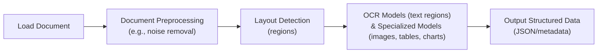
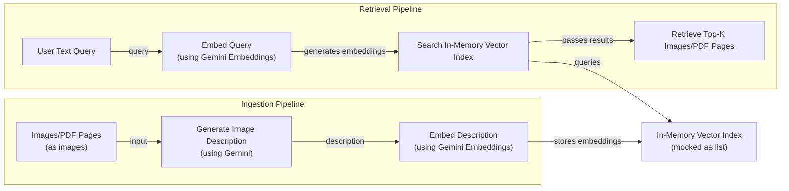
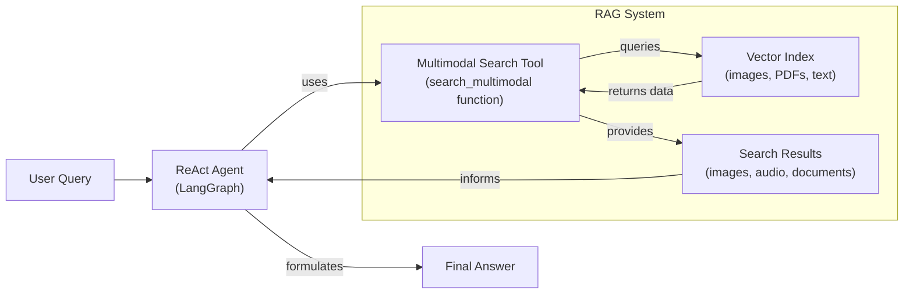

# Stop Converting Documents to Text. You're Doing It Wrong.

When we first started building AI agents, we hit a frustrating wall. We were comfortable manipulating text, but the moment we had to integrate multimodal data, such as images, audio, and especially documents like PDFs, our elegant architectures turned into messy hacks. We spent weeks building complex pipelines that tried to force everything into text. We chained OCR engines to scrape PDFs, layout detection models to identify tables, and separate classifiers to handle images. It was a brittle, slow, and expensive solution that broke every time a document layout changed.

The breakthrough came when we realized we were solving the wrong problem. We didn’t need to convert documents to text. We needed to treat them as images. Once we understood that every PDF page is effectively an image and that modern LLMs can “see” just as well as they can read, the complexity vanished. We could completely skip the OCR purgatory and focus on the three core inputs of an LLM: text, images, and audio.

This shift is essential because real-world AI applications rarely exist in a text-only vacuum. As human beings, we process information visually and audibly. Enterprise applications mirror this reality. They need to manipulate private data from warehouses and lakes that is inherently multimodal: financial reports with complex charts, technical diagrams, medical diagnostics, and building sketches [[1]](https://github.com/cognitivetech/llm-research-summaries/blob/main/models-review/A-Comprehensive-Survey-and-Guide-to-Multimodal-Large-Language-Models-in-Vision-Language-Tasks.md). For example, text-only AI struggles to summarize financial reports because it cannot interpret the charts and tables that contain the most critical data [[2]](https://www.ijcai.org/proceedings/2023/0581.pdf). Similarly, in healthcare, diagnosing conditions from medical images like X-rays or CT scans is impossible for a model that can only process text [[3]](https://techtoday.lenovo.com/sites/default/files/2025-05/Medical%20Imaging%20White%20Paper%20NVIDIA%20and%20Lenovo.pdf).

The old approach of normalizing everything to text is lossy. When you translate a complex diagram or a chart into text, you lose the spatial relationships, the colors, and the context. You lose the information that matters most. By processing data in its native format, we preserve this rich visual information, resulting in systems that are faster, cheaper, and more performant. Ultimately, as data is made for humans, you want the LLM to process the data as close as a human would, which often is visually.

Here is what we will cover:

*   **Foundations of Multimodal LLMs:** An intuition on how models process visual and textual tokens together.
*   **Practical Implementation:** How to work with images and PDFs using the Gemini API.
*   **Multimodal State Management:** How to structure agent memory for mixed modalities.
*   **Building the Agent:** A step-by-step guide to building a multimodal ReAct agent.

## Limitations of traditional document processing

To understand the problem we are solving, let's dig deeper into the limitations of traditional document processing for invoices, documentation, or reports. The core issue is that previous approaches tried to normalize everything to text before passing it to an AI model. This has many flaws, as we lose a substantial amount of information during translation. For example, when encountering diagrams, charts, or sketches in a document, it is impossible to fully reproduce them in text.

The traditional document processing workflow relies on a sequence of steps involving layout detection and Optical Character Recognition (OCR). For a PDF with mixed text, diagrams, and tables, this looks like:

1.  **Document Preprocessing:** The document is loaded and cleaned to remove noise or correct orientation [[4]](https://intuitionlabs.ai/articles/ai-pdf-data-extraction-clinical-research).
2.  **Layout Detection:** A model identifies different regions within the document, such as text blocks, tables, and images [[5]](https://www.daft.ai/blog/end-to-end-distributed-pdf-processing-pipeline).
3.  **Content Extraction:** OCR models process text regions, while other specialized models handle images, tables, or charts.
4.  **Structured Output:** The extracted text and metadata are formatted into a structured format like JSON.


Image 1: A flowchart illustrating the traditional document processing workflow for PDFs containing mixed text, diagrams, and tables.

This workflow has too many moving pieces. You need layout detection models, OCR models for text, and specialized models for each data structure. This makes the system rigid. Template-driven systems that rely on predefined positional rules are effective for fixed layouts but break the moment a document's format changes, requiring constant maintenance [[6]](https://www.llamaindex.ai/blog/ocr-for-tables). If a document contains a chart type you don’t have a model for, the pipeline fails [[7]](https://learn.microsoft.com/en-us/answers/questions/5668164/why-traditional-ocr-fails-for-complex-business-doc?page=1).

It is also slow and costly because you have to chain multiple model calls. A full pipeline involving layout detection, OCR, and captioning can take over seven seconds per page, whereas a direct visual encoding approach can be done in under half a second [[8]](https://arxiv.org/pdf/2407.01449v6). This operational complexity and the need for multiple systems create significant scaling bottlenecks [[5]](https://www.daft.ai/blog/end-to-end-distributed-pdf-processing-pipeline).

Most importantly, we face performance challenges. The multi-step nature creates a cascade effect where errors compound at each stage. An error in layout detection can lead to incorrect text extraction by the OCR model, which in turn results in flawed structured data. Advanced OCR engines achieve 88–94% accuracy on simple layouts but struggle with handwritten text, poor scans, stylized fonts, or complex layouts like nested tables and building sketches [[9]](https://www.llamaindex.ai/blog/ocr-accuracy), [[10]](https://hackernoon.com/complex-document-recognition-ocr-doesnt-work-and-heres-how-you-fix-it). On complex documents, error rates for OCR can be as high as 15-20%, with some sources reporting up to 70% manual intervention required [[4]](https://intuitionlabs.ai/articles/ai-pdf-data-extraction-clinical-research). For instance, a 5-degree tilt in a scan can increase the Word Error Rate (WER) by 15% or more, and resolution below 300 DPI can cause accuracy to drop by over 20% [[9]](https://www.llamaindex.ai/blog/ocr-accuracy).
Image 2: A building sketch showing a crawl space vent diagram, illustrating the complexity of layouts that classic OCR systems struggle to interpret. (Source [Vectorize.io [11]](https://vectorize.io/blog/multimodal-rag-patterns))

This might work for highly specialized applications, but it has too many problems and doesn't scale for a world of AI agents that need to be flexible and fast.

That's why modern AI solutions use multimodal LLMs, such as Gemini, that can directly interpret text, images, or even PDFs as native input, completely bypassing the unstable OCR workflow. Thus, let’s understand how multimodal LLMs work.

## Foundations of Multimodal LLMs

Before you write code to use LLMs with images and documents, you need an intuition of how multimodality works. You do not need to understand every research detail, but knowing the architecture helps you deploy, optimize, and monitor them.

There are two common approaches to building multimodal LLMs: the Unified Embedding Decoder Architecture and the Cross-modality Attention Architecture [[12]](https://magazine.sebastianraschka.com/p/understanding-multimodal-llms), [[13]](https://arxiv.org/abs/2409.11402).
Image 3: The two main approaches to developing multimodal LLM architectures. (Source [Understanding Multimodal LLMs [12]](https://magazine.sebastianraschka.com/p/understanding-multimodal-llms))

### Unified Embedding Decoder Architecture

In this approach, we encode the text and image separately, concatenate their embeddings into a single vector, and pass the resulting vector to the LLM. Thus, on top of a standard LLM architecture, you need a vision encoder that maps the image to an embedding that’s within the same vector space as the text. When the text and image embeddings are merged, the LLM can make sense of both [[12]](https://magazine.sebastianraschka.com/p/understanding-multimodal-llms).
Image 4: Illustration of the unified embedding decoder architecture. (Source [Understanding Multimodal LLMs [12]](https://magazine.sebastianraschka.com/p/understanding-multimodal-llms))

### Cross-modality Attention Architecture

In the second approach, instead of passing the image embeddings along with the text embeddings at the input, we inject them directly into the attention module. We still need an image encoder that projects the image into the same vector space as the text, but we inject it deeper within the architecture [[12]](https://magazine.sebastianraschka.com/p/understanding-multimodal-llms).
Image 5: An illustration of the Cross-Modality Attention Architecture approach. (Source [Understanding Multimodal LLMs [12]](https://magazine.sebastianraschka.com/p/understanding-multimodal-llms))

### Image Encoders

Both architectures rely on image encoders. To understand them, we can draw a parallel between text tokenization and image patching. Just as we split text into sub-word tokens, we split images into patches. The output has the same structure and dimensions as text embeddings [[12]](https://magazine.sebastianraschka.com/p/understanding-multimodal-llms).
Image 6: Image tokenization and embedding (left) and text tokenization and embedding (right) side by side. (Source [Understanding Multimodal LLMs [12]](https://magazine.sebastianraschka.com/p/understanding-multimodal-llms))

However, they need to be aligned in the vector space. We do this through a linear projection module. Popular image encoder models include CLIP, OpenCLIP, and SigLIP, which are often used for multimodal RAG to find semantic similarities between images and text [[14]](https://towardsdatascience.com/multimodal-embeddings-an-introduction-5dc36975966f/), [[15]](https://artsmart.ai/blog/top-embedding-models-in-2025/). This allows you to run similarity metrics between text, image, document, and audio vectors as long as an encoder maps the data into the same vector space.
Image 7: Toy representation of multimodal embedding space. (Source [Multimodal Embeddings: An Introduction [14]](https://towardsdatascience.com/multimodal-embeddings-an-introduction-5dc36975966f/))

### Trade-offs and Modern Landscape

The **Unified Embedding Decoder** approach is simpler to implement and generally yields higher accuracy in OCR-related tasks. The **Cross-modality Attention** approach is more computationally efficient for high-resolution images because we don’t have to pass all tokens as an input sequence. Instead, we inject them directly into the attention mechanism. Hybrid approaches exist to combine these benefits, such as NVIDIA's NVLM-H, which processes a low-resolution thumbnail via unified embedding and high-resolution patches via cross-attention [[12]](https://magazine.sebastianraschka.com/p/understanding-multimodal-llms), [[13]](https://arxiv.org/abs/2409.11402).

In 2025, most leading LLMs are multimodal. Open-source examples include Llama 4, which uses a Mixture-of-Experts (MoE) architecture and supports up to a 10 million token context, and Qwen3, known for its strong multilingual performance. Closed-source models like GPT-5 and Gemini 2.5 Pro offer deep multimodal capabilities, processing text, image, audio, and video with context windows reaching 2 million tokens [[16]](https://medium.com/data-science-in-your-pocket/2025-the-year-ai-reasoning-models-took-over-a-month-by-month-review-of-frontier-breakthroughs-6ea2163f854f), [[17]](https://codedesign.ai/blog/the-ultimate-guide-to-the-top-large-language-models-in-2025/). These models can often be extended to other modalities like audio or video by integrating specialized encoders, such as Whisper for audio, and connecting them to the LLM backbone through an alignment module [[18]](https://sparkco.ai/blog/exploring-multimodal-llms-text-image-and-video-integration), [[19]](https://www.emergentmind.com/topics/multimodal-llms).

A quick note on **Multimodal LLMs vs. Diffusion Models**: Diffusion models (like Midjourney or Stable Diffusion) generate images from noise. Multimodal LLMs (like GPT-4V) understand images and can sometimes generate them, but they are architecturally different. Multimodal LLMs are typically transformer decoder-based, while diffusion models are iterative denoising networks. In an agent workflow, diffusion models are typically used as tools for generation, not as the core reasoning model [[12]](https://magazine.sebastianraschka.com/p/understanding-multimodal-llms), [[20]](https://arxiv.org/html/2409.14993v3).

Now that we understand how LLMs can directly input images or documents, let’s see how this works in practice.

## Applying Multimodal LLMs to Images and Documents

To better understand how multimodal LLMs work, let’s write a few examples using Gemini to show you some best practices when working with images and PDFs.

There are three core ways to process multimodal data with LLMs, each with distinct trade-offs in terms of storage, latency, and security.

**Raw bytes** are the simplest method, ideal for one-off API calls where data is not stored. You pass the binary data directly to the model. However, this approach is risky for persistent storage. Many databases and transport layers may misinterpret the byte stream as text and apply string encodings like UTF-8, which corrupts the binary data and renders it useless.

**Base64** encoding solves the corruption problem by converting raw bytes into a standard ASCII string. This makes it safe to store images or documents in any database that handles text, such as PostgreSQL or MongoDB. It is the go-to method when you need to store multimodal data directly in your primary database. The main drawback is a ~33% increase in file size, which directly translates to higher storage costs and potentially slower database I/O.

**URLs** are the standard for scalable, enterprise applications. Data is stored in an object store or data lake, like AWS S3 or Google Cloud Storage, and the LLM is given a URL to access it. This is the most efficient option, as large files are not passed through your application’s network, reducing I/O bottlenecks. For private data, security is managed through mechanisms like pre-signed URLs or IAM roles that grant the LLM service temporary, scoped access, preventing unauthorized data exposure.

Your choice depends on your application's needs: use raw bytes for quick, stateless tasks; Base64 for integrated database storage; and URLs for scalable, secure, and performant enterprise systems.

Now, let’s dig into the code. We will show you a couple of simple examples of how to manipulate images and PDFs with these methods using the Google GenAI SDK.

1.  First, we set up our client, define a sample image, and display it.

    
    Image 8: A sample image of a kitten interacting with a robot.

2.  We define a helper function to load an image as raw bytes, using the efficient `WEBP` format.

    ```python
    from google import genai
    from google.genai import types
    from PIL import Image
    import io
    
    client = genai.Client()
    MODEL_ID = "gemini-2.5-flash"
    
    def load_image_as_bytes(image_path, format="WEBP"):
        image = Image.open(image_path)
        byte_stream = io.BytesIO()
        image.save(byte_stream, format=format)
        return byte_stream.getvalue()
    ```

3.  We load the image as **raw bytes** and can then call the LLM to generate a caption or compare it with another image.

    ```python
    image_bytes_1 = load_image_as_bytes("images/image_1.jpeg", format="WEBP")
    image_bytes_2 = load_image_as_bytes("images/image_2.jpeg", format="WEBP")
    
    # Single image captioning
    response = client.models.generate_content(
        model=MODEL_ID,
        contents=[
            types.Part.from_bytes(data=image_bytes_1, mime_type="image/webp"),
            "Tell me what is in this image in one paragraph.",
        ],
    )
    print(f"Caption: {response.text}")
    
    # Comparing multiple images
    response = client.models.generate_content(
        model=MODEL_ID,
        contents=[
            types.Part.from_bytes(data=image_bytes_1, mime_type="image/webp"),
            types.Part.from_bytes(data=image_bytes_2, mime_type="image/webp"),
            "What’s the difference between these two images?",
        ],
    )
    print(f"Difference: {response.text}")
    ```

    It outputs:

    ```text
    Caption: An image of a gray kitten and a robot...
    Difference: The primary difference between the two images is the nature of the interaction...
    ```

4.  We can also process the image as a **Base64 encoded string**. The base64 string will be about 33% larger than the raw bytes.

    ```python
    import base64
    
    image_base64 = base64.b64encode(image_bytes_1).decode("utf-8")
    print(f"Size increase: {(len(image_base64) - len(image_bytes_1)) / len(image_bytes_1) * 100:.2f}%")
    
    response = client.models.generate_content(
        model=MODEL_ID,
        contents=[
            types.Part.from_bytes(data=image_base64, mime_type="image/webp"),
            "Tell me what is in this image.",
        ],
    )
    ```

    It outputs:

    ```text
    Size increase: 33.34%
    ```

5.  For **URLs**, Gemini works well with public URLs or GCS Buckets. For public URLs, we can use the `url_context` tool.

    ```python
    response = client.models.generate_content(
        model=MODEL_ID,
        contents="Based on the provided paper as a PDF, tell me how ReAct works: https://arxiv.org/pdf/2210.03629",
        config=types.GenerateContentConfig(tools=[{"url_context": {}}]),
    )
    print(response.text)
    ```

    It outputs:

    ```text
    The ReAct (Reasoning and Acting) paradigm is a method that combines verbal reasoning traces with task-specific actions...
    ```

6.  For private data lakes like GCS, the code would look like this, assuming the LLM has the necessary permissions.

    ```python
    response = client.models.generate_content(
        model=MODEL_ID,
        contents=[
            types.Part.from_uri(uri="gs://gemini-images/image_1.jpeg", mime_type="image/webp"),
            "Tell me what is in this image.",
        ],
    )
    ```

7.  Let’s try a more complex task: **Object Detection**. We use Pydantic to define the output structure, a technique we covered in Lesson 4.

    ```python
    from pydantic import BaseModel
    
    class BoundingBox(BaseModel):
        ymin: float
        xmin: float
        ymax: float
        xmax: float
        label: str
    
    class Detections(BaseModel):
        bounding_boxes: list[BoundingBox]
    
    prompt = "Detect all prominent items. Return 2d boxes normalized to 0-1000."
    
    response = client.models.generate_content(
        model=MODEL_ID,
        contents=[types.Part.from_bytes(data=image_bytes_1, mime_type="image/webp"), prompt],
        config=types.GenerateContentConfig(
            response_mime_type="application/json",
            response_schema=Detections
        ),
    )
    
    detections = response.parsed
    ```

    The `detections` object is a Pydantic model containing a list of `BoundingBox` objects, which we can then visualize [[21]](https://www.decodingai.com/p/stop-converting-documents-to-text).

    
    Image 9: Visualization of the bounding boxes for the detected kitten and robot.

8.  Now, let’s process **PDFs**. Because we use a multimodal model, the process is identical to images. We load the PDF as bytes and pass it to the model.

    
    Image 10: The first page of the "Attention Is All You Need" paper, which we'll process as a PDF.

    ```python
    pdf_bytes = open("pdfs/attention_is_all_you_need_paper.pdf", "rb").read()
    
    response = client.models.generate_content(
        model=MODEL_ID,
        contents=[
            types.Part.from_bytes(data=pdf_bytes, mime_type="application/pdf"),
            "What is this document about? Provide a brief summary.",
        ],
    )
    print(response.text)
    ```

    It outputs:

    ```text
    This document introduces the Transformer, a novel neural network architecture for sequence transduction...
    ```

9.  Finally, we can perform **Object Detection on PDF pages**. This is powerful for extracting diagrams or tables. We treat the PDF page as an image.

    ```python
    page_image_bytes = load_image_as_bytes("images/attention_is_all_you_need_1.jpeg")
    
    prompt = "Detect all the diagrams from the provided image as 2d bounding boxes."
    
    response = client.models.generate_content(
        model=MODEL_ID,
        contents=[types.Part.from_bytes(data=page_image_bytes, mime_type="image/webp"), prompt],
        config=types.GenerateContentConfig(
            response_mime_type="application/json",
            response_schema=Detections
        ),
    )
    ```

    
    Image 11: Object detection result on a page from the "Attention is All You Need" paper, highlighting the model architecture diagram.

    Processing PDFs as images is a concept popularized by the ColPali architecture, which has become the state-of-the-art for document RAG [[8]](https://arxiv.org/pdf/2407.01449v6). Instead of a fragile OCR pipeline, ColPali treats each document page as an image and uses a Vision Language Model (VLM) to generate multiple embeddings for different patches of the image. This creates a "bag of embeddings" for each page, preserving the rich visual and spatial context of tables, charts, and complex layouts often found in financial reports or technical papers [[22]](https://learnopencv.com/multimodal-rag-with-colpali/). Retrieval then uses a late-interaction mechanism, similar to ColBERT, which computes similarity at the patch level between the query and the document. This fine-grained matching is far more accurate than comparing single vectors for the entire document [[23]](https://blog.vespa.ai/Transforming-the-Future-of-Information-Retrieval-with-ColPali/), [[24]](https://arxiv.org/html/2506.21601v2).

## Foundations of multimodal RAG

One of the most common use cases when working with multimodal data is a concept we already explored in Lesson 10: RAG. When building custom AI apps, you will always have to retrieve private company data to feed into your LLM. When working with larger data formats, such as images or PDFs, RAG becomes even more important. Imagine stuffing 1000+ PDF pages into your LLM to get a simple answer on your company's last quarter revenue. Even with huge context windows, that quickly becomes unfeasible as there is a direct correlation between the size of the context window and increased latency, costs, and decreased performance.

A generic multimodal RAG architecture using images and text as an example involves two main pipelines:

*   **Ingestion:** Image data is processed by a multimodal embedding model to generate vectors, which are then stored in a vector database.
*   **Retrieval:** A user's text query is embedded using the same model. The resulting vector is used to search the database for the most similar image embeddings, retrieving the top-k results. This works across modalities, so you could also use an image to query for text. Advanced techniques like hybrid search, which combines vector similarity with keyword matching and metadata filtering, can further improve retrieval accuracy [[25]](https://www.snowflake.com/en/engineering-blog/arctic-agentic-rag-multimodal-pdf-retrieval/).

This technique is heavily used in image search engines, such as Google or Apple Photos, where a query like "pictures of dogs" returns relevant images without relying on manual tags [[26]](https://opensearch.org/blog/multimodal-semantic-search/).

For enterprise use cases involving documents, the state-of-the-art architecture is ColPali. It bypasses the entire OCR pipeline by processing document pages directly as images. This preserves the visual context of tables, figures, and complex layouts that text extraction would lose. ColPali uses a Vision Language Model (VLM) based on PaliGemma and a SigLIP vision encoder to create multi-vector embeddings for each document page. Instead of a single vector, it generates a "bag of embeddings" by dividing the page image into patches and embedding each one. This allows for a much more granular representation of the document's content [[8]](https://arxiv.org/pdf/2407.01449v6). While this multi-vector approach significantly improves retrieval accuracy, it comes with trade-offs, such as increased storage requirements (up to 30x larger than traditional methods) and higher retrieval latency, which can be mitigated with compression techniques like quantization [[24]](https://arxiv.org/html/2506.21601v2), [[27]](https://www.activeloop.ai/resources/col-palis-vision-rag-and-max-sim-for-multi-modal-ai-search-on-documents/).

During retrieval, ColPali uses a late interaction mechanism (MaxSim) to compute similarities between the query tokens and the document's image patches. This fine-grained matching at the patch level is what makes it so effective, especially for visually complex documents. It can also be used as a powerful reranking step to refine the results from an initial, faster retrieval stage. On the ViDoRe benchmark, ColPali outperforms traditional OCR-based systems, achieving an 81.3% average nDCG@5 score and offering up to 10x faster query latency [[8]](https://arxiv.org/pdf/2407.01449v6). This makes it a powerful tool for RAG on financial reports, technical manuals, and other visually rich documents.

## Implementing multimodal RAG for images, PDFs and text

Let's connect all the dots with a more complex coding example where we combine what we have learned in this lesson and Lesson 10 on RAG into a multimodal RAG exercise. We will build a simple multimodal RAG system where we populate an in-memory vector database with multiple images and PDF pages, and then query it with text questions.

For this educational example, we are simplifying the ColPali architecture. We are omitting the image patching and the ColBERT-style late-interaction reranker to keep the implementation straightforward. Our goal is to build your intuition around the core concept: treating documents as images for retrieval. By focusing on the end-to-end flow of embedding and searching visual data, you can grasp the main paradigm shift without getting bogged down in the more complex components of a production-grade system.


Image 12: A flowchart illustrating a simplified multimodal RAG example with ingestion and retrieval pipelines.

1.  First, we display the images that we will embed and load into our mocked vector index.

    
    Image 13: A grid of images to be indexed.

2.  We define a function to generate a detailed description for each image using Gemini. A crucial point here is that we are translating images to text before embedding. This is a workaround because the Gemini API used in this example does not directly support image embeddings. In a production system with a true multimodal embedding model (like Voyage AI, Cohere, or OpenAI's CLIP), you would embed the image bytes directly, skipping this text generation step. The rest of the RAG pipeline would remain conceptually the same.

    ```python
    def generate_image_description(image_bytes: bytes) -> str:
        """Generate a detailed description of an image using Gemini Vision model."""
        prompt = "Describe this image in detail for semantic search purposes..."
        response = client.models.generate_content(model=MODEL_ID, contents=[prompt, Image.open(io.BytesIO(image_bytes))])
        return response.text.strip()
    
    # Mocked example of direct image embedding
    # image_embeddings = embed_with_multimodal(image_bytes)
    ```

3.  Next, we define a function to create embeddings for the text descriptions using a Gemini text embedding model.

    ```python
    def embed_text_with_gemini(content: str) -> np.ndarray | None:
        """Embed text content using Gemini's text embedding model."""
        result = client.models.embed_content(model="gemini-embedding-001", contents=[content])
        return np.array(result.embeddings[0].values)
    ```

4.  We create our vector index by iterating through our image paths, generating a description for each, and then embedding that description. We store everything in a list of dictionaries, which serves as our in-memory vector store.

    ```python
    def create_vector_index(image_paths: list[Path]) -> list[dict]:
        """Create embeddings for images by generating descriptions and embedding them."""
        vector_index = []
        for image_path in image_paths:
            image_bytes = load_image_as_bytes(image_path, format="WEBP")
            image_description = generate_image_description(image_bytes)
            image_embedding = embed_text_with_gemini(image_description)
            vector_index.append({
                "content": image_bytes,
                "filename": image_path,
                "description": image_description,
                "embedding": image_embedding,
            })
        return vector_index
    
    image_paths = list(Path("images").glob("*.jpeg"))
    vector_index = create_vector_index(image_paths)
    ```

5.  Now, we define a search function that takes a text query, embeds it, and uses cosine similarity to find the top-k most relevant images from our vector index.

    ```python
    from sklearn.metrics.pairwise import cosine_similarity
    
    def search_multimodal(query_text: str, vector_index: list[dict], top_k: int = 3) -> list[Any]:
        """Search for most similar documents to query."""
        query_embedding = embed_text_with_gemini(query_text)
        embeddings = [doc["embedding"] for doc in vector_index]
        similarities = cosine_similarity([query_embedding], embeddings).flatten()
        top_indices = np.argsort(similarities)[::-1][:top_k]
        return [{**vector_index[idx], "similarity": similarities[idx]} for idx in top_indices]
    ```

6.  Let's test it with a query about the transformer architecture. The system correctly retrieves the page from the "Attention Is All You Need" paper that contains the model architecture diagram.

    ```python
    query = "what is the architecture of the transformer neural network?"
    results = search_multimodal(query, vector_index, top_k=1)
    ```

    The top result has a similarity of 0.744 and is the correct PDF page image.

7.  Another example with the query "a kitten with a robot" correctly retrieves the image of the kitten and the robot with a similarity score of 0.811. This demonstrates how we can use the same vector index to search for both images and PDF pages, as we've normalized everything to images.

## Building multimodal AI agents

Now, to take the example from the previous section even further, we will integrate the `search_multimodal` RAG functionality into a ReAct agent as a tool, consolidating most of the skills learned in Part 1.

Multimodal capabilities enhance AI agents by allowing them to perceive and reason about the world more like humans do. An agent with "eyes" can analyze an image to extract visual context—colors, objects, spatial relationships—that would be lost in a text-only description. This richer understanding enables it to form more precise and effective plans. For example, instead of just searching for "a car," a multimodal agent can see a red sports car in an image and use its tools to search for "red Ferrari" or check its price. This ability to ground reasoning in visual data is what makes multimodal agents so powerful.

In this example, we will create a ReAct Agent using LangGraph's `create_react_agent()` function. This function builds the core reasoning loop (Reason -> Act -> Observe) for us. It takes our LLM and a list of tools, and wires them into a graph that manages the agent's state, orchestrates tool calls, and generates responses. This abstracts away the boilerplate code, allowing us to focus on defining the agent's tools and behavior.


Image 14: A flowchart illustrating a multimodal ReAct agent integrated with a RAG system.

1.  First, we wrap our `search_multimodal` function into a tool that the agent can call. The tool takes a text query, searches our vector index, and returns the retrieved image and its description.

    ```python
    from langchain_core.tools import tool
    
    @tool
    def multimodal_search_tool(query: str) -> dict[str, Any]:
        """Search through a collection of images and their text descriptions to find relevant content."""
        results = search_multimodal(query, vector_index, top_k=1)
        if not results:
            return {"role": "tool_result", "content": "No relevant content found."}
        result = results[0]
        content = [
            {"type": "text", "text": f"Image description: {result['description']}"},
            types.Part.from_bytes(data=result["content"], mime_type="image/jpeg"),
        ]
        return {"role": "tool_result", "content": content}
    ```

2.  Next, we create the ReAct agent using LangGraph. We provide it with a system prompt that instructs it on how to use the search tool to answer questions about visual content. We will explore LangGraph in more detail in Part 2 of the course.

    ```python
    from langgraph.prebuilt import create_react_agent
    from langchain_google_genai import ChatGoogleGenerativeAI
    
    def build_react_agent():
        """Build a ReAct agent with multimodal search capabilities."""
        tools = [multimodal_search_tool]
        system_prompt = """You are a helpful AI assistant that can search through images and text to answer questions..."""
        agent = create_react_agent(
            model=ChatGoogleGenerativeAI(model="gemini-2.5-pro", temperature=0.1),
            tools=tools,
            prompt=system_prompt,
        )
        return agent
    
    react_agent = build_react_agent()
    ```

3.  Now, let's test the agent by asking it about the color of our kitten.

    ```python
    test_question = "what color is my kitten?"
    response = react_agent.invoke(input={"messages": test_question})
    ```

4.  The agent follows the ReAct loop. It first reasons that it needs to find an image of "my kitten" and calls the `multimodal_search_tool`. The tool executes the search, finds the most relevant image (the one with the kitten and the robot), and returns it to the agent.

5.  With the image and its description in its context, the agent can now answer the user's question.

    ```text
    Based on the image, your kitten is a gray tabby. It has soft, short gray fur with darker tabby stripe patterns.
    ```

In this lesson, we combined structured outputs, tools, ReAct, RAG, and multimodal data to create a multimodal agentic RAG proof-of-concept.

## Conclusion

Working with multimodal data is a fundamental skill for AI engineers. Modern AI applications rarely exist in a text-only vacuum. They interact with the complex, visual, and auditory reality of the world.

In this lesson, we moved away from the unstable, multi-step OCR pipelines of the past. We learned that modern LLMs can natively process images and documents, preserving rich context that was previously lost. We explored how to handle data as bytes, Base64, and URLs, and how to build agents that can reason across these modalities.

This concludes our *AI Agents Foundations* series. We started by understanding the difference between workflows and agents, mastered context engineering and structured outputs, built robust planning capabilities with ReAct, and finally gave our agents eyes and ears. You now have the foundational blocks to build production-ready AI systems. In the next part of the course, we will apply these skills to build a complete research and writing agent system from scratch.

## References

- [1] A Comprehensive Survey and Guide to Multimodal Large Language Models in Vision-Language Tasks. (n.d.). GitHub. https://github.com/cognitivetech/llm-research-summaries/blob/main/models-review/A-Comprehensive-Survey-and-Guide-to-Multimodal-Large-Language-Models-in-Vision-Language-Tasks.md
- [2] Financial Report Summarization. (2023). IJCAI. https://www.ijcai.org/proceedings/2023/0581.pdf
- [3] Medical Imaging with AI. (n.d.). Lenovo. https://techtoday.lenovo.com/sites/default/files/2025-05/Medical%20Imaging%20White%20Paper%20NVIDIA%20and%20Lenovo.pdf
- [4] AI PDF Data Extraction in Clinical Research. (n.d.). IntuitionLabs.ai. https://intuitionlabs.ai/articles/ai-pdf-data-extraction-clinical-research
- [5] End-to-end distributed PDF processing pipeline. (n.d.). Daft.ai. https://www.daft.ai/blog/end-to-end-distributed-pdf-processing-pipeline
- [6] OCR for Tables. (n.d.). LlamaIndex. https://www.llamaindex.ai/blog/ocr-for-tables
- [7] Why traditional OCR fails for complex business documents. (n.d.). Microsoft. https://learn.microsoft.com/en-us/answers/questions/5668164/why-traditional-ocr-fails-for-complex-business-doc?page=1
- [8] Fostiropoulos, I., et al. (2024). ColPali: Efficient Document Retrieval with Vision Language Models. arXiv. https://arxiv.org/pdf/2407.01449v6
- [9] Liu, J. (2025, February 24). OCR Accuracy Explained: How to Improve It. LlamaIndex. https://www.llamaindex.ai/blog/ocr-accuracy
- [10] Kokorin, O. (2023, October 12). Complex Document Recognition: OCR Doesn’t Work and Here’s How You Fix It. HackerNoon. https://hackernoon.com/complex-document-recognition-ocr-doesnt-work-and-heres-how-you-fix-it
- [11] Multimodal RAG Patterns. (2024, October 26). Vectorize.io Blog. https://vectorize.io/blog/multimodal-rag-patterns
- [12] Raschka, S. (2024, October 21). Understanding Multimodal LLMs. Sebastian Raschka. https://magazine.sebastianraschka.com/p/understanding-multimodal-llms
- [13] NVLM: Open Frontier-Class Multimodal LLMs. (2024). arXiv. https://arxiv.org/abs/2409.11402
- [14] Talebi, S. (2024, November 13). Multimodal embeddings: An introduction. Medium. https://towardsdatascience.com/multimodal-embeddings-an-introduction-5dc36975966f/
- [15] Top Embedding Models in 2025. (n.d.). ArtSmart.ai. https://artsmart.ai/blog/top-embedding-models-in-2025/
- [16] 2025: The Year AI Reasoning Models Took Over. (2025). Medium. https://medium.com/data-science-in-your-pocket/2025-the-year-ai-reasoning-models-took-over-a-month-by-month-review-of-frontier-breakthroughs-6ea2163f854f
- [17] The Ultimate Guide to the Top Large Language Models in 2025. (n.d.). CodeDesign.ai. https://codedesign.ai/blog/the-ultimate-guide-to-the-top-large-language-models-in-2025/
- [18] Exploring multimodal LLMs: text, image, and video integration. (n.d.). SparkCognition. https://sparkco.ai/blog/exploring-multimodal-llms-text-image-and-video-integration
- [19] Multimodal LLMs. (n.d.). Emergent Mind. https://www.emergentmind.com/topics/multimodal-llms
- [20] Wang, X., et al. (2025). Multi-modal Generative AI: Multi-modal LLMs, Diffusions, and the Unification. arXiv. https://arxiv.org/html/2409.14993v3
- [21] Stop Converting Documents to Text. You're Doing It Wrong. (2025). Decoding AI. https://www.decodingai.com/p/stop-converting-documents-to-text
- [22] Multimodal RAG with ColPali. (n.d.). Learn OpenCV. https://learnopencv.com/multimodal-rag-with-colpali/
- [23] Transforming the Future of Information Retrieval with ColPali. (n.d.). Vespa Blog. https://blog.vespa.ai/Transforming-the-Future-of-Information-Retrieval-with-ColPali/
- [24] Duong, B. (2025). Hierarchical Patch Compression for ColPali: Efficient Multi-Vector Document Retrieval with Dynamic Pruning and Quantization. arXiv. https://arxiv.org/html/2506.21601v2
- [25] Evaluating Multimodal vs. Text-Based Retrieval for RAG with Snowflake Cortex. (2025). Snowflake. https://www.snowflake.com/en/engineering-blog/arctic-agentic-rag-multimodal-pdf-retrieval/
- [26] Multimodal Semantic Search. (n.d.). OpenSearch. https://opensearch.org/blog/multimodal-semantic-search/
- [27] ColPali’s Vision RAG and Max-Sim for Multi-Modal AI Search on Documents. (n.d.). Activeloop AI. https://www.activeloop.ai/resources/col-palis-vision-rag-and-max-sim-for-multi-modal-ai-search-on-documents/