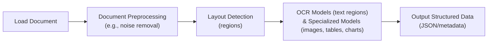
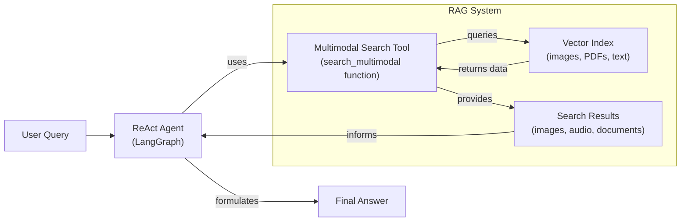

# Stop Converting Documents to Text. You're Doing It Wrong.

When I first started building AI agents, I hit a frustrating wall. I was comfortable manipulating text, but the moment I had to integrate multimodal data, such as images, audio, and especially documents like PDFs, my elegant architectures turned into messy hacks. I spent weeks building complex pipelines that tried to force everything into text. I chained OCR engines to scrape PDFs, layout detection models to identify tables, and separate classifiers to handle images. It was a brittle, slow, and expensive solution that broke every time a document layout changed.

The breakthrough came when I realized I was solving the wrong problem. I didn’t need to convert documents to text. I needed to treat them as images. Once I understood that every PDF page is effectively an image and that modern LLMs can “see” just as well as they can read, the complexity vanished. I could completely skip the OCR purgatory and focus on the three core inputs of an LLM: text, images, and audio.

This shift is essential because real-world AI applications rarely exist in a text-only vacuum. As human beings, we process information visually and audibly. Enterprise applications mirror this reality. They need to manipulate private data from warehouses and lakes that is inherently multimodal: financial reports with complex charts, technical diagrams, medical diagnostics, and building sketches [[1]](https://github.com/cognitivetech/llm-research-summaries/blob/main/models-review/A-Comprehensive-Survey-and-Guide-to-Multimodal-Large-Language-Models-in-Vision-Language-Tasks.md).

The old approach of normalizing everything to text is lossy. When you translate a complex diagram or a chart into text, you lose the spatial relationships, the colors, and the context. You lose the information that matters most. By processing data in its native format, we preserve this rich visual information, resulting in systems that are faster, cheaper, and significantly more performant. Ultimately, as data is made for humans, you want the LLM to process the data as close as a human would, which often is visually.

Here is what we will cover:

*   **Foundations of Multimodal LLMs:** An intuition on how models process visual and textual tokens together.
*   **Practical Implementation:** How to work with images and PDFs using the Gemini API.
*   **Multimodal State Management:** How to structure agent memory for mixed modalities.
*   **Building the Agent:** A step-by-step guide to building a multimodal ReAct agent.

## Limitations of traditional document processing

To understand the problem we are solving, let's dig deeper into the limitations of traditional document processing for invoices, documentation, or reports. The core issue is that previous approaches tried to normalize everything to text before passing it to an AI model. This has many flaws, as we lose a substantial amount of information during translation. For example, when encountering diagrams, charts, or sketches in a document, it is impossible to fully reproduce them in text.

The traditional document processing workflow relies on a sequence of steps involving layout detection and Optical Character Recognition (OCR). For a PDF with mixed text, diagrams, and tables, this looks like:

1.  **Document Preprocessing:** The document is loaded and cleaned to remove noise or correct orientation [[2]](https://intuitionlabs.ai/articles/ai-pdf-data-extraction-clinical-research).
2.  **Layout Detection:** A model identifies different regions within the document, such as text blocks, tables, and images [[3]](https://www.daft.ai/blog/end-to-end-distributed-pdf-processing-pipeline).
3.  **Content Extraction:** OCR models process text regions, while other specialized models handle images, tables, or charts.
4.  **Structured Output:** The extracted text and metadata are formatted into a structured format like JSON.


Image 1: A flowchart illustrating the traditional document processing workflow for PDFs containing mixed text, diagrams, and tables.

This workflow has too many moving pieces. You need layout detection models, OCR models for text, and specialized models for each expected data structure. This makes the system rigid. If a document contains a chart type you don’t have a model for, the pipeline fails [[4]](https://learn.microsoft.com/en-us/answers/questions/5668164/why-traditional-ocr-fails-for-complex-business-doc?page=1). It is also slow and costly because you have to chain multiple model calls.

Most importantly, we face performance challenges. The multi-step nature creates a cascade effect where errors compound at each stage. Advanced OCR engines achieve 88–94% accuracy on simple layouts but struggle with handwritten text, poor scans, stylized fonts, or complex layouts like nested tables and building sketches [[5]](https://www.llamaindex.ai/blog/ocr-accuracy), [[6]](https://hackernoon.com/complex-document-recognition-ocr-doesnt-work-and-heres-how-you-fix-it). For instance, a 5-degree tilt in a scan can increase the Word Error Rate (WER) by 15% or more, and resolution below 300 DPI can cause accuracy to drop by over 20% [[5]](https://www.llamaindex.ai/blog/ocr-accuracy).
Image 2: A building sketch showing a crawl space vent diagram, illustrating the complexity of layouts that classic OCR systems struggle to interpret. (Source [Vectorize.io [7]](https://vectorize.io/blog/multimodal-rag-patterns))

This might work for highly specialized applications, but it has too many problems and doesn't scale for a world of AI agents that need to be flexible and fast.

That's why modern AI solutions use multimodal LLMs, such as Gemini, that can directly interpret text, images, or even PDFs as native input, completely bypassing the unstable OCR workflow. Thus, let’s understand how multimodal LLMs work.

## Foundations of Multimodal LLMs

Before we write code to use LLMs with images and documents, you need an intuition of how multimodality works. You do not need to understand every research detail, but knowing the architecture helps you deploy, optimize, and monitor them.

There are two common approaches to building multimodal LLMs: the Unified Embedding Decoder Architecture and the Cross-modality Attention Architecture [[8]](https://magazine.sebastianraschka.com/p/understanding-multimodal-llms), [[9]](https://arxiv.org/abs/2409.11402).
Image 3: The two main approaches to developing multimodal LLM architectures. (Source [Understanding Multimodal LLMs [8]](https://magazine.sebastianraschka.com/p/understanding-multimodal-llms))

### Unified Embedding Decoder Architecture

In this approach, we encode the text and image separately, concatenate their embeddings into a single vector, and pass the resulting vector to the LLM. Thus, on top of a standard LLM architecture, you need a vision encoder that maps the image to an embedding that’s within the same vector space as the text. When the text and image embeddings are merged, the LLM can make sense of both [[8]](https://magazine.sebastianraschka.com/p/understanding-multimodal-llms).
Image 4: Illustration of the unified embedding decoder architecture. (Source [Understanding Multimodal LLMs [8]](https://magazine.sebastianraschka.com/p/understanding-multimodal-llms))

### Cross-modality Attention Architecture

In the second approach, instead of passing the image embeddings along with the text embeddings at the input, we inject them directly into the attention module. We still need an image encoder that projects the image into the same vector space as the text, but we inject it deeper within the architecture [[8]](https://magazine.sebastianraschka.com/p/understanding-multimodal-llms).
Image 5: An illustration of the Cross-Modality Attention Architecture approach. (Source [Understanding Multimodal LLMs [8]](https://magazine.sebastianraschka.com/p/understanding-multimodal-llms))

### Image Encoders

Both architectures rely on image encoders. To understand them, we can draw a parallel between text tokenization and image patching. Just as we split text into sub-word tokens, we split images into patches. The output has the same structure and dimensions as text embeddings [[8]](https://magazine.sebastianraschka.com/p/understanding-multimodal-llms).
Image 6: Image tokenization and embedding (left) and text tokenization and embedding (right) side by side. (Source [Understanding Multimodal LLMs [8]](https://magazine.sebastianraschka.com/p/understanding-multimodal-llms))

However, they need to be aligned in the vector space. We do this through a linear projection module. Popular image encoder models include CLIP, OpenCLIP, and SigLIP, which are often used for multimodal RAG to find semantic similarities between images and text [[10]](https://towardsdatascience.com/multimodal-embeddings-an-introduction-5dc36975966f/), [[11]](https://artsmart.ai/blog/top-embedding-models-in-2025/). This allows you to run similarity metrics between text, image, document, and audio vectors as long as an encoder maps the data into the same vector space.
Image 7: Toy representation of multimodal embedding space. (Source [Multimodal Embeddings: An Introduction [10]](https://towardsdatascience.com/multimodal-embeddings-an-introduction-5dc36975966f/))

You can replicate the same strategy between different modalities, such as text, image, document, and audio vectors, as long as you have an encoder that maps the data in the same vector space.

### Trade-offs and Modern Landscape

The **Unified Embedding Decoder** approach is simpler to implement and generally yields higher accuracy in OCR-related tasks. The **Cross-modality Attention** approach is more computationally efficient for high-resolution images because we don’t have to pass all tokens as an input sequence. Instead, we inject them directly into the attention mechanism. Hybrid approaches exist to combine these benefits, such as NVIDIA's NVLM-H, which processes a low-resolution thumbnail via unified embedding and high-resolution patches via cross-attention [[8]](https://magazine.sebastianraschka.com/p/understanding-multimodal-llms), [[9]](https://arxiv.org/abs/2409.11402).

In 2025, most leading LLMs are multimodal. Open-source examples include Llama 4, Gemma 2, and Qwen3. Closed-source examples include GPT-5, Gemini 2.5, and Claude 4 [[12]](https://medium.com/data-science-in-your-pocket/2025-the-year-ai-reasoning-models-took-over-a-month-by-month-review-of-frontier-breakthroughs-6ea2163f854f), [[13]](https://codedesign.ai/blog/the-ultimate-guide-to-the-top-large-language-models-in-2025/). These models can often be extended to other modalities like audio or video by integrating specialized encoders [[14]](https://sparkco.ai/blog/exploring-multimodal-llms-text-image-and-video-integration).

A quick note on **Multimodal LLMs vs. Diffusion Models**: Diffusion models (like Midjourney or Stable Diffusion) generate images from noise. Multimodal LLMs (like GPT-4V) understand images and can sometimes generate them, but they are architecturally different. Multimodal LLMs are typically transformer decoder-based, while diffusion models are iterative denoising networks. In an agent workflow, diffusion models are typically used as tools for generation, not as the core reasoning model [[8]](https://magazine.sebastianraschka.com/p/understanding-multimodal-llms), [[15]](https://arxiv.org/html/2409.14993v3).

Now that we understand how LLMs can directly input images or documents, let’s see how this works in practice.

## Applying Multimodal LLMs to Images and Documents

To better understand how multimodal LLMs work, let’s write a few examples using Gemini to show you some best practices when working with images and PDFs.

There are three core ways to process multimodal data with LLMs, each with distinct trade-offs in terms of storage, latency, and security.

**Raw bytes** are the simplest method, ideal for one-off API calls where data is not stored. You pass the binary data directly to the model. However, this approach is risky for persistent storage. Many databases and transport layers may misinterpret the byte stream as text and apply string encodings like UTF-8, which corrupts the binary data and renders it useless.

**Base64** encoding solves the corruption problem by converting raw bytes into a standard ASCII string. This makes it safe to store images or documents in any database that handles text, such as PostgreSQL or MongoDB. It is the go-to method when you need to store multimodal data directly in your primary database. The main drawback is a ~33% increase in file size, which directly translates to higher storage costs and potentially slower database I/O.

**URLs** are the standard for scalable, enterprise applications. Data is stored in an object store or data lake, like AWS S3 or Google Cloud Storage, and the LLM is given a URL to access it. This is the most efficient option, as large files are not passed through your application’s network, reducing I/O bottlenecks. For private data, security is managed through mechanisms like pre-signed URLs or IAM roles that grant the LLM service temporary, scoped access, preventing unauthorized data exposure.

Your choice depends on your application's needs: use raw bytes for quick, stateless tasks; Base64 for integrated database storage; and URLs for scalable, secure, and performant enterprise systems.

Now, let’s dig into the code. We will show you a couple of simple examples of how to manipulate images and PDFs with these methods using the Google GenAI SDK.

1. First, we set up our client, define a sample image, and display it.

   
   Image 8: A sample image of a kitten interacting with a robot.

2. We load the image as **raw bytes**. We use `WEBP` format because it is efficient. We can then call the LLM to generate a caption.

   ```python
   from google import genai
   from google.genai import types
   from PIL import Image
   import io
   
   client = genai.Client()
   MODEL_ID = "gemini-2.5-flash"
   
   def load_image_as_bytes(image_path, format="WEBP"):
       image = Image.open(image_path)
       byte_stream = io.BytesIO()
       image.save(byte_stream, format=format)
       return byte_stream.getvalue()
   
   image_bytes = load_image_as_bytes("images/image_1.jpeg", format="WEBP")
   
   response = client.models.generate_content(
       model=MODEL_ID,
       contents=[
           types.Part.from_bytes(data=image_bytes, mime_type="image/webp"),
           "Tell me what is in this image in one paragraph.",
       ],
   )
   print(f"Caption: {response.text}")
   ```

   It outputs:

   ```text
   Caption: This striking image features a massive, dark metallic robot...
   ```

3. We can also process the image as a **Base64 encoded string**. Notice that the logic is similar, but we encode the bytes first. The base64 string will be about 33% larger than the raw bytes.

   ```python
   import base64
   
   image_base64 = base64.b64encode(image_bytes).decode("utf-8")
   
   response = client.models.generate_content(
       model=MODEL_ID,
       contents=[
           types.Part.from_bytes(data=image_base64, mime_type="image/webp"),
           "Tell me what is in this image.",
       ],
   )
   ```

4. For **URLs**, Gemini works well with public URLs or GCS Buckets. For public URLs, we can use the `url_context` tool.

   ```python
   response = client.models.generate_content(
       model=MODEL_ID,
       contents="Based on the provided paper as a PDF, tell me how ReAct works: https://arxiv.org/pdf/2210.03629",
       config=types.GenerateContentConfig(tools=[{"url_context": {}}]),
   )
   print(response.text)
   ```

   It outputs:

   ```text
   The ReAct (Reasoning and Acting) paradigm is a method that combines verbal reasoning traces with task-specific actions...
   ```

5. For private data lakes like GCS, the code would look like this, assuming the LLM has the necessary permissions.

   ```python
   response = client.models.generate_content(
       model=MODEL_ID,
       contents=[
           types.Part.from_uri(uri="gs://gemini-images/image_1.jpeg", mime_type="image/webp"),
           "Tell me what is in this image.",
       ],
   )
   ```

6. Let’s try a more complex task: **Object Detection**. We use Pydantic to define the output structure, a technique we covered in Lesson 3.

   ```python
   from pydantic import BaseModel
   
   class BoundingBox(BaseModel):
       ymin: float
       xmin: float
       ymax: float
       xmax: float
       label: str
   
   class Detections(BaseModel):
       bounding_boxes: list[BoundingBox]
   
   prompt = "Detect all prominent items. Return 2d boxes normalized to 0-1000."
   
   response = client.models.generate_content(
       model=MODEL_ID,
       contents=[types.Part.from_bytes(data=image_bytes, mime_type="image/webp"), prompt],
       config=types.GenerateContentConfig(
           response_mime_type="application/json",
           response_schema=Detections
       ),
   )
   
   detections = response.parsed
   ```

   The `detections` object is a Pydantic model containing a list of `BoundingBox` objects, which we can then visualize.

   
   Image 9: Visualization of the bounding boxes for the detected kitten and robot.

7. Now, let’s process **PDFs**. Because we use a multimodal model, the process is identical to images. We load the PDF as bytes and pass it to the model.

   
   Image 10: The first page of the "Attention Is All You Need" paper, which we'll process as a PDF.

   ```python
   pdf_bytes = open("pdfs/attention_is_all_you_need_paper.pdf", "rb").read()
   
   response = client.models.generate_content(
       model=MODEL_ID,
       contents=[
           types.Part.from_bytes(data=pdf_bytes, mime_type="application/pdf"),
           "What is this document about? Provide a brief summary.",
       ],
   )
   print(response.text)
   ```

   It outputs:

   ```text
   This document introduces the Transformer, a novel neural network architecture for sequence transduction...
   ```

8. Finally, we can perform **Object Detection on PDF pages**. This is powerful for extracting diagrams or tables. We treat the PDF page as an image.

   ```python
   page_image_bytes = load_image_as_bytes("images/attention_is_all_you_need_1.jpeg")
   
   prompt = "Detect all the diagrams from the provided image as 2d bounding boxes."
   
   response = client.models.generate_content(
       model=MODEL_ID,
       contents=[types.Part.from_bytes(data=page_image_bytes, mime_type="image/webp"), prompt],
       config=types.GenerateContentConfig(
           response_mime_type="application/json",
           response_schema=Detections
       ),
   )
   ```

   
   Image 11: Object detection result on a page from the "Attention is All You Need" paper, highlighting the model architecture diagram.

   Processing PDFs as images is a concept popularized by the ColPali architecture, which has become the state-of-the-art for document RAG [[16]](https://arxiv.org/pdf/2407.01449v6). Instead of a fragile OCR pipeline, ColPali treats each document page as an image and uses a Vision Language Model (VLM) to generate multiple embeddings for different patches of the image. This creates a "bag of embeddings" for each page, preserving the rich visual and spatial context of tables, charts, and complex layouts often found in financial reports or technical papers [[17]](https://learnopencv.com/multimodal-rag-with-colpali/). Retrieval then uses a late-interaction mechanism, similar to ColBERT, which computes similarity at the patch level between the query and the document. This fine-grained matching is far more accurate than comparing single vectors for the entire document [[18]](https://blog.vespa.ai/Transforming-the-Future-of-Information-Retrieval-with-ColPali/), [[19]](https://arxiv.org/html/2506.21601v2).

Now that we've seen how to handle individual multimodal inputs, let's explore how to manage them within the memory of an AI agent.

## Foundations of Multimodal AI Agents

What if we want to use these methods within an Agent? Agents manage their internal state, the short-term memory, as a list of messages. When transitioning from text-only to multimodal, the structure changes slightly. We need a way to flag the data type and model the data using the formats we just discussed (URL, Base64, Binary).

We move from a list of text-only JSONs to a list of JSONs containing a mix of modalities. Each item can be text, an image, or audio. As long as the LLM can process these modalities, our job is to properly manage them in short-term memory, retrieve them from long-term memory, and pass them in the right encoding.
Image 12: The transition of an AI agent’s short-term memory from a text-only to a multimodal representation.

Retrieval becomes more interesting in this context. We still query our long-term memory, but now we can use multimodal similarities. We can use an image from short-term memory to query for similar images, documents, or audio chunks.

From an architectural point of view, a multimodal agentic RAG looks like any other agentic RAG system. However, this is where you will feel the real need for **semantic search**. With text, you can get far with keyword filters or SQL. But with images or audio, you cannot rely on keywords. You must use vector similarity to find relationships between data types.

Let’s see how we can model this bag of mixed messages with an example.

## Building Multimodal AI Agents

Let’s take this further and design an agentic RAG system. We assume we have a vector database filled with images, audio data, and PDFs (converted to images). We also assume we have a multimodal embedding model that supports text-to-image, image-to-audio, and text-to-audio embeddings.

For simplicity, we will mock the retrieval tools that access our vector database and other servers for Google Drive or local screenshots.
Image 13: Agent Interacting With Multimodal Memory

Our main focus is on managing the short-term memory as a list of mixed-modality JSONs. We want the agent to retrieve context from its current multimodal state, leveraging its multimodal retrieval tools, provide an answer, and repeat until the task is complete.

While this approach is powerful, deploying a multi-vector system like ColPali in production introduces significant engineering challenges. The 'bag of embeddings' approach inflates storage requirements dramatically; each page can require over 250 KB for its embeddings, up to 30 times more than traditional text-based methods [[20]](https://www.activeloop.ai/resources/col-palis-vision-rag-and-max-sim-for-multi-modal-ai-search-on-documents/). This also increases query latency, with benchmarks showing 120–150ms per query. To address this, recent research like HPC-ColPali has introduced techniques like vector quantization and dynamic pruning to reduce storage by over 30x and cut latency in half, making these models more viable for large-scale applications [[19]](https://arxiv.org/html/2506.21601v2).


Image 14: A flowchart illustrating a multimodal ReAct agent integrated with a RAG system.

1. First, we define our multimodal tools. In a real application, these would query a vector DB like Qdrant or Pinecone using a multimodal embedding model.

   ```python
   def text_image_search_tool(query: str):
       """Search for images using text description."""
       pass
   
   def image_to_image_search_tool(image_data: str):
       """Find images visually similar to the input image."""
       pass
   
   def computer_screen_shoot_tool():
       """Take a screenshot of the user’s screen."""
       return "<base64_image_string>"
   ```

2. We define the `build_react_agent` function that creates ReAct agents using LangGraph. We use a system prompt that explicitly instructs the agent to handle multimodal inputs. As we will see in Part 2 of the course, LangGraph is a powerful library for building stateful, multi-actor applications with LLMs. For now, we use it as a drop-in replacement for a ReAct agent.

   ```python
   from langgraph.prebuilt import create_react_agent
   from langchain_google_genai import ChatGoogleGenerativeAI
   
   def build_react_agent():
       system_prompt = """You are a multimodal AI assistant.
       You can see images, read documents, and listen to audio.
       When asked about visual content, use your tools to retrieve relevant context.
       Always analyze the visual features (colors, objects) or audio features (pitch, tone) in your search results."""
   
       model = ChatGoogleGenerativeAI(model="gemini-2.5-pro")
       tools = [
           text_image_search_tool,
           image_to_image_search_tool,
           # ... other tools
           computer_screen_shoot_tool,
       ]
   
       agent = create_react_agent(model, tools, system_prompt)
       return agent
   ```

3. We build the `react_agent` and run it with a query that requires multimodal reasoning: *“Based on what I am looking at, retrieve all relevant images, audio, and documents.”*

   ```python
   agent = build_react_agent()
   
   response = agent.invoke({"messages": ["Based on what I am looking at, retrieve all relevant images, audio and documents"]})
   ```

4. Let’s look at a potential reasoning trace. The agent first calls `computer_screen_shoot_tool` to see what the user is looking at. The tool returns a Base64 image, which is appended to the agent's memory.

   ```json
   {
     "role": "tool",
     "name": "computer_screen_shoot_tool",
     "parts": [
       {
         "inline_data": {
           "mime_type": "image/jpeg",
           "data": "/9j/4AAQSkZJRg..."
         }
       }
     ]
   }
   ```

5. With the image in its context, the agent analyzes its content (a gray kitten) and calls retrieval tools like `image_to_image_search_tool` and `image_document_search_tool`, passing the Base64 image data.

6. The tools return mixed modalities (images, audio, documents), which are added to the agent's state. The agent then compiles this information into a final answer. If we then ask a follow-up question like *“What is the color of my kitten?”*, the agent can answer directly from its short-term memory without needing to use tools again, as it already has the image context.

Nothing fundamental has changed in how we structure our data when switching from text-only to multimodal agents. We simply reflect the data types within the JSONs. The key is that our LLM knows how to process that data. The hard part is retrieving the correct multimodal data from our databases and indexing it properly.

## Conclusion

Working with multimodal data is a fundamental skill for AI engineers. Modern AI applications rarely exist in a text-only vacuum. They interact with the complex, visual, and auditory reality of the world.

In this lesson, we moved away from the unstable, multi-step OCR pipelines of the past. We learned that modern LLMs can natively process images and documents, preserving rich context that was previously lost. We explored how to handle data as bytes, Base64, and URLs, and how to build agents that can reason across these modalities.

This concludes our *AI Agents Foundations* series. We started by understanding the difference between workflows and agents, mastered context engineering and structured outputs, built robust planning capabilities with ReAct, and finally gave our agents eyes and ears. You now have the foundational blocks to build production-ready AI systems. In the next part of the course, we will apply these skills to build a complete research and writing agent system from scratch.

## References

- [1] A Comprehensive Survey and Guide to Multimodal Large Language Models in Vision-Language Tasks. GitHub. https://github.com/cognitivetech/llm-research-summaries/blob/main/models-review/A-Comprehensive-Survey-and-Guide-to-Multimodal-Large-Language-Models-in-Vision-Language-Tasks.md
- [2] AI PDF Data Extraction in Clinical Research. IntuitionLabs.ai. https://intuitionlabs.ai/articles/ai-pdf-data-extraction-clinical-research
- [3] End-to-end distributed PDF processing pipeline. Daft.ai. https://www.daft.ai/blog/end-to-end-distributed-pdf-processing-pipeline
- [4] Why traditional OCR fails for complex business documents. Microsoft. https://learn.microsoft.com/en-us/answers/questions/5668164/why-traditional-ocr-fails-for-complex-business-doc?page=1
- [5] OCR Accuracy Explained: How to Improve It. LlamaIndex. https://www.llamaindex.ai/blog/ocr-accuracy
- [6] Kokorin, O. (2023, October 12). Complex Document Recognition: OCR Doesn’t Work and Here’s How You Fix It. HackerNoon. https://hackernoon.com/complex-document-recognition-ocr-doesnt-work-and-heres-how-you-fix-it
- [7] Multimodal RAG Patterns. Vectorize.io Blog. https://vectorize.io/blog/multimodal-rag-patterns
- [8] Raschka, S. (2024). Understanding Multimodal LLMs. https://magazine.sebastianraschka.com/p/understanding-multimodal-llms
- [9] NVLM: Open Frontier-Class Multimodal LLMs. (2024). arXiv. https://arxiv.org/abs/2409.11402
- [10] Talebi, S. (2024, November 13). Multimodal embeddings: An introduction. Medium. https://towardsdatascience.com/multimodal-embeddings-an-introduction-5dc36975966f/
- [11] Top Embedding Models in 2025. ArtSmart.ai. https://artsmart.ai/blog/top-embedding-models-in-2025/
- [12] 2025: The Year AI Reasoning Models Took Over. Medium. https://medium.com/data-science-in-your-pocket/2025-the-year-ai-reasoning-models-took-over-a-month-by-month-review-of-frontier-breakthroughs-6ea2163f854f
- [13] The Ultimate Guide to the Top Large Language Models in 2025. CodeDesign.ai. https://codedesign.ai/blog/the-ultimate-guide-to-the-top-large-language-models-in-2025/
- [14] Exploring multimodal LLMs: text, image, and video integration. SparkCognition. https://sparkco.ai/blog/exploring-multimodal-llms-text-image-and-video-integration
- [15] Wang, X., et al. (2025). Multi-modal Generative AI: Multi-modal LLMs, Diffusions, and the Unification. arXiv. https://arxiv.org/html/2409.14993v3
- [16] Fostiropoulos, I., et al. (2024). ColPali: Efficient Document Retrieval with Vision Language Models. arXiv. https://arxiv.org/pdf/2407.01449v6
- [17] Multimodal RAG with ColPali. Learn OpenCV. https://learnopencv.com/multimodal-rag-with-colpali/
- [18] Transforming the Future of Information Retrieval with ColPali. Vespa Blog. https://blog.vespa.ai/Transforming-the-Future-of-Information-Retrieval-with-ColPali/
- [19] Duong, B. (2025). Hierarchical Patch Compression for ColPali: Efficient Multi-Vector Document Retrieval with Dynamic Pruning and Quantization. arXiv. https://arxiv.org/html/2506.21601v2
- [20] Col-Pali’s Vision RAG and Max-Sim for Multi-Modal AI Search on Documents. ActiveLoop. https://www.activeloop.ai/resources/col-palis-vision-rag-and-max-sim-for-multi-modal-ai-search-on-documents/
- [21] Vision language models. NVIDIA. https://www.nvidia.com/en-us/glossary/vision-language-models/
- [22] Multi-modal ML with OpenAI’s CLIP. Pinecone. https://www.pinecone.io/learn/series/image-search/clip/
- [23] Image understanding. Google AI for Developers. https://ai.google.dev/gemini-api/docs/image-understanding
- [24] Google generative AI embeddings. LangChain. https://python.langchain.com/docs/integrations/text_embedding/google_generative_ai/
- [25] Agents. LangChain. https://langchain-ai.github.io/langgraph/agents/agents/
- [26] What are some real-world applications of multimodal AI?. Milvus. https://milvus.io/ai-quick-reference/what-are-some-realworld-applications-of-multimodal-ai
- [27] Potrimba, A. (2023, November 21). What Is Optical Character Recognition (OCR)?. Roboflow Blog. https://blog.roboflow.com/what-is-optical-character-recognition-ocr/
- [28] Evaluating Multimodal vs. Text-Based Retrieval for RAG with Snowflake Cortex. Snowflake. https://www.snowflake.com/en/engineering-blog/arctic-agentic-rag-multimodal-pdf-retrieval/
- [29] Multimodal LLMs. Emergent Mind. https://www.emergentmind.com/topics/multimodal-llms
- [30] Enhancing LLM Capabilities: The Power of Multimodal LLMs and RAG. Towards AI. https://towardsai.net/p/l/enhancing-llm-capabilities-the-power-of-multimodal-llms-and-rag
- [31] Encoder-Decoder Frameworks. arXiv. https://arxiv.org/html/2411.06284v3
- [32] Choose Embedding Model for RAG in 2026. Milvus. https://milvus.io/blog/choose-embedding-model-rag-2026.md
- [33] Best Embedding Models for RAG. Greennode.ai. https://greennode.ai/blog/best-embedding-models-for-rag
- [34] Best Embedding Model for RAG. EagerWorks. https://eagerworks.com/blog/best-embedding-model-for-rag
- [35] Preprints.org. (2025). [Preprint on coding LLMs]. https://www.preprints.org/manuscript/202508.1904
- [36] Ultimate 2025 AI Language Models Comparison. Promptitude. https://www.promptitude.io/post/ultimate-2025-ai-language-models-comparison-gpt5-gpt-4-claude-gemini-sonar-more
- [37] Multimodal AI Examples. SmartDev. https://smartdev.com/multimodal-ai-examples-how-it-works-real-world-applications-and-future-trends/
- [38] Multimodal LLM. IBM. https://www.ibm.com/think/topics/multimodal-llm
- [39] Multimodal Large Language Models in medical imaging. PMC. https://pmc.ncbi.nlm.nih.gov/articles/PMC12479233/
- [40] Multimodal LLMs in healthcare. Nature. https://www.nature.com/articles/s41598-025-98483-1
- [41] Gemini consistently producing valid Pydantic responses. Google AI Dev. https://discuss.ai.google.dev/t/gemini-consistently-producing-valid-pydantic-responses/98992
- [42] Stop converting documents to text. Decoding AI. https://www.decodingai.com/p/stop-converting-documents-to-text
- [43] LLM Output Parsing: Structured Generation. Tetrate. https://tetrate.io/learn/ai/llm-output-parsing-structured-generation
- [44] Structured Outputs with Multimodal Gemini. UseInstructor. https://python.useinstructor.com/blog/2024/10/23/structured-outputs-with-multimodal-gemini/
- [45] Steering Large Language Models with Pydantic. Pydantic. https://pydantic.dev/articles/llm-intro
- [46] Multimodal Semantic Search. OpenSearch. https://opensearch.org/blog/multimodal-semantic-search/
- [47] Multimodal AI Search for Business Applications. Towards Data Science. https://towardsdatascience.com/multimodal-ai-search-for-business-applications-65356d011009/
- [48] Joint Visual-Textual Embedding for Multimodal Style Search. Amazon Science. https://assets.amazon.science/89/bf/661d950d4059930c8f1d2e449ac6/joint-visual-textual-embedding-for-multimodal-style-search.pdf
- [49] How Multimodal Retrieval Transforms Search. Zilliz. https://zilliz.com/blog/combine-image-and-text-how-multimodal-retrieval-transforms-search
- [50] Multimodal Sentence Transformers. Hugging Face. https://huggingface.co/blog/multimodal-sentence-transformers
- [51] Study on GPT-4 for financial analysis. Konfuzio. https://konfuzio.com/en/chatgpt-financial-analysis/
- [52] Medical Imaging White Paper. Lenovo. https://techtoday.lenovo.com/sites/default/files/2025-05/Medical%20Imaging%20White%20Paper%20NVIDIA%20and%20Lenovo.pdf
- [53] USTT model for financial reports. IJCAI. https://www.ijcai.org/proceedings/2023/0581.pdf
- [54] 10 real-world examples of AI in healthcare. Philips. https://www.philips.com/a-w/about/news/archive/features/2022/20221124-10-real-world-examples-of-ai-in-healthcare.html
- [55] How to use an LLM to create data schemas in BigQuery. Google Cloud. https://cloud.google.com/blog/products/data-analytics/how-to-use-an-llm-to-create-data-schemas-in-bigquery
- [56] Integrating multimodal data into a large language model. Towards Data Science. https://towardsdatascience.com/integrating-multimodal-data-into-a-large-language-model-d1965b8ab00c/
- [57] Survey on data management for multimodal LLMs. arXiv. https://arxiv.org/html/2505.18458v1
- [58] Multimodal RAG. Pathway.com. https://pathway.com/developers/templates/rag/multimodal-rag
- [59] Multimodal RAG Explained. USAII. https://www.usaii.org/ai-insights/multimodal-rag-explained-from-text-to-images-and-beyond
- [60] Multimodal pipelines documentation. Anyscale. https://docs.anyscale.com/llm