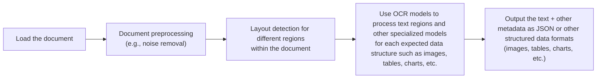
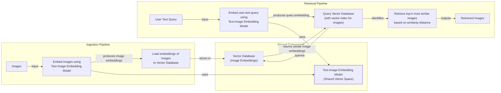
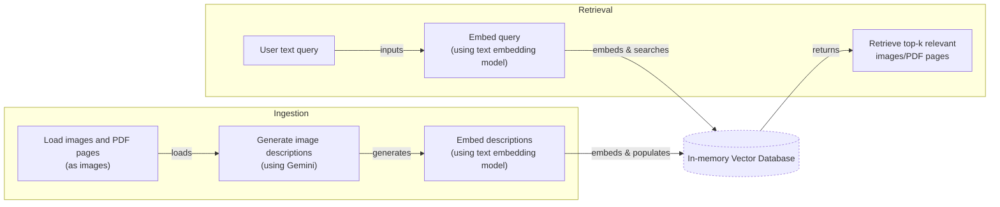
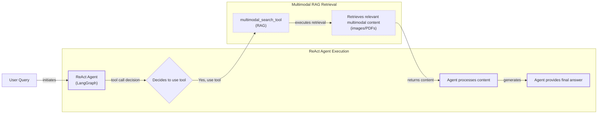

# Stop Converting Documents to Text. You're Doing It Wrong.

When we first started building AI agents, we hit a frustrating wall. We were comfortable manipulating text, but the moment we had to integrate multimodal data, such as images, audio, and especially documents like PDFs, our elegant architectures turned into messy hacks. We spent weeks building complex pipelines that tried to force everything into text. We chained OCR engines to scrape PDFs, layout detection models to identify tables, and separate classifiers to handle images. It was a brittle, slow, and expensive solution that broke every time a document layout changed.

The breakthrough came when we realized we were solving the wrong problem. We didn’t need to convert documents to text. We needed to treat them as images. Once we understood that every PDF page is effectively an image and that modern LLMs can “see” just as well as they can read, the complexity vanished. We could completely skip the OCR purgatory and focus on the three core inputs of an LLM: text, images, and audio.

This shift is essential because real-world AI applications rarely exist in a text-only vacuum. As human beings, we process information visually and audibly. Enterprise applications mirror this reality. They need to manipulate private data from warehouses and lakes that is inherently multimodal: financial reports with complex charts, medical documents with diagnostics, technical diagrams, and building sketches. Text-only approaches fail here; they cannot interpret the visual data in medical images, and they struggle to preserve tabular facts in financial reports, leading to hallucinations and biased summaries. The impact extends into creative fields as well, where multimodal AI is transforming visual effects by generating detailed CGI characters and scenes with minimal human intervention, pushing the boundaries of realism in film [[1]](https://www.ijcai.org/proceedings/2023/0581.pdf), [[2]](https://techtoday.lenovo.com/sites/default/files/2025-05/Medical%20Imaging%20White%20Paper%20NVIDIA%20and%20Lenovo.pdf), [[3]](https://medium.com/@ivotenvoorde/the-evolution-of-ai-in-the-movie-industry-transforming-filmmaking-b4564e898a34).

The old approach of normalizing everything to text is lossy. When you translate a complex diagram or a chart into text, you lose the spatial relationships, the colors, and the context. You lose the information that matters most. By processing data in its native format, we preserve this rich visual information, resulting in systems that are faster, cheaper, and more performant. In this lesson, we will explore the limitations of traditional document processing, dive into the foundations of multimodal LLMs and RAG, and show you how to apply these concepts to build a multimodal ReAct agent.

## Limitations of traditional document processing

To understand the problem with old approaches, let's dig into the limitations of traditional document processing. For years, the standard for handling documents like invoices, reports, or technical manuals in AI systems was to normalize everything to text before passing it to a model. This method has deep flaws because a substantial amount of information is lost during the translation. It is impossible to fully reproduce a diagram, chart, or building sketch in text while preserving all its visual nuances.

The traditional workflow for processing a PDF with mixed text, tables, and diagrams relies on a sequence of steps, each with its own model and potential for error [[4]](https://blog.roboflow.com/what-is-optical-character-recognition-ocr/).



Image 1: A flowchart illustrating the traditional document processing workflow using Layout Detection and OCR.

This workflow has too many moving pieces. You need layout detection models, Optical Character Recognition (OCR) models for text, and specialized models for each expected data structure. This makes the system rigid and fragile. If a document contains a chart type you don’t have a model for, or if the layout deviates even slightly from a predefined template, the pipeline fails or produces incorrect data. This rigidity requires constant maintenance and manual rule updates, making it unsuitable for dynamic environments where document formats evolve [[5]](https://learn.microsoft.com/en-us/answers/questions/5668164/why-traditional-ocr-fails-for-complex-business-doc?page=1).

The process is also slow and costly. Each step in the chain adds latency. For example, the ColPali paper reports that a typical PDF parser pipeline, including layout detection and OCR, takes over 7 seconds per page to index. In contrast, their vision-based approach takes just 0.37 seconds. Chaining multiple model calls for layout detection, text extraction, and table parsing increases both processing time and operational costs, especially at scale [[6]](https://arxiv.org/pdf/2407.01449v6).

Most importantly, this multi-step approach creates a cascade effect where errors compound at each stage. An error in layout detection leads to incorrect segmentation, which in turn causes the OCR engine to misread text, resulting in flawed final output. Advanced OCR engines like Tesseract and PaddleOCR achieve 88–94% accuracy on simple, high-volume layouts, but this performance plummets when faced with real-world complexity. For instance, a 5-degree tilt in a scanned document can increase the Word Error Rate (WER) by 15% or more, and using a scan with a resolution below 300 DPI can cause accuracy to drop by over 20% [[7]](https://www.llamaindex.ai/blog/ocr-accuracy).

These systems are particularly fragile when dealing with unconventional documents. Technical drawings, for instance, are notoriously difficult for OCR because they contain special symbols, rotated text, and complex geometric relationships that text-based models cannot interpret. Similarly, financial reports with embedded charts or medical documents like X-rays contain critical visual information that is lost in text conversion. The systems struggle to reconstruct spatial relationships in tables, leading to misaligned cells and headers, especially when formats change [[8]](https://hackernoon.com/complex-document-recognition-ocr-doesnt-work-and-heres-how-you-fix-it), [[9]](https://www.llamaindex.ai/blog/ocr-for-tables).

https://substackcdn.com/image/fetch/w_1456,c_limit,f_webp,q_auto:good,fl_progressive:steep/https%3A%2F%2Fsubstack-post-media.s3.amazonaws.com%2Fpublic%2Fimages%2Fa2dc40f3-dc13-486e-853d-8404368f4d8d_1616x1000.png
Image 2: A building sketch showing a crawl space vent diagram, illustrating the complexity of layouts that classic OCR systems struggle to interpret. (Source [Vectorize.io](https://vectorize.io/blog/multimodal-rag-patterns))

While this multi-step, OCR-based approach might work for highly specialized applications with uniform document types, it does not scale in a world where AI agents need to be flexible, fast, and reliable. The system is too brittle and loses too much information to be effective for general-purpose use.

Modern AI solutions bypass this unstable workflow entirely by using multimodal LLMs. Models like Gemini, GPT-4o, and Claude can directly interpret text, images, and PDFs as native inputs. This shift allows us to preserve the rich visual context that was previously lost.

## Foundations of multimodal LLMs

Before we dive into code, you need an intuition for how multimodal LLMs work. As an AI engineer, you do not need to know every research detail, but understanding the core architecture will help you use, deploy,optimize, and monitor these systems effectively.

There are two common approaches to building multimodal LLMs: the Unified Embedding Decoder Architecture and the Cross-modality Attention Architecture [[10]](https://magazine.sebastianraschka.com/p/understanding-multimodal-llms).

https://substackcdn.com/image/fetch/w_1456,c_limit,f_webp,q_auto:good,fl_progressive:steep/https%3A%2F%2Fsubstack-post-media.s3.amazonaws.com%2Fpublic%2Fimages%2F76f50b57-2585-4cb8-8dda-eea5b5f81c03_1456x854.jpeg
Image 3: The two main approaches to developing multimodal LLM architectures. (Source [Understanding Multimodal LLMs](https://magazine.sebastianraschka.com/p/understanding-multimodal-llms) [[10]](https://magazine.sebastianraschka.com/p/understanding-multimodal-llms))

### Unified Embedding Decoder Architecture

In this approach, we encode text and images separately, concatenate their embeddings into a single vector, and pass that vector to the LLM. On top of a standard LLM, you need a vision encoder that maps the image to an embedding in the same vector space as the text. When the text and image embeddings are merged, the LLM can make sense of both.

https://substackcdn.com/image/fetch/w_1456,c_limit,f_webp,q_auto:good,fl_progressive:steep/https%3A%2F%2Fsubstack-post-media.s3.amazonaws.com%2Fpublic%2Fimages%2Fa0979e82-2fb0-4f78-80c8-1395511e057f_1166x1400.jpeg
Image 4: Illustration of the unified embedding decoder architecture. (Source [Understanding Multimodal LLMs](https://magazine.sebastianraschka.com/p/understanding-multimodal-llms) [[10]](https://magazine.sebastianraschka.com/p/understanding-multimodal-llms))

### Cross-modality Attention Architecture

In the second approach, instead of passing image embeddings with text embeddings at the input, we inject them directly into the attention module of the LLM. We still need an image encoder to project the image into the same vector space as the text, but we inject it deeper within the architecture. This design is rooted in the original Transformer paper, "Attention Is All You Need" [[11]](https://arxiv.org/abs/1706.03762).

https://substackcdn.com/image/fetch/w_1456,c_limit,f_webp,q_auto:good,fl_progressive:steep/https%3A%2F%2Fsubstack-post-media.s3.amazonaws.com%2Fpublic%2Fimages%2Fea1b9ee4-0d19-4c3c-89db-06e779653da2_1296x1338.jpeg
Image 5: An illustration of the Cross-Modality Attention Architecture approach. (Source [Understanding Multimodal LLMs](https://magazine.sebastianraschka.com/p/understanding-multimodal-llms) [[10]](https://magazine.sebastianraschka.com/p/understanding-multimodal-llms))

### Image Encoders

Both architectures rely on image encoders, which function similarly to text tokenizers. Just as we split text into sub-word tokens, we split images into patches.

https://substackcdn.com/image/fetch/w_1456,c_limit,f_webp,q_auto:good,fl_progressive:steep/https%3A%2F%2Fsubstack-post-media.s3.amazonaws.com%2Fpublic%2Fimages%2F4a7104c0-3986-4aae-b918-06c393ff824c_1456x1154.jpeg
Image 6: Image tokenization and embedding (left) and text tokenization and embedding (right) side by side. (Source [Understanding Multimodal LLMs](https://magazine.sebastianraschka.com/p/understanding-multimodal-llms) [[10]](https://magazine.sebastianraschka.com/p/understanding-multimodal-llms))

These patches are processed by a vision model, often a Vision Transformer (ViT), to generate embeddings. The output has the same structure and dimensions as text embeddings, but the two must be aligned in the same vector space. This alignment is achieved through a linear projection module, which ensures that an image of a cat and the text "a cute cat" are located close to each other in the embedding space. This is grounded in the Platonic Representation Hypothesis, which posits that different modalities like text and vision are just different projections of the same underlying reality, capturing overlapping semantic information about the same world state [[12]](https://towardsdatascience.com/multimodal-embeddings-an-introduction-5dc36975966f/), [[13]](https://aclanthology.org/2025.findings-emnlp.90.pdf).

https://substackcdn.com/image/fetch/w_1456,c_limit,f_webp,q_auto:good,fl_progressive:steep/https%3A%2F%2Fsubstack-post-media.s3.amazonaws.com%2Fpublic%2Fimages%2F3d4c837a-a3e5-4d60-97ce-c4d4faf4cf57_841x616.png
Image 7: Toy representation of multimodal embedding space. (Source [Multimodal Embeddings: An Introduction](https://towardsdatascience.com/multimodal-embeddings-an-introduction-5dc36975966f/) [[12]](https://towardsdatascience.com/multimodal-embeddings-an-introduction-5dc36975966f/))

Popular image encoders like CLIP, OpenCLIP, and SigLIP are trained using contrastive learning. This technique teaches the model to maximize the similarity between positive pairs (e.g., an image and its correct caption) and minimize the similarity between negative pairs (e.g., an image and an incorrect caption). This process creates a shared embedding space where text and images with similar semantic meaning are clustered together, enabling cross-modal tasks like image search and classification [[12]](https://towardsdatascience.com/multimodal-embeddings-an-introduction-5dc36975966f/).

### Trade-offs and Modern Landscape

The **Unified Embedding Decoder** approach is simpler to implement and generally yields higher accuracy on OCR-related tasks. In contrast, the **Cross-modality Attention** approach is more computationally efficient for high-resolution images because it avoids overloading the input sequence with image tokens, injecting them directly into the attention mechanism instead. Hybrid approaches also exist to combine these benefits. NVIDIA's NVLM-H, for instance, processes a low-resolution thumbnail via unified embedding for global context and uses cross-attention for high-resolution patches to capture fine details, balancing simplicity, accuracy, and efficiency. More advanced connectors like the Q-Former used in BLIP-2 use a set of learnable query tokens to interact with visual features, producing a fixed-length output that acts as a sophisticated bridge between modalities [[10]](https://magazine.sebastianraschka.com/p/understanding-multimodal-llms), [[14]](https://arxiv.org/abs/2409.11402), [[15]](https://towardsai.net/p/l/enhancing-llm-capabilities-the-power-of-multimodal-llms-and-rag).

By 2025, most leading LLMs are multimodal. Open-source models like Llama 4, Qwen3, and DeepSeek R1 have pushed the boundaries of what's possible. Llama 4 Scout offers a context window of up to 10 million tokens, while Qwen3 excels in multilingual performance and agentic tasks. DeepSeek R1 uses reinforcement learning for advanced reasoning. In the closed-source world, models like GPT-5, Gemini 2.5 Pro, and Claude 4.x have demonstrated frontier performance. GPT-5 achieves near-superhuman results on math benchmarks like AIME (94.6%), while Gemini 2.5 Pro features a 2-million-token context and native support for video and audio analysis. These models showcase architectural innovations like "deep thinking" modes for more robust reasoning and Mixture-of-Experts (MoE) for greater efficiency [[16]](https://medium.com/data-science-in-your-pocket/2025-the-year-ai-reasoning-models-took-over-a-month-by-month-review-of-frontier-breakthroughs-6ea2163f854f), [[17]](https://codedesign.ai/blog/the-ultimate-guide-to-the-top-large-language-models-in-2025/).

This architecture can be extended to other modalities by integrating specialized encoders, a concept borrowed from robotics where "sensor fusion" combines inputs from diverse sensors like cameras, gyroscopes, and microphones into a unified representation for decision-making. For example, audio can be processed with encoders like Whisper or HuBERT, while video can be handled by Video Transformers. These specialized encoders convert each modality into embeddings that can then be aligned with the LLM's text space, enabling the model to reason across text, images, audio, and video simultaneously. This is the principle behind real-time video RAG systems used in public safety, which can analyze surveillance footage by fusing video frames with other data streams to extract insights nearly instantaneously [[18]](https://newsroom.arm.com/blog/llms-and-autonomous-robots), [[19]](https://sparkco.ai/blog/exploring-multimodal-llms-text-image-and-video-integration), [[15]](https://towardsai.net/p/l/enhancing-llm-capabilities-the-power-of-multimodal-llms-and-rag), [[20]](https://www.purestorage.com/video/webinars/applying-video-understanding-and-rag-in-surveillance/6359552764112.html).

It is also important to distinguish multimodal LLMs from diffusion-based generative models like Midjourney or Stable Diffusion. While multimodal LLMs are designed for understanding and reasoning about visual inputs, diffusion models excel at generating high-quality images from text prompts. Architecturally, they are different: multimodal LLMs are typically transformer decoder-based, while diffusion models use an iterative denoising process. In an agentic workflow, a diffusion model would typically be used as a tool invoked by the reasoning LLM, not as the core reasoning engine itself [[21]](https://arxiv.org/html/2409.14993v3).

## Applying multimodal LLMs to images and PDFs

To better understand how multimodal LLMs work, let’s walk through a few examples using Gemini to demonstrate best practices when working with images and PDFs.

There are three core ways to process multimodal data with LLMs:

-   **Raw bytes:** This is the easiest method for one-off API calls. However, it comes with a significant risk: storing raw bytes in most databases can lead to data corruption, as they often interpret the input as text strings instead of binary data. This can happen due to character encoding issues or automatic string-handling logic that modifies the binary stream.
-   **Base64:** This method encodes raw bytes as strings, allowing you to store images or documents in databases like PostgreSQL or MongoDB without corruption. It is a reliable way to keep multimodal data directly within your primary database. The main trade-off is a size increase of approximately 33%, which can impact storage costs and network latency.
-   **URLs:** This is the standard for enterprise scenarios. Data is stored in a data lake like AWS S3 or Google Cloud Storage, and the LLM downloads the media directly from a provided URL. This approach is highly efficient at scale because it reduces network latency for your application, as large files are not passed through your server. For private data, this requires careful security considerations, such as using pre-signed URLs or configuring appropriate IAM roles to grant the LLM temporary access.

```mermaid
graph TD
    subgraph "Base64 + Database Workflow"
        A[Application] --> B{Database (e.g., PostgreSQL)};
        B --> |1. Retrieve Base64 String| A;
        A --> |2. Pass Base64 to LLM| C((LLM API));
    end

    subgraph "URL + Data Lake Workflow"
        D[Application] --> E{Database (e.g., PostgreSQL)};
        E --> |1. Retrieve URL| D;
        D --> |2. Pass URL to LLM| F((LLM API));
        G[Data Lake (e.g., S3)] -.-> |3. LLM fetches data directly| F;
    end
```

Image 8: A flowchart comparing the data flow for Base64 storage in a database versus URL storage in a data lake.

Now, let's dig into the code. The following examples use the Google GenAI SDK to interact with Gemini.

1.  First, we set up our client and display a sample image.
    ```python
    from google import genai
    from google.genai import types
    from PIL import Image as PILImage
    from IPython.display import Image as IPythonImage
    import io

    client = genai.Client()
    MODEL_ID = "gemini-2.5-flash"

    def display_image(image_path):
        display(IPythonImage(filename=image_path, width=400))

    display_image("images/image_1.jpeg")
    ```
    It outputs:

    https://github.com/towardsai/course-ai-agents/raw/dev/lessons/11_multimodal/images/image_1.jpeg

2.  We can process an image as **raw bytes**. We use the `WEBP` format because it is highly efficient. Here, we ask the LLM to generate a caption and then compare two images.
    ```python
    def load_image_as_bytes(image_path, format="WEBP"):
        image = PILImage.open(image_path)
        byte_stream = io.BytesIO()
        image.save(byte_stream, format=format)
        return byte_stream.getvalue()

    image_bytes_1 = load_image_as_bytes("images/image_1.jpeg", format="WEBP")
    image_bytes_2 = load_image_as_bytes("images/image_2.jpeg", format="WEBP")

    # Single image captioning
    response = client.models.generate_content(
        model=MODEL_ID,
        contents=[
            types.Part.from_bytes(data=image_bytes_1, mime_type="image/webp"),
            "Tell me what is in this image in one paragraph.",
        ],
    )
    print(f"Caption: {response.text}")

    # Comparing multiple images
    response = client.models.generate_content(
        model=MODEL_ID,
        contents=[
            types.Part.from_bytes(data=image_bytes_1, mime_type="image/webp"),
            types.Part.from_bytes(data=image_bytes_2, mime_type="image/webp"),
            "What’s the difference between these two images?",
        ],
    )
    print(f"Difference: {response.text}")
    ```
    It outputs:
    ```text
    Caption: This striking image features a massive, dark metallic robot...
    Difference: The primary difference between the two images is the nature of the interaction...
    ```

3.  We can also process the image as a **Base64 encoded string**. The logic is similar, but we encode the bytes first. As noted, this increases the data size by about 33%.
    ```python
    import base64

    image_base64 = base64.b64encode(image_bytes_1).decode("utf-8")
    print(f"Size increase: {(len(image_base64) - len(image_bytes_1)) / len(image_bytes_1) * 100:.2f}%")

    response = client.models.generate_content(
        model=MODEL_ID,
        contents=[
            types.Part.from_bytes(data=image_base64, mime_type="image/webp"),
            "Tell me what is in this image.",
        ],
    )
    ```
    It outputs:
    ```text
    Size increase: 33.34%
    ```

4.  For **public URLs**, Gemini can use its `url_context` tool to fetch and analyze content directly from the web, which is useful for processing documents without downloading them first.
    ```python
    response = client.models.generate_content(
        model=MODEL_ID,
        contents="Based on the provided paper as a PDF, tell me how ReAct works: https://arxiv.org/pdf/2210.03629",
        config=types.GenerateContentConfig(tools=[{"url_context": {}}]),
    )
    print(response.text)
    ```
    It outputs:
    ```text
    The ReAct (Reasoning and Acting) paradigm is a method that combines verbal reasoning traces with task-specific actions...
    ```

5.  For URLs from **private data lakes**, Gemini integrates smoothly with Google Cloud Storage. While other cloud providers may require more setup, the principle is the same. For enterprise use, this is the most scalable and secure method.
    ```python
    # Mocked example for a private GCS bucket
    response = client.models.generate_content(
        model=MODEL_ID,
        contents=[
            types.Part.from_uri(uri="gs://gemini-images/image_1.jpeg", mime_type="image/webp"),
            "Tell me what is in this image.",
        ],
    )
    ```

6.  Let's try a more complex task: **Object Detection**. We can use Pydantic to define the desired structured output, a technique we covered in Lesson 4.
    ```python
    from pydantic import BaseModel

    class BoundingBox(BaseModel):
        ymin: float
        xmin: float
        ymax: float
        xmax: float
        label: str

    class Detections(BaseModel):
        bounding_boxes: list[BoundingBox]

    prompt = "Detect all prominent items. Return 2d boxes normalized to 0-1000."

    response = client.models.generate_content(
        model=MODEL_ID,
        contents=[types.Part.from_bytes(data=image_bytes_1, mime_type="image/webp"), prompt],
        config=types.GenerateContentConfig(
            response_mime_type="application/json",
            response_schema=Detections
        ),
    )
    print(response.parsed)
    ```
    It outputs:
    ```
    bounding_boxes=[BoundingBox(ymin=272.0, xmin=28.0, ymax=801.0, xmax=535.0, label='kitten'), BoundingBox(ymin=1.0, xmin=450.0, ymax=997.0, xmax=1000.0, label='robot')]
    ```
    We can then visualize these bounding boxes on the original image.

    https://substackcdn.com/image/fetch/w_1456,c_limit,f_webp,q_auto:good,fl_progressive:steep/https%3A%2F%2Fsubstack-post-media.s3.amazonaws.com%2Fpublic%2Fimages%2Fa2eaed1f-bedb-4c33-98b3-96fa7424f0ad_566x590.png
    Image 9: Object detection results for the kitten and robot image, with bounding boxes generated by the Gemini model.

7.  Now, let’s process **PDFs**. Because we use a multimodal model, the process is identical to handling images. We load the PDF as bytes and pass it to the model.

    https://substackcdn.com/image/fetch/w_1456,c_limit,f_webp,q_auto:good,fl_progressive:steep/https%3A%2F%2Fsubstack-post-media.s3.amazonaws.com%2Fpublic%2Fimages%2F6c03a7fa-24aa-4542-b09f-19647a6a06c5_2550x3300.jpeg
    Image 10: The first page of the "Attention Is All You Need" paper, used as a sample PDF.

    ```python
    pdf_bytes = open("pdfs/attention_is_all_you_need_paper.pdf", "rb").read()

    response = client.models.generate_content(
        model=MODEL_ID,
        contents=[
            types.Part.from_bytes(data=pdf_bytes, mime_type="application/pdf"),
            "What is this document about? Provide a brief summary.",
        ],
    )
    print(response.text)
    ```
    It outputs:
    ```text
    This document introduces the Transformer, a novel neural network architecture for sequence transduction...
    ```

8.  Finally, we can perform **Object Detection on PDF pages**. This is a powerful technique for extracting diagrams or tables without relying on fragile OCR. We simply treat the PDF page as an image. This concept was popularized by the ColPali paper, which demonstrated that modern Vision Language Models (VLMs) can retrieve information from documents more effectively by “looking” at them rather than by extracting and processing their text [[6]](https://arxiv.org/pdf/2407.01449v6).
    ```python
    page_image_bytes = load_image_as_bytes("images/attention_is_all_you_need_1.jpeg")

    prompt = "Detect all the diagrams from the provided image as 2d bounding boxes."

    response = client.models.generate_content(
        model=MODEL_ID,
        contents=[types.Part.from_bytes(data=page_image_bytes, mime_type="image/webp"), prompt],
        config=types.GenerateContentConfig(
            response_mime_type="application/json",
            response_schema=Detections
        ),
    )
    ```
    https://substackcdn.com/image/fetch/w_1456,c_limit,f_webp,q_auto:good,fl_progressive:steep/https%3A%2F%2Fsubstack-post-media.s3.amazonaws.com%2Fpublic%2Fimages%2Fe7cb5566-8dea-4468-b307-b79b7610c7fa_667x590.png
    Image 11: Object detection applied to a page of the Transformer paper, successfully identifying the model architecture diagram.

## Foundations of multimodal RAG

One of the most common use cases for multimodal data is Retrieval-Augmented Generation (RAG), a concept we explored in Lesson 10. When building custom AI applications, you will almost always need to retrieve private company data to feed into your LLM. For large formats like images or PDFs, RAG is even more critical. Stuffing a 1,000-page PDF into an LLM’s context to answer a simple question is unfeasible due to high latency, cost, and performance degradation.

A generic multimodal RAG architecture for images and text works as follows:

-   **Ingestion:** Images are processed by a text-image embedding model to create vector representations. These embeddings are then stored in a vector database.
-   **Retrieval:** A user's text query is embedded using the same model. The resulting query vector is used to search the database for the most similar image embeddings. The top-k matching images are returned as context.

This same process works for any combination of modalities—text-to-image, image-to-text, or image-to-image—because the embeddings exist in a shared vector space. This is the technology behind image search engines like Google Photos, where a query like "pictures of dogs" retrieves relevant images without relying on manual tags. Advanced techniques can further enhance this process, such as hybrid search, which combines vector similarity with keyword matching on metadata, or late-fusion reranking to refine the top results [[22]](https://opensearch.org/blog/multimodal-semantic-search/).



Image 12: A Mermaid diagram illustrating the ingestion and retrieval pipelines of a generic multimodal RAG system using images and text, emphasizing the shared vector space of text-image embeddings.

For enterprise document RAG, a leading architecture as of 2025 is **ColPali**. It bypasses the entire OCR pipeline by processing document images directly with a vision-language model. This is especially effective for documents rich with tables, figures, and complex layouts. Its performance on financial documents can be further analyzed using heatmaps to visualize which parts of a table or chart the model focuses on when answering a query, providing a layer of interpretability [[6]](https://arxiv.org/pdf/2407.01449v6), [[23]](https://medium.com/@hlealpablo/interpretability-of-colpali-in-financial-documents-5a2dcdeeba3a).

ColPali uses a "bag-of-embeddings" or multi-vector representation. Instead of creating a single vector for an entire document, it divides the document image into patches and generates an embedding for each one. At query time, it uses a late interaction mechanism to compute fine-grained similarities between query tokens and document patches. This approach is 2-10x faster than traditional OCR pipelines and more accurate, achieving a state-of-the-art 81.3% average nDCG@5 score on the ViDoRe benchmark. It can also be used as a powerful reranker, taking the initial results from a faster, less accurate retriever and re-ordering them based on this more granular analysis [[6]](https://arxiv.org/pdf/2407.01449v6).

However, ColPali has limitations. It retrieves an entire page rather than a specific chunk, which can increase token consumption and API costs for the downstream LLM. Additionally, native support for ColBERT-style embeddings is not yet widespread across all vector databases, which may require workarounds for integration. Finally, since some of its training data was generated synthetically by other LLMs, there is a potential for inherited biases [[24]](https://learnopencv.com/multimodal-rag-with-colpali/).

## Implementing multimodal RAG for images, PDFs and text

Let's connect these concepts with a practical example. We will build a simple multimodal RAG system that populates an in-memory vector database with images and PDF pages, then queries it using text. To keep the example focused, we will simplify the ColPali design by omitting image patching and the ColBERT reranker. Our goal is to build an intuition for how multimodal RAG works, not to create a production-ready implementation of ColPali.

A key simplification for this exercise is how we generate embeddings. The Gemini API used in this notebook does not directly support creating image embeddings. Therefore, we will generate a text description for each image and embed that description using a text embedding model. This is a workaround for this specific API limitation. In a production system, you would use a true multimodal embedding model like Voyage AI, Cohere, or OpenAI's CLIP. With such a model, you would skip the description generation and embed the image bytes directly. The rest of the RAG system would remain conceptually the same, as the image and text embeddings would exist in the same vector space, allowing for direct similarity comparisons.



Image 13: A Mermaid diagram illustrating a simplified multimodal RAG example.

1.  First, we define a function to create our vector index. For this simple example, our "vector database" will be a Python list. In a real-world application, you would use a dedicated vector database like Milvus, Qdrant, or Pinecone, which provide scalable indexing and search capabilities.
    ```python
    from typing import cast

    def create_vector_index(image_paths: list[Path]) -> list[dict]:
        """
        Create embeddings for images by generating descriptions and embedding them.
        """
        vector_index = []
        for image_path in image_paths:
            image_bytes = cast(bytes, load_image_as_bytes(image_path, format="WEBP", return_size=False))

            image_description = generate_image_description(image_bytes)

            # NOTE: With a multimodal embedding model, you would directly embed `image_bytes` here.
            image_embedding = embed_text_with_gemini(image_description)

            vector_index.append(
                {
                    "content": image_bytes,
                    "type": "image",
                    "filename": image_path,
                    "description": image_description,
                    "embedding": image_embedding,
                }
            )
        return vector_index
    ```

2.  We use helper functions `generate_image_description` and `embed_text_with_gemini` to handle the vision and embedding calls. We then populate our `vector_index` with several images and PDF pages.
    ```python
    image_paths = list(Path("images").glob("*.jpeg"))
    vector_index = create_vector_index(image_paths)
    ```

3.  Next, we define a search function that takes a text query, embeds it, and finds the top-k most similar items from our index using cosine similarity.
    ```python
    from sklearn.metrics.pairwise import cosine_similarity
    import numpy as np

    def search_multimodal(query_text: str, vector_index: list[dict], top_k: int = 3) -> list[Any]:
        """
        Search for most similar documents to a query.
        """
        query_embedding = embed_text_with_gemini(query_text)
        if query_embedding is None:
            return []

        embeddings = [doc["embedding"] for doc in vector_index]
        similarities = cosine_similarity([query_embedding], embeddings).flatten()

        top_indices = np.argsort(similarities)[::-1][:top_k]

        results = []
        for idx in top_indices.tolist():
            results.append({**vector_index[idx], "similarity": similarities[idx]})

        return results
    ```

4.  Let's test it with a query about the Transformer architecture. The system correctly retrieves the relevant page from the "Attention Is All You Need" paper.
    ```python
    query = "what is the architecture of the transformer neural network?"
    results = search_multimodal(query, vector_index, top_k=1)
    ```
    It finds the correct document page with a similarity score of 0.744.

    https://github.com/towardsai/course-ai-agents/raw/dev/lessons/11_multimodal/images/attention_is_all_you_need_1.jpeg
    Image 14: The retrieved PDF page showing the Transformer model architecture.

5.  Now, let's try a different query. The system successfully finds the image of the kitten and the robot.
    ```python
    query = "a kitten with a robot"
    results = search_multimodal(query, vector_index, top_k=1)
    ```
    The top result has a similarity of 0.811.

    https://github.com/towardsai/course-ai-agents/raw/dev/lessons/11_multimodal/images/image_1.jpeg
    Image 15: The retrieved image of a kitten interacting with a robot.

## Building multimodal AI agents

To take this a step further, we can integrate our multimodal RAG function into a ReAct agent as a tool. This combines many of the skills we have learned so far in this course, including structured outputs, tools, ReAct, and RAG.

An agent can be enhanced with multimodal capabilities by adding multimodal inputs/outputs to its reasoning LLM or by giving it access to multimodal tools. These tools can perform RAG, as in our example, or interact with external resources like company PDFs, screenshots, or audio files. This opens up advanced applications, such as an insurance agent that analyzes photos of car damage to process a claim, or a customer support agent that uses screenshots to troubleshoot a software issue. This is particularly useful in enterprise settings where agents need to interact with a variety of data formats to complete tasks [[26]](https://rasa.com/blog/multimodal-ai-use-cases).

Our example will use LangGraph's `create_react_agent` to build a ReAct agent. We will provide it with our `search_multimodal` function as a tool, allowing it to search the image index to answer questions. This function orchestrates the agent's reasoning loop, manages its state (the conversation history and tool outputs), and integrates the multimodal tools into the ReAct cycle. When the agent decides to use a tool, LangGraph routes the execution to our `multimodal_search_tool`, waits for the result, and passes the output back to the agent for the next reasoning step.



Image 16: A Mermaid diagram illustrating a multimodal ReAct + RAG agent example.

1.  First, we wrap our search function in a `tool` decorator to make it available to the agent. The tool returns the retrieved image and its description.
    ```python
    from langchain_core.tools import tool
    from typing import Any

    @tool
    def multimodal_search_tool(query: str) -> dict[str, Any]:
        """
        Search through a collection of images and their text descriptions to find relevant content.
        """
        results = search_multimodal(query, vector_index, top_k=1)

        if not results:
            return {"role": "tool_result", "content": "No relevant content found for your query."}

        result = results[0]
        content = [
            {"type": "text", "text": f"Image description: {result['description']}"},
            types.Part.from_bytes(data=result["content"], mime_type="image/jpeg"),
        ]

        return {"role": "tool_result", "content": content}
    ```

2.  Next, we define the ReAct agent using `create_react_agent` from LangGraph. We provide a system prompt that instructs the agent on how to use the search tool to answer visual questions. We will cover LangGraph in more detail in Part 2 of the course.
    ```python
    from langgraph.prebuilt import create_react_agent
    from langchain_google_genai import ChatGoogleGenerativeAI

    def build_react_agent():
        system_prompt = """You are a helpful AI assistant that can search through images and text to answer questions..."""
        model = ChatGoogleGenerativeAI(model="gemini-2.5-pro")
        tools = [multimodal_search_tool]
        agent = create_react_agent(model, tools, prompt=system_prompt)
        return agent

    react_agent = build_react_agent()
    ```

3.  Now, let's ask the agent a question that requires it to use its new tool: "what color is my kitten?"
    ```python
    test_question = "what color is my kitten?"
    response = react_agent.invoke(input={"messages": test_question})
    ```
    The agent first reasons that it needs to search for "my kitten." It calls the `multimodal_search_tool`, which retrieves the image of the kitten and the robot. The agent then analyzes the retrieved image and description to formulate the final answer.

4.  The agent provides the correct answer based on the visual evidence from its tool.
    ```text
    Based on the image, your kitten is a gray tabby. It has soft, short gray fur with darker tabby stripe patterns.
    ```

## Conclusion

Working with multimodal data is a fundamental skill for AI engineers. Modern AI applications rarely exist in a text-only vacuum; they must interact with the complex, visual, and auditory reality of the world. In this lesson, we moved away from the unstable, multi-step OCR pipelines of the past and learned that modern LLMs can natively process images and documents, preserving rich context that was previously lost. We have combined structured outputs, tools, ReAct, and RAG to create a multimodal agentic RAG proof-of-concept.

This lesson concludes Part 1 of our course on AI agent foundations. You now have the foundational blocks to build production-ready AI systems. In Part 2, we will move from theory to practice as we begin building our course's capstone project: an interconnected research and writing agent system. We will explore agentic design patterns, take a deep dive into LangGraph, and implement the complete multi-agent pipeline from start to finish.

## References

- [1] Liu, Z., et al. (2023). When Do We Need to Summarize Financial Reports with Charts and Tables? In Proceedings of the 61st Annual Meeting of the Association for Computational Linguistics. https://www.ijcai.org/proceedings/2023/0581.pdf
- [2] Medical Imaging with AI. (2025). Lenovo. https://techtoday.lenovo.com/sites/default/files/2025-05/Medical%20Imaging%20White%20Paper%20NVIDIA%20and%20Lenovo.pdf
- [3] Ten Voorde, I. (2024, May 22). The Evolution of AI in the Movie Industry: Transforming Filmmaking. Medium. https://medium.com/@ivotenvoorde/the-evolution-of-ai-in-the-movie-industry-transforming-filmmaking-b4564e898a34
- [4] What Is Optical Character Recognition (OCR)?. (2023, November 21). Roboflow Blog. https://blog.roboflow.com/what-is-optical-character-recognition-ocr/
- [5] Why Traditional OCR Fails for Complex Business Documents. (n.d.). Microsoft Learn. https://learn.microsoft.com/en-us/answers/questions/5668164/why-traditional-ocr-fails-for-complex-business-doc?page=1
- [6] Fostiropoulos, I., et al. (2024). ColPali: Efficient Document Retrieval with Vision Language Models. arXiv. https://arxiv.org/pdf/2407.01449v6
- [7] OCR Accuracy Explained: How to Improve It. (2026, April 1). LlamaIndex. https://www.llamaindex.ai/blog/ocr-accuracy
- [8] Kokorin, O. (2023, October 12). Complex Document Recognition: OCR Doesn’t Work and Here’s How You Fix It. HackerNoon. https://hackernoon.com/complex-document-recognition-ocr-doesnt-work-and-heres-how-you-fix-it
- [9] OCR for Tables. (n.d.). LlamaIndex. https://www.llamaindex.ai/blog/ocr-for-tables
- [10] Raschka, S. (2024, October 21). Understanding multimodal LLMS. Sebastian Raschka. https://magazine.sebastianraschka.com/p/understanding-multimodal-llms
- [11] Vaswani, A., Shazeer, N., Parmar, N., Uszkoreit, J., Jones, L., Gomez, A. N., Kaiser, L., & Polosukhin, I. (2017). Attention Is All You Need. arXiv. https://arxiv.org/abs/1706.03762
- [12] Talebi, S. (2024, November 13). Multimodal embeddings: An introduction. Medium. https://towardsdatascience.com/multimodal-embeddings-an-introduction-5dc36975966f/
- [13] Huh, M., et al. (2025). The Platonic Representation Hypothesis. In Findings of the Association for Computational Linguistics: EMNLP 2025. https://aclanthology.org/2025.findings-emnlp.90.pdf
- [14] NVLM: Open Frontier-Class Multimodal LLMs. (2024). arXiv. https://arxiv.org/abs/2409.11402
- [15] Enhancing LLM Capabilities: The Power of Multimodal LLMs and RAG. (n.d.). Towards AI. https://towardsai.net/p/l/enhancing-llm-capabilities-the-power-of-multimodal-llms-and-rag
- [16] Gummadi, S. D. (2025, December 31). 2025: The Year AI Reasoning Models Took Over — A Month-by-Month Review of Frontier Breakthroughs. Medium. https://medium.com/data-science-in-your-pocket/2025-the-year-ai-reasoning-models-took-over-a-month-by-month-review-of-frontier-breakthroughs-6ea2163f854f
- [17] The Ultimate Guide to the Top Large Language Models in 2025. (2025). CodeDesign.ai. https://codedesign.ai/blog/the-ultimate-guide-to-the-top-large-language-models-in-2025/
- [18] LLMs and Autonomous Robots: A Perfect Match. (2024). Arm Newsroom. https://newsroom.arm.com/blog/llms-and-autonomous-robots
- [19] Exploring Multimodal LLMs: Text, Image, and Video Integration. (n.d.). SparkCognition. https://sparkco.ai/blog/exploring-multimodal-llms-text-image-and-video-integration
- [20] Applying Video Understanding and RAG in Surveillance. (n.d.). Pure Storage. https://www.purestorage.com/video/webinars/applying-video-understanding-and-rag-in-surveillance/6359552764112.html
- [21] Multimodal LLMs demonstrate impressive ability for multi-modal understanding via autoregressive probabilistic modeling... (n.d.). arXiv. https://arxiv.org/html/2409.14993v3
- [22] Multimodal semantic search with Amazon Titan Multimodal Embeddings and OpenSearch. (2024). OpenSearch. https://opensearch.org/blog/multimodal-semantic-search/
- [23] Leal, P. (2024). Interpretability of ColPali in financial documents. Medium. https://medium.com/@hlealpablo/interpretability-of-colpali-in-financial-documents-5a2dcdeeba3a
- [24] Jayakumaran, R. (2024, September 17). ColPali: Enhancing Financial Report Analysis with Multimodal RAG and Gemini. LearnOpenCV. https://learnopencv.com/multimodal-rag-with-colpali/
- [25] Yang, Y., et al. (2025). SocialMind: A Socially-Assistive System with Multimodal LLMs and Augmented Reality. arXiv. https://arxiv.org/html/2504.13209v1
- [26] Ortiz, M. (2026, March 3). Real-World Multimodal AI Use Cases. Rasa. https://rasa.com/blog/multimodal-ai-use-cases