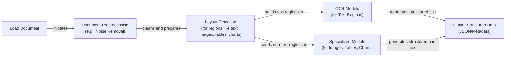
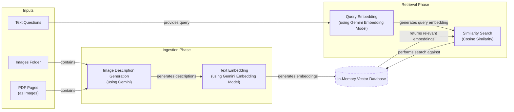
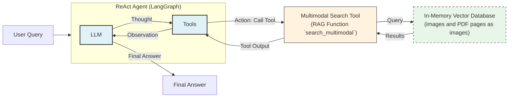

# Stop Converting Documents to Text. You're Doing It Wrong.

When we first started building AI agents, we hit a frustrating wall. We were comfortable manipulating text, but the moment we had to integrate multimodal data, such as images, audio, and especially documents like PDFs, our elegant architectures turned into messy hacks. We spent weeks building complex pipelines that tried to force everything into text. We chained OCR engines to scrape PDFs, layout detection models to identify tables, and separate classifiers to handle images. It was a brittle, slow, and expensive solution that broke every time a document layout changed.

The breakthrough came when we realized we were solving the wrong problem. We did not need to convert documents to text. We needed to treat them as images. Once we understood that every PDF page is effectively an image and that modern LLMs can “see” just as well as they can read, the complexity vanished. We could completely skip the OCR purgatory and focus on the three core inputs of an LLM: text, images, and audio.

This shift is essential because real-world AI applications rarely exist in a text-only vacuum. Enterprise applications mirror this reality. They need to manipulate private data from warehouses and lakes that is inherently multimodal: financial reports with complex charts, technical diagrams, building sketches, and audio logs. The old approach of normalizing everything to text is lossy. When you translate a complex diagram or a chart into text, you lose the spatial relationships, the colors, and the context. By processing data in its native format, we preserve this rich visual information, resulting in systems that are faster, cheaper, and more performant.

In the previous lessons, we covered the fundamentals of AI engineering, from context engineering and structured outputs to building reasoning agents with ReAct and RAG. Now, we will cover the final fundamental skill: working with multimodal data.

Here is what we will cover:
- **Limitations of Traditional Document Processing:** Why OCR-based systems fail with complex documents.
- **Foundations of Multimodal LLMs:** An intuition on how models process visual and textual tokens together.
- **Applying Multimodal LLMs:** How to work with images and PDFs using the Gemini API.
- **Multimodal RAG:** The theory and practice of building Retrieval-Augmented Generation systems for images and text.
- **Building Multimodal Agents:** A step-by-step guide to building a multimodal ReAct agent.

## Limitations of Traditional Document Processing

To understand why a multimodal-native approach is superior, let’s first examine the flaws of traditional document processing. When handling documents like invoices, reports, or technical manuals, older AI systems tried to normalize everything to text. This process relies on a fragile, multi-step pipeline that often involves Optical Character Recognition (OCR). While this seems logical, it introduces major rigidity, cost, and performance issues.

A typical workflow for processing a PDF with mixed text, diagrams, and tables involves several sequential steps [[23]](https://blog.roboflow.com/what-is-optical-character-recognition-ocr/), [[1]](https://www.daft.ai/blog/end-to-end-distributed-pdf-processing-pipeline):

1.  **Document Preprocessing:** The image is cleaned to improve quality. This includes noise removal, contrast enhancement, and correcting skewed orientation (deskewing).
2.  **Layout Detection:** A model analyzes the document to identify distinct regions like paragraphs, tables, charts, and images.
3.  **Region-Specific Processing:** Text regions are sent to an OCR model. Non-text regions, like tables or charts, are sent to specialized models designed to extract structured data from those specific formats.
4.  **Output Structuring:** The extracted text and structured data are combined into a final output, typically JSON or another structured format.


Image 1: A flowchart illustrating the traditional document processing workflow for PDFs containing mixed text, diagrams, and tables.

This workflow has too many moving pieces. You need layout detection models, OCR models for text, and specialized models for each expected data structure. This makes the system rigid. If a document contains a chart type you do not have a model for, the pipeline fails. It is also slow and costly because you have to chain multiple model calls. For example, a full pipeline involving layout detection, OCR, and captioning can take over seven seconds per page, whereas a direct multimodal approach can be 10-20 times faster [[15]](https://arxiv.org/pdf/2407.01449v6).

Most importantly, this approach is fragile and prone to performance challenges. The multi-step nature creates a cascade effect where errors compound at each stage. An error in layout detection can lead to an OCR model trying to read a chart as text, resulting in nonsensical output. This fragility is a major bottleneck in production systems [[24]](https://learn.microsoft.com/en-us/answers/questions/5668164/why-traditional-ocr-fails-for-complex-business-doc?page=1).

Even advanced OCR engines struggle with real-world documents. While they can achieve high accuracy on clean, simple layouts, their performance degrades with any complexity. Here are some common failure modes with documented performance drops:

-   **Poor Scan Quality:** Image resolution is critical. Documents scanned below 300 DPI can cause accuracy to drop by 20% or more. A 5-degree tilt, which may look minor, can increase the Word Error Rate (WER) by over 15% [[2]](https://www.llamaindex.ai/blog/ocr-accuracy). Physical artifacts like fold lines, shadows, and ink bleed further degrade performance.
-   **Complex Layouts:** Traditional OCR treats a page as a flat grid of text, failing to understand structure. This leads to errors with multi-column formats, nested tables, and overlapping text. Template-driven systems are particularly brittle and break with even minor layout changes [[3]](https://www.llamaindex.ai/blog/ocr-for-tables).
-   **Handwritten Text:** Handwriting remains a difficult problem. Even top-performing systems have a Character Error Rate (CER) of 3–5%, which is considered good but often requires human validation for high-stakes applications [[2]](https://www.llamaindex.ai/blog/ocr-accuracy).
-   **Specialized Content:** Technical documents with sketches, diagrams, or special symbols are often misinterpreted. For example, an OCR engine might confuse the diameter symbol (Ø) with a letter or fail to recognize the structure of a building sketch entirely [[25]](https://hackernoon.com/complex-document-recognition-ocr-doesnt-work-and-heres-how-you-fix-it). 
Image 2: A building sketch showing a crawl space vent diagram, illustrating the complexity of layouts that classic OCR systems struggle to interpret. (Source [Vectorize.io [[26]](https://vectorize.io/blog/multimodal-rag-patterns)])

Consider the building sketch in Image 2. A traditional OCR system would struggle to convert this into meaningful text. It would likely fail to capture the spatial relationships between the "Exterior Wall," "Rain Deflector," and the vent itself. The textual description would lose the dimensional constraints and the structural context, rendering the information useless for any downstream analysis. This is a perfect example of where text normalization fails.

While this pipeline might work for highly specialized applications with fixed document formats, it does not scale in a world where AI agents need to be flexible and fast. Modern AI solutions bypass this entire unstable workflow by using multimodal LLMs that can directly interpret images and documents as native inputs.

## Foundations of Multimodal LLMs

To use LLMs with images and documents, you need an intuition of how multimodality works. You do not need to understand every research detail, but knowing the architecture helps you deploy, optimize, and monitor them. There are two common approaches to building multimodal LLMs: the Unified Embedding Decoder Architecture and the Cross-modality Attention Architecture [[4]](https://magazine.sebastianraschka.com/p/understanding-multimodal-llms). 
Image 3: The two main approaches to developing multimodal LLM architectures. (Source [Understanding Multimodal LLMs [[4]](https://magazine.sebastianraschka.com/p/understanding-multimodal-llms)])

### Unified Embedding Decoder Architecture

In this approach, we encode the text and image separately, concatenate their embeddings into a single sequence, and pass the resulting vector to the LLM. On top of a standard LLM architecture, you need a vision encoder that maps the image to an embedding that is within the same vector space as the text. When the text and image embeddings are merged, the LLM can make sense of both [[4]](https://magazine.sebastianraschka.com/p/understanding-multimodal-llms). 
Image 4: Illustration of the unified embedding decoder architecture. (Source [Understanding Multimodal LLMs [[4]](https://magazine.sebastianraschka.com/p/understanding-multimodal-llms)])

### Cross-modality Attention Architecture

In the second approach, instead of passing the image embeddings along with the text embeddings at the input, we inject them directly into the attention module of the LLM. We still need an image encoder that projects the image into the same vector space as the text, but we inject it deeper within the architecture [[4]](https://magazine.sebastianraschka.com/p/understanding-multimodal-llms). 
Image 5: An illustration of the Cross-Modality Attention Architecture approach. (Source [Understanding Multimodal LLMs [[4]](https://magazine.sebastianraschka.com/p/understanding-multimodal-llms)])

### Image Encoders

Both architectures rely on image encoders, which function similarly to text tokenizers. Just as we split text into sub-word tokens, we split images into patches. 
Image 6: Image tokenization and embedding (left) and text tokenization and embedding (right) side by side. (Source [Understanding Multimodal LLMs [[4]](https://magazine.sebastianraschka.com/p/understanding-multimodal-llms)])

These patches are then encoded, often by a pretrained Vision Transformer (ViT), into embeddings. The output has the same structure and dimensions as text embeddings. However, to ensure the LLM can interpret them together, the image and text embeddings must be aligned in the same vector space. This alignment is achieved through a linear projection module [[4]](https://magazine.sebastianraschka.com/p/understanding-multimodal-llms). Popular image encoder models include CLIP, OpenCLIP, and SigLIP, which are all trained using contrastive learning to map semantically similar images and text descriptions close to each other in the embedding space [[5]](https://opensearch.org/blog/multimodal-semantic-search/), [[6]](https://towardsdatascience.com/multimodal-ai-search-for-business-applications-65356d011009/).

This shared embedding space is also what powers Multimodal RAG. It allows us to perform semantic similarity searches between different data types, such as finding images that match a text query or documents that are visually similar to an input image. 
Image 7: Toy representation of multimodal embedding space. (Source [Multimodal Embeddings: An Introduction [[27]](https://towardsdatascience.com/multimodal-embeddings-an-introduction-5dc36975966f/)])

### Trade-offs and Modern Landscape

The **Unified Embedding Decoder** approach is simpler to implement and generally yields higher accuracy in OCR-related tasks. The **Cross-modality Attention** approach is more computationally efficient for high-resolution images because we do not have to pass all tokens as an input sequence. Hybrid approaches, like NVIDIA's NVLM-H, exist to combine these benefits, using a low-resolution thumbnail as a unified embedding and high-resolution patches via cross-attention for finer details [[4]](https://magazine.sebastianraschka.com/p/understanding-multimodal-llms), [[7]](https://arxiv.org/abs/2409.11402).

By 2025, most leading LLMs are multimodal. Open-source examples include Llama 4, Gemma 2, Qwen3, and DeepSeek R1/V3, while closed-source leaders include GPT-5, Gemini 2.5, and Claude. These models have demonstrated strong performance on complex multimodal benchmarks like MMMU (multimodal understanding) and are redefining document-scale workflows with multi-million token context windows. For instance, models like GPT-5 and Grok 4 achieve over 88% on the GPQA Diamond benchmark for graduate-level science questions, surpassing typical human expert performance [[8]](https://medium.com/data-science-in-your-pocket/2025-the-year-ai-reasoning-models-took-over-a-month-by-month-review-of-frontier-breakthroughs-6ea2163f854f). DeepSeek R1 has also shown frontier-level reasoning, particularly in math, with heavy use of reinforcement learning [[8]](https://medium.com/data-science-in-your-pocket/2025-the-year-ai-reasoning-models-took-over-a-month-by-month-review-of-frontier-breakthroughs-6ea2163f854f).

This architecture can also be extended to other modalities like audio and video by incorporating specialized encoders for each data type. For example, a system can use a Whisper model to encode audio and a Video Transformer to encode video frames. These specialized embeddings are then aligned with the LLM's text embedding space using a projection module, allowing the model to reason across text, images, audio, and video in a unified manner [[10]](https://sparkco.ai/blog/exploring-multimodal-llms-text-image-and-video-integration), [[11]](https://www.emergentmind.com/topics/multimodal-llms).

It is also important to distinguish multimodal LLMs from diffusion models like Midjourney or Stable Diffusion. Diffusion models are generative models that create images from noise, using an iterative denoising process. They are architecturally different from autoregressive LLMs, which focus on next-token prediction for understanding and text generation [[12]](https://arxiv.org/html/2409.14993v3). In an agentic workflow, diffusion models are typically used as tools for image creation, invoked by a reasoning LLM, rather than serving as the agent's core reasoning engine [[4]](https://magazine.sebastianraschka.com/p/understanding-multimodal-llms), [[13]](https://docs.anyscale.com/llm).

Now that we understand how LLMs can directly process images and documents, let’s see how this works in practice.

## Applying Multimodal LLMs to Images and PDFs

To better understand how multimodal LLMs work, let’s write a few examples using Gemini to show some best practices when working with images and PDFs. There are three core ways to process multimodal data with LLMs: as raw bytes, Base64, and URLs.

-   **Raw bytes:** This is the easiest method for one-off API calls. However, storing raw bytes directly in most databases is risky, as they often interpret the data as text and can cause corruption. This happens because databases may misinterpret certain byte sequences as control characters or apply incorrect text encodings, leading to data loss.
-   **Base64:** This method encodes raw bytes as strings, making them safe to store in databases like PostgreSQL or MongoDB. The main downside is a file size increase of approximately 33%, which can impact storage costs and performance, especially at scale.
-   **URLs:** This is the standard for enterprise scenarios. Data is stored in a data lake like AWS S3 or GCP Buckets, and the LLM downloads the media directly. This approach reduces network latency for your application and is the most efficient option for scale. For private data, this requires careful management of security and access controls, often using signed URLs or IAM roles to grant temporary, secure access to the LLM service.

Here is a quick comparison of the three methods.

| Method | Pros | Cons | Best For |
| :--- | :--- | :--- | :--- |
| **Raw Bytes** | Simple, no encoding overhead. | High risk of data corruption in databases. | One-off API calls without storage. |
| **Base64** | Database-safe, avoids corruption. | ~33% larger file size, higher storage cost. | Storing data directly in a database. |
| **URLs** | Most efficient, reduces network latency. | Requires data lake setup and access control. | Enterprise-scale applications. |

Table 1: A comparison of methods for passing multimodal data to LLMs.

Now, let’s dig into the code. We will show you a couple of simple examples of how to manipulate images and PDFs with these three methods using the Google GenAI SDK.

### Setup

First, we set up our client and display a sample image. We will use `gemini-2.5-flash`, which is fast and cost-effective.

1.  We define some helper functions and initialize the Gemini client.
    ```python
    from google import genai
    from google.genai import types
    from PIL import Image as PILImage
    from IPython.display import Image as IPythonImage
    import io
    from pathlib import Path
    
    client = genai.Client()
    MODEL_ID = "gemini-2.5-flash"
    
    def display_image(image_path: Path) -> None:
        image = IPythonImage(filename=image_path, width=400)
        display(image)
    ```

2.  Let's look at our test image.
    ```python
    display_image(Path("images") / "image_1.jpeg")
    ```
    It outputs:
    
    
    

### Processing Images

Let's see how we can process images as raw bytes, Base64, and URLs.

1.  First, we define a helper function to load an image as raw bytes. We use the `WEBP` format because it is efficient.
    ```python
    def load_image_as_bytes(
        image_path: Path, format: str = "WEBP", max_width: int = 600, return_size: bool = False
    ):
        image = PILImage.open(image_path)
        if image.width > max_width:
            ratio = max_width / image.width
            new_size = (max_width, int(image.height * ratio))
            image = image.resize(new_size)
    
        byte_stream = io.BytesIO()
        image.save(byte_stream, format=format)
    
        if return_size:
            return byte_stream.getvalue(), image.size
    
        return byte_stream.getvalue()
    ```

2.  We can now load the image as raw bytes and generate a caption.
    ```python
    image_bytes = load_image_as_bytes(image_path=Path("images") / "image_1.jpeg", format="WEBP")
    
    response = client.models.generate_content(
        model=MODEL_ID,
        contents=[
            types.Part.from_bytes(
                data=image_bytes,
                mime_type="image/webp",
            ),
            "Tell me what is in this image in one paragraph.",
        ],
    )
    print(response.text)
    ```
    It outputs:
    ```text
    This striking image features a massive, dark metallic robot, its powerful form detailed with intricate circuit patterns on its head and piercing red glowing eyes. Perched playfully on its right arm is a small, fluffy grey tabby kitten, its front paw raised as if exploring or batting at the robot's armored limb, while its gaze is directed slightly off-frame. The robot's large, segmented hand is visible beneath the kitten. The background suggests an industrial or workshop environment, with hints of metal structures and natural light filtering in from an unseen window, creating a dramatic contrast between the soft, vulnerable kitten and the formidable, mechanical sentinel.
    ```

3.  We can also process the image as a Base64 encoded string. Notice that the logic is similar, but we encode the bytes first.
    ```python
    import base64
    
    image_base64 = base64.b64encode(image_bytes).decode("utf-8")
    
    print(f"Image as Base64 is {(len(image_base64) - len(image_bytes)) / len(image_bytes) * 100:.2f}% larger than as bytes")
    
    response = client.models.generate_content(
        model=MODEL_ID,
        contents=[
            types.Part.from_bytes(data=image_base64, mime_type="image/webp"),
            "Tell me what is in this image in one paragraph.",
        ],
    )
    ```
    It outputs:
    ```text
    Image as Base64 is 33.34% larger than as bytes
    ```

4.  For public URLs, Gemini's `url_context` tool allows us to process documents directly from the web.
    ```python
    response = client.models.generate_content(
        model=MODEL_ID,
        contents="Based on the provided paper as a PDF, tell me how ReAct works: https://arxiv.org/pdf/2210.03629",
        config=types.GenerateContentConfig(tools=[{"url_context": {}}]),
    )
    ```

5.  For private data lakes, such as Google Cloud Storage, the process is also straightforward, though we will show mocked code for simplicity.
    ```python
    response = client.models.generate_content(
        model=MODEL_ID,
        contents=[
            types.Part.from_uri(uri="gs://gemini-images/image_1.jpeg", mime_type="image/webp"),
            "Tell me what is in this image in one paragraph.",
        ],
    )
    ```

### Object Detection with LLMs

Let's try a more complex task: object detection. We use Pydantic to define the output structure, a technique we covered in Lesson 4.

1.  First, we define our Pydantic models for bounding boxes and detections.
    ```python
    from pydantic import BaseModel, Field
    
    class BoundingBox(BaseModel):
        ymin: float
        xmin: float
        ymax: float
        xmax: float
        label: str = Field(
            default="The category of the object found within the bounding box. For example: cat, dog, diagram, robot."
        )
    
    class Detections(BaseModel):
        bounding_boxes: list[BoundingBox]
    ```

2.  Then, we create the prompt and call the LLM, specifying the JSON response schema.
    ```python
    prompt = """
    Detect all of the prominent items in the image. 
    The box_2d should be [ymin, xmin, ymax, xmax] normalized to 0-1000.
    Also, output the label of the object found within the bounding box.
    """
    
    image_bytes, image_size = load_image_as_bytes(
        image_path=Path("images") / "image_1.jpeg", format="WEBP", return_size=True
    )
    
    config = types.GenerateContentConfig(
        response_mime_type="application/json",
        response_schema=Detections,
    )
    
    response = client.models.generate_content(
        model=MODEL_ID,
        contents=[
            types.Part.from_bytes(
                data=image_bytes,
                mime_type="image/webp",
            ),
            prompt,
        ],
        config=config,
    )
    
    detections = response.parsed
    ```

3.  Finally, we can visualize the detected bounding boxes on the image.
    
     
    Image 8: Object detection results for our sample image, with bounding boxes for "kitten" and "robot".

### Working with PDFs

Because we are using a multimodal model, processing PDFs is nearly identical to processing images. Let's use the famous "Attention Is All You Need" paper as an example [[14]](https://arxiv.org/html/2411.06284v3).

1.  We can pass the PDF as raw bytes to get a summary.
    ```python
    pdf_bytes = (Path("pdfs") / "attention_is_all_you_need_paper.pdf").read_bytes()
    
    response = client.models.generate_content(
        model=MODEL_ID,
        contents=[
            types.Part.from_bytes(data=pdf_bytes, mime_type="application/pdf"),
            "What is this document about? Provide a brief summary of the main topics.",
        ],
    )
    ```
    It outputs:
    ```text
    This document introduces the **Transformer**, a novel neural network architecture designed for **sequence transduction tasks** (like machine translation)...
    ```

2.  We can also perform object detection on a PDF page by treating it as an image. This is powerful for extracting diagrams or tables without traditional OCR. This concept was popularized by the ColPali paper, which demonstrated that modern Vision Language Models (VLMs) can retrieve documents more effectively by "looking" at them [[15]](https://arxiv.org/pdf/2407.01449v6).
    ```python
    page_image_bytes = load_image_as_bytes(Path("images") / "attention_is_all_you_need_1.jpeg")
    
    prompt = "Detect all the diagrams from the provided image as 2d bounding boxes."
    
    response = client.models.generate_content(
        model=MODEL_ID,
        contents=[types.Part.from_bytes(data=page_image_bytes, mime_type="image/webp"), prompt],
        config=types.GenerateContentConfig(
            response_mime_type="application/json",
            response_schema=Detections
        ),
    )
    ```
    
     
    Image 9: Object detection on a page from the "Attention Is All You Need" paper, successfully identifying the model architecture diagram.

## Foundations of Multimodal RAG

One of the most common use cases when working with multimodal data is Retrieval-Augmented Generation (RAG), a concept we explored in Lesson 10. When building custom AI applications, you will almost always need to retrieve private company data to feed into your LLM. For large data formats like images or PDFs, RAG is even more critical. Stuffing thousands of PDF pages into a large context window is unfeasible due to increased latency, cost, and the "lost-in-the-middle" performance degradation.

A generic multimodal RAG architecture for images and text involves two main phases:

-   **Ingestion:** Images are embedded using a text-image embedding model, and these embeddings are loaded into a vector database.
-   **Retrieval:** A user's text query is embedded using the same model. The vector database is then queried to find the top-k most similar images based on vector similarity (e.g., cosine distance).

```mermaid
flowchart LR
  %% Ingestion Pipeline
  subgraph Ingestion["Ingestion Pipeline"]
    Images["Images"] --> EmbedImages["Embed Images<br/>(Text-Image Embedding Model)"]
  end

  %% Shared Vector Space
  VectorDB[(Vector Database<br/>(Vector Index for Images))]

  EmbedImages -- "Load Embeddings" --> VectorDB

  %% Retrieval Pipeline
  subgraph Retrieval["Retrieval Pipeline"]
    UserQuery["User Text Query"] --> EmbedQuery["Embed Query<br/>(Text-Image Embedding Model)"]
    EmbedQuery -- "Embeds Query" --> QueryDB["Query Vector Database<br/>(using Query Embedding)"]
    QueryDB --> RetrieveImages["Retrieve Top-K Similar Images<br/>(based on Cosine Distance)"]
  end

  VectorDB -- "Provides Image Embeddings" --> QueryDB
```
Image 10: A flowchart illustrating a generic multimodal RAG system for images and text, showing ingestion and retrieval pipelines and a shared vector database.

This technique can be enhanced with hybrid search, which combines dense vector search with traditional keyword search on metadata (like filenames or captions) to improve relevance. This is particularly useful in e-commerce, where a customer might search for "red summer dress" (text) and expect to see visually similar items, even if their product descriptions vary [[28]](https://www.snowflake.com/en/engineering-blog/arctic-agentic-rag-multimodal-pdf-retrieval/).

For enterprise document RAG, the state-of-the-art architecture as of 2025 is **ColPali**. Its key innovation is bypassing the entire OCR pipeline. Instead of extracting text, ColPali processes document pages as images, using a Vision-Language Model to understand both textual and visual content simultaneously. This is especially effective for documents with complex layouts like tables and figures [[15]](https://arxiv.org/pdf/2407.01449v6).

ColPali divides a document image into patches and generates a "bag-of-embeddings" (or multi-vector representation) for each page. This captures fine-grained details far better than a single-vector embedding. This multi-vector approach enables a "late interaction" mechanism. Instead of comparing a single query vector to a single document vector, late interaction assesses similarity at a finer grain. For each token in the query, the model finds its maximum similarity (e.g., via dot-product) across all the patch embeddings in the document. These maximum scores are then summed up to produce the final relevance score, a process known as MaxSim [[17]](https://www.emergentmind.com/topics/multi-vector-models), [[18]](https://milvus.io/docs/use_ColPali_with_milvus.md). This allows the model to match specific concepts, visual regions, and even morphological variants with high precision.

While powerful, this late interaction creates a computational challenge. The number of floating-point operations for MaxSim scales with the number of query tokens, document patches, and the vector dimension. At production scale, this can lead to prohibitive latency. A ColPali page embedding can be over 250 KB, and query encoding alone takes around 30 ms [[19]](https://arxiv.org/html/2407.01449v4). To mitigate this, production systems like Vespa use binary quantization to convert the 128-dimension float vectors into 128-bit binary vectors. This allows the use of the much faster hamming distance for similarity calculations, which can be 3.5 times faster than float dot products with only a minor drop in accuracy [[20]](https://blog.vespa.ai/scaling-colpali-to-billions/).

On the ViDoRe benchmark, ColPali achieves an 81.3% average Normalized Discounted Cumulative Gain (nDCG@5), outperforming traditional OCR-based systems while being up to 10 times faster [[15]](https://arxiv.org/pdf/2407.01449v6). Its effectiveness is particularly notable in finance, where robust variants have demonstrated a 25–30% improvement in nDCG@5 on table-heavy benchmarks like FinReport compared to baseline models [[21]](https://arxiv.org/html/2502.12342v1).

## Implementing Multimodal RAG for Images, PDFs and Text

Let's build a simplified multimodal RAG system to solidify these concepts. We will populate an in-memory vector index with images and pages from the "Attention Is All You Need" paper, then query it with text questions. To keep the example focused, we will not implement image patching or a ColBERT reranker.


Image 11: A flowchart illustrating the simplified multimodal RAG mini-project, showing ingestion and retrieval phases with an in-memory vector database.

1.  First, we define a function to create our vector index. Since the Gemini API used in this notebook does not support direct image embedding, we will generate a text description for each image and embed that instead. This is a workaround for this example. In a production system, you would use a multimodal embedding model like Voyage AI or Cohere to embed the image bytes directly [[22]](https://milvus.io/blog/choose-embedding-model-rag-2026.md). The rest of the RAG pipeline would remain the same.
    ```python
    def generate_image_description(image_bytes: bytes) -> str:
        prompt = """
        Describe this image in detail for semantic search purposes. 
        Include objects, scenery, colors, composition, text, and any other visual elements that would help someone find 
        this image through text queries.
        """
        response = client.models.generate_content(model=MODEL_ID, contents=[prompt, PILImage.open(io.BytesIO(image_bytes))])
        return response.text.strip() if response and response.text else ""
        
    def embed_text_with_gemini(content: str):
        result = client.models.embed_content(model="gemini-embedding-001", contents=[content])
        return np.array(result.embeddings[0].values) if result and result.embeddings else None
    
    def create_vector_index(image_paths: list[Path]) -> list[dict]:
        vector_index = []
        for image_path in image_paths:
            image_bytes = load_image_as_bytes(image_path, format="WEBP")
            image_description = generate_image_description(image_bytes)
    
            # In production, you would embed the image bytes directly:
            # image_embedding = embed_with_multimodal_model(image_bytes)
            image_embedding = embed_text_with_gemini(image_description)
    
            vector_index.append(
                {
                    "content": image_bytes,
                    "filename": image_path,
                    "description": image_description,
                    "embedding": image_embedding,
                }
            )
        return vector_index
    
    image_paths = list(Path("images").glob("*.jpeg"))
    vector_index = create_vector_index(image_paths)
    ```
    In a real application with a multimodal embedding model, the code would look like this, skipping the description generation step:
    ```python
    # SKIPPED!
    # image_description = generate_image_description(image_bytes)
    
    # Embed image bytes directly
    image_embedding = embed_with_multimodal_model(image_bytes)
    ```
    An element in our `vector_index` contains the image content, filename, description, and the embedding vector.
    ```python
    print(vector_index[0].keys())
    ```
    It outputs:
    ```text
    dict_keys(['content', 'filename', 'description', 'embedding'])
    ```

2.  Next, we define a search function that embeds a text query and finds the most similar images in our index using cosine similarity.
    ```python
    from sklearn.metrics.pairwise import cosine_similarity
    import numpy as np
    
    def search_multimodal(query_text: str, vector_index: list[dict], top_k: int = 3) -> list:
        query_embedding = embed_text_with_gemini(query_text)
        if query_embedding is None:
            return []
    
        embeddings = [doc["embedding"] for doc in vector_index]
        similarities = cosine_similarity([query_embedding], embeddings).flatten()
    
        top_indices = np.argsort(similarities)[::-1][:top_k]
    
        results = []
        for idx in top_indices.tolist():
            results.append({**vector_index[idx], "similarity": similarities[idx]})
    
        return results
    ```

3.  Now, let's test our RAG system with a query about the Transformer architecture.
    ```python
    query = "what is the architecture of the transformer neural network?"
    results = search_multimodal(query, vector_index, top_k=1)
    
    if results:
        result = results[0]
        print(f"Similarity: {result['similarity']:.3f}")
        print(f"Filename: {result['filename']}")
        display_image(Path(result["filename"]))
    ```
    It outputs:
    ```text
    Similarity: 0.744
    Filename: images/attention_is_all_you_need_1.jpeg
    ```
    
    
    

4.  Let's try another query to find the image of a kitten with a robot.
    ```python
    query = "a kitten with a robot"
    results = search_multimodal(query, vector_index, top_k=1)
    # ... display results
    ```
    It outputs:
    ```text
    Similarity: 0.811
    Filename: images/image_1.jpeg
    ```
    
    
    
    Our simple RAG system successfully retrieved the correct document page for a technical question and the correct image for a descriptive query, demonstrating the power of shared embedding spaces.

## Building Multimodal AI Agents

To integrate these concepts, let's build a ReAct agent that uses our multimodal RAG function as a tool. This will give our agent the ability to "see" and reason about visual information, consolidating the skills we have learned across Part 1 of this course.

Multimodal capabilities enhance agents by allowing them to process visual inputs and use tools that operate on images, documents, or even audio and video. An agent could, for example, take a screenshot of a user's screen to understand their current context, analyze a product image to answer a customer query, or process a PDF from a Google Drive to extract information. For this example, we will use LangGraph's `create_react_agent` to build an agent that uses our `search_multimodal` function as a tool.


Image 12: A flowchart illustrating the multimodal ReAct + RAG agent example, emphasizing the iterative Thought-Action-Observation cycle.

1.  First, we wrap our `search_multimodal` function in a LangChain tool decorator. The tool's output will include both the text description and the image content, allowing the agent to "see" the retrieved result directly in its context.
    ```python
    from langchain_core.tools import tool
    
    @tool
    def multimodal_search_tool(query: str) -> dict:
        """
        Search through a collection of images and their text descriptions to find relevant content.
        """
        results = search_multimodal(query, vector_index, top_k=1)
    
        if not results:
            return {"role": "tool_result", "content": "No relevant content found."}
        
        result = results[0]
        content = [
            {"type": "text", "text": f"Image description: {result['description']}"},
            types.Part.from_bytes(data=result["content"], mime_type="image/jpeg"),
        ]
        return {"role": "tool_result", "content": content}
    ```

2.  Next, we define a function to build our ReAct agent. We provide a system prompt that guides the agent to use its multimodal search tool when asked about visual content. We will explore LangGraph in more detail in Part 2 of the course.
    ```python
    from langgraph.prebuilt import create_react_agent
    from langchain_google_genai import ChatGoogleGenerativeAI
    
    def build_react_agent():
        tools = [multimodal_search_tool]
        system_prompt = """You are a helpful AI assistant that can search through images and text to answer questions.
    
        When asked about visual content like animals, objects, or scenes:
        1. Use the multimodal_search_tool to find relevant images and descriptions
        2. Carefully analyze the image or image descriptions from the search results
        3. Look for specific details like colors, features, objects, or characteristics
        4. Provide a clear, direct answer based on the search results
        5. If you can't find the specific information requested, be honest about limitations
        
        Pay special attention to:
        - Colors and visual characteristics
        - Animal features and breeds
        - Objects and their properties
        - Scene descriptions and context
        
        Always search first using your tools before attempting to answer questions about specific images or visual content.
        """
    
        agent = create_react_agent(
            model=ChatGoogleGenerativeAI(model="gemini-2.5-pro", temperature=0.1),
            tools=tools,
            prompt=system_prompt,
        )
        return agent
    
    react_agent = build_react_agent()
    ```

3.  Finally, let's ask the agent about the color of the kitten from our dataset.
    ```python
    test_question = "what color is my kitten?"
    response = react_agent.invoke(input={"messages": test_question})
    final_message = response.get("messages", [])[-1].content
    print(final_message)
    ```
    The agent follows the ReAct loop. First, it reasons that it needs to find an image of a kitten. It decides to act by calling the `multimodal_search_tool` with the query "my kitten". The tool executes, finds the relevant image, and returns it as an observation. The agent then analyzes this new information in its context and formulates the final answer.
    
    It outputs:
    ```text
    Based on the image, your kitten is a gray tabby. It has soft, short gray fur with darker tabby stripe patterns.
    ```

## Conclusion

Working with multimodal data is a fundamental skill for AI engineers. Modern AI applications rarely exist in a text-only vacuum; they must interact with the complex, visual, and auditory reality of the world. In this lesson, we moved away from unstable, multi-step OCR pipelines and learned that modern LLMs can natively process images and documents, preserving rich context that was previously lost. We explored how to handle data as bytes, Base64, and URLs, and how to build agents that can reason across these modalities.

This concludes Part 1 of our course on AI Agents and LLM Workflows. You now have the foundational blocks to build production-ready AI systems. In Part 2, we will move from theory to practice, diving into agentic design patterns and building our central project: an interconnected research and writing agent system using LangGraph.

## References

- [1] [End-to-end Distributed PDF Processing Pipeline](https://www.daft.ai/blog/end-to-end-distributed-pdf-processing-pipeline)
- [2] [OCR Accuracy Explained: How to Improve It](https://www.llamaindex.ai/blog/ocr-accuracy)
- [3] [How to Build a RAG Pipeline for Question Answering over Tables in PDFs](https://www.llamaindex.ai/blog/ocr-for-tables)
- [4] [Understanding Multimodal LLMs](https://magazine.sebastianraschka.com/p/understanding-multimodal-llms)
- [5] [Multimodal semantic search with OpenSearch](https://opensearch.org/blog/multimodal-semantic-search/)
- [6] [Multimodal AI Search for Business Applications](https://towardsdatascience.com/multimodal-ai-search-for-business-applications-65356d011009/)
- [7] [NVLM: Open Frontier-Class Multimodal LLMs](https://arxiv.org/abs/2409.11402)
- [8] [2025: The Year AI Reasoning Models Took Over — A Month-by-Month Review of Frontier Breakthroughs](https://medium.com/data-science-in-your-pocket/2025-the-year-ai-reasoning-models-took-over-a-month-by-month-review-of-frontier-breakthroughs-6ea2163f854f)
- [9] [The Ultimate Guide to the Top Large Language Models in 2025](https://codedesign.ai/blog/the-ultimate-guide-to-the-top-large-language-models-in-2025/)
- [10] [Exploring Multimodal LLMs: Text, Image, and Video Integration](https://sparkco.ai/blog/exploring-multimodal-llms-text-image-and-video-integration)
- [11] [Multimodal LLMs](https://www.emergentmind.com/topics/multimodal-llms)
- [12] [Multi-modal Generative AI: Multi-modal LLMs, Diffusions, and the Unification](https://arxiv.org/html/2409.14993v3)
- [13] [Large Language Models (LLMs)](https://docs.anyscale.com/llm)
- [14] [A Survey on Multimodal Large Language Models](https://arxiv.org/html/2411.06284v3)
- [15] [ColPali: Efficient Document Retrieval with Vision Language Models](https://arxiv.org/pdf/2407.01449v6)
- [16] [Scale creative asset discovery with Amazon Nova multimodal embeddings and unified vector search](https://aws.amazon.com/blogs/machine-learning/scale-creative-asset-discovery-with-amazon-nova-multimodal-embeddings-unified-vector-search/)
- [17] [Multi-vector Models](https://www.emergentmind.com/topics/multi-vector-models)
- [18] [How to Use ColPali with Milvus](https://milvus.io/docs/use_ColPali_with_milvus.md)
- [19] [ColPali: Efficient Document Retrieval with Vision Language Models](https://arxiv.org/html/2407.01449v4)
- [20] [Scaling ColPali to billions of PDFs with Vespa](https://blog.vespa.ai/scaling-colpali-to-billions/)
- [21] [Robustifying Document Retrieval with Vision-Language Models](https://arxiv.org/html/2502.12342v1)
- [22] [How to Choose the Best Embedding Model for RAG in 2026: 10 Models Benchmarked](https://milvus.io/blog/choose-embedding-model-rag-2026.md)
- [23] [What Is Optical Character Recognition (OCR)?](https://blog.roboflow.com/what-is-optical-character-recognition-ocr/)
- [24] [Why traditional OCR fails for complex business documents?](https://learn.microsoft.com/en-us/answers/questions/5668164/why-traditional-ocr-fails-for-complex-business-doc?page=1)
- [25] [Complex Document Recognition: OCR Doesn’t Work and Here’s How You Fix It](https://hackernoon.com/complex-document-recognition-ocr-doesnt-work-and-heres-how-you-fix-it)
- [26] [Multimodal RAG Patterns](https://vectorize.io/blog/multimodal-rag-patterns)
- [27] [Multimodal Embeddings: An Introduction](https://towardsdatascience.com/multimodal-embeddings-an-introduction-5dc36975966f/)
- [28] [Arctic Agentic RAG: Multimodal PDF Retrieval with Cortex Search](https://www.snowflake.com/en/engineering-blog/arctic-agentic-rag-multimodal-pdf-retrieval/)
</article>