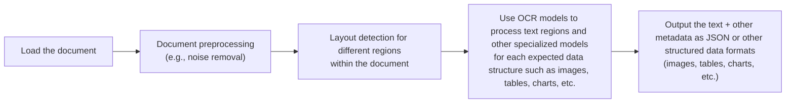
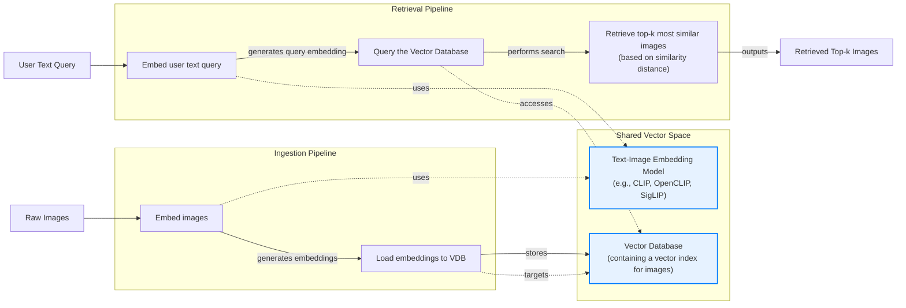
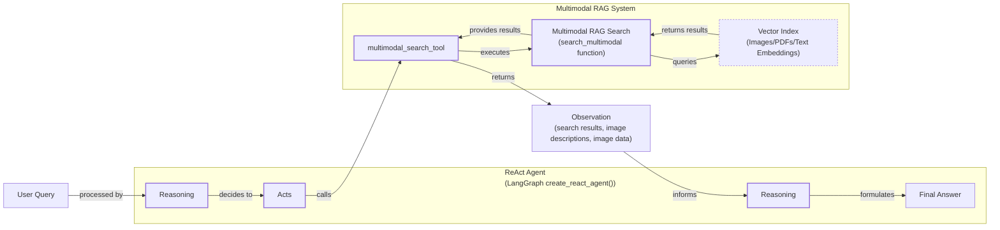

# Stop Converting Documents to Text. You're Doing It Wrong.

In our previous lessons, we built a foundation in AI engineering, covering context engineering, structured outputs, and how to build ReAct agents with tools and memory. Now, we address the final piece of the puzzle: multimodal data. When we first started building AI agents, we hit a frustrating wall. Our systems worked with text, but integrating images and PDFs turned our architectures into messy hacks. We spent weeks forcing everything into text using complex OCR pipelines—a brittle and expensive solution.

The breakthrough was realizing we were solving the wrong problem. We did not need to convert documents to text; we needed to treat them as images. This shift is essential because real-world enterprise applications are inherently multimodal, dealing with financial reports, technical diagrams, and medical scans. Normalizing this data to text is lossy, discarding the rich visual context. By processing data in its native format, we build systems that are faster, cheaper, and more performant. This lesson covers the limitations of traditional document processing, the foundations of multimodal LLMs, and provides a hands-on guide to building multimodal RAG systems and ReAct agents.

## Limitations of Traditional Document Processing

To understand why natively multimodal approaches are superior, let's first examine the flaws in traditional document processing for tasks like handling invoices, reports, or technical documentation. The core problem is that these older methods try to normalize everything to text before it reaches an AI model, losing a substantial amount of information during the translation. For example, it is impossible to fully reproduce diagrams, charts, or sketches in text.

The typical workflow relies on a multi-step pipeline involving layout detection and Optical Character Recognition (OCR).

Image 1: A flowchart illustrating the traditional document processing workflow.


This workflow has too many moving pieces. It requires layout detection models, OCR models for text, and specialized models for each expected data structure, making the system rigid, slow, and costly. More importantly, it is fragile. The multi-step nature creates a cascade effect where errors compound at each stage. Even advanced OCR engines struggle with handwritten text, poor-quality scans, or complex layouts like nested tables and building sketches, with accuracy dropping by over 20% on documents scanned below 300 DPI [[1]](https://www.llamaindex.ai/blog/ocr-accuracy), [[2]](https://hackernoon.com/complex-document-recognition-ocr-doesnt-work-and-heres-how-you-fix-it).

https://substackcdn.com/image/fetch/f_auto,q_auto:good,fl_progressive:steep/https%3A%2F%2Fsubstack-post-media.s3.amazonaws.com%2Fpublic%2Fimages%2Fa2dc40f3-dc13-486e-853d-8404368f4d8d_1616x1000.png 
Image 2: A building sketch showing a crawl space vent diagram, illustrating the complexity of layouts that classic OCR systems struggle to interpret. (Source [Vectorize.io](https://vectorize.io/blog/multimodal-rag-patterns) [[8]](https://vectorize.io/blog/multimodal-rag-patterns))

This approach might work for highly specialized applications, but it does not scale in a world of flexible and fast AI agents. That is why modern AI solutions use multimodal LLMs that can directly interpret text, images, or PDFs as native input, completely bypassing this unstable OCR workflow. Thus, let’s understand how they work.

## Foundations of Multimodal LLMs

Before we write any code, you need an intuition for how multimodal LLMs work. There are two common approaches: the Unified Embedding Decoder Architecture and the Cross-modality Attention Architecture [[3]](https://magazine.sebastianraschka.com/p/understanding-multimodal-llms).

https://substackcdn.com/image/fetch/f_auto,q_auto:good,fl_progressive:steep/https%3A%2F%2Fsubstack-post-media.s3.amazonaws.com%2Fpublic%2Fimages%2F76f50b57-2585-4cb8-8dda-eea5b5f81c03_1456x854.jpeg 
Image 3: The two main approaches to developing multimodal LLM architectures. (Source [Understanding Multimodal LLMs](https://magazine.sebastianraschka.com/p/understanding-multimodal-llms) [[3]](https://magazine.sebastianraschka.com/p/understanding-multimodal-llms))

The **Unified Embedding Decoder** approach encodes text and images separately, then concatenates their embeddings as input to the LLM [[3]](https://magazine.sebastianraschka.com/p/understanding-multimodal-llms).

https://substackcdn.com/image/fetch/f_auto,q_auto:good,fl_progressive:steep/https%3A%2F%2Fsubstack-post-media.s3.amazonaws.com%2Fpublic%2Fimages%2Fa0979e82-2fb0-4f78-80c8-1395511e057f_1166x1400.jpeg 
Image 4: Illustration of the unified embedding decoder architecture. (Source [Understanding Multimodal LLMs](https://magazine.sebastianraschka.com/p/understanding-multimodal-llms) [[3]](https://magazine.sebastianraschka.com/p/understanding-multimodal-llms))

The **Cross-modality Attention** approach injects image embeddings deeper into the LLM's attention mechanism [[3]](https://magazine.sebastianraschka.com/p/understanding-multimodal-llms).

https://substackcdn.com/image/fetch/f_auto,q_auto:good,fl_progressive:steep/https%3A%2F%2Fsubstack-post-media.s3.amazonaws.com%2Fpublic%2Fimages%2Fea1b9ee4-0d19-4c3c-89db-06e779653da2_1296x1338.jpeg 
Image 5: An illustration of the Cross-Modality Attention Architecture approach. (Source [Understanding Multimodal LLMs](https://magazine.sebastianraschka.com/p/understanding-multimodal-llms) [[3]](https://magazine.sebastianraschka.com/p/understanding-multimodal-llms))

Both rely on image encoders, which use a Vision Transformer (ViT) to convert image patches into embeddings [[3]](https://magazine.sebastianraschka.com/p/understanding-multimodal-llms).

https://substackcdn.com/image/fetch/f_auto,q_auto:good,fl_progressive:steep/https%3A%2F%2Fsubstack-post-media.s3.amazonaws.com%2Fpublic%2Fimages%2Ffef5f8cb-c76c-4c97-9771-7fdb87d7d8cd_1600x1135.png 
Image 6: A classic vision transformer (ViT) setup used for encoding image patches. (Source [Understanding Multimodal LLMs](https://magazine.sebastianraschka.com/p/understanding-multimodal-llms) [[3]](https://magazine.sebastianraschka.com/p/understanding-multimodal-llms))

A projection module aligns these into the same vector space as text embeddings, enabling cross-modal understanding [[3]](https://magazine.sebastianraschka.com/p/understanding-multimodal-llms).

https://substackcdn.com/image/fetch/f_auto,q_auto:good,fl_progressive:steep/https%3A%2F%2Fsubstack-post-media.s3.amazonaws.com%2Fpublic%2Fimages%2F0d56ea06-d202-4eb7-9e01-9aac492ee309_1522x1206.png 
Image 7: Image tokenization and embedding (left) and text tokenization and embedding (right) side by side. (Source [Understanding Multimodal LLMs](https://magazine.sebastianraschka.com/p/understanding-multimodal-llms) [[3]](https://magazine.sebastianraschka.com/p/understanding-multimodal-llms))

This shared space powers multimodal RAG by allowing semantic similarity searches between text and images [[4]](https://towardsdatascience.com/multimodal-embeddings-an-introduction-5dc36975966f/).

https://substackcdn.com/image/fetch/f_auto,q_auto:good,fl_progressive:steep/https%3A%2F%2Fsubstack-post-media.s3.amazonaws.com%2Fpublic%2Fimages%2F3d4c837a-a3e5-4d60-97ce-c4d4faf4cf57_841x616.png 
Image 8: Toy representation of multimodal embedding space. (Source [Multimodal Embeddings: An Introduction](https://towardsdatascience.com/multimodal-embeddings-an-introduction-5dc36975966f/) [[4]](https://towardsdatascience.com/multimodal-embeddings-an-introduction-5dc36975966f/))

The Unified Embedding approach is simpler, while the Cross-modality Attention approach is more efficient for high-resolution images [[5]](https://arxiv.org/abs/2409.11402). As of 2025, most leading LLMs are multimodal. It is also important to distinguish these from diffusion models like Midjourney, which are specialized for image generation and typically used as tools within an agent workflow [[6]](https://arxiv.org/html/2409.14993v3). Now that we have an intuition for how these models work, let's see them in practice.

## Applying Multimodal LLMs to Images and PDFs

To see how multimodal LLMs work, let's walk through some best practices for handling images and PDFs with Gemini. There are three core ways to process this data: as raw bytes, Base64-encoded strings, or URLs.

*   **Raw bytes** are simple for one-off API calls but risk corruption when stored in databases that misinterpret them as text.
*   **Base64** encodes bytes into strings, allowing safe storage in databases like PostgreSQL. The trade-off is a file size increase of about 33%.
*   **URLs** are the standard for enterprise applications. Data is stored in a data lake (e.g., AWS S3), and the LLM downloads it directly, reducing network latency.

Image 9: A diagram comparing the Base64 + database approach with the URL + data lake approach for handling multimodal data.
```mermaid
graph TD
    subgraph "Base64 + Database"
        A[Image/PDF] --> B{Encode to Base64};
        B --> C[Store as String in DB<br/>(e.g., PostgreSQL, MongoDB)];
        C --> D[Retrieve String from DB];
        D --> E{Decode from Base64};
        E --> F((LLM API));
    end

    subgraph "URL + Data Lake"
        G[Image/PDF] --> H[Upload to Data Lake<br/>(e.g., S3, GCS)];
        H --> I[Store URL in DB];
        I --> J[Retrieve URL from DB];
        J --> K((LLM API<br/>downloads directly));
    end
```

Let's look at some short examples. We can pass an image as raw bytes to generate a caption or compare multiple images.
```python
# Pseudocode for comparing multiple images
image_bytes_1 = load_image_as_bytes("image1.webp")
image_bytes_2 = load_image_as_bytes("image2.webp")
response = client.generate_content([
    image_bytes_1, 
    image_bytes_2, 
    "What’s the difference between these two images?"
])
print(response.text)
# Output: "The primary difference... is the nature of the interaction..."
```
You can also process images as Base64-encoded strings, which is useful for database storage.
```python
# Pseudocode for image captioning with Base64
image_base64 = load_image_as_base64("image.webp")
response = client.generate_content([
    {"inline_data": {"data": image_base64, "mime_type": "image/webp"}},
    "Caption this image."
])
print(response.text)
```
For public documents, you can pass a URL directly.
```python
# Pseudocode for processing a public PDF URL
response = client.generate_content(
    contents="Summarize this paper: https://arxiv.org/pdf/2210.03629",
    config={"tools": [{"url_context": {}}]}
)
print(response.text)
# Output: "The ReAct (Reasoning and Acting) paradigm is a method..."
```
For more complex tasks like object detection, we can define a Pydantic schema and configure the model to return structured JSON.
```python
# Pseudocode for object detection
prompt = "Detect all prominent items. Return 2d boxes normalized to 0-1000."
response = client.generate_content(
    contents=[image_bytes, prompt],
    config={"response_mime_type": "application/json", "response_schema": Detections}
)
# response.parsed contains Pydantic objects
```
https://substackcdn.com/image/fetch/f_auto,q_auto:good,fl_progressive:steep/https%3A%2F%2Fsubstack-post-media.s3.amazonaws.com%2Fpublic%2Fimages%2Fa2eaed1f-bedb-4c33-98b3-96fa7424f0ad_566x590.png 
Image 10: Object detection results for the sample image.

Processing PDFs works identically. To extract specific elements like diagrams, we treat the PDF page as an image. This approach, popularized by ColPali, leverages the model's visual understanding to bypass fragile OCR pipelines [[7]](https://arxiv.org/pdf/2407.01449v6).
```python
# Pseudocode for diagram detection on a PDF page
page_image_bytes = load_pdf_page_as_image("attention_page_1.jpeg")
prompt = "Detect all diagrams as 2d bounding boxes."
response = client.generate_content(
    contents=[page_image_bytes, prompt],
    config={"response_mime_type": "application/json", "response_schema": Detections}
)
```
https://substackcdn.com/image/fetch/f_auto,q_auto:good,fl_progressive:steep/https%3A%2F%2Fsubstack-post-media.s3.amazonaws.com%2Fpublic%2Fimages%2Fe7cb5566-8dea-4468-b307-b79b7610c7fa_667x590.png 
Image 11: Object detection results on a page from the "Attention Is All You Need" paper.

## Foundations of Multimodal RAG

One of the most common use cases for multimodal data is RAG. When building custom AI applications, you will often need to retrieve private company data. For large formats like images or PDFs, stuffing everything into the context window is unfeasible due to increased latency, cost, and degraded performance.

A generic multimodal RAG architecture for images and text involves two main phases. During ingestion, images are embedded using a text-image embedding model and stored in a vector database. During retrieval, a user's text query is embedded using the same model, and the vector database is queried to find the most similar images.

Image 12: A flowchart illustrating a generic multimodal RAG architecture using images and text, highlighting the shared vector space for cross-modal similarity search.


For enterprise document RAG, the state-of-the-art architecture as of 2025 is ColPali [[7]](https://arxiv.org/pdf/2407.01449v6). Its innovation lies in bypassing the entire OCR pipeline by processing document images directly. As illustrated in the original paper, the architecture uses a Vision Language Model to generate multi-vector embeddings from image patches, which are then matched against query embeddings using a late interaction mechanism. This design works especially well for documents with tables, figures, and other complex visual layouts.

ColPali uses a "bag-of-embeddings" approach, where each document image is represented by multiple embedding vectors (one for each patch) rather than a single vector. This allows for a finer-grained similarity search using a MaxSim operator to compare query tokens against document patches. The model is based on PaliGemma-3B with a SigLIP vision encoder and is significantly faster than traditional OCR pipelines [[7]](https://arxiv.org/pdf/2407.01449v6).

Enough theory, let's move to a concrete example, where we will implement a multi-modal RAG system from scratch.

## Implementing Multimodal RAG

Let's build a simple multimodal RAG system to connect the concepts we have discussed. We will populate an in-memory vector index with images and PDF pages (treated as images) and query it with text questions. While a production system would use a dedicated vector database, a simple list is sufficient to demonstrate the core logic.

Image 13: A simplified multimodal RAG example illustrating ingestion and retrieval phases with an in-memory vector index.
```mermaid
flowchart LR
  %% Ingestion Phase
  subgraph Ingestion["Ingestion Phase"]
    A["Load images and PDF pages as images"]
    B["Generate image descriptions using Gemini<br/>(as a workaround for direct multimodal embeddings)"]
    C["Embed descriptions using a text embedding model<br/>(e.g., 'gemini-embedding-001')"]

    A -- "produces" --> B
    B -- "generates" --> C
  end

  VDB[(In-memory Vector Index<br/>(mocked as a list))]

  C -- "stores embeddings" --> VDB

  %% Retrieval Phase
  subgraph Retrieval["Retrieval Phase"]
    E["User text query"]
    F["Embed query using the text embedding model"]
    G["Search in-memory vector index for top-k similar items"]
    H["Return relevant images/PDF pages"]

    E -- "is embedded" --> F
    F -- "sends query embedding" --> G
    G -- "retrieves results" --> H
  end

  G -- "searches" --> VDB

  classDef phase stroke-width:2px,stroke:#333,fill:#ececff
  class Ingestion,Retrieval phase
  classDef storage fill:#fff,stroke:#333,stroke-dasharray:5,5
  class VDB storage
```

First, we create the vector index. Since the Gemini Dev API doesn't support direct image embeddings, we will generate a text description for each image and embed that instead. This is a workaround; with a true multimodal embedding model like Voyage or Cohere, you would embed the image bytes directly. The rest of the RAG system would remain conceptually the same.
```python
# Pseudocode for creating the vector index
vector_index = []
for image_path in all_image_paths:
    image_bytes = load_image_as_bytes(image_path)
    # Workaround: generate and embed text description
    description = generate_image_description(image_bytes)
    embedding = embed_text(description)
    # In a real system: embedding = embed_image(image_bytes)
    vector_index.append({"content": image_bytes, "embedding": embedding, ...})
```
Next, we define a search function that embeds a text query and uses cosine similarity to find the most relevant images from our index. This step is crucial for matching the user's intent with the visual content stored in our system.
```python
# Pseudocode for multimodal search
def search_multimodal(query: str, index: list, top_k: int = 1) -> list:
    query_embedding = embed_text(query)
    # Calculate cosine similarity between query and all image embeddings
    similarities = calculate_similarities(query_embedding, index)
    # Return top_k results
    return get_top_k_results(similarities, index, top_k)
```
When we test this with the query `"a kitten with a robot"`, the system correctly retrieves the corresponding image with a high similarity score. This demonstrates that our RAG pipeline can effectively bridge the gap between text queries and visual content, even with our workaround. The result confirms the potential of using semantic search across different data types.

https://substackcdn.com/image/fetch/f_auto,q_auto:good,fl_progressive:steep/https%3A%2F%2Fsubstack-post-media.s3.amazonaws.com%2Fpublic%2Fimages%2F5780cbd6-133b-44fe-9352-38250d6fc611_640x640.jpeg 
Image 14: The retrieved image for the query "a kitten with a robot".

## Building Multimodal AI Agents

Now, let's integrate our RAG functionality into a ReAct agent as a tool, consolidating the skills learned in Part 1. Multimodal capabilities can be added to agents in several ways: by enabling multimodal inputs for the reasoning LLM, leveraging multimodal retrieval tools like the one we built, or using other tools that interact with external resources like company PDFs or computer screenshots. We will touch on more advanced tool use in future parts of the course.

Image 15: A Mermaid diagram illustrating a multimodal ReAct agent integrated with RAG.


First, we define the tool that the agent will use to search our multimodal index.
```python
# Pseudocode for the multimodal search tool
@tool
def multimodal_search_tool(query: str) -> dict:
    """Searches a collection of images to find relevant content."""
    results = search_multimodal(query, vector_index, top_k=1)
    # ... format results for the agent
    return formatted_results
```
Next, we build the ReAct agent, providing it with the tool and a system prompt to guide its behavior. We will dive deeper into LangGraph in Part 2 of the course.
```python
# Pseudocode for building the ReAct agent
system_prompt = "You are a helpful AI assistant that can search through images..."
agent = create_react_agent(
    model="gemini-2.5-pro",
    tools=[multimodal_search_tool],
    prompt=system_prompt,
)
```
When we ask the agent, `"what color is my kitten?"`, it initiates the ReAct loop. It reasons that it needs to find an image of a kitten, calls the `multimodal_search_tool` with a relevant query, analyzes the retrieved image, and then formulates the final answer: `"Based on the image, your kitten is a gray tabby."` This demonstrates how an agent can autonomously use multimodal tools to answer questions about visual content.

## Conclusion

Working with multimodal data is a fundamental skill for AI engineers. Modern AI applications rarely exist in a text-only vacuum; they interact with the complex, visual, and auditory reality of the world. In this lesson, we moved away from the unstable, multi-step OCR pipelines of the past and learned that modern LLMs can natively process images and documents, preserving rich context that was previously lost.

This lesson concludes Part 1 of our course on the fundamentals of AI Engineering. In Part 2, we will move from theory to practice, building a complete, multi-agent research and writing system using LangGraph. You will implement a research agent with web scraping tools, a writing workflow to polish content, and orchestrate the entire pipeline from start to finish.

## References

- [1] [OCR Accuracy Explained: How to Improve It](https://www.llamaindex.ai/blog/ocr-accuracy)
- [2] [Complex Document Recognition: OCR Doesn’t Work and Here’s How You Fix It](https://hackernoon.com/complex-document-recognition-ocr-doesnt-work-and-heres-how-you-fix-it)
- [3] [Understanding Multimodal LLMs](https://magazine.sebastianraschka.com/p/understanding-multimodal-llms)
- [4] [Multimodal Embeddings: An Introduction](https://towardsdatascience.com/multimodal-embeddings-an-introduction-5dc36975966f/)
- [5] [NVLM: Open Frontier-Class Multimodal LLMs](https://arxiv.org/abs/2409.11402)
- [6] [Multi-modal Generative AI: Multi-modal LLMs, Diffusions, and the Unification](https://arxiv.org/html/2409.14993v3)
- [7] [ColPali: Efficient Document Retrieval with Vision Language Models](https://arxiv.org/pdf/2407.01449v6)
- [8] [Multimodal RAG Patterns](https://vectorize.io/blog/multimodal-rag-patterns)
</article>