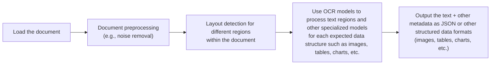
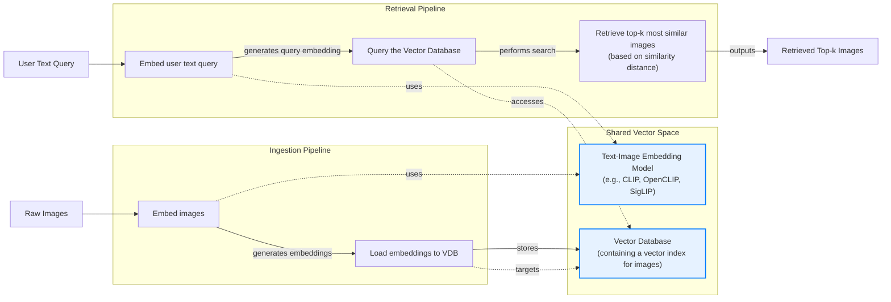
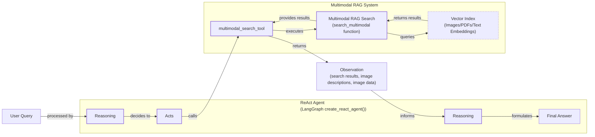

# Stop Converting Documents to Text. You're Doing It Wrong.

When I first started building AI agents, I hit a frustrating wall. I was comfortable manipulating text, but the moment I had to integrate multimodal data, such as images, audio, and especially documents like PDFs, my elegant architectures turned into messy hacks. I spent weeks building complex pipelines that tried to force everything into text. I chained OCR engines to scrape PDFs, layout detection models to identify tables, and separate classifiers to handle images. It was a brittle, slow, and expensive solution that broke every time a document layout changed.

The breakthrough came when I realized I was solving the wrong problem. I didn’t need to convert documents to text; I needed to treat them as images. Once I understood that every PDF page is effectively an image and that modern LLMs can “see” just as well as they can read, the complexity vanished.

This shift is essential because real-world AI applications rarely exist in a text-only vacuum. Enterprise applications need to process private data from warehouses and lakes that is inherently multimodal: financial reports with complex charts, technical diagrams with sketches, and medical documents with diagnostics. The old approach of normalizing everything to text is lossy. When you translate a complex diagram into text, you lose the spatial relationships, the colors, and the context. By processing data in its native format, we preserve this rich visual information, resulting in systems that are faster, cheaper, and significantly more performant. As data is made for humans, you want the LLM to process it as a human would, which is often visually.

Here is what we will cover:
- The limitations of traditional, OCR-based document processing.
- The foundations of how multimodal LLMs work.
- A hands-on guide to working with images and PDFs using the Gemini API.
- How to build a multimodal RAG system.
- A step-by-step guide to building a multimodal ReAct agent.

## Limitations of Traditional Document Processing

To understand why natively multimodal approaches are superior, let's first examine the flaws in traditional document processing for tasks like handling invoices, reports, or technical documentation. The core problem is that these older methods try to normalize everything to text before it reaches an AI model, losing a substantial amount of information during the translation. For example, it is impossible to fully reproduce diagrams, charts, or sketches in text.

The typical workflow relies on a multi-step pipeline involving layout detection and Optical Character Recognition (OCR).

Image 1: A flowchart illustrating the traditional document processing workflow.


This workflow has too many moving pieces. It requires layout detection models, OCR models for text, and specialized models for each expected data structure, making the system rigid, slow, and costly. More importantly, it is fragile. The multi-step nature creates a cascade effect where errors compound at each stage. Even advanced OCR engines struggle with handwritten text, poor-quality scans, or complex layouts like nested tables and building sketches, with accuracy dropping by over 20% on documents scanned below 300 DPI [[1]](https://www.llamaindex.ai/blog/ocr-accuracy), [[2]](https://hackernoon.com/complex-document-recognition-ocr-doesnt-work-and-heres-how-you-fix-it).

https://substackcdn.com/image/fetch/f_auto,q_auto:good,fl_progressive:steep/https%3A%2F%2Fsubstack-post-media.s3.amazonaws.com%2Fpublic%2Fimages%2Fa2dc40f3-dc13-486e-853d-8404368f4d8d_1616x1000.png 
Image 2: A building sketch showing a crawl space vent diagram, illustrating the complexity of layouts that classic OCR systems struggle to interpret. (Source [Vectorize.io](https://vectorize.io/blog/multimodal-rag-patterns))

This approach might work for highly specialized applications, but it does not scale in a world of flexible and fast AI agents. That is why modern AI solutions use multimodal LLMs that can directly interpret text, images, or PDFs as native input, completely bypassing this unstable OCR workflow. Thus, let’s understand how they work.

## Foundations of Multimodal LLMs

Before we write any code, you need an intuition for how multimodal LLMs work. You do not need to understand every research detail, but knowing the architecture helps you use, deploy, optimize, and monitor them. There are two common approaches to building them: the Unified Embedding Decoder Architecture and the Cross-modality Attention Architecture [[3]](https://magazine.sebastianraschka.com/p/understanding-multimodal-llms).

https://substackcdn.com/image/fetch/f_auto,q_auto:good,fl_progressive:steep/https%3A%2F%2Fsubstack-post-media.s3.amazonaws.com%2Fpublic%2Fimages%2F76f50b57-2585-4cb8-8dda-eea5b5f81c03_1456x854.jpeg 
Image 3: The two main approaches to developing multimodal LLM architectures. (Source [Understanding Multimodal LLMs](https://magazine.sebastianraschka.com/p/understanding-multimodal-llms) [[3]](https://magazine.sebastianraschka.com/p/understanding-multimodal-llms))

In the **Unified Embedding Decoder** approach, we encode text and images separately, concatenate their embeddings, and pass the combined vector to the LLM. This requires a vision encoder to map the image into the same vector space as the text so the LLM can make sense of both [[3]](https://magazine.sebastianraschka.com/p/understanding-multimodal-llms).

https://substackcdn.com/image/fetch/f_auto,q_auto:good,fl_progressive:steep/https%3A%2F%2Fsubstack-post-media.s3.amazonaws.com%2Fpublic%2Fimages%2Fa0979e82-2fb0-4f78-80c8-1395511e057f_1166x1400.jpeg 
Image 4: Illustration of the unified embedding decoder architecture. (Source [Understanding Multimodal LLMs](https://magazine.sebastianraschka.com/p/understanding-multimodal-llms) [[3]](https://magazine.sebastianraschka.com/p/understanding-multimodal-llms))

In the **Cross-modality Attention** approach, instead of passing image embeddings at the input, we inject them deeper into the LLM's attention mechanism. This still requires an image encoder but integrates the visual information directly into the model's processing layers [[3]](https://magazine.sebastianraschka.com/p/understanding-multimodal-llms).

https://substackcdn.com/image/fetch/f_auto,q_auto:good,fl_progressive:steep/https%3A%2F%2Fsubstack-post-media.s3.amazonaws.com%2Fpublic%2Fimages%2Fea1b9ee4-0d19-4c3c-89db-06e779653da2_1296x1338.jpeg 
Image 5: An illustration of the Cross-Modality Attention Architecture approach. (Source [Understanding Multimodal LLMs](https://magazine.sebastianraschka.com/p/understanding-multimodal-llms) [[3]](https://magazine.sebastianraschka.com/p/understanding-multimodal-llms))

Both architectures rely on image encoders, which work by splitting images into patches, much like how text is split into tokens. These patches are then converted into embeddings. A linear projection module aligns these image embeddings into the same vector space as the text embeddings, allowing for cross-modal understanding [[3]](https://magazine.sebastianraschka.com/p/understanding-multimodal-llms). Popular models like CLIP, OpenCLIP, and SigLIP use this technique, and it's also the foundation of multimodal RAG, which enables semantic similarity searches between text and images [[4]](https://towardsdatascience.com/multimodal-embeddings-an-introduction-5dc36975966f/).

https://substackcdn.com/image/fetch/f_auto,q_auto:good,fl_progressive:steep/https%3A%2F%2Fsubstack-post-media.s3.amazonaws.com%2Fpublic%2Fimages%2F3d4c837a-a3e5-4d60-97ce-c4d4faf4cf57_841x616.png 
Image 6: Toy representation of multimodal embedding space. (Source [Multimodal Embeddings: An Introduction](https://towardsdatascience.com/multimodal-embeddings-an-introduction-5dc36975966f/) [[4]](https://towardsdatascience.com/multimodal-embeddings-an-introduction-5dc36975966f/))

The Unified Embedding approach is simpler to implement and often better for OCR-related tasks, while the Cross-modality Attention approach is more computationally efficient for high-resolution images [[5]](https://arxiv.org/abs/2409.11402). As of 2025, most leading LLMs are multimodal, including open-source models like Llama 4 and Qwen3, and closed-source options like GPT-5 and Gemini 2.5. It is also important to distinguish these multimodal LLMs from diffusion models like Midjourney, which are specialized for image generation and are typically used as tools within an agent workflow, not as the core reasoning engine [[6]](https://arxiv.org/html/2409.14993v3).

Now that we have an intuition for how these models work, let's see them in practice.

## Applying Multimodal LLMs to Images and PDFs

To see how multimodal LLMs work, let's walk through some examples using Gemini. There are three core ways to process multimodal data: as raw bytes, Base64-encoded strings, or URLs.

*   **Raw bytes** are the easiest for one-off API calls but can get corrupted when stored in most databases, which often misinterpret them as text.
*   **Base64** encodes bytes as strings, allowing you to safely store images or documents in a database like PostgreSQL or MongoDB. The trade-off is a size increase of about 33%.
*   **URLs** are the standard for enterprise applications. Data is stored in a data lake like AWS S3, and the LLM downloads it directly. This reduces network latency and is the most efficient option at scale.

Let's look at some code. We will use the `gemini-2.5-flash` model and a sample image of a robot and a kitten.

https://substackcdn.com/image/fetch/f_auto,q_auto:good,fl_progressive:steep/https%3A%2F%2Fsubstack-post-media.s3.amazonaws.com%2Fpublic%2Fimages%2F5780cbd6-133b-44fe-9352-38250d6fc611_640x640.jpeg 
Image 7: A sample image of a kitten and a robot.

1.  First, we process an image as **raw bytes**. We use the `WEBP` format for efficiency and ask the model to generate a caption.
    ```python
    from google import genai
    from google.genai import types
    # Helper function `load_image_as_bytes` is defined in the notebook.
    
    image_bytes_1 = load_image_as_bytes("images/image_1.jpeg", format="WEBP")
    
    # Single image captioning
    response = client.models.generate_content(
        model=MODEL_ID,
        contents=[
            types.Part.from_bytes(data=image_bytes_1, mime_type="image/webp"),
            "Tell me what is in this image in one paragraph.",
        ],
    )
    print(f"Caption: {response.text}")
    ```
    It outputs:
    ```text
    Caption: This striking image features a massive, dark metallic robot...
    ```

2.  We can also process the image as a **Base64 encoded string**. The logic is similar, but we encode the bytes first. The resulting string is about 33% larger but safe for database storage.
    ```python
    import base64
    
    image_base64 = base64.b64encode(image_bytes_1).decode("utf-8")
    
    response = client.models.generate_content(
        model=MODEL_ID,
        contents=[
            types.Part.from_bytes(data=image_base64, mime_type="image/webp"),
            "Tell me what is in this image.",
        ],
    )
    ```

3.  For **public URLs**, Gemini's `url_context` tool can parse web pages, PDFs, and images directly.
    ```python
    response = client.models.generate_content(
        model=MODEL_ID,
        contents="Based on the provided paper as a PDF, tell me how ReAct works: https://arxiv.org/pdf/2210.03629",
        config=types.GenerateContentConfig(tools=[{"url_context": {}}]),
    )
    print(response.text)
    ```
    It outputs:
    ```text
    The ReAct (Reasoning and Acting) paradigm is a method that combines verbal reasoning traces with task-specific actions...
    ```

4.  Let’s try a more complex task: **Object Detection**. We use Pydantic to define the output structure, leveraging what we learned in Lesson 3.
    ```python
    from pydantic import BaseModel
    
    class BoundingBox(BaseModel):
        ymin: float
        xmin: float
        ymax: float
        xmax: float
        label: str
    
    class Detections(BaseModel):
        bounding_boxes: list[BoundingBox]
    
    prompt = "Detect all prominent items. Return 2d boxes normalized to 0-1000."
    
    response = client.models.generate_content(
        model=MODEL_ID,
        contents=[types.Part.from_bytes(data=image_bytes_1, mime_type="image/webp"), prompt],
        config=types.GenerateContentConfig(
            response_mime_type="application/json",
            response_schema=Detections
        ),
    )
    ```
    The model returns structured JSON, which we can parse and visualize.
    ```text
    bounding_boxes=[BoundingBox(ymin=272.0, xmin=28.0, ymax=801.0, xmax=535.0, label='kitten'), BoundingBox(ymin=1.0, xmin=450.0, ymax=997.0, xmax=1000.0, label='robot')]
    ```
    https://substackcdn.com/image/fetch/f_auto,q_auto:good,fl_progressive:steep/https%3A%2F%2Fsubstack-post-media.s3.amazonaws.com%2Fpublic%2Fimages%2Fa2eaed1f-bedb-4c33-98b3-96fa7424f0ad_566x590.png 
    Image 8: Object detection results for the sample image.

5.  Finally, we can perform **Object Detection on PDF pages**. This is powerful for extracting diagrams or tables. We treat the PDF page as an image, a concept popularized by ColPali, which showed that Vision Language Models (VLMs) can retrieve documents more effectively by "looking" at them rather than extracting text [[7]](https://arxiv.org/pdf/2407.01449v6).
    ```python
    page_image_bytes = load_image_as_bytes("images/attention_is_all_you_need_1.jpeg")
    
    prompt = "Detect all the diagrams from the provided image as 2d bounding boxes."
    
    response = client.models.generate_content(
        model=MODEL_ID,
        contents=[types.Part.from_bytes(data=page_image_bytes, mime_type="image/webp"), prompt],
        config=types.GenerateContentConfig(
            response_mime_type="application/json",
            response_schema=Detections
        ),
    )
    ```
    https://substackcdn.com/image/fetch/f_auto,q_auto:good,fl_progressive:steep/https%3A%2F%2Fsubstack-post-media.s3.amazonaws.com%2Fpublic%2Fimages%2Fe7cb5566-8dea-4468-b307-b79b7610c7fa_667x590.png 
    Image 9: Object detection results on a page from the "Attention Is All You Need" paper.

## Foundations of Multimodal RAG

One of the most common use cases for multimodal data is RAG. When building custom AI applications, you will often need to retrieve private company data. For large formats like images or PDFs, stuffing everything into the context window is unfeasible due to increased latency, cost, and degraded performance.

A generic multimodal RAG architecture for images and text involves two main phases. During ingestion, images are embedded using a text-image embedding model and stored in a vector database. During retrieval, a user's text query is embedded using the same model, and the vector database is queried to find the most similar images.

Image 10: A flowchart illustrating a generic multimodal RAG architecture using images and text, highlighting the shared vector space for cross-modal similarity search.


For enterprise document RAG, the state-of-the-art architecture as of 2025 is ColPali [[7]](https://arxiv.org/pdf/2407.01449v6). Its key innovation is bypassing the entire OCR pipeline by processing document images directly. It uses a late interaction mechanism (MaxSim) to compute similarities between query tokens and document patches, producing a "bag-of-embeddings" for each document image instead of a single vector. This approach is 2-10 times faster than traditional OCR pipelines and significantly outperforms them on benchmarks for visually complex documents [[7]](https://arxiv.org/pdf/2407.01449v6).

## Implementing Multimodal RAG

Let's build a simple multimodal RAG system that combines what we have learned. We will populate an in-memory vector index with images and PDF pages (treated as images) and then query it with text.

Image 11: A simplified multimodal RAG example illustrating ingestion and retrieval phases with an in-memory vector index.
```mermaid
flowchart LR
  %% Ingestion Phase
  subgraph Ingestion["Ingestion Phase"]
    A["Load images and PDF pages as images"]
    B["Generate image descriptions using Gemini<br/>(as a workaround for direct multimodal embeddings)"]
    C["Embed descriptions using a text embedding model<br/>(e.g., 'gemini-embedding-001')"]

    A -- "produces" --> B
    B -- "generates" --> C
  end

  VDB[(In-memory Vector Index<br/>(mocked as a list))]

  C -- "stores embeddings" --> VDB

  %% Retrieval Phase
  subgraph Retrieval["Retrieval Phase"]
    E["User text query"]
    F["Embed query using the text embedding model"]
    G["Search in-memory vector index for top-k similar items"]
    H["Return relevant images/PDF pages"]

    E -- "is embedded" --> F
    F -- "sends query embedding" --> G
    G -- "retrieves results" --> H
  end

  G -- "searches" --> VDB

  classDef phase stroke-width:2px,stroke:#333,fill:#ececff
  class Ingestion,Retrieval phase
  classDef storage fill:#fff,stroke:#333,stroke-dasharray:5,5
  class VDB storage
```

1.  First, we define a function to create our vector index. Since the Gemini Dev API does not support direct image embeddings, we will generate a text description for each image and embed that instead. This is a workaround; with a true multimodal embedding model like Voyage or Cohere, you would embed the image bytes directly. The rest of the RAG system would remain conceptually the same.
    ```python
    def create_vector_index(image_paths: list[Path]) -> list[dict]:
        """Create embeddings for images by generating descriptions and embedding them."""
        vector_index = []
        for image_path in image_paths:
            image_bytes = load_image_as_bytes(image_path, format="WEBP")
            image_description = generate_image_description(image_bytes)
            # IMPORTANT: With a multimodal embedding model, you would directly embed
            # `image_bytes` here instead of the description.
            image_embedding = embed_text_with_gemini(image_description)
            vector_index.append({
                "content": image_bytes, "type": "image", "filename": image_path,
                "description": image_description, "embedding": image_embedding,
            })
        return vector_index
    
    image_paths = list(Path("images").glob("*.jpeg"))
    vector_index = create_vector_index(image_paths)
    ```

2.  Next, we define a function to search the index. It embeds the text query and uses cosine similarity to find the top-k matching images.
    ```python
    from sklearn.metrics.pairwise import cosine_similarity
    
    def search_multimodal(query_text: str, vector_index: list[dict], top_k: int = 3) -> list:
        """Search for most similar documents to a query."""
        query_embedding = embed_text_with_gemini(query_text)
        if query_embedding is None:
            return []
        
        embeddings = [doc["embedding"] for doc in vector_index]
        similarities = cosine_similarity([query_embedding], embeddings).flatten()
        top_indices = np.argsort(similarities)[::-1][:top_k]
    
        results = []
        for idx in top_indices.tolist():
            results.append({**vector_index[idx], "similarity": similarities[idx]})
        return results
    ```

3.  Now, let's test it with a query.
    ```python
    query = "a kitten with a robot"
    results = search_multimodal(query, vector_index, top_k=1)
    ```
    The system correctly retrieves the image of the kitten and the robot with a high similarity score.

    https://substackcdn.com/image/fetch/f_auto,q_auto:good,fl_progressive:steep/https%3A%2F%2Fsubstack-post-media.s3.amazonaws.com%2Fpublic%2Fimages%2F5780cbd6-133b-44fe-9352-38250d6fc611_640x640.jpeg 
    Image 12: The retrieved image for the query "a kitten with a robot".

## Building Multimodal AI Agents

To bring everything together, let's integrate our RAG function into a ReAct agent as a tool. This consolidates most of the skills we have learned so far in this course. Multimodal capabilities can be added to agents by enabling multimodal inputs for the reasoning LLM or by leveraging multimodal retrieval tools.

Image 13: A Mermaid diagram illustrating a multimodal ReAct agent integrated with RAG.


1.  First, we wrap our `search_multimodal` function into a tool that the agent can call.
    ```python
    from langchain_core.tools import tool
    
    @tool
    def multimodal_search_tool(query: str) -> dict:
        """Search through a collection of images and their text descriptions."""
        results = search_multimodal(query, vector_index, top_k=1)
        if not results:
            return {"role": "tool_result", "content": "No relevant content found."}
        
        result = results[0]
        content = [
            {"type": "text", "text": f"Image description: {result['description']}"},
            types.Part.from_bytes(data=result["content"], mime_type="image/jpeg"),
        ]
        return {"role": "tool_result", "content": content}
    ```

2.  Next, we create a ReAct agent using LangGraph, providing it with our new tool and a system prompt that guides its behavior. We will dive deeper into LangGraph in Part 2 of the course.
    ```python
    from langgraph.prebuilt import create_react_agent
    from langchain_google_genai import ChatGoogleGenerativeAI
    
    def build_react_agent():
        """Build a ReAct agent with multimodal search capabilities."""
        tools = [multimodal_search_tool]
        system_prompt = "You are a helpful AI assistant that can search through images..."
        agent = create_react_agent(
            model=ChatGoogleGenerativeAI(model="gemini-2.5-pro", temperature=0.1),
            tools=tools,
            prompt=system_prompt,
        )
        return agent
    
    react_agent = build_react_agent()
    ```

3.  Finally, we ask the agent a question that requires it to use the tool.
    ```python
    test_question = "what color is my kitten?"
    response = react_agent.invoke(input={"messages": test_question})
    ```
    The agent correctly identifies that it needs to search for "my kitten," calls the `multimodal_search_tool`, analyzes the retrieved image, and provides the final answer.
    ```text
    Based on the image, your kitten is a gray tabby. It has soft, short gray fur with darker tabby stripe patterns.
    ```

## Conclusion

Working with multimodal data is a fundamental skill for AI engineers. Modern AI applications rarely exist in a text-only vacuum; they interact with the complex, visual, and auditory reality of the world. In this lesson, we moved away from the unstable, multi-step OCR pipelines of the past and learned that modern LLMs can natively process images and documents, preserving rich context that was previously lost.

This lesson concludes Part 1 of our course on the fundamentals of AI Engineering. In Part 2, we will move from theory to practice, building a complete, multi-agent research and writing system using LangGraph. You will implement a research agent with web scraping tools, a writing workflow to polish content, and orchestrate the entire pipeline from start to finish.

## References

- [1] [OCR Accuracy Explained: How to Improve It](https://www.llamaindex.ai/blog/ocr-accuracy)
- [2] [Complex Document Recognition: OCR Doesn’t Work and Here’s How You Fix It](https://hackernoon.com/complex-document-recognition-ocr-doesnt-work-and-heres-how-you-fix-it)
- [3] [Understanding Multimodal LLMs](https://magazine.sebastianraschka.com/p/understanding-multimodal-llms)
- [4] [Multimodal Embeddings: An Introduction](https://towardsdatascience.com/multimodal-embeddings-an-introduction-5dc36975966f/)
- [5] [NVLM: Open Frontier-Class Multimodal LLMs](https://arxiv.org/abs/2409.11402)
- [6] [Multi-modal Generative AI: Multi-modal LLMs, Diffusions, and the Unification](https://arxiv.org/html/2409.14993v3)
- [7] [ColPali: Efficient Document Retrieval with Vision Language Models](https://arxiv.org/pdf/2407.01449v6)