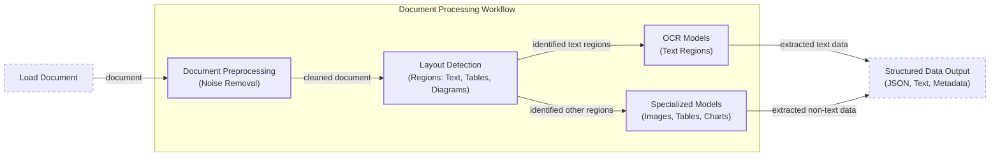
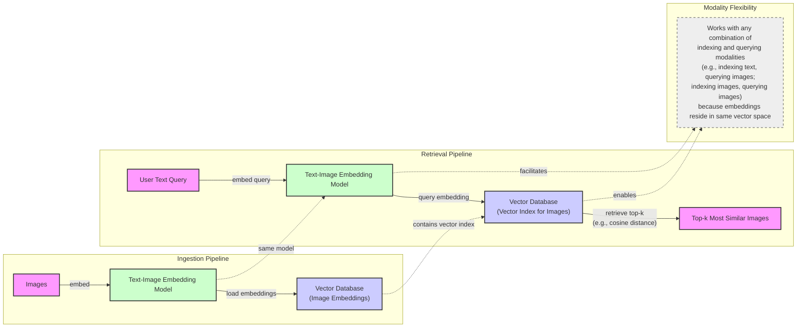
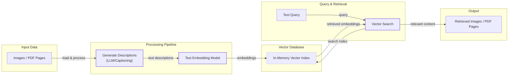
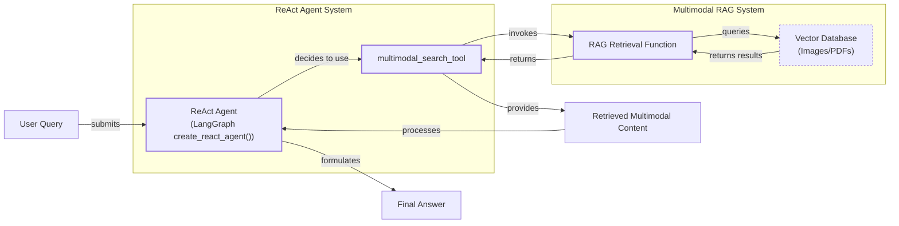

# Stop Converting Documents to Text. You're Doing It Wrong.

When I first started building AI agents, I hit a frustrating wall. I was comfortable manipulating text, but the moment I had to integrate images, audio, and especially PDFs, my elegant architectures turned into messy hacks. I spent weeks building complex pipelines that tried to force everything into text. I chained OCR engines to scrape PDFs, layout detection models to identify tables, and separate classifiers to handle images. It was a brittle, slow, and expensive solution that broke every time a document layout changed.

The breakthrough came when I realized I was solving the wrong problem. I didn’t need to convert documents to text. I needed to treat them as images. Once I understood that every PDF page is an image and that modern LLMs can “see” just as well as they can read, the complexity vanished. This shift is essential because real-world AI applications rarely exist in a text-only vacuum. Enterprise applications mirror this reality, manipulating private data from warehouses and data lakes that is inherently multimodal: financial reports with complex charts, technical diagrams, and building sketches.

The old approach of normalizing everything to text is lossy. When you translate a complex diagram into text, you lose the spatial relationships, the colors, and the context. By processing data in its native format, we preserve this rich visual information, resulting in systems that are faster, cheaper, and more performant. As data is made for humans, you want the LLM to process it as a human would, which is often visually.

Here is what we will cover:
- **Limitations of Traditional Document Processing:** Why OCR-based workflows fail for complex documents.
- **Foundations of Multimodal LLMs:** An intuition on how models process visual and textual tokens together.
- **Practical Implementation:** How to work with images and PDFs using the Gemini API.
- **Building Multimodal RAG:** A step-by-step guide to building a multimodal RAG system.
- **Developing Multimodal Agents:** How to construct a ReAct agent that can reason about multimodal information.

## The Need for Multimodal AI

In the last ten lessons, we built a solid foundation in AI engineering. We learned the difference between workflows and agents, mastered context engineering and structured outputs, built robust planning capabilities with ReAct, and gave our agents memory. Now, we will tackle the final piece of the puzzle for Part 1: multimodal data.

The rise of multimodal LLMs is driven by a subtle but powerful force: enterprise requirements. Enterprise applications work heavily with documents, and text-only approaches have clear limitations. Consider these real-world examples: financial reports with complex charts, medical documents with diagnostic images, or technical manuals with diagrams. In these cases, text alone is not enough.

This need becomes most critical when processing PDF documents. Previously, we tried to normalize everything to text before passing it to an AI model, but this approach is flawed because we lose substantial information during the translation. It is impossible to fully reproduce diagrams, charts, or sketches in text. Let's see why the old way of doing things is broken.

## Limitations of traditional document processing

To understand the problem, let's look at the traditional workflow for processing documents like invoices or reports. This approach relies on a sequence of specialized models to deconstruct the document before an LLM ever sees it.


Image 1: A flowchart illustrating the traditional document processing workflow.

This workflow has too many moving pieces. We need layout detection models, Optical Character Recognition (OCR) models for text, and specialized models for each expected data structure. This makes the system rigid. If a document contains a chart type we don’t have a model for, the pipeline fails. It is also slow and costly because we have to chain multiple model calls.

Most importantly, this multi-step process creates a cascade effect where errors compound at each stage. Advanced OCR engines achieve 88–94% accuracy on simple layouts but struggle with handwritten text, poor scans below 300 DPI, or complex layouts like nested tables and building sketches, where accuracy can drop by 20% or more [[1]](https://www.llamaindex.ai/blog/ocr-accuracy), [[2]](https://hackernoon.com/complex-document-recognition-ocr-doesnt-work-and-heres-how-you-fix-it).
Image 2: A building sketch showing a crawl space vent diagram, illustrating the complexity of layouts that classic OCR systems struggle to interpret. (Source [Vectorize.io](https://vectorize.io/blog/multimodal-rag-patterns))

This might work for highly specialized applications, but it is too fragile for flexible AI agents. That is why modern AI solutions use multimodal LLMs, which can directly interpret text, images, or PDFs as native input. This approach completely bypasses the unstable OCR workflow. Let's understand how they work.

## Foundations of multimodal LLMs

To use LLMs with images and documents, you need an intuition of how multimodality works. As an AI engineer, you do not need to know every research detail, but understanding the architecture helps you deploy, optimize, and monitor these systems. There are two common approaches to building multimodal LLMs: the Unified Embedding Decoder Architecture and the Cross-modality Attention Architecture [[3]](https://magazine.sebastianraschka.com/p/understanding-multimodal-llms).
Image 3: The two main approaches to developing multimodal LLM architectures. (Source [Understanding Multimodal LLMs](https://magazine.sebastianraschka.com/p/understanding-multimodal-llms) [[3]](https://magazine.sebastianraschka.com/p/understanding-multimodal-llms))

### Unified Embedding Decoder Architecture

In this approach, we encode the text and image separately, concatenate their embeddings into a single vector, and pass the result to the LLM. On top of a standard LLM, you need a vision encoder that maps the image to an embedding in the same vector space as the text. This way, when the embeddings are merged, the LLM can make sense of both [[3]](https://magazine.sebastianraschka.com/p/understanding-multimodal-llms), [[4]](https://www.nvidia.com/en-us/glossary/vision-language-models/).
Image 4: Illustration of the unified embedding decoder architecture. (Source [Understanding Multimodal LLMs](https://magazine.sebastianraschka.com/p/understanding-multimodal-llms) [[3]](https://magazine.sebastianraschka.com/p/understanding-multimodal-llms))

### Cross-modality Attention Architecture

In the second approach, instead of passing the image embeddings with the text embeddings at the input, we inject them directly into the attention module. We still need an image encoder to project the image into the same vector space, but we inject it deeper into the architecture [[3]](https://magazine.sebastianraschka.com/p/understanding-multimodal-llms).
Image 5: An illustration of the Cross-Modality Attention Architecture approach. (Source [Understanding Multimodal LLMs](https://magazine.sebastianraschka.com/p/understanding-multimodal-llms) [[3]](https://magazine.sebastianraschka.com/p/understanding-multimodal-llms))

### Image Encoders

Both architectures rely on image encoders. To understand them, we can draw a parallel between text tokenization and image patching. Just as we split text into sub-word tokens, we split images into patches. These patches are then passed through an image encoder, like a Vision Transformer (ViT), and a linear projection module to align them with the text embedding space [[3]](https://magazine.sebastianraschka.com/p/understanding-multimodal-llms). Popular image encoders like CLIP, OpenCLIP, and SigLIP use this technique, and they are also used in multimodal RAG to find semantic similarities between images and text [[5]](https://towardsdatascience.com/multimodal-embeddings-an-introduction-5dc36975966f/).
Image 6: Toy representation of multimodal embedding space. (Source [Multimodal Embeddings: An Introduction](https://towardsdatascience.com/multimodal-embeddings-an-introduction-5dc36975966f/) [[5]](https://towardsdatascience.com/multimodal-embeddings-an-introduction-5dc36975966f/))

The unified decoder approach is simpler and often more accurate for OCR-related tasks. The cross-modality attention approach is more computationally efficient for high-resolution images, and hybrid approaches exist to combine these benefits. Today, most leading LLMs, like Llama, Gemini, and GPT, are multimodal. This principle extends to other modalities; for instance, directly processing audio avoids transcription errors, a problem analogous to the pitfalls of OCR we discussed earlier [[9]](https://tianpan.co/blog/2026-04-12-multimodal-rag-production-search-images-audio-text).

It is also important to distinguish multimodal LLMs from diffusion models like Midjourney. Diffusion models generate images from noise and are architecturally different. In an agent workflow, they are typically used as tools, not as the core reasoning model. Now that we have an intuition of how LLMs can directly process images, let’s see how this works in practice.

## Applying multimodal LLMs to images and PDFs

To understand how multimodal LLMs work, let's look at a few examples using Gemini. There are three core ways to process multimodal data with LLMs: as raw bytes, Base64, and URLs.

- **Raw bytes:** The easiest method for one-off API calls. However, storing raw bytes in a database can lead to corruption, as many databases interpret the input as text.
- **Base64:** This method encodes raw bytes as strings, allowing you to store images or documents in a database like PostgreSQL or MongoDB without corruption. The main downside is a file size increase of approximately 33%.
- **URLs:** This is the standard for enterprise scenarios. Data is stored in a data lake like AWS S3, and the LLM downloads the media directly from the bucket. This reduces network latency for your application and is the most efficient option for scale.

Let's see this in code. We will use the `gemini-2.5-flash` model, which is fast and cost-effective.

1. First, we will process an image as **raw bytes**. We use the `WEBP` format because it is efficient. We can call the LLM to generate a caption for a single image or compare multiple images.
    
    ```python
    image_bytes_1 = load_image_as_bytes("images/image_1.jpeg", format="WEBP")
    image_bytes_2 = load_image_as_bytes("images/image_2.jpeg", format="WEBP")
    
    # Single image captioning
    response = client.models.generate_content(
        model=MODEL_ID,
        contents=[
            types.Part.from_bytes(data=image_bytes_1, mime_type="image/webp"),
            "Tell me what is in this image in one paragraph.",
        ],
    )
    print(f"Caption: {response.text}")
    
    # Comparing multiple images
    response = client.models.generate_content(
        model=MODEL_ID,
        contents=[
            types.Part.from_bytes(data=image_bytes_1, mime_type="image/webp"),
            types.Part.from_bytes(data=image_bytes_2, mime_type="image/webp"),
            "What’s the difference between these two images?",
        ],
    )
    print(f"Difference: {response.text}")
    ```
    
    It outputs:
    
    ```text
    Caption: An image of a gray kitten and a robot...
    
    Difference: The primary difference between the two images is the nature of the interaction...
    ```
    
2. For a more complex task like **object detection**, we can use Pydantic to define the output structure, a technique we covered in Lesson 4.
    
    ```python
    from pydantic import BaseModel
    
    class BoundingBox(BaseModel):
        ymin: float
        xmin: float
        ymax: float
        xmax: float
        label: str
    
    class Detections(BaseModel):
        bounding_boxes: list[BoundingBox]
    
    prompt = "Detect all prominent items. Return 2d boxes normalized to 0-1000."
    
    response = client.models.generate_content(
        model=MODEL_ID,
        contents=[types.Part.from_bytes(data=image_bytes_1, mime_type="image/webp"), prompt],
        config=types.GenerateContentConfig(
            response_mime_type="application/json",
            response_schema=Detections
        ),
    )
    ```
    
    This returns a structured Pydantic object with normalized bounding box coordinates for each detected item, such as the kitten and the robot.
    
    
    Image 7: Bounding boxes for a kitten and a robot detected by the multimodal LLM.
    
3. Now, let’s process **PDFs**. Because we are using a multimodal model, the process is identical to working with images. We can load the legendary "Attention Is All You Need" paper as bytes and ask the model for a summary [[6]](https://arxiv.org/pdf/1706.03762).
    
    ```python
    pdf_bytes = open("pdfs/attention_paper.pdf", "rb").read()
    
    response = client.models.generate_content(
        model=MODEL_ID,
        contents=[
            types.Part.from_bytes(data=pdf_bytes, mime_type="application/pdf"),
            "What is this document about? Provide a brief summary.",
        ],
    )
    print(response.text)
    ```
    
    It outputs:
    
    ```text
    This document introduces the Transformer, a novel neural network architecture for sequence transduction...
    ```
    
4. We can even perform **object detection on PDF pages**, which is powerful for extracting diagrams or tables. We simply treat the PDF page as an image. This concept was popularized by the ColPali paper, which demonstrated that modern Vision Language Models (VLMs) can retrieve documents more effectively by “looking” at them rather than by extracting text [[7]](https://arxiv.org/pdf/2407.01449v6).
    
    ```python
    page_image_bytes = load_image_as_bytes("images/attention_page_1.jpeg")
    
    prompt = "Detect all the diagrams from the provided image as 2d bounding boxes."
    
    response = client.models.generate_content(
        model=MODEL_ID,
        contents=[types.Part.from_bytes(data=page_image_bytes, mime_type="image/webp"), prompt],
        config=types.GenerateContentConfig(
            response_mime_type="application/json",
            response_schema=Detections
        ),
    )
    ```
    
    
    Image 8: The diagram from the "Attention Is All You Need" paper detected as an object on the page.
    

## Foundations of multimodal RAG

RAG, which we explored in Lesson 10, is essential for multimodal data. Stuffing large files like a 1,000-page PDF into a context window is unfeasible due to cost, latency, and performance degradation.

As we covered in Lesson 10, a multimodal RAG system embeds images and text into a shared vector space. During retrieval, a text query is embedded and used to find the `top-k` most similar images from a vector database based on cosine distance. This works for any combination of modalities, like text-to-image or image-to-image search [[8]](https://www.pinecone.io/learn/series/image-search/clip/).


Image 9: A Mermaid diagram illustrating a generic multimodal RAG architecture using images and text, highlighting ingestion, retrieval, and modality flexibility.

For enterprise document RAG, the state-of-the-art architecture as of 2025 is ColPali. Its key innovation is bypassing the entire OCR pipeline by processing document images directly. It divides pages into patches and creates multi-vector embeddings—a "bag-of-embeddings"—for each page. At query time, it uses a late interaction mechanism to compute similarities between query tokens and document patches, which is highly effective for documents with complex visual layouts [[7]](https://arxiv.org/pdf/2407.01449v6). This mechanism, called MaxSim, computes a score by finding the maximum similarity for each query token across all document patches, then summing these scores [[10]](https://arxiv.org/html/2407.01449v4). While this approach is faster and more accurate than traditional OCR-based systems, this granularity creates a trade-off: the multi-vector representation increases storage and compute costs, making memory a bottleneck for very large document collections [[11]](https://aclanthology.org/2025.findings-acl.1003.pdf).

## Implementing multimodal RAG for images, PDFs and text

Let's build a simple multimodal RAG system to connect these concepts. We will populate an in-memory vector index with images and pages from the "Attention Is All You Need" paper, then query it with text questions.


Image 10: A Mermaid diagram illustrating a simple multimodal RAG example, showing the flow from loading images/PDF pages, generating descriptions, embedding these descriptions, creating an in-memory vector index, and then performing a search with a text query to retrieve relevant images/PDF pages.

1. First, we define a function to create our vector index. Since the Gemini API used in this course does not yet support direct image embedding, we will use a workaround: generate a detailed text description for each image and embed that description using a text embedding model.
    
    <aside>
    💡
    
    This is not the recommended approach for production. With a proper multimodal embedding model (like Voyage, Cohere, or Google's models on Vertex AI), you would embed the image bytes directly. The rest of the RAG system would remain conceptually the same.
    
    </aside>
    
    ```python
    def create_vector_index(image_paths: list[Path]) -> list[dict]:
        """Create embeddings for images by generating and embedding descriptions."""
        vector_index = []
        for image_path in image_paths:
            image_bytes = load_image_as_bytes(image_path, format="WEBP")
            image_description = generate_image_description(image_bytes)
            image_embedding = embed_text_with_gemini(image_description)
    
            vector_index.append({
                "content": image_bytes,
                "filename": image_path,
                "description": image_description,
                "embedding": image_embedding,
            })
        return vector_index
    
    image_paths = list(Path("images").glob("*.jpeg"))
    vector_index = create_vector_index(image_paths)
    ```
    
2. Next, we define a search function that embeds a text query and uses cosine similarity to find the most relevant images from our `vector_index`.
    
    ```python
    from sklearn.metrics.pairwise import cosine_similarity
    
    def search_multimodal(query_text: str, vector_index: list[dict], top_k: int = 3) -> list:
        """Search for most similar documents to a text query."""
        query_embedding = embed_text_with_gemini(query_text)
        if query_embedding is None:
            return []
    
        embeddings = [doc["embedding"] for doc in vector_index]
        similarities = cosine_similarity([query_embedding], embeddings).flatten()
    
        top_indices = np.argsort(similarities)[::-1][:top_k]
        results = [{**vector_index[idx], "similarity": similarities[idx]} for idx in top_indices]
        return list(results)
    ```
    
3. Now, let's test it. A query about the Transformer architecture correctly retrieves the relevant page from the paper.
    
    ```python
    query = "what is the architecture of the transformer neural network?"
    results = search_multimodal(query, vector_index, top_k=1)
    ```
    
    The top result is the image of the Transformer model architecture with a similarity score of 0.744.
    
    
    Image 11: The retrieved PDF page for the query "what is the architecture of the transformer neural network?".
    
4. A query for "a kitten with a robot" retrieves the correct image with a high similarity score.
    
    ```python
    query = "a kitten with a robot"
    results = search_multimodal(query, vector_index, top_k=1)
    ```
    
    This retrieves the image of the kitten and robot with a similarity of 0.811, demonstrating that our simple RAG system can effectively search across both standard images and document pages.
    
    
    Image 12: The retrieved image for the query "a kitten with a robot".
    

## Building multimodal AI agents

To bring everything together, we can integrate our multimodal RAG function into a ReAct agent as a tool. This will create an agentic RAG system that consolidates most of the skills we have learned in Part 1. The agent will use its reasoning capabilities to decide when to call our `search_multimodal` tool to answer questions that require visual context.


Image 13: A Mermaid diagram illustrating a multimodal ReAct agent integrated with RAG functionality.

1. First, we define a tool that wraps our `search_multimodal` function. This tool will take a text query from the agent, search our vector index, and return the retrieved image and its description.
    
    ```python
    from langchain_core.tools import tool
    
    @tool
    def multimodal_search_tool(query: str) -> dict:
        """Search through a collection of images to find relevant content."""
        results = search_multimodal(query, vector_index, top_k=1)
        if not results:
            return {"role": "tool_result", "content": "No relevant content found."}
        
        result = results[0]
        content = [
            {"type": "text", "text": f"Image description: {result['description']}"},
            types.Part.from_bytes(data=result["content"], mime_type="image/jpeg"),
        ]
        return {"role": "tool_result", "content": content}
    ```
    
2. Next, we build a ReAct agent using LangGraph's `create_react_agent` helper function. We provide a system prompt that guides the agent to use our new tool when asked about visual content. We will explore LangGraph in more detail in Part 2 of the course.
    
    ```python
    from langgraph.prebuilt import create_react_agent
    from langchain_google_genai import ChatGoogleGenerativeAI
    
    def build_react_agent():
        """Build a ReAct agent with multimodal search capabilities."""
        tools = [multimodal_search_tool]
        system_prompt = "You are a helpful AI assistant that can search through images and text to answer questions..."
        agent = create_react_agent(
            model=ChatGoogleGenerativeAI(model="gemini-2.5-pro", temperature=0.1),
            tools=tools,
            prompt=system_prompt,
        )
        return agent
    
    react_agent = build_react_agent()
    ```
    
3. Finally, let's ask our agent a question that requires it to "see" one of the indexed images: "what color is my kitten?"
    
    ```python
    response = react_agent.invoke(input={"messages": "what color is my kitten?"})
    ```
    
    The agent correctly identifies that it needs to use the `multimodal_search_tool`, calls it with the query "my kitten," and receives the image of the gray kitten and robot. Based on this visual context, it provides the final answer.
    
    It outputs:
    
    ```text
    Based on the image, your kitten is a gray tabby. It has soft, short gray fur with darker tabby stripe patterns.
    ```
    

## Conclusion

Working with multimodal data is a fundamental skill for AI engineers. Modern AI applications rarely exist in a text-only vacuum; they interact with the complex, visual, and auditory reality of the world. In this lesson, we moved away from the unstable, multi-step OCR pipelines of the past. We learned that modern LLMs can natively process images and documents, preserving rich context that was previously lost. You now have the foundational blocks to build production-ready multimodal AI systems.

This was the last lesson of Part 1. You have now mastered the fundamentals of AI engineering, from context engineering and structured outputs to ReAct agents and multimodal RAG. In Part 2, we will move from theory to practice and start building the course's central project: an interconnected research and writing agent system. We will dive deep into agentic design patterns, explore modern frameworks like LangGraph, and build a complete multi-agent pipeline from start to finish.

## References

- [1] OCR Accuracy Explained: How to Improve It. (2026, April 1). LlamaIndex. [https://www.llamaindex.ai/blog/ocr-accuracy](https://www.llamaindex.ai/blog/ocr-accuracy)
- [2] Kokorin, O. (2023, October 12). Complex Document Recognition: OCR Doesn’t Work and Here’s How You Fix It. HackerNoon. [https://hackernoon.com/complex-document-recognition-ocr-doesnt-work-and-heres-how-you-fix-it](https://hackernoon.com/complex-document-recognition-ocr-doesnt-work-and-heres-how-you-fix-it)
- [3] Raschka, S. (2024, November 3). Understanding Multimodal LLMs. Ahead of AI. [https://magazine.sebastianraschka.com/p/understanding-multimodal-llms](https://magazine.sebastianraschka.com/p/understanding-multimodal-llms)
- [4] Vision Language Models. (n.d.). NVIDIA. [https://www.nvidia.com/en-us/glossary/vision-language-models/](https://www.nvidia.com/en-us/glossary/vision-language-models/)
- [5] Talebi, S. (2024, November 29). Multimodal Embeddings: An Introduction. Towards Data Science. [https://towardsdatascience.com/multimodal-embeddings-an-introduction-5dc36975966f/](https://towardsdatascience.com/multimodal-embeddings-an-introduction-5dc36975966f/)
- [6] Vaswani, A., Shazeer, N., Parmar, N., Uszkoreit, J., Jones, L., Gomez, A. N., Kaiser, Ł., & Polosukhin, I. (2017). Attention Is All You Need. arXiv. [https://arxiv.org/pdf/1706.03762](https://arxiv.org/pdf/1706.03762)
- [7] Fostiropoulos, I., et al. (2024). ColPali: Efficient Document Retrieval with Vision Language Models. arXiv. [https://arxiv.org/pdf/2407.01449v6](https://arxiv.org/pdf/2407.01449v6)
- [8] Multi-modal ML with OpenAI's CLIP. (n.d.). Pinecone. [https://www.pinecone.io/learn/series/image-search/clip/](https://www.pinecone.io/learn/series/image-search/clip/)
- [9] Tianpan, C. (2024). Multimodal RAG in Production: How to Search Images, Audio, and Text. [https://tianpan.co/blog/2026-04-12-multimodal-rag-production-search-images-audio-text](https://tianpan.co/blog/2026-04-12-multimodal-rag-production-search-images-audio-text)
- [10] Fostiropoulos, I., et al. (2024). ColPali: Efficient Document Retrieval with Vision Language Models. arXiv. [https://arxiv.org/html/2407.01449v4](https://arxiv.org/html/2407.01449v4)
- [11] Liu, Y., et al. (2025). Light-ColPali/ColQwen2: VLM-based Document Retrieval Made Scalable and Practical. ACL Anthology. [https://aclanthology.org/2025.findings-acl.1003.pdf](https://aclanthology.org/2025.findings-acl.1003.pdf)