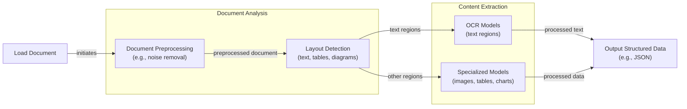
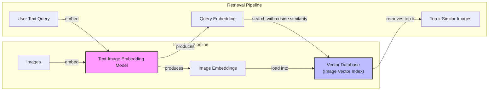
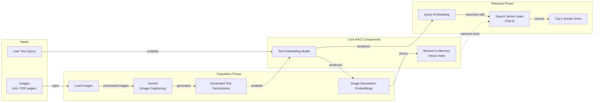
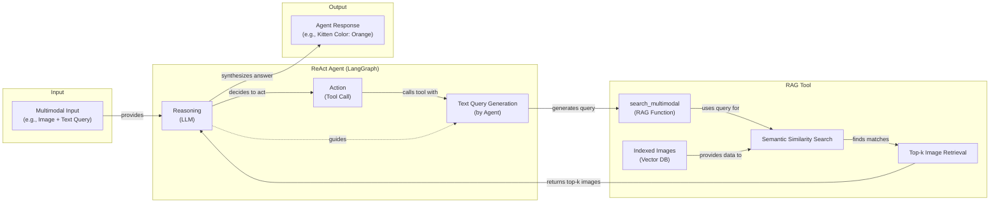

# Stop Converting Documents to Text. You're Doing It Wrong.

When I first started building AI agents, I hit a frustrating wall. I was comfortable manipulating text, but the moment I had to integrate multimodal data, such as images, audio, and especially documents like PDFs, my elegant architectures turned into messy hacks. I spent weeks building complex pipelines that tried to force everything into text. I chained OCR engines to scrape PDFs, layout detection models to identify tables, and separate classifiers to handle images. It was a brittle, slow, and expensive solution that broke every time a document layout changed.

The breakthrough came when I realized I was solving the wrong problem. I didn’t need to convert documents to text. I needed to treat them as images. Once I understood that every PDF page is effectively an image and that modern LLMs can “see” just as well as they can read, the complexity vanished. I could completely skip the OCR purgatory and focus on the three core inputs of an LLM: text, images, and audio.

This shift is essential because real-world AI applications rarely exist in a text-only vacuum. As human beings, we process information visually and audibly. Enterprise applications mirror this reality. They need to manipulate private data from warehouses and lakes that is inherently multimodal: financial reports with complex charts, technical diagrams, building sketches, and audio logs.

The old approach of normalizing everything to text is lossy. When you translate a complex diagram or a chart into text, you lose the spatial relationships, the colors, and the context. You lose the information that matters most. By processing data in its native format, we preserve this rich visual information, resulting in systems that are faster, cheaper, and significantly more performant.

Ultimately, as data is made for humans, you want the LLM to process the data as close as a human would, which often is visually.

Here is what we will cover:

*   **Foundations of Multimodal LLMs:** An intuition on how models process visual and textual tokens together.
*   **Practical Implementation:** How to work with images and PDFs using the Gemini API.
*   **Multimodal RAG:** How to build Retrieval-Augmented Generation systems for images and documents.
*   **Building the Agent:** A step-by-step guide to building a multimodal ReAct agent.

## The Need for Multimodal AI

In the previous lessons, we covered the foundations of AI engineering, from context engineering and structured outputs to building ReAct agents with memory and RAG capabilities. Now, we address the final piece of the puzzle: working with data beyond plain text. The rise of multimodal LLMs is driven by a critical enterprise need to process documents. Real-world applications must handle financial reports with complex charts, technical manuals with diagrams, and medical records with diagnostic images.

Previously, we tried to normalize everything to text before passing it to an AI model. This approach has many flaws because we lose a substantial amount of information during translation. When you encounter diagrams, charts, or sketches in a document, it is impossible to fully reproduce their meaning in text. This forces us into a corner, where we have to build brittle, expensive, and slow systems.

## Limitations of Traditional Document Processing

To understand the problem, let’s examine the traditional workflow for processing documents like invoices or reports. This process relies on a fragile chain of specialized models to first detect the layout, then extract content using Optical Character Recognition (OCR) and other models, and finally structure the output.



Image 1: A flowchart illustrating the traditional document processing workflow.

This workflow has too many moving pieces. It requires layout detection models, OCR for text, and specialized models for each expected data structure, such as tables or charts. This makes the system rigid; if a document contains a chart type we do not have a model for, the pipeline fails. It is also slow and costly because we have to chain multiple model calls.

Most importantly, this multi-step process creates a cascade effect where errors compound at each stage. Advanced OCR engines achieve 88-94% accuracy on simple layouts but struggle with handwritten text, poor scans, or complex structures like nested tables and building sketches, where accuracy can drop by over 20% [[1]](https://www.llamaindex.ai/blog/ocr-accuracy), [[2]](https://hackernoon.com/complex-document-recognition-ocr-doesnt-work-and-heres-how-you-fix-it).
Image 2: A building sketch showing a crawl space vent diagram, illustrating the complexity of layouts that classic OCR systems struggle to interpret. (Source [Vectorize.io](https://vectorize.io/blog/multimodal-rag-patterns))

This approach is not scalable for flexible, fast AI agents. Modern AI solutions use multimodal LLMs like Gemini or GPT-4o that can directly interpret text, images, and PDFs as native input, completely bypassing this unstable OCR workflow. Let’s understand how they work.

## Foundations of Multimodal LLMs

To use LLMs with images and documents, you need an intuition of how multimodality works. You do not need to understand every research detail, but knowing the architecture helps you deploy, optimize, and monitor them. There are two common approaches to building multimodal LLMs: the Unified Embedding Decoder Architecture and the Cross-modality Attention Architecture [[3]](https://magazine.sebastianraschka.com/p/understanding-multimodal-llms).
Image 3: The two main approaches to developing multimodal LLM architectures. (Source [Understanding Multimodal LLMs](https://magazine.sebastianraschka.com/p/understanding-multimodal-llms) [[3]](https://magazine.sebastianraschka.com/p/understanding-multimodal-llms))

### Unified Embedding Decoder Architecture

In this approach, we encode the text and image separately, concatenate their embeddings, and pass the resulting vector to the LLM. On top of a standard LLM, you need a vision encoder that maps the image to an embedding in the same vector space as the text.
Image 4: Illustration of the unified embedding decoder architecture. (Source [Understanding Multimodal LLMs](https://magazine.sebastianraschka.com/p/understanding-multimodal-llms) [[3]](https://magazine.sebastianraschka.com/p/understanding-multimodal-llms))

### Cross-modality Attention Architecture

In the second approach, instead of passing the image embeddings with the text embeddings at the input, we inject them directly into the attention module. We still need an image encoder that projects the image into the same vector space as the text, but we inject it deeper within the architecture.
Image 5: An illustration of the Cross-Modality Attention Architecture approach. (Source [Understanding Multimodal LLMs](https://magazine.sebastianraschka.com/p/understanding-multimodal-llms) [[3]](https://magazine.sebastianraschka.com/p/understanding-multimodal-llms))

Both architectures rely on image encoders, which create embeddings by splitting images into patches, much like how text is split into tokens [[3]](https://magazine.sebastianraschka.com/p/understanding-multimodal-llms). These patch embeddings must be aligned with text embeddings in the same vector space, which is achieved through a linear projection module. This shared space, enabled by models like CLIP or SigLIP, allows for semantic comparisons between text and images, a core concept for multimodal RAG [[4]](https://towardsdatascience.com/multimodal-embeddings-an-introduction-5dc36975966f/).
Image 6: Toy representation of multimodal embedding space. (Source [Multimodal Embeddings: An Introduction](https://towardsdatascience.com/multimodal-embeddings-an-introduction-5dc36975966f/) [[4]](https://towardsdatascience.com/multimodal-embeddings-an-introduction-5dc36975966f/))

The **Unified Embedding** approach is simpler and often yields higher accuracy for OCR-related tasks, while the **Cross-modality Attention** approach is more computationally efficient for high-resolution images [[5]](https://arxiv.org/abs/2409.11402). Hybrid approaches also exist to combine these benefits. Today, most leading LLMs are multimodal, including open-source models like Llama and Qwen, and closed-source models like GPT and Gemini [[6]](https://medium.com/data-science-in-your-pocket/2025-the-year-ai-reasoning-models-took-over-a-month-by-month-review-of-frontier-breakthroughs-6ea2163f854f).

It is important to distinguish multimodal LLMs from diffusion models like Midjourney, which generate images from noise. While an LLM can be paired with a diffusion model as a tool, they are architecturally different. Now that we have an intuition for how LLMs can directly process images, let’s see this in practice.

## Applying Multimodal LLMs to Images and PDFs

To understand how multimodal LLMs work, let’s explore a few examples using Gemini. There are three core ways to process multimodal data with LLMs: raw bytes, Base64 encoding, and URLs.

| Method | Pros | Cons | Best For |
| :--- | :--- | :--- | :--- |
| **Raw Bytes** | Simple, direct. | Prone to corruption in databases. | One-off, stateless API calls. |
| **Base64** | String-based, database-safe. | Increases file size by ~33%. | Storing media directly in databases. |
| **URLs** | Efficient, low latency. | Requires data lake setup (S3/GCS). | Enterprise-scale, private data. |

Table 1: A comparison of methods for processing multimodal data.

Let's walk through some code. The full implementation can be found in the course repository.

1.  First, we set up our client and display a sample image.
    ```python
    from google import genai
    from IPython.display import Image as IPythonImage
    
    client = genai.Client()
    MODEL_ID = "gemini-2.5-flash"
    
    IPythonImage(filename="images/image_1.jpeg", width=400)
    ```
    
    Image 7: A kitten interacting with a robot.

2.  We can process the image as **raw bytes** to generate a caption. We use the `WEBP` format because it is efficient.
    ```python
    from google.genai import types
    
    # helper function to load image as bytes
    image_bytes = load_image_as_bytes("images/image_1.jpeg", format="WEBP")
    
    response = client.models.generate_content(
        model=MODEL_ID,
        contents=[
            types.Part.from_bytes(data=image_bytes, mime_type="image/webp"),
            "Tell me what is in this image in one paragraph.",
        ],
    )
    print(response.text)
    ```
    It outputs:
    ```text
    This striking image features a massive, dark metallic robot...
    ```

3.  For a more complex task like **object detection**, we can define a Pydantic schema to structure the output, a technique we covered in Lesson 4.
    ```python
    from pydantic import BaseModel
    
    class BoundingBox(BaseModel):
        ymin: float
        xmin: float
        ymax: float
        xmax: float
        label: str
    
    class Detections(BaseModel):
        bounding_boxes: list[BoundingBox]
    
    prompt = "Detect all prominent items. Return 2d boxes normalized to 0-1000."
    
    response = client.models.generate_content(
        model=MODEL_ID,
        contents=[types.Part.from_bytes(data=image_bytes, mime_type="image/webp"), prompt],
        config=types.GenerateContentConfig(
            response_mime_type="application/json",
            response_schema=Detections
        ),
    )
    ```
    The model returns structured JSON, which we can visualize.
    
    Image 8: Object detection results for the kitten and robot image.

4.  Finally, we can perform **object detection on PDF pages**. This is powerful for extracting diagrams or tables by treating the PDF page as an image. We use a page from the "Attention Is All You Need" paper as an example [[7]](https://arxiv.org/abs/1706.03762).
    ```python
    page_image_bytes = load_image_as_bytes("images/attention_is_all_you_need_1.jpeg")
    prompt = "Detect all the diagrams from the provided image as 2d bounding boxes."
    
    # ... (call to generate_content with Detections schema)
    ```
    
    Image 9: Object detection result for a diagram on a PDF page.

    This approach, popularized by the ColPali paper, demonstrates that modern Vision Language Models can retrieve and understand documents more effectively by “looking” at them rather than just extracting text [[8]](https://arxiv.org/pdf/2407.01449v6).

## Foundations of Multimodal RAG

One of the most common use cases for multimodal data is RAG, which we explored in Lesson 10. When working with large documents or images, stuffing everything into the context window is unfeasible due to cost, latency, and performance degradation. Multimodal RAG solves this by retrieving only the most relevant visual or textual information.

A generic multimodal RAG architecture for images and text involves two pipelines. During ingestion, images are converted to embeddings by a text-image embedding model and stored in a vector database. During retrieval, a user's text query is embedded using the same model, and a similarity search retrieves the top-k most relevant images.



Image 10: A generic multimodal RAG architecture for images and text, showing Ingestion and Retrieval pipelines with a shared embedding model and vector database.

For enterprise RAG on documents, the state-of-the-art architecture is ColPali [[8]](https://arxiv.org/pdf/2407.01449v6). It bypasses the entire OCR pipeline by processing document pages directly as images. Instead of creating a single embedding per document, ColPali splits each page image into patches and generates a "bag-of-embeddings" (a multi-vector representation). At query time, it uses a late interaction mechanism to compute fine-grained similarities between query tokens and document patches, which is highly effective for documents with complex visual layouts. This approach is 2-10x faster and more accurate than traditional OCR pipelines [[8]](https://arxiv.org/pdf/2407.01449v6).

This efficiency is enabled by optimizations like binary quantization, which compresses embeddings to save memory and allows for faster similarity calculations [[9]](https://blog.vespa.ai/scaling-colpali-to-billions/). However, image-based retrieval can trade off accuracy on noisy, low-resolution documents or those requiring precise textual and tabular understanding [[10]](https://arxiv.org/html/2604.18508v1).

## Implementing Multimodal RAG for Images, PDFs and Text

Let's build a simple multimodal RAG system to connect these concepts. We will populate an in-memory vector index with several images, including pages from the "Attention Is All You Need" paper, and then query it with text.



Image 11: A multimodal RAG example, showing the population of an in-memory vector database and the retrieval phase.

1.  First, we define a function to create our vector index.
    
    <aside>
    💡
    
    The Gemini API does not currently support direct image embeddings. As a workaround, we will generate a detailed description for each image using Gemini and then embed that text. This is not best practice. In a production system, you would use a dedicated multimodal embedding model like Voyage or OpenAI's CLIP to embed the image bytes directly. The rest of the RAG pipeline would remain conceptually the same.
    
    </aside>
    
    ```python
    def create_vector_index(image_paths: list[Path]) -> list[dict]:
        """Create embeddings for images by generating and embedding descriptions."""
        vector_index = []
        for image_path in image_paths:
            image_bytes = load_image_as_bytes(image_path, format="WEBP")
            # Workaround: generate text description
            image_description = generate_image_description(image_bytes)
            # Embed the description
            image_embedding = embed_text_with_gemini(image_description)
            vector_index.append({
                "content": image_bytes,
                "filename": image_path,
                "description": image_description,
                "embedding": image_embedding,
            })
        return vector_index
    
    image_paths = list(Path("images").glob("*.jpeg"))
    vector_index = create_vector_index(image_paths)
    ```
    
2.  Next, we define a search function that embeds a text query and finds the most similar items in our index using cosine similarity.
    ```python
    from sklearn.metrics.pairwise import cosine_similarity
    
    def search_multimodal(query_text: str, vector_index: list[dict], top_k: int = 3) -> list:
        """Search for most similar documents to a text query."""
        query_embedding = embed_text_with_gemini(query_text)
        if query_embedding is None:
            return []
        
        embeddings = [doc["embedding"] for doc in vector_index]
        similarities = cosine_similarity([query_embedding], embeddings).flatten()
        
        top_indices = np.argsort(similarities)[::-1][:top_k]
        
        results = [{**vector_index[idx], "similarity": similarities[idx]} for idx in top_indices]
        return results
    ```

3.  Now, let's test it with a query about the Transformer architecture.
    ```python
    query = "what is the architecture of the transformer neural network?"
    results = search_multimodal(query, vector_index, top_k=1)
    
    # Display result
    IPythonImage(filename=results[0]["filename"])
    ```
    The system correctly retrieves the page containing the Transformer model diagram.
    
    
    Image 12: The retrieved PDF page showing the Transformer architecture.

## Building Multimodal AI Agents

To complete our journey, let's integrate our multimodal RAG function into a ReAct agent as a tool. This combines many of the skills we have learned in this course, allowing the agent to reason about a user's query and use its RAG tool to retrieve and analyze visual information.



Image 13: A multimodal ReAct agent integrated with RAG functionality.

1.  First, we wrap our `search_multimodal` function into a tool that the agent can call.
    ```python
    from langchain_core.tools import tool
    
    @tool
    def multimodal_search_tool(query: str) -> dict:
        """Searches through a collection of images to find relevant content."""
        results = search_multimodal(query, vector_index, top_k=1)
        if not results:
            return {"content": "No relevant content found."}
        
        result = results[0]
        content = [
            {"type": "text", "text": f"Image description: {result['description']}"},
            types.Part.from_bytes(data=result["content"], mime_type="image/jpeg"),
        ]
        return {"content": content}
    ```

2.  Next, we build a ReAct agent using LangGraph's `create_react_agent` helper. We will dive deeper into LangGraph in Part 2 of the course.
    ```python
    from langgraph.prebuilt import create_react_agent
    from langchain_google_genai import ChatGoogleGenerativeAI
    
    system_prompt = "You are a helpful AI assistant that can search through images..."
    agent = create_react_agent(
        model=ChatGoogleGenerativeAI(model="gemini-2.5-pro"),
        tools=[multimodal_search_tool],
        prompt=system_prompt,
    )
    ```

3.  Finally, we ask the agent about the color of the kitten from our dataset. The agent reasons that it needs to search for "my kitten," calls the `multimodal_search_tool`, receives the image and its description, and then answers the question based on the visual evidence.
    ```python
    response = agent.invoke(input={"messages": "what color is my kitten?"})
    print(response["messages"][-1].content)
    ```
    It outputs:
    ```text
    Based on the image, your kitten is a gray tabby. It has soft, short gray fur with darker tabby stripe patterns.
    ```

In this lesson, we have combined structured outputs, tools, ReAct, RAG, and multimodal data to create a complete agentic RAG system.

## Conclusion

We have moved beyond unstable OCR pipelines to natively processing images and documents, preserving rich context. We explored handling data as bytes, Base64, and URLs, and building agents that reason across these modalities. These same principles are now extending to video understanding and augmented reality, where agents can act on dynamic, real-world visual data [[11]](https://arxiv.org/html/2501.05874v1), [[12]](https://www.ibm.com/think/topics/multimodal-rag).

This concludes Part 1 of our course on the foundations of AI Engineering. In Part 2, we will move from theory to practice and begin building our central course project: an interconnected research and writing agent system using LangGraph. You now have all the foundational blocks to build production-ready AI systems.

## References

- [1] [OCR Accuracy Explained: How to Improve It](https://www.llamaindex.ai/blog/ocr-accuracy)
- [2] [Complex Document Recognition: OCR Doesn’t Work and Here’s How You Fix It](https://hackernoon.com/complex-document-recognition-ocr-doesnt-work-and-heres-how-you-fix-it)
- [3] [Understanding Multimodal LLMs](https://magazine.sebastianraschka.com/p/understanding-multimodal-llms)
- [4] [Multimodal Embeddings: An Introduction](https://towardsdatascience.com/multimodal-embeddings-an-introduction-5dc36975966f/)
- [5] [NVLM: Open Frontier-Class Multimodal LLMs](https://arxiv.org/abs/2409.11402)
- [6] [2025: The Year AI Reasoning Models Took Over (A Month-by-Month Review of Frontier Breakthroughs)](https://medium.com/data-science-in-your-pocket/2025-the-year-ai-reasoning-models-took-over-a-month-by-month-review-of-frontier-breakthroughs-6ea2163f854f)
- [7] [Attention Is All You Need](https://arxiv.org/abs/1706.03762)
- [8] [ColPali: Efficient Document Retrieval with Vision Language Models](https://arxiv.org/pdf/2407.01449v6)
- [9] [Scaling ColPali to billions of PDFs with Vespa](https://blog.vespa.ai/scaling-colpali-to-billions/)
- [10] [Beyond Pixels: A Critical Analysis of Image-based Representations for Scientific Document Retrieval](https://arxiv.org/html/2604.18508v1)
- [11] [VideoRAG: A Retrieval-Augmented Generation Framework for Videos](https://arxiv.org/html/2501.05874v1)
- [12] [What is multimodal RAG?](https://www.ibm.com/think/topics/multimodal-rag)