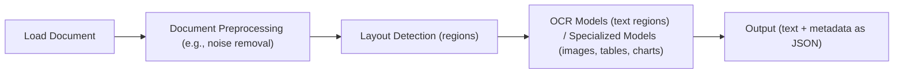
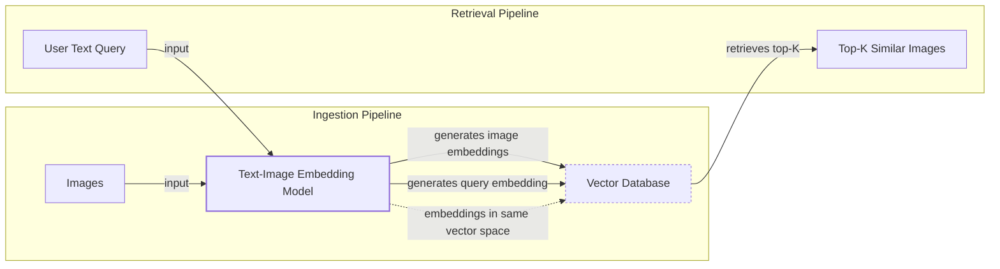
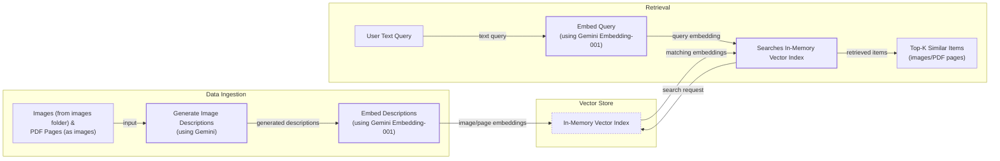
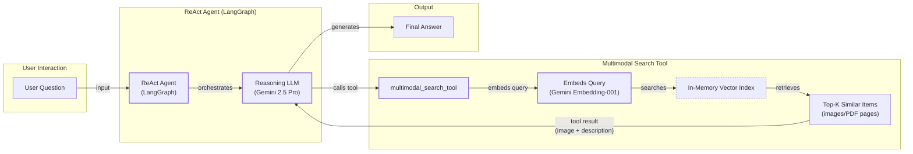

# Lesson 11: Multimodal AI

In the first ten lessons of this course, we built a solid foundation in AI Engineering. We explored the agent landscape, distinguished between LLM workflows and AI agents, mastered context engineering and structured outputs, and implemented core patterns like ReAct and RAG. You have learned how to build agents that can reason, act, and access knowledge. We have covered all the fundamentals except for one final, critical piece: the real world is not just text.

This lesson tackles that final piece: multimodal AI. In business and in life, we work with a rich mix of data—text, images, documents, and audio. An AI system that cannot "see" a chart in a financial report or understand a diagram in a technical manual is incomplete. The old approach was to force everything into text using Optical Character Recognition (OCR), but this is a brittle and lossy process. We will show you why natively processing images and documents is simpler, faster, and more powerful.

We will cover the theory behind multimodal LLMs and embedding models, just enough for you to build a strong intuition. Then, we will dive into hands-on examples, showing you how to work with images and PDFs using Gemini. Finally, we will bring everything together by building a multimodal RAG system and integrating it into a ReAct agent. This lesson provides the final skills you need to build enterprise-grade AI systems that can process data in its native format.

## Limitations of traditional document processing

To understand why multimodal AI is a necessity, we first need to look at why traditional document processing fails. For years, the standard approach for making AI understand documents like invoices, reports, or manuals was to convert them to text. This process typically relies on a complex and fragile pipeline involving OCR.

The workflow usually looks something like this: a document is loaded, preprocessed to reduce noise, and then a layout detection model identifies different regions like text blocks, tables, and images. An OCR model then extracts text from the text regions, while other specialized models might try to interpret tables or charts. Finally, all this extracted information is structured, often as JSON, and passed to the AI.



Image 1: A flowchart illustrating the traditional document processing workflow.

This multi-step pipeline is slow, expensive, and rigid. Each stage is a potential point of failure, and errors compound. If the layout detection fails, the OCR will process the wrong section. If the OCR misreads a character, the downstream data is corrupted. This approach is particularly weak with visually complex documents. Advanced OCR engines achieve 88-94% accuracy on simple layouts but struggle with handwritten notes, poor-quality scans, or complex structures like nested tables, technical diagrams, or architectural sketches [[1]](https://www.llamaindex.ai/blog/ocr-accuracy). For these, information is inevitably lost in translation.

This system is too brittle for flexible, fast-moving AI agents. That is why modern AI solutions use multimodal LLMs like Gemini, which can interpret text, images, and PDFs as native inputs, completely bypassing this fragile OCR workflow. Let's see how they work.

## Foundations of multimodal LLMs

Before we write any code, you need a basic intuition for how multimodal LLMs work. As an AI Engineer, you do not need to know every architectural detail, but understanding the core concepts is essential for using, deploying, and optimizing these models effectively.

The two common approaches are the **Unified Embedding Decoder Architecture**, where image and text token embeddings are concatenated into a single sequence, and the **Cross-modality Attention Architecture**, where image embeddings are injected directly into the LLM's attention layers [[2]](https://magazine.sebastianraschka.com/p/understanding-multimodal-llms).

https://substackcdn.com/image/fetch/f_auto,q_auto:good,fl_progressive:steep/https%3A%2F%2Fsubstack-post-media.s3.amazonaws.com%2Fpublic%2Fimages%2F53956ae8-9cd8-474e-8c10-ef6bddb88164_1600x938.png 
Image 2: The two main approaches to developing multimodal LLM architectures. (Source [Sebastian Raschka [2]](https://magazine.sebastianraschka.com/p/understanding-multimodal-llms))

https://substackcdn.com/image/fetch/f_auto,q_auto:good,fl_progressive:steep/https%3A%2F%2Fsubstack-post-media.s3.amazonaws.com%2Fpublic%2Fimages%2F91955021-7da5-4bc4-840e-87d080152b18_1166x1400.png 
Image 3: Illustration of the unified embedding decoder architecture. (Source [Sebastian Raschka [2]](https://magazine.sebastianraschka.com/p/understanding-multimodal-llms))

https://substackcdn.com/image/fetch/f_auto,q_auto:good,fl_progressive:steep/https%3A%2F%2Fsubstack-post-media.s3.amazonaws.com%2Fpublic%2Fimages%2Fd9c06055-b959-45d1-87b2-1f4e90ceaf2d_1296x1338.png 
Image 4: An illustration of the Cross-Modality Attention Architecture approach. (Source [Sebastian Raschka [2]](https://magazine.sebastianraschka.com/p/understanding-multimodal-llms))

Both rely on an **image encoder** like a Vision Transformer (ViT) to turn image patches into embeddings. A linear projection layer aligns these with text embedding dimensions [[2]](https://magazine.sebastianraschka.com/p/understanding-multimodal-llms). Encoders like CLIP use contrastive learning to ensure an image of a cat and the text "a photo of a cat" are mapped to nearby vectors, enabling multimodal reasoning and RAG [[3]](https://www.pinecone.io/learn/series/image-search/clip/).

https://substackcdn.com/image/fetch/f_auto,q_auto:good,fl_progressive:steep/https%3A%2F%2Fsubstack-post-media.s3.amazonaws.com%2Fpublic%2Fimages%2F0d56ea06-d202-4eb7-9e01-9aac492ee309_1522x1206.png 
Image 5: Image tokenization and embedding (left) and text tokenization and embedding (right) side by side. (Source [Sebastian Raschka [2]](https://magazine.sebastianraschka.com/p/understanding-multimodal-llms))

https://substackcdn.com/image/fetch/f_auto,q_auto:good,fl_progressive:steep/https%3A%2F%2Fsubstack-post-media.s3.amazonaws.com%2Fpublic%2Fimages%2Ffef5f8cb-c76c-4c97-9771-7fdb87d7d8cd_1600x1135.png 
Image 6: Illustration of a classic vision transformer (ViT) setup. (Source [Sebastian Raschka [2]](https://magazine.sebastianraschka.com/p/understanding-multimodal-llms))

https://towardsdatascience.com/wp-content/uploads/2024/11/15d3HBNjNIXLy0oMIvJjxWw.png 
Image 7: Toy representation of a multimodal embedding space where similar concepts are co-located. (Source [Shaw Talebi [4]](https://towardsdatascience.com/multimodal-embeddings-an-introduction-5dc36975966f/))

The Unified Embedding architecture is simpler to implement and tends to perform better on OCR tasks, while the Cross-attention approach is more computationally efficient for high-resolution images, though it can be vulnerable to irrelevant visual noise [[5]](https://arxiv.org/abs/2409.11402), [[11]](https://arxiv.org/pdf/2505.19616). Hybrid models that combine both are also emerging.

By 2025, most leading models are natively multimodal, and this principle extends to audio and video by adding specialized encoders [[6]](https://codedesign.ai/blog/the-ultimate-guide-to-the-top-large-language-models-in-2025/), [[7]](https://www.emergentmind.com/topics/multimodal-llms). These models differ from diffusion-based image generators like Midjourney. While some LLMs can generate images, diffusion models are a distinct architecture often used as tools within an agentic system, not as the core reasoning engine [[8]](https://arxiv.org/html/2409.14993v3).

Now that we understand how LLMs can directly process images, let's see how this works in practice.

## Applying multimodal LLMs to images and PDFs

To see how multimodal LLMs work, let's walk through a few examples using Gemini. There are three primary ways to provide images and PDFs to an LLM: as raw bytes, as Base64-encoded strings, or via URLs.

- **Raw bytes** are the most direct method and work well for one-off API calls. However, storing raw bytes in a standard database can be problematic, as many systems are designed for text and can corrupt the binary data.
- **Base64** encoding solves this by converting the binary data into a string. This makes it safe to store in any database that handles text (like PostgreSQL or MongoDB) but increases the data size by about 33%.
- **URLs** are the most efficient option for production systems. For public data, you can pass a direct link. For private, enterprise data, files are typically stored in a data lake like AWS S3 or Google Cloud Storage. The LLM can then access the file directly from the bucket, which is much faster than passing large files over the network.

<aside>
💡

You can find the code for this lesson in the accompanying [Jupyter Notebook](https://github.com/towardsai/course-ai-agents/blob/dev/lessons/11_multimodal/notebook.ipynb) on GitHub.

</aside>

First, let's set up our Gemini client. We will use `gemini-2.5-flash`, which is fast and cost-effective for these examples.

1.  To start, we will process an image as raw bytes. We define a helper function to load and resize an image, then convert it to bytes. We will use the WEBP format as it is highly efficient.
    
    ```python
    import base64
    import io
    from pathlib import Path
    from typing import Literal
    
    from google import genai
    from google.genai import types
    from IPython.display import Image as IPythonImage
    from PIL import Image as PILImage
    
    from lessons.utils import pretty_print
    
    client = genai.Client()
    MODEL_ID = "gemini-2.5-flash"
    
    def load_image_as_bytes(
        image_path: Path, format: Literal["WEBP", "JPEG", "PNG"] = "WEBP", max_width: int = 600, return_size: bool = False
    ) -> bytes | tuple[bytes, tuple[int, int]]:
        """
        Load an image from file path and convert it to bytes with optional resizing.
        """
    
        image = PILImage.open(image_path)
        if image.width > max_width:
            ratio = max_width / image.width
            new_size = (max_width, int(image.height * ratio))
            image = image.resize(new_size)
    
        byte_stream = io.BytesIO()
        image.save(byte_stream, format=format)
    
        if return_size:
            return byte_stream.getvalue(), image.size
    
        return byte_stream.getvalue()
    ```
    
    We load our sample image and pass it to the model to generate a caption.
    
    ```python
    image_bytes = load_image_as_bytes(image_path=Path("images") / "image_1.jpeg", format="WEBP")
    
    response = client.models.generate_content(
        model=MODEL_ID,
        contents=[
            types.Part.from_bytes(
                data=image_bytes,
                mime_type="image/webp",
            ),
            "Tell me what is in this image in one paragraph.",
        ],
    )
    ```
    
    It outputs:
    
    ```text
    This striking image features a massive, dark metallic robot, its powerful form detailed with intricate circuit patterns on its head and piercing red glowing eyes. Perched playfully on its right arm is a small, fluffy grey tabby kitten, its front paw raised as if exploring or batting at the robot's armored limb, while its gaze is directed slightly off-frame. The robot's large, segmented hand is visible beneath the kitten. The background suggests an industrial or workshop environment, with hints of metal structures and natural light filtering in from an unseen window, creating a dramatic contrast between the soft, vulnerable kitten and the formidable, mechanical sentinel.
    ```
    
2.  Next, we will process the same image as a Base64-encoded string. The helper function first loads the image as bytes and then encodes it.
    
    ```python
    from typing import cast
    
    def load_image_as_base64(
        image_path: Path, format: Literal["WEBP", "JPEG", "PNG"] = "WEBP", max_width: int = 600, return_size: bool = False
    ) -> str:
        """
        Load an image and convert it to base64 encoded string.
        """
    
        image_bytes = load_image_as_bytes(image_path=image_path, format=format, max_width=max_width, return_size=False)
    
        return base64.b64encode(cast(bytes, image_bytes)).decode("utf-8")
    
    image_base64 = load_image_as_base64(image_path=Path("images") / "image_1.jpeg", format="WEBP")
    ```
    
    As expected, the Base64 string is about 33% larger than the raw bytes. The API call is similar, and the resulting caption is comparable.
    
3.  For public URLs, Gemini has a built-in `url_context` tool that can fetch and parse content from the web, including PDFs.
    
    ```python
    response = client.models.generate_content(
        model=MODEL_ID,
        contents="Based on the provided paper as a PDF, tell me how ReAct works: https://arxiv.org/pdf/2210.03629",
        config=types.GenerateContentConfig(tools=[{"url_context": {}}]),
    )
    ```
    
4.  A more advanced use case is object detection. We can ask the model to identify objects and return their coordinates. By defining a Pydantic schema for the output, we can get structured JSON directly from the model, a technique we covered in Lesson 4.
    
    ```python
    from pydantic import BaseModel, Field
    
    class BoundingBox(BaseModel):
        ymin: float
        xmin: float
        ymax: float
        xmax: float
        label: str = Field(
            default="The category of the object found within the bounding box. For example: cat, dog, diagram, robot."
        )
    
    class Detections(BaseModel):
        bounding_boxes: list[BoundingBox]
    
    prompt = """
    Detect all of the prominent items in the image. 
    The box_2d should be [ymin, xmin, ymax, xmax] normalized to 0-1000.
    Also, output the label of the object found within the bounding box.
    """
    
    image_bytes, image_size = load_image_as_bytes(
        image_path=Path("images") / "image_1.jpeg", format="WEBP", return_size=True
    )
    
    config = types.GenerateContentConfig(
        response_mime_type="application/json",
        response_schema=Detections,
    )
    
    response = client.models.generate_content(
        model=MODEL_ID,
        contents=[
            types.Part.from_bytes(
                data=image_bytes,
                mime_type="image/webp",
            ),
            prompt,
        ],
        config=config,
    )
    
    detections = cast(Detections, response.parsed)
    ```
    
    The model returns a list of bounding boxes, which we can then visualize on the original image.
    
5.  Finally, we can process entire PDFs. Since Gemini treats PDF pages as images, the process is nearly identical. We can ask for a summary of the "Attention Is All You Need" paper by passing the PDF as bytes.
    
    ```python
    pdf_bytes = (Path("pdfs") / "attention_is_all_you_need_paper.pdf").read_bytes()
    response = client.models.generate_content(
        model=MODEL_ID,
        contents=[
            types.Part.from_bytes(data=pdf_bytes, mime_type="application/pdf"),
            "What is this document about? Provide a brief summary of the main topics.",
        ],
    )
    ```
    
    To prove that the model truly "sees" the PDF, we can perform object detection on one of its pages, asking it to find the diagram of the Transformer architecture.
    
    ```python
    prompt = """
    Detect all the diagrams from the provided image as 2d bounding boxes. 
    The box_2d should be [ymin, xmin, ymax, xmax] normalized to 0-1000.
    Also, output the label of the object found within the bounding box.
    """
    
    image_bytes, image_size = load_image_as_bytes(
        image_path=Path("images") / "attention_is_all_you_need_1.jpeg", format="WEBP", return_size=True
    )
    
    config = types.GenerateContentConfig(
        response_mime_type="application/json",
        response_schema=Detections,
    )
    response = client.models.generate_content(
        model=MODEL_ID,
        contents=[
            types.Part.from_bytes(
                data=image_bytes,
                mime_type="image/webp",
            ),
            prompt,
        ],
        config=config,
    )
    detections = cast(Detections, response.parsed)
    ```
    
    The model successfully identifies and locates the diagram, demonstrating its ability to understand complex visual layouts without needing any OCR.

## Foundations of multimodal RAG

A primary use case for multimodal data is RAG, which we covered in Lesson 10. Retrieving relevant private data is critical for large documents, as processing thousands of pages in the context window is impractical due to cost, latency, and performance issues.

A generic multimodal RAG architecture for images and text involves two pipelines. During ingestion, images are passed through a text-image embedding model and their vector representations are stored in a vector database. During retrieval, a user's text query is embedded using the same model, and the resulting vector is used to find the most similar images in the database.



Image 8: A Mermaid diagram illustrating a generic multimodal RAG architecture with ingestion and retrieval pipelines, highlighting the shared vector space for text and image embeddings.

For enterprise document retrieval, the 2025 state-of-the-art is ColPali [[10]](https://arxiv.org/pdf/2407.01449v6). It bypasses OCR by processing document pages as images directly. The page is divided into patches, each embedded to create a "bag-of-embeddings." While powerful, this multi-vector approach creates scaling challenges, as one page can generate over 1,000 vectors [[12]](https://qdrant.tech/blog/colpali-qdrant-optimization/). Production systems use techniques like binary quantization for more efficient search to mitigate this [[13]](https://blog.vespa.ai/scaling-colpali-to-billions/). At query time, a late interaction mechanism (MaxSim) computes similarity scores between query tokens and all document patches.

This approach is highly effective for documents with complex tables, figures, and layouts. It is also significantly faster and less prone to failure than traditional OCR pipelines, outperforming them on benchmarks like ViDoRe [[10]](https://arxiv.org/pdf/2407.01449v6).

Now that we have covered the theory, let's build a simple multimodal RAG system from scratch.

## Implementing multimodal RAG for images, PDFs and text

Let's combine what we have learned about multimodal LLMs and RAG to build a simple retrieval system. We will create an in-memory vector index containing several images, including pages from the "Attention Is All You Need" paper, and then query it using text.



Image 9: A Mermaid diagram illustrating the multimodal RAG example, showing data ingestion and retrieval pipelines.

<aside>
💡

A quick note on our implementation: The Gemini API we are using does not yet support image embeddings directly. To work around this, we will first use Gemini to generate a text description for each image and then embed that description using a text embedding model (`gemini-embedding-001`). This is not the recommended production approach, but it allows us to demonstrate the RAG workflow simply. With a true multimodal embedding model like those from Voyage AI or Cohere, you would embed the image bytes directly. The rest of the RAG system remains conceptually the same.

</aside>

1.  First, we define a function to generate a detailed description for an image using Gemini.
    
    ```python
    from io import BytesIO
    from typing import Any
    
    import numpy as np
    
    
    def generate_image_description(image_bytes: bytes) -> str:
        """
        Generate a detailed description of an image using Gemini Vision model.
        """
    
        try:
            img = PILImage.open(BytesIO(image_bytes))
            prompt = """
            Describe this image in detail for semantic search purposes. 
            Include objects, scenery, colors, composition, text, and any other visual elements that would help someone find 
            this image through text queries.
            """
            response = client.models.generate_content(model=MODEL_ID, contents=[prompt, img])
            if response and response.text:
                return response.text.strip()
            else:
                return ""
        except Exception as e:
            print(f"❌ Failed to generate image description: {e}")
            return ""
    ```
    
2.  Next, a function to embed text using Gemini's text embedding model.
    
    ```python
    def embed_text_with_gemini(content: str) -> np.ndarray | None:
        """
        Embed text content using Gemini's text embedding model.
        """
    
        try:
            result = client.models.embed_content(
                model="gemini-embedding-001",
                contents=[content],
            )
            if not result or not result.embeddings:
                return None
            return np.array(result.embeddings[0].values)
        except Exception as e:
            print(f"❌ Failed to embed text: {e}")
            return None
    ```
    
3.  We combine these to create our vector index, which for this simple example will be a Python list of dictionaries.
    
    ```python
    from typing import cast
    
    def create_vector_index(image_paths: list[Path]) -> list[dict]:
        """
        Create embeddings for images by generating descriptions and embedding them.
        """
    
        vector_index = []
        for image_path in image_paths:
            image_bytes = cast(bytes, load_image_as_bytes(image_path, format="WEBP", return_size=False))
            image_description = generate_image_description(image_bytes)
            image_embedding = embed_text_with_gemini(image_description)
    
            vector_index.append(
                {
                    "content": image_bytes,
                    "type": "image",
                    "filename": image_path,
                    "description": image_description,
                    "embedding": image_embedding,
                }
            )
        return vector_index
    
    image_paths = list(Path("images").glob("*.jpeg"))
    vector_index = create_vector_index(image_paths)
    ```
    
4.  Finally, we create a search function that embeds a text query and finds the most similar items in our index using cosine similarity.
    
    ```python
    from sklearn.metrics.pairwise import cosine_similarity
    
    def search_multimodal(query_text: str, vector_index: list[dict], top_k: int = 3) -> list[Any]:
        """
        Search for most similar documents to query using direct Gemini client.
        """
    
        query_embedding = embed_text_with_gemini(query_text)
        if query_embedding is None:
            return []
    
        embeddings = [doc["embedding"] for doc in vector_index]
        similarities = cosine_similarity([query_embedding], embeddings).flatten()
        top_indices = np.argsort(similarities)[::-1][:top_k]
    
        results = []
        for idx in top_indices.tolist():
            results.append({**vector_index[idx], "similarity": similarities[idx]})
        return results
    ```
    
5.  Let's test it. A query for "a kitten with a robot" correctly retrieves the image of the kitten and the robot with a high similarity score.
    
    ```python
    query = "a kitten with a robot"
    results = search_multimodal(query, vector_index, top_k=1)
    ```
    
    Similarly, a query about the "architecture of the transformer neural network" retrieves the correct page from the PDF. This demonstrates how we can search across different modalities using a shared embedding space.

## Building multimodal AI agents

The final step is to integrate our multimodal RAG system into a ReAct agent, consolidating many of the skills from Part 1 of this course. We can enhance agents with multimodal capabilities by giving them multimodal inputs, multimodal tools for retrieval, or tools that interact with external multimodal resources like PDFs or screenshots [[9]](https://www.linkedin.com/posts/sayandey01_generativeai-llm-rag-activity-7412381316106760192-nFx3).

In this example, we will wrap our `search_multimodal` function into a tool and provide it to a ReAct agent built with LangGraph. The agent will use the tool to find relevant images from our vector index to answer user questions.



Image 10: A Mermaid diagram illustrating the multimodal ReAct + RAG example.

1.  First, we define the tool. It takes a text query, calls our `search_multimodal` function, and returns the retrieved image and its description to the agent.
    
    ```python
    from langchain_core.tools import tool
    
    @tool
    def multimodal_search_tool(query: str) -> dict[str, Any]:
        """
        Search through a collection of images and their text descriptions to find relevant content.
        """
    
        results = search_multimodal(query, vector_index, top_k=1)
        if not results:
            return {"role": "tool_result", "content": "No relevant content found for your query."}
        
        result = results[0]
        content = [
            {"type": "text", "text": f"Image description: {result['description']}"},
            types.Part.from_bytes(data=result["content"], mime_type="image/jpeg"),
        ]
        return {"role": "tool_result", "content": content}
    ```
    
2.  Next, we build the ReAct agent using LangGraph's `create_react_agent` helper. We provide it with the `multimodal_search_tool` and a system prompt that guides it on how to use the tool. We will cover LangGraph in detail in Part 2 of the course.
    
    ```python
    from langchain_google_genai import ChatGoogleGenerativeAI
    from langgraph.prebuilt import create_react_agent
    
    def build_react_agent() -> Any:
        """
        Build a ReAct agent with multimodal search capabilities.
        """
    
        tools = [multimodal_search_tool]
        system_prompt = """You are a helpful AI assistant that can search through images and text to answer questions..."""
    
        agent = create_react_agent(
            model=ChatGoogleGenerativeAI(model="gemini-2.5-pro", temperature=0.1),
            tools=tools,
            prompt=system_prompt,
        )
        return agent
    
    react_agent = build_react_agent()
    ```
    
3.  Finally, we ask the agent a question: "what color is my kitten?". The agent reasons that it needs to search for an image of a kitten, calls the `multimodal_search_tool`, receives the image and its description, and then uses that information to correctly answer that the kitten is a gray tabby.
    
    ```python
    test_question = "what color is my kitten?"
    response = react_agent.invoke(input={"messages": test_question})
    ```
    
    It outputs:
    
    ```text
    Based on the image, your kitten is a gray tabby. It has soft, short gray fur with darker tabby stripe patterns.
    ```
    

This example brings together structured outputs, tools, ReAct, RAG, and multimodal data, demonstrating how to build a sophisticated, agentic RAG system.

## Conclusion

In this lesson, we have seen why the old way of forcing all data into text is no longer sufficient. By embracing multimodal LLMs, we can build AI systems that process documents and images in their native format, preserving rich visual context that would otherwise be lost. We have covered the foundations of how these models work and walked through practical examples of image processing, object detection, and building a complete multimodal agentic RAG system.

This lesson marks the end of Part 1 of our course on AI Engineering fundamentals. In Part 2, we will move from theory to practice as we begin building our capstone project: an interconnected research and writing agent system. We will dive deep into agentic design patterns, explore frameworks like LangGraph in more detail, and build out the research and writer agents that will form the core of our production-grade pipeline.

## References

- [1] OCR Accuracy Explained: How to Improve It https://www.llamaindex.ai/blog/ocr-accuracy
- [2] Understanding Multimodal LLMs https://magazine.sebastianraschka.com/p/understanding-multimodal-llms
- [3] Multi-modal ML with OpenAI's CLIP https://www.pinecone.io/learn/series/image-search/clip/
- [4] Multimodal Embeddings: An Introduction https://towardsdatascience.com/multimodal-embeddings-an-introduction-5dc36975966f/
- [5] NVLM: Open Frontier-Class Multimodal LLMs https://arxiv.org/abs/2409.11402
- [6] The ultimate guide to the top large language models in 2025 https://codedesign.ai/blog/the-ultimate-guide-to-the-top-large-language-models-in-2025/
- [7] Multimodal LLMs https://www.emergentmind.com/topics/multimodal-llms
- [8] Multi-modal Generative AI: Multi-modal LLMs, Diffusions, and the Unification https://arxiv.org/html/2409.14993v3
- [9] Multimodal RAG architecture for handling complex PDFs https://www.linkedin.com/posts/sayandey01_generativeai-llm-rag-activity-7412381316106760192-nFx3
- [10] ColPali: Efficient Document Retrieval with Vision Language Models https://arxiv.org/pdf/2407.01449v6
- [11] Diagnosing and Mitigating Modality Interference in Multimodal Large Language Models https://arxiv.org/pdf/2505.19616
- [12] ColPali and Qdrant Optimization: A Technical Deep Dive https://qdrant.tech/blog/colpali-qdrant-optimization/
- [13] Scaling ColPali to billions of PDFs with Vespa https://blog.vespa.ai/scaling-colpali-to-billions/