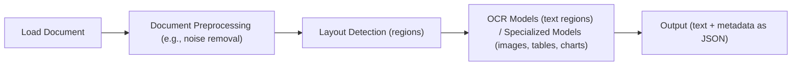
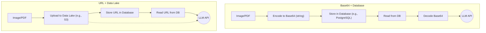
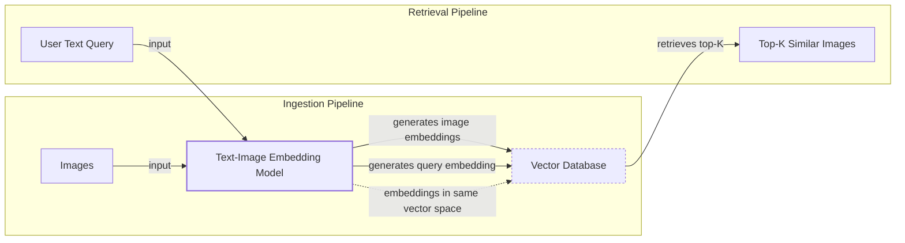
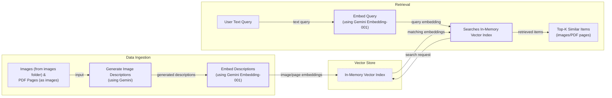
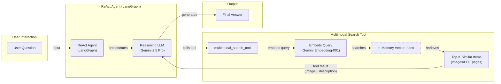

# Lesson 11: Multimodal AI

In the first ten lessons of this course, we built a solid foundation in AI Engineering. We explored the agent landscape, distinguished between LLM workflows and AI agents, mastered context engineering and structured outputs, and implemented core patterns like ReAct and RAG. You have learned how to build agents that can reason, act, and access knowledge. We have covered all the fundamentals except for one final, critical piece: the real world is not just text.

This lesson tackles that final piece: multimodal AI. In business and in life, we work with a rich mix of data—text, images, documents, and audio. An AI system that cannot "see" a chart in a financial report or understand a diagram in a technical manual is incomplete. The old approach was to force everything into text using Optical Character Recognition (OCR), but this is a brittle and lossy process. We will show you why natively processing images and documents is simpler, faster, and more powerful.

We will cover the theory behind multimodal LLMs and embedding models, just enough for you to build a strong intuition. Then, we will dive into hands-on examples, showing you how to work with images and PDFs using Gemini. Finally, we will bring everything together by building a multimodal RAG system and integrating it into a ReAct agent. This lesson provides the final skills you need to build enterprise-grade AI systems that can process data in its native format.

## Limitations of traditional document processing

To understand why multimodal AI is a necessity, we first need to look at why traditional document processing fails. For years, the standard approach for making AI understand documents like invoices or reports was to convert them to text. This process typically relies on a complex and fragile pipeline involving OCR.

As illustrated in Image 1, the workflow usually begins by loading and preprocessing a document to reduce noise. A layout detection model then identifies different regions like text blocks, tables, and images. An OCR model extracts text from these regions, while other specialized models might try to interpret visual elements. Finally, all this extracted information is structured and passed to the AI.



Image 1: A flowchart illustrating the traditional document processing workflow.

This multi-step pipeline is slow, expensive, and rigid. Each stage is a potential point of failure, and errors compound. This approach is particularly weak with visually complex documents. Even advanced OCR engines struggle with handwritten notes, poor-quality scans, or complex structures like nested tables and technical diagrams [[1]](https://www.llamaindex.ai/blog/ocr-accuracy). For these, critical information is inevitably lost in translation.

https://hackernoon.imgix.net/images/2DFAaGGO5cfymtBKn4bFFAoT6sg2-efb3xu6.jpeg 
Image 2: Traditional OCR struggles to distinguish similar-looking symbols, a common issue in complex documents. (Source [Oleg Kokorin](https://hackernoon.com/complex-document-recognition-ocr-doesnt-work-and-heres-how-you-fix-it))

This system is too brittle for the flexible, fast-moving AI agents required today. That is why modern AI solutions use multimodal LLMs like Gemini, which can interpret text, images, and PDFs as native inputs, completely bypassing this fragile OCR workflow. Let's see how they work.

## Foundations of multimodal LLMs

Before we write any code, you need a basic intuition for how multimodal LLMs work. As an AI Engineer, you do not need to know every architectural detail, but understanding the core concepts is essential for using, deploying, and optimizing these models effectively.

As shown in Image 3, the two common approaches are the **Unified Embedding Decoder Architecture**, where image and text token embeddings are concatenated, and the **Cross-modality Attention Architecture**, where image embeddings are injected directly into the LLM's attention layers [[2]](https://magazine.sebastianraschka.com/p/understanding-multimodal-llms).

https://substackcdn.com/image/fetch/f_auto,q_auto:good,fl_progressive:steep/https%3A%2F%2Fsubstack-post-media.s3.amazonaws.com%2Fpublic%2Fimages%2F53956ae8-9cd8-474e-8c10-ef6bddb88164_1600x938.png 
Image 3: The two main approaches to developing multimodal LLM architectures. (Source [Sebastian Raschka [2]](https://magazine.sebastianraschka.com/p/understanding-multimodal-llms))

The unified embedding approach, illustrated in Image 4, is simpler to implement. In contrast, the cross-attention architecture, shown in Image 5, is often more computationally efficient for high-resolution images [[5]](https://arxiv.org/abs/2409.11402).

https://substackcdn.com/image/fetch/f_auto,q_auto:good,fl_progressive:steep/https%3A%2F%2Fsubstack-post-media.s3.amazonaws.com%2Fpublic%2Fimages%2F91955021-7da5-4bc4-840e-87d080152b18_1166x1400.png 
Image 4: Illustration of the unified embedding decoder architecture. (Source [Sebastian Raschka [2]](https://magazine.sebastianraschka.com/p/understanding-multimodal-llms))

https://substackcdn.com/image/fetch/f_auto,q_auto:good,fl_progressive:steep/https%3A%2F%2Fsubstack-post-media.s3.amazonaws.com%2Fpublic%2Fimages%2Fd9c06055-b959-45d1-87b2-1f4e90ceaf2d_1296x1338.png 
Image 5: An illustration of the Cross-Modality Attention Architecture approach. (Source [Sebastian Raschka [2]](https://magazine.sebastianraschka.com/p/understanding-multimodal-llms))

Both methods rely on an **image encoder**, typically a Vision Transformer (ViT) as seen in Image 6, to convert image patches into embeddings, analogous to how text is tokenized (Image 7). A linear projection layer then aligns these image embeddings with the text embedding dimensions. Encoders like CLIP use contrastive learning to map an image and its corresponding text description to nearby vectors in a shared space, which enables multimodal reasoning and RAG [[3]](https://www.pinecone.io/learn/series/image-search/clip/).

https://substackcdn.com/image/fetch/f_auto,q_auto:good,fl_progressive:steep/https%3A%2F%2Fsubstack-post-media.s3.amazonaws.com%2Fpublic%2Fimages%2Ffef5f8cb-c76c-4c97-9771-7fdb87d7d8cd_1600x1135.png 
Image 6: Illustration of a classic vision transformer (ViT) setup. (Source [Sebastian Raschka [2]](https://magazine.sebastianraschka.com/p/understanding-multimodal-llms))

https://substackcdn.com/image/fetch/f_auto,q_auto:good,fl_progressive:steep/https%3A%2F%2Fsubstack-post-media.s3.amazonaws.com%2Fpublic%2Fimages%2F0d56ea06-d202-4eb7-9e01-9aac492ee309_1522x1206.png 
Image 7: Image tokenization and embedding (left) and text tokenization and embedding (right) side by side. (Source [Sebastian Raschka [2]](https://magazine.sebastianraschka.com/p/understanding-multimodal-llms))

By 2025, most leading models like Llama 4, Gemini 2.5, and GPT-5 are natively multimodal, and this principle extends to audio and video by adding specialized encoders [[6]](https://codedesign.ai/blog/the-ultimate-guide-to-the-top-large-language-models-in-2025/), [[7]](https://www.emergentmind.com/topics/multimodal-llms). These models differ from diffusion-based image generators like Midjourney, which are often used as tools within an agentic system rather than as the core reasoning engine [[8]](https://arxiv.org/html/2409.14993v3). Now that we understand how LLMs can directly process images, let's see how this works in practice.

## Applying multimodal LLMs to images and PDFs

To see how multimodal LLMs work, let's walk through a few examples using Gemini. There are three primary ways to provide images and PDFs to an LLM: as raw bytes, as Base64-encoded strings, or via URLs.

-   **Raw bytes** are direct but can be corrupted when stored in text-based databases.
-   **Base64** encoding converts binary data into a string, making it safe for database storage at the cost of a ~33% size increase.
-   **URLs** are most efficient for production, allowing the LLM to access files directly from public links or private data lakes like AWS S3, minimizing network I/O.



Image 8: A Mermaid diagram comparing the data flow for Base64 with a database versus URLs with a data lake.

<aside>
💡

You can find the code for this lesson in the accompanying [Jupyter Notebook](https://github.com/towardsai/course-ai-agents/blob/dev/lessons/11_multimodal/notebook.ipynb) on GitHub.

</aside>

Let's see this in action. First, we will set up our Gemini client.

1.  To process an image as **raw bytes**, we can load a local file and pass it directly to the model to generate a caption.
    
    ```python
    # Pseudocode for generating a caption from image bytes
    image_bytes = load_image_as_bytes("path/to/image.jpeg")
    
    response = client.models.generate_content(
        model=MODEL_ID,
        contents=[
            types.Part.from_bytes(data=image_bytes, mime_type="image/webp"),
            "Tell me what is in this image in one paragraph.",
        ],
    )
    print(response.text)
    ```
    
2.  For **Base64**, the process is similar: encode the bytes into a string before sending the request.
    
    ```python
    # Pseudocode for generating a caption from a Base64 string
    image_base64 = load_image_as_base64("path/to/image.jpeg")
    
    response = client.models.generate_content(
        model=MODEL_ID,
        contents=[
            types.Part.from_bytes(data=image_base64, mime_type="image/webp"),
            "Tell me what is in this image in one paragraph.",
        ],
    )
    ```
    
3.  Gemini's `url_context` tool simplifies using **public URLs**, allowing you to pass a link directly in the prompt. For private data lakes, you would provide a signed URL from your storage bucket (e.g., GCS).
    
    ```python
    # Pseudocode for summarizing a public PDF
    response = client.models.generate_content(
        model=MODEL_ID,
        contents="Summarize this PDF: https://arxiv.org/pdf/2210.03629",
        config=types.GenerateContentConfig(tools=[{"url_context": {}}]),
    )
    ```
    
4.  A more advanced use case is **object detection**. By providing a Pydantic schema, we can instruct the model to return structured JSON with bounding box coordinates for detected items, a technique we covered in Lesson 4.
    
    ```python
    # Pseudocode for object detection
    detections = client.models.generate_content(
        model=MODEL_ID,
        contents=[image_bytes, "Detect all prominent items..."],
        config=types.GenerateContentConfig(
            response_mime_type="application/json",
            response_schema=Detections, # Your Pydantic model
        ),
    ).parsed
    ```
    
5.  Since Gemini treats **PDFs** as a sequence of images, we can apply the same techniques. We can ask for a summary of the "Attention Is All You Need" paper or even perform object detection on a specific page to locate the Transformer architecture diagram, proving the model "sees" the document without any OCR.

## Foundations of multimodal RAG

A primary use case for multimodal data is RAG, which we covered in Lesson 10. Retrieving relevant private data is critical for large documents, as processing thousands of pages in the context window is impractical due to cost, latency, and performance issues.

A generic multimodal RAG architecture for images and text involves two pipelines, as shown in Image 9. During ingestion, images are passed through a text-image embedding model and their vector representations are stored in a vector database. During retrieval, a user's text query is embedded using the same model, and the resulting vector is used to find the most similar images in the database.



Image 9: A Mermaid diagram illustrating a generic multimodal RAG architecture with ingestion and retrieval pipelines, highlighting the shared vector space for text and image embeddings.

For enterprise document retrieval, the 2025 state-of-the-art is ColPali [[10]](https://arxiv.org/pdf/2407.01449v6). It bypasses OCR by processing document pages as images directly. The page is divided into patches, each embedded to create a "bag-of-embeddings." While powerful, this multi-vector approach creates scaling challenges, as one page can generate over 1,000 vectors [[12]](https://qdrant.tech/blog/colpali-qdrant-optimization/). Production systems use techniques like binary quantization for more efficient search to mitigate this [[13]](https://blog.vespa.ai/scaling-colpali-to-billions/). At query time, a late interaction mechanism (MaxSim) computes similarity scores between query tokens and all document patches.

This approach is highly effective for documents with complex tables, figures, and layouts. It is also significantly faster and less prone to failure than traditional OCR pipelines, outperforming them on benchmarks like ViDoRe [[10]](https://arxiv.org/pdf/2407.01449v6). The architecture is detailed in the original paper.

Now that we have covered the theory, let's build a simple multimodal RAG system from scratch.

## Implementing multimodal RAG for images, PDFs and text

Let's combine what we have learned about multimodal LLMs and RAG to build a simple retrieval system. We will create an in-memory vector index containing several images, including pages from the "Attention Is All You Need" paper, and then query it using text, as illustrated in Image 10.



Image 10: A Mermaid diagram illustrating the multimodal RAG example, showing data ingestion and retrieval pipelines.

<aside>
💡

A quick note on our implementation: The Gemini API we are using does not yet support image embeddings directly. To work around this, we will first use Gemini to generate a text description for each image and then embed that description using a text embedding model (`gemini-embedding-001`). This is not the recommended production approach, but it allows us to demonstrate the RAG workflow simply. With a true multimodal embedding model like those from Voyage AI or Cohere, you would embed the image bytes directly. The rest of the RAG system remains conceptually the same.

</aside>

1.  First, we define a function to generate a detailed description for an image using Gemini.
    
    ```python
    # Pseudocode for generating an image description
    def generate_image_description(image_bytes: bytes) -> str:
        # ... (uses Gemini Vision to describe the image)
        prompt = "Describe this image in detail for semantic search..."
        response = client.models.generate_content(model=MODEL_ID, contents=[prompt, img])
        return response.text.strip()
    ```
    
2.  Next, a function to embed text using Gemini's text embedding model.
    
    ```python
    # Pseudocode for embedding text
    def embed_text_with_gemini(content: str) -> np.ndarray | None:
        # ... (uses gemini-embedding-001 model)
        result = client.models.embed_content(model="gemini-embedding-001", contents=[content])
        return np.array(result.embeddings[0].values)
    ```
    
3.  We combine these to create our vector index. For this simple example, it will be a Python list of dictionaries. In a real-world application, you would use a scalable vector database.
    
    ```python
    # Pseudocode for creating the vector index
    vector_index = []
    for image_path in image_paths:
        image_bytes = load_image_as_bytes(image_path)
        image_description = generate_image_description(image_bytes)
        image_embedding = embed_text_with_gemini(image_description)
        vector_index.append({"filename": image_path, "embedding": image_embedding, ...})
    ```
    
4.  Finally, we create a search function that embeds a text query and finds the most similar items in our index using cosine similarity.
    
    ```python
    # Pseudocode for multimodal search
    def search_multimodal(query_text: str, vector_index: list[dict], top_k: int = 3) -> list[dict]:
        query_embedding = embed_text_with_gemini(query_text)
        # ... (calculates cosine similarity and returns top_k results)
        return top_k_results
    ```
    
    A query for "a kitten with a robot" correctly retrieves the corresponding image, and a query about the "architecture of the transformer neural network" retrieves the correct page from the PDF. This demonstrates how we can search across different modalities using a shared embedding space.

## Building multimodal AI agents

The final step is to integrate our multimodal RAG system into a ReAct agent, consolidating many of the skills from Part 1 of this course. We can enhance agents with multimodal capabilities by giving them multimodal inputs, multimodal tools for retrieval, or tools that interact with external multimodal resources like PDFs or screenshots [[9]](https://www.linkedin.com/posts/sayandey01_generativeai-llm-rag-activity-7412381316106760192-nFx3).

In this example, we will wrap our `search_multimodal` function into a tool and provide it to a ReAct agent built with LangGraph, as shown in Image 11. The agent will use the tool to find relevant images from our vector index to answer user questions.



Image 11: A Mermaid diagram illustrating the multimodal ReAct + RAG example.

1.  First, we define the tool. It takes a text query, calls our `search_multimodal` function, and returns the retrieved image and its description to the agent.
    
    ```python
    # Pseudocode for the multimodal search tool
    @tool
    def multimodal_search_tool(query: str) -> dict:
        """Search through a collection of images and their text descriptions."""
        results = search_multimodal(query, vector_index, top_k=1)
        # ... (formats and returns the result for the agent)
        return formatted_result
    ```
    
2.  Next, we build the ReAct agent using LangGraph's `create_react_agent` helper. We provide it with the `multimodal_search_tool` and a system prompt that guides it on how to use the tool. We will cover LangGraph in detail in Part 2 of the course.
    
    ```python
    # Pseudocode for building the ReAct agent
    tools = [multimodal_search_tool]
    system_prompt = "You are a helpful AI assistant that can search through images..."
    
    react_agent = create_react_agent(
        model=ChatGoogleGenerativeAI(model="gemini-2.5-pro"),
        tools=tools,
        prompt=system_prompt,
    )
    ```
    
3.  Finally, we ask the agent a question: "what color is my kitten?". The agent reasons that it needs to search for an image of a kitten, calls the `multimodal_search_tool`, receives the image and its description, and then uses that information to correctly answer that the kitten is a gray tabby.
    
    ```python
    response = react_agent.invoke({"messages": "what color is my kitten?"})
    ```
    
    The agent correctly identifies the kitten's color from the retrieved image.
    
    https://raw.githubusercontent.com/towardsai/course-ai-agents/dev/lessons/11_multimodal/images/image_1.jpeg 
    Image 12: The image retrieved by the agent to answer the user's query.

This example brings together structured outputs, tools, ReAct, RAG, and multimodal data, demonstrating how to build a sophisticated, agentic RAG system.

## Conclusion

In this lesson, we have seen why the old way of forcing all data into text is no longer sufficient. By embracing multimodal LLMs, we can build AI systems that process documents and images in their native format, preserving rich visual context that would otherwise be lost. We have covered the foundations of how these models work and walked through practical examples of image processing, object detection, and building a complete multimodal agentic RAG system.

This lesson marks the end of Part 1 of our course on AI Engineering fundamentals. In Part 2, we will move from theory to practice as we begin building our capstone project: an interconnected research and writing agent system. We will dive deep into agentic design patterns, explore frameworks like LangGraph in more detail, and build out the research and writer agents that will form the core of our production-grade pipeline.

## References

- [1] OCR Accuracy Explained: How to Improve It https://www.llamaindex.ai/blog/ocr-accuracy
- [2] Understanding Multimodal LLMs https://magazine.sebastianraschka.com/p/understanding-multimodal-llms
- [3] Multi-modal ML with OpenAI's CLIP https://www.pinecone.io/learn/series/image-search/clip/
- [4] Multimodal Embeddings: An Introduction https://towardsdatascience.com/multimodal-embeddings-an-introduction-5dc36975966f/
- [5] NVLM: Open Frontier-Class Multimodal LLMs https://arxiv.org/abs/2409.11402
- [6] The ultimate guide to the top large language models in 2025 https://codedesign.ai/blog/the-ultimate-guide-to-the-top-large-language-models-in-2025/
- [7] Multimodal LLMs https://www.emergentmind.com/topics/multimodal-llms
- [8] Multi-modal Generative AI: Multi-modal LLMs, Diffusions, and the Unification https://arxiv.org/html/2409.14993v3
- [9] Multimodal RAG architecture for handling complex PDFs https://www.linkedin.com/posts/sayandey01_generativeai-llm-rag-activity-7412381316106760192-nFx3
- [10] ColPali: Efficient Document Retrieval with Vision Language Models https://arxiv.org/pdf/2407.01449v6
- [11] Diagnosing and Mitigating Modality Interference in Multimodal Large Language Models https://arxiv.org/pdf/2505.19616
- [12] ColPali and Qdrant Optimization: A Technical Deep Dive https://qdrant.tech/blog/colpali-qdrant-optimization/
- [13] Scaling ColPali to billions of PDFs with Vespa https://blog.vespa.ai/scaling-colpali-to-billions/
</article>