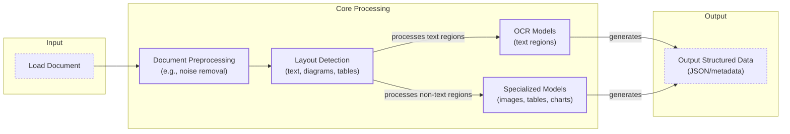
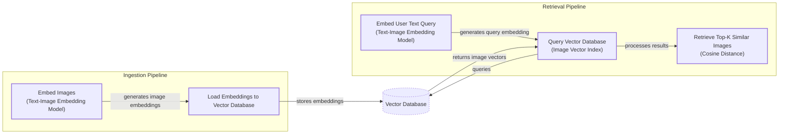
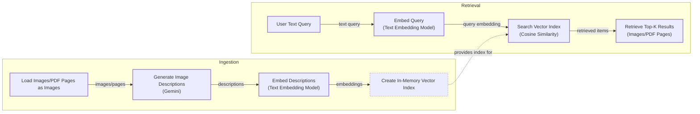
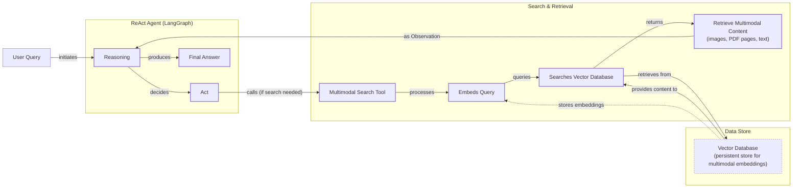

# Stop Converting Documents to Text. You're Doing It Wrong.

When we first started building AI agents, we hit a frustrating wall. Our systems handled text well, but integrating images and PDFs turned elegant architectures into messy hacks. We spent weeks building brittle, slow, and expensive pipelines that forced everything into text using OCR. The breakthrough came when we realized we were solving the wrong problem: we did not need to convert documents to text; we needed to treat them as images.

This shift is essential because real-world AI applications are inherently multimodal. Enterprises work with financial reports, technical diagrams, and other visual documents. The old approach of normalizing everything to text is lossy, discarding crucial spatial information. By processing data in its native format, we build systems that are faster, cheaper, and more performant. This lesson will cover the limitations of traditional document processing and the foundations of multimodal LLMs. We will then show you how to apply these models to images and PDFs, build a multimodal RAG system, and create a simple AI agent that can reason across these data types.

## Limitations of Traditional Document Processing

To understand the problem, let’s look at the limitations of traditional document processing for invoices, documentation, or reports. Previous approaches tried to normalize everything to text before passing it to an AI model. This has many flaws, as we lose a substantial amount of information during translation. For example, when encountering diagrams, charts, or sketches in a document, it is impossible to fully reproduce them in text.

The traditional workflow relies on a multi-step pipeline involving layout detection and Optical Character Recognition (OCR). This process typically includes loading the document, preprocessing it to remove noise, detecting the layout of different regions, and then using OCR for text and specialized models for other data structures like tables or charts.


Image 1: A flowchart illustrating the traditional document processing workflow.

This workflow has too many moving pieces, making the system rigid, slow, and fragile. If a document contains a chart type we do not have a model for, the pipeline fails. Performance is also a major challenge. Errors compound at each stage, and even advanced OCR engines struggle with handwritten text, poor scans, or complex layouts like nested tables and building sketches [[9]](https://hackernoon.com/complex-document-recognition-ocr-doesnt-work-and-heres-how-you-fix-it), [[11]](https://www.llamaindex.ai/blog/olmocr-bench-review-insights-and-pitfalls-on-an-ocr-benchmark). Traditional OCR accuracy, which can be 88-94% on simple layouts, drops on complex documents or degraded scans [[19]](https://www.llamaindex.ai/blog/ocr-accuracy).

https://substackcdn.com/image/fetch/f_auto,q_auto:good,fl_progressive:steep/https%3A%2F%2Fsubstack-post-media.s3.amazonaws.com%2Fpublic%2Fimages%2Fa2dc40f3-dc13-486e-853d-8404368f4d8d_1616x1000.png
Image 2: A building sketch showing a crawl space vent diagram, illustrating the complexity of layouts that classic OCR systems struggle to interpret. (Source [Vectorize.io](https://vectorize.io/blog/multimodal-rag-patterns))

This approach might work for highly specialized applications, but it does not scale in a world of flexible and fast AI agents. Modern AI solutions use multimodal LLMs that can directly interpret text, images, or PDFs as native input, completely bypassing this brittle OCR workflow. Thus, let’s understand how they work.

## Foundations of Multimodal LLMs

To use LLMs with images and documents, you need an intuition of how multimodality works. You do not need to understand every research detail, but knowing the architecture helps you deploy, optimize, and monitor them. There are two common approaches to building multimodal LLMs: the Unified Embedding Decoder Architecture and the Cross-modality Attention Architecture [[1]](https://magazine.sebastianraschka.com/p/understanding-multimodal-llms).

https://substackcdn.com/image/fetch/f_auto,q_auto:good,fl_progressive:steep/https%3A%2F%2Fsubstack-post-media.s3.amazonaws.com%2Fpublic%2Fimages%2F76f50b57-2585-4cb8-8dda-eea5b5f81c03_1456x854.jpeg
Image 3: The two main approaches to developing multimodal LLM architectures. (Source [Understanding Multimodal LLMs](https://magazine.sebastianraschka.com/p/understanding-multimodal-llms))

### Unified Embedding Decoder Architecture

In this approach, we encode the text and image separately, concatenate their embeddings into a single vector, and pass the resulting vector to the LLM. On top of a standard LLM architecture, you need a vision encoder that maps the image to an embedding that is within the same vector space as the text. When the text and image embeddings are merged, the LLM can make sense of both [[1]](https://magazine.sebastianraschka.com/p/understanding-multimodal-llms).

https://substackcdn.com/image/fetch/f_auto,q_auto:good,fl_progressive:steep/https%3A%2F%2Fsubstack-post-media.s3.amazonaws.com%2Fpublic%2Fimages%2Fa0979e82-2fb0-4f78-80c8-1395511e057f_1166x1400.jpeg
Image 4: Illustration of the unified embedding decoder architecture. (Source [Understanding Multimodal LLMs](https://magazine.sebastianraschka.com/p/understanding-multimodal-llms))

### Cross-modality Attention Architecture

In the second approach, instead of passing the image embeddings along with the text embeddings at the input, we inject them directly into the attention module. We still need an image encoder that projects the image into the same vector space as the text, but we inject it deeper within the architecture [[1]](https://magazine.sebastianraschka.com/p/understanding-multimodal-llms).

https://substackcdn.com/image/fetch/f_auto,q_auto:good,fl_progressive:steep/https%3A%2F%2Fsubstack-post-media.s3.amazonaws.com%2Fpublic%2Fimages%2Fea1b9ee4-0d19-4c3c-89db-06e779653da2_1296x1338.jpeg
Image 5: An illustration of the Cross-Modality Attention Architecture approach. (Source [Understanding Multimodal LLMs](https://magazine.sebastianraschka.com/p/understanding-multimodal-llms))

### Image Encoders

Both architectures rely on image encoders. To understand them, we can draw a parallel between text tokenization and image patching. Just as we split text into sub-word tokens, we split images into patches [[1]](https://magazine.sebastianraschka.com/p/understanding-multimodal-llms).

https://substackcdn.com/image/fetch/f_auto,q_auto:good,fl_progressive:steep/https%3A%2F%2Fsubstack-post-media.s3.amazonaws.com%2Fpublic%2Fimages%2F4a7104c0-3986-4aae-b918-06c393ff824c_1456x1154.jpeg
Image 6: Image tokenization and embedding (left) and text tokenization and embedding (right) side by side. (Source [Understanding Multimodal LLMs](https://magazine.sebastianraschka.com/p/understanding-multimodal-llms))

These patches are then encoded by a pretrained vision transformer (ViT). The output has the same structure and dimensions as text embeddings, but they need to be aligned in the same vector space. We do this through a linear projection module. Popular image encoder models like CLIP, OpenCLIP, and SigLIP use contrastive learning to achieve this alignment, which is also what enables multimodal RAG to find semantic similarities between images and text [[3]](https://towardsdatascience.com/multimodal-embeddings-an-introduction-5dc36975966f/).

https://towardsdatascience.com/wp-content/uploads/2024/11/15d3HBNjNIXLy0oMIvJjxWw.png
Image 7: Toy representation of multimodal embedding space. (Source [Multimodal Embeddings: An Introduction](https://towardsdatascience.com/multimodal-embeddings-an-introduction-5dc36975966f/))

The **Unified Embedding Decoder** approach is simpler to implement and generally yields higher accuracy in OCR-related tasks. The **Cross-modality Attention** approach is more computationally efficient for high-resolution images. Hybrid approaches also exist to combine these benefits [[36]](https://arxiv.org/abs/2409.11402). In 2025, most leading LLMs are multimodal, including open-source models like Llama 4 and closed-source options like GPT-5 [[22]](https://medium.com/data-science-in-your-pocket/2025-the-year-ai-reasoning-models-took-over-a-month-by-month-review-of-frontier-breakthroughs-6ea2163f854f). It is important to distinguish these from diffusion models like Midjourney, which are architecturally different and typically used as tools for image generation within an agent workflow [[18]](https://arxiv.org/html/2409.14993v3). Now that we understand the basics, let's see how this works in practice.

## Applying Multimodal LLMs to Images and PDFs

Let’s write a few examples using Gemini to show some best practices when working with images and PDFs. There are three core ways to process multimodal data:

1.  **Raw bytes:** Best for one-off API calls without storage. Data can be corrupted when stored in databases that expect text.
2.  **Base64:** Encodes bytes as strings, allowing safe storage in a database. The main downside is a file size increase of about 33%.
3.  **URLs:** The standard for enterprise scenarios. Data is stored in a data lake (e.g., AWS S3), and the LLM downloads it directly, reducing network latency.

```mermaid
graph TD
    subgraph "Base64 + Database"
        A[Image/PDF] --> B{Encode to Base64};
        B --> C[Store in Database<br/>(e.g., PostgreSQL)];
        C --> D[Application Server];
        D --> E((LLM API));
    end

    subgraph "URL + Data Lake"
        F[Image/PDF] --> G[Upload to Data Lake<br/>(e.g., S3, GCS)];
        G --> H[Store URL in Database];
        H --> I[Application Server];
        I -- "Passes URL" --> J((LLM API));
        G -- "LLM Downloads Directly" --> J;
    end
```
Image 8: A diagram comparing the Base64 with database approach versus the URL with data lake approach for handling multimodal data.

Now, let's look at some code.

1.  First, we can process an image as **raw bytes** to generate a caption. We use the `WEBP` format for efficiency.
    ```python
    # Pseudocode for image captioning with raw bytes
    image_bytes = load_image_as_bytes("path/to/image.jpeg", format="WEBP")
    
    response = client.generate_content(
        model=MODEL_ID,
        contents=[
            Part.from_bytes(data=image_bytes, mime_type="image/webp"),
            "Caption this image.",
        ],
    )
    # Outputs: "A striking image features a massive, dark metallic robot..."
    ```

2.  We can also process the image as a **Base64 encoded string**.
    ```python
    # Pseudocode for image captioning with Base64
    image_base64 = base64.b64encode(image_bytes).decode("utf-8")
    
    response = client.generate_content(
        model=MODEL_ID,
        contents=[
            Part.from_bytes(data=image_base64, mime_type="image/webp"),
            "Caption this image.",
        ],
    )
    ```

3.  For **public URLs**, Gemini's `url_context` tool can automatically parse web pages, PDFs, and images.
    ```python
    # Pseudocode for processing a public PDF URL
    response = client.generate_content(
        model=MODEL_ID,
        contents="Summarize this PDF: https://arxiv.org/pdf/2210.03629",
        tools=[{"url_context": {}}],
    )
    # Outputs: "ReAct is a novel paradigm for large language models..."
    ```

4.  For **private URLs** from data lakes like GCS, you can pass the URI directly.
    ```python
    # Pseudocode for processing a private GCS URL
    response = client.generate_content(
        model=MODEL_ID,
        contents=[
            Part.from_uri(uri="gs://bucket/image.jpeg", mime_type="image/webp"),
            "Caption this image.",
        ],
    )
    ```

5.  For a more complex task like **Object Detection**, we can use Pydantic to define the output structure.
    ```python
    # Pseudocode for object detection
    class Detections(BaseModel): ...
    
    response = client.generate_content(
        model=MODEL_ID,
        contents=[image_bytes, "Detect all prominent items."],
        response_schema=Detections,
    )
    # response.parsed contains Pydantic objects with bounding boxes
    ```

6.  The process for **PDFs** is nearly identical. We can load a PDF as **raw bytes** or **Base64** and ask for a summary.
    ```python
    # Pseudocode for summarizing a PDF from bytes
    pdf_bytes = open("attention_paper.pdf", "rb").read()
    
    response = client.generate_content(
        model=MODEL_ID,
        contents=[
            Part.from_bytes(data=pdf_bytes, mime_type="application/pdf"),
            "Summarize this document.",
        ],
    )
    # Outputs: "This document introduces the Transformer..."
    ```

7.  Finally, we can perform **Object Detection on PDF pages** by treating the page as an image. This is powerful for extracting diagrams or tables, a concept popularized by the ColPali paper [[5]](https://arxiv.org/pdf/2407.01449v6).

## Foundations of Multimodal RAG

One of the most common use cases for multimodal data is RAG. When working with large documents or images, stuffing everything into the context window is unfeasible due to increased latency, cost, and decreased performance. RAG becomes essential.

Let's explore a generic multimodal RAG architecture using images and text. The workflow involves an ingestion pipeline, where images are embedded and stored in a vector database, and a retrieval pipeline, where a user's text query is embedded to find the most similar images.


Image 9: A flowchart illustrating a generic multimodal RAG architecture using images and text.

For enterprise document RAG, a popular architecture as of 2025 is ColPali [[5]](https://arxiv.org/pdf/2407.01449v6). It bypasses the entire OCR pipeline by processing document pages directly as images. It uses a "bag-of-embeddings" approach, where each document image is broken into patches, and each patch gets its own embedding vector. At query time, a late interaction mechanism computes similarities between query tokens and document patches, allowing for fine-grained matching. This method is faster and more accurate than traditional OCR pipelines, especially for documents with complex visual layouts [[5]](https://arxiv.org/pdf/2407.01449v6).

https://huggingface.co/datasets/huggingface/documentation-images/resolve/main/blog/saumitras/colpali-milvus-multimodal-rag/final_architecture.png
Image 10: The ColPali architecture, which simplifies document retrieval by treating pages as images. (Source [ColPali Paper](https://arxiv.org/pdf/2407.01449v6))

## Implementing Multimodal RAG

Let's implement a simple multimodal RAG system. We will populate an in-memory vector index with images and PDF pages, then query it with text. To keep it simple, we will not patch the images or use a late interaction mechanism.


Image 11: A flowchart illustrating the multimodal RAG example, showing both the ingestion and retrieval processes.

1.  First, we define a function to create our vector index. Since the Gemini API in this notebook does not support direct image embedding, we will use a workaround: generate a text description for each image and embed that. In a production system with a true multimodal embedding model (like Voyage or Cohere), you would embed the image bytes directly.
    ```python
    # Pseudocode for creating the vector index
    def create_vector_index(image_paths):
        vector_index = []
        for path in image_paths:
            image_bytes = load_image_as_bytes(path)
            description = generate_image_description(image_bytes) # (LLM call)
            
            # In production, embed image_bytes directly
            embedding = embed_text_with_gemini(description)
            
            vector_index.append({"content": image_bytes, "embedding": embedding, ...})
        return vector_index
    ```

2.  Next, we define a search function that embeds a text query and finds the most similar images using cosine similarity.
    ```python
    # Pseudocode for multimodal search
    def search_multimodal(query_text, vector_index, top_k=3):
        query_embedding = embed_text_with_gemini(query_text)
        
        # Calculate cosine similarity against all image embeddings
        similarities = cosine_similarity([query_embedding], [doc["embedding"] for doc in vector_index])
        
        # Get top k results
        top_indices = np.argsort(similarities)[::-1][:top_k]
        return [vector_index[i] for i in top_indices]
    ```

3.  Let's test it with a query about the Transformer architecture.
    ```python
    query = "what is the architecture of the transformer neural network?"
    results = search_multimodal(query, vector_index, top_k=1)
    ```
    The system correctly retrieves the image of the Transformer model architecture from the paper, demonstrating its ability to connect a text query to a relevant visual diagram.

## Building Multimodal AI Agents

To take this a step further, we can integrate our RAG function into a ReAct agent as a tool. This combines many of the skills we have learned so far, including structured outputs, tools, ReAct, and RAG. The agent will use the `multimodal_search_tool` to find relevant images based on a user's question and then reason about the retrieved content to provide an answer.


Image 12: A flowchart illustrating a multimodal ReAct Agent with RAG functionality.

1.  We define the `multimodal_search_tool` by wrapping our RAG function with LangChain's `@tool` decorator.
    ```python
    # Pseudocode for the search tool
    @tool
    def multimodal_search_tool(query: str) -> dict:
        """Searches for images and descriptions based on a text query."""
        results = search_multimodal(query, vector_index, top_k=1)
        if not results:
            return {"content": "No relevant content found."}
        
        # Format result with image and description for the agent
        result = results[0]
        content = [
            {"type": "text", "text": f"Image description: {result['description']}"},
            Part.from_bytes(data=result["content"], mime_type="image/jpeg"),
        ]
        return {"content": content}
    ```

2.  Next, we create a ReAct agent using LangGraph, providing it with our new tool and a system prompt. We will explore LangGraph in more detail in Part 2 of the course.
    ```python
    # Pseudocode for building the ReAct agent
    def build_react_agent():
        system_prompt = "You are a helpful AI assistant that can search through images..."
        agent = create_react_agent(
            model=ChatGoogleGenerativeAI(model="gemini-2.5-pro"),
            tools=[multimodal_search_tool],
            prompt=system_prompt,
        )
        return agent
    
    react_agent = build_react_agent()
    ```

3.  Finally, we invoke the agent. It reasons that it needs to use the search tool, calls it with a relevant query ("my kitten"), and uses the retrieved image and description to answer the user's question.
    ```python
    test_question = "what color is my kitten?"
    response = react_agent.invoke(input={"messages": test_question})
    # Outputs: "Based on the image, your kitten is a gray tabby..."
    ```
    https://substackcdn.com/image/fetch/f_auto,q_auto:good,fl_progressive:steep/https%3A%2F%2Fsubstack-post-media.s3.amazonaws.com%2Fpublic%2Fimages%2F5780cbd6-133b-44fe-9352-38250d6fc611_640x640.jpeg
    Image 13: The image of the kitten retrieved by the agent's search tool.

## Conclusion

Working with multimodal data is a fundamental skill for AI engineers. Modern AI applications rarely exist in a text-only vacuum; they must interact with the complex, visual, and auditory reality of the world. In this lesson, we moved away from the unstable, multi-step OCR pipelines of the past and learned that modern LLMs can natively process images and documents, preserving rich context that was previously lost.

This concludes the first part of our course on the foundations of AI Engineering. You now have the foundational blocks to build production-ready AI systems. In Part 2, we will move from theory to practice and begin building our central course project: an interconnected research and writing agent system. We will start with a deep dive into agentic design patterns and a look at modern frameworks like LangGraph.

## References

- [1] [https://magazine.sebastianraschka.com/p/understanding-multimodal-llms](https://magazine.sebastianraschka.com/p/understanding-multimodal-llms)
- [2] [https://www.nvidia.com/en-us/glossary/vision-language-models/](https://www.nvidia.com/en-us/glossary/vision-language-models/)
- [3] [https://towardsdatascience.com/multimodal-embeddings-an-introduction-5dc36975966f/](https://towardsdatascience.com/multimodal-embeddings-an-introduction-5dc36975966f/)
- [4] [https://www.pinecone.io/learn/series/image-search/clip/](https://www.pinecone.io/learn/series/image-search/clip/)
- [5] [https://arxiv.org/pdf/2407.01449v6](https://arxiv.org/pdf/2407.01449v6)
- [6] [https://ai.google.dev/gemini-api/docs/image-understanding](https://ai.google.dev/gemini-api/docs/image-understanding)
- [7] [https://huggingface.co/blog/saumitras/colpali-milvus-multimodal-rag](https://huggingface.co/blog/saumitras/colpali-milvus-multimodal-rag)
- [8] [https://python.langchain.com/docs/integrations/text_embedding/google_generative_ai/](https://python.langchain.com/docs/integrations/text_embedding/google_generative_ai/)
- [9] [https://hackernoon.com/complex-document-recognition-ocr-doesnt-work-and-heres-how-you-fix-it](https://hackernoon.com/complex-document-recognition-ocr-doesnt-work-and-heres-how-you-fix-it)
- [10] [https://milvus.io/ai-quick-reference/what-are-some-realworld-applications-of-multimodal-ai](https://milvus.io/ai-quick-reference/what-are-some-realworld-applications-of-multimodal-ai)
- [11] [https://www.llamaindex.ai/blog/olmocr-bench-review-insights-and-pitfalls-on-an-ocr-benchmark](https://www.llamaindex.ai/blog/olmocr-bench-review-insights-and-pitfalls-on-an-ocr-benchmark)
- [12] [https://vectorize.io/blog/multimodal-rag-patterns](https://vectorize.io/blog/multimodal-rag-patterns)
- [13] [https://blog.roboflow.com/what-is-optical-character-recognition-ocr/](https://blog.roboflow.com/what-is-optical-character-recognition-ocr/)
- [14] [https://zapier.com/blog/best-ai-image-generator/](https://zapier.com/blog/best-ai-image-generator/)
- [15] [https://www.youtube.com/watch?v=YOvxh_ma5qE](https://www.youtube.com/watch?v=YOvxh_ma5qE)
- [16] [https://langchain-ai.github.io/langgraph/agents/agents/](https://langchain-ai.github.io/langgraph/agents/agents/)
- [17] [https://medium.com/data-science-in-your-pocket/2025-the-year-ai-reasoning-models-took-over-a-month-by-month-review-of-frontier-breakthroughs-6ea2163f854f](https://medium.com/data-science-in-your-pocket/2025-the-year-ai-reasoning-models-took-over-a-month-by-month-review-of-frontier-breakthroughs-6ea2163f854f)
- [18] [https://arxiv.org/html/2409.14993v3](https://arxiv.org/html/2409.14993v3)
- [19] [https://www.llamaindex.ai/blog/ocr-accuracy](https://www.llamaindex.ai/blog/ocr-accuracy)
- [20] [https://arxiv.org/abs/2409.11402](https://arxiv.org/abs/2409.11402)
- [21] [https://konfuzio.com/en/chatgpt-financial-analysis/](https://konfuzio.com/en/chatgpt-financial-analysis/)
- [22] [https://medium.com/data-science-in-your-pocket/2025-the-year-ai-reasoning-models-took-over-a-month-by-month-review-of-frontier-breakthroughs-6ea2163f854f](https://medium.com/data-science-in-your-pocket/2025-the-year-ai-reasoning-models-took-over-a-month-by-month-review-of-frontier-breakthroughs-6ea2163f854f)
- [23] [https://milvus.io/blog/choose-embedding-model-rag-2026.md](https://milvus.io/blog/choose-embedding-model-rag-2026.md)
- [24] [https://www.llamaindex.ai/blog/ocr-accuracy](https://www.llamaindex.ai/blog/ocr-accuracy)
- [25] [https://learn.microsoft.com/en-us/answers/questions/5668164/why-traditional-ocr-fails-for-complex-business-doc?page=1](https://learn.microsoft.com/en-us/answers/questions/5668164/why-traditional-ocr-fails-for-complex-business-doc?page=1)
- [26] [https://www.llamaindex.ai/blog/ocr-for-tables](https://www.llamaindex.ai/blog/ocr-for-tables)
- [27] [https://discuss.ai.google.dev/t/gemini-consistently-producing-valid-pydantic-responses/98992](https://discuss.ai.google.dev/t/gemini-consistently-producing-valid-pydantic-responses/98992)
- [28] [https://www.decodingai.com/p/stop-converting-documents-to-text](https://www.decodingai.com/p/stop-converting-documents-to-text)
- [29] [https://tetrate.io/learn/ai/llm-output-parsing-structured-generation](https://tetrate.io/learn/ai/llm-output-parsing-structured-generation)
- [30] [https://python.useinstructor.com/blog/2024/10/23/structured-outputs-with-multimodal-gemini/](https://python.useinstructor.com/blog/2024/10/23/structured-outputs-with-multimodal-gemini/)
- [31] [https://pydantic.dev/articles/llm-intro](https://pydantic.dev/articles/llm-intro)
- [32] [https://opensearch.org/blog/multimodal-semantic-search/](https://opensearch.org/blog/multimodal-semantic-search/)
- [33] [https://towardsdatascience.com/multimodal-ai-search-for-business-applications-65356d011009/](https://towardsdatascience.com/multimodal-ai-search-for-business-applications-65356d011009/)
- [34] [https://assets.amazon.science/89/bf/661d950d4059930c8f1d2e449ac6/joint-visual-textual-embedding-for-multimodal-style-search.pdf](https://assets.amazon.science/89/bf/661d950d4059930c8f1d2e449ac6/joint-visual-textual-embedding-for-multimodal-style-search.pdf)
- [35] [https://zilliz.com/blog/combine-image-and-text-how-multimodal-retrieval-transforms-search](https://zilliz.com/blog/combine-image-and-text-how-multimodal-retrieval-transforms-search)
- [36] [https://arxiv.org/abs/2409.11402](https://arxiv.org/abs/2409.11402)
- [37] [https://github.com/cognitivetech/llm-research-summaries/blob/main/models-review/A-Comprehensive-Survey-and-Guide-to-Multimodal-Large-Language-Models-in-Vision-Language-Tasks.md](https://github.com/cognitivetech/llm-research-summaries/blob/main/models-review/A-Comprehensive-Survey-and-Guide-to-Multimodal-Large-Language-Models-in-Vision-Language-Tasks.md)
- [38] [https://smartdev.com/multimodal-ai-examples-how-it-works-real-world-applications-and-future-trends/](https://smartdev.com/multimodal-ai-examples-how-it-works-real-world-applications-and-future-trends/)
- [39] [https://www.ibm.com/think/topics/multimodal-llm](https://www.ibm.com/think/topics/multimodal-llm)
- [40] [https://pmc.ncbi.nlm.nih.gov/articles/PMC12479233/](https://pmc.ncbi.nlm.nih.gov/articles/PMC12479233/)
- [41] [https://www.nature.com/articles/s41598-025-98483-1](https://www.nature.com/articles/s41598-025-98483-1)
- [42] [https://sparkco.ai/blog/exploring-multimodal-llms-text-image-and-video-integration](https://sparkco.ai/blog/exploring-multimodal-llms-text-image-and-video-integration)
- [43] [https://www.emergentmind.com/topics/multimodal-llms](https://www.emergentmind.com/topics/multimodal-llms)
- [44] [https://towardsai.net/p/l/enhancing-llm-capabilities-the-power-of-multimodal-llms-and-rag](https://towardsai.net/p/l/enhancing-llm-capabilities-the-power-of-multimodal-llms-and-rag)
- [45] [https://arxiv.org/html/2411.06284v3](https://arxiv.org/html/2411.06284v3)
- [46] [https://huggingface.co/blog/multimodal-sentence-transformers](https://huggingface.co/blog/multimodal-sentence-transformers)
- [47] [https://techtoday.lenovo.com/sites/default/files/2025-05/Medical%20Imaging%20White%20Paper%20NVIDIA%20and%20Lenovo.pdf](https://techtoday.lenovo.com/sites/default/files/2025-05/Medical%20Imaging%20White%20Paper%20NVIDIA%20and%20Lenovo.pdf)
- [48] [https://www.ijcai.org/proceedings/2023/0581.pdf](https://www.ijcai.org/proceedings/2023/0581.pdf)
- [49] [https://www.philips.com/a-w/about/news/archive/features/2022/20221124-10-real-world-examples-of-ai-in-healthcare.html](https://www.philips.com/a-w/about/news/archive/features/2022/20221124-10-real-world-examples-of-ai-in-healthcare.html)
- [50] [https://www.linkedin.com/posts/sayandey01_generativeai-llm-rag-activity-7412381316106760192-nFx3](https://www.linkedin.com/posts/sayandey01_generativeai-llm-rag-activity-7412381316106760192-nFx3)
- [51] [https://pathway.com/developers/templates/rag/multimodal-rag](https://pathway.com/developers/templates/rag/multimodal-rag)
- [52] [https://www.linkedin.com/posts/gauravagg_mmctagent-enables-multimodal-reasoning-over-activity-7413983881181339648--PyD](https://www.linkedin.com/posts/gauravagg_mmctagent-enables-multimodal-reasoning-over-activity-7413983881181339648--PyD)
- [53] [https://www.usaii.org/ai-insights/multimodal-rag-explained-from-text-to-images-and-beyond](https://www.usaii.org/ai-insights/multimodal-rag-explained-from-text-to-images-and-beyond)
- [54] [https://docs.anyscale.com/llm](https://docs.anyscale.com/llm)
- [55] [https://codedesign.ai/blog/the-ultimate-guide-to-the-top-large-language-models-in-2025/](https://codedesign.ai/blog/the-ultimate-guide-to-the-top-large-language-models-in-2025/)
- [56] [https://www.linkedin.com/posts/progressivethinker_this-is-the-most-essential-breakdown-of-2025-activity-7376654335319117825-a5aD](https://www.linkedin.com/posts/progressivethinker_this-is-the-most-essential-breakdown-of-2025-activity-7376654335319117825-a5aD)
- [57] [https://www.preprints.org/manuscript/202508.1904](https://www.preprints.org/manuscript/202508.1904)
- [58] [https://www.promptitude.io/post/ultimate-2025-ai-language-models-comparison-gpt5-gpt-4-claude-gemini-sonar-more](https://www.promptitude.io/post/ultimate-2025-ai-language-models-comparison-gpt5-gpt-4-claude-gemini-sonar-more)
- [59] [https://greennode.ai/blog/best-embedding-models-for-rag](https://greennode.ai/blog/best-embedding-models-for-rag)
- [60] [https://eagerworks.com/blog/best-embedding-model-for-rag](https://eagerworks.com/blog/best-embedding-model-for-rag)
- [61] [https://artsmart.ai/blog/top-embedding-models-in-2025/](https://artsmart.ai/blog/top-embedding-models-in-2025/)
</article>