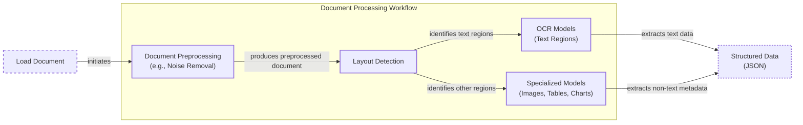
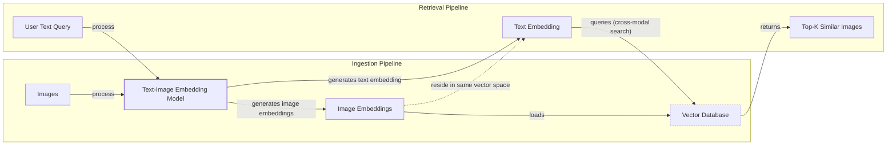
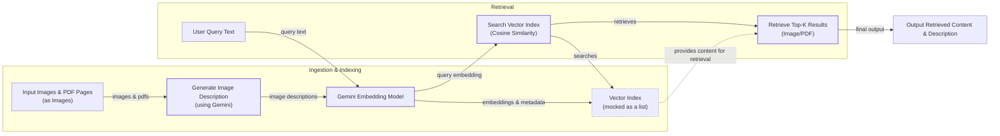
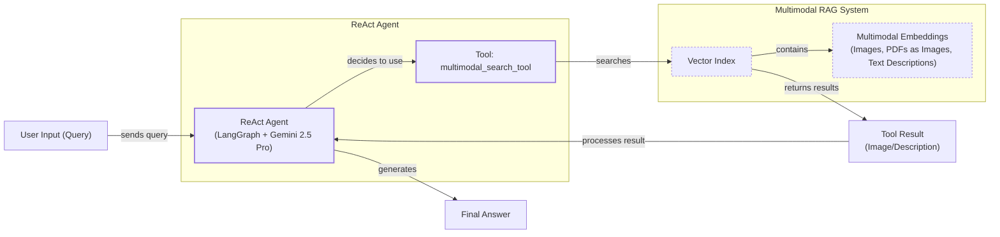

# Stop Converting Documents to Text. You're Doing It Wrong.

When we first started building AI agents, we hit a frustrating wall. We were comfortable manipulating text, but the moment we had to integrate multimodal data—images, audio, and especially PDFs—our elegant architectures turned into messy hacks. We spent weeks building complex pipelines that tried to force everything into a textual format. We chained Optical Character Recognition (OCR) engines to scrape PDFs and layout detection models to identify tables. It was a brittle, slow, and expensive solution that broke every time a document layout changed.

The breakthrough came when we realized we were solving the wrong problem. We did not need to convert documents to text; we needed to treat them as images. Once we understood that every PDF page is effectively an image and that modern LLMs can “see” just as well as they can read, the complexity vanished.

This shift is essential because real-world AI applications rarely exist in isolation. Enterprise applications need to manipulate private data from warehouses and lakes that is inherently multimodal: financial reports with complex charts, technical diagrams, and building sketches. The old approach of normalizing everything to text is lossy. When you translate a complex diagram into text, you lose the spatial relationships and context. By processing data in its native format, we preserve this rich visual information, resulting in systems that are faster, cheaper, and more performant.

In this lesson, you will gain an intuition for how multimodal LLMs process visual and textual tokens, learn how to work with images and PDFs using the Gemini API, and see how to structure agent memory before building a complete multimodal ReAct agent.

## The Need for Multimodal AI

In previous lessons, you built the foundations for AI systems with context engineering, structured outputs, ReAct, memory, and RAG. Now, you will add the final piece: multimodal data. This enables a wide range of applications, from image captioning and object detection to analyzing complex visual data like medical scans or financial reports with charts [[1]], [[2]], [[3]].

The need is driven by enterprise applications. Normalizing everything to text is flawed because it loses information: visual context from charts and diagrams, tone from audio, and spatial relationships from images. This problem is not unique to visual data; in audio processing, transcribing speech to text first propagates transcription errors, degrading performance [[17]](https://tianpan.co/blog/2026-04-12-multimodal-rag-production-search-images-audio-text).

Financial reports, medical X-rays, and technical diagrams are meaningless as text, making text-only models inadequate [[1]], [[2]], [[3]]. Modern AI solutions use multimodal LLMs like Gemini or GPT-4o to interpret this data natively. This bypasses fragile OCR workflows and builds more reliable systems.

## Limitations of Traditional Document Processing

To see why a multimodal approach is better, let's look at the old way of processing documents. Traditional systems used a multi-step pipeline to extract information from invoices or reports. This process chained together brittle, specialized models, making the system fragile.

A typical workflow for processing a PDF with mixed text, diagrams, and tables looks like this:

1.  **Document Preprocessing:** The system cleans the document, removing noise and correcting issues like skewed pages.
2.  **Layout Detection:** A model identifies different regions within the document, such as text blocks, tables, and images.
3.  **Specialized Models:** Each region is passed to a specialized model. Text goes to an OCR model, while tables and charts are processed by others.
4.  **Output Structured Data:** The extracted text and metadata are combined into a structured format like JSON.


Image 1: A flowchart illustrating the traditional document processing workflow.

This workflow has too many moving parts, making it rigid, slow, and costly. If a document contains a new chart type, the pipeline fails. Most importantly, errors compound at each stage. Advanced OCR engines achieve 88-94% accuracy on simple layouts but struggle with handwritten text, poor scans, or complex layouts like nested tables and building sketches, where accuracy can drop by 20% or more [[4]], [[5]], [[6]].
Image 2: A building sketch showing a crawl space vent diagram, illustrating the complexity of layouts that classic OCR systems struggle to interpret. (Source [Vectorize.io](https://vectorize.io/blog/multimodal-rag-patterns) [[8]])

This approach does not scale for flexible and fast AI agents. That is why modern AI solutions use multimodal LLMs that can directly interpret text, images, or even PDFs as native input, completely bypassing this fragile workflow.

## Foundations of Multimodal LLMs

Before writing any code, you need an intuition for how multimodal LLMs work. Knowing the high-level architecture will help you use, deploy, and monitor them effectively. There are two common approaches: the Unified Embedding Decoder Architecture and the Cross-modality Attention Architecture [[9]](https://magazine.sebastianraschka.com/p/understanding-multimodal-llms).
Image 3: The two main approaches to developing multimodal LLM architectures. (Source [Understanding Multimodal LLMs](https://magazine.sebastianraschka.com/p/understanding-multimodal-llms) [[9]])

### Unified Embedding Decoder Architecture

In this approach, a vision encoder maps an image to an embedding in the same vector space as the text. These embeddings are then concatenated and passed as a single input vector to the LLM, which can then make sense of both modalities [[9]](https://magazine.sebastianraschka.com/p/understanding-multimodal-llms).
Image 4: Illustration of the unified embedding decoder architecture. (Source [Understanding Multimodal LLMs](https://magazine.sebastianraschka.com/p/understanding-multimodal-llms) [[9]])

### Cross-modality Attention Architecture

Alternatively, image embeddings can be injected directly into the LLM's attention module. This method still requires an image encoder to project the image into the same vector space as the text, but it integrates the visual information deeper within the architecture [[9]](https://magazine.sebastianraschka.com/p/understanding-multimodal-llms).
Image 5: An illustration of the Cross-Modality Attention Architecture approach. (Source [Understanding Multimodal LLMs](https://magazine.sebastianraschka.com/p/understanding-multimodal-llms) [[9]])

### Image Encoders

Both architectures rely on image encoders, which work by splitting images into patches, similar to how text is split into tokens. These patches are encoded by a vision transformer, and the resulting embeddings are aligned with text embeddings in the same vector space using a linear projection module [[9]](https://magazine.sebastianraschka.com/p/understanding-multimodal-llms).
Image 6: Image tokenization and embedding (left) and text tokenization and embedding (right) side by side. (Source [Understanding Multimodal LLMs](https://magazine.sebastianraschka.com/p/understanding-multimodal-llms) [[9]])
Image 7: Illustration of a classic vision transformer (ViT) setup. (Source [Understanding Multimodal LLMs](https://magazine.sebastianraschka.com/p/understanding-multimodal-llms) [[9]])

Popular encoders like Contrastive Language-Image Pre-training (CLIP) use contrastive learning to align these representations, a technique that learns to represent different views of the same information similarly [[10]], [[11]]. These encoders are also used in multimodal RAG to find semantic similarities between different data types, allowing you to run similarity metrics between text, image, and audio vectors [[7]], [[10]].
Image 8: Toy representation of multimodal embedding space. (Source [Multimodal Embeddings: An Introduction](https://towardsdatascience.com/multimodal-embeddings-an-introduction-5dc36975966f/) [[12]])

The **Unified Embedding Decoder** is simpler and often more accurate for OCR tasks, while the **Cross-modality Attention** approach is more computationally efficient for high-resolution images. Hybrid approaches also exist to combine these benefits [[9]], [[13]]. In 2025, most leading LLMs are multimodal, including open-source models like Llama 4, Gemma 2, and Qwen3, and closed-source models like GPT-5, Gemini 2.5, and Claude [[18]], [[19]]. The same architectural principles can be extended to other modalities like audio and video by adding specialized encoders [[14]], [[15]].

It is also important to distinguish multimodal LLMs from diffusion models like Midjourney. Diffusion models generate images from noise and are architecturally different. In an agent workflow, they are typically used as tools, not as the core reasoning model [[16]], [[9]]. Now that you have an intuition for how these models work, let's see them in action.

## Applying Multimodal LLMs to Images and PDFs

To understand how multimodal LLMs work in practice, let’s explore a few examples using the Gemini API. There are three core ways to process multimodal data with LLMs: raw bytes, Base64, and URLs.

*   **Raw bytes:** This is the easiest method for one-off API calls. However, storing raw bytes in a database can lead to corruption, as many databases interpret the input as text instead of bytes.
*   **Base64:** This method encodes raw bytes as strings, allowing you to store images or documents in a database like PostgreSQL or MongoDB without corruption. The main downside is a file size increase of approximately 33%.
*   **URLs:** This is the standard for enterprise scenarios. Data is stored in a data lake like AWS S3 or GCP Buckets, and the LLM downloads the media directly. This reduces network latency for your application and is the most efficient option for scaling.

```mermaid
graph TD
    subgraph "Method 1: Base64 + Database"
        A[Image/PDF] --> B{Encode to Base64};
        B --> C[Store as String in DB<br/>(e.g., PostgreSQL)];
        C --> D{Fetch from DB};
        D --> E[Decode Base64];
        E --> F((LLM API));
    end

    subgraph "Method 2: URL + Data Lake"
        G[Image/PDF] --> H[Upload to Data Lake<br/>(e.g., S3/GCS)];
        H --> I[Store URL in DB];
        I --> J{Fetch URL from DB};
        J --> K((LLM API));
        H -.->|LLM fetches directly| K;
    end
```
Image 9: A comparison of processing multimodal data using Base64 with a database versus URLs with a data lake.

The choice between these methods depends on your architecture. For simple tasks, raw bytes are sufficient. For applications requiring storage in a traditional database, Base64 is a reliable option. For large-scale systems, using URLs with a data lake is the most efficient approach.

Now, let's look at our test image.
Image 10: Sample image of a kitten and a robot.

<aside>
💡

You can find the code for this lesson in the notebook for Lesson 11 in the course's GitHub repository.

</aside>

1.  We can process an image as **raw bytes** to generate a caption. We use the `WEBP` format for efficiency.
    ```python
    # Pseudocode for generating a caption from raw bytes
    image_bytes = load_image_as_bytes("images/image_1.jpeg")
    response = client.models.generate_content(
        model=MODEL_ID,
        contents=[
            Part.from_bytes(data=image_bytes, mime_type="image/webp"),
            "Caption this image.",
        ],
    )
    # Output: "This striking image features a massive, dark metallic robot..."
    ```

2.  We can also process the image as a **Base64 encoded string**. The logic is similar, but we encode the bytes first.
    ```python
    # Pseudocode for generating a caption from a Base64 string
    image_base64 = base64.b64encode(image_bytes).decode("utf-8")
    response = client.models.generate_content(
        model=MODEL_ID,
        contents=[
            Part.from_bytes(data=image_base64, mime_type="image/webp"),
            "Caption this image.",
        ],
    )
    ```

3.  For **URLs**, Gemini can process public PDFs with its `url_context` tool or private files from Google Cloud Storage buckets.
    ```python
    # Pseudocode for processing a public PDF URL
    response = client.models.generate_content(
        model=MODEL_ID,
        contents="Summarize this paper: https://arxiv.org/pdf/2210.03629",
        config=GenerateContentConfig(tools=[{"url_context": {}}]),
    )
    ```

4.  Let’s try a more complex task: **Object Detection**. We use Pydantic to define the output structure, a technique we covered in Lesson 4.
    ```python
    # Pseudocode for object detection
    prompt = "Detect all prominent items. Return 2d boxes normalized to 0-1000."
    response = client.models.generate_content(
        model=MODEL_ID,
        contents=[image_part, prompt],
        config=GenerateContentConfig(
            response_mime_type="application/json",
            response_schema=Detections # Pydantic model
        ),
    )
    ```
    The model returns a structured JSON object with the detected bounding boxes, which we can then visualize.

    
    Image 11: Visualization of object detection results on the sample image.

5.  Now, let’s process **PDFs**. Because we are using a multimodal model, the process is identical to working with images. We can load the PDF as bytes and pass it to the model to get a summary.

    
    Image 12: The first page of the "Attention Is All You Need" paper.

    ```python
    # Pseudocode for summarizing a PDF
    pdf_bytes = open("pdfs/attention_paper.pdf", "rb").read()
    response = client.models.generate_content(
        model=MODEL_ID,
        contents=[
            Part.from_bytes(data=pdf_bytes, mime_type="application/pdf"),
            "Summarize this document.",
        ],
    )
    # Output: "This document introduces the Transformer..."
    ```

6.  We can also perform **Object Detection on PDF pages** by treating each page as an image. This is a powerful technique for extracting diagrams or tables without relying on OCR. This concept was popularized by the ColPali paper, which demonstrated that modern Vision Language Models (VLMs) can retrieve documents more effectively by “looking” at them rather than extracting text [[7]](https://www.decodingai.com/p/stop-converting-documents-to-text).

    
    Image 13: Object detection applied to a page of a PDF to extract a diagram.

Processing PDFs as images preserves all the rich visual context that is lost with traditional OCR methods. This makes it a more effective approach for a wide range of document processing tasks. One of the most common applications of this technique is in advanced retrieval systems, which you will explore next.

## Foundations of Multimodal RAG

One of the most common use cases for multimodal data is Retrieval-Augmented Generation (RAG), a concept you explored in Lesson 10. For large data formats like images and PDFs, RAG is critical. Stuffing thousands of PDF pages into an LLM’s context window is not feasible due to increased latency, cost, and decreased performance.

A generic multimodal RAG architecture for images and text involves two main pipelines:

*   **Ingestion:** Images are embedded using a text-image embedding model, and these embeddings are loaded into a vector database.
*   **Retrieval:** A user's text query is embedded using the same model. The vector database is then queried to find the `top-k` most similar images based on cosine distance.

Because the text and image embeddings exist in the same vector space, this approach works for any combination of modalities. This technique is widely used in image search engines like Google Photos.


Image 14: A Mermaid diagram illustrating a generic multimodal RAG system with Ingestion and Retrieval pipelines, connected by a Vector Database, highlighting the shared embedding space.

For enterprise use cases involving documents, the state-of-the-art architecture as of 2025 is ColPali [[20]](https://towardsdatascience.com/bringing-vision-language-intelligence-to-rag-with-colpali/). It bypasses the OCR pipeline by processing document pages as images. ColPali uses a late interaction mechanism, the MaxSim operator, which sums the maximum similarity scores between each query token and all document patches [[21]](https://arxiv.org/html/2407.01449v4). It outputs multi-vector embeddings—a "bag-of-embeddings"—for each image. While this approach is significantly faster than OCR pipelines, the multi-vector representation creates storage and compute bottlenecks at scale, as a single page can generate over 1,000 vectors [[22]], [[23]].
Image 15: ColPali simplifies document retrieval compared to standard methods. (Source [ColPali: Efficient Document Retrieval with Vision Language Models](https://arxiv.org/pdf/2407.01449v6) [[24]])

Now, let's build a simple version of this system to see how the pieces fit together.

## Implementing Multimodal RAG for Images, PDFs, and Text

Let's combine what you have learned into a simple multimodal RAG example. You will populate an in-memory vector index with images and PDF pages (treated as images) and then query it with text questions. To keep it simple, we will not implement image patching or a late-interaction reranker. The goal is to build an intuition for how multimodal RAG works.


Image 16: A flowchart illustrating a simple multimodal RAG example.

Here are the images you will index for semantic search:
Image 17: The images and PDF pages used for the RAG example. (Image by author)

1.  First, we define a function to create our vector index. Since the Gemini API used in this notebook does not support image embeddings directly, we will use a workaround: generate a detailed description for each image and then embed the text. This is not the recommended approach, but it allows us to demonstrate the RAG workflow without adding extra dependencies. In a production system, you would use a multimodal embedding model to embed the images directly.
    <aside>
    💡

    In a production system, you would use a multimodal embedding model like Voyage AI, Cohere Embed, or open-source models based on CLIP to embed the images directly. The rest of the RAG system would remain conceptually the same.
    ```python
    # Pseudocode for direct image embedding
    image_bytes = ...
    # SKIPPED!
    # image_description = generate_image_description(image_bytes) 
    image_embedding = embed_with_multimodal(image_bytes)
    ```

    </aside>
    ```python
    # Pseudocode for creating the vector index
    def create_vector_index(image_paths):
        vector_index = []
        for path in image_paths:
            image_bytes = load_image_as_bytes(path)
            description = generate_image_description(image_bytes) # Workaround
            embedding = embed_text_with_gemini(description)
            vector_index.append({"content": image_bytes, "embedding": embedding, ...})
        return vector_index

    vector_index = create_vector_index(all_image_paths)
    ```

2.  Next, we define a function to search the vector index. This function embeds the text query and uses cosine similarity to find the most relevant images.
    ```python
    # Pseudocode for multimodal search
    def search_multimodal(query_text, vector_index, top_k=3):
        query_embedding = embed_text_with_gemini(query_text)
        # Calculate cosine similarities and return top_k results
        ...
        return top_results
    ```

3.  Now, let's test our RAG system. We will search for the architecture of the Transformer network.
    ```python
    query = "what is the architecture of the transformer neural network?"
    results = search_multimodal(query, vector_index, top_k=1)
    ```
    The system correctly retrieves the page from the "Attention Is All You Need" paper that contains the Transformer architecture diagram.

    
    Image 18: The retrieved PDF page for the query about the Transformer architecture.

By treating PDF pages as images, you have built a simple but effective multimodal RAG system that can retrieve relevant visual information based on a text query.

## Building Multimodal AI Agents

Now, let's take this a step further and integrate our RAG functionality into a ReAct agent. This will consolidate many of the skills you have learned in Part 1 of this course. Multimodal capabilities can be added to AI agents by:

1.  Adding multimodal inputs or outputs to the agent's reasoning LLM.
2.  Using multimodal retrieval tools, like the RAG system we just built.
3.  Using other multimodal tools that interact with external resources, such as company PDFs, computer screenshots, or audio files.

In this example, you will create a ReAct agent that uses our `search_multimodal` function as a tool to answer questions about the content of our indexed images.


Image 19: An architecture diagram illustrating a multimodal ReAct Agent integrated with RAG.

1.  First, we define the `multimodal_search_tool` using LangChain's `@tool` decorator. This function will wrap our `search_multimodal` RAG logic.
    ```python
    # Pseudocode for the multimodal search tool
    @tool
    def multimodal_search_tool(query: str) -> dict:
        """Search through a collection of images and their text descriptions."""
        results = search_multimodal(query, vector_index, top_k=1)
        # Format results for the agent
        ...
        return formatted_results
    ```

2.  Next, you create a ReAct agent using LangGraph's `create_react_agent` function. We provide a system prompt that instructs the agent on how to use the search tool to answer questions about visual content.
    ```python
    # Pseudocode for building the ReAct agent
    def build_react_agent():
        """Build a ReAct agent with multimodal search capabilities."""
        tools = [multimodal_search_tool]
        system_prompt = "You are a helpful AI assistant..."
        agent = create_react_agent(model, tools, system_prompt)
        return agent

    react_agent = build_react_agent()
    ```

3.  Finally, let's test our agent by asking it about the color of our kitten.
    ```python
    test_question = "what color is my kitten?"
    response = react_agent.invoke(input={"messages": test_question})
    ```
    The agent's reasoning trace shows it correctly uses the `multimodal_search_tool` with the query "my kitten," retrieves the relevant image, and answers the question based on the visual information.
    ```text
    > Calling tool: multimodal_search_tool with query "my kitten"
    > Tool result: [Image of kitten with description]
    > Final Answer: Based on the image, your kitten is a gray tabby...
    ```
    In this lesson, you have combined structured outputs, tools, ReAct, RAG, and multimodal data to create a functional multimodal agentic RAG system.

## Conclusion

Working with multimodal data is a fundamental skill for AI engineers. Modern AI applications rarely exist in a text-only vacuum; they must interact with the complex, visual, and auditory reality of the world. By moving away from unstable OCR pipelines and using native processing of images and documents, we can build more reliable, efficient, and capable AI systems.

This was the final lesson in Part 1 of our course on the fundamentals of AI Engineering. In Part 2, you will move from theory to practice and begin building our course's central project: an interconnected research and writing agent system. You will explore agentic design patterns, take a deep dive into LangGraph, and implement a complete, multi-agent pipeline from start to finish.

## References

- [1] https://www.ijcai.org/proceedings/2023/0581.pdf
- [2] https://techtoday.lenovo.com/sites/default/files/2025-05/Medical%20Imaging%20White%20Paper%20NVIDIA%20and%20Lenovo.pdf
- [3] https://www.philips.com/a-w/about/news/archive/features/2022/20221124-10-real-world-examples-of-ai-in-healthcare.html
- [4] https://www.llamaindex.ai/blog/ocr-accuracy
- [5] https://www.daft.ai/blog/end-to-end-distributed-pdf-processing-pipeline
- [6] https://learn.microsoft.com/en-us/answers/questions/5668164/why-traditional-ocr-fails-for-complex-business-doc?page=1
- [7] https://www.decodingai.com/p/stop-converting-documents-to-text
- [8] https://vectorize.io/blog/multimodal-rag-patterns
- [9] https://magazine.sebastianraschka.com/p/understanding-multimodal-llms
- [10] https://opensearch.org/blog/multimodal-semantic-search/
- [11] https://towardsdatascience.com/multimodal-ai-search-for-business-applications-65356d011009/
- [12] https://towardsdatascience.com/multimodal-embeddings-an-introduction-5dc36975966f/
- [13] https://arxiv.org/abs/2409.11402
- [14] https://sparkco.ai/blog/exploring-multimodal-llms-text-image-and-video-integration
- [15] https://www.emergentmind.com/topics/multimodal-llms
- [16] https://arxiv.org/html/2409.14993v3
- [17] https://tianpan.co/blog/2026-04-12-multimodal-rag-production-search-images-audio-text
- [18] https://www.promptitude.io/post/ultimate-2025-ai-language-models-comparison-gpt5-gpt-4-claude-gemini-sonar-more
- [19] https://www.preprints.org/manuscript/202508.1904
- [20] https://towardsdatascience.com/bringing-vision-language-intelligence-to-rag-with-colpali/
- [21] https://arxiv.org/html/2407.01449v4
- [22] https://aclanthology.org/2025.findings-acl.1003.pdf
- [23] https://qdrant.tech/documentation/tutorials-search-engineering/pdf-retrieval-at-scale/
- [24] https://arxiv.org/pdf/2407.01449v6