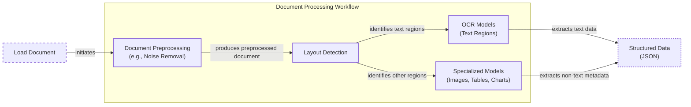
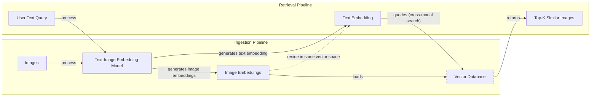
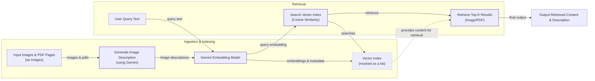
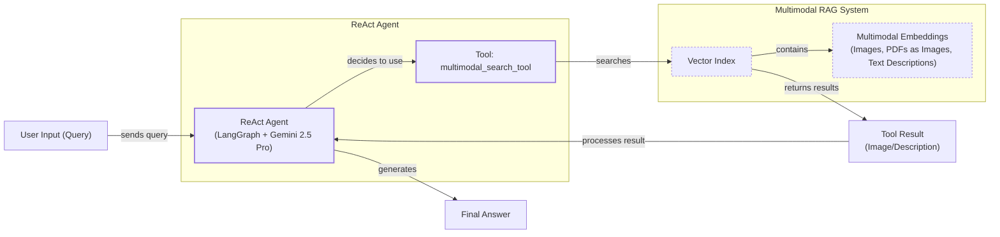

# Stop Converting Documents to Text. You're Doing It Wrong.

When I first started building AI agents, I hit a frustrating wall. I was comfortable manipulating text, but the moment I had to integrate multimodal data, such as images, audio, and especially documents like PDFs, my elegant architectures turned into messy hacks. I spent weeks building complex pipelines that tried to force everything into text. I chained OCR engines to scrape PDFs, layout detection models to identify tables, and separate classifiers to handle images. It was a brittle, slow, and expensive solution that broke every time a document layout changed.

The breakthrough came when I realized I was solving the wrong problem. I didn’t need to convert documents to text. I needed to treat them as images. Once I understood that every PDF page is effectively an image and that modern LLMs can “see” just as well as they can read, the complexity vanished. I could completely skip the OCR purgatory and focus on the three core inputs of an LLM: text, images, and audio.

This shift is essential because real-world AI applications rarely exist in a text-only vacuum. As human beings, we process information visually and audibly. Enterprise applications mirror this reality. They need to manipulate private data from warehouses and lakes that is inherently multimodal: financial reports with complex charts, technical diagrams, building sketches, and audio logs.

The old approach of normalizing everything to text is lossy. When you translate a complex diagram or a chart into text, you lose the spatial relationships, the colors, and the context. You lose the information that matters most. By processing data in its native format, we preserve this rich visual information, resulting in systems that are faster, cheaper, and significantly more performant.

Ultimately, as data is made for humans, you want the LLM to process the data as close as a human would, which often is visually.

Here is what we will cover:

*   **Foundations of Multimodal LLMs:** An intuition on how models process visual and textual tokens together.
*   **Practical Implementation:** How to work with images and PDFs using the Gemini API.
*   **Multimodal State Management:** How to structure agent memory for mixed modalities.
*   **Building the Agent:** A step-by-step guide to building a multimodal ReAct agent.

## The Need for Multimodal AI

In previous lessons, we built the foundations for AI systems with context engineering, structured outputs, ReAct, memory, and RAG. Now, we add the final piece: multimodal data.

The need is driven by enterprise applications. Normalizing everything to text is flawed because it loses information: visual context from charts and diagrams, tone from audio, and spatial relationships from images. This problem is not unique to visual data; in audio processing, transcribing speech to text first propagates transcription errors, degrading performance [[17]](https://tianpan.co/blog/2026-04-12-multimodal-rag-production-search-images-audio-text).

Financial reports, medical X-rays, and technical diagrams are meaningless as text, making text-only models inadequate [[1]], [[2]], [[3]].

Modern AI solutions use multimodal LLMs like Gemini or GPT-4o to interpret this data natively. This bypasses fragile OCR workflows and builds more robust systems.

## Limitations of Traditional Document Processing

To understand why a multimodal approach is superior, let’s examine the limitations of traditional document processing. When dealing with invoices, documentation, or reports, older AI systems relied on a multi-step pipeline to extract information. This process often involved a series of brittle, specialized models chained together, making the entire system fragile and difficult to maintain.

A typical workflow for processing a PDF with mixed text, diagrams, and tables looks like this:

1.  **Document Preprocessing:** The system starts by cleaning the document, removing noise, and correcting for issues like skewed pages.
2.  **Layout Detection:** A layout detection model identifies different regions within the document, such as text blocks, tables, and images.
3.  **Specialized Models:** Each region is then passed to a specialized model. Text regions go to an Optical Character Recognition (OCR) model, while tables and charts are processed by other models designed for those specific data structures.
4.  **Output Structured Data:** Finally, the extracted text and metadata are combined into a structured format like JSON.


Image 1: A flowchart illustrating the traditional document processing workflow.

This workflow has too many moving parts. It requires layout detection models, OCR models for text, and specialized models for each expected data structure. This makes the system rigid; if a document contains a chart type we do not have a model for, the pipeline fails. It is also slow and costly because we have to chain multiple model calls.

Most importantly, we face performance challenges. The multi-step nature creates a cascade effect where errors compound at each stage. Advanced OCR engines achieve 88-94% accuracy on simple layouts but struggle with handwritten text, poor scans, stylized fonts, or complex layouts like nested tables and building sketches, where accuracy can drop by 20% or more [[4]], [[5]], [[6]].
Image 2: A building sketch showing a crawl space vent diagram, illustrating the complexity of layouts that classic OCR systems struggle to interpret. (Source [Vectorize.io](https://vectorize.io/blog/multimodal-rag-patterns) [[8]])

This approach might work for highly specialized applications, but it has too many problems and does not scale in a world of flexible and fast AI agents. That is why modern AI solutions use multimodal LLMs that can directly interpret text, images, or even PDFs as native input, completely bypassing this fragile workflow.

## Foundations of Multimodal LLMs

Before we write any code, you need an intuition for how multimodal LLMs work. You do not need to understand every research detail, but knowing the high-level architecture will help you use, deploy, optimize, and monitor them effectively.

There are two common approaches to building multimodal LLMs: the Unified Embedding Decoder Architecture and the Cross-modality Attention Architecture [[9]](https://magazine.sebastianraschka.com/p/understanding-multimodal-llms).
Image 3: The two main approaches to developing multimodal LLM architectures. (Source [Understanding Multimodal LLMs](https://magazine.sebastianraschka.com/p/understanding-multimodal-llms) [[9]])

### Unified Embedding Decoder Architecture

In this approach, we encode the text and image separately, concatenate their embeddings into a single vector, and pass the result to the LLM. On top of a standard LLM architecture, you need a vision encoder that maps the image to an embedding in the same vector space as the text. When the text and image embeddings are merged, the LLM can make sense of both [[9]](https://magazine.sebastianraschka.com/p/understanding-multimodal-llms).
Image 4: Illustration of the unified embedding decoder architecture. (Source [Understanding Multimodal LLMs](https://magazine.sebastianraschka.com/p/understanding-multimodal-llms) [[9]])

### Cross-modality Attention Architecture

In the second approach, instead of passing the image embeddings with the text embeddings at the input, we inject them directly into the attention module. We still need an image encoder to project the image into the same vector space as the text, but we inject it deeper within the architecture [[9]](https://magazine.sebastianraschka.com/p/understanding-multimodal-llms).
Image 5: An illustration of the Cross-Modality Attention Architecture approach. (Source [Understanding Multimodal LLMs](https://magazine.sebastianraschka.com/p/understanding-multimodal-llms) [[9]])

### Image Encoders

Both architectures rely on image encoders. To understand them, we can draw a parallel between text tokenization and image patching. Just as we split text into sub-word tokens, we split images into patches [[9]](https://magazine.sebastianraschka.com/p/understanding-multimodal-llms).
Image 6: Image tokenization and embedding (left) and text tokenization and embedding (right) side by side. (Source [Understanding Multimodal LLMs](https://magazine.sebastianraschka.com/p/understanding-multimodal-llms) [[9]])

These patches are then encoded by a vision transformer. The output has the same structure and dimensions as text embeddings, but the two must be aligned in the same vector space. This alignment is achieved through a linear projection module. Popular image encoders like CLIP, OpenCLIP, and SigLIP use contrastive learning to align these representations, a technique that learns to represent different views of the same information similarly [[10]], [[11]].

These encoders are also used in multimodal RAG to find semantic similarities between images and text. This allows you to run similarity metrics between text, image, document, and audio vectors, as long as they are mapped to the same vector space [[7]], [[10]].
Image 7: Toy representation of multimodal embedding space. (Source [Multimodal Embeddings: An Introduction](https://towardsdatascience.com/multimodal-embeddings-an-introduction-5dc36975966f/) [[12]])

The **Unified Embedding Decoder** approach is simpler to implement and generally yields higher accuracy in OCR-related tasks. The **Cross-modality Attention** approach is more computationally efficient for high-resolution images because it injects tokens directly into the attention mechanism rather than passing them all as an input sequence. Hybrid approaches also exist to combine these benefits [[9]], [[13]].

In 2025, most leading LLMs are multimodal. Open-source examples include Llama, Gemma, and Qwen, while closed-source examples include GPT, Gemini, and Claude. This same architecture can be extended to other modalities, like audio and video, by adding specialized encoders for each data type [[14]], [[15]].

It is also important to distinguish multimodal LLMs from diffusion models like Midjourney or Stable Diffusion. Diffusion models generate images from noise and are architecturally different. In an agent workflow, they are typically used as tools, not as the core reasoning model [[16]], [[9]]. Now that we have an intuition for how these models work, let's see them in action.

## Applying Multimodal LLMs to Images and PDFs

To understand how multimodal LLMs work in practice, let’s explore a few examples using the Gemini API. There are three core ways to process multimodal data with LLMs: raw bytes, Base64, and URLs.

*   **Raw bytes:** This is the easiest method for one-off API calls. However, storing raw bytes in a database can lead to corruption, as many databases interpret the input as text instead of bytes.
*   **Base64:** This method encodes raw bytes as strings, allowing you to store images or documents in a database like PostgreSQL or MongoDB without corruption. The main downside is a file size increase of approximately 33%.
*   **URLs:** This is the standard for enterprise scenarios. Data is stored in a data lake like AWS S3 or GCP Buckets, and the LLM downloads the media directly. This reduces network latency for your application and is the most efficient option for scaling.

The choice between these methods depends on your architecture. For simple, one-off tasks, raw bytes are sufficient. For applications that require storing media in a traditional database, Base64 is a reliable option. For large-scale, enterprise systems, using URLs with a data lake is the most efficient and scalable approach.

Now, let's look at our test image.
Image 8: Sample image of a kitten and a robot.

<aside>
💡

You can find the code for this lesson in the notebook for Lesson 11 in the course's GitHub repository.

</aside>

1.  We start by setting up our Gemini client and loading the image as raw bytes. We use the `WEBP` format because it is efficient. We can then call the LLM to generate a caption or compare multiple images.
    ```python
    from google import genai
    from google.genai import types
    from PIL import Image
    import io

    client = genai.Client()
    MODEL_ID = "gemini-2.5-flash"

    def load_image_as_bytes(image_path, format="WEBP"):
        image = Image.open(image_path)
        byte_stream = io.BytesIO()
        image.save(byte_stream, format=format)
        return byte_stream.getvalue()

    image_bytes_1 = load_image_as_bytes("images/image_1.jpeg", format="WEBP")

    # Single image captioning
    response = client.models.generate_content(
        model=MODEL_ID,
        contents=[
            types.Part.from_bytes(data=image_bytes_1, mime_type="image/webp"),
            "Tell me what is in this image in one paragraph.",
        ],
    )
    print(f"Caption: {response.text}")
    ```
    It outputs:
    ```text
    Caption: This striking image features a massive, dark metallic robot...
    ```

2.  Next, let’s try a more complex task: **Object Detection**. We use Pydantic to define the output structure, a technique we covered in Lesson 4.
    ```python
    from pydantic import BaseModel

    class BoundingBox(BaseModel):
        ymin: float
        xmin: float
        ymax: float
        xmax: float
        label: str

    class Detections(BaseModel):
        bounding_boxes: list[BoundingBox]

    prompt = "Detect all prominent items. Return 2d boxes normalized to 0-1000."

    response = client.models.generate_content(
        model=MODEL_ID,
        contents=[types.Part.from_bytes(data=image_bytes_1, mime_type="image/webp"), prompt],
        config=types.GenerateContentConfig(
            response_mime_type="application/json",
            response_schema=Detections
        ),
    )
    ```
    The model returns a structured JSON object with the detected bounding boxes, which we can then visualize.

    
    Image 9: Visualization of object detection results on the sample image.

3.  Now, let’s process **PDFs**. Because we are using a multimodal model, the process is identical to working with images. We can load the PDF as bytes and pass it to the model to get a summary.

    
    Image 10: The first page of the "Attention Is All You Need" paper.

    ```python
    pdf_bytes = open("pdfs/attention_paper.pdf", "rb").read()

    response = client.models.generate_content(
        model=MODEL_ID,
        contents=[
            types.Part.from_bytes(data=pdf_bytes, mime_type="application/pdf"),
            "What is this document about? Provide a brief summary.",
        ],
    )
    print(response.text)
    ```
    It outputs:
    ```text
    This document introduces the Transformer, a novel neural network architecture for sequence transduction...
    ```

4.  We can also perform **Object Detection on PDF pages** by treating each page as an image. This is a powerful technique for extracting diagrams or tables without relying on OCR. This concept was popularized by the ColPali paper, which demonstrated that modern Vision Language Models (VLMs) can retrieve documents more effectively by “looking” at them rather than extracting text [[7]](https://www.decodingai.com/p/stop-converting-documents-to-text).
    ```python
    page_image_bytes = load_image_as_bytes("images/attention_page_1.jpeg")

    prompt = "Detect all the diagrams from the provided image as 2d bounding boxes."

    response = client.models.generate_content(
        model=MODEL_ID,
        contents=[types.Part.from_bytes(data=page_image_bytes, mime_type="image/webp"), prompt],
        config=types.GenerateContentConfig(
            response_mime_type="application/json",
            response_schema=Detections
        ),
    )
    ```
    
    Image 11: Object detection applied to a page of a PDF to extract a diagram.

Processing PDFs as images preserves all the rich visual context that is lost with traditional OCR methods. This makes it a more robust and effective approach for a wide range of document processing tasks. One of the most common applications of this technique is in advanced retrieval systems, which we will explore next.

## Foundations of Multimodal RAG

One of the most common use cases for multimodal data is Retrieval-Augmented Generation (RAG), a concept we explored in Lesson 10. When building custom AI applications, you will almost always need to retrieve private company data to feed into your LLM. For large data formats like images and PDFs, RAG is even more critical. Stuffing thousands of PDF pages into an LLM’s context window is not feasible due to increased latency, cost, and decreased performance.

A generic multimodal RAG architecture for images and text involves two main pipelines:

*   **Ingestion:** Images are embedded using a text-image embedding model, and these embeddings are loaded into a vector database.
*   **Retrieval:** A user's text query is embedded using the same model. The vector database is then queried to find the `top-k` most similar images based on cosine distance between the query and image embeddings.

Because the text and image embeddings exist in the same vector space, this approach works for any combination of modalities, such as image-to-text or image-to-image search. This technique is widely used in image search engines like Google Photos.


Image 12: A Mermaid diagram illustrating a generic multimodal RAG system with Ingestion and Retrieval pipelines, connected by a Vector Database, highlighting the shared embedding space.

For enterprise use cases involving documents, the state-of-the-art architecture as of 2025 is ColPali, which was inspired by the ColBERT text retrieval model [[18]](https://towardsdatascience.com/bringing-vision-language-intelligence-to-rag-with-colpali/). It bypasses the OCR pipeline by processing document pages as images. ColPali uses a late interaction mechanism, the MaxSim operator, which sums the maximum similarity scores between each query token and all document patches [[19]](https://arxiv.org/html/2407.01449v4). It outputs multi-vector embeddings—a "bag-of-embeddings"—for each image. While this approach is 2-10x faster than OCR pipelines, the multi-vector representation creates storage and compute bottlenecks at scale, as a single page can generate over 1,000 vectors [[20]](https://aclanthology.org/2023.findings-acl.1003.pdf). Now, let's build a simple version of this system to see how the pieces fit together.

## Implementing Multimodal RAG for Images, PDFs, and Text

Let's combine what we have learned into a simple multimodal RAG example. We will populate an in-memory vector index with images and PDF pages (treated as images) and then query it with text questions. To keep it simple, we will not implement image patching or a late-interaction reranker like in the full ColPali architecture. Our goal is to build an intuition for how multimodal RAG works.


Image 13: A flowchart illustrating a simple multimodal RAG example.

Here are the images we will index for semantic search:
Image 14: The images and PDF pages used for the RAG example.

1.  First, we define a function to create our vector index. Since the Gemini API used in this notebook does not support image embeddings directly, we will use a workaround: generate a detailed description for each image and then embed the text. This is not the recommended approach, but it allows us to demonstrate the RAG workflow without adding extra dependencies.
    <aside>
    💡

    In a production system, you would use a multimodal embedding model like Voyage AI, Cohere Embed, or open-source models based on CLIP to embed the images directly. The rest of the RAG system would remain conceptually the same.
    ```python
    image_bytes = ...
    # SKIPPED!
    # image_description = generate_image_description(image_bytes) 
    image_embedding = embed_with_multimodal(image_bytes)
    ```

    </aside>
    ```python
    def create_vector_index(image_paths: list[Path]) -> list[dict]:
        """Create embeddings for images by generating and embedding descriptions."""
        vector_index = []
        for image_path in image_paths:
            image_bytes = load_image_as_bytes(image_path)
            image_description = generate_image_description(image_bytes)
            image_embedding = embed_text_with_gemini(image_description)
            vector_index.append({
                "content": image_bytes,
                "filename": image_path,
                "description": image_description,
                "embedding": image_embedding,
            })
        return vector_index

    image_paths = list(Path("images").glob("*.jpeg"))
    vector_index = create_vector_index(image_paths)
    ```

2.  Next, we define a function to search the vector index. This function embeds the text query and uses cosine similarity to find the most relevant images.
    ```python
    from sklearn.metrics.pairwise import cosine_similarity
    import numpy as np

    def search_multimodal(query_text: str, vector_index: list[dict], top_k: int = 3) -> list:
        """Search for most similar documents to a query."""
        query_embedding = embed_text_with_gemini(query_text)
        if query_embedding is None:
            return []

        embeddings = [doc["embedding"] for doc in vector_index]
        similarities = cosine_similarity([query_embedding], embeddings).flatten()
        top_indices = np.argsort(similarities)[::-1][:top_k]

        results = []
        for idx in top_indices.tolist():
            results.append({**vector_index[idx], "similarity": similarities[idx]})
        return results
    ```

3.  Now, let's test our RAG system. We will search for the architecture of the Transformer network.
    ```python
    query = "what is the architecture of the transformer neural network?"
    results = search_multimodal(query, vector_index, top_k=1)
    ```
    The system correctly retrieves the page from the "Attention Is All You Need" paper that contains the Transformer architecture diagram.

    
    Image 15: The retrieved PDF page for the query about the Transformer architecture.

By treating PDF pages as images, we have built a simple but effective multimodal RAG system that can retrieve relevant visual information based on a text query.

## Building Multimodal AI Agents

Now, let's take this a step further and integrate our RAG functionality into a ReAct agent. This will consolidate many of the skills we have learned in Part 1 of this course. Multimodal capabilities can be added to AI agents by:

1.  Adding multimodal inputs or outputs to the agent's reasoning LLM.
2.  Leveraging multimodal retrieval tools, like the RAG system we just built.
3.  Using other multimodal tools that interact with external resources, such as company PDFs, computer screenshots, or audio files.

In this example, we will create a ReAct agent that uses our `search_multimodal` function as a tool to answer questions about the content of our indexed images.


Image 16: An architecture diagram illustrating a multimodal ReAct Agent integrated with RAG.

1.  First, we define the `multimodal_search_tool` using LangChain's `@tool` decorator. This function will wrap our `search_multimodal` RAG logic.
    ```python
    from langchain_core.tools import tool

    @tool
    def multimodal_search_tool(query: str) -> dict:
        """Search through a collection of images and their text descriptions."""
        results = search_multimodal(query, vector_index, top_k=1)
        if not results:
            return {"role": "tool_result", "content": "No relevant content found."}
        
        result = results[0]
        content = [
            {"type": "text", "text": f"Image description: {result['description']}"},
            types.Part.from_bytes(data=result['content'], mime_type="image/jpeg"),
        ]
        return {"role": "tool_result", "content": content}
    ```

2.  Next, we create a ReAct agent using LangGraph's `create_react_agent` function. We provide a system prompt that instructs the agent on how to use the search tool to answer questions about visual content.
    ```python
    from langgraph.prebuilt import create_react_agent
    from langchain_google_genai import ChatGoogleGenerativeAI

    def build_react_agent():
        """Build a ReAct agent with multimodal search capabilities."""
        tools = [multimodal_search_tool]
        system_prompt = """You are a helpful AI assistant that can search through images and text to answer questions..."""
        agent = create_react_agent(
            model=ChatGoogleGenerativeAI(model="gemini-2.5-pro", temperature=0.1),
            tools=tools,
            prompt=system_prompt,
        )
        return agent

    react_agent = build_react_agent()
    ```

3.  Finally, let's test our agent by asking it about the color of our kitten.
    ```python
    test_question = "what color is my kitten?"
    response = react_agent.invoke(input={"messages": test_question})
    ```
    The agent correctly uses the `multimodal_search_tool` with the query "my kitten," retrieves the relevant image, and answers the question based on the visual information.

    It outputs:
    ```text
    Based on the image, your kitten is a gray tabby. It has soft, short gray fur with darker tabby stripe patterns.
    ```

In this lesson, we have combined structured outputs, tools, ReAct, RAG, and multimodal data to create a functional multimodal agentic RAG system.

## Conclusion

Working with multimodal data is a fundamental skill for AI engineers. Modern AI applications rarely exist in a text-only vacuum; they must interact with the complex, visual, and auditory reality of the world. By moving away from unstable OCR pipelines and embracing native processing of images and documents, we can build more robust, efficient, and capable AI systems.

This was the final lesson in Part 1 of our course on the fundamentals of AI Engineering. In Part 2, we will move from theory to practice and begin building our course's central project: an interconnected research and writing agent system. We will explore agentic design patterns, take a deep dive into LangGraph, and implement a complete, multi-agent pipeline from start to finish.

## References

- [1] USTT: A Unified Summarization of Text and Tabular data. (2023). IJCAI. [https://www.ijcai.org/proceedings/2023/0581.pdf](https://www.ijcai.org/proceedings/2023/0581.pdf)
- [2] Medical Imaging White Paper NVIDIA and Lenovo. (n.d.). Lenovo. [https://techtoday.lenovo.com/sites/default/files/2025-05/Medical%20Imaging%20White%20Paper%20NVIDIA%20and%20Lenovo.pdf](https://techtoday.lenovo.com/sites/default/files/2025-05/Medical%20Imaging%20White%20Paper%20NVIDIA%20and%20Lenovo.pdf)
- [3] 10 real-world examples of AI in healthcare. (2022, November 24). Philips. [https://www.philips.com/a-w/about/news/archive/features/2022/20221124-10-real-world-examples-of-ai-in-healthcare.html](https://www.philips.com/a-w/about/news/archive/features/2022/20221124-10-real-world-examples-of-ai-in-healthcare.html)
- [4] OCR Accuracy Explained: How to Improve It. (2026, May 1). LlamaIndex. [https://www.llamaindex.ai/blog/ocr-accuracy](https://www.llamaindex.ai/blog/ocr-accuracy)
- [5] End-to-End Distributed PDF Processing Pipeline. (n.d.). Daft. [https://www.daft.ai/blog/end-to-end-distributed-pdf-processing-pipeline](https://www.daft.ai/blog/end-to-end-distributed-pdf-processing-pipeline)
- [6] Why Traditional OCR Fails for Complex Business Documents. (n.d.). Microsoft Learn. [https://learn.microsoft.com/en-us/answers/questions/5668164/why-traditional-ocr-fails-for-complex-business-doc?page=1](https://learn.microsoft.com/en-us/answers/questions/5668164/why-traditional-ocr-fails-for-complex-business-doc?page=1)
- [7] Stop Converting Documents to Text. You're Doing It Wrong. (2025, December 9). Decoding AI. [https://www.decodingai.com/p/stop-converting-documents-to-text](https://www.decodingai.com/p/stop-converting-documents-to-text)
- [8] Multimodal RAG Patterns. (n.d.). Vectorize.io. [https://vectorize.io/blog/multimodal-rag-patterns](https://vectorize.io/blog/multimodal-rag-patterns)
- [9] Understanding Multimodal LLMs. (2024, November 3). Sebastian Raschka's Magazine. [https://magazine.sebastianraschka.com/p/understanding-multimodal-llms](https://magazine.sebastianraschka.com/p/understanding-multimodal-llms)
- [10] Multimodal Semantic Search. (n.d.). OpenSearch. [https://opensearch.org/blog/multimodal-semantic-search/](https://opensearch.org/blog/multimodal-semantic-search/)
- [11] Multimodal AI Search for Business Applications. (2024, June 1). Towards Data Science. [https://towardsdatascience.com/multimodal-ai-search-for-business-applications-65356d011009/](https://towardsdatascience.com/multimodal-ai-search-for-business-applications-65356d011009/)
- [12] Multimodal Embeddings: An Introduction. (2024, November 29). Towards Data Science. [https://towardsdatascience.com/multimodal-embeddings-an-introduction-5dc36975966f/](https://towardsdatascience.com/multimodal-embeddings-an-introduction-5dc36975966f/)
- [13] NVLM: Open Frontier-Class Multimodal LLMs. (2024, September 17). arXiv. [https://arxiv.org/abs/2409.11402](https://arxiv.org/abs/2409.11402)
- [14] Exploring Multimodal LLMs: Text, Image, and Video Integration. (2025, October 11). Spark CO. [https://sparkco.ai/blog/exploring-multimodal-llms-text-image-and-video-integration](https://sparkco.ai/blog/exploring-multimodal-llms-text-image-and-video-integration)
- [15] Multimodal LLMs. (n.d.). Emergent Mind. [https://www.emergentmind.com/topics/multimodal-llms](https://www.emergentmind.com/topics/multimodal-llms)
- [16] Multimodal Large Language Models are On-the-fly Multi-modal Connectors. (2024). arXiv. [https://arxiv.org/html/2409.14993v3](https://arxiv.org/html/2409.14993v3)
- [17] Multimodal RAG for Production: Search over Images, Audio, and Text. (2026, April 12). Tianpan.co. [https://tianpan.co/blog/2026-04-12-multimodal-rag-production-search-images-audio-text](https://tianpan.co/blog/2026-04-12-multimodal-rag-production-search-images-audio-text)
- [18] Bringing Vision-Language Intelligence to RAG with ColPali. (n.d.). Towards Data Science. [https://towardsdatascience.com/bringing-vision-language-intelligence-to-rag-with-colpali/](https://towardsdatascience.com/bringing-vision-language-intelligence-to-rag-with-colpali/)
- [19] ColPali: Efficient Document Retrieval with Vision Language Models. (2024). arXiv. [https://arxiv.org/html/2407.01449v4](https://arxiv.org/html/2407.01449v4)
- [20] Scaling Up VDR: The Light-ColPali/ColQwen2 Approach. (2025). ACL Anthology. [https://aclanthology.org/2025.findings-acl.1003.pdf](https://aclanthology.org/2025.findings-acl.1003.pdf)