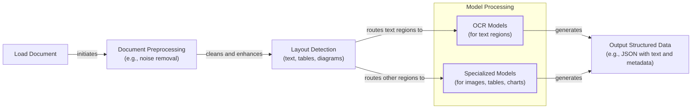
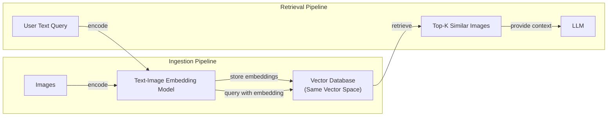
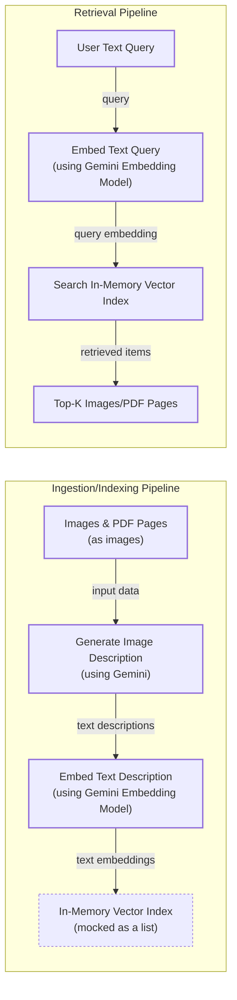
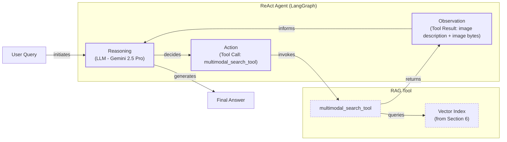

# Stop Converting Documents to Text. You're Doing It Wrong.

When I first started building AI agents, I hit a frustrating wall. I was comfortable manipulating text, but the moment I had to integrate multimodal data, such as images and PDFs, my elegant architectures turned into messy hacks. I spent weeks building complex pipelines that tried to force everything into text. I chained Optical Character Recognition (OCR) engines to scrape PDFs, layout detection models to identify tables, and separate classifiers to handle images. It was a brittle, slow, and expensive solution that broke every time a document layout changed.

The breakthrough came when I realized I was solving the wrong problem. I didn’t need to convert documents to text; I needed to treat them as images. Once I understood that every PDF page is effectively an image and that modern LLMs can “see” just as well as they can read, the complexity vanished. I could skip the OCR purgatory and focus on the core inputs of an LLM: text, images, and audio.

This shift is essential because real-world AI is multimodal. Enterprise applications need to process financial reports, technical diagrams, and medical scans from their data lakes. The old approach of normalizing everything to text is lossy—translating a diagram to text loses spatial relationships and context. By processing data in its native format, we build systems that are faster, cheaper, and more performant.

In this lesson, we will explore the limitations of traditional OCR, cover the foundations of multimodal LLMs and RAG, and walk through practical examples. You will learn to apply these models to images and PDFs, build a simple RAG system, and integrate these skills into a ReAct agent.

## Limitations of Traditional Document Processing

To understand the problem, let’s dig into the limitations of traditional AI systems for tasks like processing invoices, documentation, or reports. The core issue is that previous approaches tried to normalize everything to text before passing it to a model. This is flawed because we lose a substantial amount of information during translation. For example, when encountering diagrams, charts, or sketches in a document, it is impossible to fully reproduce them in text.

The traditional workflow relies on a multi-step pipeline involving OCR. For a PDF containing mixed text, diagrams, and tables, the process looks like this:


Image 1: A flowchart illustrating the traditional document processing workflow using Layout detection + OCR.

This multi-step pipeline is rigid and fragile. It requires separate models for layout detection, OCR, and each data structure, creating multiple points of failure. If a document contains an unexpected chart type, the system breaks.

Most importantly, we face performance challenges. The multi-step nature creates a cascade effect where errors compound at each stage. Advanced OCR engines achieve 88-94% accuracy on simple layouts but struggle with handwritten text, poor scans, or complex layouts like nested tables and building sketches, where accuracy can drop by 20% or more [[1]](https://www.llamaindex.ai/blog/ocr-accuracy), [[2]](https://hackernoon.com/complex-document-recognition-ocr-doesnt-work-and-heres-how-you-fix-it).
Image 2: A building sketch showing a crawl space vent diagram, illustrating the complexity of layouts that classic OCR systems struggle to interpret. (Source [Vectorize.io](https://vectorize.io/blog/multimodal-rag-patterns))

This approach might work for highly specialized applications, but it doesn’t scale for flexible and fast AI agents. That’s why modern AI solutions use multimodal LLMs, such as Gemini, that can directly interpret text, images, or PDFs as native input. This completely bypasses the unstable OCR workflow. Thus, let’s understand how multimodal LLMs work.

## Foundations of Multimodal LLMs

To use LLMs with images and documents, you need an intuition of how multimodality works. You do not need to understand every research detail, but knowing the architecture helps you deploy, optimize, and monitor them. There are two common approaches to building multimodal LLMs: the Unified Embedding Decoder Architecture and the Cross-modality Attention Architecture [[3]](https://magazine.sebastianraschka.com/p/understanding-multimodal-llms).
Image 3: The two main approaches to developing multimodal LLM architectures. (Source [Understanding Multimodal LLMs [3]](https://magazine.sebastianraschka.com/p/understanding-multimodal-llms))

The **Unified Embedding Decoder Architecture** encodes text and images separately, concatenates their embeddings, and passes the resulting vector to the LLM. It requires a vision encoder to map the image into the same vector space as the text.
Image 4: Illustration of the unified embedding decoder architecture. (Source [Understanding Multimodal LLMs [3]](https://magazine.sebastianraschka.com/p/understanding-multimodal-llms))

In the **Cross-modality Attention Architecture**, instead of passing image embeddings as input, we inject them directly into the attention module deeper within the architecture.
Image 5: An illustration of the Cross-Modality Attention Architecture approach. (Source [Understanding Multimodal LLMs [3]](https://magazine.sebastianraschka.com/p/understanding-multimodal-llms))

Both architectures rely on image encoders, which create image embeddings by splitting images into patches, similar to how text is split into tokens [[3]](https://magazine.sebastianraschka.com/p/understanding-multimodal-llms). These patches are processed by a vision transformer (ViT) to create embeddings.
Image 6: Image tokenization and embedding (left) and text tokenization and embedding (right) side by side. (Source [Understanding Multimodal LLMs [3]](https://magazine.sebastianraschka.com/p/understanding-multimodal-llms))

The output has the same structure and dimensions as text embeddings, but they need to be aligned in the same vector space. This is achieved through a linear projection module and contrastive learning, which trains the model to place similar concepts from different modalities close together [[4]](https://towardsdatascience.com/multimodal-embeddings-an-introduction-5dc36975966f/). Popular image encoder models like CLIP, OpenCLIP, and SigLIP are used for this and are also fundamental to Multimodal RAG, as they allow for semantic similarity searches between text and images [[4]](https://towardsdatascience.com/multimodal-embeddings-an-introduction-5dc36975966f/).
Image 7: Toy representation of multimodal embedding space. (Source [Multimodal Embeddings: An Introduction [4]](https://towardsdatascience.com/multimodal-embeddings-an-introduction-5dc36975966f/))

The Unified Embedding approach is simpler and more accurate for OCR-related tasks, while the Cross-modality Attention approach is more computationally efficient for high-resolution images. Hybrid approaches also exist [[5]](https://arxiv.org/abs/2409.11402). Most leading LLMs are now multimodal, and this can be expanded to audio or video with specialized encoders [[6]](https://sparkco.ai/blog/exploring-multimodal-llms-text-image-and-video-integration).

It is also important to distinguish these from diffusion models like Midjourney. Diffusion models generate images from noise and are typically used as tools in an agent workflow, not as the core reasoning model [[7]](https://zapier.com/blog/best-ai-image-generator/). Now that we understand how LLMs can directly process images, let’s see how this works in practice.

## Applying Multimodal LLMs to Images and PDFs

To understand how multimodal LLMs work, let’s walk through a few examples using Gemini. There are three core ways to process multimodal data with LLMs: raw bytes, Base64, and URLs.

-   **Raw bytes:** The easiest method for one-off API calls. It works well for quick tests but is not ideal for production systems where data needs to be stored, as databases can corrupt raw byte data by misinterpreting it as text.
-   **Base64:** This method encodes raw bytes into a string format. It is useful for storing images or documents directly in a database (like PostgreSQL or MongoDB) without corruption. The main drawback is that it increases file size by approximately 33%.
-   **URLs:** This is the standard for enterprise scenarios. Data is stored in a data lake (like AWS S3 or GCS), and the LLM is given a URL to access it directly. This is the most efficient option at scale because it minimizes data transfer over your application's network.

```mermaid
graph TD
    subgraph "Method 1: Base64 + Database"
        A["Image/PDF"] --> B{Encode to Base64};
        B --> C[Store as String in DB<br/>(e.g., PostgreSQL)];
        C --> D{Read from DB};
        D --> E[Pass to LLM];
    end

    subgraph "Method 2: URL + Data Lake"
        F["Image/PDF"] --> G[Store in Data Lake<br/>(e.g., S3/GCS)];
        G --> H{Generate Signed URL};
        H --> I[Pass URL to LLM];
        I -- "LLM fetches directly" --> G;
    end
```
Image 8: A comparison of storing multimodal data using Base64 in a database versus using URLs from a data lake.

Let's look at some conceptual code examples. We will start with our test image.
Image 9: A sample image of a kitten interacting with a robot.

1.  To process the image as **raw bytes**, you would load the file and pass it directly to the model.
    ```python
    # Pseudocode for processing raw bytes
    image_bytes = load_image_as_bytes("image.webp")
    response = client.generate_content(
        model, 
        contents=[image_bytes, "Caption this image."]
    )
    ```

2.  To use **Base64**, you first encode the bytes into a string.
    ```python
    # Pseudocode for processing Base64
    image_base64 = base64.b64encode(image_bytes).decode("utf-8")
    response = client.generate_content(
        model,
        contents=[image_base64, "Caption this image."]
    )
    ```

3.  For **URLs**, you can pass a public link or a private URI from a cloud storage bucket.
    ```python
    # Pseudocode for processing URLs
    # Public URL with a built-in tool
    response = client.generate_content(
        model,
        contents="Describe this image: https://.../image.jpeg",
        tools=[{"url_context": {}}]
    )
    
    # Private GCS URL
    response = client.generate_content(
        model,
        contents=[Part.from_uri("gs://bucket/image.jpeg"), "Describe this."]
    )
    ```

4.  For a more complex task like **Object Detection**, you can define a Pydantic schema and configure the model to return structured JSON, as we learned in Lesson 4.
    ```python
    # Pseudocode for object detection
    class Detections(BaseModel): ...
    
    config = GenerateContentConfig(
        response_mime_type="application/json",
        response_schema=Detections
    )
    response = client.generate_content(
        model,
        contents=[image_bytes, "Detect all prominent items."],
        config=config
    )
    detections = response.parsed
    ```
    
    Image 10: Bounding box detected for the diagram on a page from the "Attention Is All You Need" paper.

Processing PDFs as images is a concept popularized by the ColPali paper, which demonstrated that modern Vision Language Models (VLMs) can retrieve documents more effectively by “looking” at them rather than extracting text [[8]](https://arxiv.org/pdf/2407.01449v6). This concept is central to modern multimodal RAG, which we will explore next.

## Foundations of Multimodal RAG

One of the most common use cases when working with multimodal data is Retrieval-Augmented Generation (RAG), a concept we explored in Lesson 10. When building custom AI applications, you will often need to retrieve private company data to feed into your LLM. For large formats like images or PDFs, RAG is even more critical.

A generic multimodal RAG architecture for images and text involves two pipelines:
- **Ingestion:** Images are embedded using a text-image embedding model, and these embeddings are stored in a vector database.
- **Retrieval:** A user's text query is embedded using the same model. The vector database is then queried to find the top-k most similar images based on cosine similarity or another distance metric.


Image 11: An architecture diagram illustrating a generic multimodal RAG system using images and text, showing Ingestion and Retrieval pipelines connected by a shared Vector Database and Text-Image Embedding Model.

For enterprise RAG on documents, the state-of-the-art architecture as of 2025 is ColPali [[8]](https://arxiv.org/pdf/2407.01449v6). Its key innovation is bypassing the entire OCR pipeline by processing document images directly. It works well for documents with complex visual layouts like tables and figures. ColPali is based on the PaliGemma model and uses a "late interaction" mechanism to compute similarities between query tokens and document patches. Instead of a single embedding vector, it generates a "bag-of-embeddings" for each document page, capturing more granular detail. This approach is 2-10x faster than traditional OCR pipelines and outperforms them on benchmarks like ViDoRe [[8]](https://arxiv.org/pdf/2407.01449v6). To operate at scale, these embeddings can be compressed using techniques like binary quantization, which reduces storage and allows for faster similarity searches with minimal accuracy loss [[9]](https://blog.vespa.ai/scaling-colpali-to-billions/).

With this theoretical foundation, let's implement a simple multimodal RAG system.

## Implementing Multimodal RAG for Images, PDFs and Text

Let's connect all the dots with a more complex coding example where we combine what we have learned in this lesson and Lesson 10 on RAG into a multimodal RAG exercise. We will build a simple system where we populate an in-memory vector database with images and PDF pages (treated as images) and query it with text.


Image 12: A flowchart illustrating a simplified multimodal RAG example, showing both the ingestion and retrieval pipelines.

1.  First, we define a function to create our vector index. Since the Gemini API used here does not support direct image embeddings, we will use a workaround: generate a text description for each image with Gemini and then embed that description. This is not ideal, but it allows us to demonstrate the RAG flow. With a true multimodal embedding model like Voyage or OpenAI's CLIP, you would embed the image bytes directly. The rest of the RAG system would remain conceptually the same, as both image and text embeddings exist in the same vector space.
    ```python
    # Pseudocode for creating a vector index
    def create_vector_index(image_paths):
        vector_index = []
        for path in image_paths:
            image_bytes = load_image_as_bytes(path)
            
            # WORKAROUND: Generate description, then embed text
            description = generate_image_description(image_bytes)
            embedding = embed_text_with_gemini(description)
    
            # IDEAL: Embed image bytes directly
            # embedding = embed_with_multimodal_model(image_bytes)
    
            vector_index.append({"embedding": embedding, ...})
        return vector_index
    ```

2.  Next, we define our search function. It embeds the text query and uses cosine similarity to find the most relevant items in our in-memory `vector_index`.
    ```python
    # Pseudocode for multimodal search
    def search_multimodal(query_text, vector_index, top_k=3):
        query_embedding = embed_text_with_gemini(query_text)
        
        # Calculate similarities and find top_k results
        embeddings = [doc["embedding"] for doc in vector_index]
        similarities = cosine_similarity([query_embedding], embeddings)
        top_indices = np.argsort(similarities)[::-1][:top_k]
        
        return [vector_index[i] for i in top_indices]
    ```

3.  Now, let's test it. We can query for the Transformer architecture and our system correctly retrieves the relevant page from the "Attention Is All You Need" paper.
    ```python
    query = "what is the architecture of the transformer neural network?"
    results = search_multimodal(query, vector_index, top_k=1)
    ```
    It retrieves the correct document page with a similarity of 0.744.

    
    Image 13: The retrieved page showing the Transformer model architecture.

Now that we have a functional multimodal retrieval system, we can integrate it into an agent to give it powerful new capabilities.

## Building Multimodal AI Agents

To take this a step further, we can integrate our `search_multimodal` RAG function into a ReAct agent as a tool. This consolidates most of the skills learned in the first part of this course. Multimodal capabilities can be added to agents by enabling multimodal inputs for the reasoning LLM and by using multimodal retrieval tools. These multimodal inputs are not limited to documents or user-provided images. Emerging agentic systems are increasingly designed to process real-time data streams from Internet of Things (IoT) sensors, interpreting everything from video feeds to biometric and environmental signals to act autonomously [[10]](https://www.computerweekly.com/news/366640557/Agentic-AI-to-make-data-uplink-the-next-mobile-bottleneck).

In this example, we will create a ReAct agent using LangGraph's `create_react_agent` and provide our RAG function as a tool. The agent can then reason about a query, decide to use the search tool, and analyze the retrieved image to provide an answer.


Image 14: A flowchart illustrating the multimodal ReAct agent integrated with RAG functionality.

1.  We define the `multimodal_search_tool` using LangGraph's `@tool` decorator, which wraps our `search_multimodal` function.
    ```python
    # Pseudocode for the agent's tool
    @tool
    def multimodal_search_tool(query: str) -> dict:
        """Search through a collection of images and their text descriptions."""
        results = search_multimodal(query, vector_index, top_k=1)
        # ... format results for the agent
        return formatted_results
    ```

2.  Next, we create the ReAct agent, providing it with the tool and a system prompt that guides its behavior. We will dig more into why we chose LangGraph in Part 2 of the course.
    ```python
    # Pseudocode for building the agent
    def build_react_agent():
        tools = [multimodal_search_tool]
        system_prompt = "You are a helpful AI assistant that can search through images..."
        agent = create_react_agent(model, tools, prompt=system_prompt)
        return agent
    ```

3.  Finally, we can ask the agent a question like "what color is my kitten?". The agent will reason that it needs to search for an image of a kitten, call the `multimodal_search_tool`, receive the image of the kitten and robot, and then answer based on the visual information.
    ```python
    react_agent = build_react_agent()
    response = react_agent.invoke({"messages": "what color is my kitten?"})
    ```
    The agent correctly responds:
    ```text
    Based on the image, your kitten is a gray tabby. It has soft, short gray fur with darker tabby stripe patterns.
    ```
This example combines many of the concepts from Part 1—tools, ReAct, RAG, and multimodal data—into a single, powerful agent.

## Conclusion

Working with multimodal data is a fundamental skill for AI engineers. Modern AI applications must interact with the complex, visual, and auditory reality of the world. We moved away from unstable OCR pipelines and learned that modern LLMs can natively process images and documents. The principles of multimodal RAG are already being extended beyond documents to video, allowing systems to retrieve and reason about temporal, dynamic events [[11]](https://arxiv.org/html/2501.05874v1). We explored how to build agents that can reason across these modalities.

This concludes the first part of our course on the fundamentals of AI Engineering. In Part 2, we will apply these concepts to our capstone project. You will learn agentic design patterns, use LangGraph to build a research agent and a writing workflow, and orchestrate a complete multi-agent pipeline.

## References

- [1] OCR Accuracy Explained: How to Improve It. (n.d.). LlamaIndex. https://www.llamaindex.ai/blog/ocr-accuracy
- [2] Kokorin, O. (2023, October 12). Complex Document Recognition: OCR Doesn’t Work and Here’s How You Fix It. HackerNoon. https://hackernoon.com/complex-document-recognition-ocr-doesnt-work-and-heres-how-you-fix-it
- [3] Raschka, S. (2024, November 3). Understanding Multimodal LLMs. Ahead of AI. https://magazine.sebastianraschka.com/p/understanding-multimodal-llms
- [4] Talebi, S. (2024, November 29). Multimodal Embeddings: An Introduction. Towards Data Science. https://towardsdatascience.com/multimodal-embeddings-an-introduction-5dc36975966f/
- [5] NVLM: Open Frontier-Class Multimodal LLMs. (2024, September 17). arXiv. https://arxiv.org/abs/2409.11402
- [6] Exploring Multimodal LLMs: Text, Image, and Video Integration. (n.d.). SparkCognition. https://sparkco.ai/blog/exploring-multimodal-llms-text-image-and-video-integration
- [7] Guinness, H. (2026, April 1). The 8 best AI image generators in 2025. Zapier. https://zapier.com/blog/best-ai-image-generator/
- [8] Fostiropoulos, I., et al. (2024). ColPali: Efficient Document Retrieval with Vision Language Models. arXiv. https://arxiv.org/pdf/2407.01449v6
- [9] Scaling ColPali to billions of PDFs with Vespa. (2024, September 14). Vespa Blog. https://blog.vespa.ai/scaling-colpali-to-billions/
- [10] Agentic AI to make data uplink the next mobile bottleneck. (2024, December 3). ComputerWeekly.com. https://www.computerweekly.com/news/366640557/Agentic-AI-to-make-data-uplink-the-next-mobile-bottleneck
- [11] VideoRAG: A Retrieval-Augmented Generation System for Videos. (2025, January 14). arXiv. https://arxiv.org/html/2501.05874v1