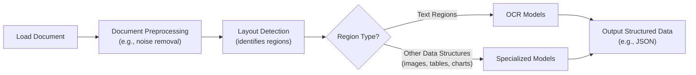
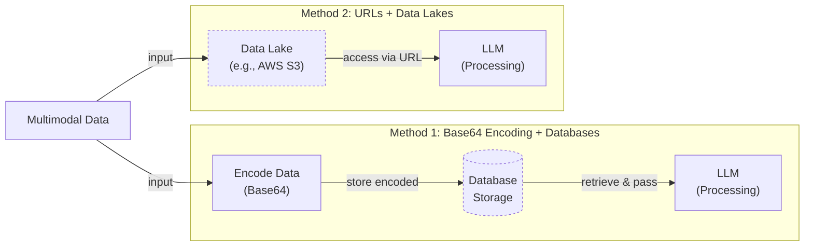
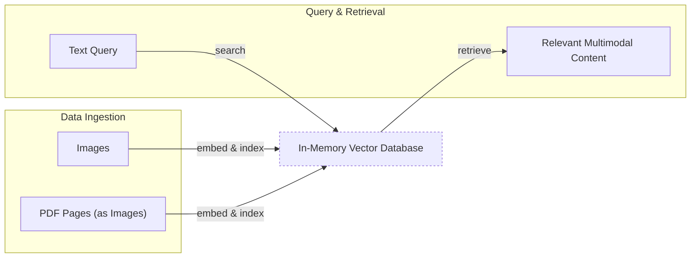
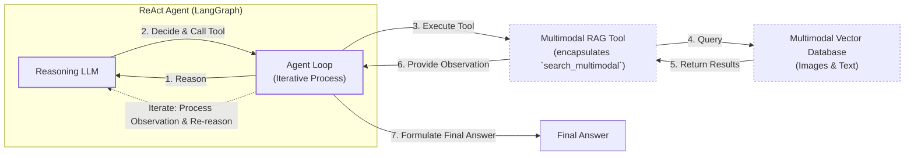

# Lesson 11: Multimodal AI

In the first part of this course, we have built a solid foundation in AI Engineering. We have learned the difference between LLM workflows and AI agents, mastered context engineering and structured outputs, and implemented core agentic patterns like function calling, ReAct, and Retrieval-Augmented Generation (RAG). You now have the skills to build sophisticated systems that can reason, act, and access knowledge. However, there is one crucial piece missing: the real world is not just text.

This lesson tackles that final piece: multimodality. In business and in life, we work with images, charts, and complex documents. Traditional AI systems often try to force this rich, visual information into a text-only format, losing critical context along the way. We will show you why this approach is flawed and how modern multimodal LLMs can process images and PDFs natively. This skill is essential for building enterprise-grade AI applications that can handle the full spectrum of company data, from financial reports with complex charts to technical manuals with detailed diagrams.

## Limitations of traditional document processing

To understand the need for multimodal models, we must first look at the old way of doing things. For years, the standard approach to processing documents like invoices or reports was a multi-step pipeline built around Optical Character Recognition (OCR). The goal was always the same: convert everything to text so a model could understand it.

A typical workflow involved loading a document, running preprocessing steps to clean the image, using a layout detection model to identify different regions like paragraphs and tables, and then feeding those regions to an OCR model or other specialized systems. The final output would be a structured format like JSON, containing the extracted text and metadata.



Image 1: A flowchart illustrating the traditional document processing workflow.

This process has too many moving parts. It is rigid, slow, and expensive. If a document contains a new type of chart the system has not seen before, it fails. The entire pipeline is fragile, as an error in an early stage, like OCR, cascades and corrupts the final output [[46]](https://www.daft.ai/blog/end-to-end-distributed-pdf-processing-pipeline), [[47]](https://learn.microsoft.com/en-us/answers/questions/5668164/why-traditional-ocr-fails-for-complex-business-doc?page=1).

Even top OCR engines struggle with real-world complexity. While achieving 88-94% accuracy on simple layouts, performance drops with handwritten notes, poor scans, or complex structures like nested tables [[50]](https://intuitionlabs.ai/articles/ai-pdf-data-extraction-clinical-research), [[1]](https://www.llamaindex.ai/blog/ocr-accuracy). On complex document understanding benchmarks like DocVQA, even modern multimodal models can show baseline failure rates over 70% on tasks involving layouts, tables, and forms, highlighting the difficulty of these problems [[72]](https://arxiv.org/html/2510.09741v3). Even Vision Language Models (VLMs), designed for visual inputs, can miss the deep semantic and relational patterns in complex tables if not specifically architected for them [[73]](https://arxiv.org/html/2505.21771v1).

That is why modern AI solutions use multimodal LLMs, such as Gemini, which can interpret text, images, and PDFs as native inputs. This bypasses the fragile OCR pipeline entirely.

## Foundations of multimodal LLMs

Before we dive into code, you need a high-level intuition for how multimodal LLMs work. As an AI Engineer, you do not need to know every architectural detail, but understanding the core concepts is key to using these models effectively.

There are two common architectural approaches for building multimodal LLMs.
Image 2: The two main approaches to developing multimodal LLM architectures. (Source [Sebastian Raschka](https://magazine.sebastianraschka.com/p/understanding-multimodal-llms))

The **Unified Embedding Decoder Architecture** is the simpler of the two. It converts an image into a sequence of "image tokens" and concatenates them with the regular text tokens. The LLM then processes this combined sequence as a single input. Models like LLaVA and Qwen-VL use this method [[19]](https://arxiv.org/html/2409.14993v3).

The **Cross-Modality Attention Architecture** takes a different approach. Instead of adding image tokens to the input, it injects the visual information directly into the model's attention layers. This is how models like Flamingo and Llama 3.2 Vision work [[36]](https://magazine.sebastianraschka.com/p/understanding-multimodal-llms).

Both methods rely on a **vision encoder**, which is responsible for turning an image into embeddings. This process is analogous to text tokenization. An image is first broken down into smaller patches. These patches are then fed into a vision model, often a Vision Transformer (ViT), which converts each patch into an embedding vector.
Image 3: Image tokenization and embedding (left) and text tokenization and embedding (right) side by side. (Source [Sebastian Raschka](https://magazine.sebastianraschka.com/p/understanding-multimodal-llms))

A crucial step is aligning these image embeddings with the text embeddings. This is done using a "projector" module—typically a simple linear layer—that maps the image embeddings into the same vector space as the text embeddings. This shared space is what allows the model to understand relationships between text and images. This is made possible by a technique called contrastive learning, which trains the model to pull representations of similar concepts (like a picture of a dog and the text "a photo of a dog") closer together in the embedding space [[3]](https://towardsdatascience.com/multimodal-embeddings-an-introduction-5dc36975966f/).
Image 4: Similar text and images are encoded into a similar vector space, while dissimilar ones are not. (Source [Pinecone](https://www.pinecone.io/learn/series/image-search/clip/))

Popular vision encoders like CLIP and SigLIP are built on this principle. They also serve as powerful embedding models for multimodal RAG, enabling semantic search across text and images.

Each architectural approach has trade-offs. The unified decoder is simpler and often better for OCR tasks. The cross-attention architecture is typically more computationally efficient, as it avoids lengthening the input sequence, but this can break down on high-resolution images where a massive number of patches causes a quadratic increase in computations [[37]](https://arxiv.org/abs/2409.11402), [[74]](https://www.linkedin.com/posts/rishirajgupta04_machinelearning-multimodal-llm-activity-7383016856481255424-pDaO). Many modern systems use hybrid approaches to get the best of both worlds.

Today, most frontier models are multimodal, including open-weight systems like Llama 4 and Gemma 2, and proprietary ones like GPT-5 and Gemini 2.5 [[22]](https://medium.com/data-science-in-your-pocket/2025-the-year-ai-reasoning-models-took-over-a-month-by-month-review-of-frontier-breakthroughs-6ea2163f854f), [[23]](https://codedesign.ai/blog/the-ultimate-guide-to-the-top-large-language-models-in-2025/). The same principles extend to audio and video by incorporating specialized encoders for each data type [[27]](https://sparkco.ai/blog/exploring-multimodal-llms-text-image-and-video-integration).

These should not be confused with generative diffusion models like Midjourney. Diffusion models are a separate class of AI specialized for visual generation and are typically used as tools in agentic systems, a topic outside this course's scope. Now that we have the theory, let's see how this works in practice.

## Applying multimodal LLMs to images and PDFs

Let's write a few examples with Gemini to demonstrate some best practices. There are three primary ways to provide multimodal data to an LLM: as raw bytes, as Base64-encoded strings, or as URLs.

*   **Raw bytes** are the most direct method and work well for one-off API calls. However, storing raw bytes in many databases can lead to data corruption, as they might misinterpret the data as text.
*   **Base64 encoding** solves this by converting the binary data into a string format. This is ideal for storing images or documents in standard databases like PostgreSQL or MongoDB, though it increases the data size by about 33%.
*   **URLs** are the most efficient option for production systems. The data can be a public resource on the internet or, more commonly in enterprise settings, a file in a private data lake like Amazon S3 or Google Cloud Storage. The LLM can access the file directly, avoiding the need to pass large amounts of data over the network.



Image 5: A comparison diagram of two methods for processing multimodal data with LLMs.

Now, let's see this in code. We will use the `google-genai` library to interact with Gemini. The full code is available in the course notebook.

### Setup

First, we set up our environment by loading the API key and initializing the client. We will use `gemini-2.5-flash`, a fast and cost-effective model suitable for our examples.

1.  We begin by importing the necessary packages and setting up the Gemini client.
    ```python
    import base64
    import io
    from pathlib import Path
    from typing import Literal
    
    from google import genai
    from google.genai import types
    from IPython.display import Image as IPythonImage
    from PIL import Image as PILImage
    
    from lessons.utils import env, pretty_print
    
    env.load(required_env_vars=["GOOGLE_API_KEY"])
    
    client = genai.Client()
    MODEL_ID = "gemini-2.5-flash"
    ```

### Working with Images

Let's start by processing an image. We will use a sample image and show how to handle it as raw bytes, a Base64 string, and through object detection.

1.  First, let's display our sample image.
    ```python
    def display_image(image_path: Path) -> None:
        """
        Display an image from a file path in the notebook.
    
        Args:
            image_path: Path to the image file to display
    
        Returns:
            None
        """
    
        image = IPythonImage(filename=image_path, width=400)
        display(image)
    
    
    display_image(Path("images") / "image_1.jpeg")
    ```
    It outputs:
    
    
    Image 6: A photorealistic digital rendering of a large robot and a small kitten.

2.  Now, we will process the image as raw bytes. We define a helper function to load the image, resize it if necessary, and convert it to bytes. We use the `WEBP` format because it is highly efficient.
    ```python
    def load_image_as_bytes(
        image_path: Path, format: Literal["WEBP", "JPEG", "PNG"] = "WEBP", max_width: int = 600, return_size: bool = False
    ) -> bytes | tuple[bytes, tuple[int, int]]:
        """
        Load an image from file path and convert it to bytes with optional resizing.
        """
    
        image = PILImage.open(image_path)
        if image.width > max_width:
            ratio = max_width / image.width
            new_size = (max_width, int(image.height * ratio))
            image = image.resize(new_size)
    
        byte_stream = io.BytesIO()
        image.save(byte_stream, format=format)
    
        if return_size:
            return byte_stream.getvalue(), image.size
    
        return byte_stream.getvalue()
    
    image_bytes = load_image_as_bytes(image_path=Path("images") / "image_1.jpeg", format="WEBP")
    ```
    We can then pass these bytes directly to the Gemini model to generate a caption.
    ```python
    response = client.models.generate_content(
        model=MODEL_ID,
        contents=[
            types.Part.from_bytes(
                data=image_bytes,
                mime_type="image/webp",
            ),
            "Tell me what is in this image in one paragraph.",
        ],
    )
    ```
    It outputs:
    ```text
    This striking image features a massive, dark metallic robot, its powerful form detailed with intricate circuit patterns on its head and piercing red glowing eyes. Perched playfully on its right arm is a small, fluffy grey tabby kitten, its front paw raised as if exploring or batting at the robot's armored limb, while its gaze is directed slightly off-frame. The robot's large, segmented hand is visible beneath the kitten. The background suggests an industrial or workshop environment, with hints of metal structures and natural light filtering in from an unseen window, creating a dramatic contrast between the soft, vulnerable kitten and the formidable, mechanical sentinel.
    ```

3.  Next, let's process the same image as a Base64 string.
    ```python
    from typing import cast

    def load_image_as_base64(
        image_path: Path, format: Literal["WEBP", "JPEG", "PNG"] = "WEBP", max_width: int = 600, return_size: bool = False
    ) -> str:
        """
        Load an image and convert it to base64 encoded string.
        """
    
        image_bytes = load_image_as_bytes(image_path=image_path, format=format, max_width=max_width, return_size=False)
    
        return base64.b64encode(cast(bytes, image_bytes)).decode("utf-8")

    image_base64 = load_image_as_base64(image_path=Path("images") / "image_1.jpeg", format="WEBP")
    ```
    The process of calling the model is identical, demonstrating the flexibility of the API. As noted, the Base64 string is about 33% larger than the raw bytes.

4.  A more advanced use case is object detection. We can ask the model to identify objects and return their bounding boxes in a structured format. We use Pydantic, which we covered in Lesson 4, to define the expected output schema.
    ```python
    from pydantic import BaseModel, Field
    
    
    class BoundingBox(BaseModel):
        ymin: float
        xmin: float
        ymax: float
        xmax: float
        label: str = Field(
            default="The category of the object found within the bounding box. For example: cat, dog, diagram, robot."
        )
    
    
    class Detections(BaseModel):
        bounding_boxes: list[BoundingBox]
    
    prompt = """
    Detect all of the prominent items in the image. 
    The box_2d should be [ymin, xmin, ymax, xmax] normalized to 0-1000.
    Also, output the label of the object found within the bounding box.
    """
    
    image_bytes, image_size = load_image_as_bytes(
        image_path=Path("images") / "image_1.jpeg", format="WEBP", return_size=True
    )
    
    config = types.GenerateContentConfig(
        response_mime_type="application/json",
        response_schema=Detections,
    )
    
    response = client.models.generate_content(
        model=MODEL_ID,
        contents=[
            types.Part.from_bytes(
                data=image_bytes,
                mime_type="image/webp",
            ),
            prompt,
        ],
        config=config,
    )
    
    detections = cast(Detections, response.parsed)
    ```
    The model returns a structured JSON object, which we can then use to visualize the detections on the original image.
    
    
    Image 7: Object detection results showing bounding boxes for the robot and kitten.

### Working with PDFs

Processing PDFs follows a similar pattern. We can pass PDF files as bytes, Base64 strings, or URLs. For this example, we will use the famous "Attention Is All You Need" paper.

1.  First, we load the PDF as bytes and ask the model for a summary.
    ```python
    pdf_bytes = (Path("pdfs") / "attention_is_all_you_need_paper.pdf").read_bytes()
    
    response = client.models.generate_content(
        model=MODEL_ID,
        contents=[
            types.Part.from_bytes(data=pdf_bytes, mime_type="application/pdf"),
            "What is this document about? Provide a brief summary of the main topics.",
        ],
    )
    ```
    It outputs:
    ```text
    This document introduces the **Transformer**, a novel neural network architecture designed for **sequence transduction tasks** (like machine translation).
    
    Its main topics include:
    
    1.  **Dispensing with Recurrence and Convolutions**: Unlike previous dominant models (RNNs and CNNs), the Transformer relies *solely* on **attention mechanisms**, eliminating the need for sequential computation.
    2.  **Attention Mechanisms**: It details the **Scaled Dot-Product Attention** and **Multi-Head Attention** as its core building blocks, explaining how they allow the model to weigh different parts of the input sequence.
    3.  **Parallelization and Efficiency**: The paper highlights that the Transformer's architecture allows for significantly more parallelization during training, leading to **faster training times** compared to prior models.
    4.  **Superior Performance**: It demonstrates that the Transformer achieves **state-of-the-art results** on machine translation tasks (English-to-German and English-to-French) and generalizes well to other tasks like English constituency parsing.
    5.  **Positional Encoding**: Since the model lacks recurrence or convolution, it introduces positional encodings to inject information about the relative or absolute position of tokens in the sequence.
    
    In essence, the document proposes and validates that **attention alone is sufficient** for building high-quality, efficient, and parallelizable sequence transduction models.
    ```

2.  To demonstrate the power of treating documents as images, we can perform object detection on a page containing a diagram. We treat the PDF page as a standard image and use the same object detection prompt as before.
    
    
    Image 8: A page from the "Attention Is All You Need" paper showing the Transformer architecture.
    
    ```python
    prompt = """
    Detect all the diagrams from the provided image as 2d bounding boxes. 
    The box_2d should be [ymin, xmin, ymax, xmax] normalized to 0-1000.
    Also, output the label of the object found within the bounding box.
    """
    
    image_bytes, image_size = load_image_as_bytes(
        image_path=Path("images") / "attention_is_all_you_need_1.jpeg", format="WEBP", return_size=True
    )
    
    config = types.GenerateContentConfig(
        response_mime_type="application/json",
        response_schema=Detections,
    )
    response = client.models.generate_content(
        model=MODEL_ID,
        contents=[
            types.Part.from_bytes(
                data=image_bytes,
                mime_type="image/webp",
            ),
            prompt,
        ],
        config=config,
    )
    ```
    The model successfully identifies the diagram, highlighting how well modern LLMs understand visual content, making text-based conversion often unnecessary.
    
    
    Image 9: The model successfully detects the diagram on the PDF page.

## Foundations of multimodal RAG

One of the most common use cases for multimodal data is RAG, a concept we explored in Lesson 10. When working with large documents or image collections, you cannot simply stuff everything into the model's context window. This would be slow, expensive, and lead to poor performance due to the "lost-in-the-middle" problem.

A generic multimodal RAG architecture first ingests images by creating embeddings with a text-image model and storing them in a vector database. At retrieval, a text query is embedded with the same model, and a vector search returns the `top-k` most similar images. This process works because the text and image embeddings exist in the same vector space, allowing for direct comparison. This is the technology that powers search engines like Google Images.

```mermaid
flowchart LR
  %% Ingestion Pipeline
  subgraph "Ingestion Pipeline"
    A["Images"] -- "embed" --> B["Text-Image Embedding Model"]
    B -- "store image embeddings" --> C["Vector Database"]
  end

  %% Retrieval Pipeline
  subgraph "Retrieval Pipeline"
    D["User Text Query"] -- "embed text" --> B
    B -- "query vector space" --> C
    C -- "retrieve" --> E["Top-K Similar Images"]
  end

  %% Emphasize shared embedding space and cross-modal search
  B -- "text & image embeddings<br/>in same vector space" .-> C

  %% Visual grouping
  classDef store stroke-dasharray:3,3
  class C store
```

Image 10: A diagram illustrating a generic multimodal RAG architecture, showing ingestion and retrieval pipelines with a shared text-image embedding model and vector database.

For enterprise document RAG, one of the leading architectures is ColPali [[2]](https://arxiv.org/pdf/2407.01449v6). Its key innovation is bypassing the OCR pipeline entirely. Instead of extracting text, ColPali treats each document page as an image, divides it into patches, and generates a "bag-of-embeddings" for each page. This multi-vector approach, however, introduces significant storage and computation overhead; a single PDF page can generate over 1,000 distinct patch vectors, creating scaling challenges for enterprise-sized corpora [[75]](https://qdrant.tech/blog/colpali-qdrant-optimization/). At query time, it uses a late interaction mechanism to efficiently compare query tokens to document patches, achieving high retrieval accuracy on visually complex documents. This approach is significantly faster and more robust than traditional OCR-based systems.

## Implementing multimodal RAG for images, PDFs and text

Let's build a simple multimodal RAG system to bring these concepts together. We will create an in-memory vector index of images, including pages from the "Attention Is All You Need" paper, and then query it using text. This exercise will build your intuition for how these systems work without the complexity of a full ColPali implementation.



Image 11: A diagram illustrating the multimodal RAG example, showing the ingestion of images and PDF pages into an in-memory vector database, followed by a text query to retrieve relevant multimodal content.

1.  First, we define a function to create our vector index.
    
    <aside>
    💡
    
    The Gemini API does not currently support direct image embeddings. To keep this example simple, we will generate a text description for each image and embed that instead. This is a workaround. In a production system, you would use a dedicated multimodal embedding model like those from Voyage AI or Cohere to embed the image bytes directly. The rest of the RAG pipeline would remain conceptually the same.
    
    </aside>
    
    ```python
    from typing import cast
    
    def create_vector_index(image_paths: list[Path]) -> list[dict]:
        """
        Create embeddings for images by generating descriptions and embedding them.
        """
    
        vector_index = []
        for image_path in image_paths:
            image_bytes = cast(bytes, load_image_as_bytes(image_path, format="WEBP", return_size=False))
    
            image_description = generate_image_description(image_bytes)
    
            # IMPORTANT NOTE: When working with multimodal embedding models, we can directly embed the
            # `image_bytes` instead of generating and embedding the description.
            image_embedding = embed_text_with_gemini(image_description)
    
            vector_index.append(
                {
                    "content": image_bytes,
                    "type": "image",
                    "filename": image_path,
                    "description": image_description,
                    "embedding": image_embedding,
                }
            )
    
        return vector_index
    ```
    
2.  We also need functions to generate the image descriptions and to create the text embeddings.
    ```python
    from io import BytesIO
    from typing import Any
    import numpy as np
    
    def generate_image_description(image_bytes: bytes) -> str:
        # ... (implementation in notebook)
        
    def embed_text_with_gemini(content: str) -> np.ndarray | None:
        # ... (implementation in notebook)
    ```

3.  We create the vector index from all JPEG images in our directory.
    ```python
    image_paths = list(Path("images").glob("*.jpeg"))
    vector_index = create_vector_index(image_paths)
    ```

4.  Finally, we define a search function that takes a text query, embeds it, and finds the most similar items in our vector index using cosine similarity.
    ```python
    from sklearn.metrics.pairwise import cosine_similarity
    
    def search_multimodal(query_text: str, vector_index: list[dict], top_k: int = 3) -> list[Any]:
        """
        Search for most similar documents to query using direct Gemini client.
        """
    
        query_embedding = embed_text_with_gemini(query_text)
    
        if query_embedding is None:
            return []
    
        embeddings = [doc["embedding"] for doc in vector_index]
        similarities = cosine_similarity([query_embedding], embeddings).flatten()
    
        top_indices = np.argsort(similarities)[::-1][:top_k]
    
        results = []
        for idx in top_indices.tolist():
            results.append({**vector_index[idx], "similarity": similarities[idx]})
    
        return results
    ```

5.  Let's test it with a query about the Transformer architecture.
    ```python
    query = "what is the architecture of the transformer neural network?"
    results = search_multimodal(query, vector_index, top_k=1)
    ```
    The system correctly retrieves the page from the "Attention Is All You Need" paper that contains the architecture diagram, demonstrating its ability to connect a text query to visual content.
    
    
    Image 12: The RAG system correctly retrieves the page with the Transformer architecture diagram.

## Building multimodal AI agents

To complete our journey, we will integrate our RAG function into a ReAct agent, creating a system that can reason about a user's query and use a tool to find relevant visual information. Multimodal capabilities can be added to agents by enabling multimodal inputs for the reasoning LLM or by providing them with multimodal tools. Our example will do both.

We will build an agent that can answer a question about an image in our vector index. It will use the `search_multimodal` function as a tool to retrieve the image and then use its own vision capabilities to analyze it and answer the user's question.



Image 13: A diagram illustrating the multimodal ReAct + RAG agent, showing its iterative reasoning, tool calling, and observation processing flow.

1.  We start by wrapping our `search_multimodal` function in a tool definition. This tool will be what the agent calls to search our image index.
    ```python
    from langchain_core.tools import tool
    
    @tool
    def multimodal_search_tool(query: str) -> dict[str, Any]:
        """
        Search through a collection of images and their text descriptions to find relevant content.
        """
        results = search_multimodal(query, vector_index, top_k=1)
        if not results:
            return {"role": "tool_result", "content": "No relevant content found for your query."}
        
        result = results[0]
        content = [
            {"type": "text", "text": f"Image description: {result['description']}"},
            types.Part.from_bytes(data=result["content"], mime_type="image/jpeg"),
        ]
        return {"role": "tool_result", "content": content}
    ```

2.  Next, we build the ReAct agent using LangGraph. We will cover LangGraph in detail in Part 2 of the course, but for now, you can think of `create_react_agent` as a convenient way to set up a standard reasoning agent.
    ```python
    from langchain_google_genai import ChatGoogleGenerativeAI
    from langgraph.prebuilt import create_react_agent
    
    def build_react_agent() -> Any:
        """
        Build a ReAct agent with multimodal search capabilities.
        """
        tools = [multimodal_search_tool]
        system_prompt = """You are a helpful AI assistant that can search through images and text to answer questions..."""
        agent = create_react_agent(
            model=ChatGoogleGenerativeAI(model="gemini-2.5-pro", temperature=0.1),
            tools=tools,
            prompt=system_prompt,
        )
        return agent
    
    react_agent = build_react_agent()
    ```

3.  Let's ask the agent a question: `"what color is my kitten?"`.
    ```python
    test_question = "what color is my kitten?"
    response = react_agent.invoke(input={"messages": test_question})
    ```
    The agent first reasons that it needs to find an image of a kitten and calls the `multimodal_search_tool` with the query "my kitten". The tool finds the correct image and returns it to the agent. The agent then analyzes the image and provides the final answer.
    It outputs:
    ```text
    Based on the image, your kitten is a gray tabby. It has soft, short gray fur with darker tabby stripe patterns.
    ```

This example combines structured outputs, tools, ReAct, RAG, and multimodal capabilities, demonstrating how the fundamental concepts from Part 1 of this course come together to build a sophisticated, multimodal AI agent.

## Conclusion

This lesson completes Part 1 of our course on AI Engineering fundamentals. You have learned why treating visual data natively is superior to text-based workarounds and gained an intuition for how multimodal LLMs, embeddings, and RAG systems work. We have moved from simple API calls to building a complete agentic RAG system that can reason about and retrieve visual information.

In the capstone project for this course, we will apply these skills to build a research and writing agent system. The research agent will process PDFs and images, passing them directly to the writer agent to generate content, preserving all the rich visual context.

In Part 2, we will shift from theory to practice, diving deep into agentic design patterns and building out our project using LangGraph. You will implement the research agent, equip it with web-scraping tools, and construct the writing workflow, orchestrating a complete, multi-agent pipeline from start to finish.

## References

- [1] OCR Accuracy Explained: How to Improve It. (2026, September 12). LlamaIndex Blog. [https://www.llamaindex.ai/blog/ocr-accuracy](https://www.llamaindex.ai/blog/ocr-accuracy)
- [2] ColPali: Efficient Document Retrieval with Vision Language Models. (2024, July 2). arXiv. [https://arxiv.org/pdf/2407.01449v6](https://arxiv.org/pdf/2407.01449v6)
- [3] Talebi, S. (2024, November 29). Multimodal Embeddings: An Introduction. Towards Data Science. [https://towardsdatascience.com/multimodal-embeddings-an-introduction-5dc36975966f/](https://towardsdatascience.com/multimodal-embeddings-an-introduction-5dc36975966f/)
- [4] Falconer, S. (n.d.). Four design patterns for Event-Driven, Multi-Agent systems. Confluent. [https://www.confluent.io/blog/event-driven-multi-agent-systems/](https://www.confluent.io/blog/event-driven-multi-agent-systems/)
- [5] Automating Knowledge Graphs with LLM Outputs. (n.d.). Prompts.ai. [https://www.prompts.ai/en/blog-details/automating-knowledge-graphs-with-llm-outputs](https://www.prompts.ai/en/blog-details/automating-knowledge-graphs-with-llm-outputs)
- [6] Kelly, C. (2025, February 13). Structured Outputs: everything you should know. Humanloop. [https://humanloop.com/blog/structured-outputs](https://humanloop.com/blog/structured-outputs)
- [7] Structured Outputs in vLLM: Guiding AI Responses. (n.d.). Red Hat Developer. [https://developers.redhat.com/articles/2025/06/03/structured-outputs-vllm-guiding-ai-responses](https://developers.redhat.com/articles/2025/06/03/structured-outputs-vllm-guiding-ai-responses)
- [8] Best practices for prompt engineering with the OpenAI API. (n.d.). OpenAI Help Center. [https://help.openai.com/en/articles/6654000-best-practices-for-prompt-engineering-with-the-openai-api](https://help.openai.com/en/articles/6654000-best-practices-for-prompt-engineering-with-the-openai-api)
- [9] Structured data response with Amazon Bedrock: Prompt Engineering and Tool Use. (2025, June 26). Amazon Web Services. [https://aws.amazon.com/blogs/machine-learning/structured-data-response-with-amazon-bedrock-prompt-engineering-and-tool-use/](https://aws.amazon.com/blogs/machine-learning/structured-data-response-with-amazon-bedrock-prompt-engineering-and-tool-use/)
- [10] Structured output. (n.d.). Google AI for Developers. [https://ai.google.dev/gemini-api/docs/structured-output](https://ai.google.dev/gemini-api/docs/structured-output)
- [11] Solomon, M. (2020, March 27). TypedDict vs dataclasses in Python — Epic typing BATTLE! DEV Community. [https://dev.to/meeshkan/typeddict-vs-dataclasses-in-python-epic-typing-battle-onb](https://dev.to/meeshkan/typeddict-vs-dataclasses-in-python-epic-typing-battle-onb)
- [12] AI Agents for Product Managers: Tools that work for you. (n.d.). Product School. [https://productschool.com/blog/artificial-intelligence/ai-agents-product-managers](https://productschool.com/blog/artificial-intelligence/ai-agents-product-managers)
- [13] Performance. (n.d.). Pydantic. [https://docs.pydantic.dev/latest/concepts/performance/](https://docs.pydantic.dev/latest/concepts/performance/)
- [14] Sharma, A. (2024, October 10). When should I use function calling, structured outputs or JSON mode? Vellum AI Blog. [https://www.vellum.ai/blog/when-should-i-use-function-calling-structured-outputs-or-json-mode](https://www.vellum.ai/blog/when-should-i-use-function-calling-structured-outputs-or-json-mode)
- [15] Structured Output in vertexAI BatchPredictionJob. (n.d.). Google Cloud Community. [https://www.googlecloudcommunity.com/gc/AI-ML/Structured-Output-in-vertexAI-BatchPredictionJob/m-p/866640](https://www.googlecloudcommunity.com/gc/AI-ML/Structured-Output-in-vertexAI-BatchPredictionJob/m-p/866640)
- [16] Hacker News Discussion on Structured Output. (n.d.). Hacker News. [https://news.ycombinator.com/item?id=41173223](https://news.ycombinator.com/item?id=41173223)
- [17] Promptmetheus. (n.d.). Lost-in-the-Middle effect. [https://promptmetheus.com/resources/llm-knowledge-base/lost-in-the-middle-effect](https://promptmetheus.com/resources/llm-knowledge-base/lost-in-the-middle-effect)
- [18] What are some real-world applications of multimodal AI? (n.d.). Milvus. [https://milvus.io/ai-quick-reference/what-are-some-realworld-applications-of-multimodal-ai](https://milvus.io/ai-quick-reference/what-are-some-realworld-applications-of-multimodal-ai)
- [19] Multi-modal Generative AI: Multi-modal LLMs, Diffusions, and the Unification. (2025, November 25). arXiv. [https://arxiv.org/html/2409.14993v3](https://arxiv.org/html/2409.14993v3)
- [20] Anyscale Docs. (n.d.). Anyscale. [https://docs.anyscale.com/llm](https://docs.anyscale.com/llm)
- [21] LangGraph quickstart. (n.d.). LangChain. [https://langchain-ai.github.io/langgraph/agents/agents/](https://langchain-ai.github.io/langgraph/agents/agents/)
- [22] 2025: The Year AI Reasoning Models Took Over. (2025, June 1). Medium. [https://medium.com/data-science-in-your-pocket/2025-the-year-ai-reasoning-models-took-over-a-month-by-month-review-of-frontier-breakthroughs-6ea2163f854f](https://medium.com/data-science-in-your-pocket/2025-the-year-ai-reasoning-models-took-over-a-month-by-month-review-of-frontier-breakthroughs-6ea2163f854f)
- [23] The Ultimate Guide to the Top Large Language Models in 2025. (n.d.). CodeDesign.ai. [https://codedesign.ai/blog/the-ultimate-guide-to-the-top-large-language-models-in-2025/](https://codedesign.ai/blog/the-ultimate-guide-to-the-top-large-language-models-in-2025/)
- [24] LinkedIn Post on 2025 LLM Architectures. (2025, June 1). LinkedIn. [https://www.linkedin.com/posts/progressivethinker_this-is-the-most-essential-breakdown-of-2025-activity-7376654335319117825-a5aD](https://www.linkedin.com/posts/progressivethinker_this-is-the-most-essential-breakdown-of-2025-activity-7376654335319117825-a5aD)
- [25] A Comparative Analysis of Flagship Large Language Models for Code Generation. (2025, August 1). Preprints.org. [https://www.preprints.org/manuscript/202508.1904](https://www.preprints.org/manuscript/202508.1904)
- [26] Ultimate 2025 AI Language Models Comparison. (n.d.). Promptitude. [https://www.promptitude.io/post/ultimate-2025-ai-language-models-comparison-gpt5-gpt-4-claude-gemini-sonar-more](https://www.promptitude.io/post/ultimate-2025-ai-language-models-comparison-gpt5-gpt-4-claude-gemini-sonar-more)
- [27] Exploring Multimodal LLMs: Text, Image, and Video Integration. (n.d.). SparkCognition. [https://sparkco.ai/blog/exploring-multimodal-llms-text-image-and-video-integration](https://sparkco.ai/blog/exploring-multimodal-llms-text-image-and-video-integration)
- [28] Multimodal LLMs. (n.d.). Emergent Mind. [https://www.emergentmind.com/topics/multimodal-llms](https://www.emergentmind.com/topics/multimodal-llms)
- [29] Enhancing LLM Capabilities: The Power of Multimodal LLMs and RAG. (n.d.). Towards AI. [https://towardsai.net/p/l/enhancing-llm-capabilities-the-power-of-multimodal-llms-and-rag](https://towardsai.net/p/l/enhancing-llm-capabilities-the-power-of-multimodal-llms-and-rag)
- [30] Encoder-Decoder Frameworks in MLLMs. (2024, November 1). arXiv. [https://arxiv.org/html/2411.06284v3](https://arxiv.org/html/2411.06284v3)
- [31] How to Choose the Best Embedding Model for RAG in 2026. (2026, March 25). Milvus Blog. [https://milvus.io/blog/choose-embedding-model-rag-2026.md](https://milvus.io/blog/choose-embedding-model-rag-2026.md)
- [32] What's the best embedding model for RAG in 2026? (2026, May 1). Reddit. [https://www.reddit.com/r/Rag/comments/1rcba6y/whats_the_best_embedding_model_for_rag_in_2026_my/](https://www.reddit.com/r/Rag/comments/1rcba6y/whats_the_best_embedding_model_for_rag_in_2026_my/)
- [33] Best Embedding Models for RAG. (n.d.). GreenNode. [https://greennode.ai/blog/best-embedding-models-for-rag](https://greennode.ai/blog/best-embedding-models-for-rag)
- [34] eager-embed-v1: Best Embedding Model for RAG. (n.d.). EagerWorks. [https://eagerworks.com/blog/best-embedding-model-for-rag](https://eagerworks.com/blog/best-embedding-model-for-rag)
- [35] Top Embedding Models in 2025. (n.d.). ArtSmart.ai. [https://artsmart.ai/blog/top-embedding-models-in-2025/](https://artsmart.ai/blog/top-embedding-models-in-2025/)
- [36] Raschka, S. (2024, November 3). Understanding Multimodal LLMs. Ahead of AI. [https://magazine.sebastianraschka.com/p/understanding-multimodal-llms](https://magazine.sebastianraschka.com/p/understanding-multimodal-llms)
- [37] NVLM: Open Frontier-Class Multimodal LLMs. (2024, September 17). arXiv. [https://arxiv.org/abs/2409.11402](https://arxiv.org/abs/2409.11402)
- [38] Multimodal AI Agents: The Future of AI. (n.d.). Kanerika. [https://kanerika.com/blogs/multimodal-ai-agents/](https://kanerika.com/blogs/multimodal-ai-agents/)
- [39] Multimodal Enterprise AI. (n.d.). Invisible Technologies. [https://invisibletech.ai/blog/multimodal-enterprise-ai](https://invisibletech.ai/blog/multimodal-enterprise-ai)
- [40] Multimodal AI Use Cases. (n.d.). Rasa. [https://rasa.com/blog/multimodal-ai-use-cases](https://rasa.com/blog/multimodal-ai-use-cases)
- [41] A Comprehensive Survey and Guide to Multimodal Large Language Models in Vision-Language Tasks. (n.d.). GitHub. [https://github.com/cognitivetech/llm-research-summaries/blob/main/models-review/A-Comprehensive-Survey-and-Guide-to-Multimodal-Large-Language-Models-in-Vision-Language-Tasks.md](https://github.com/cognitivetech/llm-research-summaries/blob/main/models-review/A-Comprehensive-Survey-and-Guide-to-Multimodal-Large-Language-Models-in-Vision-Language-Tasks.md)
- [42] Multimodal AI Examples. (n.d.). SmartDev. [https://smartdev.com/multimodal-ai-examples-how-it-works-real-world-applications-and-future-trends/](https://smartdev.com/multimodal-ai-examples-how-it-works-real-world-applications-and-future-trends/)
- [43] What is a multimodal LLM? (n.d.). IBM. [https://www.ibm.com/think/topics/multimodal-llm](https://www.ibm.com/think/topics/multimodal-llm)
- [44] Multimodal Large Language Models in Radiology. (2025, May 1). NCBI. [https://pmc.ncbi.nlm.nih.gov/articles/PMC12479233/](https://pmc.ncbi.nlm.nih.gov/articles/PMC12479233/)
- [45] Multimodal LLMs in Healthcare. (2025, May 1). Nature. [https://www.nature.com/articles/s41598-025-98483-1](https://www.nature.com/articles/s41598-025-98483-1)
- [46] End-to-End Distributed PDF Processing Pipeline. (n.d.). Daft. [https://www.daft.ai/blog/end-to-end-distributed-pdf-processing-pipeline](https://www.daft.ai/blog/end-to-end-distributed-pdf-processing-pipeline)
- [47] Why Traditional OCR Fails for Complex Business Documents. (n.d.). Microsoft Learn. [https://learn.microsoft.com/en-us/answers/questions/5668164/why-traditional-ocr-fails-for-complex-business-doc?page=1](https://learn.microsoft.com/en-us/answers/questions/5668164/why-traditional-ocr-fails-for-complex-business-doc?page=1)
- [48] Document Processing Automation Guide. (n.d.). Parseur. [https://parseur.com/blog/document-processing-automation-guide](https://parseur.com/blog/document-processing-automation-guide)
- [49] OCR for Tables. (n.d.). LlamaIndex Blog. [https://www.llamaindex.ai/blog/ocr-for-tables](https://www.llamaindex.ai/blog/ocr-for-tables)
- [50] AI PDF Data Extraction in Clinical Research. (n.d.). Intuition Labs. [https://intuitionlabs.ai/articles/ai-pdf-data-extraction-clinical-research](https://intuitionlabs.ai/articles/ai-pdf-data-extraction-clinical-research)
- [51] Gemini consistently producing valid Pydantic responses. (n.d.). Google AI. [https://discuss.ai.google.dev/t/gemini-consistently-producing-valid-pydantic-responses/98992](https://discuss.ai.google.dev/t/gemini-consistently-producing-valid-pydantic-responses/98992)
- [52] Stop Converting Documents to Text. (n.d.). Decoding AI. [https://www.decodingai.com/p/stop-converting-documents-to-text](https://www.decodingai.com/p/stop-converting-documents-to-text)
- [53] LLM Output Parsing & Structured Generation. (n.d.). Tetrate. [https://tetrate.io/learn/ai/llm-output-parsing-structured-generation](https://tetrate.io/learn/ai/llm-output-parsing-structured-generation)
- [54] Structured Outputs with Multimodal Gemini. (2024, October 23). Instructor. [https://python.useinstructor.com/blog/2024/10/23/structured-outputs-with-multimodal-gemini/](https://python.useinstructor.com/blog/2024/10/23/structured-outputs-with-multimodal-gemini/)
- [55] Steering Large Language Models with Pydantic. (n.d.). Pydantic. [https://pydantic.dev/articles/llm-intro](https://pydantic.dev/articles/llm-intro)
- [56] Multimodal Semantic Search. (n.d.). OpenSearch. [https://opensearch.org/blog/multimodal-semantic-search/](https://opensearch.org/blog/multimodal-semantic-search/)
- [57] Multimodal AI Search for Business Applications. (n.d.). Towards Data Science. [https://towardsdatascience.com/multimodal-ai-search-for-business-applications-65356d011009/](https://towardsdatascience.com/multimodal-ai-search-for-business-applications-65356d011009/)
- [58] Joint Visual-Textual Embedding for Multimodal Style Search. (n.d.). Amazon Science. [https://assets.amazon.science/89/bf/661d950d4059930c8f1d2e449ac6/joint-visual-textual-embedding-for-multimodal-style-search.pdf](https://assets.amazon.science/89/bf/661d950d4059930c8f1d2e449ac6/joint-visual-textual-embedding-for-multimodal-style-search.pdf)
- [59] How Multimodal Retrieval Transforms Search. (n.d.). Zilliz. [https://zilliz.com/blog/combine-image-and-text-how-multimodal-retrieval-transforms-search](https://zilliz.com/blog/combine-image-and-text-how-multimodal-retrieval-transforms-search)
- [60] Multimodal Sentence Transformers. (n.d.). Hugging Face. [https://huggingface.co/blog/multimodal-sentence-transformers](https://huggingface.co/blog/multimodal-sentence-transformers)
- [61] Simplifying data modeling and schema generation in BigQuery using multi-modal LLMs. (n.d.). Google Cloud Blog. [https://cloud.google.com/blog/products/data-analytics/how-to-use-an-llm-to-create-data-schemas-in-bigquery](https://cloud.google.com/blog/products/data-analytics/how-to-use-an-llm-to-create-data-schemas-in-bigquery)
- [62] Evaluating Multimodal vs. Text-Based Retrieval for RAG with Snowflake Cortex. (n.d.). Snowflake. [https://www.snowflake.com/en/engineering-blog/arctic-agentic-rag-multimodal-pdf-retrieval/](https://www.snowflake.com/en/engineering-blog/arctic-agentic-rag-multimodal-pdf-retrieval/)
- [63] Vision Language Models. (n.d.). NVIDIA. [https://www.nvidia.com/en-us/glossary/vision-language-models/](https://www.nvidia.com/en-us/glossary/vision-language-models/)
- [64] Multimodal RAG with Colpali, Milvus and VLMs. (2024, December 10). Hugging Face. [https://huggingface.co/blog/saumitras/colpali-milvus-multimodal-rag](https://huggingface.co/blog/saumitras/colpali-milvus-multimodal-rag)
- [65] Google Generative AI Embeddings (AI Studio & Gemini API). (n.d.). LangChain. [https://python.langchain.com/docs/integrations/text_embedding/google_generative_ai/](https://python.langchain.com/docs/integrations/text_embedding/google_generative_ai/)
- [66] Image understanding with Gemini. (n.d.). Google AI for Developers. [https://ai.google.dev/gemini-api/docs/image-understanding](https://ai.google.dev/gemini-api/docs/image-understanding)
- [67] Multimodal Embeddings: An Introduction. (2024, November 29). YouTube. [https://www.youtube.com/watch?v=YOvxh_ma5qE](https://www.youtube.com/watch?v=YOvxh_ma5qE)
- [68] What Is Optical Character Recognition (OCR)?. (2023, November 21). Roboflow Blog. [https://blog.roboflow.com/what-is-optical-character-recognition-ocr/](https://blog.roboflow.com/what-is-optical-character-recognition-ocr/)
- [69] Complex Document Recognition: OCR Doesn’t Work and Here’s How You Fix It. (2023, October 12). HackerNoon. [https://hackernoon.com/complex-document-recognition-ocr-doesnt-work-and-heres-how-you-fix-it](https://hackernoon.com/complex-document-recognition-ocr-doesnt-work-and-heres-how-you-fix-it)
- [70] The 8 best AI image generators in 2025. (2026, April 1). Zapier. [https://zapier.com/blog/best-ai-image-generator/](https://zapier.com/blog/best-ai-image-generator/)
- [71] Multi-modal ML with OpenAI's CLIP. (n.d.). Pinecone. [https://www.pinecone.io/learn/series/image-search/clip/](https://www.pinecone.io/learn/series/image-search/clip/)
- [72] Constructive Distortion: Improving MLLMs with Attention-Guided Image Warping. (2025, October 9). arXiv. [https://arxiv.org/html/2510.09741v3](https://arxiv.org/html/2510.09741v3)
- [73] An Error Analysis of Vision-and-Language Models on Multimodal Tables. (2025, May 22). arXiv. [https://arxiv.org/html/2505.21771v1](https://arxiv.org/html/2505.21771v1)
- [74] LinkedIn post on hybrid multimodal LLMs. (2025, October 9). LinkedIn. [https://www.linkedin.com/posts/rishirajgupta04_machinelearning-multimodal-llm-activity-7383016856481255424-pDaO](https://www.linkedin.com/posts/rishirajgupta04_machinelearning-multimodal-llm-activity-7383016856481255424-pDaO)
- [75] Deploying ColPali with Qdrant for Optimized Document Retrieval. (n.d.). Qdrant Blog. [https://qdrant.tech/blog/colpali-qdrant-optimization/](https://qdrant.tech/blog/colpali-qdrant-optimization/)