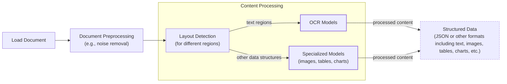
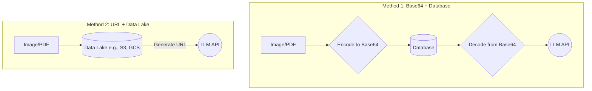
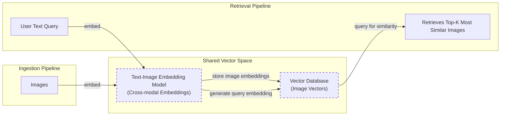
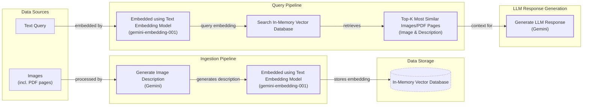
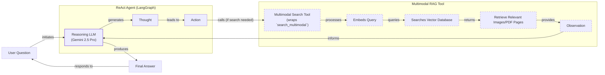

# Lesson 11: Multimodal AI

In the previous lessons, we built a solid foundation in AI Engineering. We explored the agent landscape, distinguished between LLM workflows and AI agents, and mastered context engineering, memory, and Retrieval-Augmented Generation (RAG). We have covered almost all the fundamentals for building production-ready AI systems. The last piece of the puzzle is working with data beyond plain text.

In the real world, we rarely work only with text. As humans, we interact with a rich mix of images, documents, and audio every day. Enterprise AI applications must do the same, processing private data from databases, warehouses, and data lakes. Early AI systems tried to normalize everything to text, using Optical Character Recognition (OCR) to parse documents. However, this approach loses critical visual information. It is impossible to describe a complex financial chart, a medical X-ray, or a building sketch in words without losing nuance.

For example, text-only AI struggles with financial reports that rely on charts for trend analysis, or medical diagnostics where visual data from scans is essential [[1]](https://konfuzio.com/en/chatgpt-financial-analysis/), [[2]](https://techtoday.lenovo.com/sites/default/files/2025-05/Medical%20Imaging%20White%20Paper%20NVIDIA%20and%20Lenovo.pdf). These models cannot interpret the visual relationships in a diagram or the subtle patterns in a medical image, which often contain the most important insights. Other common use cases like object detection, image captioning, and processing technical documents with diagrams are simply out of reach for models that cannot "see" [[3]](https://github.com/cognitivetech/llm-research-summaries/blob/main/models-review/A-Comprehensive-Survey-and-Guide-to-Multimodal-Large-Language-Models-in-Vision-Language-Tasks.md).

That is why modern AI systems have shifted to processing inputs in their native format. Multimodal LLMs can "see" images and documents, just like humans, preserving the rich context that text-only models miss. This lesson will show you how to build enterprise AI agents and LLM workflows that natively process text, images, and documents. You will cover the theory behind multimodal models and then implement hands-on examples, from basic image processing to building a full-fledged multimodal RAG agent.

## Limitations of traditional document processing

To understand the need for multimodal AI, you first need to look at the limitations of traditional document processing. For years, the standard approach for getting information from documents like invoices or reports into an AI system was to convert them to text. This process typically relied on a complex and fragile pipeline involving layout detection and OCR.

A typical workflow looks something like this:


Image 1: A flowchart illustrating the traditional document processing workflow.

This multi-step process has several challenges. First, it involves many moving parts: a layout detection model, an OCR model, and often separate specialized models for tables, charts, and other data structures. This makes the system rigid. If a document contains a new type of chart the system has not seen before, it will likely fail. This complexity also makes the pipeline slow and costly, as each step may involve a separate model call [[4]](https://www.daft.ai/blog/end-to-end-distributed-pdf-processing-pipeline), [[5]](https://learn.microsoft.com/en-us/answers/questions/5668164/why-traditional-ocr-fails-for-complex-business-doc?page=1).

The biggest problem, however, is performance. Errors compound at each stage. A small mistake in layout detection can lead to a major error in the final extracted data. Even the most advanced OCR engines struggle with real-world documents. While they can achieve 88-94% accuracy on simple layouts, their performance drops significantly on complex documents, poor-quality scans, or handwritten text [[6]](https://www.llamaindex.ai/blog/ocr-accuracy). For example, a scan resolution below 300 DPI can cause accuracy to drop by 20% or more, and a 5-degree tilt in a scanned document can increase the word error rate by 15% or more. For handwriting, a character error rate of 3-5% is considered good, which is not nearly enough for high-stakes applications [[6]](https://www.llamaindex.ai/blog/ocr-accuracy).

Traditional OCR systems are not designed to understand context or structure. They see a page as a flat grid of characters, which is why they fail on documents with multi-column layouts, nested tables, or text interwoven with graphics [[5]](https://learn.microsoft.com/en-us/answers/questions/5668164/why-traditional-ocr-fails-for-complex-business-doc?page=1). Template-based systems can work for fixed formats but break the moment a layout changes, requiring constant manual updates [[7]](https://www.llamaindex.ai/blog/ocr-for-tables). Consider trying to process a technical drawing or a building sketch. These documents are filled with special symbols, rotated text, and complex spatial relationships that are nearly impossible for a traditional OCR system to interpret correctly.

https://hackernoon.imgix.net/images/2DFAaGGO5cfymtBKn4bFFAoT6sg2-mjc3x1z.jpeg
Image 2: Deep learning can be used to remove false positive results (Source [Complex Document Recognition: OCR Doesn’t Work and Here’s How You Fix It [[8]](https://hackernoon.com/complex-document-recognition-ocr-doesnt-work-and-heres-how-you-fix-it)])

This pipeline might work for highly specialized, predictable tasks, but it is not a scalable solution for building flexible and fast AI agents. That is why modern AI solutions use multimodal LLMs, such as Gemini, that can directly interpret text, images, and even PDFs as native input, completely bypassing the fragile OCR workflow.

## Foundations of multimodal LLMs

Before you dive into code, it is important to have an intuition for how multimodal LLMs work. As an AI Engineer, you do not need to know every detail of their internal architecture, but understanding the core concepts will help you use, deploy, and optimize them effectively.

There are two common approaches to building multimodal LLMs that can process both text and images.

https://substackcdn.com/image/fetch/f_auto,q_auto:good,fl_progressive:steep/https%3A%2F%2Fsubstack-post-media.s3.amazonaws.com%2Fpublic%2Fimages%2F53956ae8-9cd8-474e-8c10-ef6bddb88164_1600x938.png
Image 3: The two main approaches to developing multimodal LLM architectures. (Source [Understanding Multimodal LLMs [[9]](https://magazine.sebastianraschka.com/p/understanding-multimodal-llms)])

You will now look at each of these in more detail.

### Unified Embedding Decoder Architecture

The first approach, the Unified Embedding Decoder Architecture, is the simpler of the two. It uses a standard text-based LLM decoder but feeds it a combination of text and image tokens.

https://substackcdn.com/image/fetch/f_auto,q_auto:good,fl_progressive:steep/https%3A%2F%2Fsubstack-post-media.s3.amazonaws.com%2Fpublic%2Fimages%2F91955021-7da5-4bc4-840e-87d080152b18_1166x1400.png
Image 4: Illustration of the unified embedding decoder architecture. (Source [Understanding Multimodal LLMs [[9]](https://magazine.sebastianraschka.com/p/understanding-multimodal-llms)])

To make this work, the image must be converted into a sequence of embeddings that the LLM can understand. This is done using an image encoder, which functions similarly to a text tokenizer. While text is broken down into tokens using an algorithm like Byte-Pair Encoding, an image is broken down into a grid of smaller patches [[9]](https://magazine.sebastianraschka.com/p/understanding-multimodal-llms).

https://substackcdn.com/image/fetch/f_auto,q_auto:good,fl_progressive:steep/https%3A%2F%2Fsubstack-post-media.s3.amazonaws.com%2Fpublic%2Fimages%2F0d56ea06-d202-4eb7-9e01-9aac492ee309_1522x1206.png
Image 5: Image tokenization and embedding (left) and text tokenization and embedding (right) side by side. (Source [Understanding Multimodal LLMs [[9]](https://magazine.sebastianraschka.com/p/understanding-multimodal-llms)])

Each patch is then processed by a vision transformer (ViT), a type of neural network architecture designed for image processing, to create an embedding.

https://substackcdn.com/image/fetch/f_auto,q_auto:good,fl_progressive:steep/https%3A%2F%2Fsubstack-post-media.s3.amazonaws.com%2Fpublic%2Fimages%2Ffef5f8cb-c76c-4c97-9771-7fdb87d7d8cd_1600x1135.png
Image 6: Illustration of a classic vision transformer (ViT) setup. (Source [Understanding Multimodal LLMs [[9]](https://magazine.sebastianraschka.com/p/understanding-multimodal-llms)])

These image embeddings are then passed through a linear projection layer, which aligns them with the text embedding space. This ensures that both the image and text embeddings have the same dimensions and can be concatenated and fed into the LLM as a single sequence. Popular image encoders like CLIP (Contrastive Language-Image Pre-training), OpenCLIP, or SigLIP are trained using contrastive learning to ensure that the embeddings for an image and its corresponding text description are close to each other in the vector space [[10]](https://opensearch.org/blog/multimodal-semantic-search/). This alignment is what allows the model to understand the relationship between text and images. Contrastive learning works by training the model on positive pairs (an image and its correct caption) and negative pairs (an image and an incorrect caption), teaching it to maximize the similarity for positive pairs and minimize it for negative ones [[11]](https://towardsdatascience.com/multimodal-embeddings-an-introduction-5dc36975966f/).

https://towardsdatascience.com/wp-content/uploads/2024/11/15d3HBNjNIXLy0oMIvJjxWw.png
Image 7: Toy representation of multimodal embedding space. (Image by Shaw Talebi from [Multimodal Embeddings: An Introduction [[11]](https://towardsdatascience.com/multimodal-embeddings-an-introduction-5dc36975966f/)])

This is the same principle that powers multimodal RAG systems, which you will explore later. By representing both text and images in a shared embedding space, you can perform semantic similarity searches across different data types.

### Cross-Modality Attention Architecture

The second approach, the Cross-Modality Attention Architecture, is more complex. Instead of concatenating image and text tokens at the input layer, it injects the image information directly into the LLM's attention mechanism.

https://substackcdn.com/image/fetch/f_auto,q_auto:good,fl_progressive:steep/https%3A%2F%2Fsubstack-post-media.s3.amazonaws.com%2Fpublic%2Fimages%2Fd9c06055-b959-45d1-87b2-1f4e90ceaf2d_1296x1338.png
Image 8: An illustration of the Cross-Modality Attention Architecture approach to building multimodal LLMs. (Source [Understanding Multimodal LLMs [[9]](https://magazine.sebastianraschka.com/p/understanding-multimodal-llms)])

This is done using a cross-attention mechanism, where the text embeddings generate queries, and the image embeddings provide the keys and values. This allows the model to selectively "attend" to different parts of the image as it processes the text, creating a more integrated representation of the two modalities. This is conceptually similar to the original Transformer architecture used for machine translation, where the decoder attends to the encoder's output [[9]](https://magazine.sebastianraschka.com/p/understanding-multimodal-llms).

### Architectural Trade-offs

Each of these architectures comes with its own set of trade-offs. The unified embedding approach is simpler to implement and tends to perform better on OCR-related tasks. The cross-attention approach, on the other hand, is more computationally efficient, especially with high-resolution images, as it avoids lengthening the input sequence with image tokens [[9]](https://magazine.sebastianraschka.com/p/understanding-multimodal-llms), [[12]](https://arxiv.org/abs/2409.11402). Some models, like NVIDIA's NVLM-H, even use hybrid approaches to get the best of both worlds [[12]](https://arxiv.org/abs/2409.11402).

In 2025, most state-of-the-art LLMs are multimodal. In the open-source world, we have models like Llama 4, Qwen3, and DeepSeek V3, while the closed-source space is dominated by GPT-5, Gemini 2.5, and Claude 4.5 [[13]](https://medium.com/data-science-in-your-pocket/2025-the-year-ai-reasoning-models-took-over-a-month-by-month-review-of-frontier-breakthroughs-6ea2163f854f), [[14]](https://codedesign.ai/blog/the-ultimate-guide-to-the-top-large-language-models-in-2025/). These models can often be extended to other modalities like audio and video by adding specialized encoders for each data type, such as Whisper for audio or Video Transformers for video [[15]](https://sparkco.ai/blog/exploring-multimodal-llms-text-image-and-video-integration), [[16]](https://www.emergentmind.com/topics/multimodal-llms).

It is also important to distinguish these multimodal LLMs from diffusion-based image generation models like Stable Diffusion. While both work with images, diffusion models are specialized for generating images from text prompts. They use a completely different architecture based on a denoising process [[9]](https://magazine.sebastianraschka.com/p/understanding-multimodal-llms). In the context of AI agents, these generative models can be integrated as tools, allowing an agent to create images as one of its actions [[17]](https://arxiv.org/html/2409.14993v3).

The field of multimodal LLM architectures is constantly evolving. The goal of this section was not to be exhaustive but to provide you with a solid intuition for how these models work and why they are a significant step up from older, multi-step OCR approaches. Now that you understand how LLMs can directly process images and documents, you will see how this works in practice.

## Applying multimodal LLMs to images and PDFs

To better understand how multimodal LLMs work, you will walk through a few examples using Gemini to see some best practices when working with images and PDFs.

There are three main ways to provide multimodal data to an LLM: as raw bytes, as Base64-encoded strings, or as URLs.

*   **Raw bytes** are the most direct way to handle files. This method works well for one-off API calls but can be problematic for storage, as many databases are not optimized for binary data and may misinterpret it as text, leading to corruption.
*   **Base64 encoding** solves the storage problem by converting binary data into a string format. This allows you to store images or documents in standard text-based databases (like PostgreSQL or MongoDB) without risk of corruption. The main downside is that Base64-encoded data is about 33% larger than the original binary data.
*   **URLs** are ideal for two scenarios: accessing public data from the internet or working with private data stored in a data lake like AWS S3 (Simple Storage Service) or Google Cloud Storage (GCS). For enterprise applications, using URLs to access files in a data lake is often the most efficient method, as it avoids passing large files over the network. The LLM can access the data directly from the storage bucket.


Image 9: A diagram comparing data handling with Base64 and databases versus URLs and data lakes.

The best method depends on your application's architecture. For simple, one-off tasks, raw bytes are fine. If you need to store multimodal data in a traditional database, Base64 is a reliable choice. For scalable, enterprise-grade systems, using a data lake and URLs is the recommended approach.

Now, you will dive into the code. You will start with a sample image.

https://github.com/towardsai/course-ai-agents/raw/dev/lessons/11_multimodal/images/image_1.jpeg
Image 10: Sample image for multimodal processing. (Source [course-ai-agents/notebook.ipynb at dev · towardsai/course-ai-agents [[18]](https://github.com/towardsai/course-ai-agents/blob/dev/lessons/11_multimodal/notebook.ipynb)])

### Processing Images as Raw Bytes

1.  First, you define a helper function to load an image from a file path, resize it, and convert it to bytes. You use the WEBP format because it offers a good balance of quality and file size.
    ```python
    import io
    from pathlib import Path
    from typing import Literal
    
    from PIL import Image as PILImage
    
    def load_image_as_bytes(
        image_path: Path, format: Literal["WEBP", "JPEG", "PNG"] = "WEBP", max_width: int = 600, return_size: bool = False
    ) -> bytes | tuple[bytes, tuple[int, int]]:
        """
        Load an image from file path and convert it to bytes with optional resizing.
        """
    
        image = PILImage.open(image_path)
        if image.width > max_width:
            ratio = max_width / image.width
            new_size = (max_width, int(image.height * ratio))
            image = image.resize(new_size)
    
        byte_stream = io.BytesIO()
        image.save(byte_stream, format=format)
    
        if return_size:
            return byte_stream.getvalue(), image.size
    
        return byte_stream.getvalue()
    ```

2.  Next, you load our sample image as bytes and inspect the result.
    ```python
    image_bytes = load_image_as_bytes(image_path=Path("images") / "image_1.jpeg", format="WEBP")
    ```
    It outputs:
    ```text
    Bytes `b'RIFF`\xad\x00\x00WEBPVP8 T\xad\x00\x00P\xec\x02\x9d\x01*X\x02X\x02'...`
    Size: 44392 bytes
    ```

3.  Now, you can pass these bytes directly to the Gemini model to generate a caption.
    ```python
    from google import genai
    from google.genai import types
    
    response = client.models.generate_content(
        model=MODEL_ID,
        contents=[
            types.Part.from_bytes(
                data=image_bytes,
                mime_type="image/webp",
            ),
            "Tell me what is in this image in one paragraph.",
        ],
    )
    ```
    It outputs:
    ```text
    This striking image features a massive, dark metallic robot, its powerful form detailed with intricate circuit patterns on its head and piercing red glowing eyes. Perched playfully on its right arm is a small, fluffy grey tabby kitten, its front paw raised as if exploring or batting at the robot's armored limb, while its gaze is directed slightly off-frame. The robot's large, segmented hand is visible beneath the kitten. The background suggests an industrial or workshop environment, with hints of metal structures and natural light filtering in from an unseen window, creating a dramatic contrast between the soft, vulnerable kitten and the formidable, mechanical sentinel.
    ```

4.  You can also pass multiple images in a single call to ask the model to compare them.
    ```python
    response = client.models.generate_content(
        model=MODEL_ID,
        contents=[
            types.Part.from_bytes(
                data=load_image_as_bytes(image_path=Path("images") / "image_1.jpeg", format="WEBP"),
                mime_type="image/webp",
            ),
            types.Part.from_bytes(
                data=load_image_as_bytes(image_path=Path("images") / "image_2.jpeg", format="WEBP"),
                mime_type="image/webp",
            ),
            "What's the difference between these two images? Describe it in one paragraph.",
        ],
    )
    ```
    It outputs:
    ```text
    The primary difference between the two images lies in the nature of the interaction depicted and their respective settings. In the first image, a small, grey kitten is shown curiously interacting with a large, metallic robot, gently perched on its arm within what appears to be a clean, well-lit workshop or industrial space. Conversely, the second image portrays a tense and aggressive confrontation between a fluffy white dog and a sleek black robot, both in combative stances, amidst a cluttered and grimy urban alleyway filled with trash and graffiti.
    ```

### Processing Images as Base64 Encoded Strings

1.  Here is a helper function to load an image and encode it as a Base64 string.
    ```python
    import base64
    from typing import cast
    
    def load_image_as_base64(
        image_path: Path, format: Literal["WEBP", "JPEG", "PNG"] = "WEBP", max_width: int = 600, return_size: bool = False
    ) -> str:
        """
        Load an image and convert it to base64 encoded string.
        """
    
        image_bytes = load_image_as_bytes(image_path=image_path, format=format, max_width=max_width, return_size=False)
    
        return base64.b64encode(cast(bytes, image_bytes)).decode("utf-8")
    ```

2.  You load the same image as a Base64 string and note the increase in size.
    ```python
    image_base64 = load_image_as_base64(image_path=Path("images") / "image_1.jpeg", format="WEBP")
    ```
    It outputs:
    ```text
    Base64: UklGRmCtAABXRUJQVlA4IFStAABQ7AKdASpYAlgCPm0ylEekIqInJnQ7gOANiWdtk7FnEo2gDknjPixW9SNSb5P7IbBNhLn87Vtp...`
    Size: 59192 characters
    ```
    As expected, the Base64 string is 33.34% larger than the raw bytes.

3.  The process for calling the model is identical, simply passing the Base64 string instead of the raw bytes.
    ```python
    response = client.models.generate_content(
        model=MODEL_ID,
        contents=[
            types.Part.from_bytes(data=image_base64, mime_type="image/webp"),
            "Tell me what is in this image in one paragraph.",
        ],
    )
    ```

### Processing PDFs as Public URLs

Gemini can also process files directly from public URLs using its built-in `url_context` tool. This is useful for analyzing online documents without downloading them first.

1.  You simply provide the URL in the prompt and configure the `url_context` tool.
    ```python
    response = client.models.generate_content(
        model=MODEL_ID,
        contents="Based on the provided paper as a PDF, tell me how ReAct works: https://arxiv.org/pdf/2210.03629",
        config=types.GenerateContentConfig(tools=[{"url_context": {}}]),
    )
    ```
    It outputs:
    ```text
    ReAct is a novel paradigm for large language models (LLMs) that combines reasoning (Thought) and acting (Action) in an interleaved manner to solve diverse language and decision-making tasks. This approach allows the model to:
    
    *   **Reason to Act:** Generate verbal reasoning traces to induce, track, and update action plans, and handle exceptions.
    *   **Act to Reason:** Interface with and gather additional information from external sources (like knowledge bases or environments) to incorporate into its reasoning.
    ```

### Processing Images from Private Data Lakes

At the time of writing, the Gemini API integrates most smoothly with Google Cloud Storage. For simplicity, you will be provided a pseudocode example of how you would use a GCS URL.
```python
response = client.models.generate_content(
    model=MODEL_ID,
    contents=[
        types.Part.from_uri(uri="gs://gemini-images/image_1.jpeg", mime_type="image/webp"),
        "Tell me what is in this image in one paragraph.",
    ],
)
```

### Object Detection with LLMs

Multimodal LLMs can also perform more advanced computer vision tasks like object detection. By combining the model's visual understanding with its ability to generate structured output, you can extract bounding box coordinates for objects in an image.

1.  First, you define the desired output structure using Pydantic models. This ensures the LLM's response is in a predictable, machine-readable format.
    ```python
    from pydantic import BaseModel, Field
    
    
    class BoundingBox(BaseModel):
        ymin: float
        xmin: float
        ymax: float
        xmax: float
        label: str = Field(
            default="The category of the object found within the bounding box. For example: cat, dog, diagram, robot."
        )
    
    
    class Detections(BaseModel):
        bounding_boxes: list[BoundingBox]
    ```

2.  Next, you create a prompt that instructs the model to detect objects and return their bounding boxes, normalized to a 0-1000 scale.
    ```python
    prompt = """
    Detect all of the prominent items in the image. 
    The box_2d should be [ymin, xmin, ymax, xmax] normalized to 0-1000.
    Also, output the label of the object found within the bounding box.
    """
    
    image_bytes, image_size = load_image_as_bytes(
        image_path=Path("images") / "image_1.jpeg", format="WEBP", return_size=True
    )
    ```

3.  You configure the Gemini client to expect a JSON response that conforms to our `Detections` Pydantic model.
    ```python
    config = types.GenerateContentConfig(
        response_mime_type="application/json",
        response_schema=Detections,
    )
    
    response = client.models.generate_content(
        model=MODEL_ID,
        contents=[
            types.Part.from_bytes(
                data=image_bytes,
                mime_type="image/webp",
            ),
            prompt,
        ],
        config=config,
    )
    
    detections = cast(Detections, response.parsed)
    ```
    It outputs:
    ```text
    Image size: (600, 600)
    ymin=1.0 xmin=450.0 ymax=997.0 xmax=1000.0 label='robot'
    ymin=269.0 xmin=39.0 ymax=782.0 xmax=530.0 label='kitten'
    ```

4.  Finally, you can use a helper function to visualize the detected bounding boxes on the original image.
    ```python
    import matplotlib.pyplot as plt
    import matplotlib.patches as patches
    import numpy as np
    
    visualize_detections(detections, Path("images") / "image_1.jpeg")
    ```
    https://github.com/towardsai/course-ai-agents/raw/dev/lessons/11_multimodal/images/object_detection.png
    Image 11: Object detection results for the sample image. (Source [course-ai-agents/notebook.ipynb at dev · towardsai/course-ai-agents [[18]](https://github.com/towardsai/course-ai-agents/blob/dev/lessons/11_multimodal/notebook.ipynb)])

### Working with PDFs

Processing PDFs with multimodal LLMs is very similar to processing images. You can pass the PDF file as bytes or a Base64 string, just as you did with images.

1.  To demonstrate, you will use the famous "Attention Is All You Need" paper.
    https://github.com/towardsai/course-ai-agents/raw/dev/lessons/11_multimodal/images/attention_is_all_you_need_0.jpeg
    Image 12: The first page of the "Attention Is All You Need" paper. (Source [course-ai-agents/notebook.ipynb at dev · towardsai/course-ai-agents [[18]](https://github.com/towardsai/course-ai-agents/blob/dev/lessons/11_multimodal/notebook.ipynb)])
    ```python
    pdf_bytes = (Path("pdfs") / "attention_is_all_you_need_paper.pdf").read_bytes()
    
    response = client.models.generate_content(
        model=MODEL_ID,
        contents=[
            types.Part.from_bytes(data=pdf_bytes, mime_type="application/pdf"),
            "What is this document about? Provide a brief summary of the main topics.",
        ],
    )
    ```
    It outputs:
    ```text
    This document introduces the **Transformer**, a novel neural network architecture designed for **sequence transduction tasks** (like machine translation).
    
    Its main topics include:
    ...
    ```

2.  You can also process PDFs as Base64-encoded strings.
    ```python
    def load_pdf_as_base64(pdf_path: Path) -> str:
        """
        Load a PDF file and convert it to base64 encoded string.
        """
        with open(pdf_path, "rb") as f:
            return base64.b64encode(f.read()).decode("utf-8")

    pdf_base64 = load_pdf_as_base64(pdf_path=Path("pdfs") / "attention_is_all_you_need_paper.pdf")
    ```
    It outputs:
    ```text
    Base64: JVBERi0xLjcKJeLjz9MKMjQgMCBvYmoKPDwKL0Zp...
    ```
    The call to the LLM is analogous to the previous examples.

3.  You can also treat individual PDF pages as images, which is especially useful for documents with complex layouts, diagrams, or charts. You will perform object detection on a page from the Transformer paper to find the model architecture diagram.
    https://github.com/towardsai/course-ai-agents/raw/dev/lessons/11_multimodal/images/attention_is_all_you_need_1.jpeg
    Image 13: A page from the "Attention Is All You Need" paper. (Source [course-ai-agents/notebook.ipynb at dev · towardsai/course-ai-agents [[18]](https://github.com/towardsai/course-ai-agents/blob/dev/lessons/11_multimodal/notebook.ipynb)])

4.  Using the same object detection prompt and Pydantic schema as before, you ask the model to find all diagrams on the page.
    ```python
    prompt = """
    Detect all the diagrams from the provided image as 2d bounding boxes. 
    The box_2d should be [ymin, xmin, ymax, xmax] normalized to 0-1000.
    Also, output the label of the object found within the bounding box.
    """
    
    image_bytes, image_size = load_image_as_bytes(
        image_path=Path("images") / "attention_is_all_you_need_1.jpeg", format="WEBP", return_size=True
    )
    # ... call the model ...
    ```

5.  The model successfully identifies the diagram and returns its bounding box.
    https://github.com/towardsai/course-ai-agents/raw/dev/lessons/11_multimodal/images/pdf_object_detection.png
    Image 14: Object detection results on a PDF page. (Source [course-ai-agents/notebook.ipynb at dev · towardsai/course-ai-agents [[18]](https://github.com/towardsai/course-ai-agents/blob/dev/lessons/11_multimodal/notebook.ipynb)])

The choice between processing a PDF as a whole document versus page-by-page as images depends on the task. For summarizing text, the whole-document approach is fine. For extracting information from complex layouts, the page-as-image approach is superior. This ability to understand images and documents natively is what makes multimodal LLMs so powerful. It completely bypasses the need for fragile, error-prone OCR pipelines and allows you to work with visual information directly.

## Foundations of multimodal RAG

One of the most common use cases for multimodal data is RAG, a topic you covered in Lesson 10. When building custom AI applications, you will almost always need to retrieve private company data to feed into your LLM. For large files like images or multi-page PDFs, RAG is not just useful, it is essential. You cannot stuff a thousand-page report into an LLM's context window and expect good results. Even with massive context windows, performance degrades, and costs and latency skyrocket.

A generic multimodal RAG architecture for text and images works like this:


Image 15: A diagram illustrating a generic multimodal RAG architecture using images and text, highlighting the shared text-image embedding model and vector database.

During ingestion, images are converted into embeddings using a multimodal embedding model and stored in a vector database. At retrieval time, a user's text query is embedded using the same model. The system then queries the vector database to find the `top-k` images with embeddings most similar to the query embedding. Because the text and image embeddings exist in the same vector space, you can measure their semantic similarity directly. This same technique powers image search engines like Google Photos, where you can search for "pictures of dogs" and get back relevant images.

For enterprise document RAG, the state-of-the-art architecture as of 2025 is ColPali. This model bypasses the entire OCR pipeline by processing document pages directly as images. It uses a vision-language model to understand both the text and the visual layout, making it highly effective for documents with complex tables, charts, and figures.

https://github.com/illuin-tech/colpali/raw/main/assets/architecture.png
Image 16: ColPali simplifies document retrieval w.r.t. standard retrieval methods while achieving stronger performances with better latencies. (Source [ColPali: Efficient Document Retrieval with Vision Language Models [[19]](https://arxiv.org/pdf/2407.01449v6)])

ColPali works by breaking a document page image into patches and generating a "bag-of-embeddings" or multi-vector representation for the page. Instead of a single vector for the whole document, it creates an embedding for each patch. At query time, it uses a late interaction mechanism (the MaxSim operator) to compare the embeddings of each query token against all the patch embeddings, allowing for a more fine-grained similarity matching [[19]](https://arxiv.org/pdf/2407.01449v6). This approach has been shown to be 2-10x faster than traditional OCR pipelines and significantly more accurate, outperforming baseline systems on the ViDoRe benchmark with an 81.3% average nDCG@5 score [[19]](https://arxiv.org/pdf/2407.01449v6). The official implementation can be found on Hugging Face.

Now that you have covered the theory, you will build a simple multimodal RAG system from scratch.

## Implementing multimodal RAG for images, PDFs and text

You will now connect all the dots with a more complex coding example where you combine what you have learned in this lesson and Lesson 10 on RAG into a multimodal RAG exercise. You will build a simple system where you populate an in-memory vector database with images and PDF pages and then query it using text.

To keep the example simple and focused on the core concepts, you will not implement the full ColPali architecture with image patching and late interaction. Instead, you will simulate the process to build your intuition.


Image 17: Mermaid diagram illustrating the multimodal RAG example.

Here are the images you will be indexing, which include a mix of photos and pages from the "Attention is All You Need" paper.

https://github.com/towardsai/course-ai-agents/raw/dev/lessons/11_multimodal/images/image_grid.png
Image 18: Image corpus for the RAG example. (Source [course-ai-agents/notebook.ipynb at dev · towardsai/course-ai-agents [[18]](https://github.com/towardsai/course-ai-agents/blob/dev/lessons/11_multimodal/notebook.ipynb)])

1.  First, you define a function to create our vector index. Since the Gemini API used in this example does not directly support image embedding, you will use a workaround: generate a detailed text description for each image using the Gemini vision model, and then embed that description using a text embedding model.
    <aside>
    💡
    
    This is not the recommended approach for production systems. In a real-world scenario, you would use a multimodal embedding model (like those from Voyage AI, Cohere, or Google's models on Vertex AI) to directly embed the image bytes. The rest of the RAG pipeline would remain the same. For example:
    
    ```python
    image_bytes = ...
    # SKIPPED !
    # image_description = generate_image_description(image_bytes)
    image_embeddings = embed_with_multimodal(image_bytes)
    ```
    
    </aside>
    
    Our function will iterate through a list of image paths, generate a description for each, embed the description, and store the results in a list that acts as our in-memory vector index. In a production system, you would use a dedicated vector database with an efficient index like HNSW for scalability.
    ```python
    from typing import cast
    
    
    def create_vector_index(image_paths: list[Path]) -> list[dict]:
        """
        Create embeddings for images by generating descriptions and embedding them.
        """
    
        vector_index = []
        for image_path in image_paths:
            image_bytes = cast(bytes, load_image_as_bytes(image_path, format="WEBP", return_size=False))
    
            image_description = generate_image_description(image_bytes)
    
            image_embedding = embed_text_with_gemini(image_description)
    
            vector_index.append(
                {
                    "content": image_bytes,
                    "type": "image",
                    "filename": image_path,
                    "description": image_description,
                    "embedding": image_embedding,
                }
            )
    
        return vector_index
    ```

2.  Here are the helper functions for generating descriptions and embeddings.
    ```python
    from io import BytesIO
    import numpy as np
    
    def generate_image_description(image_bytes: bytes) -> str:
        """
        Generate a detailed description of an image using Gemini Vision model.
        """
        # ... (implementation from notebook)
    
    def embed_text_with_gemini(content: str) -> np.ndarray | None:
        """
        Embed text content using Gemini's text embedding model.
        """
        # ... (implementation from notebook)
    ```

3.  Now, you create the vector index from our images.
    ```python
    image_paths = list(Path("images").glob("*.jpeg"))
    vector_index = create_vector_index(image_paths)
    ```
    It outputs:
    ```text
    Successfully created 7 embeddings under the `vector_index` variable
    ```

4.  Each entry in our `vector_index` contains the image bytes, its filename, the generated description, and the embedding of that description. Here is what the structure looks like:
    ```python
    vector_index[0].keys()
    ```
    It outputs:
    ```text
    dict_keys(['content', 'type', 'filename', 'description', 'embedding'])
    ```
    The embedding is a 3072-dimensional vector, and the description is a detailed text summary of the image content.

5.  Next, you define our search function. It takes a text query, embeds it, and then calculates the cosine similarity between the query embedding and all the image description embeddings in our index. It returns the `top_k` most similar images.
    ```python
    from sklearn.metrics.pairwise import cosine_similarity
    from typing import Any
    
    def search_multimodal(query_text: str, vector_index: list[dict], top_k: int = 3) -> list[Any]:
        """
        Search for most similar documents to query using direct Gemini client.
        """
        # ... (implementation from notebook)
    ```

6.  You can test it with a query about the Transformer architecture.
    ```python
    query = "what is the architecture of the transformer neural network?"
    results = search_multimodal(query, vector_index, top_k=1)
    ```
    The system correctly retrieves the page from the "Attention Is All You Need" paper that contains the model architecture diagram, with a similarity score of 0.744.
    https://github.com/towardsai/course-ai-agents/raw/dev/lessons/11_multimodal/images/attention_is_all_you_need_1.jpeg
    Image 19: Search result for "transformer architecture". (Source [course-ai-agents/notebook.ipynb at dev · towardsai/course-ai-agents [[18]](https://github.com/towardsai/course-ai-agents/blob/dev/lessons/11_multimodal/notebook.ipynb)])

7.  You can try another query.
    ```python
    query = "a kitten with a robot"
    results = search_multimodal(query, vector_index, top_k=1)
    ```
    It correctly retrieves the image of the kitten and the robot with a high similarity score of 0.811.
    https://github.com/towardsai/course-ai-agents/raw/dev/lessons/11_multimodal/images/image_1.jpeg
    Image 20: Search result for "a kitten with a robot". (Source [course-ai-agents/notebook.ipynb at dev · towardsai/course-ai-agents [[18]](https://github.com/towardsai/course-ai-agents/blob/dev/lessons/11_multimodal/notebook.ipynb)])

This example demonstrates how you can build a unified search system over different types of visual content by treating everything as an image. This same approach could be extended to video frames or spectrograms of audio data.

## Building multimodal AI agents

Now, you will take our RAG system a step further and integrate it as a tool into a ReAct agent. This will consolidate many of the skills you have learned in Part 1 of this course, combining multimodal data handling with agentic reasoning.

Multimodal capabilities can be added to AI agents in a few ways:
1.  **Multimodal Inputs/Outputs:** The reasoning LLM behind the agent can directly accept multimodal inputs (like images) and, in some cases, produce multimodal outputs.
2.  **Multimodal Tools:** The agent can be given tools that operate on multimodal data, such as our RAG retriever.
3.  **External Resources:** Tools can connect to external systems to fetch or act on multimodal data, like retrieving a PDF from a company database or analyzing a screenshot.

In this example, you will focus on the first two points. You will build a ReAct agent using LangGraph and give it access to our `search_multimodal` RAG function as a tool.


Image 21: A Mermaid diagram illustrating a multimodal ReAct Agent with RAG capabilities.

You will now see how this is implemented.

1.  First, you wrap our `search_multimodal` function in a tool decorator. This tool will take a text query from the agent, search our vector index, and return the retrieved image and its description to the agent's context.
    ```python
    from langchain_core.tools import tool
    from typing import Any
    
    @tool
    def multimodal_search_tool(query: str) -> dict[str, Any]:
        """
        Search through a collection of images and their text descriptions to find relevant content.
        """
        # ... (implementation from notebook)
        results = search_multimodal(query, vector_index, top_k=1)
        # ...
        content = [
            {
                "type": "text",
                "text": f"Image description: {result['description']}",
            },
            types.Part.from_bytes(
                data=result["content"],
                mime_type="image/jpeg",
            ),
        ]
    
        return {
            "role": "tool_result",
            "content": content,
        }
    ```

2.  Next, you define a function to build our ReAct agent using LangGraph. You will dive deeper into LangGraph in Part 2 of the course, but for now, you can think of it as a powerful way to create stateful, agentic applications. You provide the agent with a system prompt that guides it on how to use the search tool.
    ```python
    from langchain_google_genai import ChatGoogleGenerativeAI
    from langgraph.prebuilt import create_react_agent
    
    def build_react_agent() -> Any:
        """
        Build a ReAct agent with multimodal search capabilities.
        """
    
        tools = [multimodal_search_tool]
    
        system_prompt = """You are a helpful AI assistant that can search through images and text to answer questions.
        
        When asked about visual content like animals, objects, or scenes:
        1. Use the multimodal_search_tool to find relevant images and descriptions
        2. Carefully analyze the image or image descriptions from the search results
        3. Look for specific details like colors, features, objects, or characteristics
        4. Provide a clear, direct answer based on the search results
        5. If you can't find the specific information requested, be honest about limitations
        
        Always search first using your tools before attempting to answer questions about specific images or visual content.
        """
    
        agent = create_react_agent(
            model=ChatGoogleGenerativeAI(model="gemini-2.5-pro", temperature=0.1),
            tools=tools,
            prompt=system_prompt,
        )
    
        return agent
    
    react_agent = build_react_agent()
    ```

3.  Now, you can ask the agent a question that requires it to use its multimodal search tool: "what color is my kitten?"
    ```python
    test_question = "what color is my kitten?"
    response = react_agent.invoke(input={"messages": test_question})
    ```
    Here is the execution trace of the agent.
    **Thought:** The user is asking about the color of their kitten. I need to find an image of the user's kitten to answer this question. I will use the `multimodal_search_tool` to search for "my kitten".
    **Action:** `multimodal_search_tool(query='my kitten')`
    The tool finds the relevant image and returns it to the agent. The agent then analyzes the image and provides the final answer.
    It outputs:
    ```text
    Based on the image, your kitten is a gray tabby. It has soft, short gray fur with darker tabby stripe patterns.
    ```
    https://github.com/towardsai/course-ai-agents/raw/dev/lessons/11_multimodal/images/image_1.jpeg
    Image 22: The image retrieved and analyzed by the agent. (Source [course-ai-agents/notebook.ipynb at dev · towardsai/course-ai-agents [[18]](https://github.com/towardsai/course-ai-agents/blob/dev/lessons/11_multimodal/notebook.ipynb)])

In this lesson, you combined structured outputs, tools, ReAct, RAG, and multimodal data to create a proof-of-concept for an agentic multimodal RAG system.

## Conclusion

This lesson marks the end of Part 1 of our course on AI Engineering fundamentals. We have moved from the limitations of traditional, text-only systems to the powerful capabilities of multimodal AI. By treating documents and images as native inputs, we can build more robust, efficient, and intelligent AI applications that better reflect how humans interact with the world. We will use these multimodal techniques in our capstone project to pass images and PDFs from our research agent to the writer agent, preserving the full visual context of the source material.

In Part 2, we will move from theory to practice as we begin building the course's central project: an interconnected research and writing agent system. We will take a deep dive into agentic design patterns and modern frameworks like LangGraph, which we briefly touched on today. You will implement the research agent, equip it with tools for web scraping and analysis, and construct the writing workflow to turn that research into polished content.

## References

- [1] [ChatGPT for financial analysis](https://konfuzio.com/en/chatgpt-financial-analysis/)
- [2] [The AI Revolution in Medical Imaging](https://techtoday.lenovo.com/sites/default/files/2025-05/Medical%20Imaging%20White%20Paper%20NVIDIA%20and%20Lenovo.pdf)
- [3] [A Comprehensive Survey and Guide to Multimodal Large Language Models in Vision-Language Tasks](https://github.com/cognitivetech/llm-research-summaries/blob/main/models-review/A-Comprehensive-Survey-and-Guide-to-Multimodal-Large-Language-Models-in-Vision-Language-Tasks.md)
- [4] [End-to-End Distributed PDF Processing Pipeline](https://www.daft.ai/blog/end-to-end-distributed-pdf-processing-pipeline)
- [5] [Why traditional OCR fails for complex business documents](https://learn.microsoft.com/en-us/answers/questions/5668164/why-traditional-ocr-fails-for-complex-business-doc?page=1)
- [6] [OCR Accuracy Explained: How to Improve It](https://www.llamaindex.ai/blog/ocr-accuracy)
- [7] [How to Build an OCR Pipeline for Tables](https://www.llamaindex.ai/blog/ocr-for-tables)
- [8] [Complex Document Recognition: OCR Doesn’t Work and Here’s How You Fix It](https://hackernoon.com/complex-document-recognition-ocr-doesnt-work-and-heres-how-you-fix-it)
- [9] [Understanding Multimodal LLMs](https://magazine.sebastianraschka.com/p/understanding-multimodal-llms)
- [10] [Multimodal search: Searching with semantic and visual understanding](https://opensearch.org/blog/multimodal-semantic-search/)
- [11] [Multimodal Embeddings: An Introduction](https://towardsdatascience.com/multimodal-embeddings-an-introduction-5dc36975966f/)
- [12] [NVLM: Open Frontier-Class Multimodal LLMs](https://arxiv.org/abs/2409.11402)
- [13] [2025: The Year AI Reasoning Models Took Over — A Month-by-Month Review of Frontier Breakthroughs](https://medium.com/data-science-in-your-pocket/2025-the-year-ai-reasoning-models-took-over-a-month-by-month-review-of-frontier-breakthroughs-6ea2163f854f)
- [14] [The Ultimate Guide to the Top Large Language Models in 2025](https://codedesign.ai/blog/the-ultimate-guide-to-the-top-large-language-models-in-2025/)
- [15] [Exploring Multimodal LLMs: Text, Image, and Video Integration](https://sparkco.ai/blog/exploring-multimodal-llms-text-image-and-video-integration)
- [16] [Multimodal LLMs](https://www.emergentmind.com/topics/multimodal-llms)
- [17] [Multi-modal Understanding via Connector-based Joint Modeling of Pre-trained LLM and Diffusion](https://arxiv.org/html/2409.14993v3)
- [18] [course-ai-agents/notebook.ipynb at dev · towardsai/course-ai-agents](https://github.com/towardsai/course-ai-agents/blob/dev/lessons/11_multimodal/notebook.ipynb)
- [19] [ColPali: Efficient Document Retrieval with Vision Language Models](https://arxiv.org/pdf/2407.01449v6)