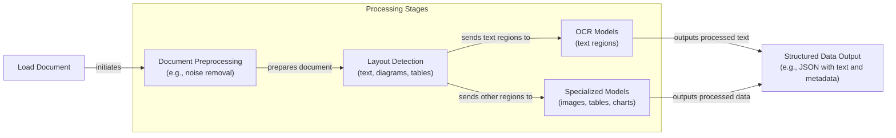
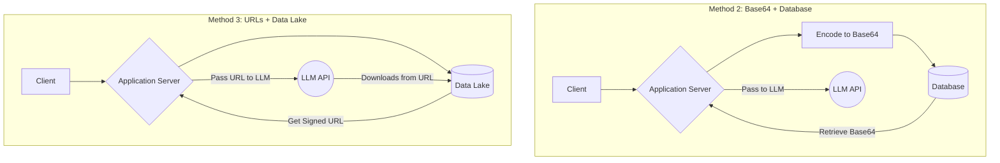
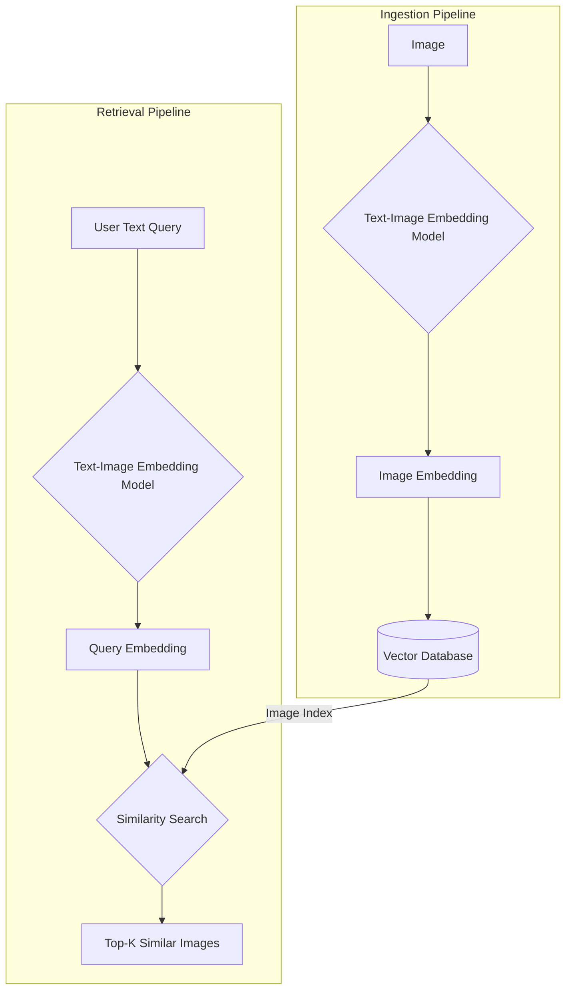
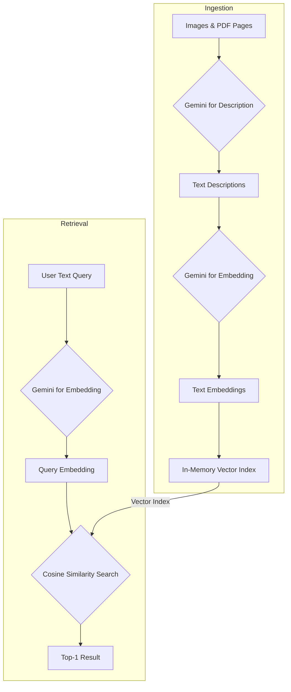
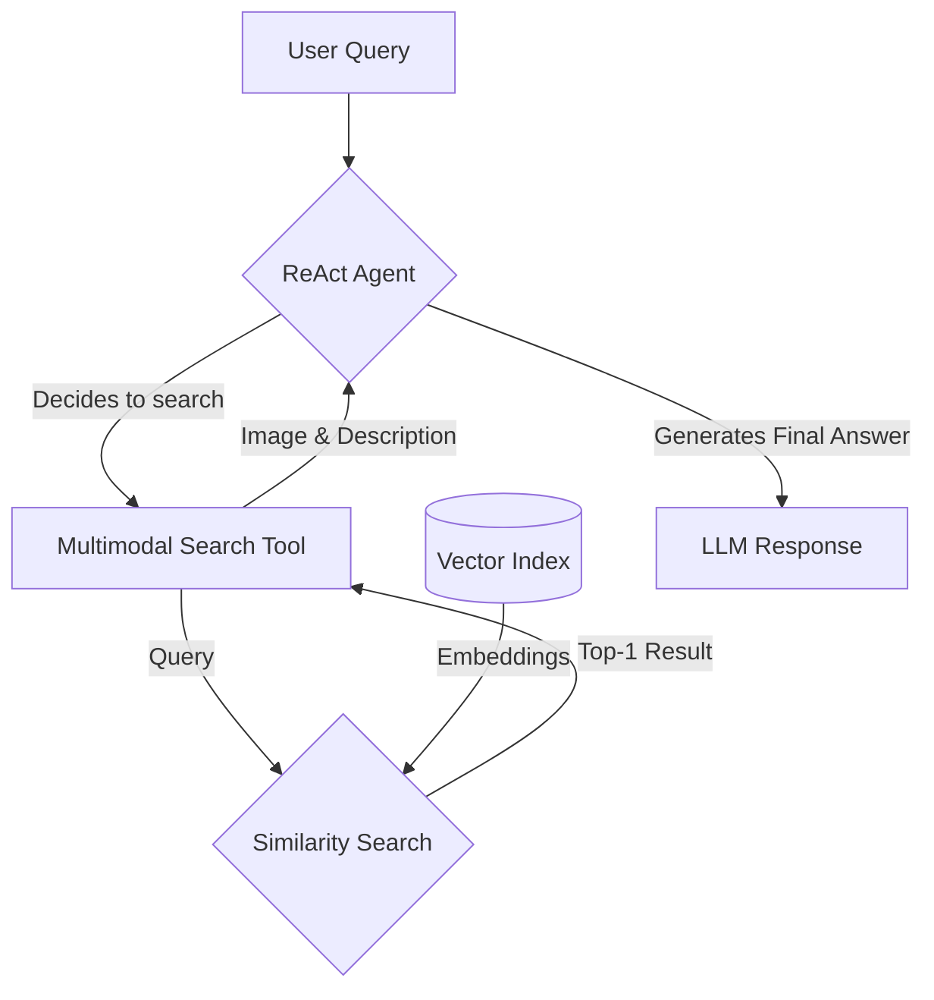

# Stop Converting Documents to Text. You're Doing It Wrong.

When we first started building AI agents, we hit a frustrating wall. We were comfortable manipulating text, but the moment we had to integrate multimodal data, such as images, audio, and especially documents like PDFs, our elegant architectures turned into messy hacks. We spent weeks building complex pipelines that tried to force everything into text. We chained OCR engines to scrape PDFs, layout detection models to identify tables, and separate classifiers to handle images. It was a brittle, slow, and expensive solution that broke every time a document layout changed.

The breakthrough came when we realized we were solving the wrong problem. We did not need to convert documents to text. We needed to treat them as images. Once we understood that every PDF page is effectively an image and that modern LLMs can “see” just as well as they can read, the complexity vanished. This shift is essential because real-world AI applications rarely exist in a text-only vacuum. Enterprise applications need to manipulate private data from warehouses and lakes that is inherently multimodal: financial reports with complex charts, technical diagrams, building sketches, and audio logs.

The old approach of normalizing everything to text is lossy. When you translate a complex diagram or a chart into text, you lose the spatial relationships, the colors, and the context. You lose the information that matters most. By processing data in its native format, we preserve this rich visual information, resulting in systems that are faster, cheaper, and more performant. Ultimately, as data is made for humans, you want the LLM to process the data as close as a human would, which often is visually.

In this lesson, we will cover the limitations of traditional document processing, the foundations of how multimodal LLMs work, and how to apply them to images and PDFs. We will then explore multimodal RAG, implement a system from scratch, and finally, build a complete multimodal AI agent.

## Limitations of Traditional Document Processing

To cement the problem, let’s dig deeper into the limitations of traditional document processing for invoices, documentation, or reports. The core issue is that previous approaches tried to normalize everything to text before passing it to an AI model. This has many flaws, as we lose a substantial amount of information during translation. For example, when encountering diagrams, charts, or sketches in a document, it is impossible to fully reproduce them in text.

The traditional document processing workflow relies on a multi-step pipeline that often includes layout detection and Optical Character Recognition (OCR) [[1]](https://www.daft.ai/blog/end-to-end-distributed-pdf-processing-pipeline), [[2]](https://parseur.com/blog/document-processing-automation-guide). This process typically involves loading a document, preprocessing it to remove noise, detecting the layout to identify different regions like text and tables, and then using specialized models to extract information from each region.


Image 1: A flowchart illustrating the traditional document processing workflow using Layout detection and OCR.

This workflow has too many moving pieces. We need layout detection models, OCR models for text, and specialized models for each expected data structure, such as tables or charts. This makes the system rigid. If a document contains a chart type we do not have a model for, the pipeline fails. It is also slow and costly because we have to chain multiple model calls [[3]](https://learn.microsoft.com/en-us/answers/questions/5668164/why-traditional-ocr-fails-for-complex-business-doc?page=1).

Most importantly, we face performance challenges. The multi-step nature creates a cascade effect where errors compound at each stage. Advanced OCR engines struggle with handwritten text, poor scans, stylized fonts, or complex layouts like nested tables and building sketches [[4]](https://intuitionlabs.ai/articles/ai-pdf-data-extraction-clinical-research). Traditional OCR systems can have an accuracy as low as 60% on complex documents, and even modern enterprise APIs see performance drops on irregular layouts [[5]](https://jiffy.ai/overcoming-ocr-errors-and-limitations-with-intelligent-document-processing/), [[6]](https://www.llamaindex.ai/blog/ocr-accuracy). For example, a 5-degree tilt in a scanned document can increase the word error rate by 15% or more, and resolutions below 300 DPI can cause accuracy to drop by over 20% [[6]](https://www.llamaindex.ai/blog/ocr-accuracy).

https://substackcdn.com/image/fetch/$s_!nM40!,f_auto,q_auto:good,fl_progressive:steep/https%3A%2F%2Fsubstack-post-media.s3.amazonaws.com%2Fpublic%2Fimages%2Fa2dc40f3-dc13-486e-853d-8404368f4d8d_1616x1000.png 
Image 2: A building sketch showing a crawl space vent diagram, illustrating the complexity of layouts that classic OCR systems struggle to interpret. (Source [Vectorize.io](https://vectorize.io/blog/multimodal-rag-patterns))

This approach might work for highly specialized applications, but it has too many problems and does not scale in a world of flexible and fast AI agents.

Modern AI solutions use multimodal LLMs, such as Gemini, GPT-4o, or Claude, that can directly interpret text, images, or PDFs as native input. This completely bypasses the unstable OCR workflow. Thus, let’s understand how multimodal LLMs work.

## Foundations of Multimodal LLMs

To use LLMs with images and documents, you need an intuition of how multimodality works. You do not need to understand every research detail, but knowing the architecture helps you deploy, optimize, and monitor them. There are two common approaches to building multimodal LLMs: the Unified Embedding Decoder Architecture and the Cross-modality Attention Architecture [[7]](https://magazine.sebastianraschka.com/p/understanding-multimodal-llms).

https://substackcdn.com/image/fetch/$s_!js-e!,f_auto,q_auto:good,fl_progressive:steep/https%3A%2F%2Fsubstack-post-media.s3.amazonaws.com%2Fpublic%2Fimages%2F76f50b57-2585-4cb8-8dda-eea5b5f81c03_1456x854.jpeg 
Image 3: The two main approaches to developing multimodal LLM architectures. (Source [Understanding Multimodal LLMs](https://magazine.sebastianraschka.com/p/understanding-multimodal-llms) [[7]](https://magazine.sebastianraschka.com/p/understanding-multimodal-llms))

### Unified Embedding Decoder Architecture

In this approach, we encode the text and image separately, concatenate their embeddings into a single vector, and pass the resulting vector to the LLM. Thus, on top of a standard LLM architecture, you need a vision encoder that maps the image to an embedding that is within the same vector space as the text. When the text and image embeddings are merged, the LLM can make sense of both [[7]](https://magazine.sebastianraschka.com/p/understanding-multimodal-llms).

https://substackcdn.com/image/fetch/$s_!p-gT!,f_auto,q_auto:good,fl_progressive:steep/https%3A%2F%2Fsubstack-post-media.s3.amazonaws.com%2Fpublic%2Fimages%2Fa0979e82-2fb0-4f78-80c8-1395511e057f_1166x1400.jpeg 
Image 4: Illustration of the unified embedding decoder architecture. (Source [Understanding Multimodal LLMs](https://magazine.sebastianraschka.com/p/understanding-multimodal-llms) [[7]](https://magazine.sebastianraschka.com/p/understanding-multimodal-llms))

### Cross-modality Attention Architecture

In the second approach, instead of passing the image embeddings along with the text embeddings at the input, we inject them directly into the attention module. We still need an image encoder that projects the image into the same vector space as the text, but we inject it deeper within the architecture [[7]](https://magazine.sebastianraschka.com/p/understanding-multimodal-llms).

https://substackcdn.com/image/fetch/$s_!pf30!,f_auto,q_auto:good,fl_progressive:steep/https%3A%2F%2Fsubstack-post-media.s3.amazonaws.com%2Fpublic%2Fimages%2Fea1b9ee4-0d19-4c3c-89db-06e779653da2_1296x1338.jpeg 
Image 5: An illustration of the Cross-Modality Attention Architecture approach. (Source [Understanding Multimodal LLMs](https://magazine.sebastianraschka.com/p/understanding-multimodal-llms) [[7]](https://magazine.sebastianraschka.com/p/understanding-multimodal-llms))

### Image Encoders

Both architectures rely on image encoders. To understand them, we can draw a parallel between text tokenization and image patching. Just as we split text into sub-word tokens, we split images into patches [[7]](https://magazine.sebastianraschka.com/p/understanding-multimodal-llms).

https://substackcdn.com/image/fetch/$s_!oFRB!,f_auto,q_auto:good,fl_progressive:steep/https%3A%2F%2Fsubstack-post-media.s3.amazonaws.com%2Fpublic%2Fimages%2F4a7104c0-3986-4aae-b918-06c393ff824c_1456x1154.jpeg 
Image 6: Image tokenization and embedding (left) and text tokenization and embedding (right) side by side. (Source [Understanding Multimodal LLMs](https://magazine.sebastianraschka.com/p/understanding-multimodal-llms) [[7]](https://magazine.sebastianraschka.com/p/understanding-multimodal-llms))

These patches are then encoded by a pretrained vision transformer (ViT). The output has the same structure and dimensions as text embeddings. However, the embeddings need to be aligned in the same vector space. We do this through a linear projection module. Popular image encoder models include CLIP, OpenCLIP, and SigLIP [[17]](https://towardsdatascience.com/multimodal-embeddings-an-introduction-5dc36975966f). These encoders are also used in Multimodal RAG, allowing us to find semantic similarities between images and text [[9]](https://opensearch.org/blog/multimodal-semantic-search/).

https://substackcdn.com/image/fetch/$s_!_DNf!,f_auto,q_auto:good,fl_progressive:steep/https%3A%2F%2Fsubstack-post-media.s3.amazonaws.com%2Fpublic%2Fimages%2Ffef5f8cb-c76c-4c97-9771-7fdb87d7d8cd_1600x1135.png 
Image 7: A classic vision transformer (ViT) setup, which divides an image into patches and processes them to create embeddings. (Source [Understanding Multimodal LLMs](https://magazine.sebastianraschka.com/p/understanding-multimodal-llms) [[7]](https://magazine.sebastianraschka.com/p/understanding-multimodal-llms))

This is the foundation for modern document RAG systems like ColPali, which bypasses OCR by treating document pages as images. While this approach is a paradigm shift, scaling it introduces new engineering trade-offs. Generating over a thousand vectors per page requires advanced optimization, such as using binary quantization and faster similarity metrics like hamming distance to manage storage and latency in production [[15]](https://qdrant.tech/blog/colpali-qdrant-optimization/), [[16]](https://blog.vespa.ai/scaling-colpali-to-billions/).

https://substackcdn.com/image/fetch/$s_!Z3FH!,f_auto,q_auto:good,fl_progressive:steep/https%3A%2F%2Fsubstack-post-media.s3.amazonaws.com%2Fpublic%2Fimages%2F3d4c837a-a3e5-4d60-97ce-c4d4faf4cf57_841x616.png 
Image 8: Toy representation of multimodal embedding space. (Source [Multimodal Embeddings: An Introduction](https://towardsdatascience.com/multimodal-embeddings-an-introduction-5dc36975966f/))

You can replicate the same strategy between different modalities, such as text, image, document, and audio vectors, as long as you have an encoder that maps the data in the same vector space.

The **Unified Embedding Decoder** approach is simpler to implement and generally yields higher accuracy in OCR-related tasks. The **Cross-modality Attention** approach is more computationally efficient for high-resolution images because we do not have to pass all tokens as an input sequence. Instead, we inject them directly into the attention mechanism. Hybrid approaches also exist to combine these benefits [[7]](https://magazine.sebastianraschka.com/p/understanding-multimodal-llms).

In 2025, most leading LLMs are multimodal. Open-source examples include Llama 4, Gemma, and Qwen [[10]](https://medium.com/data-science-in-your-pocket/2025-the-year-ai-reasoning-models-took-over-a-month-by-month-review-of-frontier-breakthroughs-6ea2163f854f). Closed-source examples include GPT, Gemini, and Claude [[11]](https://codedesign.ai/blog/the-ultimate-guide-to-the-top-large-language-models-in-2025/). This can be expanded to other modalities, such as PDFs, audio, or video, by hooking different encoders for each modality [[12]](https://sparkco.ai/blog/exploring-multimodal-llms-text-image-and-video-integration).

A quick note on **Multimodal LLMs vs. Diffusion Models**: Diffusion models like Midjourney generate images from noise. Multimodal LLMs like GPT understand images. Architecturally, multimodal LLMs are often transformer decoder-based for understanding, while diffusion models are iterative denoising networks for generation [[13]](https://arxiv.org/html/2409.14993v3). In an agent workflow, diffusion models are typically used as tools, not as the reasoning model [[14]](https://docs.anyscale.com/llm).

Now that we understand how LLMs can directly input images or documents, let’s see how this works in practice.

## Applying Multimodal LLMs to Images and PDFs

To better understand how multimodal LLMs work, let’s write a few examples using Gemini to show some best practices when working with images and PDFs. There are three core ways to process multimodal data with LLMs:

1.  **Raw bytes:** The easiest way to work with LLMs. However, when storing the item in a database, it can easily get corrupted as most databases interpret the input as text instead of bytes.
2.  **Base64:** A way to encode raw bytes as strings. This is useful for storing images or documents directly in a database without corruption. The downside is that the file size increases by approximately 33%.
3.  **URLs:** The standard for enterprise scenarios. You store data in a data lake like AWS S3 or GCP Buckets. The LLM downloads the media directly from the bucket. As the file never sees your server, this reduces network latency for your application. This is the most efficient option for scale.


Image 9: A diagram comparing the data flow for Base64 storage in a database versus URL-based storage in a data lake.

Now, let’s dig into the code.

1.  First, we will display our sample image.
    
    ```python
    def display_image(image_path: Path) -> None:
        """
        Display an image from a file path in the notebook.
    
        Args:
            image_path: Path to the image file to display
    
        Returns:
            None
        """
    
        image = IPythonImage(filename=image_path, width=400)
        display(image)
    
    
    display_image(Path("images") / "image_1.jpeg")
    ```
    
    It outputs:
    
    https://github.com/towardsai/course-ai-agents/raw/dev/lessons/11_multimodal/images/image_1.jpeg
    
2.  We can process the image as **raw bytes**. We define a helper function to load the image and convert it to bytes, using the `WEBP` format for efficiency.
    
    ```python
    def load_image_as_bytes(
        image_path: Path, format: Literal["WEBP", "JPEG", "PNG"] = "WEBP", max_width: int = 600, return_size: bool = False
    ) -> bytes | tuple[bytes, tuple[int, int]]:
        """
        Load an image from file path and convert it to bytes with optional resizing.
        """
    
        image = PILImage.open(image_path)
        if image.width > max_width:
            ratio = max_width / image.width
            new_size = (max_width, int(image.height * ratio))
            image = image.resize(new_size)
    
        byte_stream = io.BytesIO()
        image.save(byte_stream, format=format)
    
        if return_size:
            return byte_stream.getvalue(), image.size
    
        return byte_stream.getvalue()
    
    image_bytes = load_image_as_bytes(image_path=Path("images") / "image_1.jpeg", format="WEBP")
    ```
    
    Now we can call the LLM to generate a caption or compare multiple images.
    
    ```python
    # Single image captioning
    response = client.models.generate_content(
        model=MODEL_ID,
        contents=[
            types.Part.from_bytes(
                data=image_bytes,
                mime_type="image/webp",
            ),
            "Tell me what is in this image in one paragraph.",
        ],
    )
    print(f"Caption: {response.text}")
    
    # Comparing multiple images
    image_bytes_2 = load_image_as_bytes(Path("images") / "image_2.jpeg", format="WEBP")
    response = client.models.generate_content(
        model=MODEL_ID,
        contents=[
            types.Part.from_bytes(data=image_bytes, mime_type="image/webp"),
            types.Part.from_bytes(data=image_bytes_2, mime_type="image/webp"),
            "What's the difference between these two images? Describe it in one paragraph.",
        ],
    )
    print(f"Difference: {response.text}")
    ```
    
    It outputs:
    
    ```text
    Caption: This striking image features a massive, dark metallic robot...
    Difference: The primary difference between the two images lies in the nature of the interaction...
    ```
    
3.  We can also process the image as a **Base64 encoded string**. Notice that the logic is similar, but we encode the bytes first.
    
    ```python
    def load_image_as_base64(
        image_path: Path, format: Literal["WEBP", "JPEG", "PNG"] = "WEBP", max_width: int = 600, return_size: bool = False
    ) -> str:
        """
        Load an image and convert it to base64 encoded string.
        """
        image_bytes = load_image_as_bytes(image_path=image_path, format=format, max_width=max_width, return_size=False)
        return base64.b64encode(cast(bytes, image_bytes)).decode("utf-8")
    
    image_base64 = load_image_as_base64(image_path=Path("images") / "image_1.jpeg", format="WEBP")
    print(f"Image as Base64 is {(len(image_base64) - len(image_bytes)) / len(image_bytes) * 100:.2f}% larger than as bytes")
    ```
    
    It outputs:
    
    ```text
    Image as Base64 is 33.34% larger than as bytes
    ```
    
4.  For **public URLs**, Gemini's `url_context` tool can automatically parse web pages, PDFs, and images.
    
    ```python
    response = client.models.generate_content(
        model=MODEL_ID,
        contents="Based on the provided paper as a PDF, tell me how ReAct works: https://arxiv.org/pdf/2210.03629",
        config=types.GenerateContentConfig(tools=[{"url_context": {}}]),
    )
    ```
    
    It outputs:
    
    ```text
    ReAct is a novel paradigm for large language models (LLMs) that combines reasoning (Thought) and acting (Action) in an interleaved manner...
    ```
    
5.  For **private data lakes**, Gemini works well with GCP Cloud Storage links. This is efficient for production but complicates a simple demonstration, so here is a mocked example.
    
    ```python
    # response = client.models.generate_content(
    #     model=MODEL_ID,
    #     contents=[
    #         types.Part.from_uri(uri="gs://gemini-images/image_1.jpeg", mime_type="image/webp"),
    #         "Tell me what is in this image in one paragraph.",
    #     ],
    # )
    ```
    
6.  Let’s try a more complex task: **Object Detection**. We use Pydantic to define the output structure.
    
    ```python
    from pydantic import BaseModel, Field
    
    class BoundingBox(BaseModel):
        ymin: float
        xmin: float
        ymax: float
        xmax: float
        label: str
    
    class Detections(BaseModel):
        bounding_boxes: list[BoundingBox]
    
    prompt = """
    Detect all of the prominent items in the image. 
    The box_2d should be [ymin, xmin, ymax, xmax] normalized to 0-1000.
    Also, output the label of the object found within the bounding box.
    """
    
    config = types.GenerateContentConfig(
        response_mime_type="application/json",
        response_schema=Detections,
    )
    
    response = client.models.generate_content(
        model=MODEL_ID,
        contents=[types.Part.from_bytes(data=image_bytes, mime_type="image/webp"), prompt],
        config=config,
    )
    detections = cast(Detections, response.parsed)
    ```
    
    The model returns structured coordinates, which we can then visualize.
    
    https://github.com/towardsai/course-ai-agents/raw/dev/lessons/11_multimodal/images/object_detection_result.png
    
7.  Now, let’s process **PDFs**. Because we use a multimodal model, the process is identical to images. We load the PDF as bytes and pass it to the model.
    
    ```python
    pdf_bytes = (Path("pdfs") / "attention_is_all_you_need_paper.pdf").read_bytes()
    
    response = client.models.generate_content(
        model=MODEL_ID,
        contents=[
            types.Part.from_bytes(data=pdf_bytes, mime_type="application/pdf"),
            "What is this document about? Provide a brief summary of the main topics.",
        ],
    )
    ```
    
    It outputs:
    
    ```text
    This document introduces the **Transformer**, a novel neural network architecture designed for **sequence transduction tasks**...
    ```
    
8.  Finally, we can perform **Object Detection on PDF pages**. This is powerful for extracting diagrams or tables. We treat the PDF page as an image.
    
    ```python
    page_image_bytes, _ = load_image_as_bytes(
        image_path=Path("images") / "attention_is_all_you_need_1.jpeg", format="WEBP", return_size=True
    )
    
    prompt = """
    Detect all the diagrams from the provided image as 2d bounding boxes. 
    The box_2d should be [ymin, xmin, ymax, xmax] normalized to 0-1000.
    Also, output the label of the object found within the bounding box.
    """
    
    response = client.models.generate_content(
        model=MODEL_ID,
        contents=[types.Part.from_bytes(data=page_image_bytes, mime_type="image/webp"), prompt],
        config=config,
    )
    ```
    
    https://github.com/towardsai/course-ai-agents/raw/dev/lessons/11_multimodal/images/pdf_object_detection.png
    
    Processing PDFs as images is a concept popularized by ColPali, which demonstrated that modern Vision Language Models (VLMs) can retrieve documents more effectively by “looking” at them rather than extracting text [[18]](https://arxiv.org/pdf/2407.01449v6).

## Foundations of Multimodal RAG

One of the most common use cases when working with multimodal data is a concept we already explored in Lesson 10: RAG. When building custom AI apps, you will always have to retrieve private company data to feed into your LLM. When working with larger data formats, such as images or PDFs, RAG becomes even more important. Imagine stuffing over 1,000 PDF pages into your LLM to get a simple answer on your company's last quarter revenue. Even with huge context windows, that quickly becomes unfeasible as there is a direct correlation between the size of the context window and increased latency, costs, and decreased performance.

A generic multimodal RAG architecture for images and text involves two main pipelines: ingestion and retrieval.


Image 10: A diagram illustrating the ingestion and retrieval pipelines of a multimodal RAG system.

For our enterprise use case, where we want to do RAG on top of documents, not images, the most popular architecture as of 2025 is called ColPali. It bypasses the entire OCR pipeline by processing document images directly using vision-language models to understand both textual and visual content simultaneously. This works great for documents with tables, figures, and other complex visual layouts [[18]](https://arxiv.org/pdf/2407.01449v6).

ColPali uses a late interaction mechanism (MaxSim operator) to compute similarities between query tokens and document patches. Instead of a single embedding for a document, it creates a "bag-of-embeddings" from image patches. This approach is 2-10x faster than traditional OCR pipelines and outperforms baseline systems on benchmarks like ViDoRe [[18]](https://arxiv.org/pdf/2407.01449v6).

## Implementing Multimodal RAG for Images, PDFs, and Text

Let's build a simple multimodal RAG example where we populate an in-memory vector database with multiple images and PDF pages, then query it with text questions. We will keep it simple to build intuition and will not implement the full ColPali architecture.


Image 11: A diagram of our simplified multimodal RAG example.

1.  First, we define a function to create our vector index. A key limitation of the Gemini Dev API is that it does not support image embeddings directly. To work around this, we will generate a detailed description for each image using Gemini and then embed that description using the text embedding model. In a production system with a multimodal embedding model like Voyage or Cohere, you would embed the image bytes directly.
    
    ```python
    from typing import cast
    
    def create_vector_index(image_paths: list[Path]) -> list[dict]:
        """
        Create embeddings for images by generating descriptions and embedding them.
        """
        vector_index = []
        for image_path in image_paths:
            image_bytes = cast(bytes, load_image_as_bytes(image_path, format="WEBP", return_size=False))
            image_description = generate_image_description(image_bytes)
            
            # In production, you would embed the image_bytes directly with a multimodal model
            # image_embedding = embed_with_multimodal_model(image_bytes)
            image_embedding = embed_text_with_gemini(image_description)
    
            vector_index.append({
                "content": image_bytes,
                "filename": image_path,
                "description": image_description,
                "embedding": image_embedding,
            })
        return vector_index
    
    image_paths = list(Path("images").glob("*.jpeg"))
    vector_index = create_vector_index(image_paths)
    ```
    
2.  Next, we define a function to search the vector index. It embeds the text query and uses cosine similarity to find the most relevant images.
    
    ```python
    from sklearn.metrics.pairwise import cosine_similarity
    
    def search_multimodal(query_text: str, vector_index: list[dict], top_k: int = 3) -> list[Any]:
        """
        Search for most similar documents to query using direct Gemini client.
        """
        query_embedding = embed_text_with_gemini(query_text)
        if query_embedding is None:
            return []
    
        embeddings = [doc["embedding"] for doc in vector_index]
        similarities = cosine_similarity([query_embedding], embeddings).flatten()
    
        top_indices = np.argsort(similarities)[::-1][:top_k]
    
        results = []
        for idx in top_indices.tolist():
            results.append({**vector_index[idx], "similarity": similarities[idx]})
    
        return results
    ```
    
3.  Let's test this with a query about the Transformer architecture.
    
    ```python
    query = "what is the architecture of the transformer neural network?"
    results = search_multimodal(query, vector_index, top_k=1)
    ```
    
    The system correctly retrieves the page from the "Attention Is All You Need" paper showing the model architecture.
    
    https://github.com/towardsai/course-ai-agents/raw/dev/lessons/11_multimodal/images/attention_is_all_you_need_1.jpeg
    
4.  Now, let's try a query for an image.
    
    ```python
    query = "a kitten with a robot"
    results = search_multimodal(query, vector_index, top_k=1)
    ```
    
    It successfully finds the image of the kitten and the robot.
    
    https://github.com/towardsai/course-ai-agents/raw/dev/lessons/11_multimodal/images/image_1.jpeg
    
    We used the same vector index to search for both images and PDF pages because we normalized everything to images. This approach could be extended to video frames or audio spectrograms.

## Building Multimodal AI Agents

To take this a step further, we can integrate our `search_multimodal` RAG function into a ReAct agent as a tool. This combines most of the skills learned in the first part of this course. Multimodal capabilities can be added to agents by enabling multimodal inputs for the reasoning LLM, leveraging multimodal retrieval tools, or using tools that interact with external resources like company PDFs or screenshots.


Image 12: A diagram of our multimodal ReAct agent with a RAG tool.

1.  First, we define the `multimodal_search_tool` using LangChain's tool decorator. This tool will call our RAG function.
    
    ```python
    from langchain_core.tools import tool
    
    @tool
    def multimodal_search_tool(query: str) -> dict[str, Any]:
        """
        Search through a collection of images and their text descriptions to find relevant content.
        """
        results = search_multimodal(query, vector_index, top_k=1)
        if not results:
            return {"role": "tool_result", "content": "No relevant content found."}
        
        result = results[0]
        content = [
            {"type": "text", "text": f"Image description: {result['description']}"},
            types.Part.from_bytes(data=result["content"], mime_type="image/jpeg"),
        ]
        return {"role": "tool_result", "content": content}
    ```
    
2.  Next, we create a ReAct agent using LangGraph's `create_react_agent` function. We provide a system prompt that instructs the agent on how to use the tool.
    
    ```python
    from langgraph.prebuilt import create_react_agent
    from langchain_google_genai import ChatGoogleGenerativeAI
    
    def build_react_agent() -> Any:
        """
        Build a ReAct agent with multimodal search capabilities.
        """
        tools = [multimodal_search_tool]
        system_prompt = """You are a helpful AI assistant that can search through images and text to answer questions..."""
    
        agent = create_react_agent(
            model=ChatGoogleGenerativeAI(model="gemini-2.5-pro", temperature=0.1),
            tools=tools,
            prompt=system_prompt,
        )
        return agent
    
    react_agent = build_react_agent()
    ```
    
3.  Now, let's ask the agent to find the color of our kitten from the indexed dataset.
    
    ```python
    test_question = "what color is my kitten?"
    response = react_agent.invoke(input={"messages": test_question})
    ```
    
    The agent correctly identifies that it needs to search for "my kitten," calls the `multimodal_search_tool`, receives the image and its description, and then answers the question based on the visual evidence.
    
    It outputs:
    
    ```text
    Based on the image, your kitten is a gray tabby. It has soft, short gray fur with darker tabby stripe patterns.
    ```
    
    In this lesson, we combined structured outputs, tools, ReAct, RAG, and multimodal data to create a proof-of-concept for an agentic RAG system.

## Conclusion

Working with multimodal data is a fundamental skill for AI engineers. Modern AI applications rarely exist in a text-only vacuum; they interact with the complex, visual, and auditory reality of the world. We have moved away from the unstable, multi-step OCR pipelines of the past and learned that modern LLMs can natively process images and documents, preserving rich context that was previously lost.

This concludes our *AI Agents Foundations* series. We started by understanding the difference between workflows and agents, mastered context engineering and structured outputs, built robust planning capabilities with ReAct, and finally gave our agents eyes and ears. You now have the foundational blocks to build production-ready AI systems. In the next part of the course, we will move from theory to practice by building an interconnected research and writing agent system.

## References

- [1]  https://www.daft.ai/blog/end-to-end-distributed-pdf-processing-pipeline
- [2]  https://parseur.com/blog/document-processing-automation-guide
- [3]  https://learn.microsoft.com/en-us/answers/questions/5668164/why-traditional-ocr-fails-for-complex-business-doc?page=1
- [4]  https://intuitionlabs.ai/articles/ai-pdf-data-extraction-clinical-research
- [5]  https://jiffy.ai/overcoming-ocr-errors-and-limitations-with-intelligent-document-processing/
- [6]  https://www.llamaindex.ai/blog/ocr-accuracy
- [7]  https://magazine.sebastianraschka.com/p/understanding-multimodal-llms
- [8]  https://towardsdatascience.com/multimodal-embeddings-an-introduction-5dc36975966f/
- [9]  https://opensearch.org/blog/multimodal-semantic-search/
- [10]  https://medium.com/data-science-in-your-pocket/2025-the-year-ai-reasoning-models-took-over-a-month-by-month-review-of-frontier-breakthroughs-6ea2163f854f
- [11]  https://codedesign.ai/blog/the-ultimate-guide-to-the-top-large-language-models-in-2025/
- [12]  https://sparkco.ai/blog/exploring-multimodal-llms-text-image-and-video-integration
- [13]  https://arxiv.org/html/2409.14993v3
- [14]  https://docs.anyscale.com/llm
- [15]  https://qdrant.tech/blog/colpali-qdrant-optimization/
- [16]  https://blog.vespa.ai/scaling-colpali-to-billions/
- [17]  https://towardsdatascience.com/multimodal-embeddings-an-introduction-5dc36975966f
- [18]  https://arxiv.org/pdf/2407.01449v6
</article>