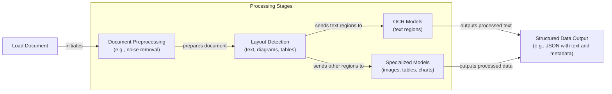

# Stop Converting Documents to Text. You're Doing It Wrong.

When I first started building AI agents, I hit a frustrating wall. I was comfortable manipulating text, but the moment I had to integrate multimodal data, such as images, audio, and especially documents like PDFs, my elegant architectures turned into messy hacks. I spent weeks building complex pipelines that tried to force everything into text. I chained OCR engines to scrape PDFs, layout detection models to identify tables, and separate classifiers to handle images. It was a brittle, slow, and expensive solution that broke every time a document layout changed.

The breakthrough came when I realized I was solving the wrong problem. I did not need to convert documents to text. I needed to treat them as images. Once I understood that every PDF page is effectively an image and that modern LLMs can “see” just as well as they can read, the complexity vanished. This shift is essential because real-world AI applications rarely exist in a text-only vacuum. Enterprise applications need to manipulate private data from warehouses and lakes that is inherently multimodal: financial reports with complex charts, technical diagrams, building sketches, and audio logs.

The old approach of normalizing everything to text is lossy. When you translate a complex diagram or a chart into text, you lose the spatial relationships, the colors, and the context. You lose the information that matters most. By processing data in its native format, we preserve this rich visual information, resulting in systems that are faster, cheaper, and significantly more performant. Ultimately, as data is made for humans, you want the LLM to process the data as close as a human would, which often is visually.

Here is what we will cover:

*   The limitations of traditional document processing.
*   The foundations of how multimodal LLMs work.
*   How to work with images and PDFs using the Gemini API.
*   The foundations of multimodal Retrieval-Augmented Generation (RAG).
*   How to implement a multimodal RAG system for images, PDFs, and text.
*   How to build a multimodal AI agent.

## Limitations of Traditional Document Processing

To cement the problem, let’s dig deeper into the limitations of traditional document processing for invoices, documentation, or reports. The core issue is that previous approaches tried to normalize everything to text before passing it to an AI model. This has many flaws, as we lose a substantial amount of information during translation. For example, when encountering diagrams, charts, or sketches in a document, it is impossible to fully reproduce them in text.

The traditional document processing workflow relies on a multi-step pipeline that often includes layout detection and Optical Character Recognition (OCR) [[1]](https://www.daft.ai/blog/end-to-end-distributed-pdf-processing-pipeline), [[2]](https://parseur.com/blog/document-processing-automation-guide).


Image 1: A flowchart illustrating the traditional document processing workflow using Layout detection and OCR.

This workflow has too many moving pieces. We need layout detection models, OCR models for text, and specialized models for each expected data structure, such as tables or charts. This makes the system rigid. If a document contains a chart type we do not have a model for, the pipeline fails. It is also slow and costly because we have to chain multiple model calls [[3]](https://learn.microsoft.com/en-us/answers/questions/5668164/why-traditional-ocr-fails-for-complex-business-doc?page=1).

Most importantly, we face performance challenges. The multi-step nature creates a cascade effect where errors compound at each stage. Advanced OCR engines struggle with handwritten text, poor scans, stylized fonts, or complex layouts like nested tables and building sketches [[4]](https://intuitionlabs.ai/articles/ai-pdf-data-extraction-clinical-research). Traditional OCR systems can have an accuracy as low as 60% on complex documents, and even modern enterprise APIs see performance drops on irregular layouts [[5]](https://jiffy.ai/overcoming-ocr-errors-and-limitations-with-intelligent-document-processing/), [[6]](https://www.llamaindex.ai/blog/ocr-accuracy).

https://substackcdn.com/image/fetch/$s_!nM40!,f_auto,q_auto:good,fl_progressive:steep/https%3A%2F%2Fsubstack-post-media.s3.amazonaws.com%2Fpublic%2Fimages%2Fa2dc40f3-dc13-486e-853d-8404368f4d8d_1616x1000.png 
Image 2: A building sketch showing a crawl space vent diagram, illustrating the complexity of layouts that classic OCR systems struggle to interpret. (Source [Vectorize.io](https://vectorize.io/blog/multimodal-rag-patterns))

This approach might work for highly specialized applications, but it has too many problems and does not scale in a world of flexible and fast AI agents.

Modern AI solutions use multimodal LLMs, such as Gemini, GPT-4o, or Claude, that can directly interpret text, images, or PDFs as native input. This completely bypasses the unstable OCR workflow. Thus, let’s understand how multimodal LLMs work.

## Foundations of Multimodal LLMs

To use LLMs with images and documents, you need an intuition of how multimodality works. You do not need to understand every research detail, but knowing the architecture helps you deploy, optimize, and monitor them. There are two common approaches to building multimodal LLMs: the Unified Embedding Decoder Architecture and the Cross-modality Attention Architecture [[7]](https://magazine.sebastianraschka.com/p/understanding-multimodal-llms).

https://substackcdn.com/image/fetch/$s_!js-e!,f_auto,q_auto:good,fl_progressive:steep/https%3A%2F%2Fsubstack-post-media.s3.amazonaws.com%2Fpublic%2Fimages%2F76f50b57-2585-4cb8-8dda-eea5b5f81c03_1456x854.jpeg 
Image 3: The two main approaches to developing multimodal LLM architectures. (Source [Understanding Multimodal LLMs](https://magazine.sebastianraschka.com/p/understanding-multimodal-llms) [[7]](https://magazine.sebastianraschka.com/p/understanding-multimodal-llms))

### Unified Embedding Decoder Architecture

In this approach, we encode the text and image separately, concatenate their embeddings into a single vector, and pass the resulting vector to the LLM. Thus, on top of a standard LLM architecture, you need a vision encoder that maps the image to an embedding that is within the same vector space as the text. When the text and image embeddings are merged, the LLM can make sense of both [[7]](https://magazine.sebastianraschka.com/p/understanding-multimodal-llms).

https://substackcdn.com/image/fetch/$s_!p-gT!,f_auto,q_auto:good,fl_progressive:steep/https%3A%2F%2Fsubstack-post-media.s3.amazonaws.com%2Fpublic%2Fimages%2Fa0979e82-2fb0-4f78-80c8-1395511e057f_1166x1400.jpeg 
Image 4: Illustration of the unified embedding decoder architecture. (Source [Understanding Multimodal LLMs](https://magazine.sebastianraschka.com/p/understanding-multimodal-llms) [[7]](https://magazine.sebastianraschka.com/p/understanding-multimodal-llms))

### Cross-modality Attention Architecture

In the second approach, instead of passing the image embeddings along with the text embeddings at the input, we inject them directly into the attention module. We still need an image encoder that projects the image into the same vector space as the text, but we inject it deeper within the architecture [[7]](https://magazine.sebastianraschka.com/p/understanding-multimodal-llms).

https://substackcdn.com/image/fetch/$s_!pf30!,f_auto,q_auto:good,fl_progressive:steep/https%3A%2F%2Fsubstack-post-media.s3.amazonaws.com%2Fpublic%2Fimages%2Fea1b9ee4-0d19-4c3c-89db-06e779653da2_1296x1338.jpeg 
Image 5: An illustration of the Cross-Modality Attention Architecture approach. (Source [Understanding Multimodal LLMs](https://magazine.sebastianraschka.com/p/understanding-multimodal-llms) [[7]](https://magazine.sebastianraschka.com/p/understanding-multimodal-llms))

### Image Encoders

Both architectures rely on image encoders. To understand them, we can draw a parallel between text tokenization and image patching. Just as we split text into sub-word tokens, we split images into patches [[7]](https://magazine.sebastianraschka.com/p/understanding-multimodal-llms).

https://substackcdn.com/image/fetch/$s_!oFRB!,f_auto,q_auto:good,fl_progressive:steep/https%3A%2F%2Fsubstack-post-media.s3.amazonaws.com%2Fpublic%2Fimages%2F4a7104c0-3986-4aae-b918-06c393ff824c_1456x1154.jpeg 
Image 6: Image tokenization and embedding (left) and text tokenization and embedding (right) side by side. (Source [Understanding Multimodal LLMs](https://magazine.sebastianraschka.com/p/understanding-multimodal-llms) [[7]](https://magazine.sebastianraschka.com/p/understanding-multimodal-llms))

The output has the same structure and dimensions as text embeddings. However, the embeddings need to be aligned in the same vector space. We do this through a linear projection module. Popular image encoder models include CLIP, OpenCLIP, and SigLIP [[8]](https://towardsdatascience.com/multimodal-ai-search-for-business-applications-65356d011009/). These encoders are also used in Multimodal RAG, allowing us to find semantic similarities between images and text [[9]](https://opensearch.org/blog/multimodal-semantic-search/).

This is the foundation for modern document RAG systems like ColPali, which bypasses OCR by treating document pages as images. While this approach is a paradigm shift, scaling it introduces new engineering trade-offs. Generating over a thousand vectors per page requires advanced optimization, such as using binary quantization and faster similarity metrics like hamming distance to manage storage and latency in production [[15]](https://qdrant.tech/blog/colpali-qdrant-optimization/), [[16]](https://blog.vespa.ai/scaling-colpali-to-billions/).

https://substackcdn.com/image/fetch/$s_!Z3FH!,f_auto,q_auto:good,fl_progressive:steep/https%3A%2F%2Fsubstack-post-media.s3.amazonaws.com%2Fpublic%2Fimages%2F3d4c837a-a3e5-4d60-97ce-c4d4faf4cf57_841x616.png 
Image 7: Toy representation of multimodal embedding space. (Source [Multimodal Embeddings: An Introduction](https://towardsdatascience.com/multimodal-embeddings-an-introduction-5dc36975966f/))

You can replicate the same strategy between different modalities, such as text, image, document, and audio vectors, as long as you have an encoder that maps the data in the same vector space.

The **Unified Embedding Decoder** approach is simpler to implement and generally yields higher accuracy in OCR-related tasks. The **Cross-modality Attention** approach is more computationally efficient for high-resolution images because we do not have to pass all tokens as an input sequence. Instead, we inject them directly into the attention mechanism. Hybrid approaches also exist to combine these benefits [[7]](https://magazine.sebastianraschka.com/p/understanding-multimodal-llms).

In 2025, most leading LLMs are multimodal. Open-source examples include Llama 4, Gemma, and Qwen [[10]](https://medium.com/data-science-in-your-pocket/2025-the-year-ai-reasoning-models-took-over-a-month-by-month-review-of-frontier-breakthroughs-6ea2163f854f). Closed-source examples include GPT, Gemini, and Claude [[11]](https://codedesign.ai/blog/the-ultimate-guide-to-the-top-large-language-models-in-2025/). This can be expanded to other modalities, such as PDFs, audio, or video, by hooking different encoders for each modality [[12]](https://sparkco.ai/blog/exploring-multimodal-llms-text-image-and-video-integration).

A quick note on **Multimodal LLMs vs. Diffusion Models**: Diffusion models like Midjourney generate images from noise. Multimodal LLMs like GPT understand images. Architecturally, multimodal LLMs are often transformer decoder-based for understanding, while diffusion models are iterative denoising networks for generation [[13]](https://arxiv.org/html/2409.14993v3). In an agent workflow, diffusion models are typically used as tools, not as the reasoning model [[14]](https://docs.anyscale.com/llm).

Now that we understand how LLMs can directly input images or documents, let’s see how this works in practice.

## Applying Multimodal LLMs to Images and PDFs

To better understand how multimodal LLMs work, let’s write a few examples using Gemini to show some best practices when working with images and PDFs. There are three core ways to process multimodal data with LLMs:

1.  **Raw bytes:** The easiest way to work with LLMs. However, when storing the item in a database, it can easily get corrupted as most databases interpret the input as text instead of bytes.
2.  **Base64:** A way to encode raw bytes as strings. This is useful for storing images or documents directly in a database without corruption. The downside is that the file size increases by approximately 33%.
3.  **URLs:** The standard for enterprise scenarios. You store data in a data lake like AWS S3 or GCP Buckets. The LLM downloads the media directly from the bucket. As the file never sees your server, this reduces network latency for your application. This is the most efficient option for scale.

Now, let’s dig into the code.

1.  First, we will display our sample image.
    
    ```python
    def display_image(image_path: Path) -> None:
        """
        Display an image from a file path in the notebook.
    
        Args:
            image_path: Path to the image file to display
    
        Returns:
            None
        """
    
        image = IPythonImage(filename=image_path, width=400)
        display(image)
    
    
    display_image(Path("images") / "image_1.jpeg")
    ```
    
    It outputs:

## References

- [1]  https://www.daft.ai/blog/end-to-end-distributed-pdf-processing-pipeline
- [2]  https://parseur.com/blog/document-processing-automation-guide
- [3]  https://learn.microsoft.com/en-us/answers/questions/5668164/why-traditional-ocr-fails-for-complex-business-doc?page=1
- [4]  https://intuitionlabs.ai/articles/ai-pdf-data-extraction-clinical-research
- [5]  https://jiffy.ai/overcoming-ocr-errors-and-limitations-with-intelligent-document-processing/
- [6]  https://www.llamaindex.ai/blog/ocr-accuracy
- [7]  https://magazine.sebastianraschka.com/p/understanding-multimodal-llms
- [8]  https://towardsdatascience.com/multimodal-ai-search-for-business-applications-65356d011009/
- [9]  https://opensearch.org/blog/multimodal-semantic-search/
- [10]  https://medium.com/data-science-in-your-pocket/2025-the-year-ai-reasoning-models-took-over-a-month-by-month-review-of-frontier-breakthroughs-6ea2163f854f
- [11]  https://codedesign.ai/blog/the-ultimate-guide-to-the-top-large-language-models-in-2025/
- [12]  https://sparkco.ai/blog/exploring-multimodal-llms-text-image-and-video-integration
- [13]  https://arxiv.org/html/2409.14993v3
- [14]  https://docs.anyscale.com/llm
- [15]  https://qdrant.tech/blog/colpali-qdrant-optimization/
- [16]  https://blog.vespa.ai/scaling-colpali-to-billions/