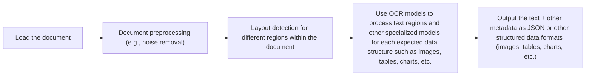

# Stop Converting Documents to Text. You're Doing It Wrong.

When I first started building AI agents, I hit a frustrating wall. I was comfortable manipulating text, but the moment I had to integrate multimodal data—images, audio, and especially documents like PDFs—my elegant architectures turned into messy hacks. I spent weeks building complex pipelines that tried to force everything into text. I chained Optical Character Recognition (OCR) engines to scrape PDFs, layout detection models to identify tables, and separate classifiers to handle images. It was a brittle, slow, and expensive solution that broke every time a document layout changed.

The breakthrough came when I realized I was solving the wrong problem. I didn’t need to convert documents to text. I needed to treat them as images. Once I understood that every PDF page is effectively an image and that modern LLMs can “see” just as well as they can read, the complexity vanished. I could completely skip the OCR purgatory and focus on the three core inputs of an LLM: text, images, and audio.

This shift is essential because real-world AI applications rarely exist in a text-only vacuum. Enterprise applications need to manipulate private data from warehouses and lakes that is inherently multimodal: financial reports with complex charts, medical diagnostics, technical diagrams, and building sketches [[39]](https://invisibletech.ai/blog/multimodal-enterprise-ai), [[41]](https://github.com/cognitivetech/llm-research-summaries/blob/main/models-review/A-Comprehensive-Survey-and-Guide-to-Multimodal-Large-Language-Models-in-Vision-Language-Tasks.md). The old approach of normalizing everything to text is lossy. When you translate a complex diagram into text, you lose the spatial relationships, the colors, and the context. You lose the information that matters most [[39]](https://invisibletech.ai/blog/multimodal-enterprise-ai). By processing data in its native format, we preserve this rich visual information, resulting in systems that are faster, cheaper, and more performant.

In this lesson, we will cover:
- The limitations of traditional document processing.
- The foundations of how multimodal LLMs work.
- Practical implementation of multimodal tasks with images and PDFs.
- How to build a multimodal RAG system.
- A step-by-step guide to building a multimodal ReAct agent.

## Limitations of Traditional Document Processing

To cement the problem, let’s dig deeper into the limitations of traditional document processing for tasks like handling invoices, documentation, or reports. The core issue is that previous approaches tried to normalize everything to text before passing it to an AI model [[52]](https://www.decodingai.com/p/stop-converting-documents-to-text). This has many flaws, as we lose a substantial amount of information during the translation. For example, when encountering diagrams, charts, or sketches, it is impossible to fully reproduce them in text.

A traditional document processing workflow relies on a multi-step pipeline to extract and structure information [[50]](https://intuitionlabs.ai/articles/ai-pdf-data-extraction-clinical-research), [[46]](https://www.daft.ai/blog/end-to-end-distributed-pdf-processing-pipeline).


Image 1: A flowchart illustrating the traditional document processing workflow.

This workflow has too many moving pieces. We need layout detection models, OCR models for text, and specialized models for each expected data structure, such as tables or charts. This makes the system rigid; if a document contains a chart type we don’t have a model for, the pipeline fails [[47]](https://learn.microsoft.com/en-us/answers/questions/5668164/why-traditional-ocr-fails-for-complex-business-doc?page=1). It is also slow and costly because we have to chain multiple model calls. Most importantly, we face significant performance challenges.

The multi-step nature creates a cascade effect where errors compound at each stage. Advanced OCR engines struggle with handwritten text, poor scans, stylized fonts, or complex layouts like nested tables and building sketches [[50]](https://intuitionlabs.ai/articles/ai-pdf-data-extraction-clinical-research), [[1]](https://www.llamaindex.ai/blog/ocr-accuracy). Even with high-quality scanners, OCR-based solutions can have an accuracy as low as 60%, requiring extensive manual correction [[3]](https://jiffy.ai/overcoming-ocr-errors-and-limitations-with-intelligent-document-processing/). For instance, a 5-degree tilt in a scanned document can increase the word error rate by 15% or more [[1]](https://www.llamaindex.ai/blog/ocr-accuracy).
Image 2: A building sketch showing a crawl space vent diagram, illustrating the complexity of layouts that classic OCR systems struggle to interpret. (Source [Vectorize.io](https://vectorize.io/blog/multimodal-rag-patterns))

This approach might work for highly specialized applications, but it has too many problems and does not scale in a world of AI agents that need to be flexible and fast. Modern AI solutions use multimodal LLMs, such as Gemini, GPT-4o, or Claude, which can directly interpret text, images, and PDFs as native inputs, completely bypassing this unstable OCR workflow [[52]](https://www.decodingai.com/p/stop-converting-documents-to-text). Thus, let’s understand how they work.

## Foundations of Multimodal LLMs

Before we write any code, you need an intuition of how multimodality works. You do not need to understand every research detail, but knowing the architecture helps you deploy, optimize, and monitor these models. There are two common approaches to building multimodal LLMs: the Unified Embedding Decoder Architecture and the Cross-modality Attention Architecture [[21]](https://magazine.sebastianraschka.com/p/understanding-multimodal-llms), [[36]](https://magazine.sebastianraschka.com/p/understanding-multimodal-llms).
Image 3: The two main approaches to developing multimodal LLM architectures. (Source [Understanding Multimodal LLMs](https://magazine.sebastianraschka.com/p/understanding-multimodal-llms) [[21]](https://magazine.sebastianraschka.com/p/understanding-multimodal-llms))

### Unified Embedding Decoder Architecture

In this approach, we encode text and images separately, concatenate their embeddings into a single vector, and pass the result to the LLM [[21]](https://magazine.sebastianraschka.com/p/understanding-multimodal-llms). On top of a standard LLM, you need a vision encoder that maps the image to an embedding in the same vector space as the text. When the text and image embeddings are merged, the LLM can make sense of both.
Image 4: Illustration of the unified embedding decoder architecture. (Source [Understanding Multimodal LLMs](https://magazine.sebastianraschka.com/p/understanding-multimodal-llms) [[21]](https://magazine.sebastianraschka.com/p/understanding-multimodal-llms))

### Cross-modality Attention Architecture

In the second approach, instead of passing image embeddings with text embeddings at the input, we inject them directly into the attention module of the LLM [[21]](https://magazine.sebastianraschka.com/p/understanding-multimodal-llms). We still need an image encoder to project the image into the same vector space, but it is injected deeper within the architecture.
Image 5: An illustration of the Cross-Modality Attention Architecture approach. (Source [Understanding Multimodal LLMs](https://magazine.sebastianraschka.com/p/understanding-multimodal-llms) [[21]](https://magazine.sebastianraschka.com/p/understanding-multimodal-llms))

### Image Encoders

Both architectures rely on image encoders, which function similarly to text tokenizers. Just as we split text into sub-word tokens, we split images into patches [[21]](https://magazine.sebastianraschka.com/p/understanding-multimodal-llms).
Image 6: Image tokenization and embedding (left) and text tokenization and embedding (right) side by side. (Source [Understanding Multimodal LLMs](https://magazine.sebastianraschka.com/p/understanding-multimodal-llms) [[21]](https://magazine.sebastianraschka.com/p/understanding-multimodal-llms))

Each patch is then processed by a vision transformer (ViT) to generate an embedding. The output embeddings have the same structure and dimensions as text embeddings. However, to ensure they are aligned in the same vector space, a linear projection module is used [[21]](https://magazine.sebastianraschka.com/p/understanding-multimodal-llms). Popular image encoders like CLIP, OpenCLIP, and SigLIP leverage this core architecture [[57]](https://towardsdatascience.com/multimodal-ai-search-for-business-applications-65356d011009), [[35]](https://artsmart.ai/blog/top-embedding-models-in-2025/).

These encoders are also used in multimodal RAG to find semantic similarities between images and text. This allows you to run similarity metrics between text, image, document, and audio vectors in a shared embedding space [[56]](https://opensearch.org/blog/multimodal-semantic-search/), [[57]](https://towardsdatascience.com/multimodal-ai-search-for-business-applications-65356d011009).
Image 7: Toy representation of a multimodal embedding space where text and images are aligned. (Source [Multimodal Embeddings: An Introduction](https://towardsdatascience.com/multimodal-embeddings-an-introduction-5dc36975966f/) [[57]](https://towardsdatascience.com/multimodal-ai-search-for-business-applications-65356d011009))

The **Unified Embedding Decoder** approach is simpler to implement and generally yields higher accuracy in OCR-related tasks. The **Cross-modality Attention** approach is more computationally efficient for high-resolution images because it injects tokens directly into the attention mechanism rather than passing them all as input. Hybrid approaches also exist to combine these benefits [[36]](https://magazine.sebastianraschka.com/p/understanding-multimodal-llms), [[37]](https://arxiv.org/abs/2409.11402).

In 2025, most leading LLMs are multimodal. Open-source examples include Llama 4, Gemma, and Qwen, while closed-source models include GPT, Gemini, and Claude [[22]](https://medium.com/data-science-in-your-pocket/2025-the-year-ai-reasoning-models-took-over-a-month-by-month-review-of-frontier-breakthroughs-6ea2163f854f), [[23]](https://codedesign.ai/blog/the-ultimate-guide-to-the-top-large-language-models-in-2025/). This concept can be extended to other modalities like PDFs, audio, and video by integrating specialized encoders for each data type [[27]](https://sparkco.ai/blog/exploring-multimodal-llms-text-image-and-video-integration), [[28]](https://www.emergentmind.com/topics/multimodal-llms).

It is also important to distinguish multimodal LLMs from diffusion models like Midjourney or Stable Diffusion. Diffusion models generate images from noise, while multimodal LLMs understand them. Architecturally, they are different. In an agent workflow, diffusion models are typically used as tools, not as the core reasoning model [[19]](https://arxiv.org/html/2409.14993v3).

Now that we understand how LLMs can directly process images or documents, let’s see how this works in practice.

## Applying Multimodal LLMs to Images and PDFs

To better understand how multimodal LLMs work, let’s write a few examples using Gemini to show some best practices when working with images and PDFs. There are three core ways to process multimodal data with LLMs: as raw bytes, Base64-encoded strings, and URLs.

-   **Raw bytes:** This is the easiest method for one-off API calls. However, storing raw bytes in a database can lead to corruption because many databases interpret the input as text instead of bytes.
-   **Base64:** This method encodes raw bytes as strings, allowing you to store images or documents in databases like PostgreSQL or MongoDB without corruption. The main downside is that the file size increases by approximately 33%.
-   **URLs:** This is the standard for enterprise scenarios. Data is stored in a data lake like AWS S3 or Google Cloud Storage, and the LLM downloads the media directly. This reduces network latency for your application, as the file does not pass through your server, making it the most efficient option at scale [[11]](https://cloud.google.com/blog/products/data-analytics/how-to-use-an-llm-to-create-data-schemas-in-bigquery).

```mermaid
flowchart TD
    subgraph "Method 1: Base64 + Database"
        A[Client] --> B{Application Server};
        B --> C[Database (e.g., PostgreSQL)];
        C -- "Retrieve Base64 String" --> B;
        B -- "Pass Base64 to LLM" --> D((LLM API));
    end

    subgraph "Method 2: URL + Data Lake"
        E[Client] --> F{Application Server};
        F -- "Retrieve URL" --> G[Database];
        F -- "Pass URL to LLM" --> H((LLM API));
        I[Data Lake (e.g., S3/GCS)] -- "LLM Downloads Directly" --> H;
    end
```
Image 8: A diagram comparing the data flow for Base64 with a database versus URLs with a data lake.

For one-off LLM calls without storage, raw bytes work well. For storing data directly in a database, Base64 is a reliable option. For scalable enterprise applications, using URLs pointing to a data lake is the most efficient approach. Now, let’s dig into the code.

1.  First, we display our sample image.
    
    
    Image 9: A photorealistic rendering of a large robot interacting with a small kitten.
    
2.  Next, we define a helper function to load an image as raw bytes. We use the `WEBP` format because it is efficient.
    
    ```python
    def load_image_as_bytes(
        image_path: Path, format: Literal["WEBP", "JPEG", "PNG"] = "WEBP", max_width: int = 600, return_size: bool = False
    ) -> bytes | tuple[bytes, tuple[int, int]]:
        """
        Load an image from file path and convert it to bytes with optional resizing.
    
        Args:
            image_path: Path to the image file to load
            format: Output image format (WEBP, JPEG, or PNG). Defaults to "WEBP"
            max_width: Maximum width for resizing. If image width exceeds this, it will be resized proportionally. Defaults to 600
            return_size: If True, returns both bytes and image size tuple. Defaults to False
    
        Returns:
            bytes: Image data as bytes, or tuple of (bytes, (width, height)) if return_size is True
        """
    
        image = PILImage.open(image_path)
        if image.width > max_width:
            ratio = max_width / image.width
            new_size = (max_width, int(image.height * ratio))
            image = image.resize(new_size)
    
        byte_stream = io.BytesIO()
        image.save(byte_stream, format=format)
    
        if return_size:
            return byte_stream.getvalue(), image.size
    
        return byte_stream.getvalue()
    ```
    
    We can now load the image and see its byte representation and size.
    
    ```python
    image_bytes = load_image_as_bytes(image_path=Path("images") / "image_1.jpeg", format="WEBP")
    ```
    
    It outputs:
    
    ```text
    Bytes `b'RIFF`\xad\x00\x00WEBPVP8 T\xad\x00\x00P\xec\x02\x9d\x01*X\x02X\x02'...`
    Size: 44392 bytes
    ```
    
    We can then call the LLM to generate a caption or compare multiple images.
    
    ```python
    # Single image captioning
    response = client.models.generate_content(
        model=MODEL_ID,
        contents=[
            types.Part.from_bytes(
                data=image_bytes,
                mime_type="image/webp",
            ),
            "Tell me what is in this image in one paragraph.",
        ],
    )
    
    # Comparing multiple images
    response_diff = client.models.generate_content(
        model=MODEL_ID,
        contents=[
            types.Part.from_bytes(
                data=load_image_as_bytes(image_path=Path("images") / "image_1.jpeg", format="WEBP"),
                mime_type="image/webp",
            ),
            types.Part.from_bytes(
                data=load_image_as_bytes(image_path=Path("images") / "image_2.jpeg", format="WEBP"),
                mime_type="image/webp",
            ),
            "What's the difference between these two images? Describe it in one paragraph.",
        ],
    )
    ```
    
    The outputs are:
    
    ```text
    Caption: This striking image features a massive, dark metallic robot...
    
    Difference: The primary difference between the two images lies in the nature of the interaction...
    ```
    
3.  We can also process the image as a **Base64 encoded string**. The logic is similar, but we encode the bytes first.
    
    ```python
    def load_image_as_base64(
        image_path: Path, format: Literal["WEBP", "JPEG", "PNG"] = "WEBP", max_width: int = 600, return_size: bool = False
    ) -> str:
        # ... (implementation from notebook)
        image_bytes = load_image_as_bytes(image_path=image_path, format=format, max_width=max_width, return_size=False)
        return base64.b64encode(image_bytes).decode("utf-8")
    
    image_base64 = load_image_as_base64(image_path=Path("images") / "image_1.jpeg", format="WEBP")
    ```
    
    The Base64 string is about 33% larger than the raw bytes.
    
    ```python
    print(f"Image as Base64 is {(len(image_base64) - len(image_bytes)) / len(image_bytes) * 100:.2f}% larger than as bytes")
    ```
    
    It outputs:
    
    ```text
    Image as Base64 is 33.34% larger than as bytes
    ```
    
4.  For **public URLs**, Gemini's `url_context` tool can automatically parse web pages, PDFs, and images.
    
    ```python
    response = client.models.generate_content(
        model=MODEL_ID,
        contents="Based on the provided paper as a PDF, tell me how ReAct works: https://arxiv.org/pdf/2210.03629",
        config=types.GenerateContentConfig(tools=[{"url_context": {}}]),
    )
    ```
    
    It outputs:
    
    ```text
    ReAct is a novel paradigm for large language models (LLMs) that combines reasoning (Thought) and acting (Action) in an interleaved manner...
    ```
    
5.  When working with **private data lakes**, Gemini integrates well with Google Cloud Storage. You provide the GCS URI directly to the model.
    
    ```python
    # Mocked example
    response = client.models.generate_content(
        model=MODEL_ID,
        contents=[
            types.Part.from_uri(uri="gs://gemini-images/image_1.jpeg", mime_type="image/webp"),
            "Tell me what is in this image in one paragraph.",
        ],
    )
    ```
    
6.  For a more complex task, we can perform **Object Detection**. We use Pydantic, which we covered in Lesson 4, to define the output structure.
    
    ```python
    from pydantic import BaseModel, Field
    
    class BoundingBox(BaseModel):
        ymin: float
        xmin: float
        ymax: float
        xmax: float
        label: str = Field(...)
    
    class Detections(BaseModel):
        bounding_boxes: list[BoundingBox]
    
    prompt = """
    Detect all of the prominent items in the image. 
    The box_2d should be [ymin, xmin, ymax, xmax] normalized to 0-1000.
    Also, output the label of the object found within the bounding box.
    """
    
    config = types.GenerateContentConfig(
        response_mime_type="application/json",
        response_schema=Detections,
    )
    
    response = client.models.generate_content(
        model=MODEL_ID,
        contents=[
            types.Part.from_bytes(data=image_bytes, mime_type="image/webp"),
            prompt,
        ],
        config=config,
    )
    ```
    
    The model returns structured Pydantic objects, which we can then visualize.
    
    
    Image 10: Visualization of bounding boxes for the kitten and robot detected by the LLM.
    
7.  Processing **PDFs** is nearly identical to processing images. We can pass the PDF as bytes to get a summary.
    
    ```python
    pdf_bytes = (Path("pdfs") / "attention_is_all_you_need_paper.pdf").read_bytes()
    
    response = client.models.generate_content(
        model=MODEL_ID,
        contents=[
            types.Part.from_bytes(data=pdf_bytes, mime_type="application/pdf"),
            "What is this document about? Provide a brief summary of the main topics.",
        ],
    )
    ```
    
    It outputs:
    
    ```text
    This document introduces the **Transformer**, a novel neural network architecture designed for **sequence transduction tasks**...
    ```
    
8.  Finally, we can perform **object detection on PDF pages** by treating them as images. This is powerful for extracting diagrams or tables without traditional OCR. This concept was popularized by the ColPali paper, which demonstrated that modern Vision Language Models (VLMs) can retrieve documents more effectively by “looking” at them rather than by extracting text [[62]](https://arxiv.org/pdf/2407.01449v6).
    
    
    Image 11: Bounding box detection for the Transformer architecture diagram on a page of the "Attention Is All You Need" paper.
    

## Foundations of Multimodal RAG

One of the most common use cases for multimodal data is Retrieval-Augmented Generation (RAG), which we explored in Lesson 10. When building custom AI applications, you will often need to retrieve private company data to feed into your LLM. For large formats like images or PDFs, RAG is crucial. Stuffing a 1,000-page PDF into an LLM to answer a simple question is unfeasible due to cost, latency, and performance degradation.

A generic multimodal RAG architecture for images and text involves two main phases:

-   **Ingestion:** Images are embedded using a text-image embedding model, and these embeddings are stored in a vector database.
-   **Retrieval:** A user's text query is embedded using the same model. The vector database is then queried to find the most similar images based on the distance between the query embedding and the image embeddings.

Because the text and image embeddings exist in the same vector space, this works for any combination: text-to-image, image-to-text, or image-to-image search. This technique is heavily used in image search engines like Google Photos, where a query like "pictures of dogs" returns relevant images without relying on manual tags [[56]](https://opensearch.org/blog/multimodal-semantic-search/).

```mermaid
flowchart TD
    subgraph Ingestion (Offline)
        A[Image Documents] --> B{Multimodal Embedding Model};
        B --> C[Image Embeddings];
        C --> D[(Vector Database)];
    end

    subgraph Retrieval (Online)
        E[User Text Query] --> F{Multimodal Embedding Model};
        F --> G[Query Embedding];
        G -- "Similarity Search" --> D;
        D -- "Top-K Similar Images" --> H[Retrieved Images];
    end
```
Image 12: A diagram illustrating the ingestion and retrieval pipelines of a multimodal RAG system.

For our enterprise use case of performing RAG on documents, the state-of-the-art architecture in 2025 is ColPali [[62]](https://arxiv.org/pdf/2407.01449v6). It bypasses the entire OCR pipeline by processing document images directly with vision-language models, preserving the rich visual context of tables, figures, and layouts.

ColPali's architecture includes several key patterns:
-   **Offline Indexing:** Document pages are converted to images, divided into patches, and embedded into a "bag-of-embeddings" representation.
-   **Online Querying:** It uses a late interaction mechanism (MaxSim) to compute similarities between individual query tokens and document patches, providing fine-grained matching.
-   **Models:** ColPali is based on the PaliGemma-3B model with a SigLIP vision encoder.

The late interaction mechanism is the core of ColPali's retrieval performance. For each token in the query, the MaxSim operator finds the highest similarity score against all patches in the document image. These maximum scores are then summed up to produce the final relevance score for the document. This process is fully differentiable, allowing the model to be trained end-to-end with a contrastive loss function [[62]](https://arxiv.org/pdf/2407.01449v6).

This approach is significantly more accurate, achieving an 81.3% average nDCG@5 score on the ViDoRe benchmark. It is also 2-10 times faster than traditional OCR pipelines, a concrete speedup demonstrated during indexing: a typical OCR-based parser can take over 7 seconds per page, while ColPali processes the same page in under 0.4 seconds [[74]](https://learnopencv.com/multimodal-rag-with-colpali/), [[75]](https://arxiv.org/html/2407.01449v4).
Image 13: A comparison of the standard retrieval pipeline versus the simplified and more efficient ColPali architecture. (Source [ColPali: Efficient Document Retrieval with Vision Language Models](https://arxiv.org/pdf/2407.01449v6) [[62]](https://arxiv.org/pdf/2407.01449v6))

Beyond performance, ColPali offers unique advantages and introduces new trade-offs. Its late-interaction mechanism provides interpretability; by visualizing the similarity scores as a heatmap over the document image, you can see exactly which visual patches the model considered most relevant for each query term [[62]](https://arxiv.org/pdf/2407.01449v6). However, the model has limitations. It was primarily trained on clean, PDF-like documents and its performance may be less impressive on noisy scans or handwritten notes [[76]](https://blog.vespa.ai/the-rise-of-vision-driven-document-retrieval-for-rag/). Furthermore, while fast, the MaxSim operation is computationally intensive at scale and can become a bottleneck in production systems requiring sub-100ms latencies on large corpora [[77]](https://www.linkedin.com/posts/victorialslocum_%F0%9D%97%9F%F0%9D%97%AE%F0%9D%98%81%F0%9D%97%B2-%F0%9D%97%B6%F0%9D%97%BB%F0%9D%98%81%F0%9D%97%B2%F0%9D%97%BF%F0%9D%97%AE%F0%9D%97%B0%F0%9D%98%81%F0%9D%97%B6%F0%9D%97%BC%F0%9D%97%BB-%F0%9D%97%BA%F0%9D%97%BC%F0%9D%97%B1%F0%9D%97%B2%F0%9D%97%B9%F0%9D%98%80-activity-7434988170519355394-DPEd).

## Implementing Multimodal RAG

Let's build a simple multimodal RAG system to connect all the dots. We will populate an in-memory vector database with images from our `images` folder, including pages from the "Attention Is All You Need" paper, and then query it with text questions.

```mermaid
flowchart TD
    subgraph Ingestion
        A[Images & PDF Pages] --> B{Generate Descriptions (Gemini)};
        B --> C{Embed Descriptions (Gemini)};
        C --> D[(In-Memory Vector Index)];
    end

    subgraph Retrieval
        E[Text Query] --> F{Embed Query (Gemini)};
        F -- "Cosine Similarity" --> D;
        D -- "Top-1 Result" --> G[Retrieved Image];
    end
```
Image 14: The architecture of our simplified multimodal RAG example.

1.  First, we define a function to create our vector index. Since the Gemini API used in this notebook does not support direct image embeddings, we will generate a text description for each image and embed that instead. While not ideal, the overall RAG architecture remains the same. With a multimodal embedding model like Voyage or OpenAI's CLIP, you would simply embed the image bytes directly.
    
    ```python
    def create_vector_index(image_paths: list[Path]) -> list[dict]:
        """
        Create embeddings for images by generating descriptions and embedding them.
        """
    
        vector_index = []
        for image_path in image_paths:
            image_bytes = load_image_as_bytes(image_path, format="WEBP", return_size=False)
    
            image_description = generate_image_description(image_bytes)
    
            # IMPORTANT NOTE: With a multimodal embedding model, we would directly
            # embed `image_bytes` here instead of the description.
            image_embedding = embed_text_with_gemini(image_description)
    
            vector_index.append(
                {
                    "content": image_bytes,
                    "type": "image",
                    "filename": image_path,
                    "description": image_description,
                    "embedding": image_embedding,
                }
            )
    
        return vector_index
    ```
    
2.  We also need functions to generate the image descriptions and embed the text.
    
    ```python
    def generate_image_description(image_bytes: bytes) -> str:
        # ... (implementation from notebook)
    
    def embed_text_with_gemini(content: str) -> np.ndarray | None:
        # ... (implementation from notebook)
    ```
    
3.  Now, we create the `vector_index` from all the `.jpeg` files in our `images` directory.
    
    ```python
    image_paths = list(Path("images").glob("*.jpeg"))
    vector_index = create_vector_index(image_paths)
    ```
    
4.  Next, we define our search function, which embeds a text query and uses cosine similarity to find the most relevant image from our index.
    
    ```python
    from sklearn.metrics.pairwise import cosine_similarity
    
    def search_multimodal(query_text: str, vector_index: list[dict], top_k: int = 3) -> list[Any]:
        # ... (implementation from notebook)
    ```
    
5.  Let's test it with a query about the Transformer architecture.
    
    ```python
    query = "what is the architecture of the transformer neural network?"
    results = search_multimodal(query, vector_index, top_k=1)
    ```
    
    The system correctly retrieves the page containing the Transformer model diagram with a similarity score of 0.744.
    
    
    Image 15: The retrieved PDF page showing the Transformer architecture, matching the text query.
    
6.  Let's try another query to find the image of a kitten with a robot.
    
    ```python
    query = "a kitten with a robot"
    results = search_multimodal(query, vector_index, top_k=1)
    ```
    
    It successfully finds the correct image with a high similarity score of 0.811.
    
    
    Image 16: The retrieved image of a kitten and a robot, matching the text query.
    
By treating all visual content as images, we used the same vector index to search for both photos and PDF pages. This powerful pattern can be extended to other visual data, like video frames or spectrograms of audio data. Extending this pattern to video is not just theoretical. Frameworks like **VideoRAG** are designed to comprehend multi-hour videos by fusing graph-based reasoning with multimodal retrieval. Instead of processing every frame, which is computationally prohibitive, VideoRAG creates a hybrid index of key visual, auditory, and textual signals. This allows an LLM to efficiently reason across long-form content without requiring retraining or massive context windows [[78]](https://learnopencv.com/videorag-long-context-video-comprehension/).

## Building Multimodal AI Agents

To take this a step further, we can integrate our RAG functionality into a ReAct agent as a tool, consolidating most of the skills learned in Part 1 of this course. An agent can be made multimodal by adding multimodal inputs to its reasoning LLM or by giving it access to multimodal tools, such as our RAG retriever.

In this example, we will build a ReAct agent using LangGraph's `create_react_agent()` and connect our `search_multimodal` function as a tool. We will then ask the agent about the color of the kitten from our dataset.

```mermaid
flowchart TD
    A[User Query: "what color is my kitten?"] --> B(ReAct Agent);
    B -- "Thought: I need to find an image of a kitten" --> C{Tool Call: multimodal_search_tool};
    C -- "Query: 'my kitten'" --> D[RAG System];
    D -- "Retrieves Image" --> C;
    C -- "Observation: Image of gray kitten" --> B;
    B -- "Thought: The kitten in the image is gray" --> E[Final Answer];
```
Image 17: The reasoning flow of our multimodal agent using RAG as a tool.

1.  First, we define the `multimodal_search_tool` using LangChain's `@tool` decorator, which wraps our `search_multimodal` function.
    
    ```python
    from langchain_core.tools import tool
    
    @tool
    def multimodal_search_tool(query: str) -> dict[str, Any]:
        """
        Search through a collection of images and their text descriptions to find relevant content.
        """
        results = search_multimodal(query, vector_index, top_k=1)
        # ... (formatting logic from notebook)
    ```
    
2.  Next, we define a function to build our ReAct agent. We provide a system prompt that guides the agent on how to use the search tool for visual questions. We will cover LangGraph in more detail in Part 2 of the course.
    
    ```python
    from langgraph.prebuilt import create_react_agent
    from langchain_google_genai import ChatGoogleGenerativeAI
    
    def build_react_agent() -> Any:
        tools = [multimodal_search_tool]
        system_prompt = """You are a helpful AI assistant that can search through images and text to answer questions.
        
        When asked about visual content like animals, objects, or scenes:
        1. Use the multimodal_search_tool to find relevant images and descriptions
        2. Carefully analyze the image or image descriptions from the search results
        3. Provide a clear, direct answer based on the search results
        """
        agent = create_react_agent(
            model=ChatGoogleGenerativeAI(model="gemini-2.5-pro", temperature=0.1),
            tools=tools,
            prompt=system_prompt,
        )
        return agent
    
    react_agent = build_react_agent()
    ```
    
3.  Finally, we ask our agent the question: "what color is my kitten?"
    
    ```python
    test_question = "what color is my kitten?"
    response = react_agent.invoke(input={"messages": test_question})
    ```
    
    The agent correctly reasons that it needs to search for an image of a kitten, calls the `multimodal_search_tool` with the query "my kitten," retrieves the correct image, and provides the final answer.
    
    It outputs:
    
    ```text
    Based on the image, your kitten is a gray tabby. It has soft, short gray fur with darker tabby stripe patterns.
    ```
    
    When deploying such agents in production, especially with personal photos or sensitive documents, privacy becomes a critical concern. An emerging architectural pattern is to use edge computing, which processes data locally on a user's device. This ensures sensitive information never leaves the device, enabling a "private by design" approach that inherently enhances security, reduces network latency, and helps comply with data regulations [[79]](https://www.getmonetizely.com/articles/how-is-edge-computing-transforming-agentic-ai-through-local-intelligence-deployment).
    
    This simple example demonstrates how to give agents "eyes" by connecting them to a multimodal RAG system, allowing them to reason about and answer questions based on visual information.

## Conclusion

Working with multimodal data is a fundamental skill for AI engineers. Modern AI applications rarely exist in a text-only vacuum; they interact with the complex, visual, and auditory reality of the world. In this lesson, we moved away from the unstable, multi-step OCR pipelines of the past and learned that modern LLMs can natively process images and documents, preserving rich context that was previously lost.

This concludes Part 1 of our course on AI agent foundations. We started by understanding the difference between workflows and agents, mastered context engineering and structured outputs, built robust planning capabilities with ReAct, and finally gave our agents eyes and ears. You now have the foundational blocks to build production-ready AI systems.

In Part 2, we will move from theory to practice and begin building the course's central project: an interconnected research and writing agent system. We will start with a deep dive into agentic design patterns and modern frameworks like LangGraph, then implement the research and writing agents, and finally orchestrate the complete multi-agent pipeline.

## References

- [1] OCR Accuracy Explained: How to Improve It. (2026, April 1). LlamaIndex. https://www.llamaindex.ai/blog/ocr-accuracy
- [2] What Is Optical Character Recognition (OCR)?. (2023, November 21). Roboflow Blog. https://blog.roboflow.com/what-is-optical-character-recognition-ocr/
- [3] Overcoming OCR errors and limitations with intelligent document processing. (n.d.). JIFFY.ai. https://jiffy.ai/overcoming-ocr-errors-and-limitations-with-intelligent-document-processing/
- [4] unstructured.io. (2024, October 24). Unstructured Leads in Document Parsing Quality, Benchmarks Tell the Full Story. https://unstructured.io/blog/unstructured-leads-in-document-parsing-quality-benchmarks-tell-the-full-story
- [5] Why OCR technology fails on real-world documents and how intelligent document processing can help. (n.d.). Netfira. https://netfira.com/why-ocr-technology-fails-on-real-world-documents-and-how-intelligent-document-processing-can-help/
- [6] ChatGPT in Financial Analysis. (n.d.). Konfuzio. https://konfuzio.com/en/chatgpt-financial-analysis/
- [7] Medical Imaging White Paper NVIDIA and Lenovo. (n.d.). Lenovo. https://techtoday.lenovo.com/sites/default/files/2025-05/Medical%20Imaging%20White%20Paper%20NVIDIA%20and%20Lenovo.pdf
- [8] Understanding Financial Reports with Hierarchical Summarization. (2023). IJCAI. https://www.ijcai.org/proceedings/2023/0581.pdf
- [9] The Human Element in the Loop: The Irreplaceable Role of EPOCH in AI-driven Financial Services. (2025). arXiv. https://arxiv.org/html/2503.22035v1
- [10] 10 real-world examples of AI in healthcare. (2022, November 24). Philips. https://www.philips.com/a-w/about/news/archive/features/2022/20221124-10-real-world-examples-of-ai-in-healthcare.html
- [11] How to use an LLM to create data schemas in BigQuery. (2024, March 14). Google Cloud Blog. https://cloud.google.com/blog/products/data-analytics/how-to-use-an-llm-to-create-data-schemas-in-bigquery
- [12] Integrating Multimodal Data into a Large Language Model. (2024, August 29). Towards Data Science. https://towardsdatascience.com/integrating-multimodal-data-into-a-large-language-model-d1965b8ab00c/
- [13] A Survey on Data Management for Multimodal Large Language Models. (2025). arXiv. https://arxiv.org/html/2505.18458v1
- [14] Dey, S. (2024, July 1). Multimodal RAG architecture. LinkedIn. https://www.linkedin.com/posts/sayandey01_generativeai-llm-rag-activity-7412381316106760192-nFx3
- [15] Evaluating Multimodal vs. Text-Based Retrieval for RAG with Snowflake Cortex. (2025, April 21). Snowflake. https://www.snowflake.com/en/engineering-blog/arctic-agentic-rag-multimodal-pdf-retrieval/
- [16] Multimodal RAG. (n.d.). Pathway. https://pathway.com/developers/templates/rag/multimodal-rag
- [17] Aggarwal, G. (2024, July 3). MMCTAgent enables multimodal reasoning. LinkedIn. https://www.linkedin.com/posts/gauravagg_mmctagent-enables-multimodal-reasoning-over-activity-7413983881181339648--PyD
- [18] Multimodal RAG Explained: From Text to Images and Beyond. (2024, June 12). USAII. https://www.usaii.org/ai-insights/multimodal-rag-explained-from-text-to-images-and-beyond
- [19] A Survey on Multimodal Large Language Models. (2024). arXiv. https://arxiv.org/html/2409.14993v3
- [20] LLMs. (n.d.). Anyscale. https://docs.anyscale.com/llm
- [21] Raschka, S. (2024, November 3). Understanding Multimodal LLMs. Ahead of AI. https://magazine.sebastianraschka.com/p/understanding-multimodal-llms
- [22] 2025: The Year AI Reasoning Models Took Over. (2025, August 1). Medium. https://medium.com/data-science-in-your-pocket/2025-the-year-ai-reasoning-models-took-over-a-month-by-month-review-of-frontier-breakthroughs-6ea2163f854f
- [23] The Ultimate Guide to the Top Large Language Models in 2025. (2025, July 15). CodeDesign.ai. https://codedesign.ai/blog/the-ultimate-guide-to-the-top-large-language-models-in-2025/
- [24] Progressive Thinker. (2025, August 22). This is the most essential breakdown of 2025. LinkedIn. https://www.linkedin.com/posts/progressivethinker_this-is-the-most-essential-breakdown-of-2025-activity-7376654335319117825-a5aD
- [25] A Comprehensive Survey of Frontier-Class Open-Weight Large Language Models for Code. (2025). Preprints.org. https://www.preprints.org/manuscript/202508.1904
- [26] Ultimate 2025 AI Language Models Comparison: GPT5, GPT-4, Claude, Gemini, Sonar & more. (2025, July 1). Promptitude. https://www.promptitude.io/post/ultimate-2025-ai-language-models-comparison-gpt5-gpt-4-claude-gemini-sonar-more
- [27] Exploring Multimodal LLMs: Text, Image, and Video Integration. (2024, October 28). SparkCognition. https://sparkco.ai/blog/exploring-multimodal-llms-text-image-and-video-integration
- [28] Multimodal LLMs. (n.d.). Emergent Mind. https://www.emergentmind.com/topics/multimodal-llms
- [29] Enhancing LLM Capabilities: The Power of Multimodal LLMs and RAG. (2024, May 15). Towards AI. https://towardsai.net/p/l/enhancing-llm-capabilities-the-power-of-multimodal-llms-and-rag
- [30] A Comprehensive Survey on Multimodal Large Language Models: Techniques, Applications and Challenges. (2024). arXiv. https://arxiv.org/html/2411.06284v3
- [31] How to Choose the Best Embedding Model for RAG in 2026: 10 Models Benchmarked. (2026, March 25). Milvus. https://milvus.io/blog/choose-embedding-model-rag-2026.md
- [32] What's the best embedding model for RAG in 2026? My team benchmarked 10 models for production. (2024). Reddit. https://www.reddit.com/r/Rag/comments/1rcba6y/whats_the_best_embedding_model_for_rag_in_2026_my/
- [33] Best Embedding Models for RAG. (2024, May 22). GreenNode. https://greennode.ai/blog/best-embedding-models-for-rag
- [34] The best embedding model for RAG on visually-rich documents. (2024, October 15). EagerWorks. https://eagerworks.com/blog/best-embedding-model-for-rag
- [35] Top Embedding Models in 2025. (2025, January 15). ArtSmart.ai. https://artsmart.ai/blog/top-embedding-models-in-2025/
- [36] Raschka, S. (2024, November 3). Understanding Multimodal LLMs. Ahead of AI. https://magazine.sebastianraschka.com/p/understanding-multimodal-llms
- [37] NVLM: Open Frontier-Class Multimodal LLMs. (2024). arXiv. https://arxiv.org/abs/2409.11402
- [38] Multimodal AI Agents: The Future of AI Is Here. (2024, September 12). Kanerika. https://kanerika.com/blogs/multimodal-ai-agents/
- [39] The Rise of Multimodal Enterprise AI. (2024, August 20). Invisible Technologies. https://invisibletech.ai/blog/multimodal-enterprise-ai
- [40] Multimodal AI Use Cases. (2024, July 18). Rasa. https://rasa.com/blog/multimodal-ai-use-cases
- [41] A Comprehensive Survey and Guide to Multimodal Large Language Models in Vision-Language Tasks. (2024). GitHub. https://github.com/cognitivetech/llm-research-summaries/blob/main/models-review/A-Comprehensive-Survey-and-Guide-to-Multimodal-Large-Language-Models-in-Vision-Language-Tasks.md
- [42] Multimodal AI Examples: How It Works, Real-World Applications and Future Trends. (2024, October 1). SmartDev. https://smartdev.com/multimodal-ai-examples-how-it-works-real-world-applications-and-future-trends/
- [43] What is a multimodal LLM?. (2024, September 26). IBM. https://www.ibm.com/think/topics/multimodal-llm
- [44] Multimodal Large Language Models in Radiology: A Narrative Review. (2025). PMC. https://pmc.ncbi.nlm.nih.gov/articles/PMC12479233/
- [45] Multimodal large language models in healthcare: a comprehensive overview. (2025). Nature. https://www.nature.com/articles/s41598-025-98483-1
- [46] An End-to-End Distributed PDF Processing Pipeline. (2024, October 1). Daft. https://www.daft.ai/blog/end-to-end-distributed-pdf-processing-pipeline
- [47] Why Traditional OCR Fails for Complex Business Documents. (2024, August 15). Microsoft Learn. https://learn.microsoft.com/en-us/answers/questions/5668164/why-traditional-ocr-fails-for-complex-business-doc?page=1
- [48] Document Processing Automation Guide. (2024, September 1). Parseur. https://parseur.com/blog/document-processing-automation-guide
- [49] OCR for Tables. (2024, October 10). LlamaIndex. https://www.llamaindex.ai/blog/ocr-for-tables
- [50] AI PDF Data Extraction in Clinical Research. (2024, September 15). Intuition Labs. https://intuitionlabs.ai/articles/ai-pdf-data-extraction-clinical-research
- [51] Gemini consistently producing valid Pydantic responses. (2024, August 28). Google AI. https://discuss.ai.google.dev/t/gemini-consistently-producing-valid-pydantic-responses/98992
- [52] Iusztin, P. (2025, December 9). Stop Converting Documents to Text. You're Doing It Wrong. Decoding AI. https://www.decodingai.com/p/stop-converting-documents-to-text
- [53] LLM Output Parsing and Structured Generation. (2024, October 20). Tetrate. https://tetrate.io/learn/ai/llm-output-parsing-structured-generation
- [54] Structured Outputs with Multimodal Gemini. (2024, October 23). Instructor. https://python.useinstructor.com/blog/2024/10/23/structured-outputs-with-multimodal-gemini/
- [55] Steering Large Language Models with Pydantic. (2024, September 1). Pydantic. https://pydantic.dev/articles/llm-intro
- [56] Multimodal semantic search in OpenSearch. (2024, August 1). OpenSearch. https://opensearch.org/blog/multimodal-semantic-search/
- [57] Talebi, S. (2024, November 29). Multimodal Embeddings: An Introduction. Towards Data Science. https://towardsdatascience.com/multimodal-embeddings-an-introduction-5dc36975966f/
- [58] Joint Visual-Textual Embedding for Multimodal Style Search. (2017). Amazon Science. https://assets.amazon.science/89/bf/661d950d4059930c8f1d2e449ac6/joint-visual-textual-embedding-for-multimodal-style-search.pdf
- [59] Combine Image and Text: How Multimodal Retrieval Transforms Search. (2024, October 1). Zilliz. https://zilliz.com/blog/combine-image-and-text-how-multimodal-retrieval-transforms-search
- [60] Multimodal Sentence Transformers. (2024, September 15). Hugging Face. https://huggingface.co/blog/multimodal-sentence-transformers
- [61] The 6 biggest OCR problems and how to overcome them. (n.d.). Conexiom. https://conexiom.com/blog/the-6-biggest-ocr-problems-and-how-to-overcome-them
- [62] Fostiropoulos, I., et al. (2024). ColPali: Efficient Document Retrieval with Vision Language Models. arXiv. https://arxiv.org/pdf/2407.01449v6
- [63] Talebi, S. (2024, November 13). Multimodal Embeddings: An Introduction [Video]. YouTube. https://www.youtube.com/watch?v=YOvxh_ma5qE
- [64] Multi-modal ML with OpenAI's CLIP. (n.d.). Pinecone. https://www.pinecone.io/learn/series/image-search/clip/
- [65] Vision Language Models. (n.d.). NVIDIA. https://www.nvidia.com/en-us/glossary/vision-language-models/
- [66] Iusztin, P. (2025). course-ai-agents/notebook.ipynb at dev · towardsai/course-ai-agents. GitHub. https://github.com/towardsai/course-ai-agents/blob/dev/lessons/11_multimodal/notebook.ipynb
- [67] Google Generative AI Embeddings (AI Studio & Gemini API). (n.d.). LangChain. https://python.langchain.com/docs/integrations/text_embedding/google_generative_ai/
- [68] LangGraph quickstart. (n.d.). LangChain. https://langchain-ai.github.io/langgraph/agents/agents/
- [69] Image understanding with Gemini. (n.d.). Google AI for Developers. https://ai.google.dev/gemini-api/docs/image-understanding
- [70] Multimodal RAG with Colpali, Milvus and VLMs. (2024, December 10). Hugging Face. https://huggingface.co/blog/saumitras/colpali-milvus-multimodal-rag
- [71] The 8 best AI image generators in 2025. (2026, April 1). Zapier. https://zapier.com/blog/best-ai-image-generator/
- [72] Kokorin, O. (2023, October 12). Complex Document Recognition: OCR Doesn’t Work and Here’s How You Fix It. HackerNoon. https://hackernoon.com/complex-document-recognition-ocr-doesnt-work-and-heres-how-you-fix-it
- [73] What are some real-world applications of multimodal AI?. (n.d.). Milvus. https://milvus.io/ai-quick-reference/what-are-some-realworld-applications-of-multimodal-ai
- [74] Multimodal RAG with ColPali. LearnOpenCV. https://learnopencv.com/multimodal-rag-with-colpali/
- [75] Fostiropoulos, I., et al. (2024). ColPali: Efficient Document Retrieval with Vision Language Models. arXiv. https://arxiv.org/html/2407.01449v4
- [76] The Rise of Vision-Driven Document Retrieval for RAG. (2024). Vespa.ai. https://blog.vespa.ai/the-rise-of-vision-driven-document-retrieval-for-rag/
- [77] Slocum, V. (2024). Post on ColPali latency. LinkedIn. https://www.linkedin.com/posts/victorialslocum_%F0%9D%97%9F%F0%9D%97%AE%F0%9D%98%81%F0%9D%97%B2-%F0%9D%97%B6%F0%9D%97%BB%F0%9D%98%81%F0%9D%97%B2%F0%9D%97%BF%F0%9D%97%AE%F0%9D%97%B0%F0%9D%98%81%F0%9D%97%B6%F0%9D%97%BC%F0%9D%97%BB-%F0%9D%97%BA%F0%9D%97%BC%F0%9D%97%B1%F0%9D%97%B2%F0%9D%97%B9%F0%9D%98%80-activity-7434988170519355394-DPEd
- [78] VideoRAG: A practical breakthrough in long video understanding for multimodal AI. (2024). LearnOpenCV. https://learnopencv.com/videorag-long-context-video-comprehension/
- [79] How is Edge Computing Transforming Agentic AI through Local Intelligence Deployment?. (n.d.). Monetizely. https://www.getmonetizely.com/articles/how-is-edge-computing-transforming-agentic-ai-through-local-intelligence-deployment