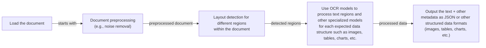
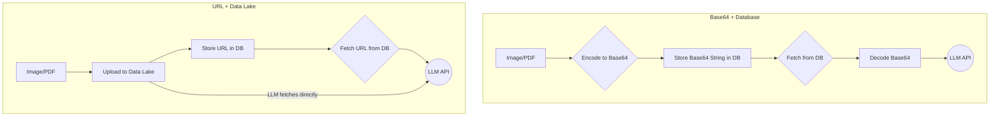
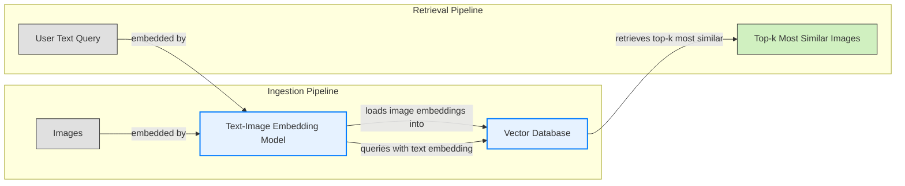
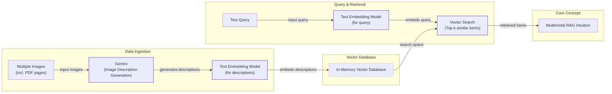
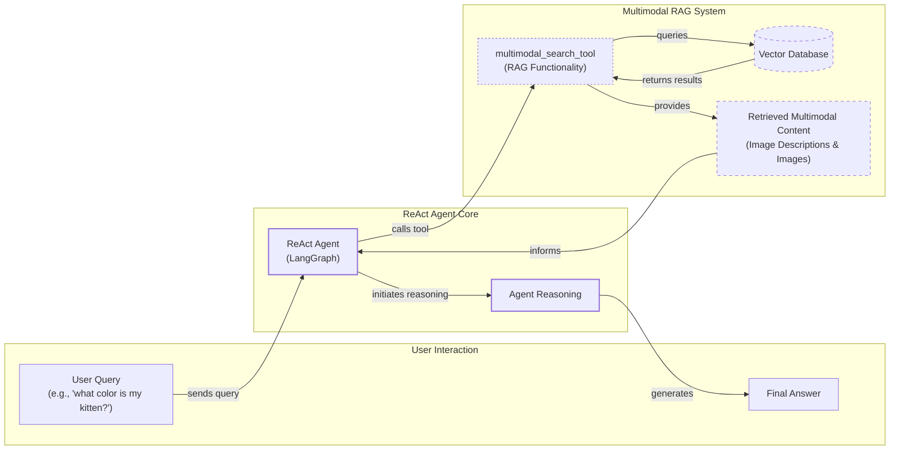

# Stop Converting Documents to Text: The AI Engineer's Guide to Multimodal Systems

In the previous lessons, we built a solid foundation in AI Engineering. We explored the agent landscape, learned the difference between rule-based workflows and autonomous agents, and mastered context engineering. We've given agents tools, taught them to reason with ReAct, and equipped them with memory. But there's one final piece to the puzzle: the real world isn't just text.

As humans, we interact with a rich mix of text, images, documents, and audio every day. Our AI systems must do the same. Enterprise data lives in complex formats—financial reports with charts, technical manuals with diagrams, and medical records with scans. Forcing all this visual information through a text-only pipeline is like trying to describe a painting over the phone; you lose the essence.

This lesson tackles that challenge head-on. We'll show you why the old way of using Optical Character Recognition (OCR) to convert everything to text is a fragile and outdated approach. Instead, we will show you how to build modern AI systems that process images and documents in their native format, preserving all their rich visual information. We will cover the theory behind multimodal LLMs and RAG systems and then implement hands-on examples, from basic image processing to building a complete multimodal RAG agent.

## Limitations of Traditional Document Processing

Before we build better systems, we need to understand why the old ones fail. For years, the standard approach to processing documents like PDFs was a multi-step, often brittle, pipeline based on OCR. This worked for simple, text-heavy documents, but it crumbles when faced with the visual complexity of real-world files.

A typical OCR-based workflow for a document containing text, diagrams, and tables is a sequence of fragile steps.



Image 1: A flowchart illustrating the traditional document processing workflow for documents like PDFs with mixed content.

This pipeline has too many moving parts. You need a layout detection model, an OCR model for text, and often separate specialized models for tables, charts, and other visual elements. This makes the system:

1.  **Rigid:** If a document contains a new data structure you haven't built a model for, the entire pipeline can fail.
2.  **Slow and Costly:** Chaining multiple model calls for a single document adds significant latency and computational expense.
3.  **Fragile:** With so many components, the system becomes a maintenance nightmare. A failure in any single step can break the entire process.

The performance challenges are significant. This multi-step process creates a cascade effect where errors from one stage compound in the next. Even advanced OCR engines struggle with real-world documents. Accuracy on clean, printed text can be high, but it plummets when dealing with handwritten notes, poor-quality scans, stylized fonts, or complex layouts like nested tables or technical drawings [[1]](https://www.llamaindex.ai/blog/ocr-accuracy). For example, studies show that a 5-degree tilt in a scanned document can increase the word error rate by over 15% [[1]](https://www.llamaindex.ai/blog/ocr-accuracy).

Image 2: A technical drawing with dense labels and complex spatial relationships, which presents a significant challenge for traditional OCR systems. (Source [https://etc.usf.edu/clipart/7700/7711/insect_anat_1_x.htm](https://etc.usf.edu/clipart/7700/7711/insect_anat_1_x.htm))

While this approach might work for highly specialized, predictable tasks, it doesn't scale in a world where AI agents need to be flexible and fast. That is why modern AI systems use multimodal LLMs, such as Gemini, that can directly interpret text, images, and even PDFs as native inputs, completely bypassing the fragile OCR workflow. Let's understand how they work.

## Foundations of Multimodal LLMs

Before we write any code, we need an intuition for how multimodal LLMs work. As an AI engineer, you do not need to know every low-level detail, but you do need to understand the core concepts to use, deploy, and optimize these models effectively.

There are two common architectural approaches for building multimodal LLMs that combine text and images.

Image 3: The two main approaches to developing multimodal LLM architectures. (Source [Understanding Multimodal LLMs](https://magazine.sebastianraschka.com/p/understanding-multimodal-llms))

### Unified Embedding Decoder Architecture

This is the simpler of the two approaches. It uses a standard decoder-only LLM architecture, like a GPT or Llama model. The key is how it handles images: an "image encoder" converts the image into a sequence of tokens that have the same embedding size as the text tokens. These image tokens are then simply concatenated with the text tokens and fed into the LLM as a single, unified input sequence.

Image 4: The unified embedding decoder architecture processes concatenated image and text token embeddings. (Source [Understanding Multimodal LLMs](https://magazine.sebastianraschka.com/p/understanding-multimodal-llms))

### Cross-Modality Attention Architecture

This method modifies the LLM's internal structure. Instead of treating image tokens as just another part of the input sequence, it injects them directly into the transformer's attention layers. A cross-attention mechanism allows the text tokens to "look at" the image tokens at each layer of the model, enabling a deeper fusion of information from both modalities.

Image 5: The cross-modality attention architecture integrates image and text embeddings within the attention mechanism. (Source [Understanding Multimodal LLMs](https://magazine.sebastianraschka.com/p/understanding-multimodal-llms))

### The Secret Sauce: Image Encoders

The magic behind both approaches lies in the **image encoder**. This component is responsible for turning a visual input into a numerical representation that the language model can understand.

This process is analogous to text tokenization. Just as a tokenizer breaks down a sentence into sub-words (e.g., using Byte-Pair Encoding), an image encoder breaks an image down into a grid of smaller patches.

Image 6: A comparison of image and text tokenization and embedding processes. (Source [Understanding Multimodal LLMs](https://magazine.sebastianraschka.com/p/understanding-multimodal-llms))

Each patch is then processed by a Vision Transformer (ViT), which is a neural network architecture specialized for image data. The ViT converts each patch into a vector embedding.

Image 7: The Vision Transformer (ViT) architecture processes image patches to generate embeddings. (Source [Understanding Multimodal LLMs](https://magazine.sebastianraschka.com/p/understanding-multimodal-llms))

The output of the ViT is a set of embeddings, one for each image patch. A final "projector" module, typically a simple linear layer, ensures these image embeddings have the exact same dimension as the text embeddings. This alignment is crucial. It allows the model to treat text and image information within the same mathematical space.

Models like CLIP, OpenCLIP, and SigLIP are popular image encoders trained using a technique called contrastive learning. This method trains the model to map similar text-image pairs (e.g., a photo of a dog and the caption "a photo of a dog") to nearby points in the vector space, while pushing dissimilar pairs far apart [[2]](https://www.pinecone.io/learn/series/image-search/clip/), [[3]](https://towardsdatascience.com/multimodal-embeddings-an-introduction-5dc36975966f/). This creates a shared embedding space where semantic similarity works across modalities. You can calculate the cosine similarity between a text vector and an image vector to see how closely they relate. This is the core principle that powers multimodal RAG.

Image 8: Text and image embeddings co-exist in a shared vector space, enabling cross-modal similarity search. (Source [How to Choose the Best Embedding Model for RAG in 2026: 10 Models Benchmarked](https://milvus.io/blog/choose-embedding-model-rag-2026.md))

This capability has powerful commercial applications. In e-commerce, for example, systems combine visual information from product images with textual data from titles and descriptions. This allows for more relevant recommendations, helping to solve the "cold start" problem for new items and detecting mismatches between an item's image and its description. eBay reported that integrating multimodal embeddings significantly improved the relevance of recommended listings and increased user engagement [[11]](https://innovation.ebayinc.com/stories/beyond-words-how-multimodal-embeddings-elevate-ebays-product-recommendations/).

### Architectural Trade-offs

Each approach has its trade-offs. The **Unified Embedding** architecture is simpler to implement and tends to perform better on OCR-related tasks. However, the **Cross-Attention** architecture is more computationally efficient, especially with high-resolution images, because it avoids lengthening the input sequence with a large number of image tokens [[4]](https://arxiv.org/html/2409.11402), [[5]](https://magazine.sebastianraschka.com/p/understanding-multimodal-llms). Some models, like NVIDIA's NVLM, even use a **Hybrid Approach**, combining a low-resolution thumbnail in the input sequence with high-resolution patches injected via cross-attention to get the best of both worlds [[4]](https://arxiv.org/html/2409.11402).

By 2025, most major LLMs are multimodal, including open-weight models like Llama 4, Gemma 2, and Qwen3, and proprietary models like GPT-5, Gemini 2.5, and Claude [[6]](https://www.promptitude.io/post/ultimate-2025-ai-language-models-comparison-gpt5-gpt-4-claude-gemini-sonar-more), [[7]](https://medium.com/data-science-in-your-pocket/2025-the-year-ai-reasoning-models-took-over-a-month-by-month-review-of-frontier-breakthroughs-6ea2163f854f). This same principle can be extended to other modalities like audio or video by adding specialized encoders for each data type [[8]](https://sparkco.ai/blog/exploring-multimodal-llms-text-image-and-video-integration).

It is also important to distinguish these models from diffusion-based image generation models like Midjourney or Stable Diffusion. While multimodal LLMs like GPT-4o can also generate images, diffusion models are a separate class of generative models optimized specifically for creating visual content. In agentic systems, these diffusion models can be integrated as powerful tools for visual creation [[9]](https://zapier.com/blog/best-ai-image-generator/), [[5]](https://magazine.sebastianraschka.com/p/understanding-multimodal-llms).

The field of multimodal architectures is constantly evolving. The goal of this section was not to be exhaustive but to provide an intuition for why these models are superior to older OCR-based pipelines. Now that we understand how LLMs can process images and documents natively, let's see it in practice.

## Applying Multimodal LLMs to Images and PDFs

To see how multimodal LLMs work, let's walk through some practical examples using Google's Gemini API. There are three primary ways to provide visual data to an LLM: as raw bytes, as Base64-encoded strings, or as URLs.

*   **Raw bytes:** This is the most direct method and works well for single API calls. However, storing raw bytes in a standard text-based database can lead to data corruption, as the database might misinterpret the byte stream.
*   **Base64 encoding:** This method converts binary data into a string format, making it safe to store in any database that handles text. It is a common way to embed images directly on websites or ensure data integrity in storage. The main downside is that the resulting string is about 33% larger than the original binary data.
*   **URLs:** This is often the most efficient method for production systems. You can either use public URLs for data on the open internet or, more commonly in enterprise settings, use secure URLs pointing to files in a private data lake like Amazon S3 or Google Cloud Storage (GCS). This avoids passing large files over the network with every API call, as the LLM can fetch the data directly.



Image 9: A diagram comparing the data flow for storing multimodal data as Base64 strings in a database versus storing URLs in a database that point to a data lake.

Each method has its place. For one-off experiments, raw bytes are simple. For applications that need to store media in a traditional database, Base64 is reliable. For scalable, production-grade systems, data lakes with URL references are the most efficient.

Now, let's dive into the code. We will start by processing a sample image.

1.  First, let's look at our test image.
    
    
    
    Image 10: The sample image used for our multimodal examples. (Source [lessons/11_multimodal/images/image_1.jpeg](https://github.com/towardsai/course-ai-agents/blob/dev/lessons/11_multimodal/images/image_1.jpeg))
    
2.  We will process the image as raw bytes. We start by defining a helper function to load an image file, resize it if necessary, and convert it to bytes in the efficient `WEBP` format.
    
    ```python
    def load_image_as_bytes(
        image_path: Path, format: Literal["WEBP", "JPEG", "PNG"] = "WEBP", max_width: int = 600, return_size: bool = False
    ) -> bytes | tuple[bytes, tuple[int, int]]:
        """
        Load an image from file path and convert it to bytes with optional resizing.
        """
    
        image = PILImage.open(image_path)
        if image.width > max_width:
            ratio = max_width / image.width
            new_size = (max_width, int(image.height * ratio))
            image = image.resize(new_size)
    
        byte_stream = io.BytesIO()
        image.save(byte_stream, format=format)
    
        if return_size:
            return byte_stream.getvalue(), image.size
    
        return byte_stream.getvalue()
    ```
    
    Next, we load the image and inspect the byte representation.
    
    ```python
    image_bytes = load_image_as_bytes(image_path=Path("images") / "image_1.jpeg", format="WEBP")
    ```
    
    It outputs:
    
    ```text
    Bytes `b'RIFF`\xad\x00\x00WEBPVP8 T\xad\x00\x00P\xec\x02\x9d\x01*X\x02X\x02'...`
    Size: 44392 bytes
    ```
    
    Now, we pass these bytes to the Gemini model to generate a caption.
    
    ```python
    response = client.models.generate_content(
        model=MODEL_ID,
        contents=[
            types.Part.from_bytes(
                data=image_bytes,
                mime_type="image/webp",
            ),
            "Tell me what is in this image in one paragraph.",
        ],
    )
    ```
    
    It outputs:
    
    ```text
    This striking image features a massive, dark metallic robot, its powerful form detailed with intricate circuit patterns on its head and piercing red glowing eyes. Perched playfully on its right arm is a small, fluffy grey tabby kitten, its front paw raised as if exploring or batting at the robot's armored limb, while its gaze is directed slightly off-frame. The robot's large, segmented hand is visible beneath the kitten. The background suggests an industrial or workshop environment, with hints of metal structures and natural light filtering in from an unseen window, creating a dramatic contrast between the soft, vulnerable kitten and the formidable, mechanical sentinel.
    ```
    
    We can even pass multiple images to compare them.
    
    ```python
    response = client.models.generate_content(
        model=MODEL_ID,
        contents=[
            types.Part.from_bytes(
                data=load_image_as_bytes(image_path=Path("images") / "image_1.jpeg", format="WEBP"),
                mime_type="image/webp",
            ),
            types.Part.from_bytes(
                data=load_image_as_bytes(image_path=Path("images") / "image_2.jpeg", format="WEBP"),
                mime_type="image/webp",
            ),
            "What's the difference between these two images? Describe it in one paragraph.",
        ],
    )
    ```
    
    It outputs:
    
    ```text
    The primary difference between the two images lies in the nature of the interaction depicted and their respective settings. In the first image, a small, grey kitten is shown curiously interacting with a large, metallic robot, gently perched on its arm within what appears to be a clean, well-lit workshop or industrial space. Conversely, the second image portrays a tense and aggressive confrontation between a fluffy white dog and a sleek black robot, both in combative stances, amidst a cluttered and grimy urban alleyway filled with trash and graffiti.
    ```
    
3.  Now, let's process the same image as a Base64-encoded string. Our helper function first loads the image as bytes and then encodes it.
    
    ```python
    def load_image_as_base64(
        image_path: Path, format: Literal["WEBP", "JPEG", "PNG"] = "WEBP", max_width: int = 600, return_size: bool = False
    ) -> str:
        """
        Load an image and convert it to base64 encoded string.
        """
    
        image_bytes = load_image_as_bytes(image_path=image_path, format=format, max_width=max_width, return_size=False)
    
        return base64.b64encode(cast(bytes, image_bytes)).decode("utf-8")
    ```
    
    The resulting Base64 string is larger than the raw bytes.
    
    ```python
    image_base64 = load_image_as_base64(image_path=Path("images") / "image_1.jpeg", format="WEBP")
    ```
    
    It outputs:
    
    ```text
    Base64: UklGRmCtAABXRUJQVlA4IFStAABQ7AKdASpYAlgCPm0ylEekIqInJnQ7gOANiWdtk7FnEo2gDknjPixW9SNSb5P7IbBNhLn87Vtp...`
    Size: 59192 characters
    Image as Base64 is 33.34% larger than as bytes
    ```
    
    The API call is almost identical, simply passing the Base64 string. The model returns a similar, high-quality caption.
    
4.  For public URLs, Gemini has a built-in `url_context` tool. You just provide the URL in the prompt and configure the tool, and the model handles fetching and parsing the content. Here, we ask it to summarize the famous ReAct paper from its public PDF link.
    
    ```python
    response = client.models.generate_content(
        model=MODEL_ID,
        contents="Based on the provided paper as a PDF, tell me how ReAct works: https://arxiv.org/pdf/2210.03629",
        config=types.GenerateContentConfig(tools=[{"url_context": {}}]),
    )
    ```
    
    It outputs:
    
    ```text
    ReAct is a novel paradigm for large language models (LLMs) that combines reasoning (Thought) and acting (Action) in an interleaved manner to solve diverse language and decision-making tasks. This approach allows the model to:
    
    *   **Reason to Act:** Generate verbal reasoning traces to induce, track, and update action plans, and handle exceptions.
    *   **Act to Reason:** Interface with and gather additional information from external sources (like knowledge bases or environments) to incorporate into its reasoning.
    
    ...
    ```
    
5.  For private data lakes, the process is similar, but you would use a secure URI (e.g., `gs://` for Google Cloud Storage). At the time of writing, Gemini works best with GCS, so for simplicity, here is a mocked example of what the code would look like.
    
    ```python
    response = client.models.generate_content(
        model=MODEL_ID,
        contents=[
            types.Part.from_uri(uri="gs://gemini-images/image_1.jpeg", mime_type="image/webp"),
            "Tell me what is in this image in one paragraph.",
        ],
    )
    ```
    
6.  To showcase a more advanced use case, let's perform object detection. We define our desired output structure using Pydantic models for bounding boxes and detections.
    
    ```python
    from pydantic import BaseModel, Field
    
    
    class BoundingBox(BaseModel):
        ymin: float
        xmin: float
        ymax: float
        xmax: float
        label: str = Field(
            default="The category of the object found within the bounding box. For example: cat, dog, diagram, robot."
        )
    
    
    class Detections(BaseModel):
        bounding_boxes: list[BoundingBox]
    ```
    
    We create a prompt asking for normalized bounding boxes and pass it to the model with a configuration that specifies the JSON output schema.
    
    ```python
    prompt = """
    Detect all of the prominent items in the image. 
    The box_2d should be [ymin, xmin, ymax, xmax] normalized to 0-1000.
    Also, output the label of the object found within the bounding box.
    """
    
    image_bytes, image_size = load_image_as_bytes(
        image_path=Path("images") / "image_1.jpeg", format="WEBP", return_size=True
    )
    
    config = types.GenerateContentConfig(
        response_mime_type="application/json",
        response_schema=Detections,
    )
    
    response = client.models.generate_content(
        model=MODEL_ID,
        contents=[
            types.Part.from_bytes(
                data=image_bytes,
                mime_type="image/webp",
            ),
            prompt,
        ],
        config=config,
    )
    ```
    
    The model returns a structured JSON object with the detected bounding boxes.
    
    ```text
    Image size: (600, 600)
    ymin=1.0 xmin=450.0 ymax=997.0 xmax=1000.0 label='robot'
    ymin=269.0 xmin=39.0 ymax=782.0 xmax=530.0 label='kitten'
    ```
    
    We can then use a helper function to visualize these boxes on the original image.
    
    
    
    Image 11: Visualization of the bounding boxes detected by the multimodal LLM. (Source [lessons/11_multimodal/notebook.ipynb](https://github.com/towardsai/course-ai-agents/blob/dev/lessons/11_multimodal/notebook.ipynb))
    
7.  Working with PDFs is almost identical to working with images. We can pass the raw bytes of the famous "Attention Is All You Need" paper to get a summary.
    
    
    
    Image 12: The first page of the "Attention Is All You Need" paper. (Source [lessons/11_multimodal/images/attention_is_all_you_need_0.jpeg](https://github.com/towardsai/course-ai-agents/blob/dev/lessons/11_multimodal/images/attention_is_all_you_need_0.jpeg))
    
    ```python
    pdf_bytes = (Path("pdfs") / "attention_is_all_you_need_paper.pdf").read_bytes()
    response = client.models.generate_content(
        model=MODEL_ID,
        contents=[
            types.Part.from_bytes(data=pdf_bytes, mime_type="application/pdf"),
            "What is this document about? Provide a brief summary of the main topics.",
        ],
    )
    ```
    
    It outputs:
    
    ```text
    This document introduces the **Transformer**, a novel neural network architecture designed for **sequence transduction tasks** (like machine translation).
    
    Its main topics include:
    
    1.  **Dispensing with Recurrence and Convolutions**: Unlike previous dominant models (RNNs and CNNs), the Transformer relies *solely* on **attention mechanisms**...
    ...
    ```
    
8.  You can also process PDFs as Base64-encoded strings, which follows the same pattern as with images.
    
9.  To further emphasize that you can treat PDF pages as images, we can perform object detection on a page from the same paper to identify the model architecture diagram.
    
    
    
    Image 13: A page from the Transformer paper containing a complex diagram. (Source [lessons/11_multimodal/images/attention_is_all_you_need_1.jpeg](https://github.com/towardsai/course-ai-agents/blob/dev/lessons/11_multimodal/images/attention_is_all_you_need_1.jpeg))
    
    Using the same object detection prompt as before, the model successfully identifies and bounds the diagram.
    
    
    
    Image 14: The LLM successfully detects the diagram on the PDF page. (Source [lessons/11_multimodal/notebook.ipynb](https://github.com/towardsai/course-ai-agents/blob/dev/lessons/11_multimodal/notebook.ipynb))
    
    These examples show how effectively modern LLMs can understand visual information, making the old, complex OCR pipelines largely redundant for many use cases.

## Foundations of Multimodal RAG

One of the most powerful applications of multimodal models is in Retrieval-Augmented Generation (RAG), a concept we explored in Lesson 10. When building custom AI applications, you almost always need to retrieve private company data. For large documents or image collections, RAG is not just useful; it's essential. Stuffing thousands of PDF pages into an LLM's context window is impractical due to increased latency, cost, and the "lost-in-the-middle" performance degradation.

A generic multimodal RAG system for text and images involves two main pipelines.



Image 15: A Mermaid diagram illustrating the ingestion and retrieval pipelines of a generic multimodal RAG system using images and text, highlighting the shared text-image embedding space.

During **ingestion**, images are converted into vector embeddings by a multimodal embedding model and stored in a vector database. During **retrieval**, a user's text query is embedded using the same model. This query vector is then used to search the database for the `top-k` most semantically similar image vectors. Because the text and image embeddings exist in the same vector space, this works seamlessly. This is the technology powering image search engines like Google Photos when you search for "pictures of dogs."

For enterprise document RAG, the state-of-the-art architecture as of 2025 is ColPali [[10]](https://arxiv.org/pdf/2407.01449v6). Its key innovation is bypassing the entire OCR pipeline. Instead of extracting text, ColPali processes document pages as images, using a vision-language model to understand both text and layout simultaneously. This is especially effective for documents with complex tables, figures, and charts.

ColPali, which stands for **Co**ntextualised **L**ate **I**nteraction over **Pali**Gemma, is built on Google's PaliGemma-3B architecture, which combines a SigLIP vision encoder with a Gemma language model. It applies the late-interaction mechanism proposed in the ColBERT retrieval model to the visual domain, allowing it to perform fine-grained matching between query text and image patches [[12]](https://huggingface.co/blog/manu/colpali).

ColPali works by breaking a document page image into patches and generating a "bag-of-embeddings" for the page—a multi-vector representation where each vector corresponds to a patch. At query time, it uses a "late interaction" mechanism to compute fine-grained similarities between each query token embedding and all the document patch embeddings. This mechanism, also known as MaxSim, is mathematically distinct from a simple cosine similarity search. Instead of comparing one query vector to one document vector, MaxSim operates at the token level. For each token in the query, it calculates its similarity against *every* patch vector in the document image, finds the maximum score, and then sums these maximum scores across all query tokens. This fine-grained approach allows the model to match specific words or phrases to specific visual regions in the document [[13]](https://www.mixedbread.com/blog/maxsim-cpu).

Image 16: The ColPali architecture simplifies document retrieval by using a VLM to directly embed page images. (Source [ColPali: Efficient Document Retrieval with Vision Language Models](https://arxiv.org/pdf/2407.01449v6))

This method is not only more accurate, especially on visually complex benchmarks, but it is also significantly faster than traditional OCR pipelines [[10]](https://arxiv.org/pdf/2407.01449v6). However, ColPali's power comes with scaling challenges. The "bag-of-embeddings" approach is memory-intensive; an index for a million pages can require terabytes of storage. The MaxSim computation also becomes a bottleneck at scale, as its complexity grows with the number of query tokens and document patches [[14]](https://ragflow.io/blog/rag-review-2025-from-rag-to-context). To make this practical for production systems with billions of documents, engineers use advanced optimization techniques. One approach is to use a phased ranking pipeline: first, use an efficient Approximate Nearest Neighbor (ANN) search to retrieve a small set of candidate pages, and then apply the computationally expensive MaxSim function only to this subset. Further optimizations involve using binary quantization to convert float vectors into binary representations and using the much faster Hamming distance for similarity calculations, which can speed up the process by over 3.5x with minimal loss in accuracy [[15]](https://blog.vespa.ai/scaling-colpali-to-billions/).

The principles behind ColPali are also an active area of research for other modalities. While current implementations focus on static documents, the multi-vector late-interaction approach has the potential to be extended to video retrieval, where it could allow for detailed matching of queries to specific segments or frames in a video stream, overcoming the limitations of current methods that average features over time [[16]](https://arxiv.org/html/2506.06144v1).

Now that we have the theory, let's implement a simplified multimodal RAG system from scratch.

## Implementing Multimodal RAG for Images, PDFs, and Text

Let's build a simple multimodal RAG system that combines what we have learned in this lesson and in Lesson 10. We will populate an in-memory vector database with a mix of images and PDF pages (treated as images) and then query it using text. This will help build your intuition for how these systems work, without the complexity of a full ColPali implementation.



Image 17: A Mermaid diagram illustrating the multimodal RAG example, showing the process of populating an in-memory vector database with images and querying it with text questions.

1.  First, let's display the images we'll be indexing. This includes our sample images and two pages from the "Attention Is All You Need" paper.
    
    
    
    Image 18: The set of images and PDF pages used for the RAG example. (Source [lessons/11_multimodal/notebook.ipynb](https://github.com/towardsai/course-ai-agents/blob/dev/lessons/11_multimodal/notebook.ipynb))
    
2.  Next, we define our main function, `create_vector_index`. This function will iterate through our images, generate a text description for each, embed that description, and store the result in a simple list that acts as our in-memory vector index. In a real-world application, you would use a scalable vector database like Milvus, Qdrant, or Pinecone, which use efficient indexing algorithms like HNSW.
    
    A crucial point here is our use of `generate_image_description`. The Gemini API we are using does not yet support direct image embedding. As a workaround, we use the vision model to create a detailed text description of each image and then embed that text. **This is not the recommended production approach.**
    
    The ideal workflow would use a multimodal embedding model (like Voyage, Cohere, or Google's embedding models on Vertex AI) to embed the image bytes directly.
    
    ```python
    # image_bytes = ...
    # SKIPPED!
    # image_description = generate_image_description(image_bytes)
    # image_embedding = embed_text_with_gemini(image_description)
    
    image_embedding = embed_with_multimodal_model(image_bytes)
    ```
    
    The good news is that if you swap in a true multimodal embedding model, the rest of the RAG system's logic remains the same. The core principle of a shared vector space allows you to search across modalities regardless of how the embeddings were generated.
    
3.  Here are our helper functions. `generate_image_description` uses Gemini to describe an image, and `embed_text_with_gemini` uses Gemini's text embedding model.
    
    ```python
    def generate_image_description(image_bytes: bytes) -> str:
        """
        Generate a detailed description of an image using Gemini Vision model.
        """
        # ... implementation details ...
    
    def embed_text_with_gemini(content: str) -> np.ndarray | None:
        """
        Embed text content using Gemini's text embedding model.
        """
        # ... implementation details ...
    ```
    
4.  We call `create_vector_index` to build our `vector_index`.
    
    ```python
    image_paths = list(Path("images").glob("*.jpeg"))
    vector_index = create_vector_index(image_paths)
    ```
    
    It outputs:
    
    ```text
    ✅ Successfully created 7 embeddings under the `vector_index` variable
    ```
    
    Each item in our index contains the image content, filename, description, and the embedding of that description.
    
5.  Now we define our search function, `search_multimodal`, which takes a text query, embeds it, and performs a cosine similarity search against all the embeddings in our vector index to find the `top_k` results.
    
    ```python
    from sklearn.metrics.pairwise import cosine_similarity
    
    def search_multimodal(query_text: str, vector_index: list[dict], top_k: int = 3) -> list[Any]:
        """
        Search for most similar documents to query using direct Gemini client.
        """
        # ... implementation details ...
    ```
    
6.  Let's test it with a query about the Transformer architecture.
    
    ```python
    query = "what is the architecture of the transformer neural network?"
    results = search_multimodal(query, vector_index, top_k=1)
    ```
    
    The system correctly retrieves the page from the paper showing the architecture diagram, with a similarity score of 0.744.
    
    
    
    Image 19: The top search result for a query about the Transformer architecture. (Source [lessons/11_multimodal/images/attention_is_all_you_need_1.jpeg](https://github.com/towardsai/course-ai-agents/blob/dev/lessons/11_multimodal/images/attention_is_all_you_need_1.jpeg))
    
7.  Let's try another query.
    
    ```python
    query = "a kitten with a robot"
    results = search_multimodal(query, vector_index, top_k=1)
    ```
    
    It correctly finds our original sample image with a high similarity of 0.811.
    
    
    
    Image 20: The top search result for a query about a kitten and a robot. (Source [lessons/11_multimodal/images/image_1.jpeg](https://github.com/towardsai/course-ai-agents/blob/dev/lessons/11_multimodal/images/image_1.jpeg))
    
    This simple example demonstrates the power of multimodal RAG. By treating all visual content as images, we can build a unified search system that handles diverse file types. This approach could easily be extended to video frames or audio spectrograms, creating a truly versatile information retrieval system.

## Building Multimodal AI Agents

Now, let's take our RAG system a step further by integrating it into a ReAct agent. This will create an agentic RAG system that can reason about a user's query and decide when to use our multimodal search tool. This example consolidates many of the skills you have learned in the first part of this course.

An agent can be made multimodal in several ways:
1.  **Multimodal Inputs/Outputs:** The agent's core reasoning LLM can be a multimodal model that natively accepts images, audio, or video in its prompts.
2.  **Multimodal Tools:** The agent can be given tools that operate on or retrieve multimodal data, like the RAG function we just built.
3.  **External Multimodal Systems:** The agent can interact with external services that process multimodal data, such as a tool that analyzes a screenshot or fetches a video from a server.

When deploying these agents, especially in real-world applications like manufacturing or healthcare, another trend becomes important: edge computing. Instead of running on a centralized cloud server, agents can be deployed directly on devices like factory cameras, medical equipment, or vehicles. This reduces latency, improves privacy by keeping data local, and allows the system to function without a constant internet connection. To make this possible, engineers use model optimization techniques like **quantization**, which can shrink a model's size by 4-8 times with minimal accuracy loss, and leverage specialized hardware like Neural Processing Units (NPUs) that are designed for efficient AI workloads [[17]](https://www.n-ix.com/edge-ai-trends/).

In this example, we will combine the first two approaches. We will build a ReAct agent using LangGraph and give it access to our `search_multimodal` function as a tool. The agent will receive a text query, decide to use the search tool, and then analyze the retrieved image to answer the user's question.



Image 21: A Mermaid diagram illustrating a multimodal ReAct + RAG agent example.

1.  First, we wrap our `search_multimodal` function in a `@tool` decorator to make it available to the agent. The tool's docstring is important, as it tells the agent what the tool does and when to use it. The tool will return the retrieved image and its description to the agent.
    
    ```python
    from langchain_core.tools import tool
    
    @tool
    def multimodal_search_tool(query: str) -> dict[str, Any]:
        """
        Search through a collection of images and their text descriptions to find relevant content.
        ...
        """
        # ... implementation details ...
    ```
    
2.  Next, we define a function `build_react_agent` that uses LangGraph's `create_react_agent` helper. We provide it with our tool and a system prompt that guides its behavior. The system prompt instructs the agent to use the search tool whenever asked about visual content. We will dive deeper into LangGraph in Part 2 of this course; for now, think of it as a powerful way to define and run agentic workflows.
    
    ```python
    from langchain_google_genai import ChatGoogleGenerativeAI
    from langgraph.prebuilt import create_react_agent
    
    def build_react_agent() -> Any:
        """
        Build a ReAct agent with multimodal search capabilities.
        """
    
        tools = [multimodal_search_tool]
    
        system_prompt = """You are a helpful AI assistant that can search through images and text to answer questions.
        
        When asked about visual content like animals, objects, or scenes:
        1. Use the multimodal_search_tool to find relevant images and descriptions
        2. Carefully analyze the image or image descriptions from the search results
        ...
        """
    
        agent = create_react_agent(
            model=ChatGoogleGenerativeAI(model="gemini-2.5-pro", temperature=0.1),
            tools=tools,
            prompt=system_prompt,
        )
    
        return agent
    
    react_agent = build_react_agent()
    ```
    
3.  Now, let's test the agent by asking about the color of the kitten in our dataset.
    
    ```python
    test_question = "what color is my kitten?"
    response = react_agent.invoke(input={"messages": test_question})
    ```
    
    The agent follows the ReAct loop. First, it reasons that it needs to search for "my kitten" and calls our tool.
    
    ```text
    🔍 Tool executing search for: my kitten
    🔍 Embedding query: 'my kitten'
    ✅ Query embedded successfully
    🔍 Found results: images/image_1.jpeg
    ```
    
    The tool returns the retrieved image and its description. The agent then analyzes this multimodal context and generates the final answer.
    
    ```text
    🤖 Agent response
    Based on the image, your kitten is a gray tabby. It has soft, short gray fur with darker tabby stripe patterns.
    ```
    
    
    
    Image 22: The image retrieved by the agent's tool, which it used to answer the user's question. (Source [lessons/11_multimodal/images/image_1.jpeg](https://github.com/towardsai/course-ai-agents/blob/dev/lessons/11_multimodal/images/image_1.jpeg))
    
    In this lesson, we have successfully combined structured outputs, tools, ReAct, RAG, and multimodal processing to create a functional agentic RAG proof-of-concept. This demonstrates how the fundamental skills from Part 1 of this course come together to build sophisticated AI systems.

## Conclusion

This lesson completes our journey through the fundamentals of AI Engineering in Part 1 of the course. We have shown that by treating visual data in its native format, you can build simpler, more robust, and more powerful AI systems. The shift away from fragile OCR pipelines toward native multimodal processing is a core principle of modern AI engineering. We will apply these same techniques in our capstone project, passing images and PDFs from our research agent to our writer agent to preserve rich visual context.

You now have a complete toolkit for building both rule-based workflows and autonomous agents. In Part 2, we will move from theory to practice as we begin building the course's central project: an interconnected research and writing agent system. We will explore advanced agentic design patterns, compare modern frameworks, and dive deep into LangGraph to implement and orchestrate our multi-agent pipeline from start to finish.

## References

- [1] OCR Accuracy Explained: How to Improve It. (2026, April 1). LlamaIndex Blog. [https://www.llamaindex.ai/blog/ocr-accuracy](https://www.llamaindex.ai/blog/ocr-accuracy)
- [2] Multi-modal ML with OpenAI's CLIP. (n.d.). Pinecone. [https://www.pinecone.io/learn/series/image-search/clip/](https://www.pinecone.io/learn/series/image-search/clip/)
- [3] Multimodal Embeddings: An Introduction. (2024, November 29). Towards Data Science. [https://towardsdatascience.com/multimodal-embeddings-an-introduction-5dc36975966f/](https://towardsdatascience.com/multimodal-embeddings-an-introduction-5dc36975966f/)
- [4] Dai, W., Lee, N., Wang, B., Yang, Z., Liu, Z., Barker, J., Rintamaki, T., Shoeybi, M., Catanzaro, B., & Ping, W. (2024). NVLM: Open Frontier-Class Multimodal LLMs. arXiv. [https://arxiv.org/html/2409.11402](https://arxiv.org/html/2409.11402)
- [5] Raschka, S. (2024, November 3). Understanding Multimodal LLMs. Ahead of AI. [https://magazine.sebastianraschka.com/p/understanding-multimodal-llms](https://magazine.sebastianraschka.com/p/understanding-multimodal-llms)
- [6] Ultimate 2025 AI Language Models Comparison: GPT5, GPT-4, Claude, Gemini, Sonar & More. (n.d.). Promptitude. [https://www.promptitude.io/post/ultimate-2025-ai-language-models-comparison-gpt5-gpt-4-claude-gemini-sonar-more](https://www.promptitude.io/post/ultimate-2025-ai-language-models-comparison-gpt5-gpt-4-claude-gemini-sonar-more)
- [7] 2025: The year AI reasoning models took over. (2025, May 22). Medium. [https://medium.com/data-science-in-your-pocket/2025-the-year-ai-reasoning-models-took-over-a-month-by-month-review-of-frontier-breakthroughs-6ea2163f854f](https://medium.com/data-science-in-your-pocket/2025-the-year-ai-reasoning-models-took-over-a-month-by-month-review-of-frontier-breakthroughs-6ea2163f854f)
- [8] Exploring multimodal LLMs: text, image and video integration. (n.d.). Spark.ai. [https://sparkco.ai/blog/exploring-multimodal-llms-text-image-and-video-integration](https://sparkco.ai/blog/exploring-multimodal-llms-text-image-and-video-integration)
- [9] Guinness, H. (2026, April 1). The 8 best AI image generators in 2025. Zapier. [https://zapier.com/blog/best-ai-image-generator/](https://zapier.com/blog/best-ai-image-generator/)
- [10] ColPali: Efficient Document Retrieval with Vision Language Models. (2024). arXiv. [https://arxiv.org/pdf/2407.01449v6](https://arxiv.org/pdf/2407.01449v6)
- [11] Beyond Words: How Multimodal Embeddings Elevate eBay’s Product Recommendations. (n.d.). eBay Inc. [https://innovation.ebayinc.com/stories/beyond-words-how-multimodal-embeddings-elevate-ebays-product-recommendations/](https://innovation.ebayinc.com/stories/beyond-words-how-multimodal-embeddings-elevate-ebays-product-recommendations/)
- [12] ColPali: Efficient Document Retrieval with Vision Language Models. (2024, July 1). Hugging Face Blog. [https://huggingface.co/blog/manu/colpali](https://huggingface.co/blog/manu/colpali)
- [13] MaxSim on the CPU: The Heart of Late-Interaction Models. (n.d.). mixedbread.ai. [https://www.mixedbread.com/blog/maxsim-cpu](https://www.mixedbread.com/blog/maxsim-cpu)
- [14] RAG Review 2025: From RAG to Context-native LLM. (2025). RAGFlow. [https://ragflow.io/blog/rag-review-2025-from-rag-to-context](https://ragflow.io/blog/rag-review-2025-from-rag-to-context)
- [15] Scaling ColPali to billions of PDFs with Vespa. (2024, September 14). Vespa Blog. [https://blog.vespa.ai/scaling-colpali-to-billions/](https://blog.vespa.ai/scaling-colpali-to-billions/)
- [16] Extending Late-Interaction to Video Retrieval. (2025). arXiv. [https://arxiv.org/html/2506.06144v1](https://arxiv.org/html/2506.06144v1)
- [17] Edge AI trends: What's working now and what's next in 2026. (2026, February 25). N-iX. [https://www.n-ix.com/edge-ai-trends/](https://www.n-ix.com/edge-ai-trends/)