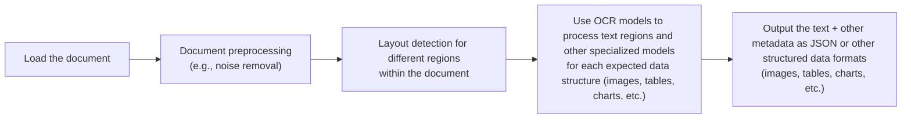
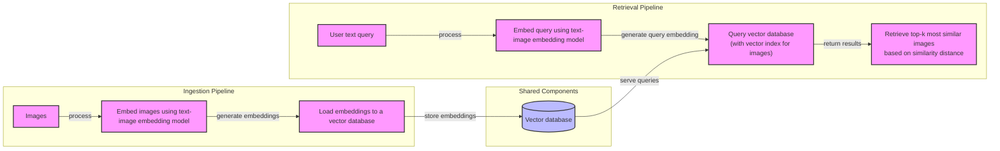
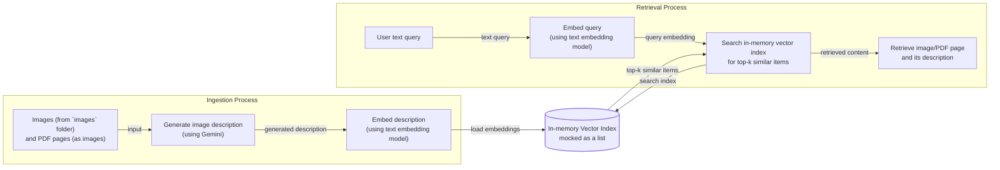

# Stop Converting Documents to Text: A Guide to Multimodal AI

In the previous lessons, we built a solid foundation in AI Engineering. We explored the agent landscape, distinguished between LLM workflows and AI agents, mastered context engineering, and learned to produce structured outputs. We've built reasoning agents with tools and memory and taken a deep dive into Retrieval-Augmented Generation (RAG). You now have the core skills to build sophisticated AI systems. However, we've mostly operated in a text-only world, which is a major limitation.

In the real world, information is multimodal. We work with images, charts, and complex documents daily. Enterprise data isn't just text; it's a mix of financial reports, technical diagrams, and visual presentations. To build truly useful AI applications, we must equip them to understand this rich, multimodal environment. Trying to flatten everything into text is a losing battle. For instance, text-only AI struggles to interpret financial reports with complex charts, medical documents with diagnostic images, or technical manuals filled with diagrams. The most critical insights are often visual, and converting them to text strips away essential context [[6]](https://konfuzio.com/en/chatgpt-financial-analysis/), [[7]](https://techtoday.lenovo.com/sites/default/files/2025-05/Medical%20Imaging%20White%20Paper%20NVIDIA%20and%20Lenovo.pdf).

This lesson marks the final piece of our foundational puzzle. We'll show you why you should stop converting documents to text and instead process them as native images. We will cover the theory behind multimodal LLMs and embeddings, then move to hands-on examples. You will learn to build multimodal RAG systems and integrate these capabilities into AI agents. By the end, you'll have the knowledge to build enterprise-grade AI that can see and understand your data, just like a human would.

## Limitations of traditional document processing

To understand why a multimodal-native approach is better, we first need to look at why traditional methods fall short. For years, the standard for processing documents like invoices or reports has been a multi-step pipeline centered around Optical Character Recognition (OCR). The goal was always the same: normalize everything to text so a machine could read it [[46]](https://www.daft.ai/blog/end-to-end-distributed-pdf-processing-pipeline).

A typical OCR-based workflow for a PDF containing text, diagrams, and tables looks something like this:


Image 1: A flowchart illustrating the traditional document processing workflow using OCR for PDFs with mixed content.

This process is a chain of specialized models, each handing off its output to the next. You have models for layout detection, text recognition, table extraction, and so on. While this can work for highly standardized documents, it creates a system that is complex and brittle [[47]](https://learn.microsoft.com/en-us/answers/questions/5668164/why-traditional-ocr-fails-for-complex-business-doc?page=1).

This approach has four fundamental challenges. First, it is **rigid**. The system is only as good as its pre-defined components. If a document introduces a new element you don't have a model for—say, a complex flowchart or a handwritten annotation—the entire pipeline can fail [[48]](https://parseur.com/blog/document-processing-automation-guide). Second, it is **slow and costly**. Each step involves a separate model call, adding latency and operational overhead. Orchestrating and maintaining this menagerie of models is an engineering headache.

Third, it is **fragile**. The pipeline is a cascade of potential failure points. An error in an early stage, like layout detection, propagates and amplifies through subsequent steps, leading to garbage output [[46]](https://www.daft.ai/blog/end-to-end-distributed-pdf-processing-pipeline). Finally, the **performance is often poor**. Even advanced OCR engines like Tesseract struggle with real-world documents. Accuracy benchmarks of 88-94% on simple layouts can plummet by over 20% when faced with poor scan quality, skewed pages, or complex multi-column formats [[1]](https://www.llamaindex.ai/blog/ocr-accuracy). For handwritten text, a character error rate of 3-5% is considered good, which is unacceptable for many business applications.

https://hackernoon.imgix.net/images/2DFAaGGO5cfymtBKn4bFFAoT6sg2-efb3xu6.jpeg
Image 2: Traditional computer vision struggles to distinguish similar-looking objects in technical drawings, like these floor plan symbols, often leading to false positives. (Source [https://hackernoon.com/complex-document-recognition-ocr-doesnt-work-and-heres-how-you-fix-it](https://hackernoon.com/complex-document-recognition-ocr-doesnt-work-and-heres-how-you-fix-it))

This kind of system might be tolerable for narrow, predictable tasks. But for flexible, general-purpose AI agents that need to understand the world as we do, it's a non-starter. This is why modern AI systems are moving away from this brittle, text-centric paradigm. Instead, they use multimodal LLMs that can directly interpret images, PDFs, and other data formats natively, bypassing the messy OCR pipeline entirely. Let's explore how these models work.

## Foundations of multimodal LLMs

Before we jump into code, it's important to have an intuition for how multimodal LLMs work. You don't need to be a researcher to use them, but understanding the core concepts will help you build, optimize, and monitor your AI applications more effectively.

At a high level, there are two common architectures for building multimodal LLMs that process both images and text [[21]](https://magazine.sebastianraschka.com/p/understanding-multimodal-llms), [[36]](https://magazine.sebastianraschka.com/p/understanding-multimodal-llms).

https://substackcdn.com/image/fetch/f_auto,q_auto:good,fl_progressive:steep/https%3A%2F%2Fsubstack-post-media.s3.amazonaws.com%2Fpublic%2Fimages%2F53956ae8-9cd8-474e-8c10-ef6bddb88164_1600x938.png
Image 3: The two main architectural approaches for multimodal LLMs: Unified Embedding Decoder (Method A) and Cross-Modality Attention (Method B). (Source [https://magazine.sebastianraschka.com/p/understanding-multimodal-llms](https://magazine.sebastianraschka.com/p/understanding-multimodal-llms))

The first is the **Unified Embedding Decoder Architecture**. This is the simpler approach. An image is passed through a special "image encoder," which converts it into a sequence of embeddings (numerical representations). These image embeddings are designed to have the same dimensions as the text embeddings. They are then simply concatenated with the text token embeddings and fed into a standard LLM decoder as a single, unified sequence [[21]](https://magazine.sebastianraschka.com/p/understanding-multimodal-llms).

https://substackcdn.com/image/fetch/f_auto,q_auto:good,fl_progressive:steep/https%3A%2F%2Fsubstack-post-media.s3.amazonaws.com%2Fpublic%2Fimages%2F91955021-7da5-4bc4-840e-87d080152b18_1166x1400.png
Image 4: The Unified Embedding Decoder Architecture, where image and text embeddings are concatenated and processed by a standard LLM. (Source [https://magazine.sebastianraschka.com/p/understanding-multimodal-llms](https://magazine.sebastianraschka.com/p/understanding-multimodal-llms))

The second approach is the **Cross-Modality Attention Architecture**. Instead of prepending image tokens to the input, this method injects the visual information directly into the LLM's attention layers. The image embeddings are processed separately and then "attended to" by the text embeddings at each layer of the model. This allows for a more intricate fusion of visual and textual information throughout the reasoning process [[21]](https://magazine.sebastianraschka.com/p/understanding-multimodal-llms).

https://substackcdn.com/image/fetch/f_auto,q_auto:good,fl_progressive:steep/https%3A%2F%2Fsubstack-post-media.s3.amazonaws.com%2Fpublic%2Fimages%2Fd9c06055-b959-45d1-87b2-1f4e90ceaf2d_1296x1338.png
Image 5: The Cross-Modality Attention Architecture, where image embeddings are integrated into the LLM's attention mechanism. (Source [https://magazine.sebastianraschka.com/p/understanding-multimodal-llms](https://magazine.sebastianraschka.com/p/understanding-multimodal-llms))

Both architectures rely on an **image encoder** to transform visual data into a format the LLM can understand. This process is analogous to text tokenization. Just as text is broken down into sub-word tokens, an image is divided into a grid of smaller "patches." Each patch is then converted into an embedding vector [[21]](https://magazine.sebastianraschka.com/p/understanding-multimodal-llms).

https://substackcdn.com/image/fetch/f_auto,q_auto:good,fl_progressive:steep/https%3A%2F%2Fsubstack-post-media.s3.amazonaws.com%2Fpublic%2Fimages%2F0d56ea06-d202-4eb7-9e01-9aac492ee309_1522x1206.png
Image 6: A side-by-side comparison of image tokenization (patching) and text tokenization. (Source [https://magazine.sebastianraschka.com/p/understanding-multimodal-llms](https://magazine.sebastianraschka.com/p/understanding-multimodal-llms))

This is typically done using a Vision Transformer (ViT). The ViT processes these patches and outputs a sequence of embedding vectors. The key is that these image embeddings must be "aligned" with the text embeddings; they need to live in the same vector space so that "a picture of a cat" and the word "cat" are close to each other semantically. This alignment is achieved by a "projector" module—usually a simple linear layer—that maps the image embeddings into the same dimensional space as the text embeddings [[21]](https://magazine.sebastianraschka.com/p/understanding-multimodal-llms).

https://substackcdn.com/image/fetch/f_auto,q_auto:good,fl_progressive:steep/https%3A%2F%2Fsubstack-post-media.s3.amazonaws.com%2Fpublic%2Fimages%2Ffef5f8cb-c76c-4c97-9771-7fdb87d7d8cd_1600x1135.png
Image 7: An illustration of a Vision Transformer (ViT), which processes image patches to generate embeddings. (Source [https://magazine.sebastianraschka.com/p/understanding-multimodal-llms](https://magazine.sebastianraschka.com/p/understanding-multimodal-llms))

Popular image encoders like CLIP, OpenCLIP, and SigLIP are trained using contrastive learning. They learn to map images and their corresponding text descriptions into a shared embedding space. In this space, an image of a dog and the text "a photo of a dog" will have very similar vectors [[56]](https://opensearch.org/blog/multimodal-semantic-search/). This property is what enables powerful applications like semantic image search and is the foundation of multimodal RAG, which we will explore later.

https://towardsdatascience.com/wp-content/uploads/2024/11/15d3HBNjNIXLy0oMIvJjxWw.png
Image 8: In a multimodal embedding space, different data types like images and text are aligned, allowing similar concepts to be located close together. (Image by Shaw Talebi from [https://towardsdatascience.com/multimodal-embeddings-an-introduction-5dc36975966f](https://towardsdatascience.com/multimodal-embeddings-an-introduction-5dc36975966f))

Each architectural approach has its trade-offs. The unified decoder is simpler to implement and tends to perform better on OCR-related tasks. The cross-attention model is more computationally efficient, especially with high-resolution images, as it avoids lengthening the input sequence with image tokens. Some of the latest models, like NVIDIA's NVLM-H, use a hybrid approach to get the best of both worlds [[36]](https://magazine.sebastianraschka.com/p/understanding-multimodal-llms), [[37]](https://arxiv.org/abs/2409.11402).

By 2025, most major LLMs are multimodal by default. Open-weight models like Llama 4, Qwen3, and DeepSeek R1, as well as proprietary models like GPT-5, Gemini 2.5, and Claude 4, all have native vision capabilities [[22]](https://medium.com/data-science-in-your-pocket/2025-the-year-ai-reasoning-models-took-over-a-month-by-month-review-of-frontier-breakthroughs-6ea2163f854f), [[23]](https://codedesign.ai/blog/the-ultimate-guide-to-the-top-large-language-models-in-2025/). These architectures can also be extended to other modalities like audio and video by incorporating specialized encoders for each data type [[27]](https://sparkco.ai/blog/exploring-multimodal-llms-text-image-and-video-integration).

It's also important to distinguish these multimodal LLMs from diffusion-based image generation models like Midjourney or Stable Diffusion. While LLMs like GPT-4o can also generate images, diffusion models are a separate class of architecture specialized for generation. In agentic systems, these generative models can be integrated as powerful tools for creating visual content, but they are not the focus of our course [[19]](https://arxiv.org/html/2409.14993v3).

The field of multimodal AI is evolving rapidly. Our goal here isn't to be exhaustive but to provide the core intuition you need as an AI engineer. With this foundation, let's see how to apply these concepts in practice.

## Applying multimodal LLMs to images and PDFs

To understand how multimodal LLMs work in practice, let's explore some examples using Gemini. There are three primary ways to provide images and PDFs to these models: as raw bytes, as Base64-encoded strings, or via URLs.

**Raw bytes** are the most direct method and work well for one-off API calls. However, storing raw bytes in a traditional database can be problematic, as many systems interpret them as text and can corrupt the data.

**Base64 encoding** solves this by converting the binary data into a string format. This makes it safe to store in any database that handles text, like PostgreSQL or MongoDB. It's a common pattern for embedding images directly on websites or ensuring data integrity in storage. The main downside is that Base64 strings are about 33% larger than the original byte data.

**URLs** are the most efficient option for production systems, especially in enterprise settings. You can either use public URLs for data on the open internet or, more commonly, use signed URLs pointing to files in a private data lake like AWS S3 or Google Cloud Storage. This avoids passing large files over the network with every API call; the LLM service fetches the data directly from the storage bucket, reducing I/O bottlenecks.

```mermaid
graph TD
    subgraph "Method 1: Base64 + Database"
        A[Image/PDF] --> B{Encode to Base64};
        B --> C[Store as text in DB<br/>(e.g., PostgreSQL)];
        C --> D{LLM App};
        D --> E[Decode Base64];
        E --> F((LLM API));
    end

    subgraph "Method 2: URLs + Data Lake"
        G[Image/PDF] --> H[Upload to Data Lake<br/>(e.g., S3, GCS)];
        H --> I[Store URL in DB];
        I --> J{LLM App};
        J --> K((LLM API<br/>with URL));
    end
```
Image 9: A diagram comparing the data flow for storing multimodal data using Base64 in a database versus using URLs with a data lake.

Choosing the right method depends on your use case. For quick tests, use raw bytes. For applications that require storing media in a traditional database, use Base64. For scalable, production-grade systems, use URLs pointing to a data lake.

Now, let's dive into the code. We will use the examples from this lesson's notebook to demonstrate how to work with images and PDFs using Gemini.

First, let's look at our sample image.

https://github.com/towardsai/course-ai-agents/raw/dev/lessons/11_multimodal/images/image_1.jpeg
Image 10: A photorealistic rendering of a kitten interacting with a large robot. (Source [https://github.com/towardsai/course-ai-agents/blob/dev/lessons/11_multimodal/notebook.ipynb](https://github.com/towardsai/course-ai-agents/blob/dev/lessons/11_multimodal/notebook.ipynb))

### Process image as raw bytes

1.  We start by defining a helper function to load an image from a file path and convert it into bytes. We convert it to the `WEBP` format because it offers good compression and quality, making it efficient for API calls.
    ```python
    def load_image_as_bytes(
        image_path: Path, format: Literal["WEBP", "JPEG", "PNG"] = "WEBP", max_width: int = 600, return_size: bool = False
    ) -> bytes | tuple[bytes, tuple[int, int]]:
        """
        Load an image from file path and convert it to bytes with optional resizing.
    
        Args:
            image_path: Path to the image file to load
            format: Output image format (WEBP, JPEG, or PNG). Defaults to "WEBP"
            max_width: Maximum width for resizing. If image width exceeds this, it will be resized proportionally. Defaults to 600
            return_size: If True, returns both bytes and image size tuple. Defaults to False
    
        Returns:
            bytes: Image data as bytes, or tuple of (bytes, (width, height)) if return_size is True
        """
    
        image = PILImage.open(image_path)
        if image.width > max_width:
            ratio = max_width / image.width
            new_size = (max_width, int(image.height * ratio))
            image = image.resize(new_size)
    
        byte_stream = io.BytesIO()
        image.save(byte_stream, format=format)
    
        if return_size:
            return byte_stream.getvalue(), image.size
    
        return byte_stream.getvalue()
    ```

2.  Next, we load our sample image into a byte string.
    ```python
    image_bytes = load_image_as_bytes(image_path=Path("images") / "image_1.jpeg", format="WEBP")
    ```
    The raw bytes look like a jumble of characters, and the total size for this image is 44,392 bytes.
    ```text
    Bytes `b'RIFF`\xad\x00\x00WEBPVP8 T\xad\x00\x00P\xec\x02\x9d\x01*X\x02X\x02'...`
    Size: 44392 bytes
    ```

3.  We then pass these bytes to the Gemini model along with a text prompt to generate a caption.
    ```python
    response = client.models.generate_content(
        model=MODEL_ID,
        contents=[
            types.Part.from_bytes(
                data=image_bytes,
                mime_type="image/webp",
            ),
            "Tell me what is in this image in one paragraph.",
        ],
    )
    ```
    It outputs:
    ```text
    This striking image features a massive, dark metallic robot, its powerful form detailed with intricate circuit patterns on its head and piercing red glowing eyes. Perched playfully on its right arm is a small, fluffy grey tabby kitten, its front paw raised as if exploring or batting at the robot's armored limb, while its gaze is directed slightly off-frame. The robot's large, segmented hand is visible beneath the kitten. The background suggests an industrial or workshop environment, with hints of metal structures and natural light filtering in from an unseen window, creating a dramatic contrast between the soft, vulnerable kitten and the formidable, mechanical sentinel.
    ```

4.  This approach easily scales to multiple images. We can pass two images and ask the model to compare them.
    ```python
    response = client.models.generate_content(
        model=MODEL_ID,
        contents=[
            types.Part.from_bytes(
                data=load_image_as_bytes(image_path=Path("images") / "image_1.jpeg", format="WEBP"),
                mime_type="image/webp",
            ),
            types.Part.from_bytes(
                data=load_image_as_bytes(image_path=Path("images") / "image_2.jpeg", format="WEBP"),
                mime_type="image/webp",
            ),
            "What's the difference between these two images? Describe it in one paragraph.",
        ],
    )
    ```
    It outputs:
    ```text
    The primary difference between the two images lies in the nature of the interaction depicted and their respective settings. In the first image, a small, grey kitten is shown curiously interacting with a large, metallic robot, gently perched on its arm within what appears to be a clean, well-lit workshop or industrial space. Conversely, the second image portrays a tense and aggressive confrontation between a fluffy white dog and a sleek black robot, both in combative stances, amidst a cluttered and grimy urban alleyway filled with trash and graffiti.
    ```

### Process the image as base64 encoded strings

1.  Here is a helper function to load an image and encode it as a Base64 string.
    ```python
    def load_image_as_base64(
        image_path: Path, format: Literal["WEBP", "JPEG", "PNG"] = "WEBP", max_width: int = 600, return_size: bool = False
    ) -> str:
        """
        Load an image and convert it to base64 encoded string.
    
        Args:
            image_path: Path to the image file to load
            format: Output image format (WEBP, JPEG, or PNG). Defaults to "WEBP"
            max_width: Maximum width for resizing. If image width exceeds this, it will be resized proportionally. Defaults to 600
            return_size: Parameter passed to load_image_as_bytes function. Defaults to False
    
        Returns:
            str: Base64 encoded string representation of the image
        """
    
        image_bytes = load_image_as_bytes(image_path=image_path, format=format, max_width=max_width, return_size=False)
    
        return base64.b64encode(cast(bytes, image_bytes)).decode("utf-8")
    ```

2.  We load the same image as a Base64 string.
    ```python
    image_base64 = load_image_as_base64(image_path=Path("images") / "image_1.jpeg", format="WEBP")
    ```
    The resulting string is much longer, and its size increases to 59,192 characters.
    ```text
    Base64: UklGRmCtAABXRUJQVlA4IFStAABQ7AKdASpYAlgCPm0ylEekIqInJnQ7gOANiWdtk7FnEo2gDknjPixW9SNSb5P7IbBNhLn87Vtp...`
    Size: 59192 characters
    ```
    As expected, the Base64 representation is 33.34% larger than the raw bytes, confirming the trade-off between storage safety and size.

3.  Calling the model with the Base64 string produces a similar caption.
    ```python
    response = client.models.generate_content(
        model=MODEL_ID,
        contents=[
            types.Part.from_bytes(data=image_base64, mime_type="image/webp"),
            "Tell me what is in this image in one paragraph.",
        ],
    )
    ```

### Process PDFs as public URLs

Gemini can directly access and parse content from public URLs using its built-in `url_context` tool. You just need to provide the URL in the prompt and enable the tool.

1.  We call the model with a URL to a PDF and a question about its content.
    ```python
    response = client.models.generate_content(
        model=MODEL_ID,
        contents="Based on the provided paper as a PDF, tell me how ReAct works: https://arxiv.org/pdf/2210.03629",
        config=types.GenerateContentConfig(tools=[{"url_context": {}}]),
    )
    ```
    It outputs:
    ```text
    ReAct is a novel paradigm for large language models (LLMs) that combines reasoning (Thought) and acting (Action) in an interleaved manner to solve diverse language and decision-making tasks. This approach allows the model to:
    
    *   **Reason to Act:** Generate verbal reasoning traces to induce, track, and update action plans, and handle exceptions.
    *   **Act to Reason:** Interface with and gather additional information from external sources (like knowledge bases or environments) to incorporate into its reasoning.
    
    **How it works:**
    
    Instead of just generating a direct answer (Standard prompting) or a chain of thought without external interaction (CoT), or only actions (Act-only), ReAct augments the LLM's action space to include a "language space" for generating "thoughts" or reasoning traces.
    
    1.  **Thought:** The model explicitly generates a thought, which is a verbal reasoning trace. This thought helps the model to:
        *   Decompose task goals and create action plans.
        *   Inject commonsense knowledge.
        *   Extract important information from observations.
        *   Track progress and adjust action plans.
        *   Handle exceptions.
    2.  **Action:** Based on the current thought and context, the model performs a task-specific action. This could involve:
        *   Searching external databases (e.g., Wikipedia API using `search[entity]` or `lookup[string]`).
        *   Interacting with an environment (e.g., `go to cabinet 1`, `take pepper shaker 1`).
        *   Finishing the task with an answer (`finish[answer]`).
    3.  **Observation:** The environment provides an observation feedback based on the executed action.
    
    This cycle of Thought, Action, and Observation continues until the task is completed.
    ```

### Object detection with LLMs

A more advanced use case is object detection. We can ask the LLM to identify objects in an image and return their bounding box coordinates.

1.  First, we define Pydantic models for the structured output we expect. This ensures the response is predictable and easy to work with, a topic we covered in Lesson 4.
    ```python
    from pydantic import BaseModel, Field
    
    
    class BoundingBox(BaseModel):
        ymin: float
        xmin: float
        ymax: float
        xmax: float
        label: str = Field(
            default="The category of the object found within the bounding box. For example: cat, dog, diagram, robot."
        )
    
    
    class Detections(BaseModel):
        bounding_boxes: list[BoundingBox]
    ```

2.  Next, we define the prompt and load the image.
    ```python
    prompt = """
    Detect all of the prominent items in the image. 
    The box_2d should be [ymin, xmin, ymax, xmax] normalized to 0-1000.
    Also, output the label of the object found within the bounding box.
    """
    
    image_bytes, image_size = load_image_as_bytes(
        image_path=Path("images") / "image_1.jpeg", format="WEBP", return_size=True
    )
    ```

3.  We configure the Gemini client to return a JSON object matching our `Detections` schema.
    ```python
    config = types.GenerateContentConfig(
        response_mime_type="application/json",
        response_schema=Detections,
    )
    
    response = client.models.generate_content(
        model=MODEL_ID,
        contents=[
            types.Part.from_bytes(
                data=image_bytes,
                mime_type="image/webp",
            ),
            prompt,
        ],
        config=config,
    )
    
    detections = cast(Detections, response.parsed)
    ```
    The model returns the normalized bounding box coordinates for the detected robot and kitten.
    ```text
    Image size: (600, 600)
    ymin=1.0 xmin=450.0 ymax=997.0 xmax=1000.0 label='robot'
    ymin=269.0 xmin=39.0 ymax=782.0 xmax=530.0 label='kitten'
    ```

4.  Finally, we can visualize these detections on the original image.
    https://github.com/towardsai/course-ai-agents/raw/dev/lessons/11_multimodal/images/object_detection_1.png
    Image 11: Visualization of the bounding boxes for the detected kitten and robot, as returned by the Gemini model. (Source [https://github.com/towardsai/course-ai-agents/blob/dev/lessons/11_multimodal/notebook.ipynb](https://github.com/towardsai/course-ai-agents/blob/dev/lessons/11_multimodal/notebook.ipynb))

### Working with PDFs

Processing PDFs works almost identically to processing images, especially when using the Gemini API. Here, we will use the famous "Attention Is All You Need" paper as our example.

1.  We can pass the PDF as raw bytes to get a summary.
    ```python
    pdf_bytes = (Path("pdfs") / "attention_is_all_you_need_paper.pdf").read_bytes()
    
    response = client.models.generate_content(
        model=MODEL_ID,
        contents=[
            types.Part.from_bytes(data=pdf_bytes, mime_type="application/pdf"),
            "What is this document about? Provide a brief summary of the main topics.",
        ],
    )
    ```
    It outputs:
    ```text
    This document introduces the **Transformer**, a novel neural network architecture designed for **sequence transduction tasks** (like machine translation).
    
    Its main topics include:
    
    1.  **Dispensing with Recurrence and Convolutions**: Unlike previous dominant models (RNNs and CNNs), the Transformer relies *solely* on **attention mechanisms**, eliminating the need for sequential computation.
    2.  **Attention Mechanisms**: It details the **Scaled Dot-Product Attention** and **Multi-Head Attention** as its core building blocks, explaining how they allow the model to weigh different parts of the input sequence.
    3.  **Parallelization and Efficiency**: The paper highlights that the Transformer's architecture allows for significantly more parallelization during training, leading to **faster training times** compared to prior models.
    4.  **Superior Performance**: It demonstrates that the Transformer achieves **state-of-the-art results** on machine translation tasks (English-to-German and English-to-French) and generalizes well to other tasks like English constituency parsing.
    5.  **Positional Encoding**: Since the model lacks recurrence or convolution, it introduces positional encodings to inject information about the relative or absolute position of tokens in the sequence.
    
    In essence, the document proposes and validates that **attention alone is sufficient** for building high-quality, efficient, and parallelizable sequence transduction models.
    ```

2.  To further prove that you can treat PDF pages with complex layouts as images, let's perform object detection on a page from the paper to find the main architecture diagram.
    https://github.com/towardsai/course-ai-agents/raw/dev/lessons/11_multimodal/images/attention_is_all_you_need_1.jpeg
    Image 12: A page from the "Attention Is All You Need" paper showing the Transformer model architecture diagram. (Source [https://github.com/towardsai/course-ai-agents/blob/dev/lessons/11_multimodal/notebook.ipynb](https://github.com/towardsai/course-ai-agents/blob/dev/lessons/11_multimodal/notebook.ipynb))

3.  We use the same object detection prompt as before, but this time we're looking for a "diagram."
    ```python
    prompt = """
    Detect all the diagrams from the provided image as 2d bounding boxes. 
    The box_2d should be [ymin, xmin, ymax, xmax] normalized to 0-1000.
    Also, output the label of the object found within the bounding box.
    """
    
    image_bytes, image_size = load_image_as_bytes(
        image_path=Path("images") / "attention_is_all_you_need_1.jpeg", format="WEBP", return_size=True
    )
    
    # ... call the model with the same config as before ...
    ```
    The model correctly identifies the diagram and its coordinates.
    ```text
    Image size: (600, 776)
    ymin=88.0 xmin=309.0 ymax=515.0 xmax=681.0 label='diagram'
    ```

4.  Visualizing the result confirms the detection.
    https://github.com/towardsai/course-ai-agents/raw/dev/lessons/11_multimodal/images/object_detection_pdf.png
    Image 13: The Transformer architecture diagram correctly identified and bounded by the Gemini model. (Source [https://github.com/towardsai/course-ai-agents/blob/dev/lessons/11_multimodal/notebook.ipynb](https://github.com/towardsai/course-ai-agents/blob/dev/lessons/11_multimodal/notebook.ipynb))

These examples show how effectively modern LLMs can handle visual data. The ability to directly process images and PDFs, understand their content, and extract structured information makes the old, brittle OCR pipelines completely redundant for many use cases.

## Foundations of multimodal RAG

One of the most powerful applications of multimodal models is in Retrieval-Augmented Generation (RAG), a concept we explored in detail in Lesson 10. When working with large volumes of documents or images, RAG is not just useful; it's essential. You cannot stuff thousands of PDF pages into an LLM's context window and expect good performance, low latency, and reasonable costs.

Let's look at how a generic multimodal RAG system for images and text works. The architecture consists of two main pipelines: ingestion and retrieval.

During **ingestion**, we take a collection of images, pass each one through a multimodal embedding model to get a vector representation, and store these embeddings in a vector database.

During **retrieval**, a user provides a text query. We use the same multimodal embedding model to convert the query into a vector. Then, we search the vector database to find the image embeddings that are most similar to the query embedding, typically using a metric like cosine similarity. The top-k most similar images are returned as the context for the LLM.


Image 14: An architecture diagram illustrating a generic multimodal RAG system using images and text, showing ingestion and retrieval pipelines connected by a vector database.

This works because the multimodal embedding model places both text and images in the same vector space. This allows for cross-modal retrieval: you can search for images using text, text using images, or even images using other images. This is the technology that powers modern image search engines like Google Photos, where you can type "pictures of my dog at the beach" and get relevant results without ever manually tagging your photos [[56]](https://opensearch.org/blog/multimodal-semantic-search/).

For enterprise document RAG, the state-of-the-art architecture as of 2025 is **ColPali**. It bypasses the entire traditional OCR pipeline by processing document pages directly as images. This is particularly effective for documents rich with tables, figures, and complex layouts where textual conversion would lose critical spatial information.

https://huggingface.co/datasets/huggingface/documentation-images/resolve/main/blog/saumitras/colpali-milvus-multimodal-rag/final_architecture.png
Image 15: The ColPali architecture simplifies document retrieval by treating PDF pages as images, bypassing complex OCR pipelines. (Source [https://huggingface.co/blog/saumitras/colpali-milvus-multimodal-rag](https://huggingface.co/blog/saumitras/colpali-milvus-multimodal-rag))

ColPali introduces a few key innovations. Instead of creating a single embedding for an entire document page, it divides the page image into patches and generates a "bag-of-embeddings"—a multi-vector representation. At query time, it uses a "late interaction" mechanism that computes similarity scores between each query token and all document patches. This allows for a much more granular and accurate match. This approach has proven to be 2-10x faster than traditional OCR pipelines and significantly outperforms them on benchmarks for visually-rich documents.

Now that we have the theory, let's build a simple multimodal RAG system from scratch.

## Implementing multimodal RAG for images, PDFs and text

Let's combine what we've learned about multimodal LLMs and RAG to build a simple, hands-on example. We will create a multimodal RAG system that indexes a collection of images and PDF pages and allows us to search them using text queries.

Our mini-project will populate an in-memory vector index with several images, including pages from the "Attention Is All You Need" paper treated as images. To keep things simple and focus on the core concepts, we will not implement image patching or a complex re-ranker like ColPali. The goal is to build an intuition for how these systems work.


Image 16: A flowchart illustrating the simplified multimodal RAG example, showing ingestion and retrieval processes with an in-memory vector index.

First, let's see the images we'll be working with. This collection includes a mix of photographs and pages from the Transformer paper.

https://github.com/towardsai/course-ai-agents/raw/dev/lessons/11_multimodal/images/image_grid.png
Image 17: A grid of images and PDF pages that will be indexed for our multimodal RAG system. (Source [https://github.com/towardsai/course-ai-agents/blob/dev/lessons/11_multimodal/notebook.ipynb](https://github.com/towardsai/course-ai-agents/blob/dev/lessons/11_multimodal/notebook.ipynb))

1.  We'll start by defining the core functions. The `create_vector_index` function orchestrates the ingestion process.
    A crucial point here is how we're creating the embeddings. The Gemini API we are using in this course does not yet support direct image embeddings. To work around this, we first generate a detailed text description for each image using Gemini's vision capabilities, and then we embed that description using a standard text embedding model.

    This is a temporary workaround. In a production system, you would use a true multimodal embedding model (like Voyage AI, Cohere Embed, or OpenAI's CLIP) to embed the image bytes directly. The rest of the RAG pipeline would remain conceptually the same, as the resulting image and text embeddings would still reside in the same vector space.
    ```python
    def create_vector_index(image_paths: list[Path]) -> list[dict]:
        """
        Create embeddings for images by generating descriptions and embedding them.
    
        This function processes a list of image paths by:
        1. Loading each image as bytes
        2. Generating a text description using Gemini Vision
        3. Creating an embedding of that description using Gemini Embeddings
    
        Args:
            image_paths (list[Path]): List of paths to image files to process
    
        Returns:
            list[dict]: List of dictionaries with the following keys:
                - content (bytes): Raw image bytes
                - type (str): Always "image"
                - filename (Path): Original image path
                - description (str): Generated image description
                - embedding (np.ndarray): Vector embedding of the description
        """
    
        vector_index = []
        for image_path in image_paths:
            image_bytes = cast(bytes, load_image_as_bytes(image_path, format="WEBP", return_size=False))
    
            image_description = generate_image_description(image_bytes)
    
            # IMPORTANT NOTE: When working with multimodal embedding models, we can directly embed the
            # `image_bytes` instead of generating and embedding the description. Otherwise, everything
            # else remains the same within the whole RAG system.
            image_embedding = embed_text_with_gemini(image_description)
    
            vector_index.append(
                {
                    "content": image_bytes,
                    "type": "image",
                    "filename": image_path,
                    "description": image_description,
                    "embedding": image_embedding,
                }
            )
    
        return vector_index
    ```

2.  The `generate_image_description` function uses Gemini to create a rich, detailed caption for each image, optimized for semantic search.
    ```python
    def generate_image_description(image_bytes: bytes) -> str:
        """
        Generate a detailed description of an image using Gemini Vision model.
        """
        try:
            img = PILImage.open(BytesIO(image_bytes))
            prompt = """
            Describe this image in detail for semantic search purposes. 
            Include objects, scenery, colors, composition, text, and any other visual elements that would help someone find 
            this image through text queries.
            """
            response = client.models.generate_content(
                model=MODEL_ID,
                contents=[prompt, img],
            )
            return response.text.strip() if response and response.text else ""
        except Exception as e:
            print(f"❌ Failed to generate image description: {e}")
            return ""
    ```

3.  The `embed_text_with_gemini` function takes a string and returns a 3072-dimensional embedding vector.
    ```python
    def embed_text_with_gemini(content: str) -> np.ndarray | None:
        """
        Embed text content using Gemini's text embedding model.
        """
        try:
            result = client.models.embed_content(
                model="gemini-embedding-001",
                contents=[content],
            )
            return np.array(result.embeddings[0].values) if result and result.embeddings else None
        except Exception as e:
            print(f"❌ Failed to embed text: {e}")
            return None
    ```

4.  We call `create_vector_index` to process all our images. For this simple example, our "vector index" is just a Python list of dictionaries. In a real application, you would use a dedicated vector database like Qdrant, Milvus, or PostgreSQL with `pgvector` for efficient storage and retrieval.
    ```python
    image_paths = list(Path("images").glob("*.jpeg"))
    vector_index = create_vector_index(image_paths)
    ```

5.  Each item in our `vector_index` contains the image bytes, its filename, the generated description, and the embedding of that description.

6.  Now, we define our `search_multimodal` function. It takes a text query, embeds it, and then calculates the cosine similarity between the query embedding and all the image description embeddings in our index. It returns the top-k most similar items.
    ```python
    def search_multimodal(query_text: str, vector_index: list[dict], top_k: int = 3) -> list[Any]:
        """
        Search for most similar documents to query using direct Gemini client.
        """
        print(f"\n🔍 Embedding query: '{query_text}'")
        query_embedding = embed_text_with_gemini(query_text)
    
        if query_embedding is None:
            print("❌ Failed to embed query")
            return []
        else:
            print("✅ Query embedded successfully")
    
        embeddings = [doc["embedding"] for doc in vector_index]
        similarities = cosine_similarity([query_embedding], embeddings).flatten()
    
        top_indices = np.argsort(similarities)[::-1][:top_k]
    
        results = []
        for idx in top_indices.tolist():
            results.append({**vector_index[idx], "similarity": similarities[idx]})
    
        return results
    ```

7.  Let's test it with a query about the Transformer architecture.
    ```python
    query = "what is the architecture of the transformer neural network?"
    results = search_multimodal(query, vector_index, top_k=1)
    ```
    The system correctly retrieves the page from the "Attention Is All You Need" paper with a similarity score of 0.744.
    ```text
    Similarity 0.744
    Filename images/attention_is_all_you_need_1.jpeg
    Description `This image is a detailed technical document, likely from a research paper or academic publication, featuring a prominent diagram of the Transformer model architecture alongside explanatory text...`
    ```
    https://github.com/towardsai/course-ai-agents/raw/dev/lessons/11_multimodal/images/attention_is_all_you_need_1.jpeg
    Image 18: The retrieved PDF page image corresponding to the query about the Transformer architecture. (Source [https://github.com/towardsai/course-ai-agents/blob/dev/lessons/11_multimodal/notebook.ipynb](https://github.com/towardsai/course-ai-agents/blob/dev/lessons/11_multimodal/notebook.ipynb))

8.  Let's try another query.
    ```python
    query = "a kitten with a robot"
    results = search_multimodal(query, vector_index, top_k=1)
    ```
    It successfully finds the image of the kitten and the robot with a high similarity of 0.811.
    ```text
    Similarity 0.811
    Filename images/image_1.jpeg
    Description `This image is a detailed, photorealistic digital rendering or illustration depicting an unlikely interaction between a large, imposing robot and a small, delicate kitten in an industrial setting...`
    ```
    https://github.com/towardsai/course-ai-agents/raw/dev/lessons/11_multimodal/images/image_1.jpeg
    Image 19: The retrieved image of a kitten and a robot. (Source [https://github.com/towardsai/course-ai-agents/blob/dev/lessons/11_multimodal/notebook.ipynb](https://github.com/towardsai/course-ai-agents/blob/dev/lessons/11_multimodal/notebook.ipynb))

This simple example demonstrates the power of multimodal RAG. By treating all visual content—whether from photos or PDF pages—as images, we can build a unified search system. This same technique could be extended to video frames or audio spectrograms, creating a truly versatile information retrieval system.

## Building multimodal AI agents

Now, let's take our RAG system one step further and integrate it into a ReAct agent. This will combine many of the skills we've learned throughout Part 1 of this course: structured outputs, tools, reasoning, RAG, and now, multimodality.

Multimodal capabilities can be added to AI agents in a few ways:
-   **Multimodal Inputs/Outputs:** The agent's core reasoning LLM can be a multimodal model that natively accepts images, audio, or video as part of its input.
-   **Multimodal Retrieval Tools:** The agent can use tools that perform multimodal RAG, like the `search_multimodal` function we just built.
-   **Other Multimodal Tools:** The agent can leverage tools that interact with external multimodal resources, such as analyzing a screenshot, fetching a PDF from a company drive, or playing a song from Spotify.

Our example will focus on integrating a multimodal RAG tool into a ReAct agent. We'll use LangGraph's `create_react_agent` to build an agent that can answer questions about the images in our vector index. When asked a question like "what color is my kitten?", the agent will reason that it needs to search its visual knowledge base, call our `search_multimodal` tool, and then use the retrieved image to formulate the final answer.

```mermaid
flowchart LR
  %% User Input
  subgraph "User Input"
    UQ["User Question<br/>(e.g., 'what color is my kitten?')"]
  end

  %% ReAct Agent Loop
  subgraph "ReAct Agent Loop (LangGraph's create_react_agent())"
    AR1["Agent Reasoning<br/>(LLM - Gemini 2.5 Pro)"]
    ACT["Action: Call `multimodal_search_tool`<br/>with query (e.g., 'my kitten')"]
  end

  %% Tool Execution
  subgraph "Tool Execution (`search_multimodal` function)"
    EQ["Embed query<br/>(e.g., 'my kitten')"]
    SV["Search `vector_index` (from Section 6)<br/>for top-k similar images/descriptions"]
    RIT["Return image description and image bytes"]
  end

  %% Agent Observation & Output
  subgraph "Agent Observation & Output"
    OBS["Observation: Agent receives tool result<br/>(image description, image)"]
    AR2["Agent Reasoning<br/>(LLM - Gemini 2.5 Pro)"]
    FA["Final Answer<br/>(e.g., 'Based on the image, your kitten is a gray tabby.')"]
  end

  %% Primary data flows
  UQ -- "initiates" --> AR1
  AR1 -- "decides to perform" --> ACT
  ACT -- "executes" --> EQ
  EQ -- "processes" --> SV
  SV -- "retrieves" --> RIT
  RIT -- "provides" --> OBS
  OBS -- "informs" --> AR2
  AR2 -- "generates" --> FA

  %% Visual grouping
  classDef agent_exec stroke-width:2px
  classDef tool_process stroke-dasharray:3,3
  class AR1,ACT,AR2 agent_exec
  class EQ,SV,RIT tool_process
```


Image 20: A ReAct Agent flowchart illustrating the multimodal ReAct agent integrated with RAG functionality, highlighting LangGraph's create_react_agent() and the search_multimodal function.

Let's look at the code.

1.  First, we wrap our `search_multimodal` function in a LangChain tool decorator. The tool's docstring is important, as it tells the agent what the tool does and when to use it. The tool returns the retrieved image description and the image bytes directly to the agent.
    ```python
    @tool
    def multimodal_search_tool(query: str) -> dict[str, Any]:
        """
        Search through a collection of images and their text descriptions to find relevant content.
    
        This tool searches through a pre-indexed collection of image-text pairs using the query
        and returns the most relevant match. The search uses multimodal embeddings to find
        semantic matches between the query and the content.
    
        Args:
            query: Text query describing what to search for (e.g., "cat", "kitten with robot")
    
        Returns:
            A formatted string containing the search result with description and similarity score
        """
    
        results = search_multimodal(query, vector_index, top_k=1)
    
        if not results:
            return {"role": "tool_result", "content": "No relevant content found for your query."}
        
        result = results[0]
    
        content = [
            {
                "type": "text",
                "text": f"Image description: {result['description']}",
            },
            types.Part.from_bytes(
                data=result["content"],
                mime_type="image/jpeg",
            ),
        ]
    
        return {
            "role": "tool_result",
            "content": content,
        }
    ```

2.  Next, we define a function to build our ReAct agent. We provide it with a system prompt that guides its behavior and the `multimodal_search_tool` we just created. We will dig deeper into LangGraph and agentic design patterns in Part 2 of this course. For now, think of `create_react_agent` as a convenient way to build our reasoning loop.
    ```python
    def build_react_agent() -> Any:
        """
        Build a ReAct agent with multimodal search capabilities.
        """
        tools = [multimodal_search_tool]
    
        system_prompt = """You are a helpful AI assistant that can search through images and text to answer questions.
        
        When asked about visual content like animals, objects, or scenes:
        1. Use the multimodal_search_tool to find relevant images and descriptions
        2. Carefully analyze the image or image descriptions from the search results
        3. Look for specific details like colors, features, objects, or characteristics
        4. Provide a clear, direct answer based on the search results
        5. If you can't find the specific information requested, be honest about limitations
        
        Always search first using your tools before attempting to answer questions about specific images or visual content.
        """
    
        agent = create_react_agent(
            model=ChatGoogleGenerativeAI(model="gemini-2.5-pro", temperature=0.1),
            tools=tools,
            prompt=system_prompt,
        )
    
        return agent
    
    react_agent = build_react_agent()
    ```

3.  Now, let's ask our agent about the kitten.
    ```python
    test_question = "what color is my kitten?"
    response = react_agent.invoke(input={"messages": test_question})
    ```
    The agent first reasons that it needs to find an image of a kitten, so it calls the `multimodal_search_tool` with the query "my kitten".
    ```text
    🔍 Tool executing search for:
    my kitten
    
    🔍 Embedding query: 'my kitten'
    ✅ Query embedded successfully
    
    🔍 Found results:
    images/image_1.jpeg
    ```
    The tool finds the correct image and returns it to the agent. The agent then analyzes the image and generates the final answer.
    ```text
    Based on the image, your kitten is a gray tabby. It has soft, short gray fur with darker tabby stripe patterns.
    ```

This example pulls together everything we've covered in Part 1. We have an agent that can reason (Lesson 7), use tools (Lesson 6), retrieve from a knowledge base (Lesson 10), and now, process multimodal data.

## Conclusion

This lesson completes our journey through the fundamentals of AI Engineering. We've shown why natively handling multimodal data is superior to text-only approaches and explored the foundations of the models that make this possible. You've learned how to apply multimodal LLMs to images and PDFs, built a simple multimodal RAG system, and integrated that system into a reasoning agent. This is a critical skill set for building enterprise-grade AI that can interact with data in all its forms.

In Part 2 of this course, we will shift from fundamentals to building a large-scale, multi-agent system. We will dive into agentic design patterns, explore frameworks like LangGraph in depth, and begin constructing our capstone project: an interconnected research and writing agent pipeline. The multimodal techniques you've learned here will be essential as we build agents that can research topics using web pages, PDFs, and images, and then synthesize that information into polished content.

## References

- [1] OCR Accuracy Explained: How to Improve It. (n.d.). LlamaIndex. [https://www.llamaindex.ai/blog/ocr-accuracy](https://www.llamaindex.ai/blog/ocr-accuracy)
- [2] The 6 Biggest OCR Problems And How To Overcome Them. (n.d.). Conexiom. [https://conexiom.com/blog/the-6-biggest-ocr-problems-and-how-to-overcome-them](https://conexiom.com/blog/the-6-biggest-ocr-problems-and-how-to-overcome-them)
- [3] ColPali: Efficient Document Retrieval with Vision Language Models. (n.d.). arXiv. [https://arxiv.org/pdf/2407.01449v6](https://arxiv.org/pdf/2407.01449v6)
- [4] Multimodal RAG with Colpali, Milvus and VLMs. (n.d.). Hugging Face. [https://huggingface.co/blog/saumitras/colpali-milvus-multimodal-rag](https://huggingface.co/blog/saumitras/colpali-milvus-multimodal-rag)
- [5] Evaluating Multimodal vs. Text-Based Retrieval for RAG with Snowflake Cortex. (n.d.). Snowflake. [https://www.snowflake.com/en/engineering-blog/arctic-agentic-rag-multimodal-pdf-retrieval/](https://www.snowflake.com/en/engineering-blog/arctic-agentic-rag-multimodal-pdf-retrieval/)
- [6] ChatGPT for Financial Analysis: Use Cases, Prompts & Limitations. (n.d.). Konfuzio. [https://konfuzio.com/en/chatgpt-financial-analysis/](https://konfuzio.com/en/chatgpt-financial-analysis/)
- [7] Medical Imaging White Paper NVIDIA and Lenovo. (n.d.). Lenovo. [https://techtoday.lenovo.com/sites/default/files/2025-05/Medical%20Imaging%20White%20Paper%20NVIDIA%20and%20Lenovo.pdf](https://techtoday.lenovo.com/sites/default/files/2025-05/Medical%20Imaging%20White%20Paper%20NVIDIA%20and%20Lenovo.pdf)
- [8] A Table-Text-Coupled Summarization Method for Financial Reports. (n.d.). IJCAI. [https://www.ijcai.org/proceedings/2023/0581.pdf](https://www.ijcai.org/proceedings/2023/0581.pdf)
- [9] The Human Element in AI-Driven Financial Services: Why Empathy and Presence Outweigh Code. (n.d.). arXiv. [https://arxiv.org/html/2503.22035v1](https://arxiv.org/html/2503.22035v1)
- [10] 10 real-world examples of AI in healthcare. (n.d.). Philips. [https://www.philips.com/a-w/about/news/archive/features/2022/20221124-10-real-world-examples-of-ai-in-healthcare.html](https://www.philips.com/a-w/about/news/archive/features/2022/20221124-10-real-world-examples-of-ai-in-healthcare.html)
- [11] How to use an LLM to create data schemas in BigQuery. (n.d.). Google Cloud. [https://cloud.google.com/blog/products/data-analytics/how-to-use-an-llm-to-create-data-schemas-in-bigquery](https://cloud.google.com/blog/products/data-analytics/how-to-use-an-llm-to-create-data-schemas-in-bigquery)
- [12] Integrating Multimodal Data into a Large Language Model. (n.d.). Towards Data Science. [https://towardsdatascience.com/integrating-multimodal-data-into-a-large-language-model-d1965b8ab00c](https://towardsdatascience.com/integrating-multimodal-data-into-a-large-language-model-d1965b8ab00c)
- [13] A Survey on Data Management for Multimodal Large Language Models. (n.d.). arXiv. [https://arxiv.org/html/2505.18458v1](https://arxiv.org/html/2505.18458v1)
- [14] Multimodal RAG Template. (n.d.). Pathway. [https://pathway.com/developers/templates/rag/multimodal-rag](https://pathway.com/developers/templates/rag/multimodal-rag)
- [15] Multimodal RAG Explained: From Text to Images and Beyond. (n.d.). USAII. [https://www.usaii.org/ai-insights/multimodal-rag-explained-from-text-to-images-and-beyond](https://www.usaii.org/ai-insights/multimodal-rag-explained-from-text-to-images-and-beyond)
- [16] A Survey on the Connector of Multimodal Large Language Models. (n.d.). arXiv. [https://arxiv.org/html/2409.14993v3](https://arxiv.org/html/2409.14993v3)
- [17] LLM Developer Tools. (n.d.). Anyscale. [https://docs.anyscale.com/llm](https://docs.anyscale.com/llm)
- [18] Vision Language Models. (n.d.). NVIDIA. [https://www.nvidia.com/en-us/glossary/vision-language-models/](https://www.nvidia.com/en-us/glossary/vision-language-models/)
- [19] A Survey on the Connector of Multimodal Large Language Models. (n.d.). arXiv. [https://arxiv.org/html/2409.14993v3](https://arxiv.org/html/2409.14993v3)
- [20] Multi-modal ML with OpenAI's CLIP. (n.d.). Pinecone. [https://www.pinecone.io/learn/series/image-search/clip/](https://www.pinecone.io/learn/series/image-search/clip/)
- [21] Understanding Multimodal LLMs. (n.d.). Ahead of AI. [https://magazine.sebastianraschka.com/p/understanding-multimodal-llms](https://magazine.sebastianraschka.com/p/understanding-multimodal-llms)
- [22] 2025: The Year AI Reasoning Models Took Over — A Month-by-Month Review of Frontier Breakthroughs. (n.d.). Medium. [https://medium.com/data-science-in-your-pocket/2025-the-year-ai-reasoning-models-took-over-a-month-by-month-review-of-frontier-breakthroughs-6ea2163f854f](https://medium.com/data-science-in-your-pocket/2025-the-year-ai-reasoning-models-took-over-a-month-by-month-review-of-frontier-breakthroughs-6ea2163f854f)
- [23] The Ultimate Guide to the Top Large Language Models in 2025. (n.d.). CodeDesign.ai. [https://codedesign.ai/blog/the-ultimate-guide-to-the-top-large-language-models-in-2025/](https://codedesign.ai/blog/the-ultimate-guide-to-the-top-large-language-models-in-2025/)
- [24] A Comprehensive Survey of Coding LLMs. (n.d.). Preprints.org. [https://www.preprints.org/manuscript/202508.1904](https://www.preprints.org/manuscript/202508.1904)
- [25] Ultimate 2025 AI Language Models Comparison. (n.d.). Promptitude. [https://www.promptitude.io/post/ultimate-2025-ai-language-models-comparison-gpt5-gpt-4-claude-gemini-sonar-more](https://www.promptitude.io/post/ultimate-2025-ai-language-models-comparison-gpt5-gpt-4-claude-gemini-sonar-more)
- [26] Exploring Multimodal LLMs: Text, Image, and Video Integration. (n.d.). SparkCognition. [https://sparkco.ai/blog/exploring-multimodal-llms-text-image-and-video-integration](https://sparkco.ai/blog/exploring-multimodal-llms-text-image-and-video-integration)
- [27] Multimodal LLMs. (n.d.). Emergent Mind. [https://www.emergentmind.com/topics/multimodal-llms](https://www.emergentmind.com/topics/multimodal-llms)
- [28] Enhancing LLM Capabilities: The Power of Multimodal LLMs and RAG. (n.d.). Towards AI. [https://towardsai.net/p/l/enhancing-llm-capabilities-the-power-of-multimodal-llms-and-rag](https://towardsai.net/p/l/enhancing-llm-capabilities-the-power-of-multimodal-llms-and-rag)
- [29] A Survey on Multimodal Large Language Models. (n.d.). arXiv. [https://arxiv.org/html/2411.06284v3](https://arxiv.org/html/2411.06284v3)
- [30] How to choose an embedding model for RAG in 2026. (n.d.). Milvus. [https://milvus.io/blog/choose-embedding-model-rag-2026.md](https://milvus.io/blog/choose-embedding-model-rag-2026.md)
- [31] The Best Embedding Models for RAG in 2025. (n.d.). GreenNode. [https://greennode.ai/blog/best-embedding-models-for-rag](https://greennode.ai/blog/best-embedding-models-for-rag)
- [32] The best embedding model for RAG. (n.d.). EagerWorks. [https://eagerworks.com/blog/best-embedding-model-for-rag](https://eagerworks.com/blog/best-embedding-model-for-rag)
- [33] Top Embedding Models in 2025: A Guide. (n.d.). ArtSmart.ai. [https://artsmart.ai/blog/top-embedding-models-in-2025/](https://artsmart.ai/blog/top-embedding-models-in-2025/)
- [34] NVLM: Open Frontier-Class Multimodal LLMs. (n.d.). arXiv. [https://arxiv.org/abs/2409.11402](https://arxiv.org/abs/2409.11402)
- [35] Multimodal AI Use Cases. (n.d.). Rasa. [https://rasa.com/blog/multimodal-ai-use-cases](https://rasa.com/blog/multimodal-ai-use-cases)
- [36] NVLM: Open Frontier-Class Multimodal LLMs. (n.d.). arXiv. [https://arxiv.org/abs/2409.11402](https://arxiv.org/abs/2409.11402)
- [37] NVLM: Open Frontier-Class Multimodal LLMs. (n.d.). arXiv. [https://arxiv.org/abs/2409.11402](https://arxiv.org/abs/2409.11402)
- [38] A Comprehensive Survey and Guide to Multimodal Large Language Models in Vision-Language Tasks. (n.d.). GitHub. [https://github.com/cognitivetech/llm-research-summaries/blob/main/models-review/A-Comprehensive-Survey-and-Guide-to-Multimodal-Large-Language-Models-in-Vision-Language-Tasks.md](https://github.com/cognitivetech/llm-research-summaries/blob/main/models-review/A-Comprehensive-Survey-and-Guide-to-Multimodal-Large-Language-Models-in-Vision-Language-Tasks.md)
- [39] Multimodal AI Examples: How It Works, Real-World Applications and Future Trends. (n.d.). SmartDev. [https://smartdev.com/multimodal-ai-examples-how-it-works-real-world-applications-and-future-trends/](https://smartdev.com/multimodal-ai-examples-how-it-works-real-world-applications-and-future-trends/)
- [40] What is a multimodal LLM?. (n.d.). IBM. [https://www.ibm.com/think/topics/multimodal-llm](https://www.ibm.com/think/topics/multimodal-llm)
- [41] A review of multimodal large language models in radiology. (n.d.). PubMed Central. [https://pmc.ncbi.nlm.nih.gov/articles/PMC12479233/](https://pmc.ncbi.nlm.nih.gov/articles/PMC12479233/)
- [42] A review of multimodal large language models and their applications in healthcare. (n.d.). Nature. [https://www.nature.com/articles/s41598-025-98483-1](https://www.nature.com/articles/s41598-025-98483-1)
- [43] End-to-end Distributed PDF Processing Pipeline. (n.d.). Daft. [https://www.daft.ai/blog/end-to-end-distributed-pdf-processing-pipeline](https://www.daft.ai/blog/end-to-end-distributed-pdf-processing-pipeline)
- [44] Why Traditional OCR Fails for Complex Business Documents. (n.d.). Microsoft Learn. [https://learn.microsoft.com/en-us/answers/questions/5668164/why-traditional-ocr-fails-for-complex-business-doc?page=1](https://learn.microsoft.com/en-us/answers/questions/5668164/why-traditional-ocr-fails-for-complex-business-doc?page=1)
- [45] Document Processing Automation Guide. (n.d.). Parseur. [https://parseur.com/blog/document-processing-automation-guide](https://parseur.com/blog/document-processing-automation-guide)
- [46] End-to-end Distributed PDF Processing Pipeline. (n.d.). Daft. [https://www.daft.ai/blog/end-to-end-distributed-pdf-processing-pipeline](https://www.daft.ai/blog/end-to-end-distributed-pdf-processing-pipeline)
- [47] Why Traditional OCR Fails for Complex Business Documents. (n.d.). Microsoft Learn. [https://learn.microsoft.com/en-us/answers/questions/5668164/why-traditional-ocr-fails-for-complex-business-doc?page=1](https://learn.microsoft.com/en-us/answers/questions/5668164/why-traditional-ocr-fails-for-complex-business-doc?page=1)
- [48] Document Processing Automation Guide. (n.d.). Parseur. [https://parseur.com/blog/document-processing-automation-guide](https://parseur.com/blog/document-processing-automation-guide)
- [49] OCR for Tables. (n.d.). LlamaIndex. [https://www.llamaindex.ai/blog/ocr-for-tables](https://www.llamaindex.ai/blog/ocr-for-tables)
- [50] AI PDF Data Extraction in Clinical Research. (n.d.). Intuition Labs. [https://intuitionlabs.ai/articles/ai-pdf-data-extraction-clinical-research](https://intuitionlabs.ai/articles/ai-pdf-data-extraction-clinical-research)
- [51] Gemini consistently producing valid Pydantic responses. (n.d.). Google AI. [https://discuss.ai.google.dev/t/gemini-consistently-producing-valid-pydantic-responses/98992](https://discuss.ai.google.dev/t/gemini-consistently-producing-valid-pydantic-responses/98992)
- [52] Stop Converting Documents to Text. (n.d.). Decoding AI. [https://www.decodingai.com/p/stop-converting-documents-to-text](https://www.decodingai.com/p/stop-converting-documents-to-text)
- [53] LLM Output Parsing & Structured Generation. (n.d.). Tetrate. [https://tetrate.io/learn/ai/llm-output-parsing-structured-generation](https://tetrate.io/learn/ai/llm-output-parsing-structured-generation)
- [54] Structured Outputs with Multimodal Gemini. (n.d.). Instructor. [https://python.useinstructor.com/blog/2024/10/23/structured-outputs-with-multimodal-gemini/](https://python.useinstructor.com/blog/2024/10/23/structured-outputs-with-multimodal-gemini/)
- [55] Steering Large Language Models with Pydantic. (n.d.). Pydantic. [https://pydantic.dev/articles/llm-intro](https://pydantic.dev/articles/llm-intro)
- [56] Multimodal search: Searching with semantic and visual understanding. (n.d.). OpenSearch. [https://opensearch.org/blog/multimodal-semantic-search/](https://opensearch.org/blog/multimodal-semantic-search/)
- [57] Multimodal AI Search for Business Applications. (n.d.). Towards Data Science. [https://towardsdatascience.com/multimodal-ai-search-for-business-applications-65356d011009](https://towardsdatascience.com/multimodal-ai-search-for-business-applications-65356d011009)
- [58] Joint Visual-Textual Embedding for Multimodal Style Search. (n.d.). Amazon Science. [https://assets.amazon.science/89/bf/661d950d4059930c8f1d2e449ac6/joint-visual-textual-embedding-for-multimodal-style-search.pdf](https://assets.amazon.science/89/bf/661d950d4059930c8f1d2e449ac6/joint-visual-textual-embedding-for-multimodal-style-search.pdf)
- [59] Combine Image and Text: How Multimodal Retrieval Transforms Search. (n.d.). Zilliz. [https://zilliz.com/blog/combine-image-and-text-how-multimodal-retrieval-transforms-search](https://zilliz.com/blog/combine-image-and-text-how-multimodal-retrieval-transforms-search)
- [60] Multimodal Sentence Transformers. (n.d.). Hugging Face. [https://huggingface.co/blog/multimodal-sentence-transformers](https://huggingface.co/blog/multimodal-sentence-transformers)
- [61] Multimodal Embeddings: An Introduction. (n.d.). Towards Data Science. [https://towardsdatascience.com/multimodal-embeddings-an-introduction-5dc36975966f](https://towardsdatascience.com/multimodal-embeddings-an-introduction-5dc36975966f)
- [62] Multimodal Embeddings: An Introduction. (n.d.). YouTube. [https://www.youtube.com/watch?v=YOvxh_ma5qE](https://www.youtube.com/watch?v=YOvxh_ma5qE)
- [63] Notebook for Lesson 11. (n.d.). GitHub. [https://github.com/towardsai/course-ai-agents/blob/dev/lessons/11_multimodal/notebook.ipynb](https://github.com/towardsai/course-ai-agents/blob/dev/lessons/11_multimodal/notebook.ipynb)