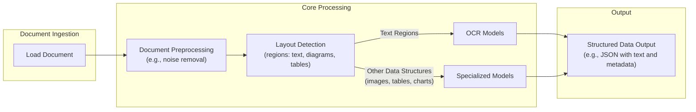
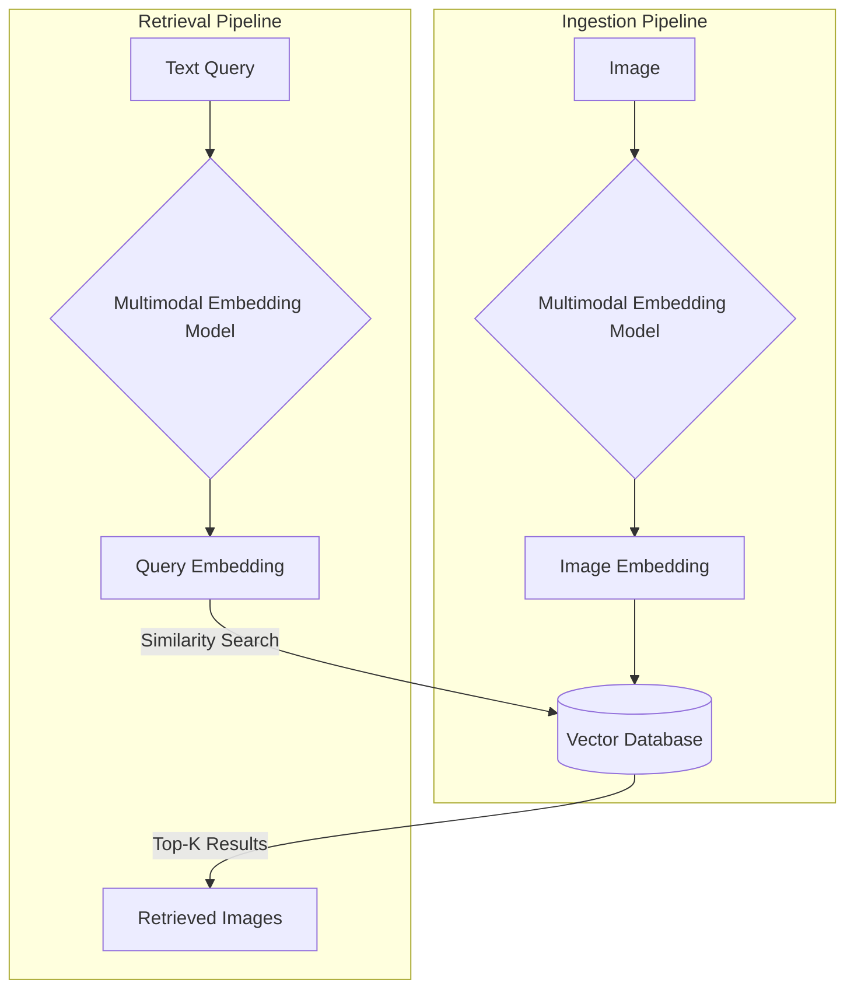
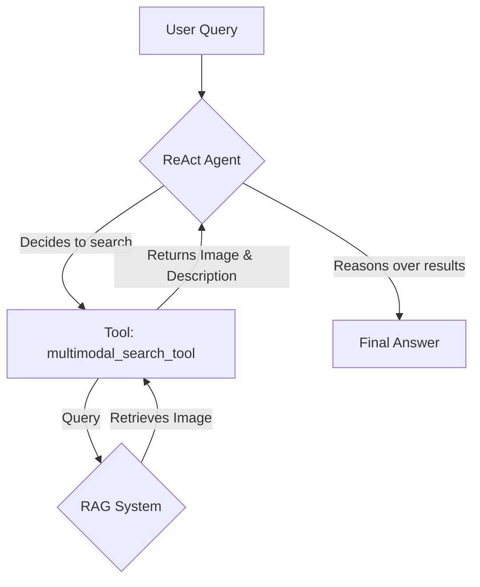

# Stop Converting Documents to Text. You're Doing It Wrong.

## Introduction: The need for multimodal AI

When we first started building AI agents, we hit a frustrating wall. We were comfortable manipulating text, but the moment we had to integrate multimodal data, such as images, audio, and especially documents like PDFs, our elegant architectures turned into messy hacks. We spent weeks building complex pipelines that tried to force everything into text. We chained OCR engines to scrape PDFs, layout detection models to identify tables, and separate classifiers to handle images. It was a brittle, slow, and expensive solution that broke every time a document layout changed.

The breakthrough came when we realized we were solving the wrong problem. We did not need to convert documents to text. We needed to treat them as images. Once we understood that every PDF page is effectively an image and that modern LLMs can “see” just as well as they can read, the complexity vanished. We could completely skip the OCR purgatory and focus on the three core inputs of an LLM: text, images, and audio.

This shift is essential because real-world AI applications rarely exist in a text-only vacuum. As human beings, we process information visually and audibly. Enterprise applications mirror this reality. They need to manipulate private data from warehouses and lakes that is inherently multimodal: financial reports with complex charts, technical diagrams, building sketches, and audio logs. The old approach of normalizing everything to text is lossy. When you translate a complex diagram or a chart into text, you lose the spatial relationships, the colors, and the context. You lose the information that matters most. By processing data in its native format, we preserve this rich visual information, resulting in systems that are faster, cheaper, and more performant.

Ultimately, as data is made for humans, you want the LLM to process the data as close as a human would, which often is visually. We have covered a lot in the first part of this course, from the fundamentals of context engineering and structured outputs to building agents with tools, reasoning, and memory. Now, we will tackle a core component of modern AI systems: multimodal data. The rise of multimodal LLMs is driven by a subtle but powerful force: enterprise requirements. Enterprise applications work heavily with documents, and the need to process them illustrates the core problem that multimodal AI solves. While this problem is most visible with PDFs, the same principles apply to other modalities like images, audio, or video.

Real-world applications include object detection, image captioning, and analyzing financial reports with complex charts, medical diagnostics, or technical documentation with diagrams. Text-only approaches fall short in these areas; for example, a study showed GPT-4 outperformed human analysts in earnings prediction from balance sheets, but it required manual input of tabular data, which can introduce bias and incompleteness. Similarly, in medical imaging, AI excels at tasks like tumor segmentation and classification, but these are inherently visual tasks that text-only models cannot handle.

Here is what we will cover:

*   **Foundations of Multimodal LLMs:** An intuition on how models process visual and textual tokens together.
*   **Practical Implementation:** How to work with images and PDFs using the Gemini API.
*   **Foundations of Multimodal RAG:** How to build retrieval systems for images and documents.
*   **Building the Agent:** A step-by-step guide to building a multimodal ReAct agent.

## Limitations of traditional document processing

To understand the problem better, let's examine the limitations of traditional document processing for invoices, documentation, or reports. This approach relies on Optical Character Recognition (OCR) to convert visual information to text, but it is a fragile and inefficient system.

A typical OCR-based workflow involves several steps. After loading a document, it undergoes preprocessing to remove noise. A layout detection model then identifies different regions like text, tables, and diagrams. Text regions are sent to an OCR model, while other structures are handled by specialized models. Finally, the extracted text and metadata are structured into a format like JSON [[46]](https://www.daft.ai/blog/end-to-end-distributed-pdf-processing-pipeline), [[48]](https://parseur.com/blog/document-processing-automation-guide).



Image 1: A flowchart illustrating the traditional document processing workflow using Layout detection and OCR.

This workflow has too many moving pieces. It requires separate models for layout detection, OCR, and each type of data structure, making the system rigid and difficult to maintain. If a document contains a chart type for which there is no model, the pipeline fails. It is also slow and costly due to the need for multiple model calls [[47]](https://learn.microsoft.com/en-us/answers/questions/5668164/why-traditional-ocr-fails-for-complex-business-doc?page=1).

The biggest issue is performance. The multi-step process creates a cascade effect where errors from one stage compound in the next. Even advanced OCR engines struggle with handwritten text, poor scans, stylized fonts, or complex layouts like nested tables and building sketches. Traditional OCR can achieve 88-94% accuracy on simple documents but fails on more complex layouts. For handwritten text, a character error rate of 3-5% is considered good, which is often not enough for production systems. A 5-degree tilt in a scanned document can increase the word error rate by 15% or more, and resolutions below 300 DPI can cause accuracy to drop by over 20% [[50]](https://intuitionlabs.ai/articles/ai-pdf-data-extraction-clinical-research), [[9]](https://hackernoon.com/complex-document-recognition-ocr-doesnt-work-and-heres-how-you-fix-it), [[1]](https://www.llamaindex.ai/blog/ocr-accuracy).

These systems are template-based, meaning they rely on predefined rules and formats. This makes them fragile; any deviation in layout, such as a change in a table's structure or the presence of a watermark, can cause the system to misinterpret or skip information entirely. This lack of contextual understanding means the system cannot grasp the meaning of the data it extracts, such as distinguishing between a total amount and a tax value without explicit rules. This rigidity leads to increased manual intervention for validation and correction, creating scalability issues when dealing with high volumes of diverse document formats [[47]](https://learn.microsoft.com/en-us/answers/questions/5668164/why-traditional-ocr-fails-for-complex-business-doc?page=1), [[12]](https://netfira.com/why-ocr-technology-fails-on-real-world-documents-and-how-intelligent-document-processing-can-help/).

https://substackcdn.com/image/fetch/f_auto,q_auto:good,fl_progressive:steep/https%3A%2F%2Fsubstack-post-media.s3.amazonaws.com%2Fpublic%2Fimages%2Fa2dc40f3-dc13-486e-853d-8404368f4d8d_1616x1000.png
Image 2: A building sketch showing a crawl space vent diagram, illustrating the complexity of layouts that classic OCR systems struggle to interpret. (Source [Vectorize.io](https://vectorize.io/blog/multimodal-rag-patterns))

While this might work for highly specialized applications, it is clear that it has too many problems and does not scale in a world of flexible and fast AI agents. That is why modern AI solutions use multimodal LLMs, such as Gemini, that can directly interpret text, images, or even PDFs as native input, completely bypassing the OCR workflow.

Thus, let’s understand how multimodal LLMs work.

## Foundations of Multimodal LLMs

Before we dive into the code, you need an intuition for how multimodal LLMs work. You do not need to understand every research detail, but knowing the architecture helps you use, deploy, optimize, and monitor them effectively.

There are two common approaches to building multimodal LLMs: the Unified Embedding Decoder Architecture and the Cross-modality Attention Architecture [[21]](https://magazine.sebastianraschka.com/p/understanding-multimodal-llms).

https://substackcdn.com/image/fetch/f_auto,q_auto:good,fl_progressive:steep/https%3A%2F%2Fsubstack-post-media.s3.amazonaws.com%2Fpublic%2Fimages%2F76f50b57-2585-4cb8-8dda-eea5b5f81c03_1456x854.jpeg
Image 3: The two main approaches to developing multimodal LLM architectures. (Source [Understanding Multimodal LLMs](https://magazine.sebastianraschka.com/p/understanding-multimodal-llms) [[21]](https://magazine.sebastianraschka.com/p/understanding-multimodal-llms))

### Unified Embedding Decoder Architecture

In this approach, we encode the text and image separately, concatenate their embeddings into a single vector, and pass the result to the LLM. On top of a standard LLM architecture, you need a vision encoder that maps the image to an embedding in the same vector space as the text. When the text and image embeddings are merged, the LLM can make sense of both. This method is simpler to implement because it uses an unmodified decoder-style LLM, like a GPT or Llama model, and simply feeds it a combined sequence of image and text tokens [[21]](https://magazine.sebastianraschka.com/p/understanding-multimodal-llms).

https://substackcdn.com/image/fetch/f_auto,q_auto:good,fl_progressive:steep/https%3A%2F%2Fsubstack-post-media.s3.amazonaws.com%2Fpublic%2Fimages%2Fa0979e82-2fb0-4f78-80c8-1395511e057f_1166x1400.jpeg
Image 4: Illustration of the unified embedding decoder architecture. (Source [Understanding Multimodal LLMs](https://magazine.sebastianraschka.com/p/understanding-multimodal-llms) [[21]](https://magazine.sebastianraschka.com/p/understanding-multimodal-llms))

### Cross-modality Attention Architecture

In the second approach, instead of passing the image embeddings with the text embeddings at the input, we inject them directly into the attention module. We still need an image encoder that projects the image into the same vector space as the text, but we inject it deeper within the architecture. This is related to the original Transformer architecture, where the decoder uses cross-attention to look at the encoder's output. In a multimodal context, the image encoder's output serves as the keys and values for the cross-attention layers within the LLM's decoder blocks, while the queries come from the text being processed [[21]](https://magazine.sebastianraschka.com/p/understanding-multimodal-llms).

https://substackcdn.com/image/fetch/f_auto,q_auto:good,fl_progressive:steep/https%3A%2F%2Fsubstack-post-media.s3.amazonaws.com%2Fpublic%2Fimages%2Fea1b9ee4-0d19-4c3c-89db-06e779653da2_1296x1338.jpeg
Image 5: An illustration of the Cross-Modality Attention Architecture approach. (Source [Understanding Multimodal LLMs](https://magazine.sebastianraschka.com/p/understanding-multimodal-llms) [[21]](https://magazine.sebastianraschka.com/p/understanding-multimodal-llms))

### Image Encoders

Both architectures rely on image encoders. To understand them, we can draw a parallel between text tokenization and image patching. Just as we split text into sub-word tokens, we split images into patches [[21]](https://magazine.sebastianraschka.com/p/understanding-multimodal-llms).

https://substackcdn.com/image/fetch/f_auto,q_auto:good,fl_progressive:steep/https%3A%2F%2Fsubstack-post-media.s3.amazonaws.com%2Fpublic%2Fimages%2F4a7104c0-3986-4aae-b918-06c393ff824c_1456x1154.jpeg
Image 6: Image tokenization and embedding (left) and text tokenization and embedding (right) side by side. (Source [Understanding Multimodal LLMs](https://magazine.sebastianraschka.com/p/understanding-multimodal-llms) [[21]](https://magazine.sebastianraschka.com/p/understanding-multimodal-llms))

These patches are then encoded by a pretrained vision transformer (ViT). The ViT flattens each patch and uses a linear projection to map it into an embedding space compatible with the transformer encoder. The output has the same structure and dimensions as text embeddings, but they need to be aligned in the same vector space. This alignment is achieved through another linear projection module, often called a projector or adapter, which ensures that the image embeddings match the dimensions of the text embeddings [[21]](https://magazine.sebastianraschka.com/p/understanding-multimodal-llms).

https://substackcdn.com/image/fetch/f_auto,q_auto:good,fl_progressive:steep/https%3A%2F%2Fsubstack-post-media.s3.amazonaws.com%2Fpublic%2Fimages%2Ffef5f8cb-c76c-4c97-9771-7fdb87d7d8cd_1600x1135.png
Image 7: A classic vision transformer (ViT) setup, where an image is divided into patches, which are then linearly projected and processed by a transformer encoder. (Source [Understanding Multimodal LLMs](https://magazine.sebastianraschka.com/p/understanding-multimodal-llms) [[21]](https://magazine.sebastianraschka.com/p/understanding-multimodal-llms))

Popular image encoder models include CLIP, OpenCLIP, and SigLIP, which often use contrastive learning to align text and image representations. This training method teaches the model to maximize the similarity between positive pairs (an image and its correct caption) and minimize the similarity between negative pairs (an image and an incorrect caption) [[57]](https://towardsdatascience.com/multimodal-embeddings-an-introduction-5dc36975966f/).

Importantly, these encoders are also used in Multimodal RAG. They allow us to find semantic similarities between images and text, enabling a text query to retrieve a relevant image or vice-versa [[4]](https://www.pinecone.io/learn/series/image-search/clip/).

https://substackcdn.com/image/fetch/f_auto,q_auto:good,fl_progressive:steep/https%3A%2F%2Fsubstack-post-media.s3.amazonaws.com%2Fpublic%2Fimages%2F3d4c837a-a3e5-4d60-97ce-c4d4faf4cf57_841x616.png
Image 8: Toy representation of multimodal embedding space. (Source [Multimodal Embeddings: An Introduction](https://towardsdatascience.com/multimodal-embeddings-an-introduction-5dc36975966f/) [[57]](https://towardsdatascience.com/multimodal-embeddings-an-introduction-5dc36975966f/))

You can replicate the same strategy between different modalities, such as text, image, document, and audio vectors, as long as you have an encoder that maps the data into the same vector space. This can be extended by hooking different encoders for each modality, such as using specialized encoders for audio or video [[27]](https://sparkco.ai/blog/exploring-multimodal-llms-text-image-and-video-integration), [[28]](https://www.emergentmind.com/topics/multimodal-llms).

### Trade-offs and Modern Landscape

The **Unified Embedding Decoder** approach is simpler to implement and generally yields higher accuracy in OCR-related tasks. The **Cross-modality Attention** approach is more computationally efficient for high-resolution images because it injects tokens directly into the attention mechanism instead of passing them all as an input sequence. Hybrid approaches exist to combine these benefits [[36]](https://magazine.sebastianraschka.com/p/understanding-multimodal-llms), [[37]](https://arxiv.org/abs/2409.11402).

In 2025, most leading LLMs are multimodal. Open-source examples include Llama, Gemma, and Qwen, while closed-source examples include GPT, Gemini, and Claude. These models often feature innovations like Mixture-of-Experts (MoE) architectures for efficiency and massive context windows (1M+ tokens) for processing large documents or videos [[22]](https://medium.com/data-science-in-your-pocket/2025-the-year-ai-reasoning-models-took-over-a-month-by-month-review-of-frontier-breakthroughs-6ea2163f854f), [[23]](https://codedesign.ai/blog/the-ultimate-guide-to-the-top-large-language-models-in-2025/).

A quick note on **Multimodal LLMs vs. Diffusion Models**: Diffusion models like Midjourney generate images from noise. Multimodal LLMs like GPT understand and sometimes generate images, but they are architecturally different. Multimodal LLMs are typically transformer decoder-based for understanding, while diffusion models are iterative denoising networks for generation. In an agent workflow, diffusion models are typically used as tools, not as the reasoning model [[19]](https://arxiv.org/html/2409.14993v3), [[21]](https://magazine.sebastianraschka.com/p/understanding-multimodal-llms).

This section was not meant to be exhaustive but to provide an intuition on how multimodal LLMs work. Now that we understand how LLMs can directly process images or documents, let’s see this in practice.

## Applying Multimodal LLMs to Images and Documents

To better understand how multimodal LLMs work, let’s write a few examples using Gemini to show some best practices when working with images and PDFs.

There are three core ways to process multimodal data with LLMs:

**Raw bytes:** This is the easiest method for one-off API calls. However, storing raw bytes in a database can lead to corruption, as many databases interpret the input as text instead of bytes.

**Base64:** This method encodes raw bytes as strings, which is useful for storing images or documents directly in a database like PostgreSQL or MongoDB without corruption. The downside is that the file size increases by approximately 33%.

**URLs:** This is the standard for enterprise scenarios. Data is stored in a data lake like AWS S3 or GCP Buckets, and the LLM downloads the media directly. Since the file never passes through your server, this reduces network latency and is the most efficient option for scaling.

```mermaid
graph TD
    subgraph "Method 1: Base64 + Database"
        A[Client] --> B{Application Server};
        B --> C[Database (e.g., PostgreSQL)];
        C -- "Load Base64 String" --> B;
        B -- "Pass Base64 to LLM" --> D((LLM API));
    end

    subgraph "Method 2: URL + Data Lake"
        E[Client] --> F{Application Server};
        F -- "Get URL" --> G[Data Lake (e.g., S3)];
        F -- "Pass URL to LLM" --> H((LLM API));
        H -- "Download from URL" --> G;
    end
```

Image 9: A diagram comparing the data flow for Base64 storage in a database versus URL storage in a data lake.

Each method has its trade-offs. Raw bytes are simple for quick tasks. Base64 is reliable for storing data directly in a database, avoiding corruption. URLs are the most efficient for large-scale, enterprise applications, as they minimize data transfer over your application's network.

Now, let’s dig into the code.

1.  First, we set up our client and display a sample image.
    ```python
    from google import genai
    from google.genai import types
    from PIL import Image
    import io
    from pathlib import Path
    from typing import Literal
    from IPython.display import Image as IPythonImage
    
    client = genai.Client()
    MODEL_ID = "gemini-2.5-flash"
    
    def display_image(image_path: Path) -> None:
        image = IPythonImage(filename=image_path, width=400)
        display(image)
    
    display_image(Path("images") / "image_1.jpeg")
    ```
    It outputs:
    ```text
    <IPython.core.display.Image object>
    ```
    

2.  We define a function to load an image as **raw bytes**. We use the `WEBP` format because it is efficient. We can then call the LLM to generate a caption or compare multiple images.
    ```python
    def load_image_as_bytes(
        image_path: Path, format: Literal["WEBP", "JPEG", "PNG"] = "WEBP", max_width: int = 600, return_size: bool = False
    ) -> bytes | tuple[bytes, tuple[int, int]]:
        image = PILImage.open(image_path)
        if image.width > max_width:
            ratio = max_width / image.width
            new_size = (max_width, int(image.height * ratio))
            image = image.resize(new_size)
    
        byte_stream = io.BytesIO()
        image.save(byte_stream, format=format)
    
        if return_size:
            return byte_stream.getvalue(), image.size
    
        return byte_stream.getvalue()
    
    image_bytes = load_image_as_bytes(image_path=Path("images") / "image_1.jpeg", format="WEBP")
    print(f"Bytes: `{image_bytes[:30]}...`")
    print(f"Size: {len(image_bytes)} bytes")
    
    # Single image captioning
    response = client.models.generate_content(
        model=MODEL_ID,
        contents=[
            types.Part.from_bytes(data=image_bytes, mime_type="image/webp"),
            "Tell me what is in this image in one paragraph.",
        ],
    )
    print(f"Caption: {response.text}")
    
    # Comparing multiple images
    image_bytes_2 = load_image_as_bytes(image_path=Path("images") / "image_2.jpeg", format="WEBP")
    response = client.models.generate_content(
        model=MODEL_ID,
        contents=[
            types.Part.from_bytes(data=image_bytes, mime_type="image/webp"),
            types.Part.from_bytes(data=image_bytes_2, mime_type="image/webp"),
            "What's the difference between these two images? Describe it in one paragraph.",
        ],
    )
    print(f"Difference: {response.text}")
    ```
    It outputs:
    ```text
    Bytes: `b'RIFF\xad\x00\x00WEBPVP8 T\xad\x00\x00P\xec\x02\x9d\x01*X\x02X\x02'...`
    Size: 44392 bytes
    Caption: This striking image features a massive, dark metallic robot...
    
    Difference: The primary difference between the two images lies in the nature of the interaction...
    ```
    

3.  We can also process the image as a **Base64 encoded string**. The logic is similar, but we encode the bytes first.
    ```python
    import base64
    from typing import cast
    
    def load_image_as_base64(
        image_path: Path, format: Literal["WEBP", "JPEG", "PNG"] = "WEBP", max_width: int = 600, return_size: bool = False
    ) -> str:
        image_bytes = load_image_as_bytes(image_path=image_path, format=format, max_width=max_width, return_size=False)
        return base64.b64encode(cast(bytes, image_bytes)).decode("utf-8")
    
    image_base64 = load_image_as_base64(image_path=Path("images") / "image_1.jpeg", format="WEBP")
    print(f"Base64: {image_base64[:100]}...")
    print(f"Size: {len(image_base64)} characters")
    
    print(f"Image as Base64 is {(len(image_base64) - len(image_bytes)) / len(image_bytes) * 100:.2f}% larger than as bytes")
    
    response = client.models.generate_content(
        model=MODEL_ID,
        contents=[
            types.Part.from_bytes(data=image_base64, mime_type="image/webp"),
            "Tell me what is in this image in one paragraph.",
        ],
    )
    ```
    It outputs:
    ```text
    Base64: UklGRmCtAABXRUJQVlA4IFStAABQ7AKdASpYAlgCPm0ylEekIqInJnQ7gOANiWdtk7FnEo2gDknjPixW9SNSb5P7IbBNhLn87Vtp...
    Size: 59192 characters
    Image as Base64 is 33.34% larger than as bytes
    ```
    

4.  For **public URLs**, Gemini's `url_context` tool allows us to parse web pages, PDFs, and images directly.
    ```python
    response = client.models.generate_content(
        model=MODEL_ID,
        contents="Based on the provided paper as a PDF, tell me how ReAct works: https://arxiv.org/pdf/2210.03629",
        config=types.GenerateContentConfig(tools=[{"url_context": {}}]),
    )
    ```
    It outputs:
    ```text
    ReAct is a novel paradigm for large language models (LLMs) that combines reasoning (Thought) and acting (Action) in an interleaved manner...
    ```
    

5.  When using **private data lakes**, Gemini works well with GCP Cloud Storage links. This approach is excellent for production, but we will only show a mocked example for simplicity.
    ```python
    response = client.models.generate_content(
        model=MODEL_ID,
        contents=[
            types.Part.from_uri(uri="gs://gemini-images/image_1.jpeg", mime_type="image/webp"),
            "Tell me what is in this image in one paragraph.",
        ],
    )
    ```
    

6.  Let’s try a more complex task: **Object Detection**. We use Pydantic to define the output structure, as we learned in Lesson 4.
    ```python
    from pydantic import BaseModel, Field
    
    class BoundingBox(BaseModel):
        ymin: float
        xmin: float
        ymax: float
        xmax: float
        label: str
    
    class Detections(BaseModel):
        bounding_boxes: list[BoundingBox]
    
    prompt = """
    Detect all of the prominent items in the image. 
    The box_2d should be [ymin, xmin, ymax, xmax] normalized to 0-1000.
    Also, output the label of the object found within the bounding box.
    """
    
    image_bytes, image_size = load_image_as_bytes(
        image_path=Path("images") / "image_1.jpeg", format="WEBP", return_size=True
    )
    
    config = types.GenerateContentConfig(
        response_mime_type="application/json",
        response_schema=Detections,
    )
    
    response = client.models.generate_content(
        model=MODEL_ID,
        contents=[
            types.Part.from_bytes(data=image_bytes, mime_type="image/webp"),
            prompt,
        ],
        config=config,
    )
    detections = cast(Detections, response.parsed)
    ```
    It outputs:
    ```text
    ymin=1.0 xmin=450.0 ymax=997.0 xmax=1000.0 label='robot'
    ymin=269.0 xmin=39.0 ymax=782.0 xmax=530.0 label='kitten'
    ```
    

7.  Now, let’s process **PDFs**. Because we use a multimodal model, the process is identical to working with images. We can pass the PDF as bytes or as a Base64 encoded string.
    ```python
    # As bytes
    pdf_bytes = (Path("pdfs") / "attention_is_all_you_need_paper.pdf").read_bytes()
    response_bytes = client.models.generate_content(
        model=MODEL_ID,
        contents=[
            types.Part.from_bytes(data=pdf_bytes, mime_type="application/pdf"),
            "What is this document about? Provide a brief summary.",
        ],
    )
    
    # As Base64
    def load_pdf_as_base64(pdf_path: Path) -> str:
        with open(pdf_path, "rb") as f:
            return base64.b64encode(f.read()).decode("utf-8")
    
    pdf_base64 = load_pdf_as_base64(pdf_path=Path("pdfs") / "attention_is_all_you_need_paper.pdf")
    response_base64 = client.models.generate_content(
        model=MODEL_ID,
        contents=[
            "What is this document about? Provide a brief summary.",
            types.Part.from_bytes(data=pdf_base64, mime_type="application/pdf"),
        ],
    )
    ```
    Both methods yield a correct summary of the "Attention Is All You Need" paper. While processing PDFs as images is a powerful technique for complex layouts, the choice between bytes and Base64 often comes down to your storage architecture.
    

8.  Finally, we can perform **Object Detection on PDF pages**. This is powerful for extracting diagrams or tables. We simply treat the PDF page as an image. This concept was popularized by the ColPali paper, which demonstrated that modern Vision Language Models (VLMs) can retrieve documents more effectively by “looking” at them rather than extracting text [[5]](https://arxiv.org/pdf/2407.01449v6).
    ```python
    # Code to load a PDF page as an image
    image_bytes, image_size = load_image_as_bytes(
        image_path=Path("images") / "attention_is_all_you_need_1.jpeg", format="WEBP", return_size=True
    )
    
    prompt = """
    Detect all the diagrams from the provided image as 2d bounding boxes...
    """
    
    # The rest of the object detection code is the same as before
    response = client.models.generate_content(
        model=MODEL_ID,
        contents=[
            types.Part.from_bytes(data=image_bytes, mime_type="image/webp"),
            prompt,
        ],
        config=config,
    )
    detections = cast(Detections, response.parsed)
    ```
    The model successfully detects the diagram on the page, demonstrating how well modern LLMs understand complex visual layouts.
    
    https://substackcdn.com/image/fetch/f_auto,q_auto:good,fl_progressive:steep/https%3A%2F%2Fsubstack-post-media.s3.amazonaws.com%2Fpublic%2Fimages%2Fe7cb5566-8dea-4468-b307-b79b7610c7fa_667x590.png
    Image 10: Object detection on a page from the "Attention Is All You Need" paper. (Image by author)
    

## Foundations of multimodal RAG

One of the most common use cases when working with multimodal data is a concept we already explored in Lesson 10: RAG. When building custom AI apps, you will always have to retrieve private company data to feed into your LLM. For large data formats like images or PDFs, RAG becomes even more important. Stuffing thousands of PDF pages into your LLM's context window is unfeasible due to increased latency, cost, and performance degradation.

A generic multimodal RAG architecture for images and text involves two main pipelines:

*   **Ingestion:** Images are embedded using a text-image embedding model, and these embeddings are stored in a vector database.
*   **Retrieval:** A user's text query is embedded using the same model. The vector database is then queried to find the `top-k` most similar images based on a similarity metric like cosine distance.

This same process works for image-to-text, image-to-image, or any other cross-modal search, as long as the embeddings share the same vector space. This technique is heavily used in image search engines like Google or Apple Photos [[56]](https://opensearch.org/blog/multimodal-semantic-search/).



Image 11: A diagram illustrating the ingestion and retrieval pipelines of a multimodal RAG system.

For our enterprise use case of performing RAG on documents, the state-of-the-art architecture as of 2025 is ColPali. It bypasses the entire OCR pipeline by processing document images directly with vision-language models, making it highly effective for documents with tables, figures, and complex layouts [[5]](https://arxiv.org/pdf/2407.01449v6).

ColPali works by patching document images and creating multi-vector embeddings, or a "bag-of-embeddings," for each page. This is a key difference from traditional text chunking. While text chunking can split sentences and lose context, image patching preserves the document's visual structure and spatial layout. Each patch retains its relative position, allowing the model to understand the arrangement of text, tables, and figures. At query time, ColPali uses a late interaction mechanism (MaxSim) to compute fine-grained similarities between query tokens and all document patches. This is more precise than single-vector comparison but computationally intensive. The architecture is based on PaliGemma-3B with a SigLIP vision encoder [[5]](https://arxiv.org/pdf/2407.01449v6).

https://blog.vespa.ai/assets/2024-09-14-scaling-colpali-to-billions/colpali-ranking.png
Image 12: The ColPali architecture, which uses a late interaction mechanism to score document pages. (Source [Vespa Blog](https://blog.vespa.ai/scaling-colpali-to-billions/) [[68]](https://blog.vespa.ai/scaling-colpali-to-billions/))

This paradigm shift results in 2-10x faster query latency and fewer failure points compared to traditional OCR pipelines. On the ViDoRe benchmark, ColPali significantly outperforms baseline systems, achieving an 81.3% average nDCG@5 score. While the multi-vector approach increases storage footprint, techniques like token pooling and binary quantization can reduce storage costs with minimal performance loss. For example, pooling can reduce the number of vectors by 66.7% while retaining 97.8% of the original performance [[5]](https://arxiv.org/pdf/2407.01449v6).

Now, let's move to a concrete example where we will implement a multi-modal RAG system from scratch.

## Implementing multimodal RAG for images, PDFs and text

Let's connect all the dots with a coding example where we combine what we have learned in this lesson and Lesson 10 on RAG into a multimodal RAG exercise. We will build a simple system where we populate an in-memory vector database with multiple images and PDF pages, then query it with text questions.

To replicate the ColPali design, we will load pages from the `Attention Is All You Need` paper as images and mix them with standard images. However, to keep it simple, we will not patch the images or use a late-interaction reranker.

```mermaid
graph TD
    subgraph Ingestion
        A[Images & PDF Pages] --> B{Generate Descriptions (Gemini)};
        B --> C{Embed Descriptions (Gemini)};
        C --> D[Store in Vector Index];
    end

    subgraph Retrieval
        E[User Text Query] --> F{Embed Query (Gemini)};
        F -- "Similarity Search" --> D;
        D -- "Top-K Results" --> G[Retrieved Images & Descriptions];
    end
```

Image 13: A diagram of our simplified multimodal RAG example.

Now, let's dig into the code.

1.  First, we display the images that we will embed and load into our mocked vector index. In a real-world application, you would use a vector database with dedicated indexes that scale using algorithms like HNSW.
    ```python
    def display_image_grid(image_paths: list[Path], rows: int = 2, cols: int = 2, figsize: tuple = (8, 6)) -> None:
        fig, axes = plt.subplots(rows, cols, figsize=figsize)
        axes = axes.ravel()
    
        for idx, img_path in enumerate(image_paths[: rows * cols]):
            img = PILImage.open(img_path)
            axes[idx].imshow(img)
            axes[idx].axis("off")
    
        plt.tight_layout()
        plt.show()
    
    
    display_image_grid(
        image_paths=[
            Path("images") / "image_1.jpeg",
            Path("images") / "image_2.jpeg",
            Path("images") / "image_3.jpeg",
            Path("images") / "image_4.jpeg",
            Path("images") / "attention_is_all_you_need_1.jpeg",
            Path("images") / "attention_is_all_you_need_2.jpeg",
        ],
        rows=2,
        cols=3,
    )
    ```
    It outputs:
    ```text
    <Figure size 800x600 with 6 Axes>
    ```
    

2.  Next, we define functions to generate image descriptions and create text embeddings using Gemini.
    ```python
    from io import BytesIO
    from typing import Any
    import numpy as np
    
    def generate_image_description(image_bytes: bytes) -> str:
        """Generate a detailed description of an image using Gemini Vision model."""
        try:
            img = PILImage.open(BytesIO(image_bytes))
            prompt = """
            Describe this image in detail for semantic search purposes. 
            Include objects, scenery, colors, composition, text, and any other visual elements that would help someone find 
            this image through text queries.
            """
            response = client.models.generate_content(model=MODEL_ID, contents=[prompt, img])
            return response.text.strip() if response and response.text else ""
        except Exception as e:
            print(f"❌ Failed to generate image description: {e}")
            return ""
    
    def embed_text_with_gemini(content: str) -> np.ndarray | None:
        """Embed text content using Gemini's text embedding model."""
        try:
            result = client.models.embed_content(model="gemini-embedding-001", contents=[content])
            return np.array(result.embeddings[0].values) if result and result.embeddings else None
        except Exception as e:
            print(f"❌ Failed to embed text: {e}")
            return None
    ```
    

3.  We then create our vector index. Since the Gemini Dev API does not support image embeddings directly, we generate a description for each image and embed that text. This is a workaround; with a multimodal embedding model like Voyage AI or Cohere, you would embed the image bytes directly. The rest of the RAG system would remain conceptually the same, as the image and text embeddings exist in the same vector space, allowing for similarity comparisons [[31]](https://milvus.io/blog/choose-embedding-model-rag-2026.md).
    ```python
    from typing import cast
    
    def create_vector_index(image_paths: list[Path]) -> list[dict]:
        """Create embeddings for images by generating and embedding descriptions."""
        vector_index = []
        for image_path in image_paths:
            image_bytes = cast(bytes, load_image_as_bytes(image_path, format="WEBP", return_size=False))
            image_description = generate_image_description(image_bytes)
            image_embedding = embed_text_with_gemini(image_description)
            vector_index.append({
                "content": image_bytes,
                "type": "image",
                "filename": image_path,
                "description": image_description,
                "embedding": image_embedding,
            })
        return vector_index
    
    image_paths = list(Path("images").glob("*.jpeg"))
    vector_index = create_vector_index(image_paths)
    ```
    

4.  Now, we define a function to search the vector index. It embeds the text query and uses cosine similarity to find the top-k most similar items.
    ```python
    from sklearn.metrics.pairwise import cosine_similarity
    
    def search_multimodal(query_text: str, vector_index: list[dict], top_k: int = 3) -> list[Any]:
        """Search for most similar documents to a query."""
        query_embedding = embed_text_with_gemini(query_text)
        if query_embedding is None:
            return []
    
        embeddings = [doc["embedding"] for doc in vector_index]
        similarities = cosine_similarity([query_embedding], embeddings).flatten()
    
        top_indices = np.argsort(similarities)[::-1][:top_k]
    
        results = []
        for idx in top_indices.tolist():
            results.append({**vector_index[idx], "similarity": similarities[idx]})
    
        return results
    ```
    

5.  Let's test this with a query about the Transformer architecture.
    ```python
    query = "what is the architecture of the transformer neural network?"
    results = search_multimodal(query, vector_index, top_k=1)
    ```
    The system correctly retrieves the page from the "Attention Is All You Need" paper that contains the model architecture diagram, with a similarity score of 0.744.
    

6.  Let's try another query: "a kitten with a robot".
    ```python
    query = "a kitten with a robot"
    results = search_multimodal(query, vector_index, top_k=1)
    ```
    This time, it retrieves the correct image of the kitten and the robot with a similarity of 0.811. We used the same vector index to search for both images and PDF pages by normalizing everything to images. This approach could be extended to video frames or audio spectrograms.
    

## Building multimodal AI agents

Now, let's integrate our RAG functionality into a ReAct agent as a tool, consolidating the skills learned in this part of the course.

Multimodal capabilities can be added to AI agents by enabling multimodal inputs for the reasoning LLM, leveraging multimodal retrieval tools, or using tools that interact with external resources like company PDFs or screenshots. In this example, we will create a ReAct agent using LangGraph and connect our `search_multimodal` RAG function as a tool.



Image 14: A diagram showing the workflow of our multimodal ReAct agent using a RAG tool.

Now, let's dig into the code.

1.  First, we define the `multimodal_search_tool` using LangGraph's `@tool` decorator. This tool will wrap our `search_multimodal` function, returning the retrieved image and its description to the agent.
    ```python
    from langchain_core.tools import tool
    
    @tool
    def multimodal_search_tool(query: str) -> dict[str, Any]:
        """
        Search through a collection of images and their text descriptions to find relevant content.
        """
        results = search_multimodal(query, vector_index, top_k=1)
    
        if not results:
            return {"role": "tool_result", "content": "No relevant content found for your query."}
        
        result = results[0]
        content = [
            {"type": "text", "text": f"Image description: {result['description']}"},
            types.Part.from_bytes(data=result["content"], mime_type="image/jpeg"),
        ]
    
        return {"role": "tool_result", "content": content}
    ```
    

2.  Next, we create a ReAct agent using LangGraph's `create_react_agent` function. The system prompt guides the agent to use the search tool when asked about visual content. We will explore LangGraph in more detail in Part 2 of the course.
    ```python
    from langchain_google_genai import ChatGoogleGenerativeAI
    from langgraph.prebuilt import create_react_agent
    
    def build_react_agent() -> Any:
        """Build a ReAct agent with multimodal search capabilities."""
        tools = [multimodal_search_tool]
        system_prompt = """You are a helpful AI assistant that can search through images and text to answer questions.
        
        When asked about visual content like animals, objects, or scenes:
        1. Use the multimodal_search_tool to find relevant images and descriptions
        2. Carefully analyze the image or image descriptions from the search results
        3. Look for specific details like colors, features, objects, or characteristics
        4. Provide a clear, direct answer based on the search results
        
        Always search first using your tools before attempting to answer questions about specific images or visual content.
        """
    
        agent = create_react_agent(
            model=ChatGoogleGenerativeAI(model="gemini-2.5-pro", temperature=0.1),
            tools=tools,
            prompt=system_prompt,
        )
        return agent
    
    react_agent = build_react_agent()
    ```
    

3.  Now, let's ask the agent to find the color of our kitten from the indexed dataset.
    ```python
    test_question = "what color is my kitten?"
    response = react_agent.invoke(input={"messages": test_question})
    ```
    The agent follows the ReAct loop. First, it reasons that it needs to find an image of a kitten and decides to call the `multimodal_search_tool` with the query "my kitten". The tool executes, finds the most relevant image, and returns it along with its description. The agent then observes this output, analyzes the image, and generates the final answer.
    
    It outputs:
    ```text
    Based on the image, your kitten is a gray tabby. It has soft, short gray fur with darker tabby stripe patterns.
    ```
    

In this lesson, we combined structured outputs, tools, ReAct, RAG, and multimodal data to create a proof-of-concept for an agentic RAG system.

## Conclusion

Working with multimodal data is a fundamental skill. Modern AI applications must interact with the complex, visual, and auditory reality of the world.

In this lesson, we moved away from the unstable, multi-step OCR pipelines of the past. We learned that modern LLMs can natively process images and documents, preserving rich context that was previously lost. This capability is rapidly extending to other formats like audio and video, enabling agentic workflows that can reason across all major data types [[70]](https://www.ragie.ai/blog/how-we-built-multimodal-rag-for-audio-and-video). We explored how to handle data as bytes, Base64, and URLs, and how to build agents that can reason across these modalities.

This concludes Part 1 of our course on the foundations of AI Engineering. In Part 2, we will move from theory to practice and begin building our central project: an interconnected research and writing agent system. We will start with a deep dive into agentic design patterns and modern frameworks like LangGraph, then implement the research and writing agents, and finally orchestrate the complete multi-agent pipeline.

## References

- [1] OCR Accuracy Explained: How to Improve It [https://www.llamaindex.ai/blog/ocr-accuracy](https://www.llamaindex.ai/blog/ocr-accuracy)
- [2] What Is Optical Character Recognition (OCR)? [https://blog.roboflow.com/what-is-optical-character-recognition-ocr/](https://blog.roboflow.com/what-is-optical-character-recognition-ocr/)
- [3] Overcoming OCR Errors and Limitations with Intelligent Document Processing [https://jiffy.ai/overcoming-ocr-errors-and-limitations-with-intelligent-document-processing/](https://jiffy.ai/overcoming-ocr-errors-and-limitations-with-intelligent-document-processing/)
- [4] Multi-modal ML with OpenAI's CLIP [https://www.pinecone.io/learn/series/image-search/clip/](https://www.pinecone.io/learn/series/image-search/clip/)
- [5] ColPali: Efficient Document Retrieval with Vision Language Models [https://arxiv.org/pdf/2407.01449v6](https://arxiv.org/pdf/2407.01449v6)
- [6] ChatGPT for Financial Analysis [https://konfuzio.com/en/chatgpt-financial-analysis/](https://konfuzio.com/en/chatgpt-financial-analysis/)
- [7] The Future of Medical Imaging with AI [https://techtoday.lenovo.com/sites/default/files/2025-05/Medical%20Imaging%20White%20Paper%20NVIDIA%20and%20Lenovo.pdf](https://techtoday.lenovo.com/sites/default/files/2025-05/Medical%20Imaging%20White%20Paper%20NVIDIA%20and%20Lenovo.pdf)
- [8] USTT: A Unified Summarization of Text and Tabular data [https://www.ijcai.org/proceedings/2023/0581.pdf](https://www.ijcai.org/proceedings/2023/0581.pdf)
- [9] Complex Document Recognition: OCR Doesn’t Work and Here’s How You Fix It [https://hackernoon.com/complex-document-recognition-ocr-doesnt-work-and-heres-how-you-fix-it](https://hackernoon.com/complex-document-recognition-ocr-doesnt-work-and-heres-how-you-fix-it)
- [10] 10 real-world examples of AI in healthcare [https://www.philips.com/a-w/about/news/archive/features/2022/20221124-10-real-world-examples-of-ai-in-healthcare.html](https://www.philips.com/a-w/about/news/archive/features/2022/20221124-10-real-world-examples-of-ai-in-healthcare.html)
- [11] Unstructured Leads in Document Parsing Quality [https://unstructured.io/blog/unstructured-leads-in-document-parsing-quality-benchmarks-tell-the-full-story](https://unstructured.io/blog/unstructured-leads-in-document-parsing-quality-benchmarks-tell-the-full-story)
- [12] Why OCR technology fails on real-world documents [https://netfira.com/why-ocr-technology-fails-on-real-world-documents-and-how-intelligent-document-processing-can-help/](https://netfira.com/why-ocr-technology-fails-on-real-world-documents-and-how-intelligent-document-processing-can-help/)
- [13] The 6 Biggest OCR Problems and How to Overcome Them [https://conexiom.com/blog/the-6-biggest-ocr-problems-and-how-to-overcome-them](https://conexiom.com/blog/the-6-biggest-ocr-problems-and-how-to-overcome-them)
- [14] Multimodal RAG architecture for complex PDFs [https://www.linkedin.com/posts/sayandey01_generativeai-llm-rag-activity-7412381316106760192-nFx3](https://www.linkedin.com/posts/sayandey01_generativeai-llm-rag-activity-7412381316106760192-nFx3)
- [15] Evaluating Multimodal vs. Text-Based Retrieval for RAG with Snowflake Cortex [https://www.snowflake.com/en/engineering-blog/arctic-agentic-rag-multimodal-pdf-retrieval/](https://www.snowflake.com/en/engineering-blog/arctic-agentic-rag-multimodal-pdf-retrieval/)
- [16] Multimodal RAG [https://pathway.com/developers/templates/rag/multimodal-rag](https://pathway.com/developers/templates/rag/multimodal-rag)
- [17] MMCTAgent for multimodal reasoning [https://www.linkedin.com/posts/gauravagg_mmctagent-enables-multimodal-reasoning-over-activity-7413983881181339648--PyD](https://www.linkedin.com/posts/gauravagg_mmctagent-enables-multimodal-reasoning-over-activity-7413983881181339648--PyD)
- [18] Multimodal RAG Explained [https://www.usaii.org/ai-insights/multimodal-rag-explained-from-text-to-images-and-beyond](https://www.usaii.org/ai-insights/multimodal-rag-explained-from-text-to-images-and-beyond)
- [19] Multi-modal Generative AI: Multi-modal LLMs, Diffusions, and the Unification [https://arxiv.org/html/2409.14993v3](https://arxiv.org/html/2409.14993v3)
- [20] LLM Documentation [https://docs.anyscale.com/llm](https://docs.anyscale.com/llm)
- [21] Understanding Multimodal LLMs [https://magazine.sebastianraschka.com/p/understanding-multimodal-llms](https://magazine.sebastianraschka.com/p/understanding-multimodal-llms)
- [22] 2025: The Year AI Reasoning Models Took Over [https://medium.com/data-science-in-your-pocket/2025-the-year-ai-reasoning-models-took-over-a-month-by-month-review-of-frontier-breakthroughs-6ea2163f854f](https://medium.com/data-science-in-your-pocket/2025-the-year-ai-reasoning-models-took-over-a-month-by-month-review-of-frontier-breakthroughs-6ea2163f854f)
- [23] The Ultimate Guide to the Top Large Language Models in 2025 [https://codedesign.ai/blog/the-ultimate-guide-to-the-top-large-language-models-in-2025/](https://codedesign.ai/blog/the-ultimate-guide-to-the-top-large-language-models-in-2025/)
- [24] Breakdown of 2025 Flagship LLM Architectures [https://www.linkedin.com/posts/progressivethinker_this-is-the-most-essential-breakdown-of-2025-activity-7376654335319117825-a5aD](https://www.linkedin.com/posts/progressivethinker_this-is-the-most-essential-breakdown-of-2025-activity-7376654335319117825-a5aD)
- [25] Coding LLMs Comparison [https://www.preprints.org/manuscript/202508.1904](https://www.preprints.org/manuscript/202508.1904)
- [26] Ultimate 2025 AI Language Models Comparison [https://www.promptitude.io/post/ultimate-2025-ai-language-models-comparison-gpt5-gpt-4-claude-gemini-sonar-more](https://www.promptitude.io/post/ultimate-2025-ai-language-models-comparison-gpt5-gpt-4-claude-gemini-sonar-more)
- [27] Exploring Multimodal LLMs: Text, Image, and Video Integration [https://sparkco.ai/blog/exploring-multimodal-llms-text-image-and-video-integration](https://sparkco.ai/blog/exploring-multimodal-llms-text-image-and-video-integration)
- [28] Multimodal LLMs [https://www.emergentmind.com/topics/multimodal-llms](https://www.emergentmind.com/topics/multimodal-llms)
- [29] Enhancing LLM Capabilities: The Power of Multimodal LLMs and RAG [https://towardsai.net/p/l/enhancing-llm-capabilities-the-power-of-multimodal-llms-and-rag](https://towardsai.net/p/l/enhancing-llm-capabilities-the-power-of-multimodal-llms-and-rag)
- [30] Enhancing LLMs with Multimodal Capabilities [https://arxiv.org/html/2411.06284v3](https://arxiv.org/html/2411.06284v3)
- [31] How to Choose the Best Embedding Model for RAG in 2026 [https://milvus.io/blog/choose-embedding-model-rag-2026.md](https://milvus.io/blog/choose-embedding-model-rag-2026.md)
- [32] Best Embedding Model for RAG [https://eagerworks.com/blog/best-embedding-model-for-rag](https://eagerworks.com/blog/best-embedding-model-for-rag)
- [33] Top Embedding Models in 2025 [https://artsmart.ai/blog/top-embedding-models-in-2025/](https://artsmart.ai/blog/top-embedding-models-in-2025/)
- [34] Combine Image and Text: How Multimodal Retrieval Transforms Search [https://zilliz.com/blog/combine-image-and-text-how-multimodal-retrieval-transforms-search](https://zilliz.com/blog/combine-image-and-text-how-multimodal-retrieval-transforms-search)
- [35] Multimodal Sentence Transformers [https://huggingface.co/blog/multimodal-sentence-transformers](https://huggingface.co/blog/multimodal-sentence-transformers)
- [36] NVLM: Open Frontier-Class Multimodal LLMs [https://magazine.sebastianraschka.com/p/understanding-multimodal-llms](https://magazine.sebastianraschka.com/p/understanding-multimodal-llms)
- [37] NVLM: Open Frontier-Class Multimodal LLMs [https://arxiv.org/abs/2409.11402](https://arxiv.org/abs/2409.11402)
- [38] Multimodal AI Agents [https://kanerika.com/blogs/multimodal-ai-agents/](https://kanerika.com/blogs/multimodal-ai-agents/)
- [39] Multimodal Enterprise AI [https://invisibletech.ai/blog/multimodal-enterprise-ai](https://invisibletech.ai/blog/multimodal-enterprise-ai)
- [40] Multimodal AI Use Cases [https://rasa.com/blog/multimodal-ai-use-cases](https://rasa.com/blog/multimodal-ai-use-cases)
- [41] A Comprehensive Survey and Guide to Multimodal Large Language Models in Vision-Language Tasks [https://github.com/cognitivetech/llm-research-summaries/blob/main/models-review/A-Comprehensive-Survey-and-Guide-to-Multimodal-Large-Language-Models-in-Vision-Language-Tasks.md](https://github.com/cognitivetech/llm-research-summaries/blob/main/models-review/A-Comprehensive-Survey-and-Guide-to-Multimodal-Large-Language-Models-in-Vision-Language-Tasks.md)
- [42] Multimodal AI Examples [https://smartdev.com/multimodal-ai-examples-how-it-works-real-world-applications-and-future-trends/](https://smartdev.com/multimodal-ai-examples-how-it-works-real-world-applications-and-future-trends/)
- [43] Multimodal LLM [https://www.ibm.com/think/topics/multimodal-llm](https://www.ibm.com/think/topics/multimodal-llm)
- [44] Multimodal Large Language Models in Medicine [https://pmc.ncbi.nlm.nih.gov/articles/PMC12479233/](https://pmc.ncbi.nlm.nih.gov/articles/PMC12479233/)
- [45] Multimodal LLMs in Healthcare [https://www.nature.com/articles/s41598-025-98483-1](https://www.nature.com/articles/s41598-025-98483-1)
- [46] End-to-End Distributed PDF Processing Pipeline [https://www.daft.ai/blog/end-to-end-distributed-pdf-processing-pipeline](https://www.daft.ai/blog/end-to-end-distributed-pdf-processing-pipeline)
- [47] Why traditional OCR fails for complex business documents [https://learn.microsoft.com/en-us/answers/questions/5668164/why-traditional-ocr-fails-for-complex-business-doc?page=1](https://learn.microsoft.com/en-us/answers/questions/5668164/why-traditional-ocr-fails-for-complex-business-doc?page=1)
- [48] Document Processing Automation Guide [https://parseur.com/blog/document-processing-automation-guide](https://parseur.com/blog/document-processing-automation-guide)
- [49] OCR for Tables [https://www.llamaindex.ai/blog/ocr-for-tables](https://www.llamaindex.ai/blog/ocr-for-tables)
- [50] AI PDF Data Extraction in Clinical Research [https://intuitionlabs.ai/articles/ai-pdf-data-extraction-clinical-research](https://intuitionlabs.ai/articles/ai-pdf-data-extraction-clinical-research)
- [51] Gemini consistently producing valid Pydantic responses [https://discuss.ai.google.dev/t/gemini-consistently-producing-valid-pydantic-responses/98992](https://discuss.ai.google.dev/t/gemini-consistently-producing-valid-pydantic-responses/98992)
- [52] Stop Converting Documents to Text. You're Doing It Wrong. [https://www.decodingai.com/p/stop-converting-documents-to-text](https://www.decodingai.com/p/stop-converting-documents-to-text)
- [53] LLM Output Parsing & Structured Generation [https://tetrate.io/learn/ai/llm-output-parsing-structured-generation](https://tetrate.io/learn/ai/llm-output-parsing-structured-generation)
- [54] Structured Outputs with Multimodal Gemini [https://python.useinstructor.com/blog/2024/10/23/structured-outputs-with-multimodal-gemini/](https://python.useinstructor.com/blog/2024/10/23/structured-outputs-with-multimodal-gemini/)
- [55] Steering Large Language Models with Pydantic [https://pydantic.dev/articles/llm-intro](https://pydantic.dev/articles/llm-intro)
- [56] Multimodal Semantic Search [https://opensearch.org/blog/multimodal-semantic-search/](https://opensearch.org/blog/multimodal-semantic-search/)
- [57] Multimodal Embeddings: An Introduction [https://towardsdatascience.com/multimodal-embeddings-an-introduction-5dc36975966f/](https://towardsdatascience.com/multimodal-embeddings-an-introduction-5dc36975966f/)
- [58] Joint Visual-Textual Embedding for Multimodal Style Search [https://assets.amazon.science/89/bf/661d950d4059930c8f1d2e449ac6/joint-visual-textual-embedding-for-multimodal-style-search.pdf](https://assets.amazon.science/89/bf/661d950d4059930c8f1d2e449ac6/joint-visual-textual-embedding-for-multimodal-style-search.pdf)
- [59] Multimodal Embeddings: Introduction & Use Cases (with Python) [https://www.youtube.com/watch?v=YOvxh_ma5qE](https://www.youtube.com/watch?v=YOvxh_ma5qE)
- [60] Vision Language Models [https://www.nvidia.com/en-us/glossary/vision-language-models/](https://www.nvidia.com/en-us/glossary/vision-language-models/)
- [61] LangGraph quickstart [https://langchain-ai.github.io/langgraph/agents/agents/](https://langchain-ai.github.io/langgraph/agents/agents/)
- [62] Image understanding with Gemini [https://ai.google.dev/gemini-api/docs/image-understanding](https://ai.google.dev/gemini-api/docs/image-understanding)
- [63] Google Generative AI Embeddings [https://python.langchain.com/docs/integrations/text_embedding/google_generative_ai/](https://python.langchain.com/docs/integrations/text_embedding/google_generative_ai/)
- [64] The 8 best AI image generators in 2025 [https://zapier.com/blog/best-ai-image-generator/](https://zapier.com/blog/best-ai-image-generator/)
- [65] What are some real-world applications of multimodal AI? [https://milvus.io/ai-quick-reference/what-are-some-realworld-applications-of-multimodal-ai](https://milvus.io/ai-quick-reference/what-are-some-realworld-applications-of-multimodal-ai)
- [66] Multimodal RAG with Colpali, Milvus and VLMs [https://huggingface.co/blog/saumitras/colpali-milvus-multimodal-rag](https://huggingface.co/blog/saumitras/colpali-milvus-multimodal-rag)
- [67] ColPali Qdrant Optimization [https://qdrant.tech/blog/colpali-qdrant-optimization/](https://qdrant.tech/blog/colpali-qdrant-optimization/)
- [68] Scaling ColPali to billions of PDFs with Vespa [https://blog.vespa.ai/scaling-colpali-to-billions/](https://blog.vespa.ai/scaling-colpali-to-billions/)
- [69] ViDoRe Benchmark V2: Raising the Bar for Visual Retrieval [https://huggingface.co/blog/manu/vidore-v2](https://huggingface.co/blog/manu/vidore-v2)
- [70] How we built Multimodal RAG for audio and video [https://www.ragie.ai/blog/how-we-built-multimodal-rag-for-audio-and-video](https://www.ragie.ai/blog/how-we-built-multimodal-rag-for-audio-and-video)
</article>