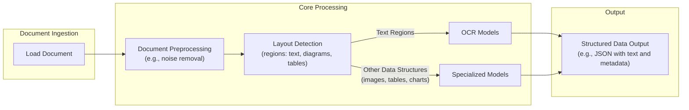

# Stop Converting Documents to Text. You're Doing It Wrong.

When I first started building AI agents, I hit a frustrating wall. I was comfortable manipulating text, but the moment I had to integrate multimodal data, such as images, audio, and especially documents like PDFs, my elegant architectures turned into messy hacks. I spent weeks building complex pipelines that tried to force everything into text. I chained OCR engines to scrape PDFs, layout detection models to identify tables, and separate classifiers to handle images. It was a brittle, slow, and expensive solution that broke every time a document layout changed.

The breakthrough came when I realized I was solving the wrong problem. I did not need to convert documents to text. I needed to treat them as images. Once I understood that every PDF page is effectively an image and that modern LLMs can “see” just as well as they can read, the complexity vanished. I could completely skip the OCR purgatory and focus on the three core inputs of an LLM: text, images, and audio.

This shift is essential because real-world AI applications rarely exist in a text-only vacuum. As human beings, we process information visually and audibly. Enterprise applications mirror this reality. They need to manipulate private data from warehouses and lakes that is inherently multimodal: financial reports with complex charts, technical diagrams, building sketches, and audio logs.

The old approach of normalizing everything to text is lossy. When you translate a complex diagram or a chart into text, you lose the spatial relationships, the colors, and the context. You lose the information that matters most. By processing data in its native format, we preserve this rich visual information, resulting in systems that are faster, cheaper, and significantly more performant.

Ultimately, as data is made for humans, you want the LLM to process the data as close as a human would, which often is visually.

Here is what we will cover:

*   **Foundations of Multimodal LLMs:** An intuition on how models process visual and textual tokens together.
*   **Practical Implementation:** How to work with images and PDFs using the Gemini API.
*   **Multimodal State Management:** How to structure agent memory for mixed modalities.
*   **Building the Agent:** A step-by-step guide to building a multimodal ReAct agent.

## The Need for Multimodal AI

We have covered a lot in the first part of this course, from the fundamentals of context engineering and structured outputs to building agents with tools, reasoning, and memory. Now, we will tackle the final piece of the puzzle: multimodal data.

The rise of multimodal LLMs is driven by a subtle but powerful force: enterprise requirements. Enterprise applications work heavily with documents, and the need to process them illustrates the core problem that multimodal AI solves. While this problem is most visible with PDFs, the same principles apply to other modalities like images, audio, or video.

Previously, the standard approach was to normalize everything to text before feeding it into an AI model. This has many flaws, as a substantial amount of information is lost during translation. For example, it is impossible to fully reproduce diagrams, charts, or sketches in a document as text without losing critical context [[39]](https://invisibletech.ai/blog/multimodal-enterprise-ai). Real-world applications include object detection, image captioning, and analyzing financial reports with complex charts, medical diagnostics, or technical documentation with diagrams [[6]](https://konfuzio.com/en/chatgpt-financial-analysis/), [[41]](https://github.com/cognitivetech/llm-research-summaries/blob/main/models-review/A-Comprehensive-Survey-and-Guide-to-Multimodal-Large-Language-Models-in-Vision-Language-Tasks.md).

## Limitations of traditional document processing

To understand the problem better, let's examine the limitations of traditional document processing for invoices, documentation, or reports. This approach relies on Optical Character Recognition (OCR) to convert visual information to text, but it is a fragile and inefficient system.

A typical OCR-based workflow involves several steps: after loading a document, it undergoes preprocessing to remove noise. A layout detection model then identifies different regions like text, tables, and diagrams. Text regions are sent to an OCR model, while other structures are handled by specialized models. Finally, the extracted text and metadata are structured into a format like JSON [[46]](https://www.daft.ai/blog/end-to-end-distributed-pdf-processing-pipeline), [[48]](https://parseur.com/blog/document-processing-automation-guide).



Image 1: A flowchart illustrating the traditional document processing workflow using Layout detection and OCR.

This workflow has too many moving pieces. It requires separate models for layout detection, OCR, and each type of data structure, making the system rigid and difficult to maintain. If a document contains a chart type for which there is no model, the pipeline fails. It is also slow and costly due to the need for multiple model calls [[47]](https://learn.microsoft.com/en-us/answers/questions/5668164/why-traditional-ocr-fails-for-complex-business-doc?page=1).

The biggest issue is performance. The multi-step process creates a cascade effect where errors from one stage compound in the next. Even advanced OCR engines struggle with handwritten text, poor scans, stylized fonts, or complex layouts like nested tables and building sketches. Traditional OCR can achieve 88-94% accuracy on simple documents but fails on more complex layouts [[50]](https://intuitionlabs.ai/articles/ai-pdf-data-extraction-clinical-research/), [[9]](https://hackernoon.com/complex-document-recognition-ocr-doesnt-work-and-heres-how-you-fix-it), [[1]](https://www.llamaindex.ai/blog/ocr-accuracy). For handwritten text, a character error rate of 3-5% is considered good, which is often not enough for production systems [[1]](https://www.llamaindex.ai/blog/ocr-accuracy).

https://substackcdn.com/image/fetch/f_auto,q_auto:good,fl_progressive:steep/https%3A%2F%2Fsubstack-post-media.s3.amazonaws.com%2Fpublic%2Fimages%2Fa2dc40f3-dc13-486e-853d-8404368f4d8d_1616x1000.png
Image 2: A building sketch showing a crawl space vent diagram, illustrating the complexity of layouts that classic OCR systems struggle to interpret. (Source [Vectorize.io](https://vectorize.io/blog/multimodal-rag-patterns))

While this might work for highly specialized applications, it is clear that it has too many problems and does not scale in a world of flexible and fast AI agents. That is why modern AI solutions use multimodal LLMs, such as Gemini, that can directly interpret text, images, or even PDFs as native input, completely bypassing the OCR workflow.

Thus, let’s understand how multimodal LLMs work.

## Foundations of Multimodal LLMs

Before we dive into the code, you need an intuition for how multimodal LLMs work. You do not need to understand every research detail, but knowing the architecture helps you use, deploy, optimize, and monitor them effectively.

There are two common approaches to building multimodal LLMs: the Unified Embedding Decoder Architecture and the Cross-modality Attention Architecture [[21]](https://magazine.sebastianraschka.com/p/understanding-multimodal-llms).

https://substackcdn.com/image/fetch/f_auto,q_auto:good,fl_progressive:steep/https%3A%2F%2Fsubstack-post-media.s3.amazonaws.com%2Fpublic%2Fimages%2F76f50b57-2585-4cb8-8dda-eea5b5f81c03_1456x854.jpeg
Image 3: The two main approaches to developing multimodal LLM architectures. (Source [Understanding Multimodal LLMs](https://magazine.sebastianraschka.com/p/understanding-multimodal-llms) [[21]](https://magazine.sebastianraschka.com/p/understanding-multimodal-llms))

### Unified Embedding Decoder Architecture

In this approach, we encode the text and image separately, concatenate their embeddings into a single vector, and pass the result to the LLM. On top of a standard LLM architecture, you need a vision encoder that maps the image to an embedding in the same vector space as the text. When the text and image embeddings are merged, the LLM can make sense of both [[21]](https://magazine.sebastianraschka.com/p/understanding-multimodal-llms).

https://substackcdn.com/image/fetch/f_auto,q_auto:good,fl_progressive:steep/https%3A%2F%2Fsubstack-post-media.s3.amazonaws.com%2Fpublic%2Fimages%2Fa0979e82-2fb0-4f78-80c8-1395511e057f_1166x1400.jpeg
Image 4: Illustration of the unified embedding decoder architecture. (Source [Understanding Multimodal LLMs](https://magazine.sebastianraschka.com/p/understanding-multimodal-llms) [[21]](https://magazine.sebastianraschka.com/p/understanding-multimodal-llms))

### Cross-modality Attention Architecture

In the second approach, instead of passing the image embeddings with the text embeddings at the input, we inject them directly into the attention module. We still need an image encoder that projects the image into the same vector space as the text, but we inject it deeper within the architecture [[21]](https://magazine.sebastianraschka.com/p/understanding-multimodal-llms).

https://substackcdn.com/image/fetch/f_auto,q_auto:good,fl_progressive:steep/https%3A%2F%2Fsubstack-post-media.s3.amazonaws.com%2Fpublic%2Fimages%2Fea1b9ee4-0d19-4c3c-89db-06e779653da2_1296x1338.jpeg
Image 5: An illustration of the Cross-Modality Attention Architecture approach. (Source [Understanding Multimodal LLMs](https://magazine.sebastianraschka.com/p/understanding-multimodal-llms) [[21]](https://magazine.sebastianraschka.com/p/understanding-multimodal-llms))

### Image Encoders

Both architectures rely on image encoders. To understand them, we can draw a parallel between text tokenization and image patching. Just as we split text into sub-word tokens, we split images into patches [[21]](https://magazine.sebastianraschka.com/p/understanding-multimodal-llms).

https://substackcdn.com/image/fetch/f_auto,q_auto:good,fl_progressive:steep/https%3A%2F%2Fsubstack-post-media.s3.amazonaws.com%2Fpublic%2Fimages%2F4a7104c0-3986-4aae-b918-06c393ff824c_1456x1154.jpeg
Image 6: Image tokenization and embedding (left) and text tokenization and embedding (right) side by side. (Source [Understanding Multimodal LLMs](https://magazine.sebastianraschka.com/p/understanding-multimodal-llms) [[21]](https://magazine.sebastianraschka.com/p/understanding-multimodal-llms))

The output has the same structure and dimensions as text embeddings, but they need to be aligned in the same vector space. This is achieved through a linear projection module. Popular image encoder models include CLIP, OpenCLIP, and SigLIP, which often leverage contrastive learning to align text and image representations [[57]](https://towardsdatascience.com/multimodal-embeddings-an-introduction-5dc36975966f/).

Importantly, these encoders are also used in Multimodal RAG. They allow us to find semantic similarities between images and text, enabling a text query to retrieve a relevant image or vice-versa [[4]](https://www.pinecone.io/learn/series/image-search/clip/).

https://substackcdn.com/image/fetch/f_auto,q_auto:good,fl_progressive:steep/https%3A%2F%2Fsubstack-post-media.s3.amazonaws.com%2Fpublic%2Fimages%2F3d4c837a-a3e5-4d60-97ce-c4d4faf4cf57_841x616.png
Image 7: Toy representation of multimodal embedding space. (Source [Multimodal Embeddings: An Introduction](https://towardsdatascience.com/multimodal-embeddings-an-introduction-5dc36975966f/) [[57]](https://towardsdatascience.com/multimodal-embeddings-an-introduction-5dc36975966f/))

You can replicate the same strategy between different modalities, such as text, image, document, and audio vectors, as long as you have an encoder that maps the data into the same vector space. This can be extended by hooking different encoders for each modality, such as using specialized encoders for audio or video [[27]](https://sparkco.ai/blog/exploring-multimodal-llms-text-image-and-video-integration), [[28]](https://www.emergentmind.com/topics/multimodal-llms).

### Trade-offs and Modern Landscape

The **Unified Embedding Decoder** approach is simpler to implement and generally yields higher accuracy in OCR-related tasks. The **Cross-modality Attention** approach is more computationally efficient for high-resolution images because it injects tokens directly into the attention mechanism instead of passing them all as an input sequence. Hybrid approaches exist to combine these benefits [[36]](https://magazine.sebastianraschka.com/p/understanding-multimodal-llms), [[37]](https://arxiv.org/abs/2409.11402).

In 2025, most leading LLMs are multimodal. Open-source examples include Llama, Gemma, and Qwen, while closed-source examples include GPT, Gemini, and Claude [[22]](https://medium.com/data-science-in-your-pocket/2025-the-year-ai-reasoning-models-took-over-a-month-by-month-review-of-frontier-breakthroughs-6ea2163f854f), [[23]](https://codedesign.ai/blog/the-ultimate-guide-to-the-top-large-language-models-in-2025/).

A quick note on **Multimodal LLMs vs. Diffusion Models**: Diffusion models like Midjourney generate images from noise. Multimodal LLMs like GPT understand and sometimes generate images, but they are architecturally different. Multimodal LLMs are typically transformer decoder-based for understanding, while diffusion models are iterative denoising networks for generation [[19]](https://arxiv.org/html/2409.14993v3), [[21]](https://magazine.sebastianraschka.com/p/understanding-multimodal-llms). In an agent workflow, diffusion models are typically used as tools, not as the reasoning model.

This section was not meant to be exhaustive but to provide an intuition on how multimodal LLMs work. Now that we understand how LLMs can directly process images or documents, let’s see this in practice.

## Applying Multimodal LLMs to Images and Documents

To better understand how multimodal LLMs work, let’s write a few examples using Gemini to show some best practices when working with images and PDFs.

There are three core ways to process multimodal data with LLMs:

1.  **Raw bytes:** This is the easiest method for one-off API calls. However, storing raw bytes in a database can lead to corruption, as many databases interpret the input as text instead of bytes.
2.  **Base64:** This method encodes raw bytes as strings, which is useful for storing images or documents directly in a database like PostgreSQL or MongoDB without corruption. The downside is that the file size increases by approximately 33%.
3.  **URLs:** This is the standard for enterprise scenarios. Data is stored in a data lake like AWS S3 or GCP Buckets, and the LLM downloads the media directly. Since the file never passes through your server, this reduces network latency and is the most efficient option for scaling.

Now, let’s dig into the code.

1.  First, we set up our client and display a sample image.
    ```python
    from google import genai
    from google.genai import types
    from PIL import Image
    import io
    
    client = genai.Client()
    MODEL_ID = “gemini-2.5-flash”
    
    def display_image(image_path: Path) -> None:
        """
        Display an image from a file path in the notebook.
    
        Args:
            image_path: Path to the image file to display
    
        Returns:
            None
        """
    
        image = IPythonImage(filename=image_path, width=400)
        display(image)
    
    
    display_image(Path("images") / "image_1.jpeg")
    ```
    It outputs:
    ```text
    <IPython.core.display.Image object>
    ```
    

2.  We define a function to load an image as **raw bytes**. We use the `WEBP` format because it is efficient. We can then call the LLM to generate a caption or compare multiple images.
    ```python
    def load_image_as_bytes(
        image_path: Path, format: Literal["WEBP", "JPEG", "PNG"] = "WEBP", max_width: int = 600, return_size: bool = False
    ) -> bytes | tuple[bytes, tuple[int, int]]:
        """
        Load an image from file path and convert it to bytes with optional resizing.
    
        Args:
            image_path: Path to the image file to load
            format: Output image format (WEBP, JPEG, or PNG). Defaults to "WEBP"
            max_width: Maximum width for resizing. If image width exceeds this, it will be resized proportionally. Defaults to 600
            return_size: If True, returns both bytes and image size tuple. Defaults to False
    
        Returns:
            bytes: Image data as bytes, or tuple of (bytes, (width, height)) if return_size is True
        """
    
        image = PILImage.open(image_path)
        if image.width > max_width:
            ratio = max_width / image.width
            new_size = (max_width, int(image.height * ratio))
            image = image.resize(new_size)
    
        byte_stream = io.BytesIO()
        image.save(byte_stream, format=format)
    
        if return_size:
            return byte_stream.getvalue(), image.size
    
        return byte_stream.getvalue()
    
    image_bytes = load_image_as_bytes(image_path=Path("images") / "image_1.jpeg", format="WEBP")
    
    # Single image captioning
    response = client.models.generate_content(
        model=MODEL_ID,
        contents=[
            types.Part.from_bytes(data=image_bytes, mime_type="image/webp"),
            "Tell me what is in this image in one paragraph.",
        ],
    )
    print(f"Caption: {response.text}")
    
    # Comparing multiple images
    image_bytes_2 = load_image_as_bytes(image_path=Path("images") / "image_2.jpeg", format="WEBP")
    response = client.models.generate_content(
        model=MODEL_ID,
        contents=[
            types.Part.from_bytes(data=image_bytes, mime_type="image/webp"),
            types.Part.from_bytes(data=image_bytes_2, mime_type="image/webp"),
            "What's the difference between these two images? Describe it in one paragraph.",
        ],
    )
    print(f"Difference: {response.text}")
    ```
    It outputs:
    ```text
    Caption: This striking image features a massive, dark metallic robot, its powerful form detailed with intricate circuit patterns on its head and piercing red glowing eyes. Perched playfully on its right arm is a small, fluffy grey tabby kitten...
    
    Difference: The primary difference between the two images lies in the nature of the interaction depicted and their respective settings. In the first image, a small, grey kitten is shown curiously interacting with a large, metallic robot...
    ```
    

3.  We can also process the image as a **Base64 encoded string**. The logic is similar, but we encode the bytes first.
    ```python
    import base64
    from typing import cast
    
    def load_image_as_base64(
        image_path: Path, format: Literal["WEBP", "JPEG", "PNG"] = "WEBP", max_width: int = 600, return_size: bool = False
    ) -> str:
        """
        Load an image and convert it to base64 encoded string.
        """
    
        image_bytes = load_image_as_bytes(image_path=image_path, format=format, max_width=max_width, return_size=False)
    
        return base64.b64encode(cast(bytes, image_bytes)).decode("utf-8")
    
    image_base64 = load_image_as_base64(image_path=Path("images") / "image_1.jpeg", format="WEBP")
    
    print(f"Image as Base64 is {(len(image_base64) - len(image_bytes)) / len(image_bytes) * 100:.2f}% larger than as bytes")
    
    response = client.models.generate_content(
        model=MODEL_ID,
        contents=[
            types.Part.from_bytes(data=image_base64, mime_type="image/webp"),
            "Tell me what is in this image in one paragraph.",
        ],
    )
    ```
    It outputs:
    ```text
    Image as Base64 is 33.34% larger than as bytes
    ```
    

4.  For **public URLs**, Gemini's `url_context` tool allows us to parse web pages, PDFs, and images directly.
    ```python
    response = client.models.generate_content(
        model=MODEL_ID,
        contents="Based on the provided paper as a PDF, tell me how ReAct works: https://arxiv.org/pdf/2210.03629",
        config=types.GenerateContentConfig(tools=[{"url_context": {}}]),
    )
    ```
    It outputs:
    ```text
    ReAct is a novel paradigm for large language models (LLMs) that combines reasoning (Thought) and acting (Action) in an interleaved manner to solve diverse language and decision-making tasks...
    ```
    

5.  When using **private data lakes**, Gemini works well with GCP Cloud Storage links. This approach is excellent for production, but we will only show a mocked example for simplicity.
    ```python
    response = client.models.generate_content(
        model=MODEL_ID,
        contents=[
            types.Part.from_uri(uri="gs://gemini-images/image_1.jpeg", mime_type="image/webp"),
            "Tell me what is in this image in one paragraph.",
        ],
    )
    ```
    

6.  Let’s try a more complex task: **Object Detection**. We use Pydantic to define the output structure, as we learned in Lesson 4.
    ```python
    from pydantic import BaseModel, Field
    
    class BoundingBox(BaseModel):
        ymin: float
        xmin: float
        ymax: float
        xmax: float
        label: str = Field(
            default="The category of the object found within the bounding box. For example: cat, dog, diagram, robot."
        )
    
    class Detections(BaseModel):
        bounding_boxes: list[BoundingBox]
    
    prompt = """
    Detect all of the prominent items in the image. 
    The box_2d should be [ymin, xmin, ymax, xmax] normalized to 0-1000.
    Also, output the label of the object found within the bounding box.
    """
    
    image_bytes, image_size = load_image_as_bytes(
        image_path=Path("images") / "image_1.jpeg", format="WEBP", return_size=True
    )
    
    config = types.GenerateContentConfig(
        response_mime_type="application/json",
        response_schema=Detections,
    )
    
    response = client.models.generate_content(
        model=MODEL_ID,
        contents=[
            types.Part.from_bytes(
                data=image_bytes,
                mime_type="image/webp",
            ),
            prompt,
        ],
        config=config,
    )
    
    detections = cast(Detections, response.parsed)
    ```
    It outputs:
    ```text
    ymin=1.0 xmin=450.0 ymax=997.0 xmax=1000.0 label='robot'
    ymin=269.0 xmin=39.0 ymax=782.0 xmax=530.0 label='kitten'
    ```
    

7.  Now, let’s process **PDFs**. Because we use a multimodal model, the process is identical to working with images. We can pass the PDF as bytes.
    ```python
    pdf_bytes = (Path("pdfs") / "attention_is_all_you_need_paper.pdf").read_bytes()
    
    response = client.models.generate_content(
        model=MODEL_ID,
        contents=[
            types.Part.from_bytes(data=pdf_bytes, mime_type="application/pdf"),
            "What is this document about? Provide a brief summary of the main topics.",
        ],
    )
    ```
    It outputs:
    ```text
    This document introduces the **Transformer**, a novel neural network architecture designed for **sequence transduction tasks** (like machine translation)...
    ```
    

8.  Finally, we can perform **Object Detection on PDF pages**. This is powerful for extracting diagrams or tables. We simply treat the PDF page as an image. This concept was popularized by the ColPali paper, which demonstrated that modern Vision Language Models (VLMs) can retrieve documents more effectively by “looking” at them rather than extracting text [[5]](https://arxiv.org/pdf/2407.01449v6).
    ```python
    # Code to load a PDF page as an image
    image_bytes, image_size = load_image_as_bytes(
        image_path=Path("images") / "attention_is_all_you_need_1.jpeg", format="WEBP", return_size=True
    )
    
    prompt = """
    Detect all the diagrams from the provided image as 2d bounding boxes...
    """
    
    # The rest of the object detection code is the same as before
    response = client.models.generate_content(
        model=MODEL_ID,
        contents=[
            types.Part.from_bytes(data=image_bytes, mime_type="image/webp"),
            prompt,
        ],
        config=config,
    )
    detections = cast(Detections, response.parsed)
    ```
    The model successfully detects the diagram on the page, demonstrating how well modern LLMs understand complex visual layouts.
    
    <figure>
        
        <figcaption>Image 8: Object detection on a page from the "Attention Is All You Need" paper.</figcaption>
    </figure>
    

The ColPali architecture processes document pages as images, creating over 1,000 embedding vectors per page [[67]](https://qdrant.tech/blog/colpali-qdrant-optimization/). It uses a late-interaction mechanism (MaxSim) that compares all query and page vectors, which is precise but computationally expensive at scale [[5]](https://arxiv.org/pdf/2407.01449v6). To manage this, techniques like binary quantization replace float dot products with faster hamming distance calculations, significantly reducing latency with a minimal drop in accuracy [[68]](https://blog.vespa.ai/scaling-colpali-to-billions/). This space is advancing so quickly that benchmarks like ViDoRe are already on their second version to keep up with new state-of-the-art models [[69]](https://huggingface.co/blog/manu/vidore-v2).

## Foundations of Multimodal AI Agents

What if we want to use these methods within an Agent?

Agents manage their internal state, or short-term memory, as a list of messages. When transitioning from text-only to multimodal, the structure changes slightly. We need a way to represent different data types using the formats we just discussed (URL, Base64, Binary).

We move from a list of text-only JSONs to a list of JSONs containing a mix of modalities. Each item can be text, an image, or audio. As long as the LLM can process these modalities, our job is to properly manage them in short-term memory, retrieve them from long-term memory, and pass them in the right encoding.

https://substackcdn.com/image/fetch/f_auto,q_auto:good,fl_progressive:steep/https%3A%2F%2Fsubstack-post-media.s3.amazonaws.com%2Fpublic%2Fimages%2F90c2c4cb-f95d-4744-bd04-268dc4a7c295_1200x1200.png
Image 9: The transition of an AI agent’s short-term memory from a text-only to a multimodal representation.

Retrieval becomes more interesting in this context. We can now use multimodal similarities. An image from short-term memory can be used to query for similar images, documents, or audio chunks.

Architecturally, a multimodal agentic RAG system looks like any other agentic RAG system. However, this is where you will feel the real need for **semantic search**. With text, you can get far with keyword filters or SQL. But with images or audio, you cannot rely on keywords. You must use vector similarity to find relationships between data types.

Let’s see how we can model this bag of mixed messages with an example.

## Building Multimodal AI Agents

Let’s take this further and design an agentic RAG system. We will assume we have a vector database filled with images, audio data, and PDFs (converted to images), and a multimodal embedding model that supports text-to-image, image-to-audio, and text-to-audio embeddings.

For simplicity, we will mock the retrieval tools that would normally access our vector database and other services like Google Drive or local screenshots.

https://substackcdn.com/image/fetch/f_auto,q_auto:good,fl_progressive:steep/https%3A%2F%2Fsubstack-post-media.s3.amazonaws.com%2Fpublic%2Fimages%2F246dbcab-68dc-41eb-983e-4f2bf5d48fa9_1200x1200.png
Image 10: Agent Interacting With Multimodal Memory

Our main focus is on managing the short-term memory as a list of mixed-modality JSONs. We want the agent to retrieve context from its current multimodal state, leverage its multimodal retrieval tools, provide an answer, and repeat until the task is complete.

1.  First, we define our multimodal tools. In a real application, these would query a vector DB like Qdrant or Pinecone using a multimodal embedding model.
    ```python
    def text_image_search_tool(query: str):
        """Search for images using text description."""
        pass
    
    def image_to_image_search_tool(image_data: str):
        """Find images visually similar to the input image."""
        pass
    
    def image_audio_search_tool(image_data: str):
        """Find audio clips relevant to the image content."""
        pass
    
    def image_document_search_tool(image_data: str):
        """Find documents visually similar to the image."""
        pass
    
    def google_drive_document_search_tool(image_data: str):
        """Search Google Drive for documents related to the image."""
        pass
    
    def computer_screen_shoot_tool():
        """Take a screenshot of the user’s screen."""
        return "<base64_image_string>"
    ```
    

2.  We define the `build_react_agent` function that creates ReAct agents using LangGraph. We use a system prompt that explicitly instructs the agent to handle multimodal inputs.
    ```python
    from langgraph.prebuilt import create_react_agent
    from langchain_google_genai import ChatGoogleGenerativeAI
    
    def build_react_agent():
        system_prompt = """You are a multimodal AI assistant.
        You can see images, read documents, and listen to audio.
        When asked about visual content, use your tools to retrieve relevant context.
        Always analyze the visual features (colors, objects) or audio features (pitch, tone) in your search results."""
    
        model = ChatGoogleGenerativeAI(model="gemini-2.5-pro")
        tools = [
            text_image_search_tool,
            image_to_image_search_tool,
            image_audio_search_tool,
            image_document_search_tool,
            google_drive_document_search_tool,
            computer_screen_shoot_tool,
        ]
    
        agent = create_react_agent(model, tools, system_prompt)
    
        return agent
    ```
    

3.  We build the `react_agent` and run it with a query that requires multimodal reasoning: *“Based on what I am looking at, retrieve all relevant images, audio, and documents.”*
    ```python
    agent = build_react_agent()
    
    response = agent.invoke({"messages": ["Based on what I am looking at, retrieve all relevant images, audio and documents"]})
    ```
    

4.  Let’s look at a potential reasoning trace. The agent first calls `computer_screen_shoot_tool` and receives a Base64 image. This image is appended to the message history.
    ```json
    {
      "role": "tool",
      "name": "computer_screen_shoot_tool",
      "parts": [
        {
          "inline_data": {
            "mime_type": "image/jpeg",
            "data": "/9j/4AAQSkZJRg..."
          }
        }
      ]
    }
    ```
    

5.  With the image in its context, the agent analyzes the visual content (a gray kitten) and decides to call several retrieval tools in parallel, passing the image data from the previous turn.
    ```json
    "function_calls": [
      {
        "tool_name": "image_to_image_search_tool",
        "tool_args": { "image_data": "<base64_image_from_previous_turn>" }
      },
      {
        "tool_name": "image_audio_search_tool",
        "tool_args": { "image_data": "<base64_image_from_previous_turn>" }
      },
      ...
    ]
    ```
    

6.  The tools execute and return mixed modalities: images, audio, and document pages. The agent's state is updated with these new observations, enriching its context.
    ```json
    [
      {
        "role": "tool",
        "name": "image_to_image_search_tool",
        "parts": [
          { "text": "Found 3 similar images:" },
          { "inline_data": { "mime_type": "image/jpeg", "data": "..." } },
          ...
        ]
      },
      {
        "role": "tool",
        "name": "image_audio_search_tool",
        "parts": [
          { "text": "Found similar audio clip (as binary data):" },
          { "inline_data": { "mime_type": "audio/mp3", "data": "<binary_audio_bytes>" } }
        ]
      },
      ...
    ]
    ```
    

7.  The agent then compiles this information into a final answer. If we ask a follow-up question like, *“What is the color of my kitten?”*, the agent can answer directly from its short-term memory without needing to use tools again, because the screenshot is already in its context.

Nothing fundamental has changed in how we structure our data when switching from text-only to multimodal agents. We simply reflect the data types within the JSONs. The key is that our LLM knows how to process that data. The hard part is retrieving the correct multimodal data from our databases and indexing it properly.

## Conclusion

Working with multimodal data is a fundamental skill. Modern AI applications must interact with the complex, visual, and auditory reality of the world.

In this lesson, we moved away from the unstable, multi-step OCR pipelines of the past. We learned that modern LLMs can natively process images and documents, preserving rich context that was previously lost. This capability is rapidly extending to other formats like audio and video, enabling agentic workflows that can reason across all major data types [[70]](https://www.ragie.ai/blog/how-we-built-multimodal-rag-for-audio-and-video). We explored how to handle data as bytes, Base64, and URLs, and how to build agents that can reason across these modalities.

This concludes our *AI Agents Foundations* series. We started by understanding the difference between workflows and agents, mastered context engineering and structured outputs, built robust planning capabilities with ReAct, and finally gave our agents eyes and ears. You now have the foundational blocks to build production-ready AI systems.

In Part 2 of this course, we will move from theory to practice and begin building our central project: an interconnected research and writing agent system. We will start with a deep dive into agentic design patterns and modern frameworks like LangGraph, then implement the research and writing agents, and finally orchestrate the complete multi-agent pipeline.

## References

- [1] Liu, J. (2025, February 24). OlmOCR-bench review: Insights and pitfalls on an OCR benchmark. LlamaIndex. [https://www.llamaindex.ai/blog/olmocr-bench-review-insights-and-pitfalls-on-an-ocr-benchmark](https://www.llamaindex.ai/blog/olmocr-bench-review-insights-and-pitfalls-on-an-ocr-benchmark)
- [2] What Is Optical Character Recognition (OCR)?. (2023, November 21). Roboflow Blog. [https://blog.roboflow.com/what-is-optical-character-recognition-ocr/](https://blog.roboflow.com/what-is-optical-character-recognition-ocr/)
- [3] Jiffy.ai. (n.d.). Overcoming OCR Errors and Limitations with Intelligent Document Processing. [https://jiffy.ai/overcoming-ocr-errors-and-limitations-with-intelligent-document-processing/](https://jiffy.ai/overcoming-ocr-errors-and-limitations-with-intelligent-document-processing/)
- [4] Multi-modal ML with OpenAI's CLIP. (n.d.). Pinecone. [https://www.pinecone.io/learn/series/image-search/clip/](https://www.pinecone.io/learn/series/image-search/clip/)
- [5] Fostiropoulos, I., et al. (2024). ColPali: Efficient Document Retrieval with Vision Language Models. arXiv. [https://arxiv.org/pdf/2407.01449v6](https://arxiv.org/pdf/2407.01449v6)
- [6] ChatGPT for Financial Analysis. (n.d.). Konfuzio. [https://konfuzio.com/en/chatgpt-financial-analysis/](https://konfuzio.com/en/chatgpt-financial-analysis/)
- [7] NVIDIA & Lenovo. (2025, May). The Future of Medical Imaging with AI. [https://techtoday.lenovo.com/sites/default/files/2025-05/Medical%20Imaging%20White%20Paper%20NVIDIA%20and%20Lenovo.pdf](https://techtoday.lenovo.com/sites/default/files/2025-05/Medical%20Imaging%20White%20Paper%20NVIDIA%20and%20Lenovo.pdf)
- [8] Chen, W., et al. (2023). USTT: A Unified Summarization of Text and Tabular data. IJCAI. [https://www.ijcai.org/proceedings/2023/0581.pdf](https://www.ijcai.org/proceedings/2023/0581.pdf)
- [9] Kokorin, O. (2023, October 12). Complex Document Recognition: OCR Doesn’t Work and Here’s How You Fix It. HackerNoon. [https://hackernoon.com/complex-document-recognition-ocr-doesnt-work-and-heres-how-you-fix-it](https://hackernoon.com/complex-document-recognition-ocr-doesnt-work-and-heres-how-you-fix-it)
- [10] Philips. (2022, November 24). 10 real-world examples of AI in healthcare. [https://www.philips.com/a-w/about/news/archive/features/2022/20221124-10-real-world-examples-of-ai-in-healthcare.html](https://www.philips.com/a-w/about/news/archive/features/2022/20221124-10-real-world-examples-of-ai-in-healthcare.html)
- [11] unstructured.io. (n.d.). Unstructured Leads in Document Parsing Quality. [https://unstructured.io/blog/unstructured-leads-in-document-parsing-quality-benchmarks-tell-the-full-story](https://unstructured.io/blog/unstructured-leads-in-document-parsing-quality-benchmarks-tell-the-full-story)
- [12] Netfira. (n.d.). Why OCR technology fails on real-world documents. [https://netfira.com/why-ocr-technology-fails-on-real-world-documents-and-how-intelligent-document-processing-can-help/](https://netfira.com/why-ocr-technology-fails-on-real-world-documents-and-how-intelligent-document-processing-can-help/)
- [13] Conexiom. (n.d.). The 6 Biggest OCR Problems and How to Overcome Them. [https://conexiom.com/blog/the-6-biggest-ocr-problems-and-how-to-overcome-them](https://conexiom.com/blog/the-6-biggest-ocr-problems-and-how-to-overcome-them)
- [14] Dey, S. (2024, June 14). Multimodal RAG architecture for complex PDFs. LinkedIn. [https://www.linkedin.com/posts/sayandey01_generativeai-llm-rag-activity-7412381316106760192-nFx3](https://www.linkedin.com/posts/sayandey01_generativeai-llm-rag-activity-7412381316106760192-nFx3)
- [15] Snowflake Engineering. (2025, April 21). Evaluating Multimodal vs. Text-Based Retrieval for RAG with Snowflake Cortex. [https://www.snowflake.com/en/engineering-blog/arctic-agentic-rag-multimodal-pdf-retrieval/](https://www.snowflake.com/en/engineering-blog/arctic-agentic-rag-multimodal-pdf-retrieval/)
- [16] Pathway. (n.d.). Multimodal RAG. [https://pathway.com/developers/templates/rag/multimodal-rag](https://pathway.com/developers/templates/rag/multimodal-rag)
- [17] Aggarwal, G. (2024, June 19). MMCTAgent for multimodal reasoning. LinkedIn. [https://www.linkedin.com/posts/gauravagg_mmctagent-enables-multimodal-reasoning-over-activity-7413983881181339648--PyD](https://www.linkedin.com/posts/gauravagg_mmctagent-enables-multimodal-reasoning-over-activity-7413983881181339648--PyD)
- [18] USAII. (n.d.). Multimodal RAG Explained. [https://www.usaii.org/ai-insights/multimodal-rag-explained-from-text-to-images-and-beyond](https://www.usaii.org/ai-insights/multimodal-rag-explained-from-text-to-images-and-beyond)
- [19] Wang, X., et al. (2025). Multi-modal Generative AI: Multi-modal LLMs, Diffusions, and the Unification. arXiv. [https://arxiv.org/html/2409.14993v3](https://arxiv.org/html/2409.14993v3)
- [20] Anyscale. (n.d.). LLM Documentation. [https://docs.anyscale.com/llm](https://docs.anyscale.com/llm)
- [21] Raschka, S. (2024, November 3). Understanding Multimodal LLMs. [https://magazine.sebastianraschka.com/p/understanding-multimodal-llms](https://magazine.sebastianraschka.com/p/understanding-multimodal-llms)
- [22] Data Science in Your Pocket. (2025). 2025: The Year AI Reasoning Models Took Over. Medium. [https://medium.com/data-science-in-your-pocket/2025-the-year-ai-reasoning-models-took-over-a-month-by-month-review-of-frontier-breakthroughs-6ea2163f854f](https://medium.com/data-science-in-your-pocket/2025-the-year-ai-reasoning-models-took-over-a-month-by-month-review-of-frontier-breakthroughs-6ea2163f854f)
- [23] Codedesign.ai. (2025). The Ultimate Guide to the Top Large Language Models in 2025. [https://codedesign.ai/blog/the-ultimate-guide-to-the-top-large-language-models-in-2025/](https://codedesign.ai/blog/the-ultimate-guide-to-the-top-large-language-models-in-2025/)
- [24] ProgressiveThinker. (2025). Breakdown of 2025 Flagship LLM Architectures. LinkedIn. [https://www.linkedin.com/posts/progressivethinker_this-is-the-most-essential-breakdown-of-2025-activity-7376654335319117825-a5aD](https://www.linkedin.com/posts/progressivethinker_this-is-the-most-essential-breakdown-of-2025-activity-7376654335319117825-a5aD)
- [25] Preprints.org. (2025). Coding LLMs Comparison. [https://www.preprints.org/manuscript/202508.1904](https://www.preprints.org/manuscript/202508.1904)
- [26] Promptitude. (2025). Ultimate 2025 AI Language Models Comparison. [https://www.promptitude.io/post/ultimate-2025-ai-language-models-comparison-gpt5-gpt-4-claude-gemini-sonar-more](https://www.promptitude.io/post/ultimate-2025-ai-language-models-comparison-gpt5-gpt-4-claude-gemini-sonar-more)
- [27] SparkCo. (n.d.). Exploring Multimodal LLMs: Text, Image, and Video Integration. [https://sparkco.ai/blog/exploring-multimodal-llms-text-image-and-video-integration](https://sparkco.ai/blog/exploring-multimodal-llms-text-image-and-video-integration)
- [28] Emergent Mind. (n.d.). Multimodal LLMs. [https://www.emergentmind.com/topics/multimodal-llms](https://www.emergentmind.com/topics/multimodal-llms)
- [29] Towards AI. (n.d.). Enhancing LLM Capabilities: The Power of Multimodal LLMs and RAG. [https://towardsai.net/p/l/enhancing-llm-capabilities-the-power-of-multimodal-llms-and-rag](https://towardsai.net/p/l/enhancing-llm-capabilities-the-power-of-multimodal-llms-and-rag)
- [30] arXiv. (2024). Enhancing LLMs with Multimodal Capabilities. [https://arxiv.org/html/2411.06284v3](https://arxiv.org/html/2411.06284v3)
- [31] Zhang, C. (2026, March 25). How to Choose the Best Embedding Model for RAG in 2026. Milvus. [https://milvus.io/blog/choose-embedding-model-rag-2026.md](https://milvus.io/blog/choose-embedding-model-rag-2026.md)
- [32] eagerworks. (n.d.). Best Embedding Model for RAG. [https://eagerworks.com/blog/best-embedding-model-for-rag](https://eagerworks.com/blog/best-embedding-model-for-rag)
- [33] artsmart.ai. (2025). Top Embedding Models in 2025. [https://artsmart.ai/blog/top-embedding-models-in-2025/](https://artsmart.ai/blog/top-embedding-models-in-2025/)
- [34] Zilliz. (n.d.). Combine Image and Text: How Multimodal Retrieval Transforms Search. [https://zilliz.com/blog/combine-image-and-text-how-multimodal-retrieval-transforms-search](https://zilliz.com/blog/combine-image-and-text-how-multimodal-retrieval-transforms-search)
- [35] Hugging Face. (n.d.). Multimodal Sentence Transformers. [https://huggingface.co/blog/multimodal-sentence-transformers](https://huggingface.co/blog/multimodal-sentence-transformers)
- [36] NVIDIA. (2024). NVLM: Open Frontier-Class Multimodal LLMs. [https://magazine.sebastianraschka.com/p/understanding-multimodal-llms](https://magazine.sebastianraschka.com/p/understanding-multimodal-llms)
- [37] NVIDIA. (2024). NVLM: Open Frontier-Class Multimodal LLMs. arXiv. [https://arxiv.org/abs/2409.11402](https://arxiv.org/abs/2409.11402)
- [38] Kanerika. (n.d.). Multimodal AI Agents. [https://kanerika.com/blogs/multimodal-ai-agents/](https://kanerika.com/blogs/multimodal-ai-agents/)
- [39] Invisible Technologies. (n.d.). Multimodal Enterprise AI. [https://invisibletech.ai/blog/multimodal-enterprise-ai](https://invisibletech.ai/blog/multimodal-enterprise-ai)
- [40] Rasa. (n.d.). Multimodal AI Use Cases. [https://rasa.com/blog/multimodal-ai-use-cases](https://rasa.com/blog/multimodal-ai-use-cases)
- [41] Cognitive Tech. (n.d.). A Comprehensive Survey and Guide to Multimodal Large Language Models in Vision-Language Tasks. GitHub. [https://github.com/cognitivetech/llm-research-summaries/blob/main/models-review/A-Comprehensive-Survey-and-Guide-to-Multimodal-Large-Language-Models-in-Vision-Language-Tasks.md](https://github.com/cognitivetech/llm-research-summaries/blob/main/models-review/A-Comprehensive-Survey-and-Guide-to-Multimodal-Large-Language-Models-in-Vision-Language-Tasks.md)
- [42] SmartDev. (n.d.). Multimodal AI Examples. [https://smartdev.com/multimodal-ai-examples-how-it-works-real-world-applications-and-future-trends/](https://smartdev.com/multimodal-ai-examples-how-it-works-real-world-applications-and-future-trends/)
- [43] IBM. (n.d.). Multimodal LLM. [https://www.ibm.com/think/topics/multimodal-llm](https://www.ibm.com/think/topics/multimodal-llm)
- [44] PMC. (n.d.). Multimodal Large Language Models in Medicine. [https://pmc.ncbi.nlm.nih.gov/articles/PMC12479233/](https://pmc.ncbi.nlm.nih.gov/articles/PMC12479233/)
- [45] Nature. (2025). Multimodal LLMs in Healthcare. [https://www.nature.com/articles/s41598-025-98483-1](https://www.nature.com/articles/s41598-025-98483-1)
- [46] Daft.ai. (n.d.). End-to-End Distributed PDF Processing Pipeline. [https://www.daft.ai/blog/end-to-end-distributed-pdf-processing-pipeline](https://www.daft.ai/blog/end-to-end-distributed-pdf-processing-pipeline)
- [47] Microsoft. (n.d.). Why traditional OCR fails for complex business documents. [https://learn.microsoft.com/en-us/answers/questions/5668164/why-traditional-ocr-fails-for-complex-business-doc?page=1](https://learn.microsoft.com/en-us/answers/questions/5668164/why-traditional-ocr-fails-for-complex-business-doc?page=1)
- [48] Parseur. (n.d.). Document Processing Automation Guide. [https://parseur.com/blog/document-processing-automation-guide](https://parseur.com/blog/document-processing-automation-guide)
- [49] LlamaIndex. (n.d.). OCR for Tables. [https://www.llamaindex.ai/blog/ocr-for-tables](https://www.llamaindex.ai/blog/ocr-for-tables)
- [50] Intuition Labs. (n.d.). AI PDF Data Extraction in Clinical Research. [https://intuitionlabs.ai/articles/ai-pdf-data-extraction-clinical-research](https://intuitionlabs.ai/articles/ai-pdf-data-extraction-clinical-research)
- [51] Google AI. (n.d.). Gemini consistently producing valid Pydantic responses. [https://discuss.ai.google.dev/t/gemini-consistently-producing-valid-pydantic-responses/98992](https://discuss.ai.google.dev/t/gemini-consistently-producing-valid-pydantic-responses/98992)
- [52] Iusztin, P. (2025, December 9). Stop Converting Documents to Text. You're Doing It Wrong. Decoding AI Magazine. [https://www.decodingai.com/p/stop-converting-documents-to-text](https://www.decodingai.com/p/stop-converting-documents-to-text)
- [53] Tetrate. (n.d.). LLM Output Parsing & Structured Generation. [https://tetrate.io/learn/ai/llm-output-parsing-structured-generation](https://tetrate.io/learn/ai/llm-output-parsing-structured-generation)
- [54] Instructor. (2024, October 23). Structured Outputs with Multimodal Gemini. [https://python.useinstructor.com/blog/2024/10/23/structured-outputs-with-multimodal-gemini/](https://python.useinstructor.com/blog/2024/10/23/structured-outputs-with-multimodal-gemini/)
- [55] Pydantic. (n.d.). Steering Large Language Models with Pydantic. [https://pydantic.dev/articles/llm-intro](https://pydantic.dev/articles/llm-intro)
- [56] OpenSearch. (n.d.). Multimodal Semantic Search. [https://opensearch.org/blog/multimodal-semantic-search/](https://opensearch.org/blog/multimodal-semantic-search/)
- [57] Talebi, S. (2024, November 29). Multimodal Embeddings: An Introduction. Towards Data Science. [https://towardsdatascience.com/multimodal-embeddings-an-introduction-5dc36975966f/](https://towardsdatascience.com/multimodal-embeddings-an-introduction-5dc36975966f/)
- [58] Amazon Science. (n.d.). Joint Visual-Textual Embedding for Multimodal Style Search. [https://assets.amazon.science/89/bf/661d950d4059930c8f1d2e449ac6/joint-visual-textual-embedding-for-multimodal-style-search.pdf](https://assets.amazon.science/89/bf/661d950d4059930c8f1d2e449ac6/joint-visual-textual-embedding-for-multimodal-style-search.pdf)
- [59] Talebi, S. (2024). Multimodal Embeddings: Introduction & Use Cases (with Python). YouTube. [https://www.youtube.com/watch?v=YOvxh_ma5qE](https://www.youtube.com/watch?v=YOvxh_ma5qE)
- [60] NVIDIA. (n.d.). Vision Language Models. [https://www.nvidia.com/en-us/glossary/vision-language-models/](https://www.nvidia.com/en-us/glossary/vision-language-models/)
- [61] Hugging Face. (n.d.). LangGraph quickstart. [https://langchain-ai.github.io/langgraph/agents/agents/](https://langchain-ai.github.io/langgraph/agents/agents/)
- [62] Google AI. (n.d.). Image understanding with Gemini. [https://ai.google.dev/gemini-api/docs/image-understanding](https://ai.google.dev/gemini-api/docs/image-understanding)
- [63] LangChain. (n.d.). Google Generative AI Embeddings. [https://python.langchain.com/docs/integrations/text_embedding/google_generative_ai/](https://python.langchain.com/docs/integrations/text_embedding/google_generative_ai/)
- [64] Guinness, H. (2026, April 1). The 8 best AI image generators in 2025. Zapier. [https://zapier.com/blog/best-ai-image-generator/](https://zapier.com/blog/best-ai-image-generator/)
- [65] Milvus. (n.d.). What are some real-world applications of multimodal AI?. [https://milvus.io/ai-quick-reference/what-are-some-realworld-applications-of-multimodal-ai](https://milvus.io/ai-quick-reference/what-are-some-realworld-applications-of-multimodal-ai)
- [66] Hugging Face. (2024, December 10). Multimodal RAG with Colpali, Milvus and VLMs. [https://huggingface.co/blog/saumitras/colpali-milvus-multimodal-rag](https://huggingface.co/blog/saumitras/colpali-milvus-multimodal-rag)
- [67] ColPali Qdrant Optimization. (n.d.). Qdrant. [https://qdrant.tech/blog/colpali-qdrant-optimization/](https://qdrant.tech/blog/colpali-qdrant-optimization/)
- [68] Scaling ColPali to billions of PDFs with Vespa. (2024, September 14). Vespa Blog. [https://blog.vespa.ai/scaling-colpali-to-billions/](https://blog.vespa.ai/scaling-colpali-to-billions/)
- [69] ViDoRe Benchmark V2: Raising the Bar for Visual Retrieval. (2025, March 18). Hugging Face. [https://huggingface.co/blog/manu/vidore-v2](https://huggingface.co/blog/manu/vidore-v2)
- [70] How we built Multimodal RAG for audio and video. (n.d.). ragie.ai. [https://www.ragie.ai/blog/how-we-built-multimodal-rag-for-audio-and-video](https://www.ragie.ai/blog/how-we-built-multimodal-rag-for-audio-and-video)