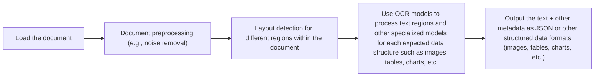

# Stop Converting Documents to Text. You're Doing It Wrong.

In the first part of this course, we built a solid foundation in AI Engineering. We explored the agent landscape, distinguished between LLM workflows and autonomous agents, and mastered context engineering. We learned to ensure reliability with structured outputs, build complex systems with workflow patterns, and give agents the ability to act with tools. We dove into reasoning with ReAct, gave our agents memory, and supercharged them with knowledge through RAG. Now, we will tackle the final piece of the puzzle: multimodal data.

When I first started building AI agents, I hit a frustrating wall. I was comfortable manipulating text, but the moment I had to integrate images, audio, and especially documents like PDFs, my elegant architectures turned into messy hacks. I spent weeks building complex pipelines that tried to force everything into text. I chained OCR engines to scrape PDFs, layout detection models to identify tables, and separate classifiers to handle images. It was a brittle, slow, and expensive solution that broke every time a document layout changed.

The breakthrough came when I realized I was solving the wrong problem. I didn’t need to convert documents to text. I needed to treat them as images. This shift is essential because real-world AI applications rarely exist in a text-only vacuum. Enterprise applications need to manipulate private data from warehouses and lakes that is inherently multimodal: financial reports with complex charts, medical diagnostics, technical diagrams, and building sketches [[39]](https://invisibletech.ai/blog/multimodal-enterprise-ai).

The old approach of normalizing everything to text is lossy. When you translate a complex diagram into text, you lose the spatial relationships, the colors, and the context [[8]](https://www.ijcai.org/proceedings/2023/0581.pdf). By processing data in its native format, we preserve this rich visual information, resulting in systems that are faster, cheaper, and significantly more performant.

Here is what we will cover:

*   **Foundations of Multimodal LLMs:** An intuition on how models process visual and textual tokens together.
*   **Practical Implementation:** How to work with images and PDFs using the Gemini API.
*   **Multimodal RAG:** How to build retrieval systems for images and documents.
*   **Building the Agent:** A step-by-step guide to building a multimodal ReAct agent.

## Limitations of Traditional Document Processing

To understand why native multimodal processing is a better approach, let’s dig deeper into the limitations of traditional document processing. A common use case is extracting information from invoices, reports, or technical manuals. Historically, this meant trying to normalize everything to text before feeding it to an AI model, a process that is riddled with flaws. In many industrial settings, the bottleneck isn't the embedding model but the complex data ingestion pipeline required to prepare documents for it [[61]](https://arxiv.org/html/2407.01449v2).

This workflow, often used for RAG systems, relies on a multi-step pipeline involving Optical Character Recognition (OCR). It typically looks like this:



Image 1: A flowchart illustrating the traditional document processing workflow.

This pipeline has too many moving pieces. You need layout detection models, OCR models for text, and specialized models for each expected data structure, like tables or charts [[46]](https://www.daft.ai/blog/end-to-end-distributed-pdf-processing-pipeline). This makes the system rigid and fragile. If a document contains a chart type you don’t have a model for, the pipeline fails. It’s also slow and costly because you have to chain multiple model calls.

Most importantly, this approach faces significant performance challenges. The multi-step process creates a cascade effect where errors from one stage compound in the next [[47]](https://learn.microsoft.com/en-us/answers/questions/5668164/why-traditional-ocr-fails-for-complex-business-doc?page=1). Even the best OCR engines struggle with handwritten text, poor-quality scans, stylized fonts, or complex layouts like nested tables and multi-column formats [[50]](https://intuitionlabs.ai/articles/ai-pdf-data-extraction-clinical-research). For example, accuracy can drop by over 20% for scans below 300 DPI, and a slight 5-degree tilt can increase word error rates by 15% [[1]](https://www.llamaindex.ai/blog/ocr-accuracy). For complex, unstructured documents, accuracy can fall to as low as 60%, requiring extensive manual correction [[3]](https://jiffy.ai/overcoming-ocr-errors-and-limitations-with-intelligent-document-processing/).

https://substackcdn.com/image/fetch/f_auto,q_auto:good,fl_progressive:steep/https%3A%2F%2Fsubstack-post-media.s3.amazonaws.com%2Fpublic%2Fimages%2Fa2dc40f3-dc13-486e-853d-8404368f4d8d_1616x1000.png
Image 2: A building sketch showing a crawl space vent diagram, illustrating the complexity of layouts that classic OCR systems struggle to interpret. (Source [Vectorize.io](https://vectorize.io/blog/multimodal-rag-patterns))

While this might work for highly specialized applications, it doesn’t scale in a world where AI agents need to be flexible and fast. Modern AI solutions bypass this brittle OCR workflow by using multimodal LLMs like Gemini, which can directly interpret text, images, and PDFs as native inputs.

## Foundations of Multimodal LLMs

To use LLMs with images and documents, you need an intuition for how multimodality works. You don’t need to understand every research detail, but knowing the high-level architecture helps you deploy, optimize, and monitor these systems.

There are two common approaches to building multimodal LLMs: the Unified Embedding Decoder Architecture and the Cross-modality Attention Architecture [[21]](https://magazine.sebastianraschka.com/p/understanding-multimodal-llms).

https://substackcdn.com/image/fetch/f_auto,q_auto:good,fl_progressive:steep/https%3A%2F%2Fsubstack-post-media.s3.amazonaws.com%2Fpublic%2Fimages%2F76f50b57-2585-4cb8-8dda-eea5b5f81c03_1456x854.jpeg
Image 3: The two main approaches to developing multimodal LLM architectures. (Source [Understanding Multimodal LLMs](https://magazine.sebastianraschka.com/p/understanding-multimodal-llms) [[21]](https://magazine.sebastianraschka.com/p/understanding-multimodal-llms))

### Unified Embedding Decoder Architecture

In this approach, we encode the text and image separately, concatenate their embeddings into a single vector, and pass the result to the LLM. On top of a standard LLM, you need a vision encoder that maps the image to an embedding in the same vector space as the text. When the text and image embeddings are merged, the LLM can make sense of both [[20]](https://docs.anyscale.com/llm).

https://substackcdn.com/image/fetch/f_auto,q_auto:good,fl_progressive:steep/https%3A%2F%2Fsubstack-post-media.s3.amazonaws.com%2Fpublic%2Fimages%2Fa0979e82-2fb0-4f78-80c8-1395511e057f_1166x1400.jpeg
Image 4: Illustration of the unified embedding decoder architecture. (Source [Understanding Multimodal LLMs](https://magazine.sebastianraschka.com/p/understanding-multimodal-llms) [[21]](https://magazine.sebastianraschka.com/p/understanding-multimodal-llms))

### Cross-modality Attention Architecture

In the second approach, instead of passing the image embeddings with the text embeddings at the input, we inject them directly into the attention module. We still need an image encoder that projects the image into the same vector space as the text, but it is injected deeper within the architecture [[30]](https://arxiv.org/html/2411.06284v3).

https://substackcdn.com/image/fetch/f_auto,q_auto:good,fl_progressive:steep/https%3A%2F%2Fsubstack-post-media.s3.amazonaws.com%2Fpublic%2Fimages%2Fea1b9ee4-0d19-4c3c-89db-06e779653da2_1296x1338.jpeg
Image 5: An illustration of the Cross-Modality Attention Architecture approach. (Source [Understanding Multimodal LLMs](https://magazine.sebastianraschka.com/p/understanding-multimodal-llms) [[21]](https://magazine.sebastianraschka.com/p/understanding-multimodal-llms))

### Image Encoders

Both architectures rely on image encoders. To understand them, we can draw a parallel between text tokenization and image patching. Just as we split text into sub-word tokens, we split images into patches [[21]](https://magazine.sebastianraschka.com/p/understanding-multimodal-llms).

https://substackcdn.com/image/fetch/f_auto,q_auto:good,fl_progressive:steep/https%3A%2F%2Fsubstack-post-media.s3.amazonaws.com%2Fpublic%2Fimages%2F4a7104c0-3986-4aae-b918-06c393ff824c_1456x1154.jpeg
Image 6: Image tokenization and embedding (left) and text tokenization and embedding (right) side by side. (Source [Understanding Multimodal LLMs](https://magazine.sebastianraschka.com/p/understanding-multimodal-llms) [[21]](https://magazine.sebastianraschka.com/p/understanding-multimodal-llms))

Each patch is then processed by a Vision Transformer (ViT) to generate an embedding. The output has the same structure and dimensions as text embeddings.

https://substackcdn.com/image/fetch/f_auto,q_auto:good,fl_progressive:steep/https%3A%2F%2Fsubstack-post-media.s3.amazonaws.com%2Fpublic%2Fimages%2Ffef5f8cb-c76c-4c97-9771-7fdb87d7d8cd_1600x1135.png
Image 7: Illustration of a classic vision transformer (ViT) setup. (Source [Understanding Multimodal LLMs](https://magazine.sebastianraschka.com/p/understanding-multimodal-llms) [[21]](https://magazine.sebastianraschka.com/p/understanding-multimodal-llms))

Even if the image and text embeddings have the same dimensions, they must be aligned in the same vector space. This is done through a linear projection module, which ensures that similar concepts from different modalities are located close together. This alignment is typically achieved through contrastive learning, where the model learns to maximize the similarity between positive pairs (e.g., an image and its correct caption) and minimize it for negative pairs [[57]](https://towardsdatascience.com/multimodal-ai-search-for-business-applications-65356d011009/). Popular image encoder models that use this technique include CLIP, OpenCLIP, and SigLIP [[35]](https://artsmart.ai/blog/top-embedding-models-in-2025/).

These encoders are also used for multimodal RAG. They allow us to find semantic similarities between images and text, enabling a text query to retrieve a relevant image from a database.

https://substackcdn.com/image/fetch/f_auto,q_auto:good,fl_progressive:steep/https%3A%2F%2Fsubstack-post-media.s3.amazonaws.com%2Fpublic%2Fimages%2F3d4c837a-a3e5-4d60-97ce-c4d4faf4cf57_841x616.png
Image 8: Toy representation of a shared embedding space where text and images are aligned. (Source [Multimodal Embeddings: An Introduction](https://towardsdatascience.com/multimodal-embeddings-an-introduction-5dc36975966f/) [[57]](https://towardsdatascience.com/multimodal-ai-search-for-business-applications-65356d011009/))

### Trade-offs and Modern Landscape

The **Unified Embedding Decoder** approach is simpler to implement and generally yields higher accuracy in OCR-related tasks [[36]](https://magazine.sebastianraschka.com/p/understanding-multimodal-llms). The **Cross-modality Attention** approach is more computationally efficient for high-resolution images because it injects image tokens directly into the attention mechanism rather than passing them all through the input sequence. Hybrid approaches also exist to combine these benefits [[37]](https://arxiv.org/abs/2409.11402).

In 2025, most leading LLMs are multimodal. Open-source examples include Llama 4, Gemma, and Qwen, while closed-source models include GPT-5, Gemini 2.5, and Claude [[22]](https://medium.com/data-science-in-your-pocket/2025-the-year-ai-reasoning-models-took-over-a-month-by-month-review-of-frontier-breakthroughs-6ea2163f854f), [[23]](https://codedesign.ai/blog/the-ultimate-guide-to-the-top-large-language-models-in-2025/). This architecture can be extended to other modalities like audio and video by incorporating specialized encoders for each data type [[27]](https://sparkco.ai/blog/exploring-multimodal-llms-text-image-and-video-integration).

A quick note on **Multimodal LLMs vs. Diffusion Models**: Diffusion models like Midjourney or Stable Diffusion generate images from noise. Multimodal LLMs like GPT-4o understand images and can sometimes generate them, but they are architecturally different. In an agent workflow, diffusion models are typically used as tools, not as the core reasoning model [[19]](https://arxiv.org/html/2409.14993v3).

Now that we understand how LLMs can directly process images and documents, let’s see how this works in practice.

## Applying Multimodal LLMs to Images and PDFs

To better understand how multimodal LLMs work, let’s write a few examples using Gemini to show some best practices when working with images and PDFs.

There are three core ways to process multimodal data with LLMs: as raw bytes, Base64, and URLs.

*   **Raw bytes:** The easiest way to work with LLMs for one-off API calls. However, when storing the data in a database, it can easily get corrupted as most databases interpret the input as text instead of bytes.
*   **Base64:** This encodes raw bytes as strings, allowing you to store images or documents in a database (e.g., PostgreSQL, MongoDB) without corruption. The main downside is that the file size increases by approximately 33%.
*   **URLs:** This is the standard for enterprise scenarios. You store data in a data lake like AWS S3 or GCP GCS. The LLM downloads the media directly from the bucket, reducing network latency for your application since the file doesn't pass through your server. This is the most efficient option for scale.

<aside>
💡
You can find the code for this lesson in the `notebook.ipynb` file for Lesson 11, located in the course's GitHub repository.
</aside>

Let's look at our test image.

https://github.com/towardsai/course-ai-agents/raw/dev/lessons/11_multimodal/images/image_1.jpeg
Image 9: A sample image of a kitten and a robot.

1.  First, we process an image as **raw bytes**. We use the `WEBP` format because it is efficient.
    
    ```python
    def load_image_as_bytes(
        image_path: Path, format: Literal["WEBP", "JPEG", "PNG"] = "WEBP", max_width: int = 600, return_size: bool = False
    ) -> bytes | tuple[bytes, tuple[int, int]]:
        """
        Load an image from file path and convert it to bytes with optional resizing.
    
        Args:
            image_path: Path to the image file to load
            format: Output image format (WEBP, JPEG, or PNG). Defaults to "WEBP"
            max_width: Maximum width for resizing. If image width exceeds this, it will be resized proportionally. Defaults to 600
            return_size: If True, returns both bytes and image size tuple. Defaults to False
    
        Returns:
            bytes: Image data as bytes, or tuple of (bytes, (width, height)) if return_size is True
        """
    
        image = PILImage.open(image_path)
        if image.width > max_width:
            ratio = max_width / image.width
            new_size = (max_width, int(image.height * ratio))
            image = image.resize(new_size)
    
        byte_stream = io.BytesIO()
        image.save(byte_stream, format=format)
    
        if return_size:
            return byte_stream.getvalue(), image.size
    
        return byte_stream.getvalue()
    
    image_bytes = load_image_as_bytes(image_path=Path("images") / "image_1.jpeg", format="WEBP")
    
    response = client.models.generate_content(
        model=MODEL_ID,
        contents=[
            types.Part.from_bytes(
                data=image_bytes,
                mime_type="image/webp",
            ),
            "Tell me what is in this image in one paragraph.",
        ],
    )
    ```
    
    It outputs:
    
    ```text
    This striking image features a massive, dark metallic robot... and the formidable, mechanical sentinel.
    ```
    
2.  We can also process the image as a **Base64 encoded string**. The logic is similar, but we encode the bytes first.
    
    ```python
    def load_image_as_base64(
        image_path: Path, format: Literal["WEBP", "JPEG", "PNG"] = "WEBP", max_width: int = 600, return_size: bool = False
    ) -> str:
        """
        Load an image and convert it to base64 encoded string.
        """
        image_bytes = load_image_as_bytes(image_path=image_path, format=format, max_width=max_width, return_size=False)
        return base64.b64encode(cast(bytes, image_bytes)).decode("utf-8")

    image_base64 = load_image_as_base64(image_path=Path("images") / "image_1.jpeg", format="WEBP")
    
    response = client.models.generate_content(
        model=MODEL_ID,
        contents=[
            types.Part.from_bytes(data=image_base64, mime_type="image/webp"),
            "Tell me what is in this image in one paragraph.",
        ],
    )
    ```
    
    As noted, the Base64 string is about 33% larger than the raw bytes.
    
3.  For **public URLs**, Gemini’s `url_context` tool allows us to analyze documents directly from the web.
    
    ```python
    response = client.models.generate_content(
        model=MODEL_ID,
        contents="Based on the provided paper as a PDF, tell me how ReAct works: https://arxiv.org/pdf/2210.03629",
        config=types.GenerateContentConfig(tools=[{"url_context": {}}]),
    )
    ```
    
    It outputs:
    
    ```text
    ReAct is a novel paradigm for large language models (LLMs) that combines reasoning (Thought) and acting (Action) in an interleaved manner...
    ```
    
4.  For **URLs from private data lakes**, Gemini works well with GCS Buckets. The code would look like this:
    
    ```python
    response = client.models.generate_content(
        model=MODEL_ID,
        contents=[
            types.Part.from_uri(uri="gs://gemini-images/image_1.jpeg", mime_type="image/webp"),
            "Tell me what is in this image in one paragraph.",
        ],
    )
    ```
    
5.  Let’s try a more complex task: **Object Detection**. We use Pydantic to define the output structure, leveraging what we learned in Lesson 4.
    
    ```python
    from pydantic import BaseModel, Field
    
    class BoundingBox(BaseModel):
        ymin: float
        xmin: float
        ymax: float
        xmax: float
        label: str = Field(default="The category of the object found...")
    
    class Detections(BaseModel):
        bounding_boxes: list[BoundingBox]
    
    prompt = """
    Detect all of the prominent items in the image. 
    The box_2d should be [ymin, xmin, ymax, xmax] normalized to 0-1000.
    Also, output the label of the object found within the bounding box.
    """
    
    config = types.GenerateContentConfig(
        response_mime_type="application/json",
        response_schema=Detections,
    )
    
    response = client.models.generate_content(
        model=MODEL_ID,
        contents=[
            types.Part.from_bytes(data=image_bytes, mime_type="image/webp"),
            prompt,
        ],
        config=config,
    )
    detections = cast(Detections, response.parsed)
    ```
    
    The model returns normalized coordinates for the detected objects, which we can then visualize.
    
    https://substackcdn.com/image/fetch/f_auto,q_auto:good,fl_progressive:steep/https%3A%2F%2Fsubstack-post-media.s3.amazonaws.com%2Fpublic%2Fimages%2Fa2eaed1f-bedb-4c33-98b3-96fa7424f0ad_566x590.png
    Image 10: Visualization of bounding boxes for object detection on the sample image.
    
6.  Now, let’s process **PDFs**. Because we use a multimodal model, the process is identical to working with images. We can pass the PDF as bytes to get a summary.
    
    https://github.com/towardsai/course-ai-agents/raw/dev/lessons/11_multimodal/images/attention_is_all_you_need_0.jpeg
    Image 11: The first page of the "Attention Is All You Need" paper.
    
    ```python
    pdf_bytes = (Path("pdfs") / "attention_is_all_you_need_paper.pdf").read_bytes()
    
    response = client.models.generate_content(
        model=MODEL_ID,
        contents=[
            types.Part.from_bytes(data=pdf_bytes, mime_type="application/pdf"),
            "What is this document about? Provide a brief summary of the main topics.",
        ],
    )
    ```
    
    It outputs:
    
    ```text
    This document introduces the Transformer, a novel neural network architecture designed for sequence transduction tasks...
    ```
    
7.  Finally, we can perform **Object Detection on PDF pages** by treating them as images. This is powerful for extracting diagrams or tables without OCR.
    
    ```python
    page_image_bytes = load_image_as_bytes("images/attention_is_all_you_need_1.jpeg")
    
    prompt = "Detect all the diagrams from the provided image as 2d bounding boxes."
    
    response = client.models.generate_content(
        model=MODEL_ID,
        contents=[types.Part.from_bytes(data=page_image_bytes, mime_type="image/webp"), prompt],
        config=types.GenerateContentConfig(
            response_mime_type="application/json",
            response_schema=Detections
        ),
    )
    ```
    
    https://substackcdn.com/image/fetch/f_auto,q_auto:good,fl_progressive:steep/https%3A%2F%2Fsubstack-post-media.s3.amazonaws.com%2Fpublic%2Fimages%2Fe7cb5566-8dea-4468-b307-b79b7610c7fa_667x590.png
    Image 12: Object detection identifying a diagram on a page from the "Attention Is All You Need" paper.
    
    Processing PDFs as images is a concept popularized by the ColPali paper, which demonstrated that modern Vision Language Models (VLMs) can retrieve documents more effectively by “looking” at them rather than by extracting text [[12]](https://arxiv.org/pdf/2407.01449v6).

## Foundations of Multimodal RAG

One of the most common use cases for multimodal data is RAG, a concept we explored in Lesson 10. When building custom AI apps, you will almost always need to retrieve private company data. For large formats like images or PDFs, RAG is critical. Stuffing thousands of PDF pages into a large context window is unfeasible due to increased latency, cost, and degraded performance.

A generic multimodal RAG architecture for images and text involves two main pipelines:

*   **Ingestion:** Images are embedded using a text-image embedding model, and these embeddings are stored in a vector database.
*   **Retrieval:** A user's text query is embedded using the same model. The vector database is then queried to find the `top-k` most similar images based on the distance between the query and image embeddings. This works for any combination, such as text-to-image, image-to-text, or image-to-image search [[56]](https://opensearch.org/blog/multimodal-semantic-search/). This technique is heavily used in image search engines like Google Photos.

For enterprise document RAG, a popular architecture as of 2025 is ColPali. It bypasses the entire OCR pipeline by processing document pages directly as images. This is especially effective for documents with complex visual layouts, like tables and figures [[12]](https://arxiv.org/pdf/2407.01449v6). This architecture also provides a degree of interpretability. By visualizing the late interaction heatmaps, you can see which image patches were most salient for each query term, offering insights into the model's reasoning [[61]](https://arxiv.org/html/2407.01449v2).

https://i.imgur.com/gD68C09.png
Image 13: A comparison of a standard OCR-based retrieval pipeline and the simplified ColPali architecture. (Source [ColPali: Efficient Document Retrieval with Vision Language Models](https://arxiv.org/pdf/2407.01449v6) [[12]](https://arxiv.org/pdf/2407.01449v6))

ColPali works by converting each document page into an image, dividing it into patches, and generating a "bag-of-embeddings" (a multi-vector representation) for each page. At query time, it uses a late interaction mechanism (MaxSim) to compute fine-grained similarities between each query token and all document patches, resulting in more accurate retrieval. This mechanism is fully differentiable, enabling end-to-end training. For a query *q* and document *d*, with token embeddings *E_q* and patch embeddings *E_d*, the relevance score is calculated by summing the maximum similarity scores for each query token across all document patches [[61]](https://arxiv.org/html/2407.01449v2).

This approach is 2-10x faster than traditional OCR pipelines and significantly outperforms them on benchmarks like ViDoRe [[12]](https://arxiv.org/pdf/2407.01449v6). For example, on an NVIDIA L4 GPU, indexing a page with ColPali takes about 0.39 seconds, whereas a pipeline using Unstructured with layout detection, OCR, and captioning can take over 7 seconds per page [[62]](https://arxiv.org/html/2407.01449v4).

However, it's important to note its limitations. ColPali was trained and evaluated primarily on clean, PDF-like documents. Its performance on noisy scans, handwritten notes, or webpage screenshots may be less reliable, as these fall outside its primary training distribution [[63]](https://blog.vespa.ai/the-rise-of-vision-driven-document-retrieval-for-rag/). Furthermore, scaling this multi-vector approach to other modalities like video presents open research challenges. A single video contains thousands of frames, amplifying the data transfer and computational bottlenecks of the MaxSim operation, making sub-second latencies difficult to achieve without significant optimization [[64]](https://blog.vespa.ai/scaling-colpali-to-billions/).

Enough theory, let's move to a concrete example, where we will implement a multi-modal RAG system from scratch.

## Implementing Multimodal RAG

Let's build a simple multimodal RAG system that combines what we've learned in this lesson and in Lesson 10. We will populate an in-memory vector index with several images, including pages from the "Attention Is All You Need" paper, and then query it using text.

1.  First, we define a function to generate descriptions for our images.
    
    <aside>
    💡
    
    The Gemini Dev API does not support image embeddings directly. To keep this example simple, we will generate a text description for each image and embed that instead. This is **not** the recommended production pattern. With a true multimodal embedding model (like Voyage, Cohere, or OpenAI's CLIP), you would embed the image bytes directly, skipping the description step. The actual ColPali model, for instance, was fine-tuned on a large dataset of over 127,000 query-page pairs, mixing academic datasets with synthetically generated questions from web-crawled PDFs, allowing it to learn the alignment directly [[61]](https://arxiv.org/html/2407.01449v2). The rest of the RAG system would remain conceptually the same.
    
    </aside>
    
    ```python
    def generate_image_description(image_bytes: bytes) -> str:
        """
        Generate a detailed description of an image using Gemini Vision model.
        """
        try:
            img = PILImage.open(BytesIO(image_bytes))
            prompt = """
            Describe this image in detail for semantic search purposes. 
            Include objects, scenery, colors, composition, text, and any other visual elements...
            """
            response = client.models.generate_content(model=MODEL_ID, contents=[prompt, img])
            return response.text.strip() if response and response.text else ""
        except Exception as e:
            print(f"❌ Failed to generate image description: {e}")
            return ""
    ```
    
2.  Next, we define a function to create text embeddings using Gemini.
    
    ```python
    def embed_text_with_gemini(content: str) -> np.ndarray | None:
        """
        Embed text content using Gemini's text embedding model.
        """
        try:
            result = client.models.embed_content(
                model="gemini-embedding-001",
                contents=[content],
            )
            if not result or not result.embeddings:
                return None
            return np.array(result.embeddings[0].values)
        except Exception as e:
            print(f"❌ Failed to embed text: {e}")
            return None
    ```
    
3.  We now create our vector index. In a real-world application, you would use a scalable vector database like Milvus, Pinecone, or Qdrant. For this example, a simple list will suffice.
    
    ```python
    def create_vector_index(image_paths: list[Path]) -> list[dict]:
        """
        Create embeddings for images by generating descriptions and embedding them.
        """
        vector_index = []
        for image_path in image_paths:
            image_bytes = cast(bytes, load_image_as_bytes(image_path, format="WEBP", return_size=False))
            image_description = generate_image_description(image_bytes)
            image_embedding = embed_text_with_gemini(image_description)
            vector_index.append({
                "content": image_bytes,
                "type": "image",
                "filename": image_path,
                "description": image_description,
                "embedding": image_embedding,
            })
        return vector_index
    
    image_paths = list(Path("images").glob("*.jpeg"))
    vector_index = create_vector_index(image_paths)
    ```
    
4.  With our index created, we define a search function to find the most similar images for a given text query.
    
    ```python
    from sklearn.metrics.pairwise import cosine_similarity
    
    def search_multimodal(query_text: str, vector_index: list[dict], top_k: int = 3) -> list[Any]:
        """
        Search for most similar documents to query using direct Gemini client.
        """
        query_embedding = embed_text_with_gemini(query_text)
        if query_embedding is None:
            return []
        
        embeddings = [doc["embedding"] for doc in vector_index]
        similarities = cosine_similarity([query_embedding], embeddings).flatten()
        
        top_indices = np.argsort(similarities)[::-1][:top_k]
        
        results = []
        for idx in top_indices.tolist():
            results.append({**vector_index[idx], "similarity": similarities[idx]})
        
        return results
    ```
    
5.  Let's test it by searching for the Transformer architecture diagram.
    
    ```python
    query = "what is the architecture of the transformer neural network?"
    results = search_multimodal(query, vector_index, top_k=1)
    ```
    
    The system correctly retrieves the page from the paper containing the model architecture diagram.
    
    https://github.com/towardsai/course-ai-agents/raw/dev/lessons/11_multimodal/images/attention_is_all_you_need_1.jpeg
    Image 14: The retrieved PDF page showing the Transformer model architecture.
    
6.  Let's try another query.
    
    ```python
    query = "a kitten with a robot"
    results = search_multimodal(query, vector_index, top_k=1)
    ```
    
    Again, the system retrieves the correct image.
    
    https://github.com/towardsai/course-ai-agents/raw/dev/lessons/11_multimodal/images/image_1.jpeg
    Image 15: The retrieved image of a kitten with a robot.
    

This example demonstrates how we can use the same vector index to search for both standard images and PDF pages by treating them all as images. This unified approach can be extended to other visual data, like video frames or spectrograms of audio.

## Building Multimodal AI Agents

To take this a step further, we can integrate our `search_multimodal` RAG function into a ReAct agent as a tool, consolidating most of the skills learned in Part 1 of this course.

Multimodal capabilities can be added to AI agents by:

1.  Using a multimodal LLM as the agent's reasoning engine.
2.  Giving the agent multimodal tools, like our RAG retriever.
3.  Allowing the agent to access external multimodal resources, like company PDFs or screenshots.

In this example, we will create a ReAct agent using LangGraph's `create_react_agent` and connect our RAG function as a tool.

1.  First, we define the `multimodal_search_tool` using LangChain's `@tool` decorator.
    
    ```python
    from langchain_core.tools import tool
    
    @tool
    def multimodal_search_tool(query: str) -> dict[str, Any]:
        """
        Search through a collection of images and their text descriptions to find relevant content.
        """
        results = search_multimodal(query, vector_index, top_k=1)
        if not results:
            return {"role": "tool_result", "content": "No relevant content found."}
        
        result = results[0]
        content = [
            {"type": "text", "text": f"Image description: {result['description']}"},
            types.Part.from_bytes(data=result["content"], mime_type="image/jpeg"),
        ]
        return {"role": "tool_result", "content": content}
    ```
    
2.  Next, we build our ReAct agent. The system prompt explicitly guides the agent to use its tool to answer questions about visual content. We will cover LangGraph in more detail in Part 2 of the course.
    
    ```python
    from langgraph.prebuilt import create_react_agent
    from langchain_google_genai import ChatGoogleGenerativeAI
    
    def build_react_agent() -> Any:
        tools = [multimodal_search_tool]
        system_prompt = """You are a helpful AI assistant that can search through images and text to answer questions..."""
        agent = create_react_agent(
            model=ChatGoogleGenerativeAI(model="gemini-2.5-pro", temperature=0.1),
            tools=tools,
            prompt=system_prompt,
        )
        return agent
    
    react_agent = build_react_agent()
    ```
    
3.  Finally, let's ask the agent about the color of the kitten.
    
    ```python
    test_question = "what color is my kitten?"
    response = react_agent.invoke(input={"messages": test_question})
    ```
    
    The agent correctly reasons that it needs to search for "my kitten," calls the `multimodal_search_tool`, retrieves the image of the kitten and robot, and analyzes the image to answer the question.
    
    It outputs:
    
    ```text
    Based on the image, your kitten is a gray tabby. It has soft, short gray fur with darker tabby stripe patterns.
    ```
    
    When deploying such agents in production, especially with sensitive enterprise data, privacy becomes a major concern. One emerging paradigm is to run agents on edge devices. By processing data locally, edge computing ensures that sensitive information never leaves the device, offering privacy by design rather than by policy [[65]](https://www.getmonetizely.com/articles/how-is-edge-computing-transforming-agentic-ai-through-local-intelligence-deployment).
    
    By combining structured outputs, tools, ReAct, RAG, and multimodal capabilities, we have created a simple yet powerful agentic RAG system.

## Conclusion

Working with multimodal data is a fundamental skill for AI engineers. Modern AI applications rarely exist in a text-only vacuum; they must interact with the complex, visual, and auditory reality of the world. In this lesson, we moved away from the unstable, multi-step OCR pipelines of the past and learned that modern LLMs can natively process images and documents, preserving rich context that was previously lost.

This lesson concludes the first part of our course on the fundamentals of AI Engineering. In Part 2, we will move from theory to practice and begin building our capstone project: an interconnected research and writing agent system. We will start with a deep dive into agentic design patterns and modern frameworks like LangGraph, then build and integrate the research and writing agents into a complete, multi-agent pipeline.

## References

- [1] OCR Accuracy Explained: How to Improve It. (2026, April 1). LlamaIndex. https://www.llamaindex.ai/blog/ocr-accuracy
- [2] The 6 Biggest OCR Problems (and How to Overcome Them). (n.d.). Conexiom. https://conexiom.com/blog/the-6-biggest-ocr-problems-and-how-to-overcome-them
- [3] Overcoming OCR Errors and Limitations with Intelligent Document Processing. (n.d.). Jiffy.ai. https://jiffy.ai/overcoming-ocr-errors-and-limitations-with-intelligent-document-processing/
- [4] Unstructured Leads in Document Parsing Quality, Benchmarks Tell the Full Story. (n.d.). Unstructured.io. https://unstructured.io/blog/unstructured-leads-in-document-parsing-quality-benchmarks-tell-the-full-story
- [5] Why OCR Technology Fails on Real-World Documents and How Intelligent Document Processing Can Help. (n.d.). Netfira. https://netfira.com/why-ocr-technology-fails-on-real-world-documents-and-how-intelligent-document-processing-can-help/
- [6] ChatGPT for Financial Analysis: Use Cases, Prompts & Limitations. (n.d.). Konfuzio. https://konfuzio.com/en/chatgpt-financial-analysis/
- [7] Medical Imaging White Paper. (n.d.). Lenovo. https://techtoday.lenovo.com/sites/default/files/2025-05/Medical%20Imaging%20White%20Paper%20NVIDIA%20and%20Lenovo.pdf
- [8] A Unified Summarization for Financial Reports with Text and Tables. (2023). IJCAI. https://www.ijcai.org/proceedings/2023/0581.pdf
- [9] Complex Document Recognition: OCR Doesn’t Work and Here’s How You Fix It. (2023, October 12). HackerNoon. https://hackernoon.com/complex-document-recognition-ocr-doesnt-work-and-heres-how-you-fix-it
- [10] Real-world examples of AI in healthcare. (2022, November 24). Philips. https://www.philips.com/a-w/about/news/archive/features/2022/20221124-10-real-world-examples-of-ai-in-healthcare.html
- [11] How to use an LLM to create data schemas in BigQuery. (n.d.). Google Cloud Blog. https://cloud.google.com/blog/products/data-analytics/how-to-use-an-llm-to-create-data-schemas-in-bigquery
- [12] Fostiropoulos, I., et al. (2024). ColPali: Efficient Document Retrieval with Vision Language Models. arXiv. https://arxiv.org/pdf/2407.01449v6
- [13] Multimodal RAG architecture for complex PDFs. (n.d.). LinkedIn. https://www.linkedin.com/posts/sayandey01_generativeai-llm-rag-activity-7412381316106760192-nFx3
- [14] Evaluating Multimodal vs. Text-Based Retrieval for RAG with Snowflake Cortex. (2025, April 21). Snowflake. https://www.snowflake.com/en/engineering-blog/arctic-agentic-rag-multimodal-pdf-retrieval/
- [15] Multimodal RAG template. (n.d.). Pathway.com. https://pathway.com/developers/templates/rag/multimodal-rag
- [16] MMCTAgent for multimodal reasoning over video/image collections. (n.d.). LinkedIn. https://www.linkedin.com/posts/gauravagg_mmctagent-enables-multimodal-reasoning-over-activity-7413983881181339648--PyD
- [17] Multimodal RAG Explained: From Text to Images and Beyond. (n.d.). USAII. https://www.usaii.org/ai-insights/multimodal-rag-explained-from-text-to-images-and-beyond
- [18] What Is Optical Character Recognition (OCR)?. (2023, November 21). Roboflow Blog. https://blog.roboflow.com/what-is-optical-character-recognition-ocr/
- [19] A Survey on Multimodal Large Language Models. (2024). arXiv. https://arxiv.org/html/2409.14993v3
- [20] LLMs on Anyscale. (n.d.). Anyscale Docs. https://docs.anyscale.com/llm
- [21] Raschka, S. (2024, November 3). Understanding Multimodal LLMs. Sebastian Raschka's Magazine. https://magazine.sebastianraschka.com/p/understanding-multimodal-llms
- [22] 2025: The Year AI Reasoning Models Took Over. (2025). Medium. https://medium.com/data-science-in-your-pocket/2025-the-year-ai-reasoning-models-took-over-a-month-by-month-review-of-frontier-breakthroughs-6ea2163f854f
- [23] The Ultimate Guide to the Top Large Language Models in 2025. (n.d.). CodeDesign.ai. https://codedesign.ai/blog/the-ultimate-guide-to-the-top-large-language-models-in-2025/
- [24] Breakdown of 2025 Flagship LLM Architectures. (n.d.). LinkedIn. https://www.linkedin.com/posts/progressivethinker_this-is-the-most-essential-breakdown-of-2025-activity-7376654335319117825-a5aD
- [25] A Survey of Recent Advances in Large Language Models for Code. (2025). Preprints.org. https://www.preprints.org/manuscript/202508.1904
- [26] Ultimate 2025 AI Language Models Comparison. (n.d.). Promptitude.io. https://www.promptitude.io/post/ultimate-2025-ai-language-models-comparison-gpt5-gpt-4-claude-gemini-sonar-more
- [27] Exploring Multimodal LLMs: Text, Image, and Video Integration. (n.d.). SparkCognition. https://sparkco.ai/blog/exploring-multimodal-llms-text-image-and-video-integration
- [28] Multimodal LLMs. (n.d.). Emergent Mind. https://www.emergentmind.com/topics/multimodal-llms
- [29] Enhancing LLM Capabilities: The Power of Multimodal LLMs and RAG. (n.d.). Towards AI. https://towardsai.net/p/l/enhancing-llm-capabilities-the-power-of-multimodal-llms-and-rag
- [30] A Comprehensive Review of Multimodal Large Language Models. (2024). arXiv. https://arxiv.org/html/2411.06284v3
- [31] How to Choose the Best Embedding Model for RAG in 2026. (2026, March 25). Milvus. https://milvus.io/blog/choose-embedding-model-rag-2026.md
- [32] What's the best embedding model for RAG in 2026?. (n.d.). Reddit. https://www.reddit.com/r/Rag/comments/1rcba6y/whats_the_best_embedding_model_for_rag_in_2026_my/
- [33] Best Embedding Models For RAG. (n.d.). GreenNode.ai. https://greennode.ai/blog/best-embedding-models-for-rag
- [34] The best embedding model for RAG. (n.d.). eagerWorks. https://eagerworks.com/blog/best-embedding-model-for-rag
- [35] Top Embedding Models in 2025. (n.d.). ArtSmart.ai. https://artsmart.ai/blog/top-embedding-models-in-2025/
- [36] Understanding Multimodal LLMs. (n.d.). Sebastian Raschka's Magazine. https://magazine.sebastianraschka.com/p/understanding-multimodal-llms
- [37] NVLM: Open Frontier-Class Multimodal LLMs. (2024). arXiv. https://arxiv.org/abs/2409.11402
- [38] Multimodal AI Agents: The Future of AI Is Here. (n.d.). Kanerika. https://kanerika.com/blogs/multimodal-ai-agents/
- [39] The Rise of Multimodal Enterprise AI. (n.d.). Invisible Technologies. https://invisibletech.ai/blog/multimodal-enterprise-ai
- [40] Multimodal AI Use Cases. (n.d.). Rasa. https://rasa.com/blog/multimodal-ai-use-cases
- [41] A Comprehensive Survey and Guide to Multimodal Large Language Models in Vision-Language Tasks. (n.d.). GitHub. https://github.com/cognitivetech/llm-research-summaries/blob/main/models-review/A-Comprehensive-Survey-and-Guide-to-Multimodal-Large-Language-Models-in-Vision-Language-Tasks.md
- [42] Multimodal AI Examples: How It Works, Real-World Applications, and Future Trends. (n.d.). SmartDev. https://smartdev.com/multimodal-ai-examples-how-it-works-real-world-applications-and-future-trends/
- [43] What is a multimodal LLM?. (n.d.). IBM. https://www.ibm.com/think/topics/multimodal-llm
- [44] Multimodal large language models in radiology: a review. (n.d.). PMC. https://pmc.ncbi.nlm.nih.gov/articles/PMC12479233/
- [45] A review on multimodal large language models for medical applications. (2025). Nature. https://www.nature.com/articles/s41598-025-98483-1
- [46] End-to-End Distributed PDF Processing Pipeline. (n.d.). Daft.ai. https://www.daft.ai/blog/end-to-end-distributed-pdf-processing-pipeline
- [47] Why Traditional OCR Fails for Complex Business Documents. (n.d.). Microsoft Learn. https://learn.microsoft.com/en-us/answers/questions/5668164/why-traditional-ocr-fails-for-complex-business-doc?page=1
- [48] Document Processing Automation Guide. (n.d.). Parseur. https://parseur.com/blog/document-processing-automation-guide
- [49] OCR for Tables. (n.d.). LlamaIndex. https://www.llamaindex.ai/blog/ocr-for-tables
- [50] AI PDF Data Extraction for Clinical Research. (n.d.). Intuition Labs. https://intuitionlabs.ai/articles/ai-pdf-data-extraction-clinical-research
- [51] Gemini consistently producing valid Pydantic responses. (n.d.). Google AI. https://discuss.ai.google.dev/t/gemini-consistently-producing-valid-pydantic-responses/98992
- [52] Stop Converting Documents to Text. You're Doing It Wrong.. (2025, December 9). Decoding AI. https://www.decodingai.com/p/stop-converting-documents-to-text
- [53] LLM Output Parsing and Structured Generation. (n.d.). Tetrate. https://tetrate.io/learn/ai/llm-output-parsing-structured-generation
- [54] Structured Outputs with Multimodal Gemini. (2024, October 23). Instructor. https://python.useinstructor.com/blog/2024/10/23/structured-outputs-with-multimodal-gemini/
- [55] Steering Large Language Models with Pydantic. (n.d.). Pydantic. https://pydantic.dev/articles/llm-intro
- [56] Multimodal semantic search with OpenSearch. (n.d.). OpenSearch. https://opensearch.org/blog/multimodal-semantic-search/
- [57] Multimodal AI Search for Business Applications. (n.d.). Towards Data Science. https://towardsdatascience.com/multimodal-ai-search-for-business-applications-65356d011009/
- [58] Joint Visual-Textual Embedding for Multimodal Style Search. (n.d.). Amazon Science. https://assets.amazon.science/89/bf/661d950d4059930c8f1d2e449ac6/joint-visual-textual-embedding-for-multimodal-style-search.pdf
- [59] How Multimodal Retrieval Transforms Search. (n.d.). Zilliz. https://zilliz.com/blog/combine-image-and-text-how-multimodal-retrieval-transforms-search
- [60] Multimodal Sentence-Transformers. (n.d.). Hugging Face. https://huggingface.co/blog/multimodal-sentence-transformers
- [61] ColPali: Efficient Document Retrieval with Vision Language Models. (2024). arXiv. https://arxiv.org/html/2407.01449v2
- [62] ColPali: Efficient Document Retrieval with Vision Language Models. (2024). arXiv. https://arxiv.org/html/2407.01449v4
- [63] The Rise of Vision-Driven Document Retrieval for RAG. (n.d.). Vespa.ai. https://blog.vespa.ai/the-rise-of-vision-driven-document-retrieval-for-rag/
- [64] Scaling ColPali to billions of documents on Vespa. (n.d.). Vespa.ai. https://blog.vespa.ai/scaling-colpali-to-billions/
- [65] How is Edge Computing Transforming Agentic AI Through Local Intelligence Deployment?. (n.d.). Monetizely. https://www.getmonetizely.com/articles/how-is-edge-computing-transforming-agentic-ai-through-local-intelligence-deployment