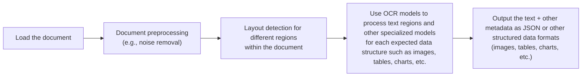
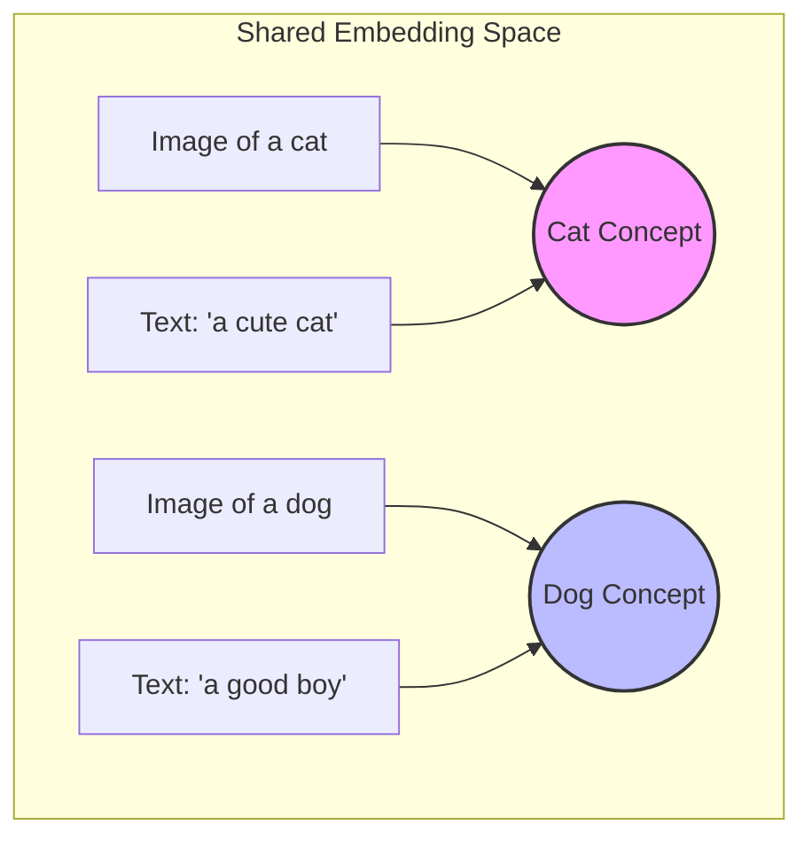
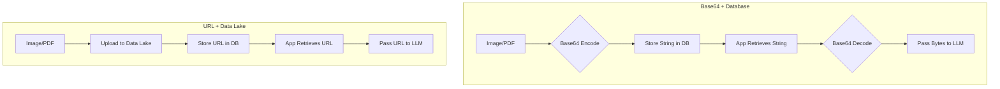
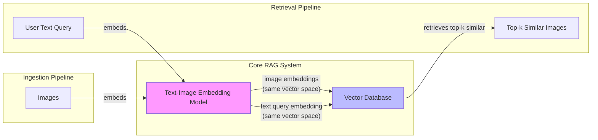
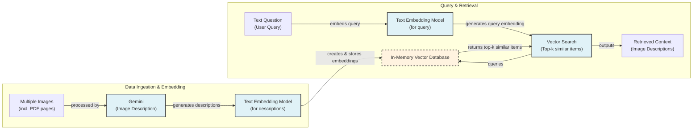
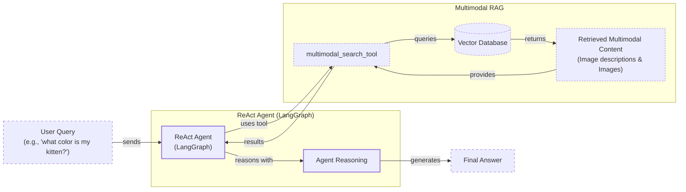

# Stop Converting Documents to Text: A Guide to Building Multimodal AI Systems

In the previous lessons, we built a solid foundation in AI Engineering. We explored the agent landscape, learned the difference between rule-based workflows and autonomous agents, and mastered context engineering. We even did a deep dive into Retrieval-Augmented Generation (RAG). But so far, our focus has been almost entirely on text. This lesson tackles the final piece of the puzzle for building enterprise-grade AI systems: multimodality.

In the real world, information rarely comes in the form of clean text. We work with images, charts, diagrams, and complex documents. For AI systems to be truly useful, they must understand and process this rich, multimodal data. Early AI applications tried to solve this by converting everything to text, often using Optical Character Recognition (OCR) for documents. However, this approach is flawed. When you flatten a complex visual document into text, you lose crucial information—the layout of a table, the relationships in a diagram, the emphasis in a design.

This limitation is a major bottleneck in many industries. Text-only models struggle with financial reports that rely on charts and graphs, making it difficult to perform accurate analysis [[38]](https://konfuzio.com/en/chatgpt-financial-analysis/). In healthcare, they cannot interpret medical images like X-rays or CT scans, which are essential for diagnostics [[39]](https://techtoday.lenovo.com/sites/default/files/2025-05/Medical%20Imaging%20White%20Paper%20NVIDIA%20and%20Lenovo.pdf). Similarly, they fail to understand technical manuals or building sketches where diagrams convey more information than words ever could.

That's why modern AI systems are moving away from text normalization. Instead, they process data in its native format. Multimodal LLMs can now "see" images and documents, interpreting them with a richness that text-only models never could. This is a game-changer for enterprise AI, where data lives in a mix of formats across databases, data warehouses, and lakes. This lesson will show you how to build AI workflows and agents that can handle text, images, and documents seamlessly, unlocking the ability to work with your organization's data in its natural state.

## Limitations of traditional document processing

To understand why multimodal LLMs are so important, we first need to look at why traditional document processing methods fall short. For years, the standard approach for getting information out of documents like invoices, reports, or technical manuals has been a complex, multi-step pipeline based on OCR. This process is not only complicated but also rigid and prone to failure.

A typical OCR-based workflow for a PDF containing a mix of text, diagrams, and tables looks something like this:



Image 1: Traditional document processing workflow

This pipeline has too many moving parts. You need separate models for layout detection, text recognition, table extraction, and chart interpretation [[46]](https://www.daft.ai/blog/end-to-end-distributed-pdf-processing-pipeline). This makes the system:

1.  **Rigid:** If a document contains a new or unexpected data structure, like a new type of chart, the entire pipeline can fail [[47]](https://learn.microsoft.com/en-us/answers/questions/5668164/why-traditional-ocr-fails-for-complex-business-doc?page=1). The system is often template-driven, meaning any deviation from the expected format can break the extraction logic [[49]](https://www.llamaindex.ai/blog/ocr-for-tables).
2.  **Slow and costly:** Each step involves calling a separate model, which adds latency and computational cost. For example, a full pipeline might include layout detection, OCR, and then a captioning model for visual elements, with each step adding seconds to the processing time [[7]](https://arxiv.org/pdf/2407.01449v6).
3.  **Fragile:** With so many components, the system is brittle. An error in one stage cascades through the rest of the pipeline, leading to unreliable results [[50]](https://intuitionlabs.ai/articles/ai-pdf-data-extraction-clinical-research). Raw OCR output is often a jumble of fragmented text blocks, and the system must rely on coordinate-based heuristics to guess the correct reading order, which frequently fails on complex layouts [[46]](https://www.daft.ai/blog/end-to-end-distributed-pdf-processing-pipeline).

The performance challenges are significant. Even advanced OCR engines struggle with real-world documents. Accuracy drops sharply with poor-quality scans, handwritten notes, or complex layouts like nested tables and multi-column formats [[36]](https://www.llamaindex.ai/blog/ocr-accuracy). For clean printed text, Character Error Rates (CER) can be below 1%, but this number quickly deteriorates under real-world conditions. A scan resolution below 300 DPI can cause accuracy to drop by 20% or more, and a simple 5-degree tilt in a scanned document can increase the Word Error Rate (WER) by over 15%. For handwriting, a CER of 3-5% is considered good, which is often not accurate enough for production systems [[36]](https://www.llamaindex.ai/blog/ocr-accuracy).

Consider a technical document like a floor plan. A traditional OCR system would struggle to detect the rotated text and would have no understanding of the special symbols or the spatial relationships between rooms and objects. All the rich visual context that a human easily understands is lost in the translation to text.

Image 2: OCR tools often struggle with rotated text in complex documents like floor plans. (Source [HackerNoon](https://hackernoon.com/complex-document-recognition-ocr-doesnt-work-and-heres-how-you-fix-it))

While this kind of specialized pipeline might work for a single, predictable task, it doesn’t scale in a world where AI agents need to be flexible, fast, and adaptable. This is why modern AI solutions have shifted to using multimodal LLMs, which can directly interpret images, PDFs, and text as native inputs, bypassing the fragile OCR workflow entirely. Let's explore how these models work.

## Foundations of multimodal LLMs

Before we start coding, it is important to have an intuition for how multimodal LLMs work. You do not need to be an expert on the underlying research, but as an AI Engineer, you need to understand the core concepts to effectively use, deploy, and monitor these models.

At a high level, there are two common architectural approaches for building multimodal LLMs that can process both text and images [[17]](https://magazine.sebastianraschka.com/p/understanding-multimodal-llms).

Image 3: The two main approaches to developing multimodal LLM architectures. (Source [Understanding Multimodal LLMs [[17]](https://magazine.sebastianraschka.com/p/understanding-multimodal-llms)])

### Unified Embedding Decoder Architecture

The first and simpler approach is the **Unified Embedding Decoder Architecture**. In this design, the image information is fed into the LLM as input tokens, right alongside the text tokens. It uses a standard decoder-only LLM architecture, like a GPT or Llama model, without any modifications [[17]](https://magazine.sebastianraschka.com/p/understanding-multimodal-llms).

Image 4: The Unified Embedding Decoder Architecture concatenates image and text embeddings. (Source [Understanding Multimodal LLMs [[17]](https://magazine.sebastianraschka.com/p/understanding-multimodal-llms)])

To make this work, the image must be converted into a sequence of embeddings that the LLM can understand. This process is handled by an **image encoder**, which functions similarly to a text tokenizer. While text is broken down into sub-word tokens, an image is divided into a grid of smaller patches. Each patch is then converted into an embedding vector [[17]](https://magazine.sebastianraschka.com/p/understanding-multimodal-llms).

Image 5: Image tokenization and embedding (left) vs. text tokenization and embedding (right). (Source [Understanding Multimodal LLMs [[17]](https://magazine.sebastianraschka.com/p/understanding-multimodal-llms)])

The image encoder is typically a pretrained Vision Transformer (ViT). This model takes the image patches and processes them to generate a sequence of patch embeddings [[17]](https://magazine.sebastianraschka.com/p/understanding-multimodal-llms).

Image 6: A classic Vision Transformer (ViT) setup. (Source [Understanding Multimodal LLMs [[17]](https://magazine.sebastianraschka.com/p/understanding-multimodal-llms)])

These image embeddings must then be aligned with the text embeddings. A **projector module**, usually a simple linear layer, maps the image embeddings into the same vector space as the text embeddings. Once aligned, the image and text token embeddings can be concatenated and fed directly into the LLM [[17]](https://magazine.sebastianraschka.com/p/understanding-multimodal-llms).

### Cross-Modality Attention Architecture

The second approach is the **Cross-Modality Attention Architecture**. Instead of treating image tokens as just another part of the input sequence, this method injects the visual information directly into the LLM's attention mechanism [[17]](https://magazine.sebastianraschka.com/p/understanding-multimodal-llms).

Image 7: The Cross-Modality Attention Architecture injects visual information via attention layers. (Source [Understanding Multimodal LLMs [[17]](https://magazine.sebastianraschka.com/p/understanding-multimodal-llms)])

This design uses cross-attention layers within the transformer blocks to allow the text tokens to "look at" the image patch embeddings. The queries come from the text being processed by the decoder, while the keys and values come from the output of the image encoder. This allows the model to dynamically integrate visual context at each layer of processing, rather than just at the input stage [[17]](https://magazine.sebastianraschka.com/p/understanding-multimodal-llms).

### Image Encoders and Shared Embedding Spaces

Both architectures rely on an image encoder to transform images into embeddings. Popular choices include models based on the CLIP (Contrastive Language-Image Pre-training) architecture, such as OpenCLIP and SigLIP [[3]](https://www.nvidia.com/en-us/glossary/vision-language-models/). These models are trained using **contrastive learning**, a technique that teaches the model to create similar embeddings for related concepts, regardless of their modality [[4]](https://towardsdatascience.com/multimodal-embeddings-an-introduction-5dc36975966f).

The model learns by maximizing the similarity between "positive pairs" (an image and its correct text caption) and minimizing the similarity between "negative pairs" (an image and an incorrect caption). Through this process, the model learns to map both images and text into a **shared embedding space**. In this space, the vector for an image of a dog will be close to the vector for the text "a photo of a dog" [[6]](https://www.pinecone.io/learn/series/image-search/clip/).



Image 8: A diagram showing how images and text related to the same concept are mapped to nearby points in a shared embedding space.

This shared space is what enables multimodal RAG. You can embed a text query and use it to find semantically similar images, or vice versa, because their vector representations are comparable [[5]](https://www.youtube.com/watch?v=YOvxh_ma5qE).

### Trade-offs and Modern Models

Each architectural approach has its trade-offs. The **unified decoder** is simpler to implement and often achieves higher accuracy on OCR-related tasks. The **cross-attention** architecture is more computationally efficient, especially with high-resolution images, as it avoids lengthening the input sequence with thousands of image tokens [[35]](https://arxiv.org/abs/2409.11402). Some state-of-the-art models, like NVIDIA's NVLM, use **hybrid** approaches that combine the strengths of both [[19]](https://arxiv.org/html/2409.11402).

Most leading LLMs in 2025 are multimodal. In the open-source world, this includes models like Meta's Llama 4, Google's Gemma 2, Alibaba's Qwen3, and DeepSeek-V3 [[22]](https://medium.com/data-science-in-your-pocket/2025-the-year-ai-reasoning-models-took-over-a-month-by-month-review-of-frontier-breakthroughs-6ea2163f854f), [[24]](https://www.linkedin.com/posts/progressivethinker_this-is-the-most-essential-breakdown-of-2025-activity-7376654335319117825-a5aD). In the proprietary space, models like OpenAI's GPT-5, Google's Gemini 2.5, and Anthropic's Claude series all have powerful multimodal capabilities [[23]](https://codedesign.ai/blog/the-ultimate-guide-to-the-top-large-language-models-in-2025/), [[26]](https://www.promptitude.io/post/ultimate-2025-ai-language-models-comparison-gpt5-gpt-4-claude-gemini-sonar-more).

The core principles can also be extended to other modalities. By adding specialized encoders for audio (like Whisper) or video (like Video Transformers), LLMs can be trained to understand and reason about sound and moving images [[27]](https://sparkco.ai/blog/exploring-multimodal-llms-text-image-and-video-integration), [[28]](https://www.emergentmind.com/topics/multimodal-llms).

It's also important to distinguish these multimodal reasoning models from image generation models like Midjourney or Stable Diffusion. While some LLMs like GPT-4o can now generate images, diffusion models are a different class of AI optimized specifically for creating visual content from text prompts [[51]](https://arxiv.org/html/2409.14993v3). In the context of AI agents, these generative models can be integrated as powerful tools, but they are not the reasoning engine [[53]](https://docs.anyscale.com/llm).

Now that we have an intuition for how LLMs can directly process images and documents, let's see how this works in practice.

## Applying multimodal LLMs to images and PDFs

Let's write a few examples with Gemini to explore some best practices for working with images and PDFs. There are three primary ways to provide multimodal data to an LLM: as raw bytes, as Base64-encoded strings, or as URLs.

*   **Raw bytes:** This is the most direct method and works well for one-off API calls. However, storing raw bytes in a database can be problematic, as many systems interpret the data as text, which can lead to corruption.
*   **Base64:** This method encodes binary data as a string, making it safe to store in standard databases like PostgreSQL or MongoDB. It is a common solution for embedding images directly into web pages or for ensuring data integrity in storage. The main downside is that Base64 encoding increases the data size by about 33%.
*   **URLs:** This is often the most efficient method for production systems. You can use public URLs for data on the internet or private URLs for data stored in a data lake like AWS S3 or Google Cloud Storage (GCS). Instead of passing large files over the network with each API call, the LLM can fetch the data directly from its source, reducing I/O bottlenecks.



Image 9: A diagram comparing the workflow for handling multimodal data with Base64 encoding versus URLs from a data lake.

When building AI applications, the choice depends on your architecture. Use raw bytes for simple, storage-free calls. Use Base64 when you need to store media directly in a traditional database. Use URLs for scalable, production systems that leverage cloud storage.

Now, let's dive into the code.

<aside>
💡

You can find the code for this lesson in the `notebook.ipynb` file for Lesson 11 in the course's GitHub repository.

</aside>

We will use Google's `google-genai` Python SDK to interact with Gemini models.

### 1. Setup

First, we set up our environment by loading the API key and initializing the Gemini client. We will use the `gemini-2.5-flash` model, which is fast and cost-effective for our examples.

```python
from lessons.utils import env
from google import genai
from google.genai import types

env.load(required_env_vars=["GOOGLE_API_KEY"])

client = genai.Client()
MODEL_ID = "gemini-2.5-flash"
```

Let's look at our test image.

```python
from pathlib import Path
from IPython.display import Image as IPythonImage

def display_image(image_path: Path) -> None:
    image = IPythonImage(filename=image_path, width=400)
    display(image)

display_image(Path("images") / "image_1.jpeg")
```

Image 10: Sample image of a robot and a kitten. (Source [[52]](https://github.com/towardsai/course-ai-agents/blob/dev/lessons/11_multimodal/notebook.ipynb))

### 2. Processing images

1.  We will start by processing the image as raw bytes. We define a helper function to load the image, resize it if necessary, and convert it to `WEBP` format, which is highly efficient.
    
    ```python
    import io
    from typing import Literal
    from PIL import Image as PILImage
    
    def load_image_as_bytes(
        image_path: Path, format: Literal["WEBP", "JPEG", "PNG"] = "WEBP", max_width: int = 600, return_size: bool = False
    ) -> bytes | tuple[bytes, tuple[int, int]]:
        image = PILImage.open(image_path)
        if image.width > max_width:
            ratio = max_width / image.width
            new_size = (max_width, int(image.height * ratio))
            image = image.resize(new_size)
    
        byte_stream = io.BytesIO()
        image.save(byte_stream, format=format)
    
        if return_size:
            return byte_stream.getvalue(), image.size
    
        return byte_stream.getvalue()
    ```
    
2.  We load the image and inspect the raw bytes.
    
    ```python
    image_bytes = load_image_as_bytes(image_path=Path("images") / "image_1.jpeg", format="WEBP")
    ```
    
    It outputs:
    
    ```text
    Bytes `b'RIFF`\xad\x00\x00WEBPVP8 T\xad\x00\x00P\xec\x02\x9d\x01*X\x02X\x02'...`
    Size: 44392 bytes
    ```
    
3.  Now, we can ask Gemini to generate a caption for the image.
    
    ```python
    response = client.models.generate_content(
        model=MODEL_ID,
        contents=[
            types.Part.from_bytes(
                data=image_bytes,
                mime_type="image/webp",
            ),
            "Tell me what is in this image in one paragraph.",
        ],
    )
    ```
    
    It outputs:
    
    ```text
    This striking image features a massive, dark metallic robot, its powerful form detailed with intricate circuit patterns on its head and piercing red glowing eyes. Perched playfully on its right arm is a small, fluffy grey tabby kitten, its front paw raised as if exploring or batting at the robot's armored limb, while its gaze is directed slightly off-frame. The robot's large, segmented hand is visible beneath the kitten. The background suggests an industrial or workshop environment, with hints of metal structures and natural light filtering in from an unseen window, creating a dramatic contrast between the soft, vulnerable kitten and the formidable, mechanical sentinel.
    ```
    
4.  Next, let's process the image as a Base64 string. We define a helper function for this.
    
    ```python
    import base64
    from typing import cast
    
    def load_image_as_base64(
        image_path: Path, format: Literal["WEBP", "JPEG", "PNG"] = "WEBP", max_width: int = 600, return_size: bool = False
    ) -> str:
        image_bytes = load_image_as_bytes(image_path=image_path, format=format, max_width=max_width, return_size=False)
        return base64.b64encode(cast(bytes, image_bytes)).decode("utf-8")
    
    image_base64 = load_image_as_base64(image_path=Path("images") / "image_1.jpeg", format="WEBP")
    ```
    
    As you can see, the Base64 string is about 33% larger than the raw bytes.
    
    ```text
    Base64: UklGRmCtAABXRUJQVlA4IFStAABQ7AKdASpYAlgCPm0ylEekIqInJnQ7gOANiWdtk7FnEo2gDknjPixW9SNSb5P7IbBNhLn87Vtp...`
    Size: 59192 characters
    Image as Base64 is 33.34% larger than as bytes
    ```
    
5.  Gemini also has a built-in `url_context` tool that can fetch content from public URLs. Here is how you would use it to summarize a PDF.
    
    ```python
    response = client.models.generate_content(
        model=MODEL_ID,
        contents="Based on the provided paper as a PDF, tell me how ReAct works: https://arxiv.org/pdf/2210.03629",
        config=types.GenerateContentConfig(tools=[{"url_context": {}}]),
    )
    ```
    
    It outputs:
    
    ```text
    ReAct is a novel paradigm for large language models (LLMs) that combines reasoning (Thought) and acting (Action) in an interleaved manner to solve diverse language and decision-making tasks. This approach allows the model to:
    
    *   **Reason to Act:** Generate verbal reasoning traces to induce, track, and update action plans, and handle exceptions.
    *   **Act to Reason:** Interface with and gather additional information from external sources (like knowledge bases or environments) to incorporate into its reasoning.
    ...
    ```
    
6.  For private data lakes, you would provide a URI from your cloud storage provider. While Gemini currently works best with Google Cloud Storage, the principle is the same for other providers. Here is a mocked example of what the code would look like:
    
    ```python
    # This is a mocked example
    response = client.models.generate_content(
        model=MODEL_ID,
        contents=[
            types.Part.from_uri(uri="gs://gemini-images/image_1.jpeg", mime_type="image/webp"),
            "Tell me what is in this image in one paragraph.",
        ],
    )
    ```
    
7.  For a more advanced example, let's perform object detection. We will define a Pydantic schema to structure the output.
    
    ```python
    from pydantic import BaseModel, Field
    
    class BoundingBox(BaseModel):
        ymin: float
        xmin: float
        ymax: float
        xmax: float
        label: str = Field(
            default="The category of the object found within the bounding box. For example: cat, dog, diagram, robot."
        )
    
    class Detections(BaseModel):
        bounding_boxes: list[BoundingBox]
    ```
    
8.  We create a prompt asking for normalized bounding boxes and pass it to the model with our Pydantic schema in the configuration.
    
    ```python
    prompt = """
    Detect all of the prominent items in the image. 
    The box_2d should be [ymin, xmin, ymax, xmax] normalized to 0-1000.
    Also, output the label of the object found within the bounding box.
    """
    image_bytes, image_size = load_image_as_bytes(
        image_path=Path("images") / "image_1.jpeg", format="WEBP", return_size=True
    )
    
    config = types.GenerateContentConfig(
        response_mime_type="application/json",
        response_schema=Detections,
    )
    
    response = client.models.generate_content(
        model=MODEL_ID,
        contents=[
            types.Part.from_bytes(
                data=image_bytes,
                mime_type="image/webp",
            ),
            prompt,
        ],
        config=config,
    )
    
    detections = cast(Detections, response.parsed)
    ```
    
    The `response.parsed` attribute directly gives us a validated Pydantic object.
    
    ```text
    Image size: (600, 600)
    ymin=1.0 xmin=450.0 ymax=997.0 xmax=1000.0 label='robot'
    ymin=269.0 xmin=39.0 ymax=782.0 xmax=530.0 label='kitten'
    ```
    
9.  With the structured coordinates, we can easily visualize the detections.
    
    
    
    Image 11: Visualizing the object detection results. (Source [[52]](https://github.com/towardsai/course-ai-agents/blob/dev/lessons/11_multimodal/notebook.ipynb))
    
### 3. Processing PDFs

Working with PDFs is almost identical to working with images. You can pass the file as bytes or Base64. More interestingly, you can treat individual PDF pages as images, which is especially useful for documents with complex layouts.

1.  Let's process the "Attention Is All You Need" paper, first as raw bytes.
    
    ```python
    pdf_bytes = (Path("pdfs") / "attention_is_all_you_need_paper.pdf").read_bytes()
    
    response = client.models.generate_content(
        model=MODEL_ID,
        contents=[
            types.Part.from_bytes(data=pdf_bytes, mime_type="application/pdf"),
            "What is this document about? Provide a brief summary of the main topics.",
        ],
    )
    ```
    
    It outputs:
    
    ```text
    This document introduces the **Transformer**, a novel neural network architecture designed for **sequence transduction tasks** (like machine translation).
    ...
    ```
    
2.  And here is how you would do it with Base64.
    
    ```python
    def load_pdf_as_base64(pdf_path: Path) -> str:
        """Load a PDF file and convert it to base64 encoded string."""
        with open(pdf_path, "rb") as f:
            return base64.b64encode(f.read()).decode("utf-8")
    
    pdf_base64 = load_pdf_as_base64(pdf_path=Path("pdfs") / "attention_is_all_you_need_paper.pdf")
    
    response = client.models.generate_content(
        model=MODEL_ID,
        contents=[
            "What is this document about? Provide a brief summary of the main topics.",
            types.Part.from_bytes(data=pdf_base64, mime_type="application/pdf"),
        ],
    )
    ```
    
3.  Now, let's use our object detection logic on a page from the paper to find the main architectural diagram.
    
    
    
    Image 12: A page from the Transformer paper containing a diagram. (Source [[52]](https://github.com/towardsai/course-ai-agents/blob/dev/lessons/11_multimodal/notebook.ipynb))
    
    We use the same prompt as before, but this time asking for "diagrams".
    
    ```python
    prompt = """
    Detect all the diagrams from the provided image as 2d bounding boxes. 
    The box_2d should be [ymin, xmin, ymax, xmax] normalized to 0-1000.
    Also, output the label of the object found within the bounding box.
    """
    
    image_bytes, image_size = load_image_as_bytes(
        image_path=Path("images") / "attention_is_all_you_need_1.jpeg", format="WEBP", return_size=True
    )
    
    # ... (call model with config as before)
    
    detections = cast(Detections, response.parsed)
    ```
    
    The model correctly identifies the diagram and returns its bounding box, which we can then visualize.
    
    
    
    Image 13: Detecting the diagram on the PDF page. (Source [[52]](https://github.com/towardsai/course-ai-agents/blob/dev/lessons/11_multimodal/notebook.ipynb))
    
This example shows how effectively modern LLMs can understand visual content in documents, making the old, fragile OCR pipelines completely redundant for many use cases.

## Foundations of multimodal RAG

One of the most common applications for multimodal data is RAG. As we discussed in Lesson 10, stuffing large amounts of information into an LLM's context window is inefficient. This is especially true for images and documents. A multimodal RAG system allows you to retrieve only the most relevant visual information to answer a user's query.

A generic multimodal RAG architecture for images and text has two main parts:

*   **Ingestion Pipeline:** Images are processed by a multimodal embedding model, which creates vector representations. These embeddings are then stored in a vector database.
*   **Retrieval Pipeline:** A user's text query is embedded using the same model. The resulting query embedding is used to search the vector database for the most similar image embeddings. The top-k matching images are returned as context.

Because the text and image embeddings exist in the same shared vector space, we can directly compare them to find semantic similarities. This is the core principle that powers applications like Google Photos, where you can search for "pictures of dogs" and get relevant images without any manual tagging [[56]](https://opensearch.org/blog/multimodal-semantic-search/).



Image 14: A diagram illustrating the ingestion and retrieval pipelines of a generic multimodal RAG system using images and text, highlighting the shared vector space for embeddings.

This principle extends beyond consumer photo apps into domains like e-commerce, where combining text from product titles with visual information from images allows for more relevant recommendations. This multimodal approach can even detect and filter out low-quality listings where the image and title do not match, improving user engagement and conversion [[76]](https://innovation.ebayinc.com/stories/beyond-words-how-multimodal-embeddings-elevate-ebays-product-recommendations/).

For enterprise document RAG, one of the most popular architectures as of 2025 is **ColPali**. It builds on recent breakthroughs in Vision Language Models, specifically Google's PaliGemma, and applies the late-interaction retrieval mechanism pioneered by ColBERT to the visual domain [[77]](https://huggingface.co/blog/manu/colpali). This approach bypasses the entire OCR pipeline by processing document pages directly as images. It uses a vision-language model to understand both text and visual elements like tables and charts simultaneously.

Image 15: ColPali simplifies document retrieval by directly embedding page images, outperforming traditional text-based methods. (Source [ColPali: Efficient Document Retrieval with Vision Language Models [[7]](https://arxiv.org/pdf/2407.01449v6)])

ColPali works by dividing a document page image into patches and generating a "bag of embeddings" for them—a multi-vector representation that captures fine-grained details. At query time, it uses a late interaction mechanism (MaxSim) to efficiently compute the similarity between each query token and all document patches. Unlike standard cosine similarity, which computes a single vector for an entire query and document, MaxSim operates at a finer grain. For each token in the query, it finds its maximum similarity score across all the patches in the document image, and then sums these individual maximum scores to get a final relevance score [[78]](https://www.mixedbread.com/blog/maxsim-cpu). This makes it highly effective for retrieving documents based on complex visual layouts.

This architecture is not only more accurate but also significantly faster. ColPali offers 2-10x faster query latency and has fewer failure points compared to traditional OCR pipelines [[7]](https://arxiv.org/pdf/2407.01449v6). It substantially outperforms all baseline systems on the ViDoRe benchmark, achieving an 81.3% average nDCG@5 score [[7]](https://arxiv.org/pdf/2407.01449v6). Because of its high precision, ColPali can also be used as a powerful reranking stage after an initial, broader retrieval step.

However, this precision comes with scaling challenges. Because ColPali generates a multi-vector representation for each page—often over 1,000 vectors—the storage requirements can be massive. An index for a million-page document base can expand to terabytes, creating a bottleneck for memory, storage costs, and retrieval latency [[79]](https://www.superteams.ai/blog/extracting-knowledge-from-complex-pdf-documents-enterprise), [[80]](https://ragflow.io/blog/rag-review-2025-from-rag-to-context). To address this, advanced implementations use techniques like binary quantization, which converts the 128-dimension float vectors into 128-bit binary vectors. This allows the system to use the much faster Hamming distance for similarity calculations instead of dot products, reducing both storage and computational costs by orders of magnitude with only a small drop in accuracy [[81]](https://blog.vespa.ai/scaling-colpali-to-billions/). The official implementation can be found on GitHub at `illuin-tech/colpali`.

While ColPali and similar models represent the state-of-the-art for static documents, open research is already looking to extend these late-interaction techniques to dynamic content like video streams [[82]](https://arxiv.org/html/2407.01449v2). Now that we have the theory, let's build a simple multimodal RAG system from scratch.

## Implementing multimodal RAG for images, PDFs and text

To connect all the concepts from this lesson, we will now build a simple multimodal RAG system. We will populate an in-memory vector index with several images, including pages from the "Attention Is All You Need" paper treated as images. Our goal is to build an intuition for how multimodal RAG works, so we will keep the implementation simple and not use advanced techniques like image patching or a ColBERT reranker.



Image 16: A diagram illustrating our multimodal RAG example, showing data ingestion and query retrieval with an in-memory vector database.

1.  First, we will display the images we plan to index.
    
    ```python
    import matplotlib.pyplot as plt
    
    def display_image_grid(image_paths: list[Path], rows: int = 2, cols: int = 3, figsize: tuple = (8, 6)) -> None:
        fig, axes = plt.subplots(rows, cols, figsize=figsize)
        axes = axes.ravel()
        for idx, img_path in enumerate(image_paths[: rows * cols]):
            img = PILImage.open(img_path)
            axes[idx].imshow(img)
            axes[idx].axis("off")
        plt.tight_layout()
        plt.show()
    
    display_image_grid(
        image_paths=[
            Path("images") / "image_1.jpeg",
            Path("images") / "image_2.jpeg",
            Path("images") / "image_3.jpeg",
            Path("images") / "image_4.jpeg",
            Path("images") / "attention_is_all_you_need_1.jpeg",
            Path("images") / "attention_is_all_you_need_2.jpeg",
        ],
    )
    ```
    
    
    
    Image 17: The images we will use for our RAG system. (Source [[52]](https://github.com/towardsai/course-ai-agents/blob/dev/lessons/11_multimodal/notebook.ipynb))
    
2.  Next, we define a function to generate a detailed description for each image using Gemini.
    
    <aside>
    💡
    
    The Gemini API available through `google-genai` does not currently support creating image embeddings directly. To work around this, we will generate a text description for each image and then embed that description using a text embedding model.
    
    This is a simplification for demonstration purposes. In a production system, you would use a dedicated multimodal embedding model (like those from Voyage AI, Cohere, or Google's Vertex AI) to embed the image bytes directly. The rest of the RAG pipeline would remain conceptually the same.
    
    ```python
    # This is how it would look with a multimodal embedding model
    image_bytes = ...
    # SKIPPED!
    # image_description = generate_image_description(image_bytes)
    image_embedding = embed_with_multimodal(image_bytes)
    ```
    
    </aside>
    
    ```python
    from io import BytesIO
    
    def generate_image_description(image_bytes: bytes) -> str:
        """Generate a detailed description of an image using Gemini Vision model."""
        try:
            img = PILImage.open(BytesIO(image_bytes))
            prompt = """
            Describe this image in detail for semantic search purposes. 
            Include objects, scenery, colors, composition, text, and any other visual elements that would help someone find 
            this image through text queries.
            """
            response = client.models.generate_content(
                model=MODEL_ID,
                contents=[prompt, img],
            )
            return response.text.strip() if response and response.text else ""
        except Exception as e:
            print(f"❌ Failed to generate image description: {e}")
            return ""
    ```
    
3.  Then, we define functions to create text embeddings and build our vector index. For a real-world application, you would use a proper vector database like Milvus, Pinecone, or Qdrant, which use scalable index algorithms like HNSW. For this example, a simple list of dictionaries will suffice.
    
    ```python
    import numpy as np
    
    def embed_text_with_gemini(content: str) -> np.ndarray | None:
        """Embed text content using Gemini's text embedding model."""
        try:
            result = client.models.embed_content(
                model="gemini-embedding-001",
                contents=[content],
            )
            return np.array(result.embeddings[0].values) if result and result.embeddings else None
        except Exception as e:
            print(f"❌ Failed to embed text: {e}")
            return None
    
    def create_vector_index(image_paths: list[Path]) -> list[dict]:
        """Create embeddings for images by generating and embedding descriptions."""
        vector_index = []
        for image_path in image_paths:
            image_bytes = cast(bytes, load_image_as_bytes(image_path, format="WEBP", return_size=False))
            image_description = generate_image_description(image_bytes)
            image_embedding = embed_text_with_gemini(image_description)
            vector_index.append({
                "content": image_bytes,
                "type": "image",
                "filename": image_path,
                "description": image_description,
                "embedding": image_embedding,
            })
        return vector_index
    
    image_paths = list(Path("images").glob("*.jpeg"))
    vector_index = create_vector_index(image_paths)
    ```
    
4.  Let's inspect the structure of our `vector_index`.
    
    ```python
    vector_index[0].keys()
    ```
    
    It outputs:
    
    ```text
    dict_keys(['content', 'type', 'filename', 'description', 'embedding'])
    ```
    
    The embedding is a 3072-dimensional vector, and the description is a detailed text summary.
    
    ```python
    vector_index[0]["embedding"].shape
    # (3072,)
    
    print(f"{vector_index[0]['description'][:150]}...")
    # This image is a page from a technical or scientific document, likely a research paper, textbook, or dissertation related to machine learning, deep lea...
    ```
    
5.  Now we define our search function, which embeds a text query and finds the most similar items in our index using cosine similarity.
    
    ```python
    from sklearn.metrics.pairwise import cosine_similarity
    
    def search_multimodal(query_text: str, vector_index: list[dict], top_k: int = 3) -> list:
        """Search for most similar documents to a query."""
        query_embedding = embed_text_with_gemini(query_text)
        if query_embedding is None:
            return []
    
        embeddings = [doc["embedding"] for doc in vector_index]
        similarities = cosine_similarity([query_embedding], embeddings).flatten()
    
        top_indices = np.argsort(similarities)[::-1][:top_k]
    
        results = []
        for idx in top_indices.tolist():
            results.append({**vector_index[idx], "similarity": similarities[idx]})
        return results
    ```
    
6.  Let's test it by searching for the Transformer architecture diagram.
    
    ```python
    query = "what is the architecture of the transformer neural network?"
    results = search_multimodal(query, vector_index, top_k=1)
    ```
    
    The system correctly retrieves the relevant page from the paper with a similarity score of 0.744.
    
    
    
    Image 18: The top search result for our query. (Source [[52]](https://github.com/towardsai/course-ai-agents/blob/dev/lessons/11_multimodal/notebook.ipynb))
    
7.  Here is another example, searching for the image of the kitten and robot.
    
    ```python
    query = "a kitten with a robot"
    results = search_multimodal(query, vector_index, top_k=1)
    ```
    
    Again, the correct image is retrieved with a high similarity score of 0.811.
    
    
    
    Image 19: The top search result for "a kitten with a robot". (Source [[52]](https://github.com/towardsai/course-ai-agents/blob/dev/lessons/11_multimodal/notebook.ipynb))
    
This simple RAG system demonstrates the power of multimodal embeddings. By treating all visual content—whether from a photo or a PDF page—as images, we can build a unified search index that understands semantic meaning across different data types.

## Building multimodal AI agents

To take this a step further, we can integrate our RAG function into a ReAct agent, giving it the ability to search for and reason about visual information. This combines many of the skills we have learned in Part 1 of this course: structured outputs, tools, ReAct, and RAG.

Multimodal capabilities can be added to agents in a few ways:

1.  **Multimodal Inputs/Outputs:** The agent's reasoning LLM can accept images or other media as direct input or generate them as output.
2.  **Multimodal Retrieval Tools:** The agent can use tools, like our RAG function, to search and retrieve visual information.
3.  **Other Multimodal Tools:** The agent can interact with external resources like company PDFs, computer screenshots, or video feeds through specialized tools.

In this example, we will build a ReAct agent using LangGraph that uses our `search_multimodal` function as a tool. We will then ask the agent a question that requires it to find an image and analyze its content. The deployment of such agents, especially those interacting with real-world sensor data like video feeds or medical scans, is increasingly influenced by trends in edge AI. To reduce latency and address privacy regulations like HIPAA, agents are run directly on devices using specialized hardware like Neural Processing Units (NPUs). This is enabled by model optimization techniques like quantization, which shrink models to fit resource-constrained hardware. For more complex tasks, hybrid edge-cloud architectures allow agents to perform initial processing locally while offloading heavier analysis to the cloud, all while keeping sensitive data on-premises [[83]](https://www.n-ix.com/edge-ai-trends/).



Image 20: A diagram of our multimodal ReAct + RAG agent.

1.  First, we wrap our `search_multimodal` function in a tool definition. The tool's output will include both the image description and the image itself, which will be passed back to the agent's LLM.
    
    ```python
    from langchain_core.tools import tool
    from typing import Any
    
    @tool
    def multimodal_search_tool(query: str) -> dict[str, Any]:
        """
        Search through a collection of images and their text descriptions to find relevant content.
        """
        results = search_multimodal(query, vector_index, top_k=1)
    
        if not results:
            return {"role": "tool_result", "content": "No relevant content found for your query."}
        
        result = results[0]
        content = [
            {"type": "text", "text": f"Image description: {result['description']}"},
            types.Part.from_bytes(data=result["content"], mime_type="image/jpeg"),
        ]
        return {"role": "tool_result", "content": content}
    ```
    
2.  Next, we build our ReAct agent using LangGraph's `create_react_agent` helper. We provide it with our tool and a system prompt that guides its behavior. The system prompt is crucial for instructing the agent on how to use its tools effectively. We will explore LangGraph in more detail in Part 2 of the course.
    
    ```python
    from langchain_google_genai import ChatGoogleGenerativeAI
    from langgraph.prebuilt import create_react_agent
    
    def build_react_agent() -> Any:
        """Build a ReAct agent with multimodal search capabilities."""
        tools = [multimodal_search_tool]
        system_prompt = """You are a helpful AI assistant that can search through images and text to answer questions.
        
        When asked about visual content like animals, objects, or scenes:
        1. Use the multimodal_search_tool to find relevant images and descriptions
        2. Carefully analyze the image or image descriptions from the search results
        3. Provide a clear, direct answer based on the search results
        """
        agent = create_react_agent(
            model=ChatGoogleGenerativeAI(model="gemini-2.5-pro", temperature=0.1),
            tools=tools,
            prompt=system_prompt,
        )
        return agent
    
    react_agent = build_react_agent()
    ```
    
3.  Now, let's ask the agent about the color of the kitten.
    
    ```python
    test_question = "what color is my kitten?"
    response = react_agent.invoke(input={"messages": test_question})
    ```
    
    The agent first reasons that it needs to use the search tool. It calls `multimodal_search_tool` with the query "my kitten".
    
    ```text
    🔍 Tool executing search for: my kitten
    🔍 Embedding query: 'my kitten'
    ✅ Query embedded successfully
    🔍 Found results: images/image_1.jpeg
    ```
    
    The tool returns the image of the kitten and robot, along with its description. The agent then analyzes this multimodal context and generates the final answer.
    
    ```text
    🤖 Agent response
    Based on the image, your kitten is a gray tabby. It has soft, short gray fur with darker tabby stripe patterns.
    ```
    
    
    
    Image 21: The image retrieved by the agent to answer the question. (Source [[52]](https://github.com/towardsai/course-ai-agents/blob/dev/lessons/11_multimodal/notebook.ipynb))
    
This example brings together everything we have learned in this part of the course. We have built a multimodal, agentic RAG system that can reason, act, and understand visual information—a powerful foundation for building advanced AI applications.

## Conclusion

In this lesson, we have seen why processing data in its native format is superior to legacy text-conversion pipelines. By leveraging multimodal LLMs, we can build AI systems that understand the rich visual context in images and documents, just like a human would. We will apply these same techniques in our capstone project, where the research agent will pass images and PDFs directly to the writer agent, preserving all the visual information from its research.

This lesson marks the end of Part 1 of our course on the fundamentals of AI Engineering. You now have a comprehensive toolkit for building both rule-based workflows and autonomous agents. In Part 2, we will move from theory to practice and begin building our main course project: an interconnected research and writing agent system. We will start with a deep dive into agentic design patterns and modern frameworks like LangGraph, then implement the research and writing agents, and finally orchestrate them into a complete, multi-agent pipeline.

## References

- [1] Guinness, H. (2026, April 1). The 8 best AI image generators in 2025. Zapier. [https://zapier.com/blog/best-ai-image-generator/](https://zapier.com/blog/best-ai-image-generator/)
- [2] Raschka, S. (2024, November 3). Understanding Multimodal LLMs. Ahead of AI. [https://magazine.sebastianraschka.com/p/understanding-multimodal-llms](https://magazine.sebastianraschka.com/p/understanding-multimodal-llms)
- [3] Vision Language Models. (n.d.). NVIDIA. Retrieved December 11, 2024, from [https://www.nvidia.com/en-us/glossary/vision-language-models/](https://www.nvidia.com/en-us/glossary/vision-language-models/)
- [4] Talebi, S. (2024, November 29). Multimodal Embeddings: An Introduction. Towards Data Science. [https://towardsdatascience.com/multimodal-embeddings-an-introduction-5dc36975966f](https://towardsdatascience.com/multimodal-embeddings-an-introduction-5dc36975966f)
- [5] Talebi, S. (2024, November 29). Multimodal Embeddings: Introduction & Use Cases (with Python) [Video]. YouTube. [https://www.youtube.com/watch?v=YOvxh_ma5qE](https://www.youtube.com/watch?v=YOvxh_ma5qE)
- [6] Calam, J. (n.d.). Multi-modal ML with OpenAI's CLIP. Pinecone. Retrieved December 11, 2024, from [https://www.pinecone.io/learn/series/image-search/clip/](https://www.pinecone.io/learn/series/image-search/clip/)
- [7] Pierrot, T., et al. (2024). ColPali: Efficient Document Retrieval with Vision Language Models. arXiv. [https://arxiv.org/pdf/2407.01449v6](https://arxiv.org/pdf/2407.01449v6)
- [8] Image understanding with Gemini. (n.d.). Google AI for Developers. Retrieved December 11, 2024, from [https://ai.google.dev/gemini-api/docs/image-understanding](https://ai.google.dev/gemini-api/docs/image-understanding)
- [9] Talebi, S. (2024, December 10). Multimodal RAG with Colpali, Milvus and VLMs. Hugging Face Blog. [https://huggingface.co/blog/saumitras/colpali-milvus-multimodal-rag](https://huggingface.co/blog/saumitras/colpali-milvus-multimodal-rag)
- [10] Google Generative AI Embeddings (AI Studio & Gemini API). (n.d.). LangChain. Retrieved December 11, 2024, from [https://python.langchain.com/docs/integrations/text_embedding/google_generative_ai/](https://python.langchain.com/docs/integrations/text_embedding/google_generative_ai/)
- [11] LangGraph quickstart. (n.d.). LangChain. Retrieved December 11, 2024, from [https://langchain-ai.github.io/langgraph/agents/agents/](https://langchain-ai.github.io/langgraph/agents/agents/)
- [12] Kokorin, O. (2023, October 12). Complex Document Recognition: OCR Doesn’t Work and Here’s How You Fix It. HackerNoon. [https://hackernoon.com/complex-document-recognition-ocr-doesnt-work-and-heres-how-you-fix-it](https://hackernoon.com/complex-document-recognition-ocr-doesnt-work-and-heres-how-you-fix-it)
- [13] What are some real-world applications of multimodal AI? (n.d.). Milvus. Retrieved December 11, 2024, from [https://milvus.io/ai-quick-reference/what-are-some-realworld-applications-of-multimodal-ai](https://milvus.io/ai-quick-reference/what-are-some-realworld-applications-of-multimodal-ai)
- [14] Potrimba, G. (2023, November 21). What Is Optical Character Recognition (OCR)? Roboflow Blog. [https://blog.roboflow.com/what-is-optical-character-recognition-ocr/](https://blog.roboflow.com/what-is-optical-character-recognition-ocr/)
- [15] Guinness, H. (2026, April 1). The 8 best AI image generators in 2025. Zapier. [https://zapier.com/blog/best-ai-image-generator/](https://zapier.com/blog/best-ai-image-generator/)
- [16] Dai, W., et al. (2024). NVLM: Open Frontier-Class Multimodal LLMs. arXiv. [https://arxiv.org/html/2409.11402](https://arxiv.org/html/2409.11402)
- [17] Raschka, S. (2024, November 3). Understanding Multimodal LLMs. Ahead of AI. [https://magazine.sebastianraschka.com/p/understanding-multimodal-llms](https://magazine.sebastianraschka.com/p/understanding-multimodal-llms)
- [18] Iusztin, P. (2024). course-ai-agents/notebook.ipynb at dev. GitHub. [https://github.com/towardsai/course-ai-agents/blob/dev/lessons/11_multimodal/notebook.ipynb](https://github.com/towardsai/course-ai-agents/blob/dev/lessons/11_multimodal/notebook.ipynb)
- [19] NVLM: Open Frontier-Class Multimodal LLMs. (2024, September 17). arXiv. [https://arxiv.org/html/2409.11402](https://arxiv.org/html/2409.11402)
- [20] Structured Outputs with Multimodal Gemini. (2024, October 23). Instructor. [https://python.useinstructor.com/blog/2024/10/23/structured-outputs-with-multimodal-gemini/](https://python.useinstructor.com/blog/2024/10/23/structured-outputs-with-multimodal-gemini/)
- [21] How to Choose the Best Embedding Model for RAG in 2026: 10 Models Benchmarked. (2026, March 25). Milvus. [https://milvus.io/blog/choose-embedding-model-rag-2026.md](https://milvus.io/blog/choose-embedding-model-rag-2026.md)
- [22] 2025: The Year AI Reasoning Models Took Over. (2025, May 22). Medium. [https://medium.com/data-science-in-your-pocket/2025-the-year-ai-reasoning-models-took-over-a-month-by-month-review-of-frontier-breakthroughs-6ea2163f854f](https://medium.com/data-science-in-your-pocket/2025-the-year-ai-reasoning-models-took-over-a-month-by-month-review-of-frontier-breakthroughs-6ea2163f854f)
- [23] The Ultimate Guide to the Top Large Language Models in 2025. (n.d.). CodeDesign.ai. Retrieved December 11, 2024, from [https://codedesign.ai/blog/the-ultimate-guide-to-the-top-large-language-models-in-2025/](https://codedesign.ai/blog/the-ultimate-guide-to-the-top-large-language-models-in-2025/)
- [24] This is the most essential breakdown of 2025 Flagship LLM Architectures. (2025, June 18). LinkedIn. [https://www.linkedin.com/posts/progressivethinker_this-is-the-most-essential-breakdown-of-2025-activity-7376654335319117825-a5aD](https://www.linkedin.com/posts/progressivethinker_this-is-the-most-essential-breakdown-of-2025-activity-7376654335319117825-a5aD)
- [25] A Survey and Analysis on Large Language Models for Code. (2025, August 25). Preprints.org. [https://www.preprints.org/manuscript/202508.1904](https://www.preprints.org/manuscript/202508.1904)
- [26] Ultimate 2025 AI Language Models Comparison. (n.d.). Promptitude. Retrieved December 11, 2024, from [https://www.promptitude.io/post/ultimate-2025-ai-language-models-comparison-gpt5-gpt-4-claude-gemini-sonar-more](https://www.promptitude.io/post/ultimate-2025-ai-language-models-comparison-gpt5-gpt-4-claude-gemini-sonar-more)
- [27] Exploring Multimodal LLMs: Text, Image, and Video Integration. (n.d.). SparkCognition. Retrieved December 11, 2024, from [https://sparkco.ai/blog/exploring-multimodal-llms-text-image-and-video-integration](https://sparkco.ai/blog/exploring-multimodal-llms-text-image-and-video-integration)
- [28] Multimodal LLMs. (n.d.). Emergent Mind. Retrieved December 11, 2024, from [https://www.emergentmind.com/topics/multimodal-llms](https://www.emergentmind.com/topics/multimodal-llms)
- [29] Enhancing LLM Capabilities: The Power of Multimodal LLMs and RAG. (n.d.). Towards AI. Retrieved December 11, 2024, from [https://towardsai.net/p/l/enhancing-llm-capabilities-the-power-of-multimodal-llms-and-rag](https://towardsai.net/p/l/enhancing-llm-capabilities-the-power-of-multimodal-llms-and-rag)
- [30] The Evolution of Large Language Models to Multimodal Models. (2024, November 11). arXiv. [https://arxiv.org/html/2411.06284v3](https://arxiv.org/html/2411.06284v3)
- [31] How to Choose the Best Embedding Model for RAG in 2026. (2026, March 25). Milvus. [https://milvus.io/blog/choose-embedding-model-rag-2026.md](https://milvus.io/blog/choose-embedding-model-rag-2026.md)
- [32] Best Embedding Models For RAG. (n.d.). GreenNode. Retrieved December 11, 2024, from [https://greennode.ai/blog/best-embedding-models-for-rag](https://greennode.ai/blog/best-embedding-models-for-rag)
- [33] Best Embedding Model For RAG. (n.d.). EagerWorks. Retrieved December 11, 2024, from [https://eagerworks.com/blog/best-embedding-model-for-rag](https://eagerworks.com/blog/best-embedding-model-for-rag)
- [34] Top Embedding Models in 2025. (n.d.). ArtSmart.ai. Retrieved December 11, 2024, from [https://artsmart.ai/blog/top-embedding-models-in-2025/](https://artsmart.ai/blog/top-embedding-models-in-2025/)
- [35] NVLM: Open Frontier-Class Multimodal LLMs. (2024, September 17). arXiv. [https://arxiv.org/abs/2409.11402](https://arxiv.org/abs/2409.11402)
- [36] OCR Accuracy Explained: How to Improve It. (2026, April 1). LlamaIndex Blog. [https://www.llamaindex.ai/blog/ocr-accuracy](https://www.llamaindex.ai/blog/ocr-accuracy)
- [37] NVLM: Open Frontier-Class Multimodal LLMs. (2024, September 17). arXiv. [https://arxiv.org/abs/2409.11402](https://arxiv.org/abs/2409.11402)
- [38] ChatGPT for Financial Analysis. (n.d.). Konfuzio. Retrieved December 11, 2024, from [https://konfuzio.com/en/chatgpt-financial-analysis/](https://konfuzio.com/en/chatgpt-financial-analysis/)
- [39] Medical Imaging White Paper NVIDIA and Lenovo. (n.d.). Lenovo. Retrieved December 11, 2024, from [https://techtoday.lenovo.com/sites/default/files/2025-05/Medical%20Imaging%20White%20Paper%20NVIDIA%20and%20Lenovo.pdf](https://techtoday.lenovo.com/sites/default/files/2025-05/Medical%20Imaging%20White%20Paper%20NVIDIA%20and%20Lenovo.pdf)
- [40] Unifying Text and Table Summarization. (2023). IJCAI. [https://www.ijcai.org/proceedings/2023/0581.pdf](https://www.ijcai.org/proceedings/2023/0581.pdf)
- [41] EPOCH: A Framework for Human-AI Teaming in Financial Services. (2025, March 23). arXiv. [https://arxiv.org/html/2503.22035v1](https://arxiv.org/html/2503.22035v1)
- [42] 10 real-world examples of AI in healthcare. (2022, November 24). Philips. [https://www.philips.com/a-w/about/news/archive/features/2022/20221124-10-real-world-examples-of-ai-in-healthcare.html](https://www.philips.com/a-w/about/news/archive/features/2022/20221124-10-real-world-examples-of-ai-in-healthcare.html)
- [43] How to use an LLM to create data schemas in BigQuery. (n.d.). Google Cloud Blog. Retrieved December 11, 2024, from [https://cloud.google.com/blog/products/data-analytics/how-to-use-an-llm-to-create-data-schemas-in-bigquery](https://cloud.google.com/blog/products/data-analytics/how-to-use-an-llm-to-create-data-schemas-in-bigquery)
- [44] Integrating Multimodal Data into a Large Language Model. (n.d.). Towards Data Science. Retrieved December 11, 2024, from [https://towardsdatascience.com/integrating-multimodal-data-into-a-large-language-model-d1965b8ab00c](https://towardsdatascience.com/integrating-multimodal-data-into-a-large-language-model-d1965b8ab00c)
- [45] A Survey on Data Management for Multimodal Large Language Models. (2025, May 25). arXiv. [https://arxiv.org/html/2505.18458v1](https://arxiv.org/html/2505.18458v1)
- [46] End-to-end distributed PDF processing pipeline. (n.d.). Daft. Retrieved December 11, 2024, from [https://www.daft.ai/blog/end-to-end-distributed-pdf-processing-pipeline](https://www.daft.ai/blog/end-to-end-distributed-pdf-processing-pipeline)
- [47] Why traditional OCR fails for complex business documents?. (n.d.). Microsoft Learn. Retrieved December 11, 2024, from [https://learn.microsoft.com/en-us/answers/questions/5668164/why-traditional-ocr-fails-for-complex-business-doc?page=1](https://learn.microsoft.com/en-us/answers/questions/5668164/why-traditional-ocr-fails-for-complex-business-doc?page=1)
- [48] Document processing automation guide. (n.d.). Parseur. Retrieved December 11, 2024, from [https://parseur.com/blog/document-processing-automation-guide](https://parseur.com/blog/document-processing-automation-guide)
- [49] OCR for Tables. (n.d.). LlamaIndex Blog. Retrieved December 11, 2024, from [https://www.llamaindex.ai/blog/ocr-for-tables](https://www.llamaindex.ai/blog/ocr-for-tables)
- [50] AI PDF Data Extraction in Clinical Research. (n.d.). Intuition Labs. Retrieved December 11, 2024, from [https://intuitionlabs.ai/articles/ai-pdf-data-extraction-clinical-research](https://intuitionlabs.ai/articles/ai-pdf-data-extraction-clinical-research)
- [51] How do multimodal LLMs for image and document understanding differ architecturally and functionally from diffusion-based models?. (2024, September 24). arXiv. [https://arxiv.org/html/2409.14993v3](https://arxiv.org/html/2409.14993v3)
- [52] Iusztin, P. (2024). course-ai-agents/notebook.ipynb at dev. GitHub. [https://github.com/towardsai/course-ai-agents/blob/dev/lessons/11_multimodal/notebook.ipynb](https://github.com/towardsai/course-ai-agents/blob/dev/lessons/11_multimodal/notebook.ipynb)
- [53] LLM. (n.d.). Anyscale. Retrieved December 11, 2024, from [https://docs.anyscale.com/llm](https://docs.anyscale.com/llm)
- [54] Multimodal AI Agents. (n.d.). Kanerika. Retrieved December 11, 2024, from [https://kanerika.com/blogs/multimodal-ai-agents/](https://kanerika.com/blogs/multimodal-ai-agents/)
- [55] Multimodal Enterprise AI. (n.d.). Invisible Technologies. Retrieved December 11, 2024, from [https://invisibletech.ai/blog/multimodal-enterprise-ai](https://invisibletech.ai/blog/multimodal-enterprise-ai)
- [56] Multimodal Semantic Search. (n.d.). OpenSearch. Retrieved December 11, 2024, from [https://opensearch.org/blog/multimodal-semantic-search/](https://opensearch.org/blog/multimodal-semantic-search/)
- [57] Multimodal AI Use Cases. (n.d.). Rasa. Retrieved December 11, 2024, from [https://rasa.com/blog/multimodal-ai-use-cases](https://rasa.com/blog/multimodal-ai-use-cases)
- [58] A Comprehensive Survey and Guide to Multimodal Large Language Models in Vision-Language Tasks. (n.d.). GitHub. Retrieved December 11, 2024, from [https://github.com/cognitivetech/llm-research-summaries/blob/main/models-review/A-Comprehensive-Survey-and-Guide-to-Multimodal-Large-Language-Models-in-Vision-Language-Tasks.md](https://github.com/cognitivetech/llm-research-summaries/blob/main/models-review/A-Comprehensive-Survey-and-Guide-to-Multimodal-Large-Language-Models-in-Vision-Language-Tasks.md)
- [59] Multimodal AI Examples. (n.d.). SmartDev. Retrieved December 11, 2024, from [https://smartdev.com/multimodal-ai-examples-how-it-works-real-world-applications-and-future-trends/](https://smartdev.com/multimodal-ai-examples-how-it-works-real-world-applications-and-future-trends/)
- [60] Multimodal LLM. (n.d.). IBM. Retrieved December 11, 2024, from [https://www.ibm.com/think/topics/multimodal-llm](https://www.ibm.com/think/topics/multimodal-llm)
- [61] Multimodal Large Language Models. (2024). PMC. [https://pmc.ncbi.nlm.nih.gov/articles/PMC12479233/](https://pmc.ncbi.nlm.nih.gov/articles/PMC12479233/)
- [62] Multimodal LLMs in healthcare. (2025). Nature. [https://www.nature.com/articles/s41598-025-98483-1](https://www.nature.com/articles/s41598-025-98483-1)
- [63] Generative AI, LLM, RAG. (2024, September 18). LinkedIn. [https://www.linkedin.com/posts/sayandey01_generativeai-llm-rag-activity-7412381316106760192-nFx3](https://www.linkedin.com/posts/sayandey01_generativeai-llm-rag-activity-7412381316106760192-nFx3)
- [64] Arctic Agentic RAG: Multimodal PDF Retrieval. (n.d.). Snowflake. Retrieved December 11, 2024, from [https://www.snowflake.com/en/engineering-blog/arctic-agentic-rag-multimodal-pdf-retrieval/](https://www.snowflake.com/en/engineering-blog/arctic-agentic-rag-multimodal-pdf-retrieval/)
- [65] Multimodal RAG. (n.d.). Pathway. Retrieved December 11, 2024, from [https://pathway.com/developers/templates/rag/multimodal-rag](https://pathway.com/developers/templates/rag/multimodal-rag)
- [66] MMCTAgent enables multimodal reasoning over large video/image collections. (2024, September 19). LinkedIn. [https://www.linkedin.com/posts/gauravagg_mmctagent-enables-multimodal-reasoning-over-activity-7413983881181339648--PyD](https://www.linkedin.com/posts/gauravagg_mmctagent-enables-multimodal-reasoning-over-activity-7413983881181339648--PyD)
- [67] Multimodal RAG Explained. (n.d.). USAII. Retrieved December 11, 2024, from [https://www.usaii.org/ai-insights/multimodal-rag-explained-from-text-to-images-and-beyond](https://www.usaii.org/ai-insights/multimodal-rag-explained-from-text-to-images-and-beyond)
- [68] Gemini consistently producing valid Pydantic responses. (n.d.). Google AI. Retrieved December 11, 2024, from [https://discuss.ai.google.dev/t/gemini-consistently-producing-valid-pydantic-responses/98992](https://discuss.ai.google.dev/t/gemini-consistently-producing-valid-pydantic-responses/98992)
- [69] Stop Converting Documents to Text. (n.d.). Decoding AI. Retrieved December 11, 2024, from [https://www.decodingai.com/p/stop-converting-documents-to-text](https://www.decodingai.com/p/stop-converting-documents-to-text)
- [70] LLM Output Parsing & Structured Generation. (n.d.). Tetrate. Retrieved December 11, 2024, from [https://tetrate.io/learn/ai/llm-output-parsing-structured-generation](https://tetrate.io/learn/ai/llm-output-parsing-structured-generation)
- [71] Steering Large Language Models with Pydantic. (n.d.). Pydantic. Retrieved December 11, 2024, from [https://pydantic.dev/articles/llm-intro](https://pydantic.dev/articles/llm-intro)
- [72] Multimodal AI search for business applications. (n.d.). Towards Data Science. Retrieved December 11, 2024, from [https://towardsdatascience.com/multimodal-ai-search-for-business-applications-65356d011009](https://towardsdatascience.com/multimodal-ai-search-for-business-applications-65356d011009)
- [73] Joint visual-textual embedding for multimodal style search. (n.d.). Amazon Science. Retrieved December 11, 2024, from [https://assets.amazon.science/89/bf/661d950d4059930c8f1d2e449ac6/joint-visual-textual-embedding-for-multimodal-style-search.pdf](https://assets.amazon.science/89/bf/661d950d4059930c8f1d2e449ac6/joint-visual-textual-embedding-for-multimodal-style-search.pdf)
- [74] Combine image and text: How multimodal retrieval transforms search. (n.d.). Zilliz. Retrieved December 11, 2024, from [https://zilliz.com/blog/combine-image-and-text-how-multimodal-retrieval-transforms-search](https://zilliz.com/blog/combine-image-and-text-how-multimodal-retrieval-transforms-search)
- [75] Multimodal Sentence Transformers. (n.d.). Hugging Face Blog. Retrieved December 11, 2024, from [https://huggingface.co/blog/multimodal-sentence-transformers](https://huggingface.co/blog/multimodal-sentence-transformers)
- [76] Beyond Words: How Multimodal Embeddings Elevate eBay's Product Recommendations. (n.d.). eBay Inc. Retrieved December 11, 2024, from [https://innovation.ebayinc.com/stories/beyond-words-how-multimodal-embeddings-elevate-ebays-product-recommendations/](https://innovation.ebayinc.com/stories/beyond-words-how-multimodal-embeddings-elevate-ebays-product-recommendations/)
- [77] ColPali: The First Open-Source VLM for Document Retrieval. (n.d.). Hugging Face Blog. Retrieved December 11, 2024, from [https://huggingface.co/blog/manu/colpali](https://huggingface.co/blog/manu/colpali)
- [78] MaxSim on the CPU. (n.d.). mixedbread. Retrieved December 11, 2024, from [https://www.mixedbread.com/blog/maxsim-cpu](https://www.mixedbread.com/blog/maxsim-cpu)
- [79] Extracting Knowledge from Complex PDF Documents. (n.d.). Superteams.ai. Retrieved December 11, 2024, from [https://www.superteams.ai/blog/extracting-knowledge-from-complex-pdf-documents-enterprise](https://www.superteams.ai/blog/extracting-knowledge-from-complex-pdf-documents-enterprise)
- [80] RAG Review 2025: From RAG to Context-Aware Generation. (n.d.). RAGFlow. Retrieved December 11, 2024, from [https://ragflow.io/blog/rag-review-2025-from-rag-to-context](https://ragflow.io/blog/rag-review-2025-from-rag-to-context)
- [81] Scaling ColPali to billions of PDFs with Vespa. (n.d.). Vespa Blog. Retrieved December 11, 2024, from [https://blog.vespa.ai/scaling-colpali-to-billions/](https://blog.vespa.ai/scaling-colpali-to-billions/)
- [82] Pierrot, T., et al. (2024). ColPali: Efficient Document Retrieval with Vision Language Models. arXiv. [https://arxiv.org/html/2407.01449v2](https://arxiv.org/html/2407.01449v2)
- [83] Edge AI trends: What's working now and what's next in 2026. (2026, February 25). N-iX. [https://www.n-ix.com/edge-ai-trends/](https://www.n-ix.com/edge-ai-trends/)