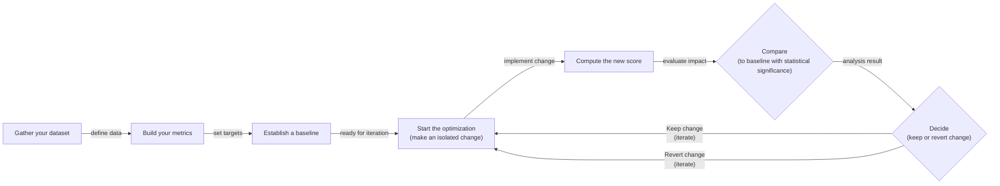
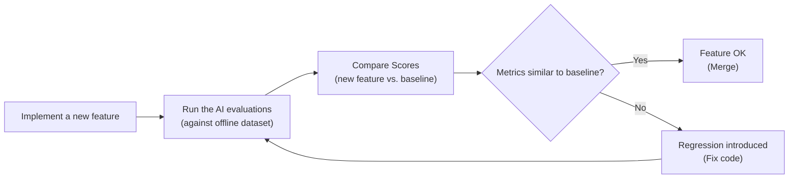
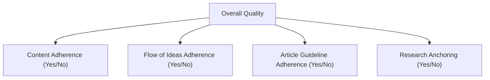

# The Evals North Star: Your Guide to AI Evaluation

In our last lessons, we instrumented our agents with observability tools like Opik and constructed our first offline evaluation datasets. We now have the raw materials for evaluation: a collection of inputs and the corresponding system traces. But this is just the beginning. The next, most critical step is to design the metrics that will tell us if our system is actually any good.

In classical Machine Learning (ML), we have rigorous evaluation standards. We rely on metrics like accuracy, precision, recall, and F1-score to give us a clear, objective measure of performance. We debate the merits of statistical significance. In AI engineering, however, it is common to rely on "vibe checks." We run a few prompts, look at the outputs, and declare that the new version "feels more coherent." Or worse, we skip evaluation altogether.

This mirrors the evolution of Test-Driven Development (TDD) in software engineering. TDD asks a binary question: "Does it work?" Evaluation-Driven Development (EDD) asks a more nuanced one: "How well does it work?" [[1]](https://medium.com/@nimrodbusany_9074/from-tdd-to-edd-why-evaluation-driven-development-is-the-future-of-ai-engineering-a5e5796b2af4).

Investing in a proper evaluation layer can feel like a detour. It does not deliver an immediate, user-visible feature. It requires upfront effort to design datasets and metrics, all while the pressure to ship new functionality mounts. However, this investment dramatically accelerates long-term iteration. It provides an objective signal on every change, catches regressions instantly, and transforms development from guesswork into an evidence-based process.

Evals are the north star of AI engineering. They are the single source of truth that tells you exactly which modifications improve the system and which degrade it. In this lesson, we will establish the theoretical foundation for building this system. We will cover:

-   The optimization flywheel and its three core use cases.
-   The trade-offs between different metric types for unstructured outputs.
-   Why custom business metrics beat public benchmarks and generic scores.
-   Why binary pass/fail judgments are superior to Likert scales.

With the problem and its importance clear, we will now examine how to operationalize evals inside a repeatable optimization flywheel that replaces intuition with evidence.

## Using Evals Through the Optimization Flywheel

To build intuition, let's examine how we can effectively use and integrate AI evaluations into our application development lifecycle. There are three core scenarios where evaluations provide value.

First, evals **quantify the quality of your system** on a given set of metrics, creating a snapshot of its current performance. This baseline is essential. Without it, you cannot know if your system is production-ready or whether your changes are making it better or worse.

Second, these metrics serve as **guidance when optimizing your system**. They provide objective evidence for experiments, shifting development from being intuition-based to evidence-based.

Third, evals act as **regression tests** that protect shared components from unintended breakage. This is critical in AI engineering, where prompts, tools, and retrieval strategies are often interconnected. A small change in one area can have cascading, negative effects elsewhere.

### The Optimization Process

How does this look in a real-world scenario? The optimization flywheel is a step-by-step plan for iterative improvement.

1.  **Gather your dataset:** Assemble an offline dataset of representative inputs, as we did in Lesson 28.
2.  **Build your metrics:** Define business-aligned metrics to measure performance.
3.  **Establish a baseline:** Run your evals on the current system to compute baseline scores.
4.  **Start the optimization:** Make one isolated change that you believe will improve performance. This could be a prompt tweak, a model swap, or a change in retrieval strategy.
5.  **Compute the new score:** Re-run the full evaluation suite on the entire dataset.
6.  **Compare:** Compare the new scores to the baseline, considering statistical significance.
7.  **Decide:** Based on whether the score is better, the same, or worse, decide to keep the change, or revert it. You must also consider the complexity of the change.
8.  **Repeat:** Continue the cycle until your scores meet the target for your business case.

Image 1: Flowchart illustrating the eight-step iterative optimization flywheel for AI applications using evaluations.

It is critical to keep all components fixed except for one variable per cycle. Modifying multiple things at once makes it impossible to attribute score changes to a specific cause, turning a disciplined process back into guesswork. This principle of isolating a single variable is a cornerstone of classical control theory, which models system improvements by analyzing single-input, single-output (SISO) feedback loops. By changing only one input at a time, you can reliably measure its effect on the output, ensuring stability and predictable optimization [[2]](https://en.wikipedia.org/wiki/Control_theory).

When comparing scores, you must anchor statistical significance to actual **business impact**, not just arbitrary p-value thresholds. For a high-volume customer support bot, a 0.5% reduction in checkout errors could translate to $150,000 in annual savings, making a small but statistically significant improvement highly valuable [[3]](https://www.nngroup.com/articles/practical-significance). In this case, the effect feels subtle to individual users, but at scale, it has clear, practical value for the business.

Conversely, for a low-volume creative writing tool, a similar small improvement might be negligible. A 1-second reduction in task time from 55 seconds to 54 seconds might be statistically significant with a large enough sample, but it likely does not meaningfully improve the user experience or justify engineering effort [[3]](https://www.nngroup.com/articles/practical-significance). "Better" is always relative to the business use case. It is also important to remember that offline evaluations are ultimately proxies for the outcome you care about: user satisfaction and business value. A higher score is only meaningful if it reliably tracks with better online performance. The judge itself can drift or reward surface patterns that do not actually improve user experience, so periodic validation against A/B test results is essential to keep the evaluation system calibrated to reality [[4]](https://engineering.atspotify.com/2026/5/better-experiments-with-llm-evals-a-funnel-not-a-fork).

### Regression Testing

A powerful variation of this flywheel is using evals for regression testing. Before merging any new feature that touches shared components—like prompts, tool descriptions, orchestration logic, or memory retrieval—you run the full eval suite. This guards against breaking existing behavior.

This process modifies the optimization flywheel into five steps:

1.  **Implement a new feature:** You write the code and verify it works locally for the new use case.
2.  **Run the AI evaluations:** You run the full suite of assessments, covering all previous use cases, not just the new one.
3.  **Compare Scores:** You compare the scores from your feature branch against the baseline from the main branch.
4.  **Metrics similar to baseline?** If the scores are identical or better, your feature is safe to merge. It has not negatively affected existing functionality.
5.  **Metrics lower than the baseline?** If any score is worse, you have introduced a regression. You must fix your code and repeat the evaluation cycle.

Image 2: A flowchart depicting the five-step regression testing process using AI evaluations.

This treats your AI evals like integration tests, but with a crucial difference: instead of enforcing a strict pass/fail threshold, you compare scores against a moving baseline. The goal is stability and the prevention of degradation. This practice is becoming so central that major agent frameworks are building continuous evaluation directly into their platforms. Tools like Microsoft's Foundry, Google's Agent Development Kit (ADK), and LangSmith integrate tracing with evaluation suites, transforming them into production-ready systems that monitor for performance degradation or "agent decay" over time and enable a continuous improvement lifecycle [[5]](https://learn.microsoft.com/en-us/agents/architecture/evaluation-frameworks), [[6]](https://devblogs.microsoft.com/foundry/build-2026-open-trust-stack-ai-agents), [[7]](https://aws.amazon.com/blogs/machine-learning/evaluating-ai-agents-real-world-lessons-from-building-agentic-systems-at-amazon), [[8]](https://www.linkedin.com/posts/rakeshgohel01_evaluation-is-what-separates-great-ai-agents-activity-7362464250545504256-IEKO).

Your evaluation dataset cannot remain static. It must continuously expand. As new features are added, you should add samples that cover their edge cases. When you find failures in production through observability tools like Opik, you add those traces to your dataset [[9]](https://www.comet.com/docs/opik/evaluation/advanced/manage_datasets). When you debug a particularly hard problem, you add that example as a permanent regression test. For example, after discovering that our RAG system performed poorly when asked "What docs do you have access to?", we added that query to our dataset to ensure any future changes would not reintroduce the failure [[10]](https://www.decodingai.com/p/escaping-poc-purgatory-evaluation). Instead of writing new tests in code, you broaden your test coverage by adding new data.

With the flywheel mechanics clear, we can now examine the different families of metrics we might plug into it when dealing with unstructured outputs.

## Exploring Possible Metric Types

The core difficulty in evaluating AI systems is that we are often dealing with unstructured outputs like text or images. Unlike classical ML with its structured labels, standard accuracy-style metrics are often unavailable. We must turn to other families of metrics.

### 1. BLEU and ROUGE

N-gram overlap metrics like BLEU (Bilingual Evaluation Understudy) and ROUGE (Recall-Oriented Understudy for Gisting Evaluation) are the oldest and simplest. They work by counting the number of overlapping words or sequences of words (n-grams) between the generated output and a reference text [[11]](https://wandb.ai/ai-team-articles/llm-evaluation/reports/LLM-evaluation-benchmarking-Beyond-BLEU-and-ROUGE--VmlldzoxNTIzMTY0NQ), [[12]](https://medium.com/@sthanikamsanthosh1994/understanding-bleu-and-rouge-score-for-nlp-evaluation-1ab334ecadcb).

Their main advantages are that they are fast, deterministic, and require no additional models [[13]](https://www.traceloop.com/blog/demystifying-the-bleu-metric). However, their limitations are severe. They are blind to semantic meaning. If an output is a perfect paraphrase of the reference but uses different words, BLEU and ROUGE will score it near zero. They also cannot assess factual accuracy or the validity of a reasoning process [[11]](https://wandb.ai/ai-team-articles/llm-evaluation/reports/LLM-evaluation-benchmarking-Beyond-BLEU-and-ROUGE--VmlldzoxNTIzMTY0NQ).

### 2. BERTScore

Embedding similarity metrics like BERTScore represent a step up. They use a neural network like BERT to convert both the generated and reference texts into high-dimensional vectors, or embeddings. The similarity between these embeddings (often measured by cosine similarity) serves as the score [[14]](https://spotintelligence.com/2024/08/20/bertscore/).

This approach is better at capturing semantic closeness, as paraphrases will have similar embeddings [[14]](https://spotintelligence.com/2024/08/20/bertscore/). However, it is still a comparison-based metric. It cannot verify complex business logic or rules. A fluently written piece of nonsense that is semantically similar to the reference might still score well [[11]](https://wandb.ai/ai-team-articles/llm-evaluation/reports/LLM-evaluation-benchmarking-Beyond-BLEU-and-ROUGE--VmlldzoxNTIzMTY0NQ).

### 3. LLM Judges

The most flexible and powerful approach is the LLM-as-a-judge. Here, you prompt a capable evaluator LLM with the input, the generated output, a set of detailed criteria, few-shot examples, and chain-of-thought instructions [[15]](https://www.confident-ai.com/blog/why-llm-as-a-judge-is-the-best-llm-evaluation-method), [[16]](https://arize.com/llm-as-a-judge). The judge then produces a structured judgment that can incorporate domain-specific, multi-faceted requirements. For example, a judge can check if a response adheres to a specific legal standard or brand voice, something impossible with lexical or semantic metrics.

This method is highly customizable and can evaluate subjective qualities, providing detailed, human-like critiques [[17]](https://www.evidentlyai.com/llm-guide/llm-as-a-judge). However, its performance depends heavily on the prompt and the evaluator model. LLM judges can be slower and more expensive, and they can inherit the biases of the underlying LLM if not carefully developed and tested [[18]](https://www.linkedin.com/posts/allaabdella_llm-aijudge-genai-activity-7353053642590932994-s3sw), [[19]](https://cameronrwolfe.substack.com/p/llm-as-a-judge). To mitigate these risks, a judge must be calibrated before use. This involves an iterative loop: label a representative dataset, run the judge, review disagreements, and update the evaluation criteria or examples until the judge's performance is reliable [[20]](https://arize.com/blog/how-to-build-llm-as-a-judge-evaluators-that-hold-up-in-production).

The table below summarizes the trade-offs. For the complex requirements of our capstone writing agent—adherence to guidelines, structural fidelity, and grounding in research—LLM judges are the most practical choice.

Table 1: A comparison of trade-offs between different metric families.

| Metric Family | Speed | Cost | Semantic Awareness | Business Alignment | Explainability |
| --- | --- | --- | --- | --- | --- |
| **BLEU/ROUGE** | High | Low | Low | Low | Medium |
| **BERTScore** | Medium | Medium | High | Medium | Low |
| **LLM Judge** | Low | High | High | High | High |

Now, you kept hearing from us: "business metrics here, business metrics there." Thus, let's understand why defining your own business metrics is such an essential and underrated step in building your AI evals strategy.

## Why Business Metrics Over Benchmarks

Public benchmarks are the most deceiving type of metric. Using popular leaderboards or open benchmarks to choose an LLM or make product decisions is often a mistake. There are two core reasons for this.

First, benchmarks often function as marketing artifacts. Once a test set becomes public, models can be fine-tuned directly on it to inflate scores [[21]](https://launchdarkly.com/blog/llm-evaluation). This "teaching to the test" means the leaderboard score no longer reflects performance on unseen data, which undermines the benchmark's validity [[22]](https://world.hey.com/bhari/ai-benchmark-scores-are-becoming-marketing-dynamic-eval-is-the-only-antidote-dedd7053), [[23]](https://openreview.net/forum?id=XbVMiW0jTM). High scores do not consistently translate into a superior user experience, revealing a performance gap attributable to this overfitting [[23]](https://openreview.net/forum?id=XbVMiW0jTM). This problem extends beyond explicit fine-tuning. Even the common practice of iterative prompt engineering against a fixed evaluation set is a form of "training" on the test data, which can lead to overfitting the prompts to the benchmark without true generalization [[24]](https://openreview.net/forum?id=maMnVCHl8J).

Second, there is a fundamental mismatch between typical benchmark tasks and real business workloads. Benchmarks often focus on academic problems like math puzzles (GSM8k) or generic question-answering (MMLU) [[25]](https://magazine.sebastianraschka.com/p/llm-evaluation-4-approaches). These tasks rarely resemble the demands of long-form creative writing, nuanced legal analysis, or personalized customer support that define many real-world applications.

The proper role for benchmarks is narrow: they are useful for advancing research frontiers and for initial model filtering during early exploration. They should never be used as a proxy for product-level decisions or as a primary optimization target.

If benchmarks are misleading, generic prefab metrics that claim to measure universal qualities are even more dangerous. We must instead build metrics that are deeply tied to our specific application.

## Why Custom Business Metrics Over Generic Metrics

Generic, off-the-shelf metrics for qualities like "toxicity," "helpfulness," or "hallucination" are a mirage. They create false confidence by optimizing for the wrong signal, as they lack context about your product, user expectations, and brand voice [[26]](https://www.linkedin.com/posts/shivanshu-aggarwal_evals-aievals-llm-activity-7375884554177449985-16kP). An AI system can score brilliantly on a generic "helpfulness" metric but fail catastrophically on your specific business constraints.

Consider the dashboard below. It looks impressive, with scores for "Truthfulness" and "Personalization." But what does a 3.7 in "Personalization" actually mean? What should the team do to improve it? These scores are often unactionable [[27]](https://www.decodingai.com/p/the-5-star-lie-you-are-doing-ai-evals).

https://substackcdn.com/image/fetch/w_1456,c_limit,f_auto,q_auto:good,fl_progressive:steep/https%3A%2F%2Fsubstack-post-media.s3.amazonaws.com%2Fpublic%2Fimages%2F322c2e07-ee9a-4139-b51d-f8f0c4787d88_1600x822.png
Image 3: A dashboard showing generic metrics like Helpfulness and Truthfulness, labeled "Don't Do This!" (Source [27](https://www.decodingai.com/p/the-5-star-lie-you-are-doing-ai-evals))

For example, let's assume we want to check if the article written by our Brown agent contains hallucinations. If we use a generic `hallucination` score and it returns "positive," what does that tell us? Did it add information not present in the research? Did it deviate from the article guidelines? Or did it simply include a personal story that was not in the source text but is factually correct and relevant? A generic detector might flag an engaging personal anecdote as a fabrication, yet that same anecdote may be exactly what your brand voice requires [[28]](https://www.decodingai.com/p/the-mirage-of-generic-ai-metrics). The generic metric cannot distinguish undesirable invention from desirable creative elaboration.

These prefab scores lack domain-specific constraints, cannot localize which part of an output failed, and introduce statistical noise into decision-making.

This does not mean generic metrics are useless. They have a narrow, valid role during exploratory data analysis, where they can act as a "flashlight" to surface interesting examples for manual review [[28]](https://www.decodingai.com/p/the-mirage-of-generic-ai-metrics).

Here are some useful examples:

1.  **Verbosity:** Sort your outputs by length. This can reveal if your longest answers are rambling and unhelpful, or if your shortest answers are curt and missing information. This helps you spot failure modes in long-form generation.
2.  **Similarity Score:** Use this to evaluate your RAG retriever specifically. If the similarity between the user query and the retrieved chunks is low, your retriever is likely failing. This is a valid component-level check.
3.  **BERTScore:** Use this to check the quality of your golden reference answers. If a cluster of outputs has a low BERTScore against a reference you expected to be similar, it might be that the LLM found a more creative or even better way to solve the problem.

In these cases, the generic metric is the start of an investigation, not the final verdict. Every production metric must be deeply application-centric, derived from concrete product requirements, user success criteria, and explicit constraints.

Once we have rejected both benchmarks and generic metrics, the remaining design choice is how to elicit judgments from our LLM judge. Here, binary pass/fail criteria outperform every alternative.

## Choosing Binary Metrics Over Anything Else

When designing these custom metrics, you will face a choice: should you use a Likert scale (e.g., 1-5 stars) or a binary pass/fail? We strongly recommend **binary metrics**.

Likert scales are a seductive trap. They seem to offer more nuance, but in practice, they introduce ambiguity and noise. Here are the main problems:

1.  **Inconsistent Labeling:** The difference between a '3' and a '4' is subjective. One person's '4' is another's '3', leading to low inter-annotator agreement. You spend more time debating the rubric than evaluating the system [[27]](https://www.decodingai.com/p/the-5-star-lie-you-are-doing-ai-evals).
2.  **Statistical Noise:** Detecting a real improvement is harder. Moving an average score from 3.2 to 3.4 requires a much larger sample size to be statistically significant than seeing a binary pass rate shift from 75% to 80% [[27]](https://www.decodingai.com/p/the-5-star-lie-you-are-doing-ai-evals), [[29]](https://www.ellamind.com/blog/binary-vs-likert-scales).
3.  **Lazy Decision-Making:** Raters often default to the middle value ('3') to avoid a difficult judgment. This "satisficing" behavior hides uncertainty rather than resolving it, leaving you with a sea of '3's that tells you nothing actionable [[27]](https://www.decodingai.com/p/the-5-star-lie-you-are-doing-ai-evals).

Binary evaluations work because they **force decisions**. An output either met the criterion or it did not. This simple constraint is incredibly powerful and offers immediate benefits:

1.  **Clearer Thinking:** You cannot hide in ambiguity. This forces you to create precise, unambiguous definitions of quality.
2.  **Consistency:** Binary decisions are faster and more consistent for both human and AI judges, yielding higher agreement.
3.  **Actionability:** A spike in a specific failure rate, like "Constraint Violation," tells an engineer exactly where to start debugging.

<aside>
💡

**Note:** The 3 points above translate exceptionally well to LLM Judges. Using binary scoring is a key design choice to mitigate the inherent randomness of LLMs. LLMs are much more stable when asked to make a binary decision than when asked to assign a scalar value. A binary metric translates to a more robust and repeatable evaluation pipeline [[29]](https://www.ellamind.com/blog/binary-vs-likert-scales), [[30]](https://eugeneyan.com/writing/llm-evaluators/).

</aside>

### Capturing Nuance

The standard objection is, "But I'm losing nuance! A 1-5 scale captures shades of gray." This is a valid concern, but a Likert scale is the wrong solution. The right way to capture nuance is not by making your scale fuzzier, but by making your criteria more **granular**.

Instead of one vague "Quality" rating, you decompose it into multiple, specific, binary checks [[29]](https://www.ellamind.com/blog/binary-vs-likert-scales). For our writing agent, instead of rating an article 1-5 for "Quality," we can create multiple binary evaluations:

1.  **Content Adherence:** Does the generated article contain the same core concepts as the expected article? (Yes/No)
2.  **Flow of Ideas Adherence:** Does the generated article contain the ideas in the same order as the expected article? (Yes/No)
3.  **Article Guideline Adherence:** Does the generated article follow the flow of ideas from the article guideline input? (Yes/No)
4.  **Research Anchoring:** Is every claim in the article supported by the provided research? (Yes/No)

Image 4: A hierarchical decomposition of Overall Quality into binary evaluation criteria.

By aggregating these binary signals, you get a nuanced view of performance ("we pass Content and Flow checks 95% of the time, but fail on Research Anchoring 40% of the time") without the noise and subjectivity of a Likert scale. This approach is simple, scalable, and robust. For highly creative tasks, however, even granular binary checks can fall short. They may struggle with subjective qualities like narrative flow or style, and can score an incomplete but fluent passage as perfect. This makes them powerful for debugging concrete failures but less reliable for holistically assessing open-ended creativity [[31]](https://www.linkedin.com/posts/pauliusztin_i-created-an-ai-agent-to-write-a-substack-activity-7420095430807691266-fQ1U), [[32]](https://www.mdpi.com/2076-3417/15/6/2971).

With the full theoretical picture in place, we can now summarize the mindset shift required and preview the hands-on implementation that follows in the next lesson.

## Conclusion

The path to building robust AI products requires a fundamental shift in mindset: away from vibe checks, public leaderboards, and generic scores, and toward rigorous, evaluation-driven development. This means building custom, binary, business-aligned metrics that emerge from a deep analysis of your system's specific failures.

Granular pass/fail criteria deliver the clearest optimization signal while avoiding the statistical noise and subjectivity inherent in scalar ratings. In our next lesson, we will translate this theory into practice by implementing custom LLM judges from scratch to evaluate our Brown writing workflow.

## References

-   [1] Nimrod Busany. (n.d.). From TDD to EDD: Why Evaluation-Driven Development is the future of AI Engineering. Medium. https://medium.com/@nimrodbusany_9074/from-tdd-to-edd-why-evaluation-driven-development-is-the-future-of-ai-engineering-a5e5796b2af4
-   [2] Control theory. (n.d.). Wikipedia. https://en.wikipedia.org/wiki/Control_theory
-   [3] Rachel Banawa. (2026, March 6). Statistical Significance Isn’t the Same as Practical Significance. Nielsen Norman Group. https://www.nngroup.com/articles/practical-significance
-   [4] Better Experiments with LLM Evals: A Funnel, Not a Fork. (2026, May). Spotify Engineering. https://engineering.atspotify.com/2026/5/better-experiments-with-llm-evals-a-funnel-not-a-fork
-   [5] Agent evaluation frameworks. (n.d.). Microsoft Learn. https://learn.microsoft.com/en-us/agents/architecture/evaluation-frameworks
-   [6] Build 2026: The open and trusted stack for AI agents. (n.d.). Microsoft Foundry Developer Blogs. https://devblogs.microsoft.com/foundry/build-2026-open-trust-stack-ai-agents
-   [7] Evaluating AI agents: Real-world lessons from building agentic systems at Amazon. (n.d.). AWS Machine Learning Blog. https://aws.amazon.com/blogs/machine-learning/evaluating-ai-agents-real-world-lessons-from-building-agentic-systems-at-amazon
-   [8] Rakesh Gohel. (n.d.). Evaluation is what separates great AI Agents from mediocre ones. LinkedIn. https://www.linkedin.com/posts/rakeshgohel01_evaluation-is-what-separates-great-ai-agents-activity-7362464250545504256-IEKO
-   [9] Manage datasets. (n.d.). Opik Documentation. https://www.comet.com/docs/opik/evaluation/advanced/manage_datasets
-   [10] Hugo Bowne-Anderson & Stefan Krawczyk. (2025, October 16). Escaping POC Purgatory: Evaluation-Driven Development for AI Systems. Decoding AI. https://www.decodingai.com/p/escaping-poc-purgatory-evaluation
-   [11] Josep Ferrer. (2025, December 9). LLM evaluation benchmarking: Beyond BLEU and ROUGE. Weights & Biases. https://wandb.ai/ai-team-articles/llm-evaluation/reports/LLM-evaluation-benchmarking-Beyond-BLEU-and-ROUGE--VmlldzoxNTIzMTY0NQ
-   [12] Santosh Kumar Stahanikam. (n.d.). Understanding BLEU and ROUGE Score for NLP Evaluation. Medium. https://medium.com/@sthanikamsanthosh1994/understanding-bleu-and-rouge-score-for-nlp-evaluation-1ab334ecadcb
-   [13] Demystifying the BLEU Metric. (n.d.). Traceloop. https://www.traceloop.com/blog/demystifying-the-bleu-metric
-   [14] Neri Van Otten. (2024, August 20). BERTScore explained: A modern metric for evaluating text generation. Spot Intelligence. https://spotintelligence.com/2024/08/20/bertscore/
-   [15] Why LLM-as-a-Judge is the best LLM evaluation method. (n.d.). Confident AI. https://www.confident-ai.com/blog/why-llm-as-a-judge-is-the-best-llm-evaluation-method
-   [16] LLM-as-a-Judge. (n.d.). Arize. https://arize.com/llm-as-a-judge
-   [17] LLM-as-a-judge: a complete guide to using LLMs for evaluations. (n.d.). Evidently AI. https://www.evidentlyai.com/llm-guide/llm-as-a-judge
-   [18] Alla Abdella. (n.d.). LLM as a Judge is scalable, cost-effective... LinkedIn. https://www.linkedin.com/posts/allaabdella_llm-aijudge-genai-activity-7353053642590932994-s3sw
-   [19] Cameron R. Wolfe. (n.d.). LLM as a Judge. https://cameronrwolfe.substack.com/p/llm-as-a-judge
-   [20] How To Build LLM-as-a-Judge Evaluators That Hold Up in Production. (n.d.). Arize. https://arize.com/blog/how-to-build-llm-as-a-judge-evaluators-that-hold-up-in-production
-   [21] LLM Evaluation. (n.d.). LaunchDarkly. https://launchdarkly.com/blog/llm-evaluation
-   [22] B Hari. (2026, April 26). AI — Benchmark scores are becoming marketing; dynamic eval is the only antidote. https://world.hey.com/bhari/ai-benchmark-scores-are-becoming-marketing-dynamic-eval-is-the-only-antidote-dedd7053
-   [23] PROBE: BENCHMARKING REASONING PARADIGM OVERFITTING IN LARGE LANGUAGE MODELS. (n.d.). OpenReview. https://openreview.net/forum?id=XbVMiW0jTM
-   [24] On the Imitation of Benchmarks in Language Model Development. (n.d.). OpenReview. https://openreview.net/forum?id=maMnVCHl8J
-   [25] Sebastian Raschka. (n.d.). 4 Ways We're Evaluating LLMs in 2024. https://magazine.sebastianraschka.com/p/llm-evaluation-4-approaches
-   [26] Shivanshu Aggarwal. (n.d.). AI evaluation is broken when we hide behind generic metrics. LinkedIn. https://www.linkedin.com/posts/shivanshu-aggarwal_evals-aievals-llm-activity-7375884554177449985-16kP
-   [27] Hamel Husain. (n.d.). The 5-Star Lie: You’re Doing AI Evaluations Wrong. Decoding AI. https://www.decodingai.com/p/the-5-star-lie-you-are-doing-ai-evals
-   [28] Hamel Husain. (n.d.). The Mirage of Generic AI Metrics. Decoding AI. https://www.decodingai.com/p/the-mirage-of-generic-ai-metrics
-   [29] Why We Use Binary Yes/No Evaluations (And You Should Too). (n.d.). ellamind. https://www.ellamind.com/blog/binary-vs-likert-scales
-   [30] Eugene Yan. (n.d.). Evaluating the Effectiveness of LLM-Evaluators (aka LLM-as-Judge). https://eugeneyan.com/writing/llm-evaluators/
-   [31] Paul Iusztin. (n.d.). I created an AI agent to write a Substack article from scratch. LinkedIn. https://www.linkedin.com/posts/pauliusztin_i-created-an-ai-agent-to-write-a-substack-activity-7420095430807691266-fQ1U
-   [32] A Comprehensive Evaluation of Large Language Models in the Legal Domain. (n.d.). MDPI. https://www.mdpi.com/2076-3417/15/6/2971