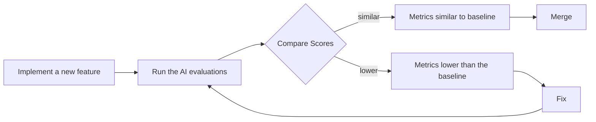

# The North Star of AI Engineering: A Guide to Evaluation-Driven Development

In our last lessons, we instrumented our AI agents with observability tools like Opik and constructed offline datasets for evaluation. We now have the raw materials: the traces and the test cases. But how do we measure performance? In classical Machine Learning, the answer is clear. We rely on rigorous metrics like accuracy, precision, recall, and F1 scores, all validated with statistical significance. In AI engineering, however, it is common to see teams rely on "vibe checks," approving changes because an output "feels more coherent."

Investing in a proper evaluation layer can feel difficult to prioritize. It does not deliver an immediate, user-visible feature. It requires upfront effort to design datasets and metrics, and it competes with the pressure to ship new functionality. However, this same investment dramatically accelerates long-term iteration. It provides an objective signal on every change, catches regressions instantly, and focuses your team on what truly matters.

Evals are the north star of AI engineering. They are the single source of truth that tells you exactly which modifications improve your system and which degrade it. Without them, you are flying blind.

In this lesson, we will establish the theoretical foundation for Evaluation-Driven Development (EDD). We will cover:
- The optimization flywheel and its three core use cases.
- The trade-offs between different metric types for unstructured outputs.
- Why custom business metrics are superior to public benchmarks and generic scores.
- Why binary pass/fail judgments are more effective than Likert scales.

With the problem and its importance clear, we will now examine how to operationalize evals inside a repeatable optimization flywheel that replaces intuition with evidence.

## Using Evals Through the Optimization Flywheel

To build intuition, let's examine how we can effectively integrate AI evaluations into our application development lifecycle. There are three core scenarios where evaluations provide value.

First, evals **quantify the quality of your system** on a given set of metrics, creating a baseline snapshot of its current performance. Without a baseline, you cannot know if your system is ready for production or if your changes are actually improving it.

Second, these metrics serve as **guidance when optimizing your system**. They provide the evidence needed to move from intuition-based tweaks to a systematic, evidence-based development process.

Finally, evals act as **regression tests** that protect shared components. Unlike optimization, the goal here is stability. This is extremely important in AI engineering, as prompts, tools, and orchestration logic are often shared and interconnected. A small change in one area can have unintended and negative consequences elsewhere.

### The Optimization Process

How does this look in a real-world scenario? The optimization flywheel is an eight-step iterative process that provides a clear plan of attack.

1.  **Gather your dataset:** Assemble the offline dataset that represents the key scenarios and edge cases for your application.
2.  **Build your metrics:** Define the business-aligned metrics that measure what success looks like for your product.
3.  **Establish a baseline:** Run your evaluation suite on the current system to compute the initial baseline scores.
4.  **Start the optimization:** Make one, and only one, isolated change that you believe will improve performance.
5.  **Compute the new score:** Re-evaluate the entire dataset by re-running the evaluations with the change in place.
6.  **Compare:** Compare the new scores to the baseline, considering statistical significance in the context of your business goals.
7.  **Decide:** Based on whether the score is better, the same, or worse, decide to keep the change, revert it, or analyze its complexity trade-offs.
8.  **Repeat:** Continue the cycle, making one change at a time, until the scores meet your target for production readiness.

Image 1: The iterative optimization flywheel for AI applications using evaluations.

It is critical to change only one variable per cycle. If you modify the prompt, change the model, and adjust the chunking strategy all at once, you create confounding variables. It becomes impossible to attribute any score changes to a specific modification, turning your disciplined process back into guesswork.

This discipline is essential because AI systems, unlike traditional deterministic software, are probabilistic. The same input can produce different outputs or behaviors across runs [[3]](https://www.datarobot.com/blog/agentic-ai-enterprise-design). Isolating changes is the only way to establish a causal link between a modification and its effect on performance, bringing scientific rigor to a non-deterministic environment.

Furthermore, you must anchor statistical significance to actual **business impact**, not arbitrary p-values. A "better" score is always relative to the use case. For example, imagine a change that reduces checkout errors in a high-volume e-commerce bot by just 0.5%. This might sound small, but if your product processes two million checkouts a year, that translates to 10,000 fewer failed transactions [[1]](https://www.nngroup.com/articles/practical-significance). If each failure costs the business $15 in lost revenue or support time, that tiny improvement is worth $150,000 annually. In this context, even a small, statistically significant improvement has a massive real-world gain.

In contrast, consider a creative writing assistant used by a small number of beta testers. An improvement in its average "coherence" score from 3.2 to 3.5 on a Likert scale might not be practically significant, even if it is statistically significant [[2]](https://www.ellamind.com/blog/binary-vs-likert-scales). The change may be too subtle for users to notice, and the effort to achieve it might be better spent elsewhere. The business impact dictates the threshold for what constitutes a meaningful improvement.

### Regression Testing

A powerful variation of this flywheel is using it for regression testing. Before merging any new feature that touches shared components—prompts, tool descriptions, orchestration logic, or memory retrieval—you run the full evaluation suite. This guards against breaking existing behavior. Running AI evaluations as regression tests is an extremely powerful technique to ensure that your new features do not degrade your system's overall performance.

This approach is necessary because AI systems fail in ways that traditional software testing never anticipated [[4]](https://agility-at-scale.com/ai/architecture/evaluation-and-testing-frameworks). A standard unit or integration test cannot catch a subtle degradation in tone, a new type of hallucination, or a plausible-sounding but factually incorrect answer. Your evaluation suite acts as a behavioral test harness for these emergent, non-deterministic failure modes.

This process can be simplified into five steps:
1.  **Implement a new feature:** You write the code and verify it works locally for the new use case.
2.  **Run the AI evaluations:** You run the full suite of assessments, covering all existing use cases, not just the new one.
3.  **Compare Scores:** You compare the new scores against the established baseline for all metrics.
4.  **Metrics similar to baseline:** If the scores are statistically similar to the baseline, your feature has not introduced a regression. You can merge it into your production codebase.
5.  **Metrics lower than the baseline:** If any score is significantly worse, you have introduced a regression. You must fix your code and repeat the evaluation cycle.

Image 2: Integrating AI evaluations into CI pipelines for regression testing.

This treats evaluations like integration tests, but with a key difference. Instead of a strict pass/fail threshold, you compare scores against a moving baseline. The goal is to prevent degradation, not to enforce a fixed, absolute standard of perfection on every run.

Your evaluation dataset must be a living asset. It must continuously expand with new edge cases discovered for features, failures captured from production traces via observability tools like Opik, and difficult examples that expose current failure modes [[5]](https://www.comet.com/docs/opik/evaluation/advanced/manage_datasets), [[6]](https://www.decodingai.com/p/generate-synthetic-datasets-for-ai-evals). For example, if you are debugging a regression in production, you should add the problematic production trace to your evaluation dataset. This ensures that the same regression will be caught automatically in the future. Instead of writing new tests in code, you broaden your test coverage by adding new samples to the dataset.

This practice is often called **continuous evaluation**, where monitoring and measurement extend beyond pre-deployment testing into the production environment. It is essential for all production agents, as it tracks real-world performance against evolving user inputs and data distributions, catching the gradual drift that static test sets can miss [[7]](https://datagrid.com/blog/4-frameworks-test-non-deterministic-ai-agents).

With the mechanics of the flywheel clear, we can now examine the different families of metrics we might plug into it when dealing with unstructured outputs.

## Exploring Possible Metric Types

The core difficulty in evaluating AI systems lies in their unstructured outputs, such as text and reasoning traces. Standard accuracy metrics from classical ML do not apply directly. We can group the available metrics into three core families.

### 1. BLEU and ROUGE

N-gram overlap metrics like Bilingual Evaluation Understudy (BLEU) and Recall-Oriented Understudy for Gisting Evaluation (ROUGE) are the oldest and simplest. They work by calculating the lexical overlap between the generated text and a reference text. Their main advantages are that they are fast to compute, widely understood, and deterministic. You do not need an additional model to run them [[8]](https://wandb.ai/ai-team-articles/llm-evaluation/reports/LLM-evaluation-benchmarking-Beyond-BLEU-and-ROUGE--VmlldzoxNTIzMTY0NQ), [[9]](https://medium.com/@sthanikamsanthosh1994/understanding-bleu-and-rouge-score-for-nlp-evaluation-1ab334ecadcb).

However, their limitations are significant. They are blind to semantic equivalence. If a model produces a correct answer that uses different words (paraphrasing), it will be penalized. They also do not care about factual accuracy or whether the reasoning is sound; they only care about word overlap [[8]](https://wandb.ai/ai-team-articles/llm-evaluation/reports/LLM-evaluation-benchmarking-Beyond-BLEU-and-ROUGE--VmlldzoxNTIzMTY0NQ).

### 2. BERTScore

Embedding similarity metrics, like BERTScore, represent an improvement. They work by embedding both the generated text and the reference text into a high-dimensional vector space using a model like BERT. The cosine similarity between these embeddings is then used to measure semantic closeness [[10]](https://www.elastic.co/search-labs/blog/evaluating-rag-metrics).

This approach has a clear advantage over pure lexical methods because it can capture semantic meaning. It recognizes that "the child is joyful" is similar to "the boy is happy." However, it is still a comparison metric. It cannot verify complex business rules or logical constraints on its own.

### 3. LLM Judges

The LLM-as-a-judge approach uses a capable LLM to evaluate the output of another model. You provide the judge model with the input, the generated output, a set of detailed criteria, few-shot examples, and chain-of-thought instructions. The judge then produces a structured judgment, often including a score and a rationale [[11]](https://www.confident-ai.com/blog/why-llm-as-a-judge-is-the-best-llm-evaluation-method).

The main advantage of this method is its flexibility. It can be customized to evaluate subjective aspects like tone and style, and it can be programmed to check for adherence to complex, domain-specific guidelines. The detailed, human-like critiques it provides are also valuable for debugging [[12]](https://www.evidentlyai.com/llm-guide/llm-as-a-judge). However, its performance is highly dependent on the quality of the prompt and the power of the evaluator model. LLM judges can also be slower, more expensive, and inherit the biases of the underlying model if not carefully developed and tested [[13]](https://www.linkedin.com/posts/allaabdella_llm-aijudge-genai-activity-7353053642590932994-s3sw).

To mitigate these issues, teams calibrate LLM judges by building few-shot example sets from human-corrected evaluations. This process helps align the judge with specific quality criteria and corrects for inherent biases, such as a preference for verbosity, improving the reliability of its judgments [[14]](https://www.langchain.com/resources/llm-as-a-judge).

| Metric Family | Speed | Cost | Semantic Awareness | Business Alignment | Explainability |
| --- | --- | --- | --- | --- | --- |
| **BLEU/ROUGE** | High | Low | Low | Low | Medium |
| **BERTScore** | Medium | Low | Medium | Low | Low |
| **LLM Judges** | Low | High | High | High | High |

Table 1: A trade-off comparison between different evaluation metric families.

For the kinds of complex requirements we have in our capstone projects, such as guideline adherence and research grounding for the writing workflow, LLM judges are the most practical choice.

You have heard us say "business metrics" multiple times. Let's now understand why defining your own business metrics is such an essential and underrated step in building your AI evaluation strategy.

## Why Business Metrics Over Benchmarks

Benchmarks are one of the most deceiving types of metrics. Looking at popular leaderboards or open benchmarks to choose the best LLM for your product is often a mistake. There are two core reasons for this.

First, benchmarks often function as marketing artifacts. Once a test set becomes public, teams can intentionally or unintentionally overfit to it. This "training on the test set" leads to inflated scores that no longer reflect performance on unseen data, undermining the benchmark's validity [[15]](https://www.evidentlyai.com/llm-guide/llm-benchmarks), [[16]](https://world.hey.com/bhari/ai-benchmark-scores-are-becoming-marketing-dynamic-eval-is-the-only-antidote-dedd7053). There have been instances where models achieved "too-good-to-be-true" scores, raising suspicions that they were fine-tuned on the test sets.

Second, there is a fundamental mismatch between the tasks in most benchmarks and the demands of real business workloads. A model's ability to solve grade-school math problems (like in GSM8K) or answer generic trivia questions says very little about its ability to perform long-form creative writing, conduct nuanced legal analysis, or provide personalized customer support [[17]](https://magazine.sebastianraschka.com/p/llm-evaluation-4-approaches).

This does not mean benchmarks have no value. They play a narrow but important role in advancing research frontiers and can be useful for initial model selection during early exploration. However, they should never be used as a proxy for product-level decisions or as the primary target for optimization.

If benchmarks are misleading, generic prefab metrics that claim to measure universal qualities are even more dangerous. We must instead build metrics that are deeply tied to our specific application.

## Why Custom Business Metrics Over Generic Metrics

Generic metrics like "toxicity," "helpfulness," or RAGAS-style "faithfulness" create a mirage. They optimize for the wrong signal and generate false confidence because they lack context about your product, your users' expectations, and your brand's voice. A model can score brilliantly on a generic "helpfulness" metric but fail catastrophically on your specific constraints.

Consider the dashboard below. It looks impressive, with scores for "Truthfulness" and "Personalization." But what does a 3.7 in "Personalization" actually mean? What should the team do to improve it? These scores are often vanity metrics that create the illusion of progress while masking the failures that actually matter [[18]](https://www.linkedin.com/posts/shivanshu-aggarwal_evals-aievals-llm-activity-7375884554177449985-16kP).

https://images.spr.so/cdn-cgi/imagedelivery/j42No7y-dcokJuNgXeA0ig/585bb9f6-0bf3-427f-a9d3-994dd5849a1a/322c2e07-ee9a-4139-b51d-8f0c4787d880_1600x822/w=1920,quality=90,fit=scale-down
Image 3: A dashboard showing generic metrics like Helpfulness and Truthfulness, labeled "Don't Do This!"

Let's take a concrete example. Suppose we want to check if the article written by our Brown agent contains hallucinations. A generic `hallucination` score might return "positive." But what does that tell us? Did the agent add information not present in the provided research? Did it deviate from the article guidelines? Or did it simply include a personal story that, while not in the source text, is factually correct and aligns with the desired brand voice? A generic detector cannot distinguish between undesirable invention and desirable creative elaboration. It lacks the domain-specific context to make a meaningful judgment.

Prefabricated scores have several limitations. They cannot account for your domain-specific constraints, they cannot localize which part of an output failed, and they introduce additional statistical noise into your decision-making process.

This does not render generic metrics completely useless. They have a narrow but valid role during exploratory data analysis.
1.  **Verbosity:** Sorting your outputs by length can quickly reveal if your most verbose answers are rambling and unhelpful, or if your shortest answers are curt and missing information. This can help you spot failure modes in long-form generation.
2.  **Similarity Score:** In a RAG system, you can use a similarity score to evaluate the retriever component specifically. If the similarity between the user's query and the retrieved document chunks is low, your retriever is likely failing. This is a valid component-level check.
3.  **BERTScore:** You can use this to check the quality of your "golden" reference answers. If you find a cluster of outputs with a low BERTScore against a reference you expected to be similar, it might reveal that the LLM has found a more creative or even a better solution than your reference.

In all these cases, the generic metric is the starting point of an investigation, not the final verdict. Every production metric must be deeply application-centric, derived from concrete product requirements, user success criteria, and explicit constraints.

Once we have rejected both benchmarks and generic metrics, the remaining design choice is how to elicit judgments from our LLM judge. Here, binary pass/fail criteria outperform every alternative.

## Choosing Binary Metrics Over Anything Else

When designing custom metrics, you face a choice: a Likert scale (e.g., 1-5 stars) or a binary pass/fail. We strongly recommend **binary metrics**.

While seemingly nuanced, Likert scales introduce several practical problems:
1.  **Inconsistent Labeling:** The difference between a '3' and a '4' is subjective and varies between raters, leading to noisy data and low inter-annotator agreement [[19]](https://www.decodingai.com/p/the-5-star-lie-you-are-doing-ai-evals).
2.  **Statistical Noise:** Detecting a meaningful improvement from an average score of 3.2 to 3.4 requires a much larger sample size than detecting a shift in a binary pass rate. For example, reliably detecting an improvement from an average score of 3.2 to 3.5 might require around 350 samples, whereas a pass rate shift from 60% to 70% could be established with only 150 [[2]](https://www.ellamind.com/blog/binary-vs-likert-scales). You can waste weeks on changes without knowing if you are making real progress.
3.  **Lazy Decision-Making:** Raters often default to the middle value ('3') to avoid a difficult judgment. This "satisficing" behavior flattens the signal, leaving you with a sea of uninformative '3's [[19]](https://www.decodingai.com/p/the-5-star-lie-you-are-doing-ai-evals).

Binary evaluations work because they **force decisions**, providing several advantages:
1.  **Clearer Thinking:** Binary metrics force you to create precise, unambiguous definitions of quality. You cannot hide in the ambiguity of a '3'.
2.  **Consistency:** Binary decisions are faster and more consistent for both human annotators and LLM judges, leading to higher-quality evaluation data.
3.  **Actionability:** The output is a clear failure signal tied to a specific problem, not a vague score change. An engineer seeing a spike in the "Constraint Violation" failure rate knows exactly where to start debugging.

<aside>
💡
**Note:** These points translate exceptionally well to LLM Judges. Using binary scoring is a key design choice to mitigate the inherent randomness of LLMs. LLMs are much more stable when asked to make a binary decision than when asked to assign a scalar value. A binary metric translates to a more robust and repeatable evaluation pipeline.
</aside>

### Capturing Nuance

The standard objection is a perceived loss of nuance—a 'Fail' can seem too harsh for a partially correct response. The solution is not a fuzzier scale, but more **granular** criteria. Instead of one vague rating, you decompose the quality into multiple, specific, binary checks.

For our writing agent, instead of rating an article 1-5 for "Quality," we can create multiple binary evaluations that capture specific dimensions of quality:
1.  **Content Adherence:** Does the generated article contain the same core concepts as the expected article? (Yes/No)
2.  **Flow of Ideas Adherence:** Does the generated article present ideas in the same order as the expected article? (Yes/No)
3.  **Article Guideline Adherence:** Does the generated article follow the flow of ideas from the article guideline input? (Yes/No)
4.  **Research Anchoring:** Is every claim in the article supported by the provided research? (Yes/No)

This approach applies across domains. For a customer support bot, you might check: Did it address the user's core question? (Yes/No) and Did it provide accurate policy information? (Yes/No). For a RAG system, key checks would be: Is the answer fully supported by the retrieved documents? (Yes/No) and Does it avoid introducing unsourced information? (Yes/No) [[2]](https://www.ellamind.com/blog/binary-vs-likert-scales).

By aggregating these binary signals—perhaps as a simple average or a weighted sum—you get a nuanced view of performance. You can now say, "Our system is passing Content and Flow Adherence 95% of the time, but it's failing Research Anchoring 40% of the time." That is a signal you can act on. You have captured the nuance without sacrificing clarity, and you have eliminated the noise of subjective scales.

With the full theoretical picture in place, we can now summarize the mindset shift required and preview the hands-on implementation that follows in the next lesson.

## Conclusion

This lesson has outlined the core shift from "vibe checks," leaderboards, and generic scores to a rigorous, evaluation-driven development process. This approach is built on custom, binary, business-aligned metrics that provide a clear and actionable signal for improvement. We have argued that granular pass/fail criteria deliver the most reliable optimization signal while avoiding the statistical noise and subjectivity inherent in scalar ratings.

This theoretical framework is the foundation for building reliable AI systems. In the next lesson, we will translate this theory into practice. We will implement custom LLM judges from scratch to evaluate our Brown writing workflow, putting these principles into action.

## References

- [1] Nielsen Norman Group. (n.d.). Practical Significance. https://www.nngroup.com/articles/practical-significance
- [2] Ella Mind. (n.d.). Why We Use Binary Yes/No Evaluations (And You Should Too). https://www.ellamind.com/blog/binary-vs-likert-scales
- [3] DataRobot. (n.d.). Agentic AI: Designing for a Probabilistic World. https://www.datarobot.com/blog/agentic-ai-enterprise-design
- [4] Agility at Scale. (n.d.). Evaluation and Testing Frameworks for AI Systems. https://agility-at-scale.com/ai/architecture/evaluation-and-testing-frameworks
- [5] Comet. (n.d.). Manage Datasets - Opik Documentation. https://www.comet.com/docs/opik/evaluation/advanced/manage_datasets
- [6] Decoding AI. (n.d.). Generate Synthetic Datasets for AI Evals. https://www.decodingai.com/p/generate-synthetic-datasets-for-ai-evals
- [7] DataGrid. (n.d.). 4 Frameworks to Test Non-Deterministic AI Agents. https://datagrid.com/blog/4-frameworks-test-non-deterministic-ai-agents
- [8] Weights & Biases. (n.d.). LLM evaluation benchmarking: Beyond BLEU and ROUGE. https://wandb.ai/ai-team-articles/llm-evaluation/reports/LLM-evaluation-benchmarking-Beyond-BLEU-and-ROUGE--VmlldzoxNTIzMTY0NQ
- [9] Sthanikam, S. (n.d.). Understanding BLEU and ROUGE Score for NLP Evaluation. Medium. https://medium.com/@sthanikamsanthosh1994/understanding-bleu-and-rouge-score-for-nlp-evaluation-1ab334ecadcb
- [10] Elastic. (n.d.). Evaluating RAG: Metrics. https://www.elastic.co/search-labs/blog/evaluating-rag-metrics
- [11] Confident AI. (n.d.). Why LLM-as-a-Judge is the Best LLM Evaluation Method. https://www.confident-ai.com/blog/why-llm-as-a-judge-is-the-best-llm-evaluation-method
- [12] Evidently AI. (n.d.). LLM-as-a-Judge. https://www.evidentlyai.com/llm-guide/llm-as-a-judge
- [13] Abdella, A. (n.d.). LinkedIn post on LLM as a Judge. LinkedIn. https://www.linkedin.com/posts/allaabdella_llm-aijudge-genai-activity-7353053642590932994-s3sw
- [14] LangChain. (n.d.). LLM as a Judge. https://www.langchain.com/resources/llm-as-a-judge
- [15] Evidently AI. (n.d.). 30 LLM evaluation benchmarks and how they work. https://www.evidentlyai.com/llm-guide/llm-benchmarks
- [16] Hari, B. (2026, April 26). AI — Benchmark scores are becoming marketing; dynamic eval is the only antidote. HEY World. https://world.hey.com/bhari/ai-benchmark-scores-are-becoming-marketing-dynamic-eval-is-the-only-antidote-dedd7053
- [17] Raschka, S. (n.d.). LLM Evaluation: 4 Approaches. Sebastian Raschka's Magazine. https://magazine.sebastianraschka.com/p/llm-evaluation-4-approaches
- [18] Aggarwal, S. (n.d.). LinkedIn post on generic metrics. LinkedIn. https://www.linkedin.com/posts/shivanshu-aggarwal_evals-aievals-llm-activity-7375884554177449985-16kP
- [19] Decoding AI. (n.d.). The 5-Star Lie: You’re Doing AI Evaluations Wrong. https://www.decodingai.com/p/the-5-star-lie-you-are-doing-ai-evals