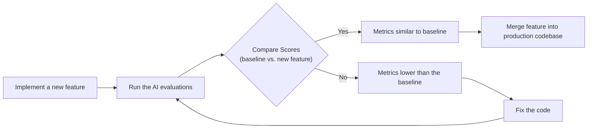

# The North Star of AI Engineering: A Guide to Evaluation-Driven Development

In our previous lessons, we instrumented our AI agents with observability tools like Opik and learned how to construct offline datasets for evaluation. We now have the raw materials: the traces and the test cases. But this is where most teams get stuck. They have the data but no clear way to measure what "good" looks like.

This brings us to the core theoretical framework of designing the metrics themselves. In classical machine learning, evaluation is a solved problem. We have rigorous, universally accepted standards like accuracy, precision, recall, and F1-score. We anchor our findings in statistical significance. But in AI engineering, a different, more troubling standard has emerged: the "vibe check." Too often, we hear, "This output *feels* more coherent," or, "Let's ship it, it seems better" [[40]](https://olshansky.substack.com/p/vibe-checks-are-all-you-need), [[42]](https://www.growthbook.io/blog/ai-evals-vs-a-b-testing-why-you-need-both-to-ship-genai). This reliance on intuition is a trap that leads to silent regressions, wasted effort, and slow, unpredictable progress [[44]](https://towardsdatascience.com/stop-evaluating-llms-with-vibe-checks).

Investing in a proper evaluation layer is hard to prioritize. It delivers no immediate user-visible feature, requires upfront effort to design datasets and metrics, and competes with the relentless pressure to ship. Yet, this investment is what separates prototypes from production-grade AI. A robust evaluation framework substantially improves long-term iteration by providing an objective signal on every change and catching regressions instantly.

Evals are the north star of AI engineering. They are the single source of truth that tells you exactly which modifications improve your system and which degrade it. In this lesson, we will establish the theoretical foundation for Evaluation-Driven Development (EDD), a systematic approach that replaces intuition with evidence. We will explore:

*   The optimization flywheel and its three core use cases.
*   The trade-offs between different metric types for unstructured outputs.
*   Why custom business metrics are superior to public benchmarks and generic scores.
*   Why binary pass/fail judgments are more reliable than subjective scales.

With the problem and its importance clear, we will now examine how to operationalize evals inside a repeatable optimization flywheel.

## Using Evals Through the Optimization Flywheel

To build intuition, let's examine how we can effectively use and integrate AI evaluations into our application development lifecycle. There are three core scenarios where evaluations provide value.

First, evals **quantify the quality of your system**. They take a snapshot of your system's current performance against a set of business-aligned metrics, establishing a baseline. This baseline is your first step out of the "vibe check" trap; it provides a concrete, objective starting point. Without it, you cannot know if your system is ready for production or if your changes are actually improvements [[21]](https://www.decodingai.com/p/escaping-poc-purgatory-evaluation).

Second, these metrics serve as **guidance when optimizing your system**. They provide objective evidence to support or reject hypotheses about what will improve performance. This shifts development from being intuition-based to evidence-based [[2]](https://galileo.ai/blog/nvidia-data-flywheel-for-de-risking-agentic-ai). You are no longer guessing; you are measuring. This systematic process creates a virtuous cycle of continuous improvement, often called a data flywheel, where each iteration refines the system based on real-world patterns and feedback [[3]](https://www.nvidia.com/en-us/glossary/data-flywheel).

Finally, evals act as **regression tests** that protect shared components. Unlike optimization, the goal here is stability. In complex AI systems, components like prompts, tool definitions, and retrieval logic are often interconnected. A small change intended to fix one bug can silently break five other things. Evals guard against this by ensuring that improvements in one area do not cause unintended degradation elsewhere.

### The Optimization Process

How does this look in a real-world scenario? The optimization flywheel is an eight-step, iterative process for systematically improving your AI application.

1.  **Gather your dataset:** You start with a representative offline dataset that covers your key use cases and known failure modes. This is your "golden dataset," the ground truth against which all changes are measured.
2.  **Build your metrics:** You define a suite of business-aligned metrics that accurately measure the quality of your system's outputs. As we will see, these should be custom, binary, and granular.
3.  **Establish a baseline:** You run your evaluations on the current version of your system to compute a set of baseline scores. This number is your stake in the ground, the objective measure of your system's current quality.
4.  **Start the optimization:** You make one, and only one, isolated change that you believe will improve performance. This could be a tweak to a prompt, a different model, or a new retrieval strategy.
5.  **Compute the new score:** You re-evaluate the entire dataset by running the full suite of evals on the modified system. This ensures you are measuring the global impact of your change, not just its effect on a few cherry-picked examples.
6.  **Compare:** You compare the new scores to the baseline, checking for statistical significance. This step is about determining if the observed change is real progress or just random noise.
7.  **Decide:** Based on whether the scores are better, the same, or worse, you decide to keep the change, revert it, or analyze it further if it improves one metric but degrades another. This decision is always tied back to business impact.
8.  **Repeat:** You repeat this cycle, continuously iterating until the scores meet your product requirements. This creates a tight feedback loop that drives consistent, measurable improvement.

Image 1: The iterative optimization flywheel for AI applications using evaluations.

It is critical to change only one variable per cycle [[27]](http://www.jmlr.org/papers/volume7/MLOPT-intro06a/MLOPT-intro06a.pdf). If you change the prompt, the model, and the chunking strategy all at once, it becomes impossible to attribute any score changes to a specific modification. This turns a disciplined engineering process back into guesswork. This disciplined, one-variable-at-a-time approach is a practical application of causal inference. The goal is to move beyond mere correlation and identify which specific changes *cause* an improvement in performance, much like a randomized controlled trial (RCT) in scientific research [[55]](https://www.statsig.com/perspectives/causal-inference-in-product-experimentation). A standard predictive model might tell you what is *likely* to happen, but a causal framework helps you identify which interventions actually change the outcome for the better [[56]](https://telnyx.com/learn-ai/casual-inference-explained).

Furthermore, you must anchor statistical significance to actual **business impact**. A statistically significant result is not always practically significant [[46]](https://www.nngroup.com/articles/practical-significance), [[48]](https://www.quirks.com/articles/effective-uses-of-effect-size-statistics-to-demonstrate-business-value). This is where principles from decision theory become essential. Instead of relying on an arbitrary p-value, you should define a **decision threshold** based on the real-world costs of failure versus the benefits of success [[57]](https://sarahgebauermd.substack.com/p/three-metrics-for-healthcare-ai-evaluation).

For a high-volume customer support bot handling millions of interactions, the decision threshold for errors is extremely low. A 0.5% reduction in checkout failures might translate to thousands of fewer support tickets, yielding a massive net benefit for the company [[46]](https://www.nngroup.com/articles/practical-significance), [[45]](https://corporatefinanceinstitute.com/resources/data-science/statistical-significance). In contrast, for a low-volume creative writing tool, a tiny improvement in a "coherence" score is likely negligible until it crosses a much higher threshold of noticeable improvement for the user [[49]](https://www.cloudresearch.com/resources/guides/statistical-significance/what-is-statistical-significance), [[47]](https://www.statsig.com/perspectives/understanding-statistical-significance). The business context dictates the threshold for declaring victory.

### Regression Testing

The optimization flywheel can be adapted for regression testing, a powerful technique to ensure new features do not break existing functionality. This is especially critical in Continuous Integration/Continuous Deployment (CI/CD) pipelines.

The process involves five steps:

1.  **Implement a new feature:** You write the code for the new functionality and verify it works locally for the intended use case.
2.  **Run the AI evaluations:** Before merging, you run the full suite of evaluations covering all existing use cases, not just the new one.
3.  **Compare Scores:** You compare the scores from the feature branch against the baseline scores from your main production branch.
4.  **Metrics similar to baseline:** If the scores are statistically identical to the baseline, it means your change has not introduced a regression. The feature can be safely merged into the production codebase.
5.  **Metrics lower than the baseline:** If the scores are worse, you have introduced a regression. You must fix the issue and re-run the evaluation loop until the scores return to the baseline.

Image 2: Integrating AI evaluations into CI pipelines for regression testing.

This process effectively turns your evaluation suite into a set of automated **quality gates**, a concept borrowed from manufacturing and traditional software development. These gates act as automated pass/fail checkpoints that prevent regressions from being merged, ensuring quality standards are consistently enforced [[58]](https://www.softwareseni.com/building-quality-gates-for-ai-generated-code-with-practical-implementation-strategies). This treats your AI evaluations like integration tests. However, instead of asserting a strict pass or fail, you compare performance against a moving baseline. The goal is to prevent degradation, ensuring that the system's quality never silently decays.

Your evaluation dataset cannot be static. It must be a living artifact that continuously expands. Each time a new feature is added, you must add new test cases covering its edge cases. When your observability and tracing tools, like Opik, surface a failure in production, that trace should be converted into a new evaluation sample [[28]](https://www.comet.com/docs/opik/evaluation/advanced/manage_datasets). When you debug a particularly tricky issue, the input that triggered it should become a permanent part of your dataset. Instead of writing new tests in code, you broaden your test coverage by adding new data [[29]](https://www.decodingai.com/p/generate-synthetic-datasets-for-ai-evals).

With the mechanics of the flywheel clear, we can now examine the different families of metrics we might plug into it when dealing with unstructured text and image outputs.

## Exploring Possible Metric Types

The core difficulty in evaluating modern AI systems is that their outputs—unstructured text, reasoning traces, images—lack the simple, structured labels of classical ML. We cannot just calculate accuracy. Instead, we must rely on different families of metrics, each with its own trade-offs.

### 1. BLEU and ROUGE

Metrics like BLEU (Bilingual Evaluation Understudy) and ROUGE (Recall-Oriented Understudy for Gisting Evaluation) measure the lexical overlap between a generated text and a reference text. They work by counting matching n-grams (sequences of words) [[22]](https://plainenglish.io/blog/evaluating-nlp-models-a-comprehensive-guide-to-rouge-bleu-meteor-and-bertscore-metrics-d0f1b1), [[23]](https://datumo.com/en/blog/insight/key-nlp-evaluation-metrics/).

Their main advantages are that they are fast to compute, widely understood, and deterministic [[31]](https://www.traceloop.com/blog/demystifying-the-bleu-metric), [[32]](https://docs.galileo.ai/concepts/metrics/expression-and-readability/bleu-and-rouge). However, their limitations are severe. They are blind to semantic meaning, penalizing valid paraphrases or correct reasoning that simply uses different words. For example, if a reference is "The test was successful" and the model outputs "The experiment succeeded," the BLEU score would be near zero despite the identical meaning. They also do not check for factual accuracy [[30]](https://wandb.ai/ai-team-articles/llm-evaluation/reports/LLM-evaluation-benchmarking-Beyond-BLEU-and-ROUGE--VmlldzoxNTIzMTY0NQ), [[33]](https://medium.com/@sthanikamsanthosh1994/understanding-bleu-and-rouge-score-for-nlp-evaluation-1ab334ecadcb), [[34]](https://www.elastic.co/search-labs/blog/evaluating-rag-metrics).

### 2. BERTScore

Embedding similarity metrics, such as BERTScore, address the semantic blindness of n-gram overlap. They use a language model like BERT to convert the generated text and the reference text into high-dimensional vectors (embeddings). The similarity between these contextual embeddings, often measured by cosine similarity, serves as the quality score [[24]](https://spotintelligence.com/2024/08/20/bertscore/).

This approach is better at capturing semantic meaning and recognizing paraphrases. However, it is still a comparison metric. It cannot verify complex business logic and is computationally more expensive and slower than lexical methods. It also introduces a dependency on the embedding model itself, which can be opaque.

### 3. LLM Judges

The LLM-as-a-judge approach uses a capable LLM to evaluate the output of another model. You provide the judge model with the input, the generated output, a detailed evaluation prompt with clear criteria, few-shot examples, and sometimes chain-of-thought instructions to improve reasoning [[35]](https://www.confident-ai.com/blog/why-llm-as-a-judge-is-the-best-llm-evaluation-method), [[38]](https://www.braintrust.dev/articles/what-is-llm-as-a-judge), [[39]](https://arize.com/llm-as-a-judge).

The primary advantage of this method is its flexibility. It can evaluate subjective qualities like tone, style, and creativity, and it can be customized to check for adherence to complex, domain-specific business rules [[50]](https://www.evidentlyai.com/llm-guide/llm-as-a-judge), [[54]](https://www.confident-ai.com/blog/why-llm-as-a-judge-is-the-best-llm-evaluation-method). The judge can also provide detailed, human-like critiques explaining its reasoning [[36]](https://medium.com/data-science-collective/llm-as-a-judge-when-to-use-reasoning-cot-and-explanations-964ad82ebc3d), [[37]](https://arize.com/blog/evidence-based-prompting-strategies-for-llm-as-a-judge-explanations-and-chain-of-thought).

However, LLM judges are not a silver bullet. Their performance is highly dependent on the quality of the prompt and the capability of the judge model. They are slower and more expensive than other automated metrics. They can also inherit biases from the LLM, such as a preference for longer responses (verbosity bias) or a tendency to favor outputs from the same model family (self-enhancement bias) [[53]](https://cameronrwolfe.substack.com/p/llm-as-a-judge), [[52]](https://www.linkedin.com/posts/allaabdella_llm-aijudge-genai-activity-7353053642590932994-s3sw), [[51]](https://galileo.ai/blog/llm-as-a-judge-vs-human-evaluation).

| Metric Family | Speed | Cost | Semantic Awareness | Business Alignment | Explainability |
| :--- | :--- | :--- | :--- | :--- | :--- |
| **BLEU/ROUGE** | Very Fast | Very Low | None | Very Low | Low |
| **BERTScore** | Moderate | Low | High | Low | Moderate |
| **LLM Judges** | Slow | High | Very High | Very High | High |

Table 1: A comparison of trade-offs between different evaluation metric families.

For the complex requirements of our capstone writing agent—adherence to guidelines, structural fidelity, and grounding in research—LLM judges are the most practical choice.

Now, you have probably heard from us: *"business metrics here, business metrics there"*. Thus, let's understand why defining your own business metrics is such an essential and underrated step in building your AI evals strategy.

## Why Business Metrics Over Benchmarks

It is a common mistake to look at popular leaderboards or open benchmarks to choose an LLM for a product. Benchmarks are the most deceiving type of metric, and relying on them for product decisions is often a mistake.

There are two core reasons for this.

First, public benchmarks often function as marketing artifacts. Once a test set is public, it is inevitable that models will be trained or fine-tuned on that data, whether intentionally or not [[11]](https://www.evidentlyai.com/llm-guide/llm-benchmarks), [[13]](https://launchdarkly.com/blog/llm-evaluation). This leads to inflated scores that no longer reflect a model's ability to generalize to unseen data. This phenomenon, known as benchmark overfitting, undermines the validity of the evaluation. There have been several instances of models achieving too-good-to-be-true scores, only for it to be revealed that they had "seen the test" [[15]](https://world.hey.com/bhari/ai-benchmark-scores-are-becoming-marketing-dynamic-eval-is-the-only-antidote-dedd7053), [[25]](https://openreview.net/forum?id=XbVMiW0jTM).

Second, there is a fundamental mismatch between the tasks in most benchmarks and the demands of real business workloads [[12]](https://magazine.sebastianraschka.com/p/llm-evaluation-4-approaches), [[14]](https://arxiv.org/html/2601.20617v1). A model that excels at solving math problems (like in GSM8k) or answering multiple-choice questions (like in MMLU) may completely fail at the nuanced tasks your product requires, such as generating long-form creative content, performing detailed legal analysis, or providing empathetic customer support.

Benchmarks have a narrow but proper role: advancing research, providing a quick sanity check, or helping with initial model filtering during early exploration. They should never be the primary optimization target or the basis for a product-level decision.

If benchmarks are misleading, generic prefab metrics that claim to measure universal qualities are even more dangerous. We must instead build metrics that are deeply tied to our specific application.

## Why Custom Business Metrics Over Generic Metrics

Generic, off-the-shelf metrics like "toxicity," "helpfulness," or RAGAS-style "faithfulness" are a mirage. They create a false sense of confidence by optimizing for the wrong signal. Because they lack context about your product, your users, and your brand, they can be dangerously misleading [[16]](https://www.linkedin.com/posts/shivanshu-aggarwal_evals-aievals-llm-activity-7375884554177449985-16kP), [[19]](https://galileo.ai/blog/human-evaluation-metrics-ai).

The core issue is that these generic metrics are often "improper," a term from decision theory meaning they can be gamed. An improper metric can give a better score to a model that actually makes worse decisions from a business perspective [[57]](https://sarahgebauermd.substack.com/p/three-metrics-for-healthcare-ai-evaluation). This happens because they do not account for the unique **misclassification costs** of your specific application.

For example, the popular F1 score is often used for imbalanced datasets, but it is notoriously improper for most clinical AI evaluations because it ignores true negatives. In a medical context, correctly identifying that a patient *doesn't* need surgery is a critical outcome, not an irrelevant detail. A generic metric cannot know whether a false positive (unnecessary intervention) is 10 times or 1000 times worse than a false negative (missed opportunity) for your users [[57]](https://sarahgebauermd.substack.com/p/three-metrics-for-healthcare-ai-evaluation). Without this context, optimization becomes a shot in the dark.

An AI system can score brilliantly on a generic "helpfulness" metric and still be a catastrophic failure for your specific use case. Imagine a real estate assistant that suggests a showing time when the agent is unavailable. A generic metric might rate the response as "helpful" because it provided an option, completely missing the functional failure.

Consider the dashboard below. It looks impressive, with scores for "Truthfulness" and "Personalization." But what does a 3.7 in "Personalization" actually mean? What should the team do to improve it? These scores are often vanity metrics that create the illusion of progress while masking real failures [[20]](https://toloka.ai/blog/llm-evaluation-from-classic-metrics-to-modern-methods), [[18]](https://arxiv.org/html/2508.13816v1).

https://images.spr.so/cdn-cgi/imagedelivery/j42No7y-dcokJuNgXeA0ig/585bb9f6-0bf3-427f-a9d3-994dd5849a1a/322c2e07-ee9a-4139-b51d-8f0c4787d880_1600x822/w=1920,quality=90,fit=scale-down
Image 3: A dashboard showing generic metrics like Helpfulness and Truthfulness, labeled "Don't Do This!"

Let's take our Brown writing agent as an example. Suppose we want to check if a generated article contains hallucinations. A generic `hallucination` score might return "positive." But what does that tell us? Did the agent invent a fact that contradicts the source research? Did it deviate from the article guidelines? Or did it simply include a relevant personal story that, while not in the source text, is factually correct and aligns with our desired brand voice? The generic metric cannot distinguish between undesirable invention and desirable creative elaboration. It lacks the domain-specific context to make a meaningful judgment.

The valid role for generic metrics is narrow: they can serve as a "flashlight" during exploratory data analysis, but never as a "report card" for your system's quality. You can use them to surface interesting examples for manual review. Here are a few ways to do this effectively:

1.  **Verbosity:** Sort your outputs by length. This can quickly reveal if your most verbose answers are rambling and unhelpful, or if your most concise answers are curt and missing key information. This is a simple way to find potential failure modes in long-form generation.
2.  **Similarity Score:** In a RAG system, you can use a similarity score to evaluate the retriever component specifically. A low similarity between the user's query and the retrieved document chunks is a strong signal that your retriever is failing to find relevant information. This is a valid and useful component-level check.
3.  **BERTScore:** You can use BERTScore to challenge the quality of your own "golden" reference answers. If a cluster of generated outputs receives a low score against a reference you expected them to match, a manual review might reveal that the LLM found a more creative or even a better solution than your reference.

In all these cases, the generic metric is not the final verdict. It is the starting point of an investigation that requires human judgment. Every production metric must be deeply application-centric, derived from your product's specific requirements, user success criteria, and explicit constraints.

Once we have rejected both benchmarks and generic metrics, the remaining design choice is how to elicit judgments from our LLM judge. Here, binary pass/fail criteria outperform every alternative.

## Choosing Binary Metrics Over Anything Else

When designing these custom metrics, you will face a choice: should you use a Likert scale (e.g., 1-5 stars) or a binary pass/fail?

We strongly recommend **binary metrics**.

Likert scales are a seductive trap. They promise nuance but deliver noise. They suffer from several fundamental problems:

1.  **Inconsistent Labeling:** The difference between a '3' and a '4' is entirely subjective. One person's '4' is another's '3', leading to low inter-annotator agreement and endless debates over the rubric [[4]](https://www.decodingai.com/p/the-5-star-lie-you-are-doing-ai-evals), [[5]](https://www.ellamind.com/blog/binary-vs-likert-scales).
2.  **Statistical Noise:** Detecting a meaningful improvement from an average score of 3.2 to 3.4 requires a much larger sample size than detecting a shift in a binary pass rate from 75% to 80%. From an information theory perspective, this subjectivity introduces entropy—randomness that increases uncertainty without adding useful information about quality [[59]](https://arxiv.org/html/2602.07168). You end up chasing statistical ghosts [[5]](https://www.ellamind.com/blog/binary-vs-likert-scales).
3.  **Lazy Decision-Making:** Both human evaluators and LLM judges often default to the middle value ('3') to avoid a difficult judgment. This behavior, known as "satisficing," flattens your signal and hides the very uncertainty you need to resolve [[4]](https://www.decodingai.com/p/the-5-star-lie-you-are-doing-ai-evals), [[6]](https://www.scribbr.com/methodology/likert-scale), [[7]](https://inmoment.com/blog/likert-scale).

Binary evaluations work because they **force decisions**, similar to quality control processes in manufacturing that classify products simply as 'good' or 'defective' based on concrete specifications [[60]](https://www.qualitymag.com/articles/98430-beyond-dmaic-leveraging-ai-and-quality-40-for-manufacturing-innovation-in-the-fourth-industrial-revolution). They solve these problems by demanding clarity. The benefits are immediate:

1.  **Clearer Thinking:** You cannot label an output as "Fail" without a precise definition of what failure means for that specific criterion. This forces you to sharpen your definitions of quality.
2.  **Consistency:** Binary decisions are faster and more consistent for both human annotators and LLM judges, leading to more reliable data [[9]](https://www.ellamind.com/blog/binary-vs-likert-scales).
3.  **Actionability:** A spike in the "Hallucinated Tool Invocation" failure rate is a direct, actionable signal for your engineering team. A dip in the "Helpfulness" score from 3.7 to 3.6 is not.

<aside>
💡

**Note:** The three points above translate exceptionally well to LLM Judges. Using binary scoring is a key design choice to mitigate the inherent randomness of LLMs. LLMs are much more stable when asked to make a binary decision than when asked to assign a scalar value. A binary metric translates to a more robust and repeatable evaluation pipeline.

</aside>

### Capturing Nuance

The most common objection to binary evaluations is the perceived loss of nuance. "What if a response is partially correct? A 'Fail' seems too harsh."

This is a valid concern, but a Likert scale is the wrong solution. You capture nuance not by making your scale fuzzier, but by making your criteria more **granular**. Instead of a single, subjective rating for a complex quality, you break it down into multiple, specific, binary checks [[9]](https://www.ellamind.com/blog/binary-vs-likert-scales), [[10]](https://medium.com/@adnanmasood/rubric-based-evals-llm-as-a-judge-methodologies-and-empirical-validation-in-domain-context-71936b989e80).

For our writing agent, instead of rating an article 1-5 for "Quality," we create multiple binary evaluations that capture specific dimensions of quality:

1.  **Content Adherence:** Does the generated article contain the same core concepts as the expected article? (Yes/No)
2.  **Flow of Ideas Adherence:** Does the generated article contain the ideas in the same order as the expected article? (Yes/No)
3.  **Article Guideline Adherence:** Does the generated article follow the flow of ideas from the article guideline input? (Yes/No)
4.  **Research Anchoring:** Is every claim in the article supported by the provided research? (Yes/No)

By aggregating these binary signals, you get a far more precise and actionable view of performance. You can now say, "Our system passes Content Adherence 95% of the time, but fails Research Anchoring 40% of the time." That is a signal you can act on. You have captured nuance without sacrificing clarity.

With the full theoretical picture in place, we can now summarize the mindset shift required and preview the hands-on implementation that follows in the next lesson.

## Conclusion

The path to building reliable AI products requires a fundamental shift in mindset: away from vibe checks, public leaderboards, and generic scores, and toward a rigorous, disciplined practice of evaluation-driven development. This means building custom, binary, business-aligned metrics that give you a clear and actionable signal on your system's performance.

Granular pass/fail criteria, derived from a deep analysis of your application's specific failure modes, provide the clearest optimization signal. They eliminate the statistical noise and subjectivity inherent in scalar ratings, allowing you to iterate with confidence. In our next lesson, we will translate this theory into practice by implementing custom LLM judges from scratch to evaluate our Brown writing workflow.

## References

- [1] Iusztin, P. (2025, October 30). Stop Launching AI Apps Without This Framework. *Decoding AI*. https://www.decodingai.com/p/stop-launching-ai-apps-without-this
- [2] A Powerful Data Flywheel for De-Risking Agentic AI. (n.d.). *Galileo*. https://galileo.ai/blog/nvidia-data-flywheel-for-de-risking-agentic-ai
- [3] Data Flywheel. (n.d.). *NVIDIA*. https://www.nvidia.com/en-us/glossary/data-flywheel
- [4] Iusztin, P. (2025, November 11). The 5-Star Lie: You’re Doing AI Evaluations Wrong. *Decoding AI*. https://www.decodingai.com/p/the-5-star-lie-you-are-doing-ai-evals
- [5] Binary vs. Likert Scales in LLM Evals. (n.d.). *Ellamind*. https://www.ellamind.com/blog/binary-vs-likert-scales
- [6] What Is a Likert Scale? | Guide & Examples. (n.d.). *Scribbr*. https://www.scribbr.com/methodology/likert-scale
- [7] What is a Likert Scale and How Can You Use It? (n.d.). *InMoment*. https://inmoment.com/blog/likert-scale
- [8] Iusztin, P. (2025, November 4). The Mirage of Generic AI Metrics. *Decoding AI*. https://www.decodingai.com/p/the-mirage-of-generic-ai-metrics
- [9] Granular Evals with Binary Criteria. (n.d.). *Ellamind*. https://www.ellamind.com/blog/binary-vs-likert-scales
- [10] Masood, A. (2025, October 29). Rubric-Based Evals & LLM-as-a-Judge. *Medium*. https://medium.com/@adnanmasood/rubric-based-evals-llm-as-a-judge-methodologies-and-empirical-validation-in-domain-context-71936b989e80
- [11] LLM benchmarks: 30+ benchmarks and how they work. (n.d.). *Evidently AI*. https://www.evidentlyai.com/llm-guide/llm-benchmarks
- [12] Raschka, S. (2025, October 28). 4 Approaches to Evaluating LLMs. *Ahead of AI*. https://magazine.sebastianraschka.com/p/llm-evaluation-4-approaches
- [13] LLM Evaluation: A Practical Guide. (n.d.). *LaunchDarkly*. https://launchdarkly.com/blog/llm-evaluation
- [14] Benchmarks for AI Agents. (2026, January 20). *arXiv*. https://arxiv.org/html/2601.20617v1
- [15] Hari, B. (2026, April 26). AI Benchmark Scores Are Becoming Marketing. *HEY World*. https://world.hey.com/bhari/ai-benchmark-scores-are-becoming-marketing-dynamic-eval-is-the-only-antidote-dedd7053
- [16] Aggarwal, S. (2026, October 27). Generic Metrics in AI Evaluation. *LinkedIn*. https://www.linkedin.com/posts/shivanshu-aggarwal_evals-aievals-llm-activity-7375884554177449985-16kP
- [17] Husain, H. (2025, October 27). Using LLM-as-a-Judge For Evaluation: A Complete Guide. *Hamel's Blog*. https://hamel.dev/blog/posts/llm-judge/
- [18] Meta-Evaluation of Metrics for Question Generation. (2025, August 29). *arXiv*. https://arxiv.org/html/2508.13816v1
- [19] Human Evaluation Metrics in AI. (n.d.). *Galileo*. https://galileo.ai/blog/human-evaluation-metrics-ai
- [20] LLM Evaluation: From Classic Metrics to Modern Methods. (n.d.). *Toloka.ai*. https://toloka.ai/blog/llm-evaluation-from-classic-metrics-to-modern-methods
- [21] Bowne-Anderson, H., & Krawczyk, S. (2025, October 16). Escaping POC Purgatory: Evaluation-Driven Development for AI Systems. *Decoding AI*. https://www.decodingai.com/p/escaping-poc-purgatory-evaluation
- [22] Evaluating NLP Models: A Comprehensive Guide to ROUGE, BLEU, METEOR, and BERTScore Metrics. (2023, September 20). *PlainEnglish.io*. https://plainenglish.io/blog/evaluating-nlp-models-a-comprehensive-guide-to-rouge-bleu-meteor-and-bertscore-metrics-d0f1b1
- [23] Key NLP Evaluation Metrics. (n.d.). *Datumo*. https://datumo.com/en/blog/insight/key-nlp-evaluation-metrics/
- [24] BERTScore explained: a modern metric for evaluating text generation. (2024, August 20). *Spot Intelligence*. https://spotintelligence.com/2024/08/20/bertscore/
- [25] Probe: Benchmarking Reasoning Paradigm Overfitting in Large Language Models. (n.d.). *OpenReview*. https://openreview.net/forum?id=XbVMiW0jTM
- [26] Yan, E. (n.d.). Evaluating the Effectiveness of LLM-Evaluators (aka LLM-as-a-Judge). *Eugene Yan*. https://eugeneyan.com/writing/llm-evaluators/
- [27] Sequential Minimal Optimization for SVM. (2006). *JMLR*. http://www.jmlr.org/papers/volume7/MLOPT-intro06a/MLOPT-intro06a.pdf
- [28] Manage evaluation datasets. (n.d.). *Comet*. https://www.comet.com/docs/opik/evaluation/advanced/manage_datasets
- [29] Iusztin, P. (2025, September 23). Generate Synthetic Datasets for AI Evals. *Decoding AI*. https://www.decodingai.com/p/generate-synthetic-datasets-for-ai-evals
- [30] LLM evaluation benchmarking: Beyond BLEU and ROUGE. (2025, December 9). *Weights & Biases*. https://wandb.ai/ai-team-articles/llm-evaluation/reports/LLM-evaluation-benchmarking-Beyond-BLEU-and-ROUGE--VmlldzoxNTIzMTY0NQ
- [31] Demystifying the BLEU Metric. (n.d.). *Traceloop*. https://www.traceloop.com/blog/demystifying-the-bleu-metric
- [32] BLEU and ROUGE. (n.d.). *Galileo*. https://docs.galileo.ai/concepts/metrics/expression-and-readability/bleu-and-rouge
- [33] Understanding BLEU and ROUGE score for NLP evaluation. (2023, April 2). *Medium*. https://medium.com/@sthanikamsanthosh1994/understanding-bleu-and-rouge-score-for-nlp-evaluation-1ab334ecadcb
- [34] Evaluating RAG: A practical guide to metrics. (n.d.). *Elastic*. https://www.elastic.co/search-labs/blog/evaluating-rag-metrics
- [35] Why LLM-as-a-Judge is the Best LLM Evaluation Method. (n.d.). *Confident AI*. https://www.confident-ai.com/blog/why-llm-as-a-judge-is-the-best-llm-evaluation-method
- [36] LLM-as-a-Judge: When to Use Reasoning (CoT) and Explanations. (2025, October 29). *Medium*. https://medium.com/data-science-collective/llm-as-a-judge-when-to-use-reasoning-cot-and-explanations-964ad82ebc3d
- [37] Evidence-Based Prompting Strategies for LLM-as-a-Judge. (n.d.). *Arize*. https://arize.com/blog/evidence-based-prompting-strategies-for-llm-as-a-judge-explanations-and-chain-of-thought
- [38] What is LLM-as-a-Judge? (n.d.). *Braintrust*. https://www.braintrust.dev/articles/what-is-llm-as-a-judge
- [39] LLM-as-a-Judge. (n.d.). *Arize*. https://arize.com/llm-as-a-judge
- [40] Vibe Checks are All You Need. (2025, October 27). *Substack*. https://olshansky.substack.com/p/vibe-checks-are-all-you-need
- [41] VibeCheck: A Self-Verification Framework for Large Language Models. (2024, October 21). *arXiv*. https://arxiv.org/html/2410.12851v1
- [42] AI Evals vs. A/B Testing: Why You Need Both to Ship GenAI. (n.d.). *GrowthBook*. https://www.growthbook.io/blog/ai-evals-vs-a-b-testing-why-you-need-both-to-ship-genai
- [43] From Vibe Checks to Continuous Evaluation. (n.d.). *Google Cloud Blog*. https://cloud.google.com/blog/topics/developers-practitioners/from-vibe-checks-to-continuous-evaluation-engineering-reliable-ai-agents
- [44] Stop Evaluating LLMs with Vibe Checks. (2025, October 28). *Towards Data Science*. https://towardsdatascience.com/stop-evaluating-llms-with-vibe-checks
- [45] Statistical Significance. (n.d.). *Corporate Finance Institute*. https://corporatefinanceinstitute.com/resources/data-science/statistical-significance
- [46] Practical Significance: What It Is and How It Differs from Statistical Significance. (n.d.). *Nielsen Norman Group*. https://www.nngroup.com/articles/practical-significance
- [47] Understanding Statistical Significance. (n.d.). *Statsig*. https://www.statsig.com/perspectives/understanding-statistical-significance
- [48] Effective uses of effect size statistics to demonstrate business value. (n.d.). *Quirks*. https://www.quirks.com/articles/effective-uses-of-effect-size-statistics-to-demonstrate-business-value
- [49] What Is Statistical Significance? (n.d.). *CloudResearch*. https://www.cloudresearch.com/resources/guides/statistical-significance/what-is-statistical-significance
- [50] LLM-as-a-judge: a complete guide to using LLMs for evaluations. (2026, May 19). *Evidently AI*. https://www.evidentlyai.com/llm-guide/llm-as-a-judge
- [51] LLM as a Judge vs. Human Evaluation. (n.d.). *Galileo*. https://galileo.ai/blog/llm-as-a-judge-vs-human-evaluation
- [52] Abdella, A. (2026, September 15). LLM as a Judge. *LinkedIn*. https://www.linkedin.com/posts/allaabdella_llm-aijudge-genai-activity-7353053642590932994-s3sw
- [53] Wolfe, C. R. (n.d.). LLM as a Judge. *Substack*. https://cameronrwolfe.substack.com/p/llm-as-a-judge
- [54] Why LLM-as-a-Judge is the Best LLM Evaluation Method. (n.d.). *Confident AI*. https://www.confident-ai.com/blog/why-llm-as-a-judge-is-the-best-llm-evaluation-method
- [55] Causal inference in product experimentation. (2024, November 15). *Statsig*. https://www.statsig.com/perspectives/causal-inference-in-product-experimentation
- [56] Causal Inference Explained. (n.d.). *Telnyx*. https://telnyx.com/learn-ai/casual-inference-explained
- [57] Three Metrics for Healthcare AI Evaluation You Need to Know. (n.d.). *Substack*. https://sarahgebauermd.substack.com/p/three-metrics-for-healthcare-ai-evaluation
- [58] Building Quality Gates for AI-Generated Code. (n.d.). *SoftwareSeni*. https://www.softwareseni.com/building-quality-gates-for-ai-generated-code-with-practical-implementation-strategies
- [59] Information-Theoretic Evaluation of Post-Processing in X-ray Tomography. (2026, February 11). *arXiv*. https://arxiv.org/html/2602.07168
- [60] Beyond DMAIC: Leveraging AI and Quality 4.0 for Manufacturing Innovation. (2024, October 1). *Quality Magazine*. https://www.qualitymag.com/articles/98430-beyond-dmaic-leveraging-ai-and-quality-40-for-manufacturing-innovation-in-the-fourth-industrial-revolution