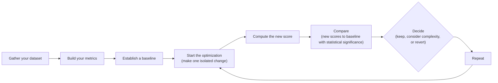

**Source Registry:**
- **Source [55]** `https://en.wikipedia.org/wiki/Control_theory`: qualifies for → **"Using Evals Through the Optimization Flywheel"** *(adds: breadth by providing a theoretical foundation from control theory for single-variable isolation.)*
- **Source [56]** `https://www.linkedin.com/posts/pauliusztin_i-created-an-ai-agent-to-write-a-substack-activity-7420095430807691266-fQ1U`: qualifies for → **"Choosing Binary Metrics Over Anything Else"** *(adds: depth by introducing limitations and edge cases for binary metrics in creative tasks.)*
- **Source [57]** `https://www.mdpi.com/2076-3417/15/6/2971`: qualifies for → **"Choosing Binary Metrics Over Anything Else"** *(adds: depth by reinforcing the limitations of binary metrics, specifically regarding narrative coherence.)*
- **Source [58]** `https://arize.com/blog/how-to-build-llm-as-a-judge-evaluators-that-hold-up-in-production`: qualifies for → **"Choosing Binary Metrics Over Anything Else"** *(adds: depth by providing a practical, production-oriented calibration process for LLM judges.)*
- **Source [59]** `https://arxiv.org/html/2601.05420v1`: DISMISSED — Too academic and mathematically dense for the article's practical engineering focus.
- **Source [60]** `https://engineering.atspotify.com/2026/5/better-experiments-with-llm-evals-a-funnel-not-a-fork`: qualifies for → **"Why Business Metrics Over Benchmarks"** *(adds: breadth by connecting offline evals to the ultimate goal of online business outcomes, framing evals as proxies.)*
- **Source [61]** `https://www.reddit.com/r/LLMDevs/comments/1j3gbil/5_techniques_to_improve_llmjudges`: qualifies for → **"Exploring Possible Metric Types"** *(adds: depth with specific, practical techniques to improve LLM judge performance.)*
- **Source [62]** `https://cameronrwolfe.substack.com/p/finetuned-judge`: qualifies for → **"Choosing Binary Metrics Over Anything Else"** *(adds: depth by connecting binary judgments to standard classification metrics, strengthening the argument for their use.)*
- **Source [64]** `https://medium.com/@nimrodbusany_9074/from-tdd-to-edd-why-evaluation-driven-development-is-the-future-of-ai-engineering-a5e5796b2af4`: qualifies for → **"The North Star of AI Engineering: A Framework for Evaluation-Driven Development"** *(adds: breadth by drawing a powerful analogy to Test-Driven Development (TDD).)*
- **Source [70]** `https://learn.microsoft.com/en-us/agents/architecture/evaluation-frameworks`: qualifies for → **"Conclusion"** *(adds: breadth by showing how the EDD principles discussed are being integrated into modern agent frameworks.)*
- **Source [71]** `https://devblogs.microsoft.com/foundry/build-2026-open-trust-stack-ai-agents`: qualifies for → **"Conclusion"** *(adds: breadth by providing a specific example (Microsoft Foundry) of a framework with built-in evaluation.)*
- **Source [72]** `https://aws.amazon.com/blogs/machine-learning/evaluating-ai-agents-real-world-lessons-from-building-agentic-systems-at-amazon`: qualifies for → **"Conclusion"** *(adds: breadth with another example (AWS) of the trend towards framework-agnostic, continuous evaluation.)*
- **Source [73]** `https://www.linkedin.com/posts/rakeshgohel01_evaluation-is-what-separates-great-ai-agents-activity-7362464250545504256-IEKO`: qualifies for → **"Conclusion"** *(adds: breadth by listing multiple popular agent evaluation frameworks, underscoring the trend.)*
- **Source [74]** `https://medium.com/online-inference/ai-agent-evaluation-frameworks-strategies-and-best-practices-9dc3cfdf9890`: qualifies for → **"Conclusion"** *(adds: breadth by discussing the evolution of evaluation strategies as agents increase in complexity.)*
- **Source [75]** `https://medium.com/@yujiisobe/navigating-the-maze-of-llm-evaluation-a-guide-to-benchmarks-rag-and-agent-assessment-fb7aef299e66`: qualifies for → **"Why Business Metrics Over Benchmarks"** *(adds: historical breadth and depth by detailing issues like data contamination and the evolution from GLUE to SuperGLUE.)*
- **Source [76]** `https://openreview.net/forum?id=maMnVCHl8J`: qualifies for → **"Why Business Metrics Over Benchmarks"** *(adds: depth by arguing that iterative prompt engineering on a benchmark is a form of "training on the test set.")*
- **Source [77]** `https://arxiv.org/abs/2311.09835`: DISMISSED — Focuses on a specific benchmark (ML-Bench) rather than the general pitfalls of benchmarking.
- **Source [78]** `https://arxiv.org/html/2507.21504v1`: DISMISSED — Discusses online evaluation and safety, which is out of scope for the section on benchmarks.

# The North Star of AI Engineering: A Framework for Evaluation-Driven Development

In our last lessons, we instrumented our agents with observability tools like Opik and assembled our first offline evaluation datasets. We now have the raw materials for a robust testing process. But raw data is not enough. We need a principled way to measure performance, a framework that tells us whether our changes are making the system better or worse. This is where we design the metrics themselves.

In classical Machine Learning (ML), evaluation is a non-negotiable discipline. We live by metrics like accuracy, precision, recall, and F1-score, all validated with statistical significance. Yet, in AI engineering, many teams revert to "vibe checks." We run a few prompts, eyeball the output, and if it "feels more coherent," we ship it. This intuition-driven approach is a primary reason so many AI projects get stuck in proof-of-concept purgatory. This shift can be framed as an evolution from Test-Driven Development (TDD) to Evaluation-Driven Development (EDD). TDD asks a binary question: "Does it work?" EDD asks a probabilistic one: "How well does it work, and with what level of confidence?" [[58]](https://medium.com/@nimrodbusany_9074/from-tdd-to-edd-why-evaluation-driven-development-is-the-future-of-ai-engineering-a5e5796b2af4)

Prioritizing a rigorous evaluation layer is difficult. It delivers no immediate, user-visible feature. It requires upfront effort to design datasets and metrics, all while the pressure to ship new functionality mounts. However, this investment is what unlocks long-term velocity. It replaces subjective guesswork with an objective signal, catching regressions instantly and focusing your team on changes that produce measurable improvements. Evals are the north star of AI engineering: the single source of truth that guides you toward a better product.

In this lesson, we will establish the theoretical foundation for evaluation-driven development. We will cover:

*   The optimization flywheel and its three core use cases.
*   The trade-offs between different metric types for unstructured outputs.
*   Why custom, business-aligned metrics are superior to public benchmarks and generic scores.
*   Why binary pass/fail judgments provide a clearer signal than 1-5 Likert scales.

With the problem and its importance clear, we will now examine how to operationalize evals inside a repeatable optimization flywheel that replaces intuition with evidence.

## Using Evals Through the Optimization Flywheel

To build intuition, let's examine how we can effectively use and integrate AI evaluations into our application development lifecycle. There are three core scenarios where evaluations provide value.

First, evals **quantify the quality of your system**. They take a snapshot of your system's current performance against a set of given metrics, establishing a baseline. Without a baseline, you cannot know if your system is production-ready or if your changes are leading to improvements.

Second, these metrics serve as **guidance when optimizing your system**. By providing quantitative evidence, they shift development from being intuition-based to evidence-based. You no longer have to guess if a prompt change worked; you can measure its impact directly.

Finally, evals act as **regression tests that protect shared components**. This is critical in AI engineering, where prompts, tools, and retrieval strategies are often shared and interconnected. The goal here is stability. A change intended to improve one feature might inadvertently break another, and a comprehensive evaluation suite is your only defense against such silent regressions.

### The Optimization Process

How does this look in a real-world scenario? The optimization flywheel is a step-by-step plan of attack.

1.  **Gather your dataset:** Assemble an offline dataset that covers diverse use cases, edge cases, and known failure modes.
2.  **Build your metrics:** Define a suite of business-aligned metrics that measure what "quality" means for your specific application.
3.  **Establish a baseline:** Run your full evaluation suite on the current system to compute baseline scores for each metric.
4.  **Start the optimization:** Make one, isolated change that you hypothesize will improve performance. This could be a prompt tweak, a model swap, or a change to your RAG chunking strategy.
5.  **Compute the new score:** Re-run the entire evaluation suite on the modified system.
6.  **Compare:** Compare the new scores to your baseline, assessing for statistical significance.
7.  **Decide:** Based on whether the scores improved, stayed the same, or worsened, decide whether to keep the change, revert it, or reconsider its complexity trade-offs.
8.  **Repeat:** Continue this cycle, making one change at a time, until your scores reach the desired quality bar.

Image 1: An eight-step iterative optimization flywheel for AI applications.

It is critical to change only one variable per cycle. This principle mirrors classical control theory, which focuses on single-input, single-output (SISO) systems to ensure stability and allow for clear analysis of how a single change affects the system's output [[55]](https://en.wikipedia.org/wiki/Control_theory). If you change the prompt, the model, and the retrieval strategy all at once, it becomes impossible to attribute any score movement to a specific cause. This turns a disciplined engineering process back into guesswork.

Your interpretation of "better" must also be anchored to business impact, not just an arbitrary p-value [[46]](https://www.nngroup.com/articles/practical-significance). For a high-volume customer support bot processing millions of requests, a 0.5% reduction in checkout errors might be statistically significant and translate to hundreds of thousands of dollars in saved revenue and support time [[46]](https://www.nngroup.com/articles/practical-significance). That small movement matters. In contrast, for a low-volume creative writing tool, a similar percentage improvement might be imperceptible to users and have no meaningful business impact. In that context, you would require a much larger improvement before declaring victory. Statistical significance tells you if a result is reliable; practical significance tells you if it's worth acting on [[46]](https://www.nngroup.com/articles/practical-significance).

### Regression Testing

AI evaluations are also an extremely powerful technique for regression testing. Before merging any new feature that touches shared prompts, tool descriptions, or orchestration logic, you run the full eval suite to guard against breaking existing behavior. The strategy is a modification of the optimization flywheel.

1.  **Implement a new feature:** You write the code and verify it works locally for the new use case.
2.  **Run the AI evaluations:** You run the full suite of assessments, covering all previous use cases, not just the new one.
3.  **Compare Scores:** You compare the new scores against the established baseline.
4.  **Metrics similar to baseline:** If the scores are identical or better, your feature has not introduced a regression. You can merge it into your production codebase.
5.  **Metrics lower than the baseline:** If any score is worse, you have introduced a regression. You must fix your code and repeat the evaluation cycle.

https://images.spr.so/cdn-cgi/imagedelivery/j42No7y-dcokJuNgXeA0ig/81fa7407-fdcd-4427-8468-669a31e2ca3f/ai_evals_-1/w=1920,quality=90,fit=scale-down
Image 2: Integrating AI evaluations into CI pipelines for regression testing. (Source [https://www.decodingai.com/p/stop-launching-ai-apps-without-this](https://www.decodingai.com/p/stop-launching-ai-apps-without-this))

This treats evals like integration tests, but instead of enforcing a strict pass/fail threshold, you compare scores against a moving baseline. This is a more flexible approach suitable for the probabilistic nature of AI systems.

Of course, this process is only as strong as your dataset. Your dataset must be a living asset, continuously expanding with new edge cases from feature development, real-world failures captured from production traces via observability tools like Opik, and hard examples discovered during debugging [[28]](https://www.comet.com/docs/opik/evaluation/advanced/manage_datasets), [[29]](https://www.decodingai.com/p/generate-synthetic-datasets-for-ai-evals). For example, if your observability platform flags a real-world regression where the agent fails to handle a specific user query format, you should immediately add that trace to your evaluation dataset [[28]](https://www.comet.com/docs/opik/evaluation/advanced/manage_datasets). Instead of writing a new test in code, you broaden your test coverage by adding new, challenging samples to the dataset.

With the flywheel mechanics clear, we can now examine the different families of metrics we might plug into it when dealing with unstructured text and image outputs.

## Exploring Possible Metric Types

The core difficulty in evaluating modern AI systems is that their outputs—unstructured text, reasoning traces, images—lack the structured labels of classical ML. We cannot simply calculate accuracy. Instead, we must rely on metrics designed for this ambiguity. There are three main families.

### 1. BLEU and ROUGE

N-gram overlap metrics like BLEU (Bilingual Evaluation Understudy) and ROUGE (Recall-Oriented Understudy for Gisting Evaluation) are the oldest and simplest. They work by counting the number of overlapping words or sequences of words (n-grams) between the generated output and a reference text [[31]](https://www.traceloop.com/blog/demystifying-the-bleu-metric), [[33]](https://medium.com/@sthanikamsanthosh1994/understanding-bleu-and-rouge-score-for-nlp-evaluation-1ab334ecadcb). Their main advantages are that they are fast, deterministic, cheap to compute, and widely understood [[30]](https://wandb.ai/ai-team-articles/llm-evaluation/reports/LLM-evaluation-benchmarking-Beyond-BLEU-and-ROUGE--VmlldzoxNTIzMTY0NQ), [[31]](https://www.traceloop.com/blog/demystifying-the-bleu-metric). However, their limitations are severe. They are blind to semantic meaning, penalizing correct answers that use different phrasing (paraphrases) and rewarding outputs that stuff keywords without logical coherence. They cannot assess factual accuracy or reasoning [[30]](https://wandb.ai/ai-team-articles/llm-evaluation/reports/LLM-evaluation-benchmarking-Beyond-BLEU-and-ROUGE--VmlldzoxNTIzMTY0NQ).

### 2. BERTScore

Embedding similarity metrics, such as BERTScore, represent an improvement. They use a neural network like BERT to convert both the generated output and the reference text into high-dimensional vectors (embeddings). They then measure the cosine similarity between these embeddings to gauge semantic closeness [[30]](https://wandb.ai/ai-team-articles/llm-evaluation/reports/LLM-evaluation-benchmarking-Beyond-BLEU-and-ROUGE--VmlldzoxNTIzMTY0NQ). This approach is better at recognizing paraphrases and capturing meaning than lexical methods. However, it is still fundamentally a comparison metric. It cannot verify complex business logic or ensure adherence to specific guidelines that are not present in the reference text.

### 3. LLM Judges

The LLM-as-a-judge approach uses a powerful "evaluator" LLM to assess an output based on a detailed prompt. This prompt typically includes the original input, the generated output, a set of evaluation criteria, few-shot examples of good and bad responses, and chain-of-thought instructions to guide the judge's reasoning [[35]](https://www.confident-ai.com/blog/why-llm-as-a-judge-is-the-best-llm-evaluation-method), [[39]](https://arize.com/llm-as-a-judge). This method is highly flexible and customizable, allowing you to evaluate subjective qualities like tone, style, and adherence to complex, domain-specific rules [[50]](https://www.evidentlyai.com/llm-guide/llm-as-a-judge). For example, a judge can check if a legal summary correctly identifies all relevant precedents, a task impossible for lexical or semantic metrics.

Their performance, however, depends heavily on prompt quality and the judge model's capability. They can be slower, more expensive, and may inherit biases from the underlying LLM [[50]](https://www.evidentlyai.com/llm-guide/llm-as-a-judge), [[52]](https://www.linkedin.com/posts/allaabdella_llm-aijudge-genai-activity-7353053642590932994-s3sw). Their reliability can be improved with techniques like including few-shot examples in the prompt, using chain-of-thought reasoning, or even fine-tuning a smaller judge model on domain-specific evaluation data [[59]](https://www.reddit.com/r/LLMDevs/comments/1j3gbil/5_techniques_to_improve_llmjudges).

| Metric Family | Speed | Cost | Semantic Awareness | Business Alignment | Explainability |
| --- | --- | --- | --- | --- | --- |
| **BLEU/ROUGE** | Very Fast | Very Low | None | Low | High (n-gram overlap) |
| **BERTScore** | Moderate | Low | High | Moderate | Low (embedding space) |
| **LLM Judges** | Slow | High | Very High | Very High | High (reasoning trace) |

Table 1: A trade-off summary of the three main metric families.

For the complex requirements of our capstone writing agent—such as guideline adherence, structural fidelity, and grounding in research—LLM judges are the most practical choice.

Now, you kept hearing from us: *"business metrics here, business metrics there"*. Thus, let's understand why defining your own business metrics is such an essential and underrated step in building your AI evals strategy.

## Why Business Metrics Over Benchmarks

Using popular leaderboards or public benchmarks to choose an LLM for your product is often a mistake. Benchmarks are the most deceiving type of metric. There are two core reasons for this.

First, benchmarks often function as marketing artifacts. Once a test set is public, models can be trained or fine-tuned on the test data, intentionally or not, which inflates scores and compromises the benchmark's integrity [[11]](https://www.evidentlyai.com/llm-guide/llm-benchmarks), [[13]](https://launchdarkly.com/blog/llm-evaluation). This problem of data contamination is a repeat of early mistakes in ML history, where iterative development on a static benchmark implicitly "trains" on the evaluation data, invalidating claims of generalization [[60]](https://medium.com/@yujiisobe/navigating-the-maze-of-llm-evaluation-a-guide-to-benchmarks-rag-and-agent-assessment-fb7aef299e66), [[61]](https://openreview.net/forum?id=maMnVCHl8J).

Second, there is a fundamental mismatch between typical benchmark tasks (like solving math problems or answering trivia) and the nuanced demands of real business workloads [[12]](https://magazine.sebastianraschka.com/p/llm-evaluation-4-approaches). A model that excels at MMLU may fail completely at generating long-form creative content, performing nuanced legal analysis, or providing empathetic customer support. Your product has specific constraints that generic benchmarks cannot capture.

The proper role for benchmarks is narrow: they are useful for advancing research, for initial model filtering during early exploration, but never as a proxy for product-level decisions or as a primary optimization target. Ultimately, all offline evaluations are proxies for the real-world outcomes you care about, and their validity must be confirmed by online A/B testing [[56]](https://engineering.atspotify.com/2026/5/better-experiments-with-llm-evals-a-funnel-not-a-fork).

If benchmarks are misleading, generic prefab metrics that claim to measure universal qualities are even more dangerous. We must instead build metrics that are deeply tied to our specific application.

## Why Custom Business Metrics Over Generic Metrics

Generic, off-the-shelf metrics for qualities like "toxicity," "helpfulness," or "hallucination" create a mirage. They feel objective, they produce a score, but they optimize for the wrong signal and create false confidence because they lack context about your product, your users, and your brand voice [[16]](https://www.linkedin.com/posts/shivanshu-aggarwal_evals-aievals-llm-activity-7375884554177449985-16kP).

An AI application can score brilliantly on "helpfulness" yet fail catastrophically on your specific constraints. Consider a dashboard filled with these scores. It looks impressive, but what does a "3.7" in "Personalization" actually mean? And what should a developer do to improve it?

https://images.spr.so/cdn-cgi/imagedelivery/j42No7y-dcokJuNgXeA0ig/585bb9f6-0bf3-427f-a9d3-994dd5849a1a/322c2e07-ee9a-4139-b51d-8f0c4787d880_1600x822/w=1920,quality=90,fit=scale-down
Image 3: A dashboard showing generic metrics like Helpfulness and Truthfulness, labeled "Don't Do This!" (Source [https://www.decodingai.com/p/the-5-star-lie-you-are-doing-ai-evals](https://www.decodingai.com/p/the-5-star-lie-you-are-doing-ai-evals))

For our Brown writing agent, a generic `hallucination` score is useless. If it returns "positive," what does that tell us? Did the agent invent information not present in the research? Did it deviate from the article guidelines? Or did it simply include a personal story that, while not in the source text, is factually correct and aligns perfectly with the desired brand voice? A generic detector might flag an engaging anecdote as a fabrication, even when that creative elaboration is exactly what the task requires. The metric cannot distinguish between undesirable invention and desirable creativity.

Prefabricated scores suffer from three main limitations: they lack domain-specific constraints, they cannot localize which part of an output failed, and they introduce statistical noise that obscures real signals.

This does not mean generic metrics have no place. Their valid role is strictly during exploratory data analysis, where they can act as a "flashlight" to surface interesting traces for manual review. For example:

1.  **Verbosity:** Sorting your outputs by length can reveal if your longest responses are rambling and unhelpful or if your shortest ones are curt and missing information.
2.  **Similarity Score:** In a RAG system, you can use a similarity score to evaluate the retriever component. If similarity between the user query and retrieved documents is low, it’s a strong signal that your retriever is failing.
3.  **BERTScore:** You can use BERTScore to audit the quality of your "golden" reference answers. If a cluster of generated outputs scores poorly against a reference, a manual review might reveal that the LLM found a more creative or even more correct solution than the one you provided.

In all these cases, the generic metric is the start of an investigation, not the final verdict. Every metric you use to make production decisions must be application-centric, derived from your product requirements, user success criteria, and explicit constraints.

Once we have rejected both benchmarks and generic metrics, the remaining design choice is how to elicit judgments from our LLM judge. Here, binary pass/fail criteria outperform every alternative.

## Choosing Binary Metrics Over Anything Else

When designing custom metrics, you will face a choice: should you use a Likert scale (e.g., 1-5 stars) or a binary pass/fail judgment? We strongly recommend **binary metrics**.

Likert scales are a seductive trap. They promise nuance but deliver noise. They suffer from three fundamental problems:

1.  **Inconsistent Labeling:** The difference between a '3' and a '4' is subjective. One person's '4' is another's '3', leading to low inter-annotator agreement and endless debates over the rubric [[4]](https://www.decodingai.com/p/the-5-star-lie-you-are-doing-ai-evals), [[5]](https://www.ellamind.com/blog/binary-vs-likert-scales).
2.  **Statistical Noise:** Detecting a real improvement from an average score of 3.2 to 3.4 requires a much larger sample size than detecting a shift in a binary pass rate from 75% to 80%. You waste time on changes without knowing if you're making progress or just seeing random fluctuations [[4]](https://www.decodingai.com/p/the-5-star-lie-you-are-doing-ai-evals), [[5]](https://www.ellamind.com/blog/binary-vs-likert-scales).
3.  **Lazy Decision-Making:** Raters, both human and LLM, often default to the middle value ('3') to avoid a difficult judgment. This "satisficing" behavior hides uncertainty, creating a sea of '3's that tells you nothing about what to fix [[4]](https://www.decodingai.com/p/the-5-star-lie-you-are-doing-ai-evals).

Binary evaluations solve these problems by **forcing decisions**. An output either met the criterion or it did not. This simple constraint is incredibly powerful. It delivers:

1.  **Clearer Thinking:** You cannot hide in ambiguity. Binary judgments force you to create precise, unambiguous definitions of quality.
2.  **Consistency:** Binary decisions are faster and yield higher agreement among both human and LLM evaluators.
3.  **Actionability:** A spike in the "Constraint Violation" failure rate is a clear, actionable signal for an engineer, whereas a dip in the "Helpfulness" score from 3.7 to 3.5 is not.

<aside>
💡 **Note:** The 3 points above translate exceptionally well to LLM Judges. Using binary scoring is a key design choice to mitigate the inherent randomness of LLMs. Because the output is binary, you can use standard, easy-to-interpret classification metrics to evaluate the judge itself [[57]](https://cameronrwolfe.substack.com/p/finetuned-judge). This translates to a more robust and repeatable evaluation pipeline.
</aside>

Before deploying a judge, you must calibrate it to understand how it fails. A common practice is an iterative loop: label a representative dataset, run the judge, review disagreements, update the evaluation criteria or examples, and repeat until judge agreement with humans is high [[62]](https://arize.com/blog/how-to-build-llm-as-a-judge-evaluators-that-hold-up-in-production). This process ensures the judge is reliable enough to gate a release or monitor production quality.

### Capturing Nuance

The standard objection is that a binary scale loses the "shades of gray" a 1-5 scale can capture. This is a valid concern, but a Likert scale is the wrong solution. The right way to capture nuance is not by making your scale fuzzier, but by making your criteria more **granular**.

Instead of a single, subjective rating for a complex quality, you break it down into multiple, specific, binary checks. For our writing agent, instead of rating an article 1-5 for "Quality," we create multiple binary evaluations that capture specific dimensions:

1.  **Content Adherence:** Does the generated article contain the same core concepts as the expected article? (Yes/No)
2.  **Flow of Ideas Adherence:** Does the generated article present ideas in the same order as the expected article? (Yes/No)
3.  **Article Guideline Adherence:** Does the generated article follow the flow of ideas from the article guideline input? (Yes/No)
4.  **Research Anchoring:** Is every claim in the article supported by the provided research? (Yes/No)

By aggregating these binary signals, you get a far more precise and actionable view of performance. You can now say, "Our system passes content and flow checks 95% of the time, but it fails the research anchoring check 40% of the time." That is a signal you can act on. You have captured nuance without sacrificing clarity. For highly open-ended creative tasks, this approach can still miss subtle failures in narrative flow or stylistic coherence, but it provides a robust and debuggable starting point [[63]](https://www.linkedin.com/posts/pauliusztin_i-created-an-ai-agent-to-write-a-substack-activity-7420095430807691266-fQ1U), [[64]](https://www.mdpi.com/2076-3417/15/6/2971).

With the full theoretical picture in place, we can now summarize the mindset shift required and preview the hands-on implementation that follows in the next lesson.

## Conclusion

The path to building robust AI products requires a fundamental shift in mindset: away from vibe checks, leaderboards, and generic scores, and toward a rigorous practice of evaluation-driven development. This means building custom, business-aligned metrics that measure what truly matters for your application.

Granular, binary pass/fail criteria provide the clearest, most actionable signal for optimization. They eliminate the statistical noise and subjectivity inherent in scalar ratings, forcing clarity and driving meaningful improvements. Your evaluation framework is your product's moat. These principles are becoming so central that major agent frameworks are now building continuous evaluation capabilities directly into their platforms [[65]](https://learn.microsoft.com/en-us/agents/architecture/evaluation-frameworks). In our next lesson, we will translate this theory into practice by implementing custom LLM judges from scratch to evaluate our Brown writing workflow.

## References

- [1] Husain, H. (n.d.). _Using LLM-as-a-Judge For Evaluation: A Complete Guide_. Hamel’s Blog. [https://hamel.dev/blog/posts/llm-judge/](https://hamel.dev/blog/posts/llm-judge/)
- [2] Yan, E. (n.d.). _Evaluating the Effectiveness of LLM-Evaluators (aka LLM-as-a-Judge)_. [https://eugeneyan.com/writing/llm-evaluators/](https://eugeneyan.com/writing/llm-evaluators/)
- [3] Anonymous. (2025). _PROBE: BENCHMARKING REASONING PARADIGM OVERFITTING IN LARGE LANGUAGE MODELS_. OpenReview. [https://openreview.net/forum?id=XbVMiW0jTM](https://openreview.net/forum?id=XbVMiW0jTM)
- [4] Iusztin, P. (n.d.). _The 5-Star Lie: You’re Doing AI Evaluations Wrong_. Decoding AI. [https://www.decodingai.com/p/the-5-star-lie-you-are-doing-ai-evals](https://www.decodingai.com/p/the-5-star-lie-you-are-doing-ai-evals)
- [5] ellamind. (n.d.). _Why We Use Binary Yes/No Evaluations (And You Should Too)_. ellamind Blog. [https://www.ellamind.com/blog/binary-vs-likert-scales](https://www.ellamind.com/blog/binary-vs-likert-scales)
- [6] Bowne-Anderson, H., & Krawczyk, S. (2025, October 16). _Escaping POC Purgatory: Evaluation-Driven Development for AI Systems_. Decoding AI. [https://www.decodingai.com/p/escaping-poc-purgatory-evaluation](https://www.decodingai.com/p/escaping-poc-purgatory-evaluation)
- [7] Bowne-Anderson, H. (2025, October 30). _Stop Launching AI Apps Without This Framework_. Decoding AI. [https://www.decodingai.com/p/stop-launching-ai-apps-without-this](https://www.decodingai.com/p/stop-launching-ai-apps-without-this)
- [8] Husain, H. (n.d.). _The Mirage of Generic AI Metrics_. Decoding AI. [https://www.decodingai.com/p/the-mirage-of-generic-ai-metrics](https://www.decodingai.com/p/the-mirage-of-generic-ai-metrics)
- [9] Mansuy, R. (2023, September 20). _Evaluating NLP Models: A Comprehensive Guide to ROUGE, BLEU, METEOR, and BERTScore Metrics_. PlainEnglish.io. [https://plainenglish.io/blog/evaluating-nlp-models-a-comprehensive-guide-to-rouge-bleu-meteor-and-bertscore-metrics-d0f1b1](https://plainenglish.io/blog/evaluating-nlp-models-a-comprehensive-guide-to-rouge-bleu-meteor-and-bertscore-metrics-d0f1b1)
- [10] Datumo. (n.d.). _Key NLP Evaluation Metrics_. [https://datumo.com/en/blog/insight/key-nlp-evaluation-metrics/](https://datumo.com/en/blog/insight/key-nlp-evaluation-metrics/)
- [11] Evidently AI. (n.d.). _LLM benchmarks_. [https://www.evidentlyai.com/llm-guide/llm-benchmarks](https://www.evidentlyai.com/llm-guide/llm-benchmarks)
- [12] Raschka, S. (n.d.). _4 Ways to Evaluate LLMs_. magazine.sebastianraschka.com. [https://magazine.sebastianraschka.com/p/llm-evaluation-4-approaches](https://magazine.sebastianraschka.com/p/llm-evaluation-4-approaches)
- [13] LaunchDarkly. (n.d.). _Effective LLM evaluation beyond basic benchmarks_. [https://launchdarkly.com/blog/llm-evaluation](https://launchdarkly.com/blog/llm-evaluation)
- [14] arXiv. (2026, January). _On the Dangers of Large-Scale Unsupervised Language Model Benchmarking_. [https://arxiv.org/html/2601.20617v1](https://arxiv.org/html/2601.20617v1)
- [15] Hari, B. (2026, April 26). _AI — Benchmark scores are becoming marketing; dynamic eval is the only antidote_. HEY World. [https://world.hey.com/bhari/ai-benchmark-scores-are-becoming-marketing-dynamic-eval-is-the-only-antidote-dedd7053](https://world.hey.com/bhari/ai-benchmark-scores-are-becoming-marketing-dynamic-eval-is-the-only-antidote-dedd7053)
- [16] Aggarwal, S. (n.d.). _AI evaluation is broken when we hide behind generic metrics._ LinkedIn. [https://www.linkedin.com/posts/shivanshu-aggarwal_evals-aievals-llm-activity-7375884554177449985-16kP](https://www.linkedin.com/posts/shivanshu-aggarwal_evals-aievals-llm-activity-7375884554177449985-16kP)
- [17] Van Otten, N. (2024, August 20). _BERTScore explained: A modern metric for evaluating text generation_. Spot Intelligence. [https://spotintelligence.com/2024/08/20/bertscore/](https://spotintelligence.com/2024/08/20/bertscore/)
- [18] arXiv. (2025, August). _A Meta-Evaluation of Evaluation Metrics for Natural Language Generation_. [https://arxiv.org/html/2508.13816v1](https://arxiv.org/html/2508.13816v1)
- [19] Iusztin, P. (2024, October 15). _Generate Synthetic Datasets for AI Evals_. Decoding AI. [https://www.decodingai.com/p/generate-synthetic-datasets-for-ai-evals](https://www.decodingai.com/p/generate-synthetic-datasets-for-ai-evals)
- [20] Toloka.ai. (n.d.). _LLM Evaluation: From Classic Metrics to Modern Methods_. [https://toloka.ai/blog/llm-evaluation-from-classic-metrics-to-modern-methods](https://toloka.ai/blog/llm-evaluation-from-classic-metrics-to-modern-methods)
- [21] Joury, A. (2026, May 15). _Stop Evaluating LLMs with “Vibe Checks”_. Towards Data Science. [https://towardsdatascience.com/stop-evaluating-llms-with-vibe-checks](https://towardsdatascience.com/stop-evaluating-llms-with-vibe-checks)
- [22] Olshansky, V. (n.d.). _Vibe checks are all you need_. [https://olshansky.substack.com/p/vibe-checks-are-all-you-need](https://olshansky.substack.com/p/vibe-checks-are-all-you-need)
- [23] arXiv. (2024, October). _VibeCheck: A Self-Supervised Metric for Open-Ended Generation_. [https://arxiv.org/html/2410.12851v1](https://arxiv.org/html/2410.12851v1)
- [24] GrowthBook. (n.d.). _AI Evals vs. A/B Testing: Why You Need Both to Ship GenAI_. [https://www.growthbook.io/blog/ai-evals-vs-a-b-testing-why-you-need-both-to-ship-genai](https://www.growthbook.io/blog/ai-evals-vs-a-b-testing-why-you-need-both-to-ship-genai)
- [25] Google Cloud Blog. (n.d.). _From vibe checks to continuous evaluation: engineering reliable AI agents_. [https://cloud.google.com/blog/topics/developers-practitioners/from-vibe-checks-to-continuous-evaluation-engineering-reliable-ai-agents](https://cloud.google.com/blog/topics/developers-practitioners/from-vibe-checks-to-continuous-evaluation-engineering-reliable-ai-agents)
- [26] Corporate Finance Institute. (n.d.). _Statistical Significance_. [https://corporatefinanceinstitute.com/resources/data-science/statistical-significance](https://corporatefinanceinstitute.com/resources/data-science/statistical-significance)
- [27] Statsig. (n.d.). _Understanding Statistical Significance_. [https://www.statsig.com/perspectives/understanding-statistical-significance](https://www.statsig.com/perspectives/understanding-statistical-significance)
- [28] Comet. (n.d.). _Manage Datasets - Opik Documentation_. [https://www.comet.com/docs/opik/evaluation/advanced/manage_datasets](https://www.comet.com/docs/opik/evaluation/advanced/manage_datasets)
- [29] Iusztin, P. (2024, October 15). _Generate Synthetic Datasets for AI Evals_. Decoding AI. [https://www.decodingai.com/p/generate-synthetic-datasets-for-ai-evals](https://www.decodingai.com/p/generate-synthetic-datasets-for-ai-evals)
- [30] Ferrer, J. (2025, December 9). _LLM evaluation benchmarking: Beyond BLEU and ROUGE_. Weights & Biases. [https://wandb.ai/ai-team-articles/llm-evaluation/reports/LLM-evaluation-benchmarking-Beyond-BLEU-and-ROUGE--VmlldzoxNTIzMTY0NQ](https://wandb.ai/ai-team-articles/llm-evaluation/reports/LLM-evaluation-benchmarking-Beyond-BLEU-and-ROUGE--VmlldzoxNTIzMTY0NQ)
- [31] Traceloop. (n.d.). _Demystifying the BLEU Metric_. [https://www.traceloop.com/blog/demystifying-the-bleu-metric](https://www.traceloop.com/blog/demystifying-the-bleu-metric)
- [32] Galileo. (n.d.). _BLEU and ROUGE_. [https://docs.galileo.ai/concepts/metrics/expression-and-readability/bleu-and-rouge](https://docs.galileo.ai/concepts/metrics/expression-and-readability/bleu-and-rouge)
- [33] S, S. (2023, April 20). _Understanding BLEU and ROUGE score for NLP evaluation_. Medium. [https://medium.com/@sthanikamsanthosh1994/understanding-bleu-and-rouge-score-for-nlp-evaluation-1ab334ecadcb](https://medium.com/@sthanikamsanthosh1994/understanding-bleu-and-rouge-score-for-nlp-evaluation-1ab334ecadcb)
- [34] Elastic. (n.d.). _Evaluating RAG: A deep dive into metrics_. [https://www.elastic.co/search-labs/blog/evaluating-rag-metrics](https://www.elastic.co/search-labs/blog/evaluating-rag-metrics)
- [35] Confident AI. (n.d.). _Why LLM-as-a-Judge is the best LLM evaluation method_. [https://www.confident-ai.com/blog/why-llm-as-a-judge-is-the-best-llm-evaluation-method](https://www.confident-ai.com/blog/why-llm-as-a-judge-is-the-best-llm-evaluation-method)
- [36] Data Science Collective. (n.d.). _LLM as a Judge: When to Use Reasoning (CoT) and Explanations_. Medium. [https://medium.com/data-science-collective/llm-as-a-judge-when-to-use-reasoning-cot-and-explanations-964ad82ebc3d](https://medium.com/data-science-collective/llm-as-a-judge-when-to-use-reasoning-cot-and-explanations-964ad82ebc3d)
- [37] Arize. (n.d.). _Evidence-Based Prompting Strategies for LLM-as-a-Judge: Explanations and Chain-of-Thought_. [https://arize.com/blog/evidence-based-prompting-strategies-for-llm-as-a-judge-explanations-and-chain-of-thought](https://arize.com/blog/evidence-based-prompting-strategies-for-llm-as-a-judge-explanations-and-chain-of-thought)
- [38] Braintrust. (n.d.). _What is LLM-as-a-judge?_. [https://www.braintrust.dev/articles/what-is-llm-as-a-judge](https://www.braintrust.dev/articles/what-is-llm-as-a-judge)
- [39] Arize. (n.d.). _LLM-as-a-Judge_. [https://arize.com/llm-as-a-judge](https://arize.com/llm-as-a-judge)
- [40] Olshansky, V. (n.d.). _Vibe checks are all you need_. [https://olshansky.substack.com/p/vibe-checks-are-all-you-need](https://olshansky.substack.com/p/vibe-checks-are-all-you-need)
- [41] arXiv. (2024, October). _VibeCheck: A Self-Supervised Metric for Open-Ended Generation_. [https://arxiv.org/html/2410.12851v1](https://arxiv.org/html/2410.12851v1)
- [42] GrowthBook. (n.d.). _AI Evals vs. A/B Testing: Why You Need Both to Ship GenAI_. [https://www.growthbook.io/blog/ai-evals-vs-a-b-testing-why-you-need-both-to-ship-genai](https://www.growthbook.io/blog/ai-evals-vs-a-b-testing-why-you-need-both-to-ship-genai)
- [43] Google Cloud Blog. (n.d.). _From vibe checks to continuous evaluation: engineering reliable AI agents_. [https://cloud.google.com/blog/topics/developers-practitioners/from-vibe-checks-to-continuous-evaluation-engineering-reliable-ai-agents](https://cloud.google.com/blog/topics/developers-practitioners/from-vibe-checks-to-continuous-evaluation-engineering-reliable-ai-agents)
- [44] Joury, A. (2026, May 15). _Stop Evaluating LLMs with “Vibe Checks”_. Towards Data Science. [https://towardsdatascience.com/stop-evaluating-llms-with-vibe-checks](https://towardsdatascience.com/stop-evaluating-llms-with-vibe-checks)
- [45] Corporate Finance Institute. (n.d.). _Statistical Significance_. [https://corporatefinanceinstitute.com/resources/data-science/statistical-significance](https://corporatefinanceinstitute.com/resources/data-science/statistical-significance)
- [46] Banawa, R. (2026, March 6). _Statistical Significance Isn’t the Same as Practical Significance_. Nielsen Norman Group. [https://www.nngroup.com/articles/practical-significance](https://www.nngroup.com/articles/practical-significance)
- [47] Statsig. (n.d.). _Understanding Statistical Significance_. [https://www.statsig.com/perspectives/understanding-statistical-significance](https://www.statsig.com/perspectives/understanding-statistical-significance)
- [48] Quirk's. (n.d.). _Effective uses of effect size statistics to demonstrate business value_. [https://www.quirks.com/articles/effective-uses-of-effect-size-statistics-to-demonstrate-business-value](https://www.quirks.com/articles/effective-uses-of-effect-size-statistics-to-demonstrate-business-value)
- [49] CloudResearch. (n.d.). _What Is Statistical Significance?_. [https://www.cloudresearch.com/resources/guides/statistical-significance/what-is-statistical-significance](https://www.cloudresearch.com/resources/guides/statistical-significance/what-is-statistical-significance)
- [50] Evidently AI. (n.d.). _LLM-as-a-judge: a complete guide to using LLMs for evaluations_. [https://www.evidentlyai.com/llm-guide/llm-as-a-judge](https://www.evidentlyai.com/llm-guide/llm-as-a-judge)
- [51] Galileo. (n.d.). _LLM-as-a-Judge vs. Human Evaluation: A Guide to Choosing the Right Approach_. [https://galileo.ai/blog/llm-as-a-judge-vs-human-evaluation](https://galileo.ai/blog/llm-as-a-judge-vs-human-evaluation)
- [52] Abdella, A. (n.d.). _LLM as a Judge_. LinkedIn. [https://www.linkedin.com/posts/allaabdella_llm-aijudge-genai-activity-7353053642590932994-s3sw](https://www.linkedin.com/posts/allaabdella_llm-aijudge-genai-activity-7353053642590932994-s3sw)
- [53] Wolfe, C. (n.d.). _LLM as a Judge_. [https://cameronrwolfe.substack.com/p/llm-as-a-judge](https://cameronrwolfe.substack.com/p/llm-as-a-judge)
- [54] Confident AI. (n.d.). _Why LLM-as-a-Judge is the best LLM evaluation method_. [https://www.confident-ai.com/blog/why-llm-as-a-judge-is-the-best-llm-evaluation-method](https://www.confident-ai.com/blog/why-llm-as-a-judge-is-the-best-llm-evaluation-method)
- [55] Wikipedia. (n.d.). _Control theory_. [https://en.wikipedia.org/wiki/Control_theory](https://en.wikipedia.org/wiki/Control_theory)
- [56] Spotify Engineering. (2026, May). _Better Experiments with LLM Evals: A Funnel, Not a Fork_. [https://engineering.atspotify.com/2026/5/better-experiments-with-llm-evals-a-funnel-not-a-fork](https://engineering.atspotify.com/2026/5/better-experiments-with-llm-evals-a-funnel-not-a-fork)
- [57] Wolfe, C. (n.d.). _Finetuned Judge_. [https://cameronrwolfe.substack.com/p/finetuned-judge](https://cameronrwolfe.substack.com/p/finetuned-judge)
- [58] Busany, N. (n.d.). _From TDD to EDD: Why Evaluation-Driven Development is the Future of AI Engineering_. Medium. [https://medium.com/@nimrodbusany_9074/from-tdd-to-edd-why-evaluation-driven-development-is-the-future-of-ai-engineering-a5e5796b2af4](https://medium.com/@nimrodbusany_9074/from-tdd-to-edd-why-evaluation-driven-development-is-the-future-of-ai-engineering-a5e5796b2af4)
- [59] Reddit. (n.d.). _5 techniques to improve LLM-judges_. [https://www.reddit.com/r/LLMDevs/comments/1j3gbil/5_techniques_to_improve_llmjudges](https://www.reddit.com/r/LLMDevs/comments/1j3gbil/5_techniques_to_improve_llmjudges)
- [60] Isobe, Y. (n.d.). _Navigating the Maze of LLM Evaluation: A Guide to Benchmarks, RAG, and Agent Assessment_. Medium. [https://medium.com/@yujiisobe/navigating-the-maze-of-llm-evaluation-a-guide-to-benchmarks-rag-and-agent-assessment-fb7aef299e66](https://medium.com/@yujiisobe/navigating-the-maze-of-llm-evaluation-a-guide-to-benchmarks-rag-and-agent-assessment-fb7aef299e66)
- [61] Anonymous. (n.d.). _On the Imitation Games of LLM-based prompt engineering and evaluation_. OpenReview. [https://openreview.net/forum?id=maMnVCHl8J](https://openreview.net/forum?id=maMnVCHl8J)
- [62] Arize. (n.d.). _How to Build LLM-as-a-Judge Evaluators That Hold Up in Production_. [https://arize.com/blog/how-to-build-llm-as-a-judge-evaluators-that-hold-up-in-production](https://arize.com/blog/how-to-build-llm-as-a-judge-evaluators-that-hold-up-in-production)
- [63] Iusztin, P. (n.d.). _I created an AI Agent to write a Substack article for me_. LinkedIn. [https://www.linkedin.com/posts/pauliusztin_i-created-an-ai-agent-to-write-a-substack-activity-7420095430807691266-fQ1U](https://www.linkedin.com/posts/pauliusztin_i-created-an-ai-agent-to-write-a-substack-activity-7420095430807691266-fQ1U)
- [64] MDPI. (n.d.). _Automatic Story Evaluation with Large Language Models: A Comprehensive Analysis_. [https://www.mdpi.com/2076-3417/15/6/2971](https://www.mdpi.com/2076-3417/15/6/2971)
- [65] Microsoft. (n.d.). _Agent evaluation frameworks_. [https://learn.microsoft.com/en-us/agents/architecture/evaluation-frameworks](https://learn.microsoft.com/en-us/agents/architecture/evaluation-frameworks)