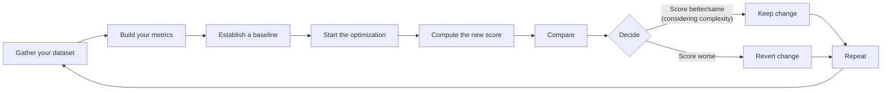
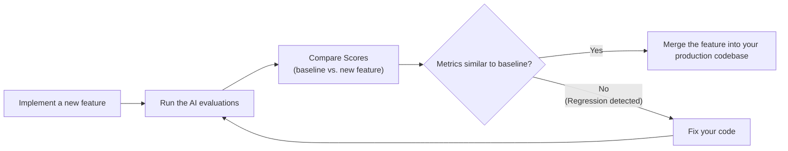

# Evaluation-Driven Development: The North Star of AI Engineering

In our last lessons, we instrumented our agents with observability tools like Opik and built our first offline datasets for evaluation. We now have the raw materials: the traces and the test cases. The next step is to design the metrics that will bring meaning to this data. This lesson provides the theoretical framework for evaluation-driven development (EDD), the north star for all AI engineering.

In classical machine learning, evaluation is a rigorous, non-negotiable discipline. We would never ship a classification model without first measuring its accuracy, precision, recall, and F1 score. Yet, in the world of AI engineering, many teams rely on "vibe checks." An engineer runs a few prompts, inspects the output, and declares, "This feels more coherent." This intuition-driven approach is one of the main reasons so many AI projects get stuck in proof-of-concept purgatory.

Investing in a robust evaluation layer can feel like a detour. It does not deliver an immediate, user-visible feature. It requires upfront effort to design datasets and metrics, competing with the constant pressure to ship. However, this investment pays dividends by dramatically accelerating long-term development. It replaces subjective guesswork with an objective signal, catching regressions instantly and focusing your efforts on changes that demonstrably improve the system. Evals are the single source of truth that tells you what is working and what is not.

This lesson will establish the core principles of a sound evaluation strategy. We will cover:

*   The optimization flywheel and its three core use cases.
*   The trade-offs between different metric types for unstructured outputs.
*   Why custom business metrics are superior to public benchmarks and generic scores.
*   Why binary pass/fail judgments provide a clearer signal than Likert scales.

With the problem and its importance clear, we will now examine how to operationalize evals inside a repeatable optimization flywheel that replaces intuition with evidence.

## Using Evals Through the Optimization Flywheel

To build intuition, let's examine how we can effectively use and integrate AI evaluations into our application development lifecycle. There are three core scenarios where evaluations provide value.

First, evals **quantify the quality of your system** on a set of given metrics, snapshotting a baseline of current system quality. Without a baseline, you cannot know if your system is ready for production or if your changes are actually improving it. Second, these metrics serve as **guidance when optimizing your system**, providing objective evidence for experiments. This shifts development from being intuition-based to evidence-based. Finally, evals act as **regression tests** that protect shared components from breaking. This is critical in AI engineering, where prompts, tools, and retrieval strategies are often interconnected and a small change in one area can have unintended consequences elsewhere [[1]](https://www.growthbook.io/blog/ai-evals-vs-a-b-testing-why-you-need-both-to-ship-genai).

### The Optimization Process

How does this look in a real-world scenario? Let's look at a step-by-step plan for the optimization flywheel. This process provides a structured way to iterate on your AI system, ensuring that every change is measured and validated [[2]](https://galileo.ai/blog/nvidia-data-flywheel-for-de-risking-agentic-ai), [[3]](https://www.nvidia.com/en-us/glossary/data-flywheel).

The flywheel follows an eight-step cycle:

1.  **Gather your dataset:** Assemble an offline dataset that covers key scenarios and edge cases for your application.
2.  **Build your metrics:** Define a set of business-aligned metrics that measure the desired qualities of your system's output.
3.  **Establish a baseline:** Run your evaluation suite on the current version of the system to compute baseline scores.
4.  **Start the optimization:** Make one, isolated change that you hypothesize will improve performance.
5.  **Compute the new score:** Re-run the entire evaluation suite on the modified system.
6.  **Compare:** Compare the new scores to the baseline, considering statistical significance in the context of your business goals.
7.  **Decide:** Based on whether the score is better, the same, or worse, decide to keep the change, revert it, or investigate further.
8.  **Repeat:** Continue this cycle, making one change at a time, until the scores meet your target for production.

Image 1: The iterative optimization flywheel for AI applications using evaluations.

It is critical to change only one variable per cycle. If you modify the prompt, the retrieval strategy, and the model all at once, you create confounding variables. It becomes impossible to attribute any score changes to a specific modification, turning your disciplined process back into guesswork. This discipline is especially important because agentic systems are probabilistic, not deterministic; the same input can lead to different outcomes [[4]](https://www.datarobot.com/blog/agentic-ai-enterprise-design). In highly interconnected multi-agent systems, this challenge is magnified, as a single change can cause cascading failures or unpredictable emergent behaviors, making it difficult to isolate impact [[5]](https://arxiv.org/html/2505.10468v1).

Furthermore, a "better" score is always relative to your business impact. A statistically significant improvement might not be practically significant. For a high-volume customer support bot processing millions of queries, a 0.5% reduction in checkout errors could translate to thousands of fewer support tickets and save hundreds of thousands of dollars [[6]](https://www.nngroup.com/articles/practical-significance). In this context, even small movements matter. Conversely, for a low-volume creative writing tool, a similar small improvement might be imperceptible to users and not justify the engineering cost. Always anchor your definition of "better" to what delivers tangible value.

### Regression Testing

A powerful variation of this flywheel is using evaluations for regression testing. Before merging any feature that touches shared components—prompts, tool definitions, orchestration logic—you run the full eval suite to guard against unintended breakage. This is a powerful technique to ensure new features do not degrade existing functionality [[7]](https://towardsdatascience.com/stop-evaluating-llms-with-vibe-checks).

This approach borrows from established software testing practices, but with a critical distinction. Traditional tests validate deterministic systems where the same input always produces the same output. AI agents are non-deterministic, so evaluation must shift from checking for exact output matches to validating probabilistic behavior and reasoning processes [[8]](https://datagrid.com/blog/4-frameworks-test-non-deterministic-ai-agents). AI systems fail in ways traditional software does not, such as plausible-sounding hallucinations, which no unit test can catch [[9]](https://agility-at-scale.com/ai/architecture/evaluation-and-testing-frameworks).

The process can be adapted into five steps, often integrated into a Continuous Integration (CI) pipeline:

1.  **Implement a new feature:** You write the code and verify it works locally for the new use case.
2.  **Run the AI evaluations:** The CI server automatically runs the full suite of evaluations, covering all existing use cases.
3.  **Compare Scores:** The pipeline compares the new scores against the established baseline from the main branch.
4.  **Metrics similar to baseline?** If scores are stable or improved, the change is safe to merge.
5.  **Metrics lower than the baseline?** If scores have dropped, a regression has been introduced. The merge is blocked until the code is fixed and the evaluations pass.

Image 2: Integrating AI evaluations into CI pipelines for regression testing.

This treats evaluations like integration tests, but instead of a strict pass/fail threshold, you compare scores against a moving baseline. The key to this process is that your evaluation dataset must continuously evolve. Every time a new feature is added, you should expand the dataset with examples that cover its specific edge cases. Failures found in production, captured via observability tools like Opik, should also be converted into new test cases [[10]](https://www.comet.com/docs/opik/evaluation/advanced/manage_datasets). This way, instead of writing new tests in code, you broaden your test coverage by adding new samples to your dataset.

As systems become more agentic, this evaluation must also evolve from assessing the final output to inspecting the entire execution trajectory. Metrics need to capture not just the quality of the answer, but also the coherence of the reasoning, the accuracy of tool selection, and the agent's ability to recover from errors [[11]](https://arxiv.org/html/2512.12791v2). This system-level assessment ensures you are validating the entire process, not just one part of it [[12]](https://vectorinstitute.ai/agentic-ai-evaluation-strategies).

With the mechanics of the flywheel clear, we can now examine the different families of metrics we might plug into it when dealing with unstructured outputs.

## Exploring Possible Metric Types

The core challenge in evaluating LLM applications is that their outputs are often unstructured text, reasoning traces, or even images. The evaluation of such outputs has evolved rapidly, with LLM-as-a-judge gaining traction once models like GPT-4 became powerful enough for the task [[13]](https://cameronrwolfe.substack.com/p/llm-as-a-judge). Unlike classical ML with its clean, structured labels, we cannot use standard metrics like accuracy directly. Instead, we must choose from families of metrics designed for these more complex data types.

### 1. BLEU and ROUGE

The most traditional metrics are based on n-gram overlap. **BLEU (Bilingual Evaluation Understudy)** measures precision by comparing the n-grams in the generated text to those in a reference text. **ROUGE (Recall-Oriented Understudy for Gisting Evaluation)** focuses on recall, making it better for summarization tasks [[14]](https://plainenglish.io/blog/evaluating-nlp-models-a-comprehensive-guide-to-rouge-bleu-meteor-and-bertscore-metrics-d0f1b1).

These metrics are fast, deterministic, and widely understood. However, their reliance on lexical overlap is also their biggest weakness. They are blind to semantic meaning. A response that is a perfect paraphrase of the reference will be penalized, while one that stuffs keywords out of context might score well [[15]](https://wandb.ai/ai-team-articles/llm-evaluation/reports/LLM-evaluation-benchmarking-Beyond-BLEU-and-ROUGE--VmlldzoxNTIzMTY0NQ). They also do not care about factual accuracy.

### 2. BERTScore

Embedding similarity metrics like **BERTScore** offer an improvement. They work by embedding both the generated and reference texts into a high-dimensional vector space using a model like BERT. By calculating the cosine similarity between these embeddings, they can capture semantic closeness, not just lexical overlap [[16]](https://spotintelligence.com/2024/08/20/bertscore/). This allows them to correctly identify paraphrases and semantically equivalent statements as high-quality.

While this is a significant step up, BERTScore is still a comparison metric. It tells you how similar the output is to a reference, but it cannot verify if the output follows complex business rules or logical constraints.

### 3. LLM Judges

The most flexible and powerful approach is the **LLM-as-a-judge**. This involves using a capable LLM (like GPT-4 or Claude 3 Opus) to evaluate an output based on a detailed set of criteria, few-shot examples, and chain-of-thought reasoning [[17]](https://www.braintrust.dev/articles/what-is-llm-as-a-judge). This method allows you to evaluate subjective qualities like tone, creativity, or adherence to brand voice, and to check for compliance with complex, domain-specific guidelines.

However, this flexibility comes with trade-offs. LLM judges can be slower and more expensive than other metrics. Their performance is highly dependent on the quality of the prompt and the judge model itself, and they can inherit the biases of the underlying LLM, such as a preference for longer answers [[13]](https://cameronrwolfe.substack.com/p/llm-as-a-judge). However, these biases can be mitigated through careful calibration. By providing the judge with a set of human-verified, few-shot examples, you can align its judgments with your specific quality criteria and correct for issues like verbosity preference [[18]](https://www.langchain.com/resources/llm-as-a-judge). We will explore how to build and calibrate them in the next lesson.

| Metric Type | Speed | Cost | Semantic Awareness | Business Alignment | Explainability |
| :--- | :--- | :--- | :--- | :--- | :--- |
| **BLEU/ROUGE** | High | Low | Low | Low | Medium |
| **BERTScore** | Medium | Medium | High | Medium | Low |
| **LLM Judges** | Low | High | Very High | Very High | High |
Table 1: A comparison of trade-offs between different evaluation metric families.

For the complex requirements of our capstone writing agent, such as guideline adherence and research grounding, LLM judges are the most practical choice.

You kept hearing from us: *"business metrics here, business metrics there"*. Thus, let's understand why defining your own business metrics is such an essential and underrated step in building your AI evals strategy.

## Why Business Metrics Over Benchmarks

It is a common mistake to use public benchmarks and leaderboards to make product decisions. While they appear to offer an objective measure of model capability, they are often deceiving and can lead you to choose the wrong model for your application.

First, public benchmarks often function as marketing artifacts. Once a test set is released, models can be trained or fine-tuned specifically on that data, a phenomenon known as "teaching to the test" [[19]](https://world.hey.com/bhari/ai-benchmark-scores-are-becoming-marketing-dynamic-eval-is-the-only-antidote-dedd7053). This leads to inflated scores that do not reflect a model's true, generalizable reasoning ability. Some studies have shown that high scores on benchmarks do not consistently translate into a superior user experience, revealing a gap between benchmark performance and practical utility due to this overfitting [[20]](https://openreview.net/forum?id=XbVMiW0jTM).

Second, there is a fundamental mismatch between the tasks in most benchmarks and the realities of a business workload. A model that excels at solving grade-school math problems (like those in GSM8k) may not be the best choice for generating empathetic customer support responses or performing nuanced legal analysis [[21]](https://magazine.sebastianraschka.com/p/llm-evaluation-4-approaches), [[22]](https://arxiv.org/html/2601.20617v1).

The proper role for benchmarks is narrow. They are useful for advancing academic research and for initial model filtering during the exploratory phase of a project. They should never be the primary optimization target or the basis for a final product decision [[23]](https://www.evidentlyai.com/llm-guide/llm-benchmarks).

If benchmarks are misleading, generic prefab metrics that claim to measure universal qualities are even more dangerous. We must instead build metrics that are deeply tied to our specific application.

## Why Custom Business Metrics Over Generic Metrics

Generic, off-the-shelf metrics for qualities like "helpfulness," "toxicity," or "faithfulness" create a mirage of progress. They feel objective, they produce a score, but they optimize for the wrong signal and can build false confidence because they lack the context of your specific product, users, and brand voice [[24]](https://www.linkedin.com/posts/shivanshu-aggarwal_evals-aievals-llm-activity-7375884554177449985-16kP), [[25]](https://www.decodingai.com/p/the-mirage-of-generic-ai-metrics).

A model can score brilliantly on "helpfulness" but fail catastrophically on your specific constraints. Consider the dashboard below. It looks impressive, with scores for "Truthfulness" and "Personalization." But what does a 3.7 in "Personalization" actually mean?

https://images.spr.so/cdn-cgi/imagedelivery/j42No7y-dcokJuNgXeA0ig/585bb9f6-0bf3-427f-a9d3-994dd5849a1a/322c2e07-ee9a-4139-b51d-8f0c4787d880_1600x822/w=1920,quality=90,fit=scale-down
Image 3: A dashboard showing generic metrics like Helpfulness and Truthfulness, labeled "Don't Do This!" [[26]](https://www.decodingai.com/p/the-5-star-lie-you-are-doing-ai-evals).

For example, let's assume we want to check if the article written by our Brown agent contains hallucinations. If we use a generic `hallucination` score and it returns "positive," what does that tell us? Did it invent information not present in the research? Did it deviate from the article guidelines? Or did it simply include a personal story that was factually correct and relevant, but not in the source text? A generic detector might flag an engaging personal anecdote as a fabrication, yet that same anecdote might be exactly what your brand voice requires. The generic metric cannot distinguish between undesirable invention and desirable creative elaboration.

Prefab scores are limited by their absence of domain-specific constraints, their inability to localize which part of an output failed, and the statistical noise they introduce into your decision-making.

This does not mean they are entirely useless. Their valid role is during exploratory data analysis, where they can act as a "flashlight" to surface interesting examples for manual review, but never as the primary optimization target [[25]](https://www.decodingai.com/p/the-mirage-of-generic-ai-metrics). Here are a few useful examples:

1.  **Verbosity:** Sorting your outputs by length can reveal if your most verbose answers are rambling and unhelpful or if your shortest answers are curt and missing information. This helps you spot failure modes in long-form generation.
2.  **Similarity Score:** You can use this to evaluate your RAG retriever. If the similarity between the user query and the retrieved chunks is low, your retriever is likely failing. This is a valid component-level check.
3.  **BERTScore:** This can be used to check the quality of your golden reference answers. If a cluster of outputs has a low BERTScore against a reference you expected to be good, you might discover that the LLM found a more creative or even better solution than your reference.

Every production metric must be deeply application-centric, derived from concrete product requirements, user success criteria, and explicit constraints.

Once we have rejected both benchmarks and generic metrics, the remaining design choice is how to elicit judgments from our LLM judge. Here, binary pass/fail criteria outperform every alternative.

## Choosing Binary Metrics Over Anything Else

When designing these custom metrics, you will face a choice: should you use a Likert scale (e.g., 1-5 stars) or a binary pass/fail judgment? We strongly recommend **binary metrics** [[26]](https://www.decodingai.com/p/the-5-star-lie-you-are-doing-ai-evals).

The problem with Likert scales is threefold:

1.  **Inconsistent Labeling:** The difference between a '3' and a '4' is subjective. One person's '4' is another's '3', leading to low inter-annotator agreement and noisy data [[27]](https://www.decodingai.com/p/the-5-star-lie-you-are-doing-ai-evals).
2.  **Statistical Noise:** Small movements in an average score are often statistically indistinguishable from random noise. Detecting a meaningful improvement from 3.2 to 3.5 on a Likert scale can require more than double the sample size needed to confidently detect a shift in a binary pass rate from 60% to 70% [[28]](https://www.ellamind.com/blog/binary-vs-likert-scales).
3.  **Lazy Decision-Making:** Faced with uncertainty, human and LLM judges tend to gravitate toward the middle value. This creates a "mushy middle" where most ratings cluster, drowning out the signal and hiding real failure modes. This behavior avoids a hard decision rather than making one [[28]](https://www.ellamind.com/blog/binary-vs-likert-scales).

Binary evaluations work because they **force decisions**. An output either met a specific criterion or it did not. This clarity provides several advantages:

1.  **Clearer Thinking:** You cannot hide in ambiguity. This forces you to create precise, unambiguous definitions of quality.
2.  **Consistency:** Binary decisions are faster and more consistent for both human annotators and LLM judges, leading to higher-quality labels.
3.  **Actionability:** The output is not a fuzzy number but a clear signal tied to a specific failure mode. A spike in the "Constraint Violation" failure rate tells an engineer exactly where to start debugging.

Furthermore, binary judgments pair naturally with explanations. A "Fail" rating is most useful when accompanied by a reason, providing a specific diagnosis for debugging and improving the judge's alignment with human criteria [[28]](https://www.ellamind.com/blog/binary-vs-likert-scales).

<aside>
💡
**Note:** The three points above translate exceptionally well to LLM Judges. Using binary scoring is a key design choice to mitigate the inherent randomness of LLMs. LLMs are much more stable when asked to make a binary decision than when asked to assign a scalar value. A binary metric translates to a more robust and repeatable evaluation pipeline.

</aside>

### Capturing Nuance

The standard objection to binary evals is the perceived loss of nuance. "What if a response is partially correct? A 'Fail' seems too harsh."

The right way to capture nuance is not by making your scale fuzzier, but by making your criteria more **granular**. Instead of a single, subjective 1-5 rating for "Quality," you decompose it into multiple, specific, binary checks [[28]](https://www.ellamind.com/blog/binary-vs-likert-scales).

For our writing agent, instead of rating an article 1-5 for "Quality," we can create multiple binary evaluations that capture specific dimensions:

1.  **Content Adherence:** Does the generated article contain the same core concepts as the expected article? (Yes/No)
2.  **Flow of Ideas Adherence:** Does the generated article present ideas in the same order as the expected article? (Yes/No)
3.  **Article Guideline Adherence:** Does the generated article follow the flow of ideas from the article guideline input? (Yes/No)
4.  **Research Anchoring:** Is every claim in the article supported by the provided research? (Yes/No)
5.  **Tool Use Success:** Did the agent select and use the correct tools without errors? (Yes/No) [[29]](https://bhargavaparv.medium.com/architecting-autonomous-ai-systems-a-comprehensive-guide-to-agents-tool-calls-and-agent-skills-731d5576d557)

By aggregating these binary signals, you get a nuanced, multi-dimensional view of performance without the noise and subjectivity of a Likert scale. This approach is simple, scalable, and robust for production systems.

With the full theoretical picture in place, we can now summarize the mindset shift required and preview the hands-on implementation that follows in the next lesson.

## Conclusion

This lesson has laid out the case for a fundamental shift in how we approach AI engineering: moving away from vibe checks, leaderboards, and generic scores toward a rigorous practice of evaluation-driven development. This practice is built on a foundation of custom, binary, and business-aligned metrics that provide a clear, actionable signal for improvement.

By embracing granular pass/fail criteria, you eliminate the statistical noise and subjectivity inherent in scalar ratings, allowing you to iterate with confidence. In our next lesson, we will translate this theory into practice as we implement custom LLM judges from scratch to evaluate our Brown writing workflow, turning these principles into a working evaluation pipeline.

## References

- [1] AI Evals vs. A/B Testing: Why You Need Both to Ship GenAI. (n.d.). GrowthBook. https://www.growthbook.io/blog/ai-evals-vs-a-b-testing-why-you-need-both-to-ship-genai
- [2] A Powerful Data Flywheel for De-Risking Agentic AI. (n.d.). Galileo. https://galileo.ai/blog/nvidia-data-flywheel-for-de-risking-agentic-ai
- [3] Data Flywheel. (n.d.). NVIDIA. https://www.nvidia.com/en-us/glossary/data-flywheel
- [4] Agentic AI in the Enterprise: A New Design Foundation. (n.d.). Datarobot. https://www.datarobot.com/blog/agentic-ai-enterprise-design
- [5] Challenges in Agentic AI: A Review of Recent Advances and Future Directions. (2025, May). arXiv. https://arxiv.org/html/2505.10468v1
- [6] Practical Significance: What It Is and How It Differs From Statistical Significance. (2022, November 20). Nielsen Norman Group. https://www.nngroup.com/articles/practical-significance
- [7] Shankar, S. (2024, May 21). Stop evaluating LLMs with vibe checks. Towards Data Science. https://towardsdatascience.com/stop-evaluating-llms-with-vibe-checks
- [8] 4 Frameworks to Test Non-Deterministic AI Agents. (n.d.). Datagrid. https://datagrid.com/blog/4-frameworks-test-non-deterministic-ai-agents
- [9] Evaluation and Testing Frameworks for AI Systems. (n.d.). Agility at Scale. https://agility-at-scale.com/ai/architecture/evaluation-and-testing-frameworks
- [10] Manage datasets - Opik Documentation. (n.d.). Comet. https://www.comet.com/docs/opik/evaluation/advanced/manage_datasets
- [11] Evaluating Agentic AI Systems: A Survey and Framework. (2025, December). arXiv. https://arxiv.org/html/2512.12791v2
- [12] Agentic AI Evaluation Strategies. (n.d.). Vector Institute. https://vectorinstitute.ai/agentic-ai-evaluation-strategies
- [13] Wolfe, C. R. (2023, July 24). LLM As A Judge. https://cameronrwolfe.substack.com/p/llm-as-a-judge
- [14] Mansuy, R. (2023, September 20). Evaluating NLP Models: A Comprehensive Guide to ROUGE, BLEU, METEOR, and BERTScore Metrics. PlainEnglish.io. https://plainenglish.io/blog/evaluating-nlp-models-a-comprehensive-guide-to-rouge-bleu-meteor-and-bertscore-metrics-d0f1b1
- [15] LLM Evaluation: Benchmarking Beyond BLEU and ROUGE. (n.d.). Weights & Biases. https://wandb.ai/ai-team-articles/llm-evaluation/reports/LLM-evaluation-benchmarking-Beyond-BLEU-and-ROUGE--VmlldzoxNTIzMTY0NQ
- [16] Van Otten, N. (2024, August 20). BERTScore explained: A modern metric for evaluating text generation. Spot Intelligence. https://spotintelligence.com/2024/08/20/bertscore/
- [17] What is LLM-as-a-Judge? (n.d.). Braintrust. https://www.braintrust.dev/articles/what-is-llm-as-a-judge
- [18] LLM as a judge. (n.d.). LangChain. https://www.langchain.com/resources/llm-as-a-judge
- [19] Hari, B. (2026, April 26). AI — Benchmark scores are becoming marketing; dynamic eval is the only antidote. HEY World. https://world.hey.com/bhari/ai-benchmark-scores-are-becoming-marketing-dynamic-eval-is-the-only-antidote-dedd7053
- [20] PROBE: BENCHMARKING REASONING PARADIGM OVERFITTING IN LARGE LANGUAGE MODELS. (2025). OpenReview. https://openreview.net/forum?id=XbVMiW0jTM
- [21] Raschka, S. (2024, June 10). 4 Approaches for LLM Evaluation. Ahead of AI. https://magazine.sebastianraschka.com/p/llm-evaluation-4-approaches
- [22] Benchmarks for LLM-based Public Sector Agents. (2026, January). arXiv. https://arxiv.org/html/2601.20617v1
- [23] 30 LLM evaluation benchmarks and how they work. (2026, May 19). Evidently AI. https://www.evidentlyai.com/llm-guide/llm-benchmarks
- [24] Aggarwal, S. (2026, August 20). AI evaluation is broken when we hide behind generic metrics. LinkedIn. https://www.linkedin.com/posts/shivanshu-aggarwal_evals-aievals-llm-activity-7375884554177449985-16kP
- [25] Husain, H. (2025, September 25). The Mirage of Generic AI Metrics. Decoding AI. https://www.decodingai.com/p/the-mirage-of-generic-ai-metrics
- [26] Husain, H. (2025, October 2). The 5-Star Lie: You’re Doing AI Evaluations Wrong. Decoding AI. https://www.decodingai.com/p/the-5-star-lie-you-are-doing-ai-evals
- [27] Iusztin, P. (2025, October 2). The 5-Star Lie: You’re Doing AI Evaluations Wrong. Decoding AI. https://www.decodingai.com/p/the-5-star-lie-you-are-doing-ai-evals
- [28] Binary vs. Likert Scales: Which Is Better for AI Evaluation? (n.d.). Ellamind. https://www.ellamind.com/blog/binary-vs-likert-scales
- [29] Parvataneni, B. (2024, June 14). Architecting Autonomous AI Systems: A Comprehensive Guide to Agents, Tool Calls, and Agent Skills. Medium. https://bhargavaparv.medium.com/architecting-autonomous-ai-systems-a-comprehensive-guide-to-agents-tool-calls-and-agent-skills-731d5576d557
- [30] Abdella, A. (2026, July 10). LLM as a Judge is scalable, cost-effective, good at understanding open-ended AI-generated content. LinkedIn. https://www.linkedin.com/posts/allaabdella_llm-aijudge-genai-activity-7353053642590932994-s3sw
- [31] Bowne-Anderson, H. (2025, October 30). Stop Launching AI Apps Without This Framework. Decoding AI. https://www.decodingai.com/p/stop-launching-ai-apps-without-this
- [32] Bowne-Anderson, H., & Krawczyk, S. (2025, October 16). Escaping POC Purgatory: Evaluation-Driven Development for AI Systems. Decoding AI. https://www.decodingai.com/p/escaping-poc-purgatory-evaluation
- [33] BLEU and ROUGE. (n.d.). Galileo. https://docs.galileo.ai/concepts/metrics/expression-and-readability/bleu-and-rouge
- [34] CloudResearch. (n.d.). What Is Statistical Significance? https://www.cloudresearch.com/resources/guides/statistical-significance/what-is-statistical-significance
- [35] Corporate Finance Institute. (n.d.). Statistical Significance. https://corporatefinanceinstitute.com/resources/data-science/statistical-significance
- [36] Demystifying the BLEU Metric. (n.d.). Traceloop. https://www.traceloop.com/blog/demystifying-the-bleu-metric
- [37] Elastic. (n.d.). Evaluating RAG: A Practical Guide to Evaluation Metrics. https://www.elastic.co/search-labs/blog/evaluating-rag-metrics
- [38] Evaluating the Effectiveness of LLM-Evaluators (aka LLM-as-Judge). (2025, July 3). Eugene Yan. https://eugeneyan.com/writing/llm-evaluators/
- [39] Evidence-Based Prompting Strategies for LLM-as-a-Judge: Explanations and Chain-of-Thought. (n.d.). Arize. https://arize.com/blog/evidence-based-prompting-strategies-for-llm-as-a-judge
- [40] From vibe checks to continuous evaluation: Engineering reliable AI agents. (2024, June 25). Google Cloud Blog. https://cloud.google.com/blog/topics/developers-practitioners/from-vibe-checks-to-continuous-evaluation-engineering-reliable-ai-agents
- [41] Human Evaluation Metrics in AI: A Guide. (n.d.). Galileo. https://galileo.ai/blog/human-evaluation-metrics-ai
- [42] Husain, H. (2025, October 11). Using LLM-as-a-Judge For Evaluation: A Complete Guide. Hamel's Blog. https://hamel.dev/blog/posts/llm-judge/
- [43] Iusztin, P. (2025, November 11). Generate Synthetic Datasets for AI Evals. Decoding AI. https://www.decodingai.com/p/generate-synthetic-datasets-for-ai-evals
- [44] Key NLP Evaluation Metrics. (2024, November). Datumo. https://datumo.com/en/blog/insight/key-nlp-evaluation-metrics/
- [45] LaunchDarkly. (2024, May 1). LLM Evaluation: Techniques, Tools, and Metrics. https://launchdarkly.com/blog/llm-evaluation
- [46] Likert Scale: Examples and how to use it. (n.d.). InMoment. https://inmoment.com/blog/likert-scale/
- [47] Likert Scale: What It Is & How to Use It. (2023, June 22). Scribbr. https://www.scribbr.com/methodology/likert-scale/
- [48] LLM-as-a-Judge. (n.d.). Arize. https://arize.com/llm-as-a-judge
- [49] LLM-as-a-judge. (n.d.). Evidently AI. https://www.evidentlyai.com/llm-guide/llm-as-a-judge
- [50] LLM-as-a-Judge vs. Human Evaluation: Which is Right for You? (n.d.). Galileo. https://galileo.ai/blog/llm-as-a-judge-vs-human-evaluation
- [51] LLM-as-a-Judge: When to Use Reasoning (CoT) and Explanations. (2024, May 24). Data Science Collective. https://medium.com/data-science-collective/llm-as-a-judge-when-to-use-reasoning-cot-and-explanations-964ad82ebc3d
- [52] LLM Evaluation: From Classic Metrics to Modern Methods. (n.d.). Toloka. https://toloka.ai/blog/llm-evaluation-from-classic-metrics-to-modern-methods
- [53] Masood, A. (2024, July 17). Rubric-Based Evals, LLM-as-a-Judge Methodologies, and Empirical Validation in Domain Context. Medium. https://medium.com/@adnanmasood/rubric-based-evals-llm-as-a-judge-methodologies-and-empirical-validation-in-domain-context-71936b989e80
- [54] Meta-evaluation of Text-based Metric. (2025, August). arXiv. https://arxiv.org/html/2508.13816v1
- [55] Olshansky, A. (2024, April 19). Vibe checks are all you need. https://olshansky.substack.com/p/vibe-checks-are-all-you-need
- [56] Quirk's. (n.d.). Effective uses of effect-size statistics to demonstrate business value. https://www.quirks.com/articles/effective-uses-of-effect-size-statistics-to-demonstrate-business-value
- [57] Sthanikam, S. (2023, May 22). Understanding BLEU and ROUGE score for NLP evaluation. Medium. https://medium.com/@sthanikamsanthosh1994/understanding-bleu-and-rouge-score-for-nlp-evaluation-1ab334ecadcb
- [58] Statsig. (n.d.). Understanding Statistical Significance. https://www.statsig.com/perspectives/understanding-statistical-significance
- [59] Why "LLM-as-a-Judge" is the Best LLM Evaluation Method. (n.d.). Confident AI. https://www.confident-ai.com/blog/why-llm-as-a-judge-is-the-best-llm-evaluation-method